# 11 状态监测及故障诊断

本章介绍了风力发电机组的常见故障及原因、状态监测及故障诊断的方法，叙述了以双馈式风力发电机组为监测对象的在线监测及故障诊断系统的结构组成、功能模块及应用。

## 第一节 常见故障及诊断方法

### 一、常见故障

风力发电机组的故障多发生在主轴、齿轮箱、联轴器、发电机、变桨距机构及塔架部位。

表11-1列举了风力发电机组运行中容易出现的故障及其原因。

表11-1 风力发电机组常见故障及其原因

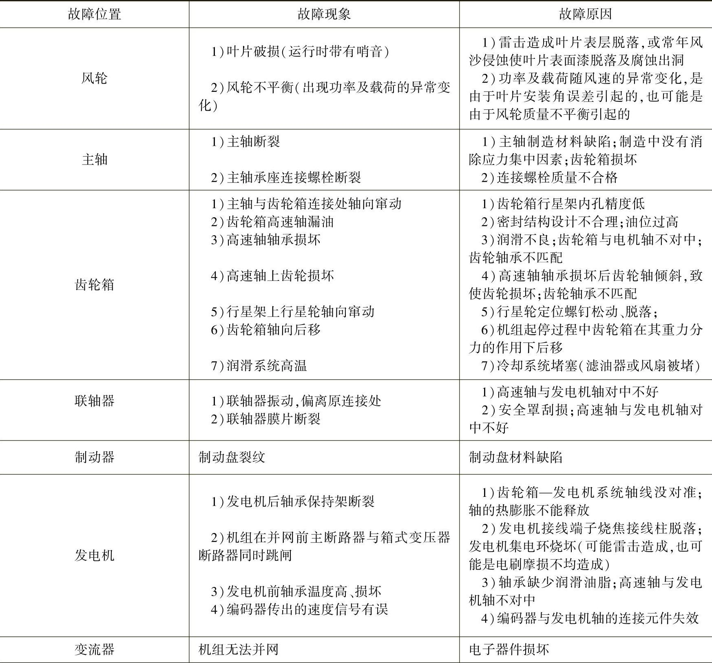

（续）

### 二、状态监测及故障诊断的方法

设备故障诊断是根据设备运行时产生的信息变化规律的不同，识别设备运行状态是否正常，设备诊断过程主要有：获得被检测设备状态的特征信息；从所检测的特征信号中提取征兆；故障的模式识别和诊断决策。

1.特征信息获得与数据采集

故障诊断的首要任务是选择一组对系统状态十分敏感的参数作为故障识别的对象。对于风力发电机组检测诊断方法有：对振动、噪声、铁谱、声发射、电流，电压信号检测以及漏磁检测等。

通过传感器从被诊断的设备或系统中获得原始信息是设备诊断的第一步。在线监测是将传感器永久地安装在机器或设备某—固定部位。这样可以长期获得机器运行的状态参数，并将数据送入数据采集系统和分析系统进行处理。

（1）传感器的安装方式

主要有双头螺纹连接、胶粘单头螺纹连接、磁座连接、双面胶粘接、蜂蜡连接、手持式连接等。在可能的情况下选用双头螺纹连接不仅可靠而且可用于高频测量，是传感器安装方式的首选。但是很多结构上不允许打螺纹孔，则可考虑胶粘单头螺纹连接，这种胶一般为环氧树脂，试验结束后可能会给结构表面的清除工作带来一定的麻烦。但上述两种方法都可用于结构表面温度较高的情况下。双面胶粘接和蜂蜡连接则不适用于结构表面温度超过40℃的情况，当表面温度超过40℃时胶的黏接力很低，传感器无法可靠地安装在结构表面。磁座连接方式是用于导磁体结构，这种安装方式在换测点时非常方便，是进行结构探测（如模态分析试验）的理想安装方式。

（2）传感器的安装位置

由于振动结构各点的响应有很大差别，因此选择适当的安装位置非常重要。一般情况下传感器需避免安装在结构振动的节点或节线上，应尽可能安装在结构响应信号较大的位置，以提高信噪比，提高测试精度；在以测试结构总体模态特性为目的的试验中，传感器应该尽可能避免安装在局部模态贡献大的位置；传感器的选择要充分考虑传感器附加质量对安装结构局部的影响，如果安装局部较轻、较薄，则应该选用体积小、质量轻的传感器，或采用非接触式传感器进行测量。对于结构振动源进行监测的试验中，则应该使传感器安装的位置尽可能接近振动源的直接传递路径，安装方向也必须能够反映振动源振动的方向。测量时应在测量位置上作出标记，每次测量不要改变位置，并注意保持测量部分表面的光滑性。当被测对象是轴承时，测点的选择要实现可以安全、重复地采集数据，在轴承的水平、垂直和轴向三个正交方向上布置测点（见图11-1），测点尽可能靠近轴承的承载区，一个方向因偏离理想位置并不影响其他测点仍保持在理想位置，不在设备外壳、保护罩、轴承座剖分面、设备结构间隙上设置测点。测量时，由于设备构造和安全等方面的限制，有时三个方向不能同时进行测量，这时可在x与z或y与z两个平面方向上进行测量。对于高频振动，一般因无方向性，也可在一个方向上进行。径向（x）：在水平面内，其指向通过轴的轴心线；垂直方向（z）：在铅锤面内，其指向通过轴的轴心线。轴向（y）：在水平面内，其指向与轴的轴线平行，高度与水平测点相同。

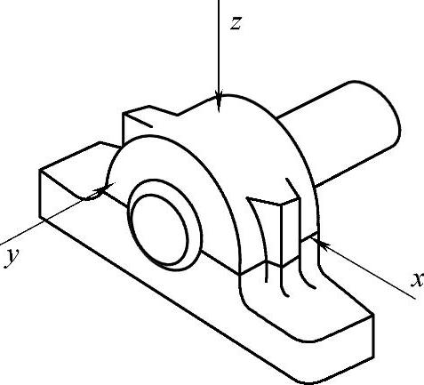

图11-1 传感器测点布置

（3）测量参数的选择

滚动轴承所发生的振动，包含1kHz以下的低频振动和几kHz乃至几十kHz的高频振动。振动的频率范围与故障类型有关，所以用振动信号对轴承的故障进行诊断时，通常选用振动速度或振动加速度作为测量参数。但应注意，利用振动速度或振动加速度所能测出的故障种类是不同的。振动位移是研究强度和变形的重要依据；振动加速度与作用力或载荷成正比，是研究动力强度和疲劳的重要依据；振动速度决定了噪声的高低，人对机械振动的敏感程度在很大频率范围内是由速度决定的。速度又与能量和功率有关，并决定动量的大小。

（4）测量周期的确定

为发现初期异常，需要进行定期测量。测量周期确定的原则是根据劣化的速度，应不至于忽略严重的异常情况，并尽可能缩短。通常先确定一个基本的测量周期，当发现测量数据有变化征兆，就应缩短测量周期，以符合实际情况的需要。如果条件允许，也可采用连续测量。

2.信号处理与特征提取的方法

在线监测系统的信号处理与特征提取需要完成的工作是：利用信号处理手段从大量混杂的现场信号中准确分离故障信号，然后根据故障机理来判断故障的部位及程度。因此，为得到可靠的故障诊断结果，信号处理与故障数据的特征提取是相当重要的，而要取得良好的信号分析效果，所采用的信号分析方法也是非常重要的。对于能直接由仪器读出数据的缓变信号，如温度信号、油液参数等，读出的数据实际上就是特征值，因此它们不需要另外再提取特征了。而大多数由传感器上获得的信息往往都是各种物理量（应力、位移、速度、电流、噪声等）的动态波形，而这些动态波形往往又是由很多幅值、频率、相位不同的波形混叠而成，为了分解信号内的各种频率成分的有效值，全面地揭示动态波形中包含的信息，必须对信号进行加工处理。在信号的分析处理方面，除了时域分析、频域分析、幅值域分析等，近来又发展了时频域分析、时序模型分析、参数辨识、频率细化、倒谱分析、共振解调分析、三维全息谱分析、轴心轨迹分析以及基于非平稳信号假设的短时傅里叶变换，Wigner分布和小波变换等技术。

（1）在线监测特征信息的提取

风力发电机组在线监测的物理量主要有温度、振动、冲击、油液杂质等。

温度的监测是监测被测点（主要是轴承）温度和齿轮箱油温的变化，从而判断其本身或周边部件是否存在故障。主要使用铂电阻、数字测温器件等，有绝对温升报警和相对温升报警两种方式，目前风力发电机组在出厂时已在主要轴承位置均已安装温度传感器。

振动的监测可以分为机舱整体振动监测和部件振动监测。主要使用限位开关、加速度、速度或位移传感器。机舱整体振动监测是监测风力发电机组机舱整体振动，当其超过设定阈值后自动停机保护。此类监测属于重大故障监测，但其无法分清故障原因，并对倒塔这类重大事故预警不足。目前，风力发电机组在出厂时均已配备，最常用的是限位开关。部件振动监测是监测机组各部件的振动加速度、速度或位移等信息，其值超过设定阈值后即报警或提示，但无法自动定位到故障发生的具体部件和部位，需人工分析后方能确认。另外，轴不对中、转子不平衡以及设备共振等监测多用振动信息。目前，最常用的是振动加速度、速度或位移传感器以及电涡流位移传感器。常用的振动信号分析方法有振幅值诊断法、波形因素诊断法、波峰因素诊断法、概率密度诊断法、峭度系数诊断法、振平诊断法等。

冲击的监测是提取旋转机械（如轴承、齿轮）局部损伤激发的机械冲击信号，实现准确定位故障部件、部位和故障程度。主要使用冲击传感器或振动加速度、位移传感器。对于非旋转机械，如塔架，监测其由外部激励引起的冲击信号，实现对塔架等非旋转机械的裂纹、松动等故障诊断。但其对轴不对中、转子不平衡以及设备共振等监测能力不如振动信息。目前，最常用的是冲击传感器或振动加速度传感器。常用的冲击信号分析技术有：广义共振/共振解调技术、包络检测技术等。

油液监测是监测油液中的金属杂质，间接判断运转部件是否有故障。

从上述比较可以看出：仅用温度监测是不够的，振动、冲击监测互有优缺点。因此，为更全面的监测设备的状态，建议采用多物理量监测的方式。在监测过程中可以利用提取的信号（故障特征频率信号）波形直接对故障做出诊断，但这种分析对比较典型的信号或特别明显的信号以及较有经验的人员比较有效，除此可以利用指标因数进行监测、诊断，指标因数也是时域分析的一种。指标因数包括有量纲指标（如：均值、方均根值、有效值、方差、标准差、峰值）和无量纲指标（如：波形指标、峰值指标、脉冲指标、裕度指标和峭度指标）。有量纲指标往往是设备振动能量的反映，而无量纲指标则不受设备运行工况（包括负荷、转速、环境条件等）的影响，对早期故障具有很好的诊断能力。其中峭度指标、波形指标、峰值指标和裕度指标，以及功率谱重心指标广泛用于状态监测与故障诊断。

1）峭度指标： 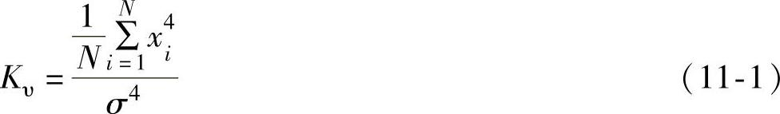

式中 N——数据长度；

σ——标准差。

峭度指标是反映信号偏离正态分布程度的一个指标，它对信号中的冲击成分特敏感，并且其值与输入轴转速、齿轮箱各零部件尺寸以及负载无关。这也是时域无量纲指标的一个共同特点。

2）波形指标： 

式中 X_(p)——峰值，表示某时刻振动幅值的最大值；

X_(rms)——有效值，反映了振动信号能量的大小，其表达式为

波形指标适用于点蚀类故障，能对早期故障进行预报，并能反映故障的发展趋势。当齿轮箱无故障时，波形指标为一较小的稳定值；一旦发生点蚀类故障，产生冲击信号，振动峰值增大，而有效值尚无明显增大，故波形指标增大；当故障不断扩展时，峰值逐步达到极限，有效值则开始增大，故波形指标逐步减小。

3）峰值指标： 

式中 X——振动信号经绝对值处理后的平均值。

4）裕度指标： 

式中 X_(r)——方根幅值，表达式为

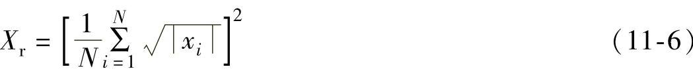

5）功率谱重心指标： 

式中 f_(i)——功率谱所对应的频率值；

p_(i)——功率谱幅值。

功率谱重心指标反映了功率谱重心位置的变化程度。当故障出现时，某些频率的振动幅值将发生变化，会在很大程度上影响功率谱重心位置。当无故障时，频率成分主要集中在低频，F_(cx)小；当出现局部损伤时，由于冲击引起的共振，所以主频区右移，F_(cx)增加。

监测特征值除了具有反映机械部件工作是否出现异常的基本特性外，还应具备计算方便性，这是为了满足专家系统实时监测的需要，并且对转速、环境的变化不敏感。

（2）故障特征信息的提取

故障特征值的选取直接关系到各种故障的判别，所以对它们的要求比监测特征值更高，必须有很好的故障分离性。监测特征值与故障特征值最大的区别在于监测特征值只需要反映监测对象工作是否出现异常，而故障特征值则需要具有反映不同故障的特性。

然而，在实际测试工作中，实际测得的振动信号并非单纯反映某个机械部件状态，而是含有许多成分，例如齿轮箱本身的特征频率，工况状态及载荷信息等，这些成分往往掩盖了齿轮和轴承的特征频率成分，又由于调频调幅现象、共振现象、冲击现象、非线性因素以及耦合叠加等现象的存在。使得提取能够反映齿轮和轴承状态的特征参数极为困难，甚至不可能。很显然，所有的故障特征频率淹没在其他的频率成分之中。此外，由于功率谱的频率分辨率限制，使很多的特征值频率计算机根本识别不出来，从而也限制了使用特征频率进行故障精密诊断。

在信号的分析方法中分析处理的过程越细，计算工作量越大，则难以实现快速的信号提取及故障诊断。在工程实际应用中，在线监测系统的有效分析方法有：包络分析、能量谱分析。

1）包络分析：当齿轮或者轴承元件出现局部损伤时，运行过程中要撞击与之配合的元件表面，将产生脉冲力。由于冲击脉冲力的频带很宽，必然覆盖监测部件的固有频率，从而激起系统的高频固有振动。根据实际情况，可选择某一高频固有振动作为研究对象，通过中心频率等于该固有频率的带通滤波器把该固有振动分离出来，利用Hilbert变换进行包络解调，去除高频衰减振动的频率成分，得到只包含故障特征信息的低频包络信号，对这一包络信号进行频谱分析便可提取齿轮或滚动轴承的故障特征信息。包络分析的原理如图11-2、图11-3所示。

图11-2 包络分析法原理图

图11-3 Hilbert包络解调原理图

2）能量谱分析：能量谱分析同样是一种广泛应用于各种设备的故障诊断中的方法。当用一个含有丰富频率成分的信号作为输入对齿轮传动系统进行激励时，它会改变原来系统输出信号的频谱结构。同样，当故障发生时，它产生的冲击激励会对各频率成分起抑制或增强作用。通常，它会明显地对某些频率成分起抑制作用，而对另外一些频率成分起增强作用。因此，在各频率成分信号的能量谱中，包含着信号丰富的故障信息，从而可以从能量谱图上识别故障。

能量谱描述信号能量沿频率轴的分布情况。能谱的表达式如下：

E=∣FFT（x（t））∣² （11-8）

将频率域划分为N个频带，分别计算各频带能量。当能量较大时，对应的各频带能量值比较大，因此为了计算方便，需要将所有能量值进行归一化。归一化公式为

式中 x_(i)——各频带的能量值；

x_(max)——x_(i)中的最大值；

x_(min)——x_(i)中的最小值，i=1，2……16。

这样便可以将归一化后的值作为故障诊断特征值。

3.故障的模式识别和诊断决策过程

故障诊断就是根据对机器运行状态检测和监测所得的信息，进行趋势分析和故障识别，确定机器运行是否存在故障，以及故障性质和故障部位，做出诊断决策，制定设备维修计划，确定设备继续运行还是停机检修。故障诊断是一个典型的模式识别过程，而诊断文档中的各种故障样板模式就是进行技术状态识别的基础。所谓技术状态识别，是指将待检模式与诊断文档库中的样板模式进行对比，并将待检模式归属到某一已知的样板模式中去的过程。由此便可判定诊断对象所处的状态模式是否正常，并预测其可靠性和状态的发展趋势。

设备故障诊断近几十年来的发展日新月异，主要的诊断理论和方法有以下方面：

（1）基于专家系统的智能诊断方法

专家系统是人工智能的最活跃分支之一，其核心主要包括以下几部分：知识库、知识获取部分、推理机、解释部分。如图11-4所示，其中箭头方向为数据流动的方向。

图11-4 专家系统的基本结构图

1）知识库：用于存储专家系统的知识，供推理机推理使用。知识是以一定的结构存储在知识库中的，这种结构被称为知识表达。目前较为成熟的知识表达方法有：谓词逻辑、产生式规则、特征表、语义网络、框架、剧本。

2）知识获取部分：用于获取知识送到知识库中，并对知识库中知识进行管理和维护。对于经验知识，一般是通过人机对话的形式进行知识编辑，然后将知识转化为知识库的内部形式，较为高级的系统是通过编译实现知识转化的。列于可进行数据处理的数据信号知识，由于知识模式的确定性、还可进行知识的自动获取，一般是通过对样本的修正来实现的。

3）推理机：用于将知识库中的知识与当前状态知识进行匹配，即进行推理，然后给出推理结果。推理方式分为正向推理、反向推理从混合推理，正向推理也称数据驱动推理（见图11-5），是在已知外界初始信息（图11-5中的事实P1）的情况下，与知识库中的各个目标进行匹配，最后求出满意解（图11-5中的q3）；反向推理也称目标驱功推理（见图11-6），它依次假设知识库中的一个目标为待求目标（图11-6中的目标q3），然后不断地从外界获取知识进行验证、直到找到满意解为止（图11-6中的事实P1）；混合推理则是先进行正向推理缩小搜索空间，然后进行反向推理进行求解。

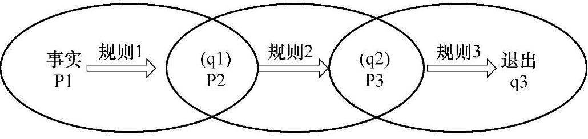

图11-5 正向推理过程示意图

图11-6 反向推理过程示意图

4）解释器：是用来对提出的问题和推理机推理的过程做出明确的解释。

5）专家系统开发环境目前主要分为以下四类：

①采用人工智能语言，如LISP、PROLOG等语言。LISP和PROLOG语言具有回溯递归的功能，可以简化程序的结构，在程序执行的过程中能够自动实现知识的匹配、回溯和搜索，但LISP和PROLOG语言的数值计算功能比较差，而且语言和知识的联系比较紧密，不了解此语言的开发人员很难对知识的实现进行扩充和修改；

②采用高级语言，如C、C++、FORTRAN、PASCAL等。采用这些高级语言开发专家系统，程序设计比较灵活，数值计算较强。但是开发工作量相对比较大，调试程序比较困难；

③采用专家系统开发工具，如EMYCIN等骨架型开发工具，开发成本比较高；

④采用数据库技术和可视化编程语言相结合方式进行开发，数据库采用SQ Server，ACCESS，ORACLE等，可视化编程语言采用VC++、VB、VF等。这种开发方式是随着数据库技术和可视化编程语言的逐步成熟发展起来的，是一种新型的专家系统开发技术。其优点是利用数据库技术可以快速地在知识库中查找知识，利用可视化编程语言能方便地实现递归和回溯功能，同时去除了大量的语句，工作量相对较小，调试程序比较容易，而且人机界面友好。

（2）基于故障树分析法的智能诊断方法

故障树分析法（FTA）是一种将系统故障形成原因按树枝状逐级细化的图形演绎方法，是20世纪60年代发展起来的用于大型系统可靠性、安全性分析和风险评价的一种方法。它通过对可能造成系统故障的各种因素（包括硬件、软件、环境、人为因素等）进行分析，画出逻辑框图（即故障树），再通过对系统故障事件作由总体到部分按树状逐级细化的分析，并对系统进行可靠性、安全性分析，常用于系统的故障分析、预测和诊断，找出系统的薄弱环节，以便在设计、制造和使用中采取相应的改进措施。

FTA以系统最不希望出现的故障状态作为分析的目标（顶事件），找出导致故障的全部因素（中间事件），再寻找出造成中间事件发生的全部因素，按照这种方式一直追溯到引起系统发生故障的全部原因（底事件）将系统的故障与中间事件和底层事件之间的逻辑关系用逻辑门联结起来，形成树形图，以表示系统与产生原因之间的关系；并通过计算找出系统发生故障和不发生故障的各种途径；利用概率论方法计算系统出现故障的概率，评价引起系统故障的各种因素的相关重要度。

1）故障树的建树方法：故障树的建造是FTA法的关键，故障树建造的完善程度将直接影响其定性分析和定量计算的准确型。实际上建树过程常常是一种反复的过程，应广泛吸取和掌握设计、使用等方面的知识和经验，对系统进行仔细、透彻地分析，多次讨论、修改，将会使建造的故障树更加完善。目前还没有一种有效的、统一的建树方法，通常采用演绎法建树。该方法是先选定系统中不希望发生的故障事件为顶事件，其后第一步是找出直接导致顶事件发生的各种可能因素或因素组合，如硬件故障、软件故障、环境因素、人为因素等；第二步再找出第一步中各因素的直接原因。遵循此方法逐级向下演绎，一直追溯到引起故障的全部原因，即分析到不需要继续原因的底事件为止。然后，把各级事件用相应的符号和适合于它们之间逻辑关系的逻辑门与顶事件相连接，就建成了一棵以顶事件为根，中间事件为节，底事件为叶的具体若干级倒置故障树。

2）建树步骤：故障树分析的过程是对系统更深入认识的过程，要求分析人员把握系统的内在联系，弄清各种潜在因素对故障发生影响的途径和程度，以便在分析过程中发现问题，找出零部件故障与系统的逻辑关系，以确定系统的薄弱环节。建树的步骤，如图11-7所示。

图11-7 故障树的建立步骤

3）建树规则：故障树分析法是故障事件在一定条件下的逻辑推理方法。在清晰的故障树图形下，显示出系统故障的内在联系，并反应零部件故障与系统之间的逻辑关系，便于围绕某些特定的故障树状态做层层深入的分析。所以，建树时应遵循：

①建树前应对所分析的系统有深刻的了解，广泛收集有关系统设计运行流程图、设备技术规范等描述系统的技术文件和资料，并进行深入细致的分析研究；

②对故障事件应精确定义，指明是什么故障，在何种条件下发生，即应有唯一解，切忌模棱两可，含糊不清；

③选好顶事件，选择的顶事件必须是能进一步分解的，即可以找出其发生的次级事件，并且能够用数值进行量度。否则，就有可能无法对事件进行分析和计算；

④合理确定系统的边界条件，边界条件包括：确定顶事件、确定初始条件、确定不许可条件以及做出一些必要的假设均可作为系统的边界条件。有了边界条件才能明确故障树建到何处为止；

⑤对系统的各事件的逻辑关系及限定条件必须分清楚，不能产生逻辑关系上的紊乱和限定条件之间的矛盾。

FAT使用的图形符号有事件符号、逻辑符号和转移符号三类，常用的图形符号见表11-2。

表11-2 FAT常用图形符号表

## 第二节 在线监测及故障诊断系统设计

### 一、在线监测系统的功能

风力发电机组运行过程中作用在风轮上的气动载荷一部分以回转机械能的方式由主轴、齿轮箱传递给发电机，另一部分以位移的方式由轴承座传递给塔架。振动现象出现在载荷作用过程的始终。风力发电机组的轴承支撑系统、增速齿轮等传动系统是主要的承载部件，也是故障高发区，当机组零部件存在故障时，必有由故障引起的振动、冲击信号。利用风力发电机组在线监测系统对机组的故障实施监测及诊断，实现早期故障诊断。对将要危及安全的故障零部件发出早期报警，提请视情维修，以防止故障扩大而引起事故和损失。诊断系统功能如下：

1）能够连续监测风力发电机组运行过程中的冲击、振动、转速等参数，并自动存储；

2）在线监测风力发电机组运行时主传动链（主轴、齿轮箱、发电机）上各轴承、齿轮的运行状态，发现轴承、齿箱故障的早期征兆，精确定位故障部件、故障类型以及严重程度，并通过故障诊断专家系统软件自动报警或提示；

3）在线监测风力发电机组运行时主轴、齿轮箱、发电机等部件垂直与水平方向的振动，以及齿轮箱输出轴与发电机输入轴的动态不对中状态，实时绘制振动的时域、频域数据波形和不对中轴心轨迹图；

4）在线监测风力发电机组运行时联轴器的运行状态，发现联轴器的早期失效征兆；

5）具备冲击、振动原始和趋势数据分析功能；

6）具备报警结果与统计分析、报表输出功能；

7）具备机载系统的自检功能。自检内容主要包括机载系统的存储空间信息、网络通信状态、串口通信状态、传感网络状态及内部硬件信息。若自检存在异常，则给出提示信息；

在具备Internet网络条件的情况下，可实现远程监测、数据分析等功能。

### 二、在线监测系统结构设计

这里结合某双馈式风力发电机组的在线监测系统来介绍监测系统的结构设计。风力发电机组诊断系统的机载设备安装在风机机舱与塔筒内，由传感器、前置处理器（传动链信息采集器、塔架和风轮信息采集器）、机载主机、传输网络、监控终端和故障专家诊断系统组成。各部分在风力发电机组上的安装示意图如图11-8所示，图11-9所示为机载诊断设备构成示意图。

在线监测及故障诊断系统工作环境条件：

工作温度范围：-25～75℃；存储温度范围：-40～85℃；相对湿度：5％～98％；防护等级：IP65。

图11-8 机载设备的安装

图11-9 机载诊断设备的构成

主机和传动链信息采集器安装在机舱内部的电气柜上，塔架叶轮信息采集器安装在偏航平台，安装时根据现场条件确定固定方式。

在风力发电机组传动系统的外部轴承座上安装16个振动冲击复合传感器2个电涡流位移传感器，监测传动系统振动信息、冲击故障信息和轴向位移信息；塔架叶轮子系统中有两个双坐标振动传感器，分别安装在偏航平台上的正东和正北两个方向。用于敏感塔筒晃动、塔筒裂纹、紧固螺栓松动以及叶片重大破损等信息。

图11-10 复合传感器

1.复合传感器的应用

为了准确提取故障冲击信息，采用振动冲击复合传感器布置在尽可能靠近理想测点的地方。复合传感器由温度敏感器件、振动冲击敏感器件、电子调理器、传感器壳体及传输导线组成。温度敏感器件安装在传感器螺钉头部，以保证可靠检测内部温度；振动冲击波通过螺钉传到“振动冲击敏感器件”，所测量到的信号经过“电子调理器”处理，通过电缆输出到“接线盒”。将复合传感器的二阶谐振体的谐振频率设计为远高于机械常规振动的频率，在低于此频率若干分之一的频带内，传感器以该频带的平坦的频率响应段来敏感常规振动，而以较高品质因数的谐振峰对冲击作响应实现广义共振变换，图11-10所示为“复合传感器”的原理结构及其安装方式。

振动冲击复合传感器具有两种型号：JKYD22-CH-2.0A型和JKYD22-CH-2.0B型，其振动灵敏度不同，具体技术参数见表11-3。

表11-3 传感器技术参数表

图11-11所示为传感器在风力发电机组传动系统上的布置示意图，与表11-4中Z1、Z2、C1～C10、F1、F2对应。它们的布点位置以就近为原则，传感器的安装方式选择用磁铁吸附连接，以便在保证不破坏设备的前提下准确采集数据。齿轮箱输入轴位置安装两个传感器C1、C2，监测轴承A、轴承B、行星轮和太阳轮以及齿轮箱输入端的垂直水平振动；齿轮箱行星轮壳体外安装3个传感器C3～C5，120度分布，监测3个行星轮的轴承B和行星轮系；太阳轮壳体外安装两个传感器C6、C7，C6安装在齿轮箱下方无空洞筋板处，监测轴承C、轴承D、一级传动的大齿轮和小齿轮，C7监测轴承F、轴承H、二级传动的大齿轮和小齿轮；太阳轮壳体后端位置安装一个传感器C8，监测轴承E、轴承G、一级传动的大齿轮和小齿轮；输出轴箱位置安装两个传感器C9、C10，要求在垂直和水平位置分别安装一个传感器，监测轴承I和齿轮箱输出端的垂直、水平振动。

诊断设备监测的是1MW风力发电机组，该机组机械传动部件转频范围为0.33～30Hz。因此，选用的振动冲击复合传感器振动监测频率范围有0.2～20Hz和0.2Hz～1kHz两种。冲击监测范围为100～10000Sv，冲击监测频率范围为5～25kHz。

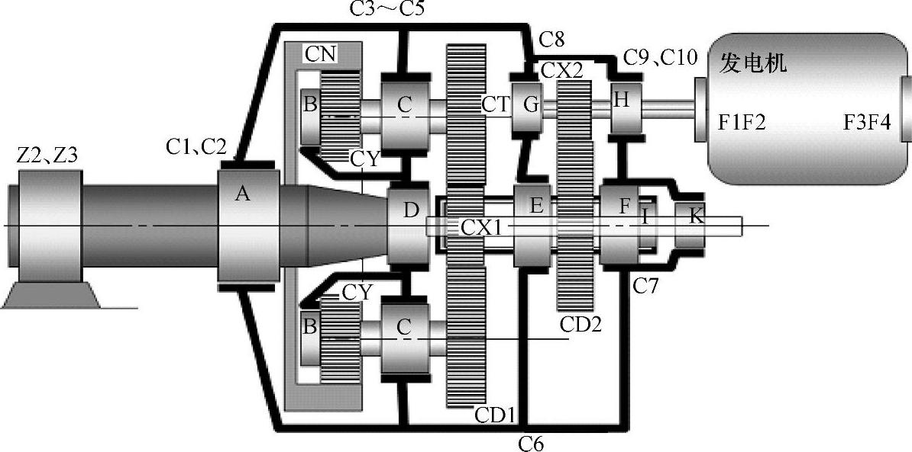

表11-11 传感器布置示意图

表11-4 传感器布点

图11-12 前置处理器结构

2.前置处理器（数据采集器）

在风力发电机组机舱内安装前置处理器，接收传感器的模拟信息，进行切换、抗干扰处理，并将模拟信息通过处理器与机载主机之间的总线电缆传输到机载主机。图11-12所示为前置处理器结构，其中传感器采集的信号经过多路采样保持电路（S/H）接入多路模拟开关（MUX），经过预处理模块的抗干扰处理后的模拟信息送给机载主机。

技术参数：工作电源DC12V±5％；振动冲击复合传感器接口数量16个；位移传感器接口数量1个；通信接口RS485；外形尺寸280mm×259mm×109mm。

3.机载主机

（1）机载主机的结构

机载主机安装在风力发电机机舱内，机载主机由电源转换模块、PC104-CPU模块、USB—A-D模块、振动与共振解调信息处理模块、转速采集与逻辑控制模块、启动与系统自检模块、各种数据接口和机载数据采集与控制软件组成。机载主机结构框图如图11-13所示。

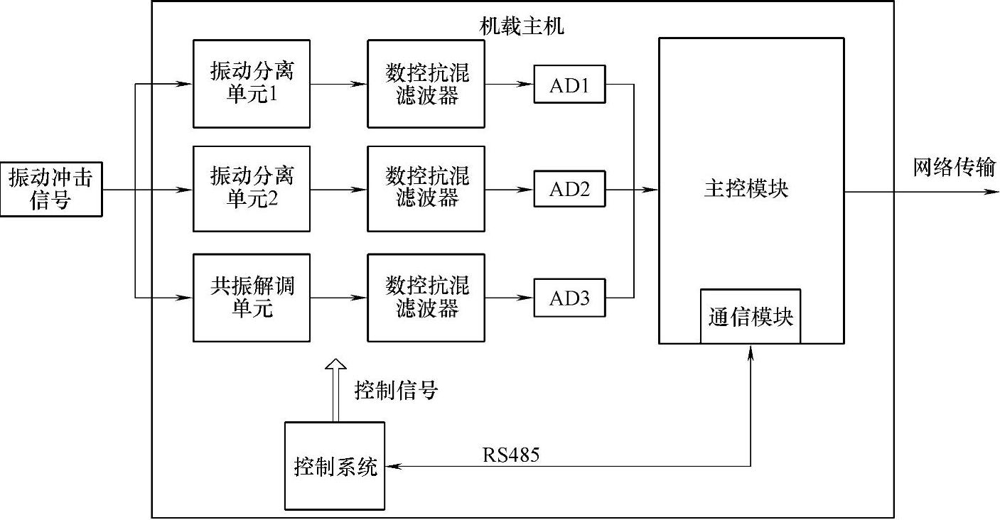

图11-13 机械主机结构框图

（2）机载主机的功能

机载主机的功能是对前置处理器实施控制，获取各传感器的信息以及风力发电机组的转速信息进行机载诊断，并通过无线或有线通信方式将获得的信息传输到风电场控制中心的中控计算机。

1）机载主机中的振动信息处理模块的主要任务：分离振动信号、进行转速跟踪抗混滤波，由机载计算机进行转速跟踪A-D转换（即采样）并存储该样本，对所获振动样本进行常规、初级分析和防止振动超限的应急报警申请。机载计算机与中控计算机根据预先设计的协议将所有样本传输到中控计算机。

一个机载的振动模块对应4个传感器，由机载计算机做调度，同时选择4个以下的传感器信号进行上述处理，经过一个循环，完成对所有传感器振动信号的检测、采集和初级处理。

2）机载主机中的共振解调信息处理模块的主要任务：从传感器信号中分离出冲击广义共振信号、将传感器的并不规范的机械广义共振信号变换为规范的电子广义共振信号并作实现解调，进行转速跟踪抗混滤波，由机载计算机进行转速跟踪A-D转换（即采样）并存储该样本；由于共振解调具有比真更早的预警能力而没有安排应急处理。机载计算机与中控计算机根据预先设计的协议将所有样本传输到中控计算机。

一个机载的共振解调模块对应4个传感器，由机载计算机做调度，同时选择4个以下的传感器信号进行上述处理，经过一个循环，完成对所有传感器广义共振信号的检测、采集和初级处理。

（3）机载主机的技术参数

工作电源AC220V±10％，50Hz；CPU 500MHz；内存板载256M；1个10M/100M自适应网口；2个USB2.0，传输速度达480Mbit/s；2个RS485；铝合金箱体，表面喷砂阳极氧化；外形尺寸300mm×250mm×107mm。

4.系统通信方案

为保证机载监测数据能可靠地传送到中控数据服务器，各风力发电机组上的机载主机与中控数据服务器通信采用光纤环网或备用光纤的方案，若选用备用光纤方案，需提供一对光纤。

诊断系统光纤环网组网是在利用每台风力发电机组机舱到塔底的光纤，将机载数据传送到塔底，在塔底接入风电场光纤环网交换机，到风电场机房再通过光纤环网交换机接入中控数据服务器。单台风力发电机组接入光纤环网示意如图11-14所示。

图11-14 系统网络连接示意图

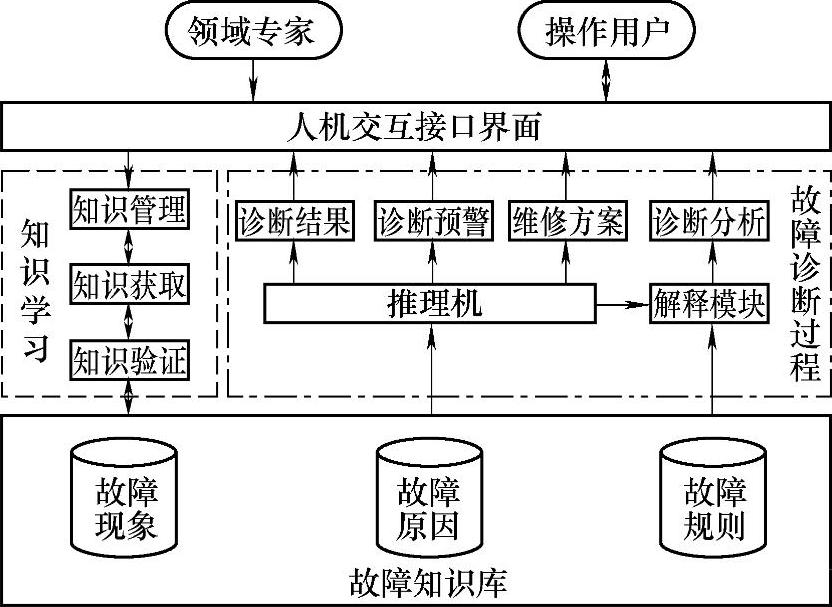

图11-15 故障诊断系统结构

风电诊断系统发送数据所占用带宽的流量计算：每台机载主机10min左右发送一次监测数据，数据包的大小为400KB。假设在某一时刻，33台机载主机同时对中控发送数据，则占用的带宽为400K×33=13.2MB。光纤的带宽至少为100MB，则风电诊断系统占用光纤13.2％的带宽，这不会对风力发电机组控制系统的实时控制造成影响。若用户认为占用的光纤带宽过多或风力发电机组数量增加，可采用每台机载主机分时发送数据的方式，以减少占用的带宽。

5.故障诊断专家系统

故障专家诊断系统由中控计算机系统和其所安装的故障专家诊断系统软件组成如图11-15所示。中控计算机应用所安装的故障诊断专家系统，对所辖若干台风力发电机组各测点关联的传动系统进行自动故障诊断，发出故障报警，实现实时报警和高级诊断。中控计算机采用工业控制计算机，具有良好的防震、防尘性能。其技术参数：工作电源AC220V±10％，50Hz；操作系统WinXP；CPU 3.0GHz；内存1G DDR；硬盘160G；1个10M/100M自适应网口；4个USB2.0，传输速度达480Mbps；5个RS232和1个RS232/485；工作温度范围0～40℃；相对湿度5％～98％。

故障诊断专家系统软件的主要功能是获取各风力发电机组机载主机的监测信息，进行自动故障诊断，实现实时报警；进行信息管理、趋势研究，输出诊断报告；进行用户管理、参数设置；进行机载主机软件升级、维护。监测对象是风力发电机组的主轴轴承、增速齿轮箱轴承和各齿轮、发电机轴承等。监测内容是各轴系的振动；主轴轴承、增速齿轮箱轴承和齿轮、发电机轴承的故障冲击；高速轴的轴向窜动；主轴和发电机的转速。

诊断软件采用Dephile开发软件界面及数据库的构建，采用Microsoft Visual C语言进行算法编程。为解决诊断工作对诊断专家的依赖的问题，将诊断规则写入程序中，使诊断工作具有“主动诊断”的特点。图11-16所示为诊断软件的流程图。

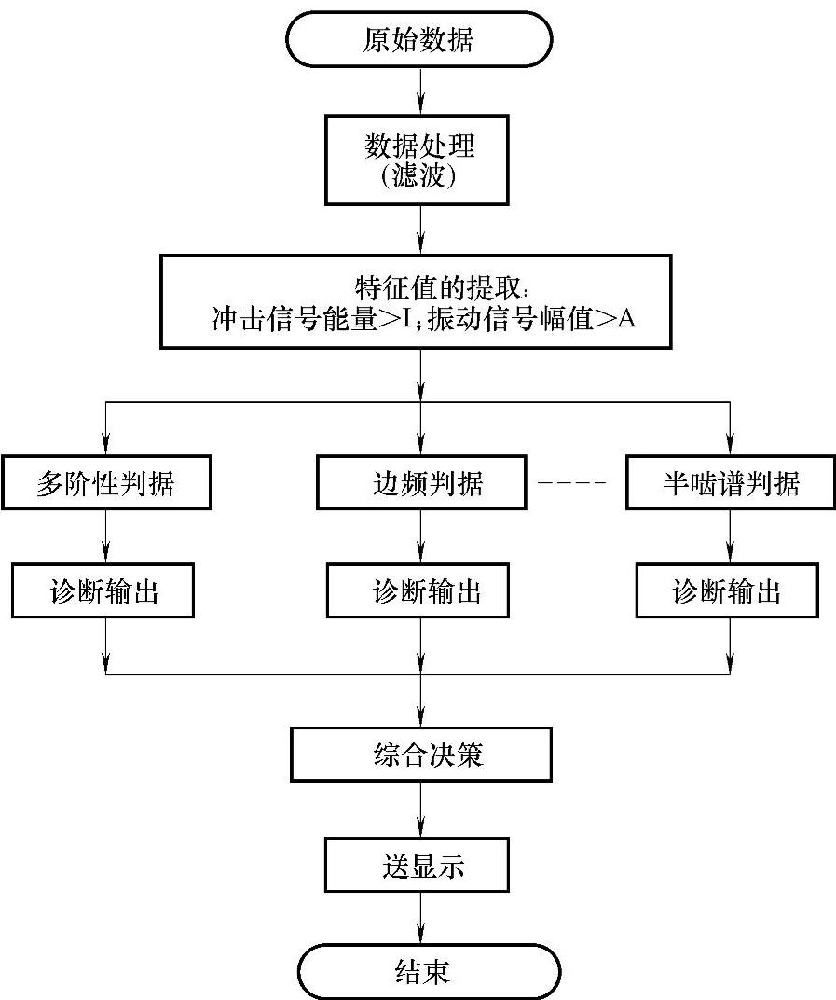

图11-16 诊断软件流程

数据库结构形式采用三层Browser/Server，B/S结构（Browser/Server，浏览器/服务器模式）可以说是分布式的两层结构，其结构如图11-17所示。与C/S结构相比，B/S结构要多出一个“中间层”，即业务逻辑层（BLL）。业务逻辑层是针对具体问题的操作，也可以说是对数据层的操作，对数据业务逻辑处理。因此业务逻辑层无疑是系统架构中体现核心价值的部分。它的关注点主要集中在业务规则的制定、业务流程的实现等与业务需求有关的系统设计，所以三层架构更为详细。

专家系统知识库的构建：设备故障往往是多种原因对应多种结果。一种故障原因可能对应多种故障结果，而这些故障结果本身又可以作为故障原因对应不同的故障结果。因此构建知识库的思路如下：

1）列出所有的故障原因以及对应的故障结果，将不同的原因分为故障原因1、故障原因2、故障原因3……，故障原因1用于确定该故障信息属于哪一大类，故障原因2用于在已知故障类别的前提下，确定该故障信息属于该类别的哪一小类。依此类推，逐一细化故障原因类别。与故障原因相应的故障结果为故障结果1、故障结果2、故障结果3……

2）知识表按照故障原因有层次地分类存放，要尽量做到数据不出现冗余。将故障原因1和故障结果1存在同一知识表，将故障原因2和故障结果2存在另一知识表……。知识表与知识表之间通过键值相联系，例如故障原因代码（Code）等。按照这种方式构建知识库，可以使知识库中的知识有层次的存放在一起，为以后推理机的设计创造了有利的前提条件。

图11-18、图11-20、图11-21、图11-25所示为故障诊断界面。

图11-18所示为机组振动趋势分析界面，在趋势分析中有振动峰峰值、平均值、有效值；峭度因数、裕度因数、脉冲因数、峰值因数、波形因数等趋势分析。

图11-17 B/S结构图

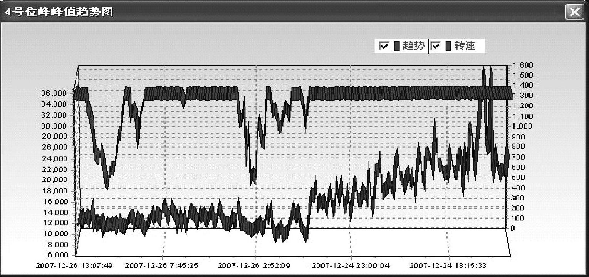

图11-18 振动参数趋势分析

图11-20所示为故障冲击分析界面，在故障冲击分析中有时域分析、频域分析、故障类型分析，第一行谱线是时域波形，第二行是时域波形的频谱，第三行是特征理论指导谱；“诊断结果”等提示故障的对象、类型和程度等自动诊断信息。

图11-21所示为振动分析界面。

图11-25所示为轴向窜动分析界面，监测制动盘所在轴的轴向位移量和轴向振动。

机组采用二级报警策略，分别为预警和报警，对故障的类型和位置进行精确报警。此监测装置只需输入风力发电机组传动系统的轴承、齿轮参数，即可使用，即时报警；采用振动、冲击复合传感器进行信号的拾取，综合运用了共振解调技术和常规振动检测技术，提供风力发电机组传动系统的运行状态，指导设备的状态维修。

## 第三节 在线监测系统的工作过程及案例分析

### 一、故障信息的分析与处理

监测系统中采用两种故障诊断技术。一种技术途径是直接检测机械的振动，振动监测所发现机械部件有损伤时，部件往往还有相当长的使用寿命，因此出现振动预警时机器不必在近期维修，可以为了防止日后引起破坏而调整机器；第二种技术途径是检测机械的冲击，检测冲击的共振解调报警时，表明故障部件必须在近期维修，这是一种特别适合作为安全警戒的方法。因此同时使用振动和冲击监测方法，使监测系统具有预警和报警的双重作用。

首先，复合传感器将机组的振动、冲击信息采集到，机载主机完成对复合传感器提取的信号进行共振解调分析、抗混滤波及采样工作。对所获数据样本进行常规、初级分析和应急报警申请。机载计算机与中控计算机根据预先设计的协议将所有样本传输到中控计算机。设备故障信息的处理流程如图11-19所示。

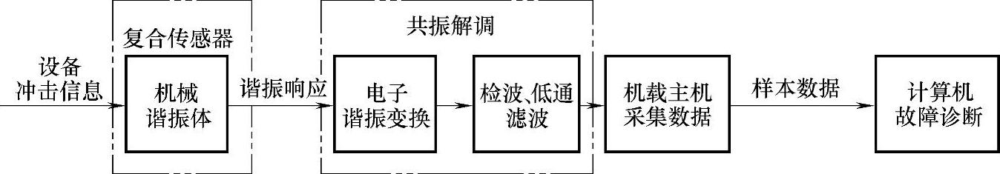

图11-19 信息的处理流程

共振解调分析有两种实现手段：基于软件的共振解调分析、基于硬件的共振解调分析。本监测系统采用了基于硬件的共振解调分析方法，共振解调技术通过传感器的硬件回路快速、准确地提取故障冲击信息，并剔除了低频振动成分。

为从以上信息中去除高频衰减振动成分，得到只包含故障特征信息的低频包络信号而进行检波和低通滤波。即采用检波—滤波法实现故障特征频率的识别。

检波—滤波法是先对信号进行绝对值处理，即将原广义共振的交变信号中负值信号“整流”成正值的信号，然后设置一个低通滤波器，对检波输出进行局部的平均平滑，提取广义共振波信号的包络，信号通过滤波器以后，载波信号被滤掉，得到代表故障信号的包络信号。

检波分析的过程如下：

x_(m)（t）为故障振动信号的第m阶幅值调制函数的第一阶分量（令其相位为0），可表示为：

x_(m)（t）=x_(m)\[1+A_(m，1)cos（2πf_(n)t）\]cos（2πmf_(z)t） （11-10）

式中 A_(m)，1——第m阶幅值调制函数的第1阶分量的幅值；

f_(n)——缺陷齿所在轴的转频；

f_(z)——齿轮啮合频率。

检波分析就是对信号x_(m)（t）的负半周置零，即

z_(a)（t）=0.5∣x_(m)（t）∣+0.5x_(m)（t）=0.5x_(m)∣1+A_(m，1)cos（2πf_(n)t）∣∣cos（2πmf_(z)t）∣+0.5x_(m)\[1+A_(m，1)cos（2πf_(n)t）\]cos（2πmf_(z)t） （11-11）

将∣1+A_(m，1)cos（2πf_(n)t）∣用傅里叶级数展开，当A_(m，1)＞1时得下式

∣1+A_(m，1)cos（2πf_(n)t）∣=E₀+E₁cos（2πf_(n)t）+E₂cos（2π2f_(n)t）+E₃cos（2π3f_(n)t）+… （11-12）

式中 E₀、E₁、E₂…E_(n)——直流分量、基波分量、二次谐波分量及N次谐波分量。

将∣cos（2πmf_(z)t）∣用傅里叶级数展开得下式

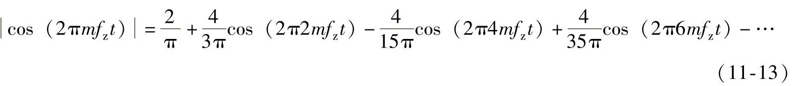

根据傅里叶性质可知，时域的乘积等于相应的频域卷积，对（11-11）式进行低通滤波（选择合适的截止频率），可得式（11-14）：

### 二、故障诊断规则

在对故障的诊断中采用了五项诊断准则和三个相关判据。其中故障诊断五项诊断准则是：多个同类故障的归类诊断准则、规则抽取准则、信号的定常性准则、各周历经性加权准则和固定方位不定性加权准则。故障诊断的相关判据是多阶性判据、边频判据和半啮谱判据。

（1）多个同类故障的归类诊断准则

为了识别故障与干扰，首先要识别故障的特征。基于概率论，如果在同一个轴承或齿轮中有多个同类故障（内环的、外环的、滚动体的、轮齿上的），由于自然产生的这些故障不可能大小相同而间距均匀；或者由于存在工作方位所致的载荷差异和信号传递途径的差异，它们引发的共振解调波形就不可能在频谱上各自独立，而是共同组成一个波形集合，以一个共同的周期重复着。因此，它们必然使得分析谱中出现只有一个这类故障时也出现的那种基本谱线。或者说，它们的存在可由一个共同的故障基本频率描述，从而可以简化诊断。

（2）规则抽取准则

轴承滚子、内环这类零件的故障，与其他滚动工作面的冲击主要发生在承载区，当它们通过非承载区时，故障基本上不产生冲击，在理想条件下本来应当出现的共振解调波被“抽取”了一部分。若作少量的不规则抽取则故障基本频率一般等于不抽取时的故障基本频率。在信号采集中，许多客观规律都要影响信号的定常性——典型的是信号局部丢失。发现了不规则抽取后信号的识别方法自动填充。

（3）信号定常性准则

为了正确而又简化地诊断一种物理现象，则反映该物理现象的信号必须是定常的，即应是符合理想运行模式的，可以用简化理论模型进行分析诊断的。非定常信号的简化分析诊断必然引起错诊和漏诊。

一个正确的分析诊断，应当具有符合采样定理的完整的时域样本，其时域信号应当符合信号定常性准则。

1）该样本的时间长度，应当大于所应保留的最低频的信号的周期而采样频率应当为最高信号频率的2倍以上即符合采样定理。

2）正确的故障诊断还应当保证反映该故障的信号是定常性的，即不波动或尽量少波动的，更不能是在采样期间突然出现，又很快消失的。即应保证符合正确而又简化诊断所不可缺少的信号定常性准则。多传感器受感技术，是实现信号定常性准则的重要技术保证。

为了防止漏诊，对于不允许转动外圈的轴承定检，应当测定冲击信号的传递损失，然后在诊断确定故障类型之后实施加权。

（4）各周历经故障诊断的各周历经性加权准则

是克服那些能周而复始地通过传感器所在方位的故障的信号传递损失的加权准则，其权值是略大于1的数。

（5）固定方位不定性故障的固定方位不定性加权准则

是克服在试验诊断中相对于传感器不动的部件，如外圈等故障信号传递损失的加权准则，其权值为最大传递损耗的倒数。

（6）多阶性判据

多阶性判据的基本原理是：共振解调谱是由间隔相等（等于故障冲击的重复频率）的一组频谱构成，这就是共振解调频谱独有的多阶性，即——共振解调波的频谱是多阶的梳状谱线。如果存在单个故障，其共振解调频谱一定出现多阶频谱；如果存在多个同类故障，则其共振解调频谱将发生高阶减幅。

（7）边频判据

在共振解调故障诊断领域，有如下的定义：

1）各周历经性故障：所有相对传感器安装位置而言呈现周而复始地运动着的零件的故障，称为各周历经性故障；

2）方位固定性故障：所有相对传感器安装位置而言为相对固定的零件的故障，称为方位固定性故障。各周历经性故障可能存在调制、边频谱和调制谱。

在监测机械轴承、齿轮的故障时，由于投资的限制，或者出于结构强度的考虑，几乎不可能在机械的轴承座上安装多个传感器。如果仅在一个方向安装一个传感器检测外环固定的大口径轴承的故障，或者由于轴承单边承受载荷，只有在承载区才能发生故障冲击，或者因为故障冲击发生处与检测点的距离的差异导致信号传递损失的差异，都使得检测获得的故障冲击信号发生幅度调制，如果外环固定，滚子故障信号受到保持架公转频率调制，内环故障信号受到其所在轴转速频率调制。

（8）半啮谱判据

在监测齿轮传动系统的状态时，当轴系的广义共振频率等于齿轮啮合冲击频率的一半时，该广义共振频率具有最清晰的频谱（即幅值最高），称这个频谱为半啮谱。

当轴系产生疲劳或裂纹时，轴系的平均刚度会下降，当该轴上齿轮的啮合频率等于轴的当前横向固有频率的两倍时，将会激发轴的当前横向固有频率的振动，即将出现半啮谱。利用半啮谱出现的转速随着运行时间向低漂移的特征作为识别轴系疲劳或裂纹、刚度下降的考察点，即半啮谱判据。

### 三、故障诊断案例分析

下面列举某风力发电机组的状态监测及故障诊断实例：

1.轴承故障诊断

某状态监测系统报13测点（发电机输入端轴承）轴承外环预警，滚子圆周一级预警（图11-20、图11-21分别显示该测点的冲击信息和振动信息）。产生此问题的原因主要有发电机轴与齿轮箱输出轴存在不对中、轴承润滑不良；于是维修人员上机调整对中，并给轴承增加润滑脂，之后，13测点的运行情况有所改善（图11-22、图11-23分别显示该测点的冲击信息和振动信息）。滚子冲击从53dB降低到44dB，尚可运行。但振动的常规指标并无明显改善，这也说明识别轴承故障，冲击比振动更为鲜明。

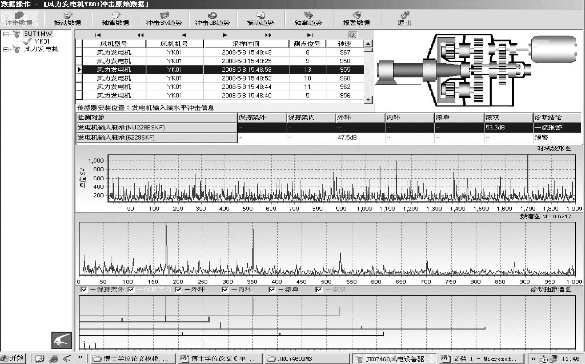

图11-20 13测点冲击频谱（5月8日）

2.齿轮箱轴向

风力发电机组的传动链与机舱底盘有一个5°的倾角，机组在运行过程中齿轮箱在惯性力的作用下会产生轴向位移，如果轴向位移超过极限，会造成联轴器膜片轴向变形量加大，降低联轴器寿命；还将使主轴与齿轮箱体之间的连接松动，风轮转速不能有效地传到齿轮箱输入轴上，从而降低发电效率。

风力发电机组的传动链合理的轴向位移量应包括：主轴轴承的轴向间隙、主轴齿轮箱系统摆动产生的轴向位移、齿轮箱高速轴轴承的轴向间隙、齿轮箱高速轴受热膨胀产生的轴向位移和机舱后底盘的挠度引起的轴向位移。

如图11-24所示，通过检测制动盘的轴向位移来检测齿轮箱输出轴位移，使用两个电涡流传感器安装在制动盘两侧，安装方向与输出轴轴向平行，传感器头平面与制动盘的间距为6mm。实现轴向窜动检测的同时还能实现制动盘厚度检测。

从图11-25中可以看到齿轮箱输出端的高速轴在机组工作过程中一边振动一边位移，并且高速轴每转一周就振动一次。其中在一个周期（高速轴转动周期）中振动波形的峰峰值表示由于齿轮箱高速轴的挠曲引起的轴向位移量；各个周期中振动波形的均值的变化值表示风力发电机组传动链的轴向窜动量，当这个值大于合理的轴向位移量时就表明有故障产生，可能是主轴承座松动，或主轴与齿轮箱的连接处松动，或齿轮箱高速轴轴向窜动。图11-26所示为齿轮箱高速轴轴向窜动的趋势，从趋势图中可以了解齿轮箱轴向窜动的全过程。为机组维护人员完成齿轮箱轴向位置的调整提供依据。

图11-21 13测点振动频谱（5月8日）

图11-22 13测点冲击频谱（6月29日）

图11-23 13测点振动频谱（6月29日）

图11-24 电涡流传感器

目前，市场上主要的风力发电机组在线监测产品有美国Bently Nevada Corporation（BNC）的产品Trendmaster Pro（风力发电机组传动链的状态监测系统），用System 1 DAQ软件对采集的数据进行分析，方法为时域分析、频域分析、包络分析；德国普鲁夫公司（pruftechnik）的智能型状态监测与诊断仪VIBROWEB®XP、VIBXPERT（风力发电机组传动链的状态监测系统），用ILEARN VIBRATION软件对采集的数据进行分析，方法为包络分析、阶次分析、倒谱分析；SKF公司MasCon系列（风力发电机组传动链的状态监测系统），应用ProCon软件对采集的数据进行分析，方法为时域分析、FFT分析、包络分析；新西兰的况得实（Commtest）的产品turningpoint^(TM)，采用专业的振动分析软件Ascent®来进行使用；德国flender公司的Winergy AG子公司应用FLENDER Service GmbH状态监测系统，持续地检验风力发电机组中各个传动元件的运行情况，在世界范围内提供服务的服务部门不仅负责状态监测系统的安装，而且承担传动系统的维护和保养。北京唐智科技发展有限公司的JK10460风力发电机组在线故障诊断系统已形成产品投放到市场，该产品采用共振解调技术实现故障的诊断。

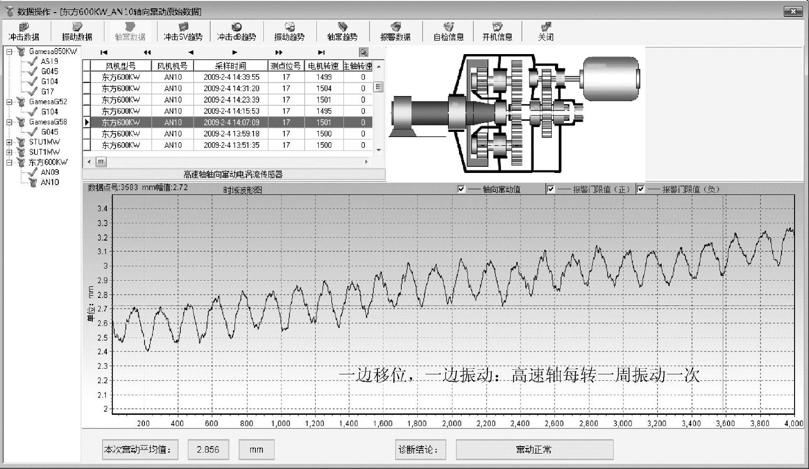

图11-25 轴向窜动数据

以上产品有的采取在线状态监测和人工分析相结合的方式，即监测风力发电机组的振动、冲击、温度等物理量，并结合风力发电机组的输出功率、风速等信息，设定振动报警的阀值。一旦报警后，则依据软件提供的各种分析方法（如频域中的包络分析、倒谱分析；时域中的峭度分析、波形因素分析、振平分析等），人工分析数据，确定故障部件、部位及故障程度；或人工定期分析各风力发电机组数据，以发现存在的故障隐患。此方式要求有专业的数据分析人员，对人员能力要求较高，且数据分析人员工作量大，可能出现人为失误。目前，大部分在线状态监测与故障诊断厂家采用此方式。有的采取在线状态监测与智能故障诊断专家系统相结合的方式，即监测风力发电机组的冲击、振动、温度等物理量，并传递到安装有智能故障诊断专家系统（各种分析方法和判据已软件实现）的后台服务器中，软件实时分析数据，对于有故障的部件进行报警，且自动定位故障部件、部位及故障程度。对于某些疑难杂症，辅以人工分析加以确认。此方式大大降低了人员的劳动强度，提高了劳动效率，并减少了人为失误。目前，唐智科技风力发电机组在线状态监测与故障诊断产品采用了此方式。

图11-26 轴向窜动趋势

