# 12 强度分析

本章主要介绍以数值计算为主的风力发电机组强度分析方法。包括静强度分析、模态分析、疲劳强度分析和屈曲稳定性分析等。

## 第一节 强度分析概述

随着风力发电机组的功率不断提高，机组的主要结构件（例如塔架和叶片）尺寸相应加大，在外载荷和重力共同作用下，机组的弹性变形问题显得更加突出，结构弹性变形以及运行中产生的载荷已成为影响机组力学性能和稳定性的重要因素。从国内外风力发电机组的实际运行情况来看，对风力发电机组力学问题估计不足往往会造成风力发电机组不能正常运行，甚至失效损坏。力学问题没有处理好，不仅会造成严重的经济损失，而且将影响风力发电机组的应用推广。因此，有必要对整机、子系统及其关键结构件的力学特性进行深入的分析。机械强度分析就是其中一套非常有效的分析方法，它已成为风力发电机组设计过程中的主要内容。

所谓机械强度（简称强度）指的是物体抵抗外力的能力，风力发电机组的强度分析主要是研究机组结构件的强度是否能够保证和提高机组的质量，消除机组在使用中潜在的隐患，达到安全可靠、经济合理的要求。强度问题本来是固体力学的一个分支，但是由于风力发电机组特殊的工作原理，使得对风力发电机组强度分析的研究演变成了为以固体力学为基础，并与流体力学、材料科学、计算机科学、自动控制等学科相互交叉和渗透的一门学问。强度分析工作就是要在多组学科相互交织的复杂系统中，寻找到能够胜任机组全部运行工况的机械系统或结构件。

### 一、强度分析的任务和对象

强度分析是本章主要讨论的内容，合格的强度分析不仅仅是针对结构件在特定条件下的校验计算，还要参与到结构件的设计与多系统仿真（试验）分析的工作中，寻求最佳解决办法，以便在考虑所列举的各项要求的同时，以尽可能小的结构重量保证必要的结构强度。也就是说，对机组的机械零部件既要求安全可靠，又要求重量轻、工艺性及经济性良好。所以对风力发电机组强度分析的任务是：在设计寿命内所有发生载荷的作用下，对机组整机、各个子系统及其结构件进行强度校核，以防止整机、各个子系统及其结构件出现任何形式的破坏（包括由极限载荷、疲劳载荷、共振激励以及屈曲失稳等引起的破坏），或尺寸外形的不可逆改变。在保证满足上述条件的前提下，参考安全裕度给出结构优化意见，实现结构件的轻量化、优良化、工艺性和经济性设计。

一般地强度分析工作分为首轮和终轮两组计算过程。首轮计算的目的为快速校核结构件的安全裕度，根据分析结果给出优化意见；终轮计算的目的是校核修改后的结构是否严格满足设计要求。两轮计算（有时也多达数轮）也可以看作为人工参与的优化分析过程。

满足强度条件是强度分析的核心，是量化分析的过程。主要涉及两个方面：强度判别准则和强度数值计算。

强度判别准则分为定性的判别准则和定量的判别准则。定性的判别准则主要是根据以往经验对结构件采用哪种力学性能为主的强度校核做出判断，并给出参考意见。例如，若结构件在某圆角处静应力数值偏高，而疲劳安全裕度很大，则可以断定该区域为以静应力为主的强度校核，可以通过修改圆角半径，或减小相邻区域的刚度等措施，降低应力峰值。若局部特征改变不大，后续分析工作以静强度校核即可。定量的判别准则是以某一参考值作为评估指标，校验分析结果是否满足限定要求的一种方法。在实际工程应用中，风力发电机组常用的定量判别准则多引用权威的标准规范。例如，在校核材料为QT400-18AL的轮毂的静强度分析流程中，定量判别准则可以引用参考文献\[45\]中的规定，确定判别准则为等效应力判别方法，校验参考值为屈服应力值。在静强度校核时，应用对比校验法即可判定轮毂是否满足设计规范要求。如果σ_(max)代表在极端载荷作用下，轮毂出现的最大等效应力，可以应用不等式（12-1）表述强度校验的定量判别准则。

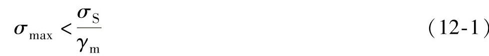

式中 σ_(S)——材料屈服极限；

γ_(m)——材料局部安全系数。

一般地，上式可以用于校核任意结构件的静强度。即通常所说的“强度判别条件”。对于极限变形、振动问题、疲劳强度和屈曲稳定性等问题，也可以用类似的不等式来表达结构应满足的基本要求。

由判别准则可以看出，强度分析的数值计算就是在满足准则的条件下，通过计算获得一组极限值数据，并与限定值作对比分析，判定某系统或结构件是否设计要求，确保该系统或结构件具有足够的强度、刚度和稳定性。由力学常识可以推断，风力发电机组系统或结构件要达到满足判别准则的要求，必须要解决几个基本层面的问题：

1）静强度问题：直观地，对于风力发电机组某一具体零部件或系统，如果其上承受的载荷单调地增大，超过了指定的限定值，结构就会发生破坏，力学状态表现为应力超过了抗拉（压）极限，结构出现瞬间断裂。对于风力发电机组来说，几乎所有部件时时刻刻都在应对静强度问题，若结构设计不合理，会导致非常严重的后果。

2）振动问题：风力发电机组是一个具有转体动力特征的多体系统，机组在运行过程中易受到风载荷和自身激励的作用，不可避免地出现响应，产生各种各样的振动。由振动理论可知，当外界激振力的频率与系统自身的本征频率相近或重合时，系统的振幅和能量会急剧增大，达到一定程度会对系统造成破坏。对于风力发电机组来说，若其自身的本征频率与风载荷或自身激振力（特别是叶片旋转引起的周期性激振力）相近时，塔架的摆动位移会急剧增加，易造成机舱或风轮内部部件的破坏，严重的会造成塔架大范围变形或倒塌。

3）疲劳强度问题：在风力发电机组的实际运行中，机组承受的载荷非常复杂，呈现出载荷数值和方向时时变化的特点，由疲劳理论可知，如果机组长时间承受这类交变载荷作用，即使载荷数值较小，也会引起不可容许的后果。当载荷多次作用达到某一循环次数之后，可能会导致某些结构件发生疲劳断裂等严重的后果。为此，在设计过程中应该考虑疲劳强度问题。一般来说，风力发电机组中关键的承力结构容易出现疲劳破坏，如轮毂、主轴、底盘以及轮毂与主轴之间的连接螺栓、塔架底段的连接螺栓等。

4）屈曲稳定性问题：结构的屈曲稳定性主要是分析某类结构在特定载荷状态下的力学稳定性。这类结构表现为：在受压载荷作用下，当压力很小时能够保持原有的平衡形式，若压力增至某一数值时结构内力平衡状态会出现跳跃变化现象，这种变化可导致结构件承载形式的变化、造成承载能力下降，严重者会导致结构的失稳破坏。由屈曲稳定性理论可知，具有细长直杆、薄壁壳体等特征的结构容易出现失稳破坏。对比这类结构的几何特征可知，风力发电机组中锥筒式塔筒、液压变桨距系统中的推力杆符合此类结构件的特征，应对其进行屈曲稳定性分析。

5）极限变形问题：极限变形是指结构件在极端外力作用下，出现最大可能变形的状态。在某些情况下，结构件虽然不发生破坏，但是由于结构件的弹性变形超过了允许的限度，也会使机器设备不能正常工作。例如在风载荷作用下的叶片，即使有足够的强度，若变形过大，旋转时会与塔筒发生碰撞，导致严重的后果。又如主轴变形过大时，将使传动系统运转不良，并引起轴承的不均匀磨损及振动。为此，在机组设计流程中必须考虑极限变形问题。某些极限变形可在静强度分析中得到验证。

上述五个强度问题是在一般层面上通常考虑的主要方面。在个别情况下，环境温度变化可能对前面列举的强度问题产生一定的影响，例如结构件内部的温度分布可引起较大的应力或变形。对于风力发电机组来说，这种情况主要是由外界环境和齿轮箱、发电机等产生的热流引起的。对于复合材料结构，应该特别注意环境温度对强度的影响。此外，影响结构强度的其他因素还包括腐蚀、磨损、老化以及胶接强度随时间而降低等问题。特别地，疲劳强度对这些因素很敏感，所以在计算分析中应予充分考虑。

原则上，风力发电机组的所有系统和结构件都必须进行强度分析，但考虑到，计算周期性，经济性以及结构件受力形式的主次因素。通常选择若干个关键系统或结构件进行强度校核即可，目前风电行业内常规的分析对象见表12-1。

表12-1 风力发电机组常规分析对象一览表

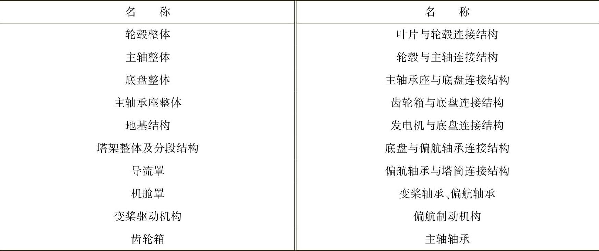

### 二、强度分析的一般流程

风力发电机组的强度分析涉及静力学、动力学、疲劳、屈曲稳定性四种力学范畴以及工程计算方法、数值计算方法（例如有限单元法）两种计算方法。分析工作与很多方面相关联，十分复杂。因此，划分分析流程，考虑各部分相互之间联系的简化，具有一定的实际意义。图12-1所示为风力发电机组强度分析的一般流程图。

图中，第一个方框——根据给定的机组状态特征C₁及结构特性C₂，确定载荷M，及位移Y；第二个方框——根据给定的载荷，确定应力σ，或应变ε；第三个方框——保证满足强度条件的有关准则。

关于第一个方框中的问题，有的涉及整机外载荷，有的涉及部件载荷，有的涉及气动弹性载荷，情况比较复杂，这部分内容已在相关章节中有比较详细的论述。第二个方程中的内容，主要包含用材料力学和弹性力学方法求σ-ε的一般公式。第三个方框取决于要解决的问题。当研究极端的一次性载荷的作用时，其研究方法是根据结构、材料的性能及结构力学的概念，确定容许的应力值。对疲劳强度来说，寿命计算是以材料及结构在给定载荷量值下的损伤度为基础的。对于有关振动的问题，判定容许的振动水平的方法是以不影响整机运转条件为基础的。对于某些涉及焊缝强度或屈曲稳定性的问题，判定方法是以结构件在给定的设计载荷条件下不发生破坏为基础的。

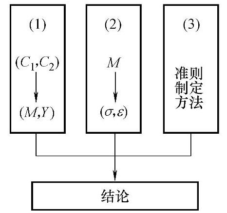

图12-1 处理强度问题的一般流程

### 三、强度规范

风力发电机组可以运行在不同的风速、叶片旋转速度、桨距角以及它参数可变的状态。表现为多种状态的运行。一般来说，机组的运行状态和结构参数的组合存在无穷尽种可能，设计人员不可能对机组全部可能的运行状态进行繁重的计算工作，因此为了让设计人员摆脱繁重的计算工作，将注意力能集中到确定性的强度问题上，由权威机构出版一部设计规范是尤为必要的。

风力发电机组的设计规范包含了权威机构对机组的设计、制造、试验、使用和维护等方面提出的必须满足的条件和要求，是为了保证机组具有良好的性能，在运行中足够安全可靠。规范中关于强度问题的部分，称为“强度规范”。其中给出了保证强度的计算和试验工作的起始要求，规定了保证强度的工作范围以及载荷作用环境，此外，还提供了确定载荷数值的指令或指导。

强度规范的编写既纳入了以往的理论及实验成果以及设计与使用的经验，又考虑了科技的发展趋势和前景。不仅能够帮助分析人员梳理诸多不确定因素，给出了一套完整的执行准绳，而且在一些国家强度规范是强制执行的法则，类似于行政法规。因此分析人员必须了解和掌握规范的要求，在运用规范时，附加的理论研究及实验研究也是必不可少的。目前在风电行业业内正在使用的涉及强度规范的主要版本为

中国船级社颁布的《风力发电机组规范》2008版，其中第5、6章规定了风力发电机组关键结构件或连接件的强度计算准则。

德国Germanischer Lloyd颁布的《Guideline for the certification of Wind Turbines》2010版，其中第5、6章规定了风力发电机组关键结构件或连接件的强度计算准则。

丹麦Risϕ国家实验室与挪威船级社颁布的《Guide Lines for Design of Wind Turbines》。

此外，还有由风电行业规范推荐的适用于部件强度校核计算的规范例如：

英国标准委员会颁布的《Eurocode3：Design of steel structures-Part 1-9：Fatigue》，适用于焊接结构的疲劳强度计算。

《DIN18800 part 4：Structural steelwork Analysis of safety against buckling of shells》适用于计算钢筒式塔筒结构的屈曲稳定性计算。

《VDI 2230 part1：Systematic calculation of high duty bolted joints Joints with one cylindricalbolt》适用于计算螺栓强度或螺栓和被连接件刚度的计算。

应该值得我们注意的是，考虑到风力发电机组的设计要求不断提高，新材料、新结构、新工艺的发展，以及制造和使用经验的积累，强度规范要适时地进行修订或补充说明，因此必须使用适合的最新版本的规范，并注意与强度规范的条文有关的修改通知及咨询通报，以便使所设计的先进结构尽可能少受陈旧规范的影响。

## 第二节 静强度分析

### 一、静强度分析方法

静强度分析是工程结构设计中使用最为频繁的分析，主要用来求解结构在与时间无关或者时间作用效果可以忽略的静力载荷（如集中/分布静力、温度载荷、强制位移、惯性力等）作用的响应，并得出所需的位移、应力和应变能等。

风力发电机组结构件的静强度问题，实际是考察机组的关键结构件在使用当中承受最大作用载荷的能力，分析结构承受极端载荷时的最大应变、应力和位移，进而讨论该结构的强度和刚度问题。分析方法及准则是风力发电机组结构件强度校核中最基本的分析原则，是机组结构设计活动中首先考虑的基本要求。

考虑到不同的载荷工况会导致结构件的受力状态不同，因此，必须全面考察机组在运行中所遇到的各种载荷状态（或称工况）。同一载荷分量，静强度仅考虑最大载荷值即可。通常风力发电机组结构静强度分析依据相关规范给定的设计载荷法，即计算载荷必须包含安全系数γ_(f)。

根据求解问题的复杂程度，风力发电机组结构件的静强度分析方法可分为两类：工程计算方法和有限元计算方法。

对于某类结构件来说，其结构尺寸单一，受载条件简单，并且有权威机构颁布的工程算法实例做参照，则此类结构件的静强度分析可应用工程算法计算。例如，锥筒式塔筒筒段间螺栓连接的静强度分析等。

对于载荷复杂或结构复杂的一类结构件（例如，轮毂、底盘等），工程算法或者传统强度分析办法无法给出合乎规范要求的精确解，必须借助数值计算完成这类结构件的静强度分析。有限元法就是其中发展较为成熟的数值计算方法之一，是解决复杂力学问题的一个有效的工具。图12-2为有限元静强度分析的一般流程。

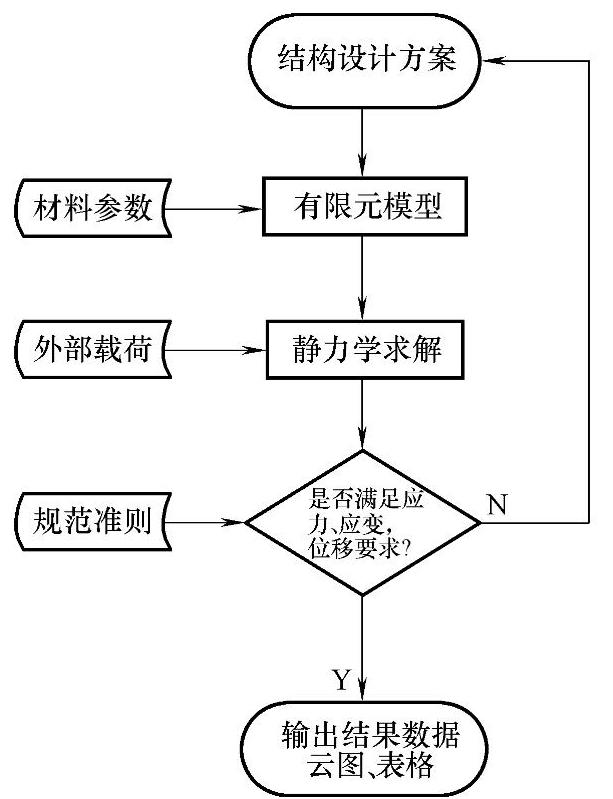

图12-2 有限元静强度分析的一般流程

有限元静强度分析是求解近似解的过程，求解精度高度依赖建模策略，网格密度以及载荷或位移边界的施加方式，为保证计算结果安全可信，风力发电机组结构件的有限元静强度分析应满足下列基本原则。

1.建模及网格划分应遵循的原则

1）对于非重点考察区域的细小特征，例如圆孔、倒角、凸台等，在不影响整体刚度的前提下，可以适当简化；

2）采用构建相邻部件的部分模型（假体）的方法，增加模型的合理判别区域。结构件、假体模型的尺寸及其连接方式应与实际情况保持一致；

3）模型整体的网格规模和网格质量应适当，重点校验区域要加密网格，非重要的区域可适当增大网格尺寸，建议采用高阶单元划分模型；

4）对于呈现高应力状态、应力梯度变化较大的局部区域，要细分网格，追求高质量网格。建议出现高应力的倒圆特征至少划分三层单元；

5）含有对称结构特征的模型，可以考虑建立最小模型，降低计算复杂性。

2.施加载荷应遵循的原则

1）简化假设越少越好；

2）使施加的载荷与结构的实际承载状态保持吻合；

3）如必须作简化处理时，必须忽略“不合理”简化的边界附近一定区域内的应力；

值得注意的是，在结构分析中，集中载荷通常是梁、杆和弹簧等非连续性的模型施加载荷的一种途径。对于由平面单元或者三维实体单元等组成的连续性模型，集中载荷意味着存在应力奇异点。在静强度分析中，如果不关心集中载荷作用节点处的应力，根据圣维南原理，可以用等效集中载荷代替静力分布载荷，添加在模型上，虽然这样做会对载荷附近的局部特性有影响，但对整个结构的性能影响并不大。

无论采用工程算法还是数值算法，最后的工作都要归结为：静强度校验。对于风力发电机组结构件的静强度分析来说，就是通过应力（位移）比较，以校核结构件是否满足强度和刚度的要求。具体的做法是筛选出最大应力（最大位移）的载荷情况，并对该情况下所产生的最大应力（位移）进行检验。应力检验条件依据表达式（12-2）。

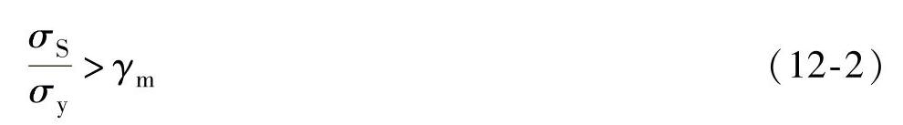

式中 γ_(m)——材料安全系数

σ_(y)——材料极限应力

σ_(S)——材料屈服极限

### 二、实例：1.5MW机组轮毂静强度分析

1）结构简介：1.5MW机组的轮毂由球墨铸铁铸造成型，是风轮系统的主要承力结构，所有从叶片传来的外载荷，都要经过轮毂传递到传动系统。此外，轮毂还要承受因风轮旋转引起的周期性惯性力和偏航引起的离心力等。可见，轮毂受力非常复杂，本次分析旨在评估这些复杂载荷对轮毂静强度的影响，轮毂结构图如图12-3所示。

2）有限元建模：本次分析考察的重点为轮毂主体的强度，不计入轮毂与其他部件之间连接区域的非线性特征，为此在分析中构建了简化的模型。建立了轮毂整体模型，轴承、叶片以及主轴部分模型。有限元分网原则为：材料参数依据设计规范获得；轮毂以10节点4面体单元分网，叶片、主轴及变桨轴承以20节点6面体单元分网；细化轮毂外端突缘和变桨电机连接区域的网格，追求这些区域高质量的网格；对于属于不同结构的实体单元，采用绑定接触建立连接；叶片根部中心加载节点与承力结构之间以多点约束建立连接。有限元模型见图12-4。

3）边界条件：轮毂主要承受的载荷来源于叶片，为全面校验轮毂在极端载荷条件下的静强度，按照叶片编号和载荷方向分组提取极限载荷数值作校验分析是合理的。精简重复性载荷工况，本次静强度分析共执行13组。载荷数值见表12-2。位移边界为主轴端面约束全部自由度。

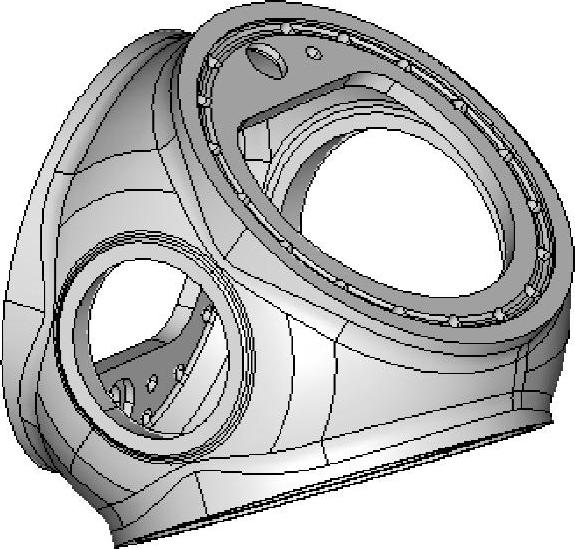

图12-3 轮毂结构三维图

图12-4 轮毂有限元图

表12-2 载荷数值表

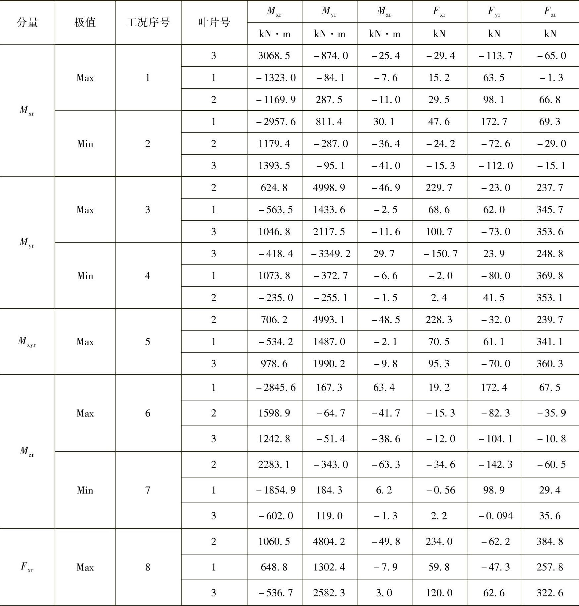

（续）

4）计算结果：由有限元计算得到，各个极限载荷工况下轮毂出现的最大等效应力数值见表12-3，出现最大等效应力的工况下的应力分布云图和位移分布云图见图12-5和图12-6。

表12-3 应力计算结果

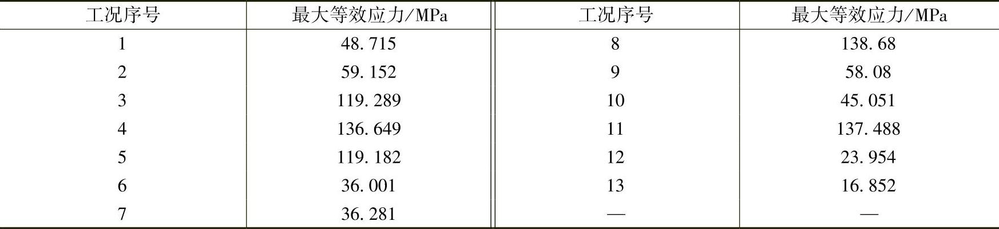

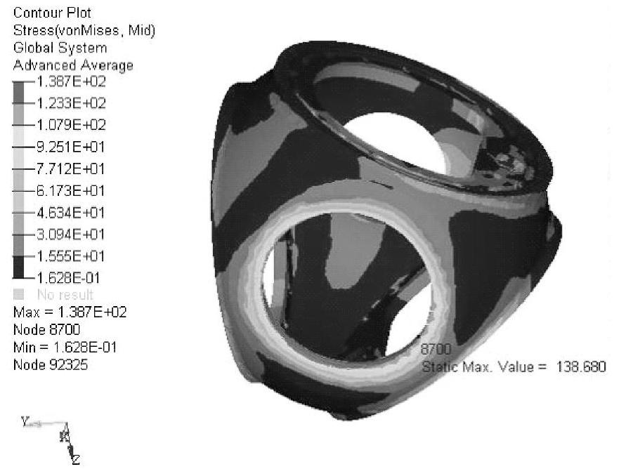

图12-5 第8种工况等效应力分布图

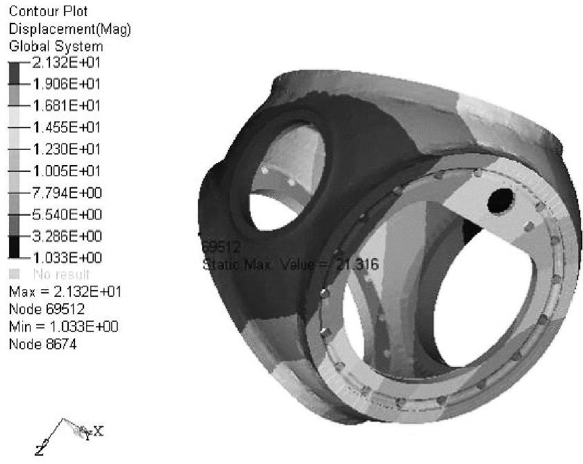

图12-6 第8种工况位移分布图

5）强度校核根据参考文献\[45\]对结构件的极限强度要求：轮毂在极限载荷条件下的静强度安全系数应大于1.1。由计算结果得到：在工况8的载荷作用下，轮毂与主轴连接处出现最大等效应力，数值为137.49MPa，强度安全系数为1.6。所以，轮毂的静强度满足设计标准要求。

## 第三节 模态分析

### 一、模态分析基础理论

由动力学理论可知，在含有小阻尼的多自由度系统中，若周期性激励载荷的频率ω接近系统的任何一个固有频率都会使系统的振幅无限增大而引起共振。解决途径之一就是在设计初始阶段对整个系统及其关键结构件进行模态分析，获得固有频率和振型数据，进而通过改变几何特征，改变刚度等办法，在设计方案上避开外界激励载荷频率。

模态分析是研究结构动力特性一种近代方法，是系统辨别方法在工程振动领域中的应用。模态是机械结构的固有振动特性。在多自由度系统中，每个固有频率对应于系统的一种特定的振动形态称为模态。每一个模态具有特定的固有频率、阻尼比和模态振型。这些模态参数可以由计算或试验分析取得，这样一个计算或试验分析过程称为模态分析。这个分析过程如果是由有限元计算的方法取得的，则称为计算模态分析；如果通过试验将采集的系统输入与输出信号经过参数识别获得模态参数，称为试验模态分析。

模态分析的理论基础来源于动力学方程，可以应用拉格朗日力学推得：设系统具有n个广义自由度，以n个广义坐标q_(i)（i=1，2，…，n）表示系统的位形。系统的势能V（q₁，q₂，…，q_(n)）为广义坐标的函数，在平衡处满足：

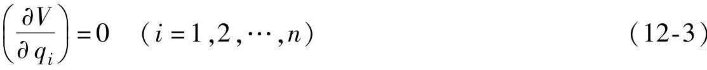

当系统在平衡位置附近作近似振动时，广义坐标及其导数均为小量。设平衡位置处的势能V取零值，将平衡位置附近的势能V展成泰勒级数，仅保留广义坐标的二阶微量，则导出：

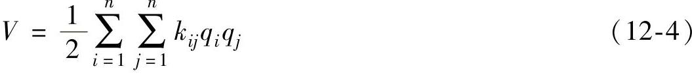

系数K_(ij)均为常数，定义为

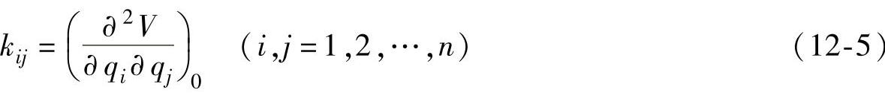

系统动能T为广义速度的二次齐次函数：

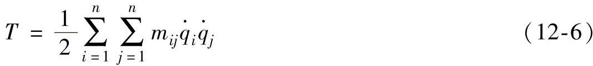

系数m_(ij)均为常数，定义为

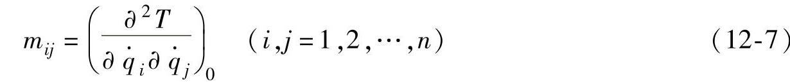

Q_(i)是与广义坐标q_(i)（i=1，2，…，n）对应的非保守广义力（包含阻尼力），L=T-V为拉格朗日函数，拉格朗日第二类方程的一般形式为

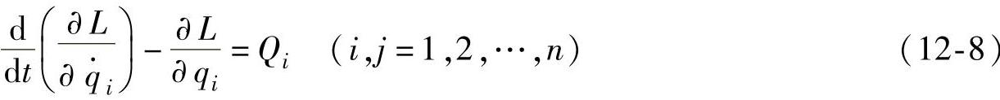

将式（12-4）和式（12-6）代入拉格朗日方程，导出多自由度系统的动力学方程组为：

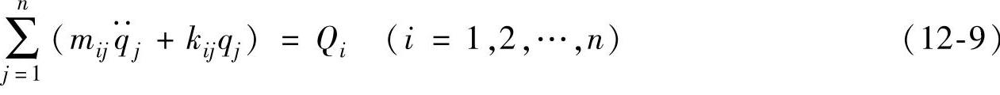

写作矩阵形式为

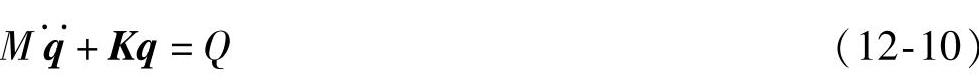

式中 M——质量矩阵

K——刚度矩阵

q——位移矢量

——加速度矢量

Q——非保守力矢量，包含阻尼影响因素模态分析是确定结构在无阻尼、自由振动条件下的固有振动特性，则结构的固有频率和振型的求解可转化为

式（12-11）有以下特解：

q=Asin（ωt+θ） （12-12）

式中 A——振幅组成的n阶列阵

ω——角频率

θ——初相角

此特解表示系统内各个坐标偏离平衡值时均以同一频率ω和同一初相角θ作不同振幅的简谐运动。

将式（12-12）代入式（12-11），化作矩阵K和M的特征值问题，A有非零解的充分必要条件为系数行列式等于零：

｜K-ω²M｜=0 （12-13）

展开后得到ω²的n次代数方程，即系统的本征方程

ω^(2n)+a₁ω^(2（n-1）)+…+a_(n-1)ω²+a_(n)=0 （12-14）

ω_(i)（i=1，2，…，n）为系统的n个固有频率，对于平衡状态稳定的正定系统，方程（12-14）存在ω²的n个正实根。

每个本征值ω²_(i)对应于各自的本征向量A^(（i）)，n个本征向量均满足：

（K-ω_(i)M）A=0（i=1，2，…，n） （12-15）

由方程（12-15）得到的A（i）称为系统的第i阶主振型或第i阶模态。

### 二、模态分析方法

风力发电机组一般运行在工况变化大、载荷复杂、工作条件恶劣的环境中，机组要承受循环载荷、瞬变载荷和随机载荷等多种类型动态载荷的激励作用。随着风力发电机组功率不断提高，整机结构尺寸（例如，叶片尺寸和塔架高度）不断增大，整体刚度随之降低，机组的固有频率也相应地下降到和激振频率相同的数量级，使得发生结构共振的危险性加大。因此，模态分析是风力发电机组设计过程中必须考虑的问题。

经过调研和分析后可以得出，风力发电机组中主要的弹性振动体为：

1.叶片和塔架振动

在特大型风力发电机组中，叶片和塔架具有尺寸大、质量重，刚度低的特点，一旦发生共振则振动振幅和惯性力也是较大的，对风力发电机组整机动态特性产生很大影响。

叶片振动包括挥舞、摆振和扭振三种主要形式。其中，挥舞是指叶片在垂直于旋转平面方向上的弯曲振动，也称为面外振动；摆振指叶片在旋转平面内的弯曲振动，也称为面内振动；扭振指叶片绕变桨距轴线的扭转振动。

塔架振动包括在风轮旋转轴线方向上的纵向弯曲振动，也称前后振动；与风轮轴线垂直平面内的横向弯曲振动，也称为左右振动，以及塔架的扭转振动。由于塔架的刚度和阻尼都比较小，如果叶片旋转频率接近塔架的固有频率，将产生较大幅度的振动。

2.传动系统振动

风力发电机组增速箱在运行中的振动形式复杂，包括齿轮及传动轴的扭转振动、弯曲振动和轴向振动，使得传动系统振动特性非常复杂，容易与外界激振力重合引起共振。目前，在传动系统动力学设计中，主要考虑主传动链及发电机转子构成系统的扭转振动。

3.机舱振动

机舱振动主要包括风轮旋转引起的纵向扭振和偏航系统引起的横向扭振。

4.风力发电机组整机振动

在外载荷作用下，风力发电机组会产生多个自由度的振动。机组整机振动分析要考虑风轮与塔架的耦合振动，这种耦合振动容易产生自激振动。但其相互之间只在一定的条件下会发生耦合振动，而其中也只有一小部分耦合振动产生实际作用，其他耦合振动仅限于理论探讨。

目前，在风电行业内多采用两款软件计算风力发电机组结构件的模态。

1）GH Bladed软件：GH Bladed软件作为风力发电机组的设计计算和认证软件之一，可以进行风力发电机组动力学分析计算。部件采用模态分析方法，独立计算转动部件和非转动部件的模态，然后采用模态叠加方法进行整机模态分析。采用能量守恒原理和拉格朗日方程建立运动方程，方程中考虑风轮挥舞和摆振的最大六阶模态、塔架前后、左右振动的最大五阶模态，方程中包含初期与陀螺相关的非线性项，方程考虑了气动弹性的影响，求解采用四阶变步长龙格-库塔法。

2）ANSYS软件：ANSYS软件的结构动力学分析功能可以进行模态分析，用于确定设计中的结构或设备部件的振动特性，既固有频率和振型，属于线性分析。ANSYS软件中提供了7种模态提取方法：子空间法（subspace）、分块兰索斯法（Block Lanczos）、PowerDynamic法、缩减法（Reduced）、非对称法（Unsymmetric）、阻尼法（Damp）、QR阻尼法。

对于风力发电机组的结构模态特性，通常采用坎贝尔（Campbell）图进行评估，如图12-7所示。坎贝尔图以风轮转速（r/min）作为横坐标，振动频率（Hz）作为纵坐标。图中可分别用垂直线，水平线和过原点的倾斜线表示风轮工作转速、风力发电机组各个部件或子系统的各阶固有频率、风轮旋转产生的周期性激励频率。周期性激励的倾斜线与固有频率水平线的交点对应的横坐标为发生共振的转速，风轮的工作转速范围应该避开这些共振转速，否则将引起共振损害。

### 三、实例：1.5MW机组塔筒模态分析

1.结构简介

1.5MW机组的塔筒采用多段锥筒式结构，由Q345板材焊接成型。本次分析的主要对象为塔筒，风轮和机舱部分的几何形状对塔筒动态特性的影响很小，为此分析中采取塔筒实体建模，风轮和机舱部分等效质点建模的方法。塔筒三维结构图见图12-8。

图12-7 风力发电机组Campbell图例

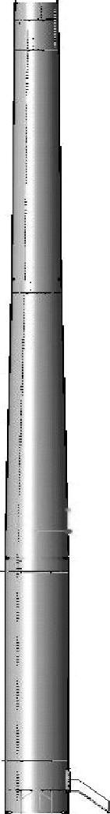

图12-8 1.5MW机组塔筒整体结构

2.有限元建模

塔筒采用8节点6面体单元分网。在风轮和机舱的等效质点处建立质量单元，并赋予风轮和机舱等效惯性属性（质量和转动惯量），该单元与塔筒上端面节点采用刚性梁单元连接。塔筒底部下端面施加全位移约束。

3.计算方法及结果

分析中选用Block Lanczos法提取塔筒前6阶模态。塔筒各阶模态固有频率数值见表12-4。各阶模态振型见图12-9～图12-14。

表12-4 塔筒模态分析结果

4.模态校核

根据参考文献\[45\]对塔筒设计的规定：塔筒的固有频率f_(0，n)和激振频率f_(R)、f_(R，m)之间应确保适当的间隔。即：

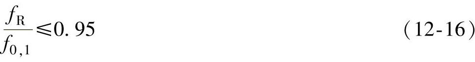

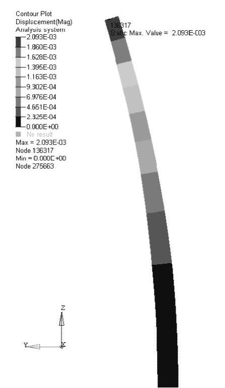

图12-9 一阶模态振型

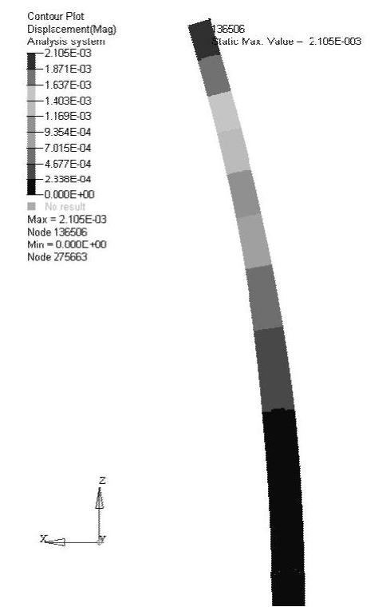

图12-10 二阶模态振型

图12-11 三阶模态振型

图12-12 四阶模态振型

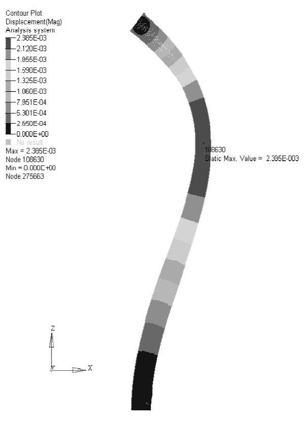

图12-13 五阶模态振型

图12-14 六阶模态振型

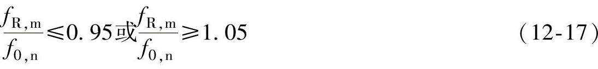

式中 f_(R)——正常运行范围内风轮的最大旋转频率；

f_(0，1)——塔筒的第一阶固有频率；

f_(R，m)——m个风轮叶片的通过频率；

f_(0，n)——塔筒的第n阶固有频率。

由有限元计算得到：塔筒的第一阶固有频率为0.3511Hz，根据上式可以确定该机组风轮的转速在7.74～19.01r/min范围内可满足振动设计要求。

图12-15 1.5MW塔筒坎贝尔图

## 第四节 疲劳强度分析

### 一、疲劳强度基础理论

疲劳破坏的特点是结构件在交变载荷多次作用下，尽管此交变载荷的量值远小于该结构件的静强度破坏载荷，但在结构件中的某点或某些点仍可能逐渐产生局部的永久性的结构变化，在一定循环次数后形成裂纹，并在载荷作用下继续扩展直到完全断裂。

由疲劳破坏的特点可以看出，它与静载破坏有着本质的区别，静载破坏是在高应力作用下结构件整体强度不足时瞬间发生的；疲劳破坏则是在满足静强度条件的较低应力多次作用下，结构件局部损伤积累的结果。局部应力集中对结构极限承载能力的影响不大，但对疲劳寿命影响很大。疲劳破坏与静载破坏的比较见表12-5。

表12-5 疲劳破坏与静载破坏的比较

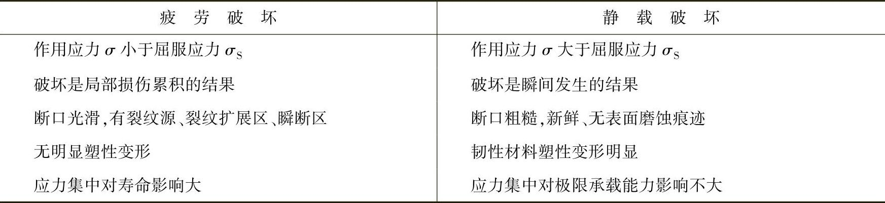

疲劳破坏从本质讲是非常复杂的过程，涉及金属微观结构、断裂力学等基础理论，限于篇幅本节不做具体介绍，感兴趣的读者可查阅相关参考文献。

对于风力发电机组来说，运行状态随外界环境时刻变化，承受的风载荷和旋转离心力都在交替的变化，结构设计严重受约于随机载荷作用。因此，为确保风力发电机组在设计年限内平稳运行，必须对机组的关键结构件进行疲劳强度校核，检验其疲劳损伤度是否满足设计要求。

目前，在风力发电机组中，对关键结构件（除焊接和螺栓外）较为常用的疲劳分析方法为基于高周、多轴的疲劳分析方法，主要以有限元软件和疲劳分析软件辅助计算完成。

所谓高周疲劳是按照作用的循环应力的大小区分的。若最大循环应力σ_(max)小于屈服应力σ_(S)，作用的循环应力水平较低，寿命循环次数较高（疲劳寿命N_(f)一般大于10⁴次），则称为高周疲劳，反之称为低周疲劳；多轴疲劳是指疲劳损伤发生在多轴循环加载条件下，即至少有两个或三个方向施加的应力独立地随时间发生周期性变化。它们的变化可以是同位相、按比例的，也可以是非同位相、非比例的。

对于高周疲劳分析来说，疲劳强度基础理论主要涉及S-N曲线、雨流计数法、疲劳损伤法则等。

1.基本S-N曲线

材料的疲劳特性，可用作用应力S与到破坏时的寿命N之间的关系描述。经大量的实验验证，标准试件在最简单的对称恒幅载荷循环作用下，应力S与破坏时的寿命N存在幂函数关系式，即

S^(m)·N=C （12-18）

式中 m、C——与材料、应力比、加载方式等有关的参数。

图12-16表述了S-N曲线的基本形式。应用在风力发电机组结构件的S-N曲线参数，主要来源于标准规范指定的计算方法或数据。

应当注意的是，材料的S-N曲线数据是在恒幅对称循环应力作用下，对表面光滑的标准试件进行大量疲劳实验的基础上获得的。对于应力比不等于-1（即平均应力不为0）的情况，应当依据应力幅值S_(a)与平均应力S_(m)之间存在的关系，将一般应力水平转化为特定的应力水平。例如，转化为应力比等于-1时的应力水平。S_(a)-S_(m)之间的关系通常以无量纲形式的Haigh图绘出，如图12-17所示。此图例中给出了金属材料在循环次数N=10⁷时的S_(a)-S_(m)关系，坐标标尺分别用疲劳极限S₋₁和极限强度S_(u)进行了归一化。

图12-16 S-N曲线的一般形式

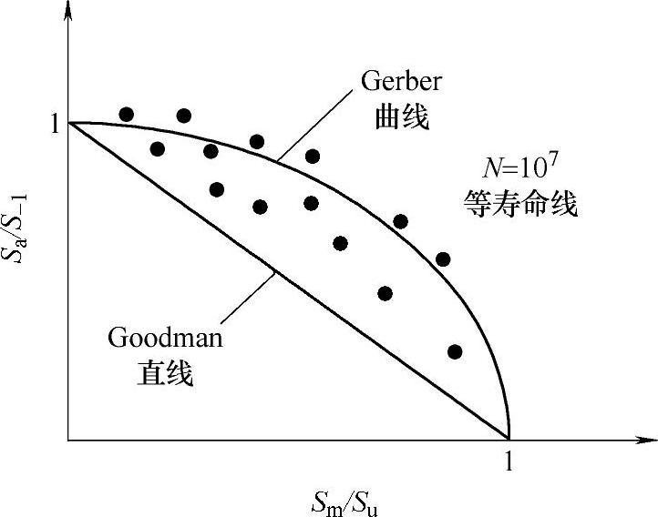

图12-17 Haigh图

由Haigh图可以看出，所有的实验点都介于直线和抛物线之间。抛物线称为Gerber曲线，表达式为

图中的直线称为Goodman直线，表达式为

利用上述关系，已知材料的极限强度S_(u)和S-N曲线，即可估计出在不同应力比或平均应力下的疲劳性能。鉴于所有的实验点基本都在Goodman直线的上方，直线形式简单，且在给定寿命下的估计偏于保守，所以在疲劳分析中推荐采用Goodman方法修正应力水平。

在实际情况中，因循环载荷，表面粗糙度等各种各样的因素会影响材料S-N的参数值，这些因素绝大多数都会导致材料S-N曲线的降低。因此，在引用S-N数据时，应适当修正参数值。

此外，像温度等是影响疲劳性能的重要因素。对于目前应用于风力发电机组上的材料，在使用中的温度都是远低于材料的蜕变温度，所以可以不用引入高温对寿命的影响；冷作硬化和残余应力对零部件疲劳强度也有相当大的影响。一般来说，零部件表面有一层均匀的残余压应力对疲劳强度是有利的。如果零部件表面的残余应力是拉应力，则会降低疲劳强度。腐蚀环境对结构的疲劳性能也会产生重要的影响作用，循环交变载荷和腐蚀介质联合作用要比其中一个单独因素的作用更加有害，会产生一个相互催化的作用，即腐蚀环境下会促进疲劳裂纹的发生与发展，而疲劳载荷也会有利于结构材料的腐蚀。另外，像疲劳载荷的作用顺序、噪音环境等都会影响到结构件的疲劳寿命，若在机组运行的环境容易这些因素影响，应特别注意。

2.疲劳损伤法则

1）Miner线性累积损伤理论疲劳累积损伤理论是疲劳分析的主要原理之一。也是估算交变应力幅下安全疲劳寿命的关键理论。在结构疲劳寿命计算中。Palmgren-Miner理论（简称Miner理论）是应用最广泛的线性累积损伤理论。该理论假定，材料在各个应力水平下的疲劳损伤是独立进行的，总损伤可以线性叠加。当累积损伤超过1时，就达到了限制状态，所以在使用寿命期限内，累积损伤应小于或等于1，即

式中 n_(i)——典型载荷谱的第i级载荷的计算疲劳循环次数；

S_(i)——与第i级载荷计算循环次数相对应的应力（或应变），包括平均应力和循环顺序的影响；

N（γ_(m)，γ_(n)，γ_(f)，S_(i)）——疲劳破坏循环次数，它是以应力（或应变）为自变量的函数；

γ_(m)——材料局部安全系数；

γ_(n)——破坏后局部安全系数；

γ_(f)——载荷安全系数；

2）疲劳损伤准则按照材料疲劳破坏参量，可将疲劳破坏准则划分为三类，应力准则、应变准则和能量准则。在单轴高周疲劳载荷作用下，通常采用S-N方法描述材料的疲劳寿命特性。对于给定的疲劳寿命N，可以通过S-N对应关系得到应力S_(N)，当作用应力S大于等于S_(N)时，材料发生疲劳破坏，即有准则：

S＜S_(N) （12-22）

上式是建立在单轴疲劳状态基础上的准则。在实际使用中，结构的裂纹最初在表面引起的。呈现的是二向应力状态，这与疲劳实验是有差别的。由于二向应力状态下应力、应变主轴不断旋转导致材料出现附加强化等现象，疲劳损伤性质与单轴状态明显不同，为此需要寻找适合的准则进行疲劳强度分析。目前，针对不同材料和不同加载方式，许多学者提出了若干个多轴应力准则，主要有：

1）Gough等早期研究者通过对圆试件进行弯扭疲劳试验后提出，对于脆性材料应采用最大拉应力理论，而对于韧性材料应采用Von Mises或Tresca准则，并给出椭圆方程准则：

式中 σ_(af)，τ_(af)——不同疲劳寿命时材料在单独拉伸和单独扭转下的疲劳强度；

σ_(a)，τ_(a)——拉伸与剪切应力幅值，在Gough的双轴疲劳实验中，拉伸和扭转是同相位的比例加载。

2）Marin以应力分量的第二不变量J₂的平方根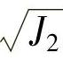的幅值和中值为参数，提出如下应力准则：

式中 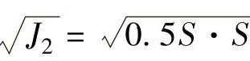；

S——应力张量；

f₋₁——对称弯曲极限；

σ_(b)——材料抗拉极限，实际应用中Marin建议，取K=1，λ=μ=2。

3）Findley以临界面上的最大正应σ_(max)（φ_(c)，ϑ_(c)）和剪应力τ_(a)（φ_(c)，ϑ_(c)）为参数提出以下准则：

τ_(a)（φ_(c)，ϑ_(c)）+k·σ_(max)（φ_(c)，ϑ_(c)）≤λ （12-25）

式中 k，λ——材料常数

φ，ϑ——局部坐标轴与整体坐标轴间的夹角，下标c代表临界面，临界面定义为正应力和剪应力的线性组合达到最大值的面。

### 二、疲劳强度分析方法

风力发电机组结构件疲劳分析的一般方法为：首先了解有关零部件的几何形状、材料性能、加工工艺和加载历史，应用结构分析技术判别可能发生破坏的位置，即危险点；然后计算外载荷条件下的局部应力-应变响应。对于复杂的加载历史，应用循环计数法对载荷分析处理得出统计规律；最后利用部件或材料疲劳S-N曲线对结构件进行疲劳损伤分析，获得疲劳寿命的预计值。其主要步骤如图12-18所示。

疲劳分析流程中，几个重要的环节如下。

图12-18 疲劳分析的主要步骤

1.设计载荷谱

风力发电机组的载荷谱来源可以是实际检测的数据，也可以是基于相关规范通过仿真计算获得的数据。一般来说，在风力发电机组初步设计阶段，疲劳分析使用的载荷谱主要是依据相关规范，通过软件仿真计算获得的一组数据。

应当注意的是用于疲劳分析的载荷谱，应能够包括机组运行中可能遇到的所有涉及疲劳损坏的工况；表征载荷谱数据的时间长度和时间间隔应能够体现载荷的瞬时变化程度；完整的载荷谱数据应包括若干组载荷-时间历程数据和载荷谱累计循环次数数据（即工况频率数据）。

2.S-N曲线参数

一般地，基于测试数据拟合的S-N曲线是首选方案。但是，这种方法存在测试周期长，制作成本高，有限的测试数据未必可靠等问题。目前，风电行业业内多采用设计疲劳S-N曲线进行疲劳分析。所谓设计疲劳S-N曲线是指考虑了生存概率，尺寸效应，材料局部安全系数，载荷安全系数等因素的一组S-N曲线参数数据。风力发电机组常用的设计疲劳S-N曲线参数是根据经验公式获得的，具体的对于每个零部件来说，参考文献\[45\]推荐了适用的计算方法。例如铸铁材料或锻件材料可采用《Leitfaden fureine Betriebsfestigkeitsberech-nung》中的拟合方法，相关参数须满足参考文献\[45\]的要求；螺栓或焊接结构件的S-N曲线参数推荐采用参考文献\[45\]\[56\]的计算方法，相关参数首先要满足参考文献\[45\]的要求。

3.应力数值计算

影响疲劳结果的一个关键因素是如何计算应力时间序列数据。风力发电机组结构件的应力数值计算主要有两种方法：一类是基于有限元法的外推法或内插值法，另一类是根据弹性力学或经验公式推导的工程计算方法。

基于有限单元法的外推法，通常也称为准静态分析方法是基于线性偏微分方程组满足叠加性的性质，即：一组不同方向载荷综合作用所产生的效果，等于这些载荷单独产生效果的累加。所以，预计算结构件的应力时间序列可以通过分别计算结构件在F_(x)～M_(z)六组单位载荷单独作用下的应力数值，再以载荷值作为加权因子，通过叠加计算得到。应当注意的是，准静态计算方法仅适用于线性或拟线性系统，且只能用作应力张量及其分量之间的线性叠加。

对于具有非线性特征的结构件。如轮毂与主轴之间的螺栓，因其应力状态受到端面边界非线性的影响，不适用于准静态计算方法。一种分析方法认为，对于载荷单独作用时的情况，可以将疲劳载荷时间序列中的极值加载至分析模型中，并按10％，20％，…，100％增量步输出应力数据，进而根据载荷与应力的关系构造分段线性函数。则要计算某载荷值作用下的应力，可根据此函数式获得。对于载荷综合作用的情况，鉴于疲劳载荷通常远小于极限工况的载荷极限值，分析模型在定常载荷作用下属于拟线性系统，所以由不同方向载荷综合作用下的应力，可通过加权叠加的方法获得。

工程计算方法一般适用于外形简单，受载简单的一类结构件。例如，可用于计算锥筒式塔筒环焊缝的疲劳强度以及“L”型或“T”型法兰螺栓连接的疲劳强度。风力发电机组中常用的疲劳工程算法计算流程可参考文献\[45\]中的规定。

### 三、实例：1.5MW机组底盘疲劳强度分析

1.结构简介

1.5MW机组的底盘由球墨铸铁铸造成型，是机组的主要承力结构，所有从叶片传来的外载荷，都要经过主轴传递至底盘。此外，底盘还要承受发电机、变流器等部件的重力作用以及风轮旋转引起的周期性惯性力和偏航引起的离心力等。可见，底盘受力非常复杂，本次分析旨在评估这些复杂载荷对底盘疲劳强度的影响，底盘结构图如图12-19所示。

2.有限元建模

本次分析考察的重点为底盘主体的疲劳强度，不计入底盘与其他部件之间连接区域的非线性特征，为此在分析中构建了简化的模型。建立了底盘整体模型，主轴、偏航轴承模型以及塔筒部分模型。有限元分网原则为：材料参数依据设计规范获得；底盘、主轴、偏航轴承以及塔筒均以10节点4面体单元分网；细化底盘倒圆/倒角处的网格，根据静强度分析结果细化高应力区域的网格，追求这些区域高质量的网格；对于属于不同结构的实体单元，采用共节点匹配建立连接；轮毂中心加载节点与承力结构之间以多点约束建立连接。有限元模型见图12-20。

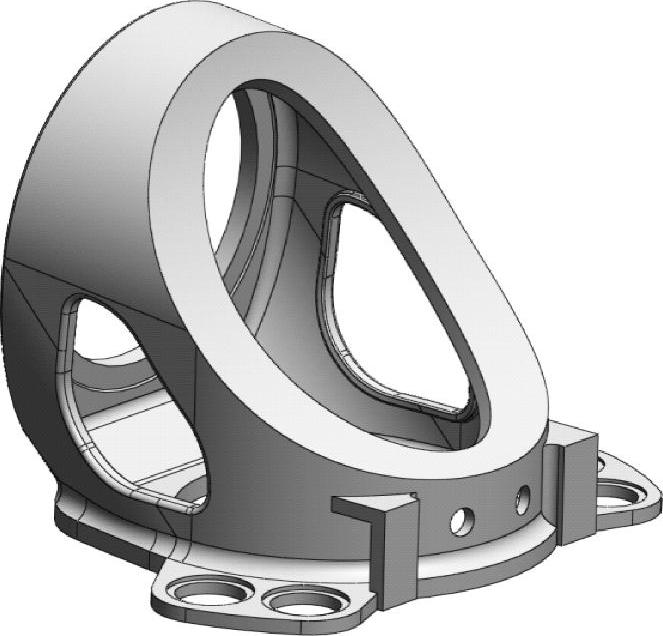

图12-19 底盘结构三维图

图12-20 分析有限元图

3.疲劳分析

1）应力计算：底盘疲劳分析模型属于线性模型，故应用准静态分析方法求解底盘的损伤度，为此先执行6组单位载荷分量下的静强度分析。加载点为轮毂中心节点。塔筒下端面约束全部方向自由度。

2）S-N曲线：参数底盘材料为QT400-18AL，故按照参考文献\[45\]得到表12-6的数据。

表12-6 底盘S-N曲线参数表

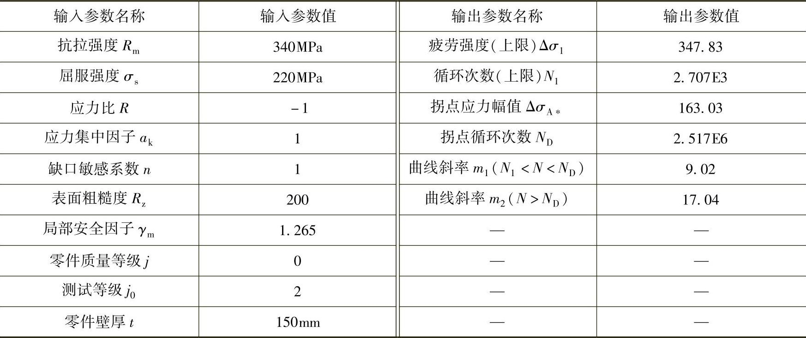

3）疲劳载荷谱：疲劳分析采用的载荷谱由GH bladed软件给出，共有70组工况，每个工况含6个载荷分量，仿真时间为600S的载荷-时间历程。6个载荷分量依次为轮毂中心对应的M_(x)～F_(z)六个载荷-时间历程，它们表示载荷随时间变化的关系。

4）疲劳计算方法及结果：底盘受载状态复杂，疲劳应力呈现非比例多轴状态，为此，本次分析基于疲劳分析软件，应用多轴疲劳理论中的关键平面法对底盘进行疲劳寿命评估。分析中设置最大主应力作为损伤等效应力，设置Goodman直线方法作为平均应力修正方法。考虑疲劳破坏特点和计算时间等因素，本次分析选取若干个高应力危险区域进行了疲劳强度校核。由疲劳计算软件得到底盘疲劳寿命为37.94年，疲劳分析结果如图12-21所示。

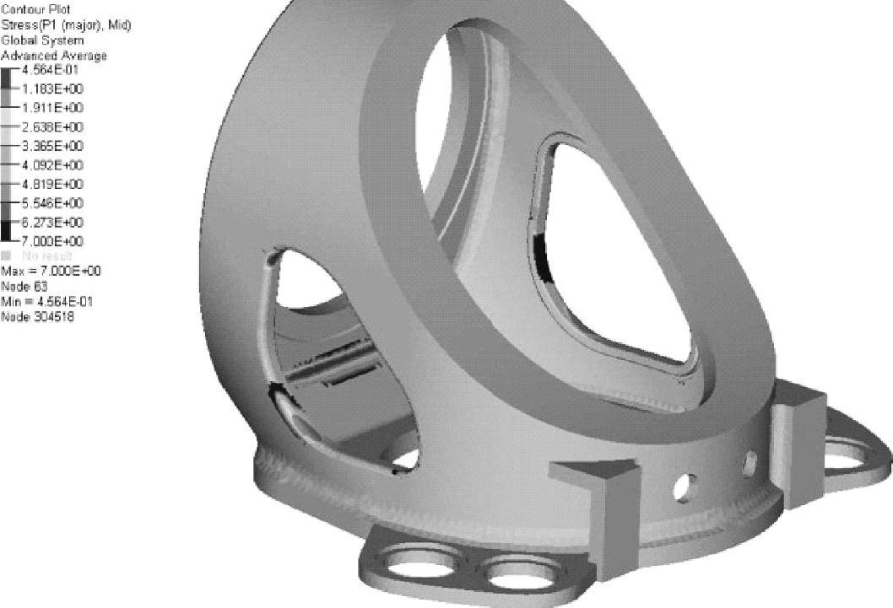

图12-21 底盘寿命分布云图（对数寿命）

4.疲劳分析结论

根据参考文献\[45\]的要求：1.5MW风力发电机组底盘在设计寿命年限内的疲劳损伤度D应小于等于1。经本次疲劳计算得到，底盘的最小寿命为37.94年，20年的损伤度为0.527，满足疲劳强度设计要求。

## 第五节 屈曲稳定性分析

### 一、屈曲稳定性分析方法

屈曲稳定性是结构强度分析中较为特殊的问题。一般地，结构分析通常是根据内力和外力之间存在稳定性的平衡这一假定来求出应力的。这就是说，要达到这样的平衡状态，即：在一定范围内，载荷情况有任何微小的改变时，不会使系统中产生不按比例增加的应力或弹性变形。因此，结构件的安全性的保证依赖于某一定应力（称为许用应力）。而屈曲稳定性问题表现出一个完全不同的性质—要查出外界载荷与结构内部抗力之间可能发生的不稳定平衡。在发生不稳定平衡的瞬间，结构从一种形式的稳定平衡转变为另一种形式的稳定平衡，且伴随着能量的吸收或释放，这个过程中造成了结构件的破坏。例如，研究欧拉杆受轴向压载荷的屈曲稳定性会得到一临界载荷P_(cr)，当压力P＜P_(cr)时，杆的直线平衡形式是稳定的；当P＞P_(cr)时，直线平衡形式变为不稳定的，杆一旦受到干扰便将趋向于弯曲平衡形式。P=P_(cr)称为平衡的“分支点”，此时的载荷称为临界载荷。屈曲稳定性图例如图12-22所示。

通过基础理论研究和大量实验表明，细长杆、薄壁结构因为其抗弯刚度较低，容易在受压载荷或弯曲载荷状态下发生屈曲失稳。对比此类结构特征，不难看出在风力发电机组中，锥筒式塔筒必须进行屈曲稳定性分析。此外例如，液压变桨机构中的推力杆也应进行屈曲稳定性分析。

目前，应用于风力发电机组中的屈曲稳定性分析方法可分为两类：一类为非线性屈曲稳定性分析，一般流程为

1）在有限元软件中构建结构模型并分网；

2）执行特征值屈曲分析，得到特征值表示的屈曲载荷系数；

3）施加初始几何缺陷或初始扰动，执行非线性屈曲分析，获得临界载荷、屈曲变形以及相对应力分布。

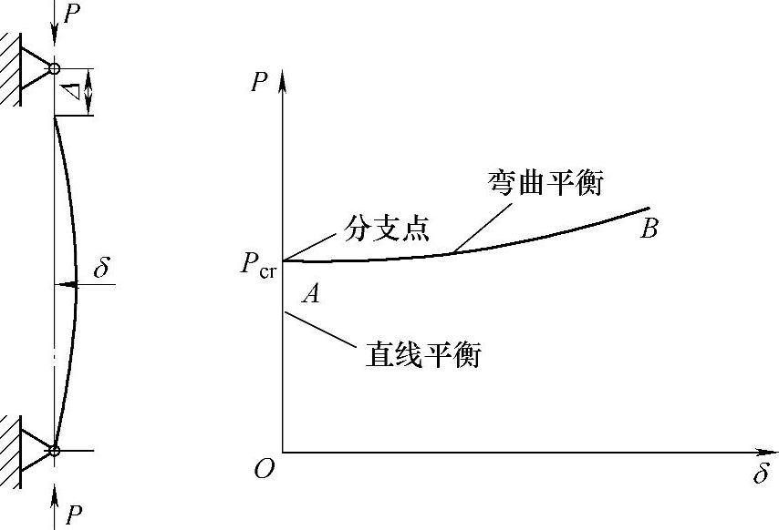

图12-22 Euler杆屈曲稳定性图例

理论上，非线性屈曲稳定性分析可应用于任意复杂的结构件，因算法引入了几何缺陷和载荷扰动，与结构真实的受载状态相似，所以可以得到较好的结果。但是在实际分析中，结果容易受到有限单元质量，初值及非线性算法收敛性的影响，使得结果的可靠程度不高，在计算中应仔细考虑上述影响因素，必要时进行多组对比分析计算。

另一类为工程计算方法，主要针对某些几何特征简单的结构件制定的公式计算法。计算流程可参照相关规范。例如，塔筒屈曲稳定性分析可参照《DIN18800 part 4：Structuralsteelwork Analysis of safety against buckling of shells》。

### 二、实例：1.5MW机组屈曲稳定性分析

1.结构简介

机组塔筒采用多段锥筒式结构，由Q345板材焊接成型。壁厚介于10mm～25mm区间。几何参数及载荷见表12-7，长度单位mm，载荷单位kN或kN·m。

表12-7 几何参数及载荷值

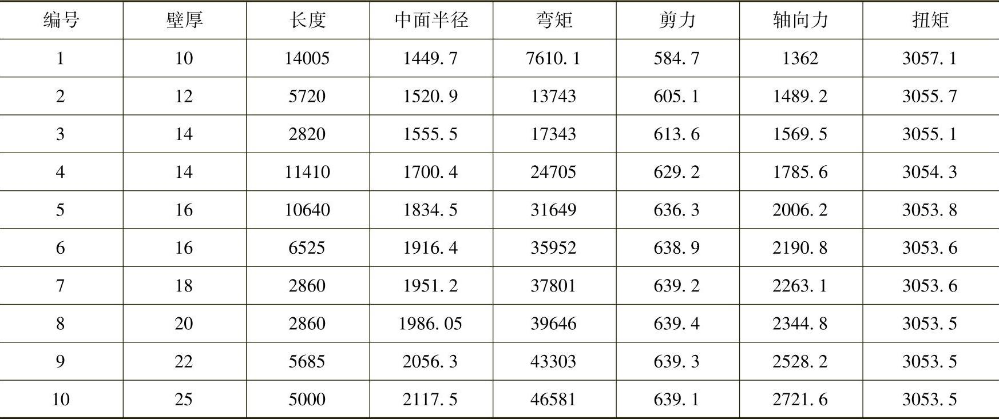

2.计算方法及计算结果

本次分析应用参考文献\[47\]中的方法对该塔筒进行屈曲稳定性分析，具体设置如下：

1）对各个塔筒截面进行纵向和环向及组合情况的屈曲强度计算；

2）采用rb2-rb2约束方案，以塔筒段作为截取段高度；

3）提取相同壁厚下沿位置的极限载荷值作为外载荷条件；

4）依据参考文献\[45\]对系数C_(x)进行修正；

由计算得到屈曲安全系数见表12-8。

3.结论

根据参考文献\[47\]对结构件的屈曲稳定性要求：

纵向压缩方向： 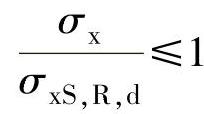

环向剪切方向： 

组合工况： 

由计算屈曲安全系数得到该塔架满足屈曲稳定性设计要求。

表12-8 屈曲计算结果

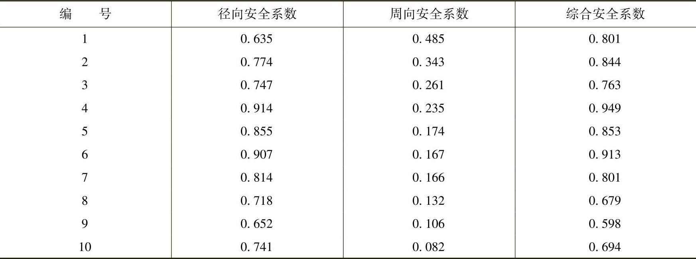

## 附录

## 附录A 笼型感应发电机计算机辅助电磁设计源程序

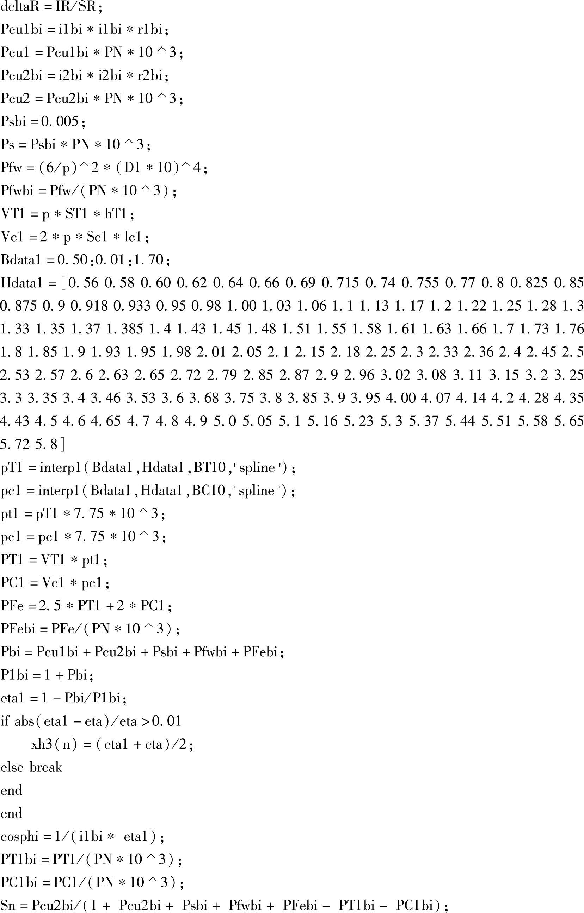

## 附录B 双馈感应发电机计算机辅助电磁设计源程序

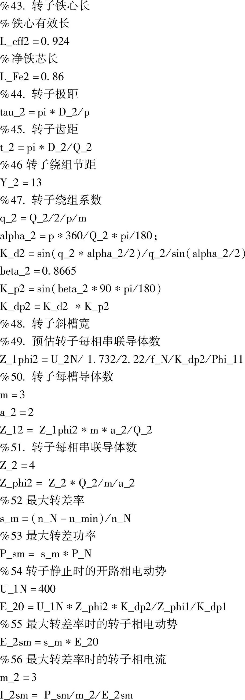

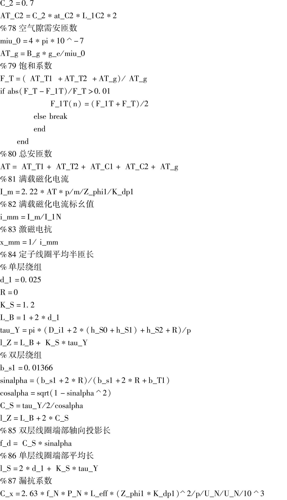

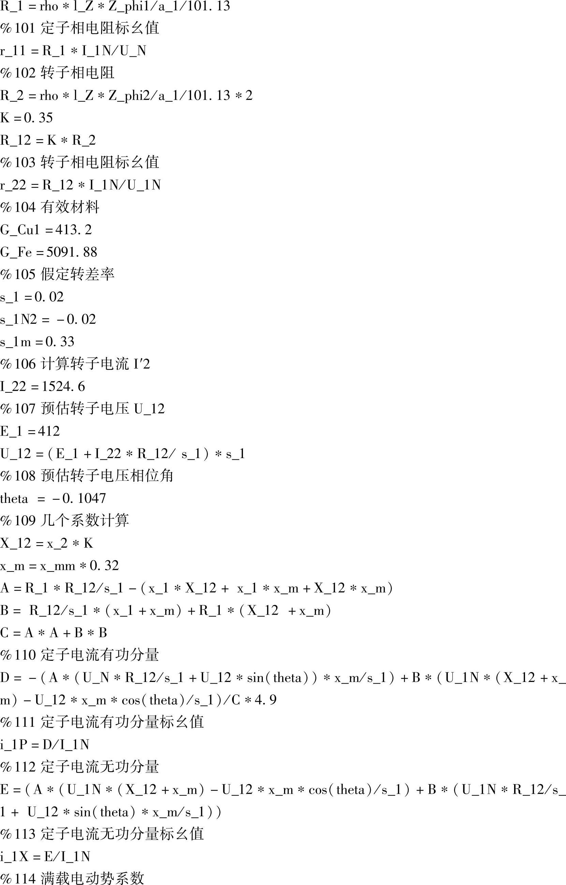

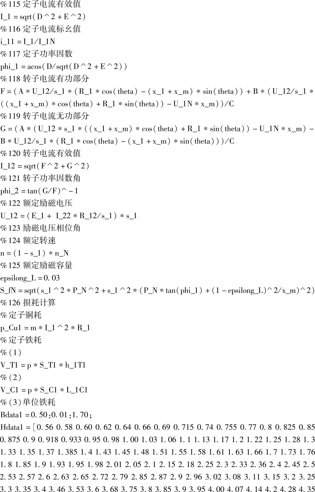

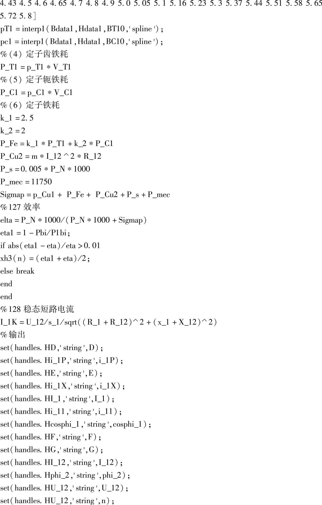

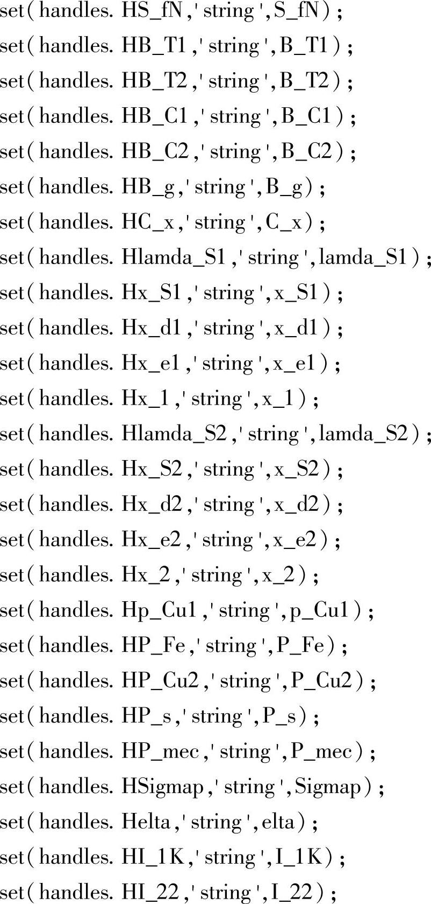

