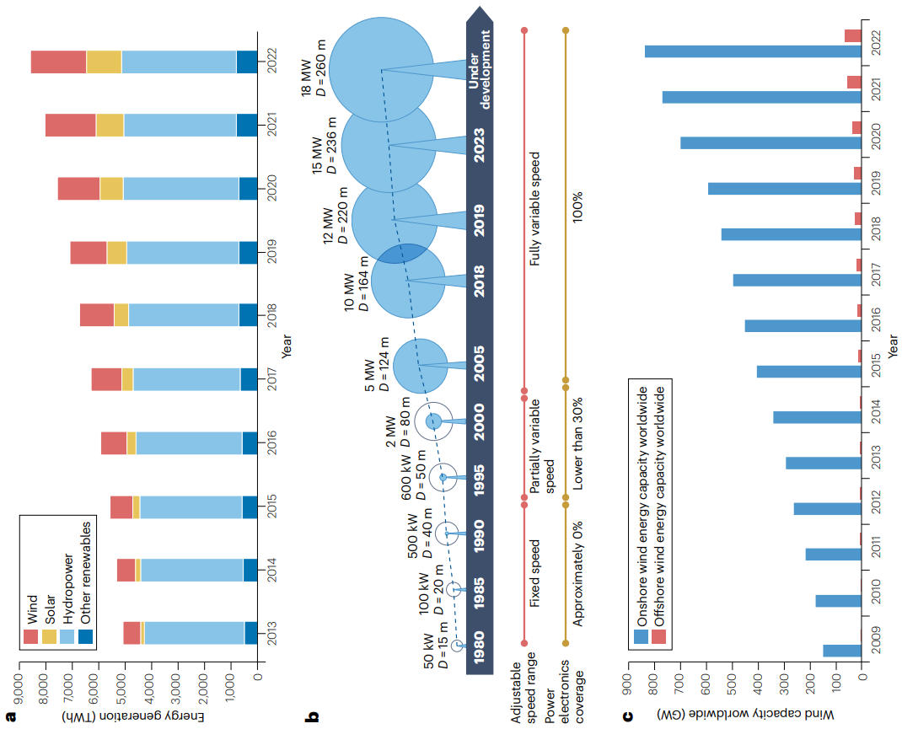

# 2 风力发电系统的技术现状

在全球可再生能源发电中，水电所占份额最大。然而，在过去十年中，风电和太阳能发电的增速高于其他可再生能源，2022年二者分别占可再生能源发电量的24.7%和15.5%[28](#page-13-0)（图[1a](#page-2-0)）。与此同时，过去三十年电力电子技术的快速发展推动了风力发电机的技术变革，例如由定速、小功率风力发电机组发展为变速、大功率风力发电机组[17](#page-13-1)[,19,](#page-13-2)[29](#page-13-3)。本节回顾风力发电系统的发展，并简要讨论并网规范对电网接入提出的要求。

## **风力发电系统的发展**

风力发电系统利用风能，将其动能转换为电能。随着技术进步使世界各地丰富的风能资源能够以越来越低的成本得到开发，风能正成为最受欢迎的可再生能源之一[30](#page-13-4)[,31](#page-13-5)。在风力发电系统中，风力机、发电机和并网变流器是过去30年间持续发展的三个关键组成部分[32](#page-13-6)[,33.](#page-13-7) 风力机将风能转换为机械能。容量更大、转子叶片更长的风力机日益普及（图[1b](#page-2-0)），风力机容量已由千瓦级提升至兆瓦级[34](#page-13-8)。与此同时，风力机不再只是给电网带来运行困难的设备，而是逐渐成为电网的主动参与者[13](#page-13-9)。例如，传统风力机通常只向电网注入有功功率，这可能在电网故障情形下恶化系统稳定性；现代风力机控制系统则可在电网故障期间迅速降低有功功率并提供适当的无功功率，从而有利于电压稳定。

发电机和并网变流器分别将机械能转换为电能，并进一步将电能输送至电网。随着电力电子技术发展，越来越多的风力发电系统配置了功率变流器[35](#page-13-10),[36](#page-13-11)；例如，3型和4型风力发电机组均配置背靠背变流器。这些变流器均可实现全控，从而提高控制策略的灵活性并改善风力机性能。由于风速变化会造成风力发电功率波动，风力机通常以风电场形式成组布置在风资源持续且强劲的区域，例如沿海地区、平原或高海拔地区[37.](#page-13-12) 多台风力机集中布置可提高总能量输出并改善并网性能。此外，风电的间歇性要求通过有效并网实现电力供需平衡。因此，风电预计将在电网调节中发挥越来越积极和动态的作用，同时必须符合严格的并网规范。

陆上和海上风电装机容量逐年增长（图[1c](#page-2-0)）。2022年，全球陆上和海上风电装机容量分别约为830 GW和65 GW。随着适合建设陆上风电场的区域逐渐趋于饱和，海上

**图1｜风力发电系统的发展。a**，全球可再生能源发电量比较。**b**，风力机技术。风轮叶片旋转圆周内的蓝色阴影区域表示电力电子装置所覆盖的功率占总功率的比例。**c**，全球风电装机容量。*D*，风轮直径。

风电场因可利用海上空间相对丰富而具有更大的未来发展潜力[38](#page-14-0)[–40](#page-14-1)。

## **风电行业面临的挑战**

尽管过去30年取得了显著进展，风电行业仍面临多项挑战。解决这些问题对于提高风电的可靠性、效率和成本效益至关重要[41,](#page-14-2)[42](#page-14-3)。

**海上电力输送。** 将海上风电场产生的电力输送至陆上电网是一项重大挑战，因为风电场通常远离海岸，海底电缆的安装成本高且技术复杂。此外，长距离交流（AC）输电要求海上变电站提供大量无功补偿，这也会增加成本。为解决该问题，Hitachi Energy、Siemens Energy 和 General Electric 等公司已开发高压直流（HVDC）输电技术。然而，伴随HVDC输电应用的大功率AC–DC和DC–AC变流器，也为电力电子系统带来了功率损耗、稳定性、可靠性、绝缘和保护等新挑战。

**稳定性与振荡。** 变流器接口型风力机通常依靠锁相环（PLL）锁定电网电压相角，以实现同步。随着风电渗透率提高，

通常用短路比描述的电网强度将显著下降。此时，基于PLL的跟网型风力机可能面临小信号稳定和暂态稳定问题[43](#page-14-4)[,44](#page-14-5)。例如，2017年美国得克萨斯州南部发生了次同步振荡事件，振荡频率为22–26 Hz；2019年英国电力系统观测到9 Hz振荡，随后认定其原因是弱电网振荡[45](#page-14-6)；2021年，风电场渗透率较高的苏格兰又观测到8 Hz振荡[45.](#page-14-6)

**可靠性。** 风力机长期暴露在恶劣环境条件下，会随时间发生磨损。确保风力机的长期可靠性和耐久性，对降低维护成本和停机时间至关重要。采用状态监测和数据分析等预测性维护技术，及早识别机械问题或部件故障迹象，是一种可行方案[46](#page-14-7),[47.](#page-14-8) 此外，随着渗透率提高，风力发电系统在现代电网中愈发关键。因此，这些系统应能够承受极端扰动或恶劣天气条件（如强风、风暴和雷击），并在受到影响后恢复，同时保持发电能力[48](#page-14-9),[49.](#page-14-10)

**工程实施。** 更大型的风力机虽然能够捕获更多风能，但也会带来工程和物流挑战。例如，塔架、叶片和机舱等大型部件体积庞大、质量很重。在陆上运输这些部件需要能够承载相应荷载的专用设备和车辆，而将风力机运输至海上风电场还需要大型船舶。

## **并网规范**

并网规范是电网运营商和监管机构制定的一组技术要求与指南，旨在确保可再生能源安全、稳定、高效地接入电网[50.](#page-14-11) 不同地区或国家的并网规范有所差异，但通常都着重规范可再生能源系统的连接和运行，以维持电网稳定性与可靠性[51](#page-14-12)。对于风力发电机组并网，并网规范一般会涉及以下几个共同方面。

**有功功率调节与频率响应。** 在电力系统中，电力供给和需求应始终保持平衡，以维持稳定运行。因此，要求风力发电机通过有功功率控制和频率控制参与电网稳定调节，帮助维持电力系统中的功率平衡[52.](#page-14-13)

**电压与无功功率调节。** 并网规范规定了风力发电机并网运行时必须遵守的电压和频率允许变化范围。风力发电机应通过提供无功功率支撑并将电压维持在可接受范围内，为电网电压稳定作出贡献[53.](#page-14-14)

**故障穿越能力。** 风力发电机在短路故障等短时电网扰动期间应保持连接和运行。并网规范规定了最低故障穿越能力，以确保风力发电机组能够穿越故障并继续供电，从而支撑电网稳定[y54.](#page-14-15)

**电能质量。** 风力发电机必须满足特定电能质量标准，包括对谐波、闪变和其他电气扰动的限制，以避免对其他已连接电气设备造成不利影响[55.](#page-14-16)

**并网与保护。** 并网规范规定了风力发电机接入电网的技术要求，包括隔离故障设备以及防止异常运行条件下电网受损的保护措施[s55.](#page-14-16)

**通信与监测。** 并网规范通常要求风力发电机配置通信系统，以便与电网运营商开展远程监测、控制和数据交换[s56](#page-14-17)。

