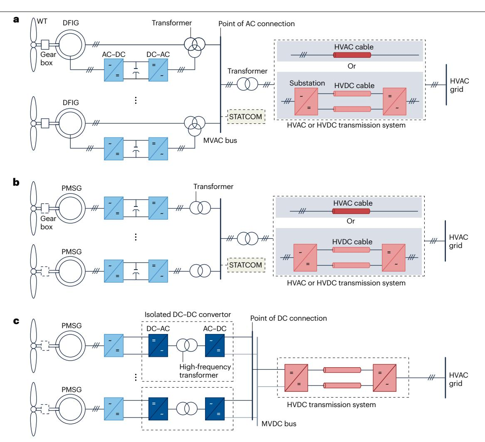
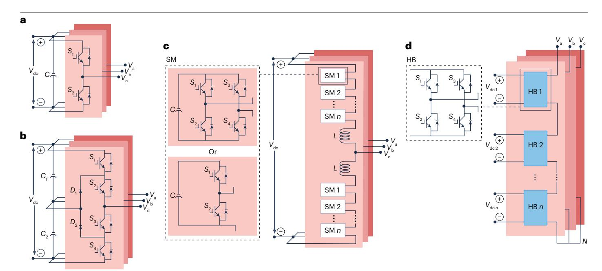

# 3 风力发电系统中的电力电子技术

现代风力机接入电网主要依赖功率变流器，因此，电力电子技术已成为风力发电系统发展的关键技术。其中两个重要方面是电路拓扑和控制策略。本节回顾并讨论若干常用拓扑，下一节将介绍不同控制策略。

## **基于变流器的风力发电系统一般结构**

现代风电应用广泛采用两类典型的功率变流器型风力发电系统：采用双馈异步发电机（DFIG）的3型风力发电系统（图[2a](#page-4-0)）；以及采用永磁同步发电机（PMSG）的4型风力发电系统（图[2b\)](#page-4-0)）。

**发电机。** DFIG基于异步发电机原理，由绕线转子和定子组成。定子直接连接电网，转子则通过功率变流器连接电网[57](#page-14-18),[58](#page-14-19)（图[2a](#page-4-0)）。由于转子侧功率取决于发电机转差率，只有部分功率流经功率变流器，因此变流器可采用较小的功率等级，例如额定功率的三分之一。与全功率变流风力机相比，这种部分功率变换系统能够降低功率变流器的尺寸和成本[59](#page-14-20)[–64](#page-14-21)。此外，转子侧功率变流器使发电机能够独立控制有功功率和无功功率[65–](#page-14-22)[68.](#page-14-23) 功率变流器还可帮助风力机穿越电压扰动并保持稳定。尽管具有上述优点，3型风力机（DFIG-WT）仍存在一些局限。转子侧功率变流器需要滑环或其他旋转电接触部件，因此相较于全功率变流风力机，其维护需求可能更高[69](#page-14-24)。

4型（全功率变流）风力机采用PMSG，将风力发电机组的功率高效输送至电网。其功率变流器把发电机输出的变频、变压电能转换为与电网频率匹配的稳定交流输出[70](#page-14-25)（图[2b](#page-4-0)），从而实现与电网的平滑连接并辅助控制功率流[25](#page-13-33),[71](#page-14-26)。全功率变流风力机保留了DFIG-WT的优点，例如变速运行、电网友好运行和低电压穿越（LVRT）能力[y72](#page-14-27)[–76.](#page-14-28) 但与DFIG风力机不同，其不需要滑环。当全功率变流风力机采用PMSG时，还可通过直接驱动设计取消齿轮箱。

**图2**｜**基于变流器的风力发电系统结构。a**，3型风力发电系统。**b**，4型风力发电系统。**c**，直流（DC）连接的风力发电系统。AC，交流；DFIG，双馈异步发电机；HVAC，高压交流；

HVDC，高压直流；MVAC，中压交流；MVDC，中压直流；PMSG，永磁同步发电机；STATCOM，静止同步补偿器；WT，风力机。

这是因为，随着转子极对数增加，电气旋转速度与机械旋转速度之比也会增大。通过在转子上设计较多极对，可以实现齿轮箱的功能。因此，全功率风力机可能更适合海上风电应用，因为没有滑环和齿轮箱，其维护需求低于其他类型风力机。总体而言，全功率变流风力发电机组凭借高效率、电网友好运行和高可靠性，在现代风电项目中日益普及77,78。

**静止同步补偿器。** 目前，3型和4型风电场仍普遍安装静止同步补偿器（STATCOM），以支撑交流母线的无功功率和电压79（图2a、b）。但部分先进风力机已经能够提供无功功率支撑，因此未来风电场可能不再需要STATCOM。

**控制策略、输电与储能系统。** 可采用集中式或分布式控制策略汇集各台风力机的功率。在集中式控制中，中央控制器向每台风力机发送电压、功率指令和同步信号，风力机根据这些指令调整运行状态。与之相比，在分布式控制中，每台风力机均配备自身控制器，可依据本地测量和反馈控制独立调整运行状态，而不依赖中央控制器。变电站是风电场的关键组成部分，其接收风力机输出的电能，升高电压以提高输电效率，并通过高压交流（HVAC）电缆将电能送入电网。另一种方案是使用模块化多电平变流器（MMC）作为换流站，将交流电转换为直流电，再经高压直流（HVDC）电缆输送至电网（图2）。此外，电池等储能系统正越来越多地应用于风电场，用于在大风期间储存多余电能，并在低风速时段或电网负荷需求较高时释放。储能系统有助于平滑输出功率，并可实现“黑启动”功能，即在电力系统停电期间，风力机无需依赖外部电网电压即可启动。

**图3｜风电应用中的并网变流器拓扑。a**，两电平变流器（该变流器具有三相输出，每相有两个电压电平）。**b**，三电平变流器。**c**，模块化多电平变流器。**d**，级联H桥（HB）多电平变流器。SM，子模块。

**直流连接的风力发电系统。** 直流连接风电场构成一种独立的风力发电形式80（图2c）。风力发电机组内部安装隔离型DC–DC变流器，用于将直流电压由低压升高至中压直流（MVDC）等级81。高频变压器既可采用单相变压器，也可采用三相变压器。随后，风电场中的所有风力发电机组均连接至MVDC母线。该方案的一项主要优点是，与采用基波频率（例如50 Hz）相比，采用较高额定频率（例如1,000 Hz）能够显著减小交流变压器的体积、质量和成本。此外，该方案的功率变换效率有望高于采用大型50 Hz变压器的交流连接风电场。然而，据我们所知，该方案尚未得到广泛工程应用，其实现仍需要投入更多研究和工程工作。

## **风电应用中的典型并网变流器拓扑**

风电应用中的三类典型并网变流器拓扑包括两电平变流器、三电平变流器和MMC（图3）。

两电平变流器是最简单的一类变流器，由两个电压电平构成，已广泛应用于交流电压低于1,000 V的低压场合，例如690 V AC $^{82}$。两电平变流器需要增加LC滤波器，以降低输出电压中的谐波 $^{83}$。然而，由于其中功率电子开关器件的耐压等级有限，两电平变流器很少用于高于1,000 V的电压等级。需要指出的是，一个两电平三相变流器每相包含两个开关器件，共六个开关器件。

三电平变流器在正、负直流母线之间增加了一个电压电平（0 V）$^{84}$，从而解决了两电平变流器的部分局限。与两电平变流器相比，其主要优点是能够产生更高电压，例如高于1,500 V AC。此外，由于输出电压具有三个电平，其谐波畸变低于两电平变流器，因此三电平变流器可以使用尺寸更小的LC滤波器。但由于开关器件数量增加，三电平变流器的控制复杂度也高于两电平变流器。

MMC可实现三个以上的电压电平，例如一个21电平MMC的每个桥臂包含20个子模块，因此能够突破两电平和三电平变流器的电压限制，将输出电压进一步提高至数十千伏甚至更高85。因此，MMC已成为大功率、高电压应用（例如数十兆瓦级风力机）的一种有前景的解决方案86-88。此外，MMC较高的电压分辨率可降低谐波畸变并减小电磁干扰89。总体而言，MMC技术在现代电力系统，尤其是海上风电场中正变得日益重要，其灵活性和可扩展性使其适用于大功率、高电压场合。由于具有模块化、高耐压能力、低谐波和快速响应等特点，级联H桥也常用于STATCOM（图3d）。这些特性使级联H桥成为电气系统电压调节和电能质量改善的一种有吸引力的选择，尤其适合要求精确控制和高度灵活性的应用。

