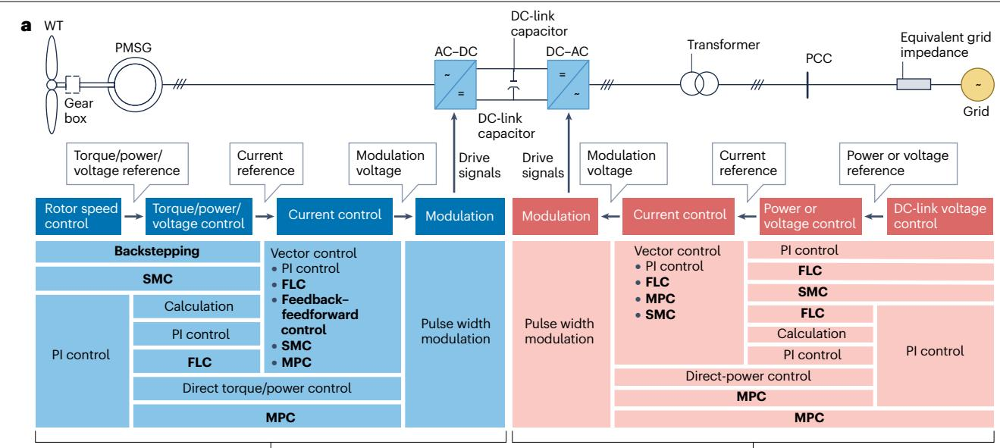
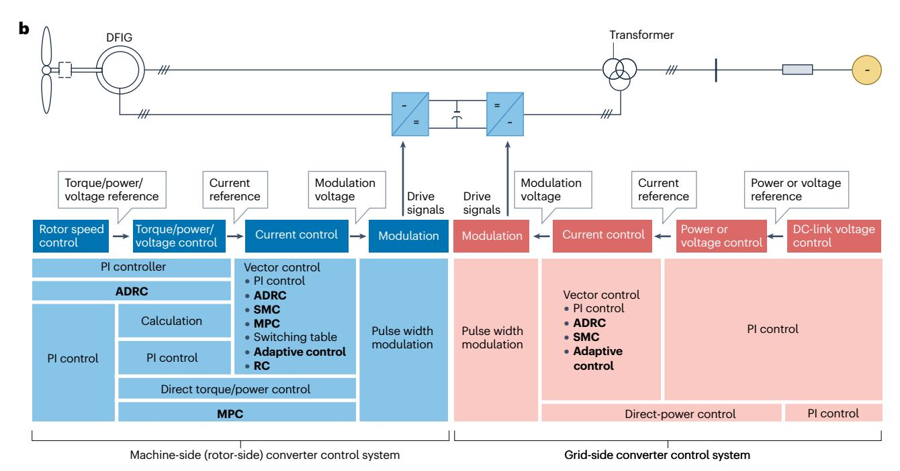

# 4 风力发电系统的运行与控制

风电系统通过风力机和发电机，依次将风能转换为机械功率和电功率[80.](#page-14-32) 所产生的机械功率与转子转速相关，其最优转速由最大功率点跟踪（MPPT）算法确定，以实现最大能量捕获[90.](#page-14-41) 在风速过高时必须限制机械功率，通常通过叶片桨距角控制实现[91.](#page-14-42) 功率变换系统由电机侧变流器（MSC）控制和电网侧变流器（GSC）控制组成，可依据并网规范以电网友好的方式将电功率注入电网。PMSG采用定子侧变流器（SSC）作为MS[C92,](#page-14-43)，DFIG则采用转子侧变流器（RSC）作为MS[C93.](#page-14-44) 为应对风力发电系统的动态特性，研究人员提出了多种控制策略。本文重点讨论两类广泛应用的风力发电系统——基于PMSG的系统（图[4a\)](#page-7-0)）和基于DFIG的系统（图[4b\)](#page-7-0)）——中的电力电子控制，即MSC控制和GSC控制。需要指出的是，在本节涉及的各种控制方法中，比例—积分—微分（PID）类控制器（包括P、PI等）因在简单性和鲁棒性之间取得较好折中，仍是风电行业各类控制环中应用最广泛的方法[s94.](#page-14-45) 其他先进控制方法主要用于实验室规模验证，例如模型预测控制（MPC）和滑模控制（SMC），或者用于仿真，例如智能控制。这主要是因为此类方法成本较高、复杂度较大，并需要更多硬件和软件资源。随着技术发展，这些方法未来可能得到更广泛应用，并带来更好的控制性能。

## **永磁同步发电机**

**电机侧（定子侧）变流器控制。** PMSG控制系统通常采用级联结构[95.](#page-14-46) 外环可用于转子转速控制，以准确跟踪通常由MPPT算法确定的参考转速。另一种方式是，外环根据测得的转子转速和最佳叶尖速比计算转矩或有功功率参考值；内环随后控制相应的转矩或有功功率，同时控制电压或无功功率。

外环可采用PI控制、SM[C96](#page-14-47)或其他控制方法。内环在旋转*dq*坐标系中采用矢量控制。在该坐标系中，*q*轴控制负责转矩或有功功率，*d*轴控制负责电压或无功功率[r97.](#page-14-48) PI控制[98](#page-14-49)、模糊逻辑控制（FLC）[99](#page-15-0)和MPC[100](#page-15-1)等多种控制策略均已用于设计*dq*控制环。

为提高对风速变化的响应速度，已有研究将反馈—前馈控制器用于转矩控制[l101.](#page-15-2) 级联结构虽然简单，但其通过调节*dq*电流间接实现控制。另一种方法是直接转矩控制或直接功率控制，该方法无需进行坐标变换，且对电机参数的依赖较小，因此能够获得更快的转矩响应。此类方法采用空间矢量调制，并结合准滑模观测器[102](#page-15-3)或可编程低通滤波器[103](#page-15-4)等策略，以减小转矩波动，同时即使在较低采样频率下也能保持鲁棒性。

SMC能够以较低计算负担处理扰动和非线性建模问题。该方法采用PI型滑模面[104](#page-15-5)、全阶滑模面[105,](#page-15-6)等不同滑模面，对电网电压扰动等外部扰动具有良好鲁棒性。FLC对这类扰动同样表现出较强鲁棒性[106.](#page-15-7)

PMSG定子侧变流器系统的另一类控制策略是直接MPC，其特点是动态响应快，并能够处理多个非线性约束[107.](#page-15-8) 为获得特定优势，研究人员进一步提出了多种改进方案。例如，通过减少候选电压矢量数量，可以降低直接MPC的计算负担[108](#page-15-9)。在稳定性方面，将积分反步法与MPC结合可保证李雅普诺夫稳定性[109.](#page-15-10)

这些控制策略既可采用固定参数，也可结合灰狼优化算法[m98,](#page-14-49)、樽海鞘群算法[99](#page-15-0)和混沌台球优化算法[110](#page-15-11)等在线优化技术。此外，深度神经网络等机器学习方法也被用于提高控制性能[e100](#page-15-1)，以发挥其高效在线逼近能力。

**电网侧变流器控制。** GSC控制将直流电转换为交流电并馈入电网，同时通过适当的直流电压调节维持有功功率平衡[97.](#page-14-48) 与此同时，GSC控制还负责调节注入电网的无功功率，或调节公共连接点（PCC）电压[97](#page-14-48)。一种广泛采用的策略是使用与SSC控制类似的级联结构，其中外环负责直流电压控制以及无功功率（PCC电压）控制，内环负责电流控制[97.](#page-14-48)

PI控制器[98](#page-14-49)、FLC[99](#page-15-0)和SM[C96](#page-14-47)等多种控制器均已用于上述各控制环。电流控制环通常在旋转*dq*坐标系中实现。由于GSC与SSC的控制结构相似，除固定参数策略外，灰狼优化算法[m98](#page-14-49)、樽海鞘群算法[99](#page-15-0)和混沌台球优化算法[m110](#page-15-11)等相同的在线优化方法也可用于整定GSC控制器。MPC是另一种值得关注的内环电流控制方法，在优化代价函数时能够有效处理电网侧非线性约束[109.](#page-15-10)

电流控制也可在静止坐标系中实现，并可采用终端滑模控制等先进方法提高鲁棒性[111.](#page-15-12) 基于PI的直流电压控制和直接MPC也已应用于PMSG的GSC控制系统，以获得快速动态响应[107](#page-15-8)。通过优化开关表，可增强直接MPC对系统参数变化的鲁棒性[108.](#page-15-9) 直接MPC还可同时包含直流母线电压控制，并已表现出较小的跟踪误差[107.](#page-15-8) 此外，将直流母线电压控制的代价函数单独处理，可避免使用权重系数，从而简化参数整定[g112](#page-15-13)。

## **双馈异步发电机**

**转子侧变流器控制。** DFIG转子侧变流器控制通常也采用级联结构[e113.](#page-15-14) PI控制器[r114](#page-15-15)和自抗扰控制器（ADRC[\)115](#page-15-16)等多种控制器已用于外环转子转速控制，以跟踪MPPT算法给出的参考转速。内环在旋转*dq*坐标系中采用矢量控制。其中，*d*轴控制负责转矩或有功功率控制，*q*轴控制负责PCC电压或无功功率控制。PI控制[l116](#page-15-17)、ADRC[115](#page-15-16)和自适应SM[C117,](#page-15-18)等不同策略已用于构建*dq*控制环。与PI控制器相比，ADRC和SMC对参数不确定性及扰动具有更强鲁棒性。此外，无模型预测电流控制

电机侧（定子侧）变流器控制系统　电网侧变流器控制系统

**图4｜风力发电系统控制策略总结。**

**a**，永磁同步发电机（PMSG）。**b**，双馈异步发电机（DFIG）。尚未在工业界广泛应用、仍需进一步研究的方法以粗体标出。AC，交流；ADRC，自抗扰控制；DC，直流；FLC，模糊逻辑控制；MPC，模型预测控制；PCC，公共连接点；PI，比例—积分；RC，重复控制；SMC，滑模控制；WT，风力机。

已被证明是一种有效且鲁棒的技术，因为在进行电流预测时无需显式使用系统参数[118.](#page-15-19)

直接功率控制是矢量控制的一种替代方案，可取消内电流控制环。逆变器电压矢量可通过采用PI控制器[r119](#page-15-20)或开关表[120.](#page-15-21)的功率控制直接确定。但由于纹波较大，该方法会牺牲一定的稳态性能。由外环PI功率控制和内环基于开关表的电流控制组成的级联结构已应用于RSC控制。这种策略兼具矢量控制低纹波的优点和直接功率控制动态响应快的优点[l120](#page-15-21)。此外，还可通过使用零

矢量[r121.](#page-15-22)的三矢量直接功率控制降低纹波。在静止坐标系中，电压调制直接功率控制是一种简单、有效的方法，能够实现快速且可靠的功率调节[122](#page-15-23)。

DFIG转子侧变流器控制还可采用多种非线性控制方法，其中MPC和自适应控制最具代表性。MPC能够自然地纳入DFIG的非线性动态。为简化计算，已有研究将输入—输出反馈线性化与连续控制集MP[C123.](#page-15-24)结合。控制器性能通常对模型不确定性和扰动较为敏感，因此可引入扰动观测器缓解这些问题[s124](#page-15-25)。与连续控制集MPC相比，有限控制集MPC更适合RSC控制，因为它能够直接输出变流器开关状态[s125](#page-15-26)。采用基于自适应反步法的控制可改善RSC电流控制，无需额外观测器即可对不确定性保持鲁棒性[126.](#page-15-27) 为进一步提高性能，研究人员还开发了结合MPC与自适应控制优势的自适应MPC[l127.](#page-15-28) 此外，MPC还分别在*dq*坐标系[128](#page-15-29)和静止坐标系[129,](#page-15-30)中与重复控制结合，从而改善DFIG在畸变电压条件下的性能。

**电网侧变流器控制。** 与PMSG类似，DFIG通过GSC控制将直流电转换为交流电并接入电网，其中采用适当的直流电压控制维持系统有功功率平衡[124](#page-15-25)，同时负责调节注入电网的无功功率。广泛采用的控制策略仍是级联结构：外环负责直流母线电压和无功功率控制，内环负责电流控制[113](#page-15-14)。由于DFIG功率变换系统仅承担部分额定功率，DFIG的GSC控制受到的关注不及RSC控制。RSC控制中的典型方法一般也可用于GSC控制。GSC各控制环通常使用PI控制器，电流控制环则在旋转*dq*坐标系中实现[116.](#page-15-17) RSC控制中采用的自适应SMC[117](#page-15-18)和ADR[C115,](#page-15-16)等增强型控制方法，也因能够提高抗扰鲁棒性而被应用于GSC控制。为取消电流环并获得更快的动态响应，直接功率控制同样可用于GSC[119.](#page-15-20) GSC控制的其他方案还包括电压调制直接功率控制[122](#page-15-23)和基于自适应反步法的非线性控制[126](#page-15-27)。

