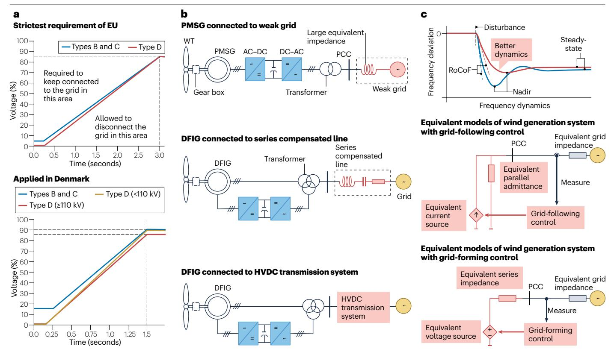

# 5 风力发电系统在电力系统中的应用

随着风力发电系统渗透率显著提高，并在电力系统中逐步替代同步发电机，系统对其提出了更高要求。这些要求主要包含两个方面：第一，风力发电系统必须在多样化电网条件，以及由风力发电系统与电网相互作用引起的扰动下有效运行；第二，风力发电系统必须提供多种辅助服务，以保证电力系统优化运行。其中需要重点关注的领域包括低电压穿越能力、次同步振荡阻尼和频率支撑。

## **低电压穿越能力**

在欧盟和丹麦，风力发电系统可根据容量和接入电压等级划分为A、B、C、D四类。具体而言，A类系统的连接点电压<110 kV、最大容量≥0.8 kW；B类系统的连接点电压<110 kV、最大容量≤1 MW；C类系统的连接点电压<110 kV、最大容量≤50 MW；D类系统的连接点电压≥110 kV，或者连接点电压<110 kW且最大容量<75 MW（参考文献[130\)](#page-15-31)）。依据并网规范，B、C和D类风力发电系统在出现电压暂降的电网故障期间必须保持并网并注入无功电流，这一能力称为低电压穿越（LVRT）能力。欧盟规定了通用基准要求，各成员国还制定了各自的补充要求[130,](#page-15-31)[131](#page-15-32)（图[5a](#page-9-0)）。LVRT通常需要引入额外无功电流参考值，该参考值可以固定[132](#page-15-33)，也可以与故障期间的电压偏差成比例，常见实现方法包括查表法[133](#page-15-34)和比例控制器[134.](#page-15-35) 但必须确保电压暂降不会造成功率变流器损坏和系统失稳，这是安全实现LVR[T135](#page-15-36)的前提。可通过硬件增强和先进控制策略获得这种鲁棒性。

大多数DFIG-WT实现LVRT能力的硬件方案采用撬棒保护，该方法也已在PMSG风力机中得到研究和应用[136.](#page-15-37) 故障期间，撬棒电阻为风电功率提供旁路，从而将系统变量限制在允许范围内，保证系统安全[137](#page-15-38)。改变风电系统中的变压器结构，则可在电网电压可能变化时仍将定子电压调节至额定值[138.](#page-15-39)

为通过修改控制结构增强LVRT能力而提出的各种先进控制策略，主要目标是限制进入直流母线的功率，以改善系统性能。一种直接方法是限制调制信号[137](#page-15-38)。另一种方法是调整功率参考值，例如在LVRT期间以直流母线电压控制替代MPPT控制，使风能以动能形式储存而不馈入直流母线[s136,](#page-15-37)；也可根据电压暂降程度动态调整功率参考值[g139.](#page-15-40) 直流母线电压PI控制器中的积分器可能限制暂态响应速度，并在LVRT期间造成系统失稳，因此有研究提出停用积分器以增强LVRT能力[140](#page-15-41)。此外，适当控制RSC有助于加快定子直流分量衰减，从而有效限制转子电压和电流[t141](#page-15-42)。风力发电系统在LVRT期间的稳定性也受PLL影响，降低PLL带宽可提高LVRT能力[y142.](#page-15-43) 不对称LVRT能力同样十分重要，通常通过提供适当的正序和负序无功电流实现。采用具有更高阻尼和更优动态性能的负序PLL，可进一步增强不对称LVRT能力[s143.](#page-15-44)

## **次同步振荡阻尼**

次同步振荡表现为低于基波频率的持续能量交换，会对风力机和电网的安全稳定运行构成严重威胁[144.](#page-15-45) 已有研究识别出多种诱发机制（图[5b](#page-9-0)）。PMSG接入弱电网时，负电阻效应可能诱发不稳定振荡并导致次同步振荡。通过在GSC的*d*轴电流控制中引入附加阻尼信号，可以减弱这种不利影响[145.](#page-15-46)

类似地，DFIG接入串联补偿系统时也可能发生次同步振荡[146.](#page-15-47) 已有多种

**图5｜风力发电系统接入电力系统时面临的问题。a**，欧盟制定并由丹麦采用的最严格低电压穿越要求[130,](#page-15-31)[131.](#page-15-32) **b**，可能引发次同步振荡的三种并网形式[145,](#page-15-46)[146,](#page-15-47)[154](#page-15-55)。**c**，频率支撑功能。具有电压源特性的构网型控制通常比具有电流源特性的跟网型控制具有更好的

频率支撑能力[13](#page-13-9)。AC，交流；DC，直流；DFIG，双馈异步发电机；HVDC，高压直流；PCC，公共连接点；PMSG，永磁同步发电机；RoCoF，频率变化率；WT，风力机。

策略用于抑制该振荡。次同步振荡的激发与电流控制器特性密切相关，合理整定PI参数能够在一定程度上抑制次同步振荡[147](#page-15-48)。此外，*H∞*控制器[148,](#page-15-49)、反馈线性化控制器[149](#page-15-50)和滑模控制器[r150](#page-15-51)等先进控制器已用于替代传统基于PI的电流控制器，从而有效缓解次同步振荡。研究人员还引入了附加阻尼控制器，以帮助抑制次同步模态[146](#page-15-47)。这些附加控制器通过适当滤波器提取次同步分量，阻尼功能既可由内部软件系统实现[151](#page-15-52)，也可通过外部并联电压源变流器实现[152.](#page-15-53) 无模型控制策略已被用于提高次同步阻尼控制器的鲁棒性[153.](#page-15-54) 值得注意的是，DFIG与HVDC电网互联时也可能因相互作用发生次同步振荡。HVDC输电线路距离较长，会导致变流器与交流电网之间具有较大输电阻抗。因此，变流器输出阻抗与输电阻抗之和可能在低频区域产生谐振点，从而引发次同步振荡[154](#page-15-55)。通过增加滤波器重塑阻抗特性，可以抑制此类振荡[155.](#page-15-56)

## **频率支撑**

风力发电系统支撑电网频率的能力与同步机制密切相关。传统风力发电系统通过PLL与电网同步，通常只向电网注入功率，而不提供频率支撑。然而，随着渗透率提高，这种方式可能恶化电力系统频率响应，表现为频率最低点降低、频率变化率增大以及稳态频率值降低（图[5c\)](#page-9-0)）。这种控制策略称为跟网型控制，其等效于电流源运行，需要外部电压源支撑才能维持频率稳定（图[5c](#page-9-0)）。已有大量基于跟网型控制的策略被提出，可在无需额外设备的情况下提供频率支撑。

第一种方法是使风力发电系统保留一定功率备用，可通过偏移MPPT参考值实现。在这种方法中，可依据频率偏差调节桨距角，使功率备用参与一次调频[156](#page-16-0)。此外，风力发电系统也可采用多种降载运行方案[157](#page-16-1)。

第二种方法是在频率事件期间通过调节转子转速，释放风力发电机组的动能。采用该方法时，频率事件发生后，有功功率参考值会偏离MPPT功率；该功率偏差用于稳定频率变化，随后再沿相反方向调节有功功率参考值，以恢复转子转速。有功功率参考值可采用多种调整形式，例如阶跃变化、渐变变化[158,](#page-16-2)、基于转子转速的变化[159,](#page-16-3)、基于延时的逻辑[160,](#page-16-4)、高斯分布变化[161](#page-16-5)或机器学习整定的变化[162.](#page-16-6) 还可设置功率参考值以显式模拟传统同步发电机的行为。例如，可根据频率导数确定功率偏差，以模拟惯性特性[s163.](#page-16-7) 与真实同步发电机不同，控制系统中的惯性常数是虚拟参数，不受物理条件限制。在此基础上，已有研究表明，采用时变惯性常数能够获得优于固定惯性常数的性能[164](#page-16-8)。同样，也可利用频率偏差修改功率参考值，以模拟传统同步发电机的一次调频[165.](#page-16-9)

过去十年中，一种称为构网型（GFM）控制的新型控制策略逐渐兴起，并表现出良好的频率支撑能力（图[5c\)](#page-9-0)）。GFM控制通过功率同步使风电系统等效为电压源，能够像同步发电机一样主动建立自身频率参考。与跟网型控制类似，其能量缓冲可来自弃风功率以及风力发电机转子的动能。将这些能量缓冲与下垂控制[166](#page-16-10)、虚拟同步发电机控制[167](#page-16-11)、虚拟振荡器控制[l168](#page-16-12)和匹配控制[169,](#page-16-13)等不同GFM控制策略相结合，有助于提供惯量并实现快速一次调频。

