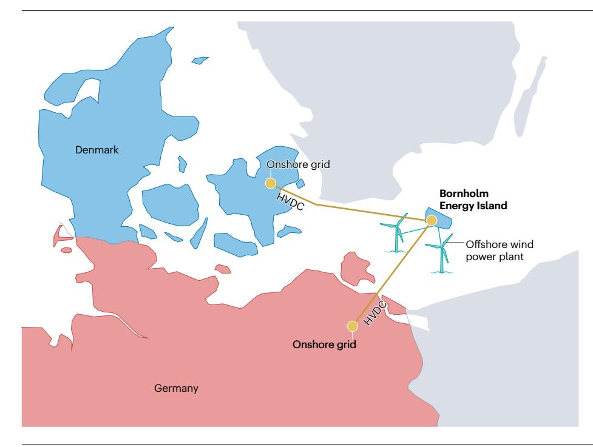
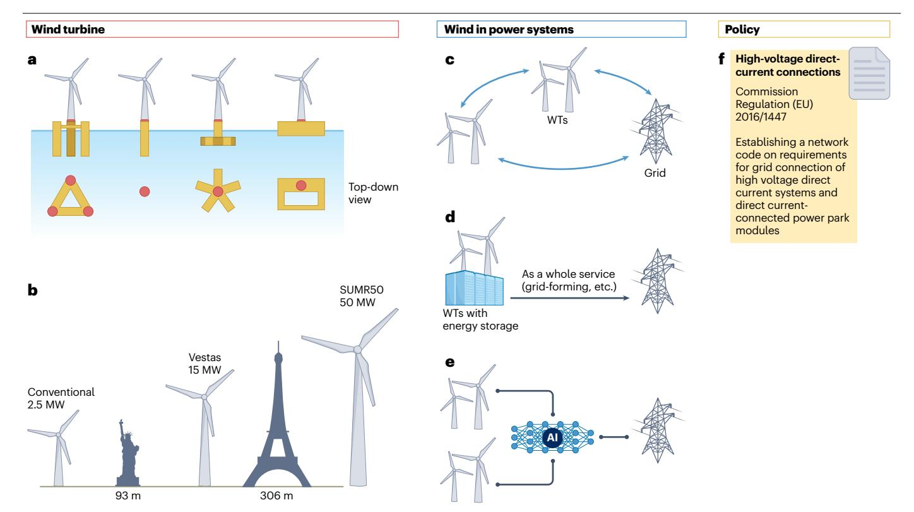

# 6 欧盟风力发电系统代表性项目

风能开发是欧盟能源领域，尤其是丹麦能源领域一项关键且重要的研究主题。过去十年中，欧盟通过“地平线欧洲”、能源技术开发与示范计划（EUDP）、丹麦能源署等多种渠道，为满足学术研究或产业需求、探索风能各方面问题的项目提供了资金支持（表[1](#page-10-0)）。本文选取的项目中，“下一代风力机控制”（CONTINUE）致力于开发风力机侧控制技术；“风电行业大型试验台数字孪生”（DIGIT-BENCH）重点开发面向风电行业的数字化试验台；“实现多供应商HVDC电网互操作性”（InterOPERA）聚焦风电并网所需的HVDC技术；“风电场—电网相互作用：探索与开发”（WinGrid）则致力于全面研究基于电力电子技术的风电系统建模、稳定性与控制。丹麦能源岛和海上能源枢纽（OEH）等其他项目，则以丹麦孤立海上风电场的并网为背景。

## **CONTINUE**

CONTINUE是一个由EUDP资助、实施期为2023—2026年的研究项目。该项目旨在开发并示范一种新的“感知流场的风力机控制器”，使风力机能够依据测量和估计结果对完整湍流场作出响应。为此，项目将开发用于高精度风速测量的轮毂激光雷达，以及用于实时估计全流场湍流的估计器；同时还将开发一种利用这些测量值和估计值提供动态反馈的新控制算法。项目将在一台额定功率超过2 MW的实际风力机上示范原型控制系统，目标是降低风力机塔架载荷、成本和碳排放，同时获得风数据测量与估计所带来的其他效益。

## **DIGIT-BENCH**

DIGIT-BENCH是一个由EUDP资助、实施期为2023—2025年的开发与示范项目。该项目旨在开发并示范

**表1｜欧盟风力发电系统代表性项目**

| 项目 | 时间 | 参与单位 | 资助来源 | 网站 |
|---|---|---|---|---|
| 下一代风力机控制 （CONTINUE） | 2023–2026 | Technical University of Denmark, Vestas Wind Systems | EUDP | https://eudp.dk/en/node/16680 |
| 风电行业大型试验台数字孪生 （DIGIT-BENCH） | 2023–2025 | R&D Test Systems A/S, Aarhus University, Lindø Offshore Renewables Center | EUDP | https://eudp.dk/en/node/16679 |
| 实现多供应商HVDC电网互操作性 （InterOPERA） | 2023–2027 | SuperGrid Institute, 50hertz, Amprion Energinet, Equinor, GE, Hitachi Energy, Østed, RTE, Scibreak, Siemens Energy, Siemens Gamesa Renewable Energy, Statnett, T&D Europe, TU Delft, TenneT, Terna Driving Energy, University of Groningen, Vattenfall, Vestas, WindEurope | Horizon Europe | https://interopera.eu/ https://cordis.europa.eu/project/ id/101095874 |
| 风电场—电网相互作用： 探索与开发 （WinGrid） | 2019–2024 | University of Warwick, Aalborg University, Imperial College London, Christian-Albrechts-Universität zu Kiel, Technical University of Denmark, University College Dublin, Tel Aviv University, DNV | Horizon Europe | https://www.wingrid.org https://cordis.europa.eu/project/ id/861398 |
| 丹麦能源岛 | 长期 | 由DEA牵头 | DEA | https://ens.dk/en/our-responsibilities/ energy-islands |
| 海上能源枢纽（OEH） | 2022–2026 | Technical University of Denmark, Aalborg University, Siemens Gamesa Renewable Energy, Green Hydrogen Systems, Ørsted Wind Power, Energy Cluster Denmark | EUDP | https://www.eudp.dk/en/node/16644 |

DEA，丹麦能源署；DNV，挪威船级社；EUDP，能源技术开发与示范计划。

面向风电行业、采用数字孪生技术的大型试验台。随着风力机尺寸不断增大，试验设备规模和试验所需时间均随之增加，从而导致行业测试成本上升。DIGIT-BENCH计划开发一个能够以虚拟试验取代物理试验的软件框架。项目成果将在丹麦Lindø Offshore Renewables Centre全球最大的高加速寿命试验（HALT）试验台上进行示范，并制定面向未来商业化的技术发展路线图。

## **InterOPERA**

InterOPERA自2023年起由欧盟科研与创新资助计划“地平线欧洲”的创新行动机制提供资助，项目实施期为4年。InterOPERA汇集了21家风能领域的领先参与方，包括输电系统运营商、工业制造商、行业协会和高校，全面研究风能并网，尤其是海上风电并网涉及的HVDC问题，并覆盖技术、经济和政策相关的多利益相关方议题。该项目旨在开发HVDC模块化技术和标准化框架，以支持多方协作。这种协作将显著促进未来风能并网规模的扩大。InterOPERA还强调风力发电系统通过构网能力支撑电力系统。项目围绕欧盟到2050年部署300 GW海上风电的目标设立，该规模接近2022年全球海上风电装机容量的五倍（图[1c](#page-2-0)）。

## **WinGrid**

WinGrid于2019年10月至2024年3月期间获得“地平线欧洲”玛丽·斯克沃多夫斯卡-居里行动资助。该项目汇集欧盟各地学术界和工业界参与者，重点研究风力发电系统的电力系统集成，研究范围广泛，涵盖建模、相互作用、控制与稳定性。具体而言，WinGrid将评估单个风电场内部风力机之间、多个风电场之间，以及风电场与电网之间的动态相互作用。项目还将全面探索风力发电系统参与电力系统辅助服务的能力，尤其关注频率支撑。此外，项目将研究在风力发电系统中应用基于“同步变流器”（synchronverter）的构网型控制，以改善电力系统动态性能的潜力；还将研究风力发电系统与储能、光伏发电系统等其他可再生能源方案的联合集成。WinGrid是一个面向新一代研究人员的创新培训网络项目，预计该领域研究未来还将持续开展。

## **丹麦能源岛**

丹麦拥有丰富的风能资源，孤立海上风电场在向丹麦电网供应清洁电力方面发挥着重要作用。为提高并网效率，丹麦能源署牵头实施一项雄心勃勃的能源岛计划。能源岛将作为枢纽，在多个邻国之间汇集、转换和分配海上风电场生产的清洁电力。丹麦能源岛项目包括位于波罗的海和北海的两座岛屿。波罗的海能源岛将以博恩霍尔姆岛为基础，电气设备和海上风电场布置在海岸西南偏南约15 km处（图[6](#page-11-0)）。北海则将建设一座人工能源岛，用于布置电气设备。波罗的海能源岛预计可提供3 GW电力；北海能源岛第一阶段预计可提供3–4 GW，后续可提高至10 GW。这些电力不仅可供应丹麦，也可供应邻国，目前丹麦已与德国、

**图6｜博恩霍尔姆能源岛[175](#page-16-14)。** 图中展示了海上风电场、博恩霍尔姆能源岛、高压直流（HVDC）输电线路，以及丹麦和德国的陆上交流（AC）电网。能源岛将在辐射式枢纽电网中发挥关键作用，实现波罗的海不同区域之间的智能电力分配。

**图7｜风力发电系统未来发展趋势。a**，漂浮式风力机。**b**，大功率、中高电压风力发电系统。**c**，系统层面的相互作用机理与控制。**d**，储能系统的应用。**e**，人工智能（AI）赋能的风力发电系统。**f**，政策完善。SUMR，分段超轻型变形转子。

荷兰和比利时达成了相关协议。该项目还特别关注“电制X”（Power-to-X），即将富余可再生能源转换为合成燃料等其他能源形式。

## **海上能源枢纽**

OEH是一个由EUDP资助、实施期为2022—2026年的研究项目。该项目预计通过为丹麦能源岛计划的关键环节提供技术解决方案，为能源岛建设提供支撑。项目将重点解决三个主题及其技术问题：针对能源枢纽，开发实现稳定、韧性运行的工具和控制策略；针对海上风电场，开发具有成本效益的设计方法；开发面向能源枢纽优化的海上Power-to-X技术，以提高成本效益，并为能源枢纽提供稳定、灵活的服务。将并网规范要求由风电场转移至能源枢纽，也有望提高效率和稳定性。OEH不仅旨在提高两座能源岛的经济效益，还将为未来可扩展海上能源枢纽提供可行性基础。

