# 附录与后记

## 附录

## A 矩阵

### A.1 基本演算

记实矩阵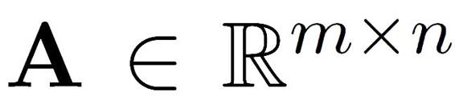第行第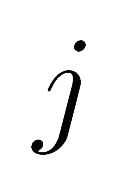列的元素为（A）=*A*。矩阵A的转置（transpose）记为AT，（AT）=*A*。显然，

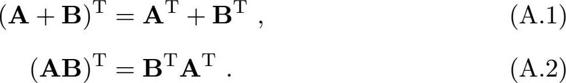

常直接用I表示单位阵。

对于矩阵，若m=则称为阶方阵。用I表示阶单位阵，方阵A的逆矩阵A−1满足AA−1=A−1A=I。不难发现，

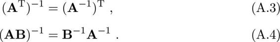

对于阶方阵A，它的迹（trace）是主对角线上的元素之和，即tr（A）=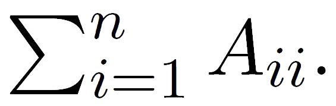迹有如下性质：

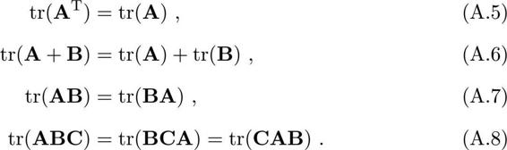

阶方阵A的行列式（**determinant**）定义。

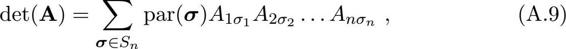

其中s为所有阶排列（**permutation**）的集合，par（σ）的值为−1或+1取决于σ=（σ1，σ2，...，σ）为奇排列或偶排列，即其中出现降序的次数为奇数或偶数，例如（1，3，2）中降序次数为1，（3，1，2）中降序次数为2。对于单位阵，有det（I）=1.对于2阶方阵，有

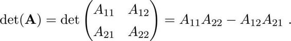

阶方阵A的行列式有如下性质：

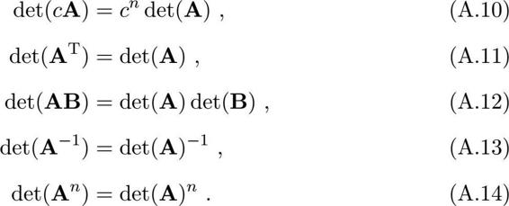

矩阵的**Frobenius**范数定义为

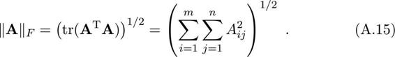

容易看出，矩阵的**Frobenius**范数就是将矩阵张成向量后的L2范数。

### A.2 导数

向量α相对于标量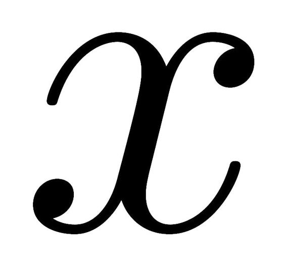的导数（**derivative**），以及相对于α的导数都是向量，其第个分量分别为

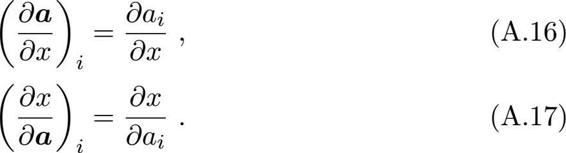

类似的，矩阵A对于标量的导数，以及对于A的导数都是矩阵，其第行第列上的元素分别为

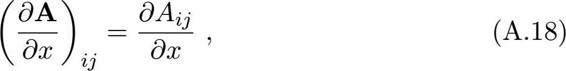

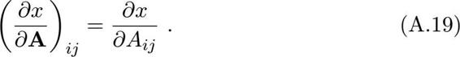

对于函数（），假定其对向量的元素可导，则（）关于的一阶导数是一个向量，其第个分量为

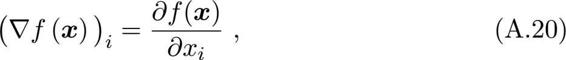

（）关于的二阶导数是称为海森矩阵（**Hessian matrix**）的一个方阵，其第行第列上的元素为

向量和矩阵的导数满足乘法法则（**product rule**）

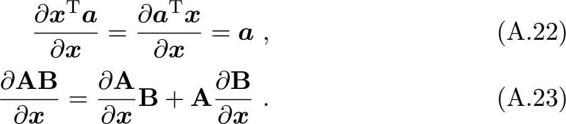

α相对于为常向量.

由A−1A=I和式（A.23），逆矩阵的导数可表示为

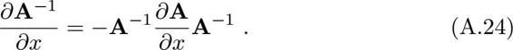

若求导的标量是矩阵A的元素，则有

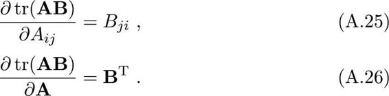

进而有

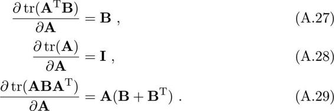

由式（A.15）和（A.29）有

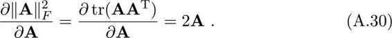

链式法则（chain rule）是计算复杂导数时的重要工具。简单地说，若函数是g和h的复合，即（）=g（h（）），则有

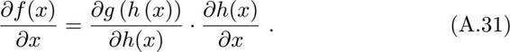

机器学习中W通常是对称矩阵。

例如在计算下式时，将A−b看作一个整体可简化计算：

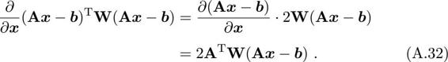

### A.3 奇异值分解

任意实矩阵都可分解为

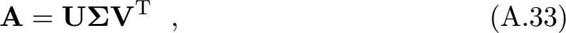

常将奇异值按降序排列以确保的唯一性。

当A为对称正定矩阵时，奇异值分解与特征值分解结果相同。

其中，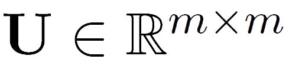是满足UTU=I的m阶酉矩阵（**unitary matrix**）；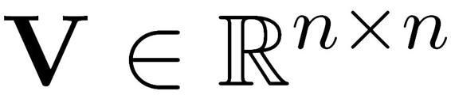是满足VTV=I的阶酉矩阵；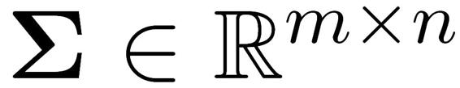的矩阵，其中（）=σ且其他位置的元素均为0，σ为非负实数且满足σ1≥σ2≥...≥0。

式（A.33）中的分解称为奇异值分解（**Singular Value Decomposition**，简称SVD），其中U的列向量υ∈m称为A的左奇异向量（**left-singular vector**），V的列向量υ∈称为A的右奇异向量（right-singular vector），σ称为奇异值（**singular value**）.矩阵A的秩（**rank**）就等于非零奇异值的个数。

奇异值分解有广泛的用途，例如对于低秩矩阵近似（**low-rank matrix approximation**）问题，给定一个秩为r的矩阵A，欲求其最优秩近似矩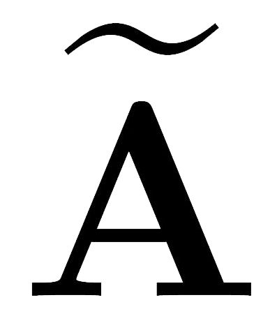，k≤r，该问题可形式化为

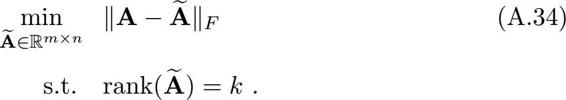

奇异值分解提供了上述问题的解析解：对矩阵A进行奇异值分解后，将矩阵中的r−个最小的奇异值置零获得矩阵，即仅保留最大的个奇异值，则

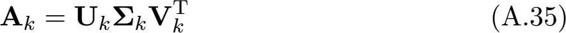

就是式（A.34）的最优解，其中U和V分别是式（A.33）中的前k列组成的矩阵。这个结果称为**Eckart-Young-Mirsky**定理。

## B 优化

### B.1 拉格朗日乘子法

拉格朗日乘子法（**Lagrange multipliers**）是一种寻找多元函数在一组约束下的极值的方法.通过引入拉格朗日乘子，可将有*d*个变量与个约束条件的最优化问题转化为具有*d*+个变量的无约束优化问题求解。

先考虑一个等式约束的优化问题。假定为*d*维向量，欲寻找的某个取值\*，使目标函数（）最小且同时满足g（）=0的约束。从几何角度看，该问题的目标是在由方程g（）=0确定的*d*−1维曲面上寻找能使目标函数（）最小化的点。此时不难得到如下结论。

函数等值线与约束曲面相切。

可通过反证法证明：若梯度∇（\*）与约束曲面不正交，则仍可在约束曲面上移动该点使函数值进一步下降。

对等式约束，λ可能为正也可能为负。

• 对于约束曲面上的任意点，该点的梯度∇g（）正交于约束曲面。

• 在最优点\*，目标函数在该点的梯度∇（\*）正交于约束曲面。

由此可知，在最优点\*，如附图B.1所示，梯度∇g（）和∇（）的方向必相同或相反，即存在λ≠0使得

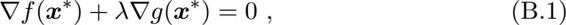

λ称为拉格朗日乘子。定义拉格朗日函数

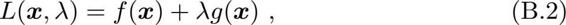

不难发现，将其对的偏导数∇*L*（，λ）置零即得式（B.1），同时，将其对λ的偏导数∇λ*L*（，λ）置零即得约束条件g（）=0。于是，原约束优化问题可转化为对拉格朗日函数*L*（，λ）的无约束优化问题。

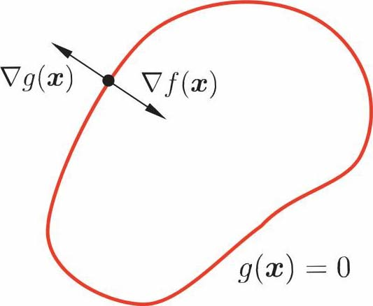

（a） 等式约束

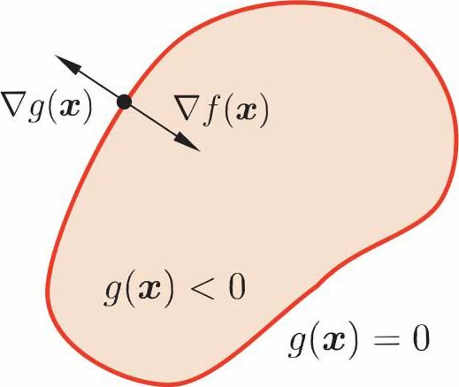

（b） 不等式约束

附图B.1 拉格朗日乘子法的几何含义：在（a）等式约束g（）=0或（b）不等式约束g（）≤0下，最小化目标函数（）。红色曲线表示g（）=0构成的曲面，而其围成的阴影区域表示g（）＜0.

现在考虑不等式约束g（）≤0，如附图B.1所示，此时最优点\*或在g（）＜0的区域中，或在边界g（）=0上。对于g（）＜0的情形，约束g（）≤0不起作用，可直接通过条件∇（）=0来获得最优点；这等价于将λ置零然后对∇*L*（，λ）置零得到最优点。g（）=0的情形类似于上面等式约束的分析，但需注意的是，此时∇（\*）的方向必与∇g（\*）相反，即存在常数λ＞0使得∇（\*）+λ∇g（\*）=0。整合这两种情形，必满足λg（）=0。因此，在约束g（）≤0下最小化（），可转化为在如下约束下最小化式（B.2）的拉格朗日函数。

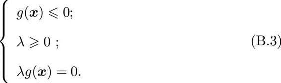

式（B.3）称为**Karush-Kuhn-Tucker**（简称KKT）条件。

上述做法可推广到多个约束.考虑具有m个等式约束和个不等式约束，且可行域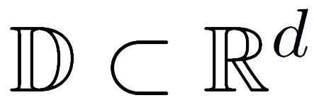非空的优化问题

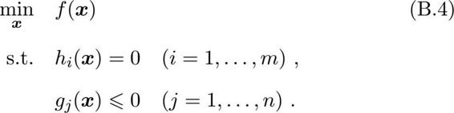

引入拉格朗日乘子λ=（λ1, λ2, ..., λm）T和*μ*=（*μ*1, *μ*2, ..., *μ*）T，相应的拉格朗日函数为

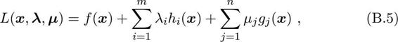

由不等式约束引入的KKT条件（=1, 2, ..., ）为

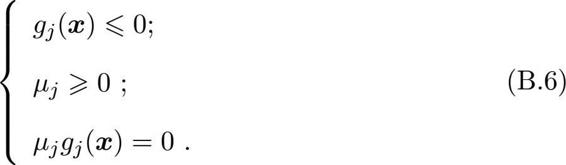

在推导对偶问题时，常通过将拉格朗日乘子*L*（, λ, *μ*）对求导并令导数为0，来获得对偶函数的表达形式。

*μ*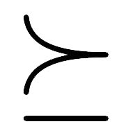0表示*μ*的分量均为非负。

一个优化问题可以从两个角度来考察，即“主问题”（**primal problem**）和“对偶问题”（**dual problem**）.对主问题（B.4），基于式（B.5），其拉格朗日“对偶函数”（dual function）Γ：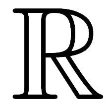m×→定义为

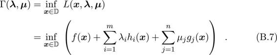

若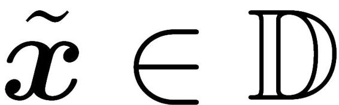为主问题（B.4）可行域中的点，则对任意*μ*0和λ都有

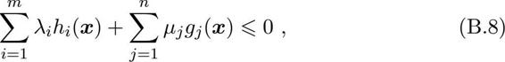

进而有

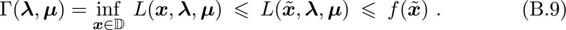

若主问题（B.4）的最优值为*P*\*，则对任意*μ*0和λ都有

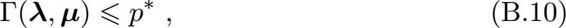

即对偶函数给出了主问题最优值的下界.显然，这个下界取决于*μ*和λ的值.于是，一个很自然的问题是：基于对偶函数能获得的最好下界是什么？这就引出了优化问题式（B.11）就是主问题（B.4）的对偶问题，其中λ和*μ*称为“对偶变量”（**dual variable**）。无论主问题（B.4）的凸性如何，对偶问题（B.11）始终是凸优化问题。

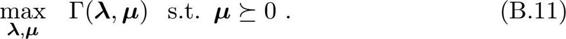

这称为Slater条件。

考虑式（B.11）的最优值*d*\*，显然有*d*\*≤*P*\*，这称为“弱对偶性”（**weak duality**）成立；若*d*\*=*P*\*，则称为“强对偶性”（**strong duality**）成立，此时由对偶问题能获得主问题的最优下界。对于一般的优化问题，强对偶性通常不成立。但是，若主问题为凸优化问题，如式（B.4）中（）和g（）均为凸函数，h（）为仿射函数，且其可行域中至少有一点使不等式约束严格成立，则此时强对偶性成立。值得注意的是，在强对偶性成立时，将拉格朗日函数分别对原变量和对偶变量求导，再并令导数等于零，即可得到原变量与对偶变量的数值关系。于是，对偶问题解决了，主问题也就解决了。

### B.2 二次规划

二次规划（**Quadratic Programming**，简称QP）是一类典型的优化问题，包括凸二次优化和非凸二次优化.在此类问题中，目标函数是变量的二次函数，而约束条件是变量的线性不等式。

假定变量个数为*d*，约束条件的个数为m，则标准的二次规划问题形如

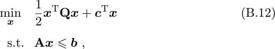

其中为*d*维向量，Q∈d×d为实对称矩阵，A∈m×d为实矩阵，b∈m和c∈d为实向量，A≤b的每一行对应一个约束.

非标准二次规划问题中可以包含等式约束。注意到等式约束能用两个不等式约束来代替；不等式约束可通过增加松弛变量的方式转化为等式约束。

若Q为半正定矩阵，则式（B.12）目标函数是凸函数，相应的二次规划是凸二次优化问题；此时若约束条件A≤b定义的可行域不为空，且目标函数在此可行域有下界，则该问题将有全局最小值。若Q为正定矩阵，则该问题有唯一的全局最小值。若Q为非正定矩阵，则式（B.12）是有多个平稳点和局部极小点的NP难问题。

常用的二次规划解法有椭球法（**ellipsoid method**）、内点法（**interior point**）、增广拉格朗日法（**augmented Lagrangian**）、梯度投影法（**gradient projection**）等。若Q为正定矩阵，则相应的二次规划问题可由椭球法在多项式时间内求解.

### B.3 半正定规划

半正定规划（**Semi-Definite Programming**，简称SDP）是一类凸优化问题，其中的变量可组织成半正定对称矩阵形式，且优化问题的目标函数和约束都是这些变量的线性函数。

给定*d*×*d*的对称矩阵X、C。

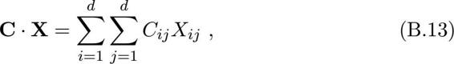

若A（=1, 2, ..., m）也是*d*×*d*的对称矩阵，b（=1, 2, ..., m）为m个实数，则半正定规划问题形。

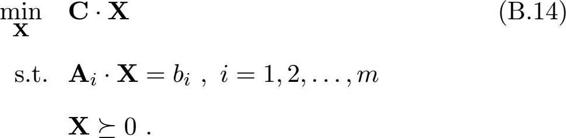

X0表示X半正定。

半正定规划与线性规划都拥有线性的目标函数和约束，但半正定规划中的约束X0是一个非线性、非光滑约束条件。在优化理论中，半正定规划具有一定的一般性，能将几种标准的优化问题（如线性规划、二次规划）统一起来。

常见的用于求解线性规划的内点法经过少许改造即可求解半正定规划问题，但半正定规划的计算复杂度较高，难以直接用于大规模问题。

### B.4 梯度下降法

一阶方法仅使用目标函数的一阶导数，不利用其高阶导数。

梯度下降法（**gradient descent**）是一种常用的一阶（**first-order**）优化方法，是求解无约束优化问题最简单、最经典的方法之一。

考虑无约束优化问题min（），其中（）为连续可微函数.若能构造一个序列0, 1, 2, ...满足

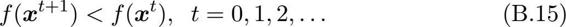

则不断执行该过程即可收敛到局部极小点。欲满足式（B.15），根据泰勒展式有

于是，欲满足（+Δ）＜（），可选。

其中步长*γ*是一个小常数。这就是梯度下降法。

每步的步长*γ*t可不同。

*L*-Lipschitz条件是指对于任意，存在常数*L*使得‖∇（）‖≤*L*成立。

若目标函数（）满足一些条件，则通过选取合适的步长，就能确保通过梯度下降收敛到局部极小点.例如若（）满足*L*-**Lipschitz**条件，则将步长设置为1/（2*L*）即可确保收敛到局部极小点。当目标函数为凸函数时，局部极小点就对应着函数的全局最小点，此时梯度下降法可确保收敛到全局最优解。

当目标函数（）二阶连续可微时，可将式（B.16）替换为更精确的二阶泰勒展式，这样就得到了牛顿法（**Newton’s method**）。牛顿法是典型的二阶方法，其迭代轮数远小于梯度下降法。但牛顿法使用了二阶导数∇2（），其每轮迭代中涉及到海森矩阵（A.21）的求逆，计算复杂度相当高，尤其在高维问题中几乎不可行。若能以较低的计算代价寻找海森矩阵的近似逆矩阵，则可显著降低计算开销，这就是拟牛顿法（**quasi-Newton method**）。

### B.5 坐标下降法

求解极大值问题时亦称“坐标上升法”（**coordinate ascent**）.

坐标下降法（**coordinate descent**）是一种非梯度优化方法，它在每步迭代中沿一个坐标方向进行搜索，通过循环使用不同的坐标方向来达到目标函数的局部极小值。

不妨假设目标是求解函数（）的极小值，其中=（1, 2, ..., d）T∈Rd是一个*d*维向量。从初始点0开始，坐标下降法通过迭代地构造序列0，1, 2, ...来求解该问题, t+1的第个分量构造为

通过执行此操作，显然有

与梯度下降法类似，通过迭代执行该过程，序列0, 1, 2, ...能收敛到所期望的局部极小点或驻点（**stationary point**）。

坐标下降法不需计算目标函数的梯度，在每步迭代中仅需求解一维搜索问题，对于某些复杂问题计算较为简便。但若目标函数不光滑，则坐标下降法有可能陷入非驻点（**non-stationary point**）。

## C 概率分布

### C.1 常见概率分布

这里仅介绍连续均匀分布。

本节简要介绍几种常见概率分布。对于每种分布，我们将给出概率密度函数以及期望E\[·\]、方差var\[·\]和协方差cov\[·,·\]等几个主要的统计量。

#### C.1.1 均匀分布

均匀分布（uniform distribution）是关于定义在区间\[α, b\]（α＜b）上连续变量的简单概率分布，其概率密度函数如附图C.1所示。

附图C.1 均匀分布的概率密度函数

不难发现, 若变量 服从均匀分布U（\|0, 1）且a＜b，则a+（b−a）服从均匀分布U（\|a, b）。

#### C.1.2 伯努利分布

以瑞士数学家雅各布·伯努利（Jacob Bernoulli, 1654–1705）的名字命名。

伯努利分布（**Bernoulli distribution**）是关于布尔变量∈{0, 1}的概率分布，其连续参数*μ*∈\[0, 1\]表示变量=1的概率。

#### C.1.3 二项分布

对于参数*μ*，二项分布的共轭先验分布是贝塔分布。共轭分布参见C.2。

二项分布（**binomial distribution**）用以描述*N*次独立的伯努利实验中有m次成功（即=1）的概率，其中每次伯努利实验成功的概率为*μ*∈\[0, 1\]。

当*N*=1时，二项分布退化为伯努利分布。

#### C.1.4 多项分布

对于参数*μ*，多项分布的共轭先验分布是狄利克雷分布。共轭分布参见C.2。

若将伯努利分布由单变量扩展为*d*维向量，其中∈{0, 1}且1，并假设取1的概率为*μ*∈\[0, 1\]，，则将得到离散概率分布

在此基础上扩展二项分布则得到多项分布（**multinomial distribution**），它描述了在*N*次独立实验中有m次=1的概率。

#### C.1.5 贝塔分布

贝塔分布（**Beta distribution**）是关于连续变量*μ*∈\[0, 1\]的概率分布，它由两个参数α＞0和b＞0确定，其概率密度函数如附图C.2所示。

附图C.2 贝塔分布的概率密度函数

其中Γ（α）为Gamma函数

*B*（α, b）为Beta函数

当α=b=1时，贝塔分布退化为均匀分布。

#### C.1.6 狄利克雷分布

以德国数学家狄利克雷（1805—1859）的名字命名。

狄利克雷分布（Dirichlet distribution）是关于一组*d*个连续变量*μ*∈\[0，1\]的概率分布，令*μ*=（*μ*1; *μ*2; ...; *μd*），参数α=（α1; α2; ...; α*d*），α＞0，。

当*d*=2时，狄利克雷分布退化为贝塔分布。

#### C.1.7 高斯分布

σ为标准差。

高斯分布（**Gaussian distribution**）亦称正态分布（**normal distribution**），是应用最为广泛的连续概率分布。

对于单变量∈（−∞，∞），高斯分布的参数为均值*μ*∈（−∞，∞）和方差σ2＞0。附图C.3给出了在几组不同参数下高斯分布的概率密度函数。

对于*d*维向量，多元高斯分布的参数为*d*维均值向量*μ*和*d*×*d*的对称正定协方差矩阵。

附图C.3 高斯分布的概率密度函数

### C.2 共轭分布

假设变量服从分布*P*（\|Θ），其中Θ为参数，*X*={1, 2, ..., m}为变量的观测样本，假设参数Θ服从先验分布Π（Θ）。若由先验分布Π（Θ）和抽样分布*P*（*X*\|Θ）决定的后验分布*F*（Θ\|*X*）与Π（Θ）是同种类型的分布，则称先验分布Π（Θ）为分布*P*（\|Θ）或*P*（*X*\|Θ）的共轭分布（**conjugate distribution**）。

例如，假设∼Bern（\|*μ*）, *X*={1, 2, ..., m}为观测样本，为观测样本的均值，*μ*∼Beta（*μ*\|α, b），其中α, b为已知参数，则*μ*的后验分布

这里仅考虑高斯分布方差已知、均值服从先验的情形。

亦为贝塔分布，其中α′=α+m，b′=b+m−m，这意味着贝塔分布与伯努利分布共轭.类似可知，多项分布的共轭分布是狄利克雷分布，而高斯分布的共轭分布仍是高斯分布。

先验分布反映了某种先验信息，后验分布既反映了先验分布提供的信息、又反映了样本提供的信息.当先验分布与抽样分布共轭时，后验分布与先验分布属于同种类型，这意味着先验信息与样本提供的信息具有某种同一性.于是，若使用后验分布作为进一步抽样的先验分布，则新的后验分布仍将属于同种类型。因此，共轭分布在不少情形下会使问题得以简化。例如在式（C.33）的例子中，对服从伯努利分布的事件*X*使用贝塔先验分布，则贝塔分布的参数值α和b可视为对伯努利分布的真实情况（事件发生和不发生）的预估.随着“证据”（样本）的不断到来，贝塔分布的参数值从α，b变化为α+m，b+m−m，且α/（α+b）将随着m的增大趋近于伯努利分布的真实参数值。显然，使用共轭先验之后，只需调整α和b这两个预估值即可方便地进行模型更新。

### C.3 KL散度

这里假设两个分布均为连续型概率分布；对于离散型概率分布，只需将定义中的积分替换为对所有离散值遍历求和。

KL散度（**Kullback-Leibler divergence**），亦称相对熵（**relative entropy**）或信息散度（**information divergence**），可用于度量两个概率分布之间的差异。给定两个概率分布*P*和Q，二者之间的KL散度定义为

其中*P*（）和*q*（）分别为*P*和Q的概率密度函数。

KL散度满足非负性，即

当且仅当*P*=Q时KL（*P*‖Q）=0.但是，KL散度不满足对称性，即

度量应满足四个基本性质，参见9.3节（9.3 距离计算）.

因此，KL散度不是一个度量（**metric**）.

若将KL散度的定义（C.34）展开，可得

其中*H*（*P*）为熵（**entropy**），*H*（*P*, Q）为*P*和Q的交叉熵（cross entropy）。在信息论中，熵*H*（*P*）表示对来自*P*的随机变量进行编码所需的最小字节数，而交叉熵*H*（*P*, Q）则表示使用基于Q的编码对来自*P*的变量进行编码所需的字节数。因此，KL散度可认为是使用基于Q的编码对来自*P*的变量进行编码所需的“额外”字节数；显然，额外字节数必然非负，当且仅当*P*=Q时额外字节数为零。

## 后记

写作本书的主因，是2016年准备在南京大学开设“机器学习”课。十五年前笔者曾主张开设此课，但那时国内对机器学习闻之不多，不少人听到这个名字的第一反应是“学习什么机器？”学校估计学生兴趣不大，于是笔者开设了“数据挖掘”这门名字听上去就觉得很有用的课。被评为省优秀研究生课程后，又给本科生单开了一门“数据挖掘导论”。这两门课很受欢迎，选修学生很多，包括不少外来蹭听生。虽然课上有一多半其实在讲机器学习，但笔者仍一直希望专开一门机器学习课，因笔者以为机器学习迟早会变成计算机学科的基础内容。

图灵奖得主E. W. Dijkstra曾说“计算机科学并不仅是关于计算机，就像天文学并不仅是关于望远镜”。正如天文学早期的研究关注如何制造望远镜，计算机科学早期研究是在关注如何令计算机运转。到了今天，建造强大的天文望远镜虽仍重要，但天文学更要紧的是“用”望远镜来开展研究.类似地，计算机科学发展至今，也该到了从关注“造”计算机转入更关注“用”计算机来认识和改造世界的阶段，其中最重要的无疑是用计算机对数据进行分析，因为这是计算的主要目的，而这就离不开机器学习。十多年前在国内某次重要论坛上笔者刚抛出此观点就被专家迎头指斥，但今日来看，甚至很多计算机学科外人士都已对机器学习的重大价值津津乐道，现在才开设机器学习基础课似乎已有点嫌晚了。

1995年在南大图书馆偶然翻看了《机器学习：一种人工智能途径》，这算是笔者接触机器学习的开始。那时机器学习在国内问津者寥，甚至连科研人员申请基金项目也无合适代码方向可报。周边无专家可求教，又因国内科研经费匮乏而几无国际交流，加之学校尚无互联网和电子文献库，能看到的最新文献仅是两年前出版且页数不全的某IEEE汇刊……可谓举步维艰，经历的困惑和陷阱不可胜数。笔者切身体会到，入门阶段接触的书籍是何等重要，对自学者尤甚。一本好书能让人少走许多弯路，材料不佳则后续要花费数倍精力方能纠偏。中文书当然要国人自己来写。虽已不需靠“写书出名”，且深知写教科书极耗时间精力，但踌躇后笔者仍决定动手写这本书，唯望为初学者略尽绵薄之力。

有人说“一千个人眼中就有一千个哈姆雷特”，一个学科何尝不是如此。之所以不欲使用市面上流行的教科书（主要是英文的），除了觉得对大多数中国学生来说中文教科书更便于学习，另一个原因则是希望从笔者自己的视角来展现机器学习。

2013年中开始规划提纲，由此进入了焦躁的两年。该写哪些内容、先写什么后写什么、从哪个角度写、写到什么程度，总有千丝万缕需考虑.及至写作进行，更是战战兢兢，深恐不慎误人子弟。写书难，写教科书更难。两年下来，甘苦自知。子曰：“取乎其上，得乎其中；取乎其中，得乎其下”，且以顶级的态度，出一本勉强入得方家法眼之书。

本书贯穿以西瓜为例，一则因为瓜果中笔者尤喜西瓜，二则因为西瓜在笔者所生活的区域有个有趣的蕴义。朋友小聚、请客吃饭，菜已全而主未知，或馔未齐而人待走，都挺尴尬.于是聪明人发明了“潜规则”：席终上西瓜。无论整盘抑或小碟，宾主见瓜至，则心领神会准备起身，皆大欢喜.久而久之，无论菜肴价格贵贱、场所雅鄙，宴必有西瓜。若将宴席比作（未来）应用系统，菜肴比作所涉技术，则机器学习好似那必有的西瓜，它可能不是最“高大上”的，但却是离不了的、没用上总觉得不甘心的。

本书写作过程从材料搜集，到习题设计，再到阅读校勘，都得到了笔者的很多学生、同事和学术界朋友的支持和帮助，在此谨列出他们的姓名以致谢意（姓氏拼音序）：陈松灿，戴望州，高阳，高尉，黄圣君，黎铭，李楠，李武军，李宇峰，钱超，王魏，王威廉，吴建鑫，徐淼，俞扬，詹德川，张利军，张敏灵，朱军。书稿在LAMDA组学生2015年暑期讨论班上试讲，高斌斌、郭翔宇、李绍园、钱鸿、沈芷玉、叶翰嘉、张腾等同学又帮助发现了许多笔误。特别感谢李楠把笔者简陋的手绘图转变为精致的插图，俞扬帮助调整排版格式和索引，刘冲把笔者对封面设计的想法具体表现出来。

中国计算机学会终身成就奖得主、中国科学院院士陆汝钤先生是我国人工智能事业的开拓者之一，他在1988年和1996年出版的《人工智能》（上、下册）曾给予笔者很多启发。承蒙陆老师厚爱在百忙中为本书作序，不胜惶恐之至。陆老师在序言中提出的问题很值得读者在本书之后的进阶学习与研究中深思。

感谢清华大学出版社薛慧老师为本书出版所做的努力。十二年前笔者入选国家杰出青年科学基金时薛老师即邀著书，笔者以年纪尚轻、学力未逮婉辞。十年前“机器学习及其应用”研讨会（MLA）从陆汝钤院士肇始的复旦大学智能信息处理重点实验室移师南京，参会人数从复旦最初的20人，发展到2010年400余人，此后在清华、复旦、西电达800余人，今年再回南大竟至1300余人，场面热烈。MLA倡导“学术至上、其余从简”，不搞繁文缛节，参会免费。但即便如此，仍有很多感兴趣的师生因旅费不菲而难以参加。于是笔者提议每两年以《机器学习及其应用》为题出版一本报告选集以飨读者。这个主意得到了薛老师、陆老师以及和笔者一起长期组织MLA、去年因病去世的王珏老师的大力支持。此类专业性学术文集销量不大，出版社多半要贴钱。笔者曾跟薛老师说，自著的第一本中文书必交由薛老师在清华出版，或可稍为出版社找补。转眼《机器学习及其应用》系列已出到第六本，薛老师或以为十年前是玩笑话，某日告之书快完稿时她蓦然惊喜。

最后要感谢笔者的家人，本书几乎耗尽了两年来笔者所有的节假日和空闲时间。写作时垂髫犬子常跑来案边，不是问“爸爸去哪儿？”而是看几眼然后问“爸爸你又写了几页？”为了给他满意的答复，笔者埋头努力。

周志华  
2015年11月于南京渐宽斋
