# 第3章 线性模型

<strong>本章配套视频 · P16–P25</strong>播放器从 P16 开始

  <iframe
    src="https://player.bilibili.com/player.html?isOutside=true&amp;bvid=BV1gG411f7zX&amp;cid=1235925424&amp;p=16&amp;high_quality=1&amp;danmaku=0&amp;autoplay=0"
    title="第 3 章 线性模型配套视频，从 P16 开始"
    loading="lazy"
    scrolling="no"
    frameborder="0"
    allow="fullscreen; picture-in-picture"
    allowfullscreen>
  </iframe>

展开本章全部分 P（P16–P25）

<a class="video-part" href="https://www.bilibili.com/video/BV1gG411f7zX/?p=16" target="_blank" rel="noopener">P16 · 线性回归</a>
<a class="video-part" href="https://www.bilibili.com/video/BV1gG411f7zX/?p=17" target="_blank" rel="noopener">P17 · 最小二乘解</a>
<a class="video-part" href="https://www.bilibili.com/video/BV1gG411f7zX/?p=18" target="_blank" rel="noopener">P18 · 多元线性回归</a>
<a class="video-part" href="https://www.bilibili.com/video/BV1gG411f7zX/?p=19" target="_blank" rel="noopener">P19 · 广义线性模型</a>
<a class="video-part" href="https://www.bilibili.com/video/BV1gG411f7zX/?p=20" target="_blank" rel="noopener">P20 · 对率回归</a>
<a class="video-part" href="https://www.bilibili.com/video/BV1gG411f7zX/?p=21" target="_blank" rel="noopener">P21 · 对率回归求解</a>
<a class="video-part" href="https://www.bilibili.com/video/BV1gG411f7zX/?p=22" target="_blank" rel="noopener">P22 · 线性判别分析</a>
<a class="video-part" href="https://www.bilibili.com/video/BV1gG411f7zX/?p=23" target="_blank" rel="noopener">P23 · LDA 的多类推广</a>
<a class="video-part" href="https://www.bilibili.com/video/BV1gG411f7zX/?p=24" target="_blank" rel="noopener">P24 · 多分类学习基本思路</a>
<a class="video-part" href="https://www.bilibili.com/video/BV1gG411f7zX/?p=25" target="_blank" rel="noopener">P25 · 类别不平衡</a>

## 3.1 基本形式

给定由d个属性描述的示例**x**=（x1；x2；...；xd），其中xi是**x**在第i个属性上的取值，线性模型（linear model）试图学得一个通过属性的线性组合来进行预测的函数，即

f（**x**）=w1x1+w2x2+...+wdxd+b，　（3.1）

一般用向量形式写成

f（**x**）=wT**x**+b，　（3.2）

其中**w**=（w1；w2；...；wd）。**w**和b学得之后，模型就得以确定。

亦称“可理解性”（understandability）。

线性模型形式简单、易于建模，但却蕴涵着机器学习中一些重要的基本思想。许多功能更为强大的非线性模型（nonlinear model）可在线性模型的基础上通过引入层级结构或高维映射而得。此外，由于**w**直观表达了各属性在预测中的重要性，因此线性模型有很好的可解释性（comprehensibility）。例如若在西瓜问题中学得“f好瓜（**x**）=0.2·x色泽+0.5·x根蒂+0.3·x敲声+1”，则意味着可通过综合考虑色泽、根蒂和敲声来判断瓜好不好，其中根蒂最要紧，而敲声比色泽更重要。

本章介绍几种经典的线性模型。我们先从回归任务开始，然后讨论二分类和多分类任务。

## 3.2 线性回归

给定数据集D={（**x**1，y1），（**x**2，y2），...，（**x**m，ym）}，其中**x**i=（xi1；xi2；...；xid；）yi∈。“线性回归”（linear regression）试图学得一个线性模型以尽可能准确地预测实值输出标记。

若将无序属性连续化，则会不恰当地引入序关系，对后续处理如距离计算等造成误导，参见（9.3 距离计算）。

我们先考虑一种最简单的情形：输入属性的数目只有一个。为便于讨论，此时我们忽略关于属性的下标，即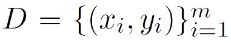其中xi∈。对离散属性，若属性值间存在“序”（order）关系，可通过连续化将其转化为连续值，例如二值属性“身高”的取值“高”“矮”可转化为{1.0，0.0}，三值属性“高度”的取值“高”“中”“低”可转化为{1.0，0.5，0.0}；若属性值间不存在序关系，假定有k个属性值，则通常转化为k维向量，例如属性“瓜类”的取值“西瓜”“南瓜”“黄瓜”可转化为（0，0，1），（0，1，0），（1，0，0）。

线性回归试图学得

f（xi）=wxi+b，使得f（xi）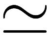yi。

均方误差亦称平方损失（square loss）。

如何确定w和b呢？显然，关键在于如何衡量发f（x）与y之间的差别。2.3节介绍过，均方误差（2.2）是回归任务中最常用的性能度量，因此我们可试图让均方误差最小化，即

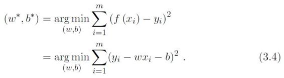

w\*，b\*表示w和b的解。

最小二乘法用途很广，不仅限于线性回归。

均方误差有非常好的几何意义，它对应了常用的欧几里得距离或简称“欧氏距离”（Euclidean distance）。基于均方误差最小化来进行模型求解的方法称为“最小二乘法”（least square method）。在线性回归中，最小二乘法就是试图找到一条直线，使所有样本到直线上的欧氏距离之和最小。

这里E（w，b）是关于w和b的凸函数，当它关于w和b的导数均为零时，得到w和b的最优解。

求解w和b使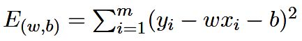最小化的过程，称为线性回归模型的最小二乘“参数估计”（parameter estimation）。我们可将E（w，b）分别对w和b求导，得到

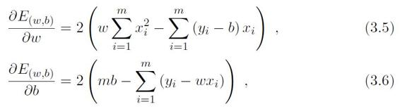

对区间\[a，b\]上定义的函数f，若它对区间中任意两点x1，x2均有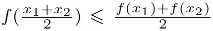，则称f为区间\[a，b\]上的凸函数。

U形曲线的函数如f（x）=x2，通常是凸函数。

对实数集上的函数，可通过求二阶导数来判别：若二阶导数在区间上非负，则称为凸函数；若二阶导数在区间上恒大于0，则称为严格凸函数。

然后令式（3.5）和（3.6）为零可得到w和b最优解的闭式（closed-form）解

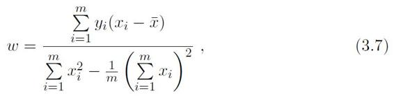

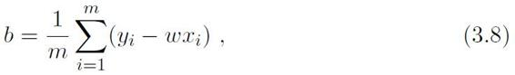

其中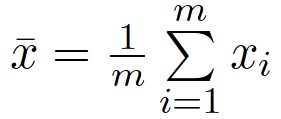为x的均值。

更一般的情形是如本节开头的数据集D，样本由d个属性描述。此时我们试图学得

f（xi）=wTxi+b，使得f（xi）yi。

亦称“多变量线性回归”。

这称为“多元线性回归”（multivariate linear regression）。

类似的，可利用最小二乘法来对w和b进行估计。为便于讨论，我们把w和b吸收入向量形式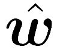=（w；b），相应的，把数据集D表示为一个m×（d+1）大小的矩阵X，其中每行对应于一个示例，该行前d个元素对应于示例的d个属性值，最后一个元素恒置为1，即

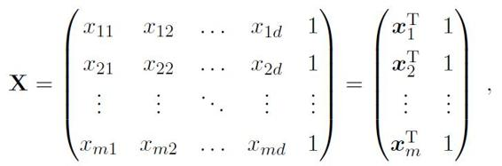

再把标记也写成向量形式**y**=（y1；y2；...；ym），则类似于式（3.4），有

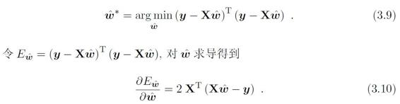

令上式为零可得最优解的闭式解，但由于涉及矩阵逆的计算，比单变量情形要复杂一些。下面我们做一个简单的讨论。

当XTX为满秩矩阵（full-rank matrix）或正定矩阵（positive definite matrix）时，令式（3.10）为零可得

\*=（XTX）-1XTy，　（3-11）

其中（XTX）-1是矩阵（XTX）的逆矩阵。令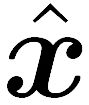i=（xi；1），则最终学得的多元线性回归模型为

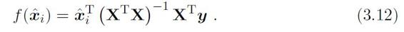

例如，生物信息学的基因芯片数据中常有成千上万个属性，但往往只有几十、上百个样例。

回忆一下：解线性方程组时，若因变量过多，则会解出多组解。

然而，现实任务中XTX往往不是满秩矩阵。例如在许多任务中我们会遇到大量的变量，其数目甚至超过样例数，导致X的列数多于行数，XTX显然不满秩。此时可解出多个，它们都能使均方误差最小化。选择哪一个解作为输出，将由学习算法的归纳偏好决定，常见的做法是引入正则化（regularization）项。

归纳偏好参见（1.4 归纳偏好）；正则化参见（6.4 软间隔与正则化）、（11.4 嵌入式选择与L1正则化）。

线性模型虽简单，却有丰富的变化。例如对于样例（x，y），y∈，当我们希望线性模型（3.2）的预测值逼近真实标记y时，就得到了线性回归模型。为便于观察，我们把线性回归模型简写为

y=wTx+b.　（3.13）

可否令模型预测值逼近y的衍生物呢？譬如说，假设我们认为示例所对应的输出标记是在指数尺度上变化，那就可将输出标记的对数作为线性模型逼近的目标，即

lny=wTx+b.　（3.14）

这就是“对数线性回归”（log-linear regression），它实际上是在试图让ewTx+b逼近y。式（3.14）在形式上仍是线性回归，但实质上已是在求取输入空间到输出空间的非线性函数映射，如图3.1所示。这里的对数函数起到了将线性回归模型的预测值与真实标记联系起来的作用。

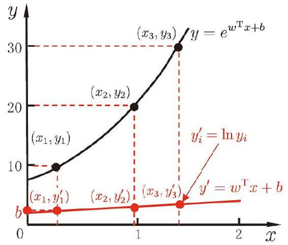

图3.1　对数线性回归示意图

g（·）连续且充分光滑。

更一般地，考虑单调可微函数g（·），令

y=g-1（wTx+b），　（3.15）

广义线性模型的参数估计常通过加权最小二乘法或极大似然法进行。

这样得到的模型称为“广义线性模型”（generalized linear model），其中函数g（·）称为“联系函数”（link function）。显然，对数线性回归是广义线性模型在g（·）=ln（·）时的特例。

## 3.3 对数几率回归

上一节讨论了如何使用线性模型进行回归学习，但若要做的是分类任务该怎么办？答案蕴涵在式（3.15）的广义线性模型中：只需找一个单调可微函数将分类任务的真实标记y与线性回归模型的预测值联系起来。

亦称Heaviside函数。

考虑二分类任务，其输出标记y∈{0，1}，而线性回归模型产生的预测值z=wTx+b是实值，于是，我们需将实值z转换为0/1值。最理想的是“单位阶跃函数”（unit-step function）

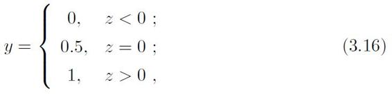

即若预测值z大于零就判为正例，小于零则判为反例，预测值为临界值零则可任意判别，如图3.2所示。

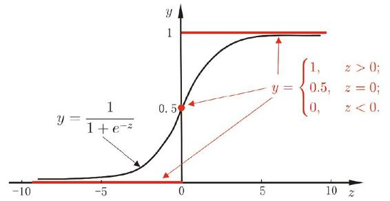

图3.2　单位阶跃函数与对数几率函数

简称“对率函数”。

但从图3.2可看出，单位阶跃函数不连续，因此不能直接用作式（3.15）中的g-（·）。于是我们希望找到能在一定程度上近似单位阶跃函数的“替代函数”（surrogate function），并希望它单调可微。对数几率函数（logistic function）正是这样一个常用的替代函数：

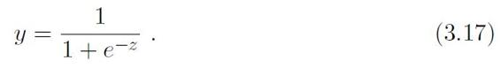

注意对数几率函数与“对数函数”ln（·）不同。

Sigmoid函数即形似S的函数。对率函数是Sigmoid函数最重要的代表，在（第5章 神经网络）将看到它在神经网络中的重要作用。

从图3.2可看出，对数几率函数是一种“Sigmoid函数”，它将z值转化为一个接近0或1的y值，并且其输出值在z=0附近变化很陡。将对数几率函数作为g-（·）代入式（3.15），得到

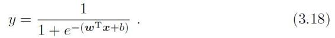

类似于式（3.14），式（3.18）可变化为

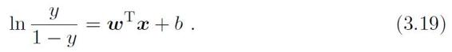

若将y视为样本**x**作为正例的可能性，则1−y是其反例可能性，两者的比值

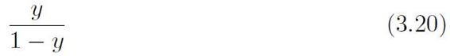

称为“几率”（odds），反映了x作为正例的相对可能性。对几率取对数则得到“对数几率”（log odds，亦称logit）

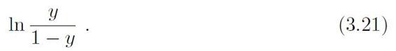

有文献译为“逻辑回归”，但中文“逻辑”与logistic和logit的含义相去甚远，因此本书意译为“对数几率回归”，简称“对率回归”。

由此可看出，式（3.18）实际上是在用线性回归模型的预测结果去逼近真实标记的对数几率，因此，其对应的模型称为“对数几率回归”（logisticregression，亦称logit regression）。特别需注意到，虽然它的名字是“回归”，但实际却是一种分类学习方法。这种方法有很多优点，例如它是直接对分类可能性进行建模，无需事先假设数据分布，这样就避免了假设分布不准确所带来的问题；它不是仅预测出“类别”，而是可得到近似概率预测，这对许多需利用概率辅助决策的任务很有用；此外，对率函数是任意阶可导的凸函数，有很好的数学性质，现有的许多数值优化算法都可直接用于求取最优解。

下面我们来看看如何确定式（3.18）中的w和b。若将式（3.18）中的y视为类后验概率估计p（y=1\|x），则式（3.19）可重写为

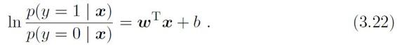

显然有

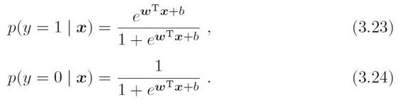

极大似然法参见（7.2 极大似然估计）。

于是，我们可通过“极大似然法”（maximum likelihood method）来估计w和b。给定数据集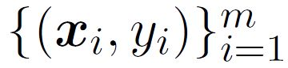，对率回归模型最大化“对数似然”（loglikelihood）

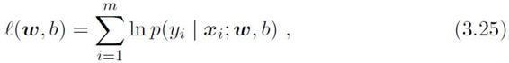

即令每个样本属于其真实标记的概率越大越好。为便于讨论，令β=（w；b），=（x；1），则wTx+b可简写为βT。再令p1（；β）=p（y=1\|；β），p0（；β）=p（y=0\|；β）=1-p1（；β），则式（3.25）中的似然项可重写为

p（yi\|xi；w，b）=yip1（i；β）+（1-yi）p0（i；β）.　（3.26）

考虑yi∈{0，1}.

将式（3.26）代入（3.25），并根据式（3.23）和（3.24）可知，最大化式（3.25）等价于最小化

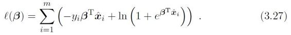

参见附录（B.4 梯度下降法）。

式（3.27）是关于β的高阶可导连续凸函数，根据凸优化理论\[Boyd and Vandenberghe, 2004\]，经典的数值优化算法如梯度下降法（gradient descent method）、牛顿法（Newton method）等都可求得其最优解，于是就得到

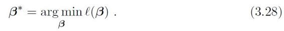

以牛顿法为例，其第t+1轮迭代解的更新公式为

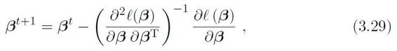

其中关于β的一阶、二阶导数分别为

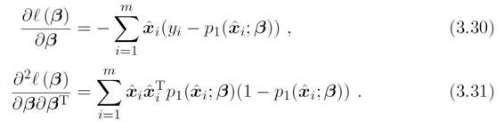

## 3.4 线性判别分析

严格说来LDA与Fisher判别分析稍有不同，前者假设了各类样本的协方差矩阵相同且满秩。

线性判别分析（Linear Discriminant Analysis，简称LDA）是一种经典的线性学习方法，在二分类问题上因为最早由\[Fisher，1936\]提出，亦称“Fisher判别分析”。

LDA的思想非常朴素：给定训练样例集，设法将样例投影到一条直线上，使得同类样例的投影点尽可能接近、异类样例的投影点尽可能远离；在对新样本进行分类时，将其投影到同样的这条直线上，再根据投影点的位置来确定新样本的类别。图3.3给出了一个二维示意图。

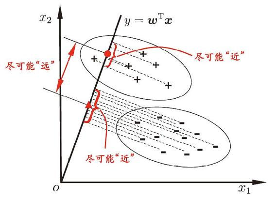

图3.3　LDA的二维示意图。“+”、“–”分别代表正例和反例，椭圆表示数据簇的外轮廓，虚线表示投影，红色实心圆和实心三角形分别表示两类样本投影后的中心点。

给定数据集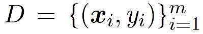，yi∈{0，1}，令Xi、μi、Σi分别表示第i∈{0，1}类示例的集合、均值向量、协方差矩阵。若将数据投影到直线w上，则两类样本的中心在直线上的投影分别为wTμ0和wTμ1；若将所有样本点都投影到直线上，则两类样本的协方差分别为wTΣ0w和wTΣ1w。由于直线是一维空间，因此wTμ0、wTμ1、wTΣ0w和wTΣ1w均为实数。

欲使同类样例的投影点尽可能接近，可以让同类样例投影点的协方差尽可能小，即wTΣ0w+wTΣ1w尽可能小；而欲使异类样例的投影点尽可能远离，可以让类中心之间的距离尽可能大，即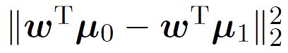尽可能大。同时考虑二者，则可得到欲最大化的目标

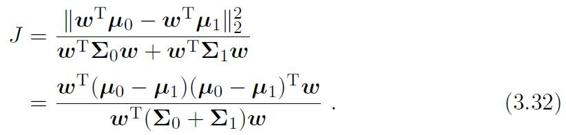

定义“类内散度矩阵”（within-class scatter matrix）

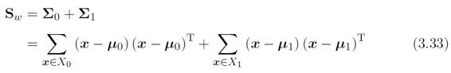

以及“类间散度矩阵”（between-class scatter matrix）

Sb=（μ0-μ1）（μ0-μ1）T，　（3.34）

则式（3.32）可重写为

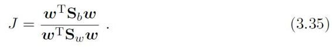

这就是LDA欲最大化的目标，即Sb与Sw的“广义瑞利商”（generalizedRayleigh quotient）。

若w是一个解，则对于任意常数α，αw也是式（3.35）的解。

如何确定w呢？注意到式（3.35）的分子和分母都是关于w的二次项，因此式（3.35）的解与w的长度无关，只与其方向有关。不失一般性，令wTSww=1，则式（3.35）等价于

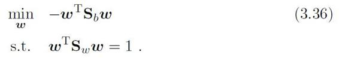

拉格朗日乘子法参见附录（B.1 拉格朗日乘子法）。

由拉格朗日乘子法，上式等价于

Sbw=λSww，　（3.37）

（μ0-μ1）Tw是标量。

其中λ是拉格朗日乘子。注意到Sbw的方向恒为μ0-μ1，不妨令

Sbw=λ（μ0-μ1），　（3.38）

代入式（3.37）即得

w=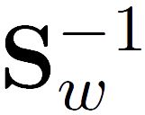（μ0-μ1）　（3.39）

奇异值分解参见附录（A.3 奇异值分解）。

考虑到数值解的稳定性，在实践中通常是对Sw进行奇异值分解，即Sw=UΣVT，这里Σ是一个实对角矩阵，其对角线上的元素是Sw的奇异值，然后再由=VΣ-1UT得到。

参见习题（7.5 试证明：二分类任务中两类数据满足高斯分布且方差相同时，线性判别分析产生贝叶斯最优分类器。）。

值得一提的是，LDA可从贝叶斯决策理论的角度来阐释，并可证明，当两类数据同先验、满足高斯分布且协方差相等时，LDA可达到最优分类。

可以将LDA推广到多分类任务中。假定存在N个类，且第i类示例数为mi，我们先定义“全局散度矩阵”

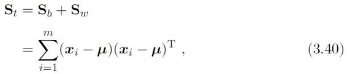

其中μ是所有示例的均值向量。将类内散度矩阵Sw重定义为每个类别的散度矩阵之和，即

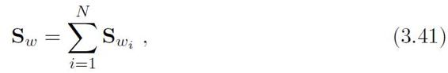

其中

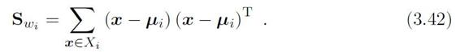

由式（3.40）~（3.42）可得

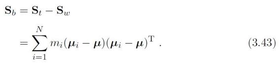

显然，多分类LDA可以有多种实现方法：使用Sb，Sw，St三者中的任何两个即可。常见的一种实现是采用优化目标

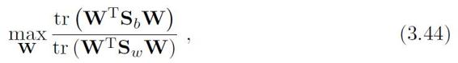

其中W∈d×（N-1），tr（·）表示矩阵的迹（trace）。式（3.44）可通过如下广义特征值问题求解：

SbW=λSwW.　（3.45）

最多有N−1个非零特征值。

W的闭式解则是的d′个最大非零广义特征值所对应的特征向量组成的矩阵，d′≦N−1。

降维参见（第10章 降维与度量学习）

若将W视为一个投影矩阵，则多分类LDA将样本投影到d′维空间，d′通常远小于数据原有的属性数d。于是，可通过这个投影来减小样本点的维数，且投影过程中使用了类别信息，因此LDA也常被视为一种经典的监督降维技术。

## 3.5 多分类学习

例如上一节最后介绍的LDA推广。

现实中常遇到多分类学习任务。有些二分类学习方法可直接推广到多分类，但在更多情形下，我们是基于一些基本策略，利用二分类学习器来解决多分类问题。

通常称分类学习器为“分类器”（classifier）。

关于多个分类器的集成，参见（第8章 集成学习）。

不失一般性，考虑N个类别C1，C2，...，CN，多分类学习的基本思路是“拆解法”，即将多分类任务拆为若干个二分类任务求解。具体来说，先对问题进行拆分，然后为拆出的每个二分类任务训练一个分类器；在测试时，对这些分类器的预测结果进行集成以获得最终的多分类结果。这里的关键是如何对多分类任务进行拆分，以及如何对多个分类器进行集成。本节主要介绍拆分策略。

OvR亦称OvA（One vs. All），但OvA这个说法不严格，因为不可能把“所有类”作为反类。

最经典的拆分策略有三种：“一对一”（One vs. One，简称OvO）、“一对其余”（One vs. Rest，简称OvR）和“多对多”（Many vs. Many，简称MvM）。

亦可根据各分类器的预测置信度等信息进行集成，参见（8.4 结合策略）。

给定数据集D={（x1，y1），（x2，y2），...，（xm，ym）}，yi∈{C1，C2，...，CN}。OvO将这N个类别两两配对，从而产生N（N-1）/2个二分类任务，例如OvO将为区分类别Ci和Cj训练一个分类器，该分类器把D中的Ci类样例作为正例，Cj类样例作为反例。在测试阶段，新样本将同时提交给所有分类器，于是我们将得到N（N-1）/2个分类结果，最终结果可通过投票产生：即把被预测得最多的类别作为最终分类结果。图3.4给出了一个示意图。

OvR则是每次将一个类的样例作为正例、所有其他类的样例作为反例来训练N个分类器。在测试时若仅有一个分类器预测为正类，则对应的类别标记作为最终分类结果，如图3.4所示。若有多个分类器预测为正类，则通常考虑各分类器的预测置信度，选择置信度最大的类别标记作为分类结果。

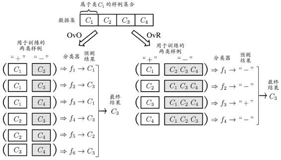

图3.4　OvO与OvR示意图

容易看出，OvR只需训练N个分类器，而OvO需训练N（N-1）/2个分类器，因此，OvO的存储开销和测试时间开销通常比OvR更大。但在训练时，OvR的每个分类器均使用全部训练样例，而OvO的每个分类器仅用到两个类的样例，因此，在类别很多时，OvO的训练时间开销通常比OvR更小。至于预测性能，则取决于具体的数据分布，在多数情形下两者差不多。

MvM是每次将若干个类作为正类，若干个其他类作为反类。显然，OvO和OvR是MvM的特例。MvM的正、反类构造必须有特殊的设计，不能随意选取。这里我们介绍一种最常用的MvM技术：“纠错输出码”（Error Correcting Output Codes，简称ECOC）。

ECOC \[Dietterich and Bakiri，1995\]是将编码的思想引入类别拆分，并尽可能在解码过程中具有容错性。ECOC工作过程主要分为两步：

· 编码：对N个类别做M次划分，每次划分将一部分类别划为正类，一部分划为反类，从而形成一个二分类训练集；这样一共产生M个训练集，训练出M个分类器。

· 解码：M个分类器分别对测试样本进行预测，这些预测标记组成一个编码。将这个预测编码与每个类别各自的编码进行比较，返回其中距离最小的类别作为最终预测结果。

类别划分通过“编码矩阵”（coding matrix）指定。编码矩阵有多种形式，常见的主要有二元码\[Dietterich and Bakiri，1995\]和三元码\[Allwein et al.，2000\]。前者将每个类别分别指定为正类和反类，后者在正、反类之外，还可指定“停用类”。图3.5给出了一个示意图，在图3.5（a）中，分类器f2将C1类和C3类的样例作为正例，C2类和C4类的样例作为反例；在图3.5（b）中，分类器f4将C1类和C4类的样例作为正例，C3类的样例作为反例。在解码阶段，各分类器的预测结果联合起来形成了测试示例的编码，该编码与各类所对应的编码进行比较，将距离最小的编码所对应的类别作为预测结果。例如在图3.5（a）中，若基于欧氏距离，预测结果将是C3。

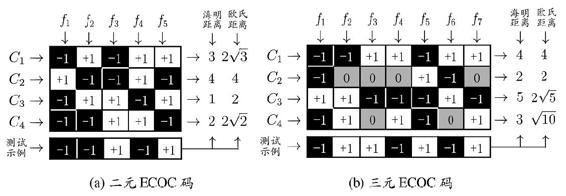

图3.5　ECOC编码示意图。“+1”、“-1”分别表示学习器fi将该类样本作为正、反例；三元码中“0”表示fi不使用该类样本

为什么称为“纠错输出码”呢？这是因为在测试阶段，ECOC编码对分类器的错误有一定的容忍和修正能力。例如图3.5（a）中对测试示例的正确预测编码是（-1，+1，+1，-1，+1），假设在预测时某个分类器出错了，例如f2出错从而导致了错误编码（-1，-1，+1，-1，+1），但基于这个编码仍能产生正确的最终分类结果C3。一般来说，对同一个学习任务，ECOC编码越长，纠错能力越强。然而，编码越长，意味着所需训练的分类器越多，计算、存储开销都会增大；另一方面，对有限类别数，可能的组合数目是有限的，码长超过一定范围后就失去了意义。

对同等长度的编码，理论上来说，任意两个类别之间的编码距离越远，则纠错能力越强。因此，在码长较小时可根据这个原则计算出理论最优编码。然而，码长稍大一些就难以有效地确定最优编码，事实上这是NP难问题。不过，通常我们并不需获得理论最优编码，因为非最优编码在实践中往往已能产生足够好的分类器。另一方面，并不是编码的理论性质越好，分类性能就越好，因为机器学习问题涉及很多因素，例如将多个类拆解为两个“类别子集”，不同拆解方式所形成的两个类别子集的区分难度往往不同，即其导致的二分类问题的难度不同；于是，一个理论纠错性质很好、但导致的二分类问题较难的编码，与另一个理论纠错性质差一些、但导致的二分类问题较简单的编码，最终产生的模型性能孰强孰弱很难说。

## 3.6 类别不平衡问题

前面介绍的分类学习方法都有一个共同的基本假设，即不同类别的训练样例数目相当。如果不同类别的训练样例数目稍有差别，通常影响不大，但若差别很大，则会对学习过程造成困扰。例如有998 个反例，但正例只有2个，那么学习方法只需返回一个永远将新样本预测为反例的学习器，就能达到99.8%的精度；然而这样的学习器往往没有价值，因为它不能预测出任何正例。

类别不平衡（class-imbalance）就是指分类任务中不同类别的训练样例数目差别很大的情况。不失一般性，本节假定正类样例较少，反类样例较多。在现实的分类学习任务中，我们经常会遇到类别不平衡，例如在通过拆分法解决多分类问题时，即使原始问题中不同类别的训练样例数目相当，在使用OvR、MvM策略后产生的二分类任务仍可能出现类别不平衡现象，因此有必要了解类别不平衡性处理的基本方法。

对OvR、MvM来说，由于对每个类进行了相同的处理，其拆解出的二分类任务中类别不平衡的影响会相互抵消，因此通常不需专门处理。

从线性分类器的角度讨论容易理解，在我们用y=wTx+b对新样本x进行分类时，事实上是在用预测出的y值与一个阈值进行比较，例如通常在y\>0.5时判别为正例，否则为反例。y实际上表达了正例的可能性，几率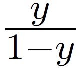则反映了正例可能性与反例可能性之比值，阈值设置为0.5恰表明分类器认为真实正、反例可能性相同，即分类器决策规则为

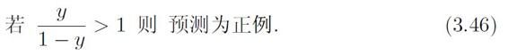

无偏采样意味着真实样本总体的类别比例在训练集中得以保持。

然而，当训练集中正、反例的数目不同时，令m+表示正例数目，m-表示反例数目，则观测几率是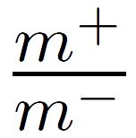，由于我们通常假设训练集是真实样本总体的无偏采样，因此观测几率就代表了真实几率。于是，只要分类器的预测几率高于观测几率就应判定为正例，即

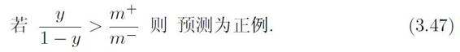

但是，我们的分类器是基于式（3.46）进行决策，因此，需对其预测值进行调整，使其在基于式（3.46）决策时，实际是在执行式（3.47）。要做到这一点很容易，只需令

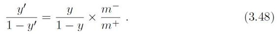

亦称“再平衡”（rebalance）。

这就是类别不平衡学习的一个基本策略――“再缩放”（rescaling）。

欠采样亦称“下采样”（downsampling），过采样亦称“上采样”（upsampling）。

再缩放的思想虽简单，但实际操作却并不平凡，主要因为“训练集是真实样本总体的无偏采样”这个假设往往并不成立，也就是说，我们未必能有效地基于训练集观测几率来推断出真实几率。现有技术大体上有三类做法：第一类是直接对训练集里的反类样例进行“欠采样”（undersampling），即去除一些反例使得正、反例数目接近，然后再进行学习；第二类是对训练集里的正类样例进行“过采样”（oversampling），即增加一些正例使得正、反例数目接近，然后再进行学习；第三类则是直接基于原始训练集进行学习，但在用训练好的分类器进行预测时，将式（3.48）嵌入到其决策过程中，称为“阈值移动”（threshold-moving）。

欠采样法的时间开销通常远小于过采样法，因为前者丢弃了很多反例，使得分类器训练集远小于初始训练集，而过采样法增加了很多正例，其训练集大于初始训练集。需注意的是，过采样法不能简单地对初始正例样本进行重复采样，否则会招致严重的过拟合；过采样法的代表性算法SMOTE \[Chawlaet al.，2002\]是通过对训练集里的正例进行插值来产生额外的正例。另一方面，欠采样法若随机丢弃反例，可能丢失一些重要信息；欠采样法的代表性算法EasyEnsemble \[Liu et al.，2009\]则是利用集成学习机制，将反例划分为若干个集合供不同学习器使用，这样对每个学习器来看都进行了欠采样，但在全局来看却不会丢失重要信息。

代价敏感学习研究非均等代价下的学习。参见（2.3.4 代价敏感错误率与代价曲线）。

值得一提的是，“再缩放”也是“代价敏感学习”（cost-sensitive learning）的基础。在代价敏感学习中将式（3.48）中的m-/m+用cost+/cost-代替即可，其中cost+是将正例误分为反例的代价，cost-是将反例误分为正例的代价。

## 3.7 阅读材料

参见（第11章 特征选择与稀疏学习）。

“稀疏表示”（sparse representation）近年来很受关注，但即便对多元线性回归这样简单的模型，获得具有最优“稀疏性”（sparsity）的解也并不容易。稀疏性问题本质上对应了L0范数的优化，这在通常条件下是NP难问题。LASSO\[Tibshirani, 1996\]通过L1范数来近似L0范数，是求取稀疏解的重要技术。

可以证明，OvO和OvR都是ECOC的特例\[Allwein et al.，2000\]。人们以往希望设计通用的编码法，\[Crammer and Singer，2002\]提出要考虑问题本身的特点，设计“问题依赖”的编码法，并证明寻找最优的离散编码矩阵是一个NP完全问题。此后，有多种问题依赖的ECOC编码法被提出，通常是通过找出具有代表性的二分类问题来进行编码\[Pujol et al., 2006，2008\]。\[Escalera etal.，2010\]开发了一个开源ECOC库。

MvM除了ECOC还可有其他实现方式，例如DAG （Directed Acyclic Graph）拆分法\[Platt et al.，2000\]将类别划分表达成树形结构，每个结点对应于一个二类分类器。还有一些工作是致力于直接求解多分类问题，例如多类支持向量机方面的一些研究\[Crammer and Singer，2001；Lee et al.，2004\]。

代价敏感学习中研究得最多的是基于类别的“误分类代价”（misclassification cost），代价矩阵如表2.2所示；本书在提及代价敏感学习时，默认指此类情形。已经证明，对二分类任务可通过“再缩放”获得理论最优解\[Elkan，2001\]，但对多分类任务，仅在某些特殊情形下存在闭式解\[Zhouand Liu，2006a\]。非均等代价和类别不平衡性虽然都可借助“再缩放”技术，但两者本质不同\[Zhou and Liu，2006b\]。需注意的是，类别不平衡学习中通常是较小类的代价更高，否则无需进行特殊处理。

多分类学习中虽然有多个类别，但每个样本仅属于一个类别。如果希望为一个样本同时预测出多个类别标记，例如一幅图像可同时标注为“蓝天”、“白云”、“羊群”、“自然场景”，这样的任务就不再是多分类学习，而是“多标记学习”（multi-label learning），这是机器学习中近年来相当活跃的一个研究领域。对多标记学习感兴趣的读者可参阅\[Zhang and Zhou，2014\]。

## 习题

3.1 试析在什么情形下式（3.2）中不必考虑偏置项b。

3.2 试证明，对于参数w，对率回归的目标函数（3.18）是非凸的，但其对数似然函数（3.27）是凸的。

西瓜数据集3.0α见（表4.5 西瓜数据集3.0α）。

3.3 编程实现对率回归，并给出西瓜数据集3.0α上的结果。

UCI数据集见http：//archive.ics.uci.edu/ml/.

3.4 选择两个UCI数据集，比较10折交叉验证法和留一法所估计出的对率回归的错误率。

3.5 编程实现线性判别分析，并给出西瓜数据集3.0α上的结果。

线性可分是指存在线性超平面能将不同类的样本点分开。参见（6.3 核函数）。

3.6 线性判别分析仅在线性可分数据上能获得理想结果，试设计一个改进方法，使其能较好地用于非线性可分数据

3.7 令码长为9，类别数为4，试给出海明距离意义下理论最优的ECOC二元码并证明之。

3.8\* ECOC编码能起到理想纠错作用的重要条件是：在每一位编码上出错的概率相当且独立。试析多分类任务经ECOC编码后产生的二类分类器满足该条件的可能性及由此产生的影响。

3.9 使用OvR和MvM将多分类任务分解为二分类任务求解时，试述为何无需专门针对类别不平衡性进行处理。

3.10\* 试推导出多分类代价敏感学习（仅考虑基于类别的误分类代价）使用“再缩放”能获得理论最优解的条件。

## 参考文献

Allwein, E. L., R. E. Schapire, and Y. Singer. （2000）. “Reducing multiclass to binary：A unifying approach for margin classifiers.” *Journal of Machine Learning* Research, 1：113–141.

Boyd, S. and L. Vandenberghe. （2004）. *Convex Optimization*. Cambridge University Press, Cambridge, UK.

Chawla, N. V., K. W. Bowyer, L. O. Hall, and W. P. Kegelmeyer. （2002）. “SMOTE：Synthetic minority over-sampling technique.” *Journal of Artificial Intelligence Research*, 16：321–357.

Crammer, K. and Y. Singer. （2001）. “On the algorithmic implementation of multiclass kernel-based vector machines.” *Journal of Machine Learning Research*, 2：265–292.

Crammer, K. and Y. Singer. （2002）. “On the learnability and design of output codes for multiclass problems.” *Machine Learning*, 47（2-3）：201–233.

Dietterich, T. G. and G. Bakiri. （1995）. “Solving multiclass learning problems via error-correcting output codes.” *Journal of Artificial Intelligence Research*, 2：263–286.

Elkan, C. （2001）. “The foundations of cost-sensitive learning.” In *Proceedings of the 17th International Joint Conference on Artificial Intelligence （IJCAI）*, 973–978, Seattle, WA.

Escalera, S., O. Pujol, and P. Radeva. （2010）. “Error-correcting ouput codes library.” *Journal of Machine Learning Research*, 11：661–664.

Fisher, R. A. （1936）. “The use of multiple measurements in taxonomic problems.” *Annals of Eugenics*, 7（2）：179–188.

Lee, Y., Y. Lin, and G. Wahba. （2004）. “Multicategory support vector machines, theory, and application to the classification of microarray data and satellite radiance data.” *Journal of the American Statistical Association*, 99 （465）：67–81.

Liu, X.-Y., J. Wu, and Z.-H. Zhou. （2009）. “Exploratory undersamping for class-imbalance learning.” *IEEE Transactions on Systems, Man, and Cybernetics - Part B：Cybernetics*, 39（2）：539–550.

Platt, J. C., N. Cristianini, and J. Shawe-Taylor. （2000）. “Large margin DAGs for multiclass classification.” In *Advances in Neural Information Processing Systems 12 （NIPS）* （S. A. Solla, T. K. Leen, and K.-R. M¨uller, eds.）, MIT Press, Cambridge, MA.

Pujol, O., S. Escalera, and P. Radeva. （2008）. “An incremental node embedding technique for error correcting output codes.” *Pattern Recognition*, 41（2）：713–725.

Pujol, O., P. Radeva, and J. Vitri\`a. （2006）. “Discriminant ECOC：A heuristic method for application dependent design of error correcting output codes.” *IEEE Transactions on Pattern Analysis and Machine Intelligence*, 28（6）：1007–1012.

Tibshirani, R. （1996）. “Regression shrinkage and selection via the LASSO.” *Journal of the Royal Statistical Society：Series B*, 58（1）：267–288.

Zhang, M.-L. and Z.-H. Zhou. （2014）. “A review on multi-label learning algorithms.” *IEEE Transactions on Knowledge and Data Engineering*, 26（8）：1819–1837.

Zhou, Z.-H. and X.-Y. Liu. （2006a）. “On multi-class cost-sensitive learning.” In *Proceeding of the 21st National Conference on Artificial Intelligence （AAAI）*, 567–572, Boston, WA.

Zhou, Z.-H. and X.-Y. Liu. （2006b）. “Training cost-sensitive neural networks with methods addressing the class imbalance problem.” *IEEE Transactions on Knowledge and Data Engineering*, 18（1）：63–77.

## 休息一会儿

### 小故事：关于“最小二乘法”

（1993年版德国10马克纸币上的高斯像）

1801年，意大利天文学家皮亚齐发现了1号小行星“谷神星”，但在跟踪观测了40天后，因谷神星转至太阳的背后，皮亚齐失去了谷神星的位置。许多天文学家试图重新找到谷神星，但都徒劳无获。这引起了伟大的德国数学家高斯（1777—1855）的注意。他发明了一种方法，根据皮亚齐的观测数据计算出了谷神星的轨道，后来德国天文学家奥伯斯在高斯预言的时间和星空领域重新找到了谷神星。1809年，高斯在他的著作《天体运动论》中发表了这种方法，即最小二乘法。

另两位是拉格朗日和拉普拉斯，三人姓氏首字母相同，时称“3L”。

1805年，在椭圆积分、数论和几何方面都有重大贡献的法国大数学家勒让德（1752—1833）发表了《计算彗星轨道的新方法》，其附录中描述了最小二乘法。勒让德是法国18—19世纪数学界的三驾马车之一，早已是法国科学院院士。但勒让德的书中没有涉及最小二乘法的误差分析，高斯1809年的著作中包括了这方面的内容，这对最小二乘法用于数理统计、乃至今天的机器学习有极为重要的意义。由于高斯的这一重大贡献，以及他声称自己1799年就已开始使用这个方法，因此很多人将最小二乘法的发明优先权归之为高斯。当时这两位大数学家发生了著名的优先权之争，此后有许多数学史家专门进行研究，但至今也没弄清到底是谁最先发明了最小二乘法。

