# 第6章 支持向量机

<strong>本章配套视频 · P31–P36</strong>播放器从 P31 开始

  <iframe
    src="https://player.bilibili.com/player.html?isOutside=true&amp;bvid=BV1gG411f7zX&amp;cid=29655697209&amp;p=31&amp;high_quality=1&amp;danmaku=0&amp;autoplay=0"
    title="第 6 章 支持向量机配套视频，从 P31 开始"
    loading="lazy"
    scrolling="no"
    frameborder="0"
    allow="fullscreen; picture-in-picture"
    allowfullscreen>
  </iframe>

展开本章全部分 P（P31–P36）

<a class="video-part" href="https://www.bilibili.com/video/BV1gG411f7zX/?p=31" target="_blank" rel="noopener">P31 · 支持向量机基本型</a>
<a class="video-part" href="https://www.bilibili.com/video/BV1gG411f7zX/?p=32" target="_blank" rel="noopener">P32 · 对偶问题与解的特性</a>
<a class="video-part" href="https://www.bilibili.com/video/BV1gG411f7zX/?p=33" target="_blank" rel="noopener">P33 · 求解方法</a>
<a class="video-part" href="https://www.bilibili.com/video/BV1gG411f7zX/?p=34" target="_blank" rel="noopener">P34 · 特征空间映射</a>
<a class="video-part" href="https://www.bilibili.com/video/BV1gG411f7zX/?p=35" target="_blank" rel="noopener">P35 · 核函数</a>
<a class="video-part" href="https://www.bilibili.com/video/BV1gG411f7zX/?p=36" target="_blank" rel="noopener">P36 · SVM 简史</a>

## 6.1 间隔与支持向量

给定训练样本集D={（x1，y1），（x2，y2），...，（xm，ym）}，yi ∈ {−1，+1}，分类学习最基本的想法就是基于训练集D在样本空间中找到一个划分超平面，将不同类别的样本分开。但能将训练样本分开的划分超平面可能有很多，如图6.1所示，我们应该努力去找到哪一个呢？

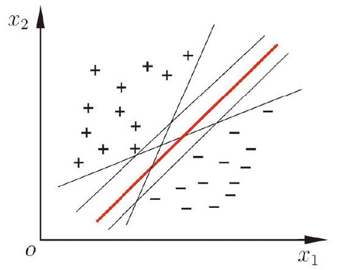

图6.1 存在多个划分超平面将两类训练样本分开

直观上看，应该去找位于两类训练样本“正中间”的划分超平面，即图6.1中红色的那个，因为该划分超平面对训练样本局部扰动的“容忍”性最好。例如，由于训练集的局限性或噪声的因素，训练集外的样本可能比图6.1中的训练样本更接近两个类的分隔界，这将使许多划分超平面出现错误，而红色的超平面受影响最小。换言之，这个划分超平面所产生的分类结果是最鲁棒的，对未见示例的泛化能力最强。

在样本空间中，划分超平面可通过如下线性方程来描述：

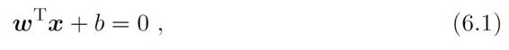

参见习题 （6.1 间隔与支持向量）。

其中w=（w1；w2；...；wd）为法向量，决定了超平面的方向；b为位移项，决定了超平面与原点之间的距离。显然，划分超平面可被法向量w和位移b确定，下面我们将其记为（w，b）.样本空间参见习题 6.1。中任意点x到超平面（w，b）的距离可写为

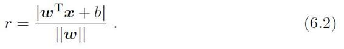

若超平面（w′，b′）能将训练样本正确分类，则总存在缩放变换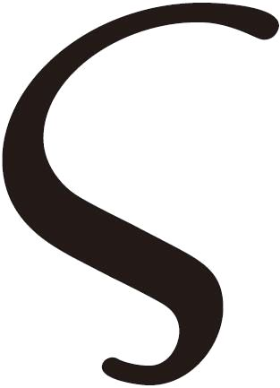w ↦→ w′和b ↦→ b′ 使式（6.3）成立。

假设超平面（w，b）能将训练样本正确分类，即对于（xi，yi）∈D，若yi=+1，则有wTxi +b \> 0；若yi=−1，则有wTxi + b\< 0.令

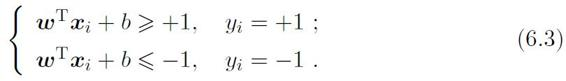

每个样本点对应一个特征向量。

如图6.2 所示，距离超平面最近的这几个训练样本点使式（6.3）的等号成立，它们被称为“支持向量”（support vector），两个异类支持向量到超平面的距离之和为

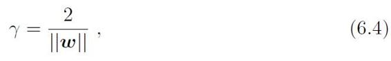

它被称为“间隔”（margin）。

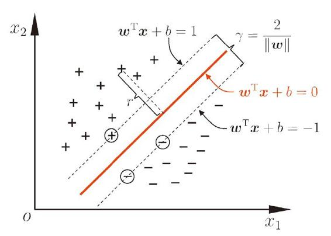

图6.2 支持向量与间隔

欲找到具有“最大间隔”（maximum margin）的划分超平面，也就是要找到能满足式（6.3）中约束的参数w和b，使得r最大，即

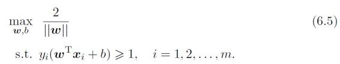

间隔貌似仅与w有关，但事实上b通过约束隐式地影响着w的取值，进而对间隔产生影响。

显然，为了最大化间隔，仅需最大化‖w‖−1，这等价于最小化‖w‖2。于是，式（6.5）可重写为

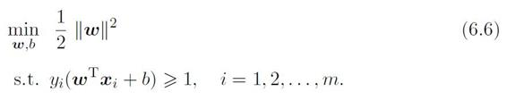

这就是支持向量机（Support Vector Machine，简称SVM）的基本型。

## 6.2 对偶问题

我们希望求解式（6.6）来得到大间隔划分超平面所对应的模型

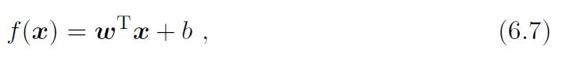

其中w和b是模型参数。注意到式（6.6）本身是一个凸二次规划（convex quadratic programming）问题，能直接用现成的优化计算包求解，但我们可以有更高效的办法。

参见附录（B.2 二次规划）。

对式（6.6）使用拉格朗日乘子法可得到其“对偶问题”（dual problem）。具体来说，对式（6.6）的每条约束添加拉格朗日乘子ai\> 0，则该问题的拉格朗日函数可写为

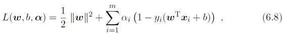

其中a=（a1；a2；...；am）。令L（w，b，a）对w和b的偏导为零可得

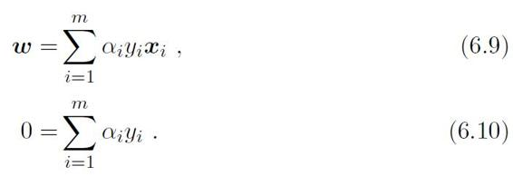

将式（6.9）代入（6.8），即可将L（w，b，a）中的w和b消去，再考虑式（6.10）的约束，就得到式（6.6）的对偶问题

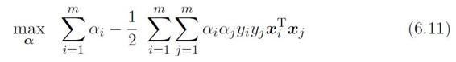

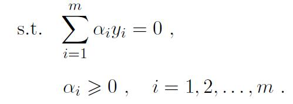

解出a后，求出w与b即可得到模型

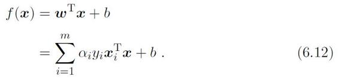

参见附录（B.1 拉格朗日乘子法）。

从对偶问题（6.11）解出的ai是式（6.8）中的拉格朗日乘子，它恰对应着训练样本（xi，yi）。注意到式（6.6）中有不等式约束，因此上述过程需满足KKT（Karush-Kuhn-Tucker）条件，即要求

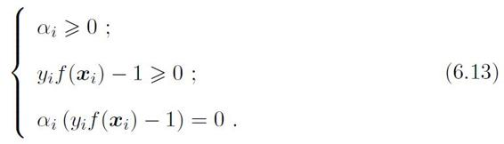

如 \[Vapnik，1999\] 所述，支持向量机这个名字强调了此类学习器的关键是如何从支持向量构建出解；同时也暗示着其复杂度主要与支持向量的数目有关。

二次规划参见附录（B.2 二次规划）。

于是，对任意训练样本（xi，yi），总有ai=0 或yif（xi）=1。若ai=0，则该样本将不会在式（6.12）的求和中出现，也就不会对f（x）有任何影响；若ai\>0则必有 yif（xi）=1，所对应的样本点位于最大间隔边界上，是一个支持向量。这显示出支持向量机的一个重要性质：训练完成后，大部分的训练样本都不需保留，最终模型仅与支持向量有关。

那么，如何求解式（6.11）呢？ 不难发现，这是一个二次规划问题，可使用通用的二次规划算法来求解；然而，该问题的规模正比于训练样本数，这会在实际任务中造成很大的开销。为了避开这个障碍，人们通过利用问题本身的特性，提出了很多高效算法，SMO （Sequential Minimal Optimization）是其中一个著名的代表\[Platt，1998\]。

SMO 的基本思路是先固定ai之外的所有参数，然后求ai上的极值。由于存在约束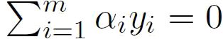，若固定ai之外的其他变量，则ai可由其他变量导出.于是，SMO 每次选择两个变量ai和aj，并固定其他参数。这样，在参数初始化后，SMO 不断执行如下两个步骤直至收敛：

• 选取一对需更新的变量ai和aj；

•固定ai和aj以外的参数，求解式（6.11）获得更新后的ai和aj。

注意到只需选取的ai和aj中有一个不满足KKT 条件（6.13），目标函数就会在迭代后增大\[Osuna et al.，1997\]。直观来看，KKT条件违背的程度越大，则变量更新后可能导致的目标函数值增幅越大。于是，SMO 先选取违背KKT 条件程度最大的变量。第二个变量应选择一个使目标函数值增长最快的变量，但由于比较各变量所对应的目标函数值增幅的复杂度过高，因此SMO 采用了一个启发式：使选取的两变量所对应样本之间的间隔最大。一种直观的解释是，这样的两个变量有很大的差别，与对两个相似的变量进行更新相比，对它们进行更新会带给目标函数值更大的变化。

SMO 算法之所以高效，恰由于在固定其他参数后，仅优化两个参数的过程能做到非常高效。具体来说，仅考虑ai和aj时，式（6.11）中的约束可重写为

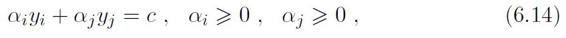

其中

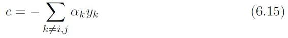

是使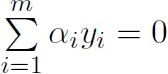成立的常数。用

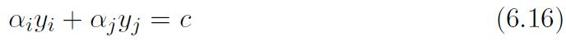

消去式（6.11）中的变量aj，则得到一个关于ai的单变量二次规划问题，仅有的约束是ai\> 0。不难发现，这样的二次规划问题具有闭式解，于是不必调用数值优化算法即可高效地计算出更新后的ai和aj。

如何确定偏移项b呢？ 注意到对任意支持向量（xs，ys）都有ysf（xs）=1，即

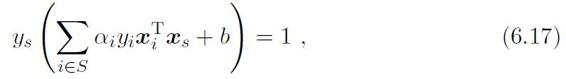

其中S={i\| ai \> 0，i=1，2，...，m}为所有支持向量的下标集。理论上，可选取任意支持向量并通过求解式（6.17）获得b，但现实任务中常采用一种更鲁棒的做法：使用所有支持向量求解的平均值

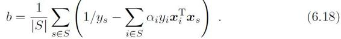

## 6.3 核函数

在本章前面的讨论中，我们假设训练样本是线性可分的，即存在一个划分超平面能将训练样本正确分类。然而在现实任务中，原始样本空间内也许并不存在一个能正确划分两类样本的超平面。例如图6.3中的“异或”问题就不是线性可分的。

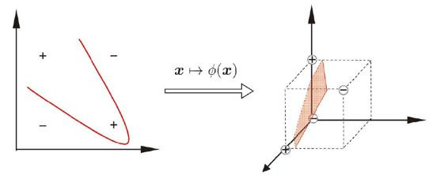

图6.3 异或问题与非线性映射

参见（第12章 计算学习理论）。

对这样的问题，可将样本从原始空间映射到一个更高维的特征空间，使得样本在这个特征空间内线性可分。例如在图6.3中，若将原始的二维空间映射到一个合适的三维空间，就能找到一个合适的划分超平面。幸运的是，如果原始空间是有限维，即属性数有限，那么一定存在一个高维特征空间使样本可分。

令∅（x）表示将x映射后的特征向量，于是，在特征空间中划分超平面所对应的模型可表示为

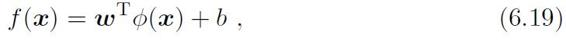

其中w和b是模型参数。类似式（6.6），有

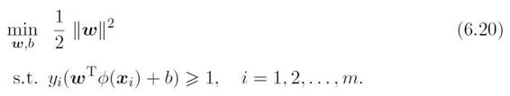

其对偶问题是

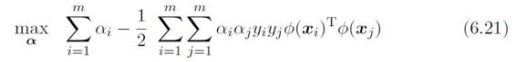

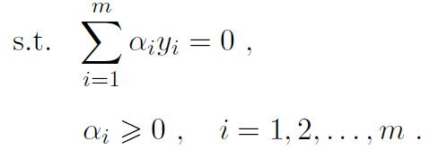

求解式（6.21）涉及到计算∅（xi）T∅（xj），这是样本xi与xj映射到特征空间之后的内积。由于特征空间维数可能很高，甚至可能是无穷维，因此直接计算∅（xi）T∅（xj）通常是困难的。为了避开这个障碍，可以设想这样一个函数：

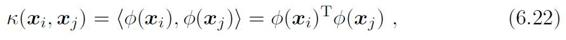

这称为“核技巧” （kernel trick）。

即xi与xj在特征空间的内积等于它们在原始样本空间中通过函数k（·，·）计算的结果。有了这样的函数我们就不必直接去计算高维甚至无穷维特征空间中的内积，于是式（6.21）可重写为，

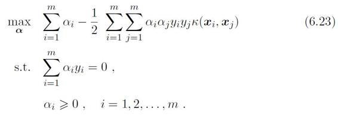

求解后即可得到

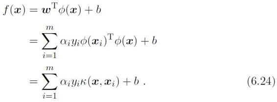

这里的函数k（·，·）就是“核函数”（kernel function）。式（6.24）显示出模型最优解可通过训练样本的核函数展开，这一展式亦称“支持向量展式”（support vector expansion）。

显然，若已知合适映射∅（·）的具体形式，则可写出核函数k（·，·）。但在现实任务中我们通常不知道∅（·）是什么形式，那么，合适的核函数是否一定存在呢？什么样的函数能做核函数呢？ 我们有下面的定理：

证明可参阅 \[SchÖlkopf and Smola，2002\]。

定理 6.1 （核函数）令x为输入空间，k（·，·）是定义在x × x上的对称函数，则k是核函数当且仅当对于任意数据D={x1，x2，...，xm}，“核矩阵”（kernel matrix）K 总是半正定的：

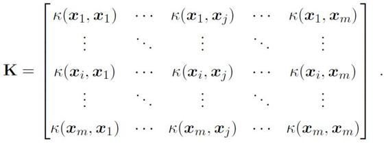

定理6.1 表明，只要一个对称函数所对应的核矩阵半正定，它就能作为核函数使用。事实上，对于一个半正定核矩阵，总能找到一个与之对应的映射∅。换言之，任何一个核函数都隐式地定义了一个称为“再生核希尔伯特空间”（Reproducing Kernel Hilbert Space，简称RKHS）的特征空间。

这方面有一些基本的经验，例如对文本数据通常采用线性核，情况不明时可先尝试高斯核。

通过前面的讨论可知，我们希望样本在特征空间内线性可分，因此特征空间的好坏对支持向量机的性能至关重要。需注意的是，在不知道特征映射的形式时，我们并不知道什么样的核函数是合适的，而核函数也仅是隐式地定义了这个特征空间。于是，“核函数选择”成为支持向量机的最大变数.若核函数选择不合适，则意味着将样本映射到了一个不合适的特征空间，很可能导致性能不佳。

表6.1 列出了几种常用的核函数。

表6.1 常用核函数

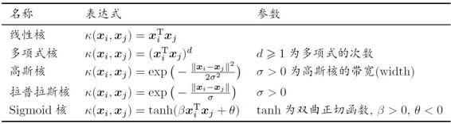

d=1 时退化为线性核.高斯核亦称RBF核。

此外，还可通过函数组合得到，例如：

• 若k1 和k2为核函数，则对于任意正数r1、r2，其线性组合

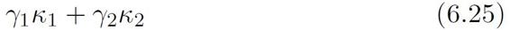

也是核函数；

• 若k1 和k2为核函数，则核函数的直积

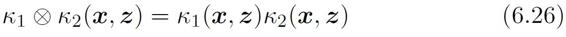

也是核函数；

• 若k1为核函数，则对于任意函数g（x），

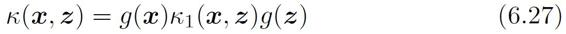

也是核函数。

## 6.4 软间隔与正则化

在前面的讨论中，我们一直假定训练样本在样本空间或特征空间中是线性可分的，即存在一个超平面能将不同类的样本完全划分开。然而，在现实任务中往往很难确定合适的核函数使得训练样本在特征空间中线性可分；退一步说，即便恰好找到了某个核函数使训练集在特征空间中线性可分，也很难断定这个貌似线性可分的结果不是由于过拟合所造成的。

缓解该问题的一个办法是允许支持向量机在一些样本上出错。为此，要引入“软间隔”（soft margin）的概念，如图6.4 所示。

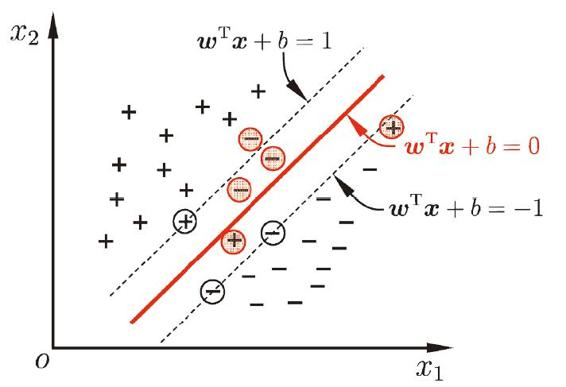

图6.4 软间隔示意图。红色圈出了一些不满足约束的样本。

具体来说，前面介绍的支持向量机形式是要求所有样本均满足约束（6.3），即所有样本都必须划分正确，这称为“硬间隔”（hard margin），而软间隔则是允许某些样本不满足约束

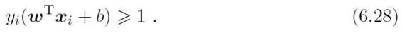

当然，在最大化间隔的同时，不满足约束的样本应尽可能少。于是，优化目标可写为

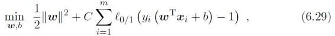

其中C\> 0 是一个常数，ℓ0/1 是“0/1损失函数”

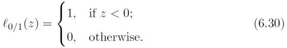

显然，当C为无穷大时，式（6.29）迫使所有样本均满足约束（6.28），于是式（6.29）等价于（6.6）；当C取有限值时，式（6.29）允许一些样本不满足约束。

对率损失是对率函数的变形，对率函数参见（3.3 对数几率回归）。

对率损失函数通常表示为ℓlog（·），因此式（6.33）把式（3.15）中的ln（·）改写为log（·）。

然而，ℓ0/1 非凸、非连续，数学性质不太好，使得式（6.29）不易直接求解。于是，人们通常用其他一些函数来代替ℓ0/1，称为“替代损失”（surrogate loss）.替代损失函数一般具有较好的数学性质，如它们通常是凸的连续函数且是ℓ0/1的上界。图6.5 给出了三种常用的替代损失函数：

hinge损失：ℓhinge（z）=max（0,1−z）;　 （6.31）

指数损失（exponential loss）：ℓexp（z）=exp（−z）; 　（6.32）

对率损失（logistic loss）：ℓlog（z）=log（1+exp（−z））. 　（6.33）

若采用hinge损失，则式（6.29）变成

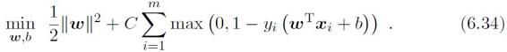

引入“松弛变量”（slack variables）ξi\> 0，可将式（6.34）重写为

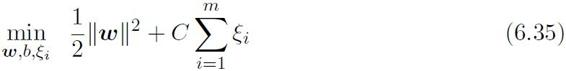

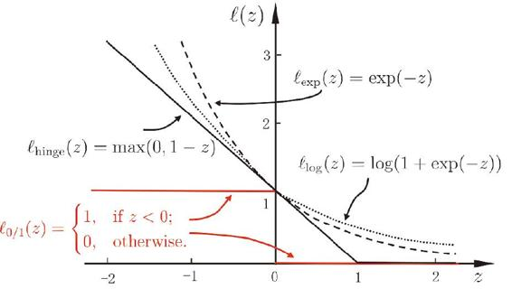

图6.5 三种常见的替代损失函数：hinge损失、指数损失、对率损失

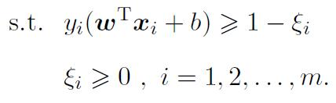

这就是常用的“软间隔支持向量机”。

显然，式（6.35）中每个样本都有一个对应的松弛变量，用以表征该样本不满足约束（6.28）的程度。但是，与式（6.6）相似，这仍是一个二次规划问题。于是，类似式（6.8），通过拉格朗日乘子法可得到式（6.35）的拉格朗日函数

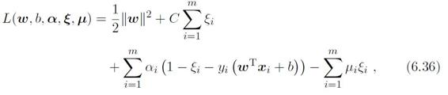

其中ai≥ 0，ui≥ 0 是拉格朗日乘子。

令L（w，b，a，ξ，u）对w，b，ξi 的偏导为零可得

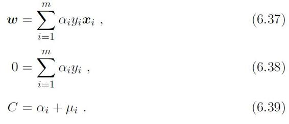

将式（6.37）–（6.39）代入式（6.36）即可得到式（6.35）的对偶问题

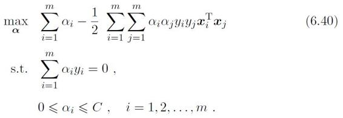

将式（6.40）与硬间隔下的对偶问题（6.11）对比可看出，两者唯一的差别就在于对偶变量的约束不同：前者是0 ≤ ai ≤C，后者是0 ≤ ai。于是，可采用6.2节中同样的算法求解式（6.40）；在引入核函数后能得到与式（6.24）同样的支持向量展式。

类似式（6.13），对软间隔支持向量机，KKT 条件要求

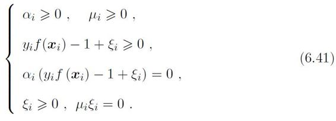

于是，对任意训练样本（xi，yi），总有ai=0 或yif（xi）=1 −ξi。若ai=0，则该样本不会对f（x）有任何影响；若ai\> 0，则必有yif（xi）=1 − ξi，即该样本是支持向量：由式（6.39）可知，若ai \< C，则ui \> 0，进而有ξi=0，即该样本恰在最大间隔边界上；若ai=C，则有ui=0，此时若ξi ≤ 1 则该样本落在最大间隔内部，若ξi \> 1则该样本被错误分类。由此可看出，软间隔支持向量机的最终模型仅与支持向量有关，即通过采用hinge损失函数仍保持了稀疏性。

那么，能否对式（6.29）使用其他的替代损失函数呢？

可以发现，如果使用对率损失函数ℓlog 来替代式（6.29）中的0/1 损失函数，则几乎就得到了对率回归模型（3.27）。实际上，支持向量机与对率回归的优化目标相近，通常情形下它们的性能也相当。对率回归的优势主要在于其输出具有自然的概率意义，即在给出预测标记的同时也给出了概率，而支持向量机的输出不具有概率意义，欲得到概率输出需进行特殊处理\[Platt，2000\]；此外，对率回归能直接用于多分类任务，支持向量机为此则需进行推广\[Hsu and Lin，2002\]。另一方面，从图6.5可看出，hinge 损失有一块“平坦”的零区域，这使得支持向量机的解具有稀疏性，而对率损失是光滑的单调递减函数，不能导出类似支持向量的概念，因此对率回归的解依赖于更多的训练样本，其预测开销更大。

我们还可以把式（6.29）中的0/1 损失函数换成别的替代损失函数以得到其他学习模型，这些模型的性质与所用的替代函数直接相关，但它们具有一个共性：优化目标中的第一项用来描述划分超平面的“间隔”大小，另一项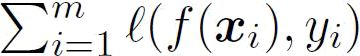用来表述训练集上的误差，可写为更一般的形式

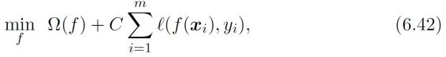

正则化可理解为一种“罚函数法”，即对不希望得到的结果施以惩罚，从而使得优化过程趋向于希望目标。从贝叶斯估计的角度来看，正则化项可认为是提供了模型的先验概率。

参见（11.4 嵌入式选择与L1正则化）。

其中Ω（f）称为“结构风险”（structural risk），用于描述模型f的某些性质；第二项称为“经验风险”（empirical risk），用于描述模型与训练数据的契合程度；C用于对二者进行折中。从经验风险最小化的角度来看，Ω（f）表述了我们希望获得具有何种性质的模型（例如希望获得复杂度较小的模型），这为引入领域知识和用户意图提供了途径；另一方面，该信息有助于削减假设空间，从而降低了最小化训练误差的过拟合风险。从这个角度来说，式（6.42）称为“正则化”（regularization）问题，Ω（f）称为正则化项，C则称为正则化常数.Lp 范数（norm）是常用的正则化项，其中L2 范数‖w‖2 倾向于w的分量取值尽量均衡，即非零分量个数尽量稠密，而L0 范数‖w‖0 和L1 范数‖w‖1 则倾向于w的分量尽量稀疏，即非零分量个数尽量少。

## 6.5 支持向量回归

现在我们来考虑回归问题。给定训练样本D={（x1，y1），（x2，y2），...，（xm，ym）}，yi ∈ ，希望学得一个形如式（6.7）的回归模型，使得f（x）与y 尽可能接近，w和b是待确定的模型参数。

对样本（x，y），传统回归模型通常直接基于模型输出f（x）与真实输出y之间的差别来计算损失，当且仅当f（x）与y完全相同时，损失才为零。与此不同，支持向量回归（Support Vector Regression，简称SVR）假设我们能容忍f（x）与y之间最多有的偏差，即仅当f（x）与y之间的差别绝对值大于时才计算损失。如图6.6所示，这相当于以f（x）为中心，构建了一个宽度为2的间隔带，若训练样本落入此间隔带，则认为是被预测正确的。

图6.6 支持向量回归示意图。红色显示出-间隔带，落入其中的样本不计算损失。

于是，SVR 问题可形式化为

其中C为正则化常数，ℓ 是图6.7所示的-不敏感损失（-insensitive loss）函数

间隔带两侧的松弛程度可有所不同。

引入松弛变量ξi和，可将式（6.43）重写为

类似式（6.36），通过引入拉格朗日乘子6-58，由拉格朗日乘子法可得到式（6.45）的拉格朗日函数

将式（6.7）代入，再令的偏导为零可得

将式（6.47）–（6.50）代入式（6.46），即可得到SVR的对偶问题

上述过程中需满足KKT条件，即要求

可以看出，当且仅当f（xi）− yi −  − ξi=0 时ai能取非零值，当且仅当能取非零值.换言之，仅当样本（xi，yi）不落入-间隔带中，相应的ai和才能取非零值。此外，约束f（xi）− yi −− ξi=0 和不能同时成立，因此ai和中至少有一个为零。

将式（6.47）代入（6.7），则SVR的解形如

落在-间隔带中的样本都满足ai=0 且=0。

能使式（6.53）中的的样本即为SVR的支持向量，它们必落在-间隔带之外。显然，SVR的支持向量仅是训练样本的一部分，即其解仍具有稀疏性。

由KKT 条件（6.52）可看出，对每个样本（xi，yi）都有（C− ai）ξi=0 且ai（f（xi）−yi− −ξi）=0。于是，在得到ai 后，若0 \< ai \< C，则必有ξi=0，进而有

因此，在求解式（6.51）得到ai后，理论上来说，可任意选取满足0 \< ai \<C的样本通过式（6.54）求得b。实践中常采用一种更鲁棒的办法：选取多个（或所有）满足条件0 \< ai \<C的样本求解B后取平均值。

若考虑特征映射形式（6.19），则相应的，式（6.47）将形如

将式（6.55）代入（6.19），则SVR可表示为

其中k（xi，xj）=∅（xi）T∅（xj）为核函数。

## 6.6 核方法

回顾式（6.24）和（6.56）可发现，给定训练样本{（x1，y1），（x2，y2），...，（xm，ym）}，若不考虑偏移项b，则无论SVM 还是SVR，学得的模型总能表示成核函数k（x，xi）的线性组合。不仅如此，事实上我们有下面这个称为“表示定理”（representer theorem）的更一般的结论：

证明参阅\[SchÖlkopf andSmola，2002\]，其中用到了关于实对称矩阵正定性充要条件的Mercer 定理。

定理6.2 （表示定理） 令为核函数k对应的再生核希尔伯特空间，表示空间中关于ℎ 的范数，对于任意单调递增函数 负损失函数，优化问题

的解总可写为

表示定理对损失函数没有限制，对正则化项Ω 仅要求单调递增，甚至不要求Ω是凸函数，意味着对于一般的损失函数和正则化项，优化问题（6.57）的最优解ℎ\*（x）都可表示为核函数k（x，xi）的线性组合；这显示出核函数的巨大威力。

人们发展出一系列基于核函数的学习方法，统称为“核方法”（kernel methods）。最常见的，是通过“核化”（即引入核函数）来将线性学习器拓展为非线性学习器。下面我们以线性判别分析为例来演示如何通过核化来对其进行非线性拓展，从而得到“核线性判别分析”（Kernelized Linear Discriminant Analysis，简称KLDA）。

线性判别分析见（3.4 线性判别分析）。

我们先假设可通过某种映射∅：X↦→将样本映射到一个特征空间F，然后在F中执行线性判别分析，以求得

类似于式（3.35），KLDA 的学习目标是

其中和分别为训练样本在特征空间中的类间散度矩阵和类内散度矩阵。令xi表示第i ∈ {0，1} 类样本的集合，其样本数为mi；总样本数m=m0 + m1。第i类样本在特征空间F中的均值为

两个散度矩阵分别为

通常我们难以知道映射∅的具体形式，因此使用核函数k（x，xi）=∅（xi）T∅（x）来隐式地表达这个映射和特征空间。把j（w）作为式（6.57）中的损失函数ℓ，再令Ω ≡ 0，由表示定理，函数ℎ（x）可写为

于是由式（6.59）可得

令为核函数k所对应的核矩阵，（K）ij=k（xi，xj）。令1i ∈{1，0}m×1为第i类样本的指示向量，即1i 的第j个分量为1当且仅当xj∈ Xi，否则1i 的第j个分量为0。再令

于是，式（6.60）等价为

求解方法参见（3.4 线性判别分析）。

显然，使用线性判别分析求解方法即可得到a，进而可由式（6.64）得到投影函数ℎ（x）。

## 6.7 阅读材料

线性核SVM 迄今仍是文本分类的首选技术。一个重要原因可能是：若将每个单词作为文本数据的一个属性，则该属性空间维数很高，冗余度很大，其描述能力足以将不同文档“打散”。关于打散，参见（12.4 VC维）。

支持向量机于1995 年正式发表\[Cortes and Vapnik，1995\]，由于在文本分类任务中显示出卓越性能\[Joachims，1998\]，很快成为机器学习的主流技术，并直接掀起了“统计学习”（statistical learning）在2000 年前后的高潮。但实际上，支持向量的概念早在二十世纪六十年代就已出现，统计学习理论在七十年代就已成型。对核函数的研究更早，Mercer定理\[Cristianini and Shawe-Taylor，2000\]可追溯到1909 年，RKHS 则在四十年代就已被研究，但在统计学习兴起后，核技巧才真正成为机器学习的通用基本技术。关于支持向量机和核方法有很多专门书籍和介绍性文章\[Cristianini and Shawe-Taylor，2000；Burges，1998；邓乃扬与田英杰，2009；SchÖlkopf et al.，1999；SchÖlkopf and Smola，2002\]，统计学习理论则可参阅\[Vapnik，1995，1998，1999\]。

m是样本个数。

支持向量机的求解通常是借助于凸优化技术\[Boyd and Vandenberghe，2004\]。如何提高效率，使SVM能适用于大规模数据一直是研究重点。对线性核SVM 已有很多成果，例如基于割平面法（cutting plane algorithm）的SVMperf具有线性复杂度\[Joachims，2006\]，基于随机梯度下降的Pegasos 速度甚至更快\[Shalev-Shwartz et al.，2011\]，而坐标下降法则在稀疏数据上有很高的效率\[Hsieh et al.，2008\].非线性核SVM 的时间复杂度在理论上不可能低于O（m2），因此研究重点是设计快速近似算法，如基于采样的CVM \[Tsang et al.，2006\]、基于低秩逼近的NystrÖm 方法\[Williams and Seeger，2001\]、基于随机傅里叶特征的方法\[Rahimi and Recht，2007\]等。最近有研究显示，当核矩阵特征值有很大差别时，NystrÖm 方法往往优于随机傅里叶特征方法\[Yang et al.，2012\]。

支持向量机是针对二分类任务设计的，对多分类任务要进行专门的推广\[Hsu and Lin，2002\]，对带结构输出的任务也已有相应的算法\[Tsochantaridiset al.，2005\]。支持向量回归的研究始于\[Drucker et al.，1997\]，\[Smola and SchÖlkopf，2004\]给出了一个较为全面的介绍。

集成学习参见（第8章 集成学习）。

核函数直接决定了支持向量机与核方法的最终性能，但遗憾的是，核函数的选择是一个未决问题。多核学习（multiple kernel learning）使用多个核函数并通过学习获得其最优凸组合作为最终的核函数\[Lanckriet et al.，2004；Bach et al.，2004\]，这实际上是在借助集成学习机制。

一致性亦称“相合性”。

替代损失函数在机器学习中被广泛使用。但是，通过求解替代损失函数得到的是否仍是原问题的解？ 这在理论上称为替代损失的“一致性”（consistency）问题。\[Vapnik and Chervonenkis，1991\] 给出了基于替代损失进行经验风险最小化的一致性充要条件，\[Zhang，2004\] 证明了几种常见凸替代损失函数的一致性。

SVM 已有很多软件包，比较著名的有LIBSVM \[Chang and Lin，2011\] 和LIBLINEAR \[Fan et al.，2008\] 等。

## 习题

6.1 试证明样本空间中任意点x到超平面（w，b）的距离为式（6.2）。

LIBSVM见http：//www.csie.ntu.edu.tw/∼cjlin/libsvm/。

西瓜数据集3.0a见（表4.5 西瓜数据集3.0a）。

UCI 数据集见http：//archive.ics.uci.edu/ml/。

6.2试使用 LIBSVM，在西瓜数据集3.0a上分别用线性核和高斯核训练一个SVM，并比较其支持向量的差别。

6.3 选择两个UCI 数据集，分别用线性核和高斯核训练一个SVM，并与

BP 神经网络和C4.5 决策树进行实验比较。

6.4 试讨论线性判别分析与线性核支持向量机在何种条件下等价。

6.5 试述高斯核SVM与RBF 神经网络之间的联系。

6.6 试析SVM对噪声敏感的原因。

6.7 试给出式（6.52）的完整KKT条件。

6.8 以西瓜数据集3.0a的“密度”为输入，“含糖率”为输出，试使用LIBSVM 训练一个SVR。

6.9 试使用核技巧推广对率回归，产生“核对率回归”。

6.10\* 试设计一个能显著减少SVM中支持向量的数目而不显著降低泛化性能的方法。

## 参考文献

邓乃扬与田英杰.（2009）. 支持向量机：理论、算法与拓展. 科学出版社，北京.

Bach, R. R., G. R. G. Lanckriet, and M. I. Jordan. （2004）. "Multiple kernellearning, conic duality, and the SMO algorithm." In *Proceedings of the 21stInternational Conference on Machine Learning （ICML）*, 6–13, Banff, Canada.

Boyd, S. and L. Vandenberghe. （2004）. *Convex Optimization.* Cambridge UniversityPress, Cambridge, UK.

Burges, C. J. C. （1998）. "A tutorial on support vector machines for patternrecognition." *Data Mining and Knowledge Discovery,* 2（1）：121–167.

Chang, C.-C. and C.-J. Lin. （2011）. "LIBSVM：A library for support vectormachines." *ACM Transactions on Intelligent Systems and Technology,* 2（3）：27.

Cortes, C. and V. N. Vapnik. （1995）. "Support vector networks." *Machine Learning,* 20（3）：273–297.

Cristianini, N. and J. Shawe-Taylor. （2000）. *An Introduction to Support VectorMachines and Other Kernel-Based Learning Methods.* Cambridge UniversityPress, Cambridge, UK.

Drucker, H., C. J. C. Burges, L. Kaufman, A. J. Smola, and V. Vapnik. （1997）."Support vector regression machines." In *Advances in Neural InformationProcessing Systems 9* （NIPS）（M. C. Mozer, M. I. Jordan, and T. Petsche, eds.）, 155–161, MIT Press, Cambridge, MA.

Fan, R.-E., K.-W. Chang, C.-J. Hsieh, X.-R. Wang, and C.-J. Lin. （2008）."LIBLINEAR：A library for large linear classification." Journal of *Machine Learning Research,* 9：1871–1874.

Hsieh, C.-J., K.-W. Chang, C.-J. Lin, S. S. Keerthi, and S. Sundararajan.（2008）. "A dual coordinate descent method for large-scale linear SVM."In *Proceedings of the 25th International Conference on Machine Learning*（ICML）, 408–415, Helsinki, Finland.

Hsu, C.-W. and C.-J. Lin. （2002）. "A comparison of methods for multi-classsupport vector machines." IEEE *Transactions on Neural Networks,* 13（2）：415–425.

Joachims, T. （1998）. "Text classification with support vector machines：Learning with many relevant features." In *Proceedings of the 10th European Conference on Machine Learning （ECML）*, 137–142, Chemnitz, Germany.

Joachims, T. （2006）. "Training linear SVMs in linear time." In Proceedings of the 12th ACM SIGKDD *International Conference on Knowledge Discovery and Data Mining （KDD）*, 217–226, Philadelphia, PA.

Lanckriet, G. R. G., N. Cristianini, and M. I. Jordan P. Bartlett, L. El Ghaoui. （2004）. "Learning the kernel matrix with semidefinite programming." *Journal of Machine Learning Research,* 5：27–72.

Osuna, E., R. Freund, and F. Girosi. （1997）. "An improved training algorithm for support vector machines." In *Proceedings of the IEEE Workshop on Neural Networks for Signal Processing （NNSP）*, 276–285, Amelia Island, FL.

Platt, J. （1998）. "Sequential minimal optimization：A fast algorithm for training support vector machines." Technical Report MSR-TR-98-14, Microsoft Research.

Platt, J. （2000）. "Probabilities for （SV）machines." In *Advances in Large Margin Classifiers* （A. Smola, P. Bartlett, B. SchÖlkopf, and D. Schuurmans, eds.）, 61–74, MIT Press, Cambridge, MA.

Rahimi, A. and B. Recht. （2007）. "Random features for large-scale kernel machines." In *Advances in Neural Information Processing Systems 20 （NIPS）*（J.C. Platt, D. Koller, Y. Singer, and S. Roweis, eds.）, 1177–1184, MIT Press, Cambridge, MA.

SchÖlkopf, B., C. J. C. Burges, and A. J. Smola, eds. （1999）. *Advances in Kernel Methods：Support Vector Learning.* MIT Press, Cambridge, MA.

SchÖlkopf, B. and A. J. Smola, eds. （2002）. *Learning with Kernels：Support Vector Machines, Regularization, Optimization and Beyond.* MIT Press, Cambridge, MA.

Shalev-Shwartz, S., Y. Singer, N. Srebro, and A. Cotter. （2011）. "Pegasos：Primal estimated sub-gradient solver for SVM." *Mathematical Programming,* 127（1）：3–30.

Smola, A. J. and B. SchÖlkopf. （2004）. "A tutorial on support vector regression." *Statistics and Computing,* 14（3）：199–222.

Tsang, I. W., J. T. Kwok, and P. Cheung. （2006）. "Core vector machines：Fast SVM training on very large data sets." *Journal of Machine LearningResearch,* 6：363–392.

Tsochantaridis, I., T. Joachims, T. Hofmann, and Y. Altun. （2005）. "Largemargin methods for structured and interdependent output variables." *Journalof Machine Learning Research,* 6：1453–1484.

Vapnik, V. N. （1995）. *The Nature of Statistical Learning* Theory. Springer, NewYork, NY.

Vapnik, V. N. （1998）. *Statistical Learning Theory.* Wiley, New York, NY.

Vapnik, V. N. （1999）. "An overview of statistical learning theory." *IEEE Transactionson Neural Networks,* 10（5）：988–999.

Vapnik, V. N. and A. J. Chervonenkis. （1991）. "The necessary and sufficientconditions for consistency of the method of empirical risk." *Pattern Recognitionand Image Analysis,* 1（3）：284–305.

Williams, C. K. and M. Seeger. （2001）. "Using the NystrÖm method to speedup kernel machines." In *Advances in Neural Information Processing Systems13 （NIPS）*（T. K. Leen, T. G. Dietterich, and V. Tresp, eds.）, 682–688, MITPress, Cambridge, MA.

Yang, T.-B., Y.-F. Li, M. Mahdavi, R. Jin, and Z.-H. Zhou. （2012）, "NystrÖmmethod vs random Fourier features：A theoretical and empirical comparison." In *Advances in Neural Information Processing Systems 25 （NIPS）*（P. Bartlett, F. C. N. Pereira, C. J. C. Burges, L. Bottou, and K. Q. Weinberger, eds.）, 485–493, MIT Press, Cambridge, MA.

Zhang, T. （2004）. "Statistical behavior and consistency of classification methodsbased on convex risk minimization （with discussion）." *Annals of Statistics,* 32（5）：56–85.

## 休息一会儿

### 小故事：统计学习理论之父弗拉基米尔·瓦普尼克

弗拉基米尔·瓦普尼克（Vladimir N。Vapnik，1936— ）是杰出的数学家、统计学家、计算机科学家。他出生于苏联，1958 年在乌兹别克国立大学获数学硕士学位，1964 年在莫斯科控制科学学院获统计学博士学位，此后一直在该校工作并担任计算机系主任。1990 年（苏联解体的前一年）他离开苏联来到新泽西州的美国电话电报公司贝尔实验室工作，1995 年发表了最初的SVM 文章。当时神经网络正当红，因此这篇文章被权威期刊*Machine Learning* 要求以“支持向量网络”的名义发表。

SVM的确与神经网络有密切联系：若将隐层神经元数设置为训练样本数，且每个训练样本对应一个神经元中心，则以高斯径向基函数为激活函数的RBF网络（参见5.5.1 RBF网络）恰与高斯核SVM 的预测函数相同。

实际上，瓦普尼克在1963 年就已提出了支持向量的概念，1968 年他与另一位苏联数学家A。Chervonenkis 提出了以他们两人的姓氏命名的“VC维”，1974 年又提出了结构风险最小化原则，使得统计学习理论在二十世纪七十年代就已成型。但这些工作主要是以俄文发表的，直到瓦普尼克随着东欧剧变和苏联解体导致的苏联科学家移民潮来到美国，这方面的研究才在西方学术界引起重视，统计学习理论、支持向量机、核方法在二十世纪末大红大紫。

瓦普尼克2002 年离开美国电话电报公司加入普林斯顿的NEC 实验室，2014 年加盟脸书（Facebook）公司人工智能实验室。1995 年之后他还在伦敦大学、哥伦比亚大学等校任教授。据说瓦普尼克在苏联根据一本字典自学了英语及其发音。他有一句名言被广为传诵：“*Nothing is more practical than a goodtheory.*”

