# 第7章 贝叶斯分类器

<strong>本章配套视频 · P42–P47</strong>播放器从 P42 开始

  <iframe
    src="https://player.bilibili.com/player.html?isOutside=true&amp;bvid=BV1gG411f7zX&amp;cid=29655895389&amp;p=42&amp;high_quality=1&amp;danmaku=0&amp;autoplay=0"
    title="第 7 章 贝叶斯分类器配套视频，从 P42 开始"
    loading="lazy"
    scrolling="no"
    frameborder="0"
    allow="fullscreen; picture-in-picture"
    allowfullscreen>
  </iframe>

展开本章全部分 P（P42–P47）

<a class="video-part" href="https://www.bilibili.com/video/BV1gG411f7zX/?p=42" target="_blank" rel="noopener">P42 · 贝叶斯决策论</a>
<a class="video-part" href="https://www.bilibili.com/video/BV1gG411f7zX/?p=43" target="_blank" rel="noopener">P43 · 生成式和判别模型</a>
<a class="video-part" href="https://www.bilibili.com/video/BV1gG411f7zX/?p=44" target="_blank" rel="noopener">P44 · 贝叶斯定理</a>
<a class="video-part" href="https://www.bilibili.com/video/BV1gG411f7zX/?p=45" target="_blank" rel="noopener">P45 · 极大似然估计</a>
<a class="video-part" href="https://www.bilibili.com/video/BV1gG411f7zX/?p=46" target="_blank" rel="noopener">P46 · 朴素贝叶斯分类器</a>
<a class="video-part" href="https://www.bilibili.com/video/BV1gG411f7zX/?p=47" target="_blank" rel="noopener">P47 · 拉普拉斯修正</a>

## 7.1 贝叶斯决策论

贝叶斯决策论（Bayesian decision theory）是概率框架下实施决策的基本方法。对分类任务来说，在所有相关概率都已知的理想情形下，贝叶斯决策论考虑如何基于这些概率和误判损失来选择最优的类别标记。下面我们以多分类任务为例来解释其基本原理。

决策论中将“期望损失”称为“风险”（risk）。

假设有N种可能的类别标记，即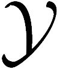={c1，c2，…，cN}，λij是将一个真实标记为cj的样本误分类为ci所产生的损失。基于后验概率P（ci\|x）可获得将样本x分类为ci所产生的期望损失（expected loss），即在样本x上的“条件风险”（conditional risk）

我们的任务是寻找一个判定准则h：xy以最小化总体风险

R（h）=x\[R（h（x））\|x）\]。　（7.2）

显然，对每个样本x，若h能最小化条件风险R（h（x）\|x），则总体风险R（h）也将被最小化。这就产生了贝叶斯判定准则（Bayes decision rule）：为最小化总体风险，只需在每个样本上选择那个能使条件风险R（c\|x）最小的类别标记，即

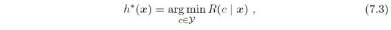

此时，h\*称为贝叶斯最优分类器（Bayes optimal classifier），与之对应的总体风险R（h\*）称为贝叶斯风险（Bayes risk）。1-R（h\*）反映了分类器所能达到的最好性能，即通过机器学习所能产生的模型精度的理论上限。

错误率对应于0/1损失函数，参见（第6章 支持向量机）。

具体来说，若目标是最小化分类错误率，则误判损失λij可写为

此时条件风险

R（c\|x）=1-P（c\|x） （7.5）

于是，最小化分类错误率的贝叶斯最优分类器为

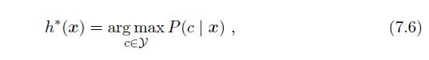

即对每个样本x，选择能使后验概率P（c\|x）最大的类别标记。

注意，这只是从概率框架的角度来理解机器学习；事实上很多机器学习技术无须准确估计出后验概率就能准确进行分类。

不难看出，欲使用贝叶斯判定准则来最小化决策风险，首先要获得后验概率P（c\|x）。然而，在现实任务中这通常难以直接获得。从这个角度来看，注意，这只是从概率框架的角度来理解机器学习；事实上很多机器学习技术无须准确估计出后验概率就能准确进行分类。机器学习所要实现的是基于有限的训练样本集尽可能准确地估计出后验概率P（c\|x）。大体来说，主要有两种策略：给定x，可通过直接建模P（c\|x）来预测c，这样得到的是“判别式模型”（discriminative models）；也可先对联合概率分布P（x，c）建模，然后再由此获得P（c\|x），这样得到的是“生成式模型”（generative models）。显然，前面介绍的决策树、BP神经网络、支持向量机等，都可归入判别式模型的范畴。对生成式模型来说，必然考虑

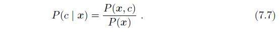

基于贝叶斯定理，P（c\|x）可写为

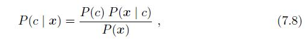

P（x）对所有类标记均相同。

其中，P（c）是类“先验”（prior）概率；P（x\|c）是样本x相对于类标记c的类条件概率（class-conditional probability），或称为“似然”（likelihood）；P（x）是用于归一化的“证据”（evidence）因子。对给定样本x，证据因子P（x）与类标记无关，因此估计P（c\|x）的问题就转化为如何基于训练数据D来估计先验P（c）和似然P（x\|c）。

为便于讨论，我们假设所有属性均为离散型。对连续属性，可将概率质量函数P（·）换成概率密度函数P（·）。

类先验概率P（c）表达了样本空间中各类样本所占的比例，根据大数定律，当训练集包含充足的独立同分布样本时，P（c）可通过各类样本出现的频率来进行估计。

参见（7.3 朴素贝叶斯分类器）。

对类条件概率P（x\|c）来说，由于它涉及关于x所有属性的联合概率，直接根据样本出现的频率来估计将会遇到严重的困难。例如，假设样本的d个属性都是二值的，则样本空间将有2d种可能的取值，在现实应用中，这个值往往远大于训练样本数m，也就是说，很多样本取值在训练集中根本没有出现，直接使用频率来估计P（x\|c）显然不可行，因为“未被观测到”与“出现概率为零”通常是不同的。

## 7.2 极大似然估计

连续分布下为概率密度函数P（x\|c）。

估计类条件概率的一种常用策略是先假定其具有某种确定的概率分布形式，再基于训练样本对概率分布的参数进行估计。具体地，记关于类别c的类条件概率为P（x\|c），假设P（x\|c）具有确定的形式并且被参数向量θc唯一确定，则我们的任务就是利用训练集D估计参数θc，为明确起见，我们将P（x\|c）记为P（x\|θc）。

从二十世纪二三十年代开始出现了频率主义学派和贝叶斯学派的争论，至今仍在继续。两派在很多重要问题上观点不同，甚至在对概率的基本解释上就有分歧。有兴趣的读者可参阅\[Efron，2005;Samaniego，2010\]。  

亦称“极大似然法”。

事实上，概率模型的训练过程就是参数估计（parameter estimation）过程，对于参数估计，统计学界的两个学派分别提供了不同的解决方案：频率主义学派（Frequentist）认为参数虽然未知，但却是客观存在的固定值，因此，可通过优化似然函数等准则来确定参数值；贝叶斯学派（Bayesian）则认为参数是未观察到的随机变量，其本身也可有分布，因此，可假定参数服从一个先验分布，然后基于观测到的数据来计算参数的后验分布。本节介绍源自频率主义学派的极大似然估计（Maximum Likelihood Estimation，简称MLE），这是根据数据采样来估计概率分布参数的经典方法。

令Dc表示训练集D中第c类样本组成的集合，假设这些样本是独立同分布的，则参数θc对于数据集Dc的似然是

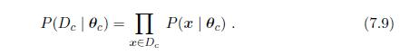

对θc进行极大似然估计，就是去寻找能最大化似然P（Dc\|θc）的参数值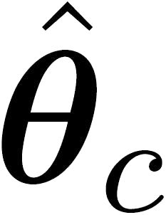。直观上看，极大似然估计是试图在θc所有可能的取值中，找到一个能使数据出现的“可能性”最大的值。

式（7-9）中的连乘操作易造成下溢，通常使用对数似然（log-likelihood）

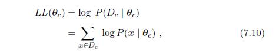

此时参数θc的极大似然估计为

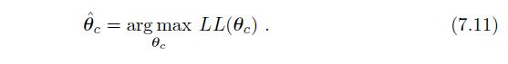

N为正态分布，参见（附录C.1.7 高斯分布）。

例如，在连续属性情形下，假设概率密度函数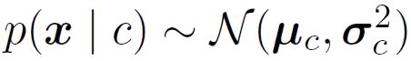，则参数μc和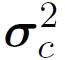的极大似然估计为

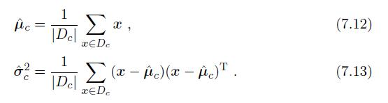

也就是说，通过极大似然法得到的正态分布均值就是样本均值，方差就是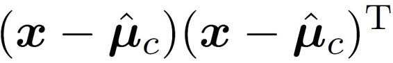的均值，这显然是一个符合直觉的结果。在离散属性情形下，也可通过类似的方式估计类条件概率。

需注意的是，这种参数化的方法虽能使类条件概率估计变得相对简单，但估计结果的准确性严重依赖于所假设的概率分布形式是否符合潜在的真实数据分布。在现实应用中，欲做出能较好地接近潜在真实分布的假设，往往需在一定程度上利用关于应用任务本身的经验知识，否则若仅凭“猜测”来假设概率分布形式，很可能产生误导性的结果。

## 7.3 朴素贝叶斯分类器

基于有限训练样本直接估计联合概率，在计算上将会遭遇组合爆炸问题，在数据上将会遭遇样本稀疏问题；属性数越多，问题越严重。

不难发现，基于贝叶斯公式（7.8）来估计后验概率P（c\|x）的主要困难在于：类条件概率P（x\|c）是所有属性上的联合概率，难以从有限的训练样本直接估计而得。为避开这个障碍，朴素贝叶斯分类器（ Bayes classifier）采用了“属性条件独立性假设”（attribute conditional independence assumption）：对已知类别，假设所有属性相互独立。换言之，假设每个属性独立地对分类结果发生影响。

基于属性条件独立性假设，式（7.8）可重写为

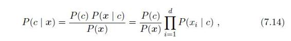

其中d为属性数目，xi为x在第i个属性上的取值。

xi实际上是一个“属性-值”对，例如“色泽=青绿”。为便于讨论，在上下文明确时，有时我们用xi表示第i个属性对应的变量（如“色泽”），有时直接用其指代x在第i个属性上的取值（如“青绿”）。

由于对所有类别来说P（x）相同，因此基于式（7.6）的贝叶斯判定准则有

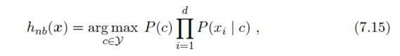

这就是朴素贝叶斯分类器的表达式。

显然，朴素贝叶斯分类器的训练过程就是基于训练集D来估计类先验概率P（c），并为每个属性估计条件概率P（xi\|c）。

令Dc表示训练集D中第c类样本组成的集合，若有充足的独立同分布样本，则可容易地估计出类先验概率

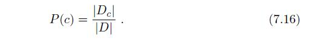

对离散属性而言，令Dc，xi表示Dc中在第i个属性上取值为xi的样本组成的集合，则条件概率P（xi\|c）可估计为

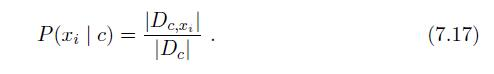

对连续属性可考虑概率密度函数，假定p（xi\|c）~N（μc，i，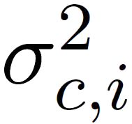），其中μc，i和分别是第c类样本在第i个属性上取值的均值和方差，则有

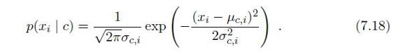

西瓜数据集3.0见（4.4.1 连续值处理　表4.3 西瓜数据集3.0）。

下面我们用西瓜数据集3.0训练一个朴素贝叶斯分类器，对测试例“测1”进行分类：

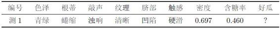

首先估计类先验概率P（c），显然有

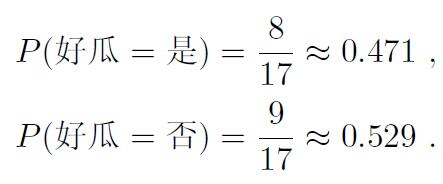

注意，当样本数目足够多时才能进行有意义的概率估计。本书仅是以西瓜数据集3.0对估计过程做一个简单的演示。

然后，为每个属性估计条件概率P（xi\|c）：

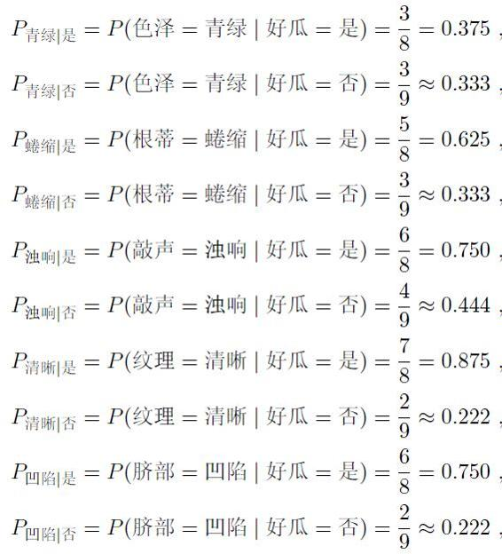

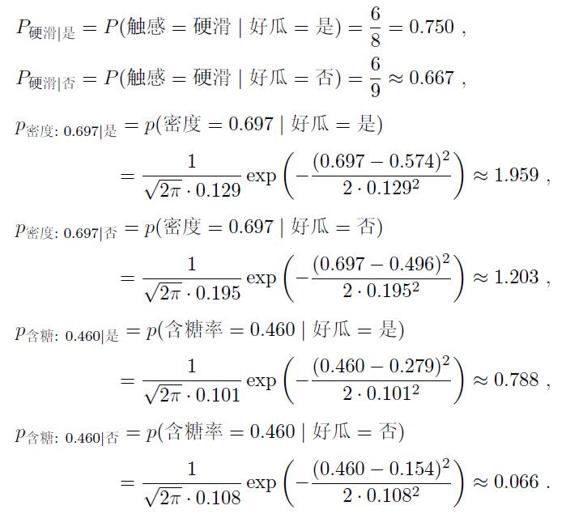

于是，有

P（好瓜=是）×P青绿\|是×P蜷缩\|是×P浊响\|是×P清晰\|是×P凹陷\|是×P硬滑\|是×p密度：0.697\|是×p含糖：0.460\|是≈0.063，

P（好瓜=否）×P青绿\|否×P蜷缩\|否×P浊响\|否×P清晰\|否×P凹陷\|否×P硬滑\|否×p密度：0.697\|否×p含糖：0.460\|否≈6.80×10-5。

实践中常通过取对数的方式来将“连乘”转化为“连加”以避免数值下溢。

由于0.063\>6.80×10-5，因此，朴素贝叶斯分类器将测试样本“测1”判别为“好瓜”。

需注意，若某个属性值在训练集中没有与某个类同时出现过，则直接基于式（7.17）进行概率估计，再根据式（7.15）进行判别将出现问题。例如，在使用西瓜数据集3.0训练朴素贝叶斯分类器时，对一个“敲声=清脆”的测试例，有

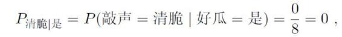

由于式（7.15）的连乘式计算出的概率值为零，因此，无论该样本的其他属性是什么，哪怕在其他属性上明显像好瓜，分类的结果都将是“好瓜=否”，这显然不太合理。  

为了避免其他属性携带的信息被训练集中未出现的属性值“抹去”，在估计概率值时通常要进行“平滑”（smoothing），常用“拉普拉斯修正”（Laplacian correction）。具体来说，令N表示训练集D中可能的类别数，Ni表示第i个属性可能的取值数，则式（7.16）和（7.17）分别修正为  

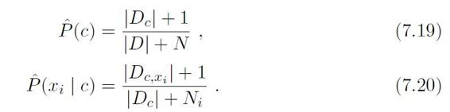

例如，在本节的例子中，类先验概率可估计为

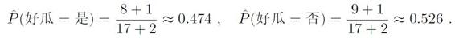

类似地，P清脆\|是和P清脆\|否可估计为

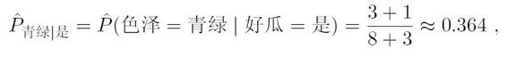

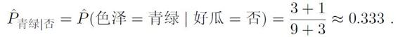

同时，上文提到的概率P清脆\|是可估计为

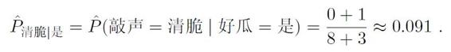

拉普拉斯修正实质上假设了属性值与类别均匀分布，这是在朴素贝叶斯学习过程中额外引入的关于数据的先验。  

显然，拉普拉斯修正避免了因训练集样本不充分而导致概率估值为零的问题，并且在训练集变大时，修正过程所引入的先验（prior）的影响也会逐渐变得可忽略，使得估值渐趋向于实际概率值。

懒惰学习参见（10.1 k近邻学习）。  

增量学习参见（5.5.2 ART网络）。  

在现实任务中朴素贝叶斯分类器有多种使用方式。例如，若任务对预测速度要求较高，则对给定训练集，可将朴素贝叶斯分类器涉及的所有概率估值事先计算好存储起来，这样在进行预测时只需“查表”即可进行判别；若任务数据更替频繁，则可采用“懒惰学习”（lazy learning）方式，先不进行任何训练，等收到预测请求时再根据当前数据集进行概率估值；若数据不断增加，则可在现有估值基础上，仅对新增样本的属性值所涉及的概率估值进行计数修正即可实现增量学习。

## 7.4 半朴素贝叶斯分类器

为了降低贝叶斯公式（7.8）中估计后验概率P（c\|x）的困难，朴素贝叶斯分类器采用了属性条件独立性假设，但在现实任务中这个假设往往很难成立。于是，人们尝试对属性条件独立性假设进行一定程度的放松，由此产生了一类称为“半朴素贝叶斯分类器”（semi- Bayes classifiers）的学习方法。

半朴素贝叶斯分类器的基本想法是适当考虑一部分属性间的相互依赖信息，从而既不需进行完全联合概率计算，又不至于彻底忽略了比较强的属性依赖关系。“独依赖估计”（One-Dependent Estimator，简称ODE）是半朴素贝叶斯分类器最常用的一种策略。顾名思议，所谓“独依赖”就是假设每个属性在类别之外最多仅依赖于一个其他属性，即

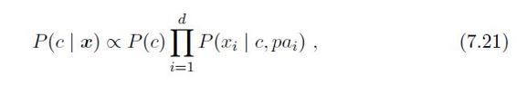

其中pai为属性xi所依赖的属性，称为xi的父属性。此时，对每个属性xi，若其父属性pai已知，则可采用类似式（7.20）的办法来估计概率值P（xi\|c，pai）。于是，问题的关键就转化为如何确定每个属性的父属性，不同的做法产生不同的独依赖分类器。

最直接的做法是假设所有属性都依赖于同一个属性，称为“超父”（superparent），然后通过交叉验证等模型选择方法来确定超父属性，由此形成了SPODE（Super-Parent ODE）方法。例如，在图7.1（b）中，x1是超父属性。  

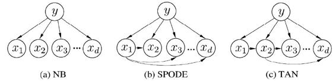

图7.1 朴素贝叶斯与两种半朴素贝叶斯分类器所考虑的属性依赖关系

TAN （Tree Augmented  Bayes） \[Friedman et al., 1997\]则是在最大带权生成树（maximum weighted spanning tree）算法\[Chow and Liu, 1968\]的基础上，通过以下步骤将属性间依赖关系约简为如图7.1（c）所示的树形结构：

（1）计算任意两个属性之间的条件互信息（conditional mutual information）

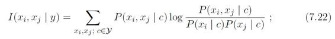

（2）以属性为结点构建完全图, 任意两个结点之间边的权重设为I（xi,xj\|y）；

（3）构建此完全图的最大带权生成树, 挑选根变量，将边置为有向；  

（4）加入类别结点y，增加从y到每个属性的有向边。

容易看出，条件互信息I（xi,xj\|y）刻画了属性xi和xj在已知类别情况下的相关性，因此，通过最大生成树算法，TAN实际上仅保留了强相关属性之间的依赖性。

集成学习参见（第8章 集成学习）。

AODE（Averaged One-Dependent Estimator）\[Webb et al., 2005\]是一种基于集成学习机制、更为强大的独依赖分类器。与SPODE通过模型选择确定超父属性不同， AODE尝试将每个属性作为超父来构建SPODE，然后将那些具有足够训练数据支撑的SPODE集成起来作为最终结果，即

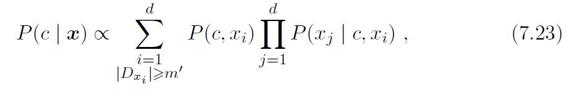

m'默认设为30\[Webb et al.,2005\]。

其中Dxi是在第i个属性上取值为xi的样本的集合，m'为阈值常数。显然，AODE需估计P（c，xi）和P（xj\|c，xi）。类似式（7.20），有

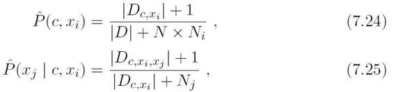

其中N是D中可能的类别数，Ni是第i个属性可能的取值数，Dc，xi是类别为c且在第i个属性上取值为xi的样本集合，Dc，xi，xj是类别为c且在第i和第j个属性上取值分别为xi和xj的样本集合。例如，对西瓜数据集3.0有

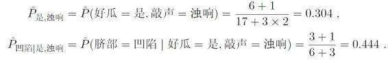

不难看出，与朴素贝叶斯分类器类似，AODE的训练过程也是“计数”，即在训练数据集上对符合条件的样本进行计数的过程。与朴素贝叶斯分类器相似，AODE无需模型选择，既能通过预计算节省预测时间，也能采取懒惰学习方式在预测时再进行计数，并且易于实现增量学习。  

“高阶依赖”即对多个属性依赖。  

既然将属性条件独立性假设放松为独依赖假设可能获得泛化性能的提升，那么，能否通过考虑属性间的高阶依赖来进一步提升泛化性能呢？也就是说，将式（7.23）中的属性pai替换为包含k个属性的集合pai，从而将ODE拓展为kDE。需注意的是，随着k的增加，准确估计概率P（xi\|y，pai）所需的训练样本数量将以指数级增加。因此，若训练数据非常充分，泛化性能有可能提升；但在有限样本条件下，则又陷入估计高阶联合概率的泥沼。  

## 7.5 贝叶斯网

贝叶斯网是一种经典的概率图模型。概率图模型参见（第14章 概率图模型）。

为了简化讨论，本节假定所有属性均为离散型。对于连续属性，条件概率表可推广为条件概率密度函数。  

贝叶斯网（Bayesian network）亦称“信念网”（belief network），它借助有向无环图（Directed Acyclic Graph，简称DAG）来刻画属性之间的依赖关系，并使用条件概率表（Conditional Probability Table，简称CPT）来描述属性的联合概率分布。  

具体来说，一个贝叶斯网B由结构G和参数θ两部分构成，即B=（G，θ）。网络结构G是一个有向无环图，其每个结点对应于一个属性，若两个属性有直接依赖关系，则它们由一条边连接起来；参数θ定量描述这种依赖关系，假设属性xi在G中的父结点集为πi，则θ包含了每个属性的条件概率表θxi\|πi=PB（xi\|πi）。

这里已将西瓜数据集的连续属性“含糖率”转化为离散属性“甜度”。  

作为一个例子，图7.2给出了西瓜问题的一种贝叶斯网结构和属性“根蒂”的条件概率表。从图中网络结构可看出，“色泽”直接依赖于“好瓜”和“甜度”，而“根蒂”则直接依赖于“甜度”；进一步从条件概率表能得到“根蒂”对“甜度”量化依赖关系，如P（根蒂=硬挺\|甜度=高）=0.1等。  

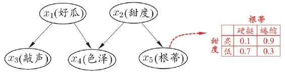

图7.2 西瓜问题的一种贝叶斯网结构以及属性“根蒂”的条件概率表

### 7.5.1 结构

贝叶斯网结构有效地表达了属性间的条件独立性。给定父结点集，贝叶斯网假设每个属性与它的非后裔属性独立，于是B=\<G，θ\>将属性x1，x2，…，xd的联合概率分布定义为

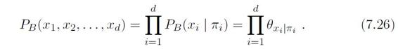

以图7.2为例，联合概率分布定义为

P（x1，x2，x3，x4，x5）=P（x1）P（x2）P（x3\|x1）P（x4\|x1，x2）P（x5\|x2），

这里并未列举出所有的条件独立关系。  

显然，x3和x4在给定的x1的取值时独立，x4和x5在给定x2的取值时独立，分别简记为x3x4\|x1和x4x5\|x2。

图7.3显示出贝叶斯网中三个变量之间的典型依赖关系，其中前两种在式（7.26）中已有所体现。

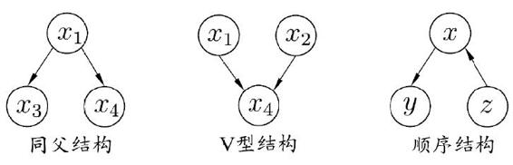

图7.3 贝叶斯网中三个变量之间的典型依赖关系  

在“同父”（common parent）结构中，给定父结点x1的取值，则x3和x4条件独立。在“顺序”结构中，给定x的值，则y与z条件独立。V型结构（V-structure）亦称“冲撞”结构，给定子结点x4的取值，x1与x2必不独立；奇妙的是，若x4的取值完全未知，则V型结构下x1与x2却是相互独立的。我们做一个简单的验证：

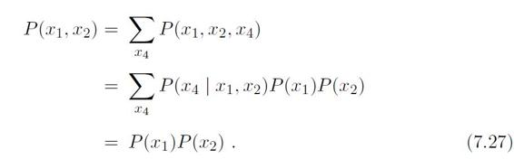

这样的独立性称为“边际独立性”（marginal independence），记为x1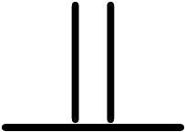x2。

对变量做积分或求和亦称“边际化” （marginalization）。  

事实上，一个变量取值的确定与否，能对另两个变量间的独立性发生影响，这个现象并非V型结构所特有。例如在同父结构中，条件独立性x3x4\|x1成立，但若x1的取值未知，则x3和x4就不独立，即x3x4不成立；在顺序结构中，yz\|x，但yz不成立。

D是指“有向” （directed）。  

为了分析有向图中变量间的条件独立性，可使用“有向分离”（Dseparation）。我们先把有向图转变为一个无向图：  

同父、顺序和V型结构的发现以及有向分离的提出推动了因果发现方面的研究，参阅\[Pearl，1988\]。  

·找出有向图中的所有V型结构，在V型结构的两个父结点之间加上一条无向边；

·将所有有向边改为无向边。

也有译为“端正图”。

“道德化”的蕴义：孩子的父母应建立牢靠的关系，否则是不道德的。  

由此产生的无向图称为“道德图”（moral graph），令父结点相连的过程称为“道德化”（moralization）\[Cowell et al., 1999\]。

基于道德图能直观、迅速地找到变量间的条件独立性。假定道德图中有变量x，y和变量集合z=｛zi｝，若变量x和y能在图上被z分开，即从道德图中将变量集合z去除后，x和y分属两个连通分支，则称变量x和y被z有向分离，xy\|z成立。例如，图7.2所对应的道德图如图7.4所示，从图中能容易地找出所有的条件独立关系：x3x4\|x1，x4x5\|x2，x3x2\|x1，x3x5\|x1，x3x5\|x2等。  

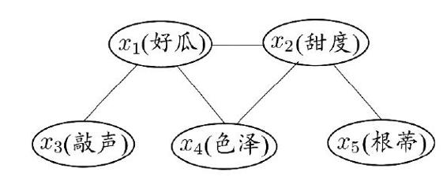

图7.4 图7.2对应的道德图  

### 7.5.2学习

若网络结构已知，即属性间的依赖关系已知，则贝叶斯网的学习过程相对简单，只需通过对训练样本“计数”，估计出每个结点的条件概率表即可。但在现实应用中我们往往并不知晓网络结构，于是，贝叶斯网学习的首要任务就是根据训练数据集来找出结构最“恰当”的贝叶斯网。“评分搜索”是求解这一问题的常用办法。具体来说，我们先定义一个评分函数（score function），以此来评估贝叶斯网与训练数据的契合程度，然后基于这个评分函数来寻找结构最优的贝叶斯网。显然，评分函数引入了关于我们希望获得什么样的贝叶斯网的归纳偏好。  

归纳偏好参见（1.4 归纳偏好）。  

常用评分函数通常基于信息论准则，此类准则将学习问题看作一个数据压缩任务，学习的目标是找到一个能以最短编码长度描述训练数据的模型，此时编码的长度包括了描述模型自身所需的字节长度和使用该模型描述数据所需的字节长度。对贝叶斯网学习而言，模型就是一个贝叶斯网，同时，每个贝叶斯网描述了一个在训练数据上的概率分布，自有一套编码机制能使那些经常出现的样本有更短的编码。于是，我们应选择那个综合编码长度（包括描述网络和编码数据）最短的贝叶斯网，这就是“最小描述长度”（Minimal Description Length，简称MDL）准则。  

这里我们把类别也看作一个属性，即xi是一个包括示例和类别的向量。  

给定训练集D={x1，x2，…，xm}，贝叶斯网B=\<G，θ\>在D上的评分函数可写为  

s（B\|D）=f（θ）\|B\|-LL（B\|D）， （7.28）

其中，\|B\|是贝叶斯网的参数个数；f（θ）表示描述每个参数θ所需的字节数；而

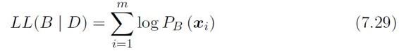

可以从统计学习角度理解，将两项分别视为结构风险和经验风险。  

是贝叶斯网B的对数似然。显然，式（7.28）的第一项是计算编码贝叶斯网B所需的字节数，第二项是计算B所对应的概率分布PB对D描述得有多好。于是，学习任务就转化为一个优化任务，即寻找一个贝叶斯网B使评分函数s（B\|D）最小。  

若f（θ）=1，即每个参数用1字节描述，则得到AIC（Akaike Information Criterion）评分函数

AIC（B\|D）=\|B\|-LL（B\|D）。 （7.30）

若f（θ）=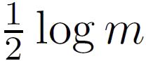，即每个参数用字节描述，则得到BIC（Bayesian Information Criterion）评分函数

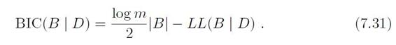

显然，若f（θ）=0，即不计算对网络进行编码的长度，则评分函数退化为负对数似然，相应的，学习任务退化为极大似然估计。

不难发现，若贝叶斯网B=\<G，θ\>的网络结构G固定，则评分函数s（B\|D）的第一项为常数。此时，最小化s（B\|D）等价于对参数θ的极大似然估计，由式（7.29）和（7.26）可知，参数θxi\|πi能直接在训练数据D上通过经验估计获得，即

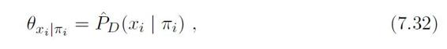

即事件在训练数据上出现的频率。  

其中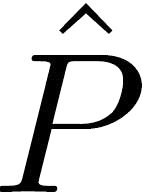D（·）是D上的经验分布。因此，为了最小化评分函数s（B\|D），只需对网络结构进行搜索，而候选结构的最优参数可直接在训练集上计算得到。

例如TAN\[Friedman et al.,1997\]将结构限定为树形（半朴素贝叶斯分类器可看作贝叶斯网的特例）。

不幸的是，从所有可能的网络结构空间搜索最优贝叶斯网结构是一个NP难问题，难以快速求解。有两种常用的策略能在有限时间内求得近似解：第一种是贪心法，例如从某个网络结构出发，每次调整一条边（增加、删除或调整方向），直到评分函数值不再降低为止；第二种是通过给网络结构施加约束来削减搜索空间，例如将网络结构限定为树形结构等。

### 7.5.3 推断

类别也可看作一个属性变量。  

贝叶斯网训练好之后就能用来回答“查询”（query），即通过一些属性变量的观测值来推测其他属性变量的取值。例如在西瓜问题中，若我们观测到西瓜色泽青绿、敲声浊响、根蒂蜷缩，想知道它是否成熟、甜度如何。这样通过已知变量观测值来推测待查询变量的过程称为“推断”（inference），已知变量观测值称为“证据”（evidence）。  

更多关于推断的内容见（第14章 概率图模型）。  

变分推断也很常用，参见（14.5 近似推断）。  

最理想的是直接根据贝叶斯网定义的联合概率分布来精确计算后验概率，不幸的是，这样的“精确推断”已被证明是NP难的\[Cooper，1990\]；换言之，当网络结点较多、连接稠密时，难以进行精确推断，此时需借助“近似推断”，通过降低精度要求，在有限时间内求得近似解。在现实应用中，贝叶斯网的近似推断常使用吉布斯采样（Gibbs sampling）来完成，这是一种随机采样方法，我们来看看它是如何工作的。

令**Q**={Q1，Q2，…，Qn}表示待查询变量，**E**=｛E1，E2，…，EK｝为证据变量，已知其取值为**e**={e1，e2，…，ek｝。目标是计算后验概率P（**Q**=q\|**E**=e），其中**q**=｛q1，q2，…，qn｝是待查询变量的一组取值。以西瓜问题为例，待查询变量为**Q**=｛好瓜，甜度｝，证据变量为**E**=｛色泽，敲声，根蒂｝且已知其取值为**e**=｛青绿，浊响，蜷缩｝，查询的目标值是**q**=｛是，高｝，即这是好瓜且甜度高的概率有多大。

如图7.5所示，吉布斯采样算法先随机产生一个与证据**E**=**e**一致的样本**q**0作为初始点，然后每步从当前样本出发产生下一个样本。具体来说，在第t次采样中，算法先假设**q**t=**q**t-1，然后对非证据变量逐个进行采样改变其取值，采样概率根据贝叶斯网B和其他变量的当前取值（即**Z**=**z**）计算获得。假定经过T次采样得到的与**q**一致的样本共有nq个，则可近似估算出后验概率  

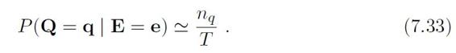

更多关于马尔可夫链和吉布斯采样的内容参见（14.5 近似推断）。  

实质上，吉布斯采样是在贝叶斯网所有变量的联合状态空间与证据**E**=**e**一致的子空间中进行“随机漫步”（random walk）。每一步仅依赖于前一步的状态，这是一个“马尔可夫链”（Markov chain）。在一定条件下，无论从什么初始状态开始，马尔可夫链第t步的状态分布在t→∞时必收敛于一个平稳分布（stationary distribution）；对于吉布斯采样来说，这个分布恰好是**P**（**Q**\|**E**=**e**）。因此，在T很大时，吉布斯采样相当于根据P（**Q**\|**E**=**e**）采样，从而保证了式（7.33）收敛于P（**Q**=**q**\|**E**=**e**）。

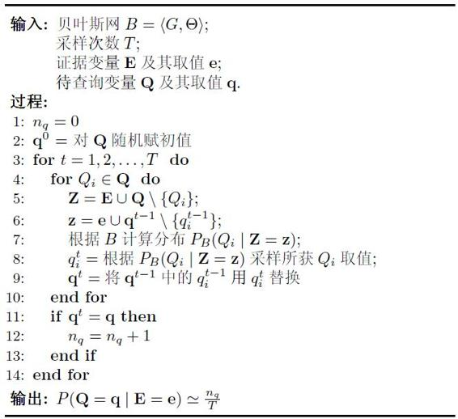

图7.5 吉布斯采样算法

除去变量Qi外的其他变量。

需注意的是，由于马尔可夫链通常需很长时间才能趋于平稳分布，因此吉布斯采样算法的收敛速度较慢。此外，若贝叶斯网中存在极端概率“0”或“1”，则不能保证马尔可夫链存在平稳分布，此时吉布斯采样会给出错误的估计结果。  

## 7.6 EM算法

在前面的讨论中，我们一直假设训练样本所有属性变量的值都已被观测到，即训练样本是“完整”的。但在现实应用中往往会遇到“不完整”的训练样本，例如由于西瓜的根蒂已脱落，无法看出是“蜷缩”还是“硬挺”，则训练样本的“根蒂”属性变量值未知。在这种存在“未观测”变量的情形下，是否仍能对模型参数进行估计呢？  

由于“似然”常基于指对数似然数族函数来定义，因此对数似然及后续EM迭代过程中一般是使用自然对数ln（·）。  

未观测变量的学名是“隐变量”（latent variable）。令**X**表示已观测变量集，**Z**表示隐变量集，**Θ**表示模型参数。若欲对**Θ**做极大似然估计，则应最大化对数似然  

LL（θ\|X，Z）=lnP（X，Z\|θ） （7.34）

然而由于**Z**是隐变量，上式无法直接求解。此时我们可通过对**Z**计算期望，来最大化已观测数据的对数“边际似然”（marginal likelihood）  

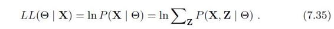

直译为“期望最大化算法”，通常直接称EM 算法。  

这里仅给出EM算法的一般描述，具体例子参见（9.4.3 高斯混合聚类）。  

**EM**（Expectation-Maximization）算法\[Dempster et al.,1977\]是常用的估计参数隐变量的利器，它是一种迭代式的方法，其基本想法是：若参数**Θ**已知，则可根据训练数据推断出最优隐变量**Z**的值（**E**步）；反之，若**Z**的值已知，则可方便地对参数**Θ**做极大似然估计（**M**步）。  

于是，以初始值**Θ**0为起点，对式（7.35），可迭代执行以下步骤直至收敛：  

·基于**Θ**t推断隐变量**Z**的期望，记为**Z**t；

·基于已观测变量**X**和**Z**t对参数**Θ**做极大似然估计，记为**Θ**t+1；

这就是**EM**算法的原型。  

进一步，若我们不是取**Z**的期望，而是基于**Θ**t计算隐变量**Z**的概率分布P（Z\|X，**Θ**t），则EM算法的两个步骤是：

·E步（Expectation）：以当前参数θt推断隐变量分布P（Z\|X，θt），并计算对数似然LL（θ\|X，Z）关于Z的期望

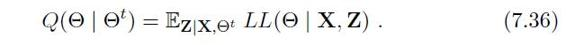

·M步（Maximization）：寻找参数最大化期望似然，即

EM算法的收敛性分析参见\[Wu，1983\]。  

EM算法可看作用坐标下降（coordinate descent）法来最大化对数似然下界的过程。坐标下降法参见（附录B.5 坐标下降法）。  

简要来说，EM算法使用两个步骤交替计算：第一步是期望（E）步，利用当前估计的参数值来计算对数似然的期望值；第二步是最大化（M）步，寻找能使E步产生的似然期望最大化的参数值。然后，新得到的参数值重新被用于E步，……直至收敛到局部最优解。  

事实上，隐变量估计问题也可通过梯度下降等优化算法求解，但由于求和的项数将随着隐变量的数目以指数级上升，会给梯度计算带来麻烦；而EM算法则可看作一种非梯度优化方法。  

## 7.7 阅读材料

贝叶斯决策论在机器学习、模式识别等诸多关注数据分析的领域都有极为重要的地位。对贝叶斯定理进行近似求解，为机器学习算法的设计提供了一种有效途径。为避免贝叶斯定理求解时面临的组合爆炸、样本稀疏问题，朴素贝叶斯分类器引入了属性条件独立性假设。这个假设在现实应用中往往很难成立，但有趣的是，朴素贝叶斯分类器在很多情形下都能获得相当好的性能\[Domingos and Pazzani，1997；Ng and Jordan，2002\]。一种解释是对分类任务来说，只需各类别的条件概率排序正确、无须精准概率值即可导致正确分类结果\[Domingos and Pazzani，1997\]；另一种解释是，若属性间依赖对所有类别影响相同，或依赖关系的影响能相互抵消，则属性条件独立性假设在降低计算开销的同时不会对性能产生负面影响\[Zhang，2004\]。朴素贝叶斯分类器在信息检索领域尤为常用\[Lewis，1998\]，\[McCallum and Nigam，1998\]对其在文本分类中的两种常见用法进行了比较。

根据对属性间依赖的涉及程度，贝叶斯分类器形成了一个“谱”：朴素贝叶斯分类器不考虑属性间依赖性，贝叶斯网能表示任意属性间的依赖性，二者分别位于“谱”的两端；介于两者之间的则是一系列半朴素贝叶斯分类器，它们基于各种假设和约束来对属性间的部分依赖性进行建模。一般认为，半朴素贝叶斯分类器的研究始于\[Kononenko，1991\]。ODE仅考虑依赖一个父属性，由此形成了独依赖分类器如TAN\[Friedman et al.,1997\]、AODE\[Webb et al.,2005\]、LBR（lazy Bayesian Rule）\[Zheng and Webb，2000\]等；kDE则考虑最多依赖k个父属性，由此形成了k依赖分类器如KDB\[Sahami，1996\]、NBtree\[Kohavi，1996\]等。  

贝叶斯分类器（Bayes Classifier）与一般意义上的“贝叶斯学习”（Bayesian Learning）有显著区别，前者是通过最大后验概率进行单点估计，后者则是进行分布估计。关于贝叶斯学习的内容可参阅\[Bishop，2006\]。  

J.Pearl教授因这方面的卓越贡献而获得2011年图灵奖，参见（第14章 概率图模型）。  

贝叶斯网是经典的概率图模型, 参见（第14章 概率图模型）。  

贝叶斯网为不确定学习和推断提供了基本框架，因其强大的表示能力、良好的可解释性而广受关注\[Pearl，1988\]。贝叶斯网学习可分为结构学习和参数学习两部分。参数学习通常较为简单，而结构学习则被证明是NP难问题\[Cooper，1990；Chickering et al.,2004\]，人们为此提出了多种评分搜索方法\[Friedman and Goldszmidt，1996\]。贝叶斯网通常被看作生成式模型，但近年来也有不少关于贝叶斯网判别式学习的研究\[Grossman and Domingos，2004\]。关于贝叶斯网的更多介绍可参阅\[Jensen，1997；Heckerman，1998\]。  

EM算法是最常见的隐变量估计方法，在机器学习中有极为广泛的用途，例如常被用来学习高斯混合模型（Gaussian mixture model，简称GMM）的参数；9.4节将介绍的k均值聚类算法就是一个典型的EM算法。更多关于EM算法的分析、拓展和应用可参阅\[McLachlan and Krishnan，2008\]。  

“数据挖掘十大算法”还包括前几章介绍的C4.5、CART决策树、支持向量机，以及后几章将要介绍的AdaBoost、k均值聚类、k近邻算法等。  

本章介绍的朴素贝叶斯算法和EM算法均曾入选“数据挖掘十大算法”\[Wu et al.,2007\]。  

## 习题

西瓜数据集3.0见（4.4.1 连续值处理的表4.3 西瓜数据集3.0）。

7.1 试使用极大似然法估算西瓜数据集3.0中前3个属性的类条件概率。

7.2\* 试证明：条件独立性假设不成立时，朴素贝叶斯分类器仍有可能产生最优贝叶斯分类器。

7.3 试编程实现拉普拉斯修正的朴素贝叶斯分类器，并以西瓜数据集3.0为训练集，对p.151“测1”样本进行判别。  

7.4 实践中使用式（7.15）决定分类类别时，若数据的维数非常高，则概率连乘P（xi\|c）的结果通常会非常接近于0从而导致下溢。试述防止下溢的可能方案。

假设同先验；参见（3.4 线性判别分析）。  

7.5 试证明：二分类任务中两类数据满足高斯分布且方差相同时，线性判别分析产生贝叶斯最优分类器。

7.6 试编程实现AODE分类器，并以西瓜数据集3.0为训练集，对p.151的“测1”样本进行判别。  

7.7 给定d个二值属性的二分类任务，假设对于任何先验概率项的估算至少需30个样例，则在朴素贝叶斯分类器式（7.15）中估算先验概率项P（c）需30×2=60个样例。试估计在AODE式（7.23）中估算先验概率项P（c，xi）所需的样例数（分别考虑最好和最坏情形）。  

7.8 考虑图7.3，试证明：在同父结构中，若x1的取值未知，则x3x4不成立；在顺序结构中，yz\|x，但yz不成立。

西瓜数据集2.0见（4.2.1 信息增益的表4.1 西瓜数据集2.0）。  

7.9 以西瓜数据集2.0为训练集，试基于BIC准则构建一个贝叶斯网。

7.10 以西瓜数据集2.0中属性“脐部”为隐变量，试基于EM算法构建一个贝叶斯网。  

## 参考文献

Bishop, C. M. （2006）. *Pattern Recognition and Machine Learning*. Springer,New York, NY.  

Chickering, D. M., D. Heckerman, and C. Meek. （2004）. “Large-sample learning of Bayesian networks is NP-hard.” *Journal of Machine Learning Research*,5：1287–1330.  

Chow, C. K. and C. N. Liu. （1968）. “Approximating discrete probability distributions with dependence trees.” *IEEE Transactions on Information Theory*,14（3）：462–467.  

Cooper, G. F. （1990）. “The computational complexity of probabilistic inference using Bayesian belief networks.” *Artificial Intelligence*, 42（2-3）：393–405.  

Cowell, R. G., P. Dawid, S. L. Lauritzen, and D. J. Spiegelhalter. （1999）. *Probabilistic Networks and Expert Systems*. Springer, New York, NY.  

Dempster, A. P., N. M. Laird, and D. B. Rubin. （1977）. “Maximum likelihood from incomplete data via the EM algorithm.” *Journal of the Royal Statistical Society - Series B*, 39（1）：1–38.  

Domingos, P. and M. Pazzani. （1997）. “On the optimality of the simple Bayesian classifier under zero-one loss.” *Machine Learning*, 29（2-3）：103–130.  

Efron, B. （2005）. “Bayesians, frequentists, and scientists.” *Journal of the American Statistical Association*, 100（469）：1–5.  

Friedman, N., D. Geiger, and M. Goldszmidt. （1997）. “Bayesian network classifiers.”*Machine Learning*, 29（2-3）：131–163.

Friedman, N. and M. Goldszmidt. （1996）. “Learning Bayesian networks with local structure.” In *Proceedings of the 12th Annual Conference on Uncertainty in Artificial Intelligence （UAI）*, 252–262, Portland, OR.  

Grossman, D. and P. Domingos. （2004）. “Learning Bayesian network classifiers by maximizing conditional likelihood.” In *Proceedings of the 21st International Conference on Machine Learning （ICML）*, 46–53, Banff, Canada.  

Heckerman, D. （1998）. “A tutorial on learning with Bayesian networks.” In *Learning in Graphical Models* （M. I. Jordan, ed.）, 301–354, Kluwer, Dordrecht,The Netherlands.  

Jensen, F. V. （1997）. *An Introduction to Bayesian Networks*. Springer, NY.  

Kohavi, R. （1996）. “Scaling up the accuracy of naive-Bayes classifiers：A decision-tree hybrid.” In *Proceedings of the 2nd International Conference on Knowledge Discovery and Data Mining （KDD）*, 202–207, Portland, OR.  

Kononenko, I. （1991）. “Semi-naive Bayesian classifier.” In *Proceedings of the 6th European Working Session on Learning （EWSL）*, 206–219, Porto, Portugal.  

Lewis, D. D. （1998）. “Naive （Bayes） at forty：The independence assumption in information retrieval.” In *Proceedings of the 10th European Conference on Machine Learning （ECML）*, 4–15, Chemnitz, Germany.  

McCallum, A. and K. Nigam. （1998）. “A comparison of event models for naive Bayes text classification.” In *Working Notes of the AAAI’98 Workshop on Learning for Text Cagegorization*, Madison, WI.  

McLachlan, G. and T. Krishnan. （2008）. *The EM Algorithm and Extensions*,2nd edition. John Wiley & Sons, Hoboken, NJ.  

Ng, A. Y. and M. I. Jordan. （2002）. “On discriminative vs. generative classifiers：A comparison of logistic regression and naive Bayes.” In *Advances in Neural Information Processing Systems 14 （NIPS）* （T. G. Dietterich, S. Becker, and Z. Ghahramani, eds.）, 841–848, MIT Press, Cambridge, MA.

Pearl, J. （1988）. *Probabilistic Reasoning in Intelligent Systems：Networks of Plausible Inference*. Morgan Kaufmann, San Francisco, CA.  

Sahami, M. （1996）. “Learning limited dependence Bayesian classifiers.” In *Proceedings of the 2nd International Conference on Knowledge Discovery and Data Mining （KDD）*, 335–338, Portland, OR.  

Samaniego, F. J. （2010）. *A Comparison of the Bayesian and Frequentist Approaches to Estimation*. Springer, New York, NY.  

Webb, G., J. Boughton, and Z.Wang. （2005）. “Not so naive Bayes：Aggregating one-dependence estimators.” *Machine Learning*, 58（1）：5–24.  

Wu, C. F. Jeff. （1983）. “On the convergence properties of the EM algorithm.”*Annals of Statistics*, 11（1）：95–103.

Wu, X., V. Kumar, J. R. Quinlan, J. Ghosh, Q. Yang, H. Motoda, G. J. McLachlan,A. Ng, B. Liu, P. S. Yu, Z.-H. Zhou, M. Steinbach, D. J. Hand,and D. Steinberg. （2007）. “Top 10 algorithms in data mining.” *Knowledge **and Information Systems*, 14（1）：1–37.  

Zhang, H. （2004）. “The optimality of naive Bayes.” In *Proceedings of the 17th International Florida Artificial Intelligence Research Society Conference（FLAIRS）*, 562–567, Miami, FL.  

Zheng, Z. and G. I. Webb. （2000）. “Lazy learning of Bayesian rules.” *Machine Learning*, 41（1）：53–84.  

## 休息一会儿

### 小故事：“机器学习”名字的由来

1763年12月23日，托马斯·贝叶斯（Thomas Bayes，1701？—1761）的遗产受赠者R.Price牧师在英国皇家学会宣读了贝叶斯的遗作《论机会学说中一个问题的求解》，其中给出了贝叶斯定理，这一天现在被当作贝叶斯定理的诞生日。虽然贝叶斯定理在今天已成为概率统计最经典的内容之一，但贝叶斯本人却笼罩在谜团中。  

英国皇家学会相当于英会国科学院，皇家学会会士相当于科学院院士。  

现有资料表明，贝叶斯是一位神职人员，长期担任英国坦布里奇韦尔斯地方教堂的牧师，他从事数学研究的目的是为了证明上帝的存在。他在1742年当选英国皇家学会会士，但没有记录表明他此前发表过任何科学或数学论文。他的提名是由皇家学会的重量级人物签署的，但为什么提名以及他为何能当选，至今仍是个谜。贝叶斯的研究工作和他本人在他生活的时代很少有人关注，贝叶斯定理出现后很快就被遗忘了，后来大数学家拉普拉斯使它重新被科学界所熟悉，但直到二十世纪随着统计学的广泛应用才备受瞩目。贝叶斯的出生年份至今也没有清楚确定，甚至关于如今广泛流传的他的画像是不是贝叶斯本人，也仍存在争议。  

