# 第10章 降维与度量学习

<strong>本章配套视频</strong>

当前这套 56P《机器学习初步》只覆盖教材第 1–9 章，没有本章的对应分 P。此处不强行错配，请以本章原书正文为准。

<a href="https://www.bilibili.com/video/BV1gG411f7zX/" target="_blank" rel="noopener">查看完整视频选集 ↗</a>

## 10.1 k近邻学习

所谓“近朱者赤，近墨者黑”。

参见（8.4 结合策略）。

k近邻（k-Nearest Neighbor，简称kNN）学习是一种常用的监督学习方法，其工作机制非常简单：给定测试样本，基于某种距离度量找出训练集中与其最靠近的k个训练样本，然后基于这k个“邻居”的信息来进行预测。通常，在分类任务中可使用“投票法”，即选择这k个样本中出现最多的类别标记作为预测结果; 在回归任务中可使用“平均法”，即将这k个样本的实值输出标记的平均值作为预测结果; 还可基于距离远近进行加权平均或加权投票，距离越近的样本权重越大。

与前面介绍的学习方法相比，k近邻学习有一个明显的不同之处：它似乎没有显式的训练过程！ 事实上，它是“懒惰学习”（lazy learning）的著名代表，此类学习技术在训练阶段仅仅是把样本保存起来，训练时间开销为零，待收到测试样本后再进行处理; 相应的，那些在训练阶段就对样本进行学习处理的方法，称为“急切学习”（eager learning）。

图10.1 给出了k近邻分类器的一个示意图。显然，k是一个重要参数，当k取不同值时，分类结果会有显著不同。另一方面，若采用不同的距离计算方式，则找出的“近邻”可能有显著差别，从而也会导致分类结果有显著不同。

暂且假设距离计算是“恰当”的，即能够恰当地找出k个近邻，我们来对“最近邻分类器”（1NN，即k=1）在二分类问题上的性能做一个简单的讨论。

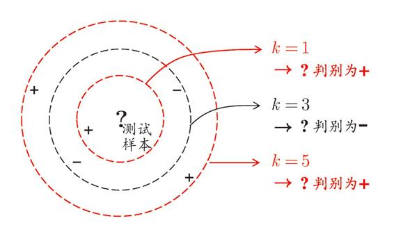

图10.1 k近邻分类器示意图。虚线显示出等距线; 测试样本在k=1或k=5时被判别为正例，k=3时被判别为反例。

给定测试样本x，若其最近邻样本为z，则最近邻分类器出错的概率就是x与z类别标记不同的概率，即

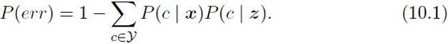

贝叶斯最优分类器参见（7.1 贝叶斯决策论）。

假设样本独立同分布，且对任意x和任意小正数δ，在x附近δ距离范围内总能找到一个训练样本; 换言之，对任意测试样本，总能在任意近的范围内找到式（10.1）中的训练样本z。令c\*=arg maxc∈yP（c\|x） 表示贝叶斯最优分类器的结果，有

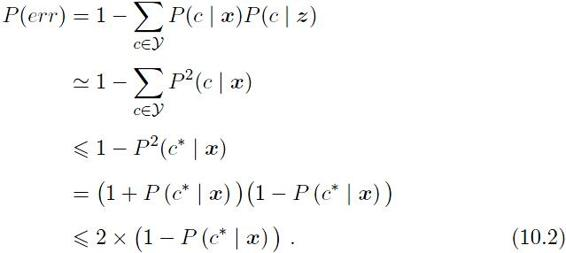

为便于初学者理解，本节仅做了一个简化讨论，更严格的分析参阅\[Cover and Hart，1967\]。

于是我们得到了有点令人惊讶的结论：最近邻分类器虽简单，但它的泛化错误率不超过贝叶斯最优分类器的错误率的两倍！

## 10.2 低维嵌入

作为参照量：宇宙间基本粒子的总数约为1080（一粒灰尘中含有几十亿个基本粒子）。

上一节的讨论是基于一个重要假设：任意测试样本x附近任意小的δ距离范围内总能找到一个训练样本，即训练样本的采样密度足够大，或称为“密采样”（dense sample）。然而，这个假设在现实任务中通常很难满足，例如若δ=0.001，仅考虑单个属性，则仅需1000个样本点平均分布在归一化后的属性取值范围内，即可使得任意测试样本在其附近0.001距离范围内总能找到一个训练样本，此时最近邻分类器的错误率不超过贝叶斯最优分类器的错误率的两倍。然而，这仅是属性维数为1的情形，若有更多的属性，则情况会发生显著变化。例如假定属性维数为20，若要求样本满足密采样条件，则至少需（103）20=1060个样本。现实应用中属性维数经常成千上万，要满足密采样条件所需的样本数目是无法达到的天文数字。此外，许多学习方法都涉及距离计算，而高维空间会给距离计算带来很大的麻烦，例如当维数很高时甚至连计算内积都不再容易。

\[Bellman，1957\] 最早提出，亦称“维数诅咒”、 “维数危机”。

事实上，在高维情形下出现的数据样本稀疏、距离计算困难等问题，被称为“维数灾难”（curse ofdimensionality）。

另一个重要途径是特征选择，参见（第11章特征选择与稀疏学习）。

缓解维数灾难的一个重要途径是降维（dimension reduction），亦称“维数约简”，即通过某种数学变换将原始高维属性空间转变为一个低维“子空间”（subspace），在这个子空间中样本密度大幅提高，距离计算也变得更为容易。为什么能进行降维？ 这是因为在很多时候，人们观测或收集到的数据样本虽是高维的，但与学习任务密切相关的也许仅是某个低维分布，即高维空间中的一个低维“嵌入”（embedding）。图10.2 给出了一个直观的例子。原始高维空间中的样本点，在这个低维嵌入子空间中更容易进行学习。

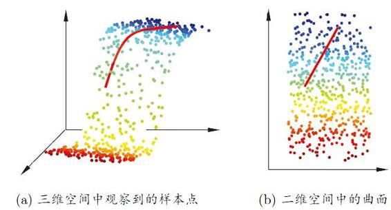

图10.2 低维嵌入示意图

若要求原始空间中样本之间的距离在低维空间中得以保持，如图10.2 所示，即得到“多维缩放”（Multiple Dimensional Scaling，简称MDS） \[Cox and Cox，2001\]这样一种经典的降维方法。下面做一个简单的介绍。

假定m个样本在原始空间的距离矩阵为D∈Rm×m，其第i行j列的元素distij为样本xi 到xj的距离。我们的目标是获得样本在d′ 维空间的表示Z∈Rd′×m，d′≤d，且任意两个样本在d′维空间中的欧氏距离等于原始空间中的距离，即‖zi−zj‖=distij。

令B=ZTZ∈Rm×m，其中B为降维后样本的内积矩阵，bij=zTizj，有

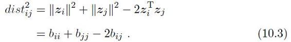

0∈Rd'为全零向量。

为便于讨论，令降维后的样本Z被中心化，即Σ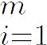zi=0.显然，矩阵B的行与列之和均为零，即Σbij=Σ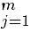bij=0.易知

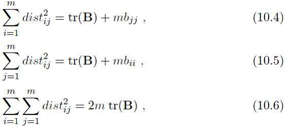

其中tr（·） 表示矩阵的迹（trace），tr（B）=Σ=‖zi‖2。令

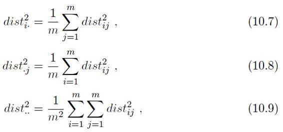

由式（10.3）和式（10.4）∼（10.9）可得

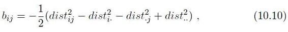

由此即可通过降维前后保持不变的距离矩阵D求取内积矩阵B。

对矩阵B做特征值分解（eigenvalue decomposition），B=VΛVT，其中Λ=diag（λ1，λ2，...，λd）为特征值构成的对角矩阵，λ1≥λ2≥...≥λd，V为特征向量矩阵。假定其中有d\*个非零特征值，它们构成对角矩阵Λ\*=diag（λ1，λ2，...，λd\* ），令V\* 表示相应的特征向量矩阵，则Z可表达为

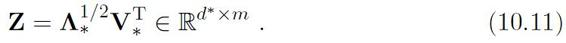

在现实应用中为了有效降维，往往仅需降维后的距离与原始空间中的距离尽可能接近，而不必严格相等。此时可取d′≪d个最大特征值构成对角矩阵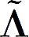=diag（λ1，λ2，...，λd′ ），令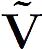 表示相应的特征向量矩阵，则Z可表达为

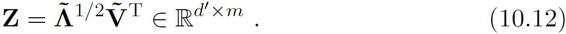

图10.3给出了MDS算法的描述。

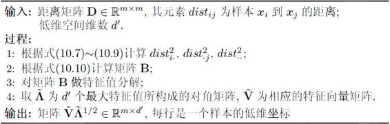

图10.3 MDS算法

通常令d′≪d。

一般来说，欲获得低维子空间，最简单的是对原始高维空间进行线性变换.给定d维空间中的样本X=（x1，x2，...，xm）∈Rd×m，变换之后得到d'≤d维空间中的样本

Z=WTX，　（10.13）

其中W∈Rd×d′是变换矩阵，Z∈ Rd′×m是样本在新空间中的表达。

变换矩阵W可视为d'个d维基向量，zi=WTxi是第i个样本与这d'个基向量分别做内积而得到的d'维属性向量。换言之，zi是原属性向量xi在新坐标系{w1，w2，..。，wd′}中的坐标向量。若wi与wj（i=j） 正交，则新坐标系是一个正交坐标系，此时W为正交变换.显然，新空间中的属性是原空间中属性的线性组合。

基于线性变换来进行降维的方法称为线性降维方法，它们都符合式（10.13）的基本形式，不同之处是对低维子空间的性质有不同的要求，相当于对W施加了不同的约束。在下一节我们将会看到，若要求低维子空间对样本具有最大可分性，则将得到一种极为常用的线性降维方法。

对降维效果的评估，通常是比较降维前后学习器的性能，若性能有所提高则认为降维起到了作用。若将维数降至二维或三维，则可通过可视化技术来直 观地判断降维效果。

## 10.3 主成分分析

亦称“主分量分析”。

主成分分析（Principal Component Analysis，简称PCA）是最常用的一种降维方法。在介绍PCA 之前，不妨先考虑这样一个问题：对于正交属性空间中的样本点，如何用一个超平面（直线的高维推广）对所有样本进行恰当的表达？

容易想到，若存在这样的超平面，那么它大概应具有这样的性质：

• 最近重构性：样本点到这个超平面的距离都足够近;

• 最大可分性：样本点在这个超平面上的投影能尽可能分开。

有趣的是，基于最近重构性和最大可分性，能分别得到主成分分析的两种等价推导。我们先从最近重构性来推导。

假定数据样本进行了中心化，即Σixi=0; 再假定投影变换后得到的新坐标系为{w1，w2，...，wd}，其中wi是标准正交基向量，\|\|wi\|\|2=1，w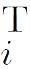wj=0（i ̸=j）。若丢弃新坐标系中的部分坐标，即将维度降低到d′＜d，则样本点xi在低维坐标系中的投影是zi=（zi1; zi2;...;zid′ ），其中zij=w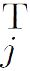xi是xi在低维坐标系下第j维的坐标。若基于zi来重构xi，则会得到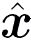i=Σ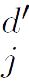=1zijwj。

const是一个常数。

考虑整个训练集，原样本点xi与基于投影重构的样本点i之间的距离为

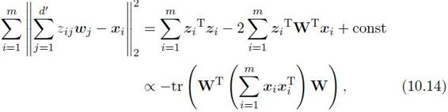

其中W=（w1，w2，...，wd）。根据最近重构性，式（10.14）应被最小化，考虑到wj是标准正交基，Σixix是协方差矩阵，有

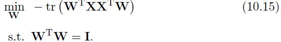

这就是主成分分析的优化目标。

从最大可分性出发，能得到主成分分析的另一种解释。我们知道，样本点xi在新空间中超平面上的投影是WTxi，若所有样本点的投影能尽可能分开，则应该使投影后样本点的方差最大化，如图10.4所示。

投影后样本点的方差是ΣiWTxixW，于是优化目标可写为

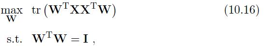

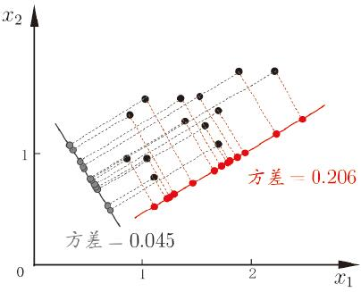

图10.4 使所有样本的投影尽可能分开（如图中红线所示），则需最大化投影点的方差

显然，式（10.16）与（10.15）等价。

对式（10.15）或（10.16）使用拉格朗日乘子法可得

XXTwi=λiwi　（10.17）

实践中常通过对X进行奇异值分解来代替协方差矩阵的特征值分解。

PCA 也可看作是逐一选取方差最大方向，即先对协方差矩阵Σixix做特征值分解，取最大特征值对应的特征向量w1;再对Σixix−λ1w1w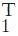做特征值分解，取最大特征值对应的特征向量w2;……由W各分量正交及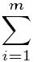xix=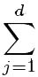λjwjw可知，上述逐一选取方差最大方向的做法与直接选取最大d'个特征值等价。

于是，只需对协方差矩阵XXT 进行特征值分解，将求得的特征值排序：λ1≥λ2≥...≥λd，再取前d'个特征值对应的特征向量构成W\*=（w1，w2，...，wd′ ）。这就是主成分分析的解。PCA算法描述如图10.5所示。

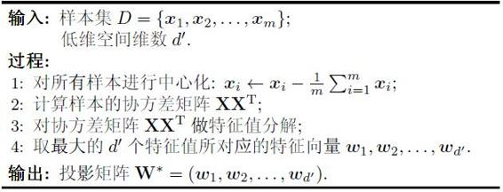

图10.5 PCA算法

降维后低维空间的维数d'通常是由用户事先指定，或通过在d'值不同的低维空间中对k近邻分类器（或其他开销较小的学习器） 进行交叉验证来选取较好的d'值。对PCA，还可从重构的角度设置一个重构阈值，例如t=95%，然后选取使下式成立的最小d'值：

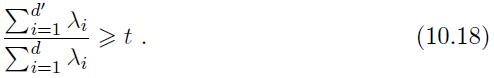

保存均值向量是为了通过向量减法对新样本同样进行中心化。

PCA 仅需保留W\* 与样本的均值向量即可通过简单的向量减法和矩阵-向量乘法将新样本投影至低维空间中。显然，低维空间与原始高维空间必有不同，因为对应于最小的d−d'个特征值的特征向量被舍弃了，这是降维导致的结果.但舍弃这部分信息往往是必要的：一方面，舍弃这部分信息之后能使样本的采样密度增大，这正是降维的重要动机; 另一方面，当数据受到噪声影响时，最小的特征值所对应的特征向量往往与噪声有关，将它们舍弃能在一定程度上起到去噪的效果。

## 10.4 归纳偏好

线性降维方法假设从高维空间到低维空间的函数映射是线性的，然而，在不少现实任务中，可能需要非线性映射才能找到恰当的低维嵌入。图10.6 给出了一个例子，样本点从二维空间中的矩形区域采样后以S 形曲面嵌入到三维空间，若直接使用线性降维方法对三维空间观察到的样本点进行降维，则将丢失原本的低维结构。为了对“原本采样的”低维空间与降维后的低维空间加以区别，我们称前者为“本真”（intrinsic）低维空间。

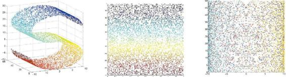

图10.6 三维空间中观察到的3000 个样本点，是从本真二维空间中矩形区域采样后以S 形曲面嵌入，此情形下线性降维会丢失低维结构。图中数据点的染色显示出低维空间的结构。

参见（6.6 核方法）。

非线性降维的一种常用方法，是基于核技巧对线性降维方法进行“核化”（kernelized）.下面我们以核主成分分析（Kernelized PCA，简称KPCA）\[Schölkopf et al.，1998\]为例来进行演示。

假定我们将在高维特征空间中把数据投影到由W=（w1，w2，...，wd） 确定的超平面上，则对于wj，由式（10.17）有

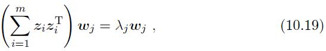

其中zi是样本点xi在高维特征空间中的像。易知

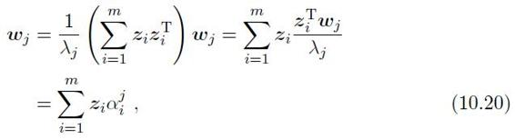

其中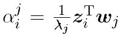是αi的第j个分量。假定zi是由原始属性空间中的样本点xi通过映射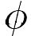产生，即zi=（xi），i=1，2，...，m。若能被显式表达出来，则通过它将样本映射至高维特征空间，再在特征空间中实施PCA 即可.式（10.19）变换为

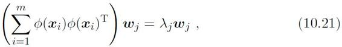

式（10.20）变换为

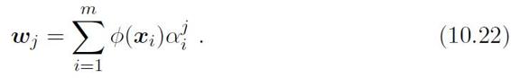

一般情形下，我们不清楚的具体形式，于是引入核函数

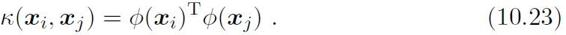

将式（10.22）和（10.23）代入式（10.21）后化简可得

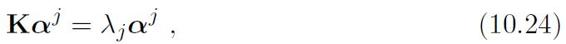

其中K为k对应的核矩阵，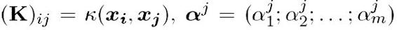。显然，式（10.24）是特征值分解问题，取K最大的d′ 个特征值对应的特征向量即可。

对新样本x，其投影后的第j（j=1，2，...，d′）维坐标为

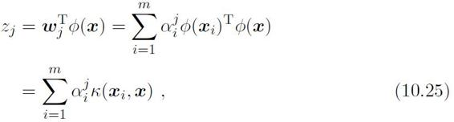

其中αi已经过规范化。式（10.25）显示出，为获得投影后的坐标，KPCA需对所有样本求和，因此它的计算开销较大。

## 10.5 流形学习

流形学习（manifold learning）是一类借鉴了拓扑流形概念的降维方法.“流形”是在局部与欧氏空间同胚的空间，换言之，它在局部具有欧氏空间的性质，能用欧氏距离来进行距离计算。这给降维方法带来了很大的启发：若低维流形嵌入到高维空间中，则数据样本在高维空间的分布虽然看上去非常复杂，但在局部上仍具有欧氏空间的性质，因此，可以容易地在局部建立降维映射关系，然后再设法将局部映射关系推广到全局。当维数被降至二维或三维时，能对数据进行可视化展示，因此流形学习也可被用于可视化。本节介绍两种著名的流形学习方法。

### 10.5.1 等度量映射

等度量映射（Isometric Mapping，简称Isomap） \[Tenenbaum et al.，2000\]的基本出发点，是认为低维流形嵌入到高维空间之后，直接在高维空间中计算直线距离具有误导性，因为高维空间中的直线距离在低维嵌入流形上是不可达的.如图10.7（a）所示，低维嵌入流形上两点间的距离是“测地线”（geodesic）距离：想象一只虫子从一点爬到另一点，如果它不能脱离曲面行走，那么图10.7（a）中的红色曲线是距离最短的路径，即S 曲面上的测地线，测地线距离是两点之间的本真距离。显然，直接在高维空间中计算直线距离是不恰当的。

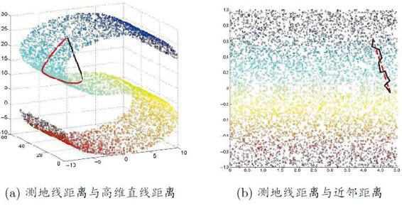

图10.7 低维嵌入流形上的测地线距离（红色）不能用高维空间的直线距离计算，但能用近邻距离来近似

那么，如何计算测地线距离呢？这时我们可利用流形在局部上与欧氏空间同胚这个性质，对每个点基于欧氏距离找出其近邻点，然后就能建立一个近邻连接图，图中近邻点之间存在连接，而非近邻点之间不存在连接，于是，计算两点之间测地线距离的问题，就转变为计算近邻连接图上两点之间的最短路径问题。从图10.7（b）可看出，基于近邻距离逼近能获得低维流形上测地线距离很好的近似。

1972年图灵奖得主E.W。Dijkstra和1978年图灵奖得主R。Floyd 分别提出的著名算法，参阅数据结构教科书。

在近邻连接图上计算两点间的最短路径，可采用著名Dijkstra 算法或Floyd算法，在得到任意两点的距离之后，就可通过10.2节介绍的MDS方法来获得样本点在低维空间中的坐标。图10.8给出了Isomap 算法描述。

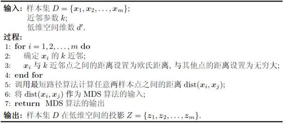

图10.8 Isomap算法

MDS参见（10.2 低维嵌入）。

需注意的是，Isomap 仅是得到了训练样本在低维空间的坐标，对于新样本，如何将其映射到低维空间呢？这个问题的常用解决方案，是将训练样本的高维空间坐标作为输入、低维空间坐标作为输出，训练一个回归学习器来对新样本的低维空间坐标进行预测。这显然仅是一个权宜之计，但目前似乎并没有更好的办法。

对近邻图的构建通常有两种做法，一种是指定近邻点个数，例如欧氏距离最近的k个点为近邻点，这样得到的近邻图称为k近邻图；另一种是指定距离阈值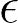，距离小于的点被认为是近邻点，这样得到的近邻图称为近邻图。两种方式均有不足，例如若近邻范围指定得较大，则距离很远的点可能被误认为近邻，这样就出现“短路”问题；近邻范围指定得较小，则图中有些区域可能与其他区域不存在连接，这样就出现“断路”问题。短路与断路都会给后续的最短路径计算造成误导。

### 10.5.2 局部线性嵌入

与Isomap 试图保持近邻样本之间的距离不同，局部线性嵌入（Locally Linear Embedding，简称LLE） \[Roweis and Saul，2000\] 试图保持邻域内样本之间的线性关系。如图10.9 所示，假定样本点xi的坐标能通过它的邻域样本xj，xk，xl的坐标通过线性组合而重构出来，即

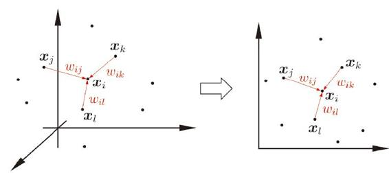

图10.9 高维空间中的样本重构关系在低维空间中得以保持

xi=wijxj+ wikxk+ wilxl，　（10.26）

LLE希望式（10.26）的关系在低维空间中得以保持。

LLE 先为每个样本xi找到其近邻下标集合Qi，然后计算出基于Qi中的样本点对xi进行线性重构的系数wi：

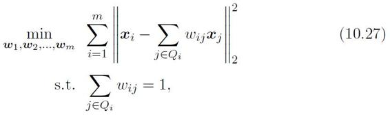

其中xi和xj均为已知，令Cjk=（xi−xj）T（xi− xk），wij有闭式解

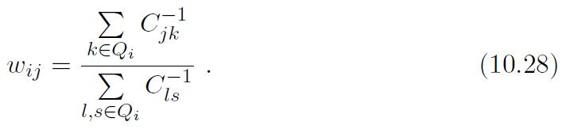

LLE 在低维空间中保持wi不变，于是xi对应的低维空间坐标zi可通过下式求解：

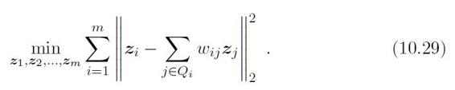

式（10.27）与（10.29）的优化目标同形，唯一的区别是式（10.27）中需确定的是wi，而式（10.29）中需确定的是xi对应的低维空间坐标zi。

令Z=（z1，z2，...，zm）∈Rd′×m，（W）ij=wij，

M=（I −W）T（I−W），（10.30）

则式（10.29）可重写为

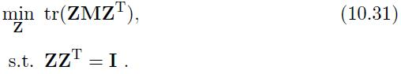

式（10.31）可通过特征值分解求解：M最小的d'个特征值对应的特征向量组成的矩阵即为ZT。

LLE的算法描述如图10.10所示。算法第4 行显示出：对于不在样本xi邻域区域的样本xj，无论其如何变化都对xi和zi没有任何影响; 这种将变动限制在局部的思想在许多地方都有用。

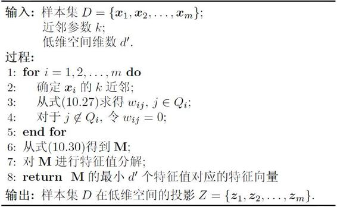

图10.10 LLE算法

## 10.6 度量学习

亦称“距离度量学习”（distance metric learning）。

在机器学习中，对高维数据进行降维的主要目的是希望找到一个合适的低维空间，在此空间中进行学习能比原始空间性能更好。事实上，每个空间对应了在样本属性上定义的一个距离度量，而寻找合适的空间，实质上就是在寻找一个合适的距离度量。那么，为何不直接尝试“学习”出一个合适的距离度量呢？这就是度量学习（metric learning）的基本动机。

欲对距离度量进行学习，必须有一个便于学习的距离度量表达形式。9.3 节给出了很多种距离度量的表达式，但它们都是“固定的”、没有可调节的参数，因此不能通过对数据样本的学习来加以改善。为此，我们先来做一个推广。

即欧氏距离的平方，这是为了后面推导的便利。

对两个d维样本xi和xj它们之间的平方欧氏距离可写为

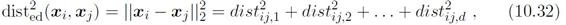

其中distij，k表示xi与xj在第k维上的距离。若假定不同属性的重要性不同，则可引入属性权重w，得到

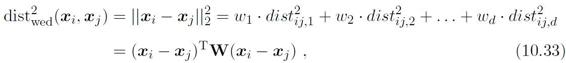

其中wi≥0，W=diag（w） 是一个对角矩阵，（W）ii=wi。

马氏距离以印度数学家P。C。Mahalanobis命名.标准马氏距离中M 是协方差矩阵的逆，即M=Σ−1; 在度量学习中M被赋予更大的灵活性。

式（10.33）中的W可通过学习确定，但我们还能再往前走一步：W的非对角元素均为零，这意味着坐标轴是正交的，即属性之间无关; 但现实问题中往往不是这样，例如考虑西瓜的“重量”和“体积”这两个属性，它们显然是正相关的，其对应的坐标轴不再正交。为此，将式（10.33）中的W替换为一个普通的半正定对称矩阵M，于是就得到了马氏距离（Mahalanobis distance）

其中M亦称“度量矩阵”，而度量学习则是对M进行学习。注意到为了保持距离非负且对称，M必须是（半）正定对称矩阵，即必有正交基P 使得M能写为M=PPT。

对M 进行学习当然要设置一个目标。假定我们是希望提高近邻分类器的性能，则可将M 直接嵌入到近邻分类器的评价指标中去，通过优化该性能指标相应地求得M。下面我们以近邻成分分析（Neighbourhood Component Analysis，简称NCA） \[Goldberger et al.，2005\]为例进行讨论。

近邻分类器在进行判别时通常使用多数投票法，邻域中的每个样本投1 票，邻域外的样本投0票。不妨将其替换为概率投票法。对于任意样本xj，它对xi分类结果影响的概率为

留一法参见（2.2.2 交叉验证法）。

当i=j时，pij最大。显然，xj对xi的影响随着它们之间距离的增大而减小.若以留一法（LOO） 正确率的最大化为目标，则可计算xi的留一法正确率，即它被自身之外的所有样本正确分类的概率为

其中Ωi表示与xi属于相同类别的样本的下标集合。于是，整个样本集上的留一法正确率为

将式（10.35）代入（10.37），再考虑到M=PPT，则NCA的优化目标为

求解式（10.38） 即可得到最大化近邻分类器LOO正确率的距离度量矩阵M。

可用随机梯度下降法求解\[Goldberger et al.，2005\]。

实际上，我们不仅能把错误率这样的监督学习目标作为度量学习的优化目标，还能在度量学习中引入领域知识。例如，若已知某些样本相似、某些样本不相似，则可定义“必连”（must-link）约束集合ℳ与“勿连”（cannot-link）约束集合c，（xi，xj） ∈ℳ表示xi与xj相似，（xi，xk） ∈c表示xi与xk不相似.显然，我们希望相似的样本之间距离较小，不相似的样本之间距离较大，于是可通过求解下面这个凸优化问题获得适当的度量矩阵M\[Xing et al.，2003\]：

其中约束M0 表明M必须是半正定的。式（10.39）要求在不相似样本间的距离不小于1的前提下，使相似样本间的距离尽可能小。

度量学习自身通常并不要求学得的M是低秩的。

不同的度量学习方法针对不同目标获得“好”的半正定对称距离度量矩阵M，若M是一个低秩矩阵，则通过对M进行特征值分解，总能找到一组正交基，其正交基数目为矩阵M的秩rank（M），小于原属性数d。于是，度量学习学得的结果可衍生出一个降维矩阵P ∈ Rd×rank（M），能用于降维之目的。

## 10.7 阅读材料

懒惰学习方法主要有k近邻学习器、懒惰决策树\[Friedman et al.，1996\]；朴素贝叶斯分类器能以懒惰学习方式使用，也能以急切学习方式使用。关于懒惰学习的更多内容可参阅\[Aha，1997\]。

主成分分析是一种无监督的线性降维方法，监督线性降维方法最著名的是线性判别分析（LDA） \[Fisher，1936\]，参见（3.4 线性判别分析），其核化版本KLDA \[Baudatand Anouar，2000\] 参见（6.6 核方法）。通过最大化两个变量集合之间的相关性，则可得到“典型相关分析”（Canonical Correlation Analysis，简称CCA） \[Hotelling，1936\] 及其核化版本KCCA \[Harden et al.，2004\]，该方法在多视图学习（multiview learning）中有广泛应用。在模式识别领域人们发现，直接对矩阵对象（例如一幅图像）进行降维操作会比将其拉伸为向量（例如把图像逐行拼接成一个向量）再进行降维操作有更好的性能，于是产生了2DPCA \[Yang et al.，2004\]、2DLDA \[Ye et al.，2005\]、（2D）2PCA \[Zhang and Zhou，2005\] 等方法，以及基于张量（tensor）的方法\[Kolda and Bader，2009\]。

参见（第13章 半监督学习）。

除了Isomap 和LLE，常见的流形学习方法还有拉普拉斯特征映射（Laplcian Eigenmaps，简称LE） \[Belkin and Niyogi，2003\]、局部切空间对齐（Local Tangent Space Alignment，简称LTSA） \[Zhang and Zha，2004\]等。局部保持投影（Locality Preserving Projections，简称LPP） \[He and Niyogi，2004\] 是基于LE的线性降维方法。对监督学习而言，根据类别信息扭曲后的低维空间常比本真低维空间更有利\[Geng et al.，2005\]。值得注意的是，流形学习欲有效进行邻域保持则需样本密采样，而这恰是高维情形下面临的重大障碍，因此流形学习方法在实践中的降维性能往往没有预期的好; 但邻域保持的想法对机器学习的其他分支产生了重要影响，例如半监督学习中有著名的流形假设、流形正则化\[Belkin et al.，2006\]。参见（第13章 半监督学习）。\[Yan et al.，2007\] 从图嵌入的角度给出了降维方法的一个统一框架。

半监督聚类见（13.6 半监督聚类）。

将必连关系、勿连关系作为学习任务优化目标的约束，在半监督聚类的研究中使用得更早\[Wagstaff et al.，2001\] 。在度量学习中，由于这些约束是对所有样本同时发生作用\[Xing et al.，2003\]，因此相应的方法被称为全局度量学习方法。人们也尝试利用局部约束（例如邻域内的三元关系），从而产生了局部距离度量学习方法\[Weinberger and Saul，2009\]，甚至有一些研究试图为每个样本产生最合适的距离度量\[Frome et al.，2007; Zhan et al.，2009\]。在具体的学习与优化求解方面，不同的度量学习方法往往采用了不同的技术，例如\[Yang et al.，2006\] 将度量学习转化为判别式概率模型框架下基于样本对的二分类问题求解，\[Davis et al.，2007\] 将度量学习转化为信息论框架下的Bregman 优化问题，能方便地进行在线学习。

## 习题

10.1 编程实现k近邻分类器，在西瓜数据集3.0α上比较其分类边界与决策树分类边界之异同。

西瓜数据集3.0α见（4.5 多变量决策树）的（表4.5 西瓜数据集3.0α）。

10.2 令err、err\* 分别表示最近邻分类器与贝叶斯最优分类器的期望错误率，试证明

10.3 在对高维数据降维之前应先进行“中心化”，常见的是将协方差矩阵XXT 转化为XHHTXT，其中，试析其效果。

10.4 在实践中，协方差矩阵XXT的特征值分解常由中心化后的样本矩阵X的奇异值分解代替，试述其原因。

10.5 降维中涉及的投影矩阵通常要求是正交的。试述正交、非正交投影矩阵用于降维的优缺点。

princomp函数调用。

10.6 试使用 MATLAB中的 PCA 函数对 Yale 人脸数据集进行降维，并观察前20 个特征向量所对应的图像。

Yale 人脸数据集见http：//vision.ucsd.edu/content/yale-face-database。

10.7 试述核化线性降维与流形学习之间的联系及优缺点。

10.8\* k近邻图和近邻图存在的短路和断路问题会给Isomap造成困扰，试设计一个方法缓解该问题。

参见（9.3 距离计算）。

10.10 试述如何确保度量学习产生的距离能满足距离度量的四条基本性质。

## 参考文献

Aha,D.,ed.（1997）.Lazy Learning.Kluwer,Norwell,MA。

Baudat,G.and F.Anouar.（2000）.“Generalized discriminant analysis using a kernel approach.” *Neural Computation*,12（10）：2385–2404。

Belkin,M.and P.Niyogi.（2003）.“Laplacian eigenmaps for dimensionality reduction and data representation.” Neural Computation,15（6）：1373–1396。

Belkin,M.,P.Niyogi,and V.Sindhwani.（2006）.“Manifold regularization：A geometric framework for learning from labeled and unlabeled examples.”*Journal of Machine Learning Research*,7：2399–2434。

Bellman,R.E.（1957）.*Dynamic Programming.* Princeton University Press,Princeton,NJ。

Cover,T.M.and P.E.Hart.（1967）.“Nearest neighbor pattern classification.”*IEEE Transactions on Information Theory,* 13（1）：21–27。

Cox,T.F.and M.A.Cox.（2001）.*Multidimensional Scaling*.Chapman & Hall/CRC,London,UK。

Davis,J.V.,B.Kulis,P.Jain,S.Sra,and I.S.Dhillon.（2007）.“Informationtheoretic metric learning.” In *Proceedings of the 24th International Conference on Machine Learning （ICML）,* 209–216,Corvalis,OR。

Fisher,R.A.（1936）.“The use of multiple measurements in taxonomic problems.”*Annals of Eugenics,* 7（2）：179–188。

Friedman,J.H.,R.Kohavi,and Y.Yun.（1996）.“Lazy decision trees.” In *Proceedings of the 13th National Conference on Aritificial Intelligence （AAAI）*,717–724,Portland,OR。

Frome,A.,Y.Singer,and J.Malik.（2007）.“Image retrieval and classification using local distance functions.” In *Advances in Neural Information Processing Systems 19 （NIPS）* （B.Schölkopf,J.C.Platt,and T.Hoffman,eds.）,417–424,MIT Press,Cambridge,MA。

Geng,X.,D.-C.Zhan,and Z.-H.Zhou.（2005）.“Supervised nonlinear dimensionality reduction for visualization and classification.” *IEEE Transactions on Systems,Man,and Cybernetics - Part B：Cybernetics,* 35（6）：1098–1107。

Goldberger,J.,G.E.Hinton,S.T.Roweis,and R.R.Salakhutdinov.（2005）.“Neighbourhood components analysis.” In *Advances in Neural Information Processing Systems 17 （NIPS）* （L.K.Saul,Y.Weiss,and L.Bottou,eds.）,513–520,MIT Press,Cambridge,MA。

Harden,D.R.,S.Szedmak,and J.Shawe-Taylor.（2004）.“Canonical correlation analysis：An overview with application to learning methods.” *Neural Computation*,16（12）：2639–2664。

He,X.and P.Niyogi.（2004）.“Locality preserving projections.” In *Advances in Neural Information Processing Systems 16 （NIPS）* （S.Thrun,L.K.Saul,and B.Sch¨olkopf,eds.）,153–160,MIT Press,Cambridge,MA。

Hotelling,H.（1936）.“Relations between two sets of variates.” Biometrika,28（10-4）：321–377。

Kolda,T.G.and B.W.Bader.（2009）.“Tensor decompositions and applications.”SIAM Review,51（3）：455–500。

Roweis,S.T.and L.K.Saul.（2000）.“Nonlinear dimensionality reduction by locally linear embedding.” Science,290（5500）：2323–2326。

Schölkopf,B.,A.Smola,and K.-R.Müller.（1998）.“Nonlinear component analysis as a kernel eigenvalue problem.” Neural Computation,10（5）：1299–1319。

Tenenbaum,J.B.,V.de Silva,and J.C.Langford.（2000）.“A global geometric framework for nonlinear dimensionality reduction.” Science,290（5500）：2319–2323。

Wagstaff,K.,C.Cardie,S.Rogers,and S.Schr¨odl.（2001）.“Constrained k-means clustering with background knowledge.” In *Proceedings of the 18th International Conference on Machine Learning （ICML）,* 577–584,Williamstown,MA。

Weinberger,K.Q.and L.K.Saul.（2009）.“Distance metric learning for large margin nearest neighbor classification.” *Journal of Machine Learning Research,*10：207–244。

Xing,E.P.,A.Y.Ng,M.I.Jordan,and S.Russell.（2003）.“Distance metric learning,with application to clustering with side-information.” In Advances *in Neural Information Processing Systems 15 （NIPS）* （S.Becker,S.Thrun,and K.Obermayer,eds.）,505–512,MIT Press,Cambridge,MA。

Yan,S.,D.Xu,B.Zhang,and H.-J.Zhang.（2007）.“Graph embedding and extensions：A general framework for dimensionality reduction.” *IEEE Trans actions on Pattern Analysis and Machine Intelligence,* 29（1）：40–51。

Yang,J.,D.Zhang,A.F.Frangi,and J.-Y.Yang.（2004）.“Two-dimensional PCA：A new approach to appearance-based face representation and recognition.”*IEEE Transactions on Pattern Analysis and Machine Intelligence*,26（1）：131–137。

Yang,L.,R.Jin,R.Sukthankar,and Y.Liu.（2006）.“An efficient algorithm for local distance metric learning.” In *Proceedings of the 21st National Conference on Artificial Intelligence* （AAAI）,543–548,Boston,MA。

Ye,J.,R.Janardan,and Q.Li.（2005）.“Two-dimensional linear discriminant analysis.” In *Advances in Neural Information Processing Systems 17 （NIPS）*（L.K.Saul,Y.Weiss,and L.Bottou,eds.）,1569–1576,MIT Press,Cambridge,MA。

Zhan,D.-C.,Y.-F.Li,and Z.-H.Zhou.（2009）.“Learning instance specific distances using metric propagation.” In *Proceedings of the 26th International Conference on Machine Learning （ICML）*,1225–1232,Montreal,Canada。

Zhang,D.and Z.-H.Zhou.（2005）.“（2D）2PCA：2-directional 2-dimensional PCA for efficient face representation and recognition.” *Neurocomputing*,69（1-3）：224–231。

Zhang,Z.and H.Zha.（2004）.“Principal manifolds and nonlinear dimension reduction via local tangent space alignment.” *SIAM Journal on Scientific Computing*,26（1）：313–338。

## 休息一会儿

### 小故事：主成分分析与卡尔·皮尔逊

主成分分析（PCA） 是迄今最常用的降维方法，它有许多名字，例如线性代数中的散度矩阵奇异值分解（SVD）、统计学中的因子分析（factor analysis）、信号处理中的离散Karhünen-Lo\`eve 变换、图像分析中的Hotelling 变换、文本分析中的潜在语义分析（LSA）、机械工程中的本征正交分解（POD）、气象学中的经验直交函数（EOF）、结构动力学中的经验模分析（EMA）、心理测量学中的Schmidt-Mirsky 定理等。

卡尔·皮尔逊（Karl Pearson，1857—1936）在1901年发明了PCA。皮尔逊是一位罕见的百科全书式的学者，他是统计学家、应用数学家、哲学家、历史学家、民俗学家、宗教学家、人类学家、语言学家，还是社会活动家、教育改革家、作家。1879 年他从剑桥大学国王学院数学系毕业，此后到德国海德堡大学、柏林大学等地游学，涉猎广泛。1884 年他开始在伦敦大学学院（University College London，简称UCL） 担任应用数学讲席教授，39 岁时成为英国皇家学会会士。他在1892 年出版的科学哲学经典名著《科学的规范》，为爱因斯坦创立相对论提供了启发。皮尔逊对统计学作出了极为重要的贡献，例如他提出了相关系数、标准差、卡方检验、矩估计等，并为假设检验理论、统计决策理论奠定了基础，被尊为“统计学之父”。

Galton 是达尔文的表弟，“优生学”发明人。

皮尔逊开展统计学研究是因受到了生物学家F。Galton和W。Welton的影响，希望使进化论能进行定量描述和分析。1901 年他们三人创立了著名的统计学期刊Biometrika，皮尔逊担任主编直至去世。皮尔逊的独子Egon 也是著名统计学家，是著名的“奈曼-皮尔逊定理”中的皮尔逊，他子承父业出任UCL的统计学教授以及Biometrika 主编，后来担任了英国皇家统计学会主席。

