# 第11章 特征选择与稀疏学习

<strong>本章配套视频</strong>

当前这套 56P《机器学习初步》只覆盖教材第 1–9 章，没有本章的对应分 P。此处不强行错配，请以本章原书正文为准。

<a href="https://www.bilibili.com/video/BV1gG411f7zX/" target="_blank" rel="noopener">查看完整视频选集 ↗</a>

## 11.1 子集搜索与评价

我们能用很多属性描述一个西瓜，例如色泽、根蒂、敲声、纹理、触感等，但有经验的人往往只需看看根蒂、听听敲声就知道是否好瓜。换言之，对一个学习任务来说，给定属性集，其中有些属性可能很关键、很有用，另一些属性则可能没什么用。我们将属性称为“特征”（feature），对当前学习任务有用的属性称为“相关特征”（relevant feature）、没什么用的属性称为“无关特征”（irrelevant feature）。从给定的特征集合中选择出相关特征子集的过程，称为“特征选择”（feature selection）。

特征选择是一个重要的“数据预处理”（data preprocessing）过程，在现实机器学习任务中，获得数据之后通常先进行特征选择，此后再训练学习器。那么，为什么要进行特征选择呢？

有两个很重要的原因：首先，我们在现实任务中经常会遇到维数灾难问题，这是由于属性过多而造成的，若能从中选择出重要的特征，使得后续学习过程仅需在一部分特征上构建模型，则维数灾难问题会大为减轻。从这个意义上说，特征选择与第10章介绍的降维有相似的动机; 事实上，它们是处理高维数据的两大主流技术。第二个原因是，去除不相关特征往往会降低学习任务的难度，这就像侦探破案一样，若将纷繁复杂的因素抽丝剥茧，只留下关键因素，则真相往往更易看清。

需注意的是，特征选择过程必须确保不丢失重要特征，否则后续学习过程会因为重要信息的缺失而无法获得好的性能。给定数据集，若学习任务不同，则相关特征很可能不同，因此，特征选择中所谓的“无关特征”是指与当前学习任务无关。有一类特征称为“冗余特征”（redundant feature），它们所包含的信息能从其他特征中推演出来。例如，考虑立方体对象，若已有特征“底面长”“底面宽”，则“底面积”是冗余特征，因为它能从“底面长”与“底面宽”得到。冗余特征在很多时候不起作用，去除它们会减轻学习过程的负担。但有时冗余特征会降低学习任务的难度，例如若学习目标是估算立方体的体积，则“底面积”这个冗余特征的存在将使得体积的估算更容易; 更确切地说，若某个冗余特征恰好对应了完成学习任务所需的“中间概念”，则该冗余特征是有益的。为简化讨论，本章暂且假定数据中不涉及冗余特征，并且假定初始的特征集合包含了所有的重要信息。

欲从初始的特征集合中选取一个包含了所有重要信息的特征子集，若没有任何领域知识作为先验假设，那就只好遍历所有可能的子集了；然而这在计算上却是不可行的，因为这样做会遭遇组合爆炸，特征个数稍多就无法进行。可行的做法是产生一个“候选子集”，评价出它的好坏，基于评价结果产生下一个候选子集，再对其进行评价，……这个过程持续进行下去，直至无法找到更好的候选子集为止。显然，这里涉及两个关键环节：如何根据评价结果获取下一个候选特征子集？ 如何评价候选特征子集的好坏？

亦称子集“生成与搜索”。

第一个环节是“子集搜索”（subset search）问题。给定特征集合{a1，a2，...，ad}，我们可将每个特征看作一个候选子集，对这d个候选单特征子集进行评价，假定{a2} 最优，于是将{a2} 作为第一轮的选定集; 然后，在上一轮的选定集中加入一个特征，构成包含两个特征的候选子集，假定在这d-1个候选两特征子集中{a2，a4} 最优，且优于{a2}，于是将{a2，a4} 作为本轮的选定集; ……假定在第k+1轮时，最优的候选（k+1） 特征子集不如上一轮的选定集，则停止生成候选子集，并将上一轮选定的k特征集合作为特征选择结果.这样逐渐增加相关特征的策略称为“前向”（forward）搜索。类似的，若我们从完整的特征集合开始，每次尝试去掉一个无关特征，这样逐渐减少特征的策略称为“后向”（backward）搜索。还可将前向与后向搜索结合起来，每一轮逐渐增加选定相关特征（这些特征在后续轮中将确定不会被去除）、同时减少无关特征，这样的策略称为“双向”（bidirectional）搜索。

显然，上述策略都是贪心的，因为它们仅考虑了使本轮选定集最优，例如在第三轮假定选择a5 优于a6，于是选定集为{a2，a4，a5}，然而在第四轮却可能是{a2，a4，a6，a8} 比所有的{a2，a4，a5，ai} 都更优。遗憾的是，若不进行穷举搜索，则这样的问题无法避免。

亦称子集“生成与搜索”。

第二个环节是“子集评价”（subset evaluation）问题。给定数据集D，假定D中第i类样本所占的比例为pi（i=1，2，...，\|y\|）。为便于讨论，假定样本属性均为离散型。对属性子集A，假定根据其取值将D分成了V个子集{D1，D2，...，DV}，每个子集中的样本在A上取值相同，于是我们可计算属性子集A的信息增益

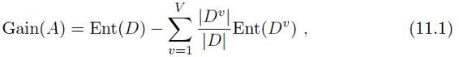

假设每个属性有v个可取值，则V=v\|A\|，这可能是一个很大的值，因此实践中通常是从子集搜索过程中前一轮属性子集的评价值出发来进行计算。

参见（4.2.1 信息增益）。

其中信息熵定义为

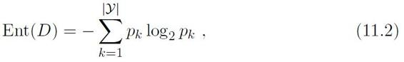

信息增益Gain（A）越大，意味着特征子集A包含的有助于分类的信息越多。于是，对每个候选特征子集，我们可基于训练数据集D来计算其信息增益，以此作为评价准则。

更一般的，特征子集D实际上确定了对数据集A的一个划分，每个划分区域对应着A上的一个取值，而样本标记信息Y则对应着对D的真实划分，通过估算这两个划分的差异，就能对A进行评价。与Y对应的划分的差异越小，则说明A越好。信息熵仅是判断这个差异的一种途径，其他能判断两个划分差异的机制都能用于特征子集评价。

许多“多样性度量”，如不合度量、相关系数等，稍加调整即可用于特征子集评价，参见（8.5.2 多样性度量）。

将特征子集搜索机制与子集评价机制相结合，即可得到特征选择方法。例如将前向搜索与信息熵相结合，这显然与决策树算法非常相似。事实上，决策树可用于特征选择，树结点的划分属性所组成的集合就是选择出的特征子集。其他的特征选择方法未必像决策树特征选择这么明显，但它们在本质上都是显式或隐式地结合了某种（或多种）子集搜索机制和子集评价机制。

常见的特征选择方法大致可分为三类：过滤式（filter）、包裹式（wrapper）和嵌入式（embedding）。

## 11.2 过滤式选择

过滤式方法先对数据集进行特征选择，然后再训练学习器，特征选择过程与后续学习器无关。这相当于先用特征选择过程对初始特征进行“过滤”，再用过滤后的特征来训练模型。

Relief （Relevant Features） \[Kira and Rendell，1992\] 是一种著名的过滤式特征选择方法，该方法设计了一个“相关统计量”来度量特征的重要性。该统计量是一个向量，其每个分量分别对应于一个初始特征，而特征子集的重要性则是由子集中每个特征所对应的相关统计量分量之和来决定。于是，最终只需指定一个阈值T，然后选择比T大的相关统计量分量所对应的特征即可; 也可指定欲选取的特征个数k，然后选择相关统计量分量最大的K个特征。

显然，Relief的关键是如何确定相关统计量。给定训练集{x1，y1），（x2，y2），...，（xm，ym）}，对个示例xi，Relief 先在xi的同类样本中寻找其最近邻xi，nh，称为“猜中近邻”（near-hit），再从xi的异类样本中寻找其最近邻xi，nh，称为“猜错近邻”（near-miss），然后，相关统计量对应于属性j的分量为

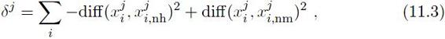

其中x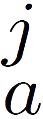表示样本xa在属性j上的取值，diff（x，x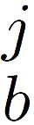）取决于属性j的类型：若属性j为离散型，则x=x时diff（x，x）=0，否则为1; 若属性j为连续型，则diff（x，x）=\|diff（x-x）\|注意x，x已规范化到\[0，1\]区间。

Relief中相关统计量的计算已隐然具有距离度量学习的意味。距离度量学习参见（10.6 度量学习）。

从式（11.3）可看出，若xi与其猜中近邻xi，nh 在属性j上的距离小于xi与其猜错近邻xi，nm的距离，则说明属性j对区分同类与异类样本是有益的，于是增大属性j所对应的统计量分量; 反之，若xi与其猜中近邻xi，nh在属性j上的距离大于xi与其猜错近邻xi，nm的距离，则说明属性j起负面作用，于是减小属性j所对应的统计量分量。最后，对基于不同样本得到的估计结果进行平均，就得到各属性的相关统计量分量，分量值越大，则对应属性的分类能力就越强。

式（11.3）中的i指出了用于平均的样本下标。实际上Relief只需在数据集的采样上而不必在整个数据集上估计相关统计量\[Kira and Rendell，1992\]。显然，Relief的时间开销随采样次数以及原始特征数线性增长，因此是一个运行效率很高的过滤式特征选择算法。

Relief 是为二分类问题设计的，其扩展变体Relief-F \[Kononenko，1994\] 能处理多分类问题。假定数据集D中的样本来自\|y\| 个类别。对示例xi，若它属于第k类（k∈ {1，2，...，\|y\|}，则Relief-F 先在第k类的样本中寻找xi的最近邻示例xi，nh并将其作为猜中近邻，然后在第k类之外的每个类中找到一个xi的最近邻示例作为猜错近邻，记为xi，l，nm （l=1，2，...，\|y\|; l≠k）。于是，相关统计量对应于属性j的分量为

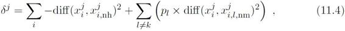

其中pl为第l类样本在数据集D中所占的比例。

## 11.3包裹式选择

与过滤式特征选择不考虑后续学习器不同，包裹式特征选择直接把最终将要使用的学习器的性能作为特征子集的评价准则。换言之，包裹式特征选择的目的就是为给定学习器选择最有利于其性能、“量身定做”的特征子集。

一般而言，由于包裹式特征选择方法直接针对给定学习器进行优化，因此从最终学习器性能来看，包裹式特征选择比过滤式特征选择更好，但另一方面，由于在特征选择过程中需多次训练学习器，因此包裹式特征选择的计算开销通常比过滤式特征选择大得多。

拉斯维加斯方法和蒙特卡罗方法是两个以著名赌城名字命名的随机化方法.两者的主要区别是：若有时间限制，则拉斯维加斯方法或者给出满足要求的解，或者不给出解，而蒙特卡罗方法一定会给出解，虽然给出的解未必满足要求; 若无时间限制，则两者都能给出满足要求的解。

LVW （Las Vegas Wrapper） \[Liu and Setiono，1996\] 是一个典型的包裹式特征选择方法。它在拉斯维加斯方法（Las Vegas method）框架下使用随机策略来进行子集搜索，并以最终分类器的误差为特征子集评价准则。算法描述如图11.1所示。

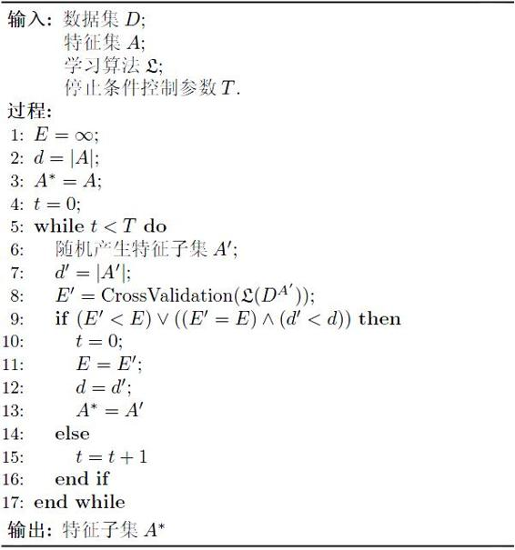

图11.1 LVW算法描述

初始化。

在特征子集A'上通过交叉验证估计学习器误差。

若连续T轮未更新则算法停止。

图11.1 算法第8 行是通过在数据集D上，使用交叉验证法来估计学习器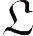的误差，注意这个误差是在仅考虑特征子集A′ 时得到的，即特征子集A′ 上的误差，若它比当前特征子集A上的误差更小，或误差相当但A′中包含的特征数更少，则将A′保留下来。

需注意的是，由于LVW算法中特征子集搜索采用了随机策略，而每次特征子集评价都需训练学习器，计算开销很大，因此算法设置了停止条件控制参数T。然而，整个LVW 算法是基于拉斯维加斯方法框架，若初始特征数很多（即\|A\| 很大）、T设置较大，则算法可能运行很长时间都达不到停止条件。换言之，若有运行时间限制，则有可能给不出解。

## 11.4 嵌入式选择与L1正则化

在过滤式和包裹式特征选择方法中，特征选择过程与学习器训练过程有明显的分别; 与此不同，嵌入式特征选择是将特征选择过程与学习器训练过程融为一体，两者在同一个优化过程中完成，即在学习器训练过程中自动地进行了特征选择。

给定数据集D={（x1，y1），（x2，y2），...，（xm，ym）}，其中x∈Rd，y∈R。我们考虑最简单的线性回归模型，以平方误差为损失函数，则优化目标为

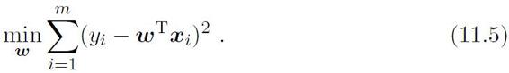

正则化参见（6.4 软间隔与正则化）。

当样本特征很多，而样本数相对较少时，式（11.5）很容易陷入过拟合。为了缓解过拟合问题，可对式（11.5） 引入正则化项。若使用L2 范数正则化，则有

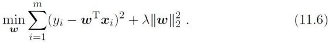

岭回归最初由A。Tikhonov 在1943 年发表于《苏联科学院院刊》，因此亦称“Tikhonov 回归”，而L2 正则化亦称“Tikhonov正则化”。

其中正则化参数λ\> 0。式（11.6）称为“岭回归”（ridge regression） \[Tikhonov and Arsenin，1977\]，通过引入L2 范数正则化，确能显著降低过拟合的风险。

那么，能否将正则化项中的L2 范数替换为Lp 范数呢？ 答案是肯定的。若令p=1，即采用L1范数，则有

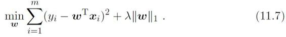

直译为“最小绝对收缩选择算子”，由于比较拗口，因此一般直接称LASSO。

其中正则化参数λ\> 0。式（11.7）称为LASSO （Least Absolute Shrinkage and Selection Operator） \[Tibshirani，1996\]）。

L1 范数和L2 范数正则化都有助于降低过拟合风险，但前者还会带来一个额外的好处：它比后者更易于获得“稀疏”（sparse）解，即它求得的w会有更少的非零分量。

事实上，对w施加“稀疏约束”（即希望w的非零分量尽可能少） 最自然的是使用L0 范数，但L0范数不连续，难以优化求解，因此常使用L1 范数来近似。

为了理解这一点，我们来看一个直观的例子：假定x仅有两个属性，于是无论式（11.6）还是（11.7）解出的w都只有两个分量，即w1，w2，我们将其作为两个坐标轴，然后在图中绘制出式（11.6）与（11.7）的第一项的“等值线”，即在（w1，w2） 空间中平方误差项取值相同的点的连线，再分别绘制出L1 范数与L2范数的等值线，即在（w1，w2） 空间中L1 范数取值相同的点的连线，以及L2 范数取值相同的点的连线，如图11.2所示。式（11.6） 与（11.7）的解要在平方误差项与正则化项之间折中，即出现在图中平方误差项等值线与正则化项等值线相交处。由图11.2可看出，采用L1 范数时平方误差项等值线与正则化项等值线的交点常出现在坐标轴上，即w1或w2为0，而在采用L2 范数时，两者的交点常出现在某个象限中，即w1 或w2 均非0; 换言之，采用L1 范数比L2 范数更易于得到稀疏解。

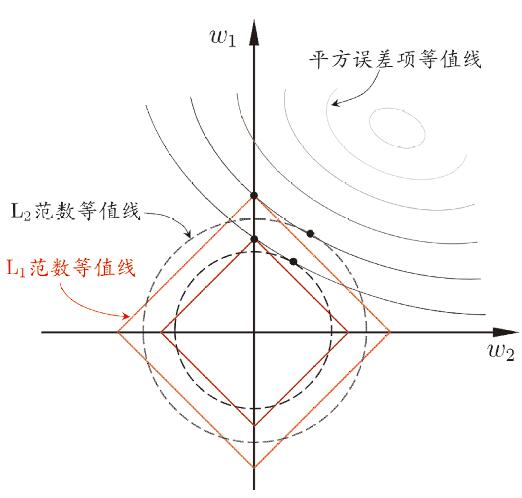

图11.2 L1 正则化比L2 正则化更易于得到稀疏解

即选择出对应于w之非零分量的特征。

注意到w取得稀疏解意味着初始的d个特征中仅有对应着w的非零分量的特征才会出现在最终模型中，于是，求解L1 范数正则化的结果是得到了仅采用一部分初始特征的模型;换言之，基于L1 正则化的学习方法就是一种嵌入式特征选择方法，其特征选择过程与学习器训练过程融为一体，同时完成。

L1 正则化问题的求解可使用近端梯度下降（Proximal Gradient Descent，简称PGD） \[Combettes and Wajs，2005\]。具体来说，令∇ 表示微分算子，对优化目标

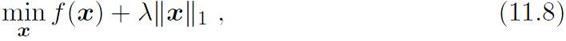

若f（x）可导，且∇f满足L-Lipschitz 条件，即存在常数L\> 0 使得

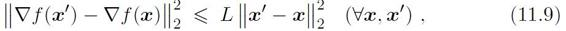

则在XK附近可将f（X） 通过二阶泰勒展式近似为

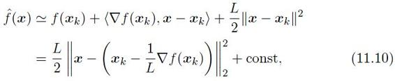

其中const 是与X无关的常数，〈·，·〉表示内积。显然，式（11.10）的最小值在如下xk+1 获得：

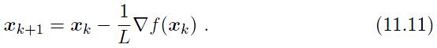

于是，若通过梯度下降法对f（x） 进行最小化，则每一步梯度下降迭代实际上等价于最小化二次函数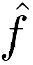。将这个思想推广到式（11.8），则能类似地得到其每一步迭代应为

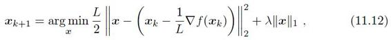

即在每一步对f（x）进行梯度下降迭代的同时考虑L1 范数最小化。

对于式（11.12），可先计算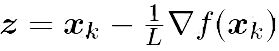，然后求解

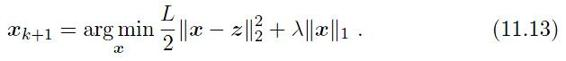

令xi表示x的第i个分量，将式（11.13）按分量展开可看出，其中不存在xixj（i ̸=j） 这样的 项，即x的各分量互不影响，于是式（11.13）有闭式解

习题11.8。

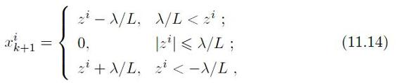

其中x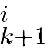与zi分别是xk+1 与z的第i个分量。因此，通过PGD能使LASSO和其他基于L1 范数最小化的方法得以快速求解。

## 11.5 稀疏表示与字典学习

不妨把数据集D考虑成一个矩阵，其每行对应于一个样本，每列对应于一个特征。特征选择所考虑的问题是特征具有“稀疏性”，即矩阵中的许多列与当前学习任务无关，通过特征选择去除这些列，则学习器训练过程仅需在较小的矩阵上进行，学习任务的难度可能有所降低，涉及的计算和存储开销会减少，学得模型的可解释性也会提高。

模型涉及的输入因素减少了，模型所建立的“输入-输出”关系会更清晰。

这里为了用汉语来举例说明，我们回避了分词问题，仅谈论汉字。

现在我们来考虑另一种稀疏性：D所对应的矩阵中存在很多零元素，但这些零元素并不是以整列、整行形式存在的。在不少现实应用中我们会遇到这样的情形，例如在文档分类任务中，通常将每个文档看作一个样本，每个字（词）作为一个特征，字（词）在文档中出现的频率或次数作为特征的取值; 换言之，D所对应的矩阵的每行是一个文档，每列是一个字（词），行、列交汇处就是某字（词）在某文档中出现的频率或次数。那么，这个矩阵有多少列呢？ 以汉语为例，《康熙字典》中有47035 个汉字，这意味着该矩阵可有4 万多列，即便仅考虑《现代汉语常用字表》中的汉字，该矩阵也有3500 列。然而，给定一个文档，相当多的字是不出现在这个文档中的，于是矩阵的每一行都有大量的零元素;对不同的文档，零元素出现的列往往很不相同。

参见（6.3 核函数）和（12.4 VC维）。

当样本具有这样的稀疏表达形式时，对学习任务来说会有不少好处，例如线性支持向量机之所以能在文本数据上有很好的性能，恰是由于文本数据在使用上述的字频表示后具有高度的稀疏性，使大多数问题变得线性可分。同时，稀疏样本并不会造成存储上的巨大负担，因为稀疏矩阵已有很多高效的存储方法。

那么，若给定数据集D是稠密的，即普通非稀疏数据，能否将其转化为“稀疏表示”（sparse representation） 形式，从而享有稀疏性所带来的好处呢？需注意的是，我们所希望的稀疏表示是“恰当稀疏”，而不是“过度稀疏”。仍以汉语文档为例，基于《现代汉语常用字表》得到的可能是恰当稀疏，即其稀疏性足以让学习任务变得简单可行; 而基于《康熙字典》则可能是过度稀疏，与前者相比，也许并未给学习任务带来更多的好处。

字典亦称“码书”（codebook）。

字典学习亦称“码书学习” （codebook learning）。

显然，在一般的学习任务中（例如图像分类）并没有《现代汉语常用字表》可用，我们需学习出这样一个“字典”。为普通稠密表达的样本找到合适的字典，将样本转化为合适的稀疏表示形式，从而使学习任务得以简化，模型复杂度得以降低，通常称为“字典学习”（dictionary learning），亦称“稀疏编码”（sparse coding）。这两个称谓稍有差别，“字典学习”更侧重于学得字典的过程，而“稀疏编码”则更侧重于对样本进行稀疏表达的过程。由于两者通常是在同一个优化求解过程中完成的，因此下面我们不做进一步区分，笼统地称为字典学习。

给定数据集{x1，x2，...，xm}，字典学习最简单的形式为

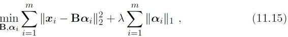

其中B∈Rd×k为字典矩阵，k称为字典的词汇量，通常由用户指定，ai∈Rk则是样本xi∈Rd的稀疏表示。显然，式（11.15）的第一项是希望由ai能很好地重构xi，第二项则是希望ai尽量稀疏。

与LASSO 相比，式（11.15）显然麻烦得多，因为除了类似于式（11.7）中w的ai，还需学习字典矩阵B。不过，受LASSO的启发，我们可采用变量交替优化的策略来求解式（11.15）。

首先在第一步，我们固定住字典B，若将式（11.15）按分量展开，可看出其中不涉及a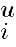a（u ̸=v） 这样的交叉项，于是可参照LASSO的解法求解下式，从而为每个样本xi找到相应的ai：

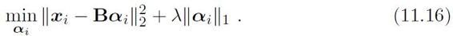

在第二步，我们以ai为初值来更新字典B，此时可将式（11.15）写为

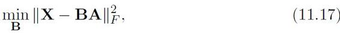

其中X=（x1，x2，...，xm） ∈ Rd×m，A=（a1，a2，...，am） ∈ Rk×m，‖·‖F是矩阵的Frobenius 范数。式（11.17）有多种求解方法，常用的有基于逐列更新策略的KSVD \[Aharon et al.，2006\]。令bi表示字典矩阵B的第i列，ai表示稀疏矩阵A的第i行，式（11.17）可重写为

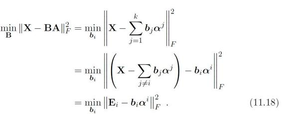

在更新字典的第i列时，其他各列都是固定的，因此Ei=X−Σj≠i bjαj是固定的，于是最小化式（11.18）原则上只需对Ei进行奇异值分解以取得最大奇异值所对应的正交向量。然而，直接对Ei 进行奇异值分解会同时修改bi和αi，从而可能破坏A的稀疏性。为避免发生这种情况，KSVD 对Ei和αi进行专门处理：αi仅保留非零元素，Ei则仅保留bi与αi的非零元素的乘积项，然后再进行奇异值分解，这样就保持了第一步所得到的稀疏性。

初始化字典矩阵B 之后反复迭代上述两步，最终即可求得字典B 和样本xi的稀疏表示αi。在上述字典学习过程中，用户能通过设置词汇量k的大小来控制字典的规模，从而影响到稀疏程度。

## 11.6 压缩感知

奈奎斯特采样定理提供了信号恢复的充分条件而非必要条件。

亦称compressive sensing。

在现实任务中，我们常希望根据部分信息来恢复全部信息。例如在数据通讯中要将模拟信号转换为数字信号，根据奈奎斯特（Nyquist） 采样定理，令采样频率达到模拟信号最高频率的两倍，则采样后的数字信号就保留了模拟信号的全部信息; 换言之，由此获得的数字信号能精确重构原模拟信号。然而，为了便于传输、存储，在实践中人们通常对采样的数字信号进行压缩，这有可能损失一些信息，而在信号传输过程中，由于信道出现丢包等问题，又可能损失部分信息。那么，接收方基于收到的信号，能否精确地重构出原信号呢？ 压缩感知（compressed sensing） \[Donoho，2006; Cand\`es et al.，2006\]为解决此类问题提供了新的思路。

y亦称“测量值”。

假定有长度为m的离散信号x，不妨假定我们以远小于奈奎斯特采样定理要求的采样率进行采样，得到长度为n的采样后信号y，n≪ m，即

y=Φx，　（11.19）

其中Φ ∈ Rn×m是对信号x的测量矩阵，它确定了以什么频率进行采样以及如何将采样样本组成采样后的信号。

在已知离散信号x和测量矩阵Φ 时要得到测量值y很容易，然而，若将测量值和测量矩阵传输出去，接收方能还原出原始信号x吗？

一般来说，答案是“No”，这是由于n≪m，因此y，x，Φ 组成的式（11.19）是一个欠定方程，无法轻易求出数值解。

假定x本身不是稀疏的。

现在不妨假设存在某个线性变换Ψ∈ Rm×m，使得x可表示为Ψs，于是y可表示为

y=ΦΨs=As，　（11.20）

其中A=ΦΨ ∈ Rn×m。于是，若能根据y恢复出s，则可通过x=Ψs来恢复出信号x。

粗看起来式（11.20）没有解决任何问题，因为式（11.20）中恢复信号s这个逆问题仍是欠定的。然而有趣的是，若s具有稀疏性，则这个问题竟能很好地得以解决！ 这是因为稀疏性使得未知因素的影响大为减少。此时式（11.20）中的Ψ称为稀疏基，而A的作用则类似于字典，能将信号转换为稀疏表示。

事实上，在很多应用中均可获得具有稀疏性的s，例如图像或声音的数字信号通常在时域上不具有稀疏性，但经过傅里叶变换、余弦变换、小波变换等处理后却会转化为频域上的稀疏信号。

显然，与特征选择、稀疏表示不同，压缩感知关注的是如何利用信号本身所具有的稀疏性，从部分观测样本中恢复原信号。通常认为，压缩感知分为“感知测量”和“重构恢复”这两个阶段。“感知测量”关注如何对原始信号进行处理以获得稀疏样本表示，这方面的内容涉及傅里叶变换、小波变换以及11.5节介绍的字典学习、稀疏编码等，不少技术在压缩感知提出之前就已在信号处理等领域有很多研究; “重构恢复”关注的是如何基于稀疏性从少量观测中恢复原信号，这是压缩感知的精髓，当我们谈到压缩感知时，通常是指该部分。

压缩感知的相关理论比较复杂，下面仅简要介绍一下“限定等距性”（Restricted Isometry Property，简称RIP） \[Cand\`es，2008\]。

对大小为n×m（n ≪m）的矩阵A，若存在常数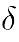∈（0，1）使得对于任意向量s和A的所有子矩阵Ak∈ Rn×k有

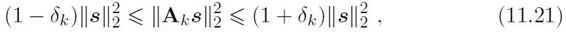

则称A 满足k限定等距性（k-RIP）。此时可通过下面的优化问题近乎完美地从y中恢复出稀疏信号s，进而恢复出x：

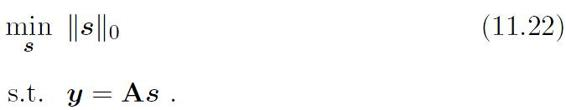

然而，式（11.22）涉及L0 范数最小化，这是个NP难问题。值得庆幸的是，L1范数最小化在一定条件下与L0 范数最小化问题共解\[Candès et al.，2006\]，于是实际上只需关注

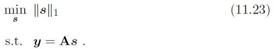

这样，压缩感知问题就可通过L1 范数最小化问题求解，例如式（11.23）可转化为LASSO的等价形式再通过近端梯度下降法求解，即使用“基寻踪去噪”（Basis Pursuit De-Noising） \[Chen et al.，1998\]。

这是一个典型的“协同过滤”（collaborative filtering）任务。

基于部分信息来恢复全部信息的技术在许多现实任务中有重要应用。例如网上书店通过收集读者在网上对书的评价，可根据读者的读书偏好来进行新书推荐，从而达到定向广告投放的效果。显然，没有哪位读者读过所有的书，也没有哪本书被所有读者读过，因此，网上书店所搜集到的仅有部分信息。例如表11.1 给出了四位读者的网上评价信息，这里评价信息经过处理，形成了“喜好程度”评分（5 分最高）。由于读者仅对读过的书给出评价，因此表中出现了很多未知项“？”。

表11.1 客户对书的喜好程度评分

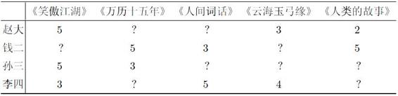

那么，能否将表11.1中通过读者评价得到的数据当作部分信号，基于压缩感知的思想恢复出完整信号呢？

我们知道，能通过压缩感知技术恢复欠采样信号的前提条件之一是信号有稀疏表示。读书喜好数据是否存在稀疏表示呢？ 答案是肯定的。一般情形下，读者对书籍的评价取决于题材、作者、装帧等多种因素，为简化讨论，假定表11.1中的读者喜好评分仅与题材有关。《笑傲江湖》和《云海玉弓缘》是武侠小说，《万历十五年》和《人类的故事》是历史读物，《人间词话》属于诗词文学。一般来说，相似题材的书籍会有相似的读者，若能将书籍按题材归类，则题材总数必然远远少于书籍总数，因此从题材的角度来看，表11.1中反映出的信号应该是稀疏的。于是，应能通过类似压缩感知的思想加以处理。

亦称“低秩矩阵恢复”。

矩阵补全 （matrix completion） 技术 \[Cand\`es and Recht，2009\]可用于解决这个问题，其形式为

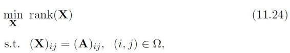

其中，X 表示需恢复的稀疏信号; rank（X） 表示矩阵X的秩; A 是如表11.1的读者评分矩阵这样的已观测信号; Ω 是A中非“？”元素（A）ij的下标（i，j）的集合。式（11.24）的约束项明确指出，恢复出的矩阵中（X）ij应当与已观测到的对应元素相同。

核范数亦称“迹范数”（trace norm）。

与式（11.22）相似，式（11.24）也是一个NP 难问题。注意到rank（X） 在集合{X ∈ Rm×n ：‖X‖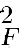1}上的凸包是X的“核范数”（nuclear norm） ：

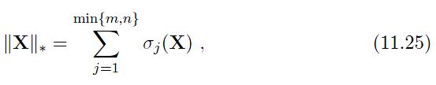

其中σj（X） 表示X的奇异值，即矩阵的核范数为矩阵的奇异值之和，于是可通过最小化矩阵核范数来近似求解式（11.24），即

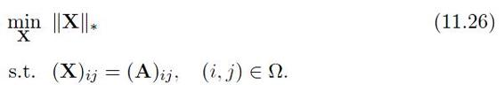

SDP 参见 （附录B.3 半正定规划）。

式（11.26）是一个凸优化问题，可通过半正定规划（Semi-Definite Programming，SDP）求解。理论研究表明，在满足一定条件时，若A的秩为r，n≪m，则只需观察到o（mr log2m） 个元素就能完美恢复出A \[Recht，2011\]。

## 11.7 阅读材料

特征选择是机器学习中研究最早的分支领域之一，早期研究主要是按特征子集“生成与搜索-评价”过程进行。在子集生成与搜索方面引入了很多人工智能搜索技术，如分支限界法\[Narendra and Fukunaga，1977\]、浮动搜索法\[Pudil et al.，1994\] 等; 在子集评价方面则采用了很多源于信息论的准则，如信息熵、AIC （Akaike Information Criterion） \[Akaike，1974\] 等。\[Blum and Langley，1997\] 对子集评价准则进行了讨论，\[Forman，2003\] 则进行了很多实验 比较。

早期特征选择方法主要是过滤式的，包裹式方法出现稍晚\[Kohavi and John，1997\]，嵌入式方法事实上更晚\[Weston et al.，2003\]，但由于决策树算法在构建树的同时也可看作进行了特征选择，因此嵌入式方法也可追溯到ID3\[Quinlan，1986\]。有很多文献对特征选择方法的性能进行了实验比较\[Yang and Pederson，1997; Jain and Zongker，1997\]。更多关于特征选择的内容可参阅\[Guyon and Elisseeff，2003; Liu et al.，2010\]，以及专门关于特征选择的书籍\[Liu and Motoda，1998，2007\]。

直译为“最小角回归”，通常直接称LARS 。

LARS （Least Angle RegresSion） \[Efron et al.，2004\]是一种嵌入式特征选择方法，它基于线性回归平方误差最小化，每次选择一个与残差相关性最大的特征。LASSO \[Tibshirani，1996\]可通过对LARS 稍加修改而实现。在LASSO 基础上进一步发展出考虑特征分组结构的Group LASSO \[Yuan and Lin，2006\]、考虑特征序结构的Fused LASSO \[Tibshirani et al.，2005\] 等变体.由于凸性不严格，LASSO 类方法可能产生多个解，该问题通过弹性网（Elastic Net）得以解决\[Zou and Hastie，2005\]。

仍以汉语文档为例，一个概念可能由多个字词来表达，这些字词就构成了一个分组; 若这个概念在文档中没有出现，则这整个分组所对应的变量都将为零。

对字典学习与稀疏编码\[Aharon et al.，2006\]，除了通过控制字典规模从而影响稀疏性，有时还希望控制字典的“结构”，例如假设字典具有“分组结构”，即同一个分组内的变量或同为非零，或同为零。这样的性质称为“分组稀疏性”（group sparsity），相应的稀疏编码方法则称为分组稀疏编码（group sparse coding） \[Bengio et al.，2009\]。稀疏编码和分组稀疏编码在图像特征抽取方面有很多应用，可参阅\[Mairal et al.，2008; Wang et al.，2010\]。

压缩感知\[Donoho，2006; Cand\`es et al.，2006\] 直接催生了人脸识别的鲁棒主成分分析\[Cand\`es et al.，2011\] 和基于矩阵补全的协同过滤\[Recht et al.，2010\]。\[Baraniuk，2007\] 是关于压缩感知的一个简短介绍。将L0 范数最小化转化为L1 范数最小化后，常用求解方法除了转化为LASSO的基寻踪去噪，还可使用基寻踪（Basis Pursuit） \[Chen et al.，1998\]、匹配寻踪（Matching Pursuit ）\[Mallat and Zhang，1993\] 等。\[Liu and Ye，2009\] 使用投影法快速求解稀疏学习问题，并提供了一个稀疏学习程序包SLEP（http：//www.yelab.net/software/SLEP/）。

## 习题

西瓜数据集3.0 见（表4.3 西瓜数据集3.0）。

11.1 试编程实现Relief 算法，并考察其在西瓜数据集3.0 上的运行结果。

11.2 试写出Relief-F的算法描述。

11.3 Relief 算法是分别考察每个属性的重要性。试设计一个能考虑每一对属性重要性的改进算法。

11.4 试为LVW设计一个改进算法，即便有运行时间限制，该算法也一定能给出解。

11.5 结合图11.2，试举例说明L1 正则化在何种情形下不能产生稀疏解。

11.6 试析岭回归与支持向量机的联系。

11.7 试述直接求解L0 范数正则化会遇到的困难。

11.8 试给出求解L1 范数最小化问题中的闭式解（11.14）的详细推导过程。

11.9 试述字典学习与压缩感知对稀疏性利用的异同。

11.10\* 试改进式（11.15），以学习出具有分组稀疏性的字典。

## 参考文献

Aharon,M.,M.Elad,and A.Bruckstein.（2006）.“K-SVD：An algorithm for designing overcomplete dictionaries for sparse representation.” *IEEE Transactions on Image Processing,* 54（11）：4311–4322。

Akaike,H.（1974）.“A new look at the statistical model identification.” *IEEE Transactions on Automatic Control*,19（6）：716–723。

Baraniuk,R.G.（2007）.“Compressive sensing.” *IEEE Signal Processing Magazine,*24（4）：118–121。

Bengio,S.,F.Pereira,Y.Singer,and D.Strelow.（2009）.“Group sparse coding.”In *Advances in Neural Information Processing Systems 22 （NIPS）* （Y.Bengio,D.Schuurmans,J.D.Lafferty,C.K.I.Williams,and A.Culotta,eds.）,82–89,MIT Press,Cambridge,MA。

Blum,A.and P.Langley.（1997）.“Selection of relevant features and examples in machine learning.” *Artificial Intelligence*,97（1-2）：245–271。

Boyd,S.and L.Vandenberghe.（2004）.*Convex Optimization.* Cambridge University Press,Cambridge,UK。

Cand\`es,E.J.（2008）.“The restricted isometry property and its implications for compressed sensing.” *Comptes Rendus Mathematique*,346（9-10）：589–592。

Cand\`es,E.J.,X.Li,Y.Ma,and J.Wright.（2011）.“Robust principal component analysis？” *Journal of the ACM*,58（3）：Article 11。

Candès,E.J.and B.Recht.（2009）.“Exact matrix completion via convex optimization.”*Foundations of Computational Mathematics*,9（6）：717–772。

Cand\`es,E.J.,J.Romberg,and T.Tao.（2006）.“Robust uncertainty principles：Exact signal reconstruction from highly incomplete frequency information.”*IEEE Transactions on Information Theory,* 52（2）：489–509。

Chen,S.S.,D.L.Donoho,and M.A.Saunders.（1998）.“Atomic decomposition by basis pursuit.” *SIAM Journal on Scientific Computing,* 20（1）：33–61。

Combettes,P.L.and V.R.Wajs.（2005）.“Signal recovery by proximal forwardbackward splitting.” Mutiscale *Modeling & Simulation,* 4（4）：1168–1200。

Donoho,D.L.（2006）.“Compressed sensing.” *IEEE Transactions on Information Theory,* 52（4）：1289–1306。

Efron,B.,T.Hastie,I.Johnstone,and R.Tibshirani.（2004）.“Least angle regression.” *Annals of Statistics*,32（2）：407–499。

Forman,G.（2003）.“An extensive empirical study of feature selection metrics for text classification.” *Journal of Machine Learning Research,* 3：1289–1305。

Guyon,I.and A.Elisseeff.（2003）.“An introduction to variable and feature selection.” *Journal of Machine Learning Research,* 3：1157–1182。

Jain,A.and D.Zongker.（1997）.“Feature selection：Evaluation,application,and small sample performance.” *IEEE Transactions on Pattern Analysis and Machine Intelligence,* 19（2）：153–158。

Kira,K.and L.A.Rendell.（1992）.“The feature selection problem：Traditional methods and a new algorithm.” In *Proceedings of the 10th National Conference on Artificial Intelligence* （AAAI）,129–134,San Jose,CA。

Kohavi,R.and G.H.John.（1997）.“Wrappers for feature subset selection.”*Artificial Intelligence,* 97（1-2）：273–324。

Kononenko,I.（1994）.“Estimating attributes：Analysis and extensions of RELIEF.” *In Proceedings of the 7th European Conference on Machine Learning （ECML）,* 171–182,Catania,Italy。

Liu,H.and H.Motoda.（1998）.*Feature Selection for Knowledge Discovery and Data Mining.* Kluwer,Boston,MA。

Liu,H.and H.Motoda.（2007）.*Computational Methods of Feature Selection.*Chapman & Hall/CRC,Boca Raton,FL。

Liu,H.,H.Motoda,R.Setiono,and Z.Zhao.（2010）.“Feature selection：An ever evolving frontier in data mining.” In *Proceedings of the 4th Workshop on Feature Selection in Data Mining （FSDM）,* 4–13,Hyderabad,India。

Liu,H.and R.Setiono.（1996）.“Feature selection and classification — a probabilistic wrapper approach.” In *Proceedings of the 9th International Conference on Industrial and Engineering Applications of Artificial Intelligence and Expert Systems （IEA/AIE）*,419–424,Fukuoka,Japan。

Liu,J.and J.Ye.（2009）.“Efficient Euclidean projections in linear time.”*In Proceedings of the 26th International Conference on Machine Learning（ICML）,* 657–664,Montreal,Canada。

Mairal,J.,M.Elad,and G.Sapiro.（2008）.“Sparse representation for color image restoration.” *IEEE Transactions on Image Processing,* 17（1）：53–69。

Mallat,S.G.and Z.F.Zhang.（1993）.“Matching pursuits with time-frequency dictionaries.” *IEEE Transactions on Signal Processing,* 41（12）：3397–3415。

Narendra,P.M.and K.Fukunaga.（1977）.“A branch and bound algorithm for feature subset selection.” *IEEE Transactions on Computers,* C-26（9）：917–922。

Pudil,P.,J.Novoviˇcov´a,and J.Kittler.（1994）.“Floating search methods in feature selection.” *Pattern Recognition Letters*,15（11）：1119–1125。

Quinlan,J.R.（1986）.“Induction of decision trees.” *Machine Learning*,1（1）：81–106。

Recht,B.（2011）.“A simpler approach to matrix completion.” *Journal of Machine Learning Research,* 12：3413–3430。

Recht,B.,M.Fazel,and P.Parrilo.（2010）.“Guaranteed minimum-rank solutions of linear matrix equations via nuclear norm minimization.” *SIAM Review*,52（3）：471–501。

Tibshirani,R.（1996）.“Regression shrinkage and selection via the LASSO.”*Journal of the Royal Statistical Society - Series B,* 58（1）：267–288。

Tibshirani,R.,M.Saunders,S.Rosset,J.Zhu,and K.Knight.（2005）.“Sparsity and smoothness via the fused LASSO.” *Journal of the Royal Statistical Society - Series B*,67（1）：91–108。

Tikhonov,A.N.and V.Y.Arsenin,eds.（1977）.*Solution of Ill-Posed Problems*.Winston,Washington,DC。

Wang,J.,J.Yang,K.Yu,F.Lv,T.Huang,and Y.Gong.（2010）.“Localityconstrained linear coding for image classification.” In *Proceedings of the IEEE Computer Society Conference on Computer Vision and Pattern Recognition（CVPR）,* 3360–3367,San Francisco,CA。

Weston,J.,A.Elisseff,B.Sch¨olkopf,and M.Tipping.（2003）.“Use of the zero norm with linear models and kernel methods.” *Journal of Machine Learning Research,* 3：1439–1461。

Yang,Y.and J.O.Pederson.（1997）.“A comparative study on feature selection in text categorization.” In *Proceedings of the 14th International Conference on Machine Learning （ICML）,* 412–420,Nashville,TN。

Yuan,M.and Y.Lin.（2006）.“Model selection and estimation in regression with grouped variables.” *Journal of the Royal Statistical Society - Series B,* 68（1）：49–67。

Zou,H.and T.Hastie.（2005）.“Regularization and variable selection via the elastic net.” *Journal of the Royal Statistical Society - Series B*,67（2）：301– 320。

## 休息一会儿

### 小故事：蒙特卡罗方法与斯坦尼斯拉夫·乌拉姆

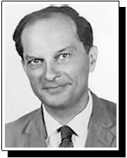

利沃夫（Lviv）在历史上先属于波兰，1867—1918年属于奥匈帝国，第一次世界大战后回归波兰，1939 年划入前苏联的乌克兰，现为乌克兰利沃夫州首府。

冯·诺伊曼和爱德华·泰勒都出生在匈牙利。

斯坦尼斯拉夫·乌拉姆（Stanis law Ulam，1909–1984）是著名的波兰犹太裔数学家，在遍历论、数论、集合论等方面都有重要贡献，“乌拉姆数列”就是以他的名字命名的。

乌拉姆出生于奥匈帝国利沃夫，1933 年在波兰利沃夫理工学院获得数学博士学位，然后于1935 年应冯·诺伊曼的邀请到普林斯顿高等研究院访问，1940 年他在威斯康星大学麦迪逊分校获得教职，翌年加入美国籍。1943 年起他参与“曼哈顿计划”并做出重大贡献; 当前世界上绝大部分核武器所使用的设计方案“泰勒-乌拉姆方案”就是以他和“氢弹之父”爱德华·泰勒的名字命名的。

蒙特卡罗方法的著名代表Metropolis-Hasting算法是以他的名字命名的。

世界上最早的通用电子计算机之一—— ENIAC 在发明后即被用于曼哈顿计划，乌拉姆敏锐地意识到在计算机的帮助下，可通过重复数百次模拟过程的方式来对概率变量进行统计估计。冯·诺伊曼立即认识到这个想法的重要性并给予支持。1947 年乌拉姆提出这种统计方法并用于计算核裂变的连锁反应。由于乌拉姆常说他的叔叔又在蒙特卡罗赌场输钱了，因此他的同事Nicolas Metropolis戏称该方法为“蒙特卡罗”，不料却流传开去。

