# 第12章 计算学习理论

<strong>本章配套视频</strong>

当前这套 56P《机器学习初步》只覆盖教材第 1–9 章，没有本章的对应分 P。此处不强行错配，请以本章原书正文为准。

<a href="https://www.bilibili.com/video/BV1gG411f7zX/" target="_blank" rel="noopener">查看完整视频选集 ↗</a>

## 12.1 基础知识

顾名思义，计算学习理论（computational learning theory）研究的是关于通过“计算”来进行“学习”的理论，即关于机器学习的理论基础，其目的是分析学习任务的困难本质，为学习算法提供理论保证，并根据分析结果指导算法设计。

给定样例集D={（x1，y1），（x2，y2），...，（xm，ym）}，xi∈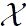，本章主要讨论二分类问题，若无特别说明，yi∈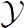={−1，+1}。假设中的所有样本服从一个隐含未知的分布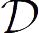，D中所有样本都是独立地从这个分布上采样而得，即独立同分布（independent and identically distributed，简称i.i.d.）样本。

令ℎ为从到的一个映射，其泛化误差为

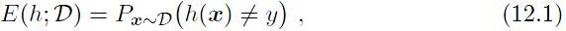

ℎ在d上的经验误差为

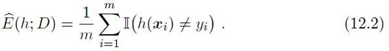

由于D是的独立同分布采样，因此ℎ的经验误差的期望等于其泛化误差。在上下文明确时，我们将E（ℎ;） 和̂︀ 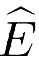（ℎ;d）分别简记为E（ℎ）和（ℎ）。令为E（ℎ）的上限，即E（ℎ）≤; 我们通常用表示预先设定的学得模型所应满足的误差要求，亦称“误差参数”。

本章后面部分将研究经验误差与泛化误差之间的逼近程度。若ℎ 在数据集D上的经验误差为0，则称ℎ与D一致，否则称其与D不一致。对任意两个映射ℎ1，ℎ2 ∈→，可通过其“不合”（disagreement）来度量它们之间的差别：

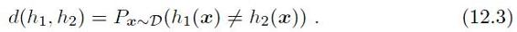

我们会用到几个常用不等式：

• Jensen不等式：对任意凸函数f(x)，有

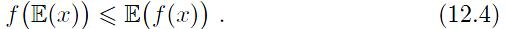

• Hoeffding不等式\[Hoeffding，1963\]：若x1，x2，...，xm为m个独立随机变量，且满足0≤xi≤1，则对任意 \>0，有

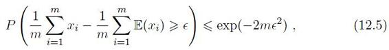

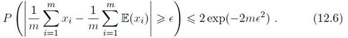

• McDiarmid 不等式\[McDiarmid，1989\]：若x1，x2，...，xm为m个独立随机变量，且对任意1≤i≤m，函数f满足

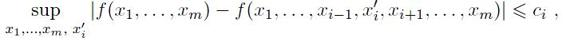

则对任意 \> 0，有

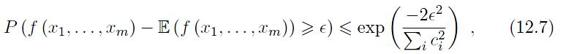

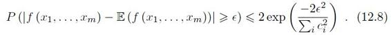

## 12.2 PAC学习

计算学习理论中最基本的是概率近似正确（Probably Approximately Correct，简称PAC）学习理论\[Valiant，1984\]。“概率近似正确”这个名字看起来有点古怪，我们稍后再解释。

令c表示“概念”（concept），这是从样本空间到标记空间的映射，它决定示例x的真实标记y，若对任何样例（x，y） 有c（x）=y成立，则称c为目标概念;所有我们希望学得的目标概念所构成的集合称为“概念类”（concept class），用符号C表示。

学习算法的假设空间不是1.3 节所讨论的学习任务本身对应的假设空间。

给定学习算法，它所考虑的所有可能概念的集合称为“假设空间”（hypothesis space），用符号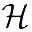表示。由于学习算法事先并不知道概念类的真实存在，因此和C通常是不同的，学习算法会把自认为可能的目标概念集中起来构成，对ℎ ∈ ，由于并不能确定它是否真是目标概念，因此称为“假设”（hypothesis）。显然，假设ℎ也是从样本空间到标记空间的映射。

若目标概念c∈ ，则中存在假设能将所有示例按与真实标记一致的方式完全分开，我们称该问题对学习算法是“可分的”（separable），亦称“一致的”（consistent）; 若c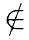，则中不存在任何假设能将所有示例完全正确分开，称该问题对学习算法是“不可分的”（non-separable），亦称“不一致的”（non-consistent）。

参见（1.4 归纳偏好）。

一般来说，训练样例越少，采样偶然性越大。

给定训练集D，我们希望基于学习算法学得的模型所对应的假设ℎ尽可能接近目标概念c。读者可能会问：为什么不是希望精确地学到目标概念c呢？这是由于机器学习过程受到很多因素的制约，例如我们获得的训练集D往往仅包含有限数量的样例，因此，通常会存在一些在D上“等效”的假设，学习算法对它们无法区别; 再如，从分布采样得到D的过程有一定偶然性，可以想象，即便对同样大小的不同训练集，学得结果也可能有所不同。因此，我们是希望以比较大的把握学得比较好的模型，也就是说，以较大的概率学得误差满足预设上限的模型;这就是“概率”“近似正确”的含义。形式化地说，令表示置信度，可定义：

定义12.1 PAC 辨识（PAC Identify）：对0＜，＜1，所有c∈C和分布，若存在学习算法，其输出假设ℎ∈满足

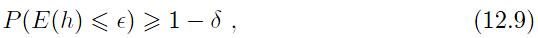

则称学习算法 能从假设空间中PAC辨识概念类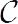。

这样的学习算法能以较大的概率（至少1−）学得目标概念c的近似（误差最多为）。在此基础上可定义：

样例数目m与误差、置信度、数据本身的复杂度size（x）、目标概念的复杂度size（c）都有关。

定义12.2 PAC可学习（PAC Learnable）：令m表示从分布中独立同分布采样得到的样例数目，0＜，＜1，对所有分布，若存在学习算法和多项式函数poly（·，·，·，·），使得对于任何m≥poly（1/，1/，size（x），size（c）），能从假设空间中PAC辨识概念类，则称概念类对假设空间而言是PAC可学习的，有时也简称概念类是PAC可学习的。

对计算机算法来说，必然要考虑时间复杂度，于是：

定义12.3 PAC学习算法（PAC Learning Algorithm）：若学习算法使概念类为PAC可学习的，且的运行时间也是多项式函数poly（1/，1/，size（x），size（c）），则称概念类是高效PAC可学习（efficiently PAC learnable）的，称为概念类C的PAC学习算法。

假定学习算法处理每个样本的时间为常数，则的时间复杂度等价于样本复杂度。于是，我们对算法时间复杂度的关心就转化为对样本复杂度的关心：

定义12.4 样本复杂度（Sample Complexity）：满足PAC学习算法所需的m≥poly（1/，1/，size（x），size（c））中最小的m，称为学习算法的样本复杂度。

显然，PAC学习给出了一个抽象地刻画机器学习能力的框架，基于这个框架能对很多重要问题进行理论探讨，例如研究某任务在什么样的条件下可学得较好的模型？ 某算法在什么样的条件下可进行有效的学习？ 需多少训练样例才能获得较好的模型？

PAC学习中一个关键因素是假设空间的复杂度。包含了学习算法所有可能输出的假设，若在PAC学习中假设空间与概念类完全相同，即=，这称为“恰PAC可学习”（properly PAC learnable）; 直观地看，这意味着学习算法的能力与学习任务“恰好匹配”。然而，这种让所有候选假设都来自概念类的要求看似合理，但却并不实际，因为在现实应用中我们对概念类通常一无所知，更别说获得一个假设空间与概念类恰好相同的学习算法。显然，更重要的是研究假设空间与概念类不同的情形，即≠。一般而言，越大，其包含任意目标概念的可能性越大，但从中找到某个具体目标概念的难度也越大。\|\|有限时，我们称为“有限假设空间”，否则称为“无限假设空间”。

## 12.3 有限假设空间

### 12.3.1可分情形

可分情形意味着目标概念c属于假设空间，即c∈ 。给定包含m个样例的训练集D，如何找出满足误差参数的假设呢？

容易想到一种简单的学习策略：既然D中样例标记都是由目标概念c赋予的，并且c存在于假设空间中，那么，任何在训练集D上出现标记错误的假设肯定不是目标概念c。于是，我们只需保留与D一致的假设，剔除与D不一致的假设即可。若训练集D足够大，则可不断借助D中的样例剔除不一致的假设，直到中仅剩下一个假设为止，这个假设就是目标概念c。通常情形下，由于训练集规模有限，假设空间中可能存在不止一个与D一致的“等效”假设，对这些等效假设，无法根据D来对它们的优劣做进一步区分。

到底需多少样例才能学得目标概念c的有效近似呢？ 对PAC学习来说，只要训练集D的规模能使学习算法以概率1−找到目标假设的近似即可。

我们先估计泛化误差大于但在训练集上仍表现完美的假设出现的概率.假定ℎ的泛化误差大于，对分布上随机采样而得的任何样例（x，y），有

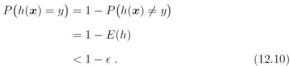

由于D包含M个从独立同分布采样而得的样例，因此，ℎ与D表现一致的概率为

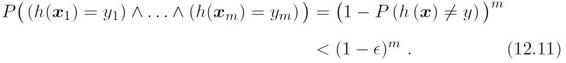

我们事先并不知道学习算法会输出中的哪个假设，但仅需保证泛化误差大于，且在训练集上表现完美的所有假设出现概率之和不大于即可：

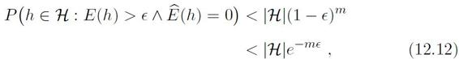

令式（12.12）不大于，即

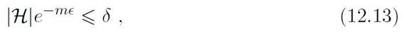

可得

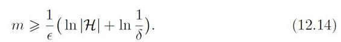

由此可知，有限假设空间都是PAC可学习的，所需的样例数目如式（12.14）所示，输出假设ℎ的泛化误差随样例数目的增多而收敛到0，收敛速率为O（1/m）。

### 12.3.2 不可分情形

对较为困难的学习问题，目标概念c往往不存在于假设空间中。假定对于任何ℎ ∈，（ℎ） ̸=0，也就是说，中的任意一个假设都会在训练集上出现或多或少的错误。由Hoeffding不等式易知：

引理12.1 若训练集D包含m个从分布上独立同分布采样而得的样例，0＜＜1，则对任意ℎ∈，有

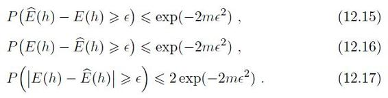

推论12.1 若训练集D包含m个从分布上独立同分布采样而得的样例，0＜＜1，则对任意ℎ∈，式（12.18）以至少1−的概率成立：

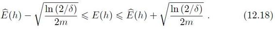

推论12.1表明，样例数目m较大时，ℎ的经验误差是其泛化误差很好的近似。对于有限假设空间，我们有

定理12.1 若为有限假设空间，0＜＜1，则对任意ℎ∈，有

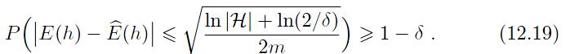

证明令ℎ1，ℎ2，...，ℎ\|\| 表示假设空间中的假设，有

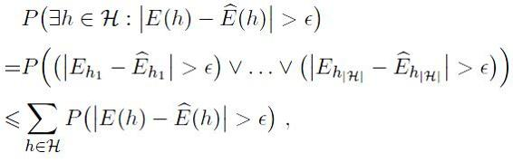

由式（12.17）可得

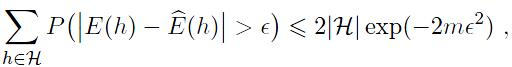

于是，令=2\|\|exp（−2m2）即可得式（12.19）。

即在的所有假设中找出最好的一个。

显然，当c时，学习算法无法学得目标概念c的近似。但是，当假设空间给定时，其中必存在一个泛化误差最小的假设，找出此假设的近似也不失为一个较好的目标。中泛化误差最小的假设是arg minℎ∈E（ℎ），于是，以此为目标可将PAC学习推广到c的情况，这称为“不可知学习”（agnostic learning）。相应的，我们有

定义12.5 不可知PAC可学习（agnostic PAC learnable）：令m表示从分布中独立同分布采样得到的样例数目，0＜，＜1，对所有分布，若存在学习算法和多项式函数poly（·，·，·，·），使得对于任何m≥poly（1/，1/，size（x），size（c）），能从假设空间中输出满足式（12.20）的假设ℎ：

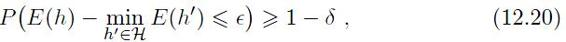

则称假设空间是不可知PAC可学习的。

与PAC可学习类似，若学习算法的运行时间也是多项式函数poly（1/，1/，size（x），size（c）），则称假设空间是高效不可知PAC可学习的，学习算法则称为假设空间的不可知PAC学习算法，满足上述要求的最小m称为学习算法的样本复杂度。

## 12.4 VC维

现实学习任务所面临的通常是无限假设空间，例如实数域中的所有区间、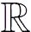d空间中的所有线性超平面。欲对此种情形的可学习性进行研究，需度量假设空间的复杂度。最常见的办法是考虑假设空间的“VC维”（Vapnik-Chervonenkis dimension）\[Vapnik and Chervonenkis，1971\]。

介绍VC维之前，我们先引入几个概念：增长函数（growth function）、对分（dichotomy） 和打散（shattering）。

给定假设空间 和示例集D={x1，x2，...，xm}，中每个假设ℎ都能对D中示例赋予标记，标记结果可表示为

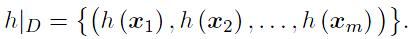

例如，对二分类问题，若D中只有2 个示例，则赋予标记的可能结果只有4种; 若有3 个示例，则可能结果有8种。

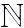为自然数域。

随着m的增大，中所有假设对D中的示例所能赋予标记的可能结果数也会增大。

定义12.6 对所有m∈，假设空间的增长函数Π（m）为

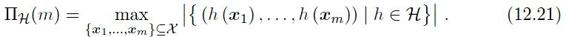

增长函数Π（m）表示假设空间对m个示例所能赋予标记的最大可能结果数。显然，对示例所能赋予标记的可能结果数越大，的表示能力越强，对学习任务的适应能力也越强。因此，增长函数描述了假设空间的表示能力，由此反映出假设空间的复杂度。我们可利用增长函数来估计经验误差与泛化误差之间的关系：

证明过程参阅\[Vapnik and Chervonenkis，1971\]。

定理12.2 对假设空间，m∈，0＜＜1和任意ℎ∈有

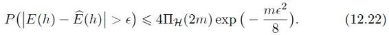

每个假设会把D中示例分为两类，因此称为对分。

假设空间中不同的假设对于D中示例赋予标记的结果可能相同，也可能不同; 尽管可能包含无穷多个假设，但其对D中示例赋予标记的可能结果数是有限的：对m个示例，最多有2m个可能结果。对二分类问题来说，中的假设对D中示例赋予标记的每种可能结果称为对D的一种“对分”。若假设空间能实现示例集D上的所有对分，即Π（m）=2m，则称示例集D能被假设空间“打散”。

现在我们可以正式定义VC维了：

定义12.7 假设空间的VC维是能被打散的最大示例集的大小，即

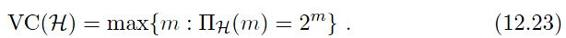

VC（）=d表明存在大小为d的示例集能被假设空间打散。注意：这并不意味着所有大小为d的示例集都能被假设空间打散。细心的读者可能已发现，VC维的定义与数据分布无关！ 因此，在数据分布未知时仍能计算出假设空间的VC维。

通常这样来计算的VC维：若存在大小为d的示例集能被 打散，但不存在任何大小为d+1的示例集能被 打散，则的VC维是d。下面给出两个计算VC维的例子：

例12.1 实数域中的区间\[a，b\]：令表示实数域中所有闭区间构成的集合{ℎ\[a，b\]：a，b∈，a≤ｂ}，=。对x∈，若x∈\[a，b\]，则ℎ\[a，b\]（x）=+1，否则ℎ\[a，b\]（x）=−1。令x1=0.5，x2=1.5，则假设空间中存在假设{ℎ\[0，1\]，ℎ\[0，2\]，ℎ\[1，2\]，ℎ\[2，3\]} 将{x1，x2} 打散，所以假设空间的VC维至少为2;对任意大小为3的示例集{x3，x4，x5}，不妨设x3＜x4＜x5，则中不存在任何假设ℎ\[a，b\] 能实现对分结果{（x3，+），（x4，−），（x5，+）}。于是，的VC维为2。

例12.2 二维实平面上的线性划分：令表示二维实平面上所有线性划分构成的集合，=2。由图12.1可知，存在大小为3的示例集可被 打散，但不存在大小为4的示例集可被打散。于是，二维实平面上所有线性划分构成的假设空间的VC维为3。

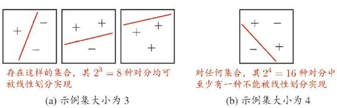

图12.1 二维实平面上所有线性划分构成的假设空间的VC维为3

由定义12.7可知，VC维与增长函数有密切联系，引理12.2 给出了二者之间的定量关系\[Sauer，1972\]：

亦称“Sauer引理”。

引理12.2 若假设空间的VC维为d，则对任意m∈有

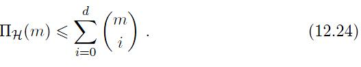

证明　由数学归纳法证明。当m=1，d=0 或d=1时，定理成立.假设定理对（m−1，d−1） 和（m−1，d）成立。令D={x1，x2，...，xm}，D′={x1，x2，..。，xm−1}，

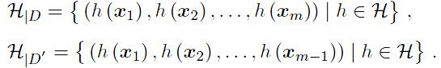

任何假设ℎ ∈  对xm的分类结果或为+1，或为−1，因此任何出现在\|D′中的串都会在\|D中出现一次或两次。令D′\|D表示在\|D中出现两次的\|D′中串组成的集合，即

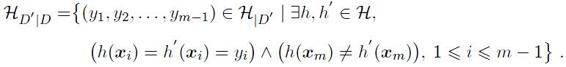

考虑到D′\|D中的串在\|D中出现了两次，但在\|D′中仅出现了一次，有

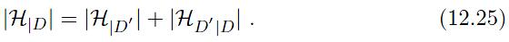

D′的大小为m-1，由假设可得

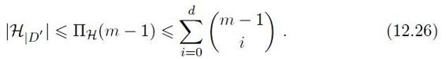

令Q表示能被D′\|D打散的集合，由D'\|D定义可知Q∪ {xm} 必能被\|D打散。由于的VC维为d，因此D′ \|D的VC维最大为d− 1，于是有

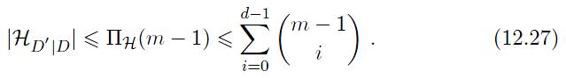

由式（12.25）∼（12.27）可得

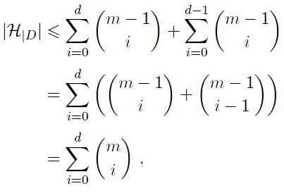

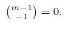

由集合D的任意性，引理12.2得证。

e为自然常数。

从引理12.2可计算出增长函数的上界：

推论12.2 若假设空间的VC维为d，则对任意整数m≥d有

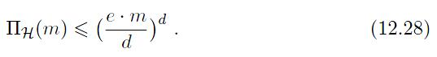

证明

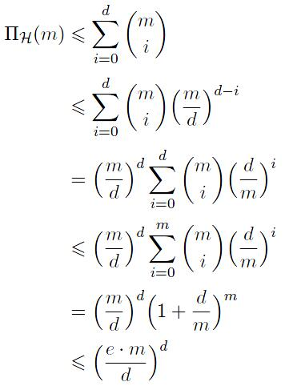

m≥d。

根据推论12.2和定理12.2可得基于VC维的泛化误差界：

定理12.3 若假设空间的VC维为d，则对任意m\>d，0＜＜1 和ℎ ∈  有

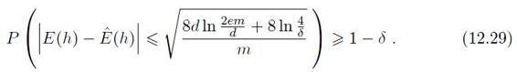

证明　令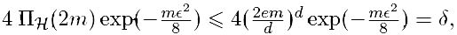解得

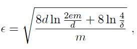

代入定理12.2，于是定理12.3得证。

由定理12.3可知，式（12.29）的泛化误差界只与样例数目m有关，收敛速率为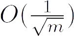，与数据分布和样例集D无关。因此，基于VC维的泛化误差界是分布无关（distribution-free）、数据独立（data-independent）的。

令ℎ表示学习算法输出的假设，若ℎ满足

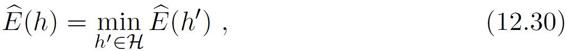

则称为满足经验风险最小化（Empirical Risk Minimization，简称ERM）原则的算法。我们有下面的定理：

定理12.4 任何VC维有限的假设空间 都是（不可知）PAC可学习的。

证明假设为满足经验风险最小化原则的算法，ℎ为学习算法输出的假设。令g表示中具有最小泛化误差的假设，即

令

由推论12.1可知

至少以1 − /2的概率成立。令

则由定理12.3可知

从而可知

以至少1-的概率成立。由式（12.32）和（12.34）可以解出m，再由的任意性可知定理12.4 得证。

## 12.5 Rademacher复杂度

12.4 节提到，基于VC维的泛化误差界是分布无关、数据独立的，也就是说，对任何数据分布都成立。这使得基于VC维的可学习性分析结果具有一定的“普适性”; 但从另一方面来说，由于没有考虑数据自身，基于VC维得到的泛化误差界通常比较“松”，对那些与学习问题的典型情况相差甚远的较“坏”分布来说尤其如此。

这个名字是为了纪念德国数学家H。Rademacher（1892–1969）。

Rademacher 复杂度（Rademacher complexity） 是另一种刻画假设空间复杂度的途径，与VC维不同的是，它在一定程度上考虑了数据分布。

给定训练集D={（x1，y1），（x2，y2），...，（xm，ym）}，假设ℎ的经验误差为

其中体现了预测值ℎ（x1） 与样例真实标记yi之间的一致性，若对于所有i ∈ {1，2，...，m} 都有ℎ（xi）=yi，则取最大值1。也就是说，经验误差最小的假设是

然而，现实任务中样例的标记有时会受到噪声影响，即对某些样例（xi，yi），其yi或许已受到随机因素的影响，不再是xi的真实标记。在此情形下，选择假设空间中在训练集上表现最好的假设，有时还不如选择中事先已考虑了随机噪声影响的假设。

 是无限假设空间，有可能取不到最大值，因此使用上确界代替最大值。

考虑随机变量σi，它以0.5的概率取值−1，0.5的概率取值+1，称为Rademacher 随机变量。基于σi，可将式（12.37）重写为

考虑中的所有假设，对式（12.38）取期望可得

其中σ={σ1，σ2，...，σm}。式（12.39）的取值范围是\[0，1\]，它体现了假设空间的表达能力，例如，当\|\|=1时，中仅有一个假设，这时可计算出式（12.39）的值为0; 当\|\|=2m且能打散D时，对任意σ总有一个假设使得ℎ（xi）=σ1（i=1，2，..．，m），这时可计算出式（12.39）的值为1。

考虑实值函数空间 ：→。令Z={z1，z2，...，zm}，其中zi∈，将式（12.39）中的和 替换为和可得

定义12.8 函数空间 关于Z的经验Rademacher 复杂度

经验Rademacher 复杂度衡量了函数空间与随机噪声在集合Z中的相关性。通常我们希望了解函数空间在上关于分布的相关性，因此，对所有从独立同分布采样而得的大小为m的集合Z求期望可得

定义12.9 函数空间 关于上分布的Rademacher 复杂度

基于Rademacher复杂度可得关于函数空间的泛化误差界\[Mohri et al.，2012\]：

定理12.5 对实值函数空间 ：→ \[0，1\]，根据分布从中独立同分布采样得到示例集Z={z1，z2，...，zm}，zi∈，0＜＜1，对任意f∈ ，以至少1-的概率有

证明 令

同时，令Z'为只与Z有一个示例不同的训练集，不妨设zm∈Z和z′m∈ Z′为不同示例，可得

同理可得

根据McDiarmid不等式（12.7）可知，对任意∈（0，1），

以至少1-的概率成立。下面来估计z\[Φ（Z）\]的上界：

利用Jensen 不等式（12.4） 和上确界函数的凸性。

σi与−σi分布相同。

至此，式（12.42）得证。由定义12.9可知，改变Z中的一个示例对z（）的值所造成的改变最多为1/m。由McDiarmid不等式（12.7）可知，

以至少1 − /2的概率成立。再由式（12.44）可知，

以至少1 − /2的概率成立。于是，

以至少1-的概率成立。至此，式（12.43）得证。

需注意的是，定理12.5中的函数空间 是区间\[0，1\] 上的实值函数，因此定理12.5 只适用于回归问题。对二分类问题，我们有下面的定理：

定理12.6 对假设空间：→ {−1，+1}，根据分布从中独立同分布采样得到示例集D={x1，x2，...，xm}，xi∈，0＜＜1，对任意ℎ∈，以至少1−的概率有

证明 对二分类问题的假设空间，令=×{−1，+1}，则中的假设ℎ变形为

于是就可将值域为{−1，+1}的假设空间 转化为值域为\[0，1\]的函数空间={fℎ ：ℎ ∈ }。由定义12.8，有

−yiσi与σi分布相同。

对式（12.50）求期望后可得

由定理12.5和式（12.50）∼（12.51），定理12.6得证。

定理12.6给出了基于Rademacher复杂度的泛化误差界。与定理12.3对比可知，基于VC维的泛化误差界是分布无关、数据独立的，而基于Rademacher复杂度的泛化误差界（12.47）与分布有关，式（12.48）与数据D有关。换言之，基于Rademacher 复杂度的泛化误差界依赖于具体学习问题上的数据分布，有点类似于为该学习问题“量身定制”的，因此它通常比基于VC维的泛化误差界更紧一些。

值得一提的是，关于Rademacher 复杂度与增长函数，有如下定理：

证明过程参阅 \[Mohri et al.，2012\]。

定理12.7 假设空间的Rademacher 复杂度Rm（） 与增长函数Π（m）满足

由式（12.47），（12.52）和推论12.2可得

也就是说，我们从Rademacher 复杂度和增长函数能推导出基于VC维的泛化误差界。

## 12.6 稳定性

无论是基于VC维还是Rademacher 复杂度来推导泛化误差界，所得到的结果均与具体学习算法无关，对所有学习算法都适用。这使得人们能够脱离具体学习算法的设计来考虑学习问题本身的性质，但在另一方面，若希望获得与算法有关的分析结果，则需另辟蹊径。稳定性（stability） 分析是这方面一个值得关注的方向。

顾名思义，算法的“稳定性”考察的是算法在输入发生变化时，输出是否会随之发生较大的变化。学习算法的输入是训练集，因此下面我们先定义训练集的两种变化。

给定D={z1=（x1，y1），z2=（x2，y2），...，zm=（xm，ym）}，xi∈是来自分布的独立同分布示例，yi={−1，+1}。对假设空间 ：→ {−1，+1}和学习算法，令D∈  表示基于训练集D从假设空间中学得的假设。考虑D的以下变化：

• D\i 表示移除D中第i个样例得到的集合

D\i={z1，z2，...，zi−1，zi+1，...，zm}，

• Di表示替换D中第i个样例得到的集合

Di={z1，z2，...，zi−1，z′i，zi+1，...，zm}，

其中z′i=（x′i，y′i），x′i服从分布并独立于D。

损失函数ℓ（D（x），y） ：×→ + 刻画了假设D的预测标记D（x）与真实标记y之间的差别，简记为ℓ（D，z）。下面定义关于假设D的几种损失。

• 泛化损失

• 经验损失

• 留一（leave-one-out）损失

下面定义算法的均匀稳定性（uniform stability）：

定义12.10 对任何x∈，z=（x，y），若学习算法满足

则称关于损失函数ℓ满足β-均匀稳定性。

显然，若算法关于损失函数ℓ满足β-均匀稳定性，则有

也就是说，移除示例的稳定性包含替换示例的稳定性。

若损失函数ℓ 有界，即对所有D和z=（x，y） 有0≤l（D，z）≤M，则有\[Bousquet and Elisseeff，2002\]：

证明过程参阅 \[Bous-quet and Elisseeff，2002\]。

定理12.8 给定从分布上独立同分布采样得到的大小为m的示例集D，若学习算法满足关于损失函数ℓ的β-均匀稳定性，且损失函数ℓ的上界为M，0＜＜1，则对任意m≥1，以至少1−的概率有

定理12.8 给出了基于稳定性分析推导出的学习算法学得假设的泛化误差界。从式（12.58）可看出，经验损失与泛化损失之间差别的收敛率为; 若，则可保证收敛率为。与定理12.3 和定理12.6 比较可知，这与基于VC维和Rademacher 复杂度得到的收敛率一致。

需注意，学习算法的稳定性分析所关注的是，而假设空间复杂度分析所关注的是；也就是说，稳定性分析不必考虑假设空间中所有可能的假设，只需根据算法自身的特性（稳定性）来讨论输出假设D的泛化误差界。那么，稳定性与可学习性之间有什么关系呢？

首先，必须假设→ 0，这样才能保证稳定的学习算法具有一定的泛化能力，即经验损失收敛于泛化损失，否则可学习性无从谈起。为便于计算，我们假定，代入式（12.58）可得

最小化经验误差和最小化经验损失有时并不相同，这是由于存在某些病态的损失函数ℓ 使得最小化经验损失并不是最小化经验误差。为简化讨论，本章假定最小化经验损失的同时会最小化经验误差。

对损失函数ℓ，若学习算法所输出的假设满足经验损失最小化，则称算法L满足经验风险最小化（Empirical Risk Minimization）原则，简称算法是ERM的。关于学习算法的稳定性和可学习性，有如下定理：

定理12.9 若学习算法是ERM且稳定的，则假设空间可学习。

证明 令g表示中具有最小泛化损失的假设，即

再令

由Hoeffding不等式（12.6）可知，当时，

以至少1 −/2的概率成立。令式（12.60）中

解得使

以至少1-/2的概率成立。从而可得

以至少1-的概率成立。定理12.9 得证。

对上面这个定理读者也许会纳闷，为什么学习算法的稳定性能导出假设空间的可学习性？学习算法和假设空间是两码事呀。事实上，要注意到稳定性与假设空间并非无关，由稳定性的定义可知两者通过损失函数ℓ联系起来。

## 12.7 阅读材料

\[Valiant，1984\] 提出PAC学习，由此产生了“计算学习理论”这个机器学习的分支领域。\[Kearns and Vazirani，1994\] 是一本很好的入门教材。该领域最重要的学术会议是国际计算学习理论会议（COLT）。

VC维的名字就来自两位作者的姓氏缩写。

VC维由 \[Vapnik and Chervonenkis，1971\] 提出，它的出现使研究无限假设空间的复杂度成为可能。Sauer 引理由于\[Sauer，1972\] 而命名，但\[Vapnik and Chervonenkis，1971\] 和\[Shelah，1972\] 也分别独立地推导出了该结果。本章主要讨论了二分类问题，对多分类问题，可将VC维扩展为Natarajan 维\[Natarajan，1989; Ben-David et al.，1995\]。

Rademacher 复杂度最早被\[Koltchinskii and Panchenko，2000\] 引入机器学习，由\[Bartlett and Mendelson，2003\] 而受到重视。\[Bartlett et al.，2002\] 提出了局部Rademacher 复杂度，对噪声数据可推导出更紧的泛化误差界。

机器学习算法稳定性分析方面的研究始于\[Bousquet and Elisseeff，2002\]的工作，此后很多学者对稳定性与可学习性之间的关系进行了讨论，\[Mukherjee et al.，2006\] 和\[Shalev-Shwartz et al.，2010\] 证明了ERM 稳定性与ERM可学习性之间的等价关系; 但并非所有学习算法都是ERM的，因此\[Shalev-Shwartz et al.，2010\]进一步研究了AERM （Asymptotical Empirical Risk Minimization）稳定性与可学习性之间的关系。

本章介绍的内容都是关于确定性（deterministic）学习问题，即对于每个示例x都有一个确定的标记y与之对应;大多数监督学习都属于确定性学习问题.但还有一种随机性（stochastic）学习问题，其中示例的标记可认为是属性的后验概率函数，而不再是简单确定地属于某一类。随机性学习问题的泛化误差界分析可参见\[Devroye et al.，1996\]。

## 习题

12.1 试证明Jensen不等式（12.4）。

12.2 试证明引理12.1。

提示：令=2e−2m2。

12.3 试证明推论12.1。

12.4 试证明：d空间中线性超平面构成的假设空间的VC维是d+1。

12.5 试计算决策树桩假设空间的VC维。

12.6 试证明：决策树分类器的假设空间VC维可以为无穷大。

12.7 试证明：最近邻分类器的假设空间VC维为无穷大。

12.8 试证明常数函数c的Rademacher 复杂度为0。

12.9 给定函数空间1、2，试证明Rademacher复杂度Rm（1+2） ≤Rm（1） + Rm（2）。

12.10\* 考虑定理12.8，试讨论通过交叉验证法来估计学习算法泛化能力的合理性。

## 参考文献

Bartlett,P.L.,O.Bousquet,and S.Mendelson.（2002）.“Localized Rademacher complexities.” In *Proceedings of the 15th Annual Conference on Learning Theory （COLT）,* 44–58,Sydney,Australia。

Bartlett,P.L.and S.Mendelson.（2003）.“Rademacher and Gaussian complexities：Risk bounds and structural results.” *Journal of Machine Learning Research,* 3：463–482。

Ben-David,S.,N.Cesa-Bianchi,D.Haussler,and P.M.Long.（1995）.“Characterizations of learnability for classes of {0,...,n}-valued functions.” *Journal of Computer and System Sciences,* 50（1）：74–86。

Bousquet,O.and A.Elisseeff.（2002）.“Stability and generalization.” *Journal of Machine Learning Research,* 2：499–526。

Devroye,L.,L.Gyorfi,and G.Lugosi,eds.（1996）.*A Probabilistic Theory of Pattern Recognition.* Springer,New York,NY。

Hoeffding,W.（1963）.“Probability inequalities for sums of bounded random variables.” *Journal of the American Statistical Association,* 58（301）：13–30。

Kearns,M.J.and U.V.Vazirani.（1994）.*An Introduction to Computational Learning Theory.* MIT Press,Cambridge,MA。

Koltchinskii,V.and D.Panchenko.（2000）.“Rademacher processes and bounding the risk of function learning.” In *High Dimensional Probability II* （E.Gin´e,D.M.Mason,and J.A.Wellner,eds.）,443–457,Birkh¨auser Boston,Cambridge,MA。

McDiarmid,C.（1989）.“On the method of bounded differences.” *Surveys in Combinatorics,* 141（1）：148–188。

Mohri,M.,A.Rostamizadeh,and A.Talwalkar,eds.（2012）.*Foundations of Machine Learning.* MIT Press,Cambridge,MA。

Mukherjee,S.,P.Niyogi,T.Poggio,and R.M.Rifkin.（2006）.“Learning theory：Stability is sufficient for generalization and necessary and sufficient for consistency of empirical risk minimization.” *Advances in Computational Mathematics,* 25（1-3）：161–193。

Natarajan,B.K.（1989）.“On learning sets and functions.” *Machine Learning*,4（1）：67–97。

Sauer,N.（1972）.“On the density of families of sets.” *Journal of Combinatorial Theory - Series A*,13（1）：145–147。

Shalev-Shwartz,S.,O.Shamir,N.Srebro,and K.Sridharan.（2010）.“Learnability,stability and uniform convergence.” *Journal of Machine Learning Research,* 11：2635–2670。

Shelah,S.（1972）.“A combinatorial problem; stability and order for models and theories in infinitary languages.” *Pacific Journal of Mathematics,* 41（1）：247–261。

Valiant,L.G.（1984）.“A theory of the learnable.” *Communications of the ACM*,27（11）：1134–1142。

Vapnik,V.N.and A.Chervonenkis.（1971）.“On the uniform convergence of relative frequencies of events to their probabilities.” *Theory of Probability and Its Applications,* 16（2）：264–280。

## 休息一会儿

### 小故事：计算学习理论之父莱斯利·维利昂特

计算机科学的绝大多数分支领域中都既有理论研究，也有应用研究，但当人们说到“理论计算机科学”时，通常是指一个特定的研究领域—— TCS （Theoretical Computer Science），它可看作计算机科学与数学的交叉，该领域中最著名的问题是“P？=NP”。

计算学习理论是机器学习的一个分支，它可认为是机器学习与理论计算机科学的交叉。提起计算学习理论，就必然要谈到英国计算机科学家莱斯利·维利昂特（Leslie G.Valiant，1949— ）。维利昂特先后在剑桥大学国王学院、帝国理工学院学习，1974 年在华威大学获计算机科学博士学位，此后曾在卡耐基梅隆大学、利兹大学和爱丁堡大学任教，1982 年来到哈佛大学任计算机与应用数学讲席教授。1984 年他在《ACM通讯》发表了论文“A theory of the learnable”。这篇论文首次提出了PAC学习，从而开创了计算学习理论的研究.2010 年ACM 授予维利昂特图灵奖，以表彰他对PAC学习理论的开创性贡献，以及他对枚举和计算代数复杂性等其他一些理论计算机科学问题的重要贡献.颁奖词特别指出，维利昂特在1984 年发表的论文创立了计算学习理论这个研究领域，使机器学习有了坚实的数学基础，扫清了学科发展的障碍。《ACM新闻》则以“*ACM Turing Award Goes to Innovator in Machine Learning*”为题对这位机器学习领域首位图灵奖得主的功绩大加褒扬。

