# 第14章 概率图模型

<strong>本章配套视频</strong>

当前这套 56P《机器学习初步》只覆盖教材第 1–9 章，没有本章的对应分 P。此处不强行错配，请以本章原书正文为准。

<a href="https://www.bilibili.com/video/BV1gG411f7zX/" target="_blank" rel="noopener">查看完整视频选集 ↗</a>

## 14.1 隐马尔可夫模型

基于学习器进行预测，例如根据纹理、颜色、根蒂等信息判断一个瓜是否为好瓜就是在做推断；但推断远超出预测范畴，例如在吃到一个不见根蒂的好瓜时，“由果溯因”逆推其根蒂的状态也是推断。

机器学习最重要的任务，是根据一些已观察到的证据（例如训练样本）来对感兴趣的未知变量（例如类别标记）进行估计和推测。概率模型（probabilistic model）提供了一种描述框架，将学习任务归结于计算变量的概率分布。在概率模型中，利用已知变量推测未知变量的分布称为“推断”（inference），其核心是如何基于可观测变量推测出未知变量的条件分布。具体来说，假定所 关心的变量集合为Y，可观测变量集合为O，其他变量的集合为R，“生成式”（generative）模型考虑联合分布P（Y，O，R），“判别式”（discriminative）模型考虑条件分布P（Y，R\|0）。给定一组观测变量值， 推断就是要由P（Y，R,O） 或P（Y,R\|0）得到条件概率分布P（Y\|O）。

直接利用概率求和规则消去变量R显然不可行，因为即便每个变量仅有两种取值的简单问题，其复杂度已至少是O（2\|Y\|+\|R\|）。另一方面，属性变量之间往往存在复杂的联系，因此概率模型的学习，即基于训练样本来估计变量分布的参数往往相当困难。为了便于研究高效的推断和学习算法，需有一套能简洁紧凑地表达变量间关系的工具。

若变量间存在显式的因果关系，则常使用贝叶斯网；若变量间存在相关性，但难以获得显式的因果关系，则常使用马尔可夫网。

概率图模型（probabilistic graphical model）是一类用图来表达变量相关关系的概率模型。它以图为表示工具，最常见的是用一个结点表示一个或一组随机变量，结点之间的边表示变量间的概率相关关系，即“变量关系图”。根据边的性质不同，概率图模型可大致分为两类：第一类是使用有向无环图表示变量间的依赖关系，称为有向图模型或贝叶斯网（Bayesian network）；第二类是使用无向图表示变量间的相关关系，称为无向图模型或马尔可夫网（Markov network）。

静态贝叶斯网参见（7.5 贝叶斯网）

隐马尔可夫模型（Hidden Markov Model,简称HMM）是结构最简单的动态贝叶斯网（dynamic Bayesian network），这是一种著名的有向图模型，主要用于时序数据建模，在语音识别、自然语言处理等领域有广泛应用。

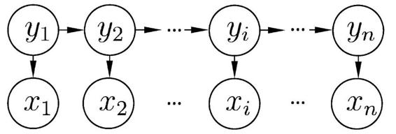

图14.1 隐马尔可夫模型的图结构

如图14.1所示，隐马尔可夫模型中的变量可分为两组。第一组是状态变量{y1，y2，...，yn}， 其中yi∈Y表示第i时刻的系统状态。通常假定状态变量是隐藏的、不可被观测的，因此状态变量亦称隐变量（hidden variable）。第二组是观测变量{x1，x2，...，xn}， 其中xi∈X表示第i时刻的观测值。在隐马尔可夫模型中，系统通常在多个状态{s1，s2，...，sN}之间转换，因此状态变量yi的取值范围Y（称为状态空间）通常是有N个可能取值的离散空间。观测变量xi可以是离散型也可以是连续型，为便于讨论，我们仅考虑离散型观测变量，并假定其取值范围x为{o1，o2，...，oM}。

所谓“现在决定未来”。

图14.1中的箭头表示了变量间的依赖关系。在任一时刻，观测变量的取值仅依赖于状态变量，即xt由yt确定，与其他状态变量及观测变量的取值无关。同时，t时刻的状态yt仅依赖于t−1时刻的状态yt−1,与其余n−2个状态无关。这就是所谓的“马尔可夫链”（Markov chain），即：系统下一时刻的状态仅由当前状态决定，不依赖于以往的任何状态。基于这种依赖关系，所有变量的联合概率分布为

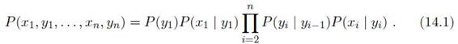

除了结构信息， 欲确定一个隐马尔可夫模型还需以下三组参数：

• 状态转移概率：模型在各个状态间转换的概率，通常记为矩阵A=\[aij\]N×N，其中

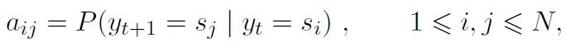

表示在任意时刻t,若状态为si，则在下一时刻状态为sj的概率。

• 输出观测概率：模型根据当前状态获得各个观测值的概率，通常记为矩阵B=\[bij\]N×M，其中

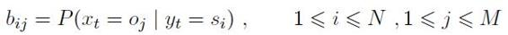

表示在任意时刻t,若状态为si，则观测值oj被获取的概率。

• 初始状态概率：模型在初始时刻各状态出现的概率，通常记为π=（π1，π2，...，πN），其中

πI=P（y1=si）， 1≤i≤N

表示模型的初始状态为si的概率。

通过指定状态空间Y、观测空间X和上述三组参数，就能确定一个隐马尔可夫模型，通常用其参数λ=\[A，B，π\]来指代。给定隐马尔可夫模型λ，它按如下过程产生观测序列{x1，x2，...，xn}：

（1） 设置t=1,并根据初始状态概率π选择初始状态y1；

（2） 根据状态yt和输出观测概率B选择观测变量取值xt；

（3） 根据状态yt和状态转移矩阵A转移模型状态，即确定yt+1；

（4） 若t﹤n,设置t=t+1,并转到第（2）步，否则停止。

其中yt∈{s1，s2，...，sN}和xt∈{o1，o2，...，oM}分别为第t时刻的状态和观 测值。

在实际应用中，人们常关注隐马尔可夫模型的三个基本问题：

• 给定模型λ=\[A，B，π\]，如何有效计算其产生观测序列x={x1，x2，...，xn}的概率P（x\|λ）？换言之，如何评估模型与观测序列之间的匹配程度？

• 给定模型λ=\[A，B，π\]和观测序列x={x1，x2，...，xn}，如何找到与此观测序列最匹配的状态序列y={y1，y2，...，yn}？换言之，如何根据观测序列推断出隐藏的模型状态？

• 给定观测序列x={x1，x2，...，xn}，如何调整模型参数λ=\[A，B，π\]使得该序列出现的概率P（x\|λ）最大？换言之，如何训练模型使其能最好地描述观测数据？

上述问题在现实应用中非常重要。例如许多任务需根据以往的观测序列{x1，x2，...，xn-1}来推测当前时刻最有可能的观测值xn，这显然可转化为求取概率P（x\|λ），即上述第一个问题；在语音识别等任务中，观测值为语音信号，隐藏状态为文字，目标就是根据观测信号来推断最有可能的状态序列（即对应的文字），即上述第二个问题；在大多数现实应用中，人工指定模型参数已变得越来越不可行，如何根据训练样本学得最优的模型参数，恰是上述第三个问题。值得庆幸的是，基于式（14.1）的条件独立性，隐马尔可夫模型的这三个问题均能被高效求解。

## 14.2 马尔可夫随机场

马尔可夫随机场（Markov Random Field,简称MRF）是典型的马尔可夫网，这是一种著名的无向图模型。图中每个结点表示一个或一组变量，结点之间的边表示两个变量之间的依赖关系。马尔可夫随机场有一组势函数（potential functions），亦称“因子”（factor），这是定义在变量子集上的非负实函数，主要用于定义概率分布函数。

图14.2显示出一个简单的马尔可夫随机场。对于图中结点的一个子集，若其中任意两结点间都有边连接，则称该结点子集为一个“团”（clique）。若在一个团中加入另外任何一个结点都不再形成团，则称该团为“极大团”（maximal clique）；换言之，极大团就是不能被其他团所包含的团。例如，在图14.2中，{x1，x2}，{x1，x3}，{x2，x4}，{x2，x5}，{x2，x6}，{x3，x5}，{x5，x6}和{x2，x5，x6}都是团，并且除了{x2，x5}，{x2，x6}和{x6，x6}之外都是极大团；但是，因为x2和x3之间缺乏连接，{x1，x2，x3}并不构成团。显然，每个结点至少出现在一个极大团中。

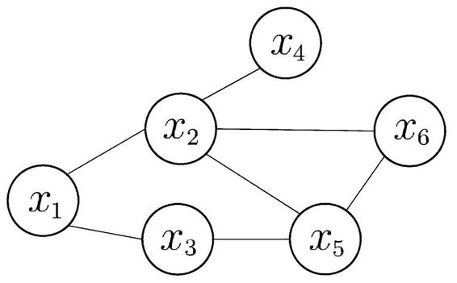

图14.2 一个简单的马尔可夫随机场

在马尔可夫随机场中，多个变量之间的联合概率分布能基于团分解为多个因子的乘积，每个因子仅与一个团相关。具体来说，对于n个变量x={x1，x2，...，xn}， 所有团构成的集合为C，与团Q∈C对应的变量集合记为xq，则联合概率Px定义为

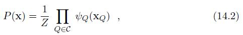

其中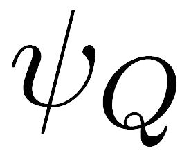为与团Q对应的势函数，用于对团Q中的变量关系进行建模，Z=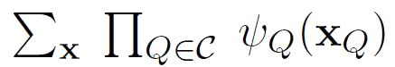为规范化因子，以确保Px是被正确定义的概率。在实际应用中，精确计算Z通常很困难，但许多任务往往并不需获得Z的精确值。

显然，若变量个数较多，则团的数目将会很多（例如，所有相互连接的两个变量都会构成团），这就意味着式（14.2）会有很多乘积项，显然会给计算带来负担。注意到若团Q不是极大团，则它必被一个极大团Q\*所包含，即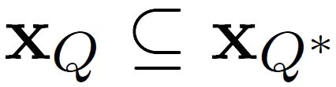；这意味着变量xq之间的关系不仅体现在势函数中，还体现在\*中。于是，联合概率Px可基于极大团来定义。 假定所有极大团构成的集合为C\*， 则有

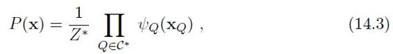

其中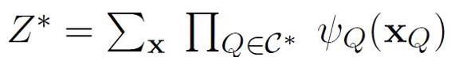为规范化因子。例如图14.2中x={x1，x2，...，x6}，联合概率分布Px定义为

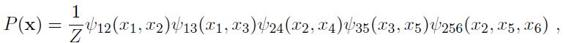

其中，势函数ψ256（x2，x5，x6）定义在极大团{x2，x5，x6}上，由于它的存在，使我们不再需为团{x2，x5}，{x2，x6}和{x5，x6}构建势函数。

参见（7.5.1 结构）

在马尔可夫随机场中如何得到“条件独立性”呢？同样借助“分离”的概念，参见7.5.1节。如图14.3所示，若从结点集A中的结点到B中的结点都必须经过结点集C中的结点，则称结点集A和B被结点集C分离，C称为“分离集”（separatingset）。对马尔可夫随机场， 有

• “全局马尔可夫性”（global Markov property）：给定两个变量子集的分离集，则这两个变量子集条件独立。

也就是说，图14.3中若令A，B和C对应的变量集分别为xA，xB和xC，则xA和xB在给定xC的条件下独立，记为xA⊥xB\|xC。

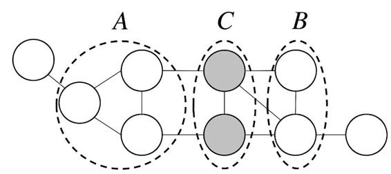

图14.3 结点集A和B被结点集C分离

下面我们做一个简单的验证。为便于讨论，我们令图14.3中的A，B和C分别对应单变量xA，xB和xC，于是图14.3简化为图14.4.

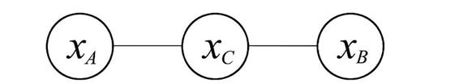

图14.4 图14.3的简化版

对于图14.4,由式（14.2）可得联合概率

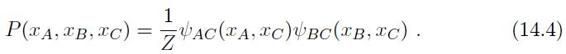

基于条件概率的定义可得

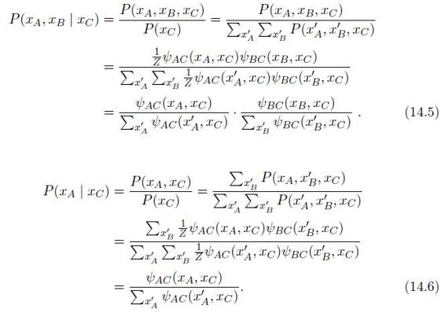

由式（14.5）和（14.6）可知

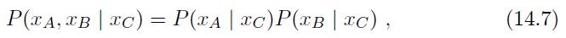

即xA和xB在给定xC时条件独立。

由全局马尔可夫性可得到两个很有用的推论：

• 局部马尔可夫性（local Markov property）：给定某变量的邻接变量，则该变量条件独立于其他变量。形式化地说， 令V为图的结点集，n（v）为结点 v在图上的邻接结点，n\*（v）=n（v）∪{v}，有xv⊥xv∖n\*（v）\|xn（v）。

某变量的所有邻接变量组成的集合称为该变量的“马尔可夫毯”（Markov blanket）。

• 成对马尔可夫性（pairwise Markov property）：给定所有其他变量，两个非邻接变量条件独立。形式化地说，令图的结点集和边集分别为V和E，对图中的两个结点u和v, 若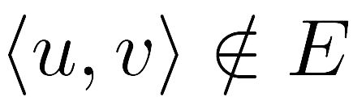，则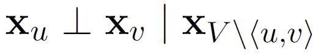。

现在我们来考察马尔可夫随机场中的势函数。显然，势函数ψQ（xQ）的作用是定量刻画变量集xQ中变量之间的相关关系，它应该是非负函数，且在所偏好的变量取值上有较大函数值。例如，假定图14.4中的变量均为二值变量，若势函数为

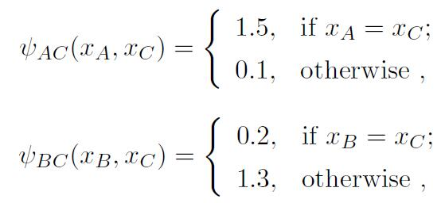

则说明该模型偏好变量xA与xC拥有相同的取值，xB与xC拥有不同的取值；换言之，在该模型中xA与xC正相关，xB与xC负相关。结合式（14.2）易知，令xA与xC相同且xB与xC不同的变量值指派将取得较高的联合概率。

为了满足非负性，指数函数常被用于定义势函数，即

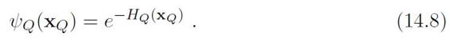

HQ（XQ）是一个定义在变量XQ上的实值函数，常见形式为

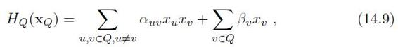

其中αuv和βv是参数。上式中的第二项仅考虑单结点，第一项则考虑每一对结 点的关系。

## 14.3 条件随机场

条件随机场可看作给定观测值的马尔可夫随机场，也可看作对率回归的扩展；对率回归参见（3.3 对数几率回归）

条件随机场（Conditional Random Field,简称CRF）是一种判别式无向图模型。14.1节提到过，生成式模型是直接对联合分布进行建模，而判别式模型则是对条件分布进行建模。前面介绍的隐马尔可夫模型和马尔可夫随机场都是生成式模型，而条件随机场则是判别式模型。

条件随机场试图对多个变量在给定观测值后的条件概率进行建模。具体来说，若令x={x1，x2，...，xn}为观测序列，y={y1，y2，...，yn}为与之相应的标记序列，则条件随机场的目标是构建条件概率模型P（y\|x）。需注意的是，标记变量y可以是结构型变量，即其分量之间具有某种相关性。例如在自然语言处理的词性标注任务中，观测数据为语句（即单词序列），标记为相应的词性序列，具有线性序列结构，如图14.5（a）所示；在语法分析任务中，输出标记则是语法树，具有树形结构，如图14.5（b）所示。

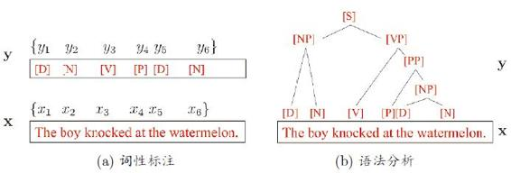

图14.5 自然语言处理中的词性标注和语法分析任务

令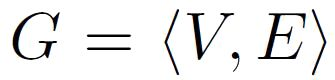表示结点与标记变量y中元素一一对应的无向图，yv表示与结点v对应的标记变量，nv表示结点v的邻接结点，若图G的每个变量yv都满足马尔可夫性，即

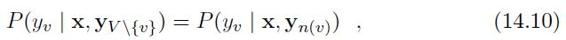

则（y,x）构成一个条件随机场。

理论上来说，图G可具有任意结构，只要能表示标记变量之间的条件独立性关系即可。但在现实应用中，尤其是对标记序列建模时，最常用的仍是图14.6所示的链式结构，即“链式条件随机场”（chain-structured CRF）。下面我们主要讨论这种条件随机场。

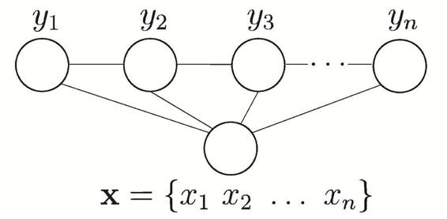

图14.6 链式条件随机场的图结构

与马尔可夫随机场定义联合概率的方式类似，条件随机场使用势函数和图结构上的团来定义条件概率P（y\|x）。给定观测序列x,图14.6所示的链式条件随机场主要包含两种关于标记变量的团，即单个标记变量{yi}以及相邻的标记变量{yi-1，yi}。选择合适的势函数，即可得到形如式（14.2）的条件概率定义。在条件随机场中，通过选用指数势函数并引入特征函数（feature function），条件概率被定义为

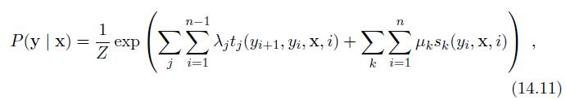

其中tj（yi+1，yi，x,i）是定义在观测序列的两个相邻标记位置上的转移特征函数（transition feature function），用于刻画相邻标记变量之间的相关关系以及观测序列对它们的影响，sk（yi，x,i）是定义在观测序列的标记位置i上的状态特征函数（status feature function），用于刻画观测序列对标记变量的影响，λj和μk为参数，Z为规范化因子，用于确保式（14.11）是正确定义的概率。

显然，要使用条件随机场，还需定义合适的特征函数。特征函数通常是实值函数，以刻画数据的一些很可能成立或期望成立的经验特性。以图14.5（a）的词性标注任务为例，若采用转移特征函数

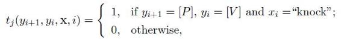

则表示第I个观测值xi为单词“knock”时，相应的标记yi和yi+1很可能分别为\[V\]和\[P\]。若采用状态特征函数

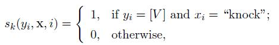

则表示观测值xi为单词“knock”时，它所对应的标记很可能为\[V\]。

对比式（14.11）和（14.2）可看出，条件随机场和马尔可夫随机场均使用团上的势函数定义概率，两者在形式上没有显著区别；但条件随机场处理的是条件概率，而马尔可夫随机场处理的是联合概率。

## 14.4学习与推断

基于概率图模型定义的联合概率分布，我们能对目标变量的边际分布（marginal distribution）或以某些可观测变量为条件的条件分布进行推断。条件分布我们已经接触过很多，例如在隐马尔可夫模型中要估算观测序列x在给定参数λ下的条件概率分布。边际分布则是指对无关变量求和或积分后得到结果，例如在马尔可夫网中，变量的联合分布被表示成极大团的势函数乘积，于是，给定参数θ求解某个变量x的分布，就变成对联合分布中其他无关变量进行积分的过程，这称为“边际化”（marginalization）。

贝叶斯学派认为未知参数与其他变量一样，都是随机变量，因此参数估计和变量推断能统一在推断框架下进行。但频率主义学派对此并不认同。

对概率图模型，还需确定具体分布的参数，这称为参数估计或参数学习问题，通常使用极大似然估计或最大后验概率估计求解。但若将参数视为待推测的变量，则参数估计过程和推断十分相似，可以“吸收”到推断问题中。因此，下面我们只讨论概率图模型的推断方法。

具体来说，假设图模型所对应的变量集X={x1，x2，...，xN}能分为XE和XF两个不相交的变量集，推断问题的目标就是计算边际概率P（XF）或条件概率P（XF\|XE）。由条件概率定义有

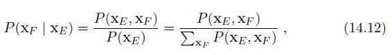

其中联合概率P（XF，XE）可基于概率图模型获得，因此，推断问题的关键就是如何高效地计算边际分布，即

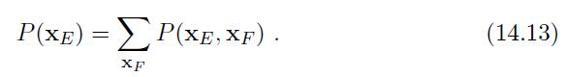

概率图模型的推断方法大致可分为两类。第一类是精确推断方法，希望能计算出目标变量的边际分布或条件分布的精确值；遗憾的是，一般情形下，此类算法的计算复杂度随着极大团规模的增长呈指数增长，适用范围有限。第二类是近似推断方法，希望在较低的时间复杂度下获得原问题的近似解；此类方法在现实任务中更常用。本节介绍两种代表性的精确推断方法，下一节介绍近似 推断方法。

### 14.4.1 变量消去

精确推断的实质是一类动态规划算法，它利用图模型所描述的条件独立性来削减计算目标概率值所需的计算量。变量消去法是最直观的精确推断算法，也是构建其他精确推断算法的基础。

我们先以图14.7（a）中的有向图模型为例来介绍其工作流程。

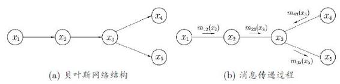

图14.7 变量消去法及其对应的消息传递过程

假定推断目标是计算边际概率P（x5）。显然，为了完成此目标，只需通过加法消去变量{x1，x2，x3，x4}，即

基于有向图模型所描述的条件独立性。

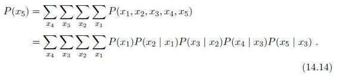

不难发现，若采用{x1，x2，x3，x4}的顺序计算加法，则有

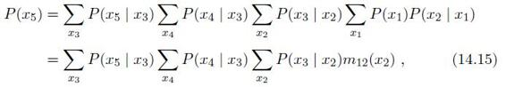

其中mij（xj）是求加过程的中间结果，下标i表示此项是对xi求加的结果，下标j表示此项中剩下的其他变量。显然，mij（xj）是关于xj的函数。不断执行此过程可得

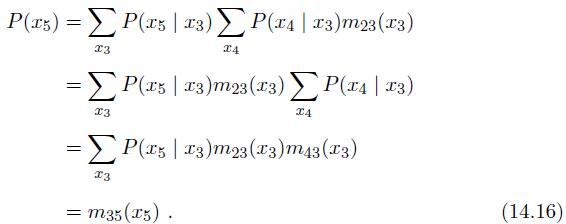

显然，最后的m35（x5）是关于x5的函数，仅与变量x5的取值有关。

事实上，上述方法对无向图模型同样适用。不妨忽略图14.7（a）中的箭头，将其看作一个无向图模型，有

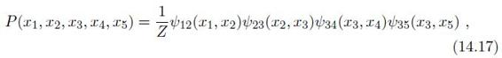

其中Z为规范化因子。边际分布P（x5）可这样计算：

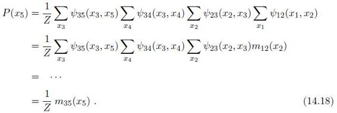

显然，通过利用乘法对加法的分配律，变量消去法把多个变量的积的求和问题，转化为对部分变量交替进行求积与求和的问题。这种转化使得每次的求和与求积运算限制在局部，仅与部分变量有关，从而简化了计算。

变量消去法有一个明显的缺点：若需计算多个边际分布，重复使用变量消去法将会造成大量的冗余计算。例如在图14.7（a）的贝叶斯网上，假定在计算P（x5）之外还希望计算P（x4），若采用{1，x2，x5，x3}的顺序，则m12（x2）和m23（x3）的计算是重复的。

### 14.4.2 信念传播

亦称Sum-Product算法。

信念传播（Belief Propagation）算法将变量消去法中的求和操作看作一个消息传递过程，较好地解决了求解多个边际分布时的重复计算问题。具体来说，变量消去法通过求和操作

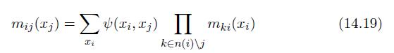

消去变量xi，其中x（i）表示结点xi的邻接结点。在信念传播算法中，这个操作 被看作从xi向xj传递了一个消息mij（xj）。这样，式（14.15）和（14.16）所描述的变量消去过程就能描述为图14.7（b）所示的消息传递过程。不难发现，每次消息传递操作仅与变量xi及其邻接结点直接相关，换言之，消息传递相关的计算被限制在图的局部进行。

在信念传播算法中，一个结点仅在接收到来自其他所有结点的消息后才能向另一个结点发送消息，且结点的边际分布正比于它所接收的消息的乘积，即

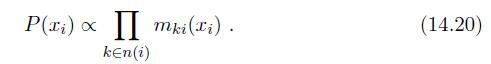

例如在图14.7（b）中，结点x3要向x5发送消息，必须事先收到来自结点x2和x4的消息，且传递到x5的消息m35（x5）恰为概率P（x5）。

若图结构中没有环，则信念传播算法经过两个步骤即可完成所有消息传递，进而能计算所有变量上的边际分布：

• 指定一个根结点，从所有叶结点开始向根结点传递消息，直到根结点收到所有邻接结点的消息；

• 从根结点开始向叶结点传递消息，直到所有叶结点均收到消息。

例如在图14.7（a）中，令x1为根结点，则x4和x5为叶结点。以上两步消息传递的过程如图14.8所示。此时图的每条边上都有方向不同的两条消息，基于这些消息和式（14.20）即可获得所有变量的边际概率。

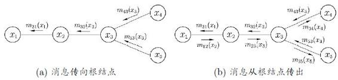

图14.8 信念传播算法图示

## 14.5 近似推断

精确推断方法通常需要很大的计算开销，因此在现实应用中近似推断方法更为常用。近似推断方法大致可分为两大类：第一类是采样（sampling），通过使用随机化方法完成近似；第二类是使用确定性近似完成近似推断，典型代表为变分推断（variational inference）。

### 14.5.1 MCMC采样

在很多任务中，我们关心某些概率分布并非因为对这些概率分布本身感兴趣，而是要基于它们计算某些期望，并且还可能进一步基于这些期望做出决策。例如对图14.7（a）的贝叶斯网，进行推断的目的可能是为了计算变量x5的期望。若直接计算或逼近这个期望比推断概率分布更容易，则直接操作无疑将使推断问题的求解更为高效。

若x是离散变量，则把积分换做求和即可。

采样法正是基于这个思路。具体来说，假定我们的目标是计算函数f（x）在概率密度函数P（x）下的期望

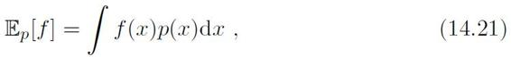

或P（x）的相关分布。

则可根据P（x）抽取一组样本{x1，x2，...，xN}，然后计算f（x）在这些样本上的均值

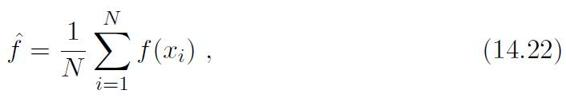

以此来近似目标期望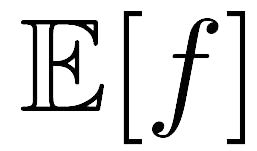若样本{x1，x2，...，xN}独立，基于大数定律，这种通过大量采样的办法就能获得较高的近似精度。问题的关键是如何采样。对概率图模型来说，就是如何高效地基于图模型所描述的概率分布来获取样本。

概率图模型中最常用的采样技术是马尔可夫链蒙特卡罗（Markov Chain Monte Carlo,简称MCMC）方法。给定连续变量x∈X 的概率密度函数P（x），x在区间A中的概率可计算为

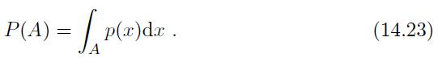

若有函数f：X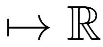，则可计算f（x）的期望

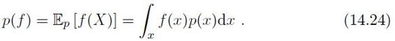

若x不是单变量而是一个高维多元变量X，且服从一个非常复杂的分布，则对式（14.24）求积分通常很困难。为此，MCMC先构造出服从p分布的独立同分布随机变量x1，x2，...，xN，再得到式（14.24）的无偏估计

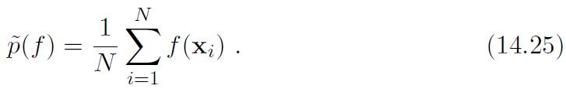

然而，若概率密度函数P（x）很复杂，则构造服从p分布的独立同分布样本也很困难。MCMC方法的关键就在于通过构造“平稳分布为p的马尔可夫链”来产生样本：若马尔可夫链运行时间足够长（即收敛到平稳状态），则此时产出的样本x近似服从于分布p.如何判断马尔可夫链到达平稳状态呢？假定平稳马尔可夫链T的状态转移概率（即从状态x转移到状态x′的概率）为T（x′\|x），t时刻状态的分布为p（xt），则若在某个时刻马尔可夫链满足平稳条件

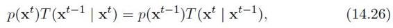

则P（x）是该马尔可夫链的平稳分布，且马尔可夫链在满足该条件时已收敛到平稳状态。

也就是说，MCMC方法先设法构造一条马尔可夫链，使其收敛至平稳分布恰为待估计参数的后验分布，然后通过这条马尔可夫链来产生符合后验分布的样本，并基于这些样本来进行估计。这里马尔可夫链转移概率的构造至关重要，不同的构造方法将产生不同的MCMC算法。

Metropolis-Hastings算法是由N。Metropolis等人1953年提出\[Metropolis et al.，1953\]，此后W。K。Hastings将其推广到一般形式\[Hastings,1970\]，因 此而得名。

重复足够多次以达到平稳分布。

根据式（14.28）。

实践中常会丢弃前面若干个样本，因为达到平稳分布后产生的才是希望得到的样本。

Metropolis-Hastings（简称MH）算法是MCMC的重要代表。它基于“拒绝采样”（reject sampling）来逼近平稳分布p.如图14.9所示，算法每次根据上一轮采样结果xt−1来采样获得候选状态样本x\*，但这个候选样本会以一定的概率被“拒绝”掉。假定从状态xt−1到状态x\*的转移概率为Q（x\*\|xt−1）A（x\*\|xt−1），其中Q（x\*\|xt−1）是用户给定的先验概率，A（x\*\|xt−1）是x\*被接受的概率。若x\*最终收敛到平稳状态，则根据式（14.26）有

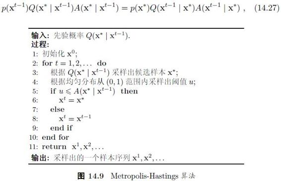

于是，为了达到平稳状态，只需将接受率设置为

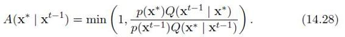

参见（7.5.3 推断）

吉布斯采样（Gibbs sampling）有时被视为MH算法的特例，它也使用马尔可夫链获取样本，而该马尔可夫链的平稳分布也是采样的目标分布P（x）。具体来说，假定x={x1，x2，...，xN}，目标分布为P（x），在初始化x的取值后，通过循环执行以下步骤来完成采样：

（1） 随机或以某个次序选取某变量xi；

（2） 根据x中除xi外的变量的现有取值，计算条件概率，其中

（3） 根据对变量xi采样，用采样值代替原值。

### 14.5.2 变分推断

变分推断通过使用已知简单分布来逼近需推断的复杂分布，并通过限制近似分布的类型，从而得到一种局部最优、但具有确定解的近似后验分布。

在学习变分推断之前，我们先介绍概率图模型一种简洁的表示方法——盘式记法（plate notation）\[Buntine,1994\]。图14.10给出了一个简单的例子。图14.10（a）表示N个变量{x1，x2，...，xN}均依赖于其他变量z.在图14.10（b）中，相互独立的、由相同机制生成的多个变量被放在一个方框（盘）内，并在方框中标出类似变量重复出现的个数N；方框可以嵌套。通常用阴影标注出已知的、能观察到的变量，如图14.10中的变量x.在很多学习任务中，对属性变量使用盘式记法将使得图表示非常简洁。

图14.10 盘式记法的例示

变分推断使用的近似分布需具有良好的数值性质，通常是基于连续型变量的概率密度函数来刻画的。

在图14.10（b）中，所有能观察到的变量x的联合分布的概率密度函数是

所对应的对数似然函数为

其中x={x1，x2，...，xN}，Θ是x与z服从的分布参数。

一般来说，图14.10所对应的推断和学习任务主要是由观察到的变量x来估计隐变量z和分布参数变量Θ，即求解p（z\|x,Θ）和Θ。

EM算法参见（7.6 EM算法）

概率模型的参数估计通常以最大化对数似然函数为手段。对式（14.30）可使用EM算法：在E步，根据t时刻的参数Θt对p（z\|x,Θt）进行推断，并计算联合似然函数p（z\|x,Θ）；在M步，基于E步的结果进行最大化寻优，即对关于变量Θ的函数进行最大化从而求取

式（14.31）中的实际上是对数联合似然函数lnp（x,z\|Θ）在分布p（z\|x,Θt）下的期望，当分布p（z\|x,Θt）与变量z的真实后验分布相等时，近似于对数似然函数。于是，EM算法最终可获得稳定的参数Θ，而隐变量z的分布也能通过该参数获得。

需注意的是，p（z\|x,Θt）未必是隐变量z服从的真实分布，而只是一个近似分布。若将这个近似分布用q（z）表示，则不难验证

KL散度，参见（附录 C 概率分布）

其中

然而在现实任务中，E步对p（z\|x,Θt）的推断很可能因z模型复杂而难以进行，此时可借助变分推断。通常假设z服从分布

为简化表述，这里将qi（zi）简写为qi。

const是一个常数。

即假设复杂的多变量z可拆解为一系列相互独立的多变量zi。更重要的是，可以令qi分布相对简单或有很好的结构，例如假设qi为指数族（exponential family）分布，此时有

我们关心的是qj，因此可固定qi≠j 再对进行最大化，可发现式（14.36）等于，即当最大。于是可知变量子集zj所服从的最优分布q\*j应满足

换言之，在式（14.35）这个假设下，变量子集zj最接近真实情形的分布由式（14.40）给出。

显然， 基于式（14.35）的假设，通过恰当地分割独立变量子集zj并选择qi服从的分布，往往有闭式解，这使得基于式（14.40）能高效地对隐变量z进行推断。事实上，由式（14.38）可看出，对变量zj分布q\*j进行估计时融合了zj之外的其他zi≠j的信息，这是通过联合似然函数lnp（x,z）在zj之外的隐变量分布上求期望得到的，因此亦称“平均场”（mean field）方法。

mean指期望，field则是指分布。

在实践中使用变分法时，最重要的是考虑如何对隐变量进行拆解，以及假设各变量子集服从何种分布，在此基础上套用式（14.40）的结论再结合EM算法即可进行概率图模型的推断和参数估计。显然，若隐变量的拆解或变量子集的分布假设不当，将会导致变分法效率低、效果差。

## 14.6 话题模型

话题模型（topic model）是一族生成式有向图模型，主要用于处理离散型的数据（如文本集合），在信息检索、自然语言处理等领域有广泛应用。隐狄利克雷分配模型（Latent Dirichlet Allocation,简称LDA）是话题模型的典型代表。

我们先来了解一下话题模型中的几个概念：词（word）、文档（document）和话题（topic）。具体来说，“词”是待处理数据的基本离散单元，例如在文本处理任务中，一个词就是一个英文单词或有独立意义的中文词。“文档”是待处理的数据对象，它由一组词组成，这些词在文档中是不计顺序的，例如一篇论文、一个网页都可看作一个文档；这样的表示方式称为“词袋”（bag-of-words）。数据对象只要能用词袋描述，就可使用话题模型。“话题”表示一个概念，具体表示为一系列相关的词，以及它们在该概念下出现的概率。

例如若把图像中的小块看作“词”，则可将图像表示为词袋，于是话题模型也可用于图像数据。

形象地说，如图14.11所示，一个话题就像是一个箱子，里面装着在这 个概念下出现概率较高的那些词。不妨假定数据集中一共包含K个话题和T篇文档，文档中的词来自一个包含N个词的词典。我们用T个N维向量W={w1，w2，...，wT}表示数据集（即文档集合），K个N维向量βk（k=1，2，...，K）表示话题，其中的第n个分量wt,n表示文档t中词n的词频，的第n个分量βk,n表示话题k中词n的词频。

通常需对词频做一些处理，例如去除“停用词表”中的词等。

狄利克雷分布参见（附录C 概率分布）

在现实任务中可通过统计文档中出现的词来获得词频向量wi（i=1，2，...，T），但通常并不知道这组文档谈论了哪些话题，也不知道每篇文档与哪些话题有关。LDA从生成式模型的角度来看待文档和话题。具体来说，LDA认为每篇文档包含多个话题，不妨用向量表示文档t中所包含的每个话题的比例，Θt,k即表示文档t中包含话题k的比例，进而通过下面的步骤由话题“生成”文档t：

（1） 根据参数为α的狄利克雷分布随机采样一个话题分布Θt；

（2） 按如下步骤生成文档中的N个词：

图14.11 LDA 的文档生成过程示意图

（a） 根据Θt进行话题指派，得到文档t中词n的话题zt,n；

（b） 根据指派的话题所对应的词频分布βk随机采样生成词。

图14.11演示出根据以上步骤生成文档的过程。显然，这样生成的文档自然地以不同比例包含多个话题（步骤1），文档中的每个词来自一个话题（步骤2b），而这个话题是依据话题比例产生的（步骤2a）。

图14.12描述了LDA的变量关系，其中文档中的词频wt,n是唯一的已观测变量，它依赖于对这个词进行的话题指派zt,n，以及话题所对应的词频βk；同时，话题指派zt,n依赖于话题分布Θt，Θt依赖于狄利克雷分布的参数α，而话题词频则依赖于参数η。

图14.12 LDA 的盘式记法图

于是，LDA模型对应的概率分布为

其中通常分别设置为以α和η为参数的K维和N维狄利克雷分布，例如

其中Γ（·）是Gamma函数。显然，α和η是模型式（14.41）中待确定的参数。

参见（附录 C 概率分布）

训练文档集对应的词频。

给定训练数据W={w1，w2，...，wT}，LDA的模型参数可通过极大似然法估计，即寻找α和η以最大化对数似然

但由于p（wt\|α，η）不易计算，式（14.43）难以直接求解，因此实践中常采用变分法来求取近似解。

若模型已知，即参数α和η已确定，则根据词频wt,n来推断文档集所对应的话题结构（即推断）可通过求解

然而由于分母上的p（W\|α，η）难以获取，式（14.44）难以直接求解，因此在实践中常采用吉布斯采样或变分法进行近似推断。

## 14.7 阅读材料

概率图模型方面已经有专门的书籍如\[Koller and Friedman,2009\]。

\[Pearl,1982\]倡导了贝叶斯网的研究，\[Pearl,1988\]对这方面的早期研究工作进行了总结。马尔可夫随机场由\[Geman and Geman,1984\]提出。现实应用中使用的模型经常是贝叶斯网与马尔可夫随机场的结合。隐马尔可夫模型及其在语音识别中的应用可参阅\[Rabiner,1989\]。条件随机场由\[Lafferty et al.，2001\]提出，更多的内容可参阅\[Sutton and McCallum, 2012\]。

信念传播算法最早由\[Pearl,1986\]作为精确推断技术提出，后来衍生出多种近似推断算法。对一般的带环图，信念传播算法需在初始化、消息传递等环节进行调整，由此形成了迭代信念传播算法（Loopy Belief Propagation）\[Murphy et al.，1999\]，但其理论性质尚不清楚，这方面的进展可参阅\[Mooij and Kappen,2007；Weiss,2000\]。有些带环图可先用“因子图”（factor graph）\[Kschischang et al.，2001\]描述，再转化为因子树（factor tree）进行信念传播。对任意图结构的信念传播已有一些研究\[Lauritzen and Spiegelhalter,1988\]。近来随着并行计算技术的发展，信念传播的并行加速实现受到关注，例如\[Gonzalez et al.，2009\]提出近似推断的概念并设计出多核并行信念传播算法，其时间开销随内核数的增加而线性降低。

概率图模型的建模和推断，尤其是变分推断在20世纪90年代中期逐步发展成熟，\[Jordan,1998\]对这个阶段的主要成果进行了总结。关于变分推断的更多内容可参阅\[Wainwright and Jordan,2008\]。

“非参数化”指参数的 数目无须事先指定，是贝叶斯学习方法的重要发展。

贝叶斯学习参见（7.7 阅读材料）

图模型带来的一大好处是使得人们能直观、快速地针对具体任务定义模型。LDA \[Blei et al.，2003\]是这方面的重要代表，由它产生了很多变体，关于这方面的内容可参阅\[Blei,2012\]。概率图模型的一个发展方向是使得模型的结构能对数据有一定的自适应能力，即“非参数化”（non-parametric）方法，例如层次化狄利克雷过程模型\[Teh et al.，2006\]、无限隐特征模型\[Ghahramani and Griffiths, 2006\]等。

话题模型包含了多种模型，其中有些并不采用贝叶斯学习方法，例如PLSA（概率隐语义分析）\[Hofmann,2001\]，它是LSA（隐语义分析）的概率扩展。

LSA是SVD在文本数据上的变体。

参见（小故事：蒙特卡罗方法与斯坦尼斯拉夫·乌拉姆）

蒙特卡罗方法是二十世纪四十年代产生的一类基于概率统计理论、使用 随机数来解决问题的数值计算方法，MCMC是马尔可夫链与蒙特卡罗方法的结合，最早由\[Pearl, 1987\]引入贝叶斯网推断。关于MCMC在概率推断中的应用可参阅\[Neal,1993\]，更多关于MCMC的内容可参阅\[Andrieu et al.，2003；Gilks et al.，1996\]。

## 习题

14.1 试用盘式记法表示条件随机场和朴素贝叶斯分类器。

14.2 试证明图模型中的局部马尔可夫性：给定某变量的邻接变量，则该变量条件独立于其他变量。

14.3 试证明图模型中的成对马尔可夫性：给定其他所有变量，则两个非邻接变量条件独立。

14.4 试述在马尔可夫随机场中为何仅需对极大团定义势函数。

14.5 比较条件随机场和对率回归，试析其异同。

14.6 试证明变量消去法的计算复杂度随图模型中极大团规模的增长而呈指数增长，但随结点数的增长未必呈指数增长。

14.7 吉布斯采样可看作MH算法的特例，但吉布斯采样中未使用“拒绝采样”策略，试述这样做的好处。

14.8 平均场是一种近似推断方法。考虑式（14.32），试析平均场方法求解的近似问题与原问题的差异，以及实践中如何选择变量服从的先验分布。

14.9\* 从网上下载或自己编程实现LDA，试分析金庸作品《天龙八部》中每十回的话题演变情况。

13.10\* 试设计一个无须事先指定话题数目的LDA改进算法。

## 参考文献

Andrieu, C., N. De Freitas, A. Doucet, and M. I. Jordan. （2003）. “An introduction to MCMC for machine learning.” *Machine Learning*, 50（1-2）：5–43.

Blei, D. M. （2012）. “Probabilisitic topic models.”*Communications of the ACM*, 55（4）：77–84.

Blei, D. M., A. Ng, and M. I. Jordan. （2003）. “Latent Dirichlet allocation.”*Journal of Machine Learning Research*, 3：993–1022.

Buntine, W. （1994）. “Operations for learning with graphical models.”*Journal of Artificial Intelligence Research*, 2：159–225.

Geman, S. and D. Geman. （1984）.“Stochastic relaxation, Gibbs distributions, and the Bayesian restoration of images.” IEEE *Transactions on Pattern Analysis and Machine Intelligence*, 6（6）：721–741.

Ghahramani, Z. and T. L. Griffiths. （2006）. “Infinite latent feature models and the Indian buffet process.”*In Advances in Neural Information Processing Systems 18 （NIPS）*（Y.Weiss, B. Sch¨olkopf, and J.C. Platt, eds.）,475–482, MIT Press, Cambridge, MA.

Gilks, W. R., S. Richardson, and D. J. Spiegelhalter.（1996）. *Markov Chain Monte Carlo in Practice*. Chapman Hall/CRC, Boca Raton, FL.

Gonzalez, J. E., Y. Low, and C. Guestrin. （2009）. “Residual splash for optimally parallelizing belief propagation.” In *Proceedings of the 12th International Conference on Artificial Intelligence and Statistics （AISTATS）*, 177–184, Clearwater Beach, FL.

Hastings, W. K. （1970）. “Monte Carlo sampling methods using Markov chains and their applications.” *Biometrica*, 57（1）：97–109.

Hofmann, T. （2001）. “Unsupervised learning by probabilistic latent semantic analysis.” *Machine Learning*, 42（1）：177–196.

Jordan, M. I., ed. （1998）. *Learning in Graphical Models*. Kluwer, Dordrecht, The Netherlands.

Koller, D. and N. Friedman. （2009）. *Probabilistic Graphical Models：Principles and Techniques*. MIT Press, Cambridge, MA.

Kschischang, F. R., B. J. Frey, and H.-A. Loeliger. （2001）. “Factor graphs and the sum-product algorithm.” IEEE *Transactions on Information Theory*, 47（2）：498–519.

Lafferty, J. D., A. McCallum, and F. C. N. Pereira. （2001）. “Conditional random fields：Probabilistic models for segmenting and labeling sequence data.” In *Proceedings of the 18th International Conference on Machine Learning （ICML）*, 282–289, Williamstown, MA.

Lauritzen, S. L. and D. J. Spiegelhalter. （1988）. “Local computations with probabilities on graphical structures and their application to expert systems.” *Journal of the Royal Statistical Society - Series B*, 50（2）：157–224.

Metropolis, N., A. W. Rosenbluth, M. N. Rosenbluth, A. H. Teller, and E. Teller. （1953）. “Equations of state calculations by fast computing machines.” *Journal of Chemical Physics*, 21（6）：1087–1092.

Mooij, J. M. and H. J. Kappen. （2007）. “Sufficient conditions for convergence of the sum-product algorithm.” IEEE *Transactions on Information Theory*, 53（12）：4422–4437.

Murphy, K. P., Y. Weiss, and M. I. Jordan. （1999）. “Loopy belief propagation for approximate inference：An empirical study.” In *Proceedings of the 15th Conference on Uncertainty in Artificial Intelligence （UAI）*, 467–475, Stockholm, Sweden.

Neal, R. M. （1993）. “Probabilistic inference using Markov chain Monte Carlo methods.” Technical Report CRG-TR-93-1, Department of Computer Science, University of Toronto.

Pearl, J. （1982）. “Asymptotic properties of minimax trees and game-searching procedures.” In *Proceedings of the 2nd National Conference on Artificial Intelligence （AAAI）*, Pittsburgh, PA.

Pearl, J. （1986）. “Fusion, propagation and structuring in belief networks.” *Artificial Intelligence*, 29（3）：241–288.

Pearl, J. （1987）. “Evidential reasoning using stochastic simulation of causal models.”*Artificial Intelligence*, 32（2）：245–258.

Pearl, J. （1988）. Probabilistic Reasoning in Intelligent Systems：*Networks of Plausible Inference*. Morgan Kaufmann, San Francisco, CA.

Rabiner, L. R. （1989）. “A tutorial on hidden Markov model and selected applications in speech recognition.” *Proceedings of the IEEE*, 77（2）：257–286.

Sutton, C. and A. McCallum. （2012）. “An introduction to conditional random fields.” *Foundations and Trends in Machine Learning*,4（4）：267–373.

Teh, Y. W., M. I. Jordan, M. J. Beal, and D. M. Blei. （2006）. “Hierarchical Dirichlet processes.” *Journal of the American Statistical Association*, 101 （476）：1566–1581.

Wainwright, M. J. and M. I. Jordan. （2008）. “Graphical models, exponential families, and variational inference.” *Foundations and Trends in Machine Learning*, 1（1-2）：1–305.

Weiss, Y. （2000）. “Correctness of local probability propagation in graphical models with loops.” *Neural Computation*, 12（1）：1–41.

## 休息一会儿

### 小故事：概率图模型奠基人朱迪亚·珀尔

说起概率图模型，就必然要谈到犹太裔美国计算机科学 家朱迪亚·珀尔（Judea Pearl,1936— ）。珀尔出生于特拉维夫，1960年他在以色列理工学院电子工程本科毕业后来 到美国，在Rutgers大学和布鲁克林理工学院分别获得物理学硕士和电子工程博士学位。1965 年博士毕业后进入RCA研究实验室从事超导存储方面的工作，1970年到加州大学洛杉矶分校任教至今。

参阅（1.5 发展历程）

早期的主流人工智能研究专注于以逻辑为基础来进行形式化和推理，但这样很难定量地对不确定性事件进行表达和处理。珀尔在二十世纪七十年代将概率方法引入人工智能，开创了贝叶斯网的研究，提出了信念传播算法，催生了概率图模型这一大类技术，他还以贝叶斯网为工具开创了因果推理方面的研究。由于对人工智能中概率与因果推理的重大贡献，他获得2011年图灵奖，此前他已获ACM与AAAI联合颁发的2003年艾伦·纽厄尔奖。ACM评价珀尔在人工智能领域的贡献已扩展到诸多学科领域，“使统计学、心理学、医学以及社会科学中因果性的理解产生了革命性的变化”。2011年珀尔还获得科学哲学领域最高奖拉卡托斯奖。

艾伦·纽厄尔奖是奖励那些拓宽了计算机科学，或架设了计算机科学与其他学科桥梁的卓越科学家，该奖以图灵奖得主、人工智能先驱Allen Newell （1927–1992） 命名。机器学习界的另一位著名学者 Michael Jordan 在2009年获该奖。

珀尔之子丹尼尔是《华尔街日报》驻南亚记者，“9·11”事件后他在巴基斯坦追踪报道激进武装组织时被绑架审讯并残忍地斩首，此事震惊世界。珀尔此后筹办了丹尼尔·珀尔基金会，并参与了很多致力于促进世界民族和平共处的活动。

