# 第16章 强化学习

<strong>本章配套视频</strong>

当前这套 56P《机器学习初步》只覆盖教材第 1–9 章，没有本章的对应分 P。此处不强行错配，请以本章原书正文为准。

<a href="https://www.bilibili.com/video/BV1gG411f7zX/" target="_blank" rel="noopener">查看完整视频选集 ↗</a>

## 16.1 任务与奖赏

亦称“再励学习”。

我们考虑一下如何种西瓜。种瓜有许多步骤，从一开始的选种，到定期浇水、施肥、除草、杀虫，经过一段时间才能收获西瓜。通常要等到收获后，我们才知道种出的瓜好不好。若将得到好瓜作为辛勤种瓜劳动的奖赏，则在种瓜过程中当我们执行某个操作（例如，施肥）时，并不能立即获得这个最终奖赏，甚至难以判断当前操作对最终奖赏的影响，仅能得到一个当前反馈（例如，瓜苗看起来更健壮了）。我们需多次种瓜，在种瓜过程中不断摸索，然后才能总结出较好的种瓜策略。这个过程抽象出来，就是“强化学习”（**reinforcement learning**）。

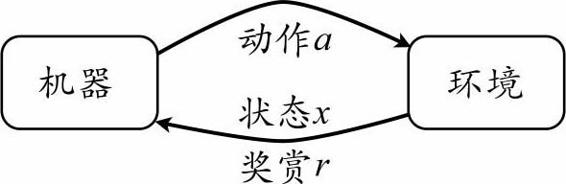

图16.1 强化学习图示

图16.1给出了强化学习的一个简单图示。强化学习任务通常用马尔可夫决策过程（**Markov Decision Process**，简称**MDP**）来描述：机器处于环境E中，状态空间为*X*，其中每个状态∈*X*是机器感知到的环境的描述，如在种瓜任务上这就是当前瓜苗长势的描述；机器能采取的动作构成了动作空间*A*，如种瓜过程中有浇水、施不同的肥、使用不同的农药等多种可供选择的动作；若某个动作α∈*A*作用在当前状态上，则潜在的转移函数*P*将使得环境从当前状态按某种概率转移到另一个状态，如瓜苗状态为缺水，若选择动作浇水，则瓜苗长势会发生变化，瓜苗有一定的概率恢复健康，也有一定的概率无法恢复；在转移到另一个状态的同时，环境会根据潜在的“奖赏”（reward）函数*R*反馈给机器一个奖赏，如保持瓜苗健康对应奖赏+1，瓜苗凋零对应奖赏−10，最终种出了好瓜对应奖赏+100.综合起来，强化学习任务对应了四元组E=〈*X*, *A*, *P*, *R*〉，其中*P*：*X*×*A*×*X*→指定了状态转移概率，*R*：*X*×*A*×*X*→指定了奖赏；在有的应用中，奖赏函数可能仅与状态转移有关，即*R*：*X*×*X*→。

图16.2给出了一个简单例子：给西瓜浇水的马尔可夫决策过程。该任务中只有四个状态（健康、缺水、溢水、凋亡）和两个动作（浇水、不浇水），在每一步转移后，若状态是保持瓜苗健康则获得奖赏1，瓜苗缺水或溢水奖赏为−1，这时通过浇水或不浇水可以恢复健康状态，当瓜苗凋亡时奖赏是最小值−100且无法恢复。图中箭头表示状态转移，箭头旁的α, p, r分别表示导致状态转移的动作、转移概率以及返回的奖赏。容易看出，最优策略在“健康”状态选择动作“浇水”、在“溢水”状态选择动作“不浇水”、在“缺水”状态选择动作“浇水”、在“凋亡”状态可选择任意动作。

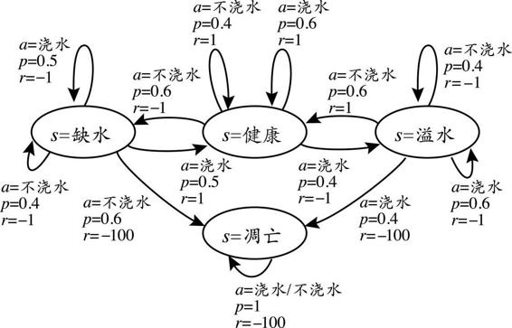

图16.2 给西瓜浇水问题的马尔可夫决策过程

需注意“机器”与“环境”的界限，例如在种西瓜任务中，环境是西瓜生长的自然世界；在下棋对弈中，环境是棋盘与对手；在机器人控制中，环境是机器人的躯体与物理世界。总之，在环境中状态的转移、奖赏的返回是不受机器控制的，机器只能通过选择要执行的动作来影响环境，也只能通过观察转移后的状态和返回的奖赏来感知环境。

机器要做的是通过在环境中不断地尝试而学得一个“策略”（policy）π，根据这个策略，在状态下就能得知要执行的动作α=π（），例如看到瓜苗状态是缺水时，能返回动作“浇水”。策略有两种表示方法：一种是将策略表示为函数π：*X*→*A*，确定性策略常用这种表示；另一种是概率表示π：*X*×*A*→，随机性策略常用这种表示，π（, α）为状态下选择动作α的概率，这里必须有απ（，α）=1。

策略的优劣取决于长期执行这一策略后得到的累积奖赏，例如某个策略使得瓜苗枯死，它的累积奖赏会很小，另一个策略种出了好瓜，它的累积奖赏会很大。在强化学习任务中，学习的目的就是要找到能使长期累积奖赏最大化的策略。长期累积奖赏有多种计算方式，常用的有“*T*步累积奖赏”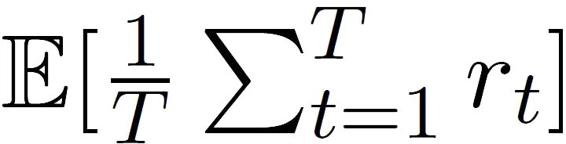和“*γ*折扣累积奖赏”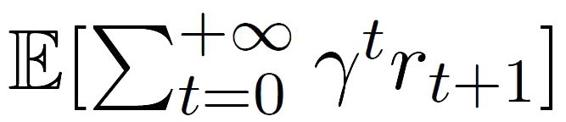，其中rt表示第t步获得的奖赏值，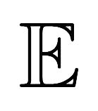表示对所有随机变量求期望。

读者也许已经感觉到强化学习与监督学习的差别。若将这里的“状态”对应为监督学习中的“示例”、“动作”对应为“标记”，则可看出，强化学习中的“策略”实际上就相当于监督学习中的“分类器”（当动作是离散的）或“回归器”（当动作是连续的），模型的形式并无差别。但不同的是，在强化学习中并没有监督学习中的有标记样本（即“示例-标记”对），换言之，没有人直接告诉机器在什么状态下应该做什么动作，只有等到最终结果揭晓，才能通过“反思”之前的动作是否正确来进行学习。因此，强化学习在某种意义上可看作具有“延迟标记信息”的监督学习问题。

## 16.2 K-摇臂赌博机

### 16.2.1 探索与利用

与一般监督学习不同，强化学习任务的最终奖赏是在多步动作之后才能观察到，这里我们不妨先考虑比较简单的情形：最大化单步奖赏，即仅考虑一步操作。需注意的是，即便在这样的简化情形下，强化学习仍与监督学习有显著不同，因为机器需通过尝试来发现各个动作产生的结果，而没有训练数据告诉机器应当做哪个动作。

欲最大化单步奖赏需考虑两个方面：一是需知道每个动作带来的奖赏，二是要执行奖赏最大的动作。若每个动作对应的奖赏是一个确定值，那么尝试一遍所有的动作便能找出奖赏最大的动作。然而，更一般的情形是，一个动作的奖赏值是来自于一个概率分布，仅通过一次尝试并不能确切地获得平均奖赏值。

亦称“K-摇臂老虎机”。

实际上，单步强化学习任务对应了一个理论模型，即“*K*-摇臂赌博机”（*K*-armed bandit）。亦称“*K*-摇臂老虎机”。如图16.3所示，*K*-摇臂赌博机有*K*个摇臂，赌徒在投入一个硬币后可选择按下其中一个摇臂，每个摇臂以一定的概率吐出硬币，但这个概率赌徒并不知道。赌徒的目标是通过一定的策略最大化自己的奖赏，即获得最多的硬币。

若仅为获知每个摇臂的期望奖赏，则可采用“仅探索”（**explorationonly**）法：将所有的尝试机会平均分配给每个摇臂（即轮流按下每个摇臂），最后以每个摇臂各自的平均吐币概率作为其奖赏期望的近似估计。若仅为执行奖赏最大的动作，则可采用“仅利用”（**exploitation-only**）法：按下目前最优的（即到目前为止平均奖赏最大的）摇臂，若有多个摇臂同为最优，则从中随机选取一个。显然，“仅探索”法能很好地估计每个摇臂的奖赏，却会失去很多选择最优摇臂的机会；“仅利用”法则相反，它没有很好地估计摇臂期望奖赏，很可能经常选不到最优摇臂。因此，这两种方法都难以使最终的累积奖赏最大化。

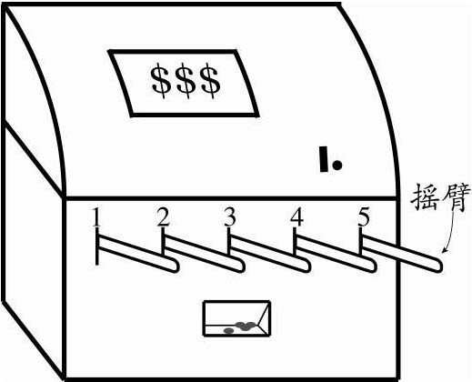

图16.3 K-摇臂赌博机图示

事实上，“探索”（即估计摇臂的优劣）和“利用”（即选择当前最优摇臂）这两者是矛盾的，因为尝试次数（即总投币数）有限，加强了一方则会自然削弱另一方，这就是强化学习所面临的“探索-利用窘境”（Exploration-Exploitation dilemma）。显然，欲累积奖赏最大，则必须在探索与利用之间达成较好的折中。

### 16.2.2 -贪

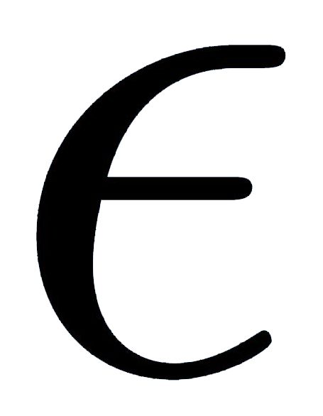-贪心法基于一个概率来对探索和利用进行折中：每次尝试时，以的概率进行探索，即以均匀概率随机选取一个摇臂；以1−的概率进行利用，即选择当前平均奖赏最高的摇臂（若有多个，则随机选取一个）。

令Q（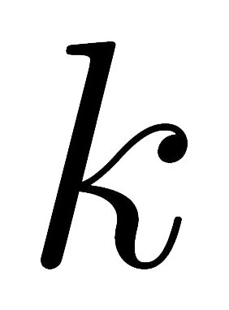）记录摇臂的平均奖赏。若摇臂被尝试了次，得到的奖赏为υ1, υ2, ..., υ，则平均奖赏。

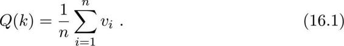

若直接根据式（16.1）计算平均奖赏，则需记录个奖赏值。显然，更高效的做法是对均值进行增量式计算，即每尝试一次就立即更新Q（）。不妨用下标来表示尝试的次数，初始时Q0（）=0。对于任意的≥1，若第−1次尝试后的平均奖赏为Q−1（），则在经过第次尝试获得奖赏υ后，平均奖赏应更新为

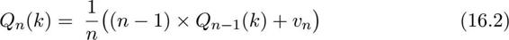

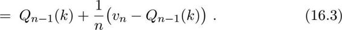

式（16.3）会在16.4.2节（16.4.2 时序差分学习）中用到。

这样，无论摇臂被尝试多少次都仅需记录两个值：已尝试次数−1和最近平均奖赏Q−1（）。式（16.3）会在16.4.2节中用到。-贪心算法描述如图16.4所示。

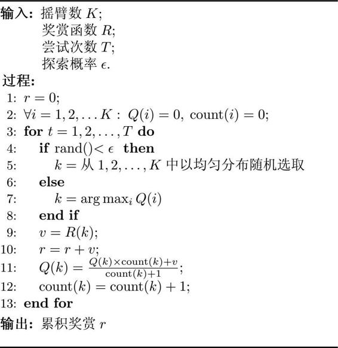

图16.4 -贪心算法

Q（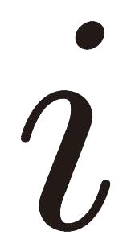）和count（）分别记录摇臂的平均奖赏和选中次数。

在\[0，1\]中生成随机数。

本次尝试的奖赏值。

式（16.2）更新平均奖赏。

若摇臂奖赏的不确定性较大，例如概率分布较宽时，则需更多的探索，此时需要较大的值；若摇臂的不确定性较小，例如概率分布较集中时，则少量的尝试就能很好地近似真实奖赏，此时需要的较小。通常令取一个较小的常数，如0.1或0.01。然而，若尝试次数非常大，那么在一段时间后，摇臂的奖赏都能很好地近似出来，不再需要探索，这种情形下可让随着尝试次数的增加而逐渐减小，例如令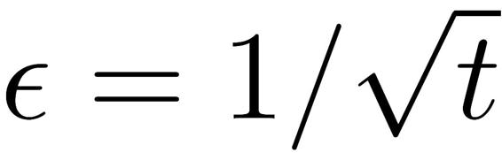.

### 16.2.3 Softmax

**Softmax**算法基于当前已知的摇臂平均奖赏来对探索和利用进行折中。若各摇臂的平均奖赏相当，则选取各摇臂的概率也相当；若某些摇臂的平均奖赏明显高于其他摇臂，则它们被选取的概率也明显更高。

**Softmax**算法中摇臂概率的分配是基于**Boltzmann**分布

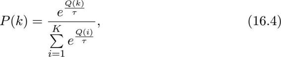

其中，Q（）记录当前摇臂的平均奖赏；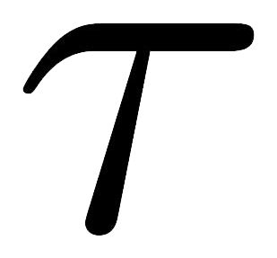＞0称为“温度”，越小则平均奖赏高的摇臂被选取的概率越高。趋于0时**Softmax**将趋于“仅利用”，趋于无穷大时**Softmax**则将趋于“仅探索”。**Softmax**算法描述如图16.5所示。

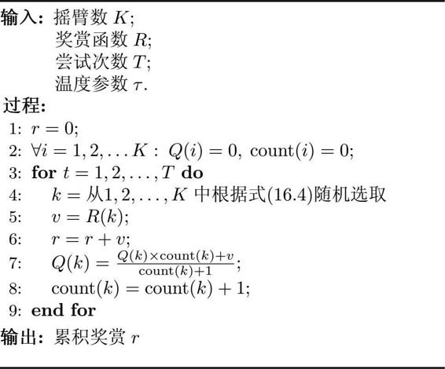

图16.5 Softmax算法

该参数在第4行使用。

Q（）和count（）分别记录摇臂的平均奖赏和选中次数。

本次尝试的奖赏值。

式（16.2）更新平均奖赏。

-贪心算法与Softmax算法孰优孰劣，主要取决于具体应用。为了更直观地观察它们的差别，考虑一个简单的例子：假定2-摇臂赌博机的摇臂1以0.4的概率返回奖赏1，以0.6的概率返回奖赏0；摇臂2以0.2的概率返回奖赏1，以0.8的概率返回奖赏0。图16.6显示了不同算法在不同参数下的平均累积奖赏，其中每条曲线对应于重复1000次实验的平均结果。可以看出，**Softmax**（=0.01）的曲线与“仅利用”的曲线几乎重合。

对于离散状态空间、离散动作空间上的多步强化学习任务，一种直接的办法是将每个状态上动作的选择看作一个*K*-摇臂赌博机问题，用强化学习任务的累积奖赏来代替*K*-摇臂赌博机算法中的奖赏函数，即可将赌博机算法用于每个状态：对每个状态分别记录各动作的尝试次数、当前平均累积奖赏等信息，基于赌博机算法选择要尝试的动作。然而这样的做法有很多局限，因为它没有考虑强化学习任务马尔可夫决策过程的结构。在16.3节将会看到，若能有效考虑马尔可夫决策过程的特性，则可有更聪明的办法。

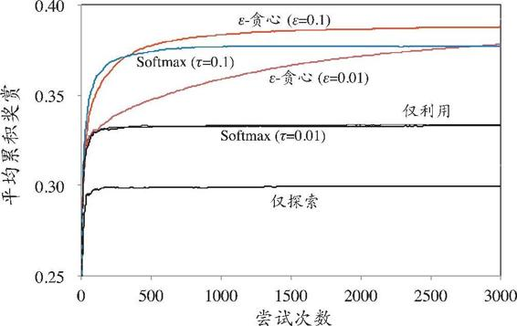

图16.6 不同算法在2-摇臂赌博机上的性能比较

## 16.3 有模型学习

（16.4 免模型学习）将讨论模型未知情形。

考虑多步强化学习任务，暂且先假定任务对应的马尔可夫决策过程四元组*E*=（*X*，*A*，*P*，*R*）均为已知，这样的情形称为“模型已知”，即机器已对环境进行了建模，能在机器内部模拟出与环境相同或近似的状况。在已知模型的环境中学习称为“有模型学习”（**model-based learning**）。此时，对于任意状态，′和动作α，在状态下执行动作α转移到′状态的概率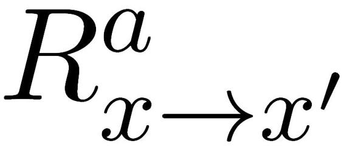是已知的，该转移所带来的奖赏也是已知的。为便于讨论，不妨假设状态空间*X*和动作空间*A*均为有限。

### 16.3.1 策略评估

在模型已知时，对任意策略π能估计出该策略带来的期望累积奖赏。令函数*V*π（）表示从状态出发，使用策略π所带来的累积奖赏；函数Qπ（, α）表示从状态出发，执行动作α后再使用策略π带来的累积奖赏。这里的*V*（·）称为“状态值函数”（**state value function**）, Q（·）称为“状态-动作值函数”（**state-action value function**），分别表示指定“状态”上以及指定“状态-动作”上的累积奖赏。

由累积奖赏的定义，有状态值函数

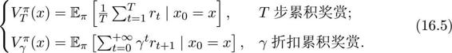

为叙述简洁，后面在涉及上述两种累积奖赏时，就不再说明奖赏类别，读者从上下文应能容易地判知.令0表示起始状态，α0表示起始状态上采取的第一个动作；对于*T*步累积奖赏，用下标t表示后续执行的步数。我们有状态-动作值函数

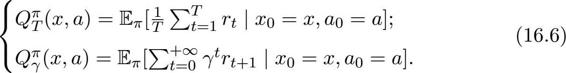

这样的递归等式称为Bellman等式。

动作-状态全概率展开。

由于MDP具有马尔可夫性质，即系统下一时刻的状态仅由当前时刻的状态决定，不依赖于以往任何状态，于是值函数有很简单的递归形式。对于*T*步累积奖赏有

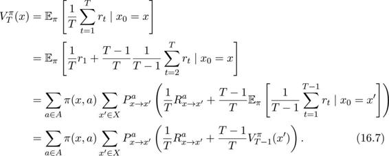

类似的，对于*γ*折扣累积奖赏有

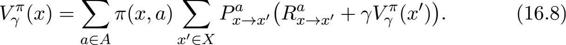

需注意的是，正是由于*P*和*R*已知，才可以进行全概率展开。

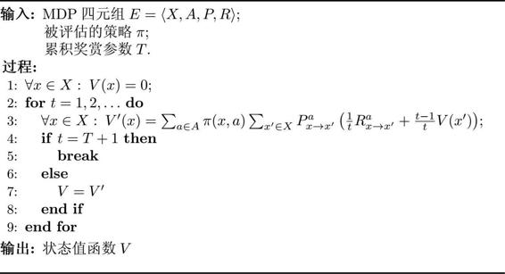

图16.7 基于*T* 步累积奖赏的策略评估算法

*V*（）为的累积奖赏。

式（16.7）更新值函数。

这个写法是为了便于在同样的算法框架下考虑*T*步累积奖赏和*γ*折扣累积奖赏。

读者可能已发现，用上面的递归等式来计算值函数，实际上就是一种动态规划算法.对于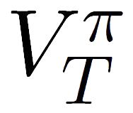，可设想递归一直进行下去，直到最初的起点；换言之，从值函数的初始值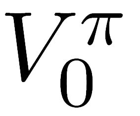出发，通过一次迭代能计算出每个状态的单步奖赏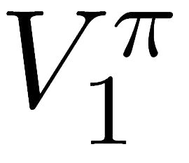，进而从单步奖赏出发，通过一次迭代计算出两步累积奖赏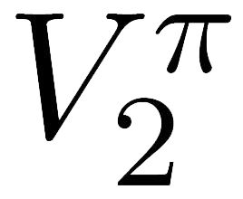，……图16.7中算法遵循了上述流程，对于*T*步累积奖赏，只需迭代*T*轮就能精确地求出值函数。

参见习题16.2。

对于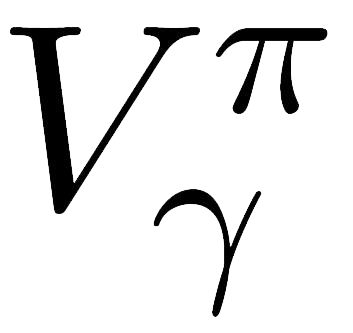，由于*γ*t在t很大时趋于0，因此也能使用类似的算法，只需将图16.7算法的第3行根据式（16.8）进行替换.参见习题16.2。此外，由于算法可能会迭代很多次，因此需设置一个停止准则。常见的是设置一个阈值*θ*，若在执行一次迭代后值函数的改变小于*θ*则算法停止；相应的，图16.7算法第4行中的t=*T*+1需替换为

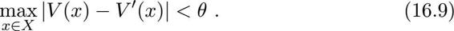

有了状态值函数*V*，就能直接计算出状态-动作值函数

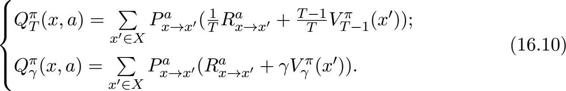

### 16.3.2 策略改进

对某个策略的累积奖赏进行评估后，若发现它并非最优策略，则当然希望对其进行改进。理想的策略应能最大化累积奖赏

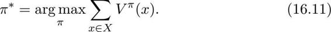

一个强化学习任务可能有多个最优策略，最优策略所对应的值函数*V*\*称为最优值函数，即

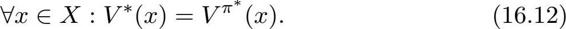

注意，当策略空间无约束时式（16.12）的*V*\*才是最优策略对应的值函数，例如对离散状态空间和离散动作空间，策略空间是所有状态上所有动作的组合，共有\|*A*\|\|*X*\|种不同的策略。若策略空间有约束，则违背约束的策略是“不合法”的，即便其值函数所取得的累积奖赏值最大，也不能作为最优值函数。

由于最优值函数的累积奖赏值已达最大，因此可对前面的**Bellman**等式（16.7）和（16.8）做一个改动，即将对动作的求和改为取最优：

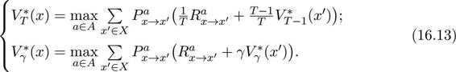

换言之，

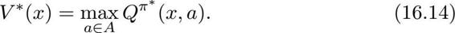

代入式（16.10）可得最优状态-动作值函数

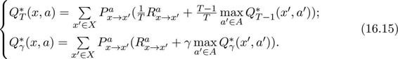

上述关于最优值函数的等式，称为最优Bellman等式，其唯一解是最优值函数。

最优**Bellman**等式揭示了非最优策略的改进方式：将策略选择的动作改变为当前最优的动作.显然，这样的改变能使策略更好。不妨令动作改变后对应的策略为π′，改变动作的条件为Qπ（，π′（））≥*V*π（），以*γ*折扣累积奖赏为例，由式（16.10）可计算出递推不等式

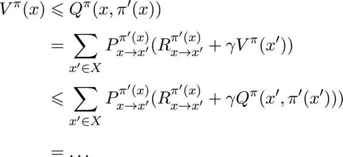 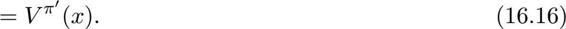

值函数对于策略的每一点改进都是单调递增的，因此对于当前策略π，可放心地将其改进为

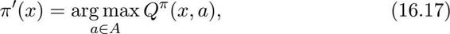

直到π′与π一致、不再发生变化，此时就满足了最优**Bellman**等式，即找到了最优策略。

### 16.3.3 策略迭代与值迭代

由前两小节我们知道了如何评估一个策略的值函数，以及在策略评估后如何改进至获得最优策略。显然，将这两者结合起来即可得到求解最优解的方法：从一个初始策略（通常是随机策略）出发，先进行策略评估，然后改进策略，评估改进的策略，再进一步改进策略，……不断迭代进行策略评估和改进，直到策略收敛、不再改变为止。这样的做法称为“策略迭代”（**policy iteration**）。

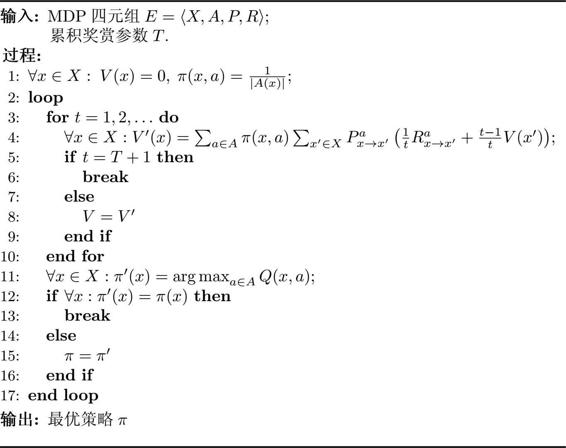

图16.8 基于*T* 步累积奖赏的策略迭代算法

\|*A*（）\|是状态下所有；可选动作数。

式（16.7）更新值函数。

式（16.10）计算Q值。

图16.8给出的算法描述，就是在基于*T*步累积奖赏策略评估的基础上，加入策略改进而形成的策略迭代算法.类似的，可得到基于*γ*折扣累积奖赏的策略迭代算法。策略迭代算法在每次改进策略后都需重新进行策略评估，这通常比较耗时。

由式（16.16）可知，策略改进与值函数的改进是一致的，因此可将策略改进视为值函数的改善，即由式（16.13）可得

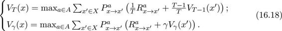

于是可得到值迭代（valueiteration）算法，如图16.9所示。

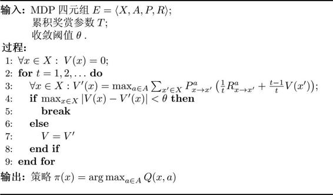

图16.9 基于*T* 步累积奖赏的值迭代算。

若采用*γ*折扣累积奖赏，只需将图16.9算法中第3行替换为

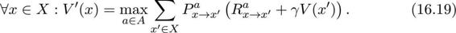

参见习题16.3（习题 16.3）

式（16.18）更新值函数。

式（16.10）计算Q值。

从上面的算法可看出，在模型已知时强化学习任务能归结为基于动态规划的寻优问题。与监督学习不同，这里并未涉及到泛化能力，而是为每一个状态找到最好的动作。

## 16.4 免模型学习

亦称“无模型学习”。

在现实的强化学习任务中，环境的转移概率、奖赏函数往往很难得知，甚至很难知道环境中一共有多少状态.若学习算法不依赖于环境建模，则称为“免模型学习”（**model-free learning**），这比有模型学习要困难得多。

### 16.4.1 蒙特卡罗强化学习

蒙特卡罗方法参见14.7节（阅读材料 14.7）；14.5.1节中使用过马尔可夫链蒙特卡罗方法。

在免模型情形下，策略迭代算法首先遇到的问题是策略无法评估，这是由于模型未知而导致无法做全概率展开.此时，只能通过在环境中执行选择的动作，来观察转移的状态和得到的奖赏。受*K*摇臂赌博机的启发，一种直接的策略评估替代方法是多次“采样”，然后求取平均累积奖赏来作为期望累积奖赏的近似，这称为蒙特卡罗强化学习。由于采样必须为有限次数，因此该方法更适合于使用*T*步累积奖赏的强化学习任务。

另一方面，策略迭代算法估计的是状态值函数*V*，而最终的策略是通过状态-动作值函数Q来获得。当模型已知时，从*V*到Q有很简单的转换方法，而当模型未知时，这也会出现困难。于是，我们将估计对象从*V*转变为Q，即估计每一对“状态-动作”的值函数。

此外，在模型未知的情形下，机器只能是从一个起始状态（或起始状态集合）开始探索环境，而策略迭代算法由于需对每个状态分别进行估计，因此在这种情形下无法实现。例如探索种瓜的过程只能从播下种子开始，而不能任意选择种植过程中的一个状态开始。因此，我们只能在探索的过程中逐渐发现各个状态并估计各状态-动作对的值函数。

综合起来，在模型未知的情形下，我们从起始状态出发，使用某种策略进行采样，执行该策略*T*步并获得轨迹

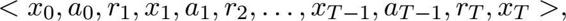

然后，对轨迹中出现的每一对状态-动作，记录其后的奖赏之和，作为该状态-动作对的一次累积奖赏采样值。多次采样得到多条轨迹后，将每个状态-动作对的累积奖赏采样值进行平均，即得到状态-动作值函数的估计。

可以看出，欲较好地获得值函数的估计，就需要多条不同的采样轨迹。然而，我们的策略有可能是确定性的，即对于某个状态只会输出一个动作，若使用这样的策略进行采样，则只能得到多条相同的轨迹。这与*K*摇臂赌博机的“仅利用”法面临相同的问题，因此可借鉴探索与利用折中的办法，例如使用-贪心法，以的概率从所有动作中均匀随机选取一个，以1−的概率选取当前最优动作。我们将确定性的策略π称为“原始策略”，在原始策略上使用-贪心法的策略记为

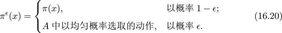

假定只有一个最优动作。

对于最大化值函数的原始策略π=argmaxαQ（，α），其-贪心策略π中，当前最优动作被选中的概率是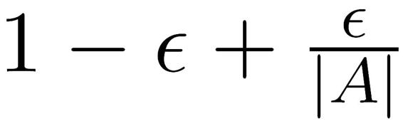，而每个非最优动作被选中的概率是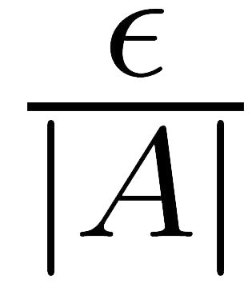。于是，每个动作都有可能被选取，而多次采样将会产生不同的采样轨迹。

与策略迭代算法类似，使用蒙特卡罗方法进行策略评估后，同样要对策略进行改进。前面在讨论策略改进时利用了式（16.16）揭示的单调性，通过换入当前最优动作来改进策略。对于任意原始策略π，其-贪心策略π仅是将的概率均匀分配给所有动作，因此对于最大化值函数的原始策略π′，同样有Qπ（，π′（））≥*V*π（），于是式（16.16）仍成立，即可以使用同样方法来进行策略改进。

图16.10给出了上述过程的算法描述，这里被评估与被改进的是同一个策略，因此称为“同策略”（**on-policy**）蒙特卡罗强化学习算法。算法中奖赏均值采用增量式计算，每采样出一条轨迹，就根据该轨迹涉及的所有“状态-动作”对来对值函数进行更新。

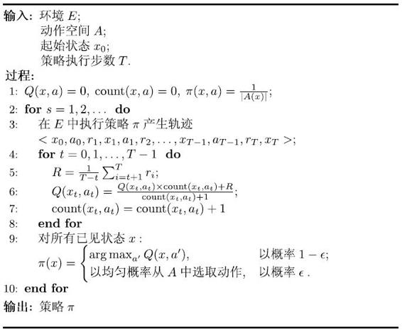

图16.10 同策略蒙特卡罗强化学习算法

默认均匀概率选取动作。采样第S条轨迹。

对每一个状态-动作对。计算轨迹中的累积奖赏。式（16.2）更新平均奖赏。

根据值函数得到策略。

同策略蒙特卡罗强化学习算法最终产生的是-贪心策略。然而，引入-贪心是为了便于策略评估，而不是为了最终使用；实际上我们希望改进的是原始（非-贪心）策略。那么，能否仅在策略评估时引入-贪心，而在策略改进时却改进原始策略呢。

这样基于一个分布的采样来估计另一个分布下的期望，称为重要性采样（importance sampling）。

这其实是可行的。不妨用两个不同的策略π和π′来产生采样轨迹，两者的区别在于每个“状态-动作对”被采样的概率不同。一般的，函数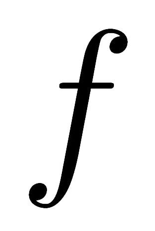在概率分布*P*下的期望可表达为

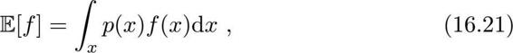

可通过从概率分布*P*上的采样{1, 2, ..., m}来估计的期望，即

若引入另一个分布*q*，则函数在概率分布*P*下的期望也可等价地写为

上式可看作（在分布*q*下的期望，因此通过在*q*上的采样{′1, ′2, ..., ′m}可估计为

回到我们的问题上来，使用策略π的采样轨迹来评估策略π，实际上就是对累积奖赏估计期望

其中*R*表示第条轨迹上自状态至结束的累积奖赏。若改用策略π′的采样轨迹来评估策略π，则仅需对累积奖赏加权，即

其中和分别表示两个策略产生第条轨迹的概率.对于给定的一条轨迹〈0，α0, r1, ..., T−1, αT−1, rT, T〉，策略π产生该轨迹的概率为

虽然这里用到了环境的转移概率*P*α→+1，但式（16.24）中实际只需两个策略概率的比值

默认均匀概率选取动作；采样第S条轨迹。

计算修正的累积奖赏。连乘内下标大于上标的项取值为1。

式（16.2）更新平均奖赏。

根据值函数得到策略。

若π为确定性策略而π′是π的-贪心策略，则π（，α）对于α=π（）始终为1，π′（，α）为或，于是就能对策略π进行评估了。图16.11给出了“异策略”（**off-policy**）蒙特卡罗强化学习算法的描述。

图16.11 异策略蒙特卡罗强化学习算法

### 16.4.2 时序差分学习

蒙特卡罗强化学习算法通过考虑采样轨迹，克服了模型未知给策略估计造成的困难。此类算法需在完成一个采样轨迹后再更新策略的值估计，而前面介绍的基于动态规划的策略迭代和值迭代算法在每执行一步策略后就进行值函数更新。两者相比，蒙特卡罗强化学习算法的效率低得多，这里的主要问题是蒙特卡罗强化学习算法没有充分利用强化学习任务的MDP结构。时序差分（**Temporal Difference**，简称TD）学习则结合了动态规划与蒙特卡罗方法的思想，能做到更高效的免模型学习。

蒙特卡罗强化学习算法的本质，是通过多次尝试后求平均来作为期望累积奖赏的近似，但它在求平均时是“批处理式”进行的，即在一个完整的采样轨迹完成后再对所有的状态-动作对进行更新。实际上这个更新过程能增量式进行。对于状态-动作对（，α），不妨假定基于t个采样已估计出值函数，则在得到第t+1个采样rt+1时，类似式（16.3），有

显然，只需给（，α）加上增量即可。更一般的，将替换为系数αt+1，则可将增量项写作.在实践中通常令αt为一个较小的正数值α，若将（，α）展开为每步累积奖赏之和，则可看出系数之和为1，即令αt=α不会影响Qt是累积奖赏之和这一性质。更新步长α越大，则越靠后的累积奖赏越重要。

以*γ*折扣累积奖赏为例，利用动态规划方法且考虑到模型未知时使用状态-动作值函数更方便，由式（16.10）有

通过增量求和可得

其中′是前一次在状态执行动作α后转移到的状态，α′是策略π在′上选择的动作。

使用式（16.31），每执行一步策略就更新一次值函数估计，于是得到图16.12的算法。该算法由于每次更新值函数需知道前一步的状态（**state**）、前一步的动作（**action**）、奖赏值（**reward**）、当前状态（**state**）、将要执行的动作（**action**），由此得名为**Sarsa**算法\[**Rummery and Niranjan, 1994**\]。显然，**Sarsa**是一个同策略算法，算法中评估（第6行）、执行（第5行）的均为-贪心策略。

将这几个英文单词的首字母连起来。

默认均匀概率选取动作。

单步执行策略。原始策略的-贪心策略.式（16.31）更新值函数。

默认均匀概率选取动作。

单步执行策略。原始策略。式（16.31）更新值函数。

将**Sarsa**修改为异策略算法，则得到图16.13描述的Q-学习（**Q-learning**）算法\[**Watkins and Dayan，1992**\]，该算法评估（第6行）的是原始策略，而执行（第4行）的是-贪心策略。

图16.12 Sarsa 算法

图16.13 Q-学习算法

## 16.5 值函数近似

前面我们一直假定强化学习任务是在有限状态空间上进行，每个状态可用一个编号来指代；值函数则是关于有限状态的“表格值函数”（**tabular value function**），即值函数能表示为一个数组，输入对应的函数值就是数组元素的值，且更改一个状态上的值不会影响其他状态上的值。然而，现实强化学习任务所面临的状态空间往往是连续的，有无穷多个状态。这该怎么办呢？

一个直接的想法是对状态空间进行离散化，将连续状态空间转化为有限离散状态空间，然后就能使用前面介绍的方法求解。遗憾的是，如何有效地对状态空间进行离散化是一个难题，尤其是在对状态空间进行探索之前。

实际上，我们不妨直接对连续状态空间的值函数进行学习。假定状态空间为维实数空间，此时显然无法用表格值函数来记录状态值。先考虑简单情形，即值函数能表达为状态的线性函数\[**Busoniu et al., 2010**\]

其中为状态向量，*θ*为参数向量。由于此时的值函数难以像有限状态那样精确记录每个状态的值，因此这样值函数的求解被称为值函数近似（**value function approximation**）.

我们希望通过式（16.32）学得的值函数尽可能近似真实值函数*V*π，近似程度常用最小二乘误差来度量：

其中表示由策略π所采样而得的状态上的期望。

为了使误差最小化，采用梯度下降法，对误差求负导数

于是可得到对于单个样本的更新规则

我们并不知道策略的真实值函数*V*π，但可借助时序差分学习，基于*V*π（）=r+*γV*π（′）用当前估计的值函数代替真实值函数，即

其中′是下一时刻的状态。

需注意的是，在时序差分学习中需要状态-动作值函数以便获取策略。这里一种简单的做法是令*θ*作用于表示状态和动作的联合向量上，例如给状态向量增加一维用于存放动作编号，即将式（16.32）中的替换为（; α）；另一种做法是用0/1对动作选择进行编码得到向量α=（0; ...; 1; ...; 0），其中“1”表示该动作被选择，再将状态向量与其合并得到（; α），用于替换式（16.32）中的。这样就使得线性近似的对象为状态-动作值函数。

核方法参见第6章（第6章 支持向量机）。

原始策略的-贪心策略。式（16.36）更新参数。

基于线性值函数近似来替代Sarsa算法中的值函数，即可得到图16.14的线性值函数近似Sarsa算法。类似地可得到线性值函数近似Q-学习算法。显然，可以容易地用其他学习方法来代替式（16.32）中的线性学习器，例如通过引入核方法实现非线性值函数近似。

图16.14 线性值函数近似Sarsa 算法

## 16.6 模仿学习

亦称“学徒学习”（**apprenticeship learning**），“示范学习”（**learning from demonstration**），“观察学习”（**learning by watching**）；与机器学习早期的“示教学习”有直接联系，参见1.5节（1.5 发展历程）

在强化学习的经典任务设置中，机器所能获得的反馈信息仅有多步决策后的累积奖赏，但在现实任务中，往往能得到人类专家的决策过程范例，例如在种瓜任务上能得到农业专家的种植过程范例。从这样的范例中学习，称为“模仿学习”（**imitation learning**）。

### 16.6.1 直接模仿学习

强化学习任务中多步决策的搜索空间巨大，基于累积奖赏来学习很多步之前的合适决策非常困难，而直接模仿人类专家的“状态-动作对”可显著缓解这一困难，我们称其为“直接模仿学习”。

假定我们获得了一批人类专家的决策轨迹数据{1, 2, ..., m}，每条轨迹包含状态和动作序。

其中为第条轨迹中的转移次数。

有了这样的数据，就相当于告诉机器在什么状态下应选择什么动作，于是可利用监督学习来学得符合人类专家决策轨迹数据的策略。

我们可将所有轨迹上的所有“状态-动作对”抽取出来，构造出一个新的数据集。

即把状态作为特征，动作作为标记；然后，对这个新构造出的数据集合D使用分类（对于离散动作）或回归（对于连续动作）算法即可学得策略模型。学得的这个策略模型可作为机器进行强化学习的初始策略，再通过强化学习方法基于环境反馈进行改进，从而获得更好的策略。

### 16.6.2 逆强化学习

在很多任务中，设计奖赏函数往往相当困难，从人类专家提供的范例数据中反推出奖赏函数有助于解决该问题，这就是逆强化学习（**inverse reinforcement learning**）\[**Abbeel and Ng, 2004**\]。

在逆强化学习中，我们知道状态空间*X*、动作空间*A*，并且与直接模仿学习类似，有一个决策轨迹数据集{1, 2, ..., m}。逆强化学习的基本思想是：欲使机器做出与范例一致的行为，等价于在某个奖赏函数的环境中求解最优策略，该最优策略所产生的轨迹与范例数据一致。换言之，我们要寻找某种奖赏函数使得范例数据是最优的，然后即可使用这个奖赏函数来训练强化学习策略。

不妨假设奖赏函数能表达为状态特征的线性函数，即*R*（）=T.于是，策略π的累积奖赏可写为

即状态向量加权和的期望与系数的内积。

将状态向量的期望简写为π.注意到获得π需求取期望。我们可使用蒙特卡罗方法通过采样来近似期望，而范例轨迹数据集恰可看作最优策略的一个采样，于是，可将每条范例轨迹上的状态加权求和再平均，记为\*。对于最优奖赏函数和任意其他策略产生的π，有

若能对所有策略计算出（\*−π），即可解出

显然，我们难以获得所有策略，一个较好的办法是从随机策略开始，迭代地求解更好的奖赏函数，基于奖赏函数获得更好的策略，直至最终获得最符合范例轨迹数据集的奖赏函数和策略，如图16.15算法所示。注意在求解更好的奖赏函数时，需将式（16.39）中对所有策略求最小改为对之前学得的策略求最小。

图16.15 迭代式逆强化学习算法

## 16.7 阅读材料

强化学习专门书籍中最著名的是\[**Sutton and Barto, 1998**\]。\[**Gosavi, 2003**\]从优化的角度来讨论强化学习，\[**Whiteson, 2010**\]则侧重于介绍基于演化算法搜索的强化学习方法。\[**Mausam and Kolobov, 2012**\]从马尔可夫决策过程的视角介绍强化学习，\[**Sigaud and Buffet, 2010**\]覆盖了很多内容，包括本章未介绍的部分可观察马尔可夫决策过程（**Partiall yObservable MDP**，简称**POMDP**）、策略梯度法等。基于值函数近似的强化学习可参阅\[**Busoniu et al., 2010**\]。

欧洲强化学习研讨会（**EWRL**）是专门性的强化学习系列研讨会，多学科强化学习与决策会议（**RLDM**）则是从2013年开始的新会议。

\[**Kaelbling et al., 1996**\]是一个较早的强化学习综述，\[**Kober et al., 2013; Deisenroth et al., 2013**\]则综述了强化学习在机器人领域的应用。

\[**Vermorel and Mohri, 2005**\]介绍了多种*K*-摇臂赌博机算法并进行了比较。多摇臂赌博机模型在统计学领域有大量研究\[**Berry and Fristedt, 1985**\]，近年来在“在线学习”（**online learning**）、“对抗学习”（**adversarial learning**）等方面有广泛应用，\[Bubeck and Cesa-Bianchi, 2012\]对其“悔界”（**regret bound**）分析方面的结果进行了综述。

“后悔”（regret）是指在不确定性条件下的决策与确定性条件下的决策所获得的奖赏间的差别。

Samuel跳棋工作参见（小故事：“机器学习”名字的由来）

时序差分（TD）学习最早是**A.Samuel**在他著名的跳棋工作中提出，\[**Sutton, 1988**\]提出了TD（λ）算法，由于\[**Tesauro, 1995**\]基于TD（λ）研制的**TD-Gammon**程序在西洋双陆棋上达到人类世界冠军水平而使TD学习备受关注。Q-学习算法是\[**Watkins and Dayan, 1992**\]提出，**Sarsa**则是在Q-学习算法基础上的改进\[**Rummery and Niranjan, 1994**\].TD学习近年来仍有改进和推广，例如广义TD学习\[**Ueno et al., 2011**\]、使用资格迹（**eligibility traces**）的TD学习\[**Geist and Scherrer, 2014**\]等。\[**Dann et al., 2014**\]对TD学习中的策略评估方法进行了比较。

模仿学习被认为是强化学习提速的重要手段\[**Lin, 1992; Price and Boutilier, 2003**\]，在机器人领域被广泛使用\[**Argall et al., 2009**\].\[**Abbeel and Ng, 2004; Langford and Zadrozny, 2005**\]提出了逆强化学习方法。

在运筹学与控制论领域，强化学习方面的研究被称为“近似动态规划”（**approximate dynamic programming**），可参阅\[**Bertsekas, 2012**\]。

## 习题

16.1 用于*K*-摇臂赌博机的UCB（**Upper Confidence Bound**，上置信界）方法每次选择Q（）+*uc*（）最大的摇臂，其中Q（）为摇臂当前的平均奖赏，*uc*（）为置信区间。例如

其中为已执行所有摇臂的总次数，为已执行摇臂的次数。试比较UCB方法与-贪心法和Softmax方法的异同。

16.2 借鉴图16.7，试写出基于*γ*折扣奖赏函数的策略评估算法。

16.3 借鉴图16.8，试写出基于*γ*折扣奖赏函数的策略迭代算法。

16.4 在没有MDP模型时，可以先学习MDP模型（例如使用随机策略进行采样，从样本中估计出转移函数和奖赏函数），然后再使用有模型强化学习方法。试述该方法与免模型强化学习方法的优缺点。

16.5 试推导出**Sarsa**算法的更新公式（16.31）。

16.6 试借鉴图16.14给出线性值函数近似Q-学习算法。

16.7 线性值函数近似在实践中往往有较大误差.试结合BP神经网络，将线性值函数近似**Sarsa**算法推广为使用神经网络近似的**Sarsa**算法。

16.8 试结合核方法，将线性值函数近似**Sarsa**算法推广为使用核函数的非线性值函数近似Sarsa算法。

16.9 对于目标驱动（**goal-directed**）的强化学习任务，目标是到达某一状态，例如将汽车驾驶到预定位置。试为这样的任务设置奖赏函数，并讨论不同奖赏函数的作用（例如每一步未达目标的奖赏为0、−1或1）。

16.10 \*与传统监督学习不同，直接模仿学习在不同时刻所面临的数据分布可能不同。试设计一个考虑不同时刻数据分布变化的模仿学习算法。

## 参考文献

Abbeel, P. and A. Y. Ng. （2004）. “Apprenticeship learning via inverse reinforcement learning. ”In*Proceedings ofthe 21st International Conference on Machine Learning（ICML）*, Banff, Canad.

Argall, B. D., S. Chernova, M. Veloso, and B. Browning. （2009）. “A survey of robot learning from demonstration. ”*Robotics and Autonomous Systems*, 57（5）：469–483.

Berry, D. and B. Fristedt. （1985）. *Bandit Problems*. Chapman & Hall/CRC, London, UK.

Bertsekas, D. P. （2012）. *Dynamic Programming and Optimal Control：Approximate Dynamic Programming*, 4th edition. Athena Scientific, Nashua, N.

Bubeck, S. and N. Cesa-Bianchi. （2012）.“Regret analysis of stochastic and nonstochastic multi-armed bandit problems.”*Foundations and Trends in Machine Learning*, 5（1）：1–122.

Busoniu, L., R. Babuska, B. De Schutter, and D. Ernst.（2010）. *Reinforcement Learning and Dynamic Programming Using Function Approximators*. Chapman & Hall/CRC Press, Boca Raton, FL.

Dann, C., G. Neumann, and J. Peters. （2014）. “Policy evaluation with temporal differences：Asurve yan dcomparison. *Journal ofMachine Learning Research*, 15：809–883.

Deisenroth, M. P., G. Neumann, and J. Peters. （2013）. “A survey on policy search for robotics.”*Foundations and Trends in Robotics*, 2（1-2）：1–142.

Geist, M. and B. Scherrer. （2014）. “Off-polic ylearnin gwit heligibilit ytraces A survey.”*Journal ofMachine Learning Research*, 15：289–333.

Gosavi, A. （2003）. *Simulation-Based Optimization：Parametric Optimization Techniques and Reinforcement Learning*. Kluwer, Norwell, MA.

Kaelbling, L. P., M. L. Littman, and A. W. Moore.（1996）. “Reinforcement learning：A survey. ”*Journal ofArtificia lIntelligenc eResearc*,4：237–285.

Kober, J., J. A. Bagnell, and J. Peters. （2013）. “Reinforcement learning in robotics：A survey. ”*International Journal on Robotics Research*, 32（11）：1238–1274.

Langford, J. and B. Zadrozny. （2005）. “Relating reinforcement learning performance to classificatio nperformance.”I*Proceedings of the 22nd International Conference on Machine Learning（ICML）*, 473–480, Bonn, Germany.

Lin, L.-J. （1992）. “Self-improving reactive agents based on reinforcement learning, planning and teaching. ”*Machine Learning*, 8（3-4）：293–321.

Mausam and A. Kolobov. （2012）.*Planning with Markov Decision Processes：An AIPerspective*. Morgan & Claypool, San Rafael, CA.

Price, B. and C. Boutilier. （2003）.“Accelerating reinforcement learning through implicit imitation. ”*Journal ofArtificia lIntelligenc eResearc*, 19：569–629.

Rummery, G. A. and M. Niranjan. （1994）.“On-line Q-learning using connectionist systems.”TechnicalReport CUED/F-INFENG/TR 166, Engineering Department, Cambridge University, Cambridge, UK.

Sigaud, O.and O. Buffet. （2010）*Markov Decision Processes in Artificia lIn telligence*. Wiley, Hoboken, NJ.

Sutton, R. S. （1988）.“Learning to predict by the methods oftemporal differ ences.”*Machine Learning*, 3（1）：9–44.

Sutton, R. S. and A. G. Barto.（1998）.*Reinforcement Learning：An Introduction*. MIT Press, Cambridge, MA.

Tesauro, G.（1995）.“Temporal differenc elearnin gan dTD-Gammon.*Communications ofthe ACM*, 38（3）：58–68.

Ueno, T., S. Maeda, M. Kawanabe, andS. Ishii.（2011）.“GeneralizedTD learning.”*Journal ofMachine Learning Research*, 12：1977–2020.

Vermorel, J. andM. Mohri. （2005）. “Multi-armedbandit algorithms and empirical evaluation. ”In*Proceedings ofthe 16thEuropean Conference on Machine Learning（ECML）*,437–448, Porto, Portugal.

Watkins, C. J. C. H. and P. Dayan. （1992）. “Q-learning.”*Machine Learning*, 8（3-4）：279–292.

Whiteson, S. （2010）. *Adaptive Representations for Reinforcement Learning*. Springer, Berlin.

## 休息一会儿

### 小故事：马尔可夫决策过程与安德烈·马尔可夫

安德烈·安德烈维奇·马尔可夫（**Andrey Andreyevich Markov，1856—1922**）是著名俄罗斯数学家、圣彼得堡数学学派代表性人物，在概率论、数论、函数逼近论、微分方程等方面有重要贡献。

马尔可夫出生在莫斯科东南的梁赞（**Ryazan**），17岁时独立发现了一种线性常微分方程的解法，引起了圣彼得堡大学几位数学家的注意。1874年他考入圣彼得堡大学数学系，1878年毕业并留校任教，1884年获博士学位，导师是圣彼得堡学派领袖、著名数学家切比雪夫。此后马尔可夫一直在圣彼得堡大学任教。马尔可夫在早期主要是沿着切比雪夫开创的方向，改进和完善了大数定律和中心极限定理，但他最重要的工作无疑是开辟了随机过程这个领域。他在1906—1912年间提出了马尔可夫链，开创了对马尔可夫过程的研究.现实世界里小到分子的布朗运动、大到传染病流行过程，马尔可夫过程几乎无所不在。在他的名著《概率演算》中，马尔可夫是以普希金的长诗《叶甫根尼·奥涅金》中元、辅音字母变化的规律为例来展示马尔可夫链的性质。马尔可夫决策过程是马尔可夫过程与确定性动态规划的结合，基本思想在二十世纪五十年代出现，此时马尔可夫已去世三十多年了。

切比雪夫在圣彼得堡大学培养出马尔可夫、李亚普诺夫、柯尔金、格拉维等著名数学家，还影响了圣彼得堡大学之外的很多数学家。圣彼得堡学派标志着俄罗斯数学走到了世界前沿。

马尔可夫的儿子也叫安德烈·安德烈维奇·马尔可夫（1903—1979），也是著名数学家，数理逻辑中的“马尔可夫原则”（**Markov Principle**）、“马尔可夫规则”（**Markov Rule**），理论计算机科学中图灵完备的“马尔可夫算法”等，是以小马尔可夫的名字命名的。马尔可夫的弟弟弗拉基米尔·安德烈维奇·马尔可夫（1871—1897）也是一位数学家，“马尔可夫兄弟不等式”就是以他和哥哥安德烈的名字命名的。

