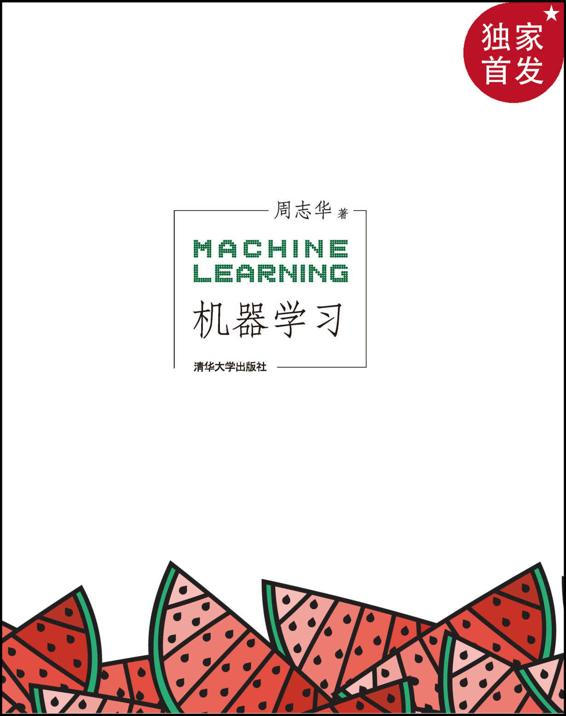

---
hide:
  - toc
---

FULL TEXT · 16 CHAPTERS · 1100+ FIGURES

# 周志华《机器学习》

“西瓜书”完整 EPUB 正文已转换为 16 个按章组织的 Markdown 页面，公式、表格和插图随章保存。第 1–9 章开头嵌入周志华《机器学习初步》对应分 P，第 10–16 章保留原书主线并明确标出视频覆盖边界。

[开始阅读第 1 章](chapters/01-introduction/index.md){ .md-button .md-button--primary }
[阅读前置内容](00-front-matter/index.md){ .md-button }
[下载原 EPUB](downloads/周志华-机器学习.epub){ .md-button download }

  
  

## 在线阅读说明

- 左侧目录按原书 16 章组织，站内搜索可直接检索正文。
- 每章图片位于该章自己的 `images` 目录，页面不依赖外部图床。
- 视频选集共 56P，对应教材第 1–9 章；第 5、6 章已按书本主题校正顺序。
- 原 EPUB 与 PDF 下载仍保留，在线正文以本次 EPUB 转换结果为准。

  

## 章节目录

- [第 1 章　绪论](chapters/01-introduction/index.md)
- [第 2 章　模型评估与选择](chapters/02-model-evaluation-and-selection/index.md)
- [第 3 章　线性模型](chapters/03-linear-models/index.md)
- [第 4 章　决策树](chapters/04-decision-trees/index.md)
- [第 5 章　神经网络](chapters/05-neural-networks/index.md)
- [第 6 章　支持向量机](chapters/06-support-vector-machines/index.md)
- [第 7 章　贝叶斯分类器](chapters/07-bayesian-classifiers/index.md)
- [第 8 章　集成学习](chapters/08-ensemble-learning/index.md)
- [第 9 章　聚类](chapters/09-clustering/index.md)
- [第 10 章　降维与度量学习](chapters/10-dimensionality-reduction-and-metric-learning/index.md)
- [第 11 章　特征选择与稀疏学习](chapters/11-feature-selection-and-sparse-learning/index.md)
- [第 12 章　计算学习理论](chapters/12-computational-learning-theory/index.md)
- [第 13 章　半监督学习](chapters/13-semi-supervised-learning/index.md)
- [第 14 章　概率图模型](chapters/14-probabilistic-graphical-models/index.md)
- [第 15 章　规则学习](chapters/15-rule-learning/index.md)
- [第 16 章　强化学习](chapters/16-reinforcement-learning/index.md)

## 其他内容

- [序言、前言、使用说明与主要符号表](00-front-matter/index.md)
- [附录与后记](99-back-matter/index.md)
