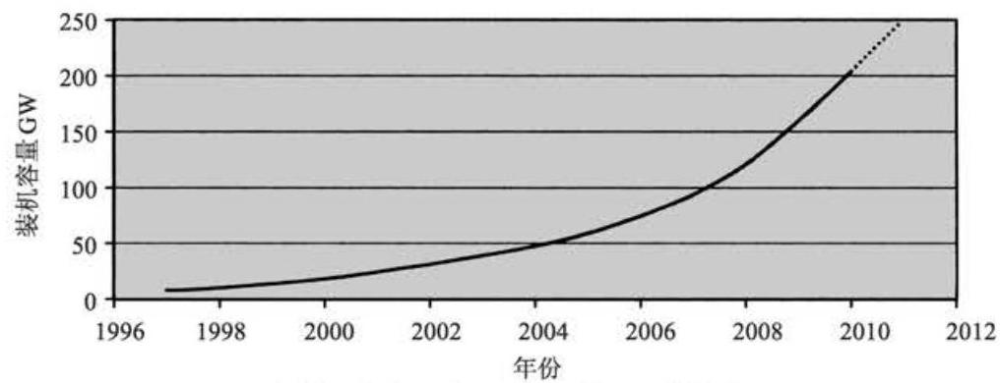
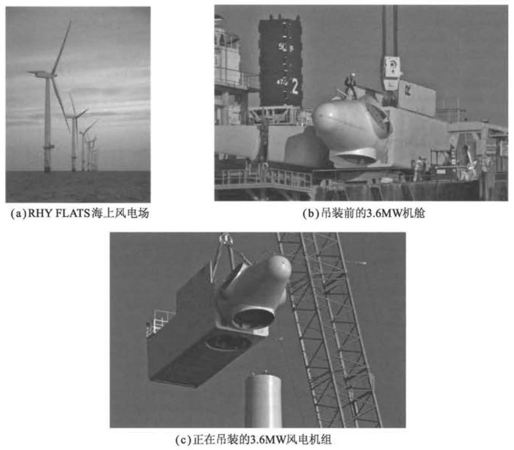
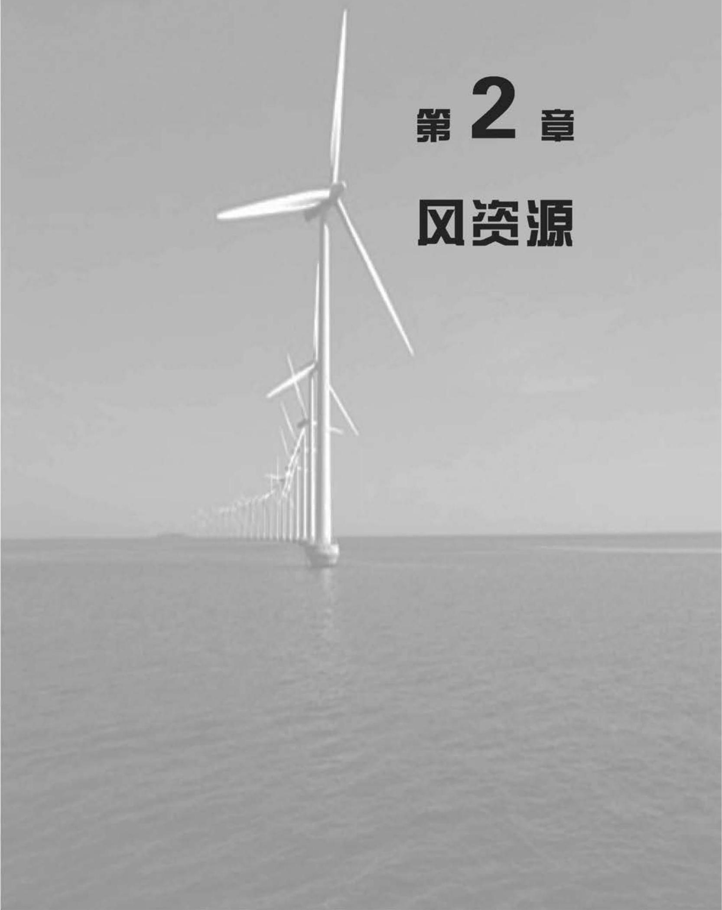

# 第 1 章 概 论

## 1.1 发展历程

人类利用风能的历史较为悠久。最早可以追溯到 3000 年前风车的使用。那时候风车的主要用途是磨碎粮食和提水。当然，最早在海上航行的船只依靠的最基本动力源是风能。自中世纪起, 水平轴风车产业是农村经济构成的主要部分。 但是，随着廉价的化石燃料能源的出现以及农村电气化的实现，风车渐渐退出了历史的舞台。利用风车 (或风力发电机组 (简称 “风力机”)) 发电的历史可以追溯到 19 世纪晚期, 美国的 Brush 研制了一台 12kW 的直流风力机, 丹麦的 LaCour 也开展了有关风力机的研究工作。然而, 在 20 世纪的大部分时间里, 除了某些边远地区利用风能为蓄电池充电提供电力外, 人们对风能几乎别无他用。而且一旦电力网铺设到这些地区, 这些利用风能的低功率发电系统就会被取代。一个广为人知的特例是美国在 1941 年制造的 1250kW Smith-Putnam (史密斯-帕特曼) 风力机。 这个著名的风力机的叶轮由铁材料制成，直径达 53m。为了达到减小载荷的目的， 该风力机采用了薄片状的叶片和全翼型变桨距控制。尽管有一个叶片的翼梁部分在 1945 年不幸被损坏，但其仍然作为最大的风力机存在了 40 年之久(Putnam，1948)。

Golding(1955)、Shepherd 和 Divone(1994)记录了早期的风力机发展史。在 1931 年，苏联制造了一台功率为 100kW、直径为 30m 的 Balaclava(巴拉克拉法帽) 风力机；19 世纪 50 年代早期，英国制造了一台功率为 100kW、直径为 ${24}\mathrm{m}$ 的 Andrea Enfield(安德鲁-恩菲)风力机。这种风力机的叶片是中空的，尖端有开口。 当叶片转动时，在开口处产生低压，抽出叶片内直通到塔内的空气。由于塔底部有进风口，空气不断地从底部向上流，从而驱动塔内安装的风力机发电。在丹麦，功率为 ${200}\mathrm{{kW}}$ 、直径为 ${24}\mathrm{m}$ 的 Gedser(盖瑟)风力机建于 1956 年，而 1963 年法国电力工业试验了一台功率为 ${1.1}\mathrm{{MW}}$ 、直径为 ${35}\mathrm{\;m}$ 的风力机。在德国，Hutter(胡特) 于 19 世纪 50 年代和 60 年代建立了一些新型的、轻型的风力机。尽管人们对风力机技术的发展和英国电力研究协会颁发的最高奖项抱有较高的热情, 但却没有对风力发电保持浓厚的兴趣，而且这种现象一直持续到 1973 年石油价格上涨。

石油价格的突然上涨, 促进了一系列重大的政府资助项目的研究与发展。在美国，开始建造一系列示范风力发电机组，如从 1975 年的直径 38m、功率 100kW 的 Mod-0 风力发电机组到 1987 年直径达 97.5m、功率为 2.5MW 的 Mod-5B 风力发电机组。类似的项目在英国、德国和瑞典也同样迅速地发展起来。诸如设计者可能证明最具性价比和创新概念的研究变得完全不确定。加拿大建立了 4MW 的垂直轴 Darrieus 风力发电机组,这个构思也用于研究直径为 ${34}\mathrm{\;m}$ 的美国 Sandia 垂直轴试验装置。在英国，Peter Musgrove 提出了另外一种利用垂直的叶片可产生 $\mathrm{H}$ 形叶轮的垂直轴风力发电机组的设计方法,而且建成了 ${500}\mathrm{\;{kW}}$ 的试验装置。 1981 年, 美国建造并试验了一种新型的水平轴 3MW 风力发电机组, 该机组利用液压驱动进行偏航对风，整个机舱始终处于迎风方向。然而，在一段时间内，叶片数目的最佳选择仍然不明确，单叶片、双叶片以及三叶片的大型风力发电机组始终处于并存的状态。

从上述政府资助的研究项目中,人们获得了许多重要的科学知识和工程实践经验, 而且所有的风力机样机基本上按照设计要求运行。然而,人们立刻意识到低估了无人值守的大型风力发电机组在恶劣的大风天气中运行可能出现的问题，而且风力机样机的可靠性也不高。当数兆瓦级的样机还在研制阶段，私营企业(通常是在政府支持下)已在制造用于商业销售的小型、简单的风力机。尤其是在 19 世纪 80 年代中期，加利福尼亚州的商业支持机构带动了大量小型(<100kW>风力机的安装。然而，这些风力机的设计还存在一些问题，所幸的是，它们容量较小，较易于维修和改装。所谓的“丹麦型”风力发电机组的概念是指由三叶片、失速调节的叶片和恒速运行的感应发电机的传动系统。这一简单结构被使用得相当成功，而且现在已经被应用在直径为 ${60}\mathrm{\;m}$ 、功率为 ${1.5}\mathrm{{MW}}$ 的风力发电机组上。然而,由于空气动力失速特性很难预测、感应发电机很难在传动链上提供足够的阻尼和转矩匹配、很难满足电网公司连接到电网的需求, 以及很难满足电网准则等一系列问题, 使得这种设计在考虑叶片直径和发电机容量时变得异常困难。因此, 商业化的风力发电机组的尺寸达到甚至超过了 20 世纪 80 年代样机的概念研究，那时候设计人员采用了变速变桨运行控制以及使用了先进的材料。

1991 年第一个近海风电场在 Vindeby 建成。风电场距离海岸 3km, 有 11 台 450kW 的风力发电机组。整个 20 世纪 90 年代，少量的小型风力机布置在近海，直到 2002 年 160MW 风电场布置在距离丹麦西海岸 20km 的近海海域。这是第一个利用近海变电站，将电量采集电压从 ${30}\mathrm{{kV}}$ 上升到 ${150}\mathrm{{kV}}$ 以便于传送到岸上的工程。就在本书写作的同时 (2010 年), 英格兰正在开发的 1000MW 工程其中的 500MW 风电场正在其近海海岸建设。这些正在安装的近海风电场的风力机为三叶片，上风向布置。因为布置在远离陆地的海上，更加宽松的噪声限值以及外观重要性的减少都增加了更大、更软的风力机叶片，更高的叶尖速度，甚至双叶片、单叶片出现的可能性也大大增加。

1973 年, 由于人们对石油价格和不可再生的常规化石能源的担心, 在一定程度上促进了风能产业的发展。大概 1990 年开始, 利用风力发电的主要原因是其具有非常低的二氧化碳排放量(贯穿生产、安装、运行和报废整个生命周期)，而且对气候变化的影响较小。在 2006 年，由于较高的油价以及出于对能源安全性的考虑引发了关注风力发电技术的热潮，许多国家出台了一系列政策措施鼓励利用风能。 2007 年欧盟宣布一项政策,到 2020 年可再生资源提供的电力能源要占 20% 。由于可再生能源用于交通和供热非常困难,暗示了一些国家提出 30% < 40% 的电力供应应由可再生能源提供, 其中风力发电占绝大部分。为了进一步应对气候变化, 许多国家在制定能源政策时雄心勃勃地提出，到 2050 年减少温室气体排放达 80% 以上。

风能技术在部分国家的发展要远远领先其他国家，这种差异不能简单归咎于风资源的不同。其他许多重要因素包括:风力发电的财政支持机制、电网人网许可、当地政府许可风电场建设，以及当地人们的感受，尤其是视觉影响。因此，发展海上风电，尽管成本相对较高，但相比风电场环境影响问题要小很多。

对于新型的发电技术，风力发电需要通过财政支持来鼓励其发展以及刺激民营企业投资。许多国家制定了支持政策，意识到风能能为应对气候变化以及国家能源储备安全做出贡献。目前, 针对提供对风力发电的支持最好的机制需要积极地探讨,一方面要促进以最小的代价发展风能,同时不破坏现有的电力市场。

返税制在许多国家都存在, 尤其是德国和西班牙。以固定的价格支付给每千瓦时可再生能源发电，但针对风能、太阳能，以及其他可再生能源会存在不同的贴现率。这种支持机制的好处就是可以从成功的项目中获得稳定的收入，同时可以使这些加快风能及其他可再生能源发展的支持者获得荣誉。另一种方法就是配额制, 即政府强制电力公司部分能源来源于可再生能源, 以保证可再生资源提供的电力所占的份额。例如英国的可再生资源利用强制认证系统, 在此系统中, 利用可再生能源发电的企业会获得绿色环保认证。这个认证可以独立进行交易, 交易给那些没有提供足够可再生资源电力配额的电力公司悉数购买。在这种机制下, 风险就转移到了开发者身上。这样只有极具商业价值的项目才可以得到发展。历史上，像容量拍卖的机制也曾出现过，例如英国的 NFFO 体系以及相似的爱尔兰和法国的例子。国家政府决定风力发电的需求并且对多余的风电容量进行拍卖。但是容量拍卖遭受一些风电场开发商的低价收购, 然而并不进行建设。

尽管上述的支持机制的形式，尤其稳定性是非常重要的，但是其他一些因素例如电网的入口、计划批复快慢以及公众接受度等对于风力发电的发展速度同样扮演着至关重要的角色。为了实现低碳发电，将制定更多的政策措施，例如欧盟碳排放交易计划或更广泛的碳排放税，势必为未来风能发展提供重要的支持。

## 1.2 现代风力机

风力机输出功率 $P$ 由下式给出:

$$
P = \frac{1}{2}{C}_{\mathrm{P}}{\rho A}{U}^{3} \tag{1.1}
$$

式中, $\rho$ 为空气密度 $\left( {{1.225}\mathrm{\;{kg}}/{\mathrm{m}}^{3}}\right) ;{C}_{P}$ 为功率系数; $A$ 为扫风面积; $U$ 为风速。

一般来说，空气密度相对较低，它通常比水轮发电机的水密度要低 800 倍，这是直接导致风力机需要设计较大尺寸的原因。根据风速选择的设计，一台 3MW 的风力机需要直径大于 ${90}\mathrm{\;m}$ 的叶片。功率系数描述了风能中可以被风力机转化为机械功率的比率。它的理论最大值为 0.593 (贝兹限制), 在实际中则只达到了较低的峰值(参阅第 3 章)。叶片的功率系数随叶尖速比(叶片速度和风速的比) 的变化而发生变化, 对于任意叶尖速比, 它对应着唯一的最大功率值。通过对叶片的优化设计和变速运行, 使得功率系数不断地持续改进。这种情况下, 在一定的风速范围内保持最大功率系数是可能的。不过, 这些措施只能小幅度地增加功率的输出, 而输出功率的显著增加只能通过增加扫风面积或将风力机置于风速较高的场址来实现。

因此，在过去的 40 年里，市场上可以购买到的风力机叶片直径从 30m 持续增加到 ${100}\mathrm{\;m}$ ，而叶片直径增加 3 倍就可以使发电功率增加 9 倍。另外，风速的影响依旧非常明显, 基本上 2 倍的风速就可以使发电功率提高 8 倍。为此, 人们已经付出了相当多的努力，以保证风电场在最高风速地区的发展和风电场中优化设置风力机的位置。现在,一些国家利用风速随高度的增加而增大的原理在风电场中使用非常高的塔架 (超过 ${100}\mathrm{\;m}$ )。

过去进行过许多针对风力机最佳尺寸的研究，这些研究主要是通过风力机生产安装和运行的全部成本与所产生的收益的平衡来确定风力机的最佳尺寸 (莫利等,1993)。研究结果表明,按照上述假定,发电最低成本通常在风力机直径 ${35} \sim$ 60m 内获得。但是，现在看来，这种预估值显然太低了，事实上并没有明显的点，使风力机在这些点上的叶轮直径及输出功率会受到限制，尤其是对于离岸型风力机。

现代的风力机全都采用风力机叶片的升力来带动叶轮转动，为了降低齿轮箱齿轮变比,要求叶轮具有较高的转速,这将需要较低实度的叶片 (实度=叶片面积 ÷叶轮扫风面积)。低实度叶片充当有效能量收集器的作用，结果使在风力机的整个使用寿命里, 生产和安装需要的电量要比发电量少得多。通过对一台 3MW 风力机进行的能量平衡实验显示，该级别的风力机 6~7 个月的时间的发电量就能与对其进行生产、运行、运输、拆解以及布置所耗费的电量相当(2009 年 EWEA)。无论是近海还是陆上, 安装时间都是相同的。

2000 年以前, 安装的风力机发电容量太小, 以至于其输出由电力传输系统运营商监控。将这部分能量作为消极负载对待，即只提供电力，但并不对支持电力系统运行以及维持系统稳定性等工作做出贡献。到目前为止，随着风力机发电容量的大幅增加 (图 1.1)，风力发电已经开始为电力系统的运行做出贡献。鉴于风力发电的良好表现，对其的需求也由电网规则来定义，由传输系统运营商来制定。在允许接入电网之前必须严格遵守的规定。电网规则确定运行需求，所以风力发电不仅要贡献电能和有功功率 (一般在大型电网互联的电力传输系统中, 有功功率控制系统频率而无功功率决定电网电压), 还需要配套提供电压以及频率的控制服务。随着风力机发电容量的不断增长, 似乎将来的配套服务的需求就需要由风力发电代替传统同步发电方式来满足。采用丹麦概念的恒速感应发电机很难匹配电网的要求, 而变速风力发电机才能满足电网的规则。

图 1.1 全球风力发电装机容量 (世界风能协会, 2009)

## 1.3 本书的概要

现在风力发电在大型工业生产中已经得到较好的应用, 并且每年新增的容量达数吉瓦。虽然目前有令人兴奋的新进展并存在一些挑战，但针对大型风力发电机组, 仍需要将风力机的科学技术知识形成完整体系。本书的目的是通过对有关风力机的设计、制造及运行的各个方面的讲解，供即将毕业的大学生或在职的工作人员参考使用。目前，并网的绝大多数的风力机都是陆上水平轴风力机。本书的主题就是介绍这些水平轴陆上风力机。

本书的第 2 章讨论风资源, 由于风的波动性在风力机设计中非常重要, 所以该章还特别提及了风的波动性。第 3 章提出了水平轴风力机的空气动力学基础, 并在第 4 章中讨论了它们的性能。任何风力机的设计都是从确定设计载荷开始的, 这个问题将在第 5 章中进行讨论。第 6 章提出了水平轴风力机的各种设计方法, 其中的一些重要部分在第 7 章中进行了分析、验证。第 8 章讨论风力机控制器的功能，并对一些可能的分析方法作出了描述。第 9 章回顾了风电场和风电场建设工程的发展，并特别强调了对环境的影响。在第 10 章中对风力机与电力系统相互作用的问题进行了探讨。第 11 章涉及海上风电的主要问题。

本书介绍的风力机的相关知识在商业化进程中具有重要的意义。因此, 本书并不讨论热门的研究话题或依然处于飞速发展中的风力机技术。20 世纪 80 年代曾经进行过相当详细的调查, 垂直轴风力机并未证明其在商业上具有竞争力, 而且近年来, 它也没有大规模付诸生产, 因此, 垂直轴风力机的一些问题并未在本书中进行论述。

目前, 世界上有大约 20 亿人还未能使用电网输送的市电, 风力机与其他发电机相连, 如柴油发电机等, 将来可能会成为给这些人供电的有效途径。但是, 独立供电系统的设计和运行的可靠性却很难保证, 特别是在世界许多偏远地区和资金财力有限的情况下更加难以得到保证。一个小型的交流独立供电系统, 由于其具有较低的惯性而要求有一个非常快速复杂的控制系统来保持其稳定运行，其复杂程度通常可以与国家大型电力系统相比拟。在过去的 20 年里, 人们曾经做过许多尝试，在全世界的很多岛屿上运行风/柴互补系统，但收效甚微。这种形式的安装具有其特有的问题,并且鉴于其在目前市场上所占份额非常有限,所以人们并未关注这个特殊的领域。

海上风力发电机组的安装在数字上已经体现出其经济性 (图 1.2)。第一个海上风电场安装在浅水中，并且很多方面类似于陆地风电场。大规模海上风电场都采用近海变电站来提高传输电压, 另外适用深海部分的悬浮式风力机的原型也得到了发展。距离陆地几公里的超大型多兆瓦级风电场正在规划当中, 相信在未来的几年内就将建成。

图 1.2 RHY FLATS 海上风电场由 25 台西门子 ${3.6}\mathrm{{MW}}$ 风力机构成。轮毂高度高于海平面 ${80}\mathrm{\;m}$ ，叶尖高于海平面 ${134}\mathrm{\;m}$ 。RHY FLATS 海上风电场由 RWE 公司建设和运营。 摄影者: Guy Woodland。照片经 RWE 公司许可复制

## 参考文献

European Wind Energy Association (EWEA) (2009) Wind energy the facts. Earthscan, London.

Golding, E.W. (1955) 'The generation of electricity from wind power', E & F.N. Spon, London (reprinted R.I. Harris, London 1976).

Molly, J.P., Keuper, A. and Veltrup, M. (1993) 'Statistical WEC Design and Cost Trends', Proceedings of the European Wind Energy Conference, Travemunde 8-12 March 1993, pp. 57-59.

Musgrove, P. (2010) 'Wind Power', Cambridge University Press, Cambridge.

Putnam, G.C. (1948) 'Power from the Wind', Van Nostrand Rheinhold, New York.

Spera, D.A. (1994) 'Wind Turbine Technology, Fundamental Concepts of Wind Turbine Engineering', ASME Press, New York.

World Wind Energy Association (2009), 'World wind energy report 2009'. www.wwindea.org.

Eggleston, D.M. and Stoddard, F.S. (1987) 'Wind Turbine Engineering Design', Van Nostrand Rhein-hold, New York.

Freris, L.L. (ed.) (1990) 'Wind Energy Conversion Systems', Prentice-Hall, New York.

Gipe, P. (1995) 'Wind Energy Comes of Age', John Wiley & Sons Inc., New York.

Harrison, R., Hau, E., and Snel, H. (2000) 'Large Wind Turbines, Design and Economics', John Wiley & Sons Ltd., Chichester.

Hau, E. (2006) 'Wind Turbines: Fundamentals, Technologies, Application, Economics, 2" edition', Springer, Heidelberg.

Johnson, L. (1985) 'Wind Energy Systems', Prentice-Hall, New York.

Le Gourieres, D. (1992) 'Wind Power Plants Theory and Design', Pergamon Press, Oxford.

Manwell, J.W., McGowan, J.G. and Rogers, A.L. (2009) 'Wind Energy Explained, Theory, Design and Application, 2nd edition', Wiley-Blackwell, Oxford.

Twiddell, J.W. and Weir, A.D. (1986) 'Renewable Energy Resources', E & F.N. Spon, London.

Twidell, J.W. and Gaudiosi, G. (eds) (2009) Offshore Wind Power', Multi-science Publishing Co., Brentwood.

