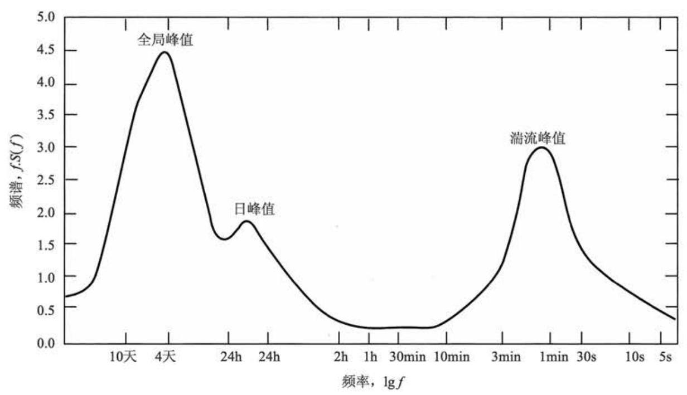
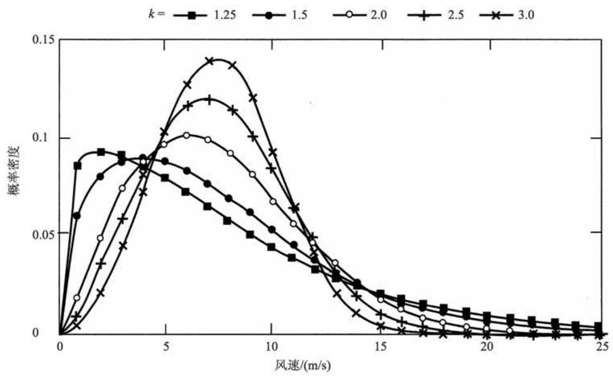
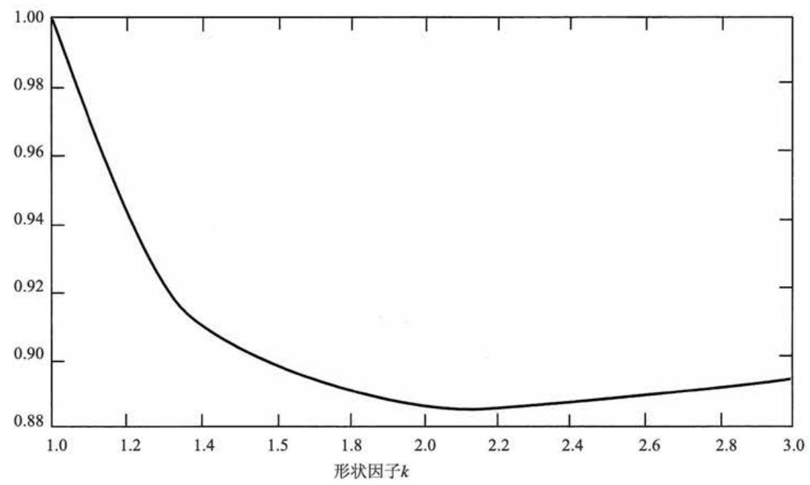
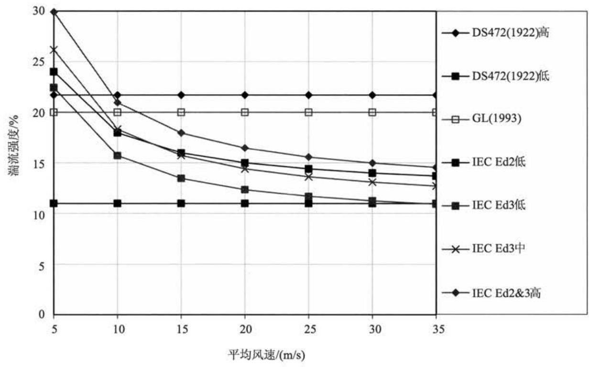
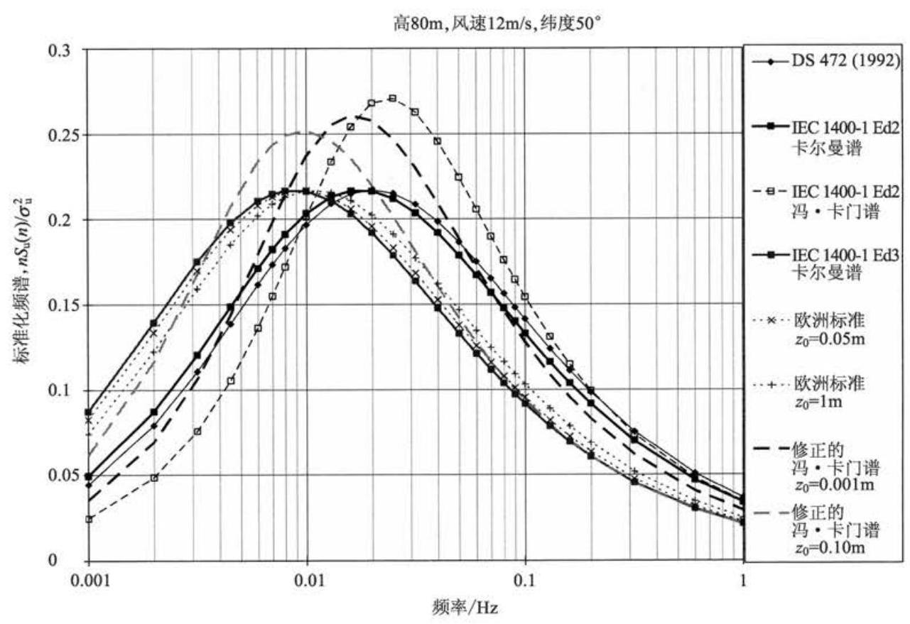
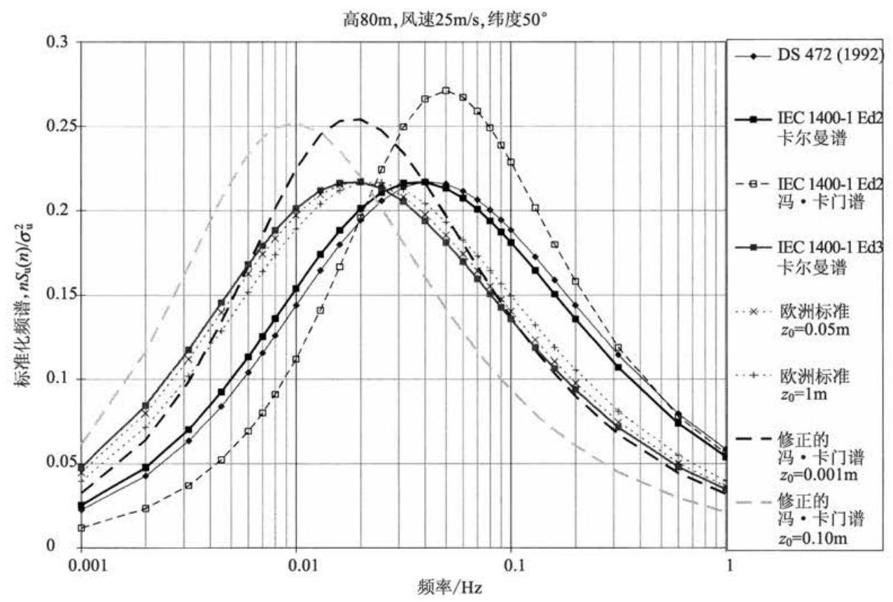
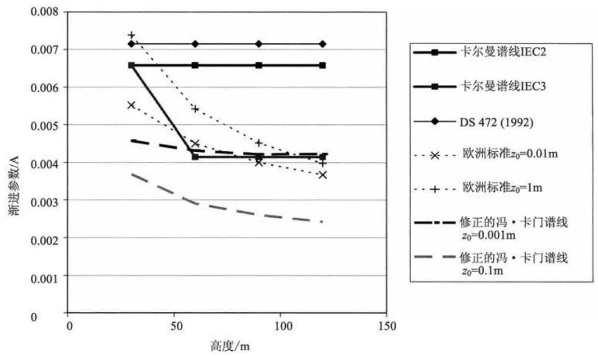
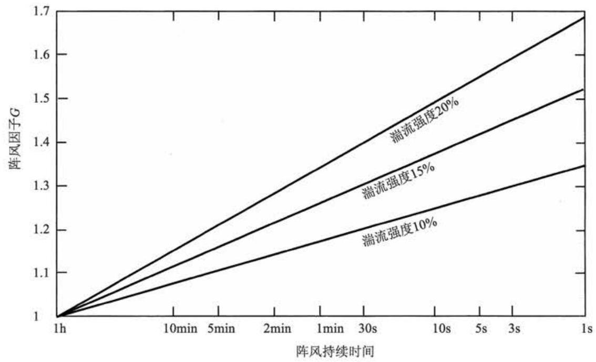

# 第 2 章 风资源

## 2.1 风特性

可利用的风能与风速的立方成正比, 这一点对于理解风能特性及风能开发利用的诸多方面至关重要。通常, 风能开发利用包括选择合适的地理位置、对风电场工程项目的经济可行性的评估、风力机的设计以及对电网和终端用户的影响。

从风能的角度来看，风资源最显著的特性是其变化性。风受地理环境和时间因素的影响其变化很大, 并且在时间、空间上这种变化会持续在一个很广的区域 (空间和时间) 内, 而其与可利用能量之间的立方关系更加突出了其重要性。

就广义而言, 空间上的变化是指: 世界上有许多不同气候条件的地区, 其中的一些地区比其他地区有着更为丰富的风能资源。这些地区的日照总量主要受纬度的影响。风资源在任何一个气候地区的小范围内存在很多差异, 这主要是因为它受自然地理条件的影响, 如陆地和海洋各自所占比例、陆地面积的大小以及山脉或平原的存在等。植被的类型也可能通过其对太阳辐射的吸收或反射作用及对地表温度和湿度的影响而对风能的大小产生显著的影响。

就局部而言, 风的趋势主要受地形的影响。例如, 在山顶上比在高地或山谷的避风面，风要强得多。在局部仍然如此，风速会因树木或大楼等建筑物的阻碍而显著降低。

在一个特定的位置上, 大范围(或大尺度)暂时的变化性是指当年和下一年风况不同，如果是几十年或更长的周期则会对应更大范围的变化。很难推断出风资源长期的变化，这可能会导致很难对特定风电场经济可行性进行准确的预测。

在少于一年的时间内的季节性变化是容易预测的, 虽然可以清楚地知道此时仍然是在越短的时间尺度上变化越大, 但是未来几天后的情况却通常不能预测。 这些“全局”变化与天气系统的通道(或轨迹)有关。天气变化主要取决于地理位置, 不过也可能会因为在一天中时间的不同而有相当大的变化 (每天的变化)。这通常是可以预测的。在这些时间尺度上，风的可预测性对于大规模风电并入电网是非常重要的，以便更合理地组织其他发电厂并入电网。

对于更小的时间尺度，如分、秒甚至更小，风速的变化可以看作湍流，它对于单台风力机的设计和运行、接入电网的电能品质及其对用户都会产生很大的影响。

Van der Hoven(1957) 曾经利用纽约 Brookhaven 的长期、短期记录制成风速谱, 展示了对应于上文所涉及的三种情况 (全局、日和湍流) 下的清晰的峰值 (图 2.1)。非常有趣的是，在日峰值和湍流峰值之间产生了所谓的“频谱缺口”。这说明全局峰值和日峰值的变化与湍流的更高频率波动有显著差别。在风速谱中，2h 和 ${10}\mathrm{{min}}$ 之间的区域内能量相差甚微。下一节将提到,不同地域的风的特性差异很大,所以 Van der Hoven 的风速谱没有办法被广泛接受。然而, ${10}\mathrm{\;{min}}$ 以内的风速的“频谱缺口”还是比较常用的，尤其是对风况进行假设的时候。

图 2.1 基于 Van der Hoven(1957)工作的 Brookhaven 农场风谱

## 2.2 风资源的地理变化

风几乎完全受太阳能量的控制, 这导致了不同程度的地表升温。热量主要集中于赤道附近的陆地上, 显然, 最强的热辐射都发生在白天, 这就意味着地球绕地轴旋转时, 受热最多的地区也绕地轴旋转。热空气上升并在大气中进行循环, 然后下降到较冷的区域, 由此引发的这种大规模的空气运动受到因地球旋转而产生的地球自转偏向力的强烈作用，其结果是形成了大规模的全球循环模式，例如，信风和季风带这类风特性已被研究得比较透彻了。

地球表面有大陆、海洋, 这种全球循环被大陆上的小范围变化所干扰。这些变化在非常复杂和非线性形式下相互作用产生了混沌, 在特殊地区, 它导致了日常天气的不可预知性。显然, 潜在的趋势导致地区间显著的气候差异。这些差异由局部地貌和热效应来进行调和。

丘陵和山脉导致局部地区风速的增加。这里有一部分是受高度的影响一地球表面的边界层, 风速一般随高度的增加而增加, 山峰可以“形成”高风速层。还有一部分影响是在丘陵山脉上面和周围的风流的加速, 隘口和峡谷风流的漏斗效应。 同样, 地貌可以形成低风速的地区, 如隐蔽的山谷、山脊的背面或流动产生的临界点。

热效应也导致了相当大的局部变化。由于陆地和海洋受热情况的不同, 沿海地区通常是多风的，当海洋比陆地温暖时形成局部循环，表面空气从陆地流向海洋，暖空气上升到海洋上面，冷空气下沉到陆地上面。当陆地更温暖一些时，情况则相反，陆地的升温和冷却比海洋表面要快。因此，在这种情况下，海、陆风趋向于反转 24h。在加利福尼亚州，这种作用对于最初风力的形成很重要。在那里，潮水把冷水带到海岸边, 并距离白天受热强烈的沙漠不远。中间的一系列山脉使气流流过它的隘口时形成漏斗效应，产生局部的猛烈的风。

热效应还是由高度的不同而引起的。因此, 高山上的冷空气下沉到下面的平地时会产生强烈的“下降”风。

本章的 2.1 节 $\sim  {2.5}$ 节中关于风速变化的简要描述是直观的,更多的细节介绍可以在有关天气的书籍上找到。9.1.3 节阐述了怎样在预选地方进行风状态的估测,在 2.9 节中介绍了如何对风进行预测。

在 2.6 节中对称为湍流的高频率风的波动进行了详细描述，这对风力机的设计和运行至关重要，并对风力机载荷有很大影响。极端风速对风力机的寿命有很大影响, 有关内容将在 2.8 节中进行描述。

## 2.3 长期风速变化

有数据显示, 在任何特殊地方风速有非常慢的长期变化。尽管精确的历史记录的可利用性有限, 但诸如 Palutikoff、Guo 和 Halliday(1991)等通过认真分析, 证明了清晰的变化趋势。很明显, 这可以和具有充分历史证据的长期气温变化联系起来。现在, 关于全球气候变暖的讨论主要集中在全球变暖是由人类的活动引起的。在气候上，这无疑会在未来几十年中影响到风的变化趋势。

除了这些长期的变化趋势, 还有风在指定地点的从一年到下一年的相当大的变化。发生这些变化有很多原因, 其中和全球气候问题有关, 如厄尔尼诺、火山喷发导致的大气粒子的变化和太阳黑子的活动。这些变化增加了特定地区风电场整个项目周期内电力输出的预测难度。

## 2.4 年度和季度性变化

尽管年平均风速的年际变化很难预测, 但在一年中的风速变化仍然可以用概率分布来进行描述。威布尔分布是描述在一些典型地点一年中小时平均风速变化的公式,具体表述如下:

$$
F\left( U\right)  = \exp \left\lbrack  {-{\left( \frac{U}{c}\right) }^{k}}\right\rbrack \tag{2.1}
$$

式中, $F\left( U\right)$ 为超过 $U$ 的小时平均风速的时间分量,它由两个参数来进行描述; 尺度参数 $c$ 和形状参数 $k$ ,它们描述了平均值的变化。 $c$ 和年度平均风速 $\bar{U}$ 有关:

$$
\bar{U} = {c\Gamma }\left( {1 + 1/k}\right) \tag{2.2}
$$

式中, $\Gamma$ 为完整的伽马函数,这可以由以下概率密度函数获得

$$
f\left( U\right)  =  - \frac{\mathrm{d}F\left( U\right) }{\mathrm{d}U} = k\frac{{U}^{k - 1}}{{c}^{k}}\exp \left\lbrack  {-{\left( \frac{U}{c}\right) }^{k}}\right\rbrack \tag{2.3}
$$

平均风速由下式给出:

$$
\bar{U} = {\int }_{0}^{\infty }{Uf}\left( U\right) \mathrm{d}U \tag{2.4}
$$

威布尔分布的一种特殊形式是瑞利分布, $k = 2$ 在很多情况下是一个典型值。 在这种情况下,因子 $\Gamma \left( {1 + 1/k}\right)$ 具有值 $\sqrt{\pi }/2 = {0.8862}$ 。当 $k$ 值稍高时,如等于 2.5 或 3，表明某地的年平均的小时平均风速变化很小，如有时在信风带。当 $k$ 值低时， 如等于 1.5 或 1.2，表示了平均值的较大变化。图 2.2 显示了几个示例。 $\Gamma (1 + \; 1/k)$ 的值变化很小,为 ${1.0} \sim  {0.885}$ (图 2.3)。

图 2.2 威布尔分布示例

显然, 一年中小时平均风速的威布尔分布很大程度上是随机变化的。然而, 季节的变化也是很重要的影响因素, 它是由于一年中地球转动轴的倾斜导致的日照变化而产生的。在温带, 冬季比夏季风多, 在春分、秋分时节, 强风越来越多。热带也同样存在季节性问题, 如季风和热带风暴通常会影响风况。伴随热带风暴的极端风况在很大程度上影响了这些地区风力机的设计。

图 2.3 因子 $\Gamma \left( {1 + 1/k}\right)$

尽管威布尔分布对一些地区的风况给出了很好的阐述, 但情况并非总是如此。 例如,一些地区冬天和夏天有着不同的风况,这种情况用 “双-威布尔” 的双峰分布代替威布尔分布可以完美地诠释。它在两个季度有不同的尺度参数和形状参数, 加利福尼亚州的某些地区是极典型的例子。

$$
F\left( U\right)  = {F}_{1}\exp \left\lbrack  {-{\left( \frac{U}{{c}_{1}}\right) }^{{k}_{1}}}\right\rbrack   + \left( {1 - {F}_{1}}\right) \exp \left\lbrack  {-{\left( \frac{U}{{c}_{2}}\right) }^{{k}_{2}}}\right\rbrack \tag{2.5}
$$

## 2.5 天气差异和昼夜差异

正如在 2.4 节中所述, 短期的风速变化比季节性变化更不确定, 而且也更难进行预测。但是,这些风速变化具有确定的模型。这些变化的一般频率是在 $4\mathrm{\;d}$ 左右达到峰值，这些就是“天气差异”。天气差异与大范围的天气类型有关，如该地区的气压高、低，同时还与经过地球表面的天气锋面有关系。当空气从高气压区向低气压区运动时, 地球自转偏向力使空气产生了旋转运动。这些相互关联的大范围的大气环流类型一般需要几天时间才能通过某一个确定点, 因此, 在这些天气状况改变或消散之前, 某一个确定点的天气类型很少是固定不变的。

由更高频率的频谱可以看出, 很多地方都呈现出昼夜峰值, 出现的周期是 24h, 这一般是由于当地的热效应造成的。白天较高的热量可能会引起大气中较大的对流单体, 而在夜间这种环流是不存在的。因为它对湍流的影响很大, 这一过程在 2.6 节中有更加详细的叙述，一般用时间-对流单体的大小来表示。由于海、陆加热不均产生了陆风和海风，这也是导致昼夜峰值出现的原因之一。以 ${12}\mathrm{\;h}$ 为周期的风速谱可以看做每天的风向变化的规律。

## 2.6 湍 流

### 2.6.1 湍流的特性

湍流指的是短时间(一般少于 10min)内的风速波动。换言之，湍流指的是最高频谱峰值，如图 2.1 所示。把风看做由前述季节、天气、昼夜的平均风速和湍流的波动叠加构成，将有利于分析。这些扰动风速变化的周期为一到数小时。在大约 ${10}\mathrm{\;{min}}$ 的时间内，这些湍流波动的平均值为零。只要图 2.1 中的“频谱间隙”足够明显，进行上述描述将是十分有用的。

湍流产生的原因主要有两个:一个是当气流流动时，由于地形差异(如山峰)造成的与地表的“摩擦”; 另一个是由于气温变化的热效应空气气团垂直运动即空气密度的差异。这两种作用往往相互关联。例如, 当气团经过山脉时就会被迫流向温度较低的地区，这时打破了气团与周围环境的热平衡。

湍流显然是一个复杂的过程，而且不能用简单明确的方程来表示它。显然，它的活动遵循一定的物理定律，如那些描述质量、动量和能量的定律。但是，为了用这些定律来描述湍流，就必须在三维空间中考虑温度、压力、密度、湿度以及空气本身的运动，只有这样才能建立一系列的微分方程来描述这一过程，并以一定的初始条件和边界条件, 通过对这些方程的时间进行积分来预测湍流。当然, 在实际中, 这一过程可以称为“混沌的”, 因为经过相对较短的一段时间后, 很小的初始条件或边界条件的差异可能会导致巨大的预测差异。正是由于这个原因, 研究湍流的统计特性就显得尤为必要了。

对于湍流的统计描述很多, 而哪一种更有用则取决于实际的应用。这其中有的是简单的湍流强度和阵风因子，有的则详细地描述湍流的三个组成要素以频率为变量在时空中的变化。

湍流密度是对湍流总体水平的度量。定义为

$$
I = \frac{\sigma }{\bar{U}} \tag{2.6}
$$

式中, $\sigma$ 为风速相对于平均风速 $\bar{U}$ 的标准方差,通常在 ${10}\mathrm{{min}} \sim  1\mathrm{h}$ 的时间内进行定义。湍流风速变化基本上是一个高斯函数，即风速变动相对于风速均值 $\bar{U}$ 是服从正态分布的,标准方差是 $\sigma$ 。但是,这一分布的端点部分与高斯分布却有很大的差异，所以当用高斯分布在一定时间内估计大的阵风出现的概率时就不可靠了。

湍流强度由地表的粗糙度和高度决定。然而, 它也受地貌特征的影响, 如丘陵和山脉，以及位于上风向的树和建筑物等。它还受大气热运动的影响，例如，当接近地面的空气在晴天升温时，会穿过大气上升，引起大规模湍流的对流。

当高度增加时, 这些地表相互作用, 所有过程的影响会减弱。在某一个高度以上，可以认为空气流动不受地面的影响。这里可以认为它是由大规模的气压差和地球的转动产生。这种空气流动被称为地转风。在低处, 地球表面的作用会体现出来,大气的这一部分被称为边界层。

### 2.6.2 边界层

影响边界层(性质)的因素主要有地转风强度、地表粗糙度、由地球自转而产生的科里奥利效应以及热效应等。

热效应的影响可以分成三类: 稳定层、不稳定层和中间层。当地表大面积受热, 使地表附近的空气受热而上升时, 便会产生不稳定层。在上升过程中, 气压降低, 上升的空气不断膨胀并变冷。如果变冷的程度不足以同周围的空气一起维持热力学平衡, 上升的空气便会继续上升, 产生很大的对流单体, 这样就会产生一个伴有大范围湍流涡旋的、厚厚的边界层。由于有大量的垂直混合以及动量转移, 结果随着高度的不同, 平均风速也会相应地有一个小的变化。

如果上升的空气由于绝热冷却效应而变得比周围环境温度更低, 那么它在垂直方向上的运动便会受到抑制，这就是所说的稳定层。它经常发生在地表温度很低的寒冷夜晚。在这种情况下，湍流受控于空气和地表的摩擦力，此时的风切变会很大(平均风速随高度的增加而增加)。

在中性大气中，空气随着自身的上升而发生绝热冷却，并同周围环境温度满足热平衡。当地表粗糙度产生的湍流导致足够多的边界层发生混合时, 通常会产生大风。从风能利用的角度来讲, 中间稳定层是最需要考虑的, 尤其当考虑风力机上的湍流载荷时, 因为这种风载荷是强风中最大的一类。但是, 不稳定条件也是非常重要的, 这是因为它们可能会从一个低的级别导致突然的阵风产生, 并由于较大的风切变, 稳定条件可以产生很大的不对称载荷。在这种条件下, 随着高度的不同, 风向也可能会有非常大的变化。

接下来的几章中给出了一系列的关系式, 这些关系式描述了大气边界层的特性，如湍流强度、频谱、尺度规模以及相关函数。这些关系式中，一部分是基于理论上的推导，另一部分则是考虑到同大量的观察结果相吻合，这些结果是许多学者在不同条件和地区得出的。

在中性的大气中, 边界层的特性主要取决于地表粗糙度以及科里奥利效应。 地表粗糙度由粗糙度长度 ${z}_{0}$ 来描述。表 2.1 中列出了 ${z}_{0}$ 的一些典型值。

表 2.1 表面粗糙度典型值

<table><tr><td>地形种类</td><td>粗糙度长度 ${z}_{0}/\mathrm{m}$</td></tr><tr><td>城市森林</td><td>0.7</td></tr><tr><td>郊区，树木覆盖的周边</td><td>0.3</td></tr><tr><td>村庄, 有树和树篱覆盖的乡下</td><td>0.1</td></tr><tr><td>开阔的农场，较少的树木和建筑物</td><td>0.03</td></tr><tr><td>平坦的草原</td><td>0.01</td></tr><tr><td>平坦的沙漠，风大浪急的海面</td><td>0.001</td></tr></table>

科里奥利参数 $f$ 的定义如下:

$$
f = {2\Omega }\sin \left( \left| \lambda \right| \right) \tag{2.7}
$$

式中, $\Omega$ 为地球自转的角速度; $\lambda$ 为纬度值。在赤道上,该值为 0,所以下文的论述仅适用于温带。边界层的高度如下式所示:

$$
h = {u}^{ * }/\left( {6f}\right) \tag{2.8}
$$

但是它有明确的适用范围, 该式和随后的推导在赤道范围内是不能用的, 也就是 $h = 0$ 的地方,所以务实的建议是所有的热带地区都近似地使用纬度 ${22.5}^{ \circ  }$ 的数据。 式中的 ${u}^{ * }$ 为摩擦速度,其可由下式确定:

$$
{u}^{ * }/\bar{U}\left( z\right)  = \kappa /\left\lbrack  {\ln \left( {z/{z}_{0}}\right)  + \Psi }\right\rbrack \tag{2.9}
$$

式中, $\kappa$ 为冯·卡门常数 (约为 0.4 ); $z$ 为距地面的高度; ${z}_{0}$ 为地表粗糙度长度。 $\Psi$ 为一个取决于稳定性的函数，在不稳定条件下，产生较低的风切变，它的取值为负； 当在稳定条件下时，产生高的风切变，它的取值为正；在中性的条件下， $\operatorname{ESDU}$ (1985) 所给出的为 $\Psi  = {34.5fz}/{u}^{ * }$ ,在本书所研究的条件下,这个结果同 $\ln \left( {z/{z}_{0}}\right)$ 相比要小一些。如果忽略 $\Psi$ ,风切变可以由对数形式的剖面来确定如下:

$$
\bar{U}\left( z\right)  \propto  \ln \left( {z/{z}_{0}}\right) \tag{2.10}
$$

这里还常用到一个指数函数近似式为

$$
\bar{U}\left( z\right)  \propto  {z}^{\alpha } \tag{2.11}
$$

式中, $\alpha$ 的典型值为 0.14,但它也受不同种类地形的影响。然而,由于式 (2.11) 常应用于求解高度间隔，而 $\alpha$ 还取决于高度间隔的大小，所以这个近似式没有对数函数的式子用处大。

然而,风力机设计标准通常需要用到一个给定的指数。由 IEC 和 GL 标准可知,陆上正常风力情况下 $\alpha  = {0.20}$ ,海上正常风力情况下 $\alpha  = {0.14}$ 。这两种标准都规定极端风力情况下 $\alpha  = {0.11}$ (海上和陆上)。

从初始到新的大气层面, 如果表面粗糙度发生了变化, 风切变面也就逐渐向顺风变化。重要的是，在该过程中产生了一个新的边界层，并且这个边界层从零一直增长到过渡点, 直到新的边界层已经完全建立为止。库克 (1985) 给出了过渡区内风切变的计算方法。

将式 (2.8) 和式 (2.9) 进行合并，可以得到在边界层顶部的风速为

$$
\bar{U}\left( h\right)  = \frac{{u}^{ * }}{\kappa }\left\lbrack  {\ln \left( \frac{{u}^{ * }}{f{z}_{0}}\right)  - \ln 6 + {5.75}}\right\rbrack \tag{2.12}
$$

式 (2.12) 同所谓的地转风速很相似。地转风速用 $G$ 来表示,它是从压力场中计算出来的一种概念化的风速，它可以影响边界层。地转风速的表达式如下式所示:

$$
G = \frac{{u}^{ * }}{\kappa }\sqrt{{\left\lbrack  \ln \left( \frac{{u}^{ * }}{f{z}_{0}}\right)  - A\right\rbrack  }^{2} + {B}^{2}} \tag{2.13}
$$

在中性条件下,式 (2.13) 中 $A = \ln 6, B = {4.5}$ 。这个关系常被称为地转风速牵引定律。

地表粗糙度的影响不仅会导致风速接近地表时降低，同时还会产生一个在 “自由”气压驱赶下在地转风方向以及接近地面的风方向之间的变化。虽然地转风受大气中气压梯度的影响，但是科里奥利力的存在使风向右有个偏转角，这个现象会产生一个典型的环流模式。因此,在北半球, 风由南部的高气压地区向北部的低气压地区流动，同时受到科里奥利力的作用，产生一个向东的偏转。在接近地面时， 由于表面摩擦力的作用，风的方向还会发生变化。由地转风到表面风，其间风方向的总变化如下式所示:

$$
{\sin }_{\alpha } = \frac{-B}{\sqrt{{\left\lbrack  \ln \left( \frac{{u}^{ * }}{f{z}_{0}}\right) \right\rbrack  }^{2} + {B}^{2}}} \tag{2.14}
$$

### 2.6.3 湍流强度

中性大气条件下的湍流强度完全取决于地表粗糙度。对于纵向分量来说, 标准偏差 ${\sigma }_{\mathrm{u}}$ 对于高度是恒定的,所以湍流强度随着高度而减小。更确切地说,使用前面章节得到的摩擦速度 ${u}^{ * }$ ，可以用关系式 ${\sigma }_{\mathrm{u}} \approx  {2.5}{u}^{ * }$ 来计算标准偏差。近期的某些研究成果(ESDU，1985)给出了如下一种变通方式:

$$
{\sigma }_{\mathrm{u}} = \frac{{75\eta }{\left\lbrack  {0.538} + {0.09}\ln \left( z/{z}_{0}\right) \right\rbrack  }^{p}{u}^{ * }}{1 + {0.156}\ln \left( {{u}^{ * }/f \cdot  {z}_{0}}\right) } \tag{2.15}
$$

其中

$$
\eta  = 1 - {6fz}/{u}^{ * } \tag{2.16}
$$

$$
p = {\eta }^{16} \tag{2.17}
$$

在接近地表的情况下,用上述式子得出的结果与 ${\sigma }_{\mathrm{u}} = {2.5}{u}^{ * }$ 近似相同,但是在高一些的地方，上述式子得到的结果会更大一些。于是纵向的湍流强度为

$$
{I}_{\mathrm{u}} = {\sigma }_{\mathrm{u}}/\bar{U} \tag{2.18}
$$

横向 ( $v$ ) 和纵向 ( $w$ ) 湍流强度由下式给出 (ESDU,1985):

$$
{I}_{\mathrm{v}} = \frac{{\sigma }_{\mathrm{v}}}{\bar{U}} = {I}_{\mathrm{u}}\left\lbrack  {1 - {0.22}{\cos }^{4}\left( \frac{\pi z}{2h}\right) }\right\rbrack \tag{2.19}
$$

$$
{I}_{\mathrm{w}} = \frac{{\sigma }_{\mathrm{w}}}{\bar{U}} = {I}_{\mathrm{u}}\left\lbrack  {1 - {0.45}{\cos }^{4}\left( \frac{\pi z}{2h}\right) }\right\rbrack \tag{2.20}
$$

需要注意的是，用于设计计算的湍流强度的确切值可以由其他的一些用于风力机设计计算的标准来进行规定，而且其结果可能与上述式子不符，如丹麦标准 (DS472,1992)指定为

$$
{I}_{\mathrm{u}} = {1.0}/\ln \left( {z/{z}_{0}}\right) \tag{2.21}
$$

且 ${I}_{\mathrm{v}} = {0.8}{I}_{\mathrm{u}},{I}_{\mathrm{w}} = {0.5}{I}_{\mathrm{u}}$ 。

IEC 标准(IEC，1999)给出

$$
{I}_{\mathrm{u}} = {I}_{15}\left( {a + {15}/\bar{U}}\right) /\left( {a + 1}\right) \tag{2.22}
$$

其中,对于 “湍流较高的地点”, ${I}_{15} = {0.18}$ ,而对于 “湍流较低的地点” 则取 0.16,分别与 $a = 2$ 和 $a = 3$ 相对应。对于横向和纵向分量,可以有如下的选择方案: 或者取 ${I}_{\mathrm{v}} = {0.8}{I}_{\mathrm{u}}$ 且 ${I}_{\mathrm{w}} = {0.5}{I}_{\mathrm{u}}$ ,或者取标准回归线模型,即 ${I}_{\mathrm{u}} = {I}_{\mathrm{v}} = {I}_{\mathrm{w}}$ 。

IEC 第三版标准 (IEC, 2005) 指定

$$
{I}_{\mathrm{u}} = {I}_{\text{ ref }}\left( {{0.75} + {5.6}/\bar{U}}\right) \tag{2.23}
$$

式中, ${I}_{\text{ ref }} = {0.16},{0.14}$ 或者 0.12 取决于风的等级。对于横向和纵向的分量, ${I}_{\mathrm{v}}$ 至少等于 ${0.7}{I}_{\mathrm{u}}$ ,而 ${I}_{\mathrm{w}}$ 至少等于 ${0.5}{I}_{\mathrm{u}}$ 。标准误差的产生是由于假设高度是不变的, 所以湍流强度是随着高度的变化而变化的, 平均风速的变化是由于风切变导致的。

德国劳埃德船级社规范 (GL, 1993) 简单地指定了 20% 的湍流强度, 但是随后的一版与 IEC 第二版的标准相同了。

图 2.4 显示了 GL、IEC 和丹麦标准下的纵向湍流强度, 其中, 较低的值是丹麦标准,是在 ${90}\mathrm{\;m}$ 高度、 ${0.01}\mathrm{\;m}$ 粗糙度时给出的; 较高的值是在 ${30}\mathrm{\;m}$ 高度、 ${0.3}\mathrm{\;m}$ 粗糙度时给出的。在较高值方面, IEC 的第二版和第三版标准是相同的, 但是第三版的低变量明显要低一些。

图 2.4 不同标准下的湍流强度

### 2.6.4 湍流谱

湍流谱描述了风速变化的频谱。根据柯尔莫哥洛夫定律, 在高频区, 湍流谱一定接近一条与 ${n}^{-5/3}$ 成比例的渐近线 (这里 $n$ 表示频率,单位为 $\mathrm{{Hz}}$ )。这种关系是基于湍流的旋涡产生衰减，这是因为越来越高的频率，使得湍流能量以热的形式散发出去。

湍流纵向分量的谱通常有两种可选的表达方式，在这两种方式下，谱都会趋向于渐近线，它们是卡尔曼谱和冯·卡门谱，其形式如下:

$$
\text{ 卡尔曼 }\frac{n{S}_{\mathrm{u}}\left( n\right) }{{\sigma }_{\mathrm{u}}^{2}} = \frac{{4n}{L}_{1\mathrm{u}}/\bar{U}}{{\left( 1 + 6n{L}_{1\mathrm{u}}/\bar{U}\right) }^{5/3}} \tag{2.24}
$$

$$
\text{ 冯,卡门 }\frac{n{S}_{\mathrm{u}}\left( n\right) }{{\sigma }_{\mathrm{u}}^{2}} = \frac{{4n}{L}_{2\mathrm{u}}/\bar{U}}{{\left\lbrack  1 + {70.8}{\left( n{L}_{2\mathrm{u}}/\bar{U}\right) }^{2}\right\rbrack  }^{5/6}} \tag{2.25}
$$

式中， ${S}_{\mathrm{u}}\left( n\right)$ 为纵向自谱密度函数； ${L}_{1\mathrm{u}}$ ， ${L}_{2\mathrm{u}}$ 为长度尺度。为了使这两个表达式具有同样的高频渐近限，在这两个长度尺度规模之间应该有 ${\left( {36}/{70.8}\right) }^{-5/4}$ 的倍数关系， 如 ${L}_{1u} = {2.329}{L}_{2u}$ 。在下一节将讨论长度尺度的选取问题。

根据 Petersen 等(1998) 的研究, 卡尔曼谱与经验观测的大气湍流十分相符, 可以很好地描述风道中的湍流，而冯·卡门谱通常用于相关的分析表达式。长度尺度 ${L}_{2\mathrm{u}}$ 可以看成纵向分量的积分长度尺度,表示为 ${}^{x}{L}_{\mathrm{u}}$ ,定义式为 ${\int }_{0}^{\infty }\kappa \left( {r}_{\mathrm{x}}\right) \mathrm{d}{r}_{\mathrm{x}},\kappa \left( {r}_{\mathrm{x}}\right)$ 是在湍流元件 $u$ 和纵向两独立点距离 ${r}_{\mathrm{x}}$ 同时测量间的互相关方程。将其使用到半经验环境模型的真实环境数据中, 长度标准不一定完全符合理论结果。对上述情况的认识十分重要。

卡尔曼谱峰要比冯·卡门的谱峰低而且宽，如图 2.5 和图 2.6 所示。最近的研究表明,冯·卡门谱可以很好地描述在 ${150}\mathrm{\;m}$ 以上的大气湍流,但是在较低的高度还有一些不足。Harris(1990)给出了几个修正的模型，ESDU(1985)推荐用下面的冯·卡门修正公式:

$$
\frac{n{S}_{\mathrm{u}}\left( n\right) }{{\sigma }_{\mathrm{u}}^{2}} = {\beta }_{1}\frac{{2.987n}{L}_{3\mathrm{u}}/\bar{U}}{{\left\lbrack  1 + {\left( 2\pi n{L}_{3\mathrm{u}}/\bar{U}\right) }^{2}\right\rbrack  }^{5/6}} + {\beta }_{2}\frac{{1.294n}{L}_{3\mathrm{u}}/\bar{U}}{{\left\lbrack  1 + {\left( \pi n{L}_{3\mathrm{u}}/\bar{U}\right) }^{2}\right\rbrack  }^{5/6}}{F}_{1} \tag{2.26}
$$

这三个谱都有其相应的湍流的水平和垂直分量表达式, 卡尔曼谱也具有同样的纵向分量表达式,但是具有不同的尺度规模 ${L}_{1\mathrm{v}}$ 和 ${L}_{1\mathrm{w}}$ 。 $i\left( {i = \mathrm{v}\text{ 或 }\mathrm{w}}\right)$ 分量的冯 - 卡门谱为

$$
\frac{n{S}_{\mathrm{i}}\left( n\right) }{{\sigma }_{\mathrm{i}}^{2}} = \frac{4\left( {n{L}_{2\mathrm{i}}/\bar{U}}\right) \left\lbrack  {1 + {755.2}{\left( n{L}_{2\mathrm{i}}/\bar{U}\right) }^{2}}\right\rbrack  }{{\left\lbrack  1 + {283.2}{\left( n{L}_{2\mathrm{i}}/\bar{U}\right) }^{2}\right\rbrack  }^{{11}/6}} \tag{2.27}
$$

其中 ${L}_{2\mathrm{v}} = {}^{x}{L}_{\mathrm{v}},{L}_{2\mathrm{w}} = {}^{x}{L}_{\mathrm{w}}$ ,对于修正的冯·卡门谱为

$$
\frac{n{S}_{i}\left( n\right) }{{\sigma }_{i}^{2}} = {\beta }_{1}\frac{{2.987}\left( {n{L}_{3i}/\bar{U}}\right) \left\lbrack  {1 + \frac{8}{3}{\left( 4\pi n{L}_{3i}/\bar{U}\right) }^{2}}\right\rbrack  }{{\left\lbrack  1 + {\left( 4\pi n{L}_{3i}/\bar{U}\right) }^{2}\right\rbrack  }^{{11}/6}} + {\beta }_{2}\frac{{1.294n}{L}_{3i}/\bar{U}}{{\left\lbrack  1 + {\left( 2\pi n{L}_{3i}/\bar{U}\right) }^{2}\right\rbrack  }^{5/6}}{F}_{2i}
$$

(2.28)

图 2.5 风速 ${12}\mathrm{m}/\mathrm{s}$ 时的频谱比较

图 2.6 风速 ${25}\mathrm{m}/\mathrm{s}$ 时的频谱比较

### 2.6.5 长度尺度及其他参数

如果采用上面定义的谱, 就应该定义合适的长度尺度。对于修正的冯·卡门模型还需要参数 ${\beta }_{1}\text{ 、 }{\beta }_{2}\text{ 、 }{F}_{1}$ 和 ${F}_{2}$ 。

长度尺度取决于地表粗糙度 $\left( {z}_{0}\right)$ 和距地面的高度 $\left( z\right)$ 。接近地面时抑制了湍流的旋涡,因此,降低了长度尺度。如果在离地面高 ${z}^{\prime }$ 处有许多小障碍物,则离地面的高度应该由这些作用来修正,假设有效地面高度为 $\left( {{z}^{\prime } - {2.5}{z}_{0}}\right)$ (ESDU, 1975)。距地面足够高时,如 $z > {z}_{\mathrm{i}}$ ,湍流就不再受到地面的抑制而成为等方向性的。根据 (ESDU,1975), ${z}_{\mathrm{i}} = {1000}{z}_{0}^{0.18}$ ,并且在高于这个高度时, ${}^{x}{L}_{\mathrm{u}} = {280}\mathrm{\;m}$ , ${}^{y}{L}_{\mathrm{u}} = {}^{x}{L}_{\mathrm{u}} = {}^{x}{L}_{\mathrm{v}} = {}^{x}{L}_{\mathrm{v}} = {140}\mathrm{\;m}$ 。对于很小的粗糙度 ${z}_{0}$ ,等方向性区域应该在风力机的高度之上, 应用下面的修正公式进行修正:

$$
{}^{z}{L}_{\mathrm{u}} = {280}{\left( z/{z}_{\mathrm{i}}\right) }^{0.35}
$$

$$
y{L}_{\mathrm{u}} = {140}{\left( z/{z}_{\mathrm{i}}\right) }^{0.38}
$$

$$
{}^{z}{L}_{\mathrm{u}} = {140}{\left( z/{z}_{\mathrm{i}}\right) }^{0.45} \tag{2.29}
$$

$$
{}^{x}{L}_{\mathrm{v}} = {140}{\left( z/{z}_{\mathrm{i}}\right) }^{0.48}
$$

$$
{}^{z}{L}_{\mathrm{v}} = {140}{\left( z/{z}_{\mathrm{i}}\right) }^{0.55}
$$

${}^{z}{L}_{\mathrm{w}} = {}^{y}{L}_{\mathrm{w}} = {0.35z}$ (对于 $z < {400}\mathrm{\;m}$ )。 ${}^{y}{L}_{\mathrm{w}}$ 的表达式未给出。长度尺度 ${}^{z}{L}_{\mathrm{u}}$ 、 ${}^{z}{L}_{\mathrm{v}}$ 和 ${}^{z}{L}_{\mathrm{w}}$ 可直接用在冯·卡门谱中。对于卡尔曼谱，我们已得到 ${L}_{\mathrm{{lu}}} = {2.329}{}^{z}{L}_{\mathrm{u}}$ ， 并得到同样的高频渐近线,对于其他的分量,我们有 ${L}_{1\mathrm{v}} = {3.2054}{}^{x}{L}_{\mathrm{v}},{L}_{1\mathrm{w}} =$ 3. ${2054}^{x}{L}_{\mathrm{w}}$ 。

接下来,基于更大范围高度的测量 (Harris,1990;ESDU,1985) 认真考虑了随着边界层的厚度增加,导致长度的增加。 $h$ 也表明了长度尺度随着平均风速的变化而变化。根据 $z/h\text{ 、 }{\sigma }_{\mathrm{u}}/{u}^{ * }$ 及理查森数 ${u}^{ * }/\left( {f{z}_{0}}\right)$ ,得到了 9 个长度尺度的更为复杂的表达式。

注意到在一些用于风力机载荷计算的标准中规定用特定的湍流谱或长度尺度, 这样一来要比上面给出的表达式简单。因此, 丹麦标准 (DS472, 1992) 指定的卡尔曼谱满足下式:

$$
{L}_{1\mathrm{u}} = {150}\mathrm{\;m}\text{ 或 }{5z}\text{ ,其中 }z < {30}\mathrm{\;m}
$$

$$
{L}_{1\mathrm{v}} = {0.3}{L}_{1\mathrm{u}} \tag{2.30}
$$

$$
{L}_{1\mathrm{w}} = {0.1}{L}_{1\mathrm{u}}
$$

IEC 标准 (IEC, 1999) 建议满足下式的任一个卡尔曼模型:

$$
{\Lambda }_{1} = {21}\mathrm{\;m}\text{ 或 }{0.7z}\text{ ,其中 }z < {30}\mathrm{\;m}
$$

$$
{L}_{1\mathrm{u}} = {8.1}{\Lambda }_{1} = {170.1}\mathrm{\;m}\text{ 或 }{5.67z}\text{ ,其中 }z < {30}\mathrm{\;m} \tag{2.31}
$$

$$
{L}_{1\mathrm{v}} = {2.7}{\Lambda }_{1} = {0.3333}{L}_{1\mathrm{u}}
$$

$$
{L}_{1\mathrm{w}} = {0.66}{\Lambda }_{1} = {0.08148}{L}_{1\mathrm{u}}
$$

或等方向性地满足下式的冯·卡门模型:

$$
{}^{x}{L}_{\mathrm{u}} = {73.5}\mathrm{\;m}\text{ 或 }{2.45}\mathrm{z}\text{ ，其中 }z < {30}\mathrm{\;m} \tag{2.32}
$$

$$
{}^{x}{L}_{\mathrm{v}} = {}^{x}{L}_{\mathrm{w}} = {0.5}{}^{x}{L}_{\mathrm{u}}
$$

IEC 标准第三版(IEC，2005)对于卡尔曼模型和曼恩模型的细微不同给予选择。卡尔曼模型有相同的形式[式(2.24)],但是需要

$$
{\Lambda }_{1} = {42}\mathrm{\;m}\text{ 或 }{0.7z}\text{ ,其中 }z < {60}\mathrm{\;m}
$$

$$
{L}_{1\mathrm{u}} = {8.1}{\Lambda }_{1} = {340.2}\mathrm{\;m}\text{ 或 }{5.67z}\text{ ,其中 }z < {60}\mathrm{\;m} \tag{2.33}
$$

$$
{L}_{1\mathrm{v}} = {2.7}{\Lambda }_{1} = {0.3333}{L}_{1\mathrm{u}}
$$

$$
{L}_{1\mathrm{w}} = {0.66}{\Lambda }_{1} = {0.08148}{L}_{1\mathrm{u}}
$$

曼恩模型的区别相对比较大, 在随后的 2.6.8 节中将详细介绍。

欧盟标准 (2005) 中规定了卡尔曼长度谱形式,即 ${L}_{1\mathrm{n}} = {1.7}{L}_{\mathrm{i}}$ ,其中

$$
{L}_{\mathrm{i}} = {300}{\left( z/{300}\right) }^{a} \tag{2.34}
$$

当 $z < {200}\mathrm{m}$ 时, $\alpha  = {0.67} + {0.05}\ln {z}_{0}$ 。这个标准可以用于建筑,但通常不能用在风力机上。

由于变量过多,很难对这么多不同的谱进行简洁的比较,下面的图中将列出部分事例。这些是相对于频率的正常化纵向谱 $n{S}_{\mathrm{u}}\left( n\right) /{\sigma }_{\mathrm{u}}^{2}$ ,意味着曲线下方表示所有给定频率的方差总和。目前使用典型的 ${80}\mathrm{\;m}$ 高轮毂,相当于纬度 ${50}^{ \circ  }$ 处改进的冯·卡门谱线。

图 2.5 显示了对于一个典型的额定风速为 ${12}\mathrm{m}/\mathrm{s}$ 的谱线。IEC 第三版的谱线很明显地移向了低一些的频率范围，与欧洲标准(实际上相当于 ${80}\mathrm{\;m}$ 高， ${z}_{0} =$ 0.01m)更相近。注意到卡尔曼谱和冯·卡门谱线的特性不同，后者的峰更尖一些。修正的冯·卡门谱线[式(2.25)]的形状介于两者之间, 有着非常小的粗糙长度, 峰值所处的频率范围与 IEC 第二版谱线相似, 但是当粗糙长度增大时与第三版的更相似。

图 2.6 展示了与典型的 ${25}\mathrm{\;m}/\mathrm{s}$ 的风速相同的数据。正如料想的那样,所有的峰值都出现在较高频率的区域，但是现在改进的冯·卡尔曼模型比 IEC 第三版更加适合小粗糙长度。

### 2.6.6 渐近限制

在其他情况下, 其他谱线或许可以用, 但是遵守 IEC 标准高频渐近特性必须满足下述关系:

$$
\frac{{S}_{\mathrm{u}}\left( n\right) }{{\sigma }_{\mathrm{u}}^{2}}\underset{n = \infty }{ \rightarrow  }{0.005}{\left( \frac{{\Lambda }_{1}}{\bar{U}}\right) }^{-2/3}{n}^{-5/3} \tag{2.35}
$$

${\Lambda }_{1}$ 与上述定义相同: 这是一个只有在地面以上才适用的方程, IEC 第二版与第三版在地面以上 ${30}\mathrm{\;m}$ 运用不同。表示为

$$
\xrightarrow[{\sigma }_{\mathrm{u}}^{2}]{{S}_{\mathrm{u}}\left( n\right) }A\xrightarrow[{n = \infty }]{}A{\bar{U}}^{2/3}{n}^{-5/3} \tag{2.36}
$$

渐近参数 $A$ 可以与不同的光谱进行比较,如图 2.7 所示。这解释了为什么 DNV 渐近与 IEC 第二版(无论是卡尔曼还是冯·卡门谱线都有相同的渐近值)相似，但是渐近值在 IEC 第三版高于地面 ${30}\mathrm{\;m}$ 情况下小了很多,使得与欧洲标准有了可比性。ESDU 修正的冯·卡门谱线由于渐近值随着风速、地表粗糙度以及地理纬度的变化而变化,使得其更加难以定性。图 2.7 展示了纬度 ${50}^{ \circ  }$ ,风速 ${20}\mathrm{\;m}/\mathrm{s}$ 下两种不同地面粗糙度的结果。这个渐近值可以匹配 IEC 第三版的要求, 但是只有在选择非常小的粗糙长度, 甚至小到和第二版相近才可以匹配。如果选择如此小的粗糙长度的话, 湍流强度会比 ESDU 模型标准要求的小很多。当使用 ESDU 模型来适应各种风速下地表粗糙度时, 一般只是让湍流强度满足要求。尽管这样做在物理上没有太大意义, 但是很明显, 为了适应地表粗糙度而同时匹配渐近值和湍流强度是不可能的。因此, 相比于物理模型, 这些标准不出意料地保守一些。有些人认为物理模型对于平坦地形比较有效, 然而, 许多风电场都是建造在比较复杂的地形上，湍流强度也比较高，而尺度也比较短。物理模型的作用就不见得那么明显了。

图 2.7 一些渐近限制

还要注意的是，IEC 第三版标准进一步明确了在高频极限下 ${S}_{\mathrm{v}}\left( n\right)  = {S}_{\mathrm{w}}\left( n\right)  = \; 4/3{S}_{\mathrm{u}}\left( n\right)$ 。

### 2.6.7 交叉谱和相干方程

在前面所述的湍流谱中描述了在任一给定点时每个湍流分量的时间性变化。 然而, 随着风力机叶片扫过其运动的轨线, 风速的变化并不能通过单一点的谱线来进行很好的表述。风湍流在水平和垂直方向上的空间变化非常重要, 因为这个空间变化是由叶片运动来“采样”得到的，因此，导致了时间性的变化。

为了模拟这些效果，必须拓宽描述风湍流的谱线的范围，使其包括在定点水平的和垂直的风力机湍流之间相互关系的信息。很明显, 这些相互关系随着两点分开的距离的增大而减小, 在高频时要比低频时小。因此, 它们可以用 “相干” 方程来描述其相互关系,这个方程是关于频率和间距的函数。相干数 $C\left( {{\Delta r}, n}\right)$ 定义为

$$
C\left( {{\Delta r}, n}\right)  = \frac{\left| {S}_{12}\left( n\right) \right| }{\sqrt{{S}_{11}\left( n\right) {S}_{22}\left( n\right) }} \tag{2.37}
$$

式中, $n$ 为频率; ${S}_{12}\left( n\right)$ 是在两点间距为 ${\Delta r}$ 时变化的相干谱; ${S}_{11}\left( n\right) ,{S}_{22}\left( n\right)$ 为每个点的变化谱线(通常可以认为它们是相等的)。

根据卡尔曼谱方程，并假设泰勒霜冻湍流假说成立，可以得到关于风速波动的相干方程分析表达式。根据某点与风速方向垂直间距为 ${\Delta r}$ 的纵向分量，相干函数为

$$
{C}_{\mathrm{u}}\left( {{\Delta r}, n}\right)  = {0.994}\left\lbrack  {{A}_{5/6}\left( {\eta }_{\mathrm{u}}\right)  - \frac{1}{2}{\eta }_{\mathrm{u}}^{5/3}{A}_{1/6}\left( {\eta }_{\mathrm{u}}\right) }\right\rbrack \tag{2.38}
$$

其中, ${A}_{\mathrm{j}}\left( x\right)  = {x}^{j}{K}_{\mathrm{j}}\left( x\right)$ 。式中, $K$ 为修正贝塞尔方程的分数级,并有

$$
{\eta }_{\mathrm{u}} = {\Delta r}\sqrt{{\left( \frac{0.747}{{L}_{\mathrm{u}}}\right) }^{2} + {\left( c\frac{2\pi n}{\bar{U}}\right) }^{2}} \tag{2.39}
$$

其中, $c = 1$ 。 ${L}_{\mathrm{u}}$ 是局部尺度规模,可以定义为

$$
{L}_{\mathrm{u}}\left( {{\Delta r}, n}\right)  = 2{f}_{\mathrm{u}}\left( n\right) \sqrt{\frac{{\left( {}^{y}{L}_{\mathrm{u}}\Delta y\right) }^{2} + {\left( {}^{z}{L}_{\mathrm{u}}\Delta z\right) }^{2}}{\Delta {y}^{2} + \Delta {z}^{2}}} \tag{2.40}
$$

式中, ${\Delta y},{\Delta z}$ 分别为间距 ${\Delta r}$ 的水平和垂直分量; ${}^{y}{L}_{\mathrm{u}},{}^{z}{L}_{\mathrm{u}}$ 分别为湍流的纵向分量的水平尺度规模和垂直尺度规模。通常, ${f}_{\mathrm{u}}\left( n\right)  = 1$ ,但是 $\operatorname{ESDU}\left( {1975}\right)$ 给出了在低频时,也就是风变得各向不均时的修正式 ${f}_{\mathrm{u}}\left( n\right)  = \min \left\{  {{1.0},{0.04}{n}^{-2/3}}\right\}$ 。

IEC(1999)标准中通过冯·卡门谱给出了等方向性的湍流模型。其中, ${}^{z}{L}_{\mathrm{u}} = \; {2}^{y}{L}_{\mathrm{u}} = {2}^{z}{L}_{\mathrm{u}}$ ,并且 ${L}_{\mathrm{u}} = {}^{x}{L}_{\mathrm{u}},{f}_{\mathrm{u}}\left( n\right)  = 1$ ,在式 (2.26) 中所描述的冯·卡门修正模型中也应用了 ${f}_{\mathrm{u}}\left( n\right)  = 1$ ，但是修正了式(2.39)中的系数 $c$ ，而不是(ESDU，1985)中提到的系数。

对于水平分量和垂直分量, 其相应的方程如下。与前面一样, 基于冯 · 卡门谱和泰勒假说的相干分析表达式为

$$
{C}_{\mathrm{i}}\left( {{\Delta r}, n}\right)  = \frac{0.597}{{2.869}{\gamma }_{\mathrm{i}}^{2} - 1}\left\lbrack  {{4.781}{\gamma }_{\mathrm{i}}^{2}{A}_{5/6}\left( {\eta }_{\mathrm{i}}\right)  - {A}_{{11}/6}\left( {\eta }_{\mathrm{i}}\right) }\right\rbrack \tag{2.41}
$$

其中, $i = u$ 或 $v;{\eta }_{\mathrm{i}}$ 根据式 (2.39) 计算得到,但是要用 ${L}_{\mathrm{v}}$ 或 ${L}_{\mathrm{w}}$ 分别代替 ${L}_{\mathrm{u}}$ ,并且令 $c = 1$ 。同样，

$$
{\gamma }_{\mathrm{i}} = \frac{{\eta }_{\mathrm{i}}{L}_{\mathrm{i}}\left( {{\Delta r}, n}\right) }{\Delta r} \tag{2.42}
$$

${L}_{\mathrm{v}}$ 和 ${L}_{\mathrm{w}}$ 可以由类似于式(2.40)的表达式给出。

式(2.38)和式(2.41)中的空间相干表达式,从理论上是由冯·卡门谱得到的, 尽管有一些因数是根据试验得到的, 如尺度规模。如果在起始点用的是卡尔曼谱而不是冯·卡门谱, 在相干方程中就不会有这些相对简单的表达式。在这种情况下，相关方程经常用到简单的、纯经验的指数模型。例如，IEC (1999) 标准中给出了湍流纵向分量的相干方程表达式如下:

$$
{C}_{\mathrm{u}}\left( {{\Delta r}, n}\right)  = \exp \left\lbrack  {-{H\Delta r}\sqrt{{\left( \frac{0.12}{{L}_{\mathrm{c}}}\right) }^{2} + {\left( \frac{n}{U}\right) }^{2}}}\right\rbrack \tag{2.43}
$$

$H = {8.8},{L}_{\mathrm{c}} = {L}_{\mathrm{u}}$ ,该式同样可以写为

$$
{C}_{\mathrm{u}}\left( {{\Delta r}, n}\right)  = \exp \left( {-{1.4}{\eta }_{\mathrm{u}}}\right) \tag{2.44}
$$

其中, ${\eta }_{\mathrm{u}}$ 在式 (2.39) 中给出。

这项标准也说明了运用冯·卡门模型，作为对式 (2.38) 的近似。然而，此标准未给出其他两个分量的一致性关系, 而这两个分量为卡尔曼模型使用的分量, 所以下述表达式常被用到:

$$
{C}_{\mathrm{v}}\left( {{\Delta r}, n}\right)  = {C}_{\mathrm{w}}\left( {{\Delta r}, n}\right)  = \exp \left( {-{H\Delta r}\frac{n}{U}}\right) \tag{2.45}
$$

在 $\operatorname{IEC}\left( {2004}\right)$ 第三版中有小小的改进,为 $H = {12}$ 以及 ${L}_{\mathrm{c}} = {L}_{1\mathrm{u}}$ 。

通常, 假定三项湍流分量之间互相独立。这种假定是合理的, 虽然实际上雷诺压力可能会使近地的纵向分量和垂直分量之间产生一点关联。这种影响会被曼恩模型捕获, 在 2.6.8 节中将详述。

显然, 在推荐的变化频谱和一致性函数之间存在着较大的差异。这些风力机模型也适用于平地上, 而对于在山丘和复杂地形处湍流特性变化的方式的理解具有局限性。考虑湍流对风力机载荷和性能的重要影响, 这显然是需要深入研究的领域。

### 2.6.8 湍流的曼恩模型

IEC 标准 (IEC, 2005) 的第三版提供了一个完全不同模式的湍流模型, 该模型可以与卡尔曼模型相媲美, 由曼恩 (1994, 1998) 研究。之前提到的模型是利用一维的快速傅里叶变换 (FFT) 来从频谱中产生时间域, 适用于各种独立的湍流分量。 相反地, 曼恩模型是基于三维频谱增量来表示湍流, 同时用一次三维的 FFT 来生成湍流的三个分量。这个三维频谱增量是由各向同性的由统一的垂直速度剪切的湍流的快速畸变产生的, 因此, 这种方法并没有将三个湍流分量独立对待, 尤其体现在雷诺应力产生的纵向和垂直分量之间的相关性上。

从许多方面来看, 这是相对完美的方法。但在实践中, 一些计算方面的限制导致其很难使用。求和需要三维 FFT 快速傅里叶转换来实现可行的计算时间。纵向、横向和垂直方向上点的数量必须是两个高效的 FFT 计算的幂。在纵向上, 点数量取决于长度所需的时间历程和有效的最大频率, 因此, 通常至少为 1024 。最大波长长度是产生的湍流的长度 (即平均风速乘以需要的时间序列的持续时间), 最小波长长度是纵向点间距的两倍 (平均风速除以有效频率)。在横向和垂直方向, 只需要极少数的点, 大概少到 32 个, 主要取决于计算机内存。最大波长必须要比叶轮直径明显大, 解决方法是保证时间与最大波长无论哪个方向都要有相同的空间周期。而 FFT 的点数决定了在这些方向的最小波长。鉴于实际点数的限制, 在高频端产生的湍流谱是很匮乏的 (Veldkamp, 2006)。曼恩 (1998) 的建议或许比较实际，因为这体现了在有限的空间内的平均湍流，更适合实际工程应用。然而， 一个可行的模拟工具会模拟任何情况下的空间的平均值, 而在这种情况下, 高频区的变化就会丢失。尽管曼恩 (1998) 提出了一个补救措施, 但是在实际应用中由于计算量过于庞大而无法有效应用。

## 2.7 阵风速度

了解最大阵风速度是非常有用的, 特别是这种最大阵风速度是在任何给定的时间内按照预期发生的。这通常用一个阵风因子 $G$ 表示,是阵风速度与 1 小时平均风速的比值。 $G$ 明显是湍流强度的函数,而且它显然依赖于阵风的持续时间。 因此, 1 秒的阵风因子就比 3 秒的大, 因为每 3 秒阵风包括了更大的 1 秒阵风。

Weiringa(1973)的经验公式, 由于其使用简单并且符合理论结果而得到广泛的应用。相应的 $t$ 秒阵风因子如下:

$$
G\left( t\right)  = 1 + {0.42}{I}_{\mathrm{u}}\ln \frac{3600}{t} \tag{2.46}
$$

式中, ${I}_{u}$ 为纵向的湍流强度。图 2.8 显示了几个不同湍流强度下的阵风因子和根据式 (2.46) 计算的阵风持续时间。

图 2.8 通过式 (2.46) 计算得出的阵风因子

## 2.8 极端风速

显然,能够评估特定地点发生的长期极端风速是很有意义的。每小时平均风速的概率分布, 如威布尔分布, 能得到超过任何特定每小时平均风速的概率估计。 然而, 当这种概率分布用来估计极端风速的概率时, 需要精确了解高速风的分布图, 由于几乎所有的用于与分布参数相匹配的数据是在较低风速下记录的, 所以它不太可靠。如果把分布推广到较高风速就不能可靠地给出一个精确的结果。

Fisher 和 Tippett(1928) 及 Gumbel (1958) 已经发展了一个有用的极端值理论。如果一个测试变量 (如每小时平均风速 $\bar{U}$ ) 与一个特定的累积概率分布 $F\left( \bar{U}\right)$ 相一致,如随着 $\bar{U}$ 的增加, $F\left( \bar{U}\right)  \rightarrow  1$ ,然后在一个给定周期内 (如一年),每小时平均风速的峰值将有一个 ${F}^{N}$ 的累计概率分布,这里 $N$ 是周期内独立峰值的数目。一段例如, 在英国, Cook (1982) 已经估计了每年大约有 100 个独立的风速峰值, 对应于独立气象系统。因此, 如果

$$
F\left( \bar{U}\right)  = 1 - \exp \left\lbrack  {-{\left( \frac{\bar{U}}{c}\right) }^{k}}\right\rbrack
$$

为威布尔分布, 那么一年里面风速峰值形式累计的概率分布, 大约如下:

$$
{\left\{  1 - \exp \left\lbrack  -{\left( \frac{\bar{U}}{c}\right) }^{k}\right\rbrack  \right\}  }^{100}
$$

然而, 如上面所指出的那样, 给出极端风速每小时平均值的精确估计是不可能的, 这是因为高风速踪迹的分布不能认为是明确已知的。但是, Fisher 和 Tippett (1928) 阐述了对于任何累计的概率分布函数，这个函数至少以指数形式收敛(正如通常的风速分布情况，包括威布尔分布)。对极端值 $U$ ，累计概率分布函数将随着观测周期的增加一直趋向于一个渐近的极端。

$$
F\left( \widehat{U}\right)  = \exp \left\{  {-\exp \left\lbrack  {-a\left( {\widehat{U} - {U}^{\prime }}\right) }\right\rbrack  }\right\}
$$

$U$ 是最大可能极端值,或者是分布的模式 (mode); $1/a$ 代表分布的宽度或展开,也叫做离差 (dispersion)。

这使估计基于一个相当有限的测量峰值集合变成可能。例如,在 $N$ 次暴风中，每个期间记录的最高每小时平均风速 $\widehat{U}$ 的测量的集合。 $N$ 个测量的值以上升的次序进行排列, 并且累计概率分布函数的估计如下式所示:

$$
\widetilde{F}\left( \widehat{U}\right)  \cong  \frac{m\left( \widehat{U}\right) }{N + 1}
$$

式中, $m\left( \widehat{U}\right)$ 是观测值 $\widehat{U}$ 序列中的阶,或者是在序列中的位置。然后用基于 $\widehat{U}$ 的 $- \ln \left\{  {-\ln \left\lbrack  {\widetilde{F}\left( \widehat{U}\right) }\right\rbrack  }\right\}$ 点状图,把数据点连成一条直线来估计模式 ${U}^{\prime }$ 和离差 $1/a$ 。这是 Gumbel 采用的方法。Lieblein(1974)已经发明了一种数字技术, 这种技术相对于简单的对应于一个 Gumbel 点的最小方块来说,对 ${U}^{\prime }$ 和 $1/a$ 的估计偏差更小。

通过对极端 $F\left( \widehat{U}\right)$ 的累积概率分布的估计,就可以对 $M$ 年的极端每小时平均风速进行估计,因为 $\widehat{U}$ 值对应于超越概率 $F = 1 - \frac{1}{M}$ 。

根据 Cook(1985) 的理论, 通过 Gumbel 分布与风速极端值的平方的对应来获得一个更好的极端风速估计。这是因为风速平方的累积概率函数比风速本身的分布更接近于指数形式, 并且更快地收敛于 Gumbel 分布。因此, 利用这种方法预测风速平方的极端值，可以从给定的观测数值中得到更加可靠的估计。

风力机的设计必须能够抵抗极端风速，也要能够在上面所描述的更加“典型” 的条件下正常工作。因此，各种各样的标准都明确规定在设计风力机时必须考虑极端风速。这包括平均极端风速和各种“剧烈”的阵风。

极端条件可能发生在机组运行、停机或者待机的状态下, 包括各种类型的故障, 或者电网掉电的待机状态下, 或者在特殊运行阶段, 如停机事件发生时。极端风况需要由一个“重复周期”来定义其特征。例如, 50 年一遇的阵风是相当剧烈的, 通常期望它每隔 50 年才发生一次。假设风力机没有故障, 期望它能够在这样的阵风下存活是有道理的。

当阵风发生时，经常会由于某一个故障使风力机停机。如果故障削弱了风力机应对阵风的能力，如偏航系统已经损坏而风力机停在偏离风向角度上，风力机可能不得不承受更大的载荷。然而，最大的极端阵风和风力机故障同时发生的概率非常小。因此，需要指出的是，在进行风力机设计时只承受其中一个故障，如每年可能会出现的极端阵风，而非 50 年一遇的极端阵风。

为了增强有效性，很重要的一点是此处讨论的故障和极端风况没有关系。人们通常不认为电网故障是风力机的故障，事实上，电网故障很可能和极端风况有关系。

显然，极端风速和阵风 (根据量级和形状) 可能是由地点决定的。例如，可能在平坦的海滨和高低不平的山上。

例如，IEC (1999) 标准规定了一个“参考风速” ${V}_{\mathrm{{ref}}}$ ，它是每年平均风速的 5 倍。 在轮毂中心高度上，50 年极端风速由 1.4 倍的 ${V}_{\mathrm{{ref}}}$ 给定，并且根据高度的不同按照指数为 0.11 的幂函数 (power law exponent of 0.11 )来变化。年极端风速是 50 年一遇极端风速值的 75%，在 1999 年第二版的标准或者 2004 年第三版标准中是 80%。

IEC 第二版标准定义了大量的瞬时事件，这些事件是风力机必须承受的。其包括以下内容:

(1)极端运行阵风(EOG)。风速下降，接着陡然上升，又陡然下降，然后上升到初始值。阵风幅值和持续时间随着重复周期的变化而变化。

(2)极端方向变化(EDC)。极端方向变化是指风向按余弦曲线形状的持续变化, 其幅值和持续时间也依赖于重复周期的变化。

(3)极端相干阵风(ECG)。极端相干阵风是指风速按余弦曲线形状的持续变化, 其幅值和持续时间依赖于重复周期的变化。

(4)带方向变化的极端相干阵风(ECD)。和 EDC、ECG 相似，同时发生速度和方向的瞬时变化。

(5)极端风切变(EWS)。在风轮周围水平和竖直风的梯度方向的瞬时变化。 梯度首先增加，接着下降到初始水平，按余弦曲线进行变化。

这些瞬态事件是确定的阵风。这些阵风倾向于表现出发生在指定的重复周期之中的极度的扰动变化。除了前面所描述的通常湍流扰动之外, 人们不希望这些阵风发生。这种确定的阵风只有很少的特性可以进行实际测量或具有理论上风的特性, 并且在将来可能被一些剧烈湍流扰动的实际特性所取代。因此, 在第三版标准中,一些极端负载估计会被通过大量的模拟和应用统计推断方法算出的每个模拟峰值负载所取代。

## 2.9 风速预测与预报

由于风力资源具有多变的特性, 预先一段时间进行风速的预测是很有意义的。 这种预测主要分为两类:一类是预测几秒或几分钟后短时间内的强烈的风速变化， 这将会对风力机和风电场的运行控制有所帮助; 另一类是对几个小时或几天后的风速的长时间的预测，这将对我们规划设计网内的其他电厂的配置有所帮助。

短时期的预测需要基于对过去和现在的数据进行推广的统计技术, 而长时期的预测则需要采用气象分析的方法。将统计方法和气象分析方法相结合可以对风电场的功率输出进行较好的预测。

### 2.9.1 统计方法

最简单的统计预测方法是“持续”的预测方法。这种预测方法是将最后可用的测量数据作为对未来预测数据的输入部分，用公式表示如下:

$$
{\widehat{y}}_{k} = {y}_{k - 1}
$$

式中, ${y}_{k - 1}$ 为第 $\left( {k - 1}\right)$ 步的测量值; ${\widehat{y}}_{k}$ 为下一步的预测值。

一种更好的预测方法是采用最后 $n$ 次测量值的某种线性组合作为下一次的测量值, 用公式表示如下:

$$
{\widehat{y}}_{k} = \mathop{\sum }\limits_{{i = 1}}^{n}{a}_{i}{y}_{k - i}
$$

这就是我们所知道的 $n$ 次自回归模型,即 $\operatorname{AR}\left( n\right)$ 。我们可以定义第 $k$ 步的预测误差为

$$
{e}_{k} = {\widehat{y}}_{k} - {y}_{k}
$$

然后用这个预测误差来改进我们的预测公式:

$$
{\widehat{y}}_{k} = \mathop{\sum }\limits_{{i = 1}}^{n}{a}_{i}{y}_{k - i} + \mathop{\sum }\limits_{{j = 1}}^{m}{b}_{j}{e}_{k - j}
$$

这就是 $n$ 次自回归, $m$ 次移动平均模型,即 $\operatorname{ARMA}\left( {n, m}\right)$ 。进一步可以将其改进为一个 ARMAX 模型,其中 $\mathrm{X}$ 表示一个“外部”变量。这个变量影响 $y$ ,它是预测中的另一个测量变量。

模型中的参数 ${a}_{i}\text{ 、 }{b}_{j}$ 可以用很多方法进行估计。一个常用的方法是最小二乘法, 即 RLS(Ljung and Söderström, 1983)。模型参数的估计值在每一步中都进行更新，这样就能使预测结果误差的平方和变为最小。使用这种方法，能够一步步地降低以前的观测量对预测值的影响，从而得到一个经过修正的参数的估计值，这个参数值会逐渐地适应变量 $y$ 的统计特性的变化。

Bossanyi 在 1985 年研究了用 ARMA 模型来进行短时间(几秒钟或几分钟后) 风速预测的方法，其预测结果比用一种持续的预测方法的预测误差减小了 20%。 他用这种方法得到了一个从 $1\mathrm{\;{min}}$ 的数据预测未来 ${10}\mathrm{\;{min}}$ 的风速变化的最后的结果。

Kariniotakis 等在 1997 年比较了 ARMA 方法和一系列当前最新的方法, 如神经网络方法、模糊逻辑方法和基于小波的方法, 通过对其进行比较发现, 模糊逻辑的方法在对未来 10min~2h 内的预测中是最好的，其预测误差比持续的方法能提高 ${10}\%  \sim  {18}\%$ 。

Nielsen 和 Madsen 在 1999 年采用了一种最小二乘法的 ARX 模型, 由风电场以往的功率输出来预测风电场未来的功率输出, 并且把风速作为外部变量进行了测量。他们用一个方程描述了每天风的变化情况，并且用气象分析的方法预测了风速和风向。预测未来 48h 的风速变化时，把气象分析的方法加入预测方法中，从而使预测的结果得到了明显的改善，特别是对长时间的预测其改善效果更加明显。

### 2.9.2 气象分析方法

就像在前面章节里指出的那样, 在预测的时间尺度达到几小时或几天时, 使用气象预报比使用纯静态模型可以进行更多的预测。复杂的气象预报需要详细的大气仿真模型支持，包括气压温度、风速等涵盖广阔的陆地和海洋的观察记录数据。

Landberg(1997, 1999)描述了通过风电场输出模型来推断指定的风电场大规模的风力预测结果。自转风拖曳定律和对数风切变剖面(参见 2.6.2 节)被用来推断陆地级别的风力预报。由地形学对气流的结果进行修正。风电场周围的实际地理地形和地表粗糙度条件通过 ${\mathrm{{WA}}}^{\mathrm{s}}\mathrm{P}$ 程序进行建模 (Mortensen,1993)。一个尾流的交互模型“PARK”被用来计算和实际风力机位置相关的风向与尾流损耗之间的关系。最终形成了一个关联包含有近期风电场周围测量数据的气象预报的静态模型 (就如在前面所描述的那样)。这个模型可以被用来对电网上的其他风电场进行选址计算。

## 2.10 风电场和尾流中的湍流

风力机从风中吸收能量，它通过减小风速和增加湍流等级留下了一个尾流的特性。另一个风力机运行在尾流之中, 或者运行在风电场的深处, 那里为数众多的尾流效应会让你觉得这些效应是同时发生的。这样会使风力机比在自由气流中运行时输出的能量少, 并且它会承受到更大的结构载荷。

在风力机后面的尾流会自然而然地被考虑为一个比风力机本身直径大得多的风速减小的区域(Vermeulen，1980)。风速的减小直接与风力机的升力系数相关， 因而决定了从气流中吸收的动量。由于这种风速减小的区域与下游对流, 在尾流和自由气流之间风速梯度会引起附加的切变湍流。这样会有助于周边的气流和尾流之间的动量转换。因此, 尾流和尾流周围的气流开始混合, 并且混合区域向尾流的中心扩散。同时, 向外扩散使尾流的宽度增大。通过这种方式, 逐渐消除了尾流中速度的差异，并且使尾流变得更宽但是却更浅，直到这个气流在下游远处完全恢复为止。这种现象发生的比例取决于大气湍流的等级的高低。

除了风切变产生湍流之外, 风力机本身也产生额外的湍流, 直接的原因是由于叶轮、机舱和塔架引起叶轮和发电机扰动流而形成叶尖旋涡。这个湍流“机械”部分相对来说其频率比较高, 但衰减得也很快。Bossanyi (1983) 开发了一个描述这个附加湍流如何衰减的理论模型:大的旋涡产生了更小的旋涡，所以湍流能量被转移到了越来越高的频谱区域上，直到它最终以热量的形式消失为止。这个模型预测了在低风速和周围高强度的湍流情况下较快的衰减速率。

在尾流附近以外的区域,一旦切变的湍流达到了尾流的中心,并且开始消除中心线处不足的速度, 尾流中速度的平均变化可以被描述为标准高斯轴对称剖面。 这个点在下游尾流剖面的形成可以被很好地预测, 如使用一个黏性旋涡模型(Ainslie,1988)。这是部分理论,是从 Navier-Stokes 流体方程中推导出来的,但是其中具有一些经验公式。

理论模型并没有对尾流中湍流的级别给出很好的预测。Quarton 和 Ainslie (1989)试验了很多不同形式的尾流湍流的测量，既在风洞中使用了小风力机模型或标准仿真，也在自由气流中使用了全尺寸风力机。他们得到了一个在距离风力机 $x$ 距离处的下游，气流中对附加湍流 ${I}_{ + }$ 和对各种测量吻合得很好的经验公式:

$$
{I}_{ + } = {4.8}{C}_{\mathrm{T}}^{0.7}{I}_{0}^{0.68}{\left( x/{x}_{\mathrm{n}}\right) }^{-{0.57}}
$$

式中， ${C}_{\mathrm{T}}$ 为风力机的推力系数； ${I}_{0}$ 为大气湍流密度； ${x}_{\mathrm{n}}$ 为尾流区域的长度。这里 ${I}_{0}$ 和 ${I}_{ + }$ 用百分数表示。Hassan(1992)在随后的工作中给出了一个改进的表达式:

$$
{I}_{ + } = {5.7}{C}_{\mathrm{T}}^{0.7}{I}_{0}^{0.68}{\left( x/{x}_{\mathrm{n}}\right) }^{-{0.96}}
$$

附加湍流被定义为由平均风速正则化的附加风速变化量的均方根值:

$$
{I}_{ + } = \sqrt{{I}_{\text{ wake }}^{2} - {I}_{0}^{2}}
$$

式中， ${I}_{\text{ wake }}$ 为在任意给定的下游距离处的总尾流湍流强度。

附近尾流区域的长度 ${x}_{\mathrm{n}}$ 通过 Vermeulen(1980) 利用叶片半径 $R$ 和推力系数 ${C}_{\mathrm{T}}$ 的形式进行计算:

$$
{x}_{\mathrm{n}} = \frac{n{r}_{0}}{\left( \frac{\mathrm{d}r}{\mathrm{\;d}x}\right) }
$$

其中

$$
{r}_{0} = R\sqrt{\frac{m + 1}{2}}
$$

$$
m = \frac{1}{\sqrt{1 - {C}_{T}}}
$$

$$
n = \frac{\sqrt{{0.214} + {0.144m}}\left( {1 - \sqrt{{0.134} + {0.124m}}}\right) }{\left( {1 - \sqrt{{0.214} + {0.144m}}}\right) \sqrt{{0.134} + {0.124m}}}
$$

$\mathrm{d}r/\mathrm{d}x$ 是尾流增长率:

$$
\frac{\mathrm{d}r}{\mathrm{\;d}x} = \sqrt{{\left( \frac{\mathrm{d}r}{\mathrm{\;d}x}\right) }_{\alpha }^{2} + {\left( \frac{\mathrm{d}r}{\mathrm{\;d}x}\right) }_{m}^{2} + {\left( \frac{\mathrm{d}r}{\mathrm{\;d}x}\right) }_{\lambda }^{2}}
$$

其中

$$
{\left( \frac{\mathrm{d}r}{\mathrm{\;d}x}\right) }_{a} = {2.5}{I}_{0} + {0.005}
$$

是由于大气湍流导致的增长速率,

$$
{\left( \frac{\mathrm{d}r}{\mathrm{\;d}x}\right) }_{m} = \frac{\left( {1 - m}\right) \sqrt{{1.49} + m}}{{9.76} \times  \left( {1 + m}\right) }
$$

是由切变湍流决定的,并且

$$
{\left( \frac{\mathrm{d}r}{\mathrm{\;d}x}\right) }_{\lambda } = {0.012B\lambda }
$$

是由“机械”湍流决定的，其中 $B$ 是叶片数， $\lambda$ 是叶尖速比。

在风电场的深处，风速的减小和湍流强度的增加导致了许多上风向风力机尾流的重叠。Frandsen 和 Thøgersen(1999)以及 Frandsen(2003)提出了一个基于地球自转拖拽定律的模型, 用来计算风力机自身引起的附加地表粗糙度的方程。推导出一个有关轮毂中心高度上的附加湍流公式:

$$
{I}_{+ + } = \frac{0.36}{1 + {0.2}\sqrt{{s}_{1}s/{C}_{\mathrm{T}}}}
$$

式中, ${s}_{1}\text{ 、 }s$ 为风力机在地面上的左、右和前、后间距,用叶片直径的倍数来表示。由于在轮毂中心高度以下这个公式并不适用,所以平均附加湍流强度 ${I}_{ + }$ 可以用下列公式进行计算:

$$
{I}_{ + } = \frac{1}{2}\left( {{I}_{0} + \sqrt{{I}_{0}^{2} + {I}_{+ + }^{2}}}\right)
$$

这种近似已经作为一份资料性附录被包含在 IEC(2005)第三版标准中。然而, 这种近似还没有对测量进行彻底的验证, 迄今为止, 还不能给出一个用于风电场中风力机设计的比较有效的湍流强度计算公式。

## 2.11 复杂地形的湍流

直接预测某一个给定的复杂地形的湍流强度和湍流频谱是不现实的。我们所讨论的复杂地形的上风向地方通常会导致更高的湍流等级。一些学者建议可以通过一种“区域粗糙度长度” (regional roughness length) 来进行计算, 这样就使地表粗糙度作为地形学的因素也参与了计算(Tieleman, 1992)。另外, 当地的复杂地形对于气流的扰动可能会降低湍流强度。对于风力机来说, 地面高度以上区域是非常重要的，可以应用快速扰动理论，这意味着当气流通过复杂地形，如山丘的时候， 湍流波动变化范围并不会改变很多。因此，如果气流穿越山丘而导致加速时，湍流强度可能会下降, 并且当长度尺度增加时, 导致了湍流频谱在其形状没有改变的前提下向低频方向偏移 (Schlez, 2000)。一旦确立模型, 复杂地形湍流的效应很容易被估算,如使用 ${\mathrm{{WA}}}^{\mathrm{S}}\mathrm{P}$ 模型对特殊地点进行加速因子的计算。尽管如此,这种效应也伴随了湍流能量从经线向纬线的漂移以及湍流垂直分量的漂移效应, 使湍流在山顶处具有更好的等方向性(Petersen 等, 1998)。

## 参考文献

Ainslie (1988) Calculating the flowfield in the wake of wind turbines, Journal of Wind Engineering and Industrial Aerodynamics, 27, 213-224.

Bossanyi (1983): Windmill wake turbulence decay - a preliminary theoretical model, E.A. Bossanyi, SERI/TR-635-1280, Solar Energy Research Institute, Golden, Colorado.

Bossanyi, E.A. (1985) Short-term stochastic wind prediction and possible control applications. In Proceedings of the Delphi Workshop on Wind Energy Applications.

Cook, N.J. (1982) Towards a better estimation of extreme wind speeds. Journal of Wind Engineering and Industrial Aerodyamics 9, 295-323.

Cook, N.J. (1985) The Designer's Guide to Wind Loading of Building Structures, Part 1, Butterworths, London.

DS 472 (1992) Code of practice for loads and safety of wind turbine constructions, DS 472, The Danish Society of Engineers and the Federation of Engineers.

ESDU (1975) Characteristics of atmospheric turbulence near the ground. Part III: Variations in space and time for strong winds (neutral atmosphere), ESDU 75001, Engineering Sciences Data Unit, London.

ESDU (1983) Strong winds in the atmospheric boundary layer. Part 2: Discrete gust speeds, ESDU 83045, Engineering Sciences Data Unit, London.

ESDU (1985) Characteristics of atmospheric turbulence near the ground. Part II: Single point data for strong winds (neutral atmosphere), ESDU 85020 (amended 1993), Engineering Sciences Data Unit, London.

Eurocode (2005) EN 1991-1-4:2005 Eurocode 1: Actions on structures - Part 1-4: General actions - Wind actions.

Fisher, R.A. and Tippett, L.H.C. (1928) Limiting forms of the frequency distribution of the largest or smallest member of a sample. In R.A. Fisher and L.H.C. Tippett, Mathematical Proceedings of the Cambridge Philosophical Society, 24, 180-190, Cambridge.

Frandsen, S. and Thøgersen, M. (1999) Integrated fatigue loading for wind turbines in wind farms by combining ambient turbulence and wakes. Wind Engineering, 23, 6, 327-339.

Frandsen (2003) Turbulence and turbulence-generated structural loading in wind turbine clusters, Risø report R-1188, (updated 2007).

GL (1993) Rules and regulations IV - Non-marine technology, Part 1. - Wind Energy (supplemented 1994, 1998). Germanischer Lloyd, Hamburg.

GL (2003) Rules and Guidelines, IV Industrial Services, 1 Guideline for the Certification of Wind Turbines (Edition 2003 with supplement 2004). Germanischer Lloyd, Hamburg.

Greenway, M.E. (1979) An analytical approach to wind velocity gust factors. Journal of Industrial Aerodynamics, 5, 61-91.

Gumbel, E.J. (1958) Statistics of Extremes. Columbia University Press, New York.

Harris, R.I. (1990) Some further thoughts on the spectrum of gustiness in strong winds. Journal of Wind Engineering and Industrial Aerodynamics, 33, 461-477.

Hassan, U. (1992) A wind tunnel investigation of the wake structure within small wind turbine farms. E/5A/CON/5113/1890, UK Department of Energy, ETSU.

Kariniotakis, G., Norgaret, E. and Stravrakakis, G. (1997) Advanced short-term forecasting of wind power production. In the Proceedings of the European Wind Energy Conference, Dublin 1997, pp. 751-754.

IEC (1999) Wind turbine generator systems - Part 1: Safety requirements, International Standard 61400-1 edition 2, International Electrotechnical Commission.

IEC (2005) Wind turbines - Part 1: Design requirements, International Standard 61400-1 (3rd edition), International Electrotechnical Commission.

Landberg, L. (1997) Predicting the power output from wind farms. In the Proceedings of the European Wind Energy Conference, Dublin 1997, pp. 747-750.

Landberg, L. (1999) Operational results from a physical power prediction model. In the Proceedings of the European Wind Energy Conference, Nice 1999, pp. 1086-1089.

Lieblein, J. (1974) Efficient methods of extreme-value methodology, J. Lieblein, NBSIR 74-602, National Bureau of Standards, Washington, 1974.

Ljung, L. and Söderström, T. (1983) Theory and Practice of Recursive Identification. MIT Press, Cambridge, MA.

Mann, J. (1994) The spatial structure of neutral atmospheric surface-layer turbulence. Journal of Fluid Mechanics, 273, 141-168.

Mann, J. (1998) Wind field simulation. Journal of Probabilistic Engineering Mechanics, 13, n. 4, 269-282.

Mortensen, N.G., Landberg, L. Troen, I. and Petersen, E.L. (1993) Wind Atlas Analysis and Application Program (WAsP), User's guide, Risø-I-666-(EN)(v.2) Risø National Laboratory, Roskilde, Denmark.

Nielsen, T.S. and Madsen, H. (1999) Experiences with statistical methods for wind power prediction. In the Proceedings of the European Wind Energy Conference, Nice 1999, pp. 1066-1069.

Palutikoff, J.P., Guo, A. and Halliday, J.A. (1991) The reconstruction of long wind speed records in the UK. In the Proceedings of the ${13}^{\text{ th }}$ British Wind Energy Association Conference, Swansea, April 1991. Mechanical Engineering Publications, London.

Petersen, E.L., Mortensen, N.G., Landberg, L., Højstrup, J. and Frank, H.P. (1998) Wind power meteorology. Part I: Climate and turbulence, Wind Energy 1, 1, 2-22.

Quarton, D.C. and Ainslie, J.F. (1989) Turbulence in wind turbine wakes. In the Proceedings of the European Wind Energy Conference 1989, BWEA/EWEA. Peter Peregrinus, London.

Sanderhoff, P. (1993) PARK - User's guide, Risø-I-668(EN). Risø National Laboratory, Roskilde, Denmark.

Schlez, W. (2000) Voltage fluctuations caused by groups of wind turbines. PhD thesis, Loughborough University.

Tieleman, H.W. (1992) Wind characteristics in the surface layer over heterogeneous terrain, Journal of Wind Engineering and Industrial Aerodynamics, 41-44, 29-340.

van der Hoven, I. (1957) Power spectrum of horizontal wind speed in the frequency range from 0.0007 to 900 cycles per hour, Journal of Meteorology, 14, 160-164.

Veldkamp (2006) Chances in wind energy: a probabilistic approach to wind turbine fatigue design. PhD dissertation, Delft University of Technology.

Vermeulen, P.E.J. (1980) An experimental analysis of wind turbine wakes. ${3}^{\text{ rd }}$ International Symposium on Wind Energy Systems, Copenhagen, August 1980 ( BHRA).

Weiringa, J. (1973) Gust factors over open water and built-up country, Boundary Layer Meteorology, 3, 424-441.

