# 第 3 章 水平轴风力机的 空气动力学

## 3.1 引 言

风力机是一种从风中吸取动能的装置。通过动能的转移，风速会下降，但是只有那些通过风轮圆盘的空气才会受到影响。假设将受影响的空气从那些没有经过风轮圆盘、没有从减速的空气中分离出来，那么就可以画出一个包含受到影响的空气团的边界面，该边界面分别向上游和下游延伸，从而形成一个横截面为圆形的长气流管。如果没有空气横穿边界面, 那么对于所有的沿气流管流向位置的空气质量流量都相等。但是因为流管内的空气减速, 而没有被压缩, 所以流管的横截面积就要膨胀以适应减速的空气 (图 3.1)。

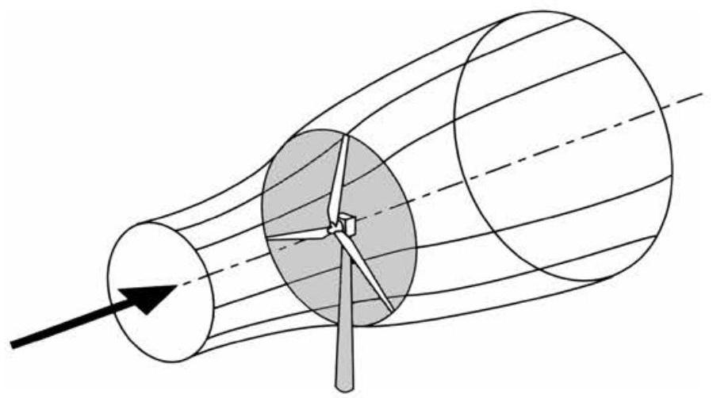

图 3.1 风力机吸取能量的流管

虽然动能是从气流中吸取, 但速度突变是不可能的, 也是人们不期望发生的。 由于巨大的加速度产生强大的作用力, 这种速度突变又是需要的。由于压力可以以突变方式输出能量，所以不论风力机如何设计，都是以此方式运转。

风力机的存在导致上游剖面接近风轮的空气逐渐减速，以至于当空气到达风轮圆盘时, 其速度已经低于自由流风速了。风速的降低导致了流管膨胀, 因为其速度没有对气体或通过气体来做功, 所以气体的静压将上升以吸收其动能的减少。

当空气经过风轮圆盘时显然有静压降存在, 以至于空气离开风轮时其压力会小于大气压力。空气流就会以减小的速度和静压向下游前进一一这个气流域被称为尾流。最终, 为了保持平衡, 下游远端尾流的静压要与大气压保持一致。动能的消耗使静压增加, 从而导致风速进一步降低。因此, 在上游剖面远端和尾流远端之间, 静压没有发生变化, 但是动能会减少。

为了学习风力机相关的空气动力学知识，需要先了解一些流体动力学，特别是飞行器空气动力学的知识。关于空气动力学方面的文献是比较有用的, 本章末给出了一些参考书目。本书中包含的所有关于空气动力学的精简叙述是非常必需的。一些以空气动力学为主题的指导对于风力机的研究是必需的, 并且对读者来说也是有用的。

学习 3.2 节和 3.3 节，需要具备定常不可压缩流的伯努利定理以及连续性概念的知识。学习 3.4 节在第一次阅读的时候可以略过, 如果有涡流及涡流诱导的流场的知识是比较理想的。掌握电磁场知识的人应该对毕奥-萨伐尔定律不陌生, 此定律可以用来确定由旋涡诱导的速度。还应该学习一下用来确定在约束涡上作用力的库达-儒可夫斯基定律。在 3.5 节, 3.6 节以及 3.7 节中, 有关翼型升力及阻力包括失速流动知识是最基本的。

## 3.2 致动盘概念

以上所述机理说明了动能是如何获取的, 但是并没有解释这些能量发生了怎样的变化。有些能量做了有用功, 而有些能量作为湍流回到风中, 并且最终以热量的形式消耗。不过,我们仍然能在仅考虑能量转换过程而不涉及风力机设计的情况下，对风力机空气动力学进行分析。实现这项任务的普通装置称为致动盘，如图 3.2 所示。

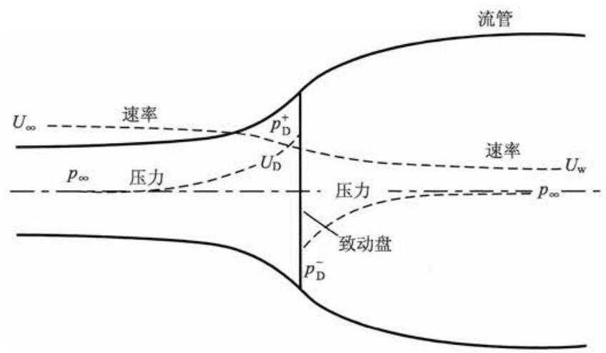

图 3.2 吸收能量的自致动盘和流管

圆盘上游剖面管的横截面积比圆盘面积小, 而下游的则比圆盘面积大。流管膨胀是因为要保证每处的质量流量相等。单位时间内通过特定截面的空气质量是 ${\rho AU}$ ,其中, $\rho$ 为空气密度, $A$ 为横截面积, $U$ 为流体速度。沿流管方向的质量流量处处相等，所以有

$$
\rho {A}_{\infty }{U}_{\infty } = \rho {A}_{\mathrm{D}}{U}_{\mathrm{D}} = \rho {A}_{\mathrm{W}}{U}_{\mathrm{W}} \tag{3.1}
$$

其中，下角符号 $\infty$ 代表上游无穷远处的情况；D 代表在圆盘处的情况；W 代表在尾流远端的情况。

通常认为致动盘导致速度发生变化，该速度变化将叠加到自由流速率上。该诱导气流在气流方向的分量为 $- a{U}_{\infty }$ ,其中, $a$ 为轴向诱导因子,或者称为入流因子。所以在圆盘上,气流方向的净速度为

$$
{U}_{\mathrm{D}} = {U}_{\infty }\left( {1 - a}\right) \tag{3.2}
$$

### 3.2.1 动量定理

气流在经过圆盘时速度发生变化,总变化量为 $\left( {{U}_{\infty } - {U}_{\mathrm{w}}}\right)$ ,动量变化量等于整个速度的变化率乘以质量流量。

$$
\text{ 动量变化率 } = \left( {{U}_{\infty } - {U}_{\mathrm{w}}}\right) \rho {A}_{\mathrm{D}}{U}_{\mathrm{D}} \tag{3.3}
$$

引起动量变化的力是完全来自于流过致动盘的压力差，因为包围流管的空气压力等于大气压，其合力为零。因此，

$$
\left( {{p}_{\mathrm{D}}^{ + } - {p}_{\mathrm{D}}^{ - }}\right) {A}_{\mathrm{D}} = \left( {{U}_{\infty } - {U}_{\mathrm{W}}}\right) \rho {A}_{\mathrm{D}}{U}_{\infty }\left( {1 - a}\right) \tag{3.4}
$$

由于上、下游气体的总能量不同,所以需要对流管的上游剖面和下游剖面分别使用伯努利方程，可以获得压力差( ${p}_{\mathrm{D}}^{ + } - {p}_{\mathrm{D}}^{ - }$ )。在定常状态下，伯努利方程规定:若没有对流体做功或流体本身没有做功, 流体总能量包括动能、静压能和重力势能是相等的。因此，对于单位体积的气体有

$$
\frac{1}{2}\rho {U}^{2} + p + {\rho gh} = \text{ const } \tag{3.5}
$$

所以流管在上游剖面可得

$$
\frac{1}{2}{\rho }_{\infty }{U}_{\infty }^{2} + {p}_{\infty } + {\rho }_{\infty }g{h}_{\infty } = \frac{1}{2}{\rho }_{\mathrm{D}}{U}_{\mathrm{D}}^{2} + {p}_{\mathrm{D}}^{ + } + {\rho }_{\mathrm{D}}g{h}_{\mathrm{D}} \tag{3.6}
$$

假设气体是不可压缩 $\left( {{\rho }_{\infty } = {\rho }_{\mathrm{D}}}\right)$ 和水平 $\left( {{h}_{\infty } = {h}_{\mathrm{D}}}\right)$ 的,那么有

$$
\frac{1}{2}\rho {U}_{\infty }^{2} + {p}_{\infty } = \frac{1}{2}\rho {U}_{\mathrm{D}}^{2} + {p}_{\mathrm{D}}^{ + } \tag{3.7}
$$

同样,对下流段为

$$
\frac{1}{2}\rho {U}_{\mathrm{w}}^{2} + {p}_{\infty } = \frac{1}{2}\rho {U}_{\mathrm{D}}^{2} + {p}_{\mathrm{D}}^{ - } \tag{3.8}
$$

两式相减得

$$
{p}_{\mathrm{D}}^{ + } - {p}_{\mathrm{D}}^{ - } = \frac{1}{2}\rho \left( {{U}_{\infty }^{2} - {U}_{\mathrm{W}}^{2}}\right) \tag{3.9}
$$

代入式(3.4)有

$$
\frac{1}{2}\rho \left( {{U}_{\infty }^{2} - {U}_{\mathrm{w}}^{2}}\right) {A}_{\mathrm{D}} = \left( {{U}_{\infty } - {U}_{\mathrm{w}}}\right) \rho {A}_{\mathrm{D}}{U}_{\infty }\left( {1 - a}\right) \tag{3.10}
$$

因此，

$$
{U}_{\mathrm{w}} = \left( {1 - {2a}}\right) {U}_{\infty } \tag{3.11}
$$

也就是说, 流管内轴向流速度的损失一半发生在致动盘的上游剖面, 另一半发生在致动盘的下游剖面。

### 3.2.2 风能利用系数

从式 (3.4) 可知，作用在气体上的力为

$$
T = \left( {{p}_{\mathrm{D}}^{ + } - {p}_{\mathrm{D}}^{ - }}\right) {A}_{\mathrm{D}} = {2\rho }{A}_{\mathrm{D}}{U}_{\infty }^{2}a\left( {1 - a}\right) \tag{3.12}
$$

该作用力对致动盘所做的功为 $F{U}_{\mathrm{D}}$ ，因此，气体输出功率为

$$
P = T{U}_{\mathrm{D}} = {2\rho }{A}_{\mathrm{D}}{U}_{\infty }^{3}a{\left( 1 - a\right) }^{2} \tag{3.13}
$$

那么风能利用系数定义为

$$
{C}_{\mathrm{P}} = \frac{P}{\frac{1}{2}\rho {U}_{\infty }^{3}{A}_{\mathrm{D}}} \tag{3.14}
$$

其中, 分母表示通过风轮旋转面在无致动量情况下, 空气提供的全部风能。因此, 有

$$
{C}_{\mathrm{P}} = {4a}{\left( 1 - a\right) }^{2} \tag{3.15}
$$

### 3.2.3 贝兹极限

最大风能利用系数在以下情况下取得

$$
\frac{\mathrm{d}{C}_{\mathrm{P}}}{\mathrm{d}a} = 4\left( {1 - a}\right) \left( {1 - {3a}}\right)  = 0 \tag{3.16}
$$

其中, $a = 1/3$ 。

从而可以得到最大风能利用系数为

$$
{C}_{{\mathrm{P}}_{\max }} = \frac{16}{27} \approx  {0.593} \tag{3.17}
$$

风能利用系数所能达到的最大值就是贝兹极限。德国空气动力学家 Albert Betz(1919)提出贝兹极限后, 直到今天, 还没有能设计出超过这个极限的风力机。 该极限不是由于设计的不足造成的 (目前我们还没有设计出), 而是因为流管不得不在致动盘上游膨胀, 使得自由流速比在圆盘处的小。

或许风能利用系数 ${C}_{\mathrm{P}}$ 可以更公正地被定义为

$$
{C}_{\mathrm{P}} = \frac{\text{ 吸收功率 }}{\text{ 可用功率 }} = \frac{\text{ 吸收功率 }}{\frac{16}{27}\left( {\frac{1}{2}\rho {U}_{\infty }^{3}{A}_{\mathrm{D}}}\right) } \tag{3.18}
$$

但这不是公认的 ${C}_{\mathrm{P}}$ 定义。

### 3.2.4 推力系数

由压力降产生的作用于致动盘的作用力[式(3.12)过无量纲化后给出推力系数 ${C}_{\mathrm{T}}$ :

$$
{C}_{\mathrm{T}} = \frac{P}{\frac{1}{2}\rho {U}_{\infty }^{2}{A}_{\mathrm{D}}} \tag{3.19}
$$

$$
{C}_{\mathrm{T}} = {4a}\left( {1 - a}\right) \tag{3.20}
$$

尾流速度为 $\left( {1 - {2a}}\right) {U}_{\infty }$ ,当 $a \geq  1/2$ 时,将出现尾流速度变成零,甚至变成负数的问题。在这种情况下, 动量定理物理模型将不再适用, 而必须对其进行经验修正 (见 3.6 节)。

风能利用系数和推力系数随 $a$ 的变化曲线如图 3.3 所示。

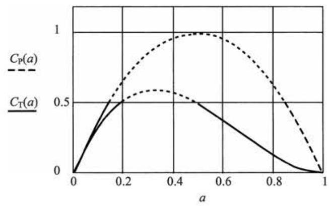

图 3.3 风能利用系数 ${C}_{\mathrm{P}}$ 和推力系数 ${C}_{\mathrm{T}}$ 随轴向诱导因子 $a$ 的变化曲线

## 3.3 风轮圆盘理论

将吸收能量转化为可用能量的方式取决于风力机的设计。多数风力机采用带有许多叶片的风轮，叶片绕垂直于风轮面且平行于风向轴线以角速度 $\Omega$ 进行旋转。 叶片扫过形成一个圆盘，依靠叶片的空气动力设计在圆盘前、后形成压力差(该内容在 3.2 节中已经讨论过), 该压力差造成尾流轴向动量的损失。伴随轴向动量损失的是一种可以通过连接在风轮轴的发电机收集起来的能量, 正像风轮受到推力一样, 在旋转方向的转矩可以被收集起来。发电机对旋转速度恒定的气流施加一个大小相等、方向相反的转矩, 该转矩对发电机做功并转化为电能。提供转矩和推力的风轮叶片气动设计将在 3.5 节中进行讨论。

### 3.3.1 旋转尾流

气流通过风轮圆盘时, 圆盘所受转矩与作用在空气上的转矩是一个大小相等、 方向相反的转矩。反转矩作用的结果会导致空气逆着风轮转向旋转, 从而获得角动量, 这样会使风轮圆盘尾流的空气微粒在旋转面的切线方向和轴向上都获得速度分量(图 3.4)。

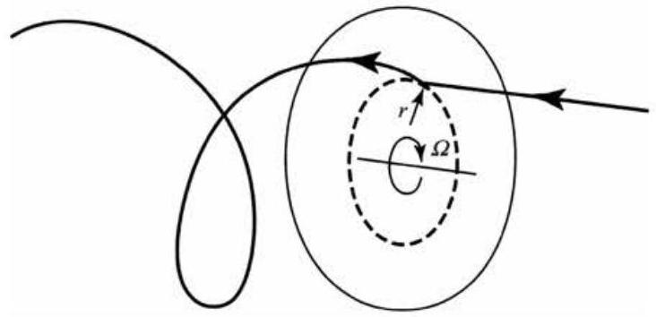

图 3.4 空气微粒经过风轮圆盘的运动轨迹

气流在切线方向获得的速度分量意味着其自身动能的增加, 增加的动能补偿了除前一章节所述之外的在尾流中空气的静压的降低。

进入致动盘的气流无任何转动, 而离开圆盘的气流是旋转的, 并且气流在尾流中一直保持恒速旋转。转动传递发生在整个圆盘的厚度处,如图 3.5 所示。切向速度的变化用切向气流诱导因子 ${a}^{\prime }$ 表示。圆盘上游气流的切向速度为零。圆盘下游气流的切向速度为 ${2\Omega r}{a}^{\prime }$ 。在圆盘厚度中部,距旋转轴径向距离为 $r$ 的地方,其切向诱导速度为 ${\Omega r}{a}^{\prime }$ 。因为它是由转矩的反作用产生的,方向与风轮运动相反。

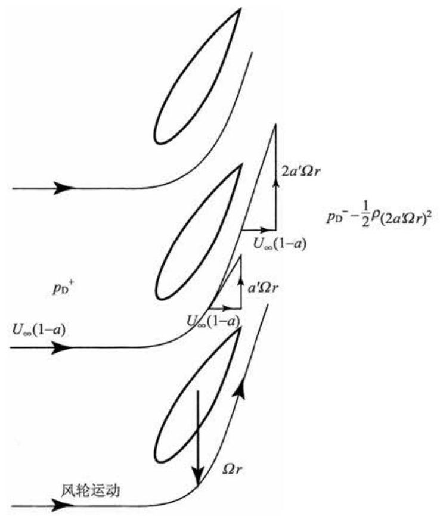

图 3.5 气流切向速度在通过圆盘厚度后逐渐增加

图 3.5 表明，气流在叶片之间被“挤压”，在切线方向产生了加速。叶片之间的间距减小了该影响，但是气流越接近叶片根部，叶片对气流的阻塞作用越大，这就导致了在叶片根部处出现大的切向速度。

### 3.3.2 角动量定理

在所有的各个径向位置上, 切向速度是不一样的, 同样轴向诱导速度也会不一样。考虑两个诱导速度分量的变化只需考虑半径 $r$ 和径向宽度 ${\delta r}$ 的环即可。

环形圆盘上转矩的增量将使切向速度分量传递给空气, 而作用在圆环上的轴向力将会使轴向速度降低。整个圆盘由多个圆环组成, 并且假定每个环的作用力相互独立，即把实际传递给每个环的动量仅仅传递给空气。

作用在环形区上的转矩等于通过此环形区的空气的角动量的变化率, 因此,

转矩 $=$ 角动量的变化率 $=$ 质量流量 $\times$ 切向速度的变化 $\times$ 半径

$$
{\delta Q} = {\rho \delta }{A}_{\mathrm{D}}{U}_{\infty }\left( {1 - a}\right) {2\Omega }{a}^{\prime }{r}^{2} \tag{3.21}
$$

式中, $\delta {A}_{\mathrm{D}}$ 为圆环的面积。

风轮轴的驱动转矩也为 ${\delta Q}$ ,所以风轮转轴输出的功率增量为

$$
{\delta P} = {\delta Q\Omega }
$$

风速降低所输出的总功率取决于式 (3.13) 给出的轴向动量变化率

$$
{\delta P} = {2\rho \delta }{A}_{\mathrm{D}}{U}_{\infty }^{3}a{\left( 1 - a\right) }^{2}
$$

因此, 有

$$
{2\rho \delta }{A}_{\mathrm{D}}{U}_{\infty }^{3}a{\left( 1 - a\right) }^{2} = {\rho \delta }{A}_{\mathrm{D}}{U}_{\infty }\left( {1 - a}\right) 2{\Omega }^{2}{a}^{\prime }{r}^{2}
$$

和

$$
{U}_{\infty }^{2}a\left( {1 - a}\right)  = {\Omega }^{2}{r}^{2}{a}^{\prime }
$$

其中, ${\Omega r}$ 为旋转圆环的切向速度,所以 ${\lambda }_{\mathrm{r}} = {\Omega r}/{U}_{\infty }$ 称为局部速度比。在圆盘 $r = R$ 的边缘处, $\lambda  = {\Omega R}/{U}_{\infty }$ 称为叶尖速度比。因此,

$$
a\left( {1 - a}\right)  = {\lambda }_{\mathrm{r}}^{2}{a}^{\prime } \tag{3.22}
$$

圆环的面积为 $\delta {A}_{\mathrm{D}} = {2\pi r\delta r}$ ,所以从式 (3.21) 中可以得出轴功率增量为

$$
{\delta P} = {\delta Q\Omega } = \left( {\frac{1}{2}\rho {U}_{\infty }^{3}{2\pi r\delta r}}\right) 4{a}^{\prime }\left( {1 - a}\right) {\lambda }_{\mathrm{r}}^{2}
$$

括号里的项表示通过圆环的功率流量, 括号外的项被称为捕获功率时叶片单元的效率, 或者称为叶片单元效率。

$$
{\eta }_{\mathrm{r}} = 4{a}^{\prime }\left( {1 - a}\right) {\lambda }_{\mathrm{r}}^{2} \tag{3.23}
$$

用风能利用系数表示:

$$
\frac{\mathrm{d}{C}_{\mathrm{P}}}{\mathrm{d}r} = \frac{{4\pi \rho }{U}_{\infty }^{3}\left( {1 - a}\right) {a}^{\prime }{\lambda }_{\mathrm{r}}^{2}r}{\frac{1}{2}\rho {U}_{\infty }^{3}\pi {R}^{2}} = \frac{8\left( {1 - a}\right) {a}^{\prime }{\lambda }_{\mathrm{r}}^{2}r}{{R}^{2}}
$$

$$
\frac{\mathrm{d}{C}_{\mathrm{P}}}{\mathrm{d}\mu } = 8\left( {1 - a}\right) {a}^{\prime }{\lambda }^{2}{\mu }^{3} \tag{3.24}
$$

其中, $\mu  = r/R$ 。

如果知道 $a$ 和 ${a}^{\prime }$ 沿径向的变化规律,那么对于给定的叶尖速度比 $\lambda$ ,通过对式 (3.24)进行积分可以确定总的风能利用系数。

据争议的是旋转尾流需要的能量来自于气流而并非吸收，但在实际中并不能发现此现象。叶片产生的升力形成了风轮圆盘正常的与叶片相关的合力，因此，没通过或利用流体做功。因此,伯努利理论可以应用在整个风轮圆盘的流,与旋转角速度 $\Omega$ 相关，给出下列公式:

$$
\frac{1}{2}\rho {U}_{\infty }^{2}{\left( 1 - a\right) }^{2} + \frac{1}{2}\rho {\Omega }^{2}{r}^{2} + \frac{1}{2}\rho {w}^{2} + {p}_{\mathrm{D}}^{ + }
$$

$$
= \frac{1}{2}\rho {U}_{\infty }^{2}{\left( 1 - a\right) }^{2} + \frac{1}{2}\rho {\Omega }^{2}{\left( 1 + 2{a}^{\prime }\right) }^{2}{r}^{2} + \frac{1}{2}\rho {w}^{2} + {p}_{\mathrm{D}}^{ - }
$$

于是

$$
\Delta {p}_{\mathrm{d}} = {2\rho }{\Omega }^{2}\left( {1 + {a}^{\prime }}\right) {a}^{\prime }{r}^{2}
$$

盘上压力的下降很明显主要来自于两个因素。第一个因素是

$$
\Delta {p}_{\mathrm{{dl}}} = {2\rho }{\Omega }^{2}{a}^{\prime }{r}^{2} \tag{3.25}
$$

来自于式 (3.22), 与动量定理中式 (3.12) 给出的一样, 旋转并没有起到作用。第二个因素是

$$
\Delta {p}_{\mathrm{d}2} = {2\rho }{\Omega }^{2}{a}^{\prime 2}{r}^{2} \tag{3.26}
$$

$\Delta {p}_{\mathrm{d}2}$ 由径向引出，旋转尾流的静压力梯度与旋转流体离心力相平衡

$$
\frac{\mathrm{d}p}{\mathrm{\;d}r} = p{\left( 2\Omega {a}^{\prime }\right) }^{2}r
$$

尾流中旋转流体单位体积的动能同时也与式 (3.26) 中静压力下降的能量相等, 所以这两部分能量是平衡的, 并且在可用的动能中没有能量损失。

那么问题就产生了, 式 (3.26) 中压力的下降真的在风轮圆盘上产生额外的推力了吗？答案是否定的。因为式 (3.25) 中压力的下降只适用于在圆盘下游剖面的点, 这些点在圆盘与满额尾流 (图 3.2) 之间具有正的轴向压力梯度, 式 (3.26) 中压力的下降适用于整个尾流，并且不存在造成轴向速度的进一步下降的压力梯度。 如果流体轴向动量没有变化的话, 也不会在风轮上产生对应的力, 因为如果会的话,将违背牛顿第三定律,会产生异常。

### 3.3.3 最大功率

能提供最大可能效率的 $a$ 和 ${a}^{\prime }$ 值是通过式 (3.23) 对 $a$ 和 ${a}^{\prime }$ 求微分,并令其结果等于零而得到的。由此,

$$
\frac{\mathrm{d}a}{\mathrm{\;d}{a}^{\prime }} = \frac{1 - a}{{a}^{\prime }} \tag{3.27}
$$

对于式(3.22)也有

$$
\frac{\mathrm{d}a}{\mathrm{\;d}{a}^{\prime }} = \frac{{\lambda }_{r}^{2}}{1 - {2a}}
$$

得到

$$
{a}^{\prime }{\lambda }_{\mathrm{r}}^{2} = \left( {1 - a}\right) \left( {1 - {2a}}\right) \tag{3.28}
$$

联立式 (3.22) 和式 (3.25),可以求解出使增加的风能利用系数最大化的 $a$ 和 ${a}^{\prime }$ 的值为

$$
a = \frac{1}{3},\;{a}^{\prime } = \frac{a\left( {1 - a}\right) }{{\lambda }_{\mathrm{r}}^{2}} \tag{3.29}
$$

最大功率输出的轴向诱导因子也与非旋转尾流的情况一样,都有 $a = 1/3$ ,并且在整个圆盘上都是一致的。 ${a}^{\prime }$ 却随着径向位置的变化而变化。

从式 (3.24) 中可以得到最大功率系数为

$$
{C}_{\mathrm{P}} = 8{\int }_{0}^{1}\left( {1 - a}\right) {a}^{\prime }{\lambda }^{2}{\mu }^{3}\mathrm{\;d}\mu
$$

代入式 (3.27) 中得

$$
{C}_{\mathrm{P}} = 8{\int }_{0}^{1}\left( {1 - a}\right) \frac{a\left( {1 - a}\right) }{{\lambda }^{2}{\mu }^{2}}{\lambda }^{2}{\mu }^{3}\mathrm{\;d}\mu  = {4a}{\left( 1 - a\right) }^{2} = \frac{16}{27} \tag{3.30}
$$

这与非旋转尾流的情况正好相同。

## 3.4 致动盘的涡流柱模型

### 3.4.1 引 言

在 3.1 节的动量定理中用到了致动盘的概念, 在致动盘两边的压降构成风轮吸收的能量。在 3.3 节的风轮圆盘理论中, 致动盘被描述为多个翼形叶片扫过的区域，每个叶片有径向相同的附着环量 ${\Delta \Gamma }$ 。在每个叶片的叶尖，螺旋形涡旋强度 ${\Delta \Gamma }$ 在下游区和当地流动发生对流 (图 3.6)。如果假定叶片非常多，实度是有限的且很小，螺旋叶尖涡流的积累将形成一个管状面。大量的叶片无限接近管状面将变成一个连续管状涡面。

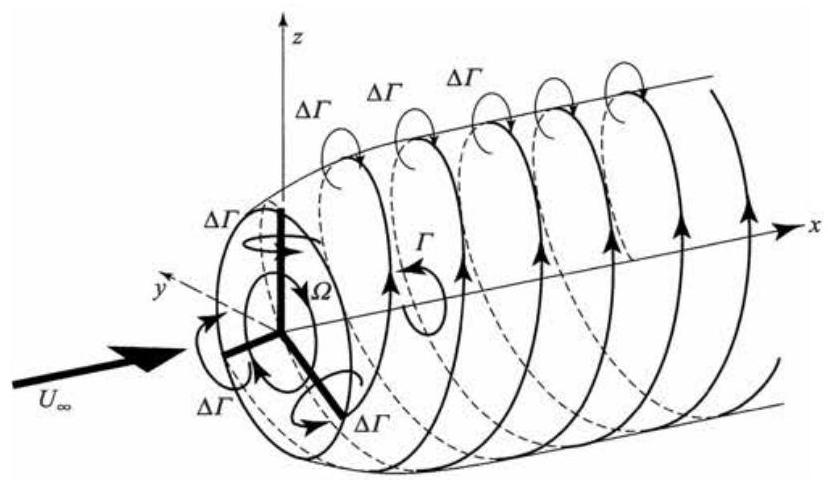

图 3.6 环流相同的三叶片风轮形成的均匀环量 ${\Delta \Gamma }$ 叶片风轮脱落的螺旋涡流尾流图

从每个叶片的根部开始,假设可以到达旋转轴线,线涡旋强度 ${\Delta \Gamma }$ 会沿着旋转轴线向下游延伸，为总的根涡强度 $\Gamma$ 做贡献。涡流管的半径将增大，管内流动减慢。涡流局限于管表面，根涡到附着涡流被多个叶片扫略形成风轮圆盘；在尾流的其他区域和整个流场内其他任何地方都是不旋转的 (图 3.7)。

管子膨胀的特性不是动量定理能决定的, 因此, 近似认为管子是圆柱形的, 如图 3.7 所示。毕奥-萨伐尔定律用于确定致动盘附近任何点上的诱导速度。圆柱形涡流模型可以确定整个流场，而且它在非膨胀圆柱形尾流的限制下是精确的。

### 3.4.2 涡流柱理论

涡流柱有表面涡量，该涡量沿着螺旋状路线以螺旋角 $\phi$ 进行运动，以前它被命名为叶尖处的入流角。涡量强度为 $g = \mathrm{d}\Gamma /\mathrm{d}n$ ，这里 $n$ 表示在管子表面 ${\Delta \Gamma }$ 的法线方向,涡强度分量 ${g}_{\theta } = g\cos {\Phi }_{t}$ 平行于风轮圆盘。由于 ${g}_{\theta }$ 在风轮旋转面上沿平行于旋转轴的诱导速度在整个风轮圆盘上是均匀的, 所以根据毕奥-萨伐尔定律有

$$
{u}_{\mathrm{d}} =  - \frac{{g}_{\theta }}{2} =  - a{U}_{\infty } \tag{3.31}
$$

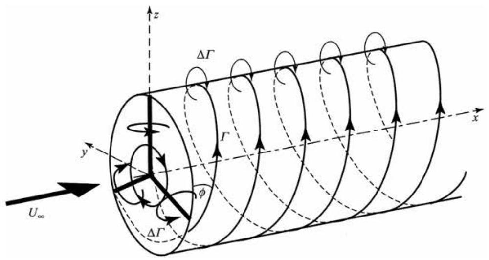

图 3.7 忽略尾流膨胀的简化螺旋涡流尾流图

在尾流远端, 圆柱尾流内的轴向诱导速度也是均匀的, 其大小为

$$
{u}_{\mathrm{w}} =  - {g}_{\theta } =  - {2a}{U}_{\infty } \tag{3.32}
$$

两个诱导速度的比值符合简单动量定理, 并证明了涡流柱的假设是正确的。

### 3.4.3 附着涡环量和诱导速度的关系

所有叶片上的总环流是 $\Gamma$ ,它是在旋转一圈中以均匀速度流进尾流的环量。 所以，如图 3.8 所示，圆柱体表面涡流的几何学圆柱被纵向切开并展开。

$$
g = \frac{\Gamma }{{2\pi R}\sin {\phi }_{\mathrm{t}}} \tag{3.33}
$$

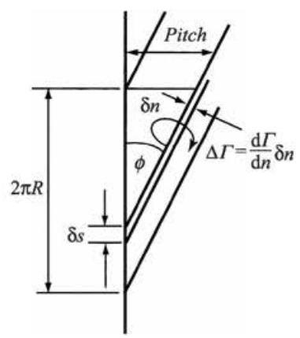

图 3.8 圆柱体表面涡流的几何学圆柱

从而

$$
{g}_{\theta } = \frac{\Gamma }{2\pi R}\frac{\cos {\phi }_{\mathrm{t}}}{\sin {\phi }_{\mathrm{t}}} = \frac{\Gamma }{2\pi R}\frac{\Omega R}{{U}_{\infty }\left( {1 - a}\right) } \tag{3.34}
$$

因此,

$$
{2a}{U}_{\infty } = \frac{\Gamma }{2\pi R}\frac{\Omega R}{{U}_{\infty }\left( {1 - a}\right) } \tag{3.35}
$$

所以，总的环流与诱导速度相关，其大小为

$$
\Gamma  = \frac{{4\pi }{U}_{\infty }^{2}a\left( {1 - a}\right) }{\Omega } \tag{3.36}
$$

### 3.4.4 根 涡

就像每个叶尖拖出的旋涡一样，叶根处也有涡流。如果假定叶片一直延伸到旋转轴 (这显然是不实际的), 每个根涡就是一个从圆盘中心向下游沿轴向流动的线涡。所有的根涡的旋转方向均相同，由此将形成有一个核心或根部，总强度为 $\Gamma$ 的涡流。尾流区的诱导切向速度，特别是风轮圆盘的切向速度主要是由根涡导致的。

在风轮圆盘表面上，毕奥-萨伐尔定律给出的根涡诱导切向速度为

$$
{a}^{\prime }{r\Omega } = \frac{\Gamma }{4\pi r}
$$

$$
{a}^{\prime } = \frac{\Gamma }{{4\pi }{r}^{2}\Omega } \tag{3.37}
$$

这个关系式也可以从动量定理推导出来: 穿过半径为 $r$ ,径向宽度为 $\mathrm{d}r$ 的环面的气流的角动量的变化率等于作用在该环面的转矩增量

$$
\mathrm{d}Q = \rho {U}_{\infty }\left( {1 - a}\right) {2\pi r}\mathrm{\;d}{r2}{a}^{\prime }\Omega {r}^{2} \tag{3.38}
$$

根据库塔-儒科夫斯基原理, 每单位径向宽度的升力为

$$
L = \rho \left( {W \times  \Gamma }\right)
$$

其中, $W \times  \Gamma$ 是一个矢量积。

$$
\mathrm{d}Q = {\rho W} \times  {\Gamma r}\sin {\phi }_{\mathrm{t}}\mathrm{d}r = {\rho \Gamma r}{U}_{\infty }\left( {1 - a}\right) \mathrm{d}r \tag{3.39}
$$

$$
{a}^{\prime } = \frac{\Gamma }{{4\pi }{r}^{2}\Omega }
$$

所以

$$
{a}^{\prime } = \frac{{U}_{\infty }^{2}a\left( {1 - a}\right) }{{\lambda }_{\mathrm{r}}^{2}} = \frac{a\left( {1 - a}\right) }{{\lambda }_{\mathrm{r}}^{2}}
$$

因此, 得到

$$
{a}_{\mathrm{t}}^{\prime } = \frac{a\left( {1 - a}\right) }{{\lambda }^{2}} \tag{3.40}
$$

式(3.40)与式(3.27)并不完全相同，可见，这是忽略尾流膨胀的结果。

### 3.4.5 转矩和功率

半径为 $r$ ,径向宽度为 $\mathrm{d}r$ 的环面上的转矩为

$$
\frac{\mathrm{d}Q}{\mathrm{\;d}r}{\delta r} = {\rho W\Gamma r}\sin {\phi }_{\mathrm{t}}{\delta r} = \frac{{\rho 4\pi r}{U}_{\infty }^{3}a{\left( 1 - a\right) }^{2}}{\Omega }{\delta r}
$$

$$
\frac{\mathrm{d}Q}{\mathrm{\;d}r} = \frac{\frac{1}{2}\rho {U}_{\infty }^{3}{2\pi r4a}{\left( 1 - a\right) }^{2}}{\Omega } \tag{3.41}
$$

功率为

$$
\frac{\mathrm{d}P}{\mathrm{\;d}r} = \Omega \frac{\mathrm{d}Q}{\mathrm{\;d}r} = \frac{1}{2}\rho {U}_{\infty }^{3}{2\pi r4a}{\left( 1 - a\right) }^{2} \tag{3.42}
$$

$$
P = \frac{1}{2}\rho {U}_{\infty }^{3}\pi {R}^{2}{4a}{\left( 1 - a\right) }^{2} \tag{3.43}
$$

风能利用系数为

$$
{C}_{\mathrm{P}} = {4a}{\left( 1 - a\right) }^{2} = 4{a}_{\mathrm{t}}{}^{\prime }\left( {1 - a}\right) {\lambda }^{2} \tag{3.44}
$$

结果再一次与利用动量定理预测的一样。

最有趣的是尾流中的旋转流与所有的功率分离出的效率没有什么不同。

### 3.4.6 轴向流场

致动盘顺风向 (轴向) 的诱导速度可以通过在圆盘上游和下游尾流中测定, 也可以在圆盘自身上测定。流场 (净速度) 是轴对称的, 它的径向断面图如图 3.9 所示。轴向距离和径向距离分别相对于风轮盘和旋转轴测量, 两者均除以风轮半径。 速度以风速大小来进行划分。

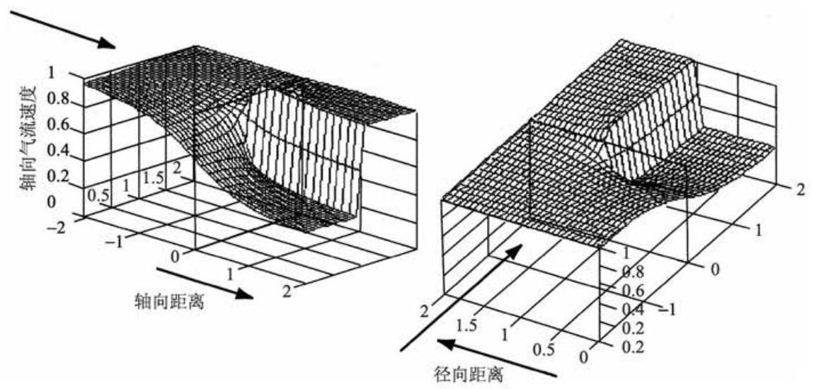

图 3.9 在致动盘 $a = 1/3$ 附近,轴向速度在径向和轴向上的变化

尾流中的轴向速度与尾流外的轴向速度相比急剧下降, 并且在圆盘处和尾流远端轴向速度沿径向是相同的。在尾流边界外流动有小加速。尾流柱上的诱导速度在圆盘处为 $a/4$ ,在尾流远端为 $a/2$ 。

### 3.4.7 切向流场

切向诱导速度不仅取决于根涡,而且还与尾流柱面的涡量分量 $g\sin \Phi$ 及风轮圆盘的附着涡量有关。作为例子，在径向距离等于圆盘半径的一半时，三者引起的切向速度的轴向变化如图 3.10 所示。

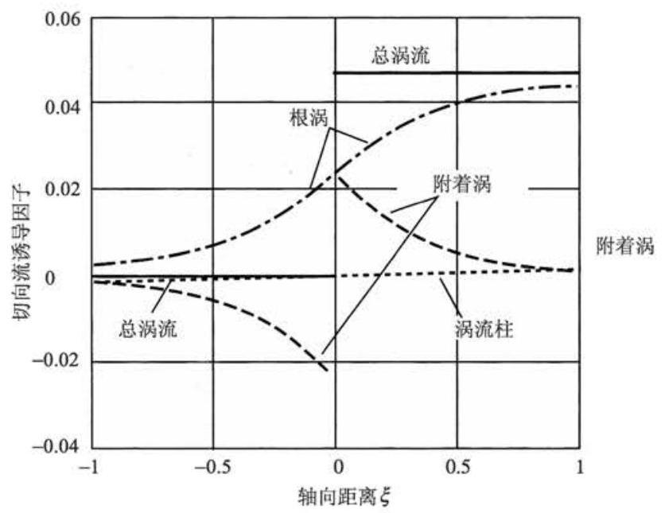

图 3.10 在致动盘半径的一半, $a = 1/3,\lambda  = 6$ 附近切向速度的轴向变化

附着涡量引起的气流旋转方向在风轮圆盘上、下游正好相反，即通过风轮圆盘时切向速度产生一个突变。在上游，旋转方向与风轮相同，因而被根涡引起的与风轮旋转方向相反的流动相抵消。在下游, 流动旋转的方向与根涡和附着涡两者相同, 两者相加后的速率沿流向不变。尾流柱面上的涡量的贡献很小。

从图 3.10 可以看出, 对于圆盘本身, 附着涡和尾流柱都不诱导旋转, 而仅有根涡诱导旋转流动且其值通常为尾流区总诱导量的一半。现在我们明白了为什么只用旋转速度的一半来测定圆盘的入流角了。

附近切向速度的轴向变化旋转流动被限定在尾流区域内, 也就是说, 它被限定在柱体里。旋转流不存在于尾流区域之外的任何地方, 也不存在于圆盘的上游和柱体外面。柱体内的旋流速度随着半径的增加而下降, 但是在尾流外缘处并不为零。所以, 在穿过柱体表面时, 旋转速度会有一个突降。

因此,这个柱面以 ${\alpha }_{1}^{\prime }\Omega$ 的角速度旋转,所以旋转流与转盘的关系为 $\left( {1 + {\alpha }^{\prime }}\right) \Omega$ 。 似乎流角 ${\Phi }_{\mathrm{t}}$ 会把增加的旋转考虑在内,但是这取决于流与移动柱面的相关旋转速度 $\Omega$ 。

在半径为圆盘半径 1.01 倍时, 三个涡流源对旋转流的贡献如图 3.11 所示, 所有轴向位置的总旋转流为零, 但其各自分量却不为零。

### 3.4.8 轴向推力

圆盘上的轴向推力 $T$ 可以通过 Kutta-Joukowski 理论决定,

$$
\frac{\mathrm{d}T}{\mathrm{\;d}r} = {\rho \Gamma V}
$$

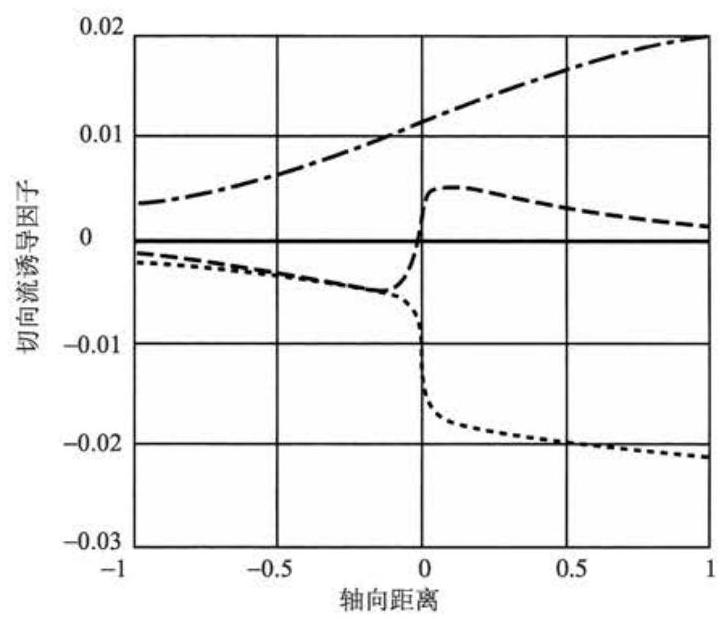

图 3.11 半径为致动盘半径的 1.01 倍, $a = 1/3,\lambda  = 6$ 附近切向速度的轴向变化

式中, $V$ 是圆盘的切向速度。如果 $V = {r\Omega }$ ,利用式 (3.34),

$$
\frac{\mathrm{d}T}{\mathrm{\;d}r} = {\rho 4\pi r}{U}_{\infty }^{2}a\left( {1 - a}\right) \tag{3.45}
$$

面对整个圆盘,式(3.45)的积分给出推力系数

$$
{C}_{\mathrm{T}} = {4a}\left( {1 - a}\right) \tag{3.46}
$$

与动量定理相同,并且在轴向,动量变化率也是一样的。然而,如果像假设的那样诱导切向速度 ${\alpha }^{\prime }{r\Omega }$ 包含在 $V$ ,那么轴向推力为无穷大,或者比轴向动量变化率要大得多, 同时需要的平衡也丧失了。

### 3.4.9 径向流场

虽然涡流柱理论因不考虑柱面膨胀而得以被简化, 但是该理论的预测结果却存在气流膨胀。该理论预测了径向速度分布，图 3.12 所示为通过致动盘的纵向流场剖面图。气流通过风轮圆盘时计算出的径向速度是最大的, 在图 3.12 中虽然没有显示, 但是在圆盘边缘是无限大的。这种情况与绕垂直于迎面气流平面的实心圆盘的位流场是相似的。气流流过圆盘并在下游沿径向继续前进时, 可以预想在圆盘边缘, 其径向速度将是无限大的。但是在实际中, 静压可能不足以推动其达到无限大或很高的速度, 因此, 会产生气流不连续的现象。由于径向速度很高, 即使有很小的黏性存在, 也将在接近圆盘处产生一个很厚的边界层。边界层处的黏性会吸收大量可用能量并转化为热量被消耗掉，所以随着圆盘边缘处的气流被加速， 能获得的最大速度将被静压趋近于零的旋压限制。气流将不会绕过圆盘边缘而从圆盘边缘分离且继续往下游运动, 在圆盘后面会留下一个速度很小、压力很低的区域——滞止区。

对于可渗透的风轮圆盘, 其情况和上述情况一样, 不过会有一些气流通过, 在圆盘边缘分离的气流也将在尾流中产生额外的低压区。

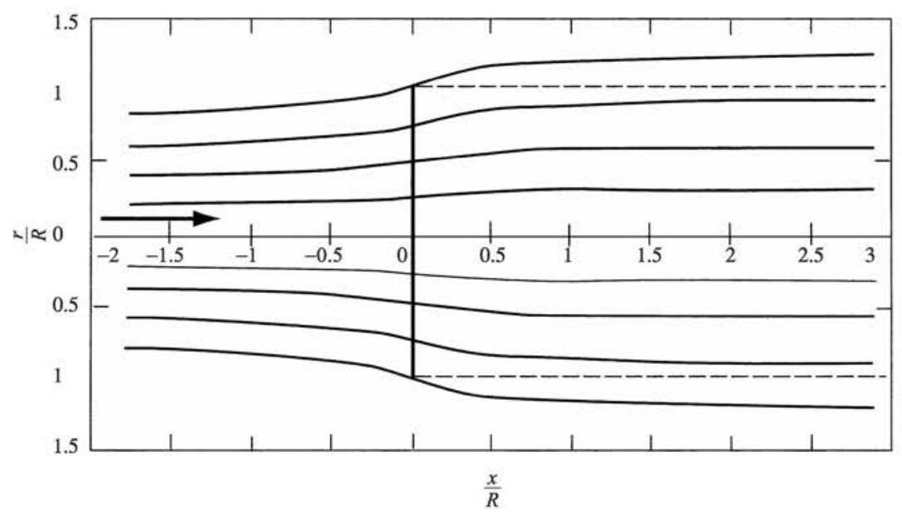

图 3.12 在 $a = 1/3$ 时,通过致动盘的纵向流场

由于假定风轮叶片无限多，就产生了风轮圆盘边缘处径向速度无限大的问题。 如果将该理论作一些修正以至于风轮仅有几个叶片，那么无限大的径向速度就会消失。对于一个给定的风轮, 如果叶尖速度比增加, 轴向诱导因子也将增加, 那么其叶尖径向速度将急剧上升，同时边缘分离问题也将再度出现，这个问题实际发生了，见 3.6 节。

### 3.4.10 结 论

不考虑尾流膨胀的影响，涡流理论得出的结论在很大程度上与动量定理一致， 而且加深了对气流流经致动盘时能量吸收原理的理解。

## 3.5 风轮叶片理论

### 3.5.1 引 言

在顺翼型展开的方向，作用于风轮叶片半径为 $r$ 、长度为 ${\delta r}$ 的展向叶素上气动升力 (和阻力) 是由通过叶素扫过的圆环的气体轴向动量变化率和角动量变化率产生的。另外, 作用于叶素上的力是由空气动力升力和阻力来提供的, 这种力是由关联尾流旋转速度的压力降引起的。由于在接近圆盘的地方无旋转气流, 就像引起轴向动量变化一样, 由旋转尾流导致的圆盘顺风面压力的减少是以阶跃压降的形式出现的。由于在远下游的尾流仍然在旋转, 所以旋转引起的压力降也就存在, 也就不会对轴向动量改变有影响。

### 3.5.2 叶素理论

假定作用于叶素上的力可以通过使用横截面上入射得到的速度确定的攻角的二维翼型特性计算得出的话，那么顺翼展方向的速度分量将被忽略，也忽略三维效应。

在叶片某一径向位置上的速度分量用风速来表示，攻角的大小由流动因子和旋转速度来确定。知道了翼型特征系数 ${C}_{1}$ 和 ${C}_{\mathrm{d}}$ 随攻角的变化情况，可以利用给定的 $a$ 和 ${a}^{\prime }$ 求出作用于叶片上的力。

对于一个叶片为 $B$ 、叶尖半径为 $R$ 、弦长为 $c$ 、桨距角(旋转平面与几何弦的夹角) 为 $\beta$ 的风力机，弦长和桨距角都沿着桨叶轴线变化。叶片旋转角速度为 $\Omega$ ,风速为 ${U}_{\infty }$ ,图 3.13 中所示叶素的切向速度这一部分内容在 3.4.8 节中提到是以 ${r\Omega }$ 的形式表示的。然而,先不管 3.4.8 节中推理的合理性,风速为 ${U}_{\infty }$ 。叶素的切向速度与尾流的切向速度 ${a}^{\prime }{\Omega r}$ 之和为经过叶素的净切向流速度 $\left( {1 + {a}^{\prime }}\right) {\Omega r}$ ,这种算法体现了其逻辑性。在现行的诸多文献中, 尤其是 Glauert 的, 这种切向速度的结合目前假定是正确的, 所以该理论出现在本书中, 尽管这被证明在驱动器转盘上是不可行的。驱动器转盘接近无穷小，切向速度的变化非常快。转子叶片“转盘”有轴向的深度，并且切线速度的增长是循序渐进的，图 3.5 中证明了这一点。

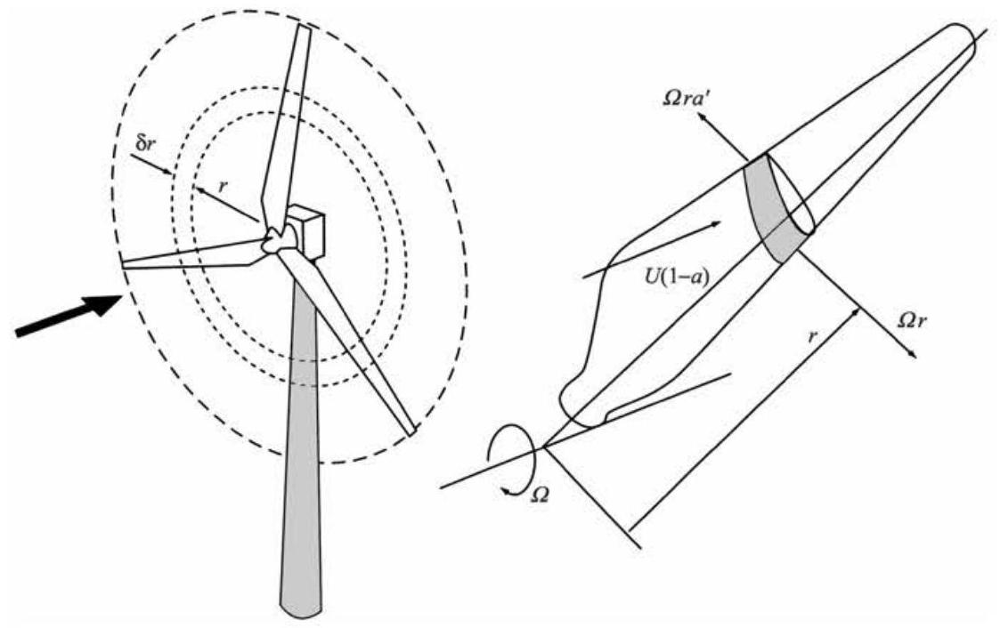

图 3.13 叶素扫出的圆环

图 3.14 所示是在半径为 $r$ 处所有速度和相对于弦线的作用力。

由图 3.14 可知, 叶片上的相对合速度为

$$
W = \sqrt{{U}_{\infty }^{2}{\left( 1 - a\right) }^{2} + {r}^{2}{\Omega }^{2}{\left( 1 + {a}^{\prime }\right) }^{2}} \tag{3.47}
$$

相对合速度与旋转面之间的夹角是 $\phi$ ,则

$$
\sin \phi  = \frac{{U}_{\infty }\left( {1 - a}\right) }{W},\;\cos \phi  = \frac{{r\Omega }\left( {1 + {a}^{\prime }}\right) }{W} \tag{3.48}
$$

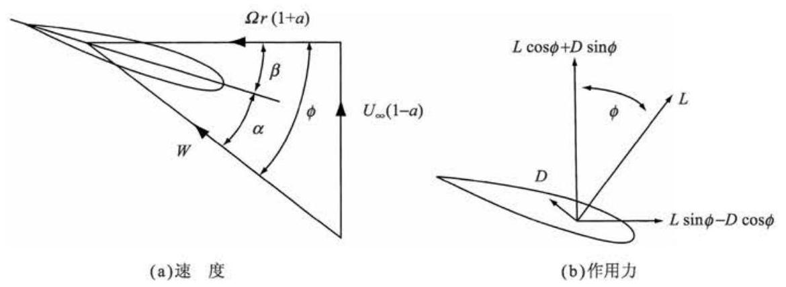

图 3.14 叶素的速度和作用力

攻角 $\alpha$ 由下式给出:

$$
\alpha  = \phi  - \beta \tag{3.49}
$$

叶素理论的基础假设是, 作用于某一元素上的空气动力学的升力和阻力与作用于一个孤立的、相同的二位流攻角的同样元素是一样的。

每个叶片在顺翼展方向长度为 ${\delta r}$ 的,垂直于方向 $W$ 的升力为

$$
{\delta L} = \frac{1}{2}\rho {W}^{2}c{C}_{1}{\delta r}
$$

平行于 $W$ 的阻力为

$$
{\delta D} = \frac{1}{2}\rho {W}^{2}c{C}_{\mathrm{d}}{\delta r}
$$

驱动转盘环形推力的计算方法为

$$
{\delta T} = {\delta L}\cos \phi  + {\delta D}\sin \phi  = \frac{1}{2}\rho {W}^{2}{Bc}\left( {{C}_{1}\cos \phi  + {C}_{\mathrm{d}}\sin \phi }\right) {\delta r} \tag{3.50}
$$

环形扭矩是

$$
{\delta Q} = \left( {{\delta L}\sin \phi  - {\delta D}\cos \phi }\right) r = \frac{1}{2}\rho {W}^{2}B\operatorname{cr}\left( {{C}_{1}\sin \phi  - {C}_{\mathrm{d}}\cos \phi }\right) {\delta r} \tag{3.51}
$$

式中, $B$ 是叶片的数量。

### 3.5.3 叶素/动量(BEM)定理

叶素/动量(BEM) 定理的基本假定如下: 作用于叶素上的力仅与通过叶素扫过的圆环的气体的动量变化有关。因此, 假定通过邻近圆环的气流之间不发生径向相互作用——严格地说，唯一正确的条件是轴向诱导因子在沿径向不变。实际上，轴向诱导因子很少是相同的，但 Lock (1924) 关于气流通过螺旋桨的实验表明， 径向独立的假定是可以接受的。

所有叶片上的轴向推力是相等的, 由式 (3.50) 给出, 通过叶素扫过圆环的气流的轴向动量的变化率由式 (3.12) 给出， ${A}_{\mathrm{D}} = {2\pi r\delta r}$ ，

$$
{\delta T} = \frac{1}{2}\rho {W}^{2}{Bc}\left( {{C}_{1}\cos \phi  + {C}_{\mathrm{d}}\sin \phi }\right) {\delta r} = {2\pi r\delta r\rho }{U}_{\infty }\left( {1 - a}\right) {2a}{U}_{\infty } \tag{3.52}
$$

叶素上的转矩也是相同的, 由式 (3.51) 给出, 扫过圆环的气流的环状动量的变化率由式 (3.38) 给出,

$$
{\delta Q} = \frac{1}{2}\rho {W}^{2}{Bcr}\left( {{\delta L}\sin \phi  - {\delta D}\cos \phi }\right) {\delta r} = {2\pi r\delta r\rho }{U}_{\infty }\left( {1 - a}\right) 2{a}^{\prime }{r}^{2}\Omega \tag{3.53}
$$

如果上面两个方程式不考虑拉力的话，与第三部分的涡理论结果做一下比较， 流角 $\phi$ 便可用下式表示

$$
\tan \phi  = \frac{{a}^{\prime }{r\Omega }}{a{U}_{\infty }} = \frac{{a}^{\prime }}{a}\frac{r}{R}\lambda
$$

然而, 由叶素三角涡的式 (3.48) 可知, 流角同样可以表示如下

$$
\tan \phi  = \frac{1 - a}{{\lambda }_{r}\left( {1 + {a}^{\prime }}\right) }
$$

令上述两个公式的 $\tan \phi$ 相等得

$$
\frac{{a}^{\prime }}{a}\frac{r}{R}\lambda  = \frac{1 - a}{{\lambda }_{1}\left( {1 + {a}^{\prime }}\right) }
$$

$$
a\left( {1 - a}\right)  = {\lambda }_{\mathrm{r}}^{2}{a}^{\prime }\left( {1 + {a}^{\prime }}\right) \tag{3.54}
$$

在叶片的外边缘, $\mu  = 1$ 并且 ${a}^{\prime } = {a}_{\mathrm{t}}^{\prime }$ ,所以

$$
a\left( {1 - a}\right)  = {\lambda }^{2}{a}_{\mathrm{t}}^{\prime }\left( {1 + {a}_{\mathrm{t}}^{\prime }}\right) \tag{3.55}
$$

式 (3.55) 与式 (3.40) 相比多了一个 $\left( {1 + {a}_{1}{}^{\prime }}\right)$ 。在 3.4.8 节最后一段提出的论点会导致推力的无穷大, 但是如前所述, 这一部分的加入是通常的做法。

把拉力计算值在内, 推力公式 (3.52) 可以简化为

$$
\frac{{W}^{2}}{{U}_{\infty }^{2}}B\frac{c}{R}\left( {{C}_{1}\cos \phi  + {C}_{\mathrm{d}}\sin \phi }\right)  = {8\pi a}{\left( 1 - a\right) }_{\mu } \tag{3.56}
$$

参数 $\mu  = r/R$ ,式 (3.53) 可简化为

$$
\frac{{W}^{2}}{{U}_{\infty }^{2}}N\frac{c}{R}\left( {{C}_{1}\sin \phi  + {C}_{\mathrm{d}}\cos \phi }\right)  = {8\pi \lambda }{\mu }^{2}{a}^{\prime }\left( {1 - a}\right) \tag{3.57}
$$

很方便地得出

$$
{C}_{1}\cos \phi  + {C}_{\mathrm{d}}\sin \phi  = {C}_{\mathrm{x}}
$$

和

$$
{C}_{1}\sin \phi  - {C}_{\mathrm{d}}\cos \phi  = {C}_{\mathrm{y}} \tag{3.58}
$$

由式 (3.56) 和式 (3.57) 可以得出气流诱导因数 $a$ 和 ${a}^{\prime }$ 。利用二维翼型特性求解 $a$ 和 ${a}^{\prime }$ 是需要有迭代过程的。用式 (3.56) 一式 (3.58) 来推导,使用起来是十分便利的,其右边的值可以利用现有的 $a$ 和 ${a}^{\prime }$ 推导为下次迭代的简单方程组来求得。

$$
\frac{a}{1 - a} = \frac{{\sigma }_{\mathrm{r}}}{4{\sin }^{2}\phi }{C}_{\mathrm{x}} \tag{3.59}
$$

$$
\frac{{a}^{\prime }}{1 + {a}^{\prime }} = \frac{{\sigma }_{\mathrm{r}}{C}_{\mathrm{y}}}{4\sin \phi \cos \phi } \tag{3.60}
$$

叶片实度 $\sigma$ 定义为叶片总面积除以风轮圆盘的面积,它是决定风轮性能的主要参数。弦长实度 ${\sigma }_{\mathrm{r}}$ 定义为给定半径下的总叶片弦长除以该半径的周长。

$$
{\sigma }_{\mathrm{r}} = \frac{B}{2\pi r}\frac{c}{R} = \frac{B}{2\pi \mu }\frac{c}{R} \tag{3.61}
$$

Wilson 和 Lissaman(1974)争论的阻力系数不应包括在式 (3.59) 和式 (3.60) 中, 因为阻力引起的速度损失被限制在从翼型后缘产生的狭窄尾流区内。此外, Wilson 和 Lissaman 推论基于速度损失的阻力只是尾流的一个特征，不会使风轮圆盘上游区的速度产生损失。在确定轴向诱导因子时, 要排除阻力因素的基本观点如下: 对于附着流, 阻力仅仅是由于表面摩擦而产生的, 它在通过风轮时并不影响压降。显然, 失速气流阻力完全是由压力造成的。在附着流中, Young 和 Squire (1938) 指出, 对绕一个由边界层构成的翼型无黏流压力分布的修改对其升力和阻力都有影响。攻角为零的压力阻力与总阻力之比与翼型的厚度与弦长比近似相同,并随着攻角的增加而增加。

关于 BEM 理论的最后一点是只有叶片具有均匀的环量,即 $a$ 是均匀时,该理论才适用。至于非均匀的环量情况,则存在径向相互作用和在气流通过相邻的叶素环时存在动量交换。不能说仅作用于通过给定圆环的气流轴向力是由于通过圆盘的压降产生的。但是，实际上，在叶尖速度比大于 3 的情况下，放宽上面约束条件时，所引入的误差是很小的。

### 3.5.4 风轮转矩和功率的确定

风轮产生的转矩和功率的计算需要先确定轴向诱导因子，该轴向诱导因子可以通过求解方程组 (3.59) 和 (3.60) 而得到。因为二维翼型特性是攻角的非线性函数，通常其解是经过反复迭代而求出的。

为了确定风轮完整的性能特性，如风能利用系数在很宽的叶尖速度比范围内变化的方式,需要反复迭代进行求解。迭代过程是首先假定 $a$ 和 ${a}^{\prime }$ 的值为零,在此基础上求出 $\phi$ 、 ${C}_{1}$ 和 ${C}_{d}$ ，然后用式 (3.59) 和式 (3.60) 求出新的流动因式。迭代过程需要不停地重复，直到达到收敛点为止。

从式 (3.60) 可以得到展向长度为 ${\delta r}$ 的叶素产生的转矩为

$$
{\delta Q} = {4\pi \rho }{U}_{\infty }{\Omega r}{a}^{\prime }\left( {1 - a}\right) {r}^{2}{\delta r}
$$

当用叶素的作用力计算阻力产生的转矩时, 就必须考虑阻力或部分阻力的影响了, 见式 (3.56)。

$$
{\delta Q} = {4\pi \rho }{U}_{\infty }{\Omega r}{a}^{\prime }\left( {1 - a}\right) {r}^{2}{\delta r} - \frac{1}{2}\rho {W}^{2}{Bc}{C}_{\mathrm{d}}\cos {\phi r\delta r}
$$

因此,整个转子产生的总转矩 $Q$ 为

$$
Q = \frac{1}{2}\rho {U}_{\infty }^{2}\pi {R}^{3}\lambda {\int }_{0}^{R}{\mu }^{2}\left\lbrack  {8{a}^{\prime }{\left( 1 - a\right) }_{\mu } - \frac{W}{{U}_{\infty }}\frac{B\frac{c}{R}}{\pi }{C}_{\mathrm{d}}\left( {1 + {a}^{\prime }}\right) }\right\rbrack  \mathrm{d}\mu \tag{3.62}
$$

风轮产生的功率为

$$
P = {Q\Omega }
$$

风能利用系数是

$$
{C}_{\mathrm{P}} = \frac{P}{\frac{1}{2}\rho {U}_{\infty }^{3}\pi {R}^{2}}
$$

对于特定的合适的叶片几何和空气动力学设计, 解式 (3.59) 和式 (3.60) 可以得到功率和转矩的一系列值, 它们都是叶尖速比的函数。现代高速风力机的典型性能特性曲线如图 3.15 所示。

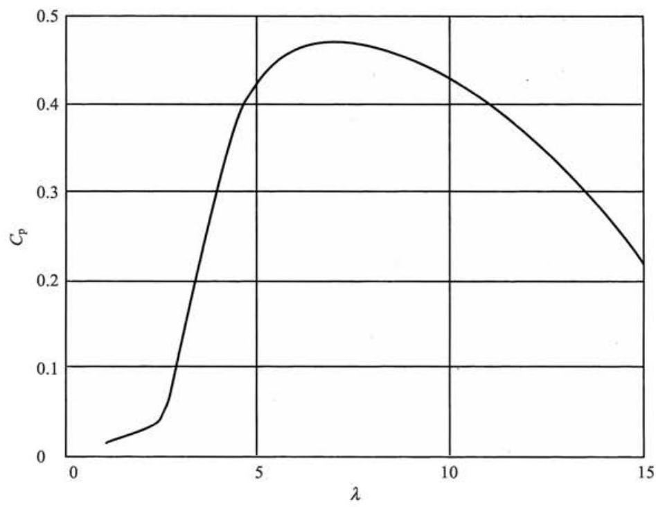

图 3.15 风能利用系数一叶尖速度比特性曲线

最大风能利用系数发生在轴向诱导因子 $a$ (它随半径的变化而变化) 最接近贝兹极限值的 $1/3$ 处。当叶尖速比较低时,轴向诱导因子比 $1/3$ 小得多,翼型攻角将大到导致失速状态的发生。对于大多数风力机来说, 失速更有可能发生在其叶根处，由于实际条件的约束，叶片的安装桨距角 $\beta$ 在该区域内不够大。如图 3.15 所示，当叶尖速比较低时，叶片失速是导致功率大量损耗的原因。当叶尖速比较高时, 攻角很大, 阻力开始占主导地位。叶尖速比在较高或较低时, 阻力都很大, 并且 $a$ 也不是最适宜的,所以风能利用系数很低。很明显,如果风力机能在所有风速范围内以获得最大风能利用系数的最佳叶尖速比来运行, 这将是最好的。

## 3.6 气体分离的动量定理

### 3.6.1 自由流/混合尾流

对于重载风力机，当 $a$ 值很大时，动量定理预测尾流中的气流将反向。这种情况不可能在实际中发生, 而发生的是尾流变成了湍流, 这样, 尾流外的气体通过混合过程引入尾流, 可使经过风轮后慢速移动的气体重新获得能量。

对于运行叶尖速比渐增的风力机，气流能穿过圆盘的流量逐渐减少。最终，当叶尖速比 $\lambda$ 足够高以至于等于 1 时,圆盘将完全成为实体盘。

由于黏度的存在，通过实体圆盘的气流在圆盘边缘处发生分离。当圆盘前上方的气流沿径向扩展并达到边缘黏性时, 边界层已经吸收了大部分动能。由于边界层围绕圆盘边缘流动, 它的加速将导致静压降低很多。围绕圆盘边缘流动需要非常高的速度, 没有足够的静压来提供动能, 因此, 气流从圆盘分离后, 沿气流方向继续向前流动。在圆盘的正后方有缓慢移动 (几乎停滞) 的空气, 这些空气处于圆盘边缘分离的气流低静压区。在圆盘前的中心位置, 气流处于静止状态, 由于动能转化成压能，所以静压能大幅度增加。在圆盘前表面的其他地方，气流沿径向以一定的速度移动，在边界层之外，接近圆盘边缘处速度不断增加。通常，圆盘前方的静压比圆盘后面的要高，所以圆盘承受了压差阻力。

以高叶尖速比旋转的转轮发生了同样的过程。没有经过风轮圆盘的气流沿径向向外移动，并在圆盘边缘分离，促成了圆盘后面低静压的形成；当叶尖速比上升、 轴向诱导因子增加时，由气流分离引起的静压降会增大。没有经过风轮的气体将形成低压区,并且移动缓慢。没有足够的动能来提供必需的静压的升高,以使其在尾流远端达到大气压力。只有通过从湍流、尾流混合过程中获得能量的气体才能达到大气压。在自由流气体和尾流气体之间的剪切层就是在圆盘前面形成的边界层。该剪切层是不稳定的, 而后破解为湍流能使尾流气体混合且能量增加。

### 3.6.2 气流分离引起的风轮推力的修正

由自由流在圆盘边缘处分离在其下游产生的低静压, 以及在上游滞止点产生的高静压在圆盘上引起的巨大推力，比动量定理所预测的大很多。在图 3.16 中可以看到 Glauert(1926)公布的关于整个风轮的实验结果。作为比较, Glauert 还给出了从动量定理导出的推力系数的简单表达式 ${C}_{\mathrm{T}} = {4a}\left( {1 - a}\right)$ 。

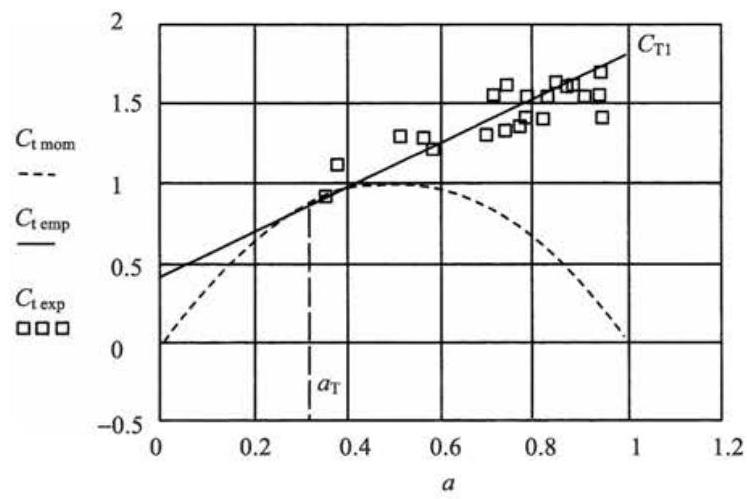

图 3.16 ${C}_{\mathrm{T}}$ 的理论值和实测值比较

对于一个简单的圆平板, 由 Hoerner (1965) 给出的推力 (或拉力) 系数为 1.17, 但是如图 3.16 所示,旋转圆盘上的推力则更高。预计当 $a = 1$ 时,风轮与圆板有相同的推力系数。圆板和风轮的主要不同在于后者是旋转的, 而且与 Hoerner 的描述一样, 这将会导致能量在风轮圆盘上游表面较厚的旋转边界层中耗尽, 进而使风轮圆盘下游的压力变得更低。

从上述讨论中可以得出, 对于高轴向诱导因子值, 通过圆盘的大部分压降与叶片环量是无关的, 在圆板情况下是没有环量出现的。与动量定理给出的结果一样, 环量将引起一个很小的压降，因为它是由气流的非常低的轴向速度决定的，该气流实际上通过了圆盘。

### 3.6.3 推力系数的经验确定

尽管 Glauert 提出一条抛物线，并为作用于重载风力机(运行在高轴向诱导因子值下的风轮)的推力问题提供了解决方案，但仍然可能存在一条合适的直线通过实验点。

大多数研究者认为，作用于风轮圆盘上的整个推力会引起轴向动量的变化。 所以, 为了使这条经验抛物线有用, 必须假定它不仅适用于整个风轮, 而且适用于每个单独的流管。令 ${C}_{\mathrm{T}1}$ 为 ${C}_{\mathrm{T}}$ 在 $a = 1$ 处的经验值,那么该直线必然是动量定理抛物线在转折点处的切线, 故该直线方程为

$$
{C}_{\mathrm{T}} = {C}_{\mathrm{T}1} - 4\left( {\sqrt{{C}_{\mathrm{T}1}} - 1}\right) \left( {1 - a}\right) \tag{3.63}
$$

在转折点处的 ${a}_{\mathrm{T}}$ 值为

$$
{a}_{\mathrm{T}} = 1 + \frac{1}{2}\sqrt{{C}_{\mathrm{T}1}}
$$

通过观察图 ${3.16},{C}_{\mathrm{T}1}$ 必定位于 ${1.6} \sim  2$ 。对于图 3.16 中的实验数据， ${C}_{\mathrm{T}1} =$ 1.816 似乎是最合适的经验值,而 Wilson 和 Lissaman (1974) 偏爱较低值 ${C}_{\mathrm{T}1} =$ 1.6。当 $a$ 值很大时，Glauert 考虑到风轮刹车状态下桨叶的攻角为负的情况，用抛物线去拟合实验数据，得到了一个更高的 ${C}_{\mathrm{{Ti}}}$ 值。

在重载条件下, 通过风力涡旋的流场不易被模拟, 所以经验分析的结果可以认为是唯一最接近的值, 而且比动量定理的预测值要好。对于大部分的实际设计, 轴向诱导因子的值很少超过 0.6 。设计良好的叶片, 其运行范围的大部分轴向诱导因子的值都在 0.33 附近。

因 $a$ 值比 ${a}_{\mathrm{T}}$ 值大，用式 (3.63) 代替式 (3.12) 中的动量定理推力是常有的事， 在这种情况下，式(3.59)被式(3.64)代替。

$$
{\left( 1 - a\right) }^{2}\frac{{\sigma }_{\mathrm{r}}}{{\sin }^{2}\phi }{C}_{\mathrm{x}} + 4\left( {\sqrt{{C}_{\mathrm{T}1}} - 1}\right) \left( {1 - a}\right)  - {C}_{\mathrm{T}1} = 0 \tag{3.64}
$$

式中, 尾流旋转引起的压降很小, 可以忽略不计。但是额外压降是由边缘气流的分离引起的，因此，这种做法就是有问题的，也许更应该保留式(3.58)。

## 3.7 叶片几何特性

### 3.7.1 引 言

多数风力机的设计目的是尽可能地从风中吸收更多的能量，并且为了达到这个目标，风力机的各个部件都要进行优化。叶片最优设计受到风力机的运行模式， 即恒速或变速的影响，在理想情况下，也会受到安装位置风能分布的影响。实际上,工程中采用的是折中的方法,但是我们仍有必要知道什么是最优设计。

最优叶片设计意味着功率输出的最大化, 所以求解出合适的叶素/动量公式 (3.59) 和式 (3.60) 的解是必需的。

### 3.7.2 变速运行时的优化设计

不管风速的大小，变速运行的风力机可以维持获得最大风能利用系数的叶尖速比为恒值。为了得到最大可能的风能利用系数，需要一个合适的叶片几何特性， 这种条件现在就可以导出。

对选取的叶尖速比 $\lambda$ ,每一叶片位置产生的转矩是最大的。

$$
\frac{\mathrm{d}}{\mathrm{d}{a}^{\prime }}{8\pi \lambda }{\mu }^{2}{a}^{\prime }\left( {1 - a}\right)  = 0
$$

得出

$$
\frac{\mathrm{d}a}{\mathrm{\;d}{a}^{\prime }} = \frac{1 - a}{{a}^{\prime }} \tag{3.65}
$$

从式(3.56)和式(3.57)可以得到气流诱导因子间的关系。式(3.56)和式 (3.57)相比，则

$$
\frac{\frac{{C}_{1}}{{C}_{d}}\tan \phi  - 1}{\frac{{C}_{1}}{{C}_{d}} + \tan \phi } = \frac{{\lambda \mu }{a}^{\prime }\left( {1 - a}\right) }{a\left( {1 - a}\right)  + {\left( {a}^{\prime }\lambda \mu \right) }^{2}} \tag{3.66}
$$

气流角 $\phi$ 由下式给出:

$$
\tan \phi  = \frac{1 - a}{{\lambda \mu }\left( {1 + {a}^{\prime }}\right) } \tag{3.67}
$$

将式(3.67)代入式(3.66)有

$$
\frac{\frac{{C}_{1}}{{C}_{\mathrm{d}}}\frac{1 - a}{{\lambda \mu }\left( {1 + {a}^{\prime }}\right) } - 1}{\frac{{C}_{1}}{{C}_{\mathrm{d}}} + \frac{1 - a}{{\lambda \mu }\left( {1 + {a}^{\prime }}\right) }} = \frac{{\lambda \mu }{a}^{\prime }\left( {1 - a}\right) }{a\left( {1 - a}\right)  + {\left( {a}^{\prime }\lambda \mu \right) }^{2}}
$$

化简为

$$
\left\lbrack  {\frac{{C}_{1}}{{C}_{\mathrm{d}}}\left( {1 - a}\right)  - {\lambda \mu }\left( {1 + {a}^{\prime }}\right) }\right\rbrack  \left\lbrack  {a\left( {1 - a}\right)  + {\left( {a}^{\prime }\lambda \mu \right) }^{2}}\right\rbrack
$$

$$
= \left\lbrack  {{\lambda \mu }\left( {1 + {a}^{\prime }}\right) \frac{{C}_{1}}{{C}_{\mathrm{d}}} + \left( {1 - a}\right) }\right\rbrack  {\lambda \mu }{a}^{\prime }\left( {1 - a}\right) \tag{3.68}
$$

如果忽略阻力的话，该过程将很容易被理解，式 (3.68) 简化为

$$
a\left( {1 - a}\right)  - {\lambda }^{2}{\mu }^{2}{a}^{\prime } = 0 \tag{3.69}
$$

将式 (3.69) 对 ${a}^{\prime }$ 进行微分得

$$
\left( {1 - {2a}}\right) \frac{\mathrm{d}a}{\mathrm{\;d}{a}^{\prime }} - {\lambda }^{2}{\mu }^{2} = 0 \tag{3.70}
$$

将式(3.65)代入式(3.70)有

$$
\left( {1 - {2a}}\right) \left( {1 - a}\right)  - {\lambda }^{2}{\mu }^{2}{a}^{\prime } = 0 \tag{3.71}
$$

联立式(3.69)和式(3.71)，得出优化运行时的气流诱导因子为

$$
a = \frac{1}{3},\frac{{a}^{\prime } = a\left( {1 - a}\right) }{{\lambda }^{2}{\mu }^{2}} \tag{3.72}
$$

这与动量定理的预计结果十分相符, 因为其中没有包括像气动阻力这样的损失,并且假设有无数个叶片。通过风轮盘的每个流体质点与叶片相互作用的结果是在圆盘上形成了均匀的轴向速度。

为了获得最优状态, 叶片必须特殊设计, 并且可以由式 (3.56) 和式 (3.57) 来确定。由于式 (3.54) 简单且忽略了阻力的影响，所以选择该式，这样得到了优化运行产生的转矩为

$$
{\delta Q} = {4\pi \rho }{U}_{\infty }{\Omega r}{a}^{\prime }\left( {1 - a}\right) {r}^{2}{\delta r} = {4\pi \rho }\frac{{U}_{\infty }^{3}}{\Omega }a{\left( 1 - a\right) }^{2}{r\delta r}
$$

因此, 在切向方向上单位展长的升力分量为

$$
L\sin \phi  = {4\pi \rho }\frac{{U}_{\infty }^{3}}{\Omega }a{\left( 1 - a\right) }^{2}
$$

根据 Kutta-Joukowski 理论, 每单位展长的升力为

$$
L = {\rho W\Gamma }
$$

式中, $\Gamma$ 为单个叶片环量之和; $W$ 是与 $T$ 和 $L$ 都垂直的组件元件。因此,

$$
{\rho W\Gamma }\sin \phi  = {\rho \Gamma }{U}_{\infty }\left( {1 - a}\right)  = {4\pi \rho }\frac{{U}_{\infty }^{3}}{\Omega }a{\left( 1 - a\right) }^{2} \tag{3.73}
$$

所以

$$
\Gamma  = {4\pi }\frac{{U}_{\infty }^{2}}{\Omega }a\left( {1 - a}\right) \tag{3.74}
$$

因此,沿着叶片的展长环量是相同的,这就是优化运行的条件。

为了确定叶片的几何特性, 更确切地说, 就是弦长沿着叶片怎么变化以及什么样的桨距角 $\beta$ 分布是必要的,我们必须转回到式 (3.57)。

$$
\frac{{W}^{2}}{{U}_{\infty }^{2}}B\frac{c}{R}{C}_{1}\sin \phi  = {8\pi \lambda }{\mu }^{2}{a}^{\prime }\left( {1 - a}\right)
$$

代入 $\sin \phi$ 有

$$
\frac{W}{{U}_{\infty }}B\frac{c}{R}{C}_{1}\left( {1 - a}\right)  = {8\pi \lambda }{\mu }^{2}{a}^{\prime }\left( {1 - a}\right) \tag{3.75}
$$

从式 (3.75) 中可以得出

$$
\frac{B}{2\pi }\frac{c}{R} = \frac{{4\lambda }{\mu }^{2}{a}^{\prime }}{\frac{W}{{U}_{\infty }}{C}_{1}}
$$

等号右边唯一不知道的是升力系数 ${C}_{1}$ 的值,因此,通常将其移到公式的左边与弦长实度一起作为叶片几何参数。升力系数可以选取对应于最大的升阻比 $\left( {C}_{1}\right. / \; {C}_{\mathrm{d}}$ )的值,因为这样做可以使阻力损失减到最小。虽然在求解最优气流诱导因子和叶片几何特性时忽略了阻力, 但是在计算转矩和功率时却不能忽略阻力的影响。 叶片几何特性也取决于叶尖速比 $\lambda$ ,所以它在叶片几何特性的参数中给出。因此,

$$
{\sigma }_{r}\lambda {C}_{1} = \frac{B}{2\pi }\frac{c}{R}\lambda {C}_{1} = \frac{4{\lambda }^{2}{\mu }^{2}{a}^{\prime }}{\sqrt{{\left( 1 - a\right) }^{2} + {\left\lbrack  \lambda \mu \left( 1 + {a}^{\prime }\right) \right\rbrack  }^{2}}} \tag{3.76}
$$

将最佳条件的式 (3.72) 代入得

$$
{\sigma }_{r}\lambda {C}_{1} = \frac{\frac{8}{9}}{\sqrt{{\left( 1 - \frac{1}{3}\right) }^{2} + {\lambda }^{2}{\mu }^{2}{\left( 1 + \frac{2}{9{\lambda }^{2}{\mu }^{2}}\right) }^{2}}} \tag{3.77}
$$

式中的参数 ${\lambda \mu }$ 称为局部速度比,其值等于 $\mu  = 1$ 时的叶尖速比的值。

对于特定的设计,如果 ${C}_{1}$ 保持为常数,于是就有图 3.17 所示的叶尖速比不断增加的叶片平面形状。高的叶尖速比设计需要细长的叶片(即高的展弦比)，低的叶尖速比设计需要短而宽的叶片。设计叶尖速比就是在此点上可以获得最佳性能的值。即便是在无阻力的理想情况，运行在其他叶尖速比情况下的风轮的性能都低于最佳性能。

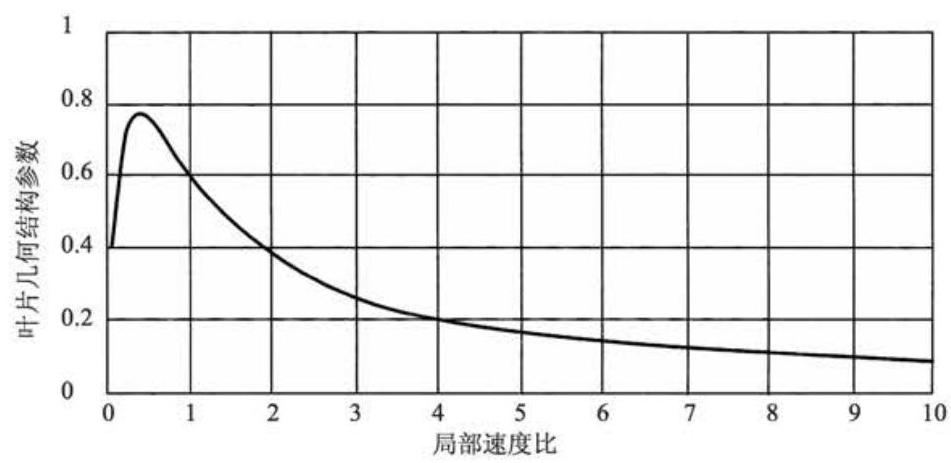

图 3.17 叶片几何结构随着局部速度比的变化曲线

在偏离最佳状态运行时,轴向诱导因子并不均匀地等于 $1/3$ ,实际上,它根本就不是均匀的。

每片叶片位置的当地入流角 $\phi$ 也是沿着叶片展向变化的,参见式 (3.78) 和图 3.18。

$$
\tan \phi  = \frac{1 - a}{{\lambda \mu }\left( {1 + {a}^{\prime }}\right) } \tag{3.78}
$$

优化运行时有

$$
\tan \phi  = \frac{1 - \frac{1}{3}}{{\lambda \mu }\left( {1 + \frac{2}{9{\lambda }^{2}{\mu }^{2}}}\right) } \tag{3.79}
$$

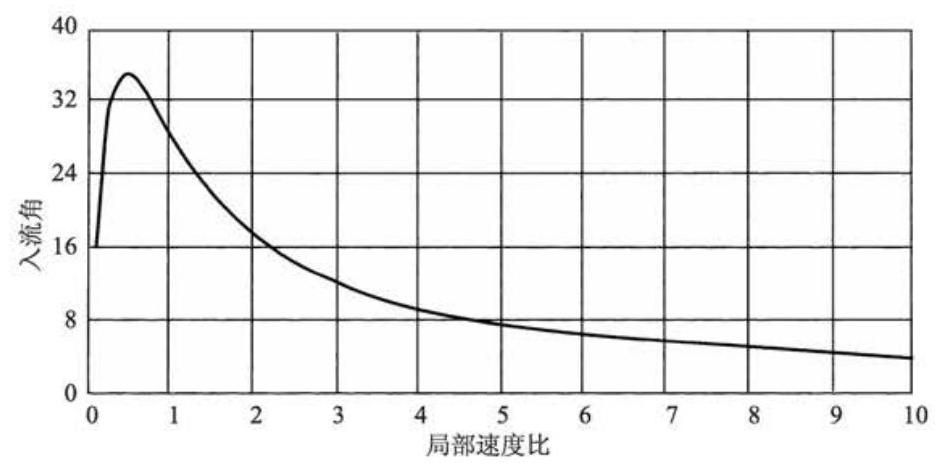

图 3.18 入流角随局部速度比的变化曲线

在叶片根部附近入流角很大, 在该区域内可能会导致叶片失速。如果升力系数保持为常数，这样阻力在各处均为是最小值，于是攻角 $a$ 也需要在某一适当的位置各处相同。对于指定的攻角变化,叶片的桨距角 $\beta  = \Phi  - a$ 也必须相应地发生变化。

例如, 假设叶片翼型为 NACA 4412, 这种叶片是手工制风力机中很普遍的, 因为它剖面的底部(高压处)几乎是平直的，容易加工。当雷诺数大约为 $5 \times  {10}^{5}$ 时， 最大升阻比发生在升力系数大约为 0.7 和攻角大约为 ${3}^{ \circ  }$ 时。假设沿着每个叶片的 ${C}_{1}$ 和 $a$ 都保持为常数，并且有三个叶片在叶尖速比为 6 时运行，此时叶片的平面形状和桨距角 (扭转) 变化分别如图 3.19(a) 和 (b) 所示。

### 3.7.3 实际叶片设计

图 3.19 的叶片设计是高效率的, 但是由于制造复杂, 所以费用会很高。故建议叶片的平面形状是在其外面部分接近于图 3.19 (a) 的梯形。如图 3.20 所示, 通过展长 70% 点和 90% 点画一条直线，不仅可以简化叶片的平面形状，而且移去了叶根附近的许多材料。

叶片平面形状的描述为

$$
{c}_{\mathrm{u}} = \frac{8}{9 \times  {0.8\lambda }}\left( {2 - \frac{\lambda \mu }{0.8\lambda }}\right) \frac{2\pi }{{C}_{1}{\lambda B}} \tag{3.80}
$$

在式(3.80)中，0.8 表示 80% 的展长点，是目标点的中间值。

联立式 (3.80) 和式 (3.77) 可以得到最佳运行状态所需的沿翼展方向的 ${C}_{1}$ 。

$$
{C}_{1} = \frac{8}{9}\frac{1}{\frac{B{C}_{\mathrm{u}}\lambda }{2\pi }\sqrt{{\left( 1 - \frac{1}{3}\right) }^{2} + {\lambda }^{2}{\mu }^{2}{\left( 1 + \frac{2}{9{\lambda }^{2}{\mu }^{2}}\right) }^{2}}}
$$

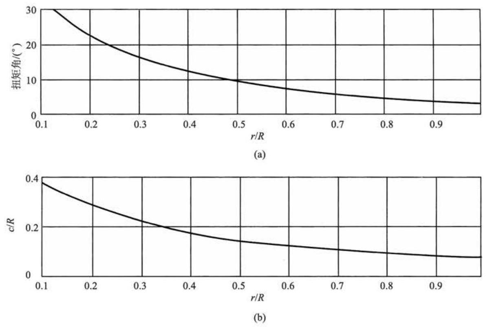

图 3.19 在风轮有三个叶片且 $\lambda  = 6$ 时的最佳叶片设计

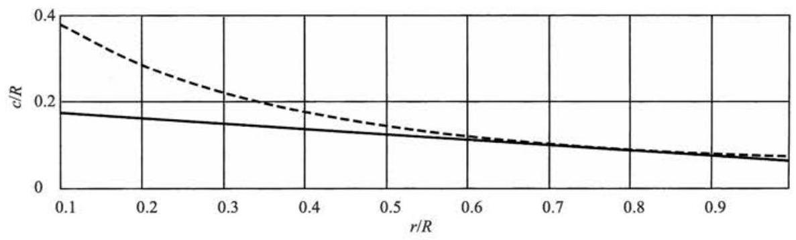

图 3.20 最佳运行的统一锥度叶片设计

在靠近叶根时, 升力系数接近于失速状态且阻力很大, 但是由于该区域的反力矩很小, 所以付出的代价也很小 (图 3.21)。

假设没有发生失速,并且对于弯度为 $4\%$ (近似零升力以及大概 $- {4}^{ \circ  }$ 的攻角) 的叶片，它的升力系数近似为

$$
{C}_{1} = {0.1}\left( {\alpha  + {4}^{ \circ  }}\right)
$$

其中, $\alpha$ 的单位是度,于是

$$
\alpha  = \frac{{C}_{1}}{0.1} - {4}^{ \circ  }
$$

现在可以由式 (3.79) 和式 (3.49) 确定出叶片扭角分布。

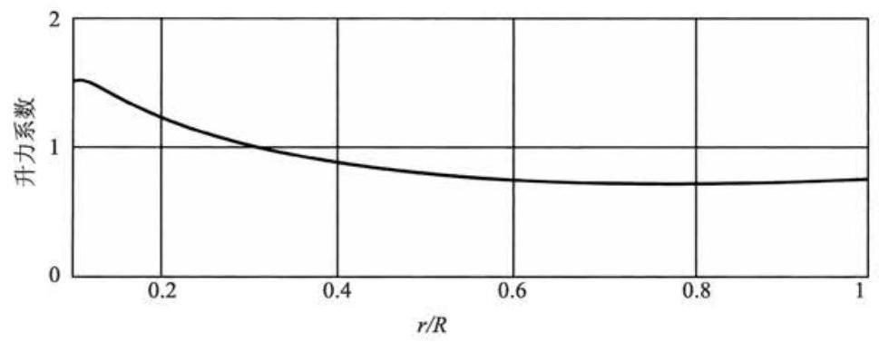

图 3.21 线性尖削叶片所需的升力系数沿翼展方向的分布

在接近根部的地方叶片扭角仍很大,但是比 ${C}_{1}$ 为常数的叶片的扭角低 (图 3.22)。

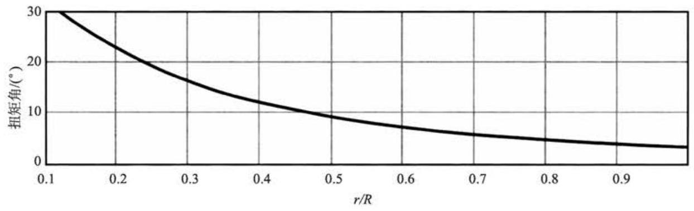

图 3.22 线性锥形叶片的扭矩角沿翼展方向的分布

### 3.7.4 阻力对最佳叶片设计的影响

如果在求解气流诱导因子时考虑阻力的影响, 依照 Wilson 和 Lissaman (1974)的观点 (见 3.5.3 节), 我们必须根据式 (3.52), 依照与无阻力情况下相同的步骤进行求解。

在本章中, 阻力的影响取决于升阻比的大小, 而升阻比又取决于翼型剖面, 但主要还是取决于雷诺数和叶片表面粗糙度。升阻比大的时候约为 150 , 小的时候约为 40 。

不幸的是，考虑了阻力后，代数分析变得复杂了，必须求解多项式方程才能得出 $a$ 和 ${a}^{\prime }$ 的值。详细的分析方法留给读者去思考。

最佳运行轴向流诱导因子在考虑阻力的情况下，整个风轮盘上不是均匀的，这和阻力假设的情况下是一样的。然而, 倘若气流绕叶片是附体的, 即使当升阻比很小时, 轴向分布偏离均匀分布的偏差也不是很大。

在阻力为零和升阻比为 40 时, 轴向气流诱导因子和切向气流诱导因子沿径向的变化如图 3.23 所示。

有阻力情况下的切向气流诱导因子比没阻力情况下的要低, 这是因为叶片阻碍了旋转方向上气体的流动，和作用于转轴转矩上的旋转反作用力相反。

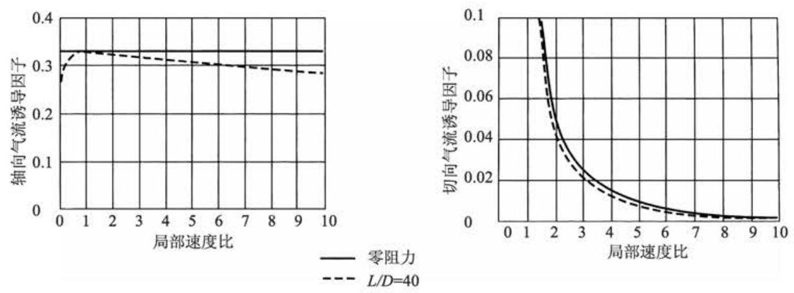

图 3.23 在有阻力和无阻力的情况下, 气流诱导因子沿径向的变化曲线

由转矩/角动量式 (3.58) 可知，叶片几何参数变为

$$
\frac{B}{2\pi }\frac{c}{R}\lambda {C}_{1} = \frac{4{\lambda }^{2}{\mu }^{2}{a}^{\prime }\left( {1 - a}\right) }{\frac{W}{{U}_{\infty }}\left\lbrack  {\left( {1 - a}\right)  - \frac{{C}_{1}}{{C}_{\mathrm{d}}}{\lambda \mu }\left( {1 + {a}^{\prime }}\right) }\right\rbrack  } \tag{3.81}
$$

图 3.24 比较了在阻力为零与升阻比为 40 时的叶片几何参数的分布。很明显，阻力对叶片最佳设计的影响很小。

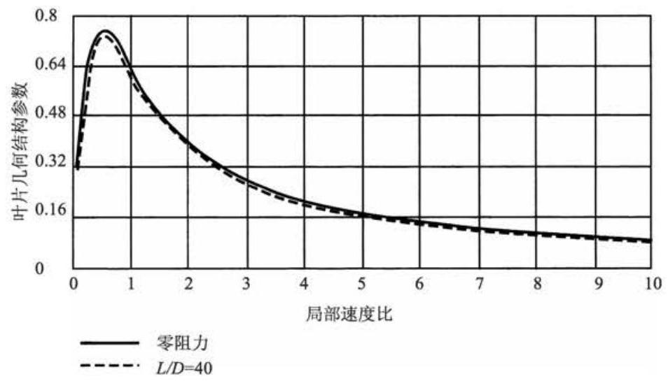

图 3.24 叶片几何结构参数在有阻力和无阻力的情况下沿翼展方向的变化曲线

对于入流角的分布来说显然也有同样的结果，阻力对入流角的分布影响很小， 如图 3.25 所示。就最佳运行的叶片设计而言，阻力是可以忽略的，这大大地简化了计算过程。

在一定设计叶尖速比的范围和几个升阻比情况下, 用式 (3.62) 计算得出的最大风能系数表示在图 3.26 中。流动诱导因子和叶片设计是在无阻力情况下，由式 (3.59)、式(3.60)确定的，而转矩是用考虑了阻力的式 (3.62) 来计算的。阻力造成的损失很重要, 随着设计叶尖速比的增加而增加。在后面还将说明, 当叶尖损失也被考虑在内时, 叶尖损失在低叶尖速比时甚至会更大。

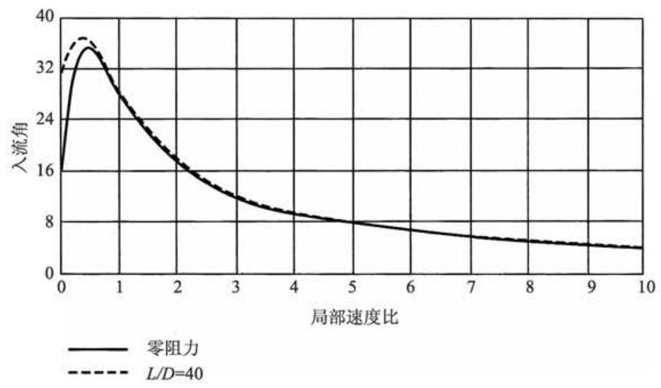

图 3.25 局部速度比在有阻力和无阻力的情况下入流角的变化曲线

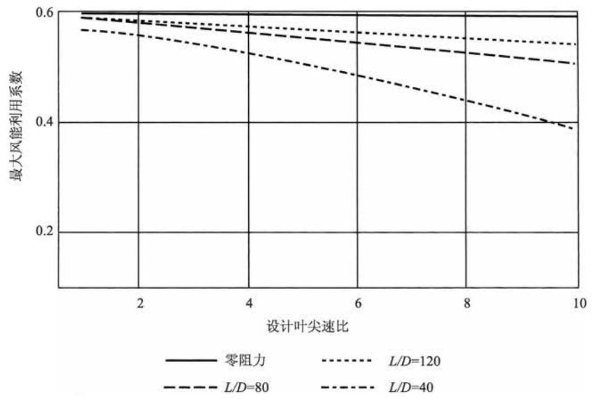

图 3.26 对于不同的升阻比, 最大风能系数随着设计叶尖速比的变化曲线

### 3.7.5 恒速运行时的最佳叶片设计

如果风力机的旋转速度保持不变 (这对于并网型风力发电机组来说是普遍的现象), 那么其叶尖速度比是连续变化的, 这样一来, 对固定叶尖速比的叶片的最佳设计将不再适用。

对于以恒速旋转的叶片的最优设计是没有简单技术可用的。在有特定风速分布的地点获得最大捕获能量可以采用非线性设计方法。作为选择，要么选择设计叶尖速比使其与当地能量最大的风速相适应，要么更实际一点，调整整个叶片的桨距角使其捕获的能量最大。

## 3.8 叶片数的影响

### 3.8.1 引 言

在之前的章节所描述的分析中都假定风轮叶片有无穷多个，这是因为通过风轮盘的每个流体质点都与叶片相互作用，也就是说，所有的流体质点都有同样的动量损失。在叶片数量少时,一些流体质点将与叶片相互作用,但是大多数流体质点从叶片之间通过, 而且很明显的是, 质点的动量损失取决于质点通过风轮盘时其与叶片的接近程度。围绕圆盘的轴向诱导速度时刻变化, 其平均值决定了气流总轴向动量，叶片局部轴向诱导速度的较高值决定了作用于叶片上的力。

### 3.8.2 叶尖损失

如果叶片位置处轴向诱导因子 $a$ 很大，根据式(3.48)可知，入流角 $\phi$ 将很小， 即升力将几乎与风轮平面垂直。升力在切向上的分量将变小，其对转矩的贡献也将变小。转矩的减小就意味着功率的减少，这种减少被称为叶尖损失，因为这种影响只发生在叶片的最外端。

为了计算叶尖损失，需要知道轴向诱导因子随方位角变化的方式，但是这超出了叶素/动量定理的范围。

风力机叶片的叶尖拖出的尾涡与机翼翼尖的尾涡是一样的。如图 3.27 所示， 因为叶尖做圆周运动,故留下了一条螺旋状的尾涡 (图 3.27),此尾涡在下游与尾流速度产生对流。对于两叶片的风轮, 与机翼不同, 图 3.27 所示的两个叶片的附着环量符号相反，所以，它们合成一条强度为叶片环量与叶片数量乘积的沿着旋转轴的直线涡。

对于从叶尖脱落的单个旋涡来说, 沿着叶片展向的环量分布是均匀的, 而且就像图 3.27 所示的那样, 环量分布是最佳运行的必要条件。但均匀环量分布要求通过圆盘的轴向诱导因子也是均匀分布的, 就像上面所讨论的那样, 对于离散叶片和均匀的圆盘不同，其流动因子不是均匀分布的。

在图 3.27 所示的情况下，在非常接近叶片翼梢处，叶尖涡引起的气流因子 $a$ 非常大地、局部地通过叶片的净流量是在逆流方向。 $a$ 的平均值在各个方位径向是均匀的,这就意味着如果在叶片附近的 $a$ 值大,那么在其他地方的 $a$ 值就小。对于运行在叶尖速比为 6 的三叶片风轮,在不同径向位置上 $a$ 的方位变化如图 3.28 所示。图 3.28 的计算结果是在假定每个叶片的离散涡流螺距相等, 并且旋转尾流半径相同情况下得到的。

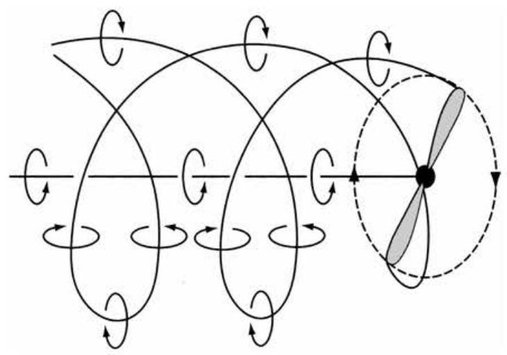

图 3.27 水平轴风力发电机组尾流的螺旋状叶尖涡迹

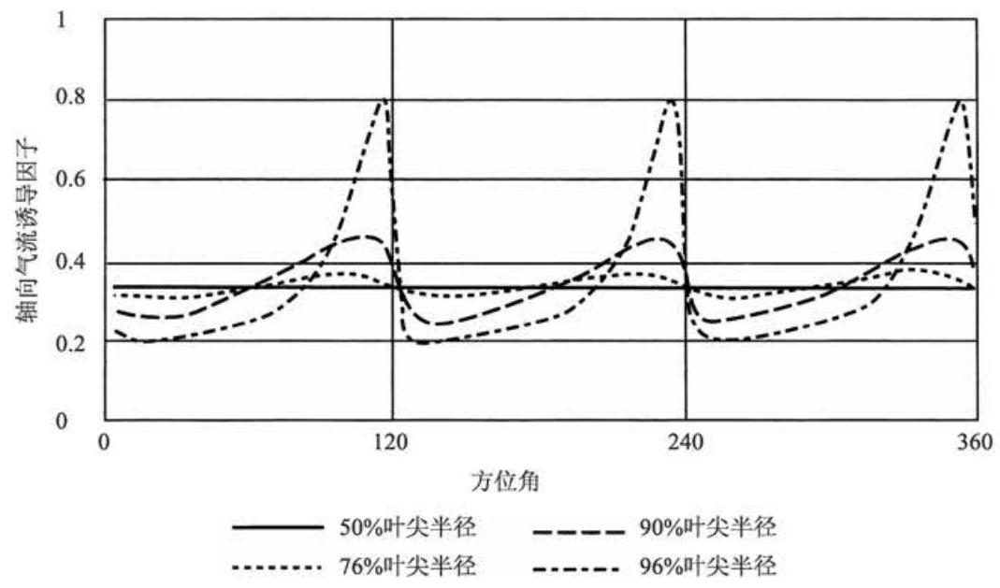

图 3.28 叶尖速比为 6，具有相同环流量的三叶片 $\left( {{120}^{ \circ  }\text{ 、 }{240}^{ \circ  }\text{ 和 }{360}^{ \circ  }}\right)$ 风力机在不同径向位置时 $a$ 的方位变化图

$a$ 的平均值与其在叶片位置处的值的比如图 3.29 所示,只有在接近翼梢的地方比值才开始下降到零。这个比值被称为 “叶尖损失因子”。

从式 (3.24) 可知, 在没有叶尖损失和阻力的情况下, 每个叶素对总风能利用系数的贡献为

$$
\delta {C}_{P} = 8{\lambda }^{2}{\mu }^{3}{a}^{\prime }\left( {1 - a}\right) {\delta \mu } \tag{3.82}
$$

将式 (3.29) 中的 ${a}^{\prime }$ 值代入式 (3.82) 得

$$
\delta {C}_{P} = {8\mu a}{\left( 1 - a\right) }^{2}{\delta \mu } \tag{3.83}
$$

然而,由库塔-儒科夫斯基定理可知,叶片上的环流 $\Gamma$ 是均匀的,每单位尾长提供的力矩为

$$
\frac{\mathrm{d}Q}{\mathrm{\;d}r} = \rho \left( {W \times  \Gamma }\right) \sin {\phi }_{\mathrm{r}}r
$$

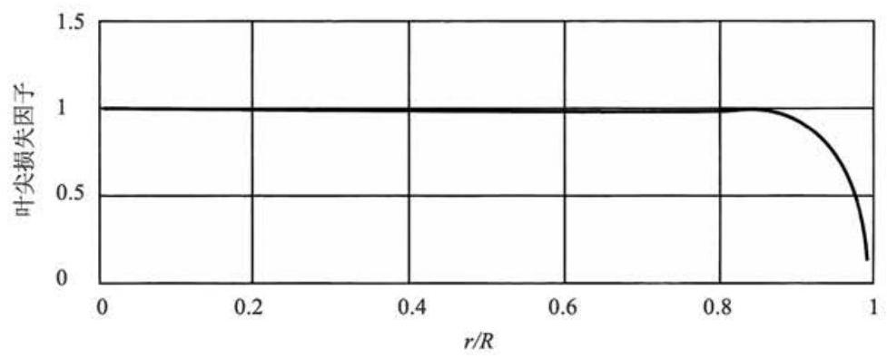

图 3.29 具有相同环流量叶片的叶尖损失因子顺翼展方向的变化曲线

其中， ${\phi }_{\mathrm{r}}$ 角由叶片当地气流速度来决定。

式 (3.74) 给出了三个叶片的总环量，在考虑叶尖损失的情况下，来自叶素的风能利用系数增量为

$$
\delta {C}_{P} = {8\mu a}\left( {1 - a}\right) \left( {1 - {a}_{\mathrm{r}}}\right) {\delta \mu } \tag{3.84}
$$

其中 $a = 1/3$ 是平均气流诱导因子; ${a}_{\mathrm{r}}$ 是叶片的当地值。在式 (3.84) 中, $\left( {1 - a}\right)$ 的部分指的是通过环状被叶素扫出的质量流量,而 $\left( {1 - {a}_{\mathrm{r}}}\right)$ 指的是被气流扫过后的动量损失。

由式 (3.82) 和式 (3.83) 得出的结果绘于图 3.30 中, 很明显地说明了叶尖损失。式 (3.78) 假定 $a = 1/3$ 在整个圆盘上都是均匀分布的,式 (3.81) 认为 $a$ 并不是均匀分布的。 $a$ 在每个径向位置上各个方位的平均值都是 $1/3$ ,但方位变化引起了叶尖损失。由于 $a$ 的变化,叶片不能有效地从气流中吸取能量。设想圆盘是由无数个基圆组成, 每个基圆有其独立的流管, 而且并不是所有的基圆都运行在贝兹极限。既然风损失功率正好与叶片吸收的能量相等, 也就没有与叶尖损失相关的有效阻力存在。

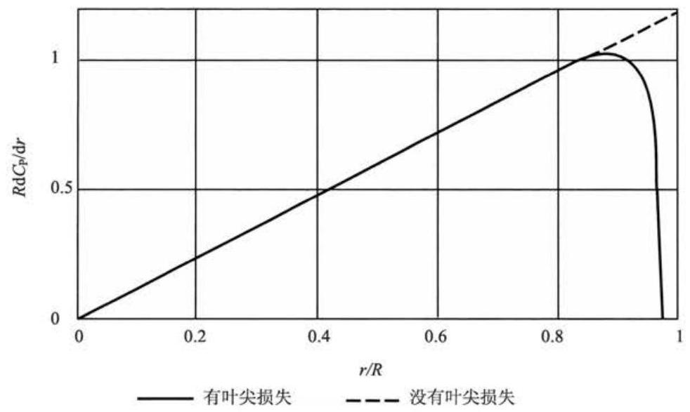

图 3.30 叶尖速比为 6 均匀分布的环量的三叶片风力发电机组

考虑叶尖损失时, 叶片输出功率沿着顺翼展方向的变化曲线

在环量分布均匀的情况下, $a$ 的方位平均值在径向上也是相同的,但这意味着尾流边界处轴向速度的不连续以及随之而来的压力的不连续。在理想致动盘的情况下，这样的不连续是可以接受的，但实际上，对于有限数目的叶片，这种情况是不会发生的。如果假定尾流外面的 $a$ 为零，那么在接近叶尖时， $a$ 必须以一定规则降为零, 从而使附着环量也降为零。叶尖环量变化的方式取决于叶片叶尖设计, 更确切地说,是取决于弦长和螺距的变化, 所以说肯定会有某种设计能使叶尖损失最小。

如有环流沿叶片展向变化，则涡量从尾缘以连续的方式流入尾流。因此，每个叶片拖出一个螺旋涡, 从而形成图 3.31 所示的螺旋形涡面, 而不是图 3.27 所示的单个旋转涡流。螺旋层与尾流速度对流, 此时没有气流能通过旋转层, 因此, 可以认为，螺旋层是不能穿透的。螺旋涡面的强度等于附着涡环量沿叶片展长的变化率, 距离叶尖越近, 螺旋涡面的强度增加得越快。由于叶片的两表面存在着压力差, 在叶片处出现绕流, 即在叶片的迎风面, 空气流向叶尖, 而在背风面则流向叶根。从两个表面离开叶片尾缘的气流相互之间并不平行, 它们将在尾流区域内的径向上形成一个速度不连续的表面, 而轴向速度分量相等。该不连续的表面称为涡面。在机翼上也发生了相似的现象，在航空飞行器空气动力学课本上对此有更为详细的解释。

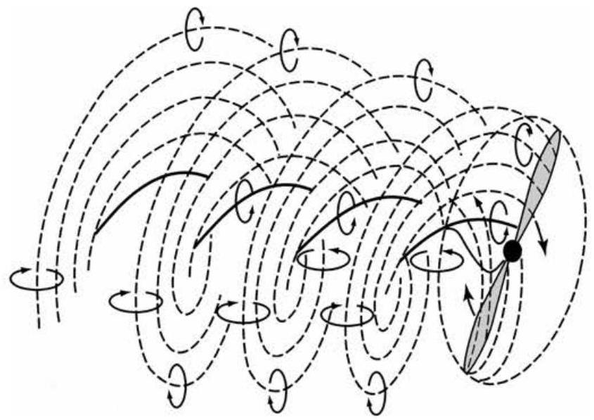

图 3.31 两叶片风轮的旋转涡流面

可以通过跟踪空气粒子的轨迹来更好地理解叶尖损失的机理。空气粒子接近旋转的风轮时，在其前面“感觉”到高的压力，从而使其慢了下来。作用于叶片迎风侧的高压有效地分布在整个圆盘的附近。即使是慢下来使粒子向外移动以维持其质量流量。当这些粒子到达风轮面时, 不管是否靠近叶片, 它们的轴向速度相应地将受到影响，如图 3.28 所示。如果粒子在靠近叶片处通过风轮平面，那么它还将会受到叶片压力场的强烈影响。

第一类空气粒子流近叶片，并在切向方向被加速后离开叶片尾缘，然后在后边缘拖出的涡面上方向下游运动，并急速向风轮量外侧运动。因此，这种粒子向外缘移动，在绕过涡面后被吹向下游，并且涡面以某一径向速度向内侧流动，这种径向速度在涡面上涡量为零的径向点上减小为零。之后，气体粒子继续以涡流面的径向速度和切向速度向下游剖面动。

第二类空气粒子在靠近下游的低压表面流过叶片，它与叶片运动相反方向上加速, 然后慢下来, 以与第一类空气粒子相同的轴向速度和切向速度离开叶片尾缘, 但是由于它处在涡流面的下游侧, 所以它还有一个向内的径向速度。第二种粒子(取决于它们的径向位置)将朝内移动直到其径向速度达到零为止。

第三类粒子在两片叶片之间流过, 它将以比前两种粒子更大的速度沿轴向运动, 而且并不受叶片压力场的强烈影响; 但是由于叶片的固体堵塞 (图 3.5), 它将直接进入螺旋轨迹。正如第一种空气粒子, 由于这种粒子的轴向速度比在其前方的涡面快，它会赶上涡面，受涡流面的影响，气体粒子将向外移动，绕过涡面边缘， 然后再向内流动。与第一类粒子不同的是，第三类粒子将仍然以比涡面更快的速度进行移动，并沿轴向远离该涡流面，进入到下游的另一个涡流面内，在下一个涡流面边缘重复这样的运动。该粒子将继续依次在每个涡流面附近追赶和跳跃着流向下游。

第三类粒子的轴向动量损失比第一类粒子和第二类粒子要小，因此，会受到所谓的叶尖损失的影响。距离它们所经过的圆盘边缘越近，该影响就会越大。

第四类空气粒子在叶片之间但是其径向位置更靠近旋转轴。在这个区域内粒子的轴向速度等于涡流面的速度。如果该粒子从两个叶片中点通过, 那么当它们向下游移动时仍然将保持在两个相应的涡流面的中点，并且没有任何的径向运动， 不会因气流变慢而引起通常的膨胀。

第四类空气粒子完全不受叶片数量的影响，其流动过程就像通过一个均匀的致动盘一样。

轴向诱导因子不仅随方位角变化，也有径向的变化。因此， $r$ 和 $\theta$ 的函数方位角的平均值为 $a\left( r\right)  = {a}_{\mathrm{b}}\left( r\right) f\left( r\right)$ ,其中 $f\left( r\right)$ 被称为叶尖损失系数。 $a\left( r\right)$ 在叶片内侧的值相同 (第四类空气粒子),该值在风轮圆盘边缘降到零。 ${a}_{\mathrm{b}}\left( r\right)$ 的值代表叶素局部产生的轴向诱导因子大小，也是涡流面与下游产生对流的速度的值。如果 ${a}_{\mathrm{b}}$ (r)能够在径向保持不变，涡流面将是径向平直的，如图 3.31 所示；否则，涡流面将是弯曲的。

在运用叶素动量定理时, 轴向动量的变化率取决于轴向诱导因子在方位角方向上的平均值这一观点是值得讨论的, 而叶片的作用力由在叶素局部产生的气流因子来决定，这一点是被第一类空气粒子和第二类空气粒子检验过的。

① 通过环面的质量流量 $= \rho {U}_{\infty }\left\lbrack  {1 - {a}_{\mathrm{b}}\left( r\right) f\left( r\right) }\right\rbrack  {2\pi r\delta r}$ 。

② 在方位角平均的总轴向速度变化值 $= 2{a}_{\mathrm{b}}\left( r\right) f\left( r\right) {U}_{\infty }$ 。

③ 轴向动量的变化率 $= {4\pi r\rho }{U}_{\infty }^{2}\left\lbrack  {1 - {a}_{\mathrm{b}}\left( r\right) f\left( r\right) }\right\rbrack  {a}_{\mathrm{b}}\left( r\right) f\left( r\right) {\delta r}$ 。

④ 叶素的作用力 $= \frac{1}{2}\rho {W}^{2}{Bc}{C}_{1}$ 和 $\frac{1}{2}\rho {W}^{2}{Bc}{C}_{d}$ 。

其中, $W\text{ 、 }{C}_{1}$ 和 ${C}_{\mathrm{d}}$ 是由 ${a}_{\mathrm{b}}\left( r\right)$ 决定的。

用各个方向角的切向气流诱导因子 $2{a}_{\mathrm{b}}^{\prime }\left( r\right) f\left( r\right)$ 平均值也可以计算尾流旋转引起的压力。

### 3.8.3 叶尖损失因子的 Prandtl 渐近法

对于运行在叶尖速比为 6 的均匀环量相同的叶片, 采用解析的方法不易获得任意叶尖速度的函数 $f\left( r\right)$ 。1929 年, Sidney Goldstein 就应用螺旋桨分析了叶尖损失问题，而且得到了用贝塞尔函数表示的解，但不管是这种解法还是上面所用的毕奥-萨伐尔解法，都不适合包含在叶素/动量定理中。1919 年，Ludwig Prandtl (贝兹在 1919 年作了报告) 提出了一种具有独创性的近似解法, 对于求解叶尖损失, 这种解法给出了相对比较简单的解析公式。

Prandtl 渐近法受到了一个事实的启发，即由于涡面不可穿透(上述的第一类和第三类空气粒子在涡流面外边缘附近移动但并没有穿过涡流面)，所以，可以用实体面来代替，倘若涡面以尾流区域限定的速度进行移动，将会对尾流没有影响。 该理论只适用于已形成的尾流。为了简化分析，Prandtl 用一连串以相同的中心尾流速度 ${U}_{\infty }\left( {1 - a}\right)$ 移动的圆盘来代替螺旋面，并以与涡流面之间的法向距离相同的距离来分开。从理论上来讲,以轴向速度为 ${U}_{\infty }\left( {1 - a}\right)$ 移动的圆盘将在圆盘外边缘处遭遇速度为 ${U}_{\infty }$ 无衰减的自由流。快速流动的自由流将在两个连续的圆盘之间波动。两个连续的圆盘之间的间隔越大, 自由流在径向上波动的幅度也越大。在半径 $r$ 处 (略小于尾流半径或风轮半径) 取一条平行于转轴的直线,沿该直线的平均轴向速度将大于 ${U}_{\infty }\left( {1 - a}\right)$ 而小于 ${U}_{\infty }$ 。令平均轴向速度为 ${U}_{\infty }\left\lbrack  {1 - {af}\left( r\right) }\right\rbrack$ (其中 $f\left( r\right)$ 是叶尖损失函数),则必有一个小于 1 且在尾流边界降到零的值。离尾流边缘一定距离处自由流将不能穿过, 叶片处的诱导速度与尾流中的诱导速度基本或完全相同,也就是 $f\left( r\right)  = 1$ 。

如图 3.32 所示，粒子的轨迹与上面所描述的第三类空气粒子的轨迹非常相似, 在实际情况下, 该粒子的运动轨迹可以认为是通过给定半径的风轮圆盘的平均轨迹: 在不同半径的条件下, 粒子速度随方位变化示于图 3.28 中, "Prandtl 粒子" 的速度等于其平均值量。图 3.32 描述了完全形成的尾流。

Prandtl 近似法相当好地确定了通过两叶片之间旋翼面的第三类空气粒子在下游的特性。

Prandtl 分析的数学推导 (Glauert, 1935a) 已经超出了本书的范围, 与 Goldstein 理论不同的是, 其结果可以用近似解的形式表示, 叶尖损失为

$$
f\left( r\right)  = \frac{2}{\pi }\arccos \left\lbrack  {\mathrm{e}}^{-\pi \left( \frac{{R}_{\mathrm{w}} - r}{\mathrm{\;d}}\right) }\right\rbrack \tag{3.85}
$$

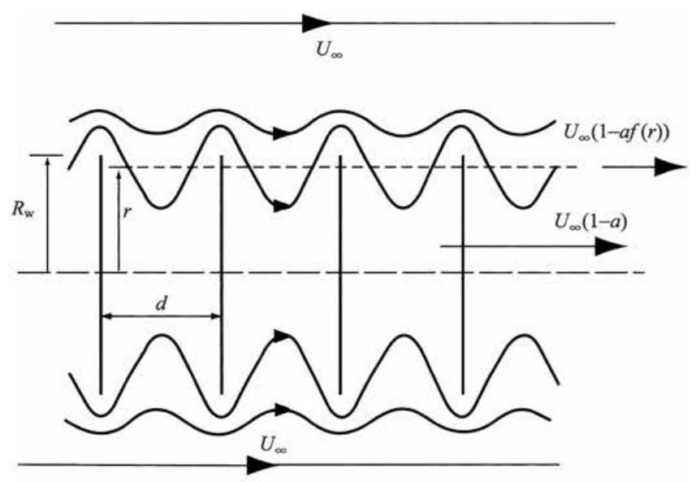

图 3.32 计算叶尖损失的 Prandtl 尾流圆盘模型

其中, $\left( {{R}_{\mathrm{w}} - r}\right)$ 是从尾流边缘测量到的距离。两个圆盘之间的距离 $d$ 是第三类空气粒子连续经过的两个流面之间的距离。Glauert (1935) 将 $d$ 作为连续的两个螺旋涡面间的法向距离。

涡面的螺旋角就是气流角 ${\phi }_{\mathrm{s}}$ ，所以对于从 $N$ 个叶片形成缠绕一起的 $N$ 个涡流面，法向距离为

$$
d = \frac{{2\pi }{R}_{\mathrm{w}}}{B}\sin {\phi }_{\mathrm{s}} = \frac{{2\pi }{R}_{\mathrm{w}}}{B}\frac{{U}_{\infty }\left( {1 - a}\right) }{{W}_{\mathrm{s}}} \tag{3.86}
$$

Prandtl 模型没有旋转尾流, 但圆盘仍然可能在以风轮速度旋转。由于该模型是非黏性的,对流动毫无影响,因而 ${a}^{\prime }$ 等于零且 ${W}_{\mathrm{s}}$ 是在圆盘边缘上的合速度 (不包括径向速度)。 $\mathrm{{Glauert}\left( {1935a}\right) }$ 指出,当 ${R}_{\mathrm{w}}/{W}_{\mathrm{s}} \approx  r/W$ 时,该式的使用更加方便。

$$
W = \sqrt{{\left\lbrack  {U}_{\infty }\left( 1 - a\right) \right\rbrack  }^{2} + {\left( r\Omega \right) }^{2}}
$$

所以有

$$
\pi \left( \frac{{R}_{\mathrm{w}} - r}{d}\right)  = \frac{B}{2}\left( \frac{R - r}{r}\right) \sqrt{1 + \frac{{\left( r\Omega \right) }^{2}}{{\left\lbrack  {U}_{\infty }\left( 1 - a\right) \right\rbrack  }^{2}}}
$$

和

$$
f\left( \mu \right)  = \frac{2}{\pi }\arccos \left\lbrack  {\mathrm{e}}^{-\frac{B}{2}\left( \frac{1 - \mu }{\mu }\right) \sqrt{1 + \frac{{\left( \lambda \mu \right) }^{2}}{{\left( 1 - a\right) }^{2}}}}\right\rbrack \tag{3.87}
$$

对于运行在叶尖速比为 6 的三叶片风轮, 图 3.33 中对 Prandtl 叶尖损失因子与螺旋涡尾流的叶尖损失因子进行了比较。

应该指出的是, 图 3.28 的涡流理论还预测叶尖损失因子可应用于切向气流诱导因子。

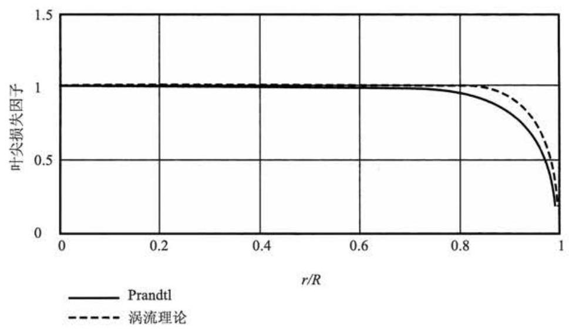

图 3.33 Prandtl 叶尖损失因子与涡流理论预计的叶尖损失因子的比较 (三叶片风轮, 叶尖速比为 6)

现在最有用的是知道环量沿叶片的变化情况。上述分析中, 没有考虑叶尖损失, 叶片环量是均匀的[式(3.72)]。遵循同样的步骤, 式(3.73)可变成

$$
\rho \left( {W \times  \Gamma }\right) \sin \phi  = {\rho \Gamma }{U}_{\infty }\left\lbrack  {1 - {a}_{\mathrm{b}}\left( r\right) }\right\rbrack   = {4\pi }\frac{{U}_{\infty }^{3}}{\Omega }a\left( r\right) {\left\lbrack  1 - a\left( r\right) \right\rbrack  }^{2}
$$

式中, ${a}_{\mathrm{b}}\left( r\right)$ 为半径为 $r$ 处的局部叶片气流因子,其值为 $a;a\left( r\right)$ 为半径为 $r$ 处的气流因子的平均值。因此有

$$
\Gamma \left( r\right)  = \frac{4\pi }{\lambda \left( {1 - a}\right) }{af}\left( r\right) {\left\lbrack  1 - af\left( r\right) \right\rbrack  }^{2} \tag{3.88}
$$

$\Gamma \left( \mathrm{r}\right)$ 是所有叶片的总环量,如图 3.34 所示,可以看出, $\Gamma \left( r\right)$ 值除了叶尖附近外其他地方都是相同的。如果假定在叶片内侧段的环量是均匀的, 则垂直虚线显示了叶片的有效长度 (半径) ${R}_{\mathrm{{ef}}} = {0.975}$ 。

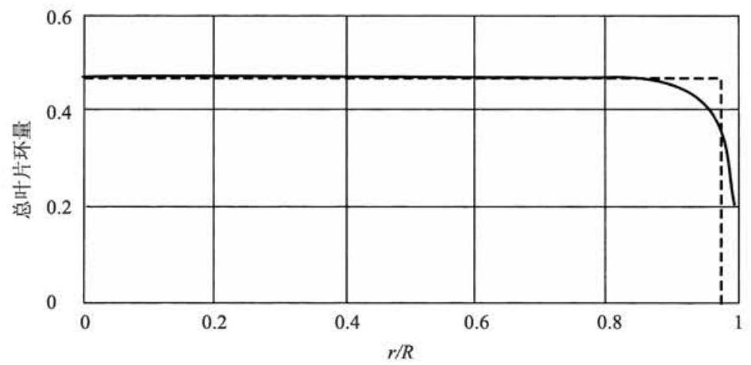

图 3.34 对于最佳叶尖速比为 6 的三叶片风力发电机组, 叶片环量在翼展方向上的变化曲线

Prandtl 叶尖损失因子为解决复杂问题提供了一种令人满意的简单方法, 采用这种方法不仅可以计算出离散叶片的影响, 而且也允许在风轮圆盘边缘的诱导因子降到零。

### 3.8.4 叶根损失

与叶尖的情况一样, 叶根的环量一定会降到零, 所以可以假定叶根也发生了相似的过程。叶根离转轴有一定的间隙, 所以气流以自由来流速度通过圆盘进入叶片根部。实际上, 3.4 节所讲的涡流理论可以扩展应用到叶根上, 说明通过圆盘根部的气流速度比自由流速度高一点。因此, 和应用于叶尖一样, Prandtl 叶尖损失函数通常也被应用到叶根上(图 3.35)。

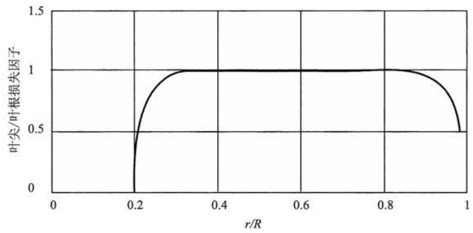

图 3.35 对于叶根为翼展的 ${20}\%$ 、叶尖速比为 6 的最佳三叶片风轮, 叶尖/叶根的联合损失因子在翼展方向的变化曲线

如果 ${\mu }_{\mathrm{R}}$ 是归一化的叶根半径,叶根损失因子可以通过修改式 (3.87) 的叶尖损失因子来进行求解:

$$
{f}_{\mathrm{R}}\left( \mu \right)  = \frac{2}{\pi }\arccos \left\lbrack  {\mathrm{e}}^{-\frac{B}{2}\left( \frac{\mu  - {\mu }_{\mathrm{R}}}{\mu }\right) \sqrt{1 + \frac{{\left( {\lambda }_{\mu }\right) }^{2}}{{\left( 1 - a\right) }^{2}}}}\right\rbrack \tag{3.89}
$$

如果式(3.87)称为 ${f}_{\mathrm{T}}\left( r\right)$ ，那么完整的叶尖/叶根损失因子比为

$$
f\left( \mu \right)  = {f}_{\mathrm{T}}\left( \mu \right) {f}_{\mathrm{R}}\left( \mu \right) \tag{3.90}
$$

### 3.8.5 叶尖损失对最佳叶片设计和功率的影响

在整个风轮扫掠面上，没有叶尖损失的最佳轴向气流诱导因子都一律为 $1/3$ 。 由于叶尖损失的存在改变了 $a$ 平均值的最佳值，该值在尾流边缘被减小到零，但是在叶尖区域叶片局部地方则趋向于增加。

如果 $a\left( r\right)$ 取半径为 $r$ 处的方位平均值，那么叶片在该半径处的气流诱导因子为 $a\left( r\right) /f\left( r\right)$ 。从式(3.67)可以得到叶片的入流角 $\phi$ 为

$$
\tan \phi  = \frac{1}{\lambda \mu }\left( \frac{1 - \frac{a}{f}}{1 + \frac{{a}^{\prime }}{f}}\right) \tag{3.91}
$$

式(3.66)是无量纲的角动量的变化率与无量纲的轴向动量变化率之比，因涉及通过圆盘的所有气流, 所以使用其平均值。现在不考虑阻力, 式 (3.67) 就变为

$$
\tan \phi  = \frac{{\lambda \mu }{a}^{\prime }\left( {1 - a}\right) }{a\left( {1 - a}\right)  + {\left( {a}^{\prime }\lambda \mu \right) }^{2}} \tag{3.92}
$$

因此，

$$
\frac{\left( {1 - a}\right) {\lambda \mu }{a}^{\prime }}{a\left( {1 - a}\right)  + {\left( \lambda \mu {a}^{\prime }\right) }^{2}} = \frac{1 - \frac{a}{f}}{{\lambda \mu }\left( {1 + \frac{{a}^{\prime }}{f}}\right) }
$$

展开后有

$$
{\lambda }^{2}{\mu }^{2}\frac{f - 1}{f}{a}^{\prime 2} - {\lambda }^{2}{\mu }^{2}\left( {1 - a}\right) {a}^{\prime } + a\left( {1 - a}\right) \left( {1 - \frac{a}{f}}\right)  = 0 \tag{3.93}
$$

很明显,因为叶片的大部分 $f = 1$ ,式中的第一项就消失了,而在叶尖区域 ${a}^{\prime 2}$ 的值是非常小的。若略去第一项,式 (3.93) 就可大大简化,当叶尖速比大于 3 时, 忽略第一项所造成结果的差异是可以忽略不计的。

$$
{\lambda }^{2}{\mu }^{2}{a}^{\prime } = a\left( {1 - \frac{a}{f}}\right) \tag{3.94}
$$

如前所述，式 (3.65) 仍适用，

$$
\frac{\mathrm{d}a}{\mathrm{\;d}{a}^{\prime }} = \frac{1 - a}{{a}^{\prime }}
$$

从式 (3.94) 中可得

$$
\frac{\mathrm{d}{a}^{\prime }}{\mathrm{d}a} = \frac{1}{{\lambda }^{2}{\mu }^{2}}\left( {1 - 2\frac{a}{f}}\right)
$$

因而有

$$
\left( {1 - a}\right) \left( {1 - 2\frac{a}{f}}\right)  = {\lambda }^{2}{\mu }^{2}{a}^{\prime }
$$

与式 (3.94) 联立可得

$$
{a}^{2} - \frac{2}{3}\left( {f + 1}\right) a + \frac{1}{3}f = 0
$$

因此 $a = \frac{1}{3} + \frac{1}{3}f - \frac{1}{3}\sqrt{1 - f + {f}^{2}}$(3.95)

式(3.95)给出的 $a$ 的平均值的径向变化曲线和叶片 $a/f$ 的局部值如图 3.36 所示。叶尖的精确解也有一个将降到零的局部诱导速度。

很明显，由于局部气流诱导因子 $a/f$ 在叶尖没有降到零，所以最佳运行所需的叶片方案与相应的 Prandtl 叶尖损失因子的叶片有一点不同。使用 Prandtl 叶尖损失因子得到的是近似解，但这是一开始就知道的。

最佳功率输出的叶片设计，可以通过式 (3.75) 和 (3.76) 的联立求解得到，因此有

$$
{\sigma }_{\mathrm{r}}\lambda {C}_{1} = \frac{4{\lambda }^{2}{\mu }^{2}{a}^{\prime }}{\sqrt{\left( {1 - \frac{a}{f}}\right)  + {\left\lbrack  \lambda \mu \left( 1 + \frac{{a}^{\prime }}{f}\right) \right\rbrack  }^{2}}}\left( \frac{1 - a}{1 - \frac{a}{f}}\right)
$$

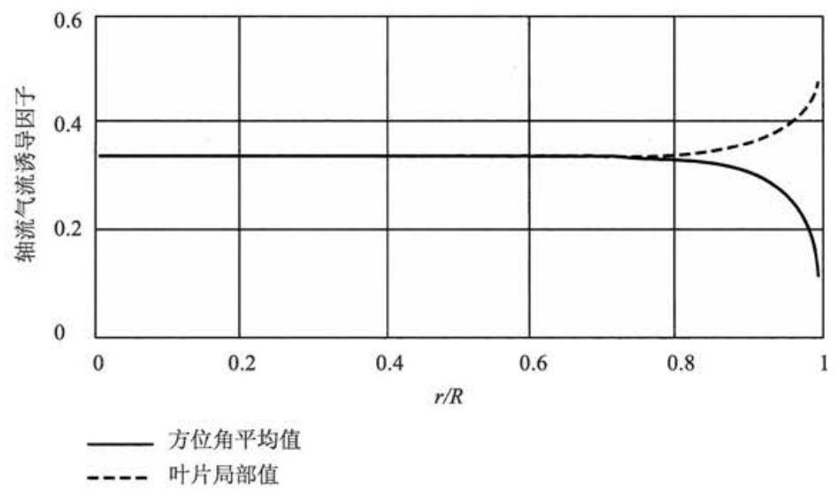

图 3.36 对最佳叶尖速比为 6 的三叶片风力发电机组, 轴向诱导因子随半径的变化曲线

将式 (3.94) 代入得

$$
{\sigma }_{\mathrm{r}}\lambda {C}_{1} = \frac{{4a}\left( {1 - a}\right) }{\sqrt{{\left( 1 - \frac{a}{f}\right) }^{2} + {\left\{  \lambda \mu \left\lbrack  1 + \frac{a\left( {1 - \frac{a}{f}}\right) }{{\lambda }^{2}{\mu }^{2}f}\right\rbrack  \right\}  }^{2}}} \tag{3.96}
$$

式 (3.94) 给出的叶片几何参数如图 3.37 所示，图中与排除叶尖损失的叶片设计进行了比较。从图 3.37 中可以看出, 两种设计只有在叶尖区域内有一点不同。

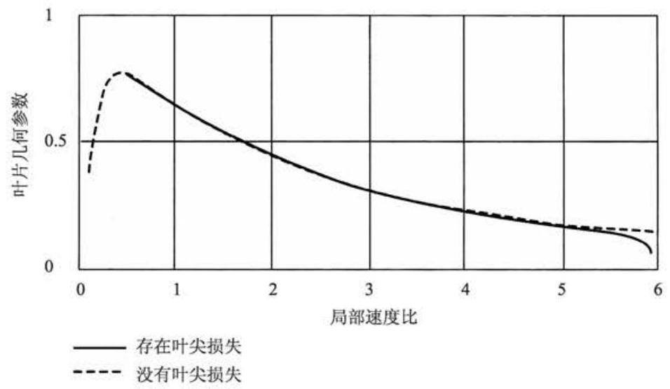

图 3.37 对设计叶尖速比为 6 的三叶片风轮, 在存有叶尖损失和

没有叶尖损失两种情况下叶片几何参数随局部速度比的变化曲线

相似地, 入流角的分布如图 3.38 所示, 可以通过适当修正式 (3.75) 求解出:

$$
\tan \phi  = \frac{1 - \frac{a}{f}}{{\lambda \mu }\left\lbrack  {1 + \frac{a\left( {1 - \frac{a}{f}}\right) }{{\lambda }^{2}{\mu }^{2}f}}\right\rbrack  } \tag{3.97}
$$

同样, 叶尖损失的影响再次被限制在叶片尖端。

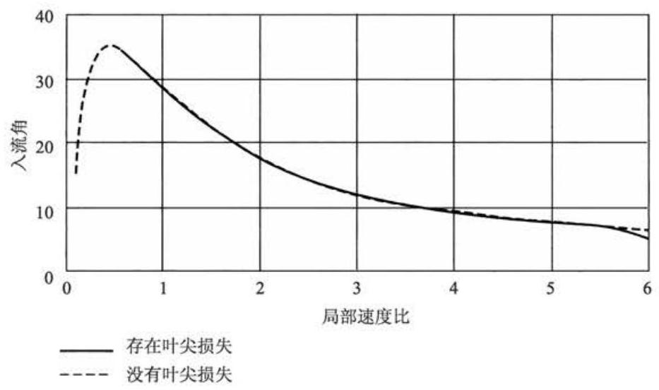

图 3.38 对于设计叶尖速比为 6 的三叶片风轮, 在存有叶尖损失和没有叶尖损失两种情况下入流角随局部速度比的变化曲线

对于没有阻力和叶尖损失优化设计的风轮, 运行在设计叶尖速比时的风能利用系数等于贝兹极限为 0.593 时的值, 但是在存在叶尖损失的情况下, 这个最优风能利用系数明显减少。式 (3.24) 确定了风能利用系数沿叶片的分布情况，如图 3.39 所示。

$$
{C}_{\mathrm{P}} = \frac{P}{\frac{1}{2}\rho {U}_{\infty }^{3}\pi {R}^{2}} = 8{\lambda }^{2}{\int }_{0}^{1}{a}^{\prime }\left( {1 - a}\right) {\mu }^{3}\mathrm{\;d}\mu \tag{3.98}
$$

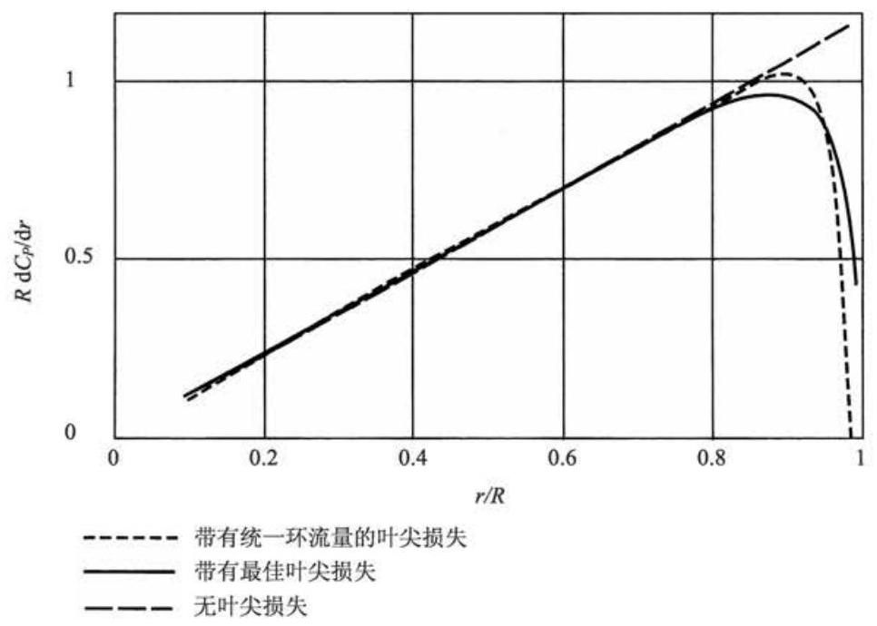

图 3.39 对于具有均匀环流量和最佳叶尖速比为 6 的三叶片风力发电机组, 在叶尖损失存在的情况下沿翼展方向的功率吸收变化图

其中, ${a}^{\prime }$ 和 $a$ 是从式(3.94)和式(3.95)得到的。

对于所有的叶尖速比, 在考虑阻力和叶尖损失时其可达的最大风能利用系数明显要低于贝兹极限。如图 3.40 所示, 在叶尖速比值高时, 阻力使风能利用系数减小; 在叶尖速比值低时, 由于受螺旋涡面的分离影响大, 对叶尖损失的影响是最严重的。

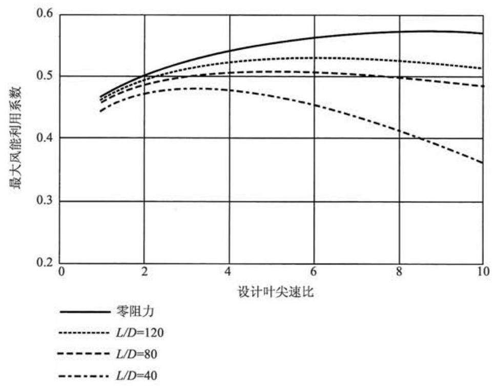

图 3.40 最大值 ${C}_{\mathrm{P}}$ 随着不同的升力/阻力比 $\lambda$ 的变化,也包含三叶片转子叶尖损失

### 3.8.6 计及叶尖损失的非最优运行

叶素/动量方程式 (3.57) 和式 (3.58) 可确定非最优运行时的轴向诱导因子。 在含有叶尖损失的情况下，必须对 BEM 方程进行修正。是否进行必要的修正需要根据气流因子的方位角平均值或者叶素当地的最大值来决定。如果选择的是前者, 那么在动量项里面气流因子不用修正, 但是在叶素项中气流因子应该表示为平均值除以叶尖因数。而如果选择确定气流因子的最大值, 意味着在叶素项中不对它们进行修正, 但是要在动量项中乘以叶尖损失因子。后面的这种选择对式 (3.59) 和式 (3.60) 进行了最简单的修正。

$$
\frac{af}{1 - a} = \frac{{\sigma }_{\mathrm{r}}}{4{\sin }^{2}\phi }{C}_{x}\frac{1 - a}{1 - {af}} \tag{3.99}
$$

$$
\frac{{a}^{\prime }f}{1 + {a}^{\prime }} = \frac{{\sigma }_{\mathrm{r}}}{4\sin \phi \cos \phi }{C}_{y}\frac{1 - a}{1 - {af}} \tag{3.100}
$$

当尾流混合发生时, 有可能存在动量定理失效的问题。螺旋涡面将不存在, Prandtl 的近似法也自然不再适合。然而, 在叶片间穿过的微粒同那些与叶片相互作用的微粒相比, 它们动量损失要小些, 这样应用叶尖损失因子就是必要的。 Prandtl 的近似法是目前仅有的实用方法, 因此被广泛使用。按照图 3.16 收集的实验结果,平均值 $a$ 应该在动量定理失效的那一级确定。

### 3.8.7 叶尖损失的不同解释

叶轮的气流因为速度的下降会膨胀, 所以也就不是真正的轴向了。也就是说, 它与旋转轴线并不平行, 也不是原来的流动方向了。结果, 就会在叶轮的上风向形成径向的速度分量, 这是因为在叶尖区域的径向气压梯度比中心区域的低。在叶轮圆盘上某一点的径向动量的变化是由截然相反的点上的大小相等、方向相反的径向动量来平衡的。径向速度的大小与半径成正比, 所以在叶尖区域它的影响最大。与径向流相关联的动能是不能被能量捕获的, 因为该动能并没有影响叶片上的空气动力学受力。因此，接近流的轴向的速度分量便被耗尽了，但不是由轴向力消耗的。

对于较好的叶片设计来说,叶尖的弦长应该是 0 , 因此不会产生作用任何气流的轴向力, 这意味着静压力与大气压力相同, 并且由此产生的近似速度也会与原来的初始风速相同。但是在叶尖会有相当大的径向流速度分量, 从而引起了轴向流分量的明显减少, 就是那些未与风轮叶片造成的轴向力相关联的部分。例如, 如果轴向速度分量的大小是初始风速的 2/3，那么叶尖风速的倾向角将会是

$$
\arccos \left( \frac{2}{3}\right)  = {48.19}^{ \circ  }
$$

$a = 1/3$ ,但是与轴向力没有关联。

如果 $a$ 重新定义为流向流量速度的减少量,如图 3.41 所示,那么在叶尖处的 $a$ 值将为 0 , 但朝向叶片的中心会逐渐增加, 到达最大值后再次下降直到根部再次为 0 。

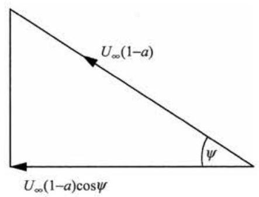

图 3.41 流的几何图形

应用与 3.2.1 节动量定理相同的参数，式 (3.10) 可以变形为

$$
\frac{1}{2}\rho \left( {{U}_{\infty }^{2} - {U}_{\mathrm{W}}^{2}}\right) {A}_{\mathrm{D}} = \left( {{U}_{\infty } - {U}_{\mathrm{W}}}\right) \rho {A}_{\mathrm{D}}{U}_{\infty }\left( {1 - a}\right) \cos \psi \tag{3.101}
$$

尾流中的轴向速度变为

$$
{U}_{\mathrm{W}} = {U}_{\infty }\left( {1 - {2a}\cos \psi }\right) \tag{3.102}
$$

其中, $\psi$ 是所得的流向方向与圆盘根部的轴向方向之间的夹角。

气流在圆盘 $\delta {A}_{\mathrm{D}}$ 的元素区域的延缓力,由式 (3.12) 可得

---

$$
{\delta T} = \left( {{p}_{\mathrm{D}}^{ + } - {p}_{\mathrm{D}}^{ - }}\right) \delta {A}_{\mathrm{D}} = {2\rho \delta }{A}_{\mathrm{D}}{U}_{\infty }^{2}a\left( {1 - a}\right) {\cos }^{2}\psi
$$

---

(3.103)

从空气提取能量的功率为

$$
{\delta P} = {\delta T}{U}_{\mathrm{D}} = {2\rho }{A}_{\mathrm{D}}{U}_{\infty }^{3}a{\left( 1 - a\right) }^{2}{\cos }^{3}\psi \tag{3.104}
$$

$a$ 和 $\psi$ 都是沿着径向变化的,并且根据圆盘径向变化的循环而变化。转盘循环或者圆盘上的附着速度从叶根部到叶尖增加或减少的变化如图 3.42 所示。

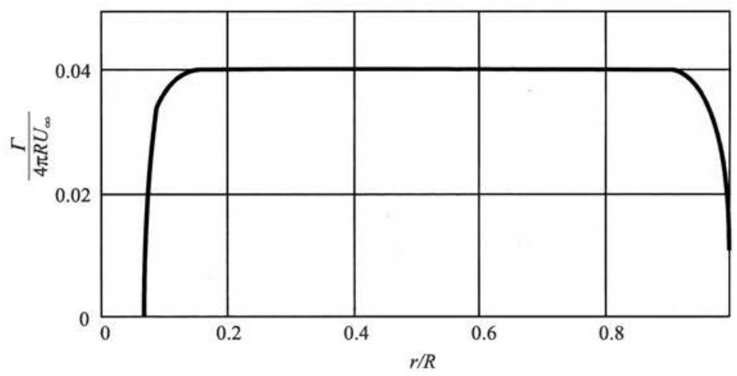

图 3.42 沿着叶片长度的循环变化

单纯地运用动量定理是不能决定 $a$ 和 $\psi$ 的变化方式的,但是很明显,关于半径 $r$ 的整合式 (3.104) 会导致功率最优化效率系数比贝兹极限小。

这里用到的流的膨胀过程发生在整个流域即圆盘上流并且在叶片的根部和叶尖会有持续的效率失。由 Prandtl 描述的叶尖/根部损失机理, 从另一个方面, 发生在整个流域的下流区域, 两种损失过程是相当明显的。

## 3.9 失速延迟

由 Himmelskamp(1945) 首先发现的一个现象, 升力系数在旋转叶片的内侧部分实现, 并且比二维静特性的最大值明显过剩。换句话说, 旋转中叶片的延迟产生的攻角要比静止的叶片攻角大。叶轮实测输出功率因为失速延迟现象而增长, 如果将其包含进去的话, 理论预测与实测输出的比值将会增大。同时发现在叶根部分的影响较大, 并且沿着半径减少。

关于失速延迟产生的原因有很多争议, 但是还没有一个令人信服的物理过程建立起来。一致认可的是，不管由于什么原因，气流穿过下风向叶片表面的反向压力梯度因为其自身的旋转而减少。反向压力梯度由于接近叶片的尾部边缘而减缓, 这是在速度的峰值靠近前导边缘之后。边缘层的黏度也会降低流的速度, 这两种效果共同影响, 如果足够大的话, 可以造成边界层停滞 (与叶片表面相关) 或者流向的倒转。如果发生流向的倒转, 那么气流就会从叶片的表面分成两个部分并且产生失速, 造成升力的丢失以及压差阻力的急剧增长。

利用流体力学计算机技术对旋转叶片进行空气动力学分析 (Wood, 1991; Snel 等, 1993), 包括黏度的影响, 的确显示了反向压力梯度的减少, 虽然在数据计算上不是那么明显,但在物理上确实存在。

影响时速延迟的参数主要是区域性叶片强度 $c\left( r\right) /r$ 。

附着流状况的证据着实存在，否则在这之下就会成为静态失速的攻角，在二维流状况和旋转状况之间存有微小的差异。然而，当发生失速的时候，处于分割区域的空气，在叶片表面移动得非常缓慢，与叶片一起旋转，并且因为离心力导致其沿着半径向外移动。在失速发生前，边界层的流体再次导致径向流，有可能减少位移厚度并增加了抗分离能力。

Ronsten(1991)已经测量出了静止的和旋转的叶片表面的压力。图 3.43 展示了在相同攻角下 3 倍翼展区域静态状况和旋转状况的表面压力系数的比较 (叶尖速比为 4.32)。在 30%翼展区域估计攻角为 ${30.41}^{ \circ  }$ 正好在静失速级别之上 (由静压力系数分布证明)。30%翼展旋转压力系数分布展示了较高的先导边缘吸力峰值以及弦上表面尾部均匀的压力恢复坡度。压力恢复梯度斜坡证实了反向压力梯度的减少, 加之边界层的影响, 很少有可能分散开来。前导边缘的尾部峰值级别很有可能比较小,如果在不旋转的状态下气流很有可能依旧附在 ${30.41}^{ \circ  }$ 。

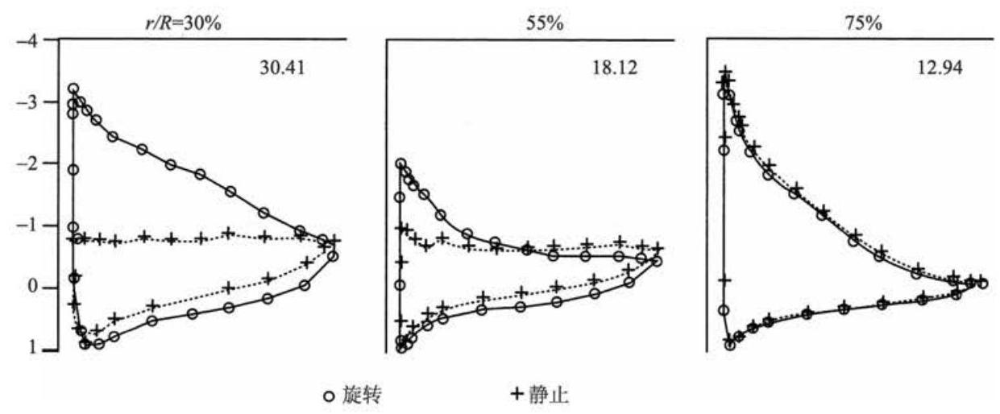

图 3.43 相同攻角下 3 倍翼展区域静态状况和旋转状况的表面压力系数的比较

在 55% 翼展区域的情况与 30% 的相类似，静压力证明这部分已经失速，但是旋转压力却显示全段边缘尾部峰值很小但很明显。在 75% 翼展区域静压力和旋转压力效率分布 $\left( {12.94}^{ \circ  }\right.$ 的攻角) 几乎没有什么不同。该区域在静失速级别之下, 前导边缘尾部压力峰值比 30% 翼展区域高一点，比 55% 要高得多，但是恢复坡度要陡得多。气流似乎附着在旋转叶片的 ${30}\%$ 和 ${55}\%$ 翼展区域，但是对于这种情况, 尾部压力又似乎太小, 所以失速会展现极度的延迟, 并且由压力恢复坡度的平缓展示的很低的反向压力梯度证实了失速的原因。在 ${30}\%$ 区域 $c/r = {0.374}, c/r =$ 0.161,在 ${55}\%$ 和 ${75}\%$ 区域 $c/r = {0.093}$ 。增大的升力同样出现在过失速区域,并且归因于隔离的气流区域的气流。

Snel 等(1993)对一般常用的二维静空气动力学升力功率数据, 即适用于测量升力效率(Ronsten，1991)并且利用三维计算流体动态代码的计算结果，提出了一种简单有效的改进。

如果静止状态的线性部分， $2 - \mathrm{D}$ ， ${C}_{1} - \alpha$ 曲线延长超越了失速范围，那么 $\Delta {C}_{1}$ 将为两条不同的曲线。通过 $2 - \mathrm{D}$ 曲线的校正来弥补旋转, $3 - \mathrm{D}$ ,结果得到 $3\left( {c/r}\right) {2\Delta }{C}_{1}$ 。

$$
{C}_{\mathrm{L}3\mathrm{D}} = {C}_{\mathrm{L}3\mathrm{D}} + 3\left( \frac{c}{r}\right) \Delta {C}_{1} \tag{3.105}
$$

表 3.1 比较了测量的静止的 $\left( {C}_{{1.2}\mathrm{D}}\right) \left( {C}_{{1.2}\mathrm{D}}\right)$ 以及旋转 $\left( {C}_{\mathrm{1}{.3}\mathrm{D}}\right)$ 升力效率,并列出了利用 Snel 改进的式 (3.105) 对旋转量的计算值。这项改进非常好, 并且应用起来很简单。Snel 在 1993 年给出了图 3.44 所示的改进的例子。

表 3.1 静止的测量值与旋转的测量值的比较，以及式 (3.105) 对旋转量的计算值

<table><tr><td>$r/{R}^{ * }{100}$</td><td>30%</td><td>55%</td><td>75%</td></tr><tr><td>$c/r$</td><td>0.374</td><td>0.161</td><td>0.093</td></tr><tr><td>$\Delta$</td><td>30.41°</td><td>18.12°</td><td>12. 94°</td></tr><tr><td>${C}_{1}$ (静止的测量值)</td><td>0.8</td><td>0.74</td><td>1.3</td></tr><tr><td>${C}_{1}$ (旋转的测量值)</td><td>1.83</td><td>0.93</td><td>1.3</td></tr><tr><td>${C}_{1}$ (旋转的改进值)</td><td>1.87</td><td>0.84</td><td>1.3</td></tr></table>

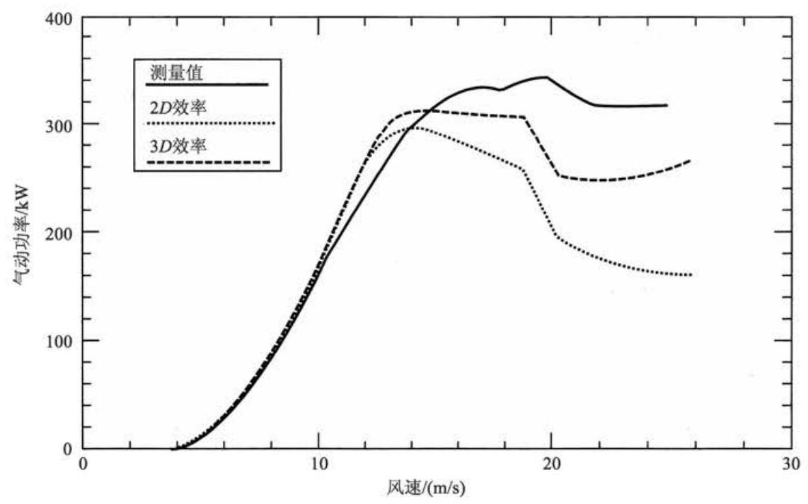

图 3.44 Snel 为一个 NORDTANK ${300}\mathrm{\;{kW}}$ 发电机组的预测功率曲线与实际测量的比较

## 3.10 实际风力机的计算结果

表 3.2 给出了运行在恒定均匀转速和固定桨距情况下的风力机的叶片设计方案, 其翼型特性曲线如图 3.45 所示。

表 3.2 风轮直径为 ${17}\mathrm{\;m}$ 的叶片设计

<table><tr><td>半径 $r/\mathrm{{mm}}$</td><td>$\mu  = \frac{r}{R}$</td><td>弦长 $c/\mathrm{{mm}}$</td><td>桨距角 $\beta /\left( {}^{ \circ  }\right)$</td><td>(叶片厚度/弦长比)/%</td></tr><tr><td>1700</td><td>0.20</td><td>1085</td><td>15.0</td><td>24.6</td></tr><tr><td>2125</td><td>0.25</td><td>1045</td><td>12.1</td><td>22.5</td></tr><tr><td>2150</td><td>0.30</td><td>1005</td><td>9.5</td><td>20.7</td></tr><tr><td>2975</td><td>0.35</td><td>965</td><td>7.6</td><td>19.5</td></tr><tr><td>3400</td><td>0.40</td><td>925</td><td>6.1</td><td>18.7</td></tr><tr><td>3825</td><td>0.45</td><td>885</td><td>4.9</td><td>18.1</td></tr><tr><td>4250</td><td>0.50</td><td>845</td><td>3.9</td><td>17.6</td></tr><tr><td>4675</td><td>0.55</td><td>805</td><td>3.1</td><td>17.1</td></tr><tr><td>5100</td><td>0.60</td><td>765</td><td>2.4</td><td>16.6</td></tr></table>

续表 3.2

<table><tr><td>半径 $r/\mathrm{{mm}}$</td><td>$\mu  = \frac{r}{R}$</td><td>弦长 $c/\mathrm{{mm}}$</td><td>桨距角 $\beta /\left( {}^{ \circ  }\right)$</td><td>(叶片厚度/弦长比)/%</td></tr><tr><td>5525</td><td>0.65</td><td>725</td><td>1.9</td><td>16.1</td></tr><tr><td>5950</td><td>0.70</td><td>685</td><td>1.5</td><td>15.6</td></tr><tr><td>6375</td><td>0.75</td><td>645</td><td>1.2</td><td>15.1</td></tr><tr><td>6800</td><td>0.80</td><td>605</td><td>0.9</td><td>14.6</td></tr><tr><td>6375</td><td>0.85</td><td>565</td><td>0.6</td><td>14.1</td></tr><tr><td>7225</td><td>0.90</td><td>525</td><td>0.4</td><td>13.6</td></tr><tr><td>8075</td><td>0.95</td><td>485</td><td>0.2</td><td>13.1</td></tr><tr><td>8500</td><td>1.00</td><td>445</td><td>0.0</td><td>12.6</td></tr></table>

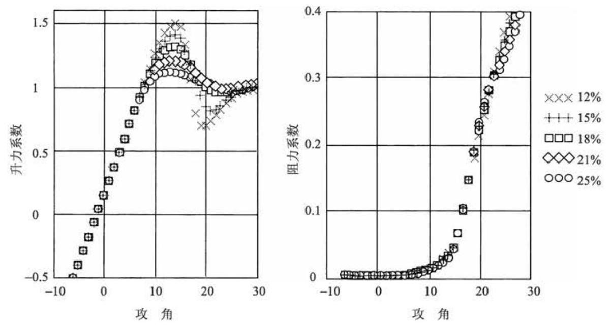

图 3.45 NACA632XX 翼型系列的空气动力特性曲线

利用上述数据就可以获得图 3.46 的结果。

利用上面的数据可以得出以下结论: 在叶尖速比约为 6 时, 叶片设计的性能最佳。在理想情况下, 对于这个模型来说, 对应于最大升/阻比的叶片的攻角沿翼展均匀分布约为 ${7}^{ \circ  }$ 。在最低叶尖速比时,如图 3.44 所示,整个叶片是失速的,此时旋转速度为 ${60}\mathrm{r}/\mathrm{{min}}$ ，相应的风速为 ${26}\mathrm{m}/\mathrm{s}$ (近似于)。在最大叶尖速比时，相应的风速将达到切入风速 $\left( {{4.5}\mathrm{\;m}/\mathrm{s}}\right)$ 。在叶尖速比为4、风速为 ${13}\mathrm{\;m}/\mathrm{s}$ 时，可以获得最大功率。很明显, 叶片的大部分都是失速的。

与任何的叶尖速比, 沿着翼向的轴向诱导因子分布不是均匀的, 而在叶尖速比为 6 时,轴向诱导因子的值略高于 1/3 。图 3.47 所示的流动因子是叶片上的当地值,在叶尖速比为 6 时,平均轴向因子的值将接近 $1/3$ 。

通常, 轴向诱导因子随着叶尖速比增加, 而切向量系数是随着叶尖速比减小的。由于尾流的角速度取决于根涡, 所以它会随着半径的减小而急剧增加。

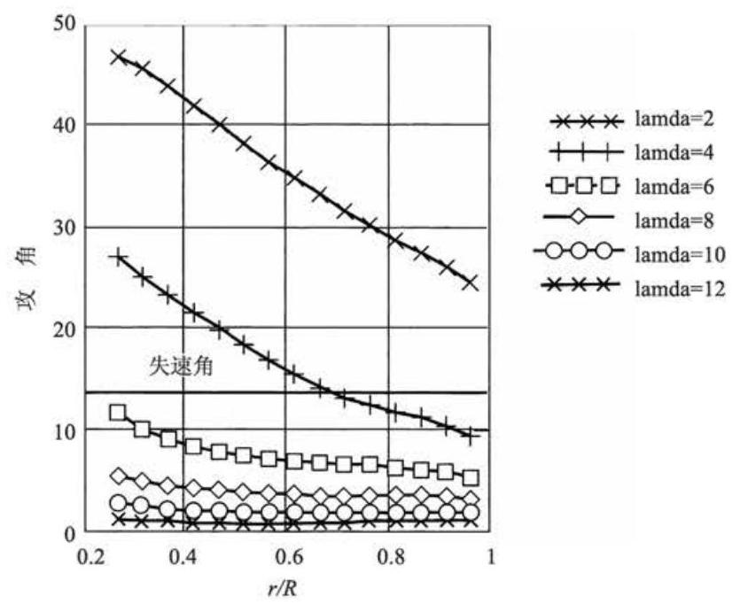

图 3.46 攻角随叶尖速比变化的分布曲线

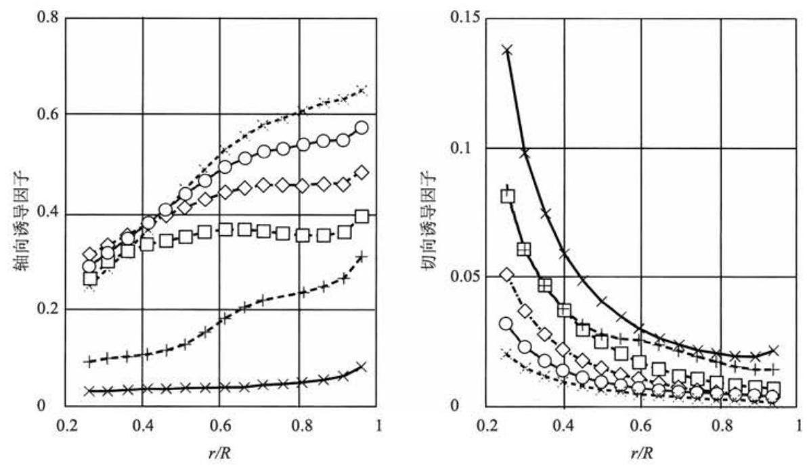

图 3.47 气流诱导因子随叶尖速比变化的分布曲线

叶片外侧段的重要性在图 3.48 中清楚地得到证明。图 3.44 中叶尖速比 4 和 2 之间转矩分布的差别说明失速的重大影响。同样, 需要注意的是, 在高叶尖速比为 12 时的转矩分布平坦, 这是受阻力影响造成的, 这种阻力可使转矩以局部速度比的平方关系减小,并在 $\lambda  = {12}$ 时,低攻角的阻力造成了巨大的功率损失。

虽然叶片轴向力系数随着叶尖速比增加，但是必须记住实际的推力是随着风速而增加的, 如图 3.49 所示。

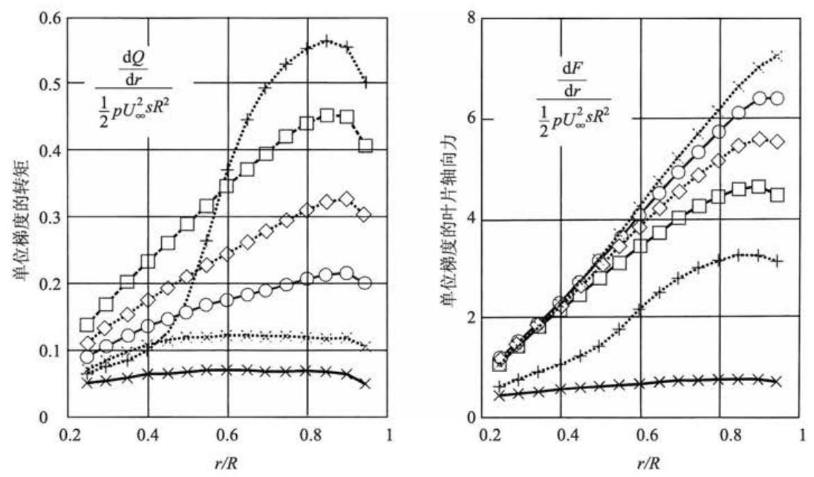

图 3.48 在叶尖速比的变化范围内叶片载荷的分布曲线

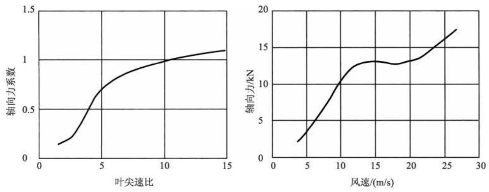

图 3.49 轴向力系数和实际作用力与风速的变化曲线

## 3.11 性能曲线

### 3.11.1 引 言

风力机性能的定位可以通过三个主要的方面，即功率、转矩和推力，它们都是随着风速的变化而变化的。功率决定着风轮吸收能量的多少; 转矩决定着齿轮箱的大小,并且必须与风轮驱动的各种发电机相匹配; 风轮推力在很大程度上受到塔架设计的影响。通常无量纲下的性能评价是很方便的, 真实性能的性能曲线特征的决定可以无视风力机的运行方式, 如恒速旋转或者风轮速度的变换。假设旋转叶片的空气动力学性能不会恶化风轮的无量纲空气动力学性能, 这将会取决于叶尖速度与叶片间距设置 (如果适当的话) 的比。因此, 以功率、转矩、推力系数作为叶尖速比函数来表示更为平常。

### 3.11.2 ${C}_{\mathrm{P}} - \lambda$ 特性曲线

本章描述的理论为风力机设计者对于变化设计参数管辖下的风力机功率性能的测试提供了途径。目前常用的描述功率性能的是无量纲 ${C}_{\mathrm{P}} - \lambda$ 曲线，该曲线应用在典型的、现行的、三叶片风力机场合如图 3.50 所示。

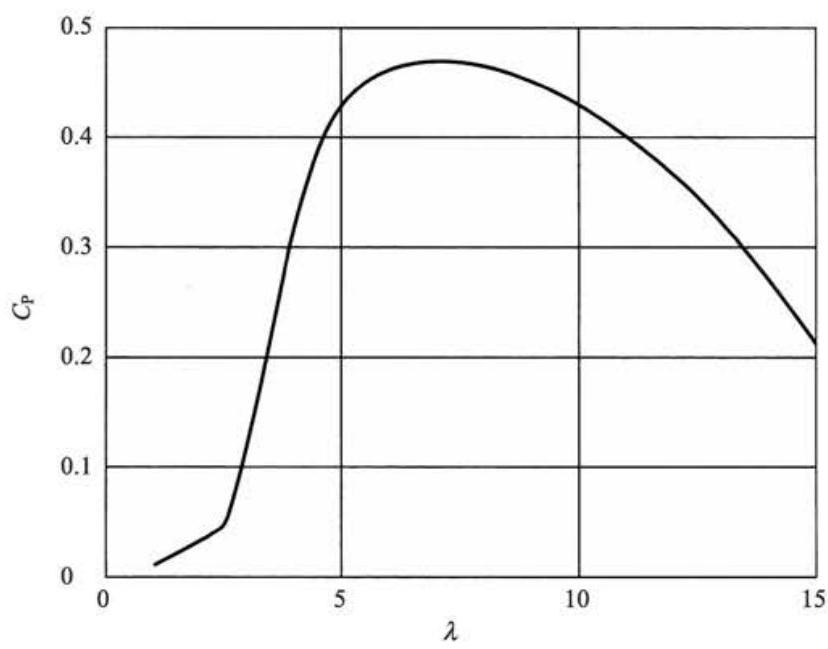

图 3.50 ${C}_{\mathrm{P}} - \lambda$

要注意的第一点就是 ${C}_{\mathrm{P}}$ 的最大值只有 0.47,叶尖速比达到 7,比贝兹极限要小得多。因为阻力和叶尖损失, 在此情况下还是产生了差异, 但是在叶尖速比很小的状态下失速现象还是降低了 ${C}_{\mathrm{P}}$ 的值。

即使在上述分析中不考虑这些损耗, 贝兹极限也不可能实现, 这是因为风力机的设计不是完美无缺的 (图 3.51)。

### 3.11.3 叶片实度对功率特性的影响

在这个阶段, 需要考虑的另一个参数是叶片实度, 定义为扫掠面积除以总叶片面积。三叶片的实度超过 0.0345 , 但是叶片实度可以很容易通过改变叶片数而变化，如图 3.52 所示。

叶片实度也可以通过改变叶片弦长来改变。

观察由于叶片实度的变化而产生的以下主要影响:

(1)低的实度得到一条宽而平直的曲线，这意味着当叶尖速比在一个宽范围变动时 ${C}_{\mathrm{P}}$ 相应变化很小，但是由于阻力损失大(阻力损失近似与叶尖速比的三次方成正比),所以 ${C}_{\mathrm{P}}$ 的最大值较小。

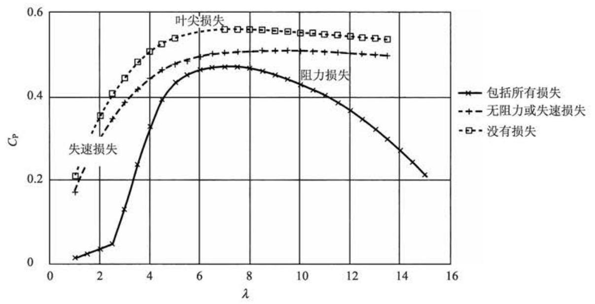

图 3.51 现代三叶片风力机出现损失的 ${C}_{\mathrm{P}} - \lambda$ 性能曲线

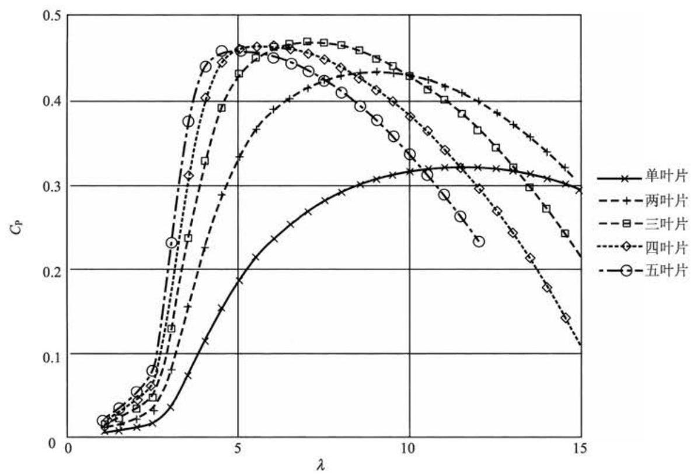

图 3.52 改变的实度影响

(2)高的实度得到一条窄的有尖锐顶点的曲线，该顶点使得风轮对叶尖速比的变化非常敏感，而且如果实度太大， ${C}_{\mathrm{P}}$ 有一个相对较低的最大值。 ${C}_{\mathrm{{Pmax}}}$ 的减少是由失速损耗引起的。

(3)三叶片时可以得到最佳的实度，但是两叶片也是另一种可以接受的方案， 因为虽然 ${C}_{\mathrm{P}}$ 的最大值稍微低一点,但是峰值的展开范围要宽,因而可以捕获到更大的能量输出。

值得讨论的一个解决方案是大量实度特别小的叶片, 但是这大大地增加了制造成本，而且会造成叶片结构强度减弱，非常容易变形。

有的应用需要相对高实度的风力机，一种是直接驱动风力提水机，另一种是用于蓄电池充电的小型风力机。在这两种应用中,需要较大的启动力矩 (在非常低的叶尖速比时的力矩较大), 这一点非常重要, 而且允许在非常低的风速下输出较小的功率值, 这对于连续补充式充电蓄电池最为理想。

### 3.11.4 ${C}_{\mathrm{Q}} - \lambda$ 力矩曲线

扭矩系数是用功率系数除以叶尖速比而推导出来的, 所以它不需要其他任何关于风力机特性的信息。 ${C}_{\mathrm{Q}} - \lambda$ 曲线主要是在风轮连接到齿轮箱和发电机时用来估计力矩的大小。

图 3.53 显示了风力机所产生的力矩如何随着实度的增加而变化的过程。对于设计用于发电的现代高速风力机期望以尽可能低的力矩运行，以减小齿轮箱的造价。在 19 世纪用来提水的多叶片高实度的风力机，旋转速度慢同时有很大的启动转矩系数, 克服启动活塞泵所需的启动力矩。

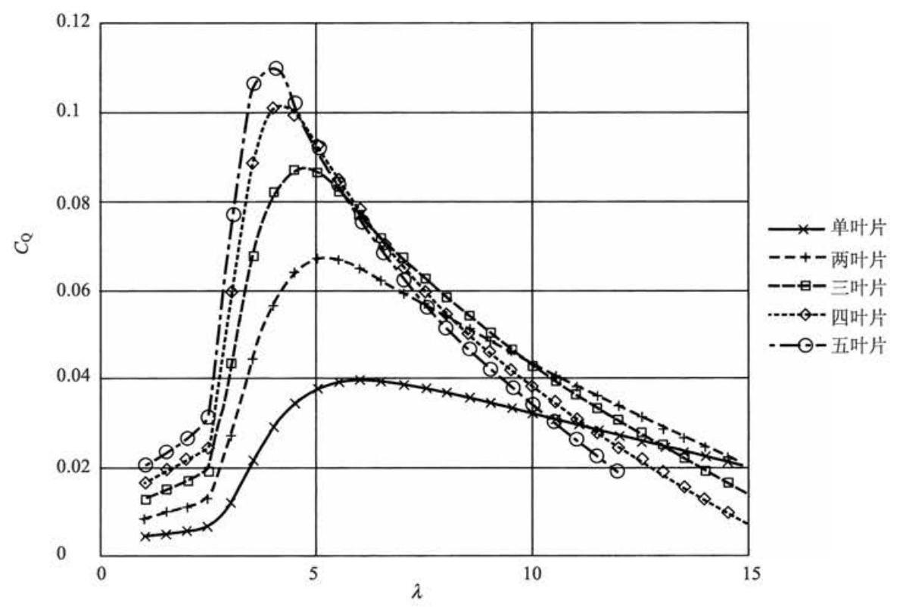

图 3.53 实度对力矩的影响

与功率曲线相比, 力矩曲线的峰值出现在叶尖速比较低的时候。对于高实度的情况, 曲线的峰值出现在叶片失速的时候。

### 3.11.5 ${C}_{\mathrm{T}} - \lambda$ 推力曲线

作用在风轮上的推力是直接作用在支撑风轮的塔架上的, 所以相应地影响了塔架的结构设计。

通常作用在风轮上的推力会随着实度的增加而增加 (图 3.54)。

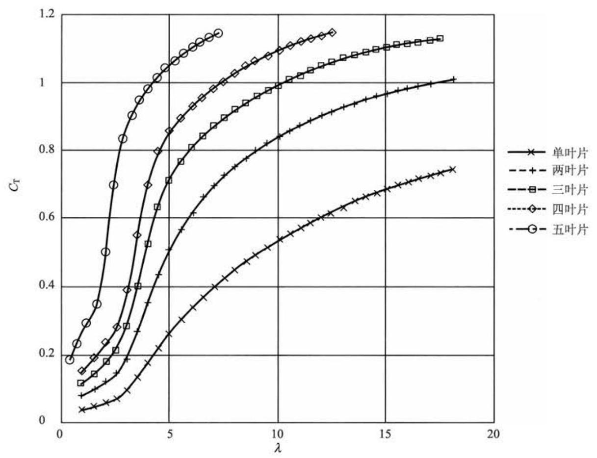

图 3.54 实度对推力的影响

## 3.12 恒速的运行情况

### 3.12.1 引 言

目前安装的大多数风力机都是用来发电的。无论这些风力机是否和电网连接, 它们都必须是能够提供固定频率的电源, 否则大多数常用的电气设备将不能正常工作。因此, 风力机通常的运行模式是以恒速运行。连接到电网的恒速风力机是自动控制的, 而独立的风力机需要进行速度控制并采取限制功率的手段。

## 3.12.2 ${K}_{\mathrm{P}} - 1/\lambda$ 特性曲线

对于恒速运行的风力机，可以得到另外一种特性曲线。如果风速恒定，那么无量纲的 ${C}_{\mathrm{P}} - \lambda$ 曲线显示了功率是如何随着转速的变化而变化的。当风轮以恒速运行时,无量纲的 ${K}_{\mathrm{P}} - 1/\lambda$ 曲线显示了功率是如何随着风速的变化而变化的。 ${K}_{\mathrm{P}}$ 定义为

$$
{K}_{\mathrm{P}} = \frac{P}{\frac{1}{2}\rho {\left( \Omega R\right) }^{3}{A}_{\mathrm{d}}} = \frac{{C}_{\mathrm{P}}}{{\lambda }^{3}} \tag{3.106}
$$

对于典型的固定桨距角的风力机， ${C}_{\mathrm{P}} - \lambda$ 和 ${K}_{\mathrm{P}} - 1/\lambda$ 曲线如图 3.55 所示。上面所述的 ${K}_{\mathrm{P}} - 1/\lambda$ 曲线与风力机的功率风速特性有相同的形式。恒速运行的缺点是风力机的效率 (给定 ${C}_{\mathrm{P}} - \lambda$ 曲线) 很大程度上随着风速的变化而变化,所以风轮应该设计为当从捕获最大能量的风速运行时,输出的效率最大。

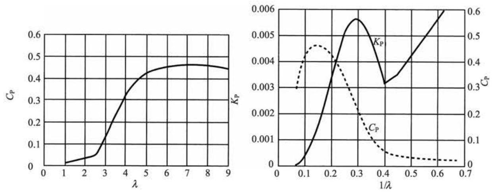

图 3.55 恒速运行时无量纲特性曲线

### 3.12.3 失速调节

${K}_{\mathrm{P}} - 1/\lambda$ 曲线的重要特征是一旦发生失速现象,功率先开始跌落,然后逐渐随着风速的增大而增大。此特征提供了输出无功功率调节的基本原则, 以确保发电机不会随着风速的增大而产生过载。在理想情况下，功率应该随着风速增加到最大值, 然后无论风速怎么增加, 都保持恒定, 这称为理想的失速调节。但是实际中, 失速调节的风力机不会表现出理想的、被动的失速动作。

失速调节提供了最简单的方法, 用来控制由风力机产生的最大输出功率, 使之适应所安装的发电机功率和齿轮箱的尺寸。直到最近, 这种方法才成为最普遍采用的控制方法。失速控制最大的优点是简单, 但同时也有其显著的缺点。由于叶片的空气动力特性，特别是失速特性，功率随风速曲线的变化是固定的。失速后的风力机的功率输出非常不稳定, 到目前为止也难以预测其变化。失速叶片还具有低振动阻尼, 这是因为在叶片周围的气流在低压力表面上是不附着的, 而且叶片振动速率对空气动力的影响很小。低阻尼可以引起较大的位移振幅，这将不可避免地伴随着较大的弯矩和应力, 从而引起疲劳损坏。

当风轮以固定桨距角停在高速的湍流风中时, 叶片承受很大的空气动力载荷, 该空气载荷不会因为叶片桨距角的调整(顺桨) 而减轻。因此, 固定桨距角、失速调节的风力机与变桨调节风力机相比，叶片和塔架要承受更多更剧烈的载荷。

### 3.12.4 转速变化的影响

风力机在恒速运行时的输出功率在很大程度上会受到运行转速的限制。如果风力机低转速运行，则功率在很低的风速下达到最大值，为了在风速高于失速风速时输出能量，风力机必须运行在失速状态，所以效率很低。相反，风力机在高转速运行时将在高风速时输出较大功率，而在中等风速时由于高阻力损耗，风力机运行的效率较低。图 3.56 显示了功率输出相对于转速的灵敏性——在转速从 ${45}\mathrm{r}/\mathrm{{min}}$ 增加 ${33}\%$ 到 ${60}\mathrm{r}/\mathrm{{min}}$ 时,峰值功率则增加 ${150}\%$ 。

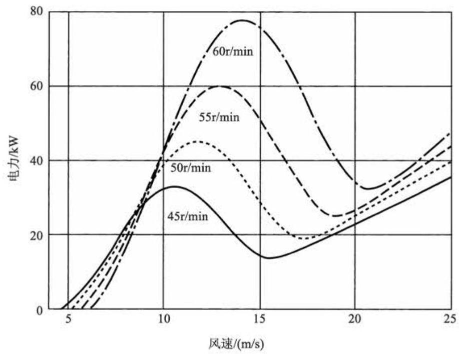

图 3.56 转速对输出功率的影响

另一方面, 在低风速时, 随着转速的增加, 功率有一个明显的跌落, 如图 3.57 所示。实际上, 如果采用了更低的转速, 在低风速时, 更高的功率将导致双速风力机的出现。如果风力机在一个恒速下运行, 在风速等于或大于平均水平时将实现最大风能捕获, 导致一个相当高的切入风速, 在最低风速时不可能发电。

在低风速时, 采用较低的转速来减小切入风速, 增加了所捕获的风能。当然, 这部分多吸收的能量被所需要额外增加的机械装置的费用抵消了。

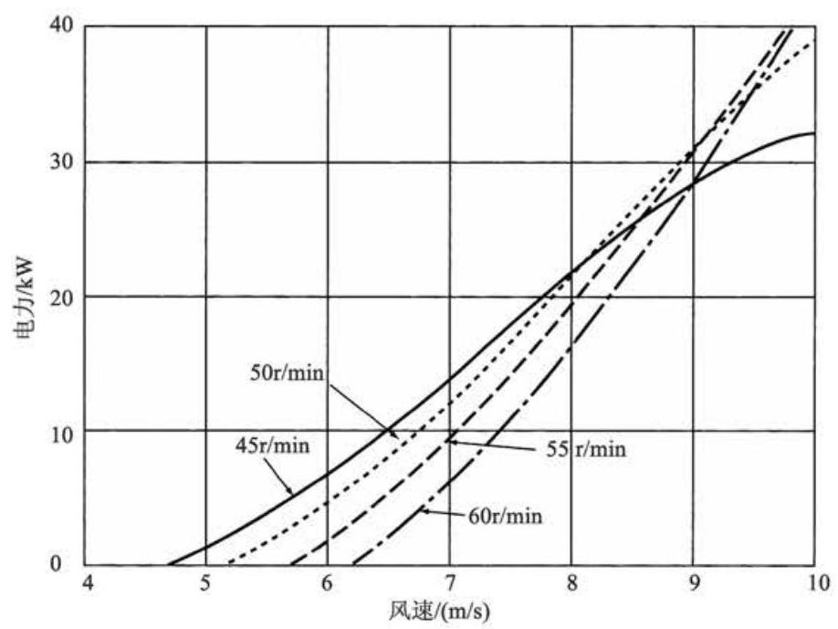

图 3.57 在低风速时对旋转速度输出功率的影响

### 3.12.5 叶片桨距角变化的影响

另一个影响功率输出的参数是叶片桨距角 ${\beta }_{\mathrm{s}}$ 。叶片差不多总是设计成扭转的, 但是在叶片根部可以调节整个叶片的桨距角。小角度桨距角的影响如图 3.58 所示。

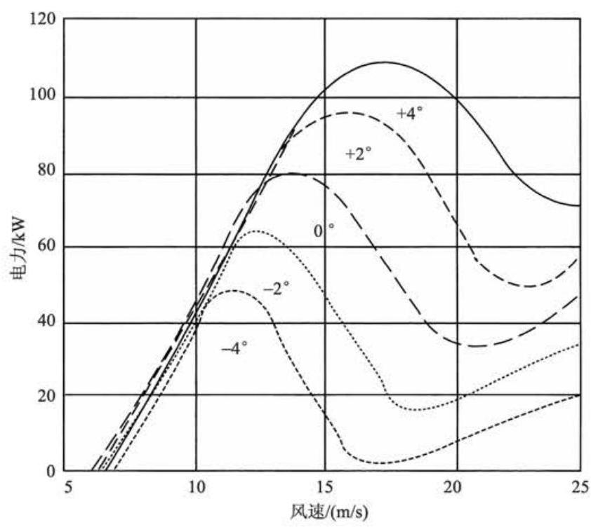

图 3.58 不同叶片的桨距角对输出功率的影响

桨距角的微小变化对功率输出有显著的影响。正桨距角的设置增加了设计桨距角，从而减少了攻角。相反，负桨距角的设置增加了攻角，而且可能导致失速的产生，如图 3.58 所示。对于一定的风况条件，可以通过对叶片桨距角和转速进行适当的调节，使设计的风轮运行在最佳风能捕获状态。

## 3.13 变桨调节

### 3.13.1 引 言

通过对桨距角的主动控制可以克服定桨距/被动失速调节的许多缺点。图 3. 58 表示输出功率对桨距角变化的敏感性。

桨距角最重要的应用是功率调节，除此之外，桨距角的控制还有其他优点。当风轮开始旋转时, 采用较大的正桨距角可以产生一个较大的启动力矩。停机的时候，经常使用 ${90}^{ \circ  }$ 的桨距角，因为在风力机刹车制动时，这样做使得风轮的空转速度最小。在 ${90}^{ \circ  }$ 正桨距角时,叶片称为“顺桨”。桨距角控制主要的缺点是可靠性差和成本高。即使是细微的桨距角的变化也需要辅助启动。

桨距控制的主要缺点就是低可靠性和高成本, 而后者已经由较低的叶片成本抵消了。

功率的调节，一方面，可以通过对桨距角的调节产生失速；另一方面，可以通过对桨距角的调节来顺桨或者通过减少攻角来减少叶片上的升力。

### 3.13.2 变桨到失速

图 3.58 表示风力机额定功率为 ${60}\mathrm{\;{kW}}$ 时的功率曲线，此时的风速为 ${12}\mathrm{\;m}/\mathrm{s}$ 。 在风速低于额定风速时，叶片的桨距角保持为 0° 。当达到额定功率时，一个很小的负的桨距角 (初始值为 ${2}^{ \circ  }$ ) 必然会引起失速，所以要限制功率达到额定功率。当风速增加时,需要在正和负两个方向都进行微调桨距角来维持功率恒定。微调桨距角使得叶片失速，这对于设计人员来说非常有吸引力，但是与固定桨距角的风力机一样，叶片也有阻尼和疲劳的问题。

### 3.13.3 变桨到顺桨

当达到额定功率时，随着桨距角的增加，攻角会减小。攻角的减小将使升力和力矩减小。气流仍然附着在叶片上。图 3.59 与图 3.58 同样针对相同的风力机, 只表示了 ${0}^{ \circ  }$ 额定功率时的零桨距角的功率曲线。当高于额定功率时,桨距角所对应的功率曲线与额定功率曲线相交, 在交点处给出了所必需的桨距角, 用以维持相应大范围的变化风速下的额定功率。从图 3.59 中可以看出,需要的桨距角随着风速的变化逐渐增大, 而且通常比桨距角失速的方式所需要的大得多。在阵风的情况下，需要大的桨距角调节来保持功率恒定，而叶片的惯性将限制控制系统反应的速度。

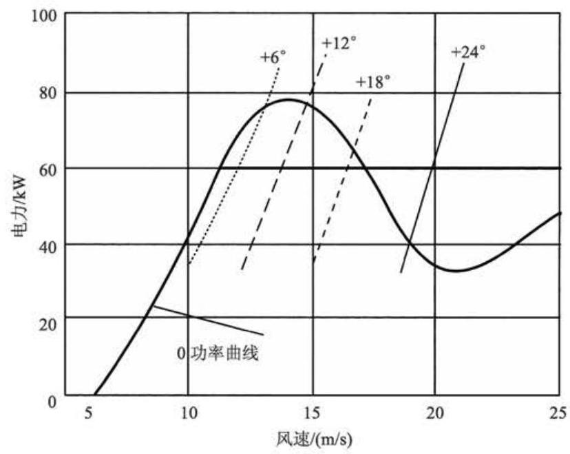

图 3.59 顺桨功率调节需要大的桨距角调节

如果阵风发生在风速高于额定风速时，因为叶片仍然没有失速，攻角和升力都将产生很大的变化。

向顺桨调节方法的优点是气流仍然附着在叶片上 (这很容易理解), 并提供恰当的正阻尼。顺桨在刹车和启动时也是相当有用的。

向顺桨调节方法是更好地进行桨距角控制的主要方式, 因为叶片的载荷与失速型叶片的相比可以进行更可靠的估计。

## 3.14 测量的特性曲线与理论的 特性曲线的比较

在本节中, 考虑风力机在恒转速这种最通常的运行模式下运行, 因为这使得输出电能的频率恒定。关于这种运行方式的更多细节将在 3.15 节中讨论, 但是理论上, 这种运行方式最重要的特征是对于某一给定的风速对应一个唯一的输出功率。

当风力机在风轮转速为 ${44}\mathrm{r}/\mathrm{{min}}$ 时测试,每隔一分钟测量一次输出能量和风速, 从而测量出平均功率和风速。不断地进行测试直到覆盖较宽的风速范围。 16min 的平均结果以风速宽为 ${0.5}\mathrm{\;m}/\mathrm{s}$ “间隔”来分类,如图 3.60 所示,可以得到一条相当平滑的功率随风速的变化曲线。

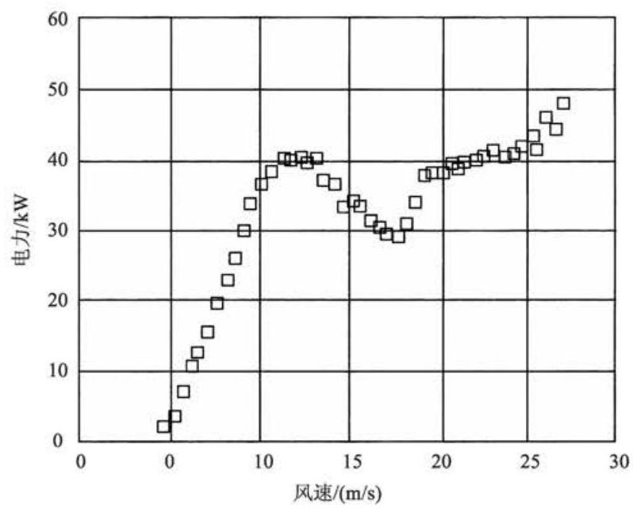

图 3.60 对三叶片失速控制的风力机进行分级测量得到的功率与风速的曲线

风力机的风轮直径为 ${17}\mathrm{\;m}$ ,如果风力机运行在较高的转速下,将产生比上述情况更多的功率。

从图 3.58 中的数据可以得到 ${C}_{\mathrm{P}} - \lambda$ 曲线。叶尖速度为 ${44\pi }{{30}\mathrm{{rad}}}/\mathrm{s} \times  {8.5}\mathrm{\;m} =$ 39.2m/s，扫掠面积为 $\pi  \times  {8.5}^{2} = {227}\left( {\mathrm{\;m}}^{2}\right)$ ，测量的空气密度(由空气压力读数和温度读数构成) 为 ${1.19}\mathrm{\;{kg}}/{\mathrm{m}}^{3}$ 。因此,

$$
\lambda  = \frac{39.2}{\text{ 风速 }},\;{C}_{\mathrm{P}} = \frac{P{\lambda }^{3}}{\frac{1}{2} \times  {1.19} \times  {39.2}^{3} \times  {227}}
$$

机械损耗和电气损耗估计为 ${5.62}\mathrm{\;{kW}}$ ,这个值将用于调整 ${C}_{\mathrm{P}}$ 的测试值。测量结果和理论结果的比较情况如图 3.61 所示。

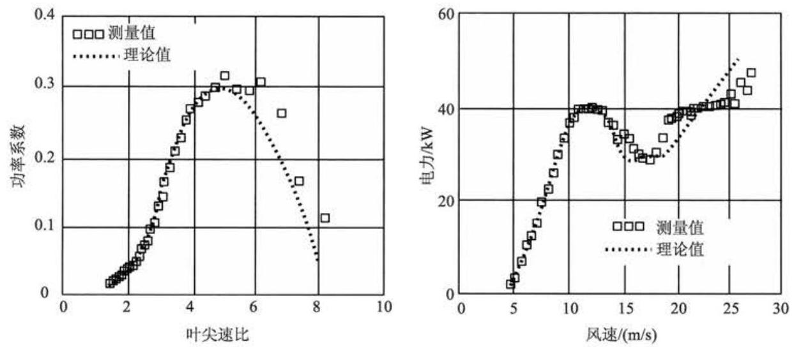

图 3.61 测量特性曲线和理论特性曲线的比较

该比较结果看上去是合理的, 而且表明理论是可靠的, 但是理论估计的质量完全取决于翼型数据的质量。

最后需要指出的是,在完全分析该理论之前,最好还是看原始 $1\mathrm{{min}}$ 的平均数据, 该数据通过分级处理的方法进行简化, 如图 3.62 所示。在失速后的区域, 看上去发生了比简单理论估计更复杂的过程, 这是由非定常空气动力效应引起的。

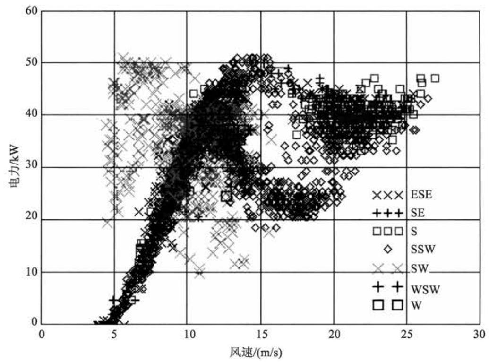

图 3.62 三叶片风力机测量的原始数据

## 3.15 变速运行

如果风轮转速可以连续进行调节,则叶尖速比可以保持在最大 ${C}_{\mathrm{P}}$ 的常值,那么风力机的效率将显著增加。需要主动进行桨距角控制来保持叶尖速比恒定, 但仅限于在调节转速的过程中。为了获得最大的效率, 桨距角总是需要控制在最佳位置。在额定风速以上的运行状态, 当保持转速恒定时也需要进行变桨距控制调节。

## 3.16 捕获能量的估计

风力机所吸收的能量取决于风力机的功率风速特性曲线和该风力机安装地点的风速分布情况。

在某个地点的风速分布可以用威布尔函数表示。风速超过 $U$ 值的概率为

$$
F\left( U\right)  = {\mathrm{e}}^{-{\left( \frac{U}{c}\right) }^{k}} \tag{3.107}
$$

式中, $c$ 为比例因子,是在附近地点的相对于平均风速的特征速度。

$$
c = \frac{\bar{U}}{\Gamma \left( {1 + \frac{1}{k}}\right) } \tag{3.108}
$$

其中, $\Gamma$ 是 Gamma 函数; $k$ 是形状参数。令 $U/\bar{U} = u$ 为归一化的风速,那么风速分布的密度是式 (3.107) 关于 $u$ 求微分的系数:

$$
f\left( u\right)  = k{\left( \frac{\bar{U}}{c}\right) }^{k}{u}^{k - 1}{\mathrm{e}}^{-{\left( \frac{{\bar{U}}_{u}}{c}\right) }^{k}} \tag{3.109}
$$

例如,风速位于 $u$ 和 $\left( {u + {\delta u}}\right)$ 之间的概率为 $f\left( u\right) {\delta u}$ 。

设计的最佳叶尖速比为 7 的风力机，工作特性曲线如图 3.63 所示。

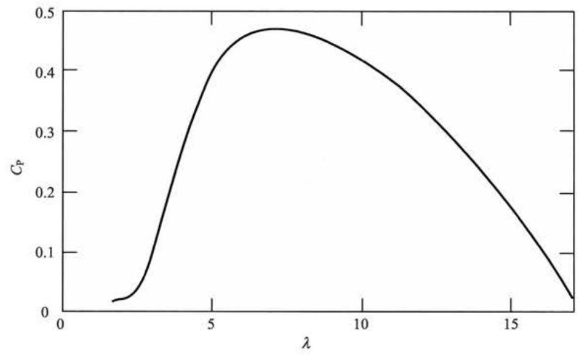

图 3.63 设计的叶尖速比为 7 的风力机 ${C}_{\mathrm{P}} - \lambda$ 曲线

举例来说，假设该风力机是失速控制的，而且在平均风速为 $6\mathrm{\;m}/\mathrm{s}$ 时，威布尔形状因子为 $k = {1.8}$ 的地方以固定的转速运行，那么由式 (3.108) 可得比例因子 $c =$ 6. ${75}\mathrm{m}/\mathrm{s}$ 。

图 3.64 所示为恒转速时失速控制风力机的 ${K}_{\mathrm{P}} - 1/\lambda$ 曲线，观察风力机 ${K}_{\mathrm{P}} - 1/\lambda$ 曲线可以知道,失速 (最大功率) 时叶尖速比是3.7,相应的 ${C}_{\mathrm{P}}$ 值为 0.22。

所需风力机最大的功率为 ${500}\mathrm{\;{kW}}$ ,传动损失为 ${10}\mathrm{\;{kW}}$ ,发电机平均效率为 90%，风力机的有效利用率(当维护和检修时间也考虑在内时，为可以运行的时间) 为 98%。

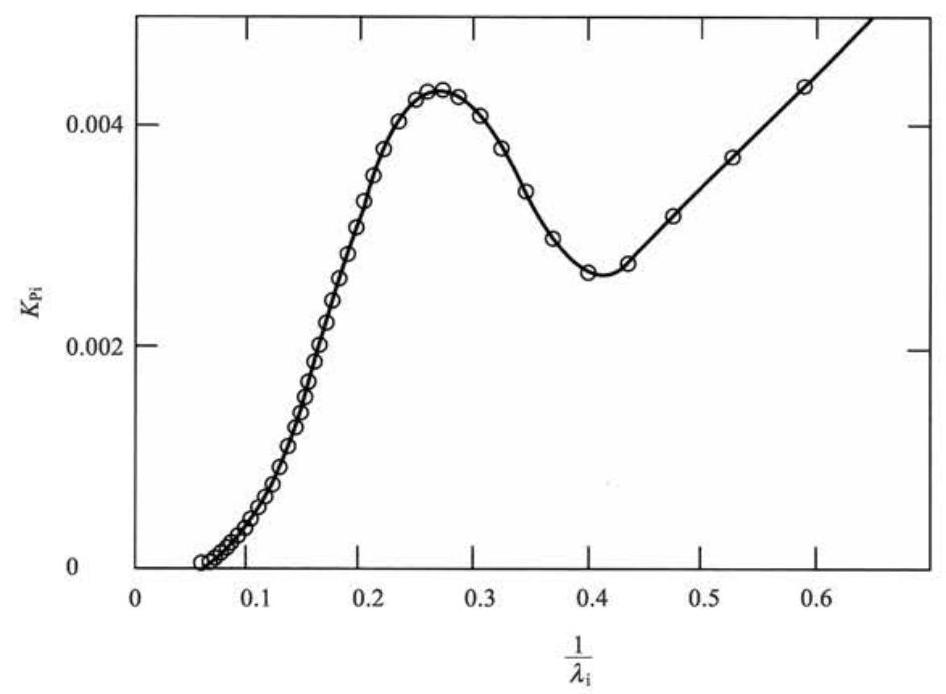

图 3.64 恒转速时失速控制风力机的 ${K}_{\mathrm{P}} - 1/\lambda$ 曲线

那么最大的叶轮输出功率(气动功率) 为

$$
{P}_{\mathrm{s}} = \left( {{500} + {10}}\right) /{0.9} = {567}\left( \mathrm{\;{kW}}\right)
$$

在输出功率最大时，风速达到了 ${13}\mathrm{m}/\mathrm{s}$ ，假设空气密度为 ${1.225}\mathrm{\;{kg}}/{\mathrm{m}}^{3}$ ，因此， 风轮的扫掠面积为

$$
{567000}/\left( {1/2 \times  {1.225} \times  {13}^{3} \times  {0.22}}\right)  = {1.92} \times  {10}^{3}\left( {\mathrm{\;m}}^{2}\right)
$$

即风轮的半径为 ${24.6}\mathrm{\;m}$ 。

风轮的叶尖速度为 ${3.7} \times  {13}\mathrm{\;m}/\mathrm{s} = {48.1}\mathrm{\;m}/\mathrm{s}$ ,所以转速为 ${48.1}/{24.6} = {1.96}$ (rad/s)，也就是 ${1.96} \times  {60}/\left( {2\pi }\right)  = {18.7}\left( {\mathrm{r}/\mathrm{{min}}}\right)$ 。

可以从图 3.64 中得到风力机功率相对于风速的曲线，如图 3.65 所示。

$$
\text{ 功率 (电子) } = \left\lbrack  {{K}_{\mathrm{P}} \times  \frac{1}{2} \times  {1.225}\mathrm{\;{kg}}/{\mathrm{m}}^{3} \times  {\left( {48.1}\mathrm{\;m}/\mathrm{s}\right) }^{3}}\right.
$$

$$
\left. {\times {1.92} \times  {10}^{3}{\mathrm{\;m}}^{2} - {10} \times  {1000}\mathrm{\;W}}\right\rbrack   \times  {0.9}
$$

风速 $= {48.1}\mathrm{\;m}/\mathrm{s}/\lambda$

为了求出风力机在整个时间区间 $T$ 内所吸收的能量，用功率乘以 $f\left( u\right)  \times  T$ [式(3.110)],因为 $f\left( u\right)$ 是时间 $T$ 用在归一化风速 $u$ 的比例

$$
f\left( u\right) {\delta u} = \frac{\delta T}{T} \tag{3.110}
$$

和

$$
{\int }_{0}^{\infty }f\left( u\right) \mathrm{d}u = 1 \tag{3.111}
$$

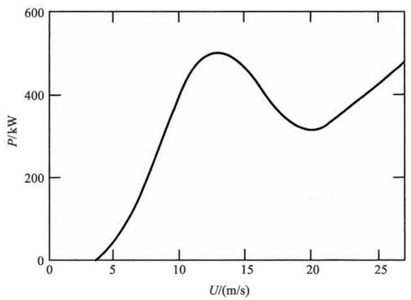

图 3.65 功率与风速的曲线

将功率关于 $u$ (图 3.66) 细分,并且在风力机风速的整个运行范围内积分,得到吸收的能量。

运行的速度范围在切入风速和切出风速之间。切入风速取决于传递的能量损失, 是风力机开始产生能量时的风速。切入风速通常选择为比零功率速度稍微高一点,目前的情况,假定为 $4\mathrm{\;m}/\mathrm{s}$ 。

切出风速的选择是保护风力机避免出现超载，通常大约为 ${25}\mathrm{m}/\mathrm{s}$ 。

在整个时间 $T$ (忽略停机时间) 内吸收的能量为

$$
T{\int }_{\frac{{U}_{\mathrm{{ci}}}}{U}}^{\frac{{U}_{\mathrm{{co}}}}{U}}P\left( u\right) f\left( u\right) \mathrm{d}u = E \tag{3.112}
$$

这就是图 3.66 曲线下方的面积乘以时间周期 $T$ 。但是积分没有一个封闭的数学形式，所以需要数值积分，如梯形法则，或者采用更加精确的辛普森法则。

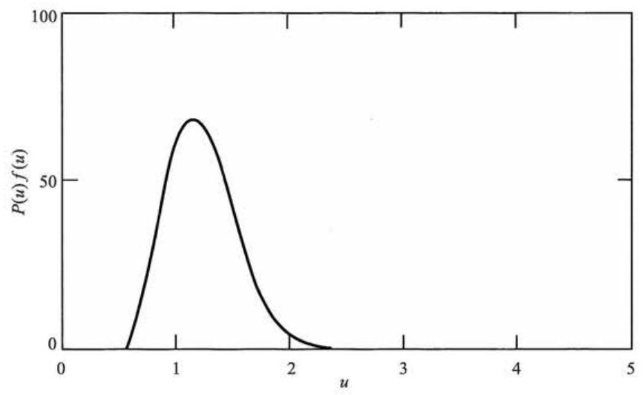

图 3.66 能量吸收的曲线

对于时间周期为一年 $T = {365} \times  {24}\mathrm{\;h}$ ,那么对于图 3.67 中的 10 个数据点,使用梯形法则，吸收的能量为

$$
E = {0.98T}\mathop{\sum }\limits_{{i = 1}}^{9}\left\lbrack  {{P}_{i + 1}f\left( {u}_{i + 1}\right)  + {P}_{i}f\left( {u}_{i}\right) }\right\rbrack  \frac{{U}_{i + 1} - {U}_{i}}{2\bar{U}} \tag{3.113}
$$

其中

$$
E = {4.5413} \times  {10}^{8}\left( {\mathrm{\;{kW}} \cdot  \mathrm{h}}\right)
$$

即使积分上限 ${u}_{\mathrm{{co}}} = {4.17}$ 比图 3.67 中 $u$ 的最大值更大,也可以明显地看出,在这些风速之间，几乎没有能量被吸收。

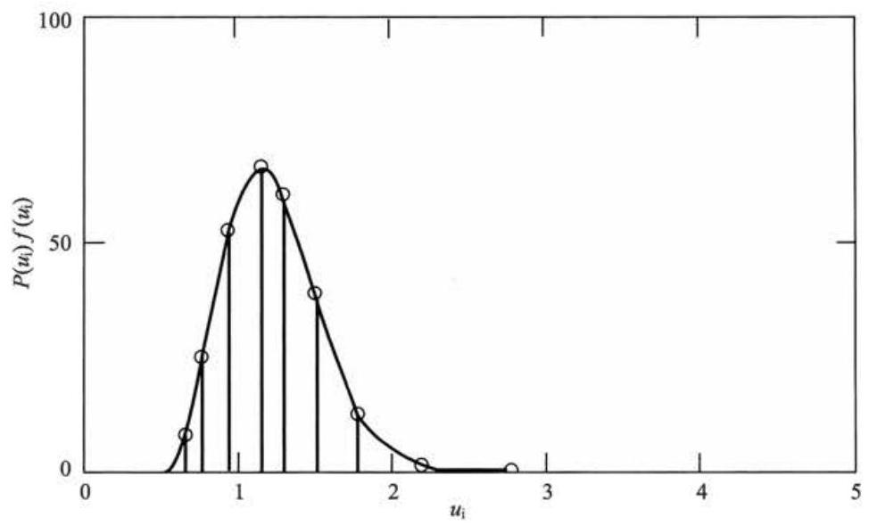

图 3.67 数值积分的能量吸收曲线

变桨控制的风力机能够吸收更多的能量，但是所需要的控制系统价格昂贵，同时可靠性将降低。风力机运行在变速(叶尖速比为常数)的情况下，直到达到吸收最大功率。因此，在恒速、恒功率和桨距角的控制下，如图 3.68 所示，在给定的时间内将吸收最大可能的总能量。

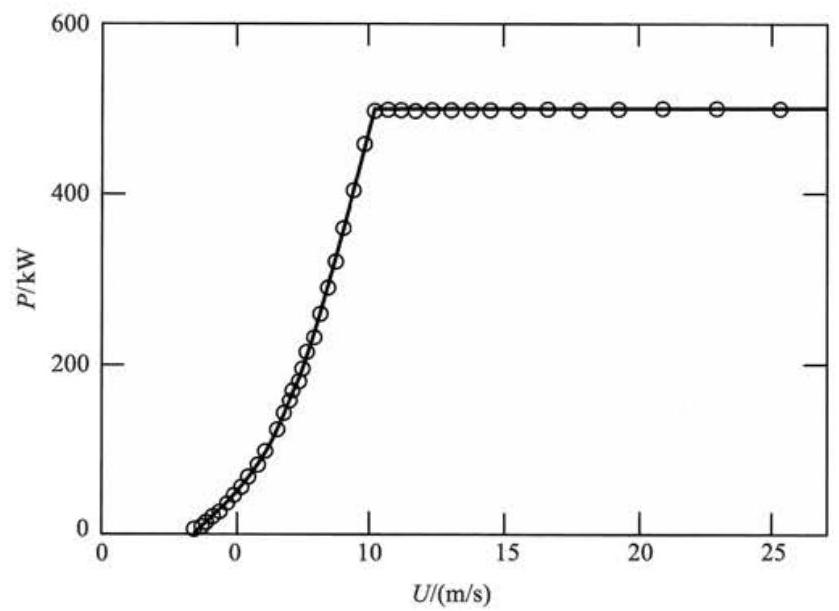

图 3.68 变桨调节风电机组变速下的功率与风速

每年吸收的能量为

$$
E = {4.8138} \times  {10}^{8}\left( {\mathrm{\;{kW}} \cdot  \mathrm{h}}\right)
$$

与恒速、失速控制的风力机相比，能量吸收增加了 $6\%$ 。增加的吸收能量在经济上是否值得是需要讨论的事情。然而, 变速运行还是有许多其他的优势的, 见 6.9.3 节。

## 3.17 风力机空气动力学设计

### 3.17.1 引 言

许多年以来, 风力发电行业都依靠着空气动力学实验来进行风力机叶片的空气动力学设计。现在对于风机翼型设计来说, 空气动力学设计依旧相当重要, 但是对于风力机叶片来说, 这已经不是必需的。

据报道, 20 世纪 70 年代的风力机要定期地用水来对风力机叶片进行清洗，以恢复已经大幅下降的功率等级。因此，需要一种前导边缘能够容忍一定的表面粗糙度的翼型，要求所设计的翼型的性能对粗糙度不敏感。

大多数运行功率在 ${52}\mathrm{\;{kW}}$ 以上的风力机都是恒速运行的，并且依靠被动失速来进行功率控制。大多数空气动力学翼型叶片的失速会造成功率输出的突然大幅降低，并且直到风速提高才得以恢复。失速造成明显的能量捕获损失。因此，要求翼型在失速后的升力变化比较平缓。

目前翼型设计比较流行的范围就是 NACA 六位数字系列, 如 3.9 节讨论过的例子。尽管 NACA 四位数字系列(在附录 A 中有描述)的前导边缘灰尘容忍度要比 NACA 六位数字系列高。NACA 翼型的流行主要归功于在 20 世纪 30 年代 NACA 建造的增压风洞, 使得其有大量的优质的数据可用。NACA 技术报告在 NASA 网站上是免费提供的(表 3.3)。

表 3.3 NACA 翼型的相关数据

<table><tr><td>直径</td><td>类型</td><td>翼型厚度</td><td>主要的</td><td>叶尖</td><td>叶根</td></tr><tr><td>3~10m</td><td>变速变桨距</td><td>厚</td><td>-</td><td>S822</td><td>S823</td></tr><tr><td rowspan="4">10~20m</td><td>变速变桨距</td><td>薄</td><td>S802</td><td>S802</td><td>S804</td></tr><tr><td>失速调节</td><td>薄</td><td>S805</td><td>S806</td><td>S807</td></tr><tr><td></td><td></td><td>S805A</td><td>S806A</td><td>S808</td></tr><tr><td>失速调节</td><td>厚</td><td>S819</td><td>S820</td><td>S821</td></tr></table>

续表 3.3

<table><tr><td>直径</td><td>类型</td><td>翼型厚度</td><td>主要的</td><td>叶尖</td><td>叶根</td></tr><tr><td rowspan="3">20~30m</td><td>失速调节</td><td>厚</td><td>S809</td><td>S810</td><td>S811</td></tr><tr><td>失速调节</td><td>厚</td><td>S812</td><td>S813</td><td>S814</td></tr><tr><td></td><td></td><td></td><td></td><td>S815</td></tr><tr><td rowspan="2">20~40m</td><td>变速变桨距</td><td>-</td><td>S825</td><td>S826</td><td>S814</td></tr><tr><td></td><td></td><td></td><td></td><td>S815</td></tr><tr><td>30~50m</td><td>失速调节</td><td>厚</td><td>S816</td><td>S817</td><td>S818</td></tr><tr><td rowspan="3">40~50m</td><td>失速调节</td><td>厚</td><td>S827</td><td>S828</td><td>S818</td></tr><tr><td>变速变桨距</td><td>厚</td><td>S830</td><td>S831</td><td>S818</td></tr><tr><td></td><td></td><td></td><td>S832</td><td></td></tr></table>

### 3.17.2 NREL 翼型

水平轴风力机专用翼型设计由 NREL(国家可再生能源实验室，前身是太阳能研究协会(SERI)联合翼型设计公司 Tangler、Somers (1995) 合作开启的。从那时起, 设计了 9 组翼型出来满足不同尺寸的风力机的主要要求, 即在前缘表面比较粗糙时仍能拥有比较大的升力系数。

主要设计工具的基础是 Eppler(1990, 1993) 发明了一种求解任意二维黏性流动方法, 包括失速时的气流分离, 并且已经证明是非常成功的。

此外, 一些不同的翼型组也已经设计出来, 像失速调节、变桨距以及变速风力机。

对于失速调节风力机，改进后的滞后失速功率控制是通过叶片外部的翼型设计限制最大升力系数来实现的。相同的翼型具有相对高的厚弦比, 以容纳起高控制设备。

对于变桨距和变速风力机，外部部分翼型有较高的最大升力系数允许低叶片实度。

一般来说，翼型的横截面有较高的厚度与弦长比，结构设计为高刚性及高强度, 同时不造成重量过大, 并且低厚度翼型阻力也会降低。

公布的NREL翼型组年能量捕获提高的排序为 ${23}\%  \sim  {35}\%$ 的失速调节风力机、8%~20%变桨距风力机以及8%~10%变速风力机。失速调节风力机的进展已经在实地测试中得到验证。

NREL 翼型的翼型形状的坐标在位于科罗拉多州的国家风能技术中心 (NWTC)网站上都可以查到,一些翼型测量的翼型数据同样也可查到。但是要想得到那些受限制的翼型信息，需要购买许可证。

NREL 大型叶片翼型资料如图 3.69 所示。

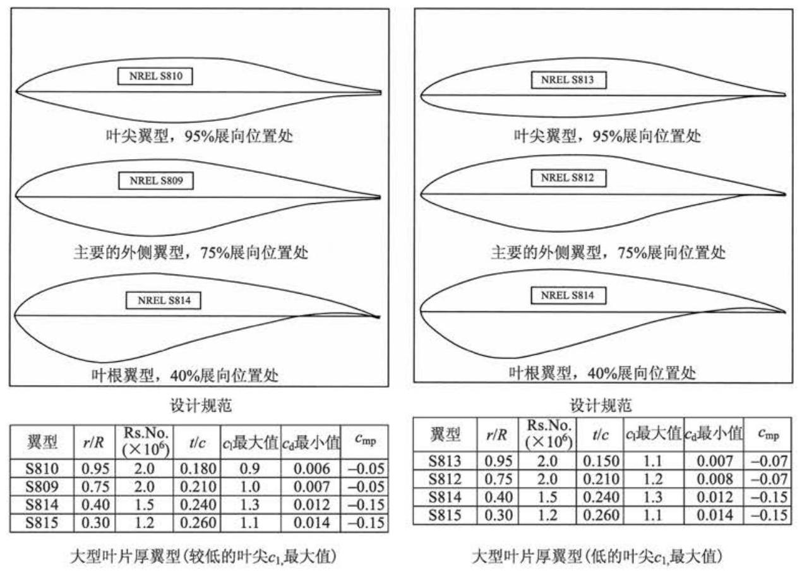

图 3.69 一些 NREL 大型叶片翼型资料

### 3.17.3 Risø 翼型

丹麦 Risø 国家实验室的 Fugslang 和 Bak(2004) 也为风力机设计了翼型族，与 NREL 系列类似。尽管两个实验室的空气动力学设计技术不同，但两者的实际设计相差并不大。

Risø 翼型的设计工具是由 Drela 开发的 X-FOIL 代码, 是在 Eppler(1990, 1993) 的工作和丹麦科技大学 Sørensen(1995)开发的 Ellipsys-2D CFD 代码的发展而来。

Risø 已经发展了三种翼型组:Risø-A、Risø-P、Risø-B，如表 3.4 ~ 表 3.6 所示。 Risø-A 组如图 3.70 和表 3.4 所示, 是 20 世纪 90 年代设计的并且针对所有的失速型风力机，然而，在实地测试中其表面粗糙的敏感程度要比预期的要高。Risø-A 组翼型剖面在图 3.70 中展示。

表 3.4 Risø-A 组的主要特点

<table><tr><td>翼型</td><td>(t/c)/% 最大值</td><td>$x/c \; t/c$</td><td>$y/c$ T. E.</td><td>${Re} \times  {10}^{-6}$</td><td>$\alpha /\left( {}^{ \circ  }\right)$</td><td>${c}_{1}$ 最大值</td><td>$\alpha$ 设计值</td><td>${C}_{1}$ 设计值</td><td>${C}_{1}/{c}_{\mathrm{d}}$ 最大值</td></tr><tr><td>Riso-A1-15</td><td>15</td><td>0.325</td><td>0.0025</td><td>3.00</td><td>-4.0</td><td>1.50</td><td>6.0</td><td>1.13</td><td>168</td></tr><tr><td>Riso-A1-18</td><td>18</td><td>0.336</td><td>0.0025</td><td>3.00</td><td>-3.6</td><td>1.53</td><td>6.0</td><td>1.15</td><td>167</td></tr><tr><td>Riso-A1-21</td><td>21</td><td>0.298</td><td>0.005</td><td>3.00</td><td>-3.3</td><td>1.45</td><td>7.0</td><td>1.15</td><td>161</td></tr></table>

续表 3.4

<table><tr><td>翼型</td><td>(t/c)/% 最大值</td><td>$x/c \; t/c$</td><td>y/c T. E.</td><td>${Re} \times  {10}^{-6}$</td><td>$\alpha /\left( {}^{ \circ  }\right)$</td><td>${c}_{1}$ 最大值</td><td>$\alpha$ 设计值</td><td>${C}_{1}$ 设计值</td><td>${C}_{1}/{c}_{\mathrm{d}}$ 最大值</td></tr><tr><td>Riso-A1-24</td><td>24</td><td>0.302</td><td>0.01</td><td>2.75</td><td>-3.4</td><td>1.48</td><td>7.0</td><td>1.19</td><td>157</td></tr><tr><td>Riso-A1-27</td><td>27</td><td>0.303</td><td>0.01</td><td>2.75</td><td>-3.2</td><td>1.44</td><td>7.0</td><td>1.15</td><td>N/A</td></tr><tr><td>Riso-A1-30</td><td>30</td><td>0.300</td><td>0.01</td><td>2.50</td><td>-2.7</td><td>1.35</td><td>7.0</td><td>1.05</td><td>N/A</td></tr><tr><td>Risø-A1-33</td><td>30</td><td>0.304</td><td>0.01</td><td>2.50</td><td>-1.6</td><td>1.20</td><td>7.0</td><td>0.93</td><td>N/A</td></tr></table>

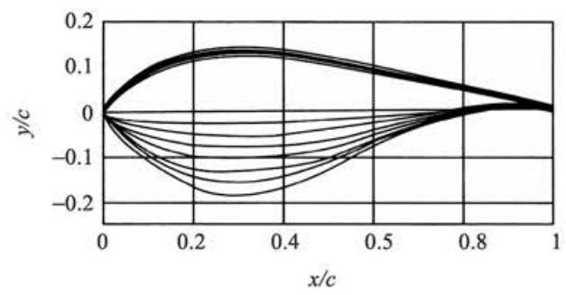

图 3.70 Risø-A 组的翼型剖面

Risø-P 组只有 4 种翼型, 如图 3.71 和表 3.5 所示, 设计目的是为了取代 Risø- A 系列中相应的情况用于变速变桨风力机上。该翼型族剖面如图 3.71 所示。

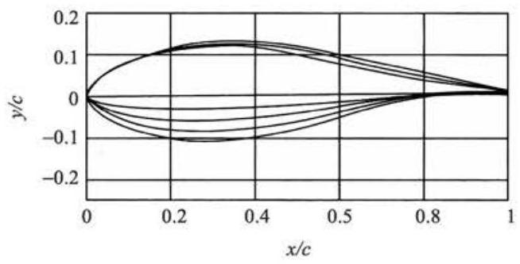

图 3.71 Risø-P 组的翼型剖面

表 3.5 Risø-P 组的主要特点

<table><tr><td>翼型</td><td>(t/c)/% 最大值</td><td>$x/c \; t/c$</td><td>$y/c$ T. E.</td><td>${Re} \times  {10}^{-6}$</td><td>$a/\left( {}^{ \circ  }\right)$</td><td>${c}_{1}$ 最大值</td><td>$\alpha$ 设计值</td><td>${C}_{\mathrm{i}}$ 设计值</td><td>${C}_{1}/{c}_{\mathrm{d}}$ 最大值</td></tr><tr><td>Risø-P-15</td><td>15</td><td>0.328</td><td>0.0025</td><td>3.00</td><td>-3.5</td><td>1.49</td><td>6.0</td><td>1.12</td><td>173</td></tr><tr><td>Risø-P-18</td><td>18</td><td>0.328</td><td>0.0025</td><td>3.00</td><td>-3.7</td><td>1.50</td><td>6.0</td><td>1.15</td><td>170</td></tr><tr><td>Risø-P-21</td><td>21</td><td>0.323</td><td>0.005</td><td>3.00</td><td>-3.5</td><td>1.48</td><td>6.0</td><td>1.14</td><td>159</td></tr><tr><td>Risø-P-24</td><td>24</td><td>0.320</td><td>0.01</td><td>2.75</td><td>-3.7</td><td>1.48</td><td>6.0</td><td>1.17</td><td>156</td></tr></table>

Risø-B 组设计为 6 种独立的翼型，扩大了相对厚度范围，由 15%扩大到 36%， 如图 3.72 和表 3.6 所示。该组翼型一般来说有很高的最大升力系数，用于低实度的兆瓦级、变速变桨控制的柔性叶片上。Riso-B 组翼型概况如图 3.72 所示。

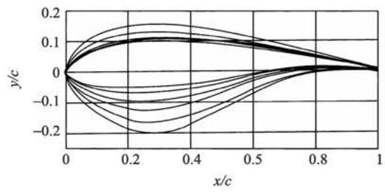

图 3.72 Risø-B 组的翼型剖面

表 3.6 Risø-B 组的主要特点

<table><tr><td>翼型</td><td>(t/c)/% 最大值</td><td>$x/c \; t/c$</td><td>$y/c$ T. E.</td><td>${Re} \times  {10}^{-6}$</td><td>$\alpha /\left( {}^{ \circ  }\right)$</td><td>${c}_{1}$ 最大值</td><td>$\alpha$ 设计值</td><td>${C}_{\mathrm{i}}$ 设计值</td><td>${C}_{1}/{c}_{\mathrm{d}}$ 最大值</td></tr><tr><td>Riso-B1-15</td><td>15</td><td>0.278</td><td>0.006</td><td>6.00</td><td>-4.1</td><td>1.92</td><td>6.0</td><td>1.21</td><td>157</td></tr><tr><td>Riso-B1-18</td><td>18</td><td>0.279</td><td>0.004</td><td>6.00</td><td>-4.0</td><td>1.87</td><td>6.0</td><td>1.19</td><td>166</td></tr><tr><td>Riso-B1-21</td><td>21</td><td>0.278</td><td>0.005</td><td>6.00</td><td>-3.6</td><td>1.83</td><td>6.0</td><td>1.16</td><td>139</td></tr><tr><td>Risø-B1-24</td><td>24</td><td>0.270</td><td>0.007</td><td>6.00</td><td>-3.1</td><td>1.76</td><td>6.0</td><td>1.15</td><td>120</td></tr><tr><td>Risø-B1-30</td><td>30</td><td>0.270</td><td>0.01</td><td>6.00</td><td>-2.1</td><td>1.61</td><td>5.0</td><td>0.90</td><td>N/A</td></tr><tr><td>Riso-B1-36</td><td>36</td><td>0.270</td><td>0.012</td><td>6.00</td><td>-1.3</td><td>1.15</td><td>5.0</td><td>0.90</td><td>N/A</td></tr></table>

在表 3.4 一表 3.7 中,“ ${C}_{1}$ 设计值”是指最大升阻比时升力系数值。Risø 组翼型的设计特点就是 ${C}_{1}$ 设计值高,所以叶片在低实度下更有效率。

### 3.17.4 Delft 翼型

荷兰的 Delft 科技大学也开展了风力机叶片的翼型研究 (Timmer and van Rooij,2003), 如图 3.73 和表 3.7 所示。像 NREL 和 Risø 翼型一样, 该设计的主要特点是粗糙敏感度, 但侧重点在于追求厚翼型来获取结构优势。Delft 科技大学翼型系列组剖面如图 3.73 所示。

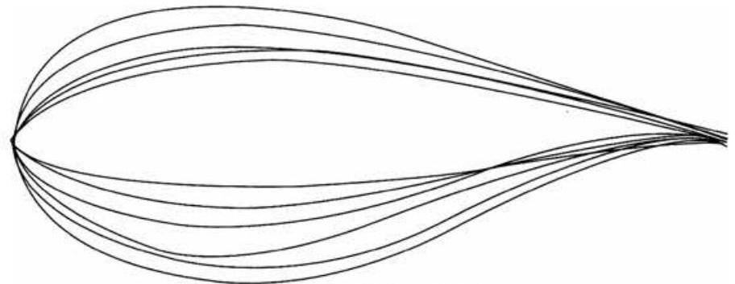

图 3.73 Delft 科技大学翼型剖面

表 3.7 Delft 科技大学翼型的主要特点

<table><tr><td>翼型</td><td>(t/c)/% 最大值</td><td>$x/c \; t/c$</td><td>y/c T. E.</td><td>${Re} \times  {10}^{-6}$</td><td>$\alpha /\left( {}^{ \circ  }\right)$</td><td>${c}_{1}$ 最大值</td><td>$\alpha$ 设计值</td><td>${C}_{1}$ 设计值</td><td>${C}_{1}/{c}_{\mathrm{d}}$ 最大值</td></tr><tr><td>DU 96-W-180</td><td>18</td><td>0.3</td><td>0.0018</td><td>3.00</td><td>-2.7</td><td>1.26</td><td>6.59</td><td>1.07</td><td>145</td></tr><tr><td>DU 00-W-212</td><td>21.2</td><td>0.3</td><td>0.0023</td><td>3.00</td><td>-2.7</td><td>1.29</td><td>6.5</td><td>1.06</td><td>132</td></tr><tr><td>DU 91-W2-250</td><td>25</td><td>0.3</td><td>0.0054</td><td>3.00</td><td>-3.2</td><td>1.37</td><td>6.68</td><td>1.24</td><td>137</td></tr><tr><td>DU 97-W-300</td><td>30</td><td>0.3</td><td>0.0048</td><td>3.00</td><td>-2.2</td><td>1.56</td><td>9.3</td><td>1.39</td><td>98</td></tr><tr><td>DU 00-W-350</td><td>35</td><td>0.3</td><td>0.01</td><td>3.00</td><td>-2.0</td><td>1.39</td><td>7.0</td><td>1.13</td><td>81</td></tr><tr><td>OU 00-W-401</td><td>40.1</td><td>0.3</td><td>0.01</td><td>3.00</td><td>-3.0</td><td>1.04</td><td>5.0</td><td>0.82</td><td>54</td></tr></table>

Delft 翼型的设计工具是 R-FOIL 代码, Delft 对 X-FOIL 代码针对失速延迟进行了改进。

两种最厚的翼型还没有进行风洞测试，但是特性已经通过计算确定了。

## 参考文献

Betz, A. (1919) Schraubenpropeller mit geringstem Energieverlust. Gottinger Nachrichten, Delft.

Drela, M. (1989) X-Foil: An Analysis and Design System for low Reynolds Number Airfoils. Low Reynolds Number Aerodynamics, Vol. 54 (1989), Springer-Verlag Lecture Notes in Engineering. Springer-Verlag, Godalming.

Eppler, R. (1990) Airfoil Design and Data. Springer-Verlag, Berlin.

Eppler, R. (1993) Airfoil Program System. User's Guide. Eppler, R. Airfoil Program System, User's Guide; Institut A fuer Mechanik, Universitaet Stuttgart (1988).

Fugslang, P. and Bak, C. (2004) Development of the Risø Wind Turbine Airfoils. Wind Energy, 7, 145-162.

Glauert, H. (1926) The Analysis of Experimental Results in the Windmill Brake and Vortex Ring States of an Airscrew., ARCR R&M No. 1026.

Glauert, H. (1935a) Airplane Propellers. In: Aerodynamic Theory, (ed. W.F. Durand), Vol. 4, Division L, pp. 169-360. Julius Springer, Berlin.

Glauert, H. (1935b) Windmills and Fans. In: Aerodynamic Theory, (ed. W.F. Durand), Vol. 4, Division L, pp. 169-360. Julius Springer, Berlin.

Goldstein, S. (1929) On the Vortex Theory of Screw Propeller. Royal Society Proceedings (A) 123, p. 440.

Himmelskamp, H. (1945) Profile investigations on a rotating airscrew. PhD thesis, University of Göttingen.

Hoerner, S.F. (1965) Pressure drag on rotating bodies. In: Fluid-Dynamic Drag (S.F. Hoerner) pp. 3-13, 14.S.F Hoerner, New Jersey.

Lanchester, F.W. (1915) A Contribution to the Theory of Propulsion and the Screw Propeller, Transactions of the Institution of Naval Architects, 57, 98.

Lock, C.N.H. (1924) Experiments to Verify the Independence of the Elements of an Airscrew Blade, ARCR R&M, No. 953.

Ronsten, G. (1991) Static pressure measurements in a rotating and a non-rotating 2.35 m wind turbine blade. Comparison with 2D calculations. Proceedings of the EWEC '91 conference, Amsterdam.

Snel, H., Houwink, R., Bousschers, Piers, W.J., van Bussel, G.J.W. and Bruining, A. (1993) Sectional Prediction of 3-D Effects for Stalled Flow on Rotating Blades and Comparison with Measurements. Proceedings of the EWEC '93 conference, Lübeck-Travemunde.

Sørensen, N.N. (1995) General Purpose Flow Solver Applied to Flow over Hills, Risø-R-827(EN). Risø National Laboratory, Denmark.

Tangler, J.L. and Somers, D.M. (1995) NREL Airfoil Families for HAWTs. AWEA '95. Washington, D.C.

Timmer, W.A. and van Rooij, R.P.J.O.M. (2003) Summary of the Delft University Wind Turbine Dedicated Airfoils. Journal of Solar Energy Engineering, 125, 488-496.

Wilson, R.E. and Lissaman, P.B.S. (1974) Applied Aerodynamics of Wind Power-Machines. NTIS: PB-238-595. Oregon State University, Oregon.

Wood, D.H. (1991) A three-dimensional analysis of stall-delay on a horizontal-axis wind turbine. Journal of Wind Engineering and Industrial Aerodynamics, 37, 1-14.

Young, A.D. and Squire, H.B. (1938) The Calculation of the Profile Drag of Aerofoils. R. & M. NO. 1838, British A.R.C., 1938.

http://www.nrel.gov/wind/

http://www.nrel.gov/wind/publications.html

https://wind.nrel.gov/airfoils/Shapes/S809_Shape.html.

http://www.windpower.org/en/

http://www.lr.tudelft.nl/live/pagina.jsp?id=9e2f503f-3b65-44bc-aba4-a30033400ea7&lang=en

Duncan, W.J., Thom, A.S. and Young, A.D. (1970) Mechanics of Fluids, 2nd edition. Edward Arnold, London.

Barnard, R.H. and Philpott, D.R. (1989) Aircraft Flight. A description of the physical principles of aircraft flight. Longman, Singapore.

Anderson, J.D. (1991) Fundamentals of Aerodynamics, 2"d edition. McGraw-Hill, Singapore.

Prandtl, L. and Tietjens, O.G. (1957) Applied Hydro- and Aeromechanics. Dover, New York.

Katz, J. and Plotkin, A. (1991) Low Speed Aerodynamics. From wing theory to panel methods. McGraw-Hill, Singapore.

Abbott, I.H. and von Doenhoff, A.E. (1959) Theory of Wing Sections. Dover, New York.

Stepniewski, W.Z. and Keys, C.N. (1984) Rotary-Wing Aerodynamics. Dover, New York.

Johnson, W. (1980) Helicopter Theory. Dover, New York.

Fung, Y.C. (1969) An Introduction to the Theory of Aeroelasticity. Dover, New York.

Eggleston, D.M. and Stoddard, F.S. (1987) Wind Turbine Engineering Design. Van Nostrand Reinhold Co., New York.

Manwell, J.F., McGowan, J.G. and Rogers, A.L. (2002) Wind Energy Explained. John Wiley & Sons Ltd., Chichester.

Hansen, M.O.L. (2000) Aerodynamics of Wind Turbines. James & James, London.

## 附录 A 翼型的升力和阻力

当物体浸没在流动的流体中时, 物体所受的力可以分解为流动方向的力 (阻力) 和法线方向的力 (升力)。忽略掉浮力, 产生升力和阻力的与贴近物面缓慢流动的边界层有着密切联系。流体在物体表面所产生的力既有物体表面平行方向的力 (黏性力或摩擦力), 也有物体表面法线方向的力(压力)。要深入地理解升力和阻力现象，可查阅空气动力教科书。

### A.1 阻力定义

浸入流体中的物体的阻力定义为作用在物体上的与流动方向平行的力。在非常慢速的流体中, 这种物体表面的阻力是由流体的黏性摩擦剪应力直接引起的, 因为事实上, 在物体的壁上并没有相对运动产生。这种流体被称为斯托克斯流, 其得名于乔治·斯托克斯先生。

在斯托克斯之前的两个世纪，艾萨克·牛顿就已经揭示了:边界壁上的，或者说,是相对运动的两层流体之间的剪应力 $t$ 与横剖面速度的梯度成正比,在两层流体之间有

$$
\tau  = \mu \frac{\mathrm{d}u}{\mathrm{\;d}y} \tag{A. 1}
$$

式中,比例常数 $\mu$ 是流体黏度。

根据牛顿的理论,斯托克斯确定了蠕动流在球体表面的阻力 (图 A. 1)。

---

$$
\text{ Drag } = {3\pi \mu Ud}
$$

---

(A. 2)

式中, $d$ 为球体直径; $U$ 为广义的流体速度。

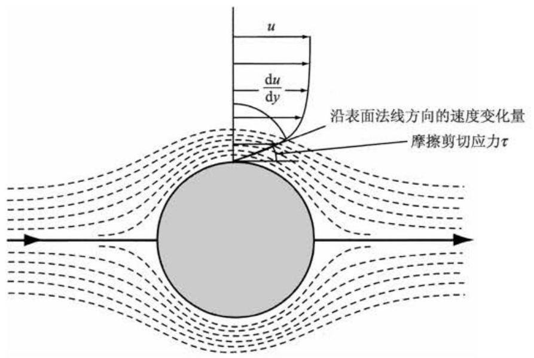

图 A. 1 蠕动流流过圆柱体的情况

无黏性流流过圆柱体时的流谱(图 A. 2)和蠕动流中的情况十分相似，但实际上，这两种流的性质还是有很大差异的。根据定义，无黏性流不产生黏性阻力，同时也不会产生压差阻力。也就是说, 压力分布于整个圆柱表面, 并且其合力为零。 无黏性流流过圆柱体时的压力分布如图 A. 3 所示，其中的表面压力都已经减去了大气压力 ${p}_{\infty }$ 。由于圆柱前部和后部的压力分布是对称的，所以很明显，其不会产生任何阻力。在物体的头部，流体都停滞住了，这点被称为驻点。另一个驻点在物体的背面。

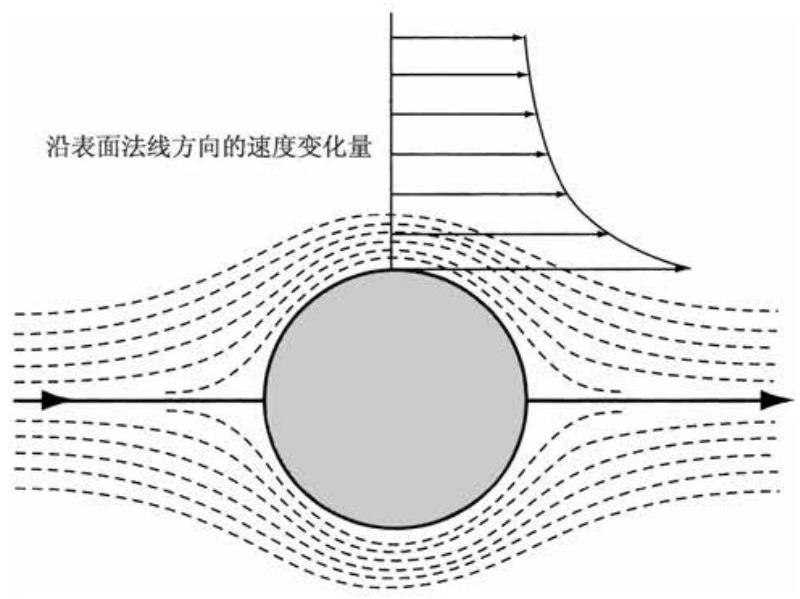

图 A. 2 无黏性流流过圆柱体时的情况

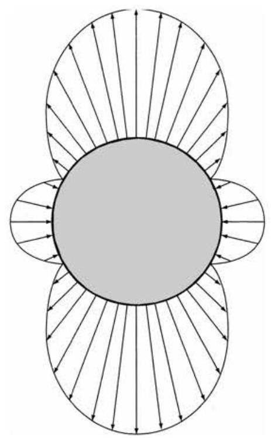

图 A. 3 无黏性流在圆柱体周围的压力分布

在实际的流体中, 当黏度比较小且速度相对较大时, 存在的阻力主要是由于物体前部和后部压力分布 (图 A. 4) 的不对称造成的。这实际上是由于流体流过物体时并没有沿物体表面流动，而是脱离了物体表面从而形成了一个低压的、停滞的尾流 (图 A. 5)。

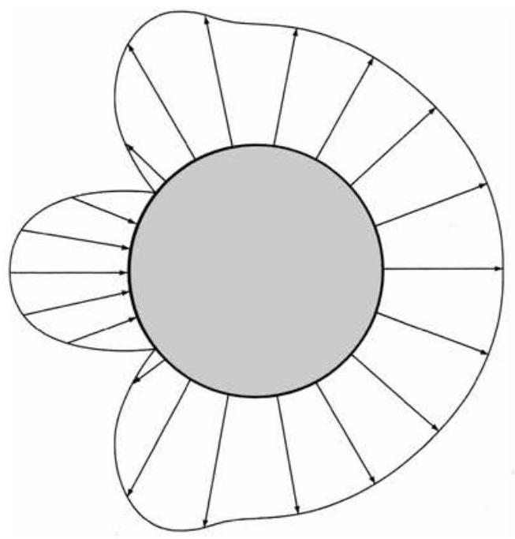

图 A. 4 分离流体在圆柱体周围的压力分布

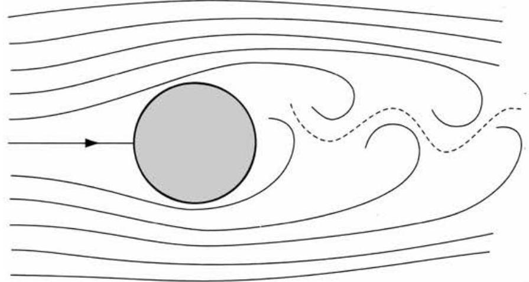

图 A. 5 流体在圆柱体周围的分离模式

### A.2 阻力系数

如果把式(A. 2)重新整理为球面的斯托克斯方程，则

$$
\text{ Drag } = {3\pi \mu Ud} = \left\lbrack  {{24}\left( \frac{\mu }{\rho Ud}\right) }\right\rbrack  \left( {\frac{1}{2}\rho {U}^{2}}\right) \left( \frac{\pi {\mathrm{d}}^{2}}{4}\right) \tag{A. 3}
$$

这样一来，该式便具有了标准的形式:阻力系数 $\left( {C}_{\mathrm{D}}\right)$ 关动压 $\left( {1/{2\rho }{U}^{2}}\right)$ 关横截面积 $A$ 。阻力系数定义为

$$
{C}_{\mathrm{D}} = \frac{\text{ Drag }}{\frac{1}{2}\rho {U}^{2}A} \tag{A. 4}
$$

请注意: ${\rho Ud}/\mu$ 就是所谓的雷诺数,表示作用在单位体积流体上的惯性力的比率。当这些小体积元都在压力梯度的作用下产生加速运动时, 阻碍着流体运动黏性力, 也作用在这流体的体积元上。雷诺数较高, 流体黏性力就小; 雷诺数低, 黏性就大。式 (A.3) 中的阻力系数项是 ${C}_{\mathrm{D}} = {24}/{Re}$ ,显然,它仅是雷诺数的函数,这个结论对于所有在不可压缩流中的物体都成立,但其中的函数关系并不是都如同上述的那样简单。总的说来,我们可以说 ${C}_{\mathrm{D}}$ 随着雷诺数的增加而降低。

### A.3 边界层

雷诺数较高的流体会产生分离流, 其原因是在物体表面附近存在着一薄层由低流速流体组成的边界层, 在这个边界层中, 黏性力起着主要的作用。如图 A. 6 所示, 在这个边界层之外, 流体基本上表现为无黏性流。直接由黏性所产生的作用于物体的阻力非常小,但是它对于流体的流动方式有很大的影响。

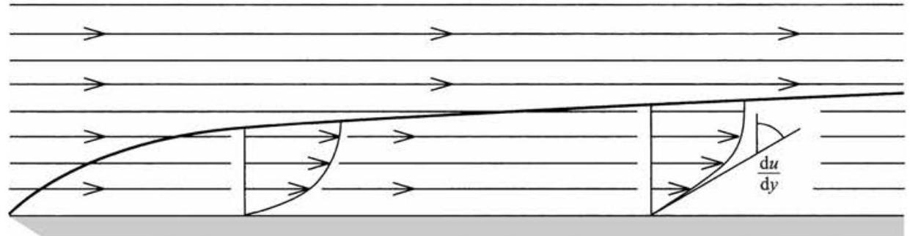

图 A. 6 边界层显示的速度剖面

作用于翼型上的阻力来自于压力和黏性力两个方面，因此，其阻力系数将随着攻角和雷诺数发生显著的变化。

### A.4 边界层的分离

由图 A. 3 可知，无黏性流中圆柱体周围的压力分布如下:前、后部压力高，上、 下部压力低。下游侧的流体流速逐渐下降，形成了反向的压力梯度，在壁边界上， 流体逐渐减速到后驻点处停止。

在实际的流体中, 由于黏性力的作用, 减速的边界层 (图 A. 6) 在到达后驻点之前就已经停滞了。之后, 流体在反向压力的作用下开始进行反向流动。在这一点上，压力仍然很低，边界层在物体的表面产生分离，并形成一个停滞的、低压的尾流区(图 A.7)，因此，压力分布显著改变了(图 A.5)。前部停滞点及其周围的高压区域不可能再被后部的高压区域所平衡, 因而出现了一个沿阻力方向的压力。

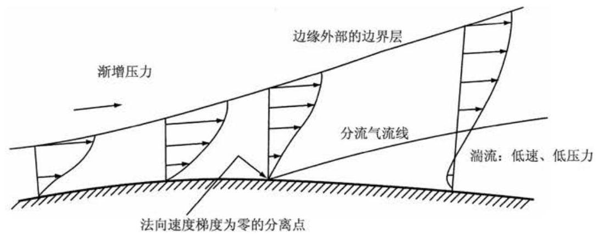

图 A. 7 边界层的分离

### A.5 层流和湍流边界层

从前驻点 (或前缘) 开始, 边界层的厚度变得越来越大。起初, 边界层中的流体有序且平顺 (分层) 地流动,但是在距离驻点的临界距离 $l$ (以 $R{e}_{\text{ crit }} = \frac{\rho Ul}{\mu }$ 来表征) 处,流体变成了湍流 (图 A.8)。这种湍流引起了边界层内与其外侧速度较高的流体混合，而获得了能量，从而使分离点后移，减小了后部低压分离区，其结果是减小了压差阻力; 另一个结果是增大了黏性 (摩擦) 阻力, 因为物体表面的速度梯度增大且边界层的厚度也增大。

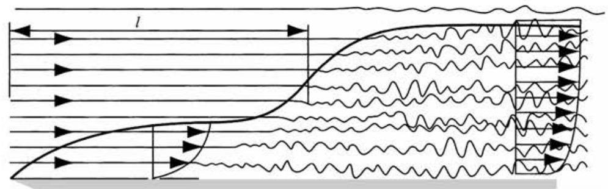

图 A. 8 层流和湍流的边界层

因此，阻力系数随着 ${Re}$ 产生了复杂的变化 (图 A. 9)。对于低速流体中的较小物体来说，临界雷诺数 ${Re}$ 不可能达到，因而分离发生较早。对于大的物体或流速较高的情况，湍流很快就被建立起来，并且分离也被延迟。

湍流可以通过人工的方式产生，如增大物体表面粗糙度或更简单地利用 “绊线”。一般来说，湍流将在表征雷诺数低于临界值时产生湍流边界层，这一现象在风力机叶片中应该是时有发生的。尖锐的物体边界必定会产生分离。对于垂直放入流体中的宽平板 (图 A. 10),其边界层在尖锐的物体表面产生分离,此时 ${C}_{\mathrm{D}}$ 几乎和 ${Re}$ 无关，但是其却与平板的纵横比有关。

对于翼型这样的一些所谓的流线型的物体, 其后部的形状从前到后逐渐变细, 因此，其反压力梯度非常小，并且分离被延迟到直到后缘附近时才出现。于是便产

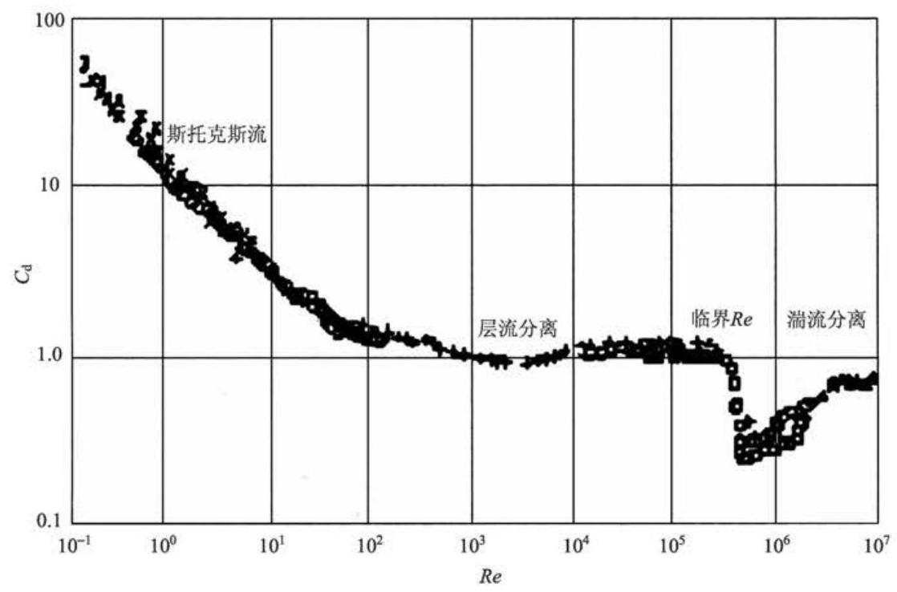

图 A. 9 对长圆柱体， ${C}_{\mathrm{D}}$ 随着 ${Re}$ 的变化情况

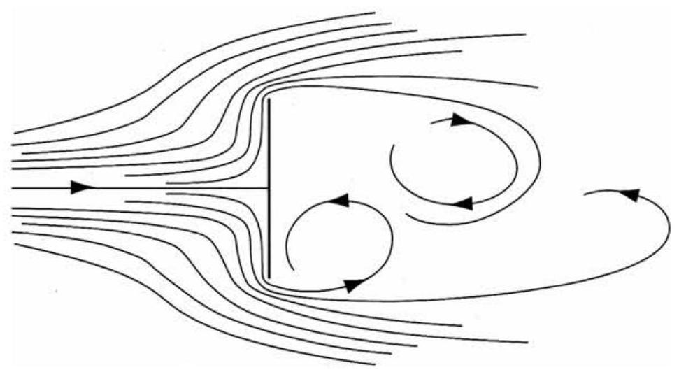

图 A. 10 流过平板的气流的分离情况

生了非常狭窄的尾流, 因此, 阻力非常小, 因为它的阻力大部分是由表面摩擦产生的, 而不是由压力产生的 (图 A. 11)。

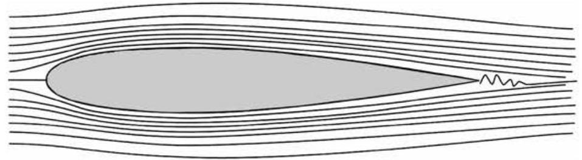

图 A. 11 绕流线体的流动

### A.6 升力定义及其与环流的关系

浸入流体中的物体的升力定义为作用于物体上与流动方向垂直的力。

只有在绕物体的流动中有环流的情况下, 升力才会出现, 就像旋转的圆柱体周围产生的那种环流一样。如果流过圆柱体的流体同时具有均匀的速度 $U$ ,其合成的流场情况如图 A. 12 所示。圆柱体上部的速度增大, 因而其静压会降低。相反, 其下部的流体速度减小，使静压增大。很明显，这样将在圆柱体上产生一个向上的力，即升力。

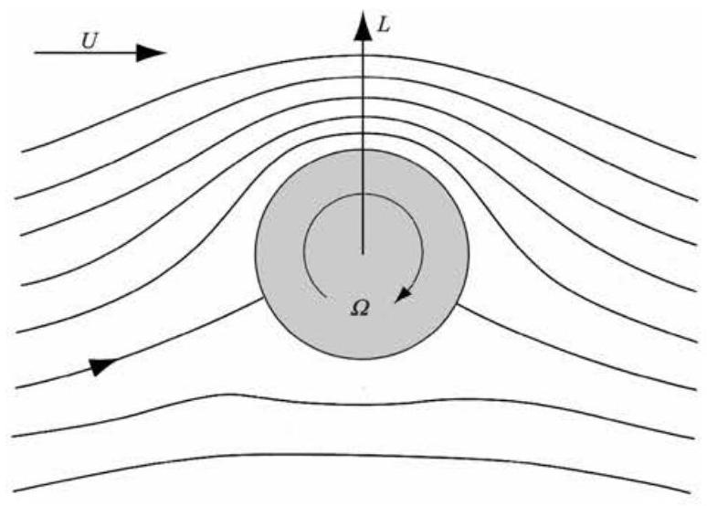

图 A. 12 流过旋转圆柱体的气流分布

此现象以其发现者的名字命名，称为 Magnus 效应，它解释了诸如旋转的网球在飞行中怎样变向的问题。图 A. 13 所示的环流是由表面摩擦力产生的，它和涡流具有相同的结构。

升力可以由库塔-儒科夫斯基定理求出, 库塔和儒科夫斯基这两位空气动力学的先锋各自独立地认识到这是理解升力现象的关键之处。

$$
L = \rho \left( {\Gamma  \times  U}\right) \tag{A. 5}
$$

式中, $\Gamma$ 为围绕圆柱体的环量或旋涡强度,定义为包含圆柱体的闭合路径的积分

$$
\Gamma  = \oint v\mathrm{\;d}s \tag{A. 6}
$$

式中, $v$ 是速度沿路径 $s$ 切线方向的速度。为求简便,我们选取包围圆柱体半径为 $r$ 的圆形路径,不考虑来流 $U$ ,可得 $v = k/r$ ,其中 $k$ 是常数。在圆柱体表面有 $r = R$ , 所以 ${v}_{\mathrm{R}} = {\Omega R} = k/R$ ,进而有 $k = \Omega {R}^{2}$ 。

环量 $\Gamma$ ,任何包含圆柱体的闭合路径的值都相同,通过下式求得

$$
\Gamma  = \oint \frac{\Omega {R}^{2}}{r}\mathrm{\;d}s = {\int }_{0}^{2\pi }\Omega {R}^{2}\mathrm{\;d}\theta  = {2\pi \Omega }{R}^{2} \tag{A. 7}
$$

想要在不旋转的物体上产生环流, 必须要有和翼型的横剖面或平板一样尖锐的后缘。由于翼型具有尖锐的后缘, 它和旋转圆柱体一样以同样的方式产生环流。

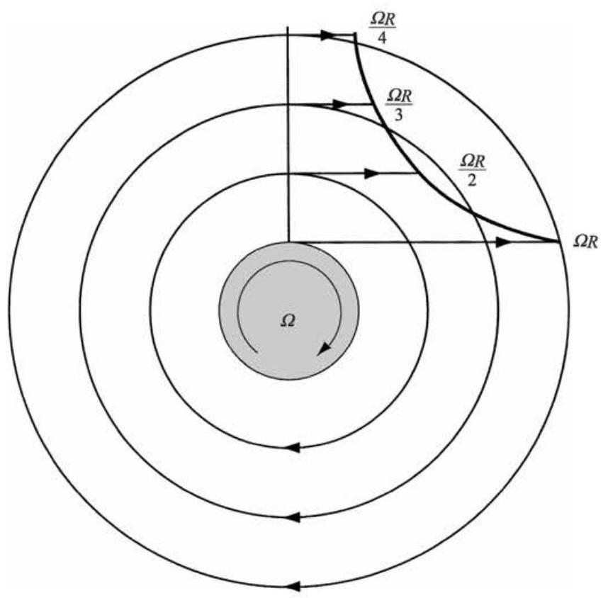

图 A. 13 旋转圆柱体周围的气体环流

考虑气流以一个很小的攻角 $\alpha$ 流向翼型，当无黏性流流过翼型时，其上边沿不会形成边界层, 其流谱如图 A. 14(a) 所示。对于无黏性的流体, 从理论上来说, 是不会在翼型上产生任何力的。

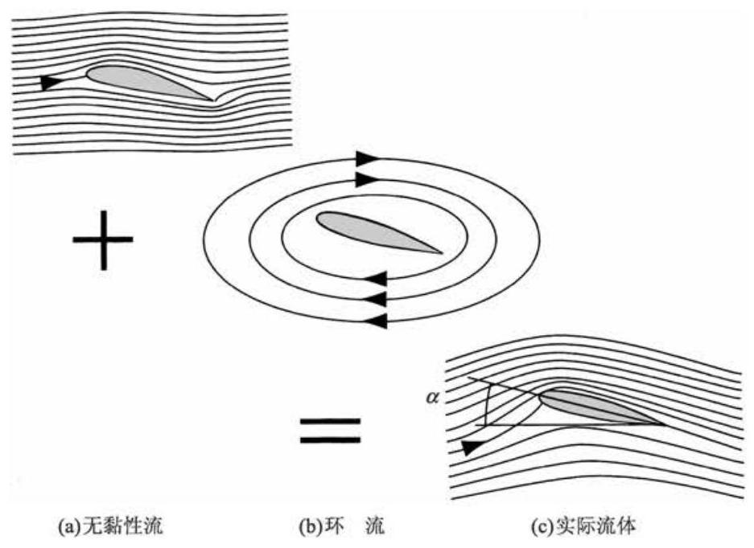

图 A. 14 在攻角很小的时候, 流过翼型的气流情况

对于实际的流体[图 A. 14(c)]，边界层的分离在尖锐的后缘产生，使流体平顺地流过边缘。这种分离不会留下任何低压的尾流，所以流体在其他的所有区域内仍然附着在翼型上，流体的流动状况发生了变化，形成了一个绕翼型的环量[图 A. ${14}\left( \mathrm{\;b}\right) \rbrack$ ,它使翼型上方的流体速度增大而下方的流体速度减小,升力由此而产生。也有可能在尖锐的后缘周围没有流动, 因为这需要在此处有很大的速度, 而这种情况被边界层排除了。此时阻力非常小, 因为当没有尾流时, 阻力主要由边界层之间的剪切应力而产生的摩擦力提供。这样的一种通过尖锐的后缘引起的情形就是所谓的库塔条件。

和 Magnus 效应的作用方式相似,翼型上会产生压力差,总环量 $\Gamma$ 可以写成 ${\pi Uc}\sin \alpha$ ，其中， $c$ 是翼型的弦长， $\alpha$ 是攻角。尽管在后缘处翼型上和下的速度及压力都必定是相同的, 但是在此处相遇的流体微粒和前缘处混合在一起的微粒是不同的。从翼型上边流来的气体微粒首先到达尾缘处，因为它们被环流所加速。

翼型的压力变化(减去周围未扰动流体的静压)如图A. 15所示。翼型上表面承受着吸力(减去周围的静压之后)，它是主要的升力来源。压力分布是在不存在边界层的情况下计算得出的。

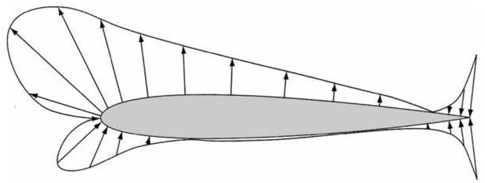

图 A. ${15\alpha } = {5}^{ \circ  }$ 时, NACA0012 翼型压力分布

图 A. 16 表示出了在机翼型轴，压力系数为 $\left\lbrack  {{C}_{\mathrm{P}} = p - {p}_{\infty }/\left( {1/2}\right) \rho {U}^{2}}\right\rbrack$ 弦向分布, 图中的实线为忽略边界层时的压力分布, 虚线为实际分布。

边界层的作用是改变了翼型后缘的压力分布，出现了比无边界层时更小的压力, 使压差阻力增大, 压差阻力是表面摩擦阻力的一部分, 也是由边界层产生的。

### A.7 失速型翼型

如果攻角超过某一个临界值 $\left( {{10}^{ \circ  } \sim  {16}^{ \circ  }}\right.$ ,取决于 ${Re}$ 数),上表面边界层将发生分离。这将导致翼型上部出现尾流，使环量减小，从而使升力减小、阻力增大。流过翼型的气流就失速 (图 A. 17)。平板也会产生环量和升力, 但是它在非常小的攻角下就会失速, 这是由于其具有尖锐的前缘的缘故。将平板拱弯可以改善其失速特性, 但是如果增加圆的厚度, 修其前缘, 可以使失速特性得到更大改善。

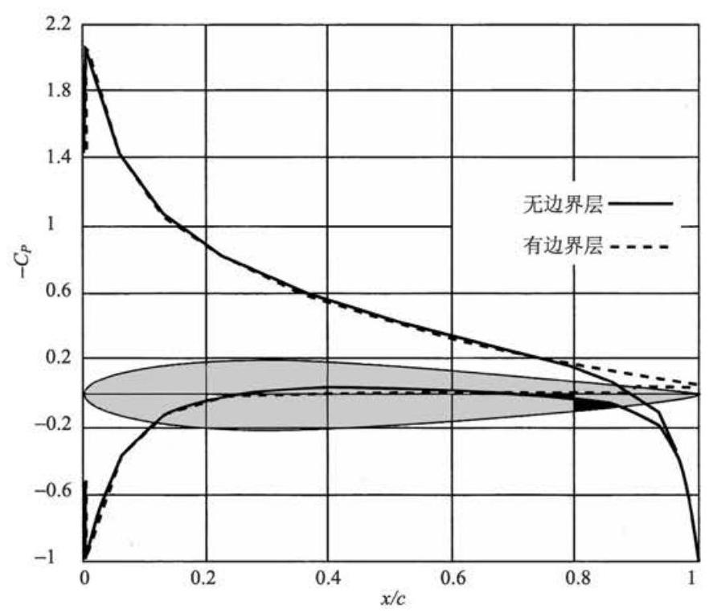

图 A. 16 $\alpha  = {5}^{ \circ  }$ 时, NACA0012 翼型周围的压力分布

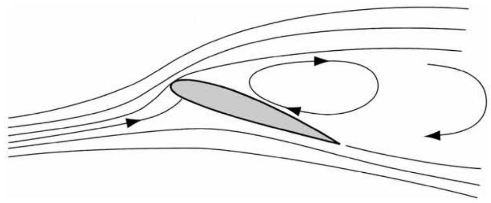

图 A. 17 在翼型周围失速的气流

### A.8 升力系数

升力系数定义如下:

$$
{C}_{1} = \frac{\text{ Lift }}{\frac{1}{2}\rho {U}^{2}A} \tag{A. 8}
$$

式中, $U$ 为来流速度; $A$ 为物体平面面积。对于长形物体,如飞机机翼或风力机叶片来说，在定义中采用单位翼展的升力，于是平面面积被弦长所替代。

$$
{C}_{1} = \frac{\text{ Lift }/\text{ unit span }}{\frac{1}{2}\rho {U}^{2}c} = \frac{\rho \left( {\Gamma  \times  U}\right) }{\frac{1}{2}\rho {U}^{2}c} = \frac{{\rho \pi Uc}\sin {\alpha U}}{\frac{1}{2}\rho {U}^{2}c} = {2\pi }\sin \alpha \tag{A. 9}
$$

在实际应用中,

$$
{C}_{1} = {a}_{0}\sin \alpha \tag{A. 10}
$$

式中, ${a}_{0}$ 即为升力曲线斜率 $\mathrm{d}{C}_{1}/\mathrm{d}\alpha$ ,大约为 ${5.73}\left\lbrack  {{0.1}/\left( {}^{ \circ  }\right) }\right\rbrack$ ,而不是 ${2\pi }$ 。请注意:不要将 ${a}_{0}$ 和流体诱导因子相混淆。图 A. 18 所示为对称机翼的 ${C}_{1} - \alpha$ 曲线，因此，升力由两个参数所决定，即攻角 $\alpha$ 和来流速度 $U$ 。相同的升力可以由不同的 $\alpha$ 和 $U$ 的组合产生。对于典型的对称翼型(NACA0012)，Cu 随攻角 $\alpha$ 的变化如图 A. 18 所示。请注意:式(A.10)所示的简单关系仅适用于失速前区域，在这些区域中流动是附体的。由于攻角较小 $\left( { < {16}^{ \circ  }}\right)$ ，方程常常被写成如下形式:

$$
{C}_{1} = {a}_{0}\alpha \tag{A. 10a}
$$

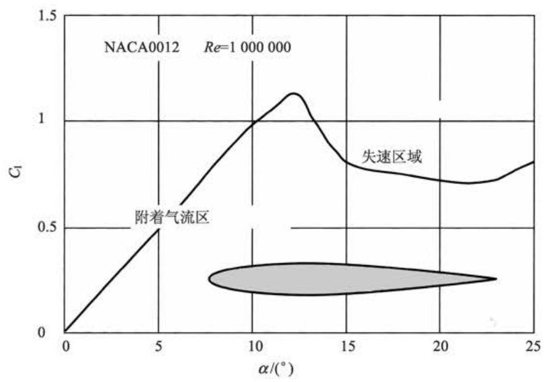

图 A. 18 对称机翼的 ${C}_{1} - \alpha$ 曲线

### A.9 翼型阻力特性

飞机机翼或风力机叶片的阻力系数的定义是基于平面面积而非最大截面面积的, 其原因将在后续章节中进行讲述。流过一个在与流动垂直方向的展向很宽的物体时, 阻力系数可以用基于由流动方向弦长所定义的单位展长阻力来表示:

$$
{C}_{\mathrm{d}} = \frac{\mathrm{{Drag}}/\text{ unit span }}{\frac{1}{2}\rho {U}^{2}c} \tag{A. 11}
$$

对于大翼展的机翼， ${C}_{\mathrm{d}}$ 的值在中等雷诺数时大致为 0.01 。

翼型的阻力系数也会随着攻角的变化而变化。图 A. 16 表明，上表面压力随着流体向尾部流动而不断升高, 这种情况被称为反向压力梯度, 它具有减缓气流速度的倾向。如果气流被减速至停滞, 失速将出现, 压差阻力将会迅速增大。反向压力梯度的强度将随着攻角的增大而增大, 因此, 可以预计阻力也会随攻角的增大而增大。图 A. 19 所示为对称翼型 NACA0012 的 ${C}_{\mathrm{d}}$ 随 $\alpha$ 的变化曲线。

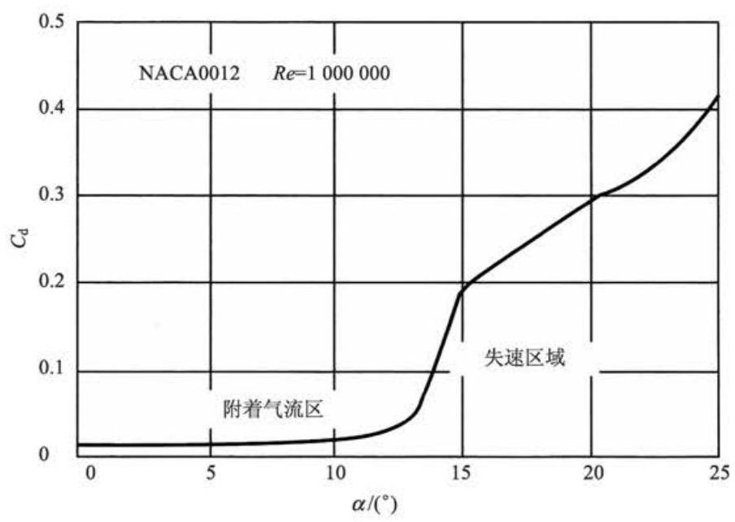

图 A. 19 NACA0012 翼型的 ${C}_{\mathrm{d}}$ 随 $\alpha$ 变化曲线

升/阻比 (图 A. 20) 对风力机的效率有重要的影响, 一般期望其叶片运行在升/ 阻比最大的状态。

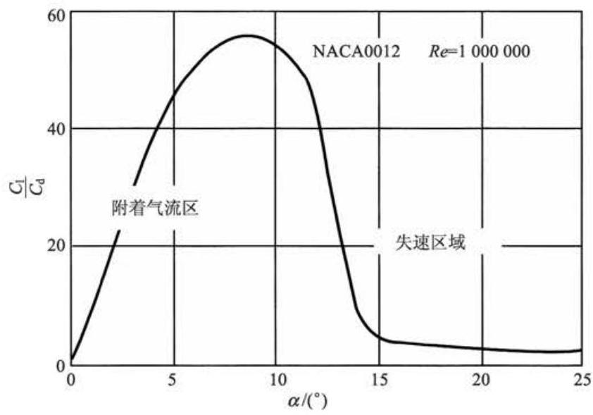

图 A. 20 NACA0012 机翼的升/阻比的变化曲线

绕翼型流动的特性由雷诺数来决定，因而对升力和阻力系数有重大影响。阻力系数随雷诺数的减小而增大, 在临界雷诺数 (约 200000 ) 以下, 边界层保持为层流, 阻力系数雷诺数迅速上升。对升力系数的影响与失速攻角有非常大的联系。 随着雷诺数的增大, 失速角也增大, 升力系数在由于失速前随攻角线性增大, 升力系数的最大值也随之增大。翼型 NACA0012 的特性如图 A. 21 和图 A. 22 所示。

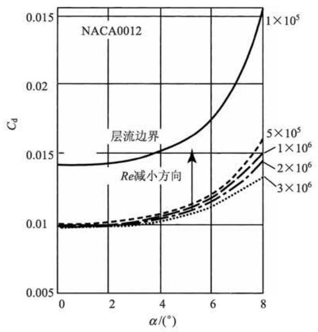

图 A. 21 小攻角下阻力系数随雷诺系数的变化曲线

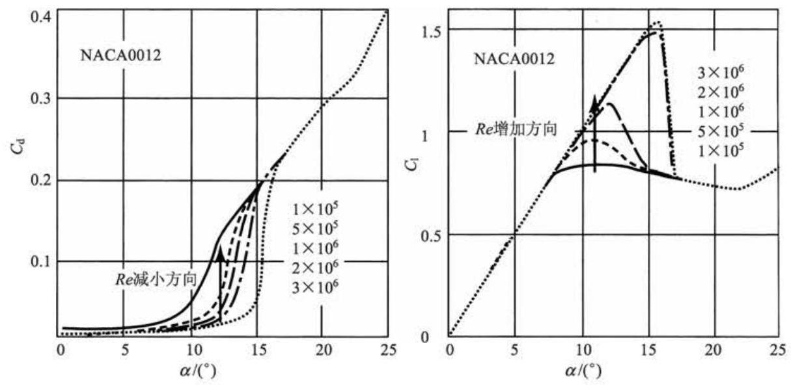

图 A. 22 失速区域升/阻系数随雷诺系数的变化曲线

### A.10 有弯度的翼型

有弯度的翼型，如 NACA4412，如图 A. 23 所示，它具有弯曲的弦线，这使该形式的翼型在零攻角的情况下仍然能够产生升力。通常，在正攻角范围内，有弯度的翼型比对称翼型具有更高的升/阻比，这是采用这种翼型的原因。

在风力机中广泛使用的 NACA 的 4 位数翼型的分类非常简单，如图 A. 24 所示。从左至右, 第一位代表用弦长百分数表示的弯度; 第二位代表最大弯度所在的弦向位置(用 10% 弦来计量)；后两位为最大厚度和弦长之比 (用弦长的百分数表示)，在此族中，这一最大厚度在弦长 30% 处。这一弯曲的弦线现在可以称为弯度线，由两段抛物线弧段在最大弯曲点处光滑过渡连接组成。对于其他种类的翼型， 读者可以参考阿伯特和冯·多恩霍夫的相关书籍(1959)。

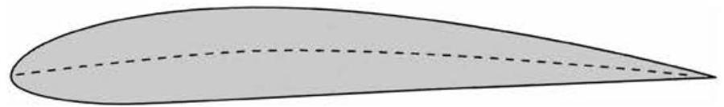

图 A. 23 NACA4412 的翼型剖面

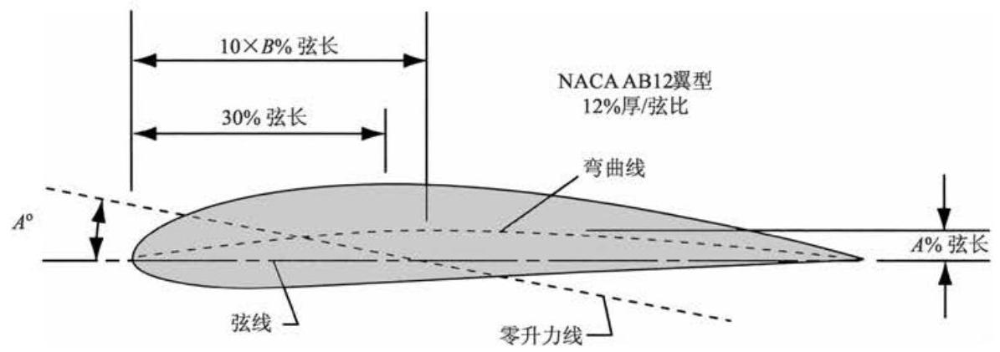

图 A. 24 NACAXXXX 的翼型变化分类

攻角 $\alpha$ 在弦线处测量,此时,弦线被定义为连接弯度线两端点的直线。注意: 在零攻角时的升力已经不再为零，零升力点在某一个小的负攻角处出现。绝大部分弯曲翼型的零升力攻角大约是 $- A$ 度,其中, $A$ 为弯度的百分数。图 A. 25 表示出 NACA4412 翼型在攻角以下和刚好超过失速攻角范围内的升力特性。可以看到，零攻角时的升力已经不再为零，零升力发生在攻角约为 ${4}^{ \circ  }$ 的小负角度上。

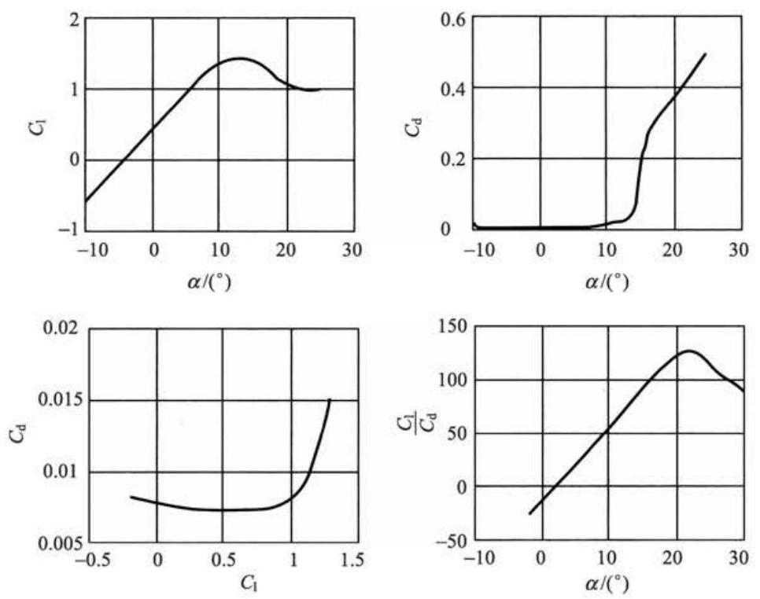

图 A. ${25}\;{Re} = {1.5} \times  {10}^{6}$ 时, NACA4412 机翼的特性

压力中心在对称中位于 $1/4$ 弦长处，而对于弯曲形，位于 $1/4$ 弦长稍靠后且随攻角的增大逐渐向尾缘移动。然而，如果选定了固定弦向位置点，那么合力通过那个点的同时将产生一个俯仰力矩(通常约定抬头方向为正)。如果俯仰力矩系数定义为

$$
{C}_{\mathrm{m}} = \frac{\text{ Pitching }/\text{ unit span }}{\frac{1}{2}\rho {U}^{2}c} \tag{A. 12}
$$

那么将有一个位置被称为翼型气动中心，此处有 $\mathrm{d}{C}_{\mathrm{m}}/\mathrm{d}{C}_{1} = 0$ 。在理论上，翼型气动中心位于 $1/4$ 弦长处，并且绝大多数实际翼型气动中心都位于此位置附近。 ${C}_{\mathrm{m}}$ 的值取决于翼型弯曲度,但对于 NACA4412 型翼型其值为 -0.1 。注意:不管是在何种符号约定下，实际中的俯仰力矩始终为负(低头方向)。根据定义，失速以后没有任何翼型气动中心，因此，预失速位置仍然被沿用来确定俯仰力矩系数，它将由此而成为一个由 $\alpha$ 所决定的量。

