# 第 4 章 深层次的风力机空气 动力学主题

## 4.1 引 言

第 3 章处理了风力机稳定状态下并且正对风向时的空气动力学特性，但是在实际情况中, 风的状况一般是不稳定的, 并且风力机总是可能会有几度的偏航误差。

## 4.2 稳定偏航的风力机的空气动力

通常, 风力机的风轮转轴和风向并不都是平行的, 因为风在连续地变化方向, 而风轮不能及时跟踪风向，所以风轮在多数情况下都处于偏航状态 (图 4.1)。偏航的风轮比没有偏航的风轮效率要低, 所以为了进行电能输出评估, 效率评估就显得至关重要。

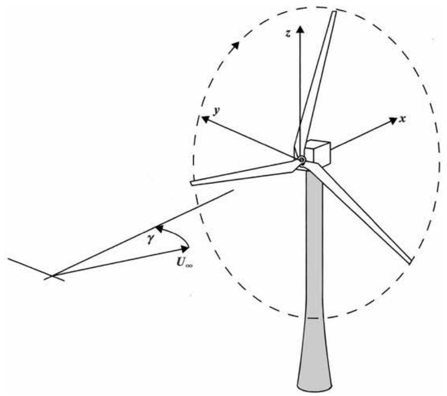

图 4.1 风力机偏航到对风状态

稳定偏航的风力机的空气动力即使是在稳定风速的情况下, 由于叶片的旋转, 偏航时每个叶片的攻角都是连续不断地变化着的，所以风轮叶片的载荷是波动的， 对风轮造成了疲劳损伤。

攻角的变化意味着作用在叶片上的力不仅在轴向上产生了推力, 而且产生了偏航轴和倾斜轴的力矩。

当风轮转轴与稳定的风向平行时, 在整个风轮圆盘上的诱导速度相同; 一旦风轮偏离风向, 诱导速度在方位角和径向上将发生变化, 这会使对风轮特性估计更加困难。

### 4.2.1 风力机在固定偏航时的动量定理

将动量定理应用于代替偏航风轮的致动盘上是存在问题的。对于整个风轮圆盘来说，动量定理只能确定平均诱导速度。在没有偏航的情况下，放松限制条件， 允许诱导速度径向有一些变化; 但是在有偏航的情况下, 不能这样处理, 因为叶片环量也是随着方位角的变化而变化的。如果假定作用在风轮圆盘上的力垂直于风轮圆盘是动量变化率引起的, 那么平均诱导速度也一定在相对圆盘的直角方向上, 即在轴向上。因此, 由于受到在与风向垂直方向上的诱导速度的分量的影响, 尾流偏离到了一侧。与没有偏航时的情况一样, 在风轮圆盘上的平均诱导速度只有尾流区域处平均诱导速度的一半。

对于固定的风向,令转轴保持在相对风向的偏航角 $\gamma$ (图 4.2),然后假定在轴向上的动量变化率等于通过圆盘的质量流量的变化率乘以垂直于风轮平面的速度变化率

$$
T = \rho {A}_{\mathrm{D}}{U}_{\infty }\left( {\cos \gamma  - a}\right) {2a}{U}_{\infty } \tag{4.1}
$$

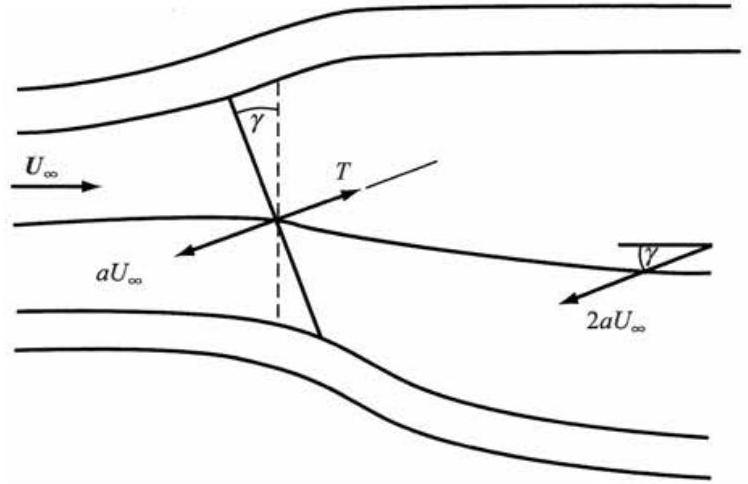

图 4.2 风力机偏航的偏移尾流和诱导速度

因此, 推力系数为

---

$$
{C}_{\mathrm{T}} = {4a}\left( {\cos \gamma  - a}\right)
$$

---

(4.2)

那么产生的功率为

$$
T{U}_{\infty }\left( {\cos \gamma  - a}\right) ,\;{C}_{\mathrm{P}} = {4a}{\left( \cos \gamma  - a\right) }^{2} \tag{4.3}
$$

为了找到 ${C}_{\mathrm{P}}$ 的最大值,将式 (4.3) 对 $a$ 进行求导,并令其为零,因此有

$$
a = \frac{\cos \gamma }{3},\;{C}_{\mathrm{{Pmax}}} = \frac{16}{27}{\cos }^{3}\gamma \tag{4.4}
$$

${\cos }^{3}\gamma$ 法则普遍用于偏航气流中的功率评价。

图 4.3 显示了当偏航角增加的时候功率的减少。

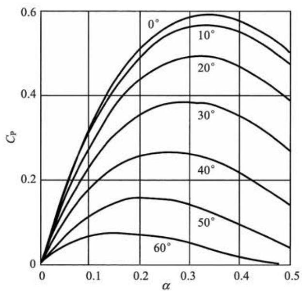

图 4.3 风能利用系数随偏航角和轴向气流因子的变化曲线

遗留的问题是:用上面的方法将动量定理运用到偏航风轮中是否合理？导致尾流偏向一侧的横向压力梯度形成了在轴向方向上作用于气流的力，并影响着轴向诱导速度。上述分析用来确定平均轴向诱导速度是可以的, 但是与在没有偏航的情况下相比, 将动量定理运用在不同位置的每个叶素上并不合适。如果将一个理论用于任何设计中, 它必须能够测定每个叶素位置的诱导速度并达到一个令人满意的精度。叶片受力计算与功率估计一样重要。

### 4.2.2 风轮偏航的 Glauert 动量定理

Glauert(1926)起初对旋翼飞机感兴趣，该旋翼飞机具有提供升力的旋翼和提供推力的常规螺旋桨。提供升力的旋翼有一个向后倾斜的旋转轴, 飞机向前飞行时，气流通过旋翼盘使其旋转，从而提供向上的推力。因而在向前飞行时，旋翼飞机的旋翼就像处于偏航状态的风力机一样。在向前速度高的时候，偏航角大，但是在停电垂直降落时，偏航角为零。

Glauert 认为，运行在高叶尖速比的高速前进的风轮圆盘就像平面形状为圆形的机翼处于小攻角 (大偏航角) 情况，作用在圆盘上的推力就是圆形机翼的升力。 简单升力线机翼理论(Prandtl and Tietjens，1957)指出，由尾涡系产生的机翼下洗流(诱导速度)在平面形状椭圆的机翼上，沿整个翼展上(圆盘的横向直径)是相同的, 而这也包括俯视图为圆形的旋翼机的旋翼。

该理论给出相同的(平均)诱导速度为

$$
u = \frac{2L}{\pi {\left( 2R\right) }^{2}{\rho V}} \tag{4.5}
$$

式中, $L$ 为升力; $V$ 为旋翼飞机的前行速度。

升力垂直于有效来流速度 $W$ (图 4.4)，因此，它并不垂直于水平面，而是向后倾斜。升力的垂直分量支撑旋翼飞机的重力，而水平分量却成为了阻力。在进行水平飞行时，升力的垂直分量不做功，而阻力做功。

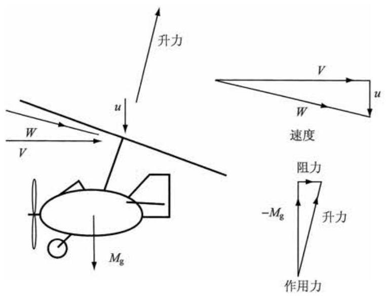

图 4.4 快速向前飞行时旋翼飞机上的速度和作用力

由图 4.4 所示的矢量三角形可知

$$
\frac{D}{L} = \frac{u}{V} \tag{4.6}
$$

在旋翼飞机的尾流区域，由尾涡产生的诱导速度 ${u}_{\mathrm{w}}$ 比在旋翼上的诱导速度大。一定质量流量的气体 ${\rho VS}$ 在尾流远端， ${u}_{\mathrm{w}}$ 时经历了向下的变化，这里的 $S$ 是垂直于速度 $V$ 的面积。根据动量定理，向下动量的变化率等于升力，所以有

$$
L = {\rho VS}{u}_{\mathrm{w}} \tag{4.7}
$$

由于旋翼飞机尾流区域周围的静压与旋翼飞机前方的压力相同，所以阻力做功的变化率 ${DV}$ 必定等于在尾流区域产生的动能变化率 $\frac{1}{2}\rho {u}_{\mathrm{w}}^{2}{VS}$ 。

$$
{DV} = \frac{1}{2}\rho {u}_{\mathrm{w}}^{2}{VS} \tag{4.8}
$$

联立式(4.6)~式(4.8)，则

$$
D = \frac{{L}^{2}}{{2\rho }{V}^{2}S} \tag{4.9}
$$

和

$$
{u}_{\mathrm{w}} = {2u} \tag{4.10}
$$

式 (4.10) 看起来应该很熟悉。联立式 (4.5) (升力线理论估算诱导速度的公式) 和式 (4.6), 则

$$
D = \frac{2{L}^{2}}{\rho {V}^{2}\pi {\left( 2R\right) }^{2}} \tag{4.11}
$$

比较式 (4.9) 和式 (4.11),得到所需面积 $S$ 的估计值为

$$
S = \pi {R}^{2} \tag{4. 12}
$$

$S$ 与风轮圆盘面积相同，但它垂直于飞行方向。

应该指出的是，上述分析是基于假定攻角很小而被简化了。实际上，从风轮流出的尾涡受到自身诱导速度的影响，导致风轮后面产生向下方偏斜。因此，诱导速度有向前的分量, 这意味着气体在前进方向上也产生动量变化率, 从而平衡阻力的影响。该阻力称为诱导阻力, 它是由诱导速度引起的向后倾斜的升力产生的, 而且与黏度无关,完全是一个压差阻力。式 (4.5) 应该修改,用 $W$ (在圆盘的合成速度) 代替 $V, S$ 是在与 $W$ 垂直的平面内的面积。而且由于 $W$ 具有接近风轮平面的方向,所以升力 $L$ 与垂直于风轮平面的推力 $T$ 几乎完全相同,通过同样的讨论,诱导速度几乎垂直于风轮平面

$$
u = \frac{2T}{\pi {\left( 2R\right) }^{2}{\rho W}} \tag{4.13}
$$

可以假定在大偏航角下的风力机运行情况就像旋翼机的旋翼一样。

由动量定理给出的在零偏航角时作用于风轮圆盘上的推力为

$$
T = \pi {R}^{2}\frac{1}{2}{\rho 4u}\left( {{U}_{\infty } - u}\right) \tag{4.14}
$$

现在用 $V$ 来代替 ${U}_{\infty }$ ,所以诱导速度为

$$
u = \frac{2T}{\pi {\left( 2R\right) }^{2}\rho \left( {{U}_{\infty } - u}\right) } \tag{4.15}
$$

现在面积 $S$ 在位置上与风轮圆盘一致。

在式 (4.15) 中,用 $W = {U}_{\infty } - u$ 来代替风轮圆盘上气流的合速度,则将得到与式 (4.13) 完全相同的方程，式 (4.13) 应用于大偏航角度的情况。在这种论点的基础上, Glauert 认为,简单动量定理的式 (4.13) 可以应用在所有的偏航角上,面积 $S \; = \pi {R}^{2}$ 总是位于垂直于合速度的平面上,通过它的质量流量就可以确定了。旋转面积 $S$ 的假设是至关重要的假设,它考虑了部分推力对风轮圆盘全部升力的作用。

因此，

$$
T = {\rho \pi }{R}^{2}{W2u} \tag{4.16}
$$

其中

$$
W = \sqrt{{U}_{\infty }^{2}{\sin }^{2}\gamma  + {\left( {U}_{\infty }\cos \gamma  - u\right) }^{2}} \tag{4.17}
$$

推力等于质量流量乘以推力方向上速度的变化。假定 $T$ 和 $u$ 都垂直于风轮圆盘平面,则推力系数为

$$
{C}_{\mathrm{T}} = {4a}\sqrt{1 - a\left( {2\cos \gamma  - a}\right) } \tag{4.18}
$$

输出功率是一个标量，是在圆盘 $W$ 上推力和合成速度的标量积。因此，风能利用系数为

$$
{C}_{\mathrm{P}} = {4a}\left( {\cos \gamma  - a}\right) \sqrt{1 - a\left( {2\cos \gamma  - a}\right) } \tag{4.19}
$$

然而, 有些推力构成了作用在风轮圆盘上的升力, 就像图形机翼那样, 升力不会从风中吸取能量, 因为升力产生的流场不会产生通过风轮圆盘的流动。只有起源于净气流并通过圆盘的那一部分推力才会从气流中吸收能量。因此, 轴向动量定理更适合估算功率吸收, 而 Glauert 理论更适合估算推力的大小。

来自 Glauert 的旋翼飞机理论是一个非常实用的概念, 是他预言通过风轮的诱导速度是不均匀的。图中简明地显示平行于飞行方向的流动产生了沿着旋翼直径垂直于旋翼的速度。通过风轮的平均诱导速度 [通过式 (4.5) 来确定] 为 ${u}_{0}$ ，飞机前进速度的垂直分量为 ${U}_{\infty }\cos \gamma ,{U}_{\infty }\cos \gamma$ 在整个圆盘上是相同的。但为了说明图 4.5 中的气流模型, 需要一个非均匀的分量, 该分量使垂直诱导速度在风轮盘的前缘减小而在后面增加。从对称现象中, 沿着圆盘直径垂直于飞行方向 (垂直于图的平面) 的诱导速度是均匀的。非均匀的诱导速度分量的简单形式为

$$
{u}_{1}\left( {r,\psi }\right)  = {u}_{1}\frac{r}{R}\sin \psi \tag{4.20}
$$

式中, $\psi$ 为在旋转方向上测量的叶片方位角,它在叶片垂直于飞行方向时 (或在风轮叶片是垂直向上时) 为 ${0}^{ \circ  };{u}_{1}$ 为不均匀分量的幅值,它取决于偏航角的大小。当然, 这需要平行于风轮盘平面的诱导速度, 但这些是次要的, 法向诱导速度比风轮平面内分量对叶片的攻角影响更大,对叶素的作用力也更大。

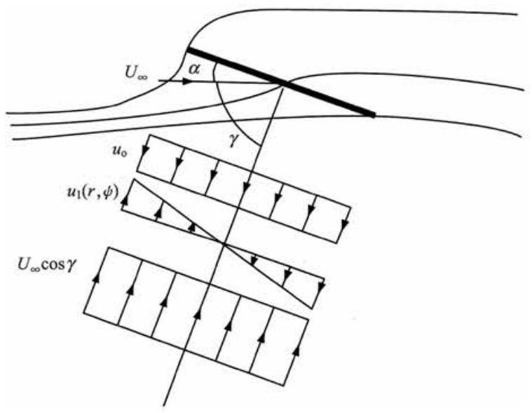

图 4.5 垂直于偏航风轮的速度

在式 (4.20) 中, ${u}_{1}$ 的值不能用动量定理来确定,但 Glauert 建议 ${u}_{1}$ 应该与 ${u}_{0}$ 有相同的数量级。垂直于风轮平面的总诱导速度可以写成

$$
u = {u}_{0}\left( {1 + K\frac{r}{R}\sin \psi }\right) \tag{4.21}
$$

其中, $K$ 的值取决于偏航角的大小。

### 4.2.3 偏航致动盘的涡流柱面模型

在 3.4 节中给出的非偏航风轮的旋涡理论, 被证明在其主要结果和动量定理的等效, 但是 3.4 节大多讲解的是关于流场的知识。因为 4.2.1 节和 4.2.2 节中的动量定理产生的结果很有限, 旋涡法是一种与叶素理论结合的方法, 可以给出此动量定理更多的流动结构细节, 对于风轮偏航证明是有用的, 因为相比较动量定理,由动量定理与叶素理论综合的方法给出了更多流动构造的细节。

因为作用在风轮圆盘上垂直于风轮圆盘平面的推力 $T$ 使偏航风轮的尾流偏向一侧,所以总有一个分量垂直于气流方向。因此,作用在气流上的力与 $T$ 方向相反，使气流在逆风向和侧向被加速。尾流的中心线与旋转轴(轴垂直于圆盘面) 有一个角度 $\chi ,\chi$ 被称为尾流偏斜角。这个偏斜角将比偏航角更大。和 3.4 节一样的基本理论可以用于尾流相对于转轴偏斜 $\chi$ 的致动盘。但是有一个重要的附带条件:必须假定在风轮圆盘上的环量在径向和方位上是均匀的。由此可以推出叶片的攻角是周期变化的，所以附着均匀环量的条件是不允许的。因而必须假定环量是在平均值附近变化, 所产生的诱导速度较小, 尾流由叶尖脱落的环量平均值决定 (图 4.6)。

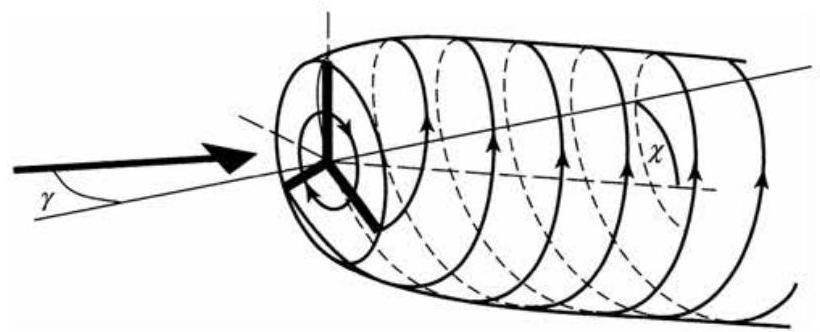

图 4.6 三叶片偏航风轮的偏转的涡尾流

尾流的膨胀对分析提出了难题,所以像以前一样将它忽略 (图 4.7)。

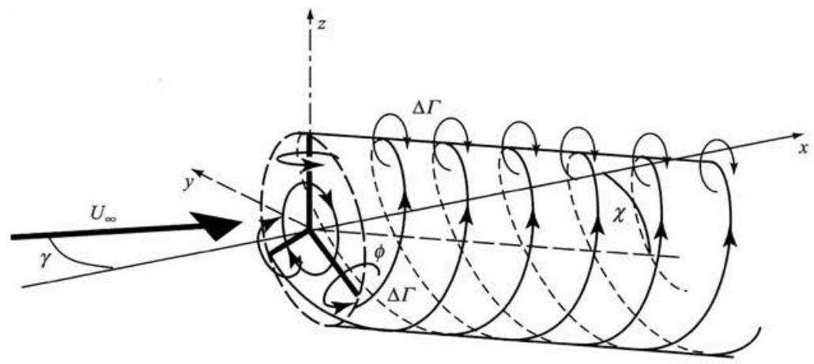

图 4.7 没有尾流膨胀时的偏航风轮尾流

Coleman 等(1945)为了了解直升机旋翼在前飞状态的情况，首先对风轮偏航进行分析。通过改变环量和诱导速度的符号, 可以很容易地应用于对风轮的分析。 一个有限数量的叶片与在 3.4 节的分析中的假定一样。涡量 ${g\Psi }$ 的方向仍然平行于偏航的风轮圆盘, 而且认为它是均匀的 (不随方位角的变化而变化), 使用毕奥- 萨伐尔定律,推导出风轮圆盘上诱导平均速度为 $a{U}_{\infty }\sec \chi /2$ ,方向在偏航角和中心转轴夹角的平分线上, 如图 4.8 所示。垂直于风轮平面的平均轴向诱导速度为 $a{U}_{\infty }$ ,与没有偏航的情况一样。在完全形成的尾流中,诱导速度是在风轮圆盘上的 2 倍。

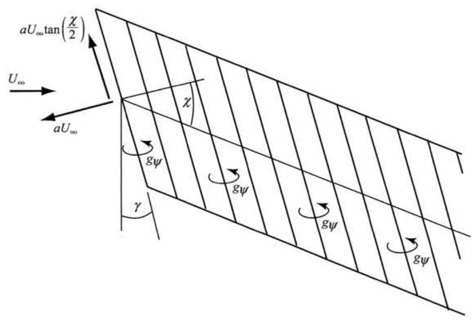

图 4.8 偏航致动盘和倾斜的涡流柱面尾流

圆盘上的平均诱导速度不在风轮的轴向上, 所以在轴向方向作用在圆盘上的力 $T$ 不是单独造成整个气流动量变化率的原因; 在垂直于转轴的方向上,存在动量的变化。

在风轮圆盘上的速度分量定义了偏斜角为

$$
\tan \chi  = \frac{{U}_{\infty }\left( {\sin \gamma  - a\tan \frac{\chi }{2}}\right) }{{U}_{\infty }\left( {\cos \gamma  - a}\right) } = \frac{2\tan \frac{\chi }{2}}{1 - {\tan }^{2}\frac{\chi }{2}} \tag{4.22}
$$

从中可以看出, $\chi \text{ 、 }\gamma$ 和 $\alpha$ 的近似关系为

$$
\chi  = \left( {{0.6a} + 1}\right) \gamma \tag{4.23}
$$

利用图 4.9 中的速度，可以对气流重新进行分析。风轮上平均作用可以对上游和下游游动应用伯努利方程来确定。

在上游,

$$
{p}_{\infty } + \frac{1}{2}\rho {U}_{\infty }^{2} = {p}_{\mathrm{D}}^{ + } + \frac{1}{2}\rho {U}_{\mathrm{D}}^{2}
$$

在下游,

$$
{p}_{\mathrm{D}} + \frac{1}{2}\rho {U}_{\mathrm{D}}^{2} = {p}_{\infty } + \frac{1}{2}\rho {U}_{\infty }^{2}\left\lbrack  {{\left( \cos \gamma  - 2a\right) }^{2} + {\left( \sin \gamma  - 2a\tan \frac{\chi }{2}\right) }^{2}}\right\rbrack
$$

式中, ${U}_{\mathrm{D}}$ 为圆盘上的合速度。

两个方程相减，得到通过圆盘的压降为

$$
{p}_{\mathrm{D}}^{ + } - {p}_{\mathrm{D}}^{ - } = \frac{1}{2}\rho {U}_{\infty }^{2}{4a}\left( {\cos \gamma  + \tan \frac{\chi }{2}\sin \gamma  - a{\sec }^{2}\frac{\chi }{2}}\right)
$$

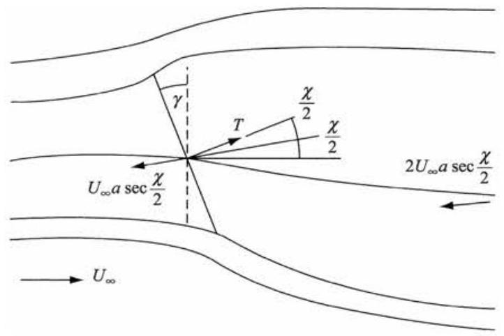

图 4.9 偏航致动盘引起的平均诱导速度

因此, 在圆盘上的推力系数为

$$
{C}_{\mathrm{T}} = {4a}\left( {\cos \gamma  + \tan \frac{\chi }{2}\sin \gamma  - a{\sec }^{2}\frac{\chi }{2}}\right) \tag{4.24}
$$

风能利用系数为

$$
{C}_{\mathrm{P}} = {4a}\left( {\cos \gamma  - a}\right) \left( {\cos \gamma  + \tan \frac{\chi }{2}\sin \gamma  - a{\sec }^{2}\frac{\chi }{2}}\right) \tag{4.25}
$$

利用与 Glauert 理论同样的方法, 式 (4.24) 中有多大的推力能够从气流中吸收能量是不清楚的, 所以式 (4.25) 中功率的表达将可能被过高估计了。从三个理论中导出的 ${C}_{\mathrm{P}}$ 的最大值随偏航角的变化的比较如图 4.10 所示。

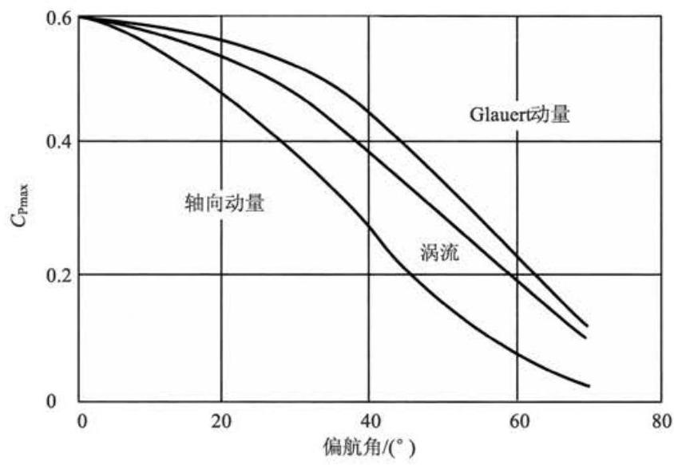

图 4.10 动量和涡流理论中最大风能利用系数随偏航角变化的比较

### 4.2.4 气流膨胀

由图 4.9 可以推断出, 平行于尾流偏斜轴的诱导速度分量均匀地分布在圆盘上，其值为 $a{U}_{\infty }$ 。垂直于尾流偏斜轴的诱导水平速度也均匀地分布在圆盘上，其值为 $a\tan \left( {\chi /2}\right) {U}_{\infty }$ 。

除了图 4.9 中均匀的诱导速度之外,气流膨胀分别引起 $y$ 和 $z$ 方向上 (在与风轮面成 $\chi$ 角的尾流垂直平面) 速度增加，如图 4.11 所示。将气流膨胀速度在风轮平面进行分解, 就可产生垂直诱导速度, 其形式为 Glauert 在式 (4.21) 所预测的形式。注意到积极的方向 $u$ 现在定义为下风向,但是在 4.2.2 节中定义为上风向。

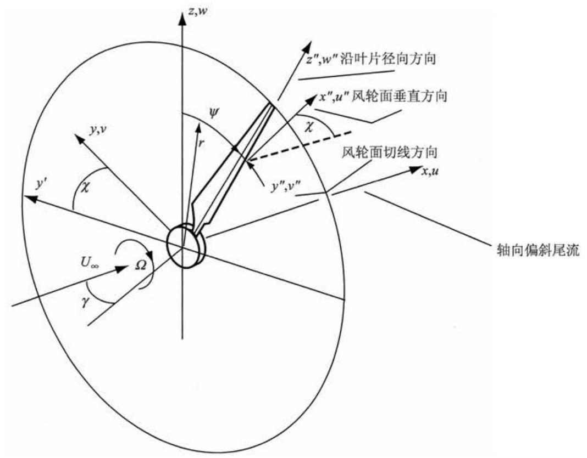

图 4.11 偏航风轮的坐标轴系

在图 4.11 中给出的半径为 $r$ 、方位角为 $\theta$ 的风轮圆盘上的点,诱导气流膨胀速度不是 $r$ 和 $\theta$ 单一的函数。Coleman 等(1945)在水平直径 $\theta  =  \pm  {90}^{ \circ  }$ 处获得一种在 $y$ 方向上的气流膨胀速度的分析解的方法,这种解析方法中包含有一个完整的椭圆积分。这种方法不是很实用, 因为数值估算要求计算两个很大数据的差别。简化这种分析方法可以得到水平气流膨胀速度的表达式 (4.26), 此式虽然排除了那些难点,但它并没有以闭环的形式出现。

$$
v\left( {\chi ,\psi ,\mu }\right)  = \frac{-{2a}{U}_{\infty }\mu \sin \psi }{\pi }{\int }_{0}^{\frac{\pi }{2}}\frac{{\sin }^{2}{2\varepsilon }}{\sqrt{{\left( 1 + \mu \right) }^{2} - {4\mu }{\sin }^{2}\varepsilon }}\frac{1}{{\left( \mu  + \cos 2\varepsilon \right) }^{2}{\cos }^{2}\chi  + {\sin }^{2}{2\varepsilon }}\mathrm{d}\varepsilon
$$

(4.26)式中, $\mu  = r/R;\varepsilon$ 是由椭圆积分所产生的参数,它可以由函数的定积分来消除; $a{U}_{\infty }$ 是前面所定义的平均诱导速度。式 (4.26) 的一个重要特征是气流膨胀速度和平均轴向气流诱导因子是成比例的。若式 (4.26) 除以 $\sec {\left( \chi /2\right) }^{2}$ ,则其结果与偏斜角 $\chi$ 几乎无关,如图 4.12 所示,清晰地显示了在 ${0}^{ \circ  } \sim  {60}^{ \circ  }$ 倾斜角范围内变化有多小。

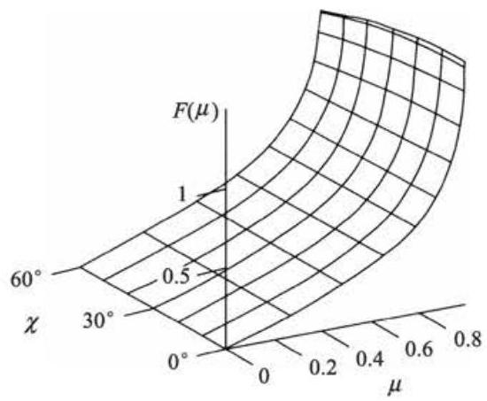

图 4.12 气流膨胀函数随半径位置和偏斜角的变化图

在风轮圆盘边缘, 所有偏斜角的气流膨胀函数的值为无穷大, 这就意味着气流有奇点。当然, 这在实际中是不会发生的, 它只是假设均匀叶片环量的结果。该环量在风轮盘边缘必须以平滑的方式下降到零。

除了 $\theta  =  \pm  {90}^{ \circ  }$ 以外, Coleman 等 (1945) 没有推导出 $\theta$ 角的气流膨胀速度分量解析表达式。但气流膨胀速度的数值可以应用毕奥-萨伐尔定律来计算。

当偏斜角在 $\pm  {45}^{ \circ  }$ 范围时,穿过风轮圆盘垂直直径的垂直气流膨胀速度的径向变化和 $F\left( \mu \right)$ 相同,但是在这个范围之外,在风轮圆盘边缘垂直速度比水平速度增加更快。由此可以得出, 在确定偏转风轮的气动特性时水平膨胀速度比垂直膨胀速度更重要。

在风轮圆盘表面(即一半径绕偏航的风轮轴旋转时，该半径扫过的圆盘表面) 上，不同方位角上水平和垂直气流膨胀速度沿径向的变化表明对较小偏斜角可以做一些简化。

图 4.13 为偏斜角为 ${30}^{ \circ  }$ 时风轮盘上的气流膨胀速度的横向变化情况。这里需要强调的是，速度分量位于与尾流的偏斜轴垂直的平面上。观察其变化情况可以得到下述两个速度分量的简单近似表达式为

$$
v\left( {\chi ,\mu ,\psi }\right)  =  - a{U}_{\infty }F\left( \mu \right) \sin \psi \tag{4.27}
$$

$$
w\left( {\chi ,\mu ,\psi }\right)  = a{U}_{\infty }F\left( \mu \right) \cos \psi \tag{4.28}
$$

其中，

$$
F\left( \mu \right)  = \frac{2\mu }{\pi }{\int }_{0}^{\frac{\pi }{2}}\frac{{\sin }^{2}{2\varepsilon }}{\sqrt{{\left( 1 + \mu \right) }^{2} - {4\mu }{\sin }^{2}\varepsilon }}\frac{1}{{\left( \mu  + \cos 2\varepsilon \right) }^{2}{\cos }^{2}\chi  + {\sin }^{2}{2\varepsilon }}\mathrm{d}\varepsilon
$$

(4.29)

式 (4.27) 和式 (4.28) 的不足之处是:气流膨胀函数式 (4.29) 在圆盘外边缘有奇点。若致动盘被一个具有小数量叶片的风轮所代替, 则气流膨胀函数的变化将非常明显。若采用毕奥-萨伐尔定律来计算用均匀环量升力线进行模拟的无偏航、 单叶片，则气流膨胀函数可以用数值来确定。由此可以得出，沿着径向升力线的气流膨胀速度是从升力线 (叶尖) 的尖端流出的离散线涡螺旋 (流动) 角的函数。旋涡尾流被假定是刚性的, 因为在风轮上螺旋角和尾流直径各处的数值是固定的。这些单叶片风轮的解答方法可以通过简单的叠加过程应用于确定多叶片风轮的气流场中。如图 4.14 所示, 即为所得的单叶片、两叶片和三叶片风轮的气流膨胀函数 $F{\left( \mu \right) }_{N}$ 图。

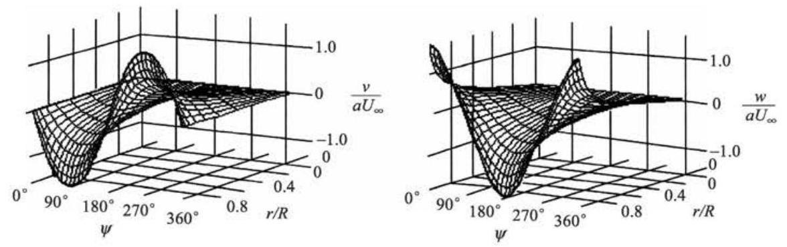

图 4.13 在风轮平面上,偏斜角为 ${30}^{ \circ  }$ 时水平速度 $\left( v\right)$ 和垂直速度 $\left( w\right)$ 的方位和径向的变化

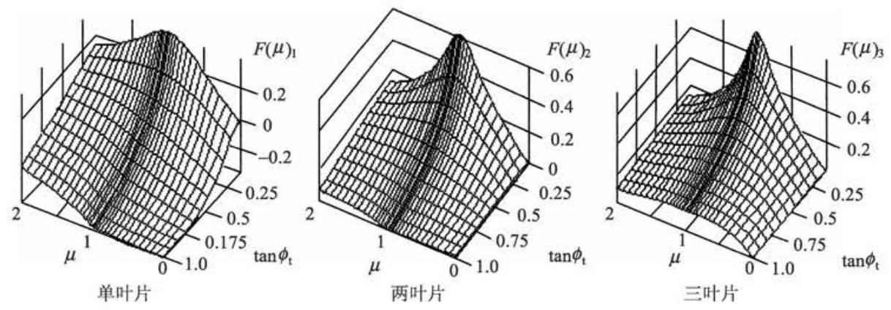

图 4.14 单叶片、两叶片和三叶片风轮的气流膨胀函数

在图 4.14 中,将径向变化量扩大到超过其风轮半径的区域来说明在离散叶片的风轮上来连续变化, 而与之相比, 在致动盘情况下出现了奇异之处。图 4.14 中的气体膨胀函数有两个显著的特征: 螺旋角 ${\phi }_{\mathrm{t}}$ 很大程度地修改了该函数,并且在单叶片风轮中会出现负值(气流收缩)。

下式为图 4.14 中两叶片和三叶片风轮情况下的近似解析表达式:

$$
{F}_{\mathrm{a}}\left( {\mu ,{\phi }_{\mathrm{t}}, B}\right)  = \frac{F\left( \mu \right) }{\sqrt{1 + {50}\frac{{\tan }^{2}{\phi }_{\mathrm{t}}}{{B}^{2}}\left( {\frac{1}{\tan {\phi }_{\mathrm{t}}} + 8}\right) F{\left( \mu \right) }^{2}{\left\lbrack  \mu \left( 2 - \mu \right) F\left( \mu \right) \right\rbrack  }^{\frac{0.05}{\tan {\phi }_{\mathrm{t}}}}}}
$$

(4.30)

其中

而 $\tan {\phi }_{\mathrm{t}} = \left( {1 - a}\right) /\left\lbrack  {\lambda \left( {1 + {a}^{\prime }}\right) }\right\rbrack$ 为气流角的正切。两叶片和三叶片风轮情况下的近似表达式(4.30)如图 4.15 所示。

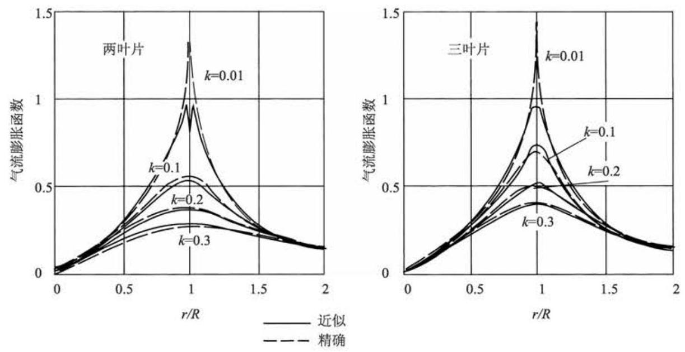

图 4.15 两叶片和三叶片风轮的近似气流膨胀函数

若要将其转换为相对于绕风轮轴旋转的轴上 ( ${x}^{\prime \prime }$ 轴、 ${y}^{\prime \prime }$ 轴和 ${z}^{\prime \prime }$ 轴,如图 4.11 所示)的速度分量，式 (4.27) 和式 (4.28) 中的气流膨胀速度可以分解为叶素的法向分量和切向分量(图 4.18)。

法向分量为

$$
{u}^{\prime \prime } =  - a{U}_{\infty }\left\lbrack  {1 + 2\sin \psi \tan \frac{\chi }{2}F\left( \mu \right) }\right\rbrack \tag{4.31}
$$

切向分量为

$$
{v}^{\prime \prime } = a{U}_{\infty }\cos \psi \tan \frac{\chi }{2}\left\lbrack  {1 + 2\sin \psi \tan \frac{\chi }{2}F\left( \mu \right) }\right\rbrack \tag{4.32}
$$

在上述两个分量中必须加上风速 ${U}_{\infty }$ 的分量,则法向分量为

$$
{U}^{\prime \prime } = {U}_{\infty }\cos \gamma \tag{4.33}
$$

切向分量为

$$
{V}^{\prime \prime } = {U}_{\infty }\cos \phi \sin \gamma \tag{4.34}
$$

其中径向 (翼展) 方向的速度分量不会影响到攻角，所以可以忽略。

很明显，根据式 (4.31)，由 Coleman 定理可以确定函数 $K\left( \chi \right)$ ，见式 (4.21)， 可得

$$
K\left( \chi \right)  = 2\tan \frac{\chi }{2} \tag{4.35}
$$

另外,还存在由叶片旋转引起的切向速度 ${\Omega }_{\mathrm{r}}$ 和诱导尾流旋转引起的切向速度 ${\Omega }_{\mathrm{r}}$ ,但后者将在一开始就被忽略。

当方位角 $\psi$ 为正时,式 (4.31) 二式(4.34) 中的速度将产生一个较小的攻角 (图 4.16),然后其变为负值,所以攻角会产生周期性变化。当 $\psi$ 为正时,入流法向速度 ${u}^{\prime \prime }$ 比 $\psi$ 为负值时更靠近叶片的径向轴线。如图 4.16 所示,攻角的不同是由气流膨胀所引起的。

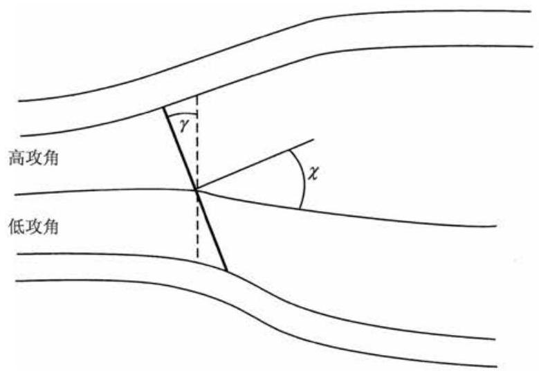

图 4.16 气流膨胀引起不同的攻角

攻角的变化将使绕叶片翼型的流动非定常变化，因此，升力将产生 4.4 节所述的响应。叶片环量也将在此旋转过程中产生变化, 这表明涡流模型是不完善的, 因为它是在假设环量不变的前提下导出的。

在尾流中, 从叶片后缘脱落出的附加旋涡显然会影响诱导速度, 这一点在理论中未予以考虑。该附加诱导速度是周期性变化的, 所以它并不影响垂直于风轮盘的平均诱导速度，但可能会影响攻角的幅值和相位。

对 Coleman 涡流理论进一步进行数值分析可知，当偏斜角大于 $\pm  {45}^{ \circ  }$ 时，式 (4.21)中气流膨胀诱导速度等于每周一次的高阶谐量更加明显。由于仅出现奇次谐量, 反映出相对于偏航轴的反对称性。

### 4.2.5 相关理论

其他的研究人员提出了很多比 Glauert 和 Coleman 理论更好的理论, 除了其中一些专门用在风力机外,大部分都应用在直升机空气动力学方面。特别是 $\varnothing$ ye (1992)进行了和 Coleman 同样的分析, 并提出如下一种简单的符合式 (4.29) 的曲线拟合方程:

$$
{F}_{\phi }\left( \mu \right)  = \frac{1}{2}\left( {\mu  + {0.4}{\mu }^{3} + {0.4}{\mu }^{5}}\right) \tag{4.36}
$$

如图 4.17 所示，显然， $\varnothing$ ye 避免了式 (4.29) 在靠近圆盘外边缘时产生的非常大的值，并且式 (4.36) 与图 4.14 中的气流膨胀函数大致相符。

Meijer Drees(1949)扩展了 Coleman 等研究的涡流模型，其中包括叶片环量的余弦变化。他的主要成果是对函数 $K\left( \chi \right)$ 的修正,但是 Meijer Drees 保留了 Glauert 关于垂直诱导速度随半径的线性变化的假设(Schepers 和 Snel,1995):

$$
{u}^{\prime \prime } =  - a{U}_{\infty }\left\{  {1 + \frac{4}{3}\mu \left\lbrack  {1 - {1.8}{\left( \frac{\sin \gamma }{\lambda }\right) }^{2}}\right\rbrack  \sin \psi \tan \frac{\chi }{2}}\right\} \tag{4.37}
$$

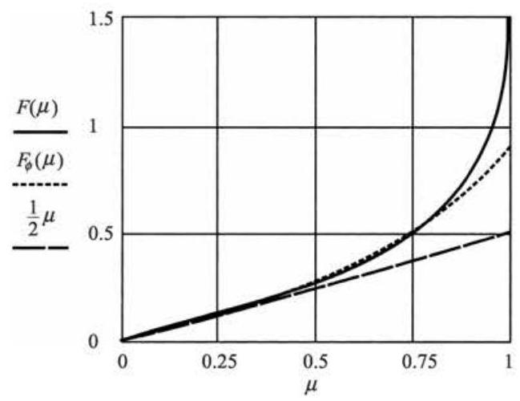

图 4.17 Øye 对 Coleman 气流膨胀函数的拟合曲线

### 4.2.6 风力机风轮在固定偏航时的旋转尾流

显然, 旋转尾流是存在于尾流中的, 并且不仅仅与转矩有关。旋涡理论也需要包括根涡在内，根涡位于沿偏斜尾流轴的尾流中。因此，在尾流的旋转是相对偏斜尾流轴而不是旋转轴, 尾流旋转速度将位于垂直于偏斜尾流轴的平面内。

为了确定尾流旋转速度, 使绕偏斜尾流轴的角动量变化率等于叶片作用力产生的相对于偏斜尾流轴的动量。

跟以前一样, 如果旋转尾流速度是用风轮的角速度来表示的, 那么就有

$$
{v}^{\prime \prime \prime } = \Omega {r}^{\prime \prime \prime }{a}^{\prime }h\left( \psi \right) \tag{4.38}
$$

其中,三撇表示相对于绕尾流轴旋转的轴系,而 $h\left( \psi \right)$ 是决定根涡影响强度的函数。 在没有偏航的情况下, 根涡在风轮上诱导的速度是在径向距离相同的远端尾流诱导的速度的一半，同样可以将其应用到垂直于偏斜轴的圆盘上，该圆盘中心与实际风轮盘中心的位置相同。实际风轮盘的上游或下游的某一点到垂直于尾流轴的圆盘平面的距离决定了根涡影响函数 $h\left( \psi \right)$ 的值。 $h\left( \psi \right)$ 的值为 $0 \sim  {2.0}$ ,在垂直直径上， $h\left( \psi \right)$ 等于 1.0 。

根据毕奥-萨伐尔定律,在圆柱坐标系 $\left( {{x}^{\prime \prime \prime },{\psi }^{\prime \prime \prime },{r}^{\prime \prime \prime }}\right)$ 上由强度 $\Gamma$ 的半无限线涡产生的沿 $x$ 轴从零到无穷大的速度为

$$
{\overrightarrow{V}}^{\prime \prime \prime } = \frac{\Gamma }{{4\pi }{r}^{\prime \prime \prime }}\left\lbrack  \begin{matrix} 0 \\  1 + \frac{{x}^{\prime \prime \prime }}{\sqrt{{x}^{\prime \prime \prime }{}^{2} + {r}^{\prime \prime \prime 2}}} \\  0 \end{matrix}\right\rbrack   = \left\lbrack  \begin{matrix} 0 \\  {v}^{\prime \prime \prime \prime } \\  0 \end{matrix}\right\rbrack \tag{4.39}
$$

诱导速度在 ${x}^{\prime \prime \prime } = \infty$ 时的值是在 ${x}^{\prime \prime \prime } = 0$ 时的 2 倍,并且在 ${x}^{\prime \prime \prime } =  - \infty$ 时等于零。

风轮圆盘上的点 $\left( {0,\psi , r}\right)$ 在普通的圆盘坐标中的相应坐标 $\left( {{x}^{\prime \prime \prime },{\psi }^{\prime \prime \prime },{r}^{\prime \prime \prime }}\right)$ 为

$$
{x}^{\prime \prime \prime } =  - {y}^{\prime }\sin \chi  = r\sin {\psi }^{\prime \prime \prime }\sin \chi ,\;{r}^{\prime \prime \prime } = r\sqrt{{\cos }^{2}\psi  + {\cos }^{2}\chi {\sin }^{2}\psi }
$$

和

$$
\cos {\psi }^{\prime \prime \prime } = \frac{r}{{r}^{\prime \prime \prime }}\cos \psi ,\;\sin {\psi }^{\prime \prime \prime } = \frac{r}{{r}^{\prime \prime \prime }}\sin \psi \cos \chi \tag{4.40}
$$

在该点的诱导速度为

$$
{v}^{\prime \prime \prime } = \Omega {r}^{\prime \prime \prime }{a}^{\prime }\left( {1 + \frac{{x}^{\prime \prime \prime }}{\sqrt{{x}^{\prime \prime \prime 2} + {r}^{\prime \prime \prime 2}}}}\right) \tag{4.41}
$$

所以，把式(4.39)中的速度转换到风轮盘平面上的旋转系中，则有

$$
{\overrightarrow{V}}^{\prime \prime } = \left\lbrack  \begin{matrix} 1 & 0 & 0 \\  0 & \cos \psi & \sin \psi \\  0 &  - \sin \psi & \cos \psi  \end{matrix}\right\rbrack  \left\lbrack  \begin{matrix} \cos \chi & \sin \chi & 0 \\   - \sin \chi & \sin \chi & 0 \\  0 & 0 & 1 \end{matrix}\right\rbrack  \left\lbrack  \begin{matrix} 1 & 0 & 0 \\  0 & \cos {\psi }^{\prime \prime \prime } &  - \sin {\psi }^{\prime \prime \prime } \\  0 & \sin {\psi }^{\prime \prime \prime } & \cos {\psi }^{\prime \prime \prime } \end{matrix}\right\rbrack  \left\lbrack  \begin{matrix} 0 \\  {v}^{\prime \prime \prime } \\  0 \end{matrix}\right\rbrack
$$

(4.42)

将式(4.40)和式(4.41)代入式(4.42)中有

$$
{\overrightarrow{V}}^{\prime \prime } = \left\lbrack  \begin{matrix} \cos \psi \sin \chi \\  \cos \chi \\  0 \end{matrix}\right\rbrack  {\Omega r}{a}^{\prime }\left( {1 + \sin \psi \sin \chi }\right) \tag{4.43}
$$

因此，尾流旋转产生了两个速度分量:一个在风轮平面内; 另一个垂直于风轮平面, 没有径向分量。

### 4.2.7 风力机在固定偏航时的叶素理论

风力机在偏航的情况下，应用叶素理论是有问题的，因为在叶素上的流动是非定常的, 而且该理论描述的涡流仅为方程式的一半(这部分取代了动量定理)，放在这方面它是不完整的。但非定常力究竟有多大或多重要是不清楚的。如果非定常力很大，那么叶素理论是不适用的，而应用该理论所得的结果将与测量结果无关。 如果非定常力很小，那么其结果应该与实际值有一些对应关系。在稳定偏航条件下, 风轮圆盘上任意一点的气流速度不会随着时间的变化而变化, 如果假定叶片的数量无限, 那就没有附加的质量项需要考虑。然而, 叶片上的点的攻角随着时间的变化意味着二维升力应该通过升力缺损函数来进行修正, 这个缺损函数是 Theodorsen(1935)由做正弦俯仰运动翼型的直线尾流得到的。

忽略脱落的涡流的影响，在一个叶素平面的净速度如图 4.18 所示。径向 (翼展方向) 的速度分量在图 4.18 中没有被表示出来, 其被忽略的原因是其对攻角和升力没有影响。

因而，气流角 $\phi$ 是由图 4.18 所示的速度分量确定的。

$$
\text{ tand } = \frac{{U}_{\infty }\left\{  {\cos \gamma  - a\left\lbrack  {1 + F\left( \mu \right) K\left( \chi \right) \sin \psi }\right\rbrack  }\right\}   + {\Omega r}{a}^{\prime }\cos \psi \sin \chi \left( {1 + \sin \psi \sin \chi }\right) }{}
$$

$$
{\Omega r}\left\lbrack  {1 + {a}^{\prime }\cos \chi \left( {1 + \sin \psi \sin \chi }\right) }\right\rbrack   + {U}_{\infty }\cos \psi \left\{  {a\tan \frac{\chi }{2}\left\lbrack  {1 + F\left( \mu \right) K\left( \chi \right) \sin \psi }\right\rbrack   - \sin \gamma }\right\}
$$

(4.44)式中, $\mu  = r/R$ 是从圆盘旋转轴径向测量的。

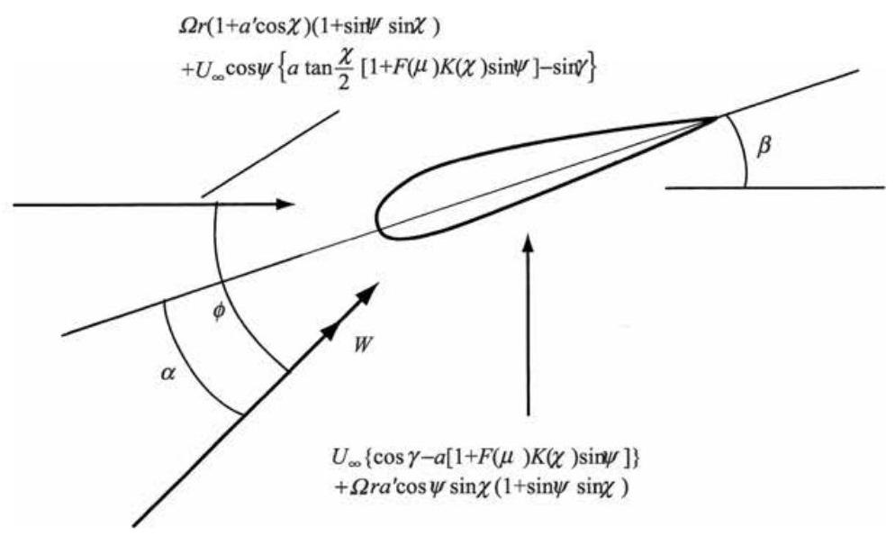

图 4.18 在叶片横截面上的速度分量

攻角 $\alpha$ 为

$$
\alpha  = \phi  - \beta \tag{4.45}
$$

从二维实验数据得到的升力和阻力系数与无偏航的情况一样, 也取决于对每个叶素 (每个 $\mu$ 和 $\psi$ 的组合) 攻角的计算。

### 4.2.8 风力机在固定偏航时的叶素动量理论

在给定气流诱导因子值的情况下, 作用在叶素上的力可以通过式 (4.44) 和式 (4.45) 来确定。

对半径为 $r$ 、径向厚度为 ${\delta r}$ 的整个圆环上的推力是用式 (3.50) 进行计算的。

$$
{\delta T} = {\delta L}\cos \phi  + {\delta D}\sin \phi  = \frac{1}{2}\rho {W}^{2}{Bc}\left( {{C}_{1}\cos \phi  + {C}_{\mathrm{d}}\sin \phi }\right) {\delta r}
$$

当风轮转动 ${\delta \psi }$ 圆环上扫过面积的力为

$$
\delta {T}_{\mathrm{b}} = \frac{1}{2}\rho {W}^{2}{Bc}\left( {{C}_{1}\cos \phi  + {C}_{\mathrm{d}}\sin \phi }\right) {\delta r}\frac{\delta \psi }{2\pi }
$$

令

$$
{C}_{\mathrm{x}} = {C}_{1}\cos \phi  + {C}_{\mathrm{d}}\sin \phi ,\;{\sigma }_{\mathrm{r}} = {Bc}/{2\pi r}
$$

则

$$
\delta {T}_{\mathrm{b}} = \frac{1}{2}\rho {W}^{2}{\sigma }_{\mathrm{r}}{C}_{\mathrm{x}}{r\delta r\delta \psi } \tag{4.46}
$$

${C}_{1}$ 和 ${C}_{\mathrm{d}}$ 的值确定应包括非定常流的影响,因为任何叶片环量随着方位角的变化将取决于环量波动减缩频率的大小。

如果选择忽略阻力或只考虑产生压力的部分阻力, 那么对式 (4.46) 应该做相应的修正。

动量变化率的计算既可使用 Glauert 理论的式 (4.18), 又可使用涡流柱面理论的式 (4.24), 两个方程中的气流诱导因子 $a$ 应该用 ${af}$ 来取代,以考虑 Prandtl 叶尖损失。

对于 Glauert 理论,

$$
\delta {T}_{\mathrm{m}} = \frac{1}{2}\rho {U}_{\infty }^{2}{4af}\sqrt{1 - {af}\left( {2\cos \gamma  - {af}}\right) }{r\delta \psi \delta r} \tag{4.47a}
$$

对于涡流理论，则

$$
\delta {T}_{\mathrm{m}} = \frac{1}{2}\rho {U}_{\infty }^{2}{4af}\left( {\cos \gamma  + \tan \frac{\chi }{2}\sin \gamma  - {af}{\sec }^{2}\frac{\chi }{2}}\right) {r\delta \psi \delta r} \tag{4.47b}
$$

估算旋转速度的代数运算很复杂, 即使忽略附着涡环量的波动, 由尾流旋转所导致的压降在没有偏航的情况下显得很小, 所以可以认为, 在有偏航情况下尾流旋转导致的压降是可以完全忽略的。

相对于尾流轴的叶素动量为

$$
\delta {M}_{\mathrm{b}} = \frac{1}{2}\rho {W}^{2}{Bc}\left( {{C}_{\mathrm{y}}\cos \chi  - {C}_{\mathrm{x}}\cos \psi \sin \chi }\right) {r\delta r}\frac{\delta \psi }{2\pi }
$$

其中

$$
{C}_{\mathrm{y}} = {C}_{1}\sin \phi  - {C}_{\mathrm{d}}\cos \phi
$$

因此, 有

$$
\delta {M}_{\mathrm{b}} = \frac{1}{2}\rho {W}^{2}{\sigma }_{\mathrm{r}}\left( {{C}_{\mathrm{y}}\cos \chi  - {C}_{\mathrm{x}}\cos \psi \sin \chi }\right) {r}^{2}{\delta r\delta \psi } \tag{4.48}
$$

角动量的变化率是通过风轮盘面元的质量流量乘以切向速度再乘以半径。

$$
\delta {M}_{\mathrm{m}} = \rho {U}_{\infty }\left( {\cos \gamma  - {af}}\right) {r\delta \psi \delta r2}{a}^{\prime }{f\Omega }{r}^{\prime \prime 2}
$$

其中

$$
{r}^{m2} = {r}^{2}\left( {{\cos }^{2}\psi  + {\cos }^{2}\chi {\sin }^{2}\psi }\right)
$$

因此, 有

$$
\delta {M}_{\mathrm{m}} = \frac{1}{2}\rho {U}_{\infty }^{2}{\lambda \mu 4}{a}^{\prime }f\left( {\cos \gamma  - {af}}\right) \left( {{\cos }^{2}\psi  + {\cos }^{2}\chi {\sin }^{2}\psi }\right) {r}^{2}{\delta r\delta \psi } \tag{4.49}
$$

在推导中,动量定理只能应用到整个风轮圆盘上气流诱导因子 $a$ 为平均值的那部分区域。然而,和没有偏航的情况一样,最好是将动量定理应用到风轮圆盘上的环形面元上，以求得气流诱导因子随着半径变化的分布，该分布反映了环量径向的变化。当然,对于角动量的情况,切向气流因子 ${a}^{\prime }$ 不随方位角位置的变化而发生变化,因为这是由根涡产生的。然而,实际上,轴向气流因子 $a$ 是随方位角的变化而发生变化的，所以对此因子使用环形平均值更合适些。

为了求出此环孔的平均值，作用力和动量的元素值必须沿着圆环进行积分。

以涡流法为例，对于轴向动量情况而言有

$$
{\int }_{0}^{2\pi }\frac{1}{2}\rho {U}_{\infty }^{2}{4af}\left( {\cos \gamma  + \tan \frac{\chi }{2}\sin \gamma  - {af}{\sec }^{2}\frac{\chi }{2}}\right) {\delta \psi rk} = {\sigma }_{\mathrm{r}}{\int }_{0}^{2\pi }\frac{1}{2}\rho {W}^{2}{C}_{\mathrm{x}}{\delta \psi r\delta r}
$$

因此, 有

$$
{8\pi af}\left( {\cos \gamma  + \tan \frac{\chi }{2}\sin \gamma  - {af}{\sec }^{2}\frac{\chi }{2}}\right)  = {\sigma }_{\mathrm{r}}{\int }_{0}^{2\pi }\frac{{W}^{2}}{{U}_{\infty }^{2}}{C}_{\mathrm{x}}\mathrm{d}\psi \tag{4.50}
$$

合速度 $W$ 和法向力系数 ${C}_{\mathrm{x}}$ 是 $\psi$ 的函数。对于角动量的情况,则有

$$
{\int }_{0}^{2\pi }\frac{1}{2}\rho {U}_{\infty }^{2}{\lambda \mu 4}{a}^{\prime }f\left( {\cos \gamma  - {af}}\right) \left( {{\cos }^{2}\psi  + {\cos }^{2}\chi {\sin }^{2}\psi }\right) \mathrm{d}\psi {r}^{2}{\delta r}
$$

$$
= {\sigma }_{\mathrm{r}}{\int }_{0}^{2\pi }\frac{1}{2}\rho {W}^{2}\left( {{C}_{\mathrm{y}}\cos \chi  - {C}_{\mathrm{x}}\sin \chi \cos \psi }\right) \mathrm{d}\psi {r}^{2}{\delta r}
$$

简化后得

$$
4{a}^{\prime }f\left( {\cos \gamma  - {af}}\right) {\lambda \mu \pi }\left( {1 + {\cos }^{2}\chi }\right)
$$

$$
= {\sigma }_{\mathrm{T}}{\int }_{0}^{2\pi }\frac{{W}^{2}}{{U}_{\infty }^{2}}\left( {{C}_{\mathrm{y}}\cos \chi  - {C}_{\mathrm{x}}\sin \chi \cos \psi }\right) \mathrm{d}\psi \tag{4.51}
$$

相对于叶素的无量纲合速度由下式给出:

$$
\frac{{W}^{2}}{{U}_{\infty }^{2}} = {\left\lbrack  \cos \gamma  - a + \lambda \mu {a}^{\prime }\sin \chi \cos \psi \left( 1 + \sin \chi \sin \psi \right) \right\rbrack  }^{2}
$$

$$
+ {\left\{  \lambda \mu \left\lbrack  1 + {a}^{\prime }\cos \chi \left( 1 + \sin \chi \sin \psi \right) \right\rbrack   + \cos \psi \left( a\tan \frac{\chi }{2} - \sin \gamma \right) \right\}  }^{2} \tag{4.52}
$$

由于在尾流中不存在气流膨胀, 因而尾流中不发生动量的变化[式(4.52)的速度分量包含 $F\left( \mu \right) K\left( \chi \right)$ 的流动膨胀项]。由气流膨胀速度引起的叶片上的力是被尾流中作用于流管侧壁的压力平衡了, 这是因为流管是不断膨胀的, 所以该压力具有一个气流方向的分量。

式(4.50)和式(4.51)中的积分数值可以确定，它们的解可以多次迭代求解。 $a$ 和 ${a}^{\prime }$ 的初始值通常都取零。对于给定的叶片,在每一个叶素位置 $\mu$ 和方位角位置 $\psi$ 的地方，气流角 $\phi$ 可以由式 (4.44) 计算出来，该公式已按照式 (4.52) 进行了合适的修正,以消除气流膨胀。如果知道叶素的桨距角 $\beta$ ,就可以求得当地攻角了。升力和阻力系数可以从翼型数据中查得。一旦求得环形区 (常数 $\mu$ ) 的值,积分就可以进行计算。轴向诱导速度 $a$ 的新值可以通过式 (4.50) 求解,切向流因子 ${a}^{\prime }$ 可以通过式 (4.51) 求取。对于同一个环形区进行反复迭代，直到取得满意的收敛效果后才移到下一个环形区 (常数 $\mu$ )。

虽然该理论只支持轴向气流诱导速度方位角平均值的求取，一旦计算出平均切向气流诱导因子，就可以应用动量公式 (4.47) 的基本形式和叶素的作用力 [式 (4.46)] 来求出随方位角变化而变化的 $a$ 的值。

为求解叶片的作用力, 必须考虑气流膨胀速度。合速度分量 (叶素法线方向和切线方向) 如图 4.18 所示, 合速度为

$$
\frac{{W}^{2}}{{U}_{\infty }^{2}} = {\left\{  \cos \gamma  - a\left\lbrack  1 + F\left( \mu \right) K\left( \chi \right) \sin \psi \right\rbrack   + \lambda \mu {a}^{\prime }\sin \chi \cos \psi \left( 1 + \sin \chi \sin \psi \right) \right\}  }^{2}
$$

$$
+ \left( {{\lambda \mu }\left\lbrack  {1 + {a}^{\prime }\cos \chi \left( {1 + \sin \chi \sin \psi }\right) }\right\rbrack  }\right.
$$

$$
{\left. +\cos \psi \left( a\tan \frac{\chi }{2}\left\lbrack  1 + F\left( \mu \right) K\left( \chi \right) \sin \psi \right\rbrack   - \sin \gamma \right) \right) }^{2} \tag{4.53}
$$

### 4.2.9 诱导速度的计算值

Delft 理工大学(Snel 和 Schepers, 1995)对在偏航情况下风力机的诱导速度进行了测量。该测试是通过一个小型的风洞模型实现的,所以可以在没有塔架影响和风切变的稳定风中保持稳定的偏航。该风轮上有两个扭转的直径为 ${1.2}\mathrm{\;m}$ 的叶片，其弦长均为 ${80}\mathrm{\;{mm}}$ 。叶根在半径为 ${180}\mathrm{\;{mm}}$ 、叶片扭转角从叶根处的 ${9}^{ \circ  }$ 线性变化到半径为 ${540}\mathrm{\;{mm}}$ 、叶根处的 ${4}^{ \circ  }$ ,而从半径为 ${540}\mathrm{\;{mm}}$ 到叶尖处叶片扭转角保持为 ${4}^{ \circ  }$ 。该测试的叶片翼型剖面为 NACA 0012，风轮转速保持为常数 ${720}\mathrm{r}/\mathrm{{min}}$ ，恒定风速 ${6.0}\mathrm{\;m}/\mathrm{s}$ 。测试分别在偏航角为 ${10}^{ \circ  }$ 、 ${20}^{ \circ  }$ 和 ${30}^{ \circ  }$ 时进行。

使用涡流动量公式为 Delft 风力机的诱导速度进行计算，结果如图 4.19 所示， 这些是使用式(4.50)和式(4.51)对于每个环形面而获得的平均值。

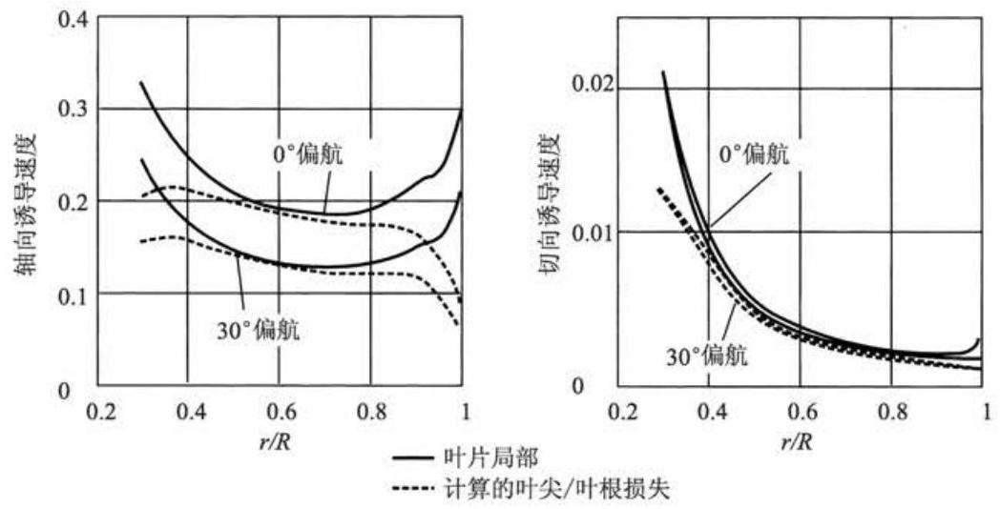

图 4.19 Delft 风力发电机组的各个方位的平均诱导速度因子

图 4.18 所定义的每个叶素的速度分量如图 4.20 所示。由于叶片的转速的原因, 切向速度要比法向速度大得多, 但法向速度在重要的叶片外侧段对攻角变化的影响却比较大，如图 4.21 所示。

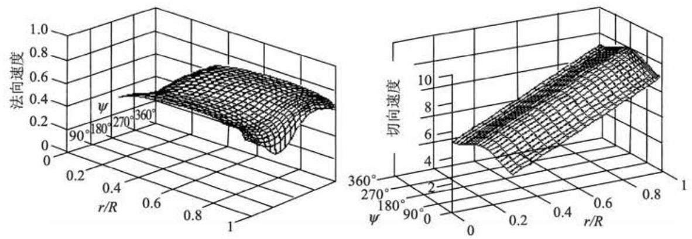

图 4.20 偏航角为 ${30}^{ \circ  }$ 风速归一化时的速度分量

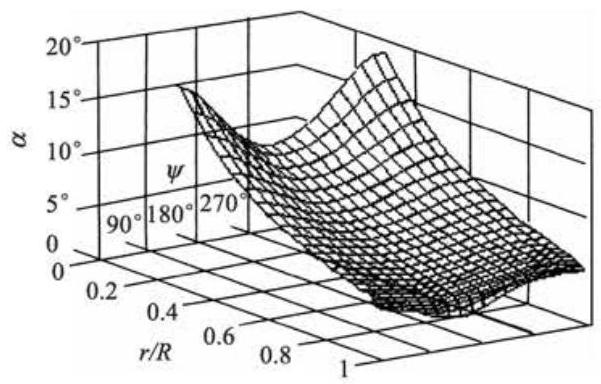

图 4.21 偏航角为 ${30}^{ \circ  }$ 时攻角的变化情况

在叶片的内侧段, 切向速度的变化对攻角的变化的影响最大, 这主要是由于叶片的几何特性随方位角变化引起的结果, 而不是诱导速度的影响。

### 4.2.10 风轮固定偏航时的叶片力

一旦求解出气流诱导因子, 叶片力就可以计算出来了。在求解气流诱导因子时忽略了气流膨胀速度的影响，叶片力没有使气流的动量有任何变化，在形成展开的尾流中不存在气流膨胀, 因而叶片不会引起气流中动量的变化。但是在计算叶片力时，气流膨胀速度必须要考虑在内。气流膨胀速度取决于总轴向气流诱导因子的平均值，但是使用环形区的平均值通过式 (4.50) 来求解会更方便。

在每一个叶素位置 $\mu$ 、方位角位置 $\theta$ 的气流角和攻角需要重新进行计算，因为现在必须要考虑气流膨胀速度的影响，所以要使用式 (4.44) 的未修正过的形式。 即使在计算诱导速度时没有考虑阻力的影响，现在也必须将其包括在叶片力的计算中。

每单位翼展垂直于旋转平面的叶片力为

$$
\frac{\mathrm{d}{F}_{\mathrm{x}}}{\mathrm{d}r} = \frac{1}{2}\rho {W}^{2}c{C}_{\mathrm{x}} \tag{4.54}
$$

它随叶片方位角位置的变化而变化。垂直于风轮平面的总的力可以通过式 (4.54) 沿每个叶片的长度对不同的方位角分别进行积分后, 再进行求和而获得。总法向力也随着叶轮方位角的变化而发生变化。

同样, 每单位翼展的切向叶片力为

$$
\frac{\mathrm{d}{F}_{\mathrm{y}}}{\mathrm{d}r} = \frac{1}{2}\rho {W}^{2}c{C}_{\mathrm{y}}
$$

因而产生的相对于旋转轴的叶片转矩为

$$
\frac{\mathrm{d}Q}{\mathrm{\;d}r} = \frac{1}{2}\rho {W}^{2}\operatorname{cr}{C}_{\mathrm{y}} \tag{4. 55}
$$

就像法向力一样, 沿着每个叶片进行积分并对所有的叶片求和, 就可以得到总的转矩。风轮转矩也将随着方位角位置的变化而变化，所以为了求得平均转矩值， 需要对方位角再进行积分。

### 4.2.11 固定偏航时的偏航力矩和倾斜力矩

由于气流膨胀, 流过偏航风轮的气流流动是非对称的, 这意味着叶片扫过上风向区的攻角比下风向的要大，如图 4.16 所示。因此，叶片上风向的升力比下风向的大, 对垂直于风轮平面的作用力应该使用类似的微分。因此, 可以看出, 绕偏航轴 (垂直轴) 产生一个使风轮轴恢复到与风向一致的净力矩。偏航力矩是从式 (4.54) 的法向力得到的

$$
\frac{\mathrm{d}{M}_{\mathrm{z}}}{\mathrm{d}r} = \frac{1}{2}\rho {W}^{2}\operatorname{cr}{C}_{\mathrm{x}}\sin \psi \tag{4.56}
$$

它也随叶片方位角位置的变化而变化。在每个方位角位置单叶片总的偏航力矩是通过式 (4.56) 沿着叶片长度进行积分而获得的。将所有叶片力矩在对应相位上相加, 将得到风轮的偏航力矩。

同样的计算过程可以用来求倾斜力矩, 关于风轮水平直径轴的力矩为

$$
\frac{\mathrm{d}{M}_{\mathrm{y}}}{\mathrm{d}r} = \frac{1}{2}\rho {W}^{2}\operatorname{cr}{C}_{\mathrm{x}}\cos \psi \tag{4. 57}
$$

叶素理论对偏航和倾斜力矩的存在的预测与动量和涡流定理不符, 因为只预测了转子盘的同一压力分布。实际上, 动量和涡流定理预测的速度, 从中只可能推测同一压力分布。

Delft 风力机的转子偏航力矩测量结果如图 4.22 所示, 相应的偏航力矩计算结果如图 4.23 所示。

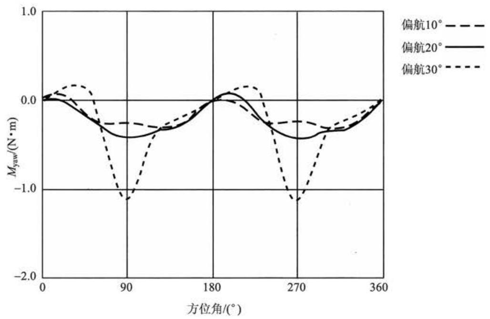

图 4.22 Delft 风力发电机组偏航力矩的测量值 (Snel 和 Schepers, 1995)

偏航力矩的测量值是从在半径为 ${129}\mathrm{\;{mm}}$ ,接近叶片根部的应变片上读出的水平方向的弯曲应变得到。水平方向的弯曲或挥舞方向的弯曲只产生垂直于风轮平面的位移。计算出的偏航力矩是由叶片上同样的径向位置求得的, 因而它不是相对于实际偏航轴的真实偏航力矩值。

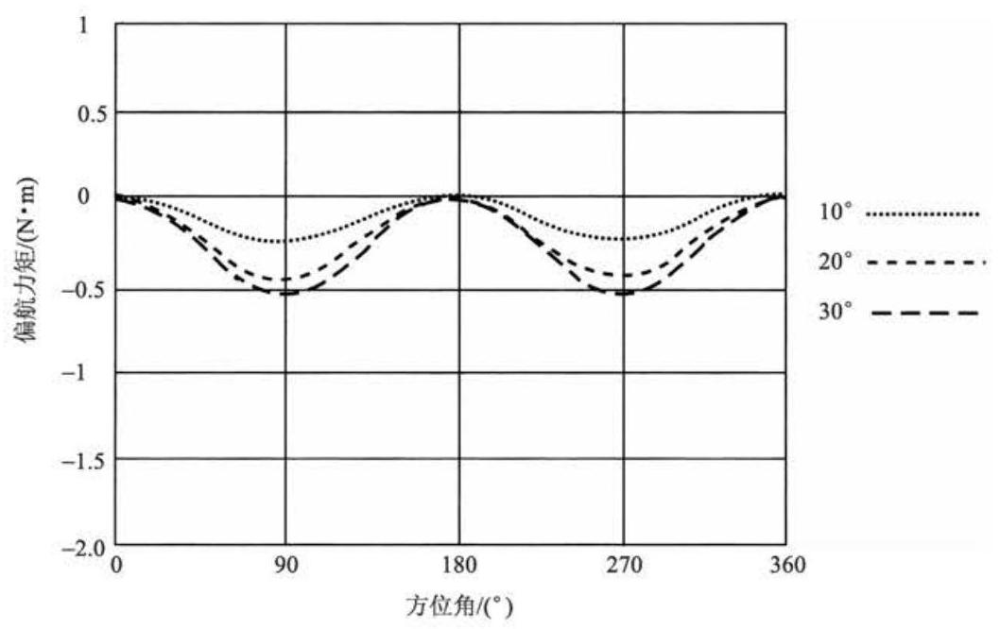

图 4.23 Delft 风力发电机组偏航力矩的计算值

考虑到理论的局限性, 偏航力矩测量值和计算值的比较是必需的。在偏航角为 30°时计算值比测量值低得多。在两个较小的偏航角上, 计算值和测量值较为接近。

应该注意的是，平均偏航力矩不为零，并且其符号为负，这意味着风轮在尽力使转轴恢复到风的方向。

偏航力矩的比较是对本节中所提出理论有效性的一个测试, 对于通常的工程目的, 该理论看起来通过了测试。

对于三个偏航角的情况, 倾斜力矩的测量值 (图 4.24) 随偏航角的变化似乎是被动的，而其计算值 (图 4.25) 随着偏航角的增加而增加。

在偏航角为 ${30}^{ \circ  }$ 时倾斜力矩的测量值和计算值相当。倾斜力矩测得的平均值明显不等于零且为正, 而其计算值要小得多, 但仍然为正值。一个正的倾斜旋转将使风轮圆盘的上部分在顺风方向产生位移。在理论上, 小的平均倾斜力矩是由尾流旋转速度引起的。

基于计算流体力学的理论, 应该提供更多风力机在偏航时空气动力学的精确预测。但是, 由于 CFD 解法所需的计算时间有严格限制而放弃其使用, 而应用这些章节提到的其他简单理论。

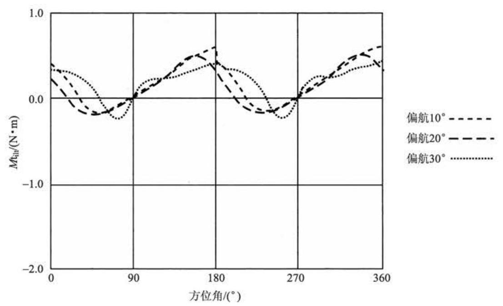

图 4.24 Delft 风力发电机组的倾斜力矩的测量值 (Snel 和 Schepers, 1995)

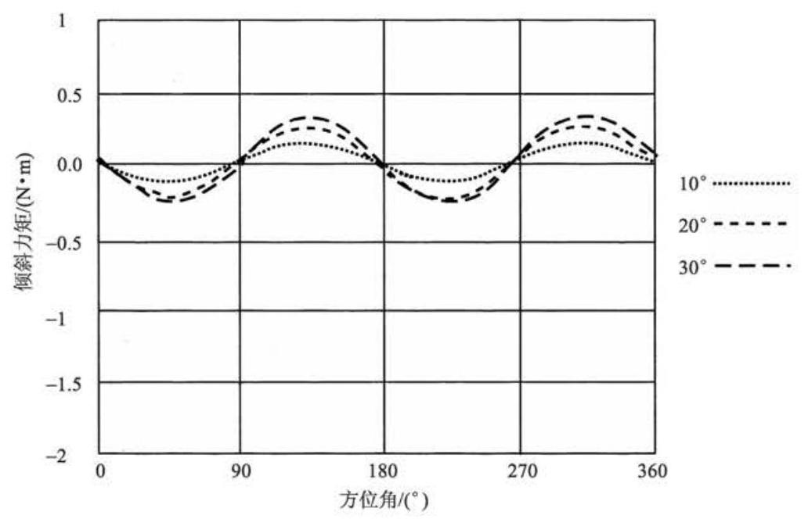

图 4.25 Delft 风力发电机组的倾斜力矩的计算值

## 4.3 加速势方法

### 4.3.1 引 言

用于直升机旋翼飞行性能的基于加速势概念的空气动力学模型同样也可以应用到轻载的风力机上。这种方法允许通过致动盘的不均匀的压力降分布, 这比动量定理中力均匀分布是严格均匀的更具有普遍性。该模型是 Prandtl 将致动盘作为环形机翼来处理，建立了致动盘附近流场的表达式。Kinner (1937) 对此模型作了详细的解释。为了将风轮看作环形机翼，需要叶片细长并无限大，所以叶片实度很小。

Kinner 的理论是从欧拉方程中推导出来的, 该理论假设诱导速度与普通的气流速度相比值很小。如果 $u\text{ 、 }v$ 和 $w$ 分别是致动盘在 $x\text{ 、 }y$ 和 $z$ 方向上的诱导速度, 并且都比自由气流速度在 $x$ 方向的 ${U}_{\infty }$ 要小很多,那么在 $x$ 方向,每单位体积的动量变化率将反映该方向的压力梯度。

$$
\rho \left\lbrack  {\left( {{U}_{\infty } + u}\right) \frac{\partial \left( {{U}_{\infty } + u}\right) }{\partial x} + v\frac{\partial \left( {{U}_{\infty } + u}\right) }{\partial y} + w\frac{\partial \left( {{U}_{\infty } + u}\right) }{\partial z}}\right\rbrack   =  - \frac{\partial p}{\partial x} \tag{4.58}
$$

自由流速度 ${U}_{\infty }$ 不随位置而变化,于是 $\partial {U}_{\infty }/\partial x = 0$ 。同样,如果 ${U}_{\infty } \gg  \left( {u, v, w}\right)$ ,则 $v\left( {\partial u/\partial y}\right)$ 与 ${U}_{\infty }\left( {\partial u/\partial x}\right)$ 相比就可以被忽略。那么,在 $x$ 方向的动量方程简化为

$$
\rho {U}_{\infty }\frac{\partial u}{\partial x} =  - \frac{\partial p}{\partial x} \tag{4.59}
$$

同样,在 $y$ 和 $z$ 方向的动量方程也可以简化为

$$
\rho {U}_{\infty }\frac{\partial v}{\partial x} =  - \frac{\partial p}{\partial y} \tag{4.60}
$$

和

$$
\rho {U}_{\infty }\frac{\partial w}{\partial x} =  - \frac{\partial p}{\partial z} \tag{4.61}
$$

每个动量方程对其各自的特定方向进行微分, 然后把结果相加有

$$
\rho {U}_{\infty }\frac{\partial }{\partial x}\left( {\frac{\partial u}{\partial x} + \frac{\partial v}{\partial y} + \frac{\partial w}{\partial z}}\right)  =  - \left( {\frac{{\partial }^{2}p}{\partial {x}^{2}} + \frac{{\partial }^{2}p}{\partial {y}^{2}} + \frac{{\partial }^{2}p}{\partial {z}^{2}}}\right)
$$

但是,对于连续性气流为

$$
\frac{\partial u}{\partial x} + \frac{\partial v}{\partial y} + \frac{\partial w}{\partial z} = 0
$$

因此,

$$
\frac{{\partial }^{2}p}{\partial {x}^{2}} + \frac{{\partial }^{2}p}{\partial {y}^{2}} + \frac{{\partial }^{2}p}{\partial {z}^{2}} = 0 \tag{4.62}
$$

式 (4.62) 是控制致动盘上及其周围压力场的拉普拉斯方程。在给定的致动盘边界条件下, 可以求解压力场, 而且特别是致动盘上的压力分布。对于风力机来说, 压力分布除了在通过风轮圆盘面有一个通常不连续的压力 (或者压降) 外, 其他各处都是连续的。

在 Coleman(1945)的分析中, 通过风轮圆盘的压降分布是均匀的 (这只是该理论与叶素理论综合的一个结果, 可以得到一个不均匀的压力分布), 但是在圆盘边缘突然降到零。Kinner 假设圆盘边缘的压降为零, 而且随着半径的减小以一种连续的方式发生变化。

简化的欧拉式 (4.59) (式 (4.61) 可以将压力看作势场，通过微分获得加速场, 通过积分获得速度场。从已知自由流边界条件的上游开始, 逐渐向风轮圆盘积分即可确定速度分量。

穿过风轮圆盘的不连续压力, 如图 3.2 所示。压力阶跃的大小是压力级别的 2 倍 (在远场级别之上), 且发生在风轮的上风向。然而, 压力梯度一般来说在旋转盘上是连续的。

### 4.3.2 Kinner 的通用压力分布理论

Kinner 的式 (4.62) 的解法 (1937) 很复杂, 是通过坐标变换得到的。将图 4.11 中所定义的位于风轮平面中心的笛卡尔坐标系 $\left( {{x}^{\prime \prime },{y}^{\prime }, z}\right)$ 变换为所谓的椭圆形坐标系 $\left( {v,\eta ,\psi }\right)$ :

$$
\frac{{x}^{\prime \prime }}{R} = {v\eta },\;\frac{{y}^{\prime }}{R} = \sqrt{1 - {v}^{2}}\sqrt{1 + {\eta }^{2}}\sin \psi ,\;\frac{z}{R} = \sqrt{1 - {v}^{2}}\sqrt{1 + {\eta }^{2}}\cos \psi \tag{4.63}
$$

其中, $\phi$ 表示方位角。

在风轮盘表面, $\eta  = 0$ 和 $r/R = \mu  = \sqrt{1 - {v}^{2}}$ ,或者反过来 $v = \sqrt{1 - {\mu }^{2}}$ ,将变量逐行转换分开, 压力场可以表示为三个函数的乘积的形式

$$
p\left( {v,\eta ,\psi }\right)  = {\Phi }_{1}\left( v\right) {\Phi }_{2}\left( \eta \right) {\Phi }_{3}\left( \psi \right) \tag{4.64}
$$

每个独立的函数都是一个独立的、常微分方程的解,

$$
\frac{\mathrm{d}}{\mathrm{d}v}\left\lbrack  {\left( {1 - {v}^{2}}\right) \frac{\mathrm{d}{\Phi }_{1}\left( v\right) }{\mathrm{d}v}}\right\rbrack   + \left\lbrack  {n\left( {n - 1}\right)  - \frac{{m}^{2}}{1 - {v}^{2}}}\right\rbrack  {\Phi }_{1}\left( v\right)  = 0 \tag{4.65}
$$

$$
\frac{\mathrm{d}}{\mathrm{d}\eta }\left\lbrack  {\left( {1 + {\eta }^{2}}\right) \frac{\mathrm{d}{\Phi }_{2}\left( \eta \right) }{\mathrm{d}\eta }}\right\rbrack   + \left\lbrack  {\frac{{m}^{2}}{1 + {\eta }^{2}} - n\left( {n + 1}\right) }\right\rbrack  {\Phi }_{2}\left( \eta \right)  = 0 \tag{4.66}
$$

$$
\frac{{\mathrm{d}}^{2}{\Phi }_{3}\left( \psi \right) }{\mathrm{d}{\psi }^{2}} + {m}^{2}{\Phi }_{3}\left( \psi \right)  = 0 \tag{4.67}
$$

式中, $m, n$ 为正整数。

式(4.65)和式(4.66)有勒让德的伴随微分方程的形式，该方程的解分别是勒让德伴随多项式的第一项和第二项(van Bussel，1995)。

如果 $m = 0$ ，那么式(4.65)变为勒让德微分方程，其解为

$$
{\Phi }_{1}\left( v\right)  = {P}_{n}\left( v\right) \tag{4.68}
$$

$$
{\Phi }_{1}\left( v\right)  = {Q}_{n}\left( v\right) \tag{4.69}
$$

式中, ${P}_{n}\left( v\right)$ 为第一类勒让德多项式的第一项; ${Q}_{n}\left( v\right)$ 为第二类勒让德多项式的第二项。

$$
{P}_{n}\left( v\right)  = \frac{1}{{2}^{n}n!}\frac{{\mathrm{d}}^{n}}{\mathrm{\;d}{v}^{n}}{\left( {v}^{2} - 1\right) }^{n} \tag{4.70}
$$

虽然多项式超出了 ${v}^{2} \leq  1$ 的范围，但是超出该范围的多项式是正交多项式，即

$$
{\int }_{-1}^{1}{P}_{n}\left( v\right) {P}_{k}\left( v\right) \mathrm{d}v = 0,\;n \neq  k \tag{4.71}
$$

当 $n = 0$ 时,第二类勒让德多项式是

$$
{Q}_{0}\left( v\right)  = \frac{1}{2}\ln \left( \frac{1 + v}{1 - v}\right) \tag{4.72}
$$

当 $n > 0$ 时,第二类勒让德多项式的 ${Q}_{n}\left( v\right)$ 可以通过第一类勒让德多项式的 ${P}_{n}\left( v\right)$ 求解。对于 $n = 1,\cdots ,4$ 有

$$
{Q}_{1}\left( v\right)  = {P}_{1}\left( v\right) {Q}_{0}\left( v\right)  - 1
$$

$$
{Q}_{2}\left( v\right)  = {P}_{2}\left( v\right) {Q}_{0}\left( v\right)  - \frac{3}{2}v \tag{4.73}
$$

$$
{Q}_{3}\left( v\right)  = {P}_{3}\left( v\right) {Q}_{0}\left( v\right)  - \frac{5}{2}{v}^{2} + \frac{2}{3}
$$

$$
{Q}_{4}\left( v\right)  = {P}_{4}\left( v\right) {Q}_{0}\left( v\right)  - \frac{35}{8}{v}^{3} + \frac{55}{24}v
$$

在 $m = 0$ 时,式 (4.66) 的解与式 (4.65) 的解相同,但是有虚数变量,也就是说,

$$
{\Phi }_{2}\left( \eta \right)  = {P}_{n}\left( {i\eta }\right) \tag{4.74}
$$

和

$$
{\Phi }_{2}\left( \eta \right)  = {Q}_{n}\left( {i\eta }\right) \tag{4.75}
$$

其中

$$
{Q}_{0}\left( {i\eta }\right)  = i\arctan \left( \eta \right) \left( {\eta  < 1}\right) ,\;{Q}_{0}\left( {i\eta }\right)  = i\left( {\pi /2 - \arctan \eta }\right) \left( {\eta  > 1}\right)
$$

对于非零的正整数 $m$ ,式 (4.65) 的解变为

$$
{P}_{n}^{m}\left( v\right)  = {\left( 1 - {v}^{2}\right) }^{m/2}\frac{{\mathrm{d}}^{m}}{\mathrm{\;d}{v}^{m}}{P}_{n}\left( v\right) \tag{4.76}
$$

如果 $m > n$ ,则 ${P}_{n}^{m}\left( v\right)  = 0$ 。

$$
{Q}_{n}^{m}\left( v\right)  = {\left( 1 - {v}^{2}\right) }^{m/2}\frac{{\mathrm{d}}^{m}}{\mathrm{\;d}{v}^{m}}{Q}_{n}\left( v\right)
$$

但是,由式 (4.72) 可知 ${v}^{2} = 1$ 在 ${Q}_{n}^{m}\left( v\right)  = \infty$ 时是不适用的,所以这些函数在解中排除了。

对于非零值的 $m$ ,方程 (4.66) 的解为

$$
{P}_{n}^{m}\left( {i\eta }\right)  = {\left( 1 + {\eta }^{2}\right) }^{m/2}\frac{{\mathrm{d}}^{m}}{\mathrm{\;d}{\left( i\eta \right) }^{m}}{P}_{n}\left( {i\eta }\right)
$$

通过观察可以看出,随着 $\eta  \rightarrow  \infty ,{P}_{n}^{m}\left( {i\eta }\right)  \rightarrow  \infty$ ,表示压力在远场的值无限大,这是不能接受的, 因此, 这些项也不能被包括在内。

$$
{Q}_{n}^{m}\left( {i\eta }\right)  = {\left( 1 + {\eta }^{2}\right) }^{m/2}\frac{{\mathrm{d}}^{m}}{\mathrm{\;d}{\left( i\eta \right) }^{m}}{Q}_{n}\left( {i\eta }\right) \tag{4.77}
$$

式 (4.76) 和式 (4.77) 是联合勒让德多项式。

微分方程 (4.67) 的解比其他两个控制方程的解要更直接一些。

$$
{\Phi }_{3}\left( \psi \right)  = \cos {m\psi },{\Phi }_{3}\left( \psi \right) \sin {m\psi } \tag{4.78}
$$

因此，绕风轮盘的压力场的全解为

$$
p\left( {v,\eta ,\psi }\right)  = \mathop{\sum }\limits_{{m = 0}}^{M}\mathop{\sum }\limits_{{n = m}}^{N}{P}_{n}^{m}\left( v\right) {Q}_{n}^{m}\left( {i\eta }\right) \left( {{C}_{n}^{m}\cos {m\psi } + {D}_{n}^{m}\sin {m\psi }}\right) \tag{4.79}
$$

$M$ 和 $N$ 的上限值可以是任意正整数值。

当 $m$ 是奇数时,多项式 ${Q}_{n}^{m}\left( {i\eta }\right)$ 是虚数; 当 $m$ 是偶数时,多项式 ${Q}_{n}^{m}\left( {i\eta }\right)$ 是实数。 因此,任意常数 ${C}_{n}^{m}$ 和 ${D}_{n}^{m}$ 一定为实数或虚数,其相应的压力场也为实数。

在式 (4.79) 中, 适合条件的各项任意组合均可采用。压力在通过圆盘时有一个不连续的变化,而在其他地方是连续变化的,所以解必须严格限定在 $\left( {n + m}\right)$ 为奇数的情况下。当然, 除了以上所叙述的以外, 限制项数, 可能得到近似解的结果。

通过风轮圆盘的压力的不连续如图 3.2 所示。压力的阶跃幅值是正好发生在圆盘上游的压力 (高于远场处) 的 2 倍。垂直于风轮圆盘的压力梯度却是连续的。

### 4.3.3 压力的轴对称分布

对于风力机圆盘最简单的情况是在 $m = 0$ 时,此时的压力是成轴对称分布的。 $n$ 的允许值必须为奇数。

当 $n = 1$ 时,多项式为

$$
{P}_{1}^{0}\left( v\right)  = v = \sqrt{1 - {\mu }^{2}} \tag{4.80}
$$

和

$$
{Q}_{1}^{0}\left( {i\eta }\right)  = \eta \arctan \frac{1}{\eta } - 1 \tag{4.81}
$$

其中在圆盘上, $\eta  = 0$ ,

$$
{Q}_{1}^{0}\left( {i}_{0}\right)  =  - 1
$$

因此, 压力分布为

$$
p\left( \mu \right)  =  - {C}_{1}^{0}\sqrt{1 - {\mu }^{2}} \tag{4.82}
$$

如果使用自由流动态压力 $\left( {1/2}\right) \rho {U}_{\infty }^{2}$ 在式 (4.82) 中求得的压力是无量纲的,那么 ${C}_{0}^{1}$ 的值与通过压力分布公式 (4.82) 在整个圆盘面积上积分所得的推力系数相关,

$$
\pi {R}^{2}{C}_{\mathrm{T}} =  - {R}^{2}{C}_{1}^{0}{\int }_{0}^{2\pi }{\int }_{0}^{1}\sqrt{1 - {\mu }^{2}}\mu \mathrm{d}\mu \mathrm{d}\psi  =  - \frac{2}{3}\pi {R}^{2}{C}_{1}^{0}
$$

因此, 有

$$
{C}_{1}^{0} =  - \frac{3}{2}{C}_{\mathrm{T}} \tag{4.83}
$$

并且通过圆盘的压力阶跃为

$$
{p}_{1}\left( \mu \right)  = \frac{3}{2}{C}_{\mathrm{T}}\sqrt{1 - {\mu }^{2}} \tag{4.84}
$$

所有的剩余多项式 (当 $m = 0, n > 1$ 且为奇数时) 引起的推力为零。

为了修正压力分布, 使之符合边界条件, 一个合适的线性联合解可以添加到式 (4.84)上。

直升机旋翼的应用导出了压力和径向压力梯度在旋转轴处为零这样一个条件, 这个条件符合实风轮圆盘相应的压力一样。上述的压力分布在转轴上没有压力为零的点,所以至少需要与另一个解相结合。 $n = 3$ 时的第二个轴对称的解为

$$
{P}_{3}^{0}\left( v\right)  = \frac{1}{2}v\left( {5{v}^{2} - 3}\right)  = \frac{1}{2}\sqrt{1 - {\mu }^{2}}\left( {2 - 5{\mu }^{2}}\right) \tag{4.85}
$$

和

$$
{Q}_{3}^{0}\left( {i\eta }\right)  =  - \frac{\eta }{2}\left( {5{\eta }^{2} + 3}\right) \arctan \frac{1}{\eta } + \frac{5}{2}{\eta }^{2} + \frac{2}{3},{Q}_{3}^{0}\left( {i}_{0}\right)  = \frac{2}{3} \tag{4.86}
$$

因此, 第二个压力分布为

$$
{p}_{2}\left( \mu \right)  = \frac{1}{3}{C}_{3}^{0}\sqrt{1 - {\mu }^{2}}\left( {2 - 5{\mu }^{2}}\right) \tag{4.87}
$$

在 $\mu  = 0$ 时,两个压力分布的和必为零,所以有

$$
{C}_{3}^{0} =  - \frac{9}{4}{C}_{\mathrm{T}}
$$

联立两个分布, 则

$$
{p}_{1 - 2}\left( \mu \right)  = \frac{15}{4}{C}_{\mathrm{T}}{\mu }^{2}\sqrt{1 - {\mu }^{2}} \tag{4.88}
$$

注意到式 (4.84)、式(4.87)、式(4.88) 所有的压力分布因自由流的动态压力而正常化， ${0.5\rho }{U}_{\infty }^{2}$ ，每个事例皆如此。三个正常化分布如图 4.26 所示。

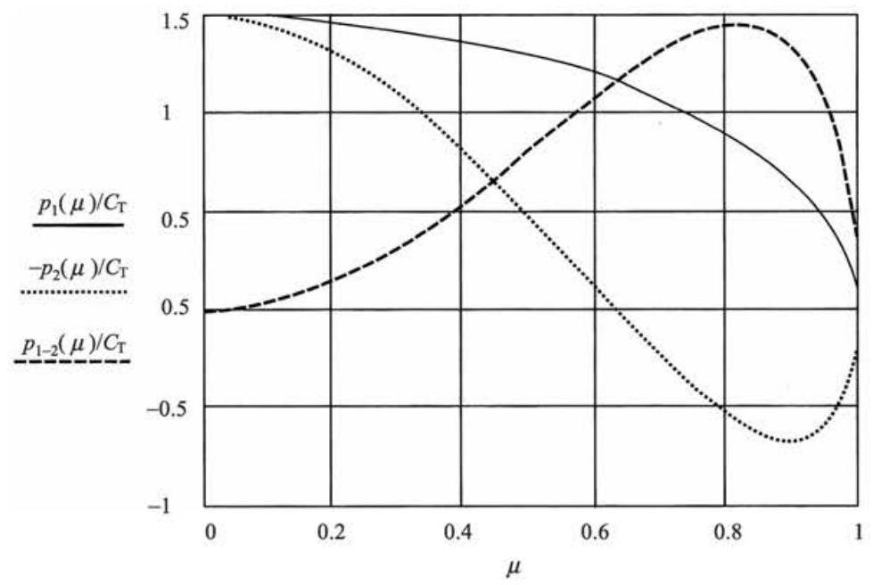

图 4.26 初始两个解的径向压力分布曲线和在转轴满足必要条件时的联合曲线

因为大多数现代风力机的设计是为了获得最大效率，这同获得均匀的压力一样是可行的, 直升机旋翼所选择的形式可能需要对其进行修正。均匀压力分布可以通过组合解来形成, 但是因为压力的不连续使其自身在圆盘边缘也不连续, 这就意味着需要很多的解。叶尖损失效应需要在叶尖和轮毂处的压力为零,但是大部分叶片翼展上的压力应该是均匀的。应该指出的是, 由均匀压力引起的叶片载荷并不随半径线性增加。

由轴对称压力分布所引起的诱导速度场必须从自由流条件已知的远上游处开始, 由积分式(4.59) <式(4.61)求得。上游剖面条件也同样取决于风轮圆盘的偏航角。连续进行积分直到到达圆盘上某个点的诱导速度可以确定为止。

决定叶素攻角起重要作用的特定的诱导速度分量是垂直于风轮圆盘的, 即轴向诱导速度。Mangler 和 Squire(1950)通过将速度表示为方位角 $\psi$ 的傅里叶级数, 计算出轴向诱导速度分布是随偏航角变化的函数。

$$
\frac{u}{{U}_{\infty }} = {C}_{\mathrm{T}}\left\lbrack  {\frac{{A}_{0}\left( {\mu ,\gamma }\right) }{2} + \mathop{\sum }\limits_{{k = 1}}^{\infty }{A}_{k}\left( {\mu ,\gamma }\right) \sin {k\psi }}\right\rbrack \tag{4.89}
$$

对于方程(4.88)的压力分布，傅里叶系数为

$$
{A}_{0}\left( {\mu ,\gamma }\right)  =  - \frac{15}{8}{\mu }^{2}\sqrt{1 - {\mu }^{2}} \tag{4.90}
$$

$$
{A}_{1}\left( {\mu ,\gamma }\right)  =  - \frac{15}{256}\mu \left( {9{\mu }^{2} - 4}\right) \tan \frac{\gamma }{2} \tag{4.91}
$$

$$
{A}_{3}\left( {\mu ,\gamma }\right)  =  - \frac{45\pi }{256}{\mu }^{3}{\tan }^{3}\frac{\gamma }{2} \tag{4.92}
$$

高次奇数项为零。偶数项的一般形式为

$$
{A}_{k} =  - {\left( -1\right) }^{\frac{k - 2}{2}}\frac{3}{4}\left\lbrack  {\frac{k + v}{{k}^{2} - 1}\left( \frac{9{v}^{2} + {k}^{2} - 6}{{k}^{2} - 9}\right)  + \frac{3v}{{k}^{2} - 9}}\right\rbrack  {\left( \frac{1 - v}{1 + v}\right) }^{\frac{k}{2}}{\tan }^{\frac{k}{2}}\frac{\gamma }{2}
$$

其中, ${v}^{2} = 1 - {\mu }^{2}$ ,而且 $k$ 是大于零的偶数。

轴向诱导气流因子的平均值与偏航角无关, 其公式如下:

$$
{a}_{0} = \frac{{u}_{0}}{{U}_{\infty }} = \frac{1}{4}{C}_{\mathrm{T}}
$$

式中， ${u}_{0}$ 为平均轴向诱导速度。

因此，轴向诱导气流因子的平均值与推力系数相关，

$$
{C}_{\mathrm{T}} = 4{a}_{0} \tag{4.93}
$$

式 (4.93) 可以与动量定理 ${C}_{\mathrm{T}} = 4{a}_{0}\left( {1 - {a}_{0}}\right)$ 或者任何一个由偏航条件推导的表达式[式(4.2)、式(4.18)和式(4.24)]相当。

由于假定诱导速度比气流速度小， ${a}_{0}$ 小于 1 。很明显，加速度势方法只能应用于 ${C}_{\mathrm{T}}$ 值远远小于 1 的情况。

式(4.89)中每转一次的项引起了攻角的变化，因而引起了产生偏航力矩的风轮圆盘升力的变化。但是压力分布是轴对称的, 不会引起偏航力矩。这种情况与 Coleman, Feingold 和 Stempin(1945)提出的涡流理论相同。

对于轴向诱导气流因子的变化, Pitt 和 Peters(1981) 使用或强行使用 Glauert 假设[式(4.21)]。

$$
a = {a}_{0} + {a}_{\mathrm{s}}\mu \sin \phi \tag{4.94}
$$

${a}_{3}$ 的值是通过使用式(4.94)的Mangler 和 Squire 速度分布形式，使式(4.89)的偏航轴的初始力矩与方程 (4.90) 一方程 (4.92) 的初始力矩相等来求解而得到的。

$$
{\int }_{0}^{2\pi }{\int }_{0}^{1}\mu \sin \psi \left( {{a}_{0} + {a}_{8}\mu \sin \psi }\right) \mu \mathrm{d}\mu \mathrm{d}\psi
$$

$$
= {\int }_{0}^{2\pi }{\int }_{0}^{1}{C}_{\mathrm{T}}\mu \sin \psi \left\lbrack  {\frac{{A}_{0}\left( {\mu ,\gamma }\right) }{2} + \mathop{\sum }\limits_{{k = 1}}^{\infty }{A}_{n}\left( {\mu ,\gamma }\right) \sin {k\psi }}\right\rbrack  \mu \mathrm{d}\mu \mathrm{d}\psi \tag{4.95}
$$

除了包含 ${A}_{1}$ 的项,其他所有项的积分为零,则有

$$
{a}_{\mathrm{s}} = \frac{15\pi }{128}{C}_{\mathrm{T}}\tan \frac{\gamma }{2} \tag{4.96}
$$

因此，由式 (4.93) 得出轴向诱导速度为

$$
a = {a}_{0}\left( {1 + \frac{15\pi }{32}\mu \tan \frac{\gamma }{2}\sin \psi }\right) \tag{4.97}
$$

式(4.97)中除了用偏航角替代尾流偏斜角外，式(4.21)和式(4.31)具有同样的形式，因此，在对于处理偏航气流的不同方法上有一些一致性。

### 4.3.4 压力的反对称分布

在偏航的风力机上有一个绕垂直直径的力矩一一恢复偏航力矩。然而，轴对称压力分布不能产生一个偏航力矩, 因此, 式 (4.79) 的级数解中需要包括更多的项。

在式 (4.79) 中能求解出偏航力矩的唯一项是那些满足 $m = 1$ 和 ${D}_{n}^{1} \neq  0$ 的项。 $m = 1$ 且 ${C}_{n}^{1} \neq  0$ 的这些项将产生倾斜力矩。如前所述， $\left( {m + n}\right)$ 必须为奇数，才能求得通过圆盘的不连续的压力,与 $m = 1$ 结合的 $n$ 的值必须为偶数。

根据勒让德多项式的性质, 在式 (4.79) 的级数中只有一项将产生净推力, 并且只有一项将产生一阶的偏航力矩。同样, 也只有一项将产生二阶力矩, 依此类推。

因此,式 (4.79) 中产生偏航力矩的唯一项为满足 $m = 1, n = 2$ 且 ${C}_{n}^{1} \neq  0$ 的项,

$$
{P}_{2}^{1}\left( v\right)  = {3v}\sqrt{1 - {v}^{2}} = {3\mu }\sqrt{1 - {\mu }^{2}} \tag{4.98}
$$

和

$$
{Q}_{2}^{1}\left( {i\eta }\right)  = {3i\eta }\sqrt{1 + {\eta }^{2}}\arctan \frac{1}{\eta } - {3i}\sqrt{1 + {\eta }^{2}} + \frac{i}{\sqrt{1 + {\eta }^{2}}} \tag{4. 99}
$$

所以

$$
{Q}_{2}^{1}\left( {i}_{0}\right)  =  - {2i} \tag{4.100}
$$

转轴的零压力梯度在这种情况下是不适合的, 因为压力分布对于偏航轴是反对称分布的, 因此有

$$
p\left( {\mu ,\psi }\right)  = {P}_{2}^{1}\left( \mu \right) {Q}_{2}^{1}\left( {i}_{0}\right) {D}_{2}^{1}\sin \psi  =  - {6i}{D}_{2}^{1}\mu \sqrt{1 - {\mu }^{2}}\sin \psi \tag{4.101}
$$

压力分布如图 4.27 所示。

偏航力矩的系数定义为

$$
{C}_{\mathrm{{mz}}} = \frac{{M}_{z}}{\frac{1}{2}\rho {U}_{\infty }^{2}\pi {R}^{3}} \tag{4.102}
$$

像以前一样,如果式 (4.101) 中的压力是无量纲的,用自由流动态压 $\frac{1}{2}\rho {U}_{\infty }^{2}$ 无量纲化的, 则有

$$
{C}_{\mathrm{m}z} = \frac{1}{\pi }{\int }_{0}^{2\pi }{\int }_{0}^{1}\mu \sin {\phi p}\left( {\mu ,\psi }\right) \mu \mathrm{d}\mu \mathrm{d}\psi  =  - \frac{1}{\pi }{6i}{D}_{2}^{1}{\int }_{0}^{1}{\mu }^{3}\sqrt{1 - {\mu }^{2}}\mathrm{\;d}\mu {\int }_{0}^{2\pi }{\sin }^{2}\psi \mathrm{d}\psi
$$

(4.103)

其中

$$
i{D}_{2}^{1} =  - \frac{5}{4}{C}_{\mathrm{m}z} \tag{4.104}
$$

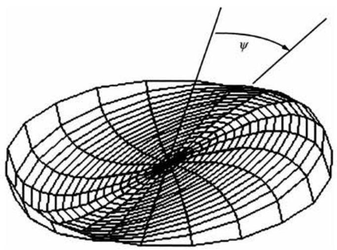

图 4.27 产生偏航力矩的压力分布图

为了建立偏航力矩系数和由式 (4.101) 的压力分布所引起的轴向速度的关系, 必须将式 (4.59) 二式 (4.61) 进行积分而求得速度分布。不幸的是, 对于反对称的情况与 Mangler 和 Squire 对于对称的情况一样, 不能求出其解析解。诱导速度的数值解需要由式(4.59) (4) 式(4.61) 使用式(4.98) 和式(4.99) 定义的压力分布来进行计算。

对于偏航角从 ${0}^{ \circ  } \sim  {90}^{ \circ  }$ 的值, Pitt 和 Peters (1981)已经求解出了轴向速度的分布情况:偏航轴定位于积分开始的远端上游处。所求得的速度分布是对应于式 (4.89)的轴对称情况。Pitt 和 Peters 使用了与式 (4.94) 相同的方法, 又一次利用了式 (4.95) 的形式,求解出轴向诱导速度 ${a}_{0}$ 的平均值和 ${a}_{\mathrm{s}}$ 的值。当然,在这两种情况中需要使用数值积分。

正如从反对称压力分布中预期的那样, ${a}_{0}$ 的值不为零,但是其却与式 (4.88) 修正的轴对称压力分布求得的 ${a}_{\mathrm{s}}$ 的值大小相同、方向相反。随偏航角 $r$ 变化的 ${a}_{0}$ 和 ${a}_{\mathrm{s}}$ 系数通过数值计算求得,使用 Mangler 和 Squire 分析形式作为指导,可以推断出其解析式。Pitt 和 Peters 的线性的轴向诱导速度的分布为

$$
{a}_{0} =  - \frac{15}{128}\pi \tan \frac{\gamma }{2}{C}_{\mathrm{{mz}}} \tag{4.105}
$$

和

$$
{a}_{\mathrm{s}} =  - \left( {1 - {\tan }^{2}\frac{\gamma }{2}}\right) {C}_{\mathrm{m}z} \tag{4.106}
$$

Pitt 和 Peters 在式(4.94)表示的线性轴向诱导因子表达式中加上了一个只有当 ${C}_{2}^{1} \neq  0$ 时才出现的余弦项。

$$
a = {a}_{0} + {a}_{\mathrm{s}}\mu \sin \psi  + {a}_{\mathrm{c}}\mu \cos \psi \tag{4.107}
$$

在这种情况下, 将有一个附加的压力分布为

$$
p\left( {\mu ,\psi }\right)  = {P}_{2}^{1}\left( \mu \right) {Q}_{2}^{1}\left( {i}_{0}\right) {C}_{2}^{1}\cos \psi  =  - {6i}{C}_{2}^{1}\mu \sqrt{1 - {\mu }^{2}}\cos \psi \tag{4.108}
$$

倾斜力矩系数为

$$
{C}_{\mathrm{m}y} = \frac{1}{\pi }{\int }_{0}^{2\pi }{\int }_{0}^{1}\mu \cos {\psi p}\left( {\mu ,\psi }\right) \mu \mathrm{d}\mu \mathrm{d}\psi  =  - \frac{1}{\pi }{6i}{C}_{2}^{1}{\int }_{0}^{1}{\mu }^{3}\sqrt{1 - {\mu }^{2}}\mathrm{\;d}\mu {\int }_{0}^{2\pi }{\cos }^{2}\psi \mathrm{d}\psi
$$

(4.109)

因此，

$$
i{C}_{2}^{1} =  - \frac{5}{4}{C}_{\text{ my }} \tag{4. 110}
$$

从式(4.108)的压力场中产生的轴向诱导速度分布是通过对式(4.59)～式 (4.61)进行积分计算得出的, 这与使用和式(4.95)相同方法的式 (4.107) 的线性速度分布相配。

$$
{\int }_{0}^{2\pi }{\int }_{0}^{1}\mu \cos \psi \left( {{a}_{0} + {a}_{c}\mu \cos \psi }\right) \mu \mathrm{d}\mu \mathrm{d}\psi
$$

$$
= {\int }_{0}^{2\pi }{\int }_{0}^{1}{\mu \cos \psi }{C}_{\mathrm{T}}\left( {\frac{1}{2}{A}_{0}\left( {\mu ,\gamma }\right)  + \mathop{\sum }\limits_{{k = 1}}^{\infty }{A}_{k}\left( {\mu ,\gamma }\right) \cos {k\psi }}\right) {\mu \mathrm{\;d}\mu \mathrm{\;d}\psi } \tag{4.111}
$$

函数 ${A}_{n}\left( {\mu ,\gamma }\right)$ 由数值计算求得。再一次使用 Mangler 和 Squire 的结果作为指导，得到了 ${a}_{\mathrm{c}}$ 的表达式为

$$
{a}_{\mathrm{c}} =  - {\sec }^{2}\frac{\gamma }{2}{C}_{\mathrm{{my}}} \tag{4.112}
$$

### 4.3.5 Pitt 和 Peters 模型

Pitt 和 Peters(1981)建立了一个线性理论,求得了轴向诱导因子与式(4.93)、 式(4.96)、式(4.105)、式(4.106)和式(4.112)给出的推力和力矩系数之间的关系， 其合成矩阵形式为

$$
\left\lbrack  \begin{array}{l} {a}_{0} \\  {a}_{\mathrm{s}} \\  {a}_{\mathrm{s}} \end{array}\right\rbrack   = \left\lbrack  \begin{matrix} \frac{1}{4} & 0 &  - \frac{15}{128}\pi \tan \frac{\gamma }{2} \\  0 &  - {\sec }^{2}\frac{\gamma }{2} & 0 \\  \frac{15}{128}\pi \tan \frac{\gamma }{2} & 0 &  - \left( {1 - {\tan }^{2}\frac{\gamma }{2}}\right)  \end{matrix}\right\rbrack  \left\lbrack  \begin{array}{l} {C}_{\mathrm{T}} \\  {C}_{\mathrm{{my}}} \\  {C}_{\mathrm{{mz}}} \end{array}\right\rbrack \tag{4. 113}
$$

$$
\left( a\right)  = \left\lbrack  L\right\rbrack  \left( C\right) \tag{4.114}
$$

使用上式的过程是反复迭代的过程,假定 $\left( a\right)$ 的初始值,用叶素理论计算出 (C)的值，然后用式(4.113)和式(4.114)建立新的(a)的值。

对于风轮来说， ${a}_{0}$ 的值与 1 相比应该不会很小，所以上述过程将收敛于与动量定理给出的值相比其值很小的 ${a}_{0}$ 。

为了得到更为实际的结果, 也就是与 Glauert 动量定理相符的结果

$$
{C}_{\mathrm{T}} = {4a}\sqrt{1 - a\left( {2\cos \gamma  - a}\right) } = {4a}{A}_{\mathrm{G}}\left( a\right) \tag{4. 115}
$$

或者与 Coleman 定理相符的结果

$$
{C}_{\mathrm{T}} = {4a}\left( {\cos \gamma  + \tan \frac{\chi }{2}\sin \gamma  - a{\sec }^{2}\frac{\chi }{2}}\right)  = {4a}{A}_{\mathrm{C}}\left( a\right) \tag{4. 116}
$$

在矩阵 $\left\lbrack  L\right\rbrack$ 中应该用尾流倾斜角来代替偏航角。那么矩阵 $\left\lbrack  L\right\rbrack$ 修正为

$$
\left\lbrack  L\right\rbrack   = \left\lbrack  \begin{matrix} \frac{1}{{4A}\left( {a}_{0}\right) } & 0 &  - \frac{15}{128}\pi \tan \frac{\chi }{2} \\  0 &  - {\sec }^{2}\frac{\chi }{2} & 0 \\  \frac{15}{{128A}\left( {a}_{0}\right) }\pi \tan \frac{\chi }{2} & 0 &  - \left( {1 - {\tan }^{2}\frac{\chi }{2}}\right)  \end{matrix}\right\rbrack \tag{4.117}
$$

式中的 $A\left( {a}_{0}\right)$ 是根据所用的动量定理来进行选择的。

Pitt 和 Peters 的方法不包括确定风轮圆盘平面上的任何诱导速度，因而该方法没有考虑旋转尾流的问题。这可能是由于 Kinner 的解 ${Q}_{n}^{m}\left( v\right)$ 在分析中被排除的缘故，因 Kinner 的解在 ${v}^{2} = 1$ ，即沿着风轮轴上给出了无限压力值，这可能产生旋转尾流的速度分布。3.3 节中的动量定理也预测到由于尾流的旋转，在旋转轴上存在一个无限大的压力。当然, 实际上风轮盘不会延伸到旋转轴, 所以不会出现奇点。

在存在和不存在尾流旋转的情况下,气流角都可以确定。由已确定的 $\phi$ 可以确定转矩。如果风轮盘某个单元上的法向分力等于 ${\delta L}\cos \phi$ ,那么其切向分力将等于 ${\delta L}\sin \phi$ 。

### 4.3.6 通用加速势方法

Peters 和他的同事们进一步发展了这一理论，并推荐阅读这些参考书(Pitt and Peters, 1981; Goanker and Peters, 1988; HaQuang and Peters, 1988). van Bussell (1995)建立了专门用于风力机的加速势方法, 该方法给出了更加全面的理论说明。

Van Bussell(1995)建立了专门用于风力机的加速势方法，该方法给出了更加全面的理论说明。

如果包括叶片范围内催生的速度分量在内的风轮处于选定的 Kinner 压力分布相关联的速度域可用的话, 那么针对任何风轮都可以通过与给出的力相匹配而决定出解决方案, 该力在 Kinner 分布下某一功率系数决定的压力域相关联 (通过叶素原理计算获得)。

### 4.3.7 各种方法的比较

Snel 和 Schepers(1995)介绍了他们的工作项目, 即比较了风力机空气动力特性中偏航状态的现有估计方法。图 4.28 给出了位于丹麦 Tjaereborg 的 2MW 三叶片风轮在风速为 ${8.5}\mathrm{\;m}/\mathrm{s}$ 、偏航角为 ${32}^{ \circ  }$ 时,用不同的方法估计偏航力矩所得到的结果。

在图 4.28 中, 多数的理论估计有正确的相位和几乎正确的平均偏航力矩, 但是偏航力矩的幅值各不相同。在这个例子中, 第二种方法所得的数据与实际测量的数据相比最接近。通常, 偏航力矩幅值的变化低于理论估计, 而估算的平均偏航力矩相当好。

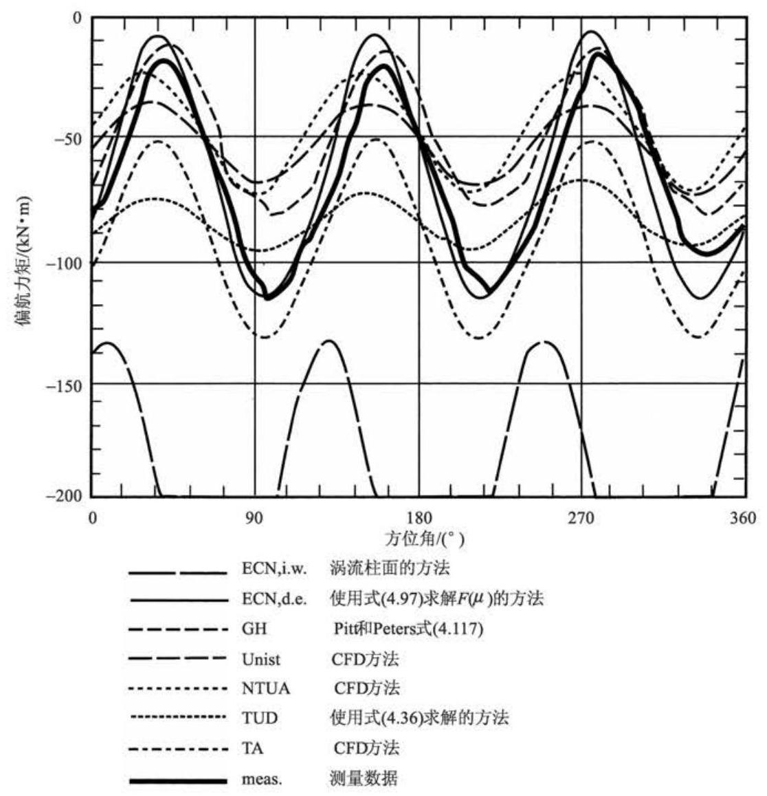

图 4.28 风速为 ${8.5}\mathrm{m}/\mathrm{s}$ ，偏航角为 ${32}^{ \circ  }$ 的 Tjaereborg 风力机的偏航力矩

## 4.4 非定常定流——动态入流

### 4.4.1 引 言

由于自然风在强度和方向上都不可能是稳定的, 所以很少能够满足动量定理的条件。风从风轮的上风向远处流到风轮的下风向远处需要一定的时间，并且在这段时间内风的状态将会发生改变，平衡状态是无法达到的。即使“平均”风速缓慢地发生改变, 小尺度的湍流在它流过风轮叶片时也会产生持续非定常现象。

有几种近似的方法可以用来确定风轮圆盘上动态气流。可以假定诱导速度保持在某一固定时间(可能十分短暂)内平均风速所确定的值。由于风轮的存在，风的非定常分量流经风轮圆盘时不会发生衰减, 此时的尾流仍然不变。非定常力对风轮的净作用力可能为零，它可以用叶素理论来确定。而流过风轮圆盘的诱导速度可以通过瞬时风速来确定，就像速度是定常的那样。风速的变化使诱导速度也随之发生变化, 但必须假设整个尾流同步随之变化。在尾流中始终保持平衡。两种情况下的共同点都是基于对尾流状态的简单假设。

加速势的方法避开了涉及尾流, 而是考虑由上风向流场测定的风轮圆盘处的气流状态。这种方法比尾流方法简单得多。

在定常流的条件下, 速度在上风向流场中的固定点上是个常值; 气流从一点到另一个点的变化有加速度存在[例如,在 $x$ 方向为 ${U}_{\infty }\left( {\partial u/\partial x}\right)$ ,其中假定诱导速度为 $u$ 远小于 ${U}_{\infty }\rbrack$ ,但是在任一点上,速度随时间的变化率 $\left( {{\text{ 如 }0}/{ax}}\right)$ 不存在。在非定常流的条件下,在固定点上气流的状态随着时间的变化而变化,在 $x$ 方向上总的加速度为 ${U}_{\infty }\left( {\partial u/\partial t}\right)  + {U}_{\infty }\left( {\partial u/\partial x}\right)$ 。额外的加速度需要额外的惯性力来产生,该额外的惯性力将改变作用在风轮圆盘上的力。该额外的力又叫做额外重量力, 因为如果相对气流流过叶片时产生的不稳定不是导致了湍流，而是导致叶片自身的非定常运动，叶片周围的空气将随叶片一起运动 (加速)，这相当于增加了叶片的重量。

### 4.4.2 非定常流中加速势方法的调整

如果将非定常加速度项加到式 (4.59) (或 (4.61) 上，将简化诱导速度的计算， 该诱导速度远小于风速，然后该式写为

$$
\rho \left( {\frac{\partial u}{\partial t} + {U}_{\infty }\frac{\partial u}{\partial x}}\right)  =  - \frac{\partial p}{\partial x}
$$

$$
\rho \left( {\frac{\partial v}{\partial t} + {U}_{\infty }\frac{\partial v}{\partial x}}\right)  =  - \frac{\partial p}{\partial y} \tag{4. 118}
$$

$$
\rho \left( {\frac{\partial w}{\partial t} + {U}_{\infty }\frac{\partial w}{\partial x}}\right)  =  - \frac{\partial p}{\partial z}
$$

如前所述, 将每个方程相对于各自的特定方向求导, 然后将结果相加

$$
\rho \left\lbrack  {\frac{\partial }{\partial t}\left( {\frac{\partial u}{\partial x} + \frac{\partial v}{\partial y} + \frac{\partial w}{\partial z}}\right)  + {U}_{\infty }\frac{\partial }{\partial x}\left( {\frac{\partial u}{\partial x} + \frac{\partial v}{\partial y} + \frac{\partial w}{\partial z}}\right) }\right\rbrack   =  - \left( {\frac{{\partial }^{2}p}{\partial {x}^{2}} + \frac{{\partial }^{2}p}{\partial {y}^{2}} + \frac{{\partial }^{2}p}{\partial {z}^{2}}}\right)
$$

但是, 由于流动的连续性有

$$
\frac{\partial u}{\partial x} + \frac{\partial v}{\partial y} + \frac{\partial w}{\partial z} = 0
$$

所以条件变为

$$
\frac{{\partial }^{2}p}{\partial {x}^{2}} + \frac{{\partial }^{2}p}{\partial {y}^{2}} + \frac{{\partial }^{2}p}{\partial {z}^{2}} = 0
$$

同样适用于 4.3.2 节中 Kinner 压力分布。

加速度 $\left( {\partial u/\partial t,\partial v/\partial t,\partial w/\partial t}\right)$ 可以由式 (4.118) 来确定,因为分量 $\partial u/\partial t$ 垂直于风轮盘，所以将产生法向力。

$\rho {U}_{\infty }\left( {\partial u/\partial x}\right)  =  - \partial p/\partial x$ 的解已经在 4.3.2 节 $\sim  {4.3.4}$ 节中求出了，只需求解

下式:

$$
\rho \frac{\partial u}{\partial t} =  - \frac{\partial p}{\partial x} \tag{4.119}
$$

式 (4.119) 不能求出速度 $u$ ，因为它只是方程组 (4.118) 中第一个方程的解。 从方程 (4.119) 中可以确定的是加速度 $\partial u/\partial t$ ，求解时需要对所选的压力分布进行求导。Kinner 压力分布是式 (4.65) (式 (4.67) 的解,是作为椭圆形坐标系 ( $v,\eta$ , $\phi )$ 的函数给出的，所以其需要作坐标变换，求出该压力分布相对于 $x$ 轴方向的导数。椭圆形坐标系与笛卡儿坐标系的关系已经在式 (4.63) 中给出，从该式中可以获得 $\partial x/\partial v,\partial x/\partial \eta ,\partial x/\partial \psi$ 等的导数,但是更需要求出它们的反导数。

通过对式(4.63)恰当地求微分，我们得到

$$
\frac{\partial }{\partial v} = \frac{\partial {x}^{\prime \prime }}{\partial v}\frac{\partial }{\partial {x}^{\prime \prime }} + \frac{\partial {y}^{\prime }}{\partial v}\frac{\partial }{\partial {y}^{\prime }} + \frac{\partial z}{\partial v}\frac{\partial }{\partial z}
$$

例如, 可以确定完整的雅可比矩阵为

$$
\left\lbrack  \begin{matrix} \frac{\partial }{\partial v} \\  \frac{\partial }{\partial \eta } \\  \frac{\partial }{\partial \eta } \\  \frac{\partial }{\partial \psi } \end{matrix}\right\rbrack   = \left\lbrack  \begin{matrix} \frac{\partial {x}^{\prime \prime }}{\partial v} & \frac{\partial {y}^{\prime }}{\partial v} & \frac{\partial z}{\partial v} \\  \frac{\partial {x}^{\prime \prime }}{\partial \eta } & \frac{\partial {y}^{\prime }}{\partial \eta } & \frac{\partial z}{\partial \eta } \\  \frac{\partial {x}^{\prime \prime }}{\partial \psi } & \frac{\partial {y}^{\prime }}{\partial \psi } & \frac{\partial z}{\partial \psi } \end{matrix}\right\rbrack  \left\lbrack  \begin{matrix} \frac{\partial }{\partial {x}^{\prime \prime }} \\  \frac{\partial }{\partial {y}^{\prime }} \\  \frac{\partial }{\partial z} \end{matrix}\right\rbrack \tag{4. 120}
$$

需要求出上式的逆方程为

$$
\left\lbrack  \begin{matrix} \frac{\partial }{\partial {x}^{\prime \prime }} \\  \frac{\partial }{\partial {y}^{\prime }} \\  \frac{\partial }{\partial x} \end{matrix}\right\rbrack   = \left\lbrack  \begin{matrix} \frac{\partial v}{\partial {x}^{\prime \prime }} & \frac{\partial \eta }{\partial {x}^{\prime \prime }} & \frac{\partial \phi }{\partial {x}^{\prime \prime }} \\  \frac{\partial v}{\partial {y}^{\prime }} & \frac{\partial \eta }{\partial {y}^{\prime }} & \frac{\partial \phi }{\partial {y}^{\prime }} \\  \frac{\partial v}{\partial x} & \frac{\partial \eta }{\partial x} & \frac{\partial \phi }{\partial x} \end{matrix}\right\rbrack  \left\lbrack  \begin{matrix} \frac{\partial }{\partial v} \\  \frac{\partial }{\partial \eta } \\  \frac{\partial }{\partial t} \end{matrix}\right\rbrack \tag{4.121}
$$

式 (4.120) 的雅可比矩阵可以通过式 (4.63) 用代数方法来确定, 然后通过转置的代数方法给出雅可比的逆方程 (4.121)。由雅可比的逆阵可以得到

$$
\frac{\partial }{\partial {x}^{\prime \prime }} = \frac{\eta \left( {1 - {v}^{2}}\right) }{R\left( {{\eta }^{2} + {v}^{2}}\right) }\frac{\partial }{\partial v} + \frac{v\left( {1 + {\eta }^{2}}\right) }{R\left( {{\eta }^{2} + {v}^{2}}\right) }\frac{\partial }{\partial \eta } \tag{4.122}
$$

然而,需要风轮盘自身的加速度,此时 $\eta$ 的值为零,所以有

$$
\frac{\partial }{\partial {x}^{\prime \prime }} = \frac{1}{Rv}\frac{\partial }{\partial \eta } \tag{4. 123}
$$

如果选用式(4.88)的轴对称压降分布修正值，使其符合定常流的情况，那么对于整个流场就有

$$
p\left( {v,\eta }\right)  = \frac{15}{32}v{C}_{\mathrm{{TD}}}\left\lbrack  {-{7\eta }\arctan \frac{1}{\eta } + 4\left( {1 - {v}^{2}}\right)  + {15}{v}^{2}{\eta }^{2}\left( {\eta \arctan \frac{1}{\eta } - 1}\right) }\right.
$$

$$
\left. {+{9\eta }\left( {\eta  + \left( {{v}^{2} - {\eta }^{2}}\right) \arctan \frac{1}{\eta }}\right) }\right\rbrack \tag{4. 124}
$$

其中压力用 $\frac{1}{2}\rho {U}_{\infty }^{2}$ 无量纲化了。 ${C}_{\mathrm{{TD}}}$ 项是动态加速度 $\partial u/\partial t$ 对总推力系数贡献。注意:如 4.3.1 节末尾解释的那样，式 (4.124) 给出的在风轮盘上的迎风面压力是式 (4.88) 给出的通过圆盘的压降的一半。

在 $\eta  = 0$ 的转子平面上，用式(4.123)求出的压力梯度为

$$
\frac{\partial p}{\partial {x}^{\prime \prime }} = \frac{1}{R}\frac{15\pi }{64}{C}_{\mathrm{{TD}}}\left( {9{v}^{2} - 7}\right)
$$

因此,由参数 $\mu$ ,式 (4.119) 可表示为

$$
\rho \frac{\partial u}{\partial t} =  - \frac{\partial p}{\partial {x}^{\prime \prime }}\frac{1}{2}\rho {U}_{\infty }^{2} = \frac{1}{R}\frac{15\pi }{64}{C}_{\mathrm{{TD}}}\left( {9{\mu }^{2} - 2}\right) \frac{1}{2}\rho {U}_{\infty }^{2} \tag{4. 125}
$$

需要注意的是，轴向加速度是呈轴对称分布的，而且不依赖于偏航角。

轴向加速度在整个风轮盘面积上的平均值为

$$
\frac{\partial {u}_{0}}{\partial t} = \frac{75\pi }{256}\frac{{U}_{\infty }^{2}}{R}{C}_{\mathrm{{TD}}} \tag{4. 126}
$$

加速度的无量纲形式表示为

$$
\frac{\partial {a}_{0}}{\partial \tau } = \frac{R}{{U}_{\infty }^{2}}\frac{\partial {u}_{0}}{\partial t} = \frac{75\pi }{256}{C}_{\mathrm{{TD}}} \tag{4. 127}
$$

其中轴向气流因子 ${a}_{0} = {u}_{0}/{U}_{\infty },\tau  = t{U}_{\infty }/R$ 称为无量纲时间。

圆盘上的轴向力为

$$
{T}_{\mathrm{x}} = \frac{1}{2}\rho {U}_{\infty }^{2}\pi {R}^{2}{C}_{\mathrm{{TD}}}
$$

用式 (4.127) 代换 ${C}_{\mathrm{{TD}}}$ 有

$$
{T}_{\mathrm{x}} = \frac{128}{75}\rho {R}^{3}\frac{\partial {u}_{0}}{\partial t} \tag{4.128}
$$

因此，额外的重量为 ${128}/{75\rho }{R}^{3}$ 。

与实体圆盘 (Tuckerman,1925) 相关的附加质量项是 $8/3$ 。与式 (4.128) 中给出的 128/75 相比，符合未修正的轴对称 Kinner 压力分布的式 (4.80) 和式 (4.81) 给出的值。虽然 Pitt 和 Peters (1981) 确定的值为 ${128}/{75}$ ，但在其随后发表的文章中推荐使用 8/3 这个值也普遍被人们所接受 (Schepers 和 Snel, 1995)。在 4.3.3 节中，对于风力机使用所谓的“修正的”压力分布已提出了疑问，不必在风轮旋转轴上施加一个零压力差。

### 4.4.3 非定常的偏航力矩和倾斜力矩

对于偏航中非定常流的情况，风轮圆盘上的非定常法向加速度分布要与式 (4.107) 中速度的线性变化一样具有相同的形式。用流量因子表示为

$$
\frac{\partial a}{\partial \tau } = \frac{\partial {a}_{0}}{\partial \tau } + \frac{\partial {a}_{\mathrm{s}}}{\partial \tau }\mu \sin \psi  + \frac{\partial {a}_{\mathrm{c}}}{\partial \tau }\mu \cos \psi \tag{4. 129}
$$

4.3.4 节中的反对称压力分布引起的偏航力矩可以从式 (4.98), 式 (4.99) 中求解出。对于围绕风轮圆盘的整个流场，其压力分布为

$$
p\left( {v,\eta ,\psi }\right)  = 3{D}_{2}^{1}v\sqrt{1 - {v}^{2}}\left( {{3i\eta }\sqrt{1 + {\eta }^{2}}\arctan \frac{1}{\eta } - {3i}\sqrt{1 + {\eta }^{2}} + \frac{i}{\sqrt{1 + {\eta }^{2}}}}\right) \sin \psi
$$

其中在风轮圆盘上产生的压力分布如图 4.27 所示。在式 (4.92) 中表示了系数 ${D}_{2}^{1}$ 与偏航力矩系数的关系。

$$
i{D}_{2}^{1} =  - \frac{5}{4}{C}_{\mathrm{{mx}}}
$$

因此,

$$
p\left( {v,\eta ,\psi }\right)  =  - \frac{15}{4}\pi  \cdot  {C}_{\mathrm{m}x}v\sqrt{1 - {v}^{2}}\left( {{3\eta }\sqrt{1 + {\eta }^{2}}\arctan \frac{1}{\eta } - 3\sqrt{1 + {\eta }^{2}} + \frac{1}{\sqrt{1 + {\eta }^{2}}}}\right) \sin \psi
$$

(4.130)

如前所述，方程式 (4.130) 中压力用自由流动态压力 $\frac{1}{2}\rho {U}_{\infty }^{2}$ 无量纲了。

将式 (4.123) 中给出的微分算子应用到式 (4.130) 中，当 $\eta  = 0$ 时，由式 (4.119) 我们可以得到在风轮圆盘上，

$$
\frac{\partial {u}_{\mathrm{s}}}{\partial t} = \frac{45}{16}\pi \frac{{U}_{\infty }^{2}}{R}{C}_{\mathrm{m}z\mathrm{D}}\mu \sin \psi \tag{4.131}
$$

无量纲时间和速度可表示为

$$
\frac{\partial {a}_{\mathrm{s}}}{\partial \tau } = \frac{45}{16}\pi {C}_{\mathrm{m}z\mathrm{D}} \tag{4. 132}
$$

同样, 如果有一个倾斜力矩, 那么相应的加速度应该为

$$
\frac{\partial {a}_{\mathrm{c}}}{\partial \tau } = \frac{45}{16}\pi {C}_{\mathrm{m}y\mathrm{D}} \tag{4. 133}
$$

由于沿径向是线性变化的, 所以不需要对其进行线性调整。此外, 加速度与偏航角无关。因为平均加速度为零, 所以在各项之间没有耦合。

因此，加速度与作用力系数的关系为

$$
\left\lbrack  \begin{matrix} \frac{16}{3\pi } & 0 & 0 \\  0 & \frac{16}{45\pi } & 0 \\  0 & 0 & \frac{16}{45\pi } \end{matrix}\right\rbrack  \left\lbrack  \begin{matrix} \frac{\partial {a}_{0}}{\partial \tau } \\  \frac{\partial {a}_{\mathrm{c}}}{\partial \tau } \\  \frac{\partial {a}_{\mathrm{s}}}{\partial \tau } \end{matrix}\right\rbrack   = {\left\lbrack  \begin{matrix} {C}_{\mathrm{T}} \\  {C}_{\mathrm{{my}}} \\  {C}_{\mathrm{{mz}}} \end{matrix}\right\rbrack  }_{\mathrm{D}} \tag{4.134}
$$

$$
\left\lbrack  M\right\rbrack  \left\{  \frac{\partial a}{\partial \tau }\right\}   = \{ C{\} }_{\mathrm{D}} \tag{4. 135}
$$

式(4. 134)、式(4. 135)和非定常偏航式(4. 113)、式(4. 114)的组合可得到完整的运动方程。通过加上相应的力系数就可得到，这意味着需要对两个方程求逆。

$$
\left\lbrack  M\right\rbrack  \left\{  \frac{\partial a}{\partial \tau }\right\}   + {\left\lbrack  L\right\rbrack  }^{-1}\{ a\}  = \{ C{\} }_{\mathrm{D}} + \{ C{\} }_{\mathrm{s}} \tag{4. 136}
$$

式 (4.136) 的右边项也可以用叶素理论来求解, 而且它是一个与时间有关的入流因子的函数。叶片作用力的变化方式取决于风速随时间的变化方式和由弹性风轮引起的动态结构挠度。将式 (4.136) 应用到整个风轮圆盘上, 叶素作用力需要沿着叶片长度进行积分。

求式 (4.136) 的数值解需要处理一阶微分方程, 推荐使用逐步试探法求解四阶 Runge-Kutta。以定常解开始, 随时间逐步推进可求得在非定常流流过风轮的诱导速度变化过程。但是, 如果风速是动态变化的, 那么相对于风速的无因次化将不是非常有用时, 常用诱导速度而不是气流因子来直接进行计算。

式 (4.136) 真正地适用于整个风轮, 在式 (4.107) 和式 (4.129) 中确定了所允许的诱因导速度和加速度变化。根据适当的加速度分布以及式 (4.127)、式 (4.132) 和式 (4.133), 圆环附加的重量项可以看作整个附加重量的一部分。

图 4.29 给出了 Tjaereborg 风轮叶片桨距角 ${0.070}^{ \circ  } \sim  {3.716}^{ \circ  }$ 内,叶根弯矩的计算值和测量值。图中显示了 ${30}\mathrm{\;s}$ 后相反方向的变化。风轮没有偏航且风速为 ${8.7}\mathrm{\;m}/\mathrm{s}$ 。计算结果是根据平衡尾流方法用类似于式 (4.136) 的微分方程得到的。

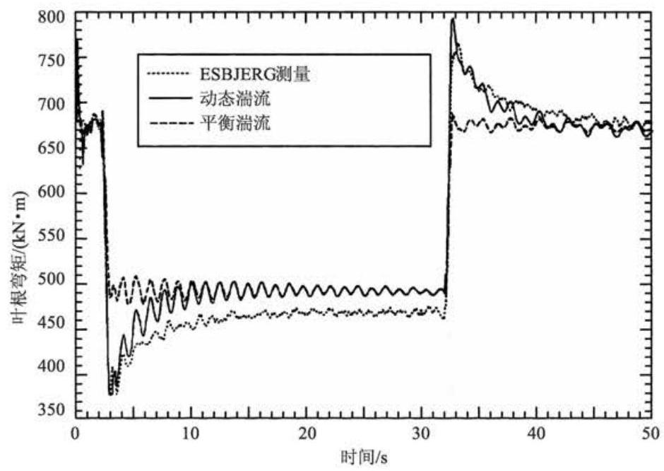

图 4.29 Tjæreborg 风力发电机组上叶根弯矩测量值与计算值随桨矩角变化的响应曲线

与测量结果相比较很明显地可以看出, 动态分析估计了弯矩的初始值过高, 而平衡尾流法却没有, 两种理论都没有给出定常弯矩在这个桨距角范围内的变化。 图 4.29 来自于文献 (Lindenburg,1996), 该文献描述了荷兰 ECM 建立 PHATAS III型气动弹性计算。Tjaereborg 风力机位于丹麦的 Esbjerg 附近, 具体的细节可以查阅 Snel 和 Schepers(1995) 的文章。

求解的过程需要时间变化的叶素作用力来确定式 (4.136) 的右边项, 但非定常流情况下计算叶素的升力和阻力并不是一直向前的过程。叶素上的升力取决于绕叶素的环量, 但条件变化后的环量变化为新的数值需要一定的时间, 过渡过程中的瞬时升力并不取决于瞬时攻角 via。在连续变化的情况下，升力与攻角不是同相位的, 它的数值不能用静态二维翼型升力随攻角变化的数据来确定。

## 4.5 准定常翼型的空气动力学

### 4.5.1 引 言

若相对于翼型的来流是非定常的，那么攻角随时间是连续变化的，所以升力也是随时间变化的。处理该问题的方法是假定瞬时攻角所对应的升力系数与攻角保持不变时相应攻角上的值相同，虽然简单但却是错误的。攻角的大小取决于来流的速度和叶片运动速度。如果叶片的运动包含扭转 (俯仰) 分量, 那么攻角将沿着弦长而变化。薄翼型理论(Anderson,1991)指出从前缘起 3/4 的弦长点是求取攻角的地方。

决定风轮叶素准定常攻角的速度如图 4.30 所示,圆点表示对时间 $t$ 的微分。

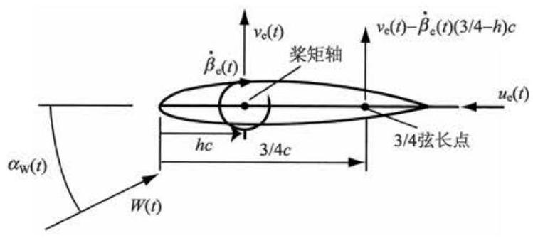

图 4.30 风力机叶片附近的非定常气流速度和结构速度

包含叶素旋转速度的气流速度 $W\left( t\right)$ 在数值和方向上 ${\alpha }_{\mathrm{w}}\left( t\right)$ 随着非定常风的变化而变化。气流速度 $W\left( t\right)$ 也包含风轮圆盘所引起的诱导速度,这可以通过式 (4.136)求得。由叶片振动引起的弹性变形速度 (下标 $\mathrm{e}$ ),同样也影响着准定常攻角,

$$
\alpha \left( t\right)  = {\alpha }_{\mathrm{w}}\left( t\right)  - \left\lbrack  {{v}_{\mathrm{e}}\left( t\right)  - \frac{\partial {\beta }_{\mathrm{e}}}{\partial t}\left( {\frac{3}{4} - h}\right) c}\right\rbrack  \frac{1}{W\left( t\right) } \tag{4. 137}
$$

由叶片弦长方向(边缘方向)的变形引起的结构速度对攻角也有影响，但是数量非常小。无量纲参数 $h$ 定义了叶素的俯仰轴 (柔性剪切在中心的位置) 的位置。

假定结构挠度速度很小, 那么每单位展长的升力为

$$
{L}_{\mathrm{c}}\left( t\right)  = \frac{1}{2}\rho {W}^{2}\left( t\right) \frac{\mathrm{d}{C}_{1}}{\mathrm{\;d}\alpha }\sin \alpha \left( t\right) \tag{4.138}
$$

假定升力曲线的斜率 $\mathrm{d}{C}_{1}/\mathrm{d}\alpha$ 与静态情况的相同。

### 4.5.2 翼型加速度引起的气动力

除了循环力以外, 在翼型上还有由周围的随翼型运动加速而加速的空气惯性所引起的作用力，这些附加项是附加的重量力。每个叶片展长附加的重量力可以表示为直径等于翼型弦长的圆柱体的空气质量是 $\left( {\pi {c}^{2}/4}\right) \rho$ 。惯性力有两个分量 (Fung, 1969).

(1)压力中心，在弦长中点大小等于表观重量乘以垂直于弦长中点的加速度的升力,

$$
{L}_{\mathrm{{ml}}}\left( t\right)  =  - \frac{1}{4}\pi {c}^{2}\rho \left\lbrack  {\frac{\partial {v}_{\mathrm{e}}}{\partial t} - c\left( {\frac{1}{2} - h}\right) \frac{{\partial }^{2}{\beta }_{\mathrm{e}}}{\partial {t}^{2}}}\right\rbrack \tag{4.139}
$$

(2)压力中心，在弦长 $3/4$ 处的升力，此力实质上是离心力，其大小等于表观重量乘以 $W\left( t\right) \left( {\partial {\beta }_{\mathrm{e}}/\partial t}\right)$ :

$$
{L}_{\mathrm{m}2}\left( t\right)  =  - \frac{1}{4}\pi {c}^{2}{\rho W}\left( t\right) \frac{\partial {\beta }_{\mathrm{e}}}{\partial t} \tag{4.140}
$$

还有一个低头的俯冲俯仰力矩,大小等于表观惯量矩 $\left( {\pi /{128}}\right) {c}^{4}\rho$ (实际上,仅为直径为 $c$ 的圆柱气体的单位长度的惯性矩的 $1/4$ ) 乘以俯仰加速度 $\left( {{\partial }^{2}{\beta }_{\mathrm{e}}/\partial {t}^{2}}\right)$ :

$$
{M}_{\mathrm{m}} = \frac{\pi }{128}{c}^{4}\rho \frac{{\partial }^{2}{\beta }_{\mathrm{e}}}{\partial {t}^{2}} \tag{4.141}
$$

附加的重量用类似于 4.4.2 节中的解法来求解。

### 4.5.3 非定常流中尾流对翼型空气动力的影响

如果气流相对于翼型的攻角是变化的，那么环量的强度也是变化的，因为环量只能逐渐发生变化，所以该变化过程不是瞬时完成的。为了求解在出现一个攻角的瞬时变化之后升力在翼型上随时间的实际变化，在分析中需要考虑尾流。 $a$ 的突然变化导致了绕翼型环量的建立，同时在尾流注入了一个大小相等、方向相反的涡量。

实际上，在翼型上的附着环量是沿着弦长分布的，但是为了方便计算起见，可以把它假设为一个位于气动中心 $1/4$ 弦长处，强度为 $\Gamma$ 的集中涡。在定常流的情况下，涡量在 $3/4$ 弦长处诱导了一个垂直于弦线的速度，它的大小和来流垂直于弦线的分量相等，而方向相反。两个相反的速度确保了没有气流通过机翼弦长的 3/ 4 处,当然这种情况沿着弦线的任何地方都是成立的,所以弦长的 $3/4$ 处作为一个控制点。简化的情况是，假定翼型在几何上可以用它的弦线所代替，这就是我们所熟知的薄翼表示法。

非定常流的情况下,在弦长 $3/4$ 处的速度是由附着涡流和尾流共同引起的,如图 4.31 所示, 其仍然与垂直于弦线的气流速度的分量大小相等、方向相反。

当攻角发生突然变化时,在上洗 $\left( {W\sin \alpha }\right)$ 中有一个突然的变化,该上洗与突然变化的下洗相对应。上洗的变化意味着一个瞬时空气质量的突然加速，在翼型上引起一个附加的重量的力。突然变化的下洗来自于环量的突然增加, 伴随发生的是一个大小相等、方向相反的启动涡注入尾流。在下游剖面与尾流发生对流。随着这个启动涡向下游运动，此类影响逐渐减弱，故附着涡的强度必须增加来维持下洗与上洗平衡。附着涡为了保持包含在涡流中的总角动量(这在攻角突然变化是没有的)为零，必须在尾流中连续不断地注入涡量，这也是造成下洗的原因。

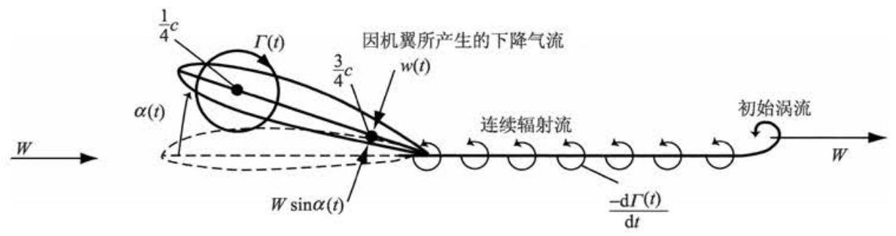

图 4.31 在攻角冲击变化后尾流的发展变化情况

依附涡流强度的增长率随着相应地注入涡量的减少而减少，最后逐渐地形成定常的附着涡量。

Wagner (1925)提出了该问题的解析解法, 该解法复杂且是用贝塞尔函数来表示, 但是 Wagner 方法存在几个近似解, 其中最精确的是 Jones(1945) 给出的,

$$
\frac{\Delta {L}_{\mathrm{c}}\left( \tau \right) }{\frac{1}{2}\rho {W}^{2}c\frac{\mathrm{d}{C}_{1}}{\mathrm{\;d}\alpha }\sin \left( {\Delta \alpha }\right) } = \Phi \left( \tau \right)  = 1 - {0.165}{\mathrm{e}}^{-{0.0455\tau }} - {0.335}{\mathrm{e}}^{-{0.30\tau }} \tag{4. 142}
$$

式中, $\tau  = 2{W}_{\mathrm{t}}/c$ 是基于翼型半弦长 $c/2$ 的无量纲的时间, $\mathrm{d}{C}_{1}/\mathrm{d}\alpha$ 是翼型静态升力对攻角的斜率， $\tau$ 可以认为是从攻角变化开始，启动涡形成到下游消失的经过时间 $t$ 内,启动涡运动距离的 $1/2$ 弦长数。式 (4.142) 是一个指数方程的例子。

图 4.32 显示了由于攻角的初始突变后, 升力随着时间上升的过程。附加升力随着环量升力的发展而不断地变弱, 最后环量升力达到完全定常的状态。对于风轮机叶片在攻角连续变化的情况下，其环量永远不会达到平衡状态，附加的质量升力也不会消失。

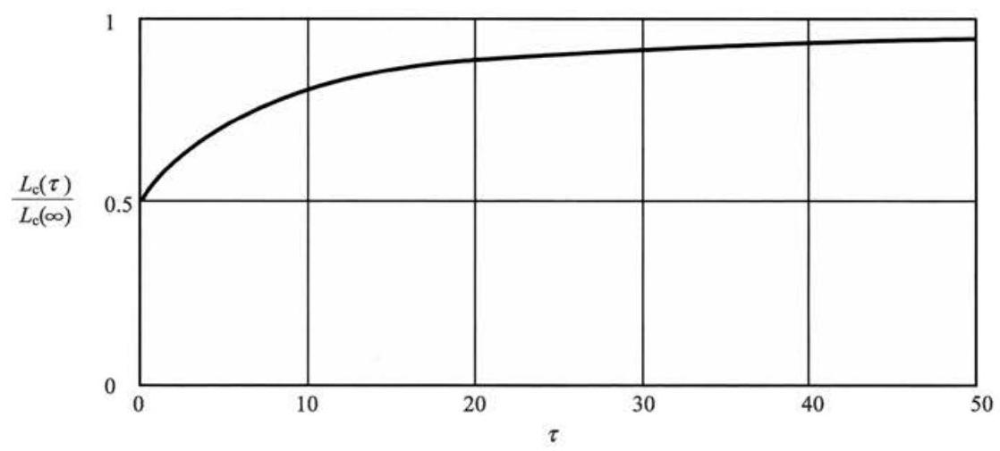

图 4.32 在攻角的冲量变化之后升力发展变化的过程

在非定常风的情况下，如果在时间 $\mathrm{d}t$ 内风速的每个变化都有一个相应的攻角的突变，那么随后翼型上升力将按照式 (4.142) 和图 4.32 所示方式受到影响。所有的这些变化的持续积累将决定翼型的非定常的升力。

假设气流经过了一个长时间 ${t}_{0}$ ,令 $t$ 是 ${t}_{0}$ 之前的任何时间,那么在时间 $t$ 的升力为(Fung,1969)

$$
{L}_{\mathrm{c}}\left( t\right)  = {L}_{\mathrm{c}}\left( 0\right)  + \frac{1}{2}\rho \frac{\mathrm{d}{C}_{1}}{\mathrm{\;d}\alpha }c{\int }_{0}^{\tau }W\left( {\tau }_{0}\right) \Phi \left( {\tau  - {\tau }_{0}}\right) \frac{\mathrm{d}w\left( {\tau }_{0}\right) }{\mathrm{d}{\tau }_{0}}\mathrm{\;d}{\tau }_{0} \tag{4.143}
$$

其中, ${\delta w} = \left\lbrack  {\mathrm{d}w\left( {\tau }_{0}\right) /\mathrm{d}{\tau }_{0}}\right\rbrack  \delta {\tau }_{0}$ 是上洗 (下洗) 的变化,该变化取决于 $W\left( \tau \right)$ 和在一个时间间隔内叶片运动的变化。

在上述方程中使用无量纲时间问题，故在对数值进行积分时使用实际时间更方便。

Theodorsen(1935)求解了一翼型在定常来流风速 $U$ 中、以固定的频率做俯仰和升沉运动情况下式(4.143)的解。翼型上非定常升力也是正弦变化的，但是该力的相位不仅与攻角变化的相位不一致，而且其变化的幅与静态翼型特性不同。

Theodorsen 的解表明翼型的升力等于式 (4.137) 的准定常升力乘以有实部和虚部的 Theodorsen 函数 $C\left( k\right)$ 。 $k = {\omega c}/{2U}$ 称为减流频率,并且 ${\omega t} = {k\tau }$ 。另外,式 (4.139) 和式 (4.140) 给出了附加的质量升力。

$$
C\left( k\right)  = \frac{1}{1 + A\left( k\right) } = \frac{1}{1 + \left\lbrack  \frac{{Y}_{0}\left( k\right)  + \mathrm{i}{J}_{0}\left( k\right) }{{J}_{1}\left( k\right)  - \mathrm{i}{Y}_{1}\left( k\right) }\right\rbrack  } \tag{4.144}
$$

式中， ${J}_{n}\left( k\right)$ ， ${Y}_{n}\left( k\right)$ 分别为第一类和第二类贝塞尔函数； $n$ 为一个整数。与 Legendre 多项式一样, 贝塞尔函数是二阶常微分方程的解, 称之为贝塞尔方程。

$$
{k}^{2}\frac{{\mathrm{d}}^{2}y}{\mathrm{\;d}{k}^{2}} + k\frac{\mathrm{d}y}{\mathrm{\;d}k} + \left( {{k}^{2} - {n}^{2}}\right)  = 0
$$

与 Legendre 多项式不同的是, 贝塞尔函数不能用有限项表示, 而只能表示为无限项。

Theodorsen 函数常常分成两个函数:一个表示实部，另一个表示虚部。

$$
C\left( k\right)  = F\left( k\right)  + \mathrm{i}G\left( k\right) \tag{4.145}
$$

从 Jones 的 Wagner 函数近似值[式(4.142)，可以得到 Theodorsen 函数的一个近似值,

$$
C\left( k\right)  = 1 - \frac{0.165}{1 - \mathrm{i}\frac{0.0455}{k}} - \frac{0.335}{1 - \mathrm{i}\frac{0.30}{k}} = F\left( k\right)  + \mathrm{i}G\left( k\right) \tag{4.146}
$$

$C\left( k\right)$ 的精确部分和近似部分如图 4.33 所示。

$C\left( k\right)$ 的实部给出的升力在相位上与式 (4.138) 定义的攻角一致，虚部给出的升力与攻角在相位上相差 ${90}^{ \circ  }$ 。

对于风轮叶片来说, 应用 Theodorsen 函数的缺点是尾流从叶片上直线流出, 而风轮叶片的尾流是螺旋状的，其他叶片的尾流也存在这种情况。Loewy (1957) 对于风轮叶片提出了一个理论, 以与 Prandtl 相似的方式考虑重复尾流的情况 (见 3.8.3 节)。与 Theodorsen 所做的相似, Loewy 使用二维的薄翼型理论, 得到一个修正的 Theodorsen 函数。在式 (4.144) 中,第一类贝塞尔函数 ${J}_{n}\left( k\right)$ 乘以 $\lbrack 1 + \; W\left( k\right) \rbrack$ ，其中 $W\left( k\right)$ 被称为 Loewy 尾流间隔函数。

$$
W\left( k\right)  = \frac{1}{{\mathrm{e}}^{\left( 2\frac{d}{c}k + \mathrm{i}2\pi \right) } - 1} \tag{4.147}
$$

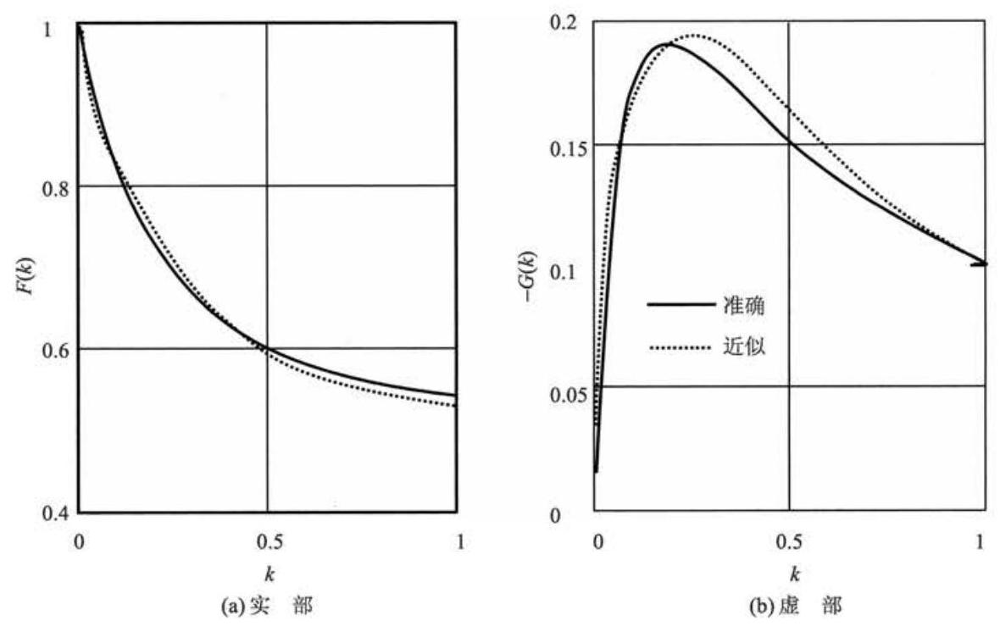

图 4.33 Theodorsen 函数

式中, $d$ 为式 (3.86) 中定义的尾流间隔; $c$ 为翼型轮上的弦长。

Miller(1964)通过使用离散涡流模型得到与 Loewy 相似的结果。

Loewy 和 Miller 理论只能应用到没有偏航的风上, Peters, Boyd 和 He(1989) 提出了一个基于加速势方法的更普遍的理论。在直升机旋翼上模拟径向和方位压力分布是需要足够数量的 Kinner 压力分布的, 因此, 单个叶片上出现了压力尖峰。 该理论排除了使用叶素理论, 自动包含了非定常影响及叶尖损失, 但是通过用此法所得到的叶片几何特性的模拟存在一些问题。Suzuki 和 Hansen (1999)已经将 Peters, Boyd 和 He 提出的理论应用到了风轮上, 并且与叶素/动量定理的结果进行了比较。Van Bussel 理论 (1995) 与 Peters, Boyd 和 He 提出的理论相似, 但是 Van Bussel 理论的目的是应用于风力机上。

## 4.6 动态失速

在高风速情况下, 叶轮偏航时通常在叶片的局部或者全部下风向表面产生分割的气流, 这些气流将会失速。因为环境流的不稳定或者攻角的变化导致叶轮的偏航, 叶片的气流以失速流入和流出。在此环境中, 失速过程的特征是动态的, 并且由经验可知与所谓的稳定失速有着明显的不同。实际上, 失速的过程总是处于一个动态的状态。

在静止的情况下，前缘的失速攻角的增加超过了最初的失速角，造成相反的压力梯度，恰好在叶片表面上的前缘后面足以导致分离。分离并不是在上表面瞬间完成的。分离气流形成了一个移向尾部边缘的涡流。然而，在上表面的上风向涡流依旧在空气动力学气流之上的已经分离，但是下风向的气流并没有分离。黏度引起涡流迅速消散，并且尽管涡流附近存在着低压，但还是在机翼上留有一些升力。当涡流到达后缘并且离开机翼时，失速完成，并且循环下降。整个过程是很短暂的。机翼上的压力分布变换巨大是因为压力中心有一个向后的向量，造成机舱向下的俯仰力矩和压差阻力上升。

如果当静态失速到达的时候攻角持续变化，在分离后的涡流向后缘进行的有限时间里, 攻角的持续增加造成升力和涡流的强度的进一步增大, 如图 4.34 所示。 因此，升力会远高于静态失速水平。一旦涡流穿过尾部边缘，升力会突然下降，尽管攻角可能依旧增加。一旦气流完全延迟，则攻角下降而升力保持在比较低的水平，并且相当稳定直到气流再次附着。再次附着直到攻角明显低于静延迟的级别才会发生。

当叶轮发生偏航且叶尖速度比较小的时候，动态延迟就会发生(高风速)。或者当叶轮遭遇阵风出现在塔架阴影中，在动态延迟很大的期间，所经历的载荷会很大，且可能引起明显的疲劳损伤。

已经开发了许多模型来预测动态失速, 尤其是 Gormont (1973) 和 Beddoes (1975)的模型。最新的是 Leishman 和 Beddoes(1989) 改善了 Beddoes 的原有的理论,并且是目前风力机和直升机的机翼的首选方法。

NREL 风力机翼型动态失速行为的研究由 Gupta 和 Leishman (2006) 给出。 丹麦 Risø 国家实验室的 Hansen, Gaunaa 和 Madsen (2004) 的报告适应了 Leish-mann 和 Beddoes 风力机模型。

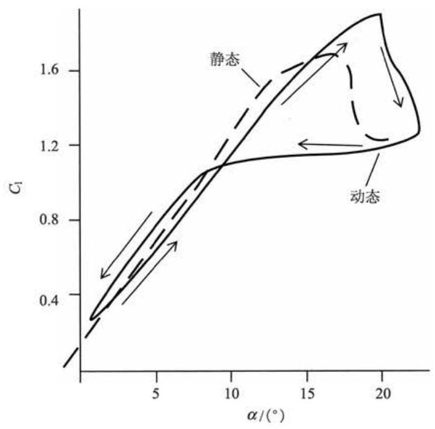

图 4.34 典型的动态失速特性

## 4.7 流体力学的计算

在各种条件下, 气流穿过风力机的分析方法在第 3 章已经介绍, 并且第 3 章基本上是必要的简化以方便计算。为了得到气流条件的精准的结果, 需要更加复杂的方法。

接近风力机叶轮的气流可以使势流方程, 即 18 世纪发展的 Euler 方程进行精度损失较小的分析, 见式 (4.118)。Euler 和连续性方程一起, 可以形成数值程序的基础, 以得到某个气体条件的结果。然而, 在气流穿过风轮过程中以及在尾流中, Euler 方程就不再适用了, 因为不能处理靠近叶片表面的边界层流和尾流中的分离气流情况。Navier-Stokes 方程中加入了附加项，包括黏性的影响，且此附加项由牛顿的黏性流动理论[第 3 章附录 A 式(A.1)］给出。

CFD 实质上是一个方程的数值解。为了对风力机叶轮进行分析, 将周围的区域分成网状，二维或三维。为了将模型与边界层气流联系起来在叶轮表面的网必须要非常精细, 在尾流的地方较粗的网也是可行的。高切度的区域需要特别注意, 如尾流边界和靠近流漩涡的地方。在大多数三维状态下需要解决的未知数很大, 因为解决进程是迭代的,需要很长的解决时间。风力机的叶轮需要更加复杂, 因为表面网必须旋转, 但尽管如此, 在每个阶段, 在一段足够的距离都匹配不转动的网。 进行分析的大部分技能和精力都投资在表面网的生成上。风力机叶片 CFD 方法的核心优势就在于其不需要任何基于翼型的实验数据, 因为这种算法是计算叶片表面周围气流的。

CFD 方法目前主要用在研究中, 有些风力机设计者常用它来确认分析方法的简单和快速。

CFD 包称为 Ellipsys 3D 和 Ellipsys 2D, 在 Risø 已经得到充分的发展, 为的就是应用在风力机上。Sørensen(2002) 和 Bertagnolio, Sørensen 和 Johansen(2006) 对实现的结果给出了指导性建议。

商业性的CFD软件包可以用于风力机中,但是需要风力机空气动力学的涡流条件专业技术，并且在高雷诺数附着流条件和尾流的其他地方，其常常是难以实现的。

## 参考文献

Anderson, J.D. (1991) Fundamentals of Aerodynamics, 2nd edition. McGraw-Hill, Singpore.

Bertagnolio, F., Sørensen, N.N. and Johansen, J. (2006) Profile Catalogue for Airfoil Sections Based on 3D Computations. Risø-R-1581(EN).

Beddoes, T.S. (1975) A Synthesis of Unsteady Aerodynamic Effects Including Stall Hysteresis. Proceedings of ${1}^{\text{ st }}$ European Rotorcraft Forum, Southampton.

van Bussel, G.J.W. (1995) The aerodynamics of horizontal axis wind turbine rotors explored with asymptotic expansion methods. PhD thesis, Delft University of Technology.

Coleman, R.P., Feingold, A.M. and Stempin, C.W. (1945) Evaluation of the Induced Velocity Field of an Idealised Helicopter Rotor. N.A.C.A.A.R.R, No. L5E10.

Glauert, H. (1926) A General Theory of the Autogyro. ARCR R&M No. 1111.

Goankar, G.H. and Peters, D.A. (1988) Review of Dynamic Inflow Modelling for Rotorcraft Flight Dynamics. Vertica, 2, No.3, 213-242.

Gormont, R.E. (1973) A Mathematical Model of Unsteady Aerodynamics and radial Flow for Application to Helicopter Rotors. USAAMRDL, technical report.

Gupta, S. and Leishman, J.G. (2006) Dynamic Stall Modelling of the S809 Aerofoil and Comparison with Experiments. Wind Energy, 9, 521-547.

Hansen M.H., Gaunaa, M. and Madsen, H.A. (2004) A Beddoes-Leishman type dynamic stall model in state-space and indicial formulation. Risø-R-1354(EN).

HaQuang, N. and Peters, D.A. (1988) Dynamic Inflow for Practical Applications. Technical Note, Journal of the American Helicopter Society.

Himmelskamp, H. (1945) Profile investigations on a rotating airscrew. PhD thesis, University of Göttingen.

Jones, W.P. (1945) Aerodynamic forces on wings in non-uniform motion. ARCR R&M 2117.

Kinner, W. (1937) The Principle of the Potential Theory Applied to the Circular Wing. (Translated by M. Flint, R.T.P. Translation No 2345) Ingenieur Archiv, VIII, 47-80.

Leishman, J.G. and Beddoes, T.S. (1989) A Semi-empirical Model for Dynamic Stall. Journal of the American Helicopter Society, 34(3), 3-17.

Lindenburg, C. (1996) Results of the PHATAS-III Development. International Energy Agency 28 ${}^{\mathrm{{th}}}$ Meeting of Experts, Lyngby, Denmark.

Loewy, R.G. (1957) A two-dimensional approach to the unsteady aerodynamics of rotary wings. Journal of Aerospace Sciences, 24(2).

Mangler, K.W. and Squire, H.B. (1950) The Induced Velocity Field of a Rotor. ARCR R&M No. 2642.

Meijer Drees, J. (1949) A Theory of Airflow through Rotors and its application to some Helicopter Problems. The Journal of the Helicopter Association of Great Britain, 3(2), 79-104.

Miller, R.H. (1964) Rotor blade harmonic air loading. AIAA Journal, 2(7).

Øye, S. (1992) Induced velocities for rotors in yaw. Proceedings of the ${6}^{\text{ th }}$ IEA Symposium on the Aerodynamics of Wind Turbines, ECN, Petten, Holland.

Peters, D.A., Boyd, D.D. and He, C.J. (1989) Finite state induced flow model for rotors in hover and forward flight. Journal of the American Helicopter Society, 34(4), 5-17.

Pipes, L.A. and Harvill, L.R. (1970) Applied Mathematics for Engineers and Physicists, Appendix B, Special Functions for Applied Mathematics, McGraw-Hill Kogakusha Ltd.

Pitt, D.M. and Peters, D.A. (1981) Theoretical Prediction of Dynamic Inflow Derivatives., Vertica, 5, 21-34.

Prandtl, L. and Tietjens, O.G. (1957) Applied Hydro- and Aeromechanics. Dover, New York.

Schepers, J.G. and Snel, H. (1995) Joint Investigation of Dynamic Inflow Effects and Implementation of an Engineering Method. ECN report: ECN-C-94-107, Petten, Holland.

Sørensen, N.N. (2002) 3D Background Aerodynamics using CFD. Risø-R-1376(EN).

Suzuki, A. and Hansen, A.C. (1999) Generalized dynamic wake model for YawDyn. AIAA-99-0041, AIAA Wind Symposium, Reno, Nevada.

Theodorsen, T. (1935) General Theory of Aerodynamic Instability and the Mechanism of Flutter. NACA report No. 496.

Tuckerman, L.B. (1925) Inertia factors of ellipsoids for use in airship design. NACA report No. 210.

Wagner, H. (1925) Über die Entstahung des dynamischen Auftriebes von Tragflügel. Zeischrift für angewandte Mathematik und Mechanik, 5(1).

Fung, Y.C. (1969) An Introduction to the Theory of Aeroelasticity. Dover, New York.

Johnson, W. (1980) Helicopter Theory. Dover, New York.

Leishman, G.J. (2000) Principles of Helicopter Aerodynamics. Cambridge University Press, Cambridge.

Stepniewski, W.Z. and Keys, C.N. (1984) Rotary-Wing Aerodynamics. Dover, New York.

Thwaites, B. (1987) Incompressible Aerodynamics. Dover, New York.

