# 第 5 章 水平轴风力机 设计载荷

## 5.1 国家和国际标准

### 5.1.1 发展背景

国家和国际标准的内容包括始于 20 世纪 80 年代的风力发电机组设计准则。 第一个出版的是 Germanischer Lloyd 在 1986 年草拟的一套认证准则。这些最初的准则随着知识体系的发展而被逐渐完善, 并促成 Germanischer Lloyd 的《风能转换系统的认证准则》在 1993 年出版, 并在 1994 年和 1998 年的出版物上进行了进一步的补充和完善。同时, 国家标准在荷兰 (NEN 6096, 荷兰标准, 1988) 和丹麦 (DS 472,丹麦标准,1992)公布。

国际电工委员会在 1988 年开始制定第一个国际标准, 并在 1994 年发表《风力发电机组 一第一部分安全要求》(IEC 1400-1)。1999 年和 2005 年的第二版和第三版，每一版都包含了明显的变化，并且赋予新的标准号 IEC 61400-1 。IEC 61400-1 已经取代了上述标准。下面的章节将介绍 IEC 61400-1、Germanischer Lloyd 和丹麦的标准。

### 5.1.2 IEC 61400-1

《风力发电机组——第一部分安全要求》(IEC 61400-1)定义了三个不同的风力发电机组等级, 以适应不同地区的风力情况, 等级越高, 其对应的风速越低。表 5.1 给出了每一个等级中所对应的风速参数。参考风速定义为轮毂高度为 50 年一遇高度的 ${10}\mathrm{\;{min}}$ 平均风速值。考虑到在某些地区这 3 种等级都不适合,所以给出了第 4 种等级(等级S)，可以由生产厂家指定基本的风力参数。标准空气密度为 ${1.225}\mathrm{\;{kg}}/{\mathrm{m}}^{3}$ 。

表 5.1 风力发电机组等级对应的风速参数

<table><tr><td>参 数</td><td>I 类</td><td>II 类</td><td>III类</td></tr><tr><td>参考风速 ${U}_{\mathrm{{ref}}}/\left( {\mathrm{m}/\mathrm{s}}\right)$</td><td>50</td><td>42.5</td><td>37.5</td></tr><tr><td>年平均风速 ${U}_{\mathrm{{ave}}}/\left( {\mathrm{m}/\mathrm{s}}\right)$</td><td>10</td><td>8.5</td><td>7.5</td></tr><tr><td>50 年一遇极限风速 ${1.4}{U}_{\mathrm{{ref}}}/\left( {\mathrm{m}/\mathrm{s}}\right)$</td><td>70</td><td>59.5</td><td>52.5</td></tr><tr><td>1 年一遇极限风速 ${1.12}{U}_{\mathrm{{ref}}}/\left( {\mathrm{m}/\mathrm{s}}\right)$</td><td>56</td><td>47.5</td><td>42.0</td></tr></table>

标准总共定义了 22 种不同的载荷情况 (17 种极限载荷、 5 种疲劳载荷), 这些都是需要在风力发电机组设计中考虑的。每一种载荷情况的定义都是风力状况和风电机组状态的不同组合。但是标准并没有对载荷分析的具体方法展开讨论。

标准还涵盖了风力发电机组的控制和保护系统、各种机械系统、电力系统、安装、投入运行、操作和维护。

### 5.1.3 Germanischer Lloyd 认证标准

Germanischer Lloyd 的《风能转换系统的认证准则》，通常称之为 GL 准则，采用了与 IEC 61400-1 一样的风力发电机组分类方法,加入了一个低风速级别 IV,对应的风速为 ${30}\mathrm{\;m}/\mathrm{s}$ 。大量的载荷情况都包括在内,但是其中有许多与 IEC 61400-1 中的情况类似。

GL 准则按顺序叙述了风力发电机组中每个部件必需的设计过程——从叶片到地基, 包括设计载荷的定义、分析方法、材料强度和疲劳特性。该标准的详细程度将 GL 准则与 IEC 标准区分开, 而且这也是定义认证所需要的设计文档的结果。

该准则对控制和安全系统及其与保护和检测相关的设备要求很严格。在整个设计过程中，将它们放在文件的开头以强调这些系统的中心性准则。最后涉及运行与维护、噪声、防雷保护及风力发电机组等。

## 5.2 载荷设计基础

### 5.2.1 载荷源

需要考虑的载荷源如下:

(1)空气动力载荷。

(2)重力载荷。

(3)惯性载荷(包括离心和回转效应)。

(4)由于控制系统动作而引起的运行载荷(刹车、偏航、变桨距控制和发电机脱网等)。

### 5.2.2 极限载荷

对于极限载荷设计的载荷情况选择必须综合考虑实际情况，并结合较宽范围内的外部风力情况和机组状态。在现实中, 通常一方面要区分正常和极端风力情况; 另一方面要区分机组的正常状态和故障状态。设计中的载荷情况有以下几种:

(1)正常风力情况下，机组同时处于正常状态。

(2)极端风力情况下，但机组处于正常状态。

(3)正常风力情况下，但机组处于故障状态。

极端风力情况和正常风力情况通常分别定义为近 50 年一遇和近 1 年一遇逆程周期内的最差情况。假设风力机组故障状态很少发生, 并且其与极端风力情况无关, 则极端风力情况下机组故障的出现是作为在逆程周期内不需要考虑的载荷情况。但是，IEC 61400-1 中明确规定，如果极端风力情况与故障状态有关系，那么设计中必须考虑到这种载荷情况。

### 5.2.3 疲劳载荷

一个典型的风力发电机组容易受到疲劳载荷的严重影响。在 2MW 机组中， 叶轮在 20 年的寿命中会旋转 ${10}^{8}$ 次,每转一周都会产生与低速轴和叶片重力完全反向的力, 以及由风切变、偏航误差、轴倾斜、塔架阴影和湍流引起的循环的叶片平面外载荷。因此，许多风力发电机组部件的设计都取决于疲劳载荷，而不是极限载荷。

设计用疲劳载荷频谱必须是全风速范围内发电运行的典型载荷循环，循环的数量与各种风速下机组发电运行的时间成正比。确切地说, 机组启动和停机时的载荷循环，如果有必要的话，在停机过程中也必须考虑。

通常假设极限载荷的情况很少发生，因此，它们对疲劳寿命没有明显的影响。

### 5.2.4 局部安全系数

#### 1 载荷的局部安全系数

极限状态下的设计要求部件的设计载荷为所算得的每个特征载荷乘以适当的局部载荷系数的和。传统上,在静态分析中,不同的局部安全系数值已经分配给不同的载荷，IEC 61400-1 第三版为空气动力学、运行、重力和惯性负载的每一级别的负载情况都指定了一个独立的局部安全系数。这样就避免了在动态分析中的方程式内固有的缺陷，在这些方程中，不同的情况已经根据不同载荷系数的应用区别分布开来。

最终载荷情况已经被分为三个部分，即正常、非正常和运输/直竖，每一部分都有不同的局部安全系数，如表 5.2 所示。大多数载荷状况都被分配到正常组，不正常组留给了那些不太可能的故障状态。

表 5.2 载荷的局部安全系数(IEC 61400-1 第三版)

<table><tr><td colspan="3">不安全载荷</td><td rowspan="2">安全载荷</td></tr><tr><td colspan="3">载荷类型</td></tr><tr><td>正常</td><td>不正常</td><td>运输/直竖</td><td></td></tr><tr><td>1.35</td><td>1.1</td><td>1.5</td><td>0.9</td></tr></table>

疲劳局部安全系数与上述相对应。

#### 2 错误后果的局部安全系数

除了针对限制状态设计固有的载荷和材料的局部安全系数外，IEC 61400-1 还指定了为错误后果使用的局部安全系数，其随着具体条件下元器件的属性而变化。 它定义了三个级别的元器件, 如下:

(1)元件级别 1——用在“故障安全”结构元件，其故障不会导致风力机主要部件的故障。

(2)元件级别 2——用在“非故障安全”结构元件，其故障有可能会导致主要风力机部件的故障。

(3)元件级别 3——用在“非故障安全”机械元件，用在与非冗余执行机构和制动机构相连接, 需要保护风力机的主要结构元件。

故障结果的局部安全系数的建议最小值在表 5.3 中列出。

表 5.3 故障结果的局部安全系数的建议最小值

<table><tr><td>强度的评估级别</td><td>极限强度</td><td>疲劳强度</td></tr><tr><td>级别 1</td><td>0.9</td><td>1.0</td></tr><tr><td>级别 2</td><td>1.0</td><td>1.15</td></tr><tr><td>级别 3</td><td>1.3</td><td>1.3</td></tr></table>

IEC 61400-1 需要故障结果的局部安全系数来引进元件设计强度的评估级别, 但是如果可以同样应用在设计载荷的求导上, 对于引出这一概念, 它是有启发性的。

### 5.2.5 控制和安全系统的功能

控制系统的主要功能是维持机组的运行参数在其正常范围内。安全系统 (参考标准 IEC 61400-1 中的“保护系统”部分)是在由于风力发电机组或控制系统发生故障而导致关键运行参数超出其正常运行范围时, 确保机组处于安全状态。在通常情况下，风力发电机组关键的运行参数如下:

(1)风力发电机组转速。

(2)输出功率。

(3)振动等级。

(4)接至机舱内的悬垂电缆的扭曲度。

对于每个参数，都有必要设置一个触发安全系统的激活等级。它必须设置在大于正常工作极限一定裕量的适当范围内，使控制系统可以超过极限进行调节，但要远小于参数的最大安全值, 使安全系统能够完全在控制范围内。激活安全系统的叶轮转速值是进行载荷设计时的关键的输入量, 即叶轮过速值。

## 5.3 湍流与尾流

短期平均风速的波动或湍流会对载荷设计产生主要的影响，因为它是极端阵风载荷和大部分叶片疲劳载荷的来源。叶轮转动时会不断地产生局部切变阵风， 使叶片的疲劳载荷加剧。

自由湍流的性质和它在统计学上的数学描述构成了 2.6 节的内容。IEC 61400-1 第三版定义了三个不同的湍流类型, 从某一地点到另一地点上升到不同的地形来区分湍流的强度，湍流强度参考平均风速 $\bar{U}\left( {{15}\mathrm{\;m}/\mathrm{s}}\right)$ ，则类型 $\mathrm{A}$ 、 $\mathrm{B}$ 和 $\mathrm{C}$ 的转子中心高度的期望值 ${I}_{15}$ 依次为 0.16,0.14 和 0.12。

测量结果显示[如 Risø R-1111 (1999), Larsene], 即使在一个特定的平均风速, 在某一特定地点的湍流强度变化也十分显著。于是, IEC 61400-1 指定设计值应取其 90% (即其值有 10% 超标的概率), 定义为

$$
{I}_{\mathrm{u}} = {\sigma }_{\mathrm{u}}/\bar{U} = {I}_{15}\left( {{0.75} + {5.6}/\bar{U}}\right) \tag{5.1}
$$

式中, ${\sigma }_{\mathrm{u}}$ 是标准中湍流风速波动的求导; $\bar{U}$ 是转子中心高度的平均风速; ${I}_{15}$ 之前已有定义。这个关系导致了风速增加的时候湍流强度下降，如图 5.1 所示，用“正常湍流模型”表示。需要注意的是， ${\sigma }_{\mathrm{u}}$ 并不因为高度的变化而变化，所以，因为风切变 ${I}_{\mathrm{u}}$ 会随着高度的增加而减少。

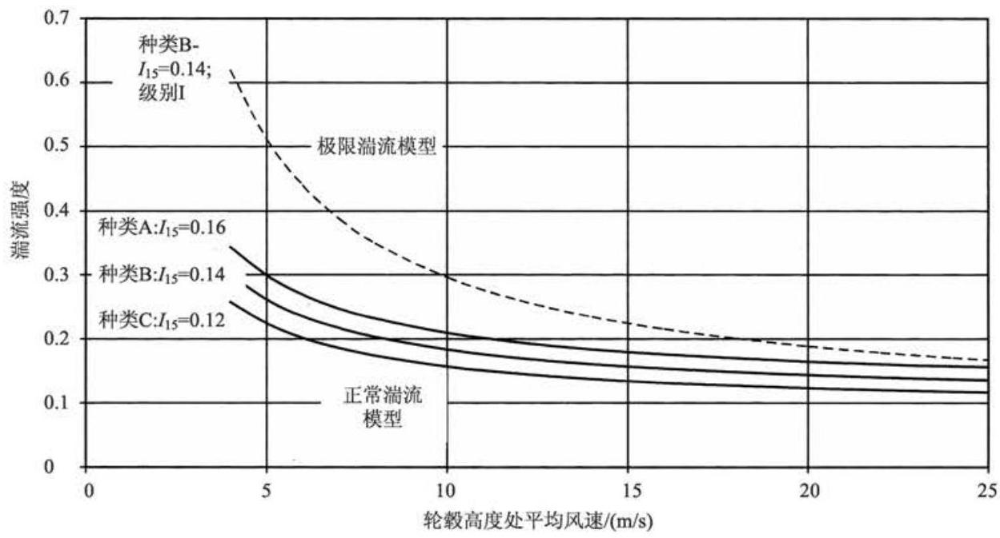

图 5.1 湍流强度与正常和极限湍流模型的风速变化

同样需要考虑到最大湍流的发生, 详见 5.4.1 节。由极限湍流模型定义, 湍流强度为

$$
{I}_{\mathrm{u}} = {\sigma }_{\mathrm{u}}/\bar{U} = {I}_{15}\left\lbrack  {{0.036}\left( {{U}_{\text{ ave }} + 6}\right) \left( {1 - 8/\bar{U}}\right)  + {20}/\bar{U}}\right\rbrack \tag{5.2}
$$

${U}_{\mathrm{{ave}}}$ 是轮毂高度在年度平均风速 $\left( {\mathrm{m}/\mathrm{s}}\right)$ 。这个关系如图 5.1 中虚线所示。

对于任何候选风电场地点, 环境湍流级别必须由该地点风速测量值决定, 并且用来派生出增强湍流级别的估计, 包括在每个风力机地点的尾流影响。例如, 利用 IEC 61400-1 附录 D 建议的方法。恰当的湍流的种类 ( $\mathrm{A},\mathrm{B}$ 或者 $\mathrm{C}$ ) 可以通过其 90%的估计湍流强度来设计，适用于在风力机的额定转速与切出速度之间的所有风速，包括低于在式 (5.1) 中该种类给定值的 ${90}\%$ 的尾流效应。

电脑模拟湍流风力场也需要三个正交速度元件的波动的功率谱的定义和它们的空间相关性, 其中包括湍流模型。标准的第二版详述了两个谱线, 归功于 Kar-man(1948)和Kaimal(1972)的相关相干性方程 (见 2.6.4 节和 2.6.7 节)。然而, Karman 谱线从第三版开始已经被省略掉了,并且由 Mann(1994) 的均匀风切变湍流模型 (见 2.6.8 节) 所取代。现在依旧允许使用 Von Karman 谱线, 就像使用其他谱线一样,提供的功率谱线密度在高频区接近 ${n}^{-5/3}$ 。

## 5.4 极限载荷

### 5.4.1 运行时载荷情况

在这一类中要研究多种载荷情况, 所以极端阵风载荷、风向的变化和风切变的作用效果都可以依次得到估算。IEC 61400-1 载荷情况可以分为两种不同的类型, 取决于风力场的指定是随机的还是确定的。在确定性载荷情况中, 用简单的数学表达式来定义风速的时间变化、风向变化和风切变。在随机载荷情况中，利用风的统计学特性来定义，并且已经通过重复时间域仿真来对该载荷情况下风力场风轮上进行分析。

确定性载荷情况的优点是简化，但还是因为没有能成功地对真实的风力情况进行精确的模拟而受到批评。据此，确定性离散阵风或者突然的风向改变定义的载荷数量在 IEC 61400-1 第三版中相比于之前几版进行了缩减，同意对载荷情况的风力场湍流需要进行模拟。从长远来看, 有可能更加赞同随机载荷情况而减少确定性载荷情况，通过制约湍流仿真来模仿特定的阵风概况，详见 5.4.3 节。

IEC 61400-1 第三版在下列所有运行载荷情况下需要考虑(空气密度为 1. ${225}\mathrm{\;{kg}}/{\mathrm{m}}^{3}$ ):

(1)根据功率法则风切变 $U\left( z\right)  \propto  {z}^{0.2}$ ，被称为“正常风廓模型”。

(2)塔架阴影(5.7.2节中有描述)。

(3)气流的平均倾斜角相对于水平面上升到 ${8}^{ \circ  }$ 。

(4)风轮空气动力学上的不平衡(由于叶片桨距和扭矩的偏差)和风轮质量的不平衡。

(5)偏航跟踪故障。

独立极限载荷情况在 IEC 61400-1 第三版中定义，将在后面依次介绍。值得注意的是，除了特别注明的地方，在平均风速的切入和切出之间的范围内的所有载荷情况均需要研究(注释的首字母缩写是用来识别不同的风力状况的代码)。

#### 1 发电时载荷情况——正常机组状态

(1)载荷情况 1.1 。通过正常湍流模型明确湍流风力场运行情况[NTM]—— 见 5.3 节。风速在切入风速和切出风速之间的间隔是 $2\mathrm{\;m}/\mathrm{s}$ ，切出风速 ${U}_{0}$ ，需要研究。局部载荷系数正常(尤其是 1.25)。

低于额定风速 $2\mathrm{\;m}/\mathrm{s}$ 的风速 ${U}_{\mathrm{r}}$ 和切出风速之间的所有风速需要至少 15 次 10min 一次的模拟(额定风速是指达到风力机额定功率的均匀、稳定的风速)。载荷特性, 即 50 年一遇的状况, 结构的每个元素都要由极限值分布的统计推断来决定, 见 5.14 节。

(2)载荷情况 1.2 。疲劳载荷情况。

(3)载荷情况 1.3 。湍流风力场运行由极限湍流模型定义[ETM]。局部载荷系数正常。

介于这种载荷情况想要捕获从预期的最大湍流强度产生的载荷值, 不需要任何推断。实践中, 这种载荷是至关重要的, 因为典型湍流强度载荷长期变化值比短期的极限湍流强度值还要大。

(4)载荷情况 1.4 。阵风和风向变化[ECD]。轮毂高度处的风速与额定风速 ${U}_{\mathrm{r}}$ 相等， $\pm  2\mathrm{\;m}/\mathrm{s}$ 加上 ${15}\mathrm{\;m}/\mathrm{s}$ 的上升阵风，结合 ${\left( {720}/{U}_{\mathrm{r}}\right) }^{ \circ  }$ 的同时风向变化，例如， 额定速度 ${12}\mathrm{\;m}/\mathrm{s}$ 情况下就是 ${60}^{ \circ  }$ 。阵风上升时间和风向变化发生的时间都被指定为 10s。局部载荷系数正常。

(5)载荷情况 1.5 。极端风切变[EWS]。附加的垂直或水平瞬时风切变与“正常风力曲线模型”相叠加。正常局部载荷系数。附加的风切变定义为

$$
\left( \frac{z - {z}_{\mathrm{{hub}}}}{D}\right) \left\lbrack  {{2.5} + {0.2\beta }{\sigma }_{\mathrm{u}}{\left( \frac{D}{{\Lambda }_{1}}\right) }^{0.25}}\right\rbrack  \left\lbrack  {1 - \cos \left( \frac{2\pi t}{T}\right) }\right\rbrack  \mathrm{m}/\mathrm{s},\;0 < t < T
$$

(5.3)

$$
\left( \frac{y}{D}\right) \left\lbrack  {{2.5} + {0.2\beta }{\sigma }_{\mathrm{u}}{\left( \frac{D}{{\Lambda }_{1}}\right) }^{0.25}}\right\rbrack  \left\lbrack  {1 - \cos \left( \frac{2\pi t}{T}\right) }\right\rbrack  \mathrm{m}/\mathrm{s},\;0 < t < T \tag{5.4}
$$

其中 $z$ 是距地面的高度; $y$ 是轮毂侧面的横坐标; $D$ 是叶轮直径; $\beta  = {6.4}{\sigma }_{\mathrm{u}}$ 如 5.3 节定义相同; ${\Lambda }_{1}$ 是纵向湍流等级参数，取 ${0.7}{z}_{\mathrm{{hub}}}$ 和 ${42}\mathrm{\;m}$ 中较小者; $T$ 是瞬时风剪切的周期,取值为 ${12}\mathrm{\;s}$ 。

两种风切变独立作用于不同的情况且不同时存在。假定湍流等级为 $\mathrm{A}$ 类,轮毂高60m，直径为80m。的机组在 ${25}\mathrm{m}/\mathrm{s}$ 的风速中运行，则叶尖处的最大附加风速是 ${8.36}\mathrm{\;m}/\mathrm{s}$ 。

#### 2 发电过程中的故障状态

这一组载荷情况包括机械的内部故障和外部故障, 也包括电网掉电。如果与电网的连接断开, 那么空气动力转矩将不再有任何来自发电机的阻力, 因此, 机组就会“空载运行”, 此时叶轮将开始加速, 直到刹车系统开始起作用为止。依据刹车响应速度的变化，电网掉电导致产生叶轮的临界载荷。故障情况如下所示:

(1)载荷情况 2.1 。正常湍流模型[NTM]与控制系统或者电网掉电一起定义的湍流风力场运行。局部载荷系数正常。

需要进行 6 次最大 ${10}\mathrm{\;{min}}$ 的极端平均值的特性载荷和 12 次 ${10}\mathrm{\;{min}}$ 的仿真。

(2)载荷情况 2.2。正常湍流模型[NTM]与保护系统故障或前述的内部电气故障一起定义的湍流风力场运行。这些故障认为是比较罕见的情况，所以应用不正常的局部载荷系数。特性载荷像载荷情况 2.1 那样计算。

(3)载荷情况 2.3。极端运行阵风[EOG]，轮毂高处风速稳定在 ${U}_{\mathrm{r}} \pm  2\mathrm{m}/\mathrm{s}$ 或者切出速度 ${U}_{\mathrm{o}}$ ，与外部或者内部电力系统故障相叠加，其中包括电网掉电。风速变化定义如下:

$$
U\left( {z, t}\right)  = \bar{U}\left( z\right)  - \frac{{1.221}{\sigma }_{u}}{1 + {0.1}\left( {D/{\Lambda }_{1}}\right) }\sin \left( {{3\pi t}/T}\right) \left\lbrack  {1 - \cos \left( {{2\pi t}/T}\right) }\right\rbrack \tag{5.5}
$$

其中, $t$ 是阵风变剧烈以来的时间; $T$ 是阵风持续的时间,取值为 ${10.5}\mathrm{\;s}$ 。尽管在 IEC 61400-1 第二版被称为极端运行阵风, 这种阵风的量级仅约为 IEC 61400-1 第二版定义的一年一遇的极端运行阵风的 70%，因此，目前 EOG 的重现周期仅为几天。阵风曲线包括在主要阵风前、后的跌落，如图 5.2 所示，轮毂高度风速为 ${25}\mathrm{\;m}/$ s, A 类湍流,风力机直径为 ${80}\mathrm{\;m}$ ,并且湍流尺度参数为 ${42}\mathrm{\;m}$ 。阵风和电力系统故障同时发生被认为是比较少见的情况，所以应用不正常的局部载荷系数。

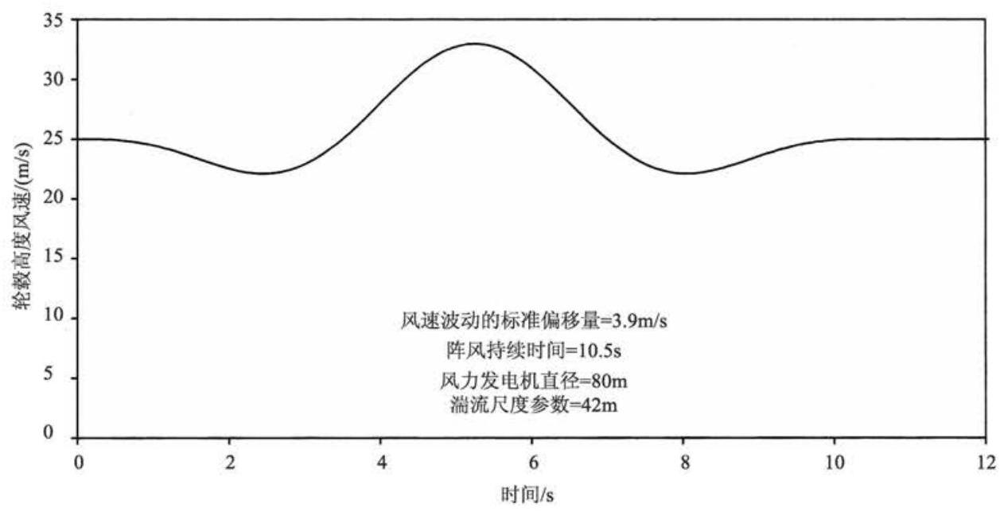

图 5.2 IEC 61400-1 极端升降阵风, 50 年逆程周期的稳定风速为 ${25}\mathrm{\;m}/\mathrm{s},\mathrm{A}$ 类湍流

(4)载荷情况 2.4 。疲劳载荷。

#### 3 启动载荷情况

(1)载荷情况 3.1 。疲劳载荷情况。

(2)载荷情况 3.2。极端运行阵风[EOG,与上述载荷情况 2.3 定义相同动时，轮毂高度风速在 ${U}_{\tau } \pm  2\mathrm{\;m}/\mathrm{s}$ 或 ${U}_{0}$ 叠加。局部安全系数正常。

选择阵风的幅度以使启动或停机相结合的重现周期是 50 年一次。

(3)载荷情况 3.3。启动期间极端风向变化[EDC]，轮毂高度稳定风速值在 ${U}_{\mathrm{r}} \pm  2\mathrm{\;m}/\mathrm{s}$ 或 ${U}_{\mathrm{o}}$ 。风向变化 ${\theta }_{\mathrm{e}}$ 定义为

$$
{\theta }_{\mathrm{e}} =  \pm  4\arctan \left\{  \frac{{\sigma }_{\mathrm{u}}}{{U}_{\mathrm{{hub}}}\left\lbrack  {1 + {0.1}\left( {D/{\Lambda }_{1}}\right) }\right\rbrack  }\right\} \tag{5.6}
$$

方向随时间的变化关系是

$$
\theta \left( t\right)  = {0.5}{\theta }_{\mathrm{e}}\left\lbrack  {1 - \cos \left( {{\pi t}/T}\right) }\right\rbrack  ,\;0 < t < T \tag{5.7}
$$

风向变化发生在以 $6\mathrm{\;s}$ 为周期的 $T$ 处。局部安全系数正常。

轮毂高度风速 ${12}\mathrm{\;m}/\mathrm{s},\mathrm{A}$ 类湍流， ${80}\mathrm{\;m}$ 直径风力机以及湍流尺度参数为 ${42}\mathrm{\;m}$ ， 风向变化 ${37}^{ \circ  }$ ，因为湍流强度的降低，所以切出风速取较低的值。

#### 4 停机载荷情况

(1)载荷情况 4.1 。疲劳载荷。

(2)载荷情况 4.2 。停机时极端运行阵风[EOG, 与上面的载荷情况 2.3 定义相同],轮毂高度风速 ${U}_{\mathrm{r}} \pm  2\mathrm{\;m}/\mathrm{s}$ 或 ${U}_{\mathrm{o}}$ 叠加。局部安全系数正常。

(3)载荷情况 5.1 。由正常湍流模型[NTM] 定义的湍流风力场运行期间突然停机，轮毂高度稳定风速值 ${U}_{\mathrm{r}} \pm  2\mathrm{m}/\mathrm{s}$ 或 $U$ 。叠加。局部安全系数正常。

特性载荷的计算与载荷情况 2.1 相同。

### 5.4.2 非运行时载荷情况

#### 1 正常机组状态

非运行时, 机组可能是静止的, 如 “停机”或 “空转”。在这种状况下, 完全暴露在全风速范围，因此，需要在适用风力级别定义的极端风力状况下存在。IEC 61400-1 允许这种风力状况描述为一个相当于 50 年一遇的 3s 阵风的稳定风速或等于 50 年一遇的 10min 平均值的湍流风(参考风速)且固定湍流强度为 0.11 。

50 年一遇的阵风值定义为 50 年一遇的 10min 平均值的 1.4 倍。无论是阵风还是 ${10}\mathrm{\;{min}}$ 平均值,都是指的在轮毂高度,并且与减少的风切变指数 0.11 结合使用。

50 年一遇的阵风大小取决于基于载荷面积大小的阵风的持续时间。例如，撤销的英国标准 CP3 第 5 章第二部分(1972)《建筑物设计的基本数据章程:风力载荷》描述 $3\mathrm{\;s}$ 的阵风可以穿过 ${20}\mathrm{\;m}$ 的区域，但建议对于大到穿过 ${50}\mathrm{\;m}$ 区域时，5s 的阵风比较合适。然而，IEC 61400-1 和 GL 准则指定阵风的持续时间为 $3\mathrm{\;s}$ ，而不考虑风力发电机组的大小。

湍流风速的波动有可能激发叶片和塔座的固有频率，IEC 61400-1 要求不管使用的是确定性还是极端湍流模型, 风力机动态响应都要考虑在内。

值得注意的是，欧洲法规 1，第 1~4 部分(2005)是基于动态压力下的极端载荷产生于极端 ${10}\mathrm{\;{min}}$ 平均风速，而不是 $3\mathrm{\;s}$ 的阵风。极端 ${10}\mathrm{\;{min}}$ 平均风速产生的载荷通过一个系数增强，而这个系数要考虑到阵风和谐振的激发。

IEC 61400-1 非运行时载荷情况在没有故障或者电网掉电的情况下来满足不同的偏航误差，可以总结如下:

(1)载荷情况 6.1。50 年一遇的极端风况 $\left\lbrack  {\mathrm{{EWM}}}_{50}\right\rbrack$ 使用稳定风模型达 $\pm  {15}^{ \circ  }$ 的偏航误差或使用湍流模型达 $\pm  {8}^{ \circ  }$ 的偏航误差,提供了可保证的对抗偏航延误的阻力。正常的局部载荷系数。

(2)载荷情况 6.2。一年一遇的极端风况 $\left\lbrack  {\mathrm{{EWM}}}_{1}\right\rbrack$ 和使用稳定风模型达 $\pm  {30}^{ \circ  }$ 的极端偏航误差或使用湍流模型达±20°的极端偏航误差。一年一遇的极端风速为 50 年一遇的 80%。局部安全系数正常。

电网掉电可以阻止偏航系统追踪随后的风向变化，除非后备电源保证偏航系统的运行。于是 IEC 61400-1 指定脱网为一种单独的载荷情况，总结如下:不正常安全系数的应用说明了极端风况和脱网同时发生是很少见的。

(3)载荷情况 6.3。50 年一遇的极端风[EWM50]和脱网。偏航误差是因为风向转变 $\pm  {180}^{ \circ  }$ ，除非后备电源提供给偏航系统。局部安全系数不正常。

如果可能的话，偏航延迟的后果需要在所有的非运行时载荷情况中进行研究。

(4)载荷情况 6.4 。疲劳载荷。

#### 2 机组故障状态

这一类故障的例子包括偏航故障和变桨机械故障。假设这种故障与极端风况无关，在此载荷情况下的设计风况通常是一年一遇的极端风况。

该类载荷情况的总结如下:

载荷状况 7.1。一年一遇的极端风况 $\left\lbrack  {\mathrm{{EWM}}}_{1}\right\rbrack$ 和机组故障。在此类偏航系统故障的情况下偏航误差达 $\pm  {180}^{ \circ  }$ 。局部安全系数不正常。

### 5.4.3 叶片和塔架间距

除了检查由上述载荷情况所引起的受力的可承受性外, 设计者还应确保叶片和塔架不会发生碰撞, 甚至通过适当的叶片材料弹性的局部安全系数乘以叶尖挠度来实现。载荷情况 1.1 中的特性叶尖挠度和特性载荷的推断方法相同。

### 5.4.4 阵风的约束随机模拟

尽管湍流风力场的时域仿真可以准确地模拟风的行为，但是如果为设计目的所需的极端状况碰巧发生, 那么确实需要很长的模拟。相比于从很长的风速时间序列中选择想要的极端情况, 很明显通过制约时间序列来促成所需情况发生的方法更为理想, 通过这种方法, 时间序列的统计特性不会受到影响。

在风力模拟中限制阵风的方法载自 Bierbooms (2009)。在其最简单的形式中, 表现为风速自动相关函数形式的阵风曲线叠加在模拟风时间序列的局部最大值上，如图 5.3 所示。

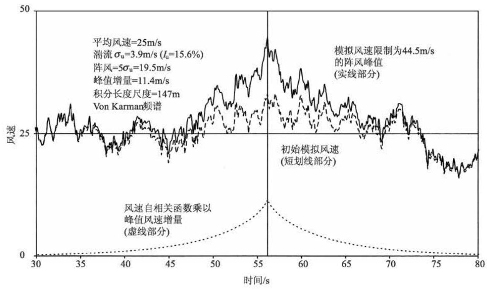

图 5.3 模拟风速的时间序列大约限制为 ${44.5}\mathrm{\;m}/\mathrm{s}$ 的风速峰值

在该例子中，如果基于每年大约 $4\mathrm{\;h}$ 的 ${24} \sim  {26}\mathrm{\;m}/\mathrm{s}$ 的风速，那么阵风的 ${19.5}\mathrm{\;m}/$ s 的数值接近 50 年一遇 1A 类地区的数值[在附录中, 5 个峰值系数和用式(B. 42) 计算, $v = {0.25}\mathrm{\;{Hz}}$ ]。频谱中的风速自相关函数乘以所需的峰值风速增量并且加上初始模拟风速时间序列, 自相关方程的峰值集中在选择的初始时间序列的最大值。

没有必要为了匹配初始时间序列的最大值对约束阵风的峰值来定时。一般来说，约束阵风的时间序列 ${u}_{\mathrm{c}}\left( t\right)$ ，可以从初始时间序列中获得， $u\left( t\right)$ 如下所示:

$$
{u}_{\mathrm{c}}\left( t\right)  = u\left( t\right)  + \kappa \left( {t - {t}_{0}}\right) \left\lbrack  {A - u\left( {t}_{0}\right) }\right\rbrack   - \frac{\dot{\kappa }\left( {t - {t}_{0}}\right) }{\ddot{\kappa }\left( 0\right) }\dot{u}\left( {t}_{0}\right) \tag{5.8}
$$

其中, $\kappa \left( {t - {t}_{0}}\right)$ 是风速自相关函数; $A$ 为在 $t = {t}_{0}$ 时所需的峰值风速。

该方法同样可以扩展到约束在一定时间内规定量上升的阵风 (Bierbooms, 2009)。这种阵风与变桨调节机组的设计休戚相关。

尽管约束随机模拟是模拟极端状况的很有前景的方法, 但是至少目前还没有被设计标准承认。

#### 5.5 疲劳载荷

对于特定的风力发电机组零部件, 其完整疲劳载荷谱的建立要根据不同风速下风力发电机组的独立载荷范围以及在机组启动、正常或紧急停机和机组停车或空转时载荷的循环周期来计算。首先计算在特定风速范围下，运行 $1\mathrm{h}$ 每个压力范围所对应的循环数，并且依据机组寿命周期内预测的在这一风速范围内运行的小时数按比例放大。IEC 61400-1 规定，这个预测要以瑞利分布(2.4 节)为基础，年平均风速根据风力发电机组的等级进行设置 (见 5.1.2 节)。最后，将在机组寿命内获得的在不同风速内运行的循环数与由启动、停机和非工作时间计算的数据相加。

## 5.6 叶片的静态载荷

### 5.6.1 升力与阻力系数

最大叶片载荷在桨叶平面外的方向上，出现时的风向或者近似垂直于桨叶平面产生最大阻力，或者与叶片平面的夹角为 ${12}^{ \circ  } \sim  {16}^{ \circ  }$ ，在此迎风角下，获取最大升力。

由于缺乏到达叶片的正常气流的升力系数数据，以前的设计者用无限长平板 2.0 作为升力系数，配合基于长宽比的向下调节器。因此，在典型叶片上平均弦长等于半径的 $1/{15}$ ,长宽比可能取到 30,因为在叶片内侧末端附近不会产生自由流动。根据 CP3(英国标准, 1972), 英国有关风力作用于建筑物上的载荷规定, 阻力系数应取为 1.68 。最近的现场测量表明,这一规定过于保守。据报告显示,17.2m LM 叶片 (Rasmussen, 1984) 的阻力系数为 1.24, Howden HWP-300 叶片 (Jamieson 和 Hunter, 1985) 的升力系数为 1.25。丹麦标准 DS 472 (1992) 规定阻力系数的最小值为 1.3 。

升力系数的选择更直接, 因为对于最小迎风角的机翼数据在通常情况下是比较可靠的, 而且评测叶轮性能时, 这些数据也是必需的。最大的升力系数很少超过 1.6 ，但是在较厚的叶片内侧部分其升力系数有时会降低到 1.1 。因此，在标准 DS 472 中, 将叶片平面外载荷升力系数的最小值设定为 1.5 , 或许有点保守。

### 5.6.2 不同机组类型的关键设置

在 5.6.1 节提到对于风力发电机组中的叶片而言，其最大升力系数一般大于最大阻力系数，因此，当气流所在的平面与叶片轴垂直时静态叶片上的载荷最大， 此时的攻角可以产生最大的升力。对于失速型风力发电机组，叶片垂直于机舱轴线且风向与机舱轴线成 ${75}^{ \circ  } \sim  {80}^{ \circ  }$ 角时会产生最大载荷,而对于变桨距风力发电机组叶片,只需要近似垂直于风向且与机舱轴线夹角为 ${10}^{ \circ  } \sim  {20}^{ \circ  }$ 。

### 5.6.3 动态响应

#### 1 叶尖位移

当风速波动频率接近一阶挥舞模态下叶片的固有频率时，会引起叶片共振，并在纯刚性叶片的准静态载荷上产生惯性载荷。由于风速平均值的波动会引起叶片振动, 叶尖振动的标准位移量可以由谐振频率下风力的湍流强度和功率频谱密度 ${R}_{\mathrm{u}}\left( {n}_{1}\right)  = {n}_{ - }{S}_{\mathrm{u}}\left( {n}_{1}\right) /{\sigma }_{\mathrm{u}}^{2}$ 来表示，其表达式如下:

$$
\frac{{\sigma }_{\mathrm{x}1}}{{\bar{x}}_{1}} = 2\frac{{\sigma }_{\mathrm{u}}}{\bar{U}}\frac{\pi }{\sqrt{2\delta }}\sqrt{{R}_{\mathrm{u}}\left( {n}_{1}\right) }\sqrt{{K}_{\mathrm{{Sx}}}\left( {n}_{1}\right) } \tag{5.9}
$$

式中, ${\bar{x}}_{1}$ 为稳定叶尖位移量的第一模式部分; $\bar{U}$ 为平均风速 (通常是 ${10}\mathrm{{min}}$ 的平均风速); $\delta$ 为阻尼的对数衰减; ${K}_{\mathrm{{Sx}}}\left( {n}_{1}\right)$ 为尺寸缩减系数,是由相关频率下风力沿叶片的不确定性造成的。注意:动态压力, $\frac{1}{2}\rho {U}^{2} = \frac{1}{2}\rho {\left( \bar{U} + u\right) }^{2} = \frac{1}{2}\rho \left( {{\bar{U}}^{2} + 2\bar{U}u + {u}^{2}}\right)$ , 已经线性化为 $\frac{1}{2}\rho \bar{U}\left( {\bar{U} + {2u}}\right)$ 以使结果简化,见本章附录式 (B. 7) 的推导和表达式 ${K}_{\mathrm{{Sx}}}\left( {n}_{1}\right)$ 。

#### 2 阻 尼

从式(5.9)中可以明显看出，当前的阻尼值是决定叶尖谐振响应的关键。一般地, 阻尼包括空气动力阻尼和结构阻尼两个部分。叶片振动反作用于风速时, 单位长度上变化的空气动力为

$$
\frac{1}{2}\rho {\left( \bar{U} - \dot{x}\right) }^{2}{C}_{\mathrm{D}} \cdot  c\left( r\right)  \approx  \rho \bar{U}\dot{x}{C}_{\mathrm{D}} \cdot  c\left( r\right)
$$

式中, $\dot{x}$ 是叶片平面速率; ${C}_{\mathrm{D}}$ 是阻力系数; $c\left( r\right)$ 是局部叶片弦长。

因此,单位长度的空气动力阻尼 ${\widehat{c}}_{\mathrm{a}}\left( r\right)$ 为 $\rho \bar{U}{C}_{\mathrm{D}}c\left( r\right)$ ,并且第一模型空气动力学阻尼比为

$$
{\xi }_{\mathrm{a}1} = {c}_{\mathrm{a}1}/2{m}_{1}{\omega }_{1} = {\int }_{0}^{R}\frac{{\widehat{c}}_{\mathrm{a}}\left( r\right) {\mu }_{1}^{2}\left( r\right) \mathrm{d}r}{2{m}_{1}{\omega }_{1}}
$$

该系数由下式得出:

$$
{\xi }_{\mathrm{a}1} = \rho \bar{U}{C}_{\mathrm{D}}{\int }_{0}^{R}\frac{{\mu }_{1}^{2}\left( r\right) c\left( r\right) \mathrm{d}r}{2{m}_{1}{\omega }_{1}}
$$

其中 ${\mu }_{1}\left( r\right)$ 是第一振形。

$$
{m}_{1} = {\int }_{0}^{R}m\left( r\right) {\mu }_{1}^{2}\left( r\right) \mathrm{d}r
$$

即广义质量, ${\omega }_{1}$ 是一阶模态的固有频率,单位为 $\mathrm{{rad}}/\mathrm{s}$ 。对数衰减由 ${2\pi }$ 乘以阻尼比获得。

当风向对叶片的夹角能产生最大升力时，叶片将接近失速，造成空气动力学阻尼为零。这种情况下的叶尖偏差只受叶片结构阻尼的限制，结构阻尼将在 5.8.4 节中进行讨论，并给出采用典型叶片材料时的值。

#### 3 叶根弯矩

标准叶尖位移偏差与叶片模型外形一起会产生一个惯性载荷分布, 通过它, 可以计算出沿叶片任何位置弯矩所引起的标准偏差, 特别是叶根弯矩所引起的标准偏差, 可以通过叶根弯矩平均值来计算, 如下式所示:

$$
\frac{{\sigma }_{\mathrm{M}1}}{\bar{M}} = 2\frac{{\sigma }_{\mathrm{u}}}{\bar{U}}\frac{\pi }{\sqrt{2\delta }}\sqrt{{R}_{\mathrm{u}}\left( {n}_{1}\right) }\sqrt{{K}_{\mathrm{{Sx}}}\left( {n}_{1}\right) }{\lambda }_{\mathrm{M}1} = \frac{{\sigma }_{\mathrm{x}1}}{{x}_{1}}{\lambda }_{\mathrm{M}1} \tag{5.10}
$$

其中

$$
{\lambda }_{\mathrm{M}1} = \frac{{\int }_{0}^{R}m\left( r\right) {\mu }_{1}\left( r\right) r\mathrm{\;d}r}{{m}_{1}{\int }_{0}^{R}c\left( r\right) r\mathrm{\;d}r}{\int }_{0}^{R}c\left( r\right) {\mu }_{1}\left( r\right) \mathrm{d}r \tag{5.11}
$$

${\lambda }_{\mathrm{M}1}$ 表达式的推导见附录 B. 5 。

静态叶根弯矩波动的标准偏差，或者叶根弯矩背景响应可以由平均叶根弯矩来表示如下:

$$
\frac{{\sigma }_{\mathrm{{MB}}}}{\bar{M}} = 2\frac{{\sigma }_{\mathrm{u}}}{\bar{U}}\sqrt{{K}_{\mathrm{{SMB}}}} \tag{5.12}
$$

式中, ${K}_{\mathrm{{SMB}}}$ 为考虑沿叶片风力波动的不确定性后的尺寸缩减系数。如附录 B. 6 中所示， ${K}_{\mathrm{{SMB}}}$ 通常略小于统一值，因为与风向切面上湍流的整体纵向长度相比叶片长度是一个很小的值。

叶根总弯矩波动的变化等于谐振和背景响应变化之和，即

$$
{\sigma }_{\mathrm{M}}^{2} = {\sigma }_{\mathrm{M}1}^{2} + {\sigma }_{\mathrm{{MB}}}^{2}
$$

因此,

$$
\frac{{\sigma }_{\mathrm{M}}}{\bar{M}} = 2\frac{{\sigma }_{\mathrm{u}}}{\bar{U}}\sqrt{{K}_{\mathrm{{SMB}}} + \frac{{\pi }^{2}}{2\delta }{R}_{\mathrm{u}}\left( {n}_{1}\right) {K}_{\mathrm{{Sx}}}\left( {n}_{1}\right) {\lambda }_{\mathrm{{Ml}}}^{2}} \tag{5.13}
$$

叶根极端弯矩设计典型的计算方法是由 50 年一遇 10min 平均风速, 加上 10min 周期内可能的峰值变化所引起的叶根弯矩波动偏离的标准偏差的次数算出的, 即

$$
{M}_{\max } = \bar{M} + g{\sigma }_{\mathrm{M}} \tag{5.14}
$$

式中, $g$ 为峰值系数,取决于 ${10}\mathrm{\;{min}}$ 内叶根弯矩波动的周期数,即

$$
g = \sqrt{2\ln \left( {600}_{v}\right) } + \frac{0.577}{\sqrt{2\ln \left( {600}_{v}\right) }} \tag{5.15}
$$

式中, $v$ 为叶根弯矩波动的平均过零频率 (即每秒钟力矩波动由负变正的次数),它介于静态风力载荷过零频率与叶片固有频率 ${n}_{1}$ (见附录 B. 7)之间 (注意: 由于 $g$ 随着频率的变化而变化，所以合理地把 $g$ 设定在上限值 3.9 附近，相应的频率是 DS 472 标准的推荐值 ${1.9}\mathrm{\;{Hz}}$ )。

将式 (5.13) 代入式 (5.14) 中得

$$
{M}_{\max } = \bar{M}\left( {1 + g\frac{{\sigma }_{\mathrm{M}}}{\bar{M}}}\right)  = \bar{M}\left\lbrack  {1 + g\left( {2\frac{{\sigma }_{\mathrm{u}}}{\bar{U}}}\right) \sqrt{{K}_{\mathrm{{SMB}}} + \frac{{\pi }^{2}}{2\delta }{R}_{\mathrm{u}}\left( {n}_{1}\right) {K}_{Sx}\left( {n}_{1}\right) {\lambda }_{M1}^{2}}}\right\rbrack
$$

(5.16)

方括号里面的表达式与结构系数的数值相同， ${c}_{\mathrm{s}}{c}_{\mathrm{d}}$ 在 EN 1991-1-4:2005 方程如下:

$$
{c}_{\mathrm{s}}{c}_{\mathrm{d}} = \frac{1 + 2{k}_{\mathrm{p}}{I}_{\mathrm{v}}\left( {z}_{\mathrm{s}}\right) \sqrt{{B}^{2} + {R}^{2}}}{1 + 7{I}_{\mathrm{v}}\left( {z}_{\mathrm{s}}\right) } \tag{5.17}
$$

其中, ${R}^{2} = \left( {{\pi }^{2}/{2\delta }}\right) {R}_{\mathrm{u}}\left( {n}_{1}\right) {K}_{\mathrm{{Sx}}}\left( {n}_{1}\right)$ 。

通常，需要用 50 年一遇的阵风速度 ${U}_{650}$ 对应的静态力矩来表示最大力矩。结合式 (5.16) 可得

$$
{C}_{\mathrm{f}} \cdot  \frac{1}{2}\rho {U}_{\mathrm{e}{50}}^{2}{\int }_{0}^{R}c\left( r\right) r\mathrm{\;d}r = \bar{M}\left( {1 + {g}_{0} \cdot  2\frac{{\sigma }_{\mathrm{u}}}{\bar{U}}\sqrt{{K}_{\mathrm{{SMB}}}}}\right) \tag{5.18}
$$

这里,峰值系数 $g$ 取一个较低值 ${g}_{0}$ ,对应静态叶根弯矩波动较低的频率,则合并式(5.18)和式(5.16)得到

$$
{M}_{\max } = {C}_{\mathrm{f}} \cdot  \frac{1}{2}\rho {U}_{\mathrm{e}{50}}^{2}{\int }_{0}^{R}c\left( r\right) r\mathrm{\;d}r \cdot  {Q}_{\mathrm{D}} \tag{5.19}
$$

式中, ${Q}_{\mathrm{D}}$ 为动力系数,即

$$
{Q}_{\mathrm{D}} = \frac{1 + g\left( {2\frac{{\sigma }_{\mathrm{u}}}{\bar{U}}}\right) \sqrt{{K}_{\mathrm{{SMB}}} + \frac{{\pi }^{2}}{2\delta }{R}_{\mathrm{u}}\left( {n}_{1}\right) {K}_{\mathrm{{Sx}}}\left( {n}_{1}\right) {\lambda }_{\mathrm{{MI}}}^{2}}}{1 + {g}_{0}\left( {2\frac{{\sigma }_{\mathrm{u}}}{\bar{U}}}\right) \sqrt{{K}_{\mathrm{{SMB}}}}} \tag{5.20}
$$

${g}_{0}$ 是 3.5,并且比值 ${\lambda }_{\mathrm{{m1}}}$ 统一,动态系数 ${Q}_{\mathrm{D}}$ 等同于 EN 1991-1-4 动态系数 ${c}_{\mathrm{d}}$ 。 式 (5.17) 给出的是动态系数的产物 ${c}_{\mathrm{d}}$ ,尺寸系数 ${c}_{\mathrm{s}} = \left\lbrack  {1 + 7{I}_{\mathrm{v}}\left( {z}_{\mathrm{s}}\right) \sqrt{{B}^{2}}}\right\rbrack  /\lbrack 1 + \; \left. {7{I}_{\mathrm{v}}\left( {z}_{\mathrm{s}}\right) }\right\rbrack$ 。

以极端阵风速度开始并用 ${C}_{\mathrm{f}} \cdot  \frac{1}{2}\rho {U}_{\mathrm{e}{50}}^{2}{\int }_{0}^{R}c\left( r\right) r\mathrm{\;d}r$ 与 ${Q}_{\mathrm{D}}$ 的乘积计算极端根部力矩有相当大的好处, 因为它结合方程的线性化消除了气动压力的大部分误差。 例如,如果极端阵风是 ${10}\mathrm{\;{min}}$ 平均阵风的 1.4 倍,如 IEC 61400-1 中的假设[意味着 ${g}_{0}\left( {{\sigma }_{\mathrm{u}}/\bar{U}}\right)$ 的乘积为 0.4 ],则由阵风产生的气动压力将是 ${10}\mathrm{{min}}$ 平均阵风风速的 ${1.4}^{2} = {1.96}$ 倍,而不是由方程 $1 + {g}_{0}\left\lbrack  {2\left( {{\sigma }_{\mathrm{u}}/\bar{U}}\right) }\right\rbrack$ 得出的 1.8 倍。

#### 4 例 5.1

求极端载荷下 ${40}\mathrm{\;m}$ 长的静止叶根弯矩的动力系数 ${Q}_{\mathrm{D}}$ 。

考虑 ${40}\mathrm{\;m}$ 长的叶片设计 (指定 T40 叶片) 应用 NACA 632XX 机翼结构,如图 5.4(a)所示。厚度分布在翼展中间有一个明显的弯曲，来最小化翼展后半部分厚度与弦长的比例系数。除了叶根的局部厚度外, 假设沿叶片外壳厚度均匀, 则最终的质量和硬度分布如图 5.4(b) 所示。通过 5.8.2 节中叙述的模态分析得到一阶模态和二阶模态外形, 如图 5.4(c) 所示。为了便于比较, 图 5.4 中还画出了固定横截面叶片的一阶模态 (即统一悬臂)。明显地, 锥形叶片内部的高硬度可以在很大程度上成比例地减小叶尖偏移。对于玻璃纤维叶片, 杨氏模量和材料密度的典型值分别为 ${40000}\mathrm{\;N}/{\mathrm{{mm}}}^{2}$ 和 ${1.7}\mathrm{t}/{\mathrm{m}}^{3}$ 。一阶模态自然频率为 ${0.824}\mathrm{\;{Hz}}$ ,二阶模态自然频率为 ${2.86}\mathrm{\;{Hz}}$ 。

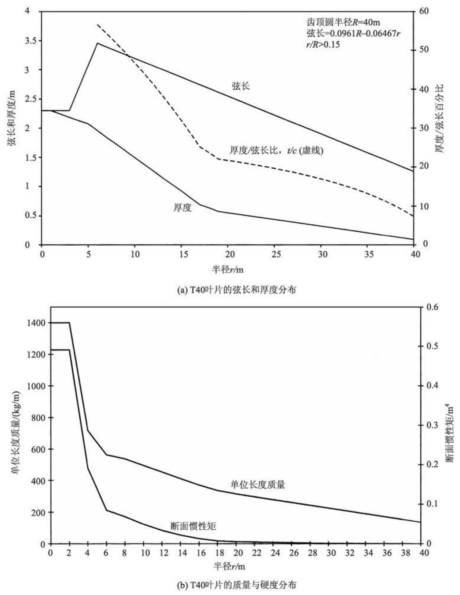

图 5.4

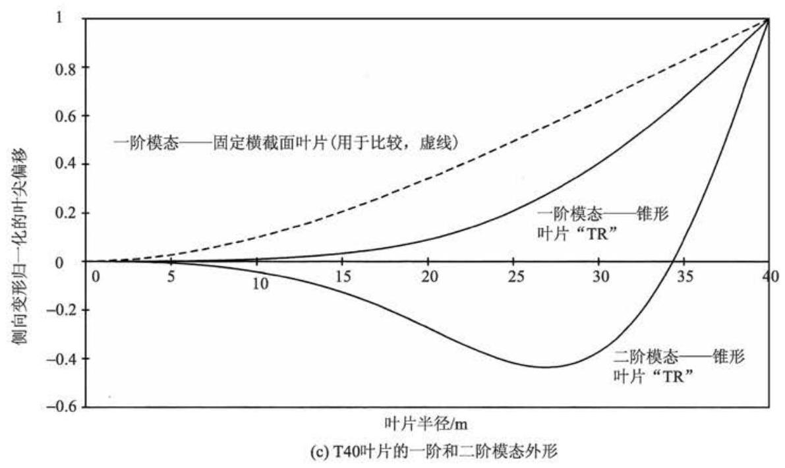

续图 5.4

其他参数值假设如下:

- 叶片高度 $z : {70}\mathrm{\;m}$ 。

- 叶片高度处 50 年一遇的 ${10}\mathrm{\;{min}}$ 平均风速 $\bar{U} : {50}\mathrm{\;m}/\mathrm{s}$ 。

- 欧洲标准 1 地形种类: I (粗糙长度, ${z}_{0} = {0.01}\mathrm{\;m}$ )。

- 湍流强度, $I\left( z\right)  = 1/\ln \left( {z/{z}_{0}}\right)  : {0.113}$ 。

根据 EN 1991-1-4:2005，纵向湍流响应的整体长度为 ${189}\mathrm{\;m}$ 。

式(5.9)中决定叶尖谐振响应的参数值如下:

(1)假设空气动力阻力为零，这样阻尼的对数衰减取为 0.05，对应于玻璃纤维的结构阻尼值。

(2)湍流纵向的无量纲功率频谱密度 ${R}_{\mathrm{u}}\left( n\right)  = n{S}_{\mathrm{u}}\left( {n}_{1}\right) /{\sigma }_{\mathrm{u}}^{2}$ ，可以通过在叶片一阶模态自然频率下 EN 1991-1-4[附录 B 中的式(B. 8)]中定义的 Kaimal 功率频谱计算获得, 为 0.0631 。

(3)式(B. 25)以及用于推导尺寸缩减系数 ${K}_{\mathrm{{Sx}}}\left( {n}_{1}\right)$ 的正态同相谱指数方程中， 无量纲衰减常数的取值为 10 。

下文设定了极端叶根弯曲载荷引起的不同状态和动力因数 ${Q}_{\mathrm{D}}$ 。方括号里的数据是用 EN 1991-1-4:2005 得到的相应的值, 在这里是用于比较的值。

- 谐振响应引起的尺寸缩减系数 ${K}_{\mathrm{{Sx}}}\left( {n}_{1}\right) {0.431}$ [式(B.25)] [0.322]

- 叶尖谐振标准位移偏差与稳定叶尖位移

- 一阶模态部分的比值

$$
\frac{{\sigma }_{\mathrm{y}1}}{{\bar{y}}_{1}} = 2\frac{{\sigma }_{\mathrm{u}}}{\bar{U}}\frac{\pi }{\sqrt{2\delta }}\sqrt{{R}_{\mathrm{u}}\left( {n}_{1}\right) }\sqrt{{K}_{\mathrm{{Sx}}}\left( {n}_{1}\right) }
$$

$$
= 2 \times  {0.113} \times  {9.935} \times  \sqrt{0.0631} \times  \sqrt{0.431}
$$

$$
= 2 \times  {0.113} \times  {9.935} \times  {0.251} \times  {0.657}
$$

$$
= 2 \times  {0.113} \times  {1.638}
$$

0.370

- 叶根力矩系数 ${\lambda }_{\mathrm{M}1}$ 0.584 [式(5.11)] $\left\lbrack  {\mathrm{N}/\mathrm{A}}\right\rbrack$

- 叶根谐振力矩的标准偏差与平均值的比

$$
\frac{{\sigma }_{\mathrm{M}1}}{\overline{M}} = \frac{{\sigma }_{\mathrm{x}1}}{{\overline{x}}_{1}}{\lambda }_{\mathrm{M}1}
$$

0.216 [式(5.10)] [0.320]

- 静态或背景响应的尺寸缩减系数 ${K}_{\mathrm{{SMB}}}{0.829}$ [式(B.40)] [0.871]

- 叶根静态力矩的标准响应偏差与平均值的比

$$
\frac{{\sigma }_{\mathrm{{MB}}}}{\bar{M}} = 2\frac{{\sigma }_{\mathrm{u}}}{\bar{U}}\sqrt{{K}_{\mathrm{{SMB}}}} = 2 \times  {0.113} \times  {0.910}
$$

- 叶根总力矩响应标准偏差与平均值的比

$$
\frac{{\sigma }_{\mathrm{M}}}{\bar{M}} = \sqrt{{\left( \frac{{\sigma }_{\mathrm{{MB}}}}{\bar{M}}\right) }^{2} + {\left( \frac{{\sigma }_{\mathrm{{MI}}}}{\bar{M}}\right) }^{2}}
$$

$$
= \sqrt{{0.206}^{2} + {0.216}^{2}}
$$

0.298 [0.376]

- 静态响应的过零频率 ${n}_{0}$ 0.343Hz[式(B.57)] $\left\lbrack  {\mathrm{N}/\mathrm{A}}\right\rbrack$

- 叶根总力矩响应的过零频率 $v$ 0.642Hz[式(B.54)] $\left\lbrack  {\mathrm{N}/\mathrm{A}}\right\rbrack$

- 基于 $v$ 的峰值系数 $g$ 3.62 [式(5.15)] [3.64]

- 极端力矩与平均值的比

$$
\frac{{M}_{\max }}{\bar{M}} = 1 + g\left( \frac{{\sigma }_{\mathrm{M}}}{\bar{M}}\right)  = 1 + {3.62}\left( {0.298}\right)
$$

- 基于 ${n}_{0}$ 的尖峰因数 ${g}_{0}$ 3.44 [3.5]

- 极端力矩的静态部分与平均值的比

$$
= 1 + {g}_{0}\frac{{\sigma }_{\mathrm{{MB}}}}{\bar{M}} = 1 + {3.44}\left( {0.206}\right)
$$

- 动力因数 ${Q}_{\mathrm{D}} = {2.08}/{1.708}$ 1.218 [式(5.20)]

显然, EN 1991-1-4 方法会产生更大的叶根极端弯矩。但是, EN 1991-1-4 标准中的极端弯矩与平均弯矩的比值可以应用到叶片的所有点上, 所以在根部选取一个比较保守的值是必需的, 这一点在下一节中检测沿叶片弯矩的变化时会体现出来。

#### 5 弯矩沿翼展方向的变化

叶片中间位置弯矩的谐振和静态部分与根部的相应值成简单的比例关系。

就静态弯矩波动而言, 沿叶片的变化近似地跟随由稳态载荷所引起的弯矩的变化, 尽管尺寸缩减系数的轻微变化也会产生一些影响。由于叶尖的惯性载荷处于主导地位, 所以谐振的弯曲力矩图是完全不同的形状。本章附录 B. 8 给出了沿叶片谐振弯矩变化的表达式，图 5.5(a) 中标出了上面的例子，并且为了便于比较， 图 5.5(a) 中还列出了静态弯矩的变化。可以看出，谐振弯矩的曲线更接近于线性， 而静态弯矩则近似于抛物线。

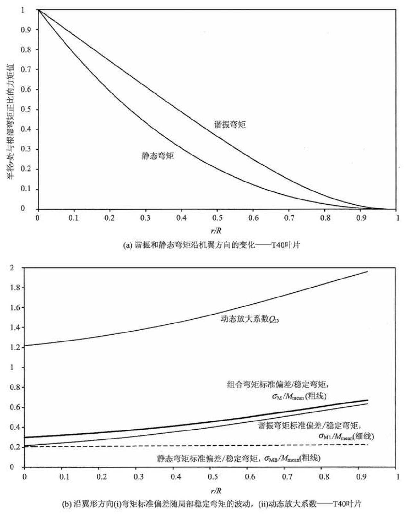

图 5.5

叶片谐振弯矩向叶尖方向的慢速衰减，会引起谐振弯矩标准偏差与局部稳定力矩比值的增加，从而引起动力放大系数 ${Q}_{\mathrm{D}}$ 的增加。在上面的例子中[图 5.5 (b)], 该系数从叶根的 1.22 增加到叶尖的 1.96 。

## 5.7 运行中的叶片载荷

### 5.7.1 固定和随机载荷

通常将作用在旋转叶片上的稳定风速与波动风速产生的载荷分开，并且用不同的方法分别对其进行分析。将风速在叶轮扫掠面积固定空间内的变化所产生的叶片上的周期性载荷称为固定载荷部分，因为它是由一些参数唯一确定的，如轮毂高度、风速、转速、风切变等。另外, 由风速波动产生 (即湍流) 的随机载荷只能通过概率预测来描述,因此,称之为随机载荷部分。

除了风载，旋转叶片还受重力和惯性载荷的作用。重力载荷是确定的，只取决于叶片的角度和质量分布，但惯性载荷可能受湍流的影响。例如，在摇摆的叶轮中, 除了固定部分外, 有时还包括随机部分。

### 5.7.2 固定的气动载荷

#### 1 垂直于叶轮平面的稳定均匀的气流

动量定理在叶片上的应用, 如在 3.5.3 节中所述的, 可以算出不同半径下空气动力对叶片的作用力。在不同的半径下, 求解式 (3.59) 和式 (3.60), 可以得出相应的气流感应因数 $a$ 和 ${a}^{\prime }$ ，并能确定气流角 $\Phi$ 、攻角 $\alpha$ ，以及升力和阻力系数。

为了能够装载在外部叶片上，必须充分考虑叶尖损失，所以式 (3.59) 和式 (3.60) 被式 (3.99) 和式 (3.100) 取代。这些公式可以用来表达在与旋转平面以及叶片运动方向垂直的某元素的单位长度上的力, 通常分别称为平面外和平面内的作用力。

单位长度平面外的作用力:

$$
{F}_{X} = {C}_{x} \cdot  \frac{1}{2}\rho {W}^{2}c = {4\pi \rho }{U}_{\infty }^{2}\left( {1 - {af}}\right) a\frac{f}{N}r \tag{5.21}
$$

单位长度平面内的作用力:

$$
{F}_{Y} = {C}_{y} \cdot  \frac{1}{2}\rho {W}^{2}c = {4\pi \rho \Omega }{U}_{\infty }\left( {1 - {af}}\right) {a}^{\prime }\frac{f}{N}{r}^{2} \tag{5.22}
$$

该表述中的参数在第 3 章中定义。 $f$ 是叶尖损失系数， $N$ 是叶片数量。

对于工作在 $8\mathrm{\;m}/\mathrm{s}$ 稳定风速的典型风力发电机组，图 5.6 显示了平面内和平面外的作用力随半径的变化。本例中的失速调节风力发电机组,叶轮直径 ${80}\mathrm{\;m}$ ,装有三个在例 5.1 中描述过的“T40”叶片，并且转速为 ${15}\mathrm{r}/\mathrm{{min}}$ 。叶片扭力的分布是线性的，并设置在年平均风速为 ${7.5}\mathrm{m}/\mathrm{s}$ 时能够产生最大的能量流动场。显然，尽管叶片弦长随直径的增大而减小，单位长度的平面外载荷随半径的增加近似线性增加,直到叶尖损耗的作用超过了叶尖半径的 ${80}\%$ 。注意: 在相同的叶尖速比下,对于任何转速,风速和叶尖半径,其变化情况都是相同的,因为气流角 $\Phi$ 与感应系数 $a$ 和 ${a}^{\prime }$ 的径向分布取决于叶尖速比。

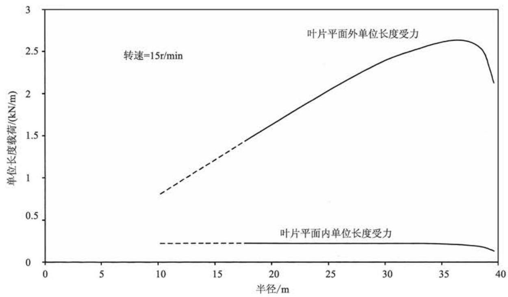

图 5.6 直径 ${80}\mathrm{\;m}$ 的失速风力发电机组工作在稳定的 $8\mathrm{\;m}/\mathrm{s}$ 风速下的叶片平面内和

平面外的空气动力载荷分布对这些力沿叶片进行积分，可以得到叶片平面内和平面外的空气动力弯矩。上例中弯矩随半径的变化如图 5.7 所示。由于叶片外侧的载荷比较集中, 叶片弯矩随叶片内侧半径的增加而线性减小。

平面外的空气动力弯矩分布对于上述直径 ${80}\mathrm{\;m}$ 的风力发电机组的例子中,图 5.8 显示了其叶根平面外弯矩随风速的变化。如 3.9 节中所述, 在更高的风速下失速衰减现象会使旋转叶片内侧部分升力系数比由翼型统计数字预期的值有明显增加, 如图 3.45 中所示。由此, Petersen 等 (1998) 的报道指出, 对于旋转的 LM- 19. 0 叶片，本节中提到的图 5.8 和其他图形数据，可以通过使用现实的翼型数据获取，这是在统计数据的经验修正值或二维翼型数据基础上实现的。修正后的数据如图 5.9 所示，它显示了在大迎风角时叶片内侧较厚部分比外侧较薄部分的升力系数大得多。

图 5.8 显示叶根平面外的弯矩开始随风速线性增加，然后趋于平缓，在风速为 ${12} \sim  {16}\mathrm{\;m}/\mathrm{s}$ 时近似为恒定值，此时，叶片开始失速。然后，叶根力矩再次增加，但比之前增加的要缓慢得多。

图 5.8 中还显示了对于相同风力发电机组通过变桨距将输出功率限制到

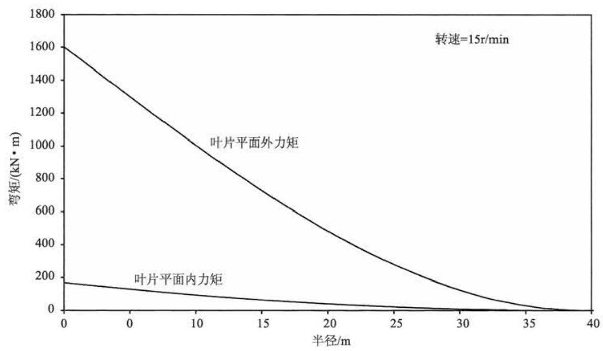

图 5.7 直径 ${80}\mathrm{\;m}$ 的失速风力发电机组工作在稳定的 $8\mathrm{\;m}/\mathrm{s}$ 风速下, 叶片平面内和平面外的空气动力弯矩分布

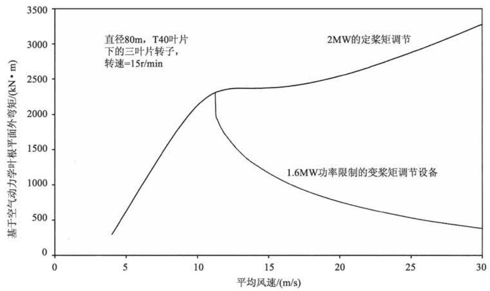

图 5.8 工作在稳定风速下的叶根平面外弯矩 — 对于相似的延迟调整和斜度调整设备 —— 随风速的变化

1600kW 时, 其叶根平面外弯矩随风速的变化。显然, 在风速超过额定值时弯矩迅速下降。

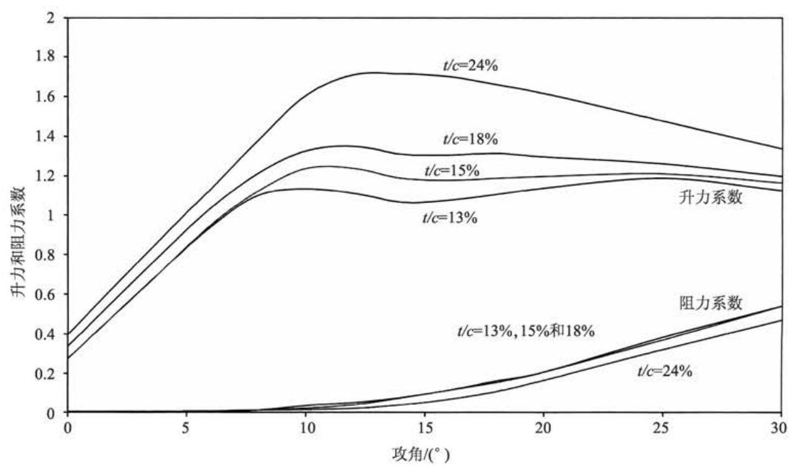

图 5.9 LM-19.0 叶片不同厚度/弦长比的翼型数据(Petersen 等，1998)

#### 2 偏航气流

4.2.8 节中描述了用于稳定偏航气流的叶素理论的应用。用这个方法可以得到图 5.10，它显示了上述直径 ${80}\mathrm{m}$ 失速型风力发电机组稳定运行于 $+ {30}^{ \circ  }$ 偏航角时叶根平面外和平面内的力矩随方位角的变化。注意:叶片旋转方向上的叶片方位角是以顶部死区为零值开始计算的, 当叶轮侧面气流方向与零方位角时的叶片运动方向相同时, 定义偏航角为正。

图 5.10 显示了上述机组分别运行在风速为 ${10}\mathrm{\;m}/\mathrm{s}$ 和 ${20}\mathrm{\;m}/\mathrm{s}$ 时明显的弯矩不同。在风速为 ${20}\mathrm{\;m}/\mathrm{s}$ 时,弯矩按正弦变化,最大值出现在 ${180}^{ \circ  }$ 方位角处,说明其变化取决于与叶片相关的气流波动 $W$ 。在风速为 ${10}\mathrm{m}/\mathrm{s}$ 时,最大的平面外弯矩出现在 ${240}^{ \circ  }$ 方位角处,说明感应速度的非均匀部分 ${u}_{1}$ [式(4.20)]也是很重要的。当然, 随着风速的增加，感应系数 $a$ 会减小，从而减小了对 ${u}_{1}$ 的影响。

#### 3 主轴的倾斜

上风向风力发电机组，即叶轮安装于塔架与迎风之间的风力发电机组，为了增加叶轮与塔架之间的空隙，通常使主轴向上倾斜几度。因此，对于偏航对风存在误差的情况，气流倾向于叶轮轴向，但是它是向上倾斜而不是向侧面倾斜，所以对轴的倾斜处理可以对偏航气流产生镜像反射。

#### 4 风切变

风速随高度的增加而增加被称为风切变。在设计风力发电机组时, 通常将风速理论上的对数分布 $U\left( z\right)  \propto  \ln \left( {z/{z}_{0}}\right)$ 近似为 $U\left( z\right)  \propto  {\left( z/{z}_{\text{ ref }}\right) }^{\alpha }$ 。适当的 $\alpha$ 指数值随表面粗糙度 ${z}_{0}$ 的增加而增加,地方等级的典型值为 0.14,尽管环山气流速度的上升会造成山顶的值较低。如前面所述, IEC 61400-1 指定了保守值 0.20 。

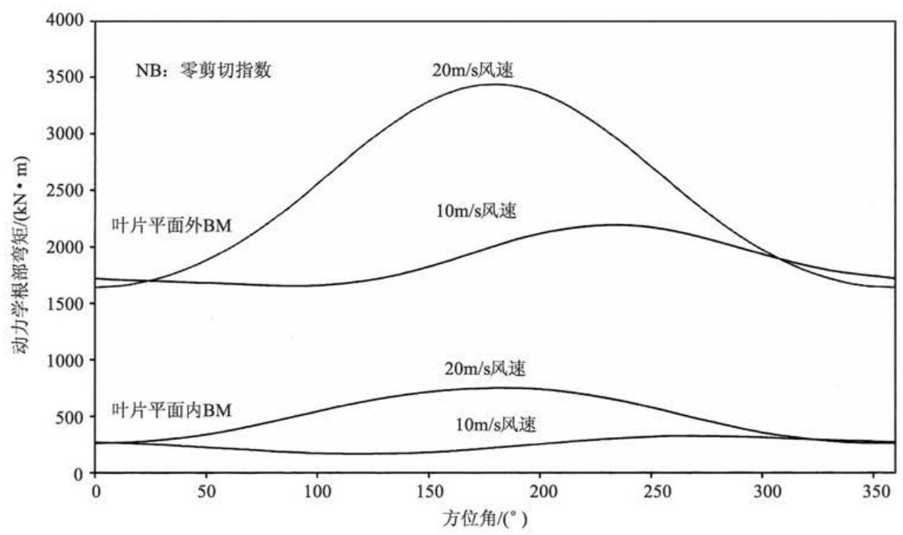

图 5.10 直径80m 失速风力发电机组稳定运行于 30°偏航角时, 叶根弯矩随方位角的变化

将动量定理应用于这种情况, 与旋转平面成适当角度时, 速度部分的表达式为 ${U}_{\infty }{\left( 1 + r\cos \psi /{z}_{\mathrm{{hub}}}\right) }^{a}\left( {1 - a}\right)$ 。在直径为 ${80}\mathrm{\;m}$ 的失速型风力发电机组中,取指数为 0.20,轮毂高度为 ${70}\mathrm{\;m}$ ,当轮毂高度处风速为 ${10}\mathrm{\;m}/\mathrm{s}$ 和 ${15}\mathrm{\;m}/\mathrm{s}$ 时,风切变导致的叶根弯矩随方位角的变化情况如图 5.11 所示。当轮毂高度处风速为 ${10}\mathrm{\;m}/\mathrm{s}$ 时,弯矩变化接近正弦，但是当轮毂高度处风速为 ${15}\mathrm{m}/\mathrm{s}$ ，叶片处于失速状态时，叶根弯矩近似为恒值。

#### 5 塔架效应

无论是上风向还是下风向，塔架对气流的阻碍都会使一定区域内的风速减小， 而且钢制管状结构塔架比桁架式塔架风速减小得更严重。在钢制管状结构塔架中, 由于气流的分离, 下风向侧对风速影响更大些。因此, 下风向风力发电机组的设计者通常将叶轮平面安装在与塔架保持一定空隙的位置, 以便使这种影响最小化。

钢制管状结构塔架上风向速度的减小可以用潜流理论来模拟。钢制管状塔架周围的气流来源于一个对偶气流的叠加，即在很小的空间内的风源和汇流点，用均匀气流 ${U}_{\infty }$ 给出气流方程为

$$
\psi  = {U}_{\infty }y\left\lbrack  {1 - \frac{{\left( D/2\right) }^{2}}{{x}^{2} + {y}^{2}}}\right\rbrack \tag{5.23}
$$

式中, $D$ 为塔架的直径; $x, y$ 为相对于塔架中心的纵向和横向坐标 (图 5.12)。由 $\psi$ 随 $y$ 的变化得到 $x$ 方向上气流速度的表达式如下:

$$
U = {U}_{\infty }\left\lbrack  {1 - \frac{{\left( D/2\right) }^{2}\left( {{x}^{2} - {y}^{2}}\right) }{{\left( {x}^{2} + {y}^{2}\right) }^{2}}}\right\rbrack \tag{5.24}
$$

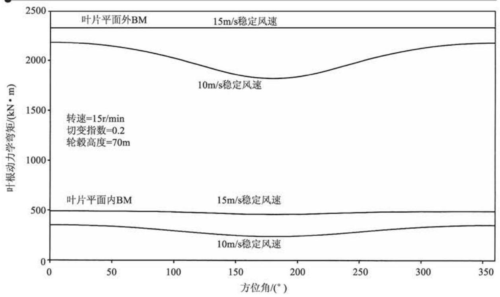

图 5.11 对于典型的 ${80}\mathrm{\;m}$ 直径风力发电机组稳定运行在轮毂高度处风速为 ${10}\mathrm{\;m}/\mathrm{s}$ 和 ${15}\mathrm{\;m}/\mathrm{s}$ (切变指数 $= {0.2}$ )时,由于风切变引起的叶根弯矩随方位角的变化

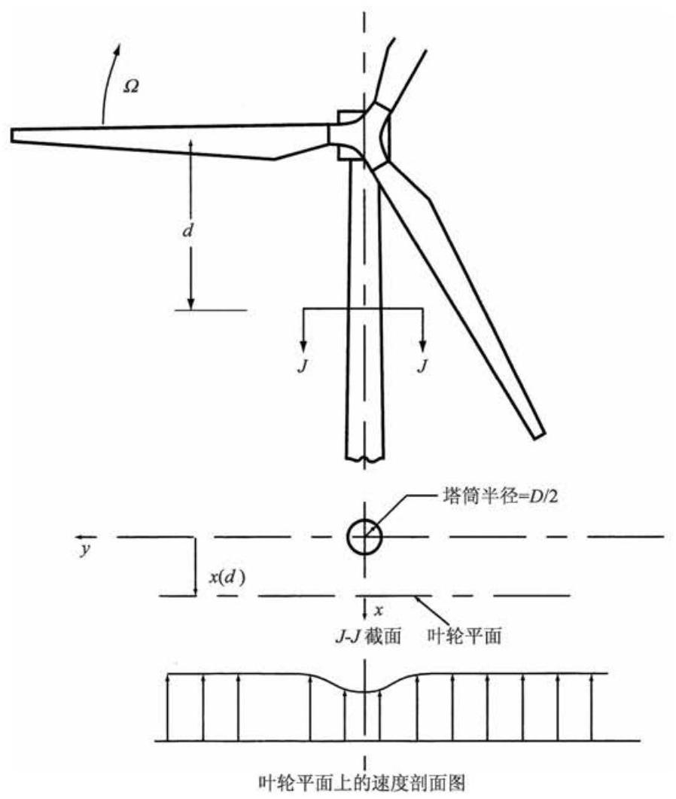

图 5.12 塔阴影参数

括号中的第二项，即与原始风速成比例的速度减小量，在上风向距离 $x$ 的范围内，沿纵坐标 $y$ 被塔架直径划分开，如图 5.13 所示。对称于气流轴的速度减小等于 ${U}_{\infty }{\left( D/2x\right) }^{2}$ ,减小区域的总宽度是上风向距离的 2 倍。因此,旋转叶片作用后的速度增减率随上风向距离 $x$ 的增加而迅速减小。

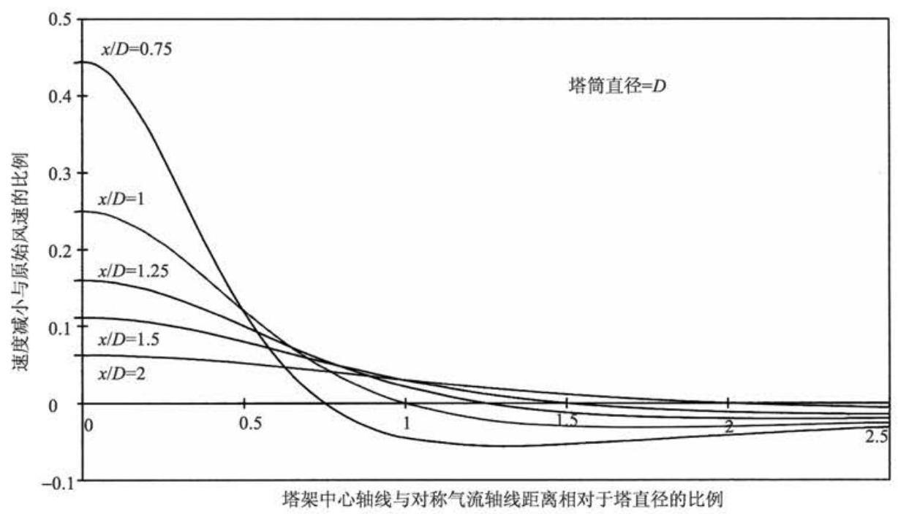

图 5.13 与上风向塔架轴线距离为不同的 $x/D$ 时,塔影引起的速度减小

通过在与叶轮旋转平面成直角时设置局部速度分量为 $U\left( {1 - a}\right)$ ,替代原来的 ${U}_{\infty }\left( {1 - a}\right)$ ,应用叶素理论可以估算出塔架阴影对叶片载荷的影响。 ${80}\mathrm{\;m}$ 直径失速型风力发电机组叶片弯矩的结果如图 5.14 所示。图 5.14 中假设塔架直径为 $4\mathrm{\;m}$ ， 并且忽略动力影响。图 5.14 中显示了叶片塔架距离等于塔架的半径,即 $x/D = 1$ 时工作在风速为 ${10}\mathrm{\;m}/\mathrm{s}$ 和 ${20}\mathrm{\;m}/\mathrm{s}$ 下叶根平面内和平面外的弯矩随方位角的变化。 注意: 低风速下的平面外弯矩变化更剧烈。对于 $x/D = {1.5}$ 的风速为 ${10}\mathrm{\;m}/\mathrm{s}$ 的图像, 其变化就平缓多了。

在下风向风力发电机组中，一般都不会去分析产生的气流分离和涡流，所以通常用经验方法估计平均速度的减小。一般速度减小的曲线都假设为余弦形式，故

$$
U = {U}_{\infty }\left\lbrack  {1 - k{\cos }^{2}\left( \frac{\pi y}{\delta }\right) }\right\rbrack \tag{5.25}
$$

式中, $\delta$ 为风速减小区域的总宽度。通常,忽略减小区域外速度的微量增加 (见 6.13.2 节)。

塔影造成的叶片载荷的下降比风切变、轴倾斜和偏航导致的载荷平滑变化更

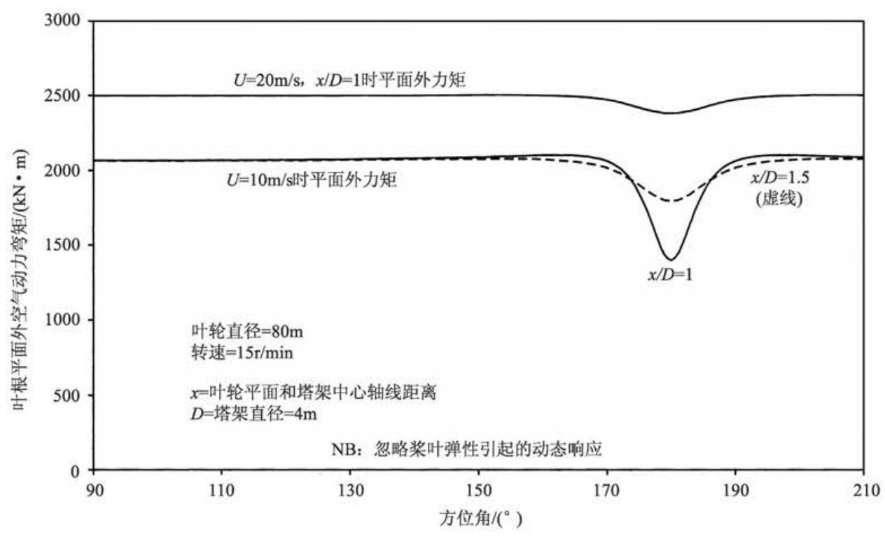

图 5.14 直径 ${80}\mathrm{\;m}$ 的失速型风力发电机组工作在 ${10}\mathrm{\;m}/\mathrm{s}$ 和 ${20}\mathrm{\;m}/\mathrm{s}$ 风速下时, 由塔架阴影引起的叶根弯矩随方位角的变化

容易引起叶片的振动，在有关叶片空气动力学响应的章节中对这种现象进行了讨论。

#### 6 尾流效应

在风电场中, 风力发电机组完全或部分地工作在其他机组的尾流中是很常见的。其中部分工作在尾流中的情况会更糟糕, 下风向风力发电机组最容易受水平向风切变的影响, 而且可以由此分析叶片载荷的波动。

### 5.7.3 重力载荷

叶片的重力载荷造成边缘弯矩按正弦发生变化，当叶片水平时达到最大，并且从一个水平位置变到另一个水平位置时要改变符号, 因此, 它是疲劳载荷的主要来源。对于 “ $\mathrm{T}{40}$ ” 叶片 (见例 5.1),最大重力力矩 ${\int }_{0}^{R}m\left( r\right) r\mathrm{\;d}r$ 是 ${2140}\mathrm{{kN}} \cdot  \mathrm{m}$ ,所以由重力引起的边缘弯矩的范围是在 ${4280}\mathrm{{kN}} \cdot  \mathrm{m}$ 之内,大大减小了由偏航或风切变引起的边缘力矩变化,通常是原值的 $1/{10}$ 或更少。 “ $\mathrm{T}{40}$ ” 叶片顺桨方向的重力弯矩分布如图 5.15 所示。

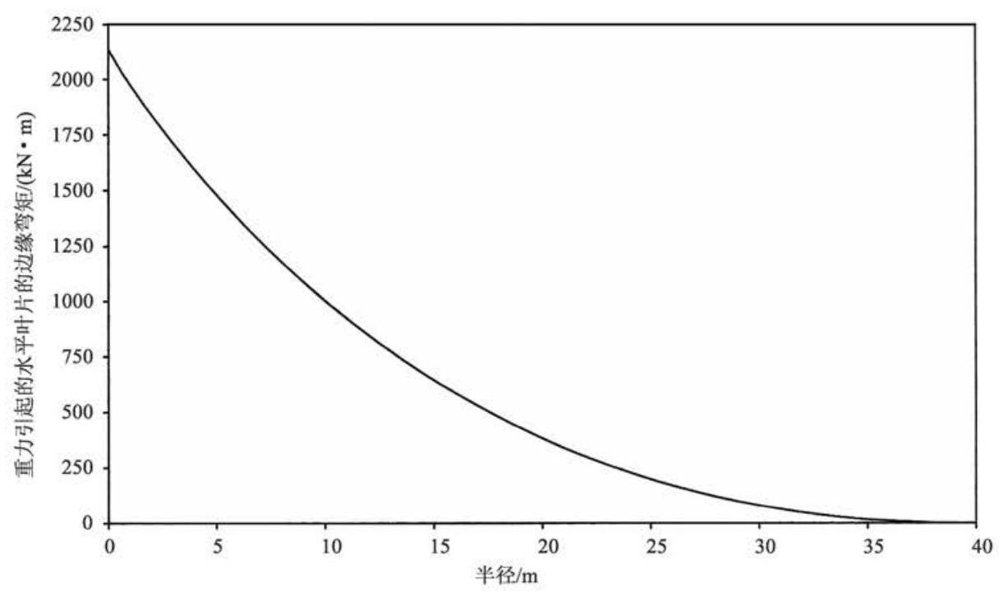

图 5.15 “T40”叶片重力弯矩分布

### 5.7.4 固定惯性载荷

#### 1 离心载荷

对于刚性叶片垂直于叶轮平面旋转时, 其离心力在叶片上产生张力载荷, 在半径 ${r}^{ * }$ 处,其表达式为 ${\Omega }^{2}{\int }_{{r}^{ * }}^{R}m\left( r\right) r\mathrm{\;d}r$ ,所以运行过程中,所有载荷源在叶片上产生的波动应力都会有一个拉伸偏移。对于以 ${15}\mathrm{r}/\mathrm{{min}}$ 旋转的 “ $\mathrm{T}{40}$ ” 叶片来说,其根部的离心力是 ${540}\mathrm{{kN}}$ ——近似其自身重量的 3.5 倍。

推力载荷会使柔性叶片向顺风向偏移，从而使离心力在叶片平面外产生的力矩反比于推力产生的力矩。这种由于推力载荷所引起的力矩减少被称为离心去载。这种现象是非线性的, 所以需要用迭代方法来进行求解。通过将叶片做成圆锥形可以获取更大的离心去载效果，所以叶片首先是向顺风向倾斜的，这样可以达到一个平衡, 所以在较低风速下, 由离心载荷产生的最大平面外向前的力矩近似等于额定风速下推力载荷与离心载荷联合产生的最大平面外向后的力矩。

#### 2 回转载荷

当正在运行的机组发生偏航时, 叶片就会受到垂直于旋转平面的回转载荷。 设叶片上 $A$ 点以 $\Omega \mathrm{{rad}}/\mathrm{s}$ 的速度顺时针旋转,如图 5.16 所示。对应于叶片转速的瞬时水平分量为 ${\Omega z}$ ,其中 $z$ 是 $A$ 点距离轮毂中心的高度。假设叶片是刚性的,若机组在平面上以 $\Lambda \mathrm{{rad}}/\mathrm{s}$ 的速度顺时针偏航，可以得到点 $A$ 在沿风速方向有一个 ${2\Omega \Lambda z}$ 的加速。结合叶片长度上惯性力的作用，可以得出关于叶根弯矩的表达式为

$$
{M}_{\mathrm{Y}} = {\int }_{0}^{R}{2\Omega \Lambda zrm}\left( r\right) \mathrm{d}r = {2\Omega \Lambda }\cos \psi {\int }_{0}^{R}{r}^{2}m\left( r\right) \mathrm{d}r = {2\Omega \Lambda }\cos \psi {I}_{\mathrm{B}} \tag{5.26}
$$

式中, ${I}_{\mathrm{B}}$ 为叶根的惯性。

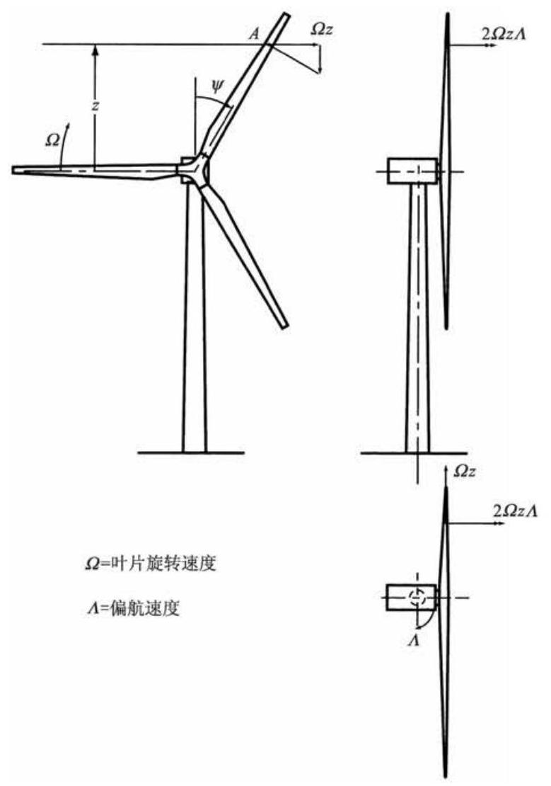

图 5.16 偏航叶片上一个点的旋转加速度

若有一个 ${80}\mathrm{\;m}$ 装有“ $\mathrm{T}{40}$ ” 叶片的风电机组以 ${15}\mathrm{r}/\mathrm{{min}}$ 的速度旋转,偏航速度为 $1\left( {}^{ \circ  }\right) /\mathrm{s}$ ，叶根的惯性为 ${4910}\mathrm{\;T} \cdot  {\mathrm{m}}^{2}$ ，则 ${M}_{\mathrm{Y}}$ 的最大值为 $2 \times  \left( {\pi /2}\right)  \times  {{0.0175} \times  {4910}} \; = {270}\left( {\mathrm{{kN}} \cdot  \mathrm{m}}\right)$ 。这仅是由于空气动力载荷所引起的平面外最大转矩的 ${10}\%$ 。

#### 3 刹车载荷

机械刹车引起的叶片减速会在叶片边缘产生弯矩，并叠加到减速叶片的重力力矩上。

#### 4 摆动载荷

叶根平面外弯矩可以通过将每个叶片安装在一个铰链上来完全消除, 通过这个铰链各个叶片能够前、后转动。虽然离心力会有助于在正常转速下控制每个叶片的锥角，但是在启动和停机时，对其他约束的需求表明，上述铰链在机组中是很少采用的。然而，在双叶片机组中，将整个叶片安装在一个可以使叶片前、后转动或摆动的铰链轴上是非常方便的, 这种安装方法经常用来减小叶根平面外力矩的起伏变化和阻止将这种叶片平面外力矩传递到低速轴上。因为摆动是一个重要的动态现象，在后面的 5.8 节中会继续对其进行分析。

### 5.7.5 随机气动载荷——频域分析

在 5.7.1 节中已经提到，由于短期的风速波动在叶片上引起的随机载荷称为随机空气动力载荷。在空间上，某一个固定点上的风速在平均值附近的起伏变化可以用概率分布和功率频谱来进行描述, 其中概率分布在大部分场合都可以设定为正态分布, 而功率频谱则描述在不同的频率下能量的波动是如何分布的 (见 2.6.3 节和 2.6.4 节)。

随机载荷能很方便地在频域范围内进行分析, 但是为了更加便于分析, 通常把作用于翼型上的风速波动量 $u$ 和最终载荷之间的关系假设为线性关系。如下文所述,这种假设在高叶尖速比下是合理的。准稳态气动升力在单位长度 $L$ 上的变化是 $\frac{1}{2}\rho {\mathrm{W}}^{2}{C}_{\mathrm{L}}c$ ,其中 $W$ 是空气相对于叶片的速度, ${C}_{\mathrm{L}}$ 是提升系数,阻力项被忽略。 因为流程角 $\phi$ 在高叶尖速比 $\lambda$ 时很小,气流的相对速度 $W$ 可以设定为随着风速的变化要比随着 ${C}_{\mathrm{L}}$ 的变化慢得多,所以 $\mathrm{d}W/\mathrm{d}u$ 可以忽略不计,得出结果为

$$
\frac{\mathrm{d}L}{\mathrm{\;d}u} = \frac{1}{2}\rho {W}^{2}c\frac{\mathrm{d}{C}_{\mathrm{L}}}{\mathrm{d}\alpha }\frac{\mathrm{d}\alpha }{\mathrm{d}u} \tag{5.27}
$$

其中攻角 $\alpha  = \left( {\phi  - \beta }\right)$ 。

如果不能调节叶片,那么局部叶片的扭转角度 $\beta$ 就是常数,所以有 $\mathrm{d}\alpha /\mathrm{d}u = \mathrm{d}\phi / \; \mathrm{d}u$ 。为了保持线性度,假设升力系数随攻角的变化率 $\mathrm{d}{C}_{\mathrm{L}}/\mathrm{d}\alpha$ 是常数,这种情况只有当叶片处于非失速状态时才会实现。为了简化计算, 设尾流为零, 如果感应速度 $a$ 保持不变，即使风速 $u$ 是变化的，也可以得到

$$
\tan \Phi  \approx  \left\lbrack  {\bar{U}\left( {1 - a}\right)  + u}\right\rbrack  /{\Omega r}
$$

所以,由于 $\Phi$ 比较小,

$$
\frac{\mathrm{d}\Phi }{\mathrm{d}u} \approx  \frac{1}{\Omega r},\;W \approx  {\Omega r}
$$

则

$$
{\Delta L} = L - \bar{L} = u\frac{\mathrm{d}L}{\mathrm{\;d}u} = \frac{1}{2}\rho {\left( \Omega r\right) }^{2}c\frac{\mathrm{d}{C}_{\mathrm{L}}}{\mathrm{d}\alpha }\frac{u}{\Omega r} = \frac{1}{2}{\rho \Omega rc}\frac{\mathrm{d}{C}_{\mathrm{L}}}{\mathrm{d}\alpha }u \tag{5.28}
$$

因此，

$$
{\sigma }_{\mathrm{L}} = \left( {\frac{1}{2}{\rho \Omega }\frac{\mathrm{d}{C}_{\mathrm{L}}}{\mathrm{d}\alpha }}\right) {rc}{\sigma }_{\mathrm{u}}
$$

在通常情况下, $\mathrm{d}{C}_{\mathrm{L}}/\mathrm{d}\alpha$ 等于 ${2\pi }$ ,其他情况见附录 A. 8 。

如果湍流的整体长度范围大于叶片的半径, 则叶根弯矩的标准偏差 (假设叶片是完全刚性的)可以近似表示为

$$
{\sigma }_{\mathrm{M}} = {\int }_{0}^{R}{\sigma }_{\mathrm{L}}r\mathrm{\;d}r = \frac{1}{2}{\rho \Omega }\frac{\mathrm{d}{C}_{\mathrm{L}}}{\mathrm{d}\alpha }{\sigma }_{\mathrm{u}}{\int }_{0}^{R}c\left( r\right) {r}^{2}\mathrm{\;d}r \tag{5.29}
$$

式中, ${\sigma }_{\mathrm{n}}$ 为作用于叶片平面上的风速的标准偏差,在“零尾流”假设的情况下,它等于扰动前初始风速的标准偏差。如果在实际中, 径向的风速波动并不完全随叶片长度的变化而变化, 则

$$
{\sigma }_{\mathrm{M}}^{2} = {\left( \frac{1}{2}\rho \Omega \frac{\mathrm{d}{C}_{L}}{\mathrm{\;d}\alpha }\right) }^{2}{\int }_{0}^{R}{\int }_{0}^{R}{\kappa }_{\mathrm{u}}\left( {{r}_{1},{r}_{2},0}\right) c\left( {r}_{1}\right) c\left( {r}_{2}\right) {r}_{1}^{2}{r}_{2}^{2}\mathrm{\;d}{r}_{1}\mathrm{\;d}{r}_{2} \tag{5.30}
$$

式中, ${\kappa }_{\mathrm{u}}\left( {{r}_{1},{r}_{2},0}\right)$ 是在滞后时间常数 $\tau$ 设为零时,在半径 ${r}_{1}$ 和 ${r}_{2}$ 之间风速波动的正交关系函数:

$$
{\kappa }_{\mathrm{u}}\left( {{r}_{1},{r}_{2},0}\right)  = \left\lbrack  {\frac{1}{T}{\int }_{0}^{T}u\left( {{r}_{1}, t}\right) u\left( {{r}_{2}, t}\right) \mathrm{d}t}\right\rbrack \tag{5.31}
$$

当然, 在现实中, 叶片不会是完全刚性的, 所以随机的风力载荷会激励叶片以其自然形态振动。为了量化这些激励, 首先需要知道阵风所储存的能量, 这可以通过观察在自然频率下旋转叶片上的每个点的信息得到一一这些信息可以通过旋转的采样频谱获取。这种频谱与固定点的频谱有很大的不同，因为旋转的叶片经常会多次切割一个单独的阵风 (这种阵风指的是一系列高于平均风速的空气流动), 此时阵风的范围通常比机组旋转时引起的气流流动距离要大，这种现象被称为“阵风切割效应”，它大大加强了在旋转频率中的频率部分，也缩小了其频谱的范围。

旋转能量频谱的推导方法将在下文中进行介绍，关于柔性叶片对随机风载荷的动态响应会在 5.8 节中讲到。

#### 1 转动采样频谱

旋转叶片上的一个点观测到的风能功率频谱偏移量是基于傅里叶变换对的,

$$
{S}_{\mathrm{u}}\left( n\right)  = 4{\int }_{0}^{\infty }{\kappa }_{\mathrm{u}}\left( \tau \right) \cos {2\pi n\tau }\mathrm{d}\tau \tag{5.32}
$$

$$
{\kappa }_{\mathrm{u}}\left( \tau \right)  = {\int }_{0}^{\infty }{S}_{\mathrm{u}}\left( n\right) \cos {2\pi n\tau }\mathrm{d}n \tag{5.33}
$$

式中， ${S}_{\mathrm{u}}\left( n\right)$ 为基于以赫[兹]为单位的频域范围内风速波动的单边频谱。首先，通过自相关方程，可以获取相应功率频谱中某一个空间固定点沿风向湍流波动的自相关函数 ${\kappa }_{\mathrm{u}}\left( \tau \right)$ ; 其次,应用 ${k}_{\mathrm{u}}\left( \tau \right)$ 可以导出与旋转叶片上半径为 $r$ 的点相关的自相关函数 ${\kappa }_{\mathrm{u}}^{\mathrm{o}}\left( {r,\tau }\right)$ ; 最后,这个函数可以通过式 (5.32) 进行变形得到转动采样频谱。 这三步将会在下文中进一步详细展开。注意:简化过程有三个关键的假设前提: 湍流是均匀的，并且是各向同性的，气流是不能压缩的。

步骤 1 在一个固定点推导自相关函数。卡曼频谱作为空间某一个固定点沿风向的风速波动的输入功率频谱被选中。在某一空间固定地点沿风向湍流波动的功率频谱由式 (2.25) 给出,

$$
\frac{{S}_{\mathrm{u}}\left( n\right) }{{\sigma }_{\mathrm{u}}^{2}} = \frac{{4L}/\bar{U}}{{\left\lbrack  1 + {70.8}{\left( nL/\bar{U}\right) }^{2}\right\rbrack  }^{\frac{5}{6}}} \tag{5.34}
$$

其中, $L$ 是各向同性湍流积分长度尺度。由式 (5.33) 可以推导出相应的自相关函数的表达式为

$$
{\kappa }_{\mathrm{u}}\left( \tau \right)  = \frac{2{\sigma }_{\mathrm{u}}^{2}}{\Gamma \left( \frac{1}{3}\right) }{\left( \frac{\tau /2}{{T}^{\prime }}\right) }^{\frac{1}{3}}{K}_{1/3}\left( \frac{\tau }{{T}^{\prime }}\right) \tag{5.35}
$$

其中 ${T}^{\prime }$ 与整体长度范围 $L$ 的关系是

$$
{T}^{\prime } = \frac{\Gamma \left( \frac{1}{3}\right) }{\Gamma \left( \frac{5}{6}\right) \sqrt{\pi }}\frac{L}{U} \approx  {1.34}\frac{L}{U} \tag{5.36}
$$

其中, $\Gamma \left( \right)$ 是 Gamma 函数; ${K}_{1/3}\left( x\right)$ 是一个修正的第二类贝塞尔函数; 阶数 $v = 1/3$ 。 ${K}_{\tau }\left( x\right)$ 的一般定义为

$$
{K}_{\mathrm{v}}\left( x\right)  = \frac{\pi }{2\sin {\pi v}}\mathop{\sum }\limits_{{m = 0}}^{\infty }\frac{{\left( x/2\right) }^{2m}}{m!}\left\lbrack  {\frac{{\left( x/2\right) }^{-v}}{\Gamma \left( {m - v + 1}\right) } - \frac{{\left( x/2\right) }^{v}}{\Gamma \left( {m + v + 1}\right) }}\right\rbrack \tag{5.37}
$$

步骤 2 推导旋转叶片上一点的自相关函数。

在推导过程中,运用了泰勒的“静止湍流”的假设,由此假设在 $t = \tau$ 时刻,点 $C$ 的瞬时风速与距离上风向 $\tau$ 处的 $B$ 点在 $t = 0$ 时刻的瞬时风速相等,其中 $\bar{U}$ 为平均风速。因此，如图 5.17 所示，在旋转叶片半径 $r$ 处的 $Q$ 点观测到的自相关函数与 $A$ 点和 $B$ 点在同一时刻顺风向风力波动的互相关函数相等。其中， $A$ 点和 $C$ 点分别是 $Q$ 点在时间段 $\tau$ 内起始时刻和终止时刻所对应的位置, $B$ 点是在 $C$ 点的上风向距离 $\tau$ 处, $s$ 是矢量 ${BA}$ 。

Batchelor(1953)曾经指出, 如果假设湍流是均匀且各向同性的, 则互相关函数 ${\kappa }_{\mathrm{u}}\left( {\overrightarrow{s},0}\right)$ 就是

$$
{\kappa }_{\mathrm{u}}\left( {\overrightarrow{s},0}\right)  = \left\lbrack  {{\kappa }_{\mathrm{L}}\left( s\right)  - {\kappa }_{\mathrm{T}}\left( s\right) }\right\rbrack  {\left( \frac{{s}_{1}}{s}\right) }^{2} + {\kappa }_{\mathrm{T}}\left( s\right) \tag{5.38}
$$

式中, ${\kappa }_{\mathrm{L}}\left( s\right)$ 为 $A$ 点和 $B$ 点的速度分量之间的互相关函数,两点之间相距 $s$ ,其方向平行于 ${AB}$ (图 5.17 中的 ${v}_{\mathrm{L}}^{\mathrm{A}}$ 和 ${v}_{\mathrm{L}}^{\mathrm{B}}$ ); ${\kappa }_{\mathrm{T}}\left( s\right)$ 为在垂直于 ${AB}$ 方向上速度分量 ${v}_{\mathrm{L}}^{\mathrm{A}}$ 和 ${v}_{\mathrm{L}}^{\mathrm{B}}$ 的相关函数。 ${s}_{1}$ 是 $A$ 点和 $B$ 点在顺风方向上测得的距离 $\tau$ 。注意:在叶片平面上 $A$ 点和 $C$ 点的距离是 ${2r}\sin \left( {{\Omega \tau }/2}\right)$ ,则

$$
{s}^{2} = {\bar{U}}^{2}{\tau }^{2} + 4{r}^{2}{\sin }^{2}\left( {{\Omega \tau }/2}\right) \tag{5.39}
$$

因此，

$$
{\kappa }_{\mathrm{u}}\left( {\overrightarrow{s},0}\right)  = {\kappa }_{\mathrm{L}}\left( s\right) {\left( \frac{\bar{U}\tau }{s}\right) }^{2} + {\kappa }_{\mathrm{T}}\left( s\right) \left\lbrack  {1 - {\left( \frac{\bar{U}\tau }{s}\right) }^{2}}\right\rbrack
$$

$$
= {\kappa }_{\mathrm{L}}\left( s\right) {\left( \frac{\bar{U}\tau }{s}\right) }^{2} + {\kappa }_{\mathrm{T}}\left( s\right) {\left( \frac{{2r}\sin \left( {{\Omega \tau }/2}\right) }{s}\right) }^{2} \tag{5.40}
$$

对于不可压缩的气流, Batchelor(1953) 同时也指出了

$$
{\kappa }_{\mathrm{T}}\left( s\right)  = {\kappa }_{\mathrm{L}}\left( s\right)  + \frac{s}{2}\frac{\mathrm{d}{\kappa }_{\mathrm{L}}\left( s\right) }{\mathrm{d}s} \tag{5.41}
$$

将式(5.41)代入式(5.40)中得

$$
{\kappa }_{\mathrm{u}}\left( {\overrightarrow{s},0}\right)  = {\kappa }_{\mathrm{L}}\left( s\right)  + \frac{s}{2}\frac{\mathrm{d}{\kappa }_{\mathrm{L}}\left( s\right) }{\mathrm{d}s}{\left( \frac{{2r}\sin \left( {{\Omega \tau }/2}\right) }{s}\right) }^{2} \tag{5.42}
$$

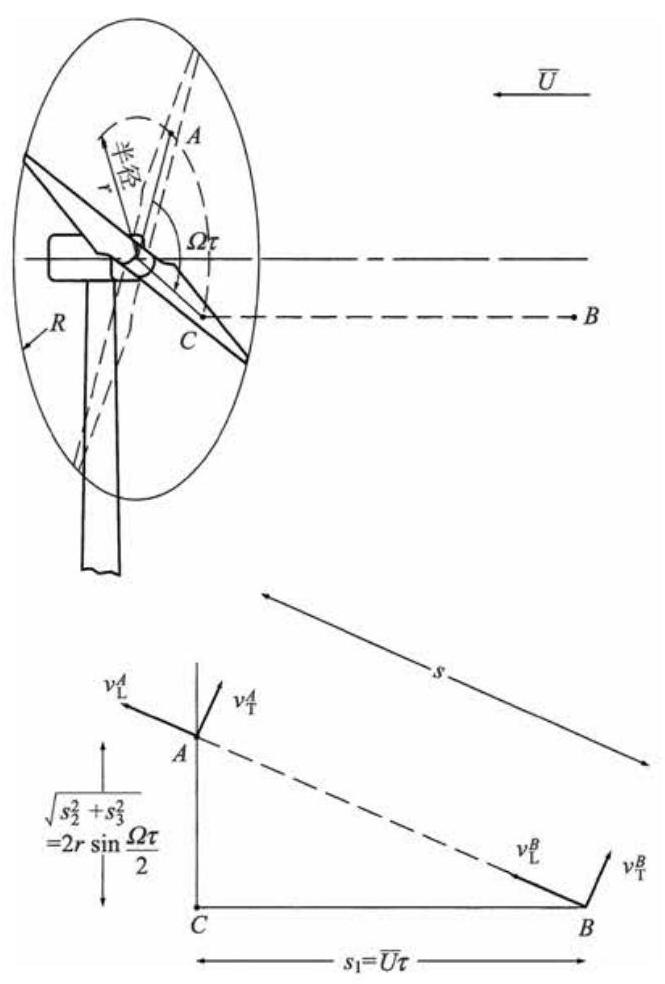

图 5.17 旋转叶片上点的速度自相关函数推导的几何图

当矢量 $\overrightarrow{s}$ 指向顺风方向时，根据泰勒的“静态湍流”的假设，可以将 ${\kappa }_{\mathrm{L}}\left( s\right)$ 转换成 ${\kappa }_{\mathrm{u}}\left( {s}_{1}\right)$ ,令 $\tau  = {s}_{1}/\bar{U}$ ,则 ${\kappa }_{\mathrm{u}}\left( {s}_{1}\right)$ 等于固定点的自相关函数 ${\kappa }_{\mathrm{u}}\left( \tau \right)$ [式(5.35)],因此,

$$
{\kappa }_{\mathrm{L}}\left( {s}_{1}\right)  = \frac{2{\sigma }_{\mathrm{u}}^{2}}{\Gamma \left( \frac{1}{3}\right) }{\left( \frac{{s}_{1}/2}{{T}^{\prime }\bar{U}}\right) }^{\frac{1}{3}}{K}_{1/3}\left( \frac{{s}_{1}}{{T}^{\prime }\bar{U}}\right) \tag{5.43}
$$

由于湍流被假设为是各向同性的， ${\kappa }_{\mathrm{L}}\left( s\right)$ 与矢量 $\overrightarrow{s}$ 的方向无关，所以根据式 (5.36), 我们可以写出

$$
{\kappa }_{\mathrm{L}}\left( s\right)  = \frac{2{\sigma }_{\mathrm{u}}^{2}}{\Gamma \left( \frac{1}{3}\right) }{\left( \frac{s/2}{{T}^{\prime }\bar{U}}\right) }^{\frac{1}{3}}{K}_{13}\left( \frac{s}{{T}^{\prime }\bar{U}}\right)  = \frac{2{\sigma }_{\mathrm{u}}^{2}}{\Gamma \left( \frac{1}{3}\right) }{\left( \frac{s/2}{1.34L}\right) }^{\frac{1}{3}}{K}_{1/3}\left( \frac{s}{1.34L}\right)
$$

(5.44)

显然,

$$
\mathrm{d}/\mathrm{d}x\left\lbrack  {{x}^{v}{K}_{v}\left( x\right) }\right\rbrack   =  - {x}^{v}{K}_{\left( 1 - v\right) }\left( x\right)
$$

将式 (5.44) 代入式 (5.42) 中，可以得到在转动叶片上半径为 $r$ 的点沿风向波动的自相关函数表达式为

$$
{\kappa }_{\mathrm{u}}^{ \circ  }\left( {r,\tau }\right)  = {\kappa }_{\mathrm{u}}\left( {\overrightarrow{s},0}\right)  = \frac{2{\sigma }_{\mathrm{u}}^{2}}{\Gamma \left( \frac{1}{3}\right) }{\left( \frac{s/2}{1.34L}\right) }^{\frac{1}{3}}\left\lbrack  {{K}_{1/3}\left( \frac{s}{1.34L}\right)  - \frac{s}{2\left( {1.34L}\right) }{K}_{2/3}\left( \frac{s}{1.34L}\right) }\right.
$$

$$
\left. {\times {\left( \frac{{2r}\sin \left( {{\Omega \tau }/2}\right) }{s}\right) }^{2}}\right\rbrack \tag{5.45}
$$

根据式 (5.39) 中的 $\tau$ 定义式 (5.45) 中的 $s$ 。

步骤 3 通过观测旋转叶片上的点推导功率频谱。

通过对式 (5.45) 中的 ${\kappa }_{\mathrm{u}}^{ \circ  }\left( {r,\tau }\right)$ 进行傅里叶变换可以获得转动采样频谱为

$$
{S}_{\mathrm{u}}^{ \circ  }\left( n\right)  = 4{\int }_{0}^{\infty }{\kappa }_{\mathrm{u}}^{ \circ  }\left( {r,\tau }\right) \cos {2\pi n\tau }\mathrm{d}\tau
$$

$$
= 2{\int }_{-\infty }^{\infty }{\kappa }_{\mathrm{u}}^{ \circ  }\left( {r,\tau }\right) \cos {2\pi n\tau }\mathrm{d}\tau \tag{5.46}
$$

其中, ${\kappa }_{\mathrm{u}}^{\mathrm{o}}\left( {r,\tau }\right)  = {\kappa }_{\mathrm{u}}^{\mathrm{o}}\left( {r, - \tau }\right)$ 。

由于没有用于积分的分析解, 所以必须采用离散傅里叶变换的数学算法进行求解。由于对于较大的 $\tau ,{\kappa }_{\mathrm{u}}^{ \circ  }\left( {r,\tau }\right)$ 趋向于 0,所以首先将积分范围简化为 $\lbrack  - T/2$ , $+ T/2\rbrack$ 。当假设 ${\kappa }_{\mathrm{u}}^{ \circ  }\left( {r,\tau }\right)$ 为以周期 $T$ 变化的周期函数时,在 $\tau  > T/2$ 时的范围内 ${\kappa }_{\mathrm{u}}^{ \circ  }\left( {r,\tau }\right)$ 等于 ${\kappa }_{\mathrm{u}}^{ \circ  }\left( {r, T - \tau }\right)$ ,并且积分范围变为 $\left\lbrack  {0, T}\right\rbrack$ ,因此,

$$
{S}_{\mathrm{u}}^{ \circ  }\left( n\right)  = 2{\int }_{0}^{T}{\kappa }_{\mathrm{u}}^{* \circ  }\left( {r,\tau }\right) \cos {2\pi n\tau }\mathrm{d}\tau \tag{5.47}
$$

其中,* 表示 $\tau  > T/2$ 时的 ${\kappa }_{\mathrm{u}}^{ \circ  }\left( {r,\tau }\right)$ ,则离散型傅里叶变换式就转换为

$$
{S}_{\mathrm{u}}^{ \circ  }\left( {n}_{\mathrm{k}}\right)  = {2T}\left\lbrack  {\frac{1}{N}\mathop{\sum }\limits_{{p = 0}}^{{N - 1}}{\kappa }_{\mathrm{u}}^{* \circ  }\left( {r,{pT}/N}\right) \cos {2\pi \kappa p}/N}\right\rbrack \tag{5.48}
$$

式中, $N$ 为在时域 ${\kappa }_{\mathrm{u}}^{* \circ  }\left( {r,{pT}/N}\right)$ 中所取的采样点个数,在频率为 ${n}_{k} = k/T(k = 0,1$ , $2,\cdots , N - 1)$ 时，可以计算出其功率谱密度。假设 $N$ 是 2 的幂函数，那么在方程中括号内的部分可以通过标准的快速傅里叶变换计算出来。很明显，如果以高分辨率覆盖很大的频率范围， $N$ 就应该尽可能地大。就像 ${\kappa }_{\mathrm{u}}^{* \circ  }\left( {r,\tau }\right)$ 是关于 $T/2$ 对称的一样,通过傅里叶变换得到的 ${S}_{\mathrm{u}}^{ \circ  }\left( {n}_{k}\right)$ 的值是关于中心频率 $N/\left( {2T}\right)$ 对称分布的，而且超出这个频率的值没有实际意义。此外,在接近 $N/\left( {2T}\right)$ 频率处,通过离散傅里叶变换得到的功率谱密度存在重叠误差,这是因为 ${\kappa }_{\mathrm{u}}^{* \circ  }\left( {r,{pT}/N}\right)$ 的级数在频率大于 $N/\left( {2T}\right)$ 的部分发生了错误的形变。假定计算出来的谱密度在直到 $N/\left( {4T}\right)$ 的频率时是可靠的,那么选定 $T = {200}\mathrm{\;s}, N = {4096}$ ,通过快速傅里叶变换将会得出以频率间隔 ${0.005}\mathrm{\;{Hz}}$ 增至 $5\mathrm{\;{Hz}}$ 的正确结果。

#### 2 例 5.2

作为例证,已经推导出装有 $\mathrm{T}{40}$ 叶片,平均风速为 $8\mathrm{\;m}/\mathrm{s}$ ,转速为 ${15}\mathrm{r}/\mathrm{{min}}$ ,半径为 ${40}\mathrm{\;m}$ 的旋转叶片上各个点的结果。根据 IEC 61400-1 第二版 (1999),利用 Von Karman 各向同性湍流模型,各向同性积分长度尺度 $L$ 取 IEC 61400-1 湍流规模参数 ${\Lambda }_{1}$ 的 3.5 倍。然而第三版 (2005) 中 ${\Lambda }_{1}$ 为 ${42}\mathrm{\;m}$ ,轮毂高度大于 ${60}\mathrm{\;m}, L = \; {147}\mathrm{\;m}$ 。图 5.18 显示了正态自相关函数 ${\rho }_{\mathrm{u}}^{\mathrm{o}}\left( {r,\tau }\right) \left\lbrack  { = {\kappa }_{\mathrm{u}}^{\mathrm{o}}\left( {r,\tau }\right) /{\sigma }_{\mathrm{u}}^{2}}\right\rbrack$ 在叶片半径为 ${40}\mathrm{\;m}$ 、 ${20}\mathrm{\;m}$ 、 $0\mathrm{\;m}$ 时，沿纵向风速波动随叶片转速的变化。对于 $r = {20}\mathrm{\;m}$ ，甚至 $r = {40}\mathrm{\;m}$ 时， 这些曲线显示了当叶片正在遭遇最初的阵风或暂时平静时每转的显著峰值。

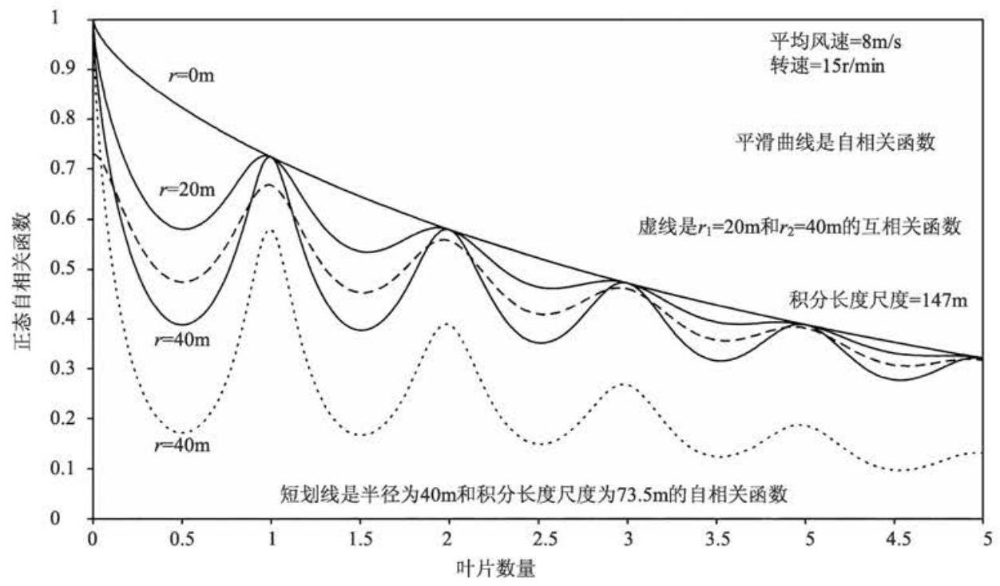

图 5.18 不同半径旋转叶片上采样点沿风向波动的正态自相关函数和互相关函数

图 5.19(a) 显示了相应的基于频率 $n$ 划分的旋转采样功率谱密度函数 ${R}_{\mathrm{u}}^{\mathrm{o}}(r$ , $\tau )\left\lbrack  { = n{S}_{\mathrm{u}}^{ \circ  }\left( {r, n}\right) /{\sigma }_{\mathrm{u}}^{2}}\right\rbrack$ ,其中频率采用了对数坐标。很明显,对于旋转频率和较小的谐波变化角度，频谱的频率可容度存在很大的漂移，并且漂移的程度随半径的增加而增加。注意:频谱密度在大约超过 $3\mathrm{\;{Hz}}$ 后呈现增加趋势。这种错误就是由上面所说的混淆现象产生的。图 5.19(b) 与图 5.19(a) 是相同的, 只不过图 5.19(b) 在两个坐标轴上都采用了对数坐标。

考虑各种输入参数如何影响因旋转频率而导致的能量转换是有益的。由于 ${\kappa }_{\mathrm{u}}^{\mathrm{o}}\left( {r,\tau }\right)  = {\kappa }_{\mathrm{u}}^{\mathrm{o}}\left( {s,0}\right)$ 随 $s$ 的增加单调递减,式 (5.39) 表明这个函数中波谷的深度,因此,基于旋转频率的能量转换与叶尖速比 ${\Omega r}/\bar{U}$ 是严格的正比关系。因此,对于低风速段的恒速双叶片机组 (通常其转速比三叶片机组的快) 是非常重要的。

#### 3 减少长度尺度的影响

在自相关方程和旋转采样频谱中,采用降低各向性积分长度尺度 $L$ 以 ${147}\mathrm{\;m}$ 到 ${73.5}\mathrm{\;m}$ 的结果在图 5.18 和图 5.20 中分别进行了说明 (风力机半径为 ${40}\mathrm{\;m}$ )。

可以看出, 尽管自相关方程更快速地衰减, 长度尺度的减少在旋转频谱峰值的影响微乎其微。

#### 4 旋转采样交叉频谱

叶片弯曲度和切变度频谱的表达式是著名的沿叶片对点旋转采样交叉频谱的实体函数，它与上面所表述的单点旋转采样的普通频谱是类似的。在旋转叶片上， 半径为 ${r}_{1}$ 和 ${r}_{2}$ 处对点的交叉频谱设计与由傅里叶变换对偶推出的相应的互相关函数相关，其表达式如下:

$$
{S}_{\mathrm{u}}^{ \circ  }\left( {{r}_{1},{r}_{2}, n}\right)  = 4{\int }_{0}^{\infty }{\kappa }_{\mathrm{u}}^{ \circ  }\left( {{r}_{1},{r}_{2},\tau }\right) \cos {2\pi n\tau }\mathrm{d}\tau \tag{5.49}
$$

$$
{\kappa }_{\mathrm{u}}^{\mathrm{o}}\left( {{r}_{1},{r}_{2},\tau }\right)  = {\int }_{0}^{\infty }{S}_{\mathrm{u}}^{\mathrm{o}}\left( {{r}_{1},{r}_{2}, n}\right) \cos {2\pi n\tau }\mathrm{d}n \tag{5.50}
$$

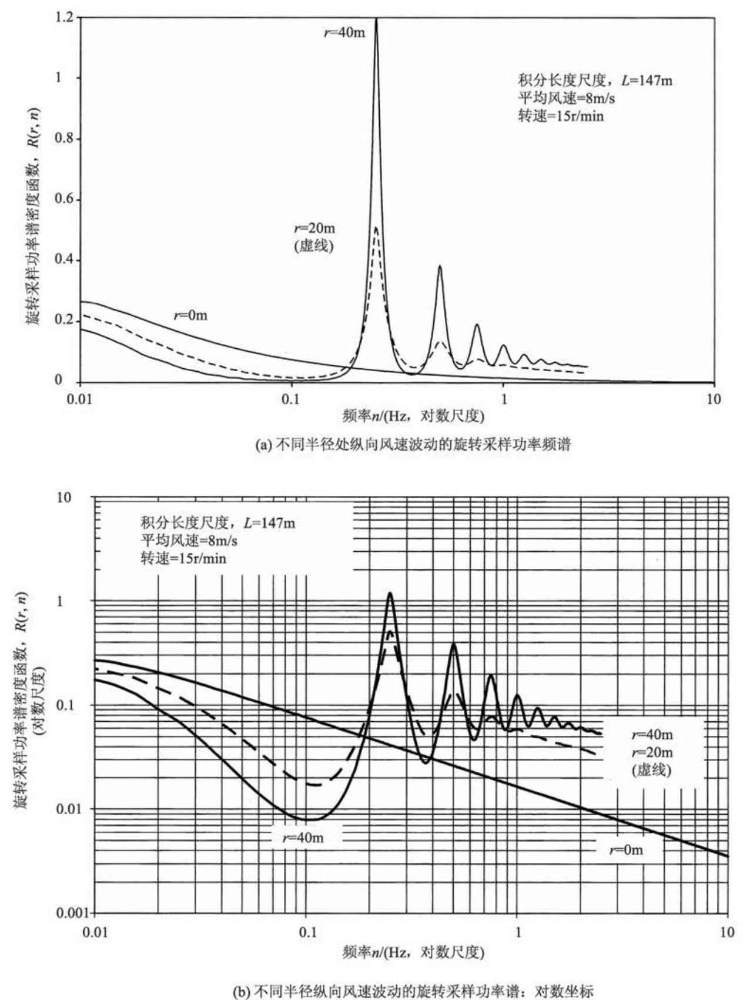

图 5.19

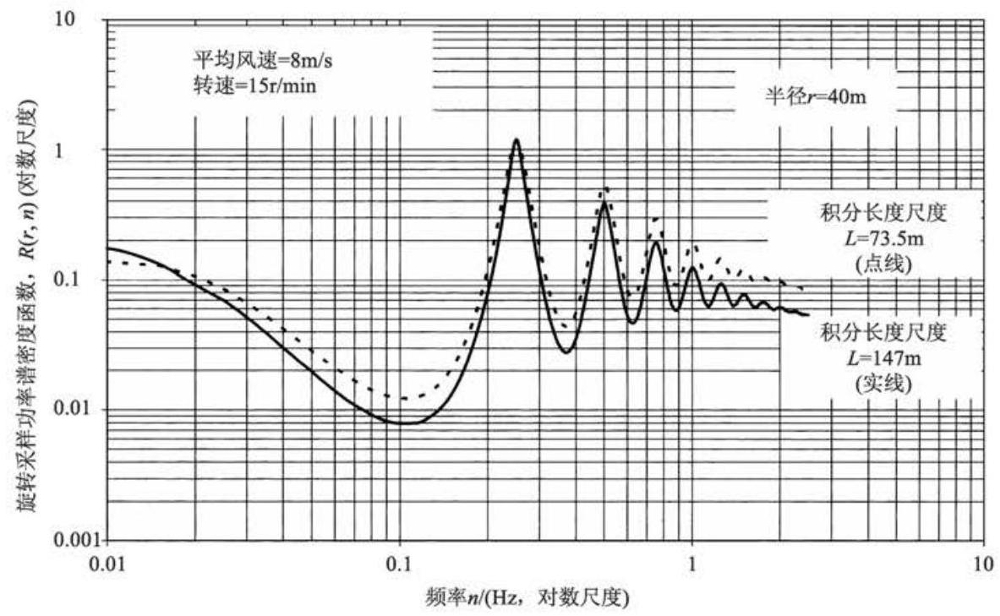

图 5.20 半径为 ${40}\mathrm{\;m}$ 时,不同积分长度尺度的旋转采样功率谱比较

令式(5.50)中 $\tau  = 0$ ,则

$$
{\kappa }_{\mathrm{u}}^{ \circ  }\left( {{r}_{1},{r}_{2},0}\right)  = {\int }_{0}^{\infty }{S}_{\mathrm{u}}^{ \circ  }\left( {{r}_{1},{r}_{2}, n}\right) \mathrm{d}n \tag{5.51}
$$

将式(5.30)中叶根弯矩的标准偏差代入表达式得到

$$
{\sigma }_{\mathrm{M}}^{2} = {\left( \frac{1}{2}\rho \Omega \frac{\mathrm{d}{C}_{\mathrm{L}}}{\mathrm{d}\alpha }\right) }^{2}{\int }_{0}^{R}{\int }_{0}^{R}\left\lbrack  {{\int }_{0}^{\infty }{S}_{\mathrm{u}}^{ \circ  }\left( {{r}_{1},{r}_{2}, n}\right) \mathrm{d}n}\right\rbrack  c\left( {r}_{1}\right) c\left( {r}_{2}\right) {r}_{1}^{2}{r}_{2}^{2}\mathrm{\;d}{r}_{1}\mathrm{\;d}{r}_{2}
$$

(5.52)

由此可以推出叶根弯矩的功率谱是

$$
{S}_{\mathrm{M}}\left( n\right)  = {\left( \frac{1}{2}\rho \Omega \frac{\mathrm{d}{C}_{\mathrm{L}}}{\mathrm{d}\alpha }\right) }^{2}{\int }_{0}^{R}{\int }_{0}^{R}{S}_{\mathrm{u}}^{ \circ  }\left( {{r}_{1},{r}_{2}, n}\right) c\left( {r}_{1}\right) c\left( {r}_{2}\right) {r}_{1}^{2}{r}_{2}^{2}\mathrm{\;d}{r}_{1}\mathrm{\;d}{r}_{2} \tag{5.53}
$$

用旋转叶片半径 ${r}_{1}$ 和 ${r}_{2}$ 点之间的轴向波动互相关函数 ${\kappa }_{\mathrm{u}}^{\mathrm{o}}\left( {{r}_{1},{r}_{2}, n}\right)$ 代替第二步中的自相关函数，那么旋转采样交叉频谱 ${S}_{\mathrm{u}}^{\mathrm{o}}\left( {{r}_{1},{r}_{2}, n}\right)$ 的导数和上述旋转采样单点频谱的导数是严格相同的。在式 (5.39) 中,分散距离 $s$ 的表达式可以由下式代替:

$$
{s}^{2} = {\bar{U}}^{2}{\tau }^{2} + {r}_{1}^{2} + {r}_{2}^{2} - 2{r}_{1}{r}_{2}\cos {\Omega \tau } \tag{5.54}
$$

因此，互相关函数的表达式变为

$$
{\kappa }_{\mathrm{u}}^{ \circ  }\left( {{r}_{1},{r}_{2},\tau }\right)  = \frac{2{\sigma }_{\mathrm{u}}^{2}}{\Gamma \left( \frac{1}{3}\right) }{\left( \frac{s/2}{1.34L}\right) }^{\frac{1}{3}}\left\lbrack  {{K}_{1/3}\left( \frac{s}{1.34L}\right)  - \frac{s}{2\left( {1.34L}\right) }{K}_{2/3}\left( \frac{s}{1.34L}\right) }\right.
$$

$$
\left. {\times \left( \frac{{r}_{1}^{2} + {r}_{2}^{2} - 2{r}_{1}{r}_{2}\cos \left( {\Omega \tau }\right) }{{s}^{2}}\right) }\right\rbrack \tag{5.55}
$$

其中, $s$ 由式(5.54)定义。

标准的互相关函数的最终表达式 ${\rho }_{\mathrm{u}}^{\mathrm{o}}\left( {{r}_{1},{r}_{2},\tau }\right)  = {\kappa }_{\mathrm{u}}^{\mathrm{o}}\left( {{r}_{1},{r}_{2}, n}\right)$ 可以用例 5.2 中 ${r}_{1} = {20}\mathrm{\;m}$ 和 ${r}_{2} = {40}\mathrm{\;m}$ 的情况通过图 5.18 进行说明。在图 5.21 中,将在这种情况下的旋转采样交叉频谱和旋转采样单点频谱或同样半径的自动频谱进行比较。可以看出, 交叉频谱曲线的形式与自动频谱相似, 它在两个自动频谱峰值中间的旋转频率处有一个显著峰值。然而, 在较高的频率时交叉频谱下降要快得多。

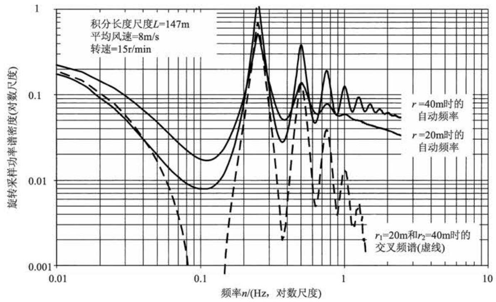

图 5.21 在半径 ${20}\mathrm{\;m}$ 和 ${40}\mathrm{\;m}$ 处,风速波动的旋转采样交叉频谱和自动频谱: 对数坐标

事实上, 叶根弯矩的能量频谱的估计值是通过式 (5.53) 中积分近似值的求和来实现的,其表达式如下:

$$
{S}_{\mathrm{M}}\left( n\right)  = {\left( \frac{1}{2}\rho \Omega \frac{\mathrm{d}{C}_{\mathrm{L}}}{\mathrm{d}\alpha }\right) }^{2}\mathop{\sum }\limits_{j}\mathop{\sum }\limits_{k}{S}_{\mathrm{u}}^{ \circ  }\left( {{r}_{j},{r}_{k}, n}\right) c\left( {r}_{j}\right) c\left( {r}_{k}\right) {r}_{j}^{2}{r}_{k}^{2}{\left( \Delta r\right) }^{2} \tag{5.56}
$$

#### 5 频域分析的限制

就像段首标明的那样, 在频域内空气动力学载荷的随机分析取决于风速和叶片载荷之间线性关系的合理性。对于失速型机组来说, 当风速达到切出风速或风速足够大, 以至于失速型机组需要完全停止时, 这种方法将变得更加不精确。为了避免频域分析这种限制, 必须在时域进行分析。

### 5.7.6 随机气动载荷——时域分析

#### 1 网的仿真

作为输入，在时域内空气动力学载荷的随机分析，需要有一个仿真的风域，它不受时间和圆盘面积的限制。典型的可以通过产生圆盘上既相互独立又彼此相关的点的时间关系曲线获得。这样，每个时间关系曲线的功率谱应该和标准的功率谱(如冯·卡门或卡尔曼)相一致，两个不同点时间关系曲线的标准化交叉频谱(另外, 如著名的相干函数)应该等于符合所选功率谱和区域内分离点距离的相干函数。例如,湍流纵向成分符合垂直于风向的由 $\Delta {s}_{jk}$ 区分的 $j$ 点和 $k$ 点的卡尔曼功率谱的相干

$$
{C}_{jk}\left( n\right)  = C\left( {\Delta {s}_{{jk}, n}}\right)  = \frac{{S}_{jk}\left( n\right) }{{S}_{\mathrm{u}}\left( n\right) } = \exp \left( {-{H\Delta }{s}_{jk}\sqrt{{\left( \frac{n}{U}\right) }^{2} + {\left( \frac{0.12}{L}\right) }^{2}}}\right) \tag{5.57}
$$

常数 $H$ 为 8.8,在 IEC 61400-1 第二版中定义,但是在第三版中增长到 12。 $\left( {{0.12}/L}\right)$ 项很小，除非是在频率在 ${0.01}\mathrm{\;{Hz}}$ 以下。注意:相干有时是指一致性，有些作者定义相干为标准化交叉频谱的平方。符合卡尔曼功率谱相干的详细资料见 2.6.6 节中的内容。

已经有以下三种不同的方法用来产生仿真时间关系曲线:

(1)基于滤除高斯噪声信号的转换方法。

(2)相关法，在一个时间段的终点少量空气团的速度可以通过和时间段始点速度及随机的不相关增量有关速度的总和计算出来。

(3)谐波系数法，包括和功率谱一致的振幅加权的不同频率余弦波级数的总和。

目前，最后一种方法大概是应用最为广泛的，下面对其进行更详尽的介绍。介绍基于 Veers(1988)给定的方法。

#### 2 采用谐波系数法对风的仿真

$N$ 个点的风速波动频谱特性可以通过频谱矩阵 $\mathbf{S}$ 来进行描述。在矩阵中,对角线是每一个点 ${S}_{kk}\left( n\right)$ 的双面单一点的功率谱密度,非对角线的部分是交叉频谱密度,它也是双面的。这个矩阵等于三角转化矩阵 $\mathbf{H}$ 和它的转置矩阵 ${\mathbf{H}}^{\mathrm{T}}$ 的乘积。

$$
\left\lbrack  \begin{matrix} {S}_{11} & {S}_{21} & {S}_{31} & \cdots \\  {S}_{21} & {S}_{22} & {S}_{32} & \cdots \\  {S}_{31} & {S}_{32} & {S}_{33} & \cdots \\  \cdots & \cdots & \cdots & {S}_{NN} \end{matrix}\right\rbrack   = \left\lbrack  \begin{matrix} {H}_{11} & & & \\  {H}_{21} & {H}_{22} & & \\  {H}_{31} & {H}_{32} & {H}_{33} & \\  \cdots & \cdots & \cdots & {H}_{NN} \end{matrix}\right\rbrack  \left\lbrack  \begin{matrix} {H}_{11} & {H}_{21} & {H}_{31} & \cdots \\   & {H}_{22} & {H}_{32} & \cdots \\   & & {H}_{33} & \cdots \\   & & & {H}_{NN} \end{matrix}\right\rbrack
$$

即由矩阵 $\mathbf{S}$ 和矩阵 $\mathbf{H}$ 的元素连接的数量为 $N\left( {N + 1}\right)$ 的一组方程为

$$
{S}_{11} = {H}_{11}^{2},\;{S}_{21} = {H}_{21}{H}_{11},\;{S}_{22} = {H}_{21}^{2} + {H}_{22}^{2},
$$

$$
{S}_{31} = {H}_{31}{H}_{11},\;{S}_{32} = {H}_{31}{H}_{21} + {H}_{32}{H}_{22},\;{S}_{33} = {H}_{31}^{2} + {H}_{32}^{2} + {H}_{33}^{2}
$$

$$
{S}_{jk} = \mathop{\sum }\limits_{{l = 1}}^{k}{H}_{jl}{H}_{kl},\;{S}_{kk} = \mathop{\sum }\limits_{{l = 1}}^{k}{H}_{kl}^{2} \tag{5.58}
$$

和矩阵 $\mathbf{S}$ 的元素一样,矩阵 $\mathbf{H}$ 的元素都是频率 $n$ 的双边函数。

功率谱密度 ${S}_{kk}$ 的表达式类似于一组独立变量 $k$ 的总和的方差。显然,矩阵 $\mathbf{H}$ 的元素可以被认为是 $N$ 个独立单位幅值的白噪声输入线性组合的权重因数,以产生 $\mathbf{N}$ 个带有正确频谱矩阵的相关输出。这样,在点 $j$ 处矩阵 $\mathbf{H}$ 第 $j$ 行的元素是输入促成输出的权重因数。线性组合的公式是

$$
{u}_{j}\left( n\right)  = \mathop{\sum }\limits_{{k = 1}}^{j}{H}_{jk}\left( n\right)  \cdot  {\Delta n} \cdot  \exp \left\lbrack  {-i{\theta }_{k}\left( n\right) }\right\rbrack \tag{5.59}
$$

这里 ${u}_{j}\left( n\right)$ 是在点 $j$ 处仿真风速为 $n\mathrm{\;{Hz}}$ 离散频率成分的复数系数。频率带宽是 ${\Delta n}$ 。 ${\theta }_{k}\left( n\right)$ 是点 $k$ 处与频率元素 $n\mathrm{\;{Hz}}$ 相关联的相位角,点 $k$ 是分布在 $0 \sim  {2\pi }$ 的随机变量。

权重因数的值 ${H}_{jk}$ 来自式 (5.58),总数为 $N\left( {N + 1}\right)$ ,如

$$
{H}_{11} = \sqrt{{S}_{11}},\;{H}_{21} = {S}_{21}/{H}_{11},\;{H}_{22} = \sqrt{{S}_{22} - {H}_{21}^{2}},
$$

$$
{H}_{31} = {S}_{31}/{H}_{11},\cdots \tag{5.60}
$$

因此，

$$
{u}_{1}\left( n\right)  = \sqrt{{S}_{11}\left( n\right) } \cdot  {\Delta n}\exp \left( {-i{\theta }_{1}\left( n\right) }\right)
$$

$$
{u}_{2}\left( n\right)  = \sqrt{{S}_{22}\left( n\right) } \cdot  {\Delta n}\left\{  {{C}_{21}\left( n\right)  \cdot  \exp \left\lbrack  {-i{\theta }_{1}\left( n\right) }\right\rbrack  }\right.
$$

$$
\left. {+\sqrt{1 - {C}_{21}^{2}\left( n\right) } \cdot  \exp \left\lbrack  {-i{\theta }_{2}\left( n\right) }\right\rbrack  }\right\}  \cdots \tag{5.61}
$$

在每个点 $j$ 处对系数 ${u}_{\mathrm{j}}\left( n\right)$ 取离散傅里叶变换可以得到风速波动的时间序列。 如果需要的话, 横向的和垂直的风速波动也可以采用同样的方法进行仿真。作为说明,基于冯·卡门频谱并采用这种方法的两个点之间的间隔为 ${10}\mathrm{\;m}$ 的点的时间序列的例子如图 5.22 所示。在该例子中,平均风速和积分长度尺度 ${}^{x}{L}_{u}$ 为 ${10}\mathrm{\;m}/\mathrm{s}$ 和 ${73.5}\mathrm{\;m}$ ,给出了积分时间尺度 ${}^{x}{L}_{u}/\bar{U},{73.5}\mathrm{\;s}$ 。

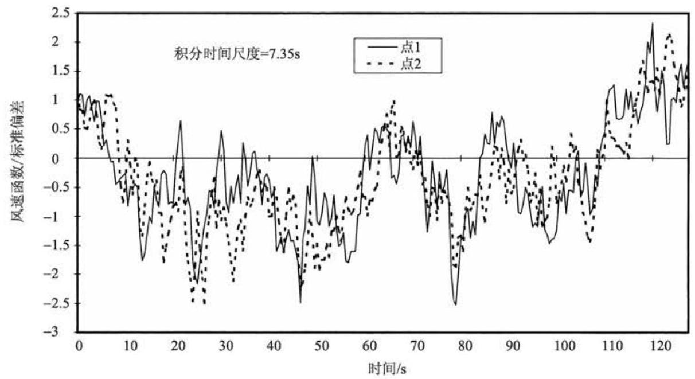

图 5.22 两点之间的间隔为 ${10}\mathrm{\;m}$ 的风速时间序列的仿真

在 1988 年的文章中, Veers 指出, 通过计算叶片正在经过时每一个点的仿真风速，可以使所需要的计算时间减少，如在频率为 ${\Omega B}/{2\pi }$ 时，这里 $B$ 是指叶片的数量。它是对每个点 ${\psi }_{jn}{2\pi }/\Omega$ 的频率元素采用移相的方法获得的， ${\psi }_{j}$ 是点 $j$ 的方位角。

#### 3 叶片载荷时间关系曲线

一旦得到风速与时间的关系曲线, 便可以计算不同半径的叶片载荷曲线。如果唤醒功能被假定为失效，那么对于在每个半径、每个稳定风速的计算值，其轴向诱导速度 $\alpha$ 和切向诱导速度 ${\alpha }^{\prime }{\Omega r}$ 被认为是不随时间变化的。流动角的瞬时值和升拉角系数的值可以通过速度图直接从风速波动的瞬时值 (包括水平部分和垂直部分)中计算出来。

对于平衡唤醒可以有选择地采用。由于诱导速度趋于连续变化, 所以在所有的时间，对每一个叶片元件动力方程都适用。显然，在每个时间段都要解出这些方程, 这就要求有更多的计算。

平衡唤醒模式和失效唤醒模式都不是对唤醒行为的正确描述。动态流入理论提供了一个较好的模式, 它假定在流入风域 (见 4.4 节) 诱导速度发生变化前有一些延时。

要注意到, 如果需要的话, 在仿真风域中可以包括引起固定载荷的空间风的变数, 使叶片上的固定和随机载荷可以在操作中进行计算。

### 5.7.7 极限载荷

最大载荷的产生应该适当地考虑动态效果, 这是下一节中的内容。因此, 本节将被限制在没有考虑动态效果的最大载荷的情况。

就像在 5.4.1 节中所描述的那样, 考虑固定阵风的最大工作载荷情况的风力机设计规范是惯例。采用 5.7.2 节中描述的叶片部件和动量定理, 求出在持续阵风间隔内叶片的最大载荷。

尽管规范所规定的不连续阵风模式有定义清楚的优点，但是它们在本质上是任意的。采用风的随机代表的选择性方法, 提供了对风本身更加现实的描述, 但这取决于线性度的假设, 并且在 IEC 61400-1 第三版中有了更多扩展。尽管风的随机性表达本身用在频域，非线性由失速产生，所以标准定义分析在时域进行仿真。 在频域进行分析, 可以提供失速消失的有意义的见解, 并且可以在后续的表格中进行深层次的考虑。

通常, 在调研中, 载荷如叶根弯矩, 既包括周期性的部分也包括随机的部分。 尽管预测每个独立部件的最大值很简单, 但是预测组合信号的最大值是相当棘手的。Madsen等(1984)已经提出了下面简单的近似方法，并且已经证明其相当精确。

周期成分 $z\left( t\right)$ 被认为是 3 级正弦波,其中的变量按照周期的比例 ${\varepsilon }_{1}\text{ 、 }{\varepsilon }_{2}$ 和 ${\varepsilon }_{3}$ 取初始波形的最大值、平均值和最小值。简单表示为

$$
{\varepsilon }_{1} = \frac{{\sigma }_{z}^{2}}{\left( {{z}_{\max } - {\mu }_{z}}\right) \left( {{z}_{\max } - {z}_{\min }}\right) },\;{\varepsilon }_{3} = \frac{{\sigma }_{z}^{2}}{\left( {{\mu }_{z} - {z}_{\min }}\right) \left( {{z}_{\max } - {z}_{\min }}\right) } \tag{5.62}
$$

假定组合信号的最大值只在 ${\varepsilon }_{1}$ 比例时间内发生,其中周期元素的方波表达式取最大值 ${z}_{\max }$ 。Davenport (1964) 给出了时间间隔为 $T$ 的随机变量的最大值的方程为

$$
\frac{{x}_{\max }}{{\sigma }_{\mathrm{x}}} = \sqrt{2\ln \left( {\nu T}\right) } + \frac{\gamma }{\sqrt{2\ln \left( {\nu T}\right) }} \tag{5.63}
$$

式中， $\nu$ 为式(B.46)给出的零上行交叉频率(也就是每秒内变量从正到负的变换次数); $\gamma  = {0.5772}$ (Euler 常数)。因此,周期和随机变量的组合元素的最大值为

$$
{z}_{\max } + {x}_{\max } = {z}_{\max } + {\sigma }_{\mathbf{x}}\left\lbrack  {\sqrt{2\ln \left( {\nu {\varepsilon }_{1}T}\right) } + \frac{\gamma }{\sqrt{2\ln \left( {\nu {\varepsilon }_{1}T}\right) }}}\right\rbrack   = {z}_{\max } + {g}_{1}{\sigma }_{\mathbf{x}}
$$

(5.64)

式中， ${g}_{1}$ 为峰值因数。

表 5.4 显示了零上行交叉频率为 $1\mathrm{\;{Hz}}$ ，曝光时间为 $T,{x}_{\max }/{\sigma }_{x}$ 的变量。在给定 ${\varepsilon }_{1} = {0.25}$ 时,认为周期元素是简单的正弦曲线。

表 5.4 不同曝光时间随机成分的极值

<table><tr><td>$T$</td><td>1min</td><td>10min</td><td>1h</td><td>10h</td><td>100h</td><td>1000h</td><td>1a</td></tr><tr><td>$T/\mathrm{s}$</td><td>60</td><td>600</td><td>3600</td><td>36000</td><td>360000</td><td>3600000</td><td>31536000</td></tr><tr><td>${\varepsilon }_{1}T/s$</td><td>15</td><td>150</td><td>900</td><td>9000</td><td>90000</td><td>900000</td><td>7884000</td></tr><tr><td>${x}_{\max }/{\sigma }_{x}$</td><td>2.57</td><td>3.35</td><td>3.84</td><td>4.40</td><td>4.90</td><td>5.35</td><td>5.74</td></tr></table>

当风的波动超越额定风速时, 上面所说的确定最大载荷的方法必须要谨慎使用。对于失速调节风力发电机组, 线性假设完全没有作用, 这使得此法失效。然而, 变桨调节风力发电机组为限制功率, 在风轮旋转频率以下, 叶片桨距会对风速波动作出反应，造成叶片载荷的减少。这将极大地改变叶片载荷的频谱，有效去除桨距系统截止频率以下的频率分量,其结果是减小了方程 (5.64) 中将被替换掉的 ${\sigma }_{\mathrm{x}}$ 的幅值。

为了说明此方法, 计算运行于额定风速的变桨距风力发电机组的叶根的极限挥舞弯矩，描述如下:

(1)叶根弯矩随机分量的标准偏差的式 (5.52), 首先被修改以减少转速一半以下频率的贡献, 来说明叶片桨矩的反应, 然后经过离散化给出

$$
{\sigma }_{\mathrm{M}}^{2} = {\left( \frac{1}{2}\rho \Omega \frac{\mathrm{d}{C}_{\mathrm{L}}}{\mathrm{d}\alpha }\right) }^{2}\mathop{\sum }\limits_{{j = 1}}^{m}\mathop{\sum }\limits_{{k = 1}}^{m}\left\lbrack  {{\int }_{\Omega /2}^{\infty }{S}_{\mathrm{u}}^{ \circ  }\left( {{r}_{j},{r}_{k}, n}\right) \mathrm{d}n}\right\rbrack  c\left( {r}_{j}\right) c\left( {r}_{k}\right) {r}_{j}^{2}{r}_{k}^{2}{\left( \Delta r\right) }^{2}
$$

(5.65)

这里假设叶片被分成相同长度 ${\Delta r} = R/m$ 的 $m$ 份。

(2)在对 $\left\lbrack  {m\left( {m + 1}\right) /2}\right\rbrack$ 个不同的抽样转动光谱的累积进行评估以后，可以由式(5.65)求得叶片弯矩的标准偏差。

(3)风力发电机组在以额定风速为中心的风速带中度过的时间 $T$ ，用威布尔曲线进行估计，逐次乘以与叶根弯矩的周期分量波形相适合的因子 ${\varepsilon }_{1}$ 和随机弯矩波动的零上切频率,给出有效的峰值数量 $\nu {\varepsilon }_{1}T$ 。

(4)替换式(5.64)中的叶根弯矩 ${\sigma }_{M}\left( { = {\sigma }_{x}}\right)$ 、有效的峰值数量 $\nu {\varepsilon }_{1}T$ 和周期力矩的极值的标准偏差预测的总力矩的极值。

对于在额定风速为 ${13}\mathrm{\;m}/\mathrm{s}$ 时运行位于年平均风速 $7\mathrm{\;m}/\mathrm{s}$ 地方的这种情况，在以额定风速为中心 $2\mathrm{\;m}/\mathrm{s}$ 的宽带内运行所用时间的期望比例是 ${5.6}\%$ 。考虑风力机组寿命为 20 年,零上切频率为 ${0.25}\mathrm{\;{Hz}}$ ,并且 ${\varepsilon }_{1} = {0.25}$ ,这样会导致峰值因子 ${g}_{1}$ 为 5.5 。对 5.7.2 节中考虑的 ${80}\mathrm{\;m}$ 直径风力机组和 ${20}\%$ 的湍流强度,转化为叶根弯矩随机分量的峰值大约是 ${1730}\mathrm{{kN}} \cdot  \mathrm{m}$ ,与周期分量的极值相比,后者包括风切变,约为 ${1830}\mathrm{{kN}} \cdot  \mathrm{m}$ 。应该强调的是,所引用的随机分量的峰值是理论量。例如, 它线性假定产生此力矩需大的风速维持。事实上, 运行于额定稳定风速中的风力机, 通常都不是远离失速, 所以更大的波动会引起失速。在本例中, 所有抽样旋转频谱累积的均方根值约为 ${0.5}{\sigma }_{\mathrm{u}}$ ，所以等效于极限根部力矩的理想化归一风速约为 ${0.20} \times  {13} \times  {0.5} \times  {5.5} = {7.2}\left( {\mathrm{\;m}/\mathrm{s}}\right)$ 。

当高风速时，顺桨使机组运行在远离失速点的位置上，上面所列方法对此分析会更加有效。但是, 重要的是要注意到用在推导式 (5.29) 中的其他线性假定, 表面上 $\phi$ 很小，但出错时它会变大。

可以看出，对于随机极限载荷的计算难度较大，因为随着极限的接近很可能会引起非线性。升力因失速而饱和，或者随着风速的增大甚至会后退，对于极限面外运行载荷的简单而粗略的方法是基于对当地机翼部分的最大升力系数和相对空气速率 $W$ 来计算出一个上限。感应因子很小，可以被忽略。

然而，最复杂的方法是分析由模拟的风域产生的载荷。因为计算的成本通常把模拟活动限制在几百秒甚至更短的时间内，必须使用统计方法从载荷的极值中进行外推, 这些载荷极值是根据风力机的设计周期中的期望极值来进行计算的。

其中的一种方法由 Thomsen 和 Madsen(1997) 进行了论述, 使用式(5.64), 其中 $T$ 等于风力机整个设计周期中合适的曝光周期， ${z}_{\max }$ 和 ${\sigma }_{\mathrm{x}}$ 从模拟时间的历史中提取，通过方位分配的帮助把周期和随机分量进行分离。该方法在模拟短持续时间时的缺点是，方位分配过程会把一些因低频率阵风所引起的载荷波动认为是周期量而不是随机量,所以标准偏差中的随机分量 ${\sigma }_{\mathrm{x}}$ 被估算低了。

推测技术会在 5.14 节中详细介绍。

## 5.8 叶片动态响应

### 5.8.1 模态分析

尽管通常叶片上的动态载荷同样会引起塔架的动态反应，但是这里一开始就对塔架顶部的运动不予以考虑，而把重点集中在叶片自身的动态行为上，并且因为预测失速行为的固有困难，而把措施进一步限制在非失速型叶片的反应上。

叶片元素在面外方向单位长度隶属于时变载荷 $q\left( {r, t}\right)$ 的半径 $r$ 上的运动方程是

$$
m\left( r\right) \ddot{x} + \widehat{c}\left( r\right) \dot{x} + \frac{{\partial }^{2}}{\partial {r}^{2}}\left\lbrack  {{EI}\left( r\right) \frac{{\partial }^{2}x}{\partial {r}^{2}}}\right\rbrack   = q\left( {r, t}\right) \tag{5.66}
$$

等式左侧的项是元素上的负荷,分别由惯量、阻尼和弯度引起。 $I\left( r\right)$ 是弱主轴 (为此目的，假设位于旋转平面上)叶片横截面上的第二力矩， $x$ 是面外的位移。表达式 $m\left( r\right)$ 和 $c\left( r\right)$ 分别表示单位长度的质量和阻尼。

悬空叶片对于波动空气动力载荷的动态响应，可以通过模型分析方法很方便地进行调研，其中各种不同振动的固有模式引起的激励，分别得到计算并将结果进行叠加。

$$
x\left( {t, r}\right)  = \mathop{\sum }\limits_{{j = 1}}^{\infty }{f}_{j}\left( t\right) {\mu }_{j}\left( r\right) \tag{5.67}
$$

式中, ${\mu }_{j}\left( r\right)$ 为第 $j$ 阶模态的形状,强制假设在叶尖有统一值; ${f}_{j}\left( t\right)$ 为叶尖位移随时间的变化。然后，式(5.66)变为

$$
\mathop{\sum }\limits_{{j = 1}}^{\infty }\left\{  {m\left( r\right) {\mu }_{j}\left( r\right) {\ddot{f}}_{j}\left( t\right)  + \widehat{c}\left( r\right) {\mu }_{j}\left( r\right) {\dot{f}}_{j}\left( t\right)  + \frac{{\mathrm{d}}^{2}}{\mathrm{\;d}{r}^{2}}\left\lbrack  {{EI}\left( r\right) \frac{{\mathrm{d}}^{2}{\mu }_{j}\left( r\right) }{\mathrm{d}{r}^{2}}}\right\rbrack  {f}_{j}\left( t\right) }\right\}
$$

$$
= q\left( {r, t}\right) \tag{5.68}
$$

对于低程度阻尼，固有频率由下式给出:

$$
m\left( r\right) {\omega }_{j}^{2}{\mu }_{j}\left( r\right)  = \frac{{\mathrm{d}}^{2}}{\mathrm{\;d}{r}^{2}}\left\lbrack  {{EI}\left( r\right) \frac{{\mathrm{d}}^{2}{\mu }_{j}\left( r\right) }{\mathrm{d}{r}^{2}}}\right\rbrack \tag{5.69}
$$

所以，式(5.68)变为

$$
\mathop{\sum }\limits_{{j = 1}}^{\infty }\left\lbrack  {m\left( r\right) {\mu }_{j}\left( r\right) {\ddot{f}}_{j}\left( t\right)  + \widehat{c}\left( r\right) {\mu }_{j}\left( r\right) {\dot{f}}_{j}\left( t\right)  + m\left( r\right) {\omega }_{j}^{2}{\mu }_{j}\left( r\right) {f}_{j}\left( t\right) }\right\rbrack   = q\left( {r, t}\right)
$$

(5.70)

两侧都乘以 ${\mu }_{i}\left( r\right)$ ,在叶片长度上进行积分推得

$$
\mathop{\sum }\limits_{{j = 1}}^{\infty }\left\lbrack  {{\int }_{0}^{R}m\left( r\right) {\mu }_{i}\left( r\right) {\mu }_{j}\left( r\right) {\ddot{f}}_{j}\left( t\right) \mathrm{d}r + {\int }_{0}^{R}\widehat{c}\left( r\right) {\mu }_{i}\left( r\right) {\mu }_{j}\left( r\right) {\dot{f}}_{j}\left( t\right) \mathrm{d}r}\right.
$$

$$
\left. {+{\int }_{0}^{R}m\left( r\right) {\omega }_{j}^{2}{\mu }_{i}\left( r\right) {\mu }_{j}\left( r\right) {f}_{j}\left( t\right) \mathrm{d}r}\right\rbrack   = {\int }_{0}^{R}{\mu }_{i}\left( r\right) q\left( {r, t}\right) \mathrm{d}r \tag{5.71}
$$

根据 Betti 定律, 无阻尼模式的形状是矩形, 满足正交性条件

$$
{\int }_{0}^{R}m\left( r\right) {\mu }_{i}\left( r\right) {\mu }_{j}\left( r\right) \mathrm{d}r = 0,\;i \neq  j \tag{5.72}
$$

如果假设沿叶片单位长度的阻尼变化 $\widehat{c}\left( r\right)$ 正比于单位长度的质量变化 $m\left( r\right)$ , 如 $\widehat{c}\left( r\right)  = {am}\left( r\right)$ ,则有

$$
{\int }_{0}^{R}\widehat{c}\left( r\right) {\mu }_{i}\left( r\right) {\mu }_{j}\left( r\right) \mathrm{d}r = 0,\;i \neq  j \tag{5.73}
$$

其结果是,式(5.71)左侧的全部交叉项都被消去,公式被简化为

$$
{m}_{i}{\ddot{f}}_{i}\left( t\right)  + {c}_{i}{\dot{f}}_{i}\left( t\right)  + {m}_{i}{\omega }_{i}^{2}{f}_{i}\left( t\right)  = {\int }_{0}^{R}{\mu }_{i}\left( r\right) q\left( {r, t}\right) \mathrm{d}r \tag{5.74}
$$

式中, ${m}_{i} = {\int }_{0}^{R}m\left( r\right) {\mu }_{i}^{2}\left( r\right) \mathrm{d}r$ 是广义的质量; ${c}_{i} = {\int }_{0}^{R}\widehat{c}\left( r\right) {\mu }_{i}^{2}\left( r\right) \mathrm{d}r;{\int }_{0}^{R}{\mu }_{i}\left( r\right) q\left( {r, t}\right) \mathrm{d}r = \; {Q}_{i}\left( t\right)$ 则被定义为考虑 $i$ 次模型的广义的波动载荷。式 (5.74) 是基本方程,决定对于时变载荷的模型反应。

叶片的振动发生在挥舞和摆振方向 (也就是说, 分别关于弱主轴和强主轴)。 叶片通常扭曲 ${15}^{ \circ  }$ ,所以弱主轴一般不会落在上面假设的旋转平面上,其结果是一个主轴上的叶片弯度必将导致垂直于另一个轴的叶片运动。图 5.23 就说明了这一点,其中根部的最大叶片扭曲已经被清楚地放大。 $P$ 点代表叶尖未偏转的位置, $Q$ 点代表作为弱主轴弯度结果的偏移位置, ${PQ}$ 之间的连线根据沿叶片每一个单元的弯度产生的叶尖偏移连接而成, $M\left( {R - r}\right) {\Delta r}/{EI}$ 。图 5.23 因扭曲叶片拍打弯曲的叶尖偏移(沿叶片轴看)两个主轴上弯度之间的相互作用可以在一些简化的假定上进行探索。如果力矩 $M$ 在一阶模态下以 $\left( {R - r}\right)$ 变化, $I$ 以 ${\left( R - r\right) }^{2}$ 变化,则以上面为参考的每一个叶尖偏移都相等。因此,对于线性扭转分布, ${PQ}$ 是一段圆弧。 如果扭曲在叶尖的零和根部的最大值 $\beta$ 之间变化，则叶尖偏移量 ${\delta }_{12}$ 在弱主轴的方向上，在叶片最大扭曲的部分，是垂直于此轴的叶尖偏移量 ${\delta }_{11}$ 的 $\beta /2$ 倍。因此，在 $\beta  = {15}^{ \circ  }$ 的情况下， ${\delta }_{12}/{\delta }_{11}$ 近似为 0.13，其结果是叶片一阶模态下拍打的振荡会导致产生相对较小的瞬时边缘的惯性载荷。

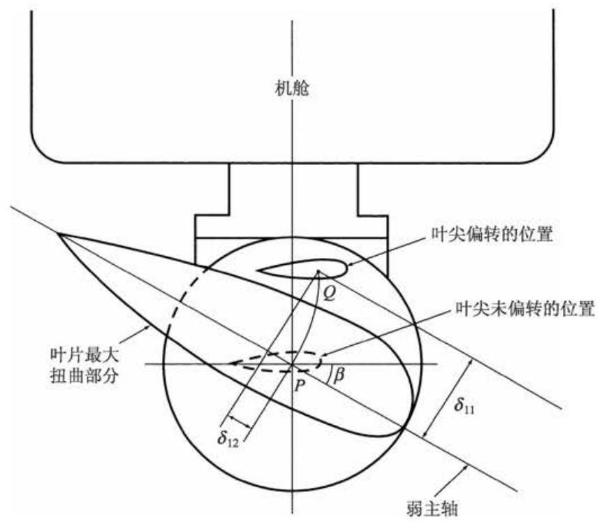

图 5.23 因扭曲叶片拍打弯曲的叶尖偏移(沿叶片轴看)

从上面的论述可以看出, 挥舞和摆振方向的振动之间相互作用的影响一般很小, 因此, 以后对其将不予以考虑。

叶片同样会遭受扭曲振荡，但是这些一般都可以被忽略，因为激励载荷较小， 而且典型的中空叶片高的扭曲强度使扭曲的自然频率在激励频率之上。

最后, 在叶片铰接在根部的情况下, 整个叶片数振荡会涉及铰接的钢性旋转体。这一现象将在 5.8.8 节中进行考虑。

### 5.8.2 振形及频率

一阶模态的形状和频率可以通过称为 Stodola 的迭代技术推导而得到。简言之, 这包括假设一个有可能的模型形状, 计算给定频率 $1\mathrm{{rad}}/\mathrm{s}$ 下与之相关的惯性载荷，然后计算出由这些惯性载荷所产生的束偏移分布图。然后把分布图标幺化， 一般除以叶尖偏移量，得到第二次反复的输入模型形状。此过程一直重复直到模型形状收敛为止,一阶模态的自然频率由下面的公式计算得到:

$$
{\omega }_{1} = \sqrt{\frac{\text{ 上次迭代的输入叶尖偏差 }}{\text{ 上次迭代的输出叶尖偏差 }}}
$$

若推导是以递增的顺序执行, 模态是矩形, 则可以利用这一特性来简化高次模型下形状和频率的推导。像前面一样, 假设一个试验模型, 但是在用它计算惯性载荷之前，将其净化使之不包含低次模型量。例如，对二阶模态试验形态的净化 ${\mu }_{2\mathrm{T}}\left( r\right)$ ,一阶模态量的获得是通过减去

$$
{\mu }_{2\mathrm{C}}\left( r\right)  = {\mu }_{1}\left( r\right) \frac{{\int }_{0}^{R}{\mu }_{1}\left( r\right) {\mu }_{2\mathrm{T}}\left( r\right) m\left( r\right) \mathrm{d}r}{{\int }_{0}^{R}{\mu }_{1}^{2}\left( r\right) m\left( r\right) \mathrm{d}r} = {\mu }_{1}\left( r\right) \frac{{\int }_{0}^{R}{\mu }_{1}\left( r\right) {\mu }_{2\mathrm{T}}\left( r\right) m\left( r\right) \mathrm{d}r}{{m}_{1}}
$$

(5.75)

而得到的。

校正的二阶模态试验模型 ${\mu }_{2\mathrm{M}}\left( r\right)  = {\mu }_{2\mathrm{\;T}}\left( r\right)  - {\mu }_{2\mathrm{C}}\left( r\right)$ ,满足正交条件

$$
{\int }_{0}^{R}{\mu }_{1}\left( t\right) {\mu }_{2\mathrm{M}}\left( r\right) \mathrm{d}r = 0
$$

试验模型形状经过净化以后，Stodola 方法就可以像以前那样得到精确的应用。如果用于最初净化的低次模型形状足够准确，就没有必要对随后的迭代进行进一步净化。参考 Clough 和 Penzien(1993)对此方法的严格论述。

### 5.8.3 离心刚化作用

当旋转的叶片在其旋转面或垂直面上偏移时, 对每一个叶片单元的离心力施加了一个恢复力，会对叶片刚度产生影响，并且相对于静态值提高了自然频率。离心力垂直于旋转轴呈放射状向外，所以在面外叶片偏移的情况下与未偏移叶片轴平行, 并且和叶片面内的偏移相比, 对于叶片的板内部分有更大的杠杆臂, 如图 5.24 所示。

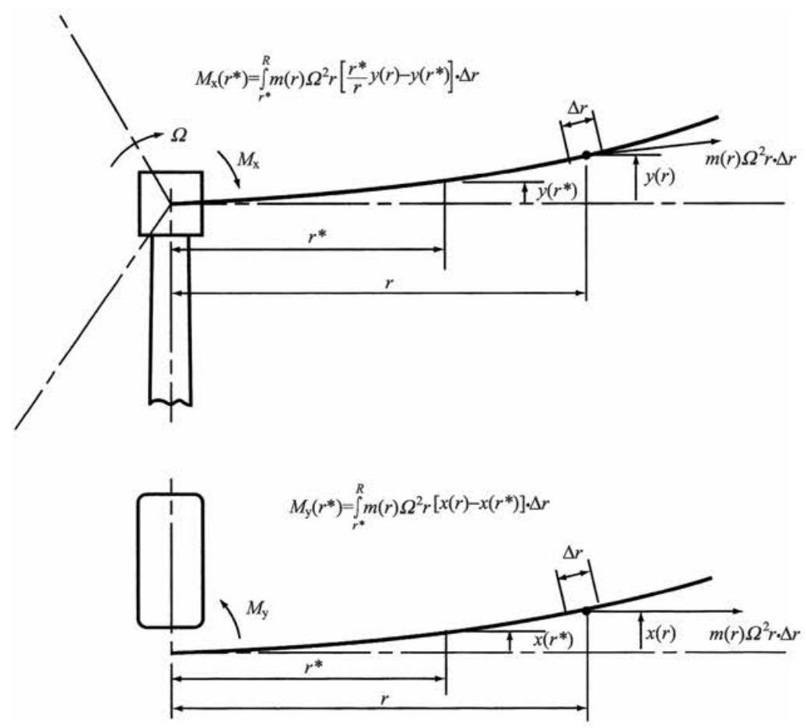

图 5.24 因面内和面外叶片偏移的离心力产生的恢复力矩

为了考虑离心载荷的影响, 位于面外方向的叶片元素运动方程, 通过加入附加项对其进行修正, 变为

$$
m\left( r\right) \ddot{x} + \widehat{c}\left( r\right) \dot{x} - \frac{\partial }{\partial r}\left\lbrack  {N\left( r\right) \frac{\partial x}{\partial r}}\right\rbrack   + \frac{{\partial }^{2}}{\partial {r}^{2}}\left\lbrack  {{EI}\frac{{\partial }^{2}x}{\partial {r}^{2}}}\right\rbrack   = q\left( {r, t}\right) \tag{5.76}
$$

其中,半径 $r$ 上的离心力 $N\left( r\right)$ ,是半径 $r$ 上每一个叶片元素外弦上作用的力的总和, $N\left( r\right)  = \mathop{\sum }\limits_{{r = r}}^{{r = R}}m\left( r\right) {\Omega }^{2}{r\Delta r}$ 。

前面部分描述的推导叶片模型形状和频率的 Stodola 方法, 可以通过考虑离心的影响而得以修正。在面外模式的情况下, 其过程如下:

(1)假设有可能的试验模型形状。

(2)净化试验模型形状，去掉任何低次模型成分。

(3)假设试验的频率值 ${\omega }_{j}^{2}$ 。

(4)计算因横向惯性力所引起的弯矩贡献:

$$
{M}_{\mathrm{Y}\text{ . Lat }}\left( {r}^{ * }\right)  = {\int }_{{r}^{ * }}^{R}m\left( r\right) {w}_{j}^{2}\mu \left( r\right) \left( {r - {r}^{ * }}\right) \mathrm{d}r \tag{5.77}
$$

(5)计算因离心力所引起的弯矩贡献。

$$
{M}_{\mathrm{Y},\mathrm{{CF}}}\left( {r}^{ * }\right)  =  - {\int }_{{r}^{ * }}^{R}m\left( r\right) {\Omega }^{2}r\left\lbrack  {\mu \left( r\right)  - \mu \left( {r}^{ * }\right) }\right\rbrack  \mathrm{d}r \tag{5.78}
$$

(6)计算合成的弯矩贡献。

(7)计算由此弯矩贡献所引起的新的偏移分布。

(8)计算自然频率校正的估计值:

$$
{\omega }_{j}{}^{\prime } = {\omega }_{j}\sqrt{\frac{\text{ 测 }\text{ 试 }\text{ 叶 }\text{ 尖 }\text{ 偏 }\text{ 差 }}{\text{ 估算叶尖偏差的偏差分布 }}}
$$

(9)用校正的模型形状和频率重复步骤 (2) ~ (8)，直到计算的模型形状收敛为止。

重要的一点是，要注意到横向载荷和离心载荷束的偏移不遵循 Betti 定律。其结果是模式形状不是矩形。因此, 迭代的每一个周期里面都已经包含净化阶段。 当计算的模式形状已经发生收敛，可以发现，它与输入到每一个迭代的净化后的模型形状有很大的不同，这说明并没有取得真正的解决。因此，有必要使用试验误差法对所用的净化修正的幅值进行校正, 直到输出的模式形状和输入的净化后的模式形状相当。还需要一些进一步的迭代运算, 直到自然频率稳定下来。

对于旋转叶片一阶模态频率的快速估算, 可以使用 Putter 和 Manor(1978) 报道的 Southwell 公式推导如下:

$$
{\omega }_{1} = \sqrt{{\omega }_{1,0}^{2} + {\phi }_{1}{\Omega }^{2}} \tag{5.79}
$$

式中, ${\omega }_{1,0}$ 为未旋转叶片所对应的频率。 ${\phi }_{1}$ 值取决于叶片质量和刚度的分布,并且 Madsen 等(1984)建议，对于风力机组叶片面外振荡，取值为1.73 。在叶片以 ${30}\mathrm{r}$ / min 的速度旋转的情况下，因为相对于 ${8.1}\%$ 的校正值，7.7%的离心加固会使一阶模态频率产生一个百分比的增加。一般地, 离心加固会导致对于面外振荡一阶模态频率的增加，增量大概为 5%~10%。对于高阶模态，离心力的幅值低于正比于横向惯性力的量, 所以因离心刚化导致的频率增长的百分比变得非常小。

在面内振荡情况下，推导叶片一阶模态形状和频率的过程与上述推导面外振荡的过程一样，除了由离心力所引起的弯矩贡献外，计算公式被调整为

$$
{M}_{\mathrm{X},\mathrm{{CF}}}\left( {r}^{ * }\right)  = {\int }_{{r}^{ * }}^{R}m\left( r\right) {\Omega }^{2}r\left\lbrack  {\frac{{r}^{ * }}{r}\mu \left( r\right)  - \mu \left( {r}^{ * }\right) }\right\rbrack  \mathrm{d}r \tag{5.80}
$$

在没有离心力的情况下，叶片 T40 面内振荡的一阶模态频率为 ${1.56}\mathrm{\;{Hz}}$ 。这大概是面外振荡对应频率 ${0.824}\mathrm{\;{Hz}}$ 的 2 倍，所以离心载荷的相对影响大大减小，甚至允许小的杠杆臂作用 (图 5.24)。事实上, 离心力引起的面内振荡第一种模式频率的增加只有约 0.5%，其足够小可以忽略。

### 5.8.4 气动及结构阻尼

叶片运动一般被两种形式的黏性阻尼所抑制，即空气动力和结构。下面将逐步对其进行考虑。

拍打方向上单位长度的空气动力阻尼的适当表达，可以通过模拟 5.7.5 节中的方法推导单位长度叶片载荷波动 $q$ 和阵风波动 $u$ 之间的线性关系。

$$
q = \frac{1}{2}{\rho \Omega rc}\left( r\right) \frac{\mathrm{d}{C}_{\mathrm{L}}}{\mathrm{d}\alpha }u
$$

风速的波动 $u$ 可以用叶片拍打速率简单替换 $- \dot{x}$ 给出

$$
{\widehat{c}}_{\mathrm{a}}\left( r\right)  = \frac{q}{-\dot{x}} = \frac{1}{2}{\rho \Omega rc}\left( r\right) \frac{\mathrm{d}{C}_{\mathrm{L}}}{\mathrm{d}\alpha } \tag{5.81}
$$

升力系数对攻角的变化率 $\mathrm{d}{C}_{\mathrm{L}}/\mathrm{d}\alpha$ ,在叶片失速前是一个常数且等于 ${2\pi }$ ,但是它会在失速后变为负值, 带来不稳定的风险 (见 7.1.9 节)。

可以看到,单位长度的空气动力阻尼 ${\widehat{c}}_{\mathrm{a}}\left( r\right)$ ,顺机翼展开方向变化,作为半径和叶片弦的乘积,并且与和单位长度成比例的值不是很接近,而后者是满足矩形条件所需要的。这样会导致模型空气动力的一些耦合，而在正常的模态分析中不予考虑。

第 $i$ 阶模态的空气动力阻尼比定义为

$$
{\xi }_{\mathrm{a}i} = {c}_{\mathrm{a}i}/2{m}_{i}{\omega }_{i} = {\int }_{0}^{R}{\widehat{c}}_{\mathrm{a}}\left( r\right) {\mu }_{i}^{2}\left( r\right) \mathrm{d}r/2{m}_{i}{\omega }_{i} \tag{5.82}
$$

可以通过式(5.81)计算如下:

$$
{\xi }_{\mathrm{{ai}}} = \frac{\frac{1}{2}{\rho \Omega }\frac{\mathrm{d}{C}_{\mathrm{L}}}{\mathrm{d}\alpha }{\int }_{0}^{R}{rc}\left( r\right) {\mu }_{i}^{2}\left( r\right) \mathrm{d}r}{2{\omega }_{i}{\int }_{0}^{R}m\left( r\right) {\mu }_{i}^{2}\left( r\right) \mathrm{d}r} \tag{5.83}
$$

在例 5.1 中描述的玻璃纤维叶片 T40 的情况下, 对一阶和二阶模态分别会产生 0.16 和 0.04 的值。这些高的数据是叶片在叶尖附近相对于其宽度质量较轻的结果。由于模型的形状重，这块面积支配了积分量，其对应的一阶模态的对数递减 $\left( { = {2\pi }{\xi }_{n}}\right)$ 是 1.0。

重量达到 ${16}\mathrm{t}$ 的 $\mathrm{T}{40}$ 叶片绝对属于比较重的那种，现在比较典型的叶片为 40m 半径，重量为前面提到的一半或更轻。空气动力学阻尼比与叶片质量成负相关,所以对于一个 ${8t}$ 重的叶片第一和第二模型值应该分别增加到 0.32 和 0.08 。 由于弯曲材料的摩擦阻力在振荡运动期间，机械能转换为热能，从而产生了结构阻尼。以峰值位移表示的应变能的第几个周期记作 ${S}_{\mathrm{n}}$ ，每转的损耗记作 $\Delta {S}_{\mathrm{n}}$ ，可以写为

$$
\frac{\Delta {S}_{\mathrm{n}}}{{S}_{\mathrm{n}}} = \frac{{2\Delta }{\sigma }_{\mathrm{n}}}{{\sigma }_{\mathrm{n}}} \tag{5.84}
$$

其中, ${\sigma }_{\mathrm{n}}$ 是第 $n$ 转时的压力峰值, $\Delta {\sigma }_{\mathrm{n}} = {\sigma }_{\mathrm{n}} - {\sigma }_{\mathrm{n} + 1},{S}_{\mathrm{n}} = \oint \left( {{\sigma }_{\mathrm{n}}^{2}/{2E}}\right)$ ,接管了光束的整个体积的积分。因此, 阻尼比的对数衰减定义为连续峰值在同一方向上的替换的比值的自然对数,就像弹性特性 $\ln \left( {{\sigma }_{\mathrm{n}}/{\sigma }_{\mathrm{n} + 1}}\right)$ ,近似为 $\Delta {\sigma }_{\mathrm{n}}/{\sigma }_{\mathrm{n}} = {0.5}\left( {\Delta {S}_{\mathrm{n}}/{S}_{\mathrm{n}}}\right)$ 。

在玻璃纤维上的测试结果(Gibson, 1982)表明每转的能量损耗不受频率的影响。然而, 每转的能量损耗百分比会随着压力变化而剧烈变化 (Creed, 1993), 虽然一般情况下都是独立的对待压力变化用在分析上。

基本自然频率 (如一阶模态) 结构阻尼的对数递减值 ${\delta }_{\mathrm{s}} = {2\pi }{\xi }_{\mathrm{s}},\mathrm{{DS}}$ 472 中给出了几种不同材料对应的值,如表 5.5 所示。对于钢焊接和混凝土,欧洲标准 1 中给出了相似的数值。注意:对于玻璃钢叶片一阶模态的结构阻尼比，要比上面推导的叶片 T40 的空气动力阻尼比小很多。

评估叶片 T40 一阶和二阶板边模态的组合阻尼比是有好处的。组合阻尼比将出现在表 5.5 中。

表 5.5 第一种模态不同材料结构阻尼对数递减值

<table><tr><td>标 准</td><td>DS 472(1992)</td><td>EN 1991-1-4 (2005)</td><td>DS 472</td><td>EN 1991-1-4</td></tr><tr><td>材料</td><td>对数递减值 ${\delta }_{\mathrm{a}}$</td><td>对数递减值 ${\delta }_{s}$</td><td>结构阻尼比 ${\xi }_{6}$</td><td>结构阻尼比 ${\xi }_{s}$</td></tr><tr><td>混凝土</td><td>0.05</td><td>0.03(塔和烟囱)</td><td>0.008</td><td>0.005</td></tr><tr><td>钢焊接</td><td>0.02</td><td>0.012(烟囱)</td><td>0.003</td><td>0.002</td></tr><tr><td>钢螺栓</td><td>0.05</td><td>0.03(高强度螺栓) 0.05(普通螺栓)</td><td>0.008</td><td>0.005   0.008</td></tr><tr><td>玻璃钢</td><td>0.05</td><td>0.04~0.08(桥梁)</td><td>0.008</td><td>0.006~0.012</td></tr><tr><td>木材</td><td>0.05</td><td>0.06~0.12(桥梁)</td><td>0.008</td><td>0.01~0.02</td></tr></table>

前两个 flapwise 的模态的 ${40}\mathrm{\;m}$ 半径叶片阻尼比的比较如表 5.6 所示。

表 5.6 前两个 flapwise 的模态的 40m 半径叶片阻尼比的比较

<table><tr><td colspan="2"></td><td>第一种模态</td><td>第二种模态</td></tr><tr><td colspan="2">固有频率(包括离心加固)/Hz</td><td>0.089</td><td>2.94</td></tr><tr><td colspan="2">结构阻尼比</td><td>0.008</td><td>0.008</td></tr><tr><td rowspan="2">重 16t 的叶片 T40</td><td>气动阻尼比</td><td>0.16</td><td>0.04</td></tr><tr><td>组合阻尼比</td><td>0.17</td><td>0.05</td></tr><tr><td rowspan="2">轻量级 40m 叶尖半径, 叶片重 8t</td><td>气动阻尼比</td><td>0.32</td><td>0.07</td></tr><tr><td>组合阻尼比</td><td>0.33</td><td>0.09</td></tr></table>

可以看到,第二种模态的阻尼比大约是第一种模态的 $1/3$ 。

### 5.8.5 固定载荷的响应——逐步的动态分析

如同在 5.8.1 节中陈述的那样,在振动的每个叶片模式单独激励部分里,叶片对随时间变化的载荷的动态响应得到了很好的分析。在这种情况下, 假设空气连续流动和阻尼很大, 则调节方程为

$$
{m}_{i}{\ddot{f}}_{i}\left( t\right)  = {c}_{i}{\dot{f}}_{i}\left( t\right)  = {m}_{i}{\omega }_{i}^{2}{f}_{i}\left( t\right)  = {\int }_{0}^{R}{\mu }_{i}\left( r\right) q\left( {r, t}\right) \mathrm{d}r
$$

式中, ${f}_{i}\left( t\right) ,{\mu }_{i}\left( t\right)$ 分别为第 $i$ 阶模态的叶片尖端位移与模式形状。根据初始的叶片尖端位移、速度和任意设置的加速度, 借助于数学积分, 利用该式可以获得在一个连续时间段里叶片旋转一圈的部分量。然后, 再做许多圈的重复旋转过程, 直到旋转叶片对周期性载荷的响应没有明显的变化为止。

#### 1 线性加速度方法

尖端位移、速度和加速度是依靠公式连接时间的结束与起始的, 该公式的精确形式依赖于如何设想加速度随时间的变化。Newmark 根据参数 $\beta$ 归纳出几种可供选择的设想 ( $\beta$ 是在求最后位移量时,用来测量初始和最后加速度相对大小的量)。最简单的设想是认为加速度等于一个恒定的值, 为初始和最后加速度的平均值 $\left( {\beta  = 1/4}\right)$ 。然而, Clough 和 Penzien(1993)提出,加速度在初始值和最后的值之间是线性变化的, 因为这样才同实际变化更相近。在这种设想下, 采取逐步积分的方法或者是线性加速度法,或者 Newmark $\beta  = 1/6$ 方法。

在第一个步长结束时的尖端位移、速度、加速度表达式 $- {f}_{i1}\text{ 、 }{\dot{f}}_{i1}\text{ 、 }{\ddot{f}}_{i1}$ 可以根据初始值 $- {f}_{i0}$ 、 ${\dot{f}}_{i0}$ 、 ${\ddot{f}}_{i0}$ 推出如下:在 $h$ 个步长持续时间内，在时间 $t$ 时的加速度为

$$
{\ddot{f}}_{i}\left( t\right)  = {\ddot{f}}_{i0} + \left( \frac{{\ddot{f}}_{i1} - {\ddot{f}}_{i0}}{h}\right) t \tag{5.85}
$$

这可以利用积分给出步长最后的速度为

$$
{\dot{f}}_{i1} = {\dot{f}}_{i0} + {\ddot{f}}_{i0}h + \left( {{\ddot{f}}_{i1} - {\ddot{f}}_{i0}}\right) h/2 \tag{5.86}
$$

对式(5.85)积分两次可以得出步长最后的位移表达式。对上述公式进行重新整理, 可以产生相对应的加速度的如下表达式:

$$
{\ddot{f}}_{i1} = \frac{6}{{h}^{2}}\left( {{f}_{i1} - {f}_{i0}}\right)  - \frac{6}{h}{\dot{f}}_{i0} - 2{\ddot{f}}_{i0} \tag{5.87}
$$

把式(5.87)代入式(5.86)中得到

$$
{\dot{f}}_{i1} = \frac{3}{h}\left( {{f}_{i1} - {f}_{i0}}\right)  - 2{\dot{f}}_{i0} - {\ddot{f}}_{i0}h/2 \tag{5.88}
$$

式(5.74)可以被写成

$$
{m}_{i}{\ddot{f}}_{in} + {c}_{i}{\dot{f}}_{in} + {m}_{i}{\omega }_{i}^{2}{f}_{in} = {\int }_{0}^{R}{\mu }_{i}\left( r\right) {q}_{n}\left( r\right) \mathrm{d}r = {Q}_{in} \tag{5.89}
$$

式中,下标 $n$ 为第 $n$ 个步长的最后状态。当 $n = 1$ 时,把式 (5.87) 和式 (5.88) 代入式(5.89)中，经过计算产生第一个步长最后的位移为

$$
{f}_{i1} = \frac{{Q}_{i1} + {m}_{i}\left( {\frac{6}{{h}^{2}}{f}_{i0} + \frac{6}{h}{\dot{f}}_{i0} + 2{\ddot{f}}_{i0}}\right)  + {c}_{i}\left( {\frac{3}{h}{f}_{i0} + 2{\dot{f}}_{i0} + \frac{h}{2}{\ddot{f}}_{i0}}\right) }{{m}_{i}{\omega }_{i}^{2} + \frac{3{c}_{i}}{h} + \frac{6{m}_{i}}{{h}^{2}}} \tag{5.90}
$$

把 ${f}_{i1}$ 分别代入式 (5.88) 和式 (5.87) 中，在第一个步长的最后可以获得速度和加速度。

利用 Newmark $\beta  = 1/6$ 方法 (这是许多方法中的一种) 获得叶片对于周期性载荷的动态响应全过程可以归纳如下:

(1)计算叶片模式形状 ${\mu }_{i}\left( r\right)$ 。

(2)选择每个完整旋转周期步长的数目 $N$ 及步长 $h = {2\pi }/{N\Omega }$ 。

(3)相对于每个步长在叶片方位角的位置，利用动力学理论，计算叶片元素载荷 $q\left( {r,{\psi }_{n}}\right)  = {q}_{n}\left( r\right)$ ，其中下标 $n$ 表示步长的数目。

(4)对于每个步长，计算关于每个模式的一般载荷 ${Q}_{in} = {\int }_{0}^{R}{\mu }_{i}\left( r\right) {q}_{n}\left( r\right) \mathrm{d}r$ 。

(5)假定叶片位移、速度和加速度的初始值。

(6)分别利用式(5.90)、式(5.88)和式(5.87)，在第一个步长的最后计算第一种模式的叶片尖端位移、速度和加速度。

(7)在每转的每个连续时间段内重复步骤(6)，直到达到收敛为止。

(8) 通过旋转尖端位移的变化乘以来自模式分析的合适的因数，计算旋转叶片瞬间的变化。

(9)对于更高次模式重复步骤(6)~(8)。

(10)综合来自不同模式的响应以获得总的响应。

图 5.25 给出了上面步骤的结果, 这些是从叶片 T40 的平面外的叶根弯矩对塔影载荷的响应推导出来的。条件选择在平均风速为 ${12}\mathrm{\;m}/\mathrm{s}$ (叶轮盘上的均匀值), $x/D$ 比值为 1 (这里 $x$ 是叶片和塔轴的距离, $D$ 是塔的直径),对于转矩为 ${600}\mathrm{{kN}}$ . $\mathrm{m}$ 的刚性叶片，在叶根弯矩中给一个最大值。在模式的形状和频率推导中包含了离心强度。从图 5.25 中很明显地看出, 塔架效应给叶片一个很尖的“突跳”, 使其远离塔架,但是相对于叶片 T40 对根部弯曲力矩在一阶模态半个周期的持续时间还是比较短的。对于完全刚性叶片, 也是如此。因为相对较高的阻尼, 在经过完整的旋转后，叶片振荡已经大大地被消去了。

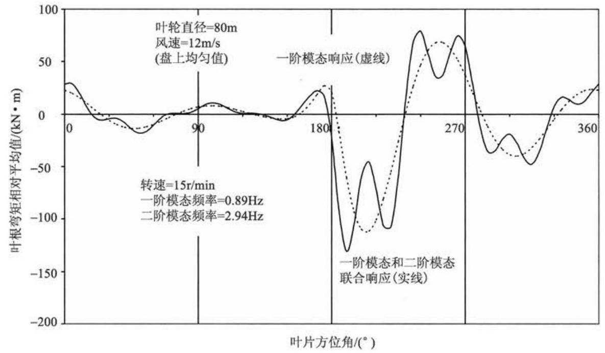

图 5.25 叶片 T40 平面外的叶根弯矩对于塔影的动态响应

叶片 T40 平面外的叶根弯矩对于包含风切变的塔影的响应表示在图 5.26 中, 其中轮毂高度处风速为 ${12}\mathrm{\;m}/\mathrm{s}$ 。图 5.26 中也画出了对于完全刚性叶片响应的弯矩。

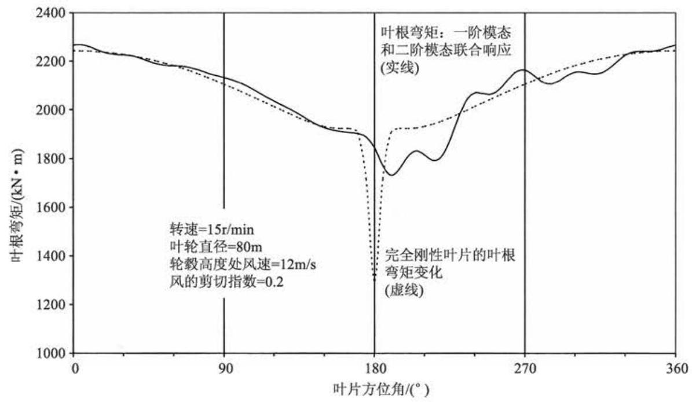

图 5.26 叶片 T40 平面外的叶根弯矩对于塔影和风切变的动态响应

风切变载荷近似为正弦(图 5.11)，因此，其响应也是这样。然而，值得注意的是, 重要的一阶模态对于风切变响应的幅值是两种相反作用的效果。换句话说, 9%的动态扩大因数被离心强度的下降所抵消。

#### 2 共振的避免: 坎贝尔图表

在叶片的设计中, 避免共振情况的发生是很重要的。在共振条件下, 叶片的固有频率等于迫使载荷的旋转频率或谐波频率, 这经常需要坎贝尔图表的帮助。在坎贝尔图表中, 叶片固有频率相对于旋转频率的曲线被绘出起自原点的线表示旋转频率的整数倍。然后, 在风力机转速运行范围内, 线条和叶片固有频率的任何交叉表示有可能发生共振。在图 5.27 中给出了一个坎贝尔图表的样例。

明显地, 叶片周期性载荷是由旋转频率处的载荷控制的, 而旋转频率受到风的剪切、偏航、轴的倾斜 (见 5.7.2 节)、重力 (见 5.7.3 节) 和阵风切片 (见 5.7.5 节) 的影响。然而, 来自塔架效应的短暂负荷释放由更高次谐波来控制。

### 5.8.6 随机载荷响应

对于刚性叶片在频域随机载荷的分析在 5.7.5 节中已经描述过了。在这里利用式(5.74)把分析扩展到柔性叶片的不同振荡模式的动态响应中。注意到在相对高的叶尖速比率时对于未失速运行的叶片限制条件还是适用的。

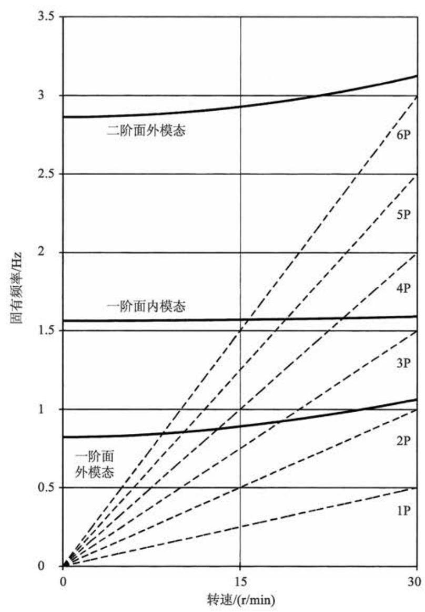

图 5.27 叶片 T40 的坎贝尔图表

#### 1 广义载荷的功率谱

同第 $i$ 阶模态相关的广义的振动载荷是 ${Q}_{i} = {\int }_{0}^{R}{\mu }_{i}\left( r\right) q\left( r\right) \mathrm{d}r$ ,其中

$$
{\Delta L} = L - \bar{L} = u\frac{\mathrm{d}L}{\mathrm{\;d}u} = \frac{1}{2}\rho {\left( \Omega r\right) }^{2}c\frac{\mathrm{d}{C}_{\mathrm{L}}}{\mathrm{d}\alpha }\frac{u}{\Omega r} = \frac{1}{2}{\rho \Omega rc}\frac{\mathrm{d}{C}_{\mathrm{L}}}{\mathrm{d}\alpha }u
$$

因而

$$
{Q}_{i} = \frac{1}{2}{\rho \Omega }\frac{\mathrm{d}{C}_{\mathrm{L}}}{\mathrm{d}\alpha }{\int }_{0}^{R}{\mu }_{i}\left( r\right) u\left( {r, t}\right) c\left( r\right) r\mathrm{\;d}r \tag{5.91}
$$

利用附录 B. 4 中关于非旋转叶片的方法, ${Q}_{i}$ 标准偏差 ${\sigma }_{\mathrm{Q}i}$ 的表达式可以被推导出来, 得到

$$
{\sigma }_{\mathrm{Q}i}^{2} = {\left( \frac{1}{2}\rho \Omega \frac{\mathrm{d}{C}_{\mathrm{L}}}{\mathrm{d}\alpha }\right) }^{2}{\int }_{0}^{R}{\int }_{0}^{R}\left\lbrack  {{\int }_{0}^{\infty }{S}_{\mathrm{u}}^{o}\left( {{r}_{1},{r}_{2}, n}\right) \mathrm{d}n}\right\rbrack  {\mu }_{i}\left( {r}_{1}\right) {\mu }_{i}\left( {r}_{2}\right) c\left( {r}_{1}\right) c\left( {r}_{2}\right) {r}_{1}{r}_{2}\mathrm{\;d}{r}_{1}\mathrm{\;d}{r}_{2}
$$

(5.92)

式中, ${S}_{\mathrm{u}}^{ \circ  }\left( {{r}_{1},{r}_{2}, n}\right)$ 为在旋转叶片半径 ${r}_{1}$ 和 ${r}_{2}$ 处对于交叉谱采样的一对点数。式 (5.92) 同式(B.16)是并行的。在式(B.16)中,用 ${r}_{1}$ 和 ${r}_{2}$ 来代替 $r$ 和 ${r}^{\prime }$ ,用 $\frac{1}{2}{\rho \Omega r} \times \; {\left( \mathrm{d}{C}_{\mathrm{L}}/\mathrm{d}\alpha \right) }^{2}$ 代替 ${\left( \rho \bar{U}{C}_{\mathrm{F}}\right) }^{2}$ 。从这里可以推导出同第 $i$ 阶模态相关的广义载荷的功率谱为

$$
{S}_{\mathrm{Q}i}\left( n\right)  = {\left( \frac{1}{2}\rho \Omega \frac{\mathrm{d}{C}_{\mathrm{L}}}{\mathrm{d}\alpha }\right) }^{2}{\int }_{0}^{R}{\int }_{0}^{R}{S}_{\mathrm{u}}^{ \circ  }\left( {{r}_{1},{r}_{2}, n}\right) {\mu }_{i}\left( {r}_{1}\right) {\mu }_{i}\left( {r}_{2}\right) c\left( {r}_{1}\right) c\left( {r}_{2}\right) {r}_{1}{r}_{2}\mathrm{\;d}{r}_{1}\mathrm{\;d}{r}_{2}
$$

(5.93)

实际上, 这个表达式是用近似积分合计来进行估计的。

#### 2 叶尖变形的功率谱

附录中的式 (B. 4) 给出了受谐波变化广义载荷激发的第 $i$ 阶叶尖模态响应的幅值表达式, 因而叶尖位移的功率谱同广义载荷的功率谱相关表示为

$$
{S}_{\mathrm{x}i}\left( n\right)  = \frac{{S}_{\mathrm{Q}i}\left( n\right) }{{k}_{i}^{2}}\frac{1}{\left\lbrack  {\left( 1 - {n}^{2}/{n}_{i}^{2}\right) }^{2} + 4{\xi }_{i}^{2}{n}^{2}/{n}_{i}^{2}\right\rbrack  } \tag{5.94}
$$

式 (5.94) 也可以写成 ${S}_{\mathrm{x}i}\left( n\right)  = \left\lbrack  {{S}_{\mathrm{Q}i}\left( n\right) /{k}_{i}^{2}}\right\rbrack  {\left\lbrack  \mathrm{{DMR}}\right\rbrack  }^{2}$ ,其中 DMR 表示动态放大率, ${n}_{i}$ 是第 $i$ 阶模态的用赫兹表示的固有频率。

图 5.28 给出了叶片 T40 在平均风速为 $8\mathrm{\;m}/\mathrm{s}$ 的情况下,以 ${15}\mathrm{r}/\mathrm{{min}}$ 的转速运行时,第一次叶尖偏差的功率谱 ${S}_{\mathrm{x}1}\left( n\right)$ 。选择了更低的 0.1 的阻尼比,所以其动态放大效果被强调。湍流强度被设置为 ${12.5}\%$ ,所以 ${\sigma }_{\mathrm{u}} = 1\mathrm{\;m}/\mathrm{s}$ 。图 5.28 中也给出了在忽略动态放大系数情况下的一阶模态的叶片偏离谱 ${S}_{\mathrm{Q}1}\left( n\right) /{k}_{i}^{2}$ ，该式如果乘以动态放大系数的平方,则可以得到 ${S}_{\mathrm{x}1}\left( n\right)$ 的曲线。一阶模态偏离的标准偏差 ${\sigma }_{\mathrm{x}1} = {\int }_{0}^{\infty }{S}_{\mathrm{x}1}\left( n\right) \mathrm{d}n$ ,为 ${103}\mathrm{\;{mm}}$ ,同没有动态放大系数相比提高了 ${23}\%$ 。因为叶片 T40 一阶模态的 ${0.89}\mathrm{\;{Hz}}$ 的固有频率近似于在旋转频率的第 3 次和第 4 次谐波之间，所以前者是最小的。然而，据发现，即使一阶模态的固有频率与旋转频率的三次谐波一致， ${\sigma }_{\mathrm{{x1}}}$ 仅仅提高了 $5\%$ 。因为 ${S}_{\mathrm{{x1}}}\left( n\right)$ 的峰值在三次谐波处不是很明显，而在动态放大比例的峰值处相对较大, 所以这个增长是很小的。

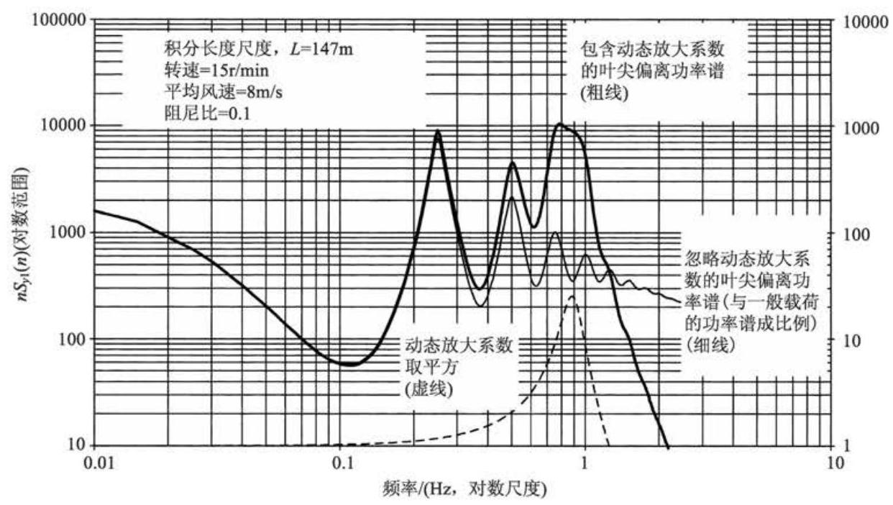

图 5.28 叶片 T40 一阶面外模态叶尖偏离功率谱

#### 3 叶根弯矩的功率谱

如果由于叶片谐振频率的激发产生的叶片偏离幅值被定义为 ${x}_{\mathrm{R}}\left( {n}_{1}\right)$ ,则相应叶根弯矩的幅值 ${M}_{\mathrm{Y}}\left( {n}_{1}\right)$ 由式 (5.95) 给出

$$
{M}_{\mathrm{Y}}\left( {n}_{1}\right)  = {\omega }_{1}^{2}{x}_{\mathrm{R}}\left( {n}_{1}\right) {\int }_{0}^{R}m\left( r\right) {\mu }_{1}\left( r\right) r\mathrm{\;d}r \tag{5.95}
$$

记 ${\omega }_{1}^{2} = {k}_{1}/{m}_{1}$ ,则式 (5.95) 变为

$$
\frac{{M}_{\mathrm{Y}}\left( {n}_{1}\right) }{{x}_{\mathrm{R}}\left( {n}_{1}\right) } = {k}_{1}R\frac{{\int }_{0}^{R}m\left( r\right) {\mu }_{1}\left( r\right) \left( {r/R}\right) \mathrm{d}r}{{m}_{1}} = {k}_{1}R{\chi }_{\mathrm{M}1} \tag{5.96}
$$

因为式 (5.96) 的右侧实质上是模态形状的函数，所以这个关系在所有激励频率上都可以用。因此，由一阶模态激发的叶根弯矩的功率谱在式 (5.97) 中给出

$$
{S}_{\mathrm{{My}}1}\left( n\right)  = {\left( {k}_{1}R{\chi }_{\mathrm{M}1}\right) }^{2}{S}_{\mathrm{x}1}\left( n\right)  = {\left( R{\chi }_{\mathrm{M}1}\right) }^{2}{S}_{\mathrm{Q}1}\left( n\right) \frac{1}{{\left( 1 - {n}^{2}/{n}_{1}^{2}\right) }^{2} + 4{\xi }_{1}^{2}{n}^{2}/{n}_{1}^{2}}
$$

(5.97)

对于叶片 T40,比例 ${\chi }_{\mathrm{M}1}$ 取值为 1.40 。

### 5.8.7 对模拟载荷的响应分析

就像在 5.8.5 节中描述的对决定性载荷的利用一样，通过一步步的分析，可以得到叶片对于来自风力模拟(见 5.7.6 节)的时变载荷的动态响应。除了在选择初始的叶片位移实际值、速度和加速度时更重要外, 其过程实质上是一样的, 除非来自初始几个周期的结果被抛弃。

### 5.8.8 摇摆运动

当叶轮被牢固地安装在轴上时，除了重力外，叶片上的非平面内空气动力载荷在低速轴上产生变化的弯曲力矩。在两叶片结构下，叶片面外空气动力力矩对轴的转移能够被忽略，通过安装叶轮在轴线与低速轴和叶轮轴线正交的铰链上，叶根弯矩被降低。因此，允许叶轮在每个叶片上的微小空气动力载荷变化时发生前、后摇动。

恢复力矩由作用在每个叶片元件上离心力矩的侧面成分而产生 (图 5.29)。 该力矩由式 (5.98) 给出，

$$
{M}_{\mathrm{R}} = {\int }_{0}^{R}{rm}\left( r\right) {\Omega }^{2}{r\zeta }\mathrm{d}r = I{\Omega }^{2}\zeta \tag{5.98}
$$

式中, $\zeta$ 为摇摆角度; $I$ 为对于中心的惯量的叶轮力矩。对于自由摇动振荡的运动方程是 $I\ddot{\zeta } + I{\Omega }^{2}\zeta  = 0$ (忽略力矩的空气动力阻尼部分)，这就意味着在具有正交于叶轮轴线的摇摆铰链时摇摆运动的固有频率等于旋转的频率。激励力矩的固定部分和随机部分都是由这个频率决定的, 在空气动力阻尼单独控制摇摆偏离幅值的情况下，很明显，系统运行在谐振状态下。

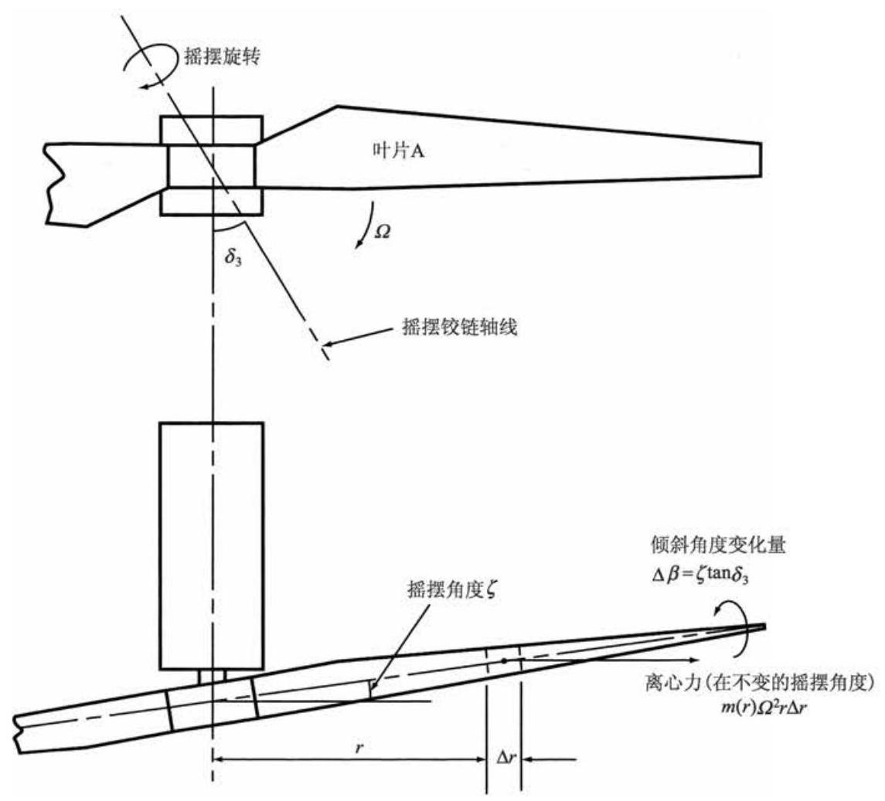

图 5.29 摇摆几何学

如果摇摆固有频率从旋转频率处移开, 则摇摆偏离的幅值将会明显降低。这可以通过在旋转平面内相对于叶轮旋转摇摆铰链轴线做到, 就像在图 5.29 中给出的一样。这样以至于摇摆运动导致叶片倾斜度的变化 一一个叶片为正, 一个叶片为负，称为 Delta3 耦合。考虑叶片 A 切变阵风的情况，通过旋转摇摆铰链，叶片上增加的推力将会引起它向下风方向的移动。如果定义在叶片半径平面内的摇摆角度是 $\zeta$ ,则叶片 $\mathrm{A}$ 倾斜度的增大将会是 $\zeta \tan {\delta }_{3}$ ,其中 ${\delta }_{3}$ 在图 5.29 中被定义。叶片 A 倾斜角的增大将会降低攻角 $\alpha$ ,从而减少叶片上的推力载荷。这种网状结构和在叶片B上推力载荷的瞬间增大，会导致离心力提供的恢复力矩的增大。

对不同载荷摇摆响应的探测第一阶段是完全运动方程的推导。设想叶片没有失速,并且运行在较高的叶尖速度,则在 5.7.5 节对式 (5.28) 的推导中采用的线性关系可以保持不变。在叶片元素上, 空气动力的变化影响相对于稳定状态情况是

$$
\frac{1}{2}{\rho \Omega rc}\frac{\mathrm{d}{C}_{\mathrm{L}}}{\mathrm{d}\alpha }\left( {u - \dot{\zeta }r}\right)  - \frac{1}{2}\rho {\left( \Omega r\right) }^{2}c\frac{\mathrm{d}{C}_{\mathrm{L}}}{\mathrm{d}\alpha }{\Delta \theta } \tag{5.99}
$$

式中的三个部分分别由风的波动、摇摆运动和 Delta3 耦合造成。用这些部分乘以半径、叶片长度上的积分、额外的离心和惯性毂力矩部分得出摇摆响应的运动方程为

$$
I\ddot{\zeta } + \frac{1}{2}{\rho \Omega }\frac{\mathrm{d}{C}_{\mathrm{L}}}{\mathrm{d}\alpha }\left\lbrack  {{\int }_{-R}^{R}{r}^{3}c\left( r\right) \mathrm{d}r}\right\rbrack  \dot{\zeta } + \frac{1}{2}{\rho \Omega }\frac{\mathrm{d}{C}_{\mathrm{L}}}{\mathrm{d}\alpha }\left\lbrack  {{\int }_{-R}^{R}{r}^{3}c\left( r\right) \mathrm{d}r}\right\rbrack  \Omega \left( {\tan {\delta }_{3}}\right) \zeta
$$

$$
+ I{\Omega }^{2}\zeta  = \frac{1}{2}{\rho \Omega }\frac{\mathrm{d}{C}_{\mathrm{L}}}{\mathrm{d}\alpha }{\int }_{-R}^{R}u\left( {r, t}\right) c\left( r\right) r\left| r\right| \mathrm{d}r \tag{5.100}
$$

假定尾流不变，通过除以惯性力矩，可以写为

$$
\eta  = \frac{1}{2}\frac{\rho }{I}\frac{\mathrm{d}{C}_{\mathrm{L}}}{\mathrm{d}\alpha }\left\lbrack  {{\int }_{-R}^{R}{r}^{3}c\left( r\right) \mathrm{d}r}\right\rbrack \tag{5.101}
$$

可以简化为

$$
\ddot{\zeta } + {\eta \Omega }\dot{\zeta } + \left( {1 + \eta \tan {\delta }_{3}}\right) {\Omega }^{2}\zeta  = \frac{1}{2}\rho \frac{\Omega }{I}\frac{\mathrm{d}{C}_{\mathrm{L}}}{\mathrm{d}\alpha }{\int }_{-R}^{R}u\left( {r, t}\right) c\left( r\right) r\left| r\right| \mathrm{d}r
$$

(5.102)

其中, $\eta$ 是空气动力对于作用在叶片上的惯性力比率的测量,是 Lock 的 $1/8$ 。

Delta3 耦合提高了摇摆运动的固有频率 ${\omega }_{\mathrm{n}}$ ，使其从 $\Omega$ 增到 $\Omega \sqrt{1 + \eta \tan {\delta }_{3}}$ 。对于一个直径为 ${40}\mathrm{\;m}$ 的叶轮,其包含两个安装在摇摆铰链上的 T40 叶片,设置 ${30}^{ \circ  }$ 的 ${\delta }_{3}$ 角, $\eta  = {0.89}$ 和 $\tan {\delta }_{3} = {0.577}$ ,因此,由 ${\delta }_{3}$ 角而导致固有频率提高了 ${23}\%$ 。由 $\xi \; = \eta /\left( {2\sqrt{1 + \eta \tan {\delta }_{3}}}\right)$ 所给出的阻尼比相当高,等于 0.36 。

#### 1 固定载荷的摇摆响应

用 5.8.5 节中陈述的相同的一步步积分步骤可以发现相对于固定载荷的摇摆响应。然而, 由于风切变和偏航导致的载荷都近似为正弦的, 利用力的振荡的标准解决办法, 可以得到在这些情况下最大摇摆角度的估计值。对于一个谐波性变化摇摆力矩,由于风切变 ${M}_{\mathrm{T}} = {M}_{\mathrm{{To}}}\cos {\Omega t}$ ,摇摆角度通过下式给出:

$$
\zeta  = \frac{{M}_{\mathrm{{To}}}}{I{\omega }_{\mathrm{n}}^{2}}\frac{\cos \left( {{\Omega t} - \theta }\right) }{\sqrt{{\left\lbrack  1 - {\left( \Omega /{\omega }_{\mathrm{n}}\right) }^{2}\right\rbrack  }^{2} + {\left( 2\xi \Omega /{\omega }_{\mathrm{n}}\right) }^{2}}} \tag{5.103}
$$

这里 $\theta  = \arctan \left\{  {\left( {{2\xi \Omega }/{\omega }_{\mathrm{n}}}\right) /\left\lbrack  {1 - {\left( \Omega /{\omega }_{\mathrm{n}}\right) }^{2}}\right\rbrack  }\right\}   = {90}^{ \circ  } - {\delta }_{3}$ ,是同激励相关的相角滞后。

对于以上描述的两叶片风力机，在轮毂高度处平均风速为 ${10}\mathrm{m}/\mathrm{s}$ 、转速为 ${15}\mathrm{r}/$ min 和切力指数为 0.2 的情况下，摇摆力矩幅值 ${M}_{\mathrm{o}}$ 近似为 ${360}\mathrm{{kN}} \cdot  \mathrm{m}$ (图 5.11，该图基于动量定理，给出了相对于固定轮毂的机组，叶根弯矩随方位角的变化情况)。 设定 T40 叶片的惯性叶轮力矩为 ${9822000}\mathrm{\;{kg}} \cdot  {\mathrm{m}}^{2}$ 和 ${\omega }_{\mathrm{n}} = {1.23\pi }/2\mathrm{{rad}}/\mathrm{s}$ ，当 ${\delta }_{3} = \; {30}^{ \circ  }$ 时，最大的摇摆角度是 ${0.83}^{ \circ  }$ 。如果 ${\delta }_{3}$ 角度降低为零，摇摆角度可以提高 ${15}\%$ ， 达到 ${0.96}^{ \circ  }$ 。

如果由风切变所引起的风速变化与高度呈线性比例关系,也就是说, $u = \bar{U} \times \; \left( {{kr}/R}\right)$ ，并且滞后力矩的计算由式 (5.100) 右边的表达式得出，式 (5.100) 中假定不变尾流代替动力理论中的平衡尾流,由于 ${\delta }_{3}$ 角等于 ${0}^{ \circ  }$ ,所以可以简化摇摆角度的表达式。摇摆力矩的表达式变成

$$
{M}_{\mathrm{T}} = {M}_{\mathrm{{To}}}\cos {\Omega t} = \frac{1}{2}{\rho \Omega }\frac{\mathrm{d}{C}_{\mathrm{L}}}{\mathrm{d}\alpha }\frac{\bar{U}k}{R}{\int }_{-R}^{R}c\left( r\right) {r}^{3}\mathrm{\;d}r\cos {\Omega t} \tag{5.104}
$$

将式 (5.104) 代入式 (5.103) 中，当 ${\delta }_{3}$ 角等于 ${0}^{ \circ  }$ 时，设 ${\omega }_{\mathrm{n}} = \Omega$ ，可以推导出摇摆角度的表达式为

$$
\zeta  = \frac{\bar{U}k}{\Omega R}\cos \left( {{\Omega t} - \pi /2}\right) \tag{5.105}
$$

因此,摇摆响应滞后激励 ${90}^{ \circ  }$ ,而且摇摆距离的大小只是和旋转速度梯度矢量相等。例如,一个高 ${70}\mathrm{\;m}$ 的轮毂,在上述情况下,转盘上方的速度梯度是一致的, 即为 ${0.125}\overline{U}/R = {0.03125}\mathrm{\;m}/\mathrm{s}$ ,有 ${0.020}\mathrm{{rad}}$ 或是 ${1.14}^{ \circ  }$ 的摇摆幅度。这个角度不同于上面得出的 ${0.96}^{ \circ  }$ 是因为存在不变尾流的假设。

#### 2 随机载荷的摇摆响应

一般来说, 在频域里很容易分析出随机载荷的响应。提供激励的摇摆力矩由方程(5.100)右边的表达式给出。通过使用与 5.8.6 节中应用到广义载荷上相似的方法, 可推导出摇摆力矩的功率谱, 如下式:

$$
{S}_{\mathrm{{MT}}}\left( n\right)  = {\left( \frac{1}{2}\rho \Omega \frac{\mathrm{d}{C}_{\mathrm{L}}}{\mathrm{d}\alpha }\right) }^{2}{\int }_{-R}^{R}{\int }_{-R}^{R}{S}_{\mathrm{u}}^{ \circ  }\left( {{r}_{1},{r}_{2}, n}\right) c\left( {r}_{1}\right) c\left( {r}_{2}\right) {r}_{1}{r}_{2}\left| {r}_{1}\right| \left| {r}_{2}\right| \mathrm{d}{r}_{1}\mathrm{\;d}{r}_{2}
$$

(5.106)

式中, ${S}_{\mathrm{u}}^{\mathrm{o}}\left( {{r}_{1},{r}_{2}, n}\right)$ 为功率谱的旋转采样值。实际上, ${S}_{\mathrm{u}}^{\mathrm{o}}\left( {{r}_{1},{r}_{2}, n}\right)$ 的值是由一些离散的半径值得出的, 其积分值由总和来代替。

摇摆角度响应功率谱与摇摆力矩功率谱相关, 摇摆力矩功率谱类似于方程 (5.94),其方程如下:

$$
{S}_{\mathrm{\xi }}\left( n\right)  = \frac{{S}_{\mathrm{{MT}}}\left( n\right) }{{\left( I{\omega }_{\mathrm{n}}^{2}\right) }^{2}}\frac{1}{\left\{  {\left\lbrack  1 - {\left( 2\pi n/{\omega }_{\mathrm{n}}\right) }^{2}\right\rbrack  }^{2} + {\left( 2\xi  \cdot  2\pi n/{\omega }_{\mathrm{n}}\right) }^{2}\right\}  } \tag{5.107}
$$

式 (5.107) 也可以写成 ${S}_{\zeta }\left( n\right)  = \left\lbrack  {{S}_{\mathrm{{MT}}}\left( n\right) /{\left( I{\omega }_{n}^{2}\right) }^{2}}\right\rbrack  {\left\lbrack  \mathrm{{DMR}}\right\rbrack  }^{2}$ ,式中 $\mathrm{{DMR}}$ 代表动态放大系数。

图 5.30 显示的是当风速为 ${12}\mathrm{\;m}/\mathrm{s}$ ，并且 ${\delta }_{3}$ 角为 ${0}^{ \circ  }$ 运行于 ${15}\mathrm{r}/\mathrm{{min}}$ 时带两片 “T40”叶片的风轮摇摆角度功率谱 ${S}_{\zeta }\left( n\right)$ 。空气的湍流度强度假定为 ${17}\%$ , B级别地区，给定 ${\sigma }_{\mathrm{u}} = 1\mathrm{m}/\mathrm{s}$ ，衰减比率 $\xi  = \eta /2 = {0.444}$ ，计算值由式(5.101)得出。图 5.30 中也显示了 ${S}_{\zeta }\left( n\right)$ 曲线， ${S}_{\zeta }\left( n\right)$ 是由忽略动态放大倍数后的摇摆角度功率谱 $\left\lbrack  {{S}_{\mathrm{{MT}}}\left( n\right) /{\left( I{\omega }_{n}^{2}\right) }^{2}}\right\rbrack$ 和动态放大率的平方相乘得到的。最后,在功率谱下进行面积平方根计算,得出摇摆角度标准偏差是 ${0.93}^{ \circ  }$ 。

通过计算摇摆角度标准偏差,从式 (5.63) 中能够估算出最后的数值和周期时间。从图 5.30 中可以很清楚地看到,摇摆角度功率谱与旋转频率 $\Omega$ 密切相关,向上垂直频率 $\nu$ 可以看作与旋转频率相等。因此,对于运行于 ${15}\mathrm{r}/\mathrm{{min}}$ 的设备,在 $1\mathrm{h}$ 的时间里给定 ${\nu T} = {900}$ 和 ${\xi }_{\max }/{\sigma }_{\xi } = {3.84}$ ,当湍流度为 ${17}\%$ 时,随机载荷加载 $1\mathrm{\;h}$ 后最大摇摆角度预测值是 ${3.84} \times  {0.93}^{ \circ  } = {3.6}^{ \circ  }$ ,如果加入 ${30}^{ \circ  }$ 的 ${\delta }_{3}$ 角,最大摇摆角度预测值变成了 ${3.0}^{ \circ  }$ 。

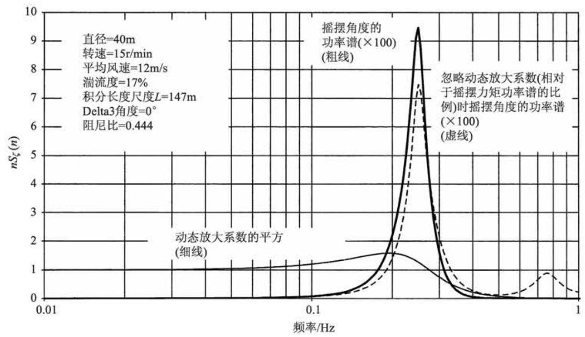

图 5.30 带两片“T40”叶片的风轮摇摆角度功率谱 ${S}_{\zeta }\left( n\right)$

前面已经提及, 滞后效应可以缓冲叶根弯曲力矩, 也能缓冲低速轴力矩。叶根弯曲力矩随机成分的减少量可以从叶根弯矩和带两叶片的刚性设备的轮毂力矩标准偏差得出。综合式 (5.106) 可以得出如下表达式:

$$
{\sigma }_{\mathrm{{MT}}}^{2} = {\left( \frac{1}{2}\rho \Omega \frac{\mathrm{d}{C}_{\mathrm{L}}}{\mathrm{d}\alpha }\right) }^{2}{\int }_{-R}^{R}{\int }_{-R}^{R}{\kappa }_{\mathrm{u}}^{ \circ  }\left( {{r}_{1},{r}_{2},0}\right) c\left( {r}_{1}\right) c\left( {r}_{2}\right) {r}_{1}{r}_{2}\left| {r}_{1}\right| \left| {r}_{2}\right| \mathrm{d}{r}_{1}\mathrm{\;d}{r}_{2}
$$

(5.108)

式中,如以前一样,在第二个叶片中 ${r}_{1}\text{ 、 }{r}_{2}$ 取负数, ${\kappa }_{\mathrm{u}}^{ \circ  }\left( {{r}_{1},{r}_{2},0}\right)$ 为旋转风轮在半径点 ${r}_{1}\text{ 、 }{r}_{2}$ 间纵向风扰动相关性,它是由式 (5.55) 右边的表达式给出的。当 ${r}_{1}\text{ 、 }{r}_{2}$ 定义在同一个叶片上时, ${\Omega }_{\mathrm{r}} = 0$ ; 当 ${r}_{1}\text{ 、 }{r}_{2}$ 定义在不同的叶片上时, ${\Omega }_{\mathrm{r}} = \pi$ 。把 ${\rho }_{\mathrm{u}}^{\mathrm{o}}\left( {{r}_{1},{r}_{2},0}\right)$ 定义为标准化相关性 ${\kappa }_{\mathrm{u}}^{\mathrm{o}}\left( {{r}_{1},{r}_{2},0}\right) /{\sigma }_{\mathrm{u}}^{2}$ ,则

$$
{\sigma }_{\mathrm{{MT}}}^{2} = {\sigma }_{\mathrm{u}}^{2}{\left( \frac{1}{2}\rho \Omega \frac{\mathrm{d}{C}_{\mathrm{L}}}{\mathrm{d}\alpha }\right) }^{2}{\int }_{-R}^{R}{\int }_{-R}^{R}{\rho }_{\mathrm{u}}^{ \circ  }\left( {{r}_{1},{r}_{2},0}\right) c\left( {r}_{1}\right) c\left( {r}_{2}\right) {r}_{1}{r}_{2}\left| {r}_{1}\right| \left| {r}_{2}\right| \mathrm{d}{r}_{1}\mathrm{\;d}{r}_{2}
$$

(5.109)

两叶片叶根弯矩平均值的标准偏差的相应表达式为

$$
{\sigma }_{\overline{\mathrm{M}}}^{2} = \frac{1}{4}{\sigma }_{\mathrm{u}}^{2}{\left( \frac{1}{2}\rho \Omega \frac{\mathrm{d}{C}_{\mathrm{L}}}{\mathrm{d}\alpha }\right) }^{2}{\int }_{-R}^{R}{\int }_{-R}^{R}{\rho }_{\mathrm{u}}^{\mathrm{o}}\left( {{r}_{1},{r}_{2},0}\right) c\left( {r}_{1}\right) c\left( {r}_{2}\right) {r}_{1}^{2}{r}_{2}^{2}\mathrm{\;d}{r}_{1}\mathrm{\;d}{r}_{2}
$$

(5.110)

通过转化, 很容易得出

$$
\frac{1}{4}{\sigma }_{\mathrm{{MT}}}^{2} + {\sigma }_{\mathrm{M}}^{2} = {\sigma }_{\mathrm{u}}^{2}{\left( \frac{1}{2}\rho \Omega \frac{\mathrm{d}{C}_{\mathrm{L}}}{\mathrm{d}\alpha }\right) }^{2}{\int }_{0}^{R}{\int }_{0}^{R}{\rho }_{\mathrm{u}}^{\mathrm{o}}\left( {{r}_{1},{r}_{2},0}\right) c\left( {r}_{1}\right) c\left( {r}_{2}\right) {r}_{1}^{2}{r}_{2}^{2}\mathrm{\;d}{r}_{1}\mathrm{\;d}{r}_{2} = {\sigma }_{\mathrm{M}}^{2}
$$

(5.111)

式中, ${\sigma }_{\mathrm{M}}$ 为刚性叶根弯矩与风扰动的弯矩的标准偏差。因此,如果风轮被允许摇摆,叶根弯矩标准偏差将从 ${\sigma }_{\mathrm{M}}$ 减小为 $\sigma ,{\sigma }_{\mathrm{M}}$ 由上面的方程给出。减小的范围主要是由风轮直径与风扰动范围长度的比例来决定。对于带“T40”叶片，整体长度尺度是 ${147}\mathrm{\;m}$ 的两叶片风轮,其减小度为 ${11}\%$ 。

### 5.8.9 塔架的耦合

在上面的章节里, 叶片的动态特性是基于风力机机舱固定不动的假设。也就是说，塔架是刚性的、固定不动的。事实上，完全刚性不动的塔架是不存在的，由于加载在风力机叶轮上载荷的影响，塔架前、后摆动，塔架的摆动将影响叶片的动态特性。本节讨论的是塔架和叶片的移动对叶片响应的影响。

用标准模式分析技术去分析由塔架和叶轮组成的整体的动态特性, 将会因为系统几何形状的不断变化而变得越来越复杂。这就意味着模式外形和结构频率组成的整体必须要重新估算随后的风轮方位角的位置。

另外的解决方式就是把模式形状与结构中不同成分的频率分开来进行考虑, 每一个模式重叠形成位移。这样, 塔架模式完全是由居于刚性的风轮来计算的, 而进行叶轮模式计算时就好像是叶轮悬挂在刚性的主轴上, 也就是像先前用的同样方式。叶轮模式与塔架模式不成直角, 因此, 不同模式之间的运行轨迹方程不再是独立的, 而是相互联系的。此外, 叶片的偏斜是因为叶片方位角导致塔架模式发生变化而引起的, 因此, 逐步解决的方式随之产生。遵循的处理方法被限制在基本的叶片和塔架模式, 但是可以通过将其延伸到更高的模式来解决。

叶片的运动方程由式 (5.62) 给出，叶片对叶片 $J$ 的偏转可以写成

$$
x\left( {r, t}\right)  = \mu \left( r\right) {f}_{J}\left( t\right)  + {\mu }_{\mathrm{T}J}\left( r\right) {f}_{\mathrm{T}}\left( t\right) \tag{5.112}
$$

式中, $\mu \left( r\right)$ 为相对于刚性塔架的第一个叶片模式形状; ${\mu }_{\mathrm{T}J}\left( r\right)$ 为叶片 $J$ 的标准位置偏差, 这个偏差来自于塔架的起始模式。假定这个偏差的标准化是由轮毂的偏差计算得出的, 即

$$
{\mu }_{\mathrm{T}J}\left( r\right)  = 1 + \frac{r}{L}\cos {\psi }_{J} \tag{5.113}
$$

式中, $L$ 为经过切线和垂直轴交点的水平线与轮毂的中心点之间的距离,如图 5.31 所示。

把式(5.112)代入式(5.66)中

$$
m\left( r\right) \mu \left( r\right) {\ddot{f}}_{J}\left( t\right)  + \widehat{c}\left( r\right) \mu \left( r\right) {\dot{f}}_{J}\left( t\right)  + m\left( r\right) {\omega }^{2}\mu \left( r\right) {f}_{J}\left( t\right)
$$

$$
= q\left( {r, t}\right)  - m\left( r\right) {\mu }_{\mathrm{T}J}\left( r\right) {\ddot{f}}_{\mathrm{T}}\left( t\right)  - \widehat{c}\left( r\right) {\mu }_{\mathrm{T}J}\left( r\right) {\dot{f}}_{\mathrm{T}}\left( t\right) \tag{5.114}
$$

对式 (5.114) 的右边进行转换运算，乘以 $\mu \left( r\right)$ ，同时对叶片长度做积分运算得到

$$
{m}_{1}{\ddot{f}}_{J}\left( t\right)  + {c}_{1}{\dot{f}}_{J}\left( t\right)  + {m}_{1}{\omega }^{2}{f}_{J}\left( t\right)  = {\int }_{0}^{R}\mu \left( r\right) q\left( {r, t}\right) \mathrm{d}r - {\int }_{0}^{R}m\left( r\right) \mu \left( r\right) {\mu }_{\mathrm{T}J}\left( r\right) \mathrm{d}r \cdot  {\ddot{f}}_{\mathrm{T}}\left( t\right)
$$

$$
- {\int }_{0}^{R}\widehat{c}\left( r\right) \mu \left( r\right) {\mu }_{\mathrm{T}J}\left( r\right) \mathrm{d}r \cdot  {\dot{f}}_{\mathrm{T}}\left( t\right) \tag{5.115}
$$

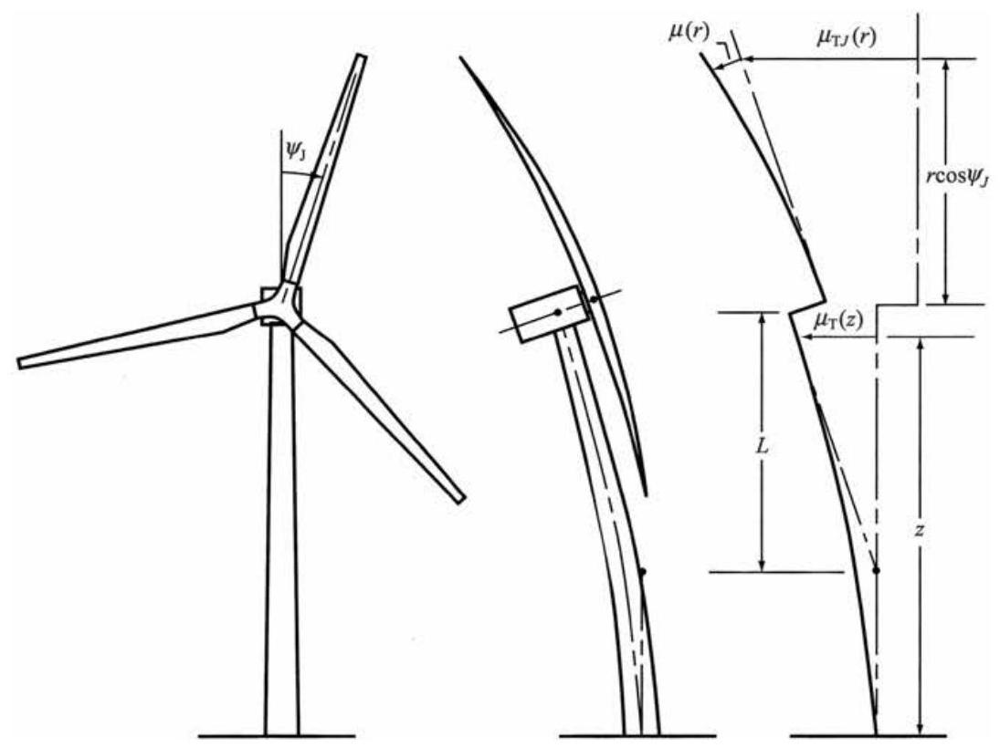

图 5.31 叶片和塔架的基本形状

根据式 (5.74) 可以得出，塔架的运动式为

$$
{m}_{\mathrm{{TI}}}{\ddot{f}}_{\mathrm{T}}\left( t\right)  + {c}_{\mathrm{{TI}}}{\dot{f}}_{\mathrm{T}}\left( t\right)  + {m}_{\mathrm{{TI}}}{\omega }_{\mathrm{T}}^{2}{f}_{\mathrm{T}}\left( t\right)  = {\int }_{0}^{H}{\mu }_{\mathrm{T}}\left( z\right) q\left( {z, t}\right) \mathrm{d}z \tag{5.116}
$$

式中, ${\mu }_{\mathrm{T}}$ 为塔架初始模式形状; ${m}_{\mathrm{T}1}$ 为塔架的广义质量。如式 (5.117) 所示,它与塔架、机舱和风轮 (包括风轮惯性的影响) 相关:

$$
{m}_{\mathrm{T}1} = {\int }_{0}^{H}{m}_{\mathrm{T}}\left( z\right) {\mu }_{\mathrm{T}}^{2}\left( z\right) \mathrm{d}z + {m}_{\mathrm{N}} + {m}_{\mathrm{R}} + {I}_{\mathrm{R}}/{L}^{2} \tag{5.117}
$$

式中, ${m}_{\mathrm{T}}\left( z\right)$ 为塔架每个单元高度的质量; ${m}_{\mathrm{N}},{m}_{\mathrm{R}}$ 分别为机舱和风轮每个单元高度的质量; ${I}_{\mathrm{R}}$ 为叶轮关于水平轴的转动惯量。对于带三叶片的风轮,转动惯量 ${I}_{\mathrm{R}}$ 是个常数。对于轮毂固定、两叶片的风轮,转动惯量 ${I}_{\mathrm{R}}$ 随着叶轮的方位角的变化而变化; 对于摆动的风轮,转动惯量 ${I}_{\mathrm{R}}$ 被忽略。

加载在塔架上的一个重要参数 $q\left( {z, t}\right)$ 是从叶片反馈到轮毂高度 $H$ 的载荷，前面已经解释过,由与塔架初始模式相关联的刚性运行所引起的叶片转动惯量包括风轮的质量以及 ${m}_{\mathrm{T}1}$ 惯量,并且相关的阻尼可以用于阻尼比 ${c}_{\mathrm{T}1}$ 的计算。然而,叶片的空气动力影响、惯量以及与叶片弯曲相联系的阻尼, 所有这些都会对塔顶产生影响。毫无疑问，式 (5.116) 右边的表达式可以写为

$$
{\mu }_{\mathrm{T}}\left( H\right) F + {\left( \frac{\mathrm{d}{\mu }_{\mathrm{T}}}{\mathrm{d}z}\right) }_{H} \cdot  M = F + M/L \tag{5.118}
$$

其中

$$
F = \mathop{\sum }\limits_{N}{\int }_{0}^{R}{q}_{J}\left( {r, t}\right) \mathrm{d}r - \mathop{\sum }\limits_{N}{\int }_{0}^{R}{m}_{1}\left( r\right) \mu \left( r\right) \mathrm{d}r{\dot{f}}_{J}\left( t\right)  - \mathop{\sum }\limits_{N}{\int }_{0}^{R}\widehat{c}\left( r\right) \mu \left( r\right) \mathrm{d}r \cdot  {\dot{f}}_{J}\left( t\right)
$$

(5.119)

并且

$$
M = \mathop{\sum }\limits_{N}{\int }_{0}^{R}r\cos {\psi }_{J}q\left( {r, t}\right) \mathrm{d}r - \mathop{\sum }\limits_{N}{\int }_{0}^{R}r\cos {\psi }_{J}{m}_{1}\left( r\right) \mu \left( r\right) \mathrm{d}r \cdot  {\ddot{f}}_{J}\left( t\right)
$$

$$
- \mathop{\sum }\limits_{N}{\int }_{0}^{R}r\cos {\psi }_{J}\widehat{c}\left( r\right) \mu \left( r\right) \mathrm{d}r \cdot  {\dot{f}}_{J}\left( t\right) \tag{5.120}
$$

带有 $J$ 后缀表示第 $J$ 个叶片, $N$ 表示风力机组叶片总数。

因此有

$$
F + M/L = \mathop{\sum }\limits_{N}{\int }_{0}^{R}{\mu }_{\mathrm{T}J}{q}_{J}\left( {r, t}\right) \mathrm{d}r - \mathop{\sum }\limits_{N}{\int }_{0}^{R}{m}_{1}\left( r\right) \mu \left( r\right) {\mu }_{\mathrm{T}J}\left( r\right) \mathrm{d}r \cdot  {\ddot{f}}_{J}\left( t\right)
$$

$$
- \mathop{\sum }\limits_{N}{\int }_{0}^{R}\widehat{c}\left( r\right) \mu \left( r\right) {\mu }_{\mathrm{T}J}\left( r\right) \mathrm{d}r \cdot  {\dot{f}}_{J}\left( t\right)
$$

式 (5.116) 变换成

$$
{m}_{\mathrm{T}1}{\ddot{f}}_{\mathrm{T}}\left( t\right)  + {c}_{\mathrm{T}1}{\dot{f}}_{\mathrm{T}}\left( t\right)  + {m}_{\mathrm{T}1}{\omega }_{\mathrm{T}}^{2}{f}_{\mathrm{T}}\left( t\right)  = \mathop{\sum }\limits_{N}{\int }_{0}^{R}{\mu }_{\mathrm{T}J}{q}_{J}\left( {r, t}\right) \mathrm{d}r
$$

$$
- \mathop{\sum }\limits_{N}{\int }_{0}^{R}{m}_{1}\left( r\right) \mu \left( r\right) {\mu }_{\mathrm{T}J}\left( r\right) \mathrm{d}\mathbf{r} \cdot  {\ddot{\mathbf{f}}}_{J}\left( t\right)  - \mathop{\sum }\limits_{N}{\int }_{0}^{R}\widehat{c}\left( r\right) \mu \left( r\right) {\mu }_{\mathrm{T}J}\left( r\right) \mathrm{d}\mathbf{r} \cdot  {\dot{\mathbf{f}}}_{J}\left( t\right)
$$

(5.121)

略去塔架自身的影响。

式 (5.115) 和式 (5.121) 共有 $\left( {N + 1}\right)$ 个同时发生的周期系数为 ${\mu }_{\mathrm{T}J}$ 的运行方程,系数 ${\mu }_{\mathrm{T}J}$ 与其次数相对应。动态分析过程就基于这些方程式,从中可以得出如下结论:

(1)第一次用式(5.115)和式(5.121)计算时，代入位移、速度和空气动力载荷值, 算出初始加速度。

(2)基于式(5.115)和式(5.121)，按先后顺序列出运动增量方程，式中右边表达式保留耦合项，用作准力项。

(3)在每一个步骤里，假定耦合项是不随时间改变的常数，以便在分解后的方程式中消去同类项。

(4)求解解耦后的增量的方程，算出位移和速度的增量。引用 5.8.5 节中的线性加速度,可以得出叶片 $J$ 叶尖的位移和速度的增量,其表达式如下:

$$
\Delta {f}_{J} = \frac{\Delta {Q}_{J} + {m}_{1}\left( {\frac{6}{h}{\dot{f}}_{J0} + 3{\ddot{f}}_{J0}}\right)  + {c}_{1}\left( {3{\dot{f}}_{J0} + \frac{h}{2}{\ddot{f}}_{J0}}\right) }{{m}_{1}{\omega }^{2} + \frac{3{c}_{1}}{h} + \frac{6{m}_{1}}{{h}^{2}}} \tag{5. 122}
$$

$$
\Delta {\dot{f}}_{J} = \frac{3}{h}\Delta {f}_{J} - 3{\dot{f}}_{J0} - \frac{h}{2}{\ddot{f}}_{J0} \tag{5. 123}
$$

最后步骤里得出的位移和速度绝对值表达式由 5.8.5 节中给出。由于塔架弯曲造成的轮毂位移和速度增量表达式也可以用类似方法得出。

(5)解方程(5.115)和式(5.121)，得出最后步骤的加速度。

(6) 重新求解增加的运行方程，得到位移和速度增量的修正值，这个方程的解答包含了方程右边的耦合项的变化。

(7)重复第(5)步和第(6)步的计算，直到位移和速度回到原来的值为止。

(8)重复一次第(1)~(7)步。

如果用一个具体固定载荷来进行分析，每一片叶片能够反映出相邻叶片的状态, 它们只是相位不同而已。这就意味着运行方程的数量可以减少为两个, 而且经过循环反复分析可以达到稳定状态。例如,带有三个叶片 $\mathrm{A}\text{ 、 }\mathrm{\;B}\text{ 、 }\mathrm{C}$ 的风力机组,根据式 (5.121) 可以计算出叶片 $\mathrm{A}$ 旋转 $T/3$ 和 ${2T}/3$ 时间后,叶片 $\mathrm{A}$ 的叶尖速度和加速度分别与叶片 $\mathrm{B}$ 、 $\mathrm{C}$ 对应的叶尖的速度和加速度相等 ( $T$ 为叶片旋转周期)。

图 5.32 显示了根据上面步骤分析得出的叶尖和轮毂相对于塔底的偏离位移, 分析时只考虑叶片和塔架基本模式。风力机是带三个叶片的, 在进行参数设置时, 风轮的参数设置参照图 5.25。塔架的自然频率是 ${0.58}\mathrm{\;{Hz}}$ ,塔架阻尼比率 (由叶片的空气动力阻尼决定)取 0.022 。

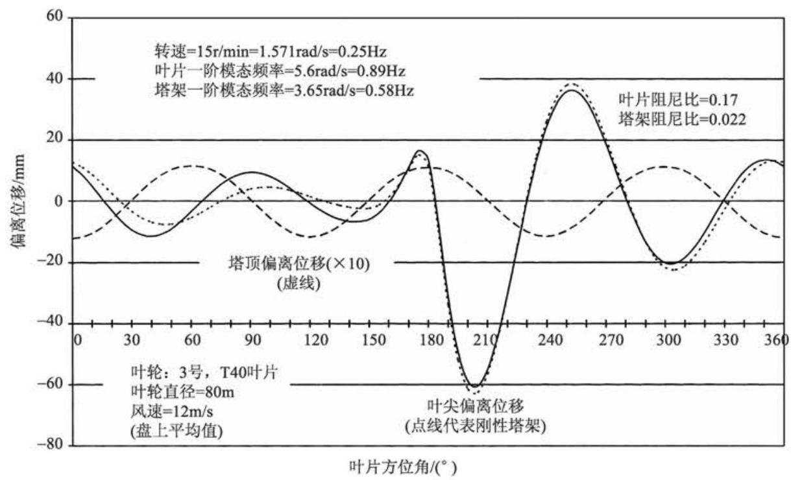

图 5.32 塔顶和叶尖的偏离位移, 仅考虑主模态响应

从图 5.32 中可以看到, 塔架响应是一条正弦曲线, 与叶片的响应曲线有相同的频率, 叶片的频率相应地决定塔架的频率。塔架的振幅大约是叶尖最大振幅的 1/50，叶尖最大振幅大约是 ${60}\mathrm{\;{mm}}$ 。振幅关系反映了塔架模态和叶尖模态的关联性。塔底效应的影响促使当叶片经过塔架位置时加速逆风，最大的偏离发生在叶片方位角为 ${205}^{ \circ  }$ 时。从图 5.32 中能看到,当机舱固定后偏离就会发生,而且通过比较可以发现, 塔架的柔韧性可以轻微地减小峰值偏差。然而, 塔架摆动更大的影响是在叶片下一次通过塔架之前摆动幅度保持在一个更高的水平。

以上的模态分析形成了许多风力发电机动态分析的基础, 如 Garrad Hassan BLADED 规则(Bossanyi,2000)。这些典型规则包含的叶片模态有平面内模态和平面外模态, 塔架模态有前-后模态和边-边模态, 所有这些模式丰富了动力学理论 (见 5.13 节)。

除了模态分析方式外, 一种叫做有限元的分析方式也被运用于风轮/塔架联结系统的动态分析。然而,标准的有限元动态分析方式不适合应用在实际工作中,因为这种方式只是用固定的几何尺寸来设计结构模型。Lobitz(1984)首先把有限元动态分析方式运用于两叶片的异步风力发电机中，Garrad(1987)把这种分析方式运用于三叶片、轮毂固定的风力发电机中。这两个人把矩阵运用于叶片和塔架的位移矢量上，丰富和发展了模动运动方程，同时把叶片方位角性能联系到矩阵，并且能够满足风轮/塔架联结系统接口的平衡性和兼容性。方程的求解分步骤逐步进行。

由于有限元分析方式要求有大量的数据运算, 因此, 模态分析方式得到更广泛的运用。

### 5.8.10 气动弹性稳定性

叶片的移位可以导致气动负载的变化，进而产生了气动不稳定性。在理论上， 带有攻角的升力系数的变化率为负可以造成运行在失速流中的风轮产生摇摆，那么气动阻尼也相应地为负。在此环境下，摇摆幅度会增大，直到负阻尼系数到达极限或者摇摆造成停机。实际上，这种现象可以通过叶片的设计来避免，所以叶根拍打弯曲动量随着风速超过运行全力风速的范围而增加 (Armstrong and Hancock, 1991)。

真正气动弹性瞬间是大型三叶片风电机组失速状态下交线叶片共振问题的发展。功率系数变化率的负值和攻角被认定为最初的成因, 见 7.1.9 节。

另外一个潜在的气动弹性不稳定瞬间是传统的波动，在直升机机翼中遇到，叶片结构在下风向外部弯曲导致叶片扭动，造成攻角的上升。早期机组发展期间，气动不稳定性被认为是真正需要注意的危险，并且很多分析都展示独立风力机设计不容易受到此类影响。然而, 较高的封闭式细胞结构扭曲刚度在很多风力机叶片上气动不稳定情况在实际中并不常见。

随着最近一些针对大型机组非常灵活的叶片设计的发展, 稳定性分析再次成为重要的设计环节。

## 5.9 叶片的疲劳应力

### 5.9.1 叶片疲劳设计的方法

对于叶片在特定状态下疲劳设计的检验, 需要具备载荷疲劳周期以及不同半径下机组寿命方面的知识, 通过材料的疲劳属性, 可以推导合成压力周期和计算相应的疲劳损坏。这个过程或多或少有点复杂,这与在一个或两个平面内的叶片载荷有关。如果只考虑弱主轴的弯曲和空气升力, 有关的步骤如下。

(1)导出每个平均风速和每个半径的各自的疲劳载荷范围。除非使用风力仿真, 否则这是一个不太容易的任务, 因为在不同的风力场中得到的周期的信息和随机载荷的组成是不同的。例如, 各自作为时间关系曲线和功率谱。 5.9.2 节和 5.9.3 节中考虑了这个困难的选址方法。

(2)综合分散载荷谱下每个半径的全部疲劳载荷谱，包括启动和停机的情况 (见 5.5.1 节)。

(3)用疲劳载荷周期(以挠距表示)除以适当的截面模数，将疲劳载荷转换为疲劳应力(与主轴有关的截面模数定义为关于轴的横截面的第二力矩除以观测点与轴的距离)。

(4)根据材料的 $S - N$ 曲线，对于疲劳载荷频谱的每个力矩范围“Bin”，根据 Miner 准则,将疲劳损坏数 ${n}_{i}/{N}_{i}$ 相加。不同叶片材料的 $S - N$ 曲线和平均应力必需的容许误差将在 7.1.6 节和 7.1.7 节中考虑。

5.9.2 节和 5.9.3 节是关于上述过程的第一步。对于一个给定的平均速度， 叶片载荷的周期分量在整个时间内都不变，而随机分量也是固定的。如 5.7.5 节中所述，随机分量可以在频域下进行分析(倘若假定突然的风速与叶片载荷是线性关系), 也可以在时域下进行分析, 如用风力进行仿真。 5.9.2 节考虑了对随机分量在频域下进行分析时固定分量和随机分量的连接问题, 而 5.9.3 节则详细阐述了在频域下对疲劳损坏进行的完全评估。

如果对由平面内和平面外的载荷导致的疲劳损坏都进行计算, 为了推导在每个指定点平均风速的周期应力和随机应力的变化分量，需要对上述步骤的排序作修改。对于给定点，计算过程如下:

(1)对于给定的风速，计算由叶片旋转的周期载荷分量所引起的关于主轴的扭矩与时间关系的变化。从叶片载荷推导出空气力矩，在图 5.33 中进行了图解。

(2)通过除以适当的截面模数，将挠矩与时间关系的变化转变为应力与时间关系的变化，然后将它们相加。

(3)对于同样的平均风速，将随机挠矩动量分量(因为是线性假定，挠矩分量只随着波动的上升而升高)转变为选择点的功率谱。

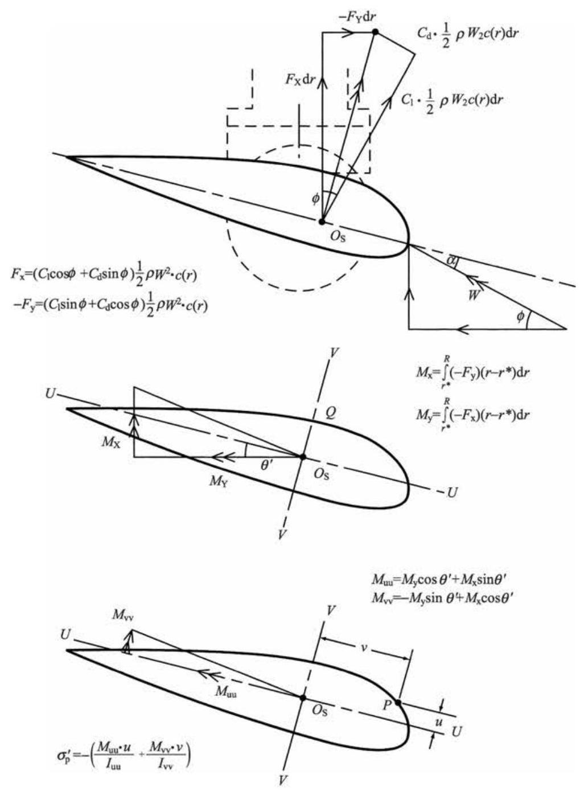

图 5.33 由空气动力载荷在半径为 ${r}^{ * }$ 的地方引起的叶片挠矩应力的推导

(4)使用 5.9.2 节和 5.9.3 节中的方法，计算由周期应力分量和随机应力分量的联合而引起的疲劳损坏。

(5)重复上述步骤以求解其他平均风速。

(6)将随着每个平均风速上升的疲劳损坏相加在一起，以获得在正常运行期间总的疲劳损坏。

### 5.9.2 固定分量和随机分量的组合

前一节已经表示了叶片挠矩的固定分量和随机分量可以分别用时间关系曲线和功率谱表示出来。遗憾的是，随机载荷的谱描述不是以合适的形式与周期载荷的时间关系曲线联合的, 但是这个问题可以通过下面两种方法中的任何一种方法来解决。

(1)随机分量的功率谱可以通过傅里叶逆变换转变为时域的关系曲线，然后可以与周期分量在时域内的曲线直接相加。据报道, Garrad 和 Hassan 在 1986 年以及 Warren 等在 1988 年都应用了这个方法。随后提出了风力仿真技术, 这种方法通常不使用, 因为在推导随机载荷分量的功率谱时, 使用变换产生风速在时域内的关系曲线比风力载荷省去了需要风速和风力载荷是线性关系的假定。

(2)对于载荷周期内的概率密度函数，可以基于载荷的随机分量和周期分量联合的功率谱的谱性质经验推导出来。

在下一节中将使用上述第二种方法。

### 5.9.3 频域内的疲劳估计

通过著名的瑞利分布, 利用高斯法给出窄频带峰值的概率密度函数 (p. d. f.)。 因为每个波峰都伴随有相似幅度的波谷, 周期范围的概率密度函数同瑞利分布一样。

尽管能量的集中是通过 “阵风”集中到旋转频率的, 由 “阵风限幅” 所决定 (见 5.7.5 节), 但是风力机叶片载荷不能用窄频带来考虑, 因为存在周期分量也不能用高斯法来考虑。1985 年, Dirlik 提出了一个周期范围内概率密度的经验函数, 并将其应用到宽频带和窄频带上, 该概率密度函数是根据基本光谱性质从功率谱中求出的。这是通过考虑 70 个功率谱的变化形状, 计算它们的流入周期范围分布及根据第 1 项、第 2 项和第 4 项谱动量, 拟合周期范围概率密度函数的普通表达式。 概率密度函数的周期范围的 Dirlik 表达式为

$$
p\left( S\right)  = \frac{\frac{{D}_{1}}{Q}{\mathrm{e}}^{-Z/Q} + \frac{{D}_{2}Z}{{R}^{2}}{\mathrm{e}}^{-\left( {{Z}^{2}/2{R}^{2}}\right) } + {D}_{3}Z{\mathrm{e}}^{-\left( {{Z}^{2}/2}\right) }}{2\sqrt{{m}_{\mathrm{o}}}} \tag{5.124}
$$

其中, $Z = \frac{S}{2\sqrt{{m}_{0}}},{D}_{1} = \frac{2\left( {{x}_{\mathrm{m}} - {\gamma }^{2}}\right) }{1 + {\gamma }^{2}},{D}_{2} = \frac{1 - \gamma  - {D}_{1} + {D}_{1}^{2}}{1 - R},{D}_{3} = 1 - {D}_{1} - {D}_{2}$ ,

$$
Q = \frac{{1.25}\left( {\gamma  - {D}_{3} - {D}_{2}R}\right) }{{D}_{1}}, R = \frac{\gamma  - {x}_{\mathrm{m}} - {D}_{1}^{2}}{1 - \gamma  - {D}_{1} + {D}_{1}^{2}},{x}_{\mathrm{m}} = \frac{{m}_{1}}{{m}_{0}}\sqrt{\frac{{m}_{2}}{{m}_{4}}},\gamma  = \frac{{m}_{2}}{\sqrt{{m}_{0}{m}_{4}}}\text{ 。 }
$$

$$
{m}_{i} = {\int }_{0}^{\infty }{n}^{i}{S}_{e}\left( n\right) \mathrm{d}n
$$

式中， ${S}_{\sigma }\left( n\right)$ 为应力的功率谱； $S$ 为周期应力范围。

虽然并不打算将 Dirlik 周期范围概率密度函数应用到包含周期分量的信号上，但做了几个调查以确定风力机疲劳损坏计算的有效性，该计算使用了在 Orkney 的 MS1 风力机副翼方向的挠矩使用的监视数据。周期范围概率密度函数是使用 Dirlik 公式从监视应变的功率谱中计算出来的, 而且与直接通过入流周期记数的监视信号推导的损坏率相比，疲劳损坏率是从这些概率密度函数中推导出来的。用 Dirlik 方法计算损坏率到用入流方法计算的损坏率在三次调查中为 ${0.84} \sim  {1.46},{1.01} \sim  {2.48}$ 和 ${0.73} \sim  {2.34}$ ,在每种情况中都使用了 $S - N$ 曲线的指数为 5，因为叶片是刚性结构的。考虑到计算的损坏率是随着应力范围功率的 5 次方变化的, 尽管存在周期分量, 这些结果也表明 Dirlik 方法能够给出相当精确的结果。

将 Dirlik 的公式应用到包含周期分量的功率谱中有两个主要的缺点: 第一个缺点是周期分量, 功率谱上存在较大的毛刺, 使它们与 Dirlik 最初考虑的平滑分布的情况很不同; 第二个缺点是周期分量中相对于相位的相关信息在变换到频率域时被丢失了。1990 年, Morgan 和 Tindal 通过比较 $\left( {\cos {\omega t} + {0.5}\cos {3\omega t}}\right)$ 和 $(\cos {\omega t} - \; {0.5}\cos {3\omega t})$ ，举例说明了不同相位角的影响，如图 5.34 所示。对于 $S - N$ 曲线指数为 5 的材料, 符合第一时间关系曲线图的受力是符合第二时间关系曲线图的疲劳损坏的 5.25 倍。

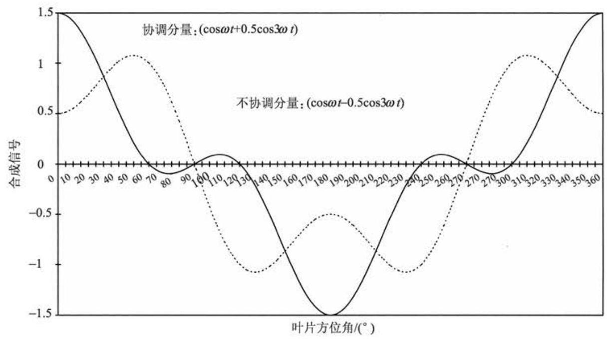

图 5.34 谐波间相角变化对合成信号的影响

1995 年, Bishop, Wang 和 Lack 提出了一个包含单个周期分量的 Dirlik 修正公式, 在计算机模拟公式中使用神经网络的方法来求解不同的参数。

1984 年, Madsen 等采用了一个不同的方法来求解由随机载荷和周期载荷所引起的疲劳损坏的问题，包括同实际载荷引起相同疲劳损坏的单等量正弦载荷的求解计算。该方法应用了依赖带宽的减缩系数 $g$ ,与窄频带过程相反,说明了在宽频带降低周期固有的范围内, 而且对于单正弦载荷与窄频带随机过程相结合的峰值利用了 Rice 的概率密度函数 (p. d. f.)，对于正弦的振幅，包括斜波，用半个周期信号的最大距离来代替。1989 年, Hoskin, Warren 和 Draper 给出了完整的总结。 连同 Morgan 和 Tindal (1990)一起, 他们得出的结论对于上述提到的侧翼方向弯曲的 MS1 监视数据, Madsen 方法与 Dirlik 方法可以得到几乎相同精度的疲劳损坏值。

Ragan 和 Manuel(2007)利用 Colorado 的 1.5MW 风力机大约 2500 个平面内和平面外叶片弯矩的数据集合，来比较相同负载下疲劳损伤，由 Dirlik 方法在频域进行计算相应的值在时域再进行计算。结果显示，Dirlik 方法在平面外力矩的计算结果更加令人满意，但是含有很大周期分量的平面内弯曲力矩的计算就很差强人意。

### 5.9.4 风力机仿真

在 5.7.6 节中介绍的风力机仿真与上述疲劳损坏估计的方法相比，有两个主要的优点:第一个优点是在计算随机载荷时，可以处理风速波动和叶片载荷的非线性关系; 第二个优点是避免了由于周期载荷分量和随机载荷分量组合引起的疲劳应力范围的复杂推导。因此, 就目前来说, 这是有关详细的疲劳设计比较好的方法。具体过程要点如下。

(1)对于选择的期望切变特性和塔影修正的平均风速，产生三维的“流动的风”。

(2)在风电场对运行的风力机进行单步动态分析，以获得在不同半径平面内和平面外的弯曲力矩时域曲线图。

(3)将这些弯矩的时域曲线图变换为关于主轴的弯矩时域曲线图。

(4)对每个横切面在指定点上计算应力时域曲线图。

(5)通过雨流计数法推导在每个应力范围“Bin”内的数(见 5.9.5 节)。

(6)同运行于选择的平均风速预测的小时数相一致地增加周期数目。

(7)基于 $S - N$ 曲线的应用，计算相应的疲劳损坏数量。

(8)对于不同的平均风速重复上述步骤，统计在每个点引起的疲劳损坏。

另一个简单的计算方法是产生一个一维的“流动风况” (该风只模拟湍流的纵向分量), 在不同的固定偏航角进行大量的模拟。

计算机的处理能力有限，风力机仿真的时间是有限的，选择以时间长度 600s 为频率。随后的单个仿真将不会提供高应力时的精确图，因为这种情况很少发生。

### 5.9.5 疲劳循环计数

正如在 5.9.4 节中所述的那样,在一个模拟的风电场中,通过风力机行为的动态分析得到了载荷或应力的时间关系曲线图, 并且通过分析该图能提炼出疲劳周期的更多细节。目前有两种已知的疲劳周期计数方法, 即储存器方法和雨流方法, 这两种方法都能得到同样的结果。

在储存器方法中，载荷或应力关系图(用时间作水平轴)被设想成储存器的剖面图，这是从最低点开始逐步发展从而逐次地从每个低点被排空，每一个排空操作都得到一个载荷或应力循环[参见 BS5400(1980) 的详细描述]。

在 1968 年, Matsuishi 和 Endo 首先提出了雨流方法。它的名称得自沿着屋顶流下的水的概念,并且其时间历程是旋转的,从而其时间轴是垂直的。但是,没有包含雨流分析的下述说明也许更容易理解。

首先是把时间关系曲线图简化成一系列的波峰点和波谷点，它们都是极值点。 然后, 将每 4 个累积的极值归为一组被依次验证以确定在最初的极值和最末的极值之间的两个中间极值。假如这样操作的话, 这两个中间极值被计算出来, 以规定一个应力周期，它被包含在循环计数中。同时，这两个中间极值被从时间关系曲线图中删除。这个过程一直持续到时间关系曲线图上的全部极值点都以这种方式被处理掉了。最后, 剩余的序列将由一个发散的部分和一个会聚的部分组成, 从中能提取出最后一组应力范围[参考在关于风力机测试和评定的 IEA 系列推荐练习中的疲劳特性(1984)，以得到这种方法的完全描述和能被用于自动控制该过程的算法的细节说明]。

在理论上,从一个历时 ${600}\mathrm{\;s}$ 的时间关系曲线图中获得的疲劳周期能被单独地列出, 然后以分段的形式把独立的循环分配给一系列相同的载荷或应力, 这样也能简化数据 (如 0 ~ 2N/mm、2〜4N/mm、4〜6N/mm)。

## 5.10 轮毂与低速轴载荷

### 5.10.1 引 言

轮毂载荷包括作用于叶片上的气动的、重力的和惯性的载荷，以及来自轴的相等的和相对的(除去轮毂自重)反动力。对于固定轮毂的风力机，轴载荷将包括来自于叶片气动载荷的有效运动, 但是对于采用跷跷板设计的两叶片叶轮, 这种运动在实际上已经被消除。无论是哪种形式的风力机，由于其具有转轴自重，悬臂的低速轴在旋转时都会有振动。图 5.35 展示了在工厂组装以前的一个低速轴和前轴承。

由于在叶片上的水平向外的载荷，轴上的力矩可以被表达成一对旋转轴的力矩,一根轴与叶片 1 垂直,另一根轴与叶片 1 平行。在三个叶片叶轮的情况下,力矩将分别表示如下:

$$
{M}_{\mathrm{{YS}}} = \Delta {M}_{\mathrm{Y}1} - \frac{1}{2}\left( {\Delta {M}_{\mathrm{Y}2} + \Delta {M}_{\mathrm{Y}3}}\right) ,\;{M}_{\mathrm{{ZS}}} = \frac{\sqrt{3}}{2}\left( {\Delta {M}_{\mathrm{Y}3} - \Delta {M}_{\mathrm{Y}2}}\right) \tag{5.125}
$$

这里 $\Delta {M}_{\mathrm{Y}1},\Delta {M}_{\mathrm{Y}2}$ 和 $\Delta {M}_{\mathrm{Y}3}$ 是叶片的水平向外运动的力矩,此力矩是关于轴心 $\left( {{M}_{\mathrm{Y}1},{M}_{\mathrm{Y}2}\text{ 和 }{M}_{\mathrm{Y}3}}\right)$ 和平均值 (图 5.36) 的差值。

### 5.10.2 固定气动载荷

在轴上固定气动载荷可以分解成两个部分, 一个是固定分量, 对于每个叶片来说是一样的; 另一个是周期分量, 在形式上对于每个叶片来说也是一样的, 但是有不同的相位角。由第一分量导致叶片根部水平向外的弯矩将处于平衡状态, 同时将产生碟形运动作用于轮毂，这将会导致轮毂前面承受拉力载荷而后面承受挤压载荷, 这些载荷对于两叶片的叶轮将是单轴的, 而对于三叶片的叶轮将是双轴的。

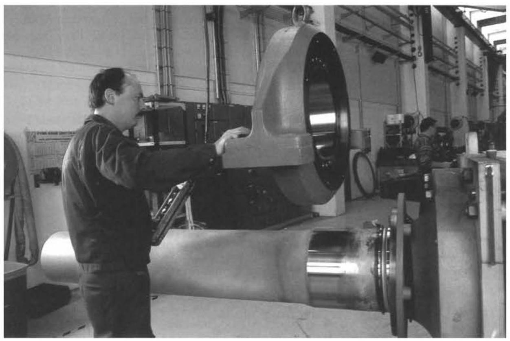

图 5.35 组装前的低速轴和前轴承。右手边上安装有法兰的轮毂被螺栓固定住, 从而允许轴承安装到轴上

由风切变、轴倾斜及偏航未对准所造成的在不同平面上叶根弯矩的波动通常是近似正弦的，并且其频率为叶轮转动的频率。使用式(5.125)，可以很容易看出， 对于一个正弦变化的叶根弯矩用振幅 ${M}_{0}$ 表示，对于一个三叶片风力机，轴弯矩的振幅是 ${1.5}{M}_{ \circ  }$ ，而对于一个刚性的两叶片风力机，轴弯矩则是 $2{M}_{ \circ  }$ 。

在风切变遵守幂定律的情况下，水平叶片上的载荷总是大于在向上和向下垂直指向的叶片上的载荷的平均值，因此，载荷明显地背离正弦曲线。在图 5.37 中， 对于在风速为 ${10}\mathrm{m}/\mathrm{s}$ 的情况下以 ${15}\mathrm{r}/\mathrm{{min}}$ 运行的两叶片和三叶片的刚性轮毂的风力机，由于风切变，轴弯矩以 0.2 的指数在波动。这个力矩范围的比接近 2 : 1.5 。

### 5.10.3 随机气动载荷

由叶轮上的随机载荷而引起的不同叶根弯矩将导致振动的轮毂的碟形力矩 (参见上文)和振动的轴的弯矩。对于一个两叶片、刚性轮毂的叶轮, 轴的力矩等于在两个不同平面内叶根弯矩或摆动力矩的差值，这个标准偏差由式 (5.109) 给出。 同样, 这两个力矩的中间值的标准偏差由式 (5.110) 给出。

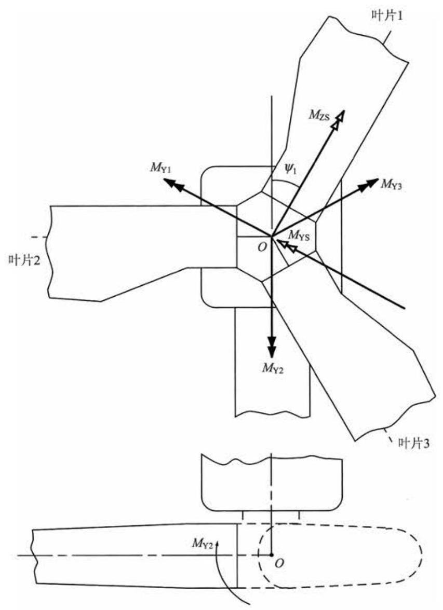

图 5.36 轴偏移运动, 参考叶片 1 的旋转轴系统

对于三叶片风力机，轴力矩的标准偏差的求解初看起来是比较复杂的，然而， 如果关于一个轴线的轴力矩平行于一个叶片，在图 5.36 中 ${M}_{\mathrm{{ZS}}}$ 被选定，那么在那个叶片上的载荷的作用会消失, 同时轴力矩标准偏差的表达式为

$$
{\sigma }_{\text{ Mzs }}^{2} = {\left( \frac{1}{2}\rho \Omega \frac{\mathrm{d}{C}_{\mathrm{L}}}{\mathrm{d}\alpha }\right) }^{2}{\int }_{-R}^{R}{\int }_{-R}^{R}{\kappa }_{\mathrm{u}}^{ \circ  }\left( {{r}_{1},{r}_{2},0}\right) c\left( {r}_{1}\right) c\left( {r}_{2}\right) \frac{\sqrt{3}}{2}{r}_{1}\frac{\sqrt{3}}{2}{r}_{2}\left| {r}_{1}\right| \left| {r}_{2}\right| \mathrm{d}{r}_{1}\mathrm{\;d}{r}_{2}
$$

(5.126)

在这里积分的限制取决于其他两个叶片。 ${\kappa }_{\mathrm{u}}^{ \circ  }\left( {{r}_{1},{r}_{2},0}\right)$ 是由式 (5.55) 给出的, 在同一个叶片上,当 ${r}_{1}$ 和 ${r}_{2}$ 是半径时,用 ${\Omega }_{\mathrm{r}}$ 集等价为零点。要注意到用两个叶片的情形进行比较时,相关函数 ${\kappa }_{\mathrm{u}}^{ \circ  }\left( {{r}_{1},{r}_{2},0}\right)$ 将增加,这时 ${r}_{1}$ 和 ${r}_{2}$ 的值与不同的叶片相联系,因为两个叶片之间被减小的间距由这些叶片间 ${120}^{ \circ  }$ 的夹角产生。式 (5.127)能以规范化的交叉相关函数 ${\rho }_{\mathrm{u}}^{ \circ  }\left( {{r}_{1},{r}_{2},0}\right)  = {\kappa }_{\mathrm{u}}^{ \circ  }\left( {{r}_{1},{r}_{2},0}\right) /{\sigma }_{\mathrm{u}}^{2}$ 重新表示,如下

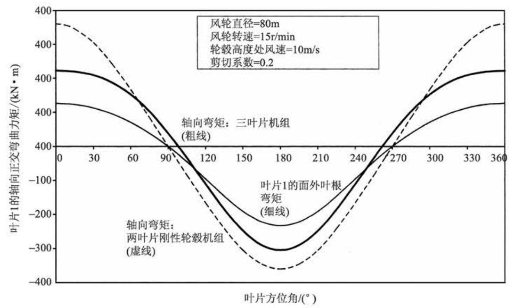

图 5.37 风切变引起的轴力矩波动

式所示:

$$
{\sigma }_{\mathrm{{Mzs}}}^{2} = {\sigma }_{\mathrm{u}}^{2}{\left( \frac{1}{2}\rho \Omega \frac{\mathrm{d}{C}_{\mathrm{L}}}{\mathrm{d}\alpha }\right) }^{2}{\int }_{-R}^{R}{\int }_{-R}^{R}{\rho }_{\mathrm{u}}^{ \circ  }\left( {{r}_{1},{r}_{2},0}\right) c\left( {r}_{1}\right) c\left( {r}_{2}\right) \frac{\sqrt{3}}{2}{r}_{1}\frac{\sqrt{3}}{2}{r}_{2}\left| {r}_{1}\right| \left| {r}_{2}\right| \mathrm{d}{r}_{1}\mathrm{\;d}{r}_{2}
$$

(5.127)

当使用 T40 叶片的直径为 ${80}\mathrm{m}$ 的风力机运行在湍流长度为 ${147}\mathrm{\;m}$ 的情况下时, 对于一个三叶片的风力机, 由于随机载荷的存在, 轴力矩的标准偏差为两叶片的同转速固定轮毂风力机轴力矩的 82%。如果这种 ${120}^{ \circ  }$ 叶片间隔的交叉相关函数产生的影响被忽略，这个比率将会上升到 $\sqrt{3}/2$ 。

值得注意的是，对于三叶片的风力机，轴力矩 ${M}_{\mathrm{{YS}}}$ 的标准偏差将会由于随机载荷而和 ${M}_{\mathrm{{ZS}}}$ 的标准方差相等。

通过以上对轴力矩的分析推导, 对于一个三叶片风电机组, 由于随机载荷而引起的轮毂碟形力矩的标准偏移由下式得出:

$$
{\sigma }_{\mathrm{{Mh}}}^{2} = \frac{1}{4}{\sigma }_{\mathrm{u}}^{2}{\left( \frac{1}{2}\rho \Omega \frac{\mathrm{d}{C}_{\mathrm{L}}}{\mathrm{d}\alpha }\right) }^{2}{\int }_{-R}^{R}{\int }_{-R}^{R}{\rho }_{\mathrm{u}}^{\mathrm{o}}\left( {{r}_{1},{r}_{2},0}\right) c\left( {r}_{1}\right) c\left( {r}_{2}\right) \frac{\sqrt{3}}{2}{r}_{1}^{2}\frac{\sqrt{3}}{2}{r}_{2}^{2}\mathrm{\;d}{r}_{1}\mathrm{\;d}{r}_{2}
$$

(5.128)

在这里, 积分仅仅通过两个叶片来完成。同时, 交叉相关函数如上式由两个叶片间的 ${120}^{ \circ  }$ 夹角来改进而得到下面的方程:

$$
\frac{1}{4}{\sigma }_{{\mathrm{M}}_{\mathrm{{ZS}}}}^{2} + {\sigma }_{\mathrm{{Mh}}}^{2} = \frac{3}{4}{\sigma }_{{\mathrm{M}}_{\mathrm{{Yl}}}}^{2} \tag{5.129}
$$

### 5.10.4 重力载荷

轴载荷的一个重要部分是由于叶轮自重产生的周期性悬臂弯曲力矩, 它对于轴疲劳设计通常有主要的影响。举例说明,一个叶轮包括三个 $\mathrm{T}{40}$ 叶片,每个质量为 $8\mathrm{t}$ ，同时一个伸出的悬臂超过主轴承 ${1.7}\mathrm{m}$ 的 ${24}\mathrm{t}$ 的轮毂，将产生一个最高的轴重力矩大约 ${800}\mathrm{{kN}} \cdot  \mathrm{m}$ 。对于风速为 ${10}\mathrm{\;m}/\mathrm{s}$ 和切变指数为 0.2 的轮毂高度处的风，它同一个由 ${360}\mathrm{{kN}} \cdot  \mathrm{m}$ 的风切变产生的轴力矩进行比较，考虑 ${21}\%$ 的湍流强度和相同轮毂高度的平均风速，由于湍流引起轴力矩的标准偏差为 ${350}\mathrm{{kN}} \cdot  \mathrm{m}$ ，并且同时注意轴力矩由于风切变而减轻，因此，它将主动采用较小的风切变指数以进行轴疲劳计算。

## 5.11 机舱载荷

### 5.11.1 来自叶轮的载荷

前面的章节通过使用围绕轴旋转的轴系研究了应用于轴上的力矩。除了这些力矩, 轴同样承受轴向载荷、径向力以及任何面外的不平衡力。其中, 轴向载荷由叶轮推力产生，径向力由差动叶片边缘载荷引起。

为了计算在机舱主体结构元件上的载荷，首先很有必要把根据旋转轴系规定的轴截荷转换成按照固定轴系表达的机舱载荷。在常规的系统中， $x$ 轴是下风向的， $y$ 轴是水平向右的， $z$ 轴是垂直向上的，从而对于一个轴倾斜角为 $\eta$ 的三叶片风力机，这些作用在机舱上的关于 $y$ 轴和 $z$ 轴的且被作为叶根弯曲力矩结果的力矩可以由下面的方程得到:

$$
{M}_{\mathrm{Y}\mathrm{N}} = {M}_{\mathrm{Y}1}\cos \psi  + {M}_{\mathrm{Y}2}\cos \left( {\psi  - {120}^{ \circ  }}\right)  + {M}_{\mathrm{Y}3}\cos \left( {\psi  - {240}^{ \circ  }}\right) \tag{5.130}
$$

$$
{M}_{\mathrm{{ZN}}} = \left\lbrack  {{M}_{\mathrm{Y}1}\sin \psi  + {M}_{\mathrm{Y}2}\sin \left( {\psi  - {120}^{ \circ  }}\right)  + {M}_{\mathrm{Y}3}\sin \left( {\psi  - {240}^{ \circ  }}\right) }\right\rbrack  \cos \eta \tag{5.131}
$$

式中, $\phi$ 为叶片 1 的方位角 (图 5.38)。

对于三叶片和两叶片的风力机，把这些由于确定性载荷而产生的作用于机舱上的力矩进行比较是有意义的。这些由于风切变和偏航不正确产生的弯矩的波动与叶片方位角的余弦近似成比例。把 ${M}_{\mathrm{Y}1} = {M}_{0}\cos \psi ,{M}_{\mathrm{Y}2} = {M}_{0}\cos \left( {\psi  - {2\pi }/N}\right)$ 代入式 (5.130) 和式 (5.131) 中,得到 ${M}_{\mathrm{{YN}}} = {1.5}{M}_{0}$ 和 ${M}_{\mathrm{{ZN}}} = 0$ ,上面这个结果是对应于三叶片的风力机。然而,对于刚性的两叶片风力机,相应的结果却是 ${M}_{\mathrm{{YN}}} = {M}_{0}(1 \; + \cos {2\phi })$ 和 ${M}_{\mathrm{{ZN}}} = {M}_{0}\sin {2\phi }\cos \eta$ 。因此，对于三叶片风力机，其在机舱上的力矩是恒定的,但是对于刚性轮毂的两叶片风力机,该力矩则是以 ${M}_{0}$ 为振幅而不断地摆动的。对于没有失速的叶片,相关的结果是 ${M}_{\mathrm{Y}1} = {M}_{0}\sin \psi$ ,这个结果近似于由于轴弯曲造成的叶根面外弯矩。全部的比较结果在表 5.7 中给出。

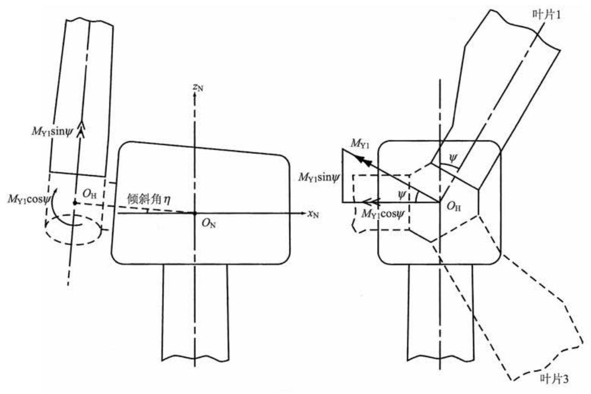

图 5.38 叶片 1 根部关于固定轴的面外弯矩分量

表 5.7 比较两叶片和三叶片的风力机由随机载荷产生的机舱力矩

<table><tr><td rowspan="2"></td><td colspan="2">由于风切变和偏航不正确产生的弯矩的波动:   ${M}_{\mathrm{Y}1} = {M}_{0}\cos \phi ,{M}_{\mathrm{Y}2} = {M}_{0}\cos \left( {\psi  - {2\pi }/N}\right)$</td><td colspan="2">由于轴倾斜产生的弯矩的波动: ${M}_{\mathrm{Y}1} = {M}_{0}\sin \psi ,{M}_{\mathrm{Y}2} = {M}_{0}\sin \left( {\psi  - {2\pi }/N}\right)$</td></tr><tr><td>机舱下垂力矩 ${M}_{\mathrm{{YN}}}$</td><td>机舱偏航力矩 ${M}_{\mathrm{{ZN}}}$</td><td>机舱下垂力矩 ${M}_{\mathrm{{YN}}}$</td><td>机舱偏航力矩 ${M}_{\mathrm{{ZN}}}$</td></tr><tr><td>三叶片风力机</td><td>${1.5}{M}_{0}$</td><td>0</td><td>0</td><td>1. $5{M}_{0}\cos \eta$</td></tr><tr><td>两叶片刚性轮毂风力机</td><td>${M}_{0}\left( {1 + \cos {2\psi }}\right)$</td><td>${M}_{0}\sin {2\psi }\cos \eta$</td><td>${M}_{0}\sin {2\psi }$</td><td>${M}_{0}\left( {1 - \cos {2\psi }}\right) \cos \eta$</td></tr></table>

由于固定载荷而作用在机舱上的力矩对于三叶片的叶轮比对两叶片的叶轮要有益得多。

在三叶片叶轮的情况下, 由于随机载荷而引起的轴弯矩的标准偏差是独立于被选择的旋转轴的 (见 5.10.3 节), 因此, 在机舱上发生的力矩的标准偏差将获得和机舱的 y 轴与 $z$ 轴同样的值。

### 5.11.2 包层载荷

除了侧向的风载荷情况, 包层载荷的重要性不大。根据已经给出的标准风载荷规范，这些包层载荷能被计算出来。对于侧向的风载荷，数值为 1.2 的摩擦系数将通常被认为是保守的估计值。

## 5.12 塔架载荷

### 5.12.1 极限载荷

如 5.4.1 节中所述，通常极限载荷是基于 50 年一遇的 3s 极限暴风，并且机组是在非运行状态条件下计算出来的。与此同时, 设计时需要考虑几种不同载荷的配置情况以及在风力机达到临界载荷时塔架基座与其顶部的不同。此外, 还有必要研究极限运行载荷的情形，因为如果在与设计阵风风速相比时，风速偏大时的载荷极限值就取决于此时的风速。

对于未运行的失速调节型风力机，塔架基座达到载荷临界的情形是风力机正面受风而其叶片承受最大拉力的时候。与此相对应，可以对叶片产生最大竖直向上举力的侧风和对一个叶片隐于塔架内的叶轮产生作用力的背风，将使塔架产生最大的弯矩。

变桨距调节型三叶片风力机的优点如下:叶片顺桨停机时会极大地减小非运行状态叶轮的载荷。对于这种风力机，塔架基座的弯曲力矩的临界状态出现在侧风下两个叶片相对于竖直角度倾斜 ${30}^{ \circ  }$ 时。在这些叶片上的水平载荷是垂直载荷的 ${\cos }^{3}{30}^{ \circ  }$ 倍，因此，此时该型风力机叶轮的最大载荷只是同条件下失速调节型风力机的 ${43.3}\% \left( { = {100}\sqrt{3}/4\% }\right)$ 。

在上述风力机中，由侧风所引起的载荷仅在因长时间断电造成的偏航机构失效,并且风向发生 ${90}^{ \circ  }$ 变化时才会大幅度增加,所以 IEC 61400-1 第三版对待这种情况 (DLC 6.2) 作为一种非正常载荷情况用较小的载荷系数 1.1 (取代正常载荷情况下的 1.35)。结果导致这种载荷情况造成变桨距调节型风力机组塔基倾覆力矩并不总是很明了。如果转子一个叶片垂直于上风向时制动，并且偏航角很小(对应于IEC 61400-1 第三版 DLC 6.1)，顶端的叶片的载荷接近升力最大值，另外一个叶片的载荷就会小一些，并且水平载荷可能会向相反的方向运行。如果不考虑风切变的话，顶端叶片的最大载荷为 $\left( {{0.5\rho }{V}^{2}}\right)$ 1. $5{A}_{\mathrm{B}}$ ，忽略分切力。 ${A}_{\mathrm{B}}$ 是叶片面积。 另外, DLC 6.2 给出了拉力载荷 $2\cos {30}^{ \circ  }\left( {{0.5\rho }{V}^{2}}\right) {1.3}{A}_{\mathrm{B}} = \left( {{0.5\rho }{V}^{2}}\right) {1.69}{A}_{\mathrm{B}}$ ,再次忽略风切力，载荷系数列入后就会变为 $\left( {{0.5\rho }{V}^{2}}\right)$ 1.86 ${A}_{\mathrm{B}}$ 。拉力载荷稍小于最大升力为 ${2.025} \times  \left( {{0.5\rho }{V}^{2}}\right) {A}_{\mathrm{B}}$ 的垂直叶片的载荷。然而, DLC 6.2 中叶片的拉力载荷与塔座拉力载荷的方向相同，垂直叶片上的升力载荷 DLC 6.1 相对于塔座的拉力载荷差 ${90}^{ \circ  }$ 。

有关钢制管状形塔架和桁架式塔架的阻力系数的信息在欧洲标准 1 中的第 2~4部分(1997 年)和国际标准，如 BS 8100 (1986 年) 或 DS 410 (1983 年) 中有规定。圆柱形塔架的阻力系数的典型值是 ${0.6} \sim  {0.7}$ 。对于失速调节型风力机塔架基座的载荷主要是由叶轮所承受的载荷来决定，而变桨距调节型风力机的塔架载荷与叶轮载荷大致相当，它们共同决定了塔架所受载荷的大小。

### 5.12.2 极限载荷下的动态响应

正像在 5.6.3 节中考虑的单个固定悬臂式叶片那样，在极限阵风风速条件下， 计算的塔架准静态弯矩值会由于阵风湍流共振激励引发的惯性力矩而增大。如前所述，这种增大作用可以通过一个动力因数 ${Q}_{\mathrm{D}}$ 表示出来。其中， ${Q}_{\mathrm{D}}$ 定义为 ${10}\mathrm{{min}}$ 内塔架所受力矩峰值(包括共振引起的力矩)与同一时间下准静态力矩峰值的比值。因此，有下式:

$$
{M}_{\max } = \frac{1}{2}\rho {U}_{\mathrm{e}{50}}^{2}H\oint {C}_{\mathrm{f}}{\left( \frac{z}{H}\right) }^{1 + {2\alpha }}\mathrm{d}A{Q}_{\mathrm{D}} \tag{5.132}
$$

式中, ${U}_{\mathrm{e}{50}}$ 为风力机轮毂处的 50 年一遇的阵风风速; $z$ 为塔架上 $z$ 点对地面的高度; $H$ 为轮毂高度; ${C}_{\mathrm{f}}$ 为在考虑风力机运行因素下的耦合系数 (包括举力或拉力); $\alpha$ 为切变力指数，按照标准 IEC 61400-1 的规定，通常取 0.11。 ${Q}_{\mathrm{D}}$ 由下式求得

$$
{Q}_{\mathrm{D}} = \frac{1 + g\left( {2\frac{{\sigma }_{\mathrm{u}}}{\bar{U}}}\right) \sqrt{{K}_{\mathrm{{SMB}}} + \frac{{\pi }^{2}}{2\delta }{R}_{\mathrm{u}}\left( {n}_{1}\right) {K}_{\mathrm{{Sx}}}\left( {n}_{1}\right) {\lambda }_{\mathrm{{MI}}}^{2}}}{1 + {g}_{0}\left( {2\frac{{\sigma }_{\mathrm{u}}}{\bar{U}}}\right) \sqrt{{K}_{\mathrm{{SMB}}}}}
$$

式中,积分标志 $\oint$ 表明要在每个叶片上、机舱和塔架都进行积分。上式的推导见 5.6.3 节和与悬臂叶片相关的附录。对于支撑叶轮和机舱的塔架有本质上相同的计算过程, 如下所述:

(1) ${K}_{\mathrm{{Sx}}}\left( {n}_{1}\right)$ 是反映风力波动频率和塔架与叶片的自然频率共振相关性的共振范围的换算系数。采用如前所述的标准联合域指数表达式, 如式 (B. 25) 表示该系数。

$$
{K}_{\mathrm{{Sx}}}\left( {n}_{1}\right)  = \frac{\oint \oint \exp \left( {-{Cs}{n}_{1}/\bar{U}}\right) {C}_{\mathrm{f}}^{2}c\left( r\right) c\left( {r}^{\prime }\right) {\mu }_{1}\left( r\right) {\mu }_{1}\left( {r}^{\prime }\right) \mathrm{d}r\mathrm{\;d}{r}^{\prime }}{{\left\lbrack  \oint {C}_{\mathrm{f}}c\left( r\right) {\mu }_{1}\left( r\right) \mathrm{d}r\right\rbrack  }^{2}} \tag{5.133}
$$

式中,积分符号 $\oint$ 为对每个叶片和塔架进行积分; $r,{r}^{\prime }$ 分别为叶轮半径和塔架上轮轴以下的深度; $s$ 为元素 $\mathrm{d}r$ 与 $\mathrm{d}{r}^{\prime }$ 的间距; ${C}_{\mathrm{f}}$ 为相关耦合系数; $c\left( r\right)$ 为叶片的弦长和塔架的直径; ${\mu }_{1}\left( r\right)$ 为塔架的最初模型。

式 (5.133) 可以通过将叶轮设置为统一模型并忽略塔架载荷作用而简化。但是这种简化是不合理的, 因为只有在塔架顶部附近的载荷才有意义, 对于整个载荷空间区域这种简化不会增加多少效果。

(2)计算塔架初始模型的阻尼对数减量 $\delta$ ，根据空气动力学有下式:

$$
{\delta }_{\mathrm{a}} = {2\pi }{\xi }_{\mathrm{a}} = {2\pi }\frac{{c}_{\mathrm{{a1}}}}{2{m}_{\mathrm{T}1}{\omega }_{1}} = \frac{\oint {\widehat{c}}_{\mathrm{a}}\left( r\right) {\mu }_{1}^{2}\left( r\right) \mathrm{d}r}{2{m}_{\mathrm{T}1}{n}_{1}} \tag{5.134}
$$

式中， ${m}_{\mathrm{{T1}}}$ 为式 (5.117) 给出的关于塔架、机舱和叶轮 (包括叶轮惯量的影响) 的总质量; ${n}_{1}$ 为塔架的自然频率 $\left( \mathrm{{Hz}}\right)$ 。失速调节型风力机在迎风时,其叶轮的空气动力学阻尼作用可以简单表示为 $\rho \overline{U}{C}_{\mathrm{D}}{A}_{\mathrm{R}}/2{m}_{\mathrm{T}1}{n}_{1}$ ，其中， ${A}_{\mathrm{R}}$ 是叶轮面积。

(3)计算机舱的共振位移标准偏差公式为

$$
\frac{{\sigma }_{\mathrm{x}1}}{{\bar{x}}_{1}} = 2\frac{{\sigma }_{\mathrm{u}}}{\bar{U}}\frac{\pi }{\sqrt{2\delta }}\sqrt{{R}_{\mathrm{u}}\left( {n}_{1}\right) }\sqrt{{K}_{\mathrm{{Sx}}}\left( {n}_{1}\right) }
$$

(4)计算塔架基座共振力矩标准偏差与机舱位移相应比率平均值的比率 ${\lambda }_{\mathrm{M}1}$ 公式如下:

$$
\frac{{\sigma }_{\mathrm{M}1}}{\bar{M}} = {\lambda }_{\mathrm{M}1}\frac{{\sigma }_{\mathrm{x}1}}{{\bar{x}}_{1}}
$$

如果 ${\mu }_{1}\left( r\right)$ 对叶轮设置为统一量,则 ${\lambda }_{\mathrm{M}1}$ 为

$$
{\lambda }_{\mathrm{M}1} = \frac{{\int }_{0}^{H}m\left( z\right) {\mu }_{1}\left( z\right) z\mathrm{\;d}z\left\{  {{C}_{\mathrm{D}}{A}_{\mathrm{R}} + {\int }_{0}^{H}{C}_{\mathrm{f}}{\left\lbrack  \frac{U\left( z\right) }{\bar{U}}\right\rbrack  }^{2}\mathrm{\;d}\left( z\right) {\mu }_{1}\left( z\right) \mathrm{d}z}\right\}  }{{m}_{\mathrm{T}1}H\left\{  {{C}_{\mathrm{D}}{A}_{\mathrm{R}} + {\int }_{0}^{H}{C}_{\mathrm{f}}{\left\lbrack  \frac{U\left( z\right) }{\bar{U}}\right\rbrack  }^{2}\mathrm{\;d}\left( z\right) \frac{z}{H}}\right\}  } \tag{5.135}
$$

式中, $z$ 为基座以上塔架的高度; $H$ 为轮毂的高度。如果塔架的载荷相对较小,则 ${\lambda }_{\mathrm{M}1}$ 可以大致简化为

$$
{\lambda }_{\mathrm{M}1} = \frac{{\int }_{0}^{H}m\left( z\right) {\mu }_{1}\left( z\right) z\mathrm{\;d}z}{{m}_{\mathrm{T}1}H} \tag{5.136}
$$

式 (5.136) 接近于统一化公式,因为塔架顶部质量决定了积分量。

(5)计算反映叶片与塔架在风力波动中的相关性不足的尺寸减小因数 ${K}_{\mathrm{{SMB}}}$ ， 该因数主要针对基座弯矩的准静态或干扰响应。 ${K}_{\mathrm{{SMB}}}$ 可以由表示共振尺寸减小因数的式 (5.133) 类似得出，但是其中的指数函数修改为 $\exp \left( {-s/{0.3}{L}_{\mathrm{u}}^{x}}\right)$ 。

(6)根据各自的零穿越频率计算复合(如共振加上准静态)和准静态响应峰值因数 $\left\lbrack  \text{ 估计准静态响应的零穿越频率时, 叶片面积应该用式 (B.57) 给出的叶轮面积 }\right\rbrack$ 来代替]。

(7)将步骤(1)~(6)所述的参数值代入式(5.20)中，计算得到动态系数 ${Q}_{\mathrm{D}}$ 。

在允许转子停车时待机的情况下，风力机几何状态持续变化，转子响应阵风而来回旋转，塔架激发的共振的计算，如果发生，开展起来会很复杂。

### 5.12.3 稳定风速下的运行载荷(固定分量)

塔架纵向弯矩由叶轮推力载荷和叶轮力矩所产生。作用在机舱上的力矩由 5.11.1 节中所述的固定载荷来决定。尽管作用在每个叶片上的推力载荷会因为偏航未对准、轴的倾斜或风切变、叶片彼此间平衡的振动而随着方位角发生相当大的变化, 但是总的来说, 这些影响却表现为互相抵消使推力载荷可以忽略不计。例如, 对于一个双叶片风力机, 数值为 0.2 的风切变系数对叶轮推力载荷的影响只有 $\pm  1\%$ 。

塔架隐形载荷会导致塔架顶部位移并使叶轮出现短暂正弦波频率波动 (图 5.32)。

图 5.39 描绘了 ${80}\mathrm{\;m}$ 直径三叶片失速调节型和变桨距调节型风力机在不同风速下的叶轮推力变化曲线。

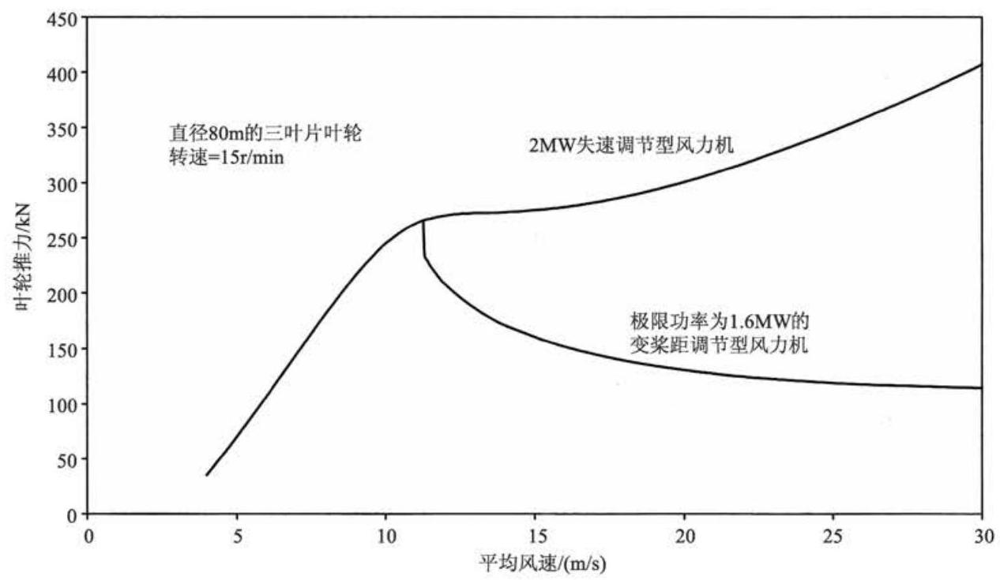

图 5.39 稳定均衡风力下运行叶轮的推力曲线:失速调节型和变桨距调节型风力机的变化曲线

### 5.12.4 湍流下的运行载荷(随机分量)

#### 1 频域分析

除了在接近塔架顶部外, 引起塔架弯曲力矩的纵向主要来源是叶轮对其的推力。叶轮推力的标准偏差可以根据叶轮不同点上风力波动的干扰强度和正交相关函数来表达，用来得出叶根随机弯矩标准偏差的方法见 5.7.5 节。如前面所述，假设风力波动和合成载荷波动的关系是线性的，则在半径 $r$ 下，叶片单位长度的载荷扰动 $q$ 可以表示为下式:

$$
q = \frac{1}{2}{\rho \Omega rc}\left( r\right) \frac{\mathrm{d}{C}_{\mathrm{L}}}{\mathrm{d}\alpha }u
$$

旋翼推力扰动为

$$
{\Delta T} = \left( {\frac{1}{2}{\rho \Omega }\frac{\mathrm{d}{C}_{\mathrm{L}}}{\mathrm{d}\alpha }}\right) \oint {uc}\left( r\right) r\mathrm{\;d}r \tag{5.137}
$$

式中,积分符号 $\oint$ 为对整个叶轮的积分。因此,可以得到如下所示的叶轮推力变化表达式:

$$
{\sigma }_{\mathrm{T}}^{2} = {\left( \frac{1}{2}\rho \Omega \frac{\mathrm{d}{C}_{\mathrm{L}}}{\mathrm{d}\alpha }\right) }^{2}{\sigma }_{\mathrm{u}}^{2}\oint \oint {\rho }_{\mathrm{u}}^{ \circ  }\left( {{r}_{1},{r}_{2},0}\right) c\left( {r}_{1}\right) c\left( {r}_{2}\right) {r}_{1}{r}_{2}\mathrm{\;d}{r}_{1}\mathrm{\;d}{r}_{2} \tag{5.138}
$$

式中, ${\rho }_{\mathrm{u}}^{\mathrm{o}}\left( {{r}_{1},{r}_{2},0}\right)$ 为标准正交化相关函数; ${\kappa }_{\mathrm{u}}^{\mathrm{o}}\left( {{r}_{1},{r}_{2},0}\right) /{\sigma }_{\mathrm{u}}^{2}$ 为相同叶片或不同叶片的半径 ${r}_{1}$ 和 ${r}_{2}$ 的修正。 ${\kappa }_{\mathrm{u}}^{\mathrm{o}}\left( {{r}_{1},{r}_{2},0}\right)$ 由式 (5.55) 给出,其中, ${\Omega \tau }$ 由两个半径为 ${r}_{1}$ 和 ${r}_{2}$ 的叶片相位角来代替。对于一个长度 ${147}\mathrm{\;m}$ 、直径 ${80}\mathrm{\;m}$ 的三叶片叶轮,由于施加在叶轮上的风速变化相关性的减少而造成的叶轮随机推力波动标准偏差减少量大约是 20%。如果风力机在风速为 $8\mathrm{\;m}/\mathrm{s}$ ，干扰强度为 ${20}\%$ 的风中以 ${15}\mathrm{r}/\mathrm{{min}}$ 的转速旋转时,叶轮推力标准偏差约为 ${38}\mathrm{{kN}}$ ,也就是稳定值的 ${22}\%$ 。

计算叶根弯矩功率谱 (见 5.7.5 节) 的叶轮推导功率谱的表达式由下式得出:

$$
{S}_{\mathrm{T}}\left( n\right)  = {\left( \frac{1}{2}\rho \Omega \frac{\mathrm{d}{C}_{\mathrm{L}}}{\mathrm{d}\alpha }\right) }^{2}\oint \oint {S}_{\mathrm{{uJ}},\mathrm{K}}^{ \circ  }\left( {{r}_{1},{r}_{2}, n}\right) c\left( {r}_{1}\right) c\left( {r}_{2}\right) {r}_{1}{r}_{2}\mathrm{\;d}{r}_{1}\mathrm{\;d}{r}_{2}\;(5\text{ . } \tag{5.139}
$$

式中, ${S}_{\mathrm{{uj}},\mathrm{K}}^{\mathrm{o}}\left( {{r}_{1},{r}_{2}, n}\right)$ 为叶片 $J$ 与 $K$ 分别在半径为 ${r}_{1}$ 和 ${r}_{2}$ 下的轮流采样正交谱。 注意:在三叶片风力机中，当 $J$ 、 $K$ 不同时， $A$ 、 $B$ 、 $C$ 与 ${S}_{\mathrm{{uj}},\mathrm{K}}^{\mathrm{o}}\left( {{r}_{1},{r}_{2}, n}\right)$ 是复数，但是 ${S}_{\mathrm{{uA}},\mathrm{B}}^{ \circ  }\left( {{r}_{1},{r}_{2}, n}\right)$ 与 ${S}_{\mathrm{{uA}},\mathrm{C}}^{ \circ  }\left( {{r}_{1},{r}_{2}, n}\right)$ 是共轭复数，所以式(5.139)经过重积分后仍然为实数。图 5.40 给出了一个三叶片风力机直径 ${80}\mathrm{\;m}$ 的叶轮推力功率谱的计算实例。从图 5.40 中可以看到,受阵风风力的限制,叶轮在 ${0.75}\mathrm{\;{Hz}}$ 旋转频率下有一个集中的能量施加于塔架, 但其影响很小。但这种影响在两叶片风力机中就比较大 (图 5.41)。图 5.41 给出了两叶片风力机在同样的叶片俯视图下但转速提高 22.5%的叶轮推力功率谱比较。

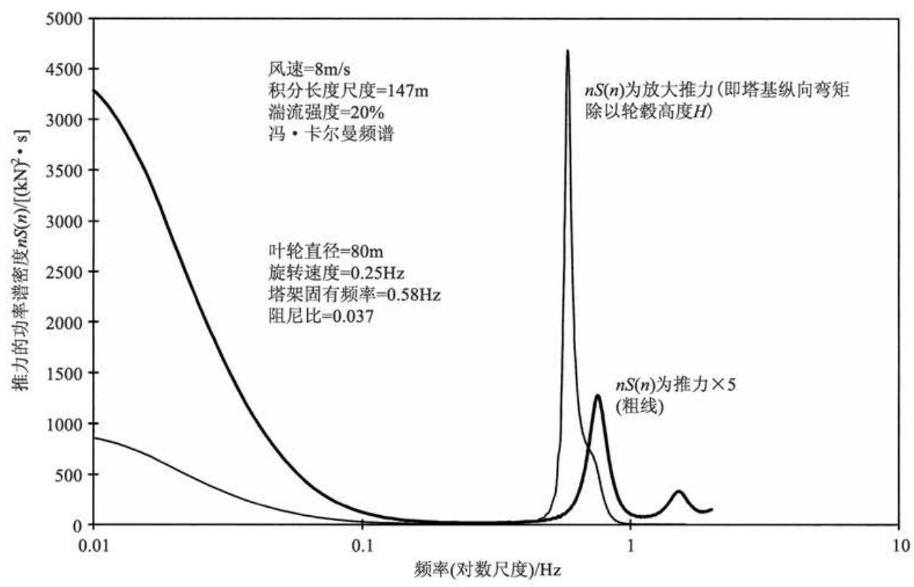

图 5.40 三叶片 ${80}\mathrm{\;m}$ 直径风力机叶轮推力与塔架基座合成纵向弯矩的功率谱

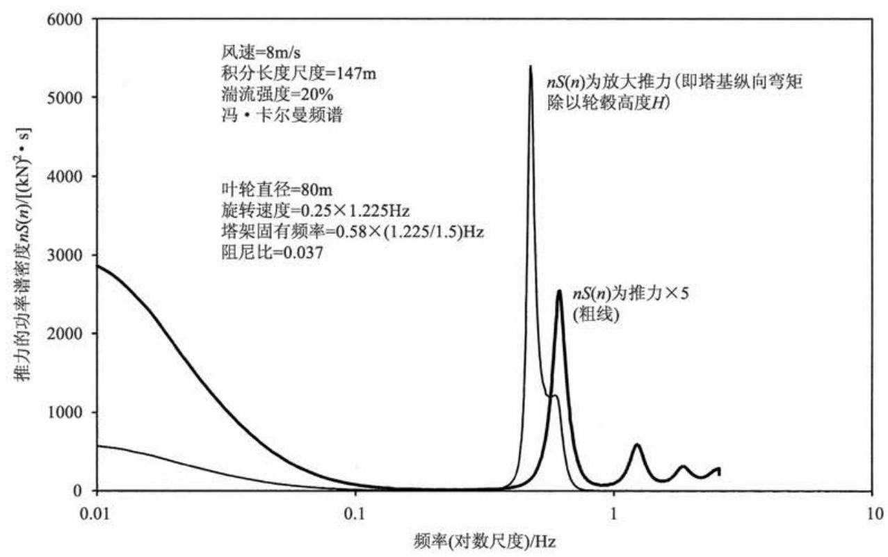

图 5.41 两叶片 ${80}\mathrm{\;m}$ 直径风力机叶轮推力与塔架基座合成纵向弯矩的功率谱

除叶轮波动外, 纵向扰动也会引发叶轮转矩的波动, 不同叶片构成的平面叶轮载荷的不同，而这些波动与不同又会导致塔架横向的弯矩的产生。对于平面元件的单位长度空气动力举力表达式 $- {F}_{\mathrm{Y}}\left( r\right)  = \frac{1}{2}\rho {W}^{2}{C}_{\mathrm{L}}c\left( r\right) \sin \phi$ 对风力波动的微分如下式所示:

$$
- \frac{\mathrm{d}{F}_{\mathrm{Y}}}{\mathrm{d}u} = \frac{1}{2}{\rho c}\left( r\right) \frac{\mathrm{d}}{\mathrm{d}u}\left( {{W}^{2}\sin \phi {C}_{\mathrm{L}}}\right)  = \frac{1}{2}{\rho c}\left( r\right) \frac{\mathrm{d}}{\mathrm{d}u}\left\{  {W\left\lbrack  {{U}_{\infty }\left( {1 - a}\right)  + u}\right\rbrack  {C}_{\mathrm{L}}}\right\}
$$

$$
\approx  \frac{1}{2}{\rho c}\left( r\right) W\left( {{C}_{\mathrm{L}} + \sin \phi \frac{\mathrm{d}{C}_{\mathrm{L}}}{\mathrm{d}\alpha }}\right)
$$

上式可近似为

$$
\frac{-\mathrm{d}{F}_{Y}}{\mathrm{\;d}u} = \left( {\frac{1}{2}{\rho \Omega }\frac{\mathrm{d}{C}_{\mathrm{L}}}{\mathrm{d}\alpha }}\right) c\left( r\right) r\left( {\frac{{C}_{\mathrm{L}}}{\mathrm{d}{C}_{\mathrm{L}}/\mathrm{d}\alpha } + \sin \phi }\right) \tag{5.140}
$$

因此，叶轮转矩的标准偏差可近似为[与式(5.29)类似]

$$
{\sigma }_{\mathrm{Q}} = \left( {\frac{1}{2}{\rho \Omega }\frac{\mathrm{d}{C}_{\mathrm{L}}}{\mathrm{d}\alpha }}\right) {\sigma }_{\mathrm{u}}\left\lbrack  {\oint {r}^{2}c\left( r\right) \left( {\frac{{C}_{\mathrm{L}}}{\mathrm{d}{C}_{\mathrm{L}}/\mathrm{d}\alpha } + \sin \phi }\right) \mathrm{d}r}\right\rbrack \tag{5.141}
$$

式 (5.141) 假设叶片载荷与风速波动保持线性关系，并且湍流长度范围大于叶轮直径。根据式 (5.141) 可以按照如上所述的叶轮推力以同样方式得出叶轮转矩的变化表达式。在塔架顶部,由叶轮转矩波动所引起的随机 ${M}_{\mathrm{X}}$ (也就是横向的) 力矩与叶轮上不在同一个平面内的载荷引起的纵向力矩 ${M}_{\mathrm{Y}}$ 是同一数量级,但是在塔架基座，不计塔架共振激励前主要由叶轮推力产生的随机横向力矩通常小于纵向力矩。

#### 2 时域分析

在 5.7.5 节中，叶片载荷与风速波动的线性关系用频域的分析方法在某些情况, 如在失速气流情况下并不适用。在这种情况下, 必须采用 5.7.6 节中的风力仿真技术来进行时域的分析。

### 5.12.5 运行载荷的动态响应

叶片推力的功率谱通常包含塔架固有频率下的一定能量，该能量会导致偏差的动态扩大, 并产生塔架弯矩。由塔架初始纵向弯曲模型所引起的轮轴挠曲的功率谱 ${S}_{x1}\left( n\right)$ 与叶轮推力功率谱的关系如下:

$$
{S}_{x1}\left( n\right)  = \frac{{S}_{\mathrm{T}}\left( n\right) }{{k}_{1}^{2}}\frac{1}{\left\lbrack  \left( 1 - {n}^{2}/{n}_{1}^{2}\right)  + 4{\xi }_{1}^{2}{n}^{2}/{n}_{1}^{2}\right\rbrack  } \tag{5.142}
$$

上述关系与式(5.94)类似,推导方法也相同。

初始模式下共振产生的塔架基座纵向力矩的振幅 ${M}_{\mathrm{Y}1}$ ，可以由轮毂偏移的相应振幅 ${x}_{\mathrm{H}1}$ 计算得出，如下式所示:

$$
{M}_{\mathrm{Y}1} = {\omega }_{1}^{2}{x}_{\mathrm{H}1}{\int }_{0}^{H}m\left( z\right) \mu \left( z\right) z\mathrm{\;d}z = {\omega }_{1}^{2}{x}_{H1}{m}_{\mathrm{T}1}H\frac{{\int }_{0}^{H}m\left( z\right) \mu \left( z\right) z\mathrm{\;d}z}{H{\int }_{0}^{H}m\left( z\right) {\mu }^{2}\left( z\right) \mathrm{d}z}
$$

(5.143)

因为塔架顶部的质量在式 (5.143) 中起主要作用，所以式 (5.143) 右侧的系数比值接近于 1,用 ${k}_{1}$ 代替 ${\omega }_{1}^{2}{m}_{\mathrm{T}1}$ 后,式 (5.143) 可以简化为 ${M}_{\mathrm{Y}1} = {x}_{\mathrm{H}1}{k}_{1}H$ ,该式可用于任意激励频率下, 从而由叶轮推力载荷所引起的塔架基座的纵向弯矩功率谱可以由下式给出:

$$
{S}_{{\mathrm{M}}_{\mathrm{Y}1}}\left( n\right)  = {S}_{\mathrm{T}}\left( n\right) {H}^{2}\frac{1}{\left( {1 - {n}^{2}/{n}_{1}^{2}}\right)  + 4{\xi }^{2}{n}^{2}/{n}_{1}^{2}} \tag{5.144}
$$

空气阻尼作用完全由叶轮产生，对于塔架其初始模型的阻尼比约为

$$
{\xi }_{\mathrm{a}1} = N\frac{\frac{1}{2}{\rho \Omega }{\int }_{0}^{R}\frac{\mathrm{d}{C}_{\mathrm{L}}}{\mathrm{d}\alpha }{rc}\left( r\right) \mathrm{d}r}{2{m}_{\mathrm{T}1}{\omega }_{1}} \tag{5.145}
$$

式中, $N$ 为叶片数 (见 5.8.4 节)。将式 (5.145) 加上塔架结构阻尼比后就得到了总阻尼比 (表 5.5)，但是因为塔架顶部质量较大，该值与叶片初始模型阻尼相比要小一些。低阻尼比的影响在图 5.40 中用塔架基座的纵向弯矩功率谱图来描绘。从图 5.40 中可以看出,在塔架固有频率 ${0.85}\mathrm{\;{Hz}}$ (该频率在某种程度上远离了叶片的瞬时频率 ${1.5}\mathrm{\;{Hz}}$ ) 处出现峰值。阻尼比的计算值为 0.037 ,包括0.035的空气阻尼与 0.002 的焊接刚构塔架的结构阻尼。

在如图 5.40 所示的例子中, 塔架的动态响应提高了塔架基座纵向弯矩标准偏差 9%。然而，在如图 5.41 所示的两叶片风力机中，尽管在与叶片瞬时频率成比例的塔架固有频率下该偏差会减少, 但是塔架的动态响应的影响仍然会使弯曲力矩提高 15%。

应该着重注意到叶轮在横向产生的空气阻尼是可以忽略不计的，因此，当前影响总阻尼的主要是结构阻尼。这就意味着尽管实际运行中塔架所受横向载荷与纵向载荷相比较小，但因为其结构的影响横向塔架力矩波动有时在数量上也会与纵向力矩不相上下。

### 5.12.6 疲劳载荷及其应力

在高度 $z$ 处的塔架力矩与轮毂高度处的载荷大小有关，如下式所示:

$$
{M}_{\mathrm{Y}}\left( {z, t}\right)  = {F}_{\mathrm{X}}\left( {H, t}\right)  \cdot  \left( {H - z}\right)  + {M}_{\mathrm{Y}}\left( {H, t}\right)
$$

$$
{M}_{\mathrm{X}}\left( {z, t}\right)  =  - {F}_{\mathrm{Y}}\left( {H, t}\right)  \cdot  \left( {H - z}\right)  + {M}_{\mathrm{X}}\left( {H, t}\right) \tag{5.146}
$$

$$
{M}_{\mathrm{Z}}\left( {z, t}\right)  = {M}_{\mathrm{Z}}\left( {H, t}\right)
$$

对于三叶片风力机，轮毂 5 个高度处的疲劳载荷几乎完全是随机的，因为固定载荷作用是不变的(在给定平均风速下)或是可以忽略的。此外，考虑这些载荷彼此间的关系十分有意义。注意到任何阵风中心与叶轮中心都存在一定的距离偏差, 也就是说, 阵风对于叶轮来说是随机的。那么叶轮的载荷就表现为三维的, ${M}_{\mathrm{Y}}\left( {H, t}\right)$ 为轮毂水平方向力矩, ${M}_{\mathrm{Z}}\left( {H, t}\right)$ 为垂直方向力矩, ${F}_{\mathrm{X}}\left( {H, t}\right)$ 为叶轮推力, 它们都彼此独立。同样,对于叶轮的二维载荷来说,包括叶轮转矩 ${M}_{\mathrm{X}}\left( {H, t}\right)$ 、横向载荷 ${F}_{\mathrm{Y}}\left( {H, t}\right)$ 。然而,由于假设了叶片二维或三维载荷都与当地风速波动 $u$ 成比例, 所以叶轮转矩波动与叶轮推力波动发生同相变化, 而叶轮横向载荷波动与轮轴水平方向力矩 ${M}_{\mathrm{Y}}\left( {H, t}\right)$ 波动发生同相变化。

在上述关系中隐含了疲劳载荷的组合。很明显可以看出,高度 $z$ 处的塔架纵向力矩功率谱 ${S}_{\mathrm{{MY}}}\left( {z, n}\right)$ 可以通过把轮毂水平方向力矩的功率谱与 ${\left( H - z\right) }^{2}$ 倍的叶轮推力功率谱相加得到。同理,高度 $z$ 处塔架横向力矩功率谱 ${S}_{\mathrm{{MX}}}\left( {z, n}\right)$ 可以通过把叶轮转矩的功率谱与 ${\left( H - z\right) }^{2}$ 倍的叶轮横向载荷功率谱相加得到。

在得到高度 $z$ 处的力矩 ${M}_{\mathrm{X}}\text{ 、 }{M}_{\mathrm{Y}}$ 和 ${M}_{\mathrm{Z}}$ 的功率谱后,相应的疲劳载荷功率谱可以通过 5.9.3 节中介绍的 Dirlik 方法精确得到。因为塔架应力范围将会被塔架共振增加, 所以输入功率谱应该考虑加入动态放大倍数的影响, 具体内容见 5.12.5 节。

两个轴向的疲劳应力范围可以简单地通过 ${M}_{\mathrm{X}}\left( z\right)$ 和 ${M}_{\mathrm{Y}}\left( z\right)$ 的疲劳应力功率谱计算得到，但是根据这两个疲劳应力功率谱组合计算得到的应力范围是不精确的,因为其中缺少相位关系的信息。然而,如前面所述,由于 ${M}_{\mathrm{X}}\left( z\right)$ 波动中的 ${M}_{\mathrm{X}}\left( H\right)$ 部分与 ${M}_{\mathrm{Y}}\left( z\right)$ 中的 ${F}_{\mathrm{X}}\left( H\right)$ 部分同相位, ${M}_{\mathrm{X}}\left( z\right)$ 波动中的 ${F}_{\mathrm{Y}}\left( H\right)$ 部分与 ${M}_{\mathrm{Y}}\left( z\right)$ 波动中的 ${M}_{\mathrm{Y}}\left( H\right)$ 部分同相位，所以根据 ${M}_{\mathrm{X}}\left( z\right)$ 和 ${M}_{\mathrm{Y}}\left( z\right)$ 疲劳应力功率谱计算的应力范围可以适当地认为它们也是同相位的, 进而近似地减少误差。在理论上，这就意味着可以将 ${M}_{\mathrm{X}}\left( z\right)$ 和 ${M}_{\mathrm{Y}}\left( z\right)$ 按疲劳功率谱的大小配对成最大载荷环、 第二大载荷环、第三大载荷环等，并根据这些配对环来计算应力范围。当然，实际上， ${M}_{\mathrm{X}}\left( z\right)$ 和 ${M}_{\mathrm{Y}}\left( z\right)$ 载荷环分布在两个等大的“格”子中，它们必须被重新分配到载荷递减范围的二维矩阵中, 表 5.8 与表 5.9 给出了一个非常简单的例子。

表 5.8 ${M}_{x}\left( z\right)$ 和 ${M}_{y}\left( z\right)$ 疲劳应力功率谱

<table><tr><td>$\Delta {M}_{\mathrm{Y}}/\left( {\mathrm{{kN}} \cdot  \mathrm{m}}\right)$</td><td>$\Delta {M}_{\mathrm{Y}}$ 循环量</td><td>$\Delta {M}_{\mathrm{X}}/\left( {\mathrm{{kN}} \cdot  \mathrm{m}}\right)$</td><td>Δ ${M}_{\mathrm{X}}$ 循环量</td></tr><tr><td>200~300</td><td>5</td><td>100~150</td><td>10</td></tr><tr><td>100~200</td><td>15</td><td>50~100</td><td>40</td></tr><tr><td>0~100</td><td>80</td><td>0~50</td><td>50</td></tr></table>

表 5.9 节点 ${M}_{x}$ 和 ${M}_{y}$ 的循环分配

<table><tr><td rowspan="2">$\Delta {M}_{\mathrm{X}}/\left( {\mathrm{{kN}} \cdot  \mathrm{m}}\right)$</td><td colspan="3">$\Delta {M}_{Y}/\left( {{kN} \cdot  m}\right)$</td><td rowspan="2">${M}_{X}$ 循环总数</td></tr><tr><td>200~300</td><td>100~200</td><td>0~100</td></tr><tr><td>100~150</td><td>5</td><td>5</td><td></td><td>10</td></tr><tr><td>50~100</td><td></td><td>10</td><td>30</td><td>40</td></tr><tr><td>0~50</td><td></td><td></td><td>50</td><td>50</td></tr><tr><td>${M}_{Y}$ 循环总数</td><td>5</td><td>15</td><td>80</td><td></td></tr></table>

对于一个圆柱形塔架, 为了确定某处的疲劳损坏最大 (关于机舱轴), 必须计算其周围很多点的应力范围。

组合两个疲劳频谱的一个简单但略显笨拙的方法就是利用损坏等效负荷方法。这涉及计算每一千万个周期疲劳负荷的振幅常数 ${M}_{\mathrm{X},\mathrm{{Del}}}$ 和 ${M}_{\mathrm{Y},\mathrm{{Del}}}$ ，这些将会产生与 ${M}_{\mathrm{X}}$ 和 ${M}_{\mathrm{Y}}$ 频谱相同的疲劳损坏。计算是利用适于考虑疲劳细节的 $S - N$ 曲线进行的。如果 ${M}_{\mathrm{X}}$ 和 ${M}_{\mathrm{Y}}$ 的波动看作与以前同步,那么组合损坏等效负荷力矩就是 $\sqrt{{M}_{\mathrm{X},\mathrm{{Del}}}^{2} + {M}_{\mathrm{Y},\mathrm{{Del}}}^{2}}$ 。

## 5.13 风力机动态分析规则

现代大型风力机组具有复杂的机构。为了预测风力机的详细性能和载荷，需要相对复杂的方法。这些方法应该考虑:

(1)旋转叶片的空气动力学特性，包括诱导流(风力机自身产生的流场变化)， 在适当的时候的三维流影响和动态失速影响。

(2)叶片、传动系统和塔架的结构分析，利用它们的振动动力学建模。

(3)气动弹性反馈，即由于结构振动速度产生的空气动力变化。

(4)子系统的动态响应，如发电机、偏航系统和叶片变桨距控制系统。

(5)风力机的正常运行、启动和停机期间使用的控制算法。

(6)冲击在风力机上风力场的时间和空间变化，包括湍流自身的三维结构。

对于海上风力机，这些应该扩展至包括以下几个方面:

(1)淹没结构的流体动力。

(2)流体动力反馈，即结构振动速度变化造成的流体动力改变。

从风湍流频谱开始，考虑诸多方面之后，很可能在频域技术上取得进展，包括叶片产生的湍流的旋转采样、结构响应以及控制系统。这些技术在 5.7.5 节、 5.8.6 节、5.12.4 节以及其他一些地方已列出。然而，尽管频域方法很好，并且计算效率比较高,但是只能应用在线性定常系统,并且不能处理一些风力机性能的重要方面。例如:

(1)失速气动和迟滞。

(2)非线性特性子系统，例如轴承摩擦和变桨速率限制。

(3)控制算法的非线性方面。

(4)变速运行。

(5)启动和停机。

因此，时域方法几乎完全用在风力机设计的计算上。现在的计算能力意味着使用频域方法得到高计算效率已不再是重要的考虑因素。

用于风力机性能和时域仿真载荷计算的许多规则是市售的。这些模拟如 5.8.5 节所述，通过把时间分成短的时间步长，利用数字技术来整合随时间变化的动态方程。通过这种方法, 系统中所有非线性和不稳定部分, 比如上面列举的那些, 可以处理到任何所需的精度水平。这些规则早期比较调查是由 Molenaar 和 Dijkstra(1999)给出的。

正如 5.8.5 节中解释的,也有一些不同的算法和求解方法用来整合动态方程。 有些使用固定步长 $h$ (必须比所有的被认为重要的模态频率足够小),其他的使用可变步长，在模拟期间不断调整，保持尽可能长的时间以最大限度地提高模拟速度, 同时在一定的误差允许范围内始终保持所有的整合状态。

使用可变时间步长的方法也可以实现不连续的精确建模，因为接近不连续的时间步长可以调整以找到系统特性变化的准确瞬间。不连续的产生可以有很多原因, 如黏滑摩擦 (桨距和偏航轴承、轴制动, 离合器打滑等)、电网掉电、故障、控制器或安全系统操作等。需要注意的是当摩擦部件类似制动从滑动到锁死的时刻, 运动方程和结构共振频率的变化。

另外, 这些规则可以提供一个有效的途径来测试控制器, 把真实控制器和虚拟风力机仿真模型连接起来, 在这种情况下固定步长或许更为合适, 从而使常规控制器实时运行，以确保每一步长的计算在真正时间间隔内完成，这或许意味着以牺牲高频模型和不连续情况下预测的准确度为代价。例如, Bladed 代码提到了通常使用不变时间步长，但是同时也为实时应用程序，例如控制器的检测，提供固定步长的选择。

两个主要的结构动力学建模方法体现在时域仿真工具包。部分使用一个完整结构的有限元表示, 这个有限元被分解成小的基元。为每个元素的运动方程求解时, 要具备与元素间的接口匹配的边界条件。这种代码的例子就是 Adams-WT (Hansen,1998), 它由一个通用的有限元代码(Adams)连接到一个气动模块。

另外一种主要方法是在 5.8.1 节中介绍的模态分析方法, 这种简单的有限元方法只用来预测主要部件振动的前几个模态, 如风轮叶片和塔架。这些通常是模拟梁单元，但包括几何刚度影响很重要，所以叶片的离心刚度也需要考虑在内—— 也就是说，表观刚度随转速增加是由于离心力对元素质量的影响。视需要增加额外的自由度, 例如传动系统的旋转和扭转、变桨距和偏航动作等。这样一来, 动态方程派生到整个耦合系统。传统上, 可以通过为系统构建 Lagrangian 包括所有的自由度来做到。通过灵活的塔顶部偏航轴承的旋转，然后是转子关于旋转轴(也可灵活)的充分旋转，意味着涉及的坐标变换等式迅速变得很大，为使它们以一个自动化的方式, 通常需要某种形式的符号处理。最近, 基于多体动力学 (Shabana, 1998)的方法投入使用，它提供了一个通用的方法，即通过定义的连接元素将单独的每个刚性或柔性组件的运动方程连接在一起, 其中包括刚性连接、回转铰链和滑动关节等。这提供了一个非常强大的技术，它很容易扩展到任意复杂机构。利用最初由 Craig 和 Bampton(1968) 提出的技术, 每个模态分量的模态都可以通过它是独立于其所连接的任何其他组件的方式来定义。

基于组件模态方法的商业规则广泛应用的一个例子是 Bladed (Garrad Hassan, 2010)。最初使用 Lagrangian 方法, 这个方法目前已经被 multi-body 方法代替。叶片和塔架梁单元模型与传输系统中代表其他组件, 比如偏航和变桨距执行机构等相组合。控制系统与载荷一样对于性能有重要的影响, 可以全面详细地建模。该代码还可以模拟发电机和功率转换器, 可以对风力机电网故障、发电机短路故障响应以完全整合的方法进行详细计算。接口可以提供更详细的子元件模型 (例如变速器)的连接。对于大多数计算来说，不需要这么详细，但是如果某些载荷情况对于特定的部件是关键的话,那么它对于建立更加详细的模型是有用的。

通过使用有限数目的模型, 这种模态方法是快速的计算的结果, 所以一套完整的设计或者认证载荷的情况 (典型的数目达到好几百种载荷情况, 每个都要有 10min 的仿真)在标准台式电脑上可以在几小时内运行起来。一般少量的模式足以预测载荷情况，更高频模式却不能。然而，为了准确地模拟挠度，很有必要模拟更多模式, 因为模拟的挠度是所使用模拟形态和少数可能不能有效模拟真实挠度形态的模态的一个线性结合。相比于使用更多模式, 静态放进技术可以运用 (Barl-trop and Adams, 1991): 如果是静态载荷使用高效的载荷计算方法, 与刚度矩阵相结合来重新计算挠度, 那么可以使用高效的载荷计算方法。

模态方法, 一般假设所有柔性体的挠度很小。更复杂的非线性梁单元模式正在开发用来提高更大挠度下的准确度, 如可以找到非常灵活的叶片。另外, 非线性可以由建模捕获, 叶片模型为从一端到另一端很多很短的线性梁单元。

在空气动力学方面，如第 3 章中讲到的，所有的规则一般用 BEM(叶片元素向量理论)，因为这是目前唯一的可以快速实现通常需要的计算仿真的方法。像漩涡尾流和翼片法等更加先进的空气动力学方法已经开始用在检测一些特定的，用 BEM 方法不够准确的情况。举例来说, 这可能包括比较强的偏航气流、叶尖、管道式风轮或者需要了解叶片和机舱之间的空气动力学耦合。基于 Navier-Stokes 方程的直接解决办法的最终 CFD(计算流体力学) 方法可以使用, 并且一些一般的商业 CFD 规则现已有售, 但是这些方法还是太慢、太烦琐, 除非是用在详细研究一些非常特殊的情况上。

能够对三维湍流风力场进行模拟非常重要, 这是因为整个风轮的动态风速变化是决定载荷的主要因素。5.7.6 节中表述的 Veers 方法 (Veers, 1988) 是一个简便方法:使用代表性频谱筛选出来的随机数列和湍流的空间相干性来生成一个符合所选择的频谱模型三维风场。这个方法用到了之前提到的代码。由于 Mann (1998), Bladed 也结合了不同技术, 通过对三维波数谱的反快速傅里叶变换生成了湍流场 (见第 2 章)。对于海上风力机，Bladed 使用了相关方法生成影响除了水流载荷外的水下部分结构的随机波时程。由于空气动力学的影响, 流体力学力作用下的结构振动速度很明显, 这导致了相当大的风和波浪载荷之间的相互作用。 Jamieson 等人(2000)已经证明，如果把风和波浪载荷独立对待，可能会产生过于保守的设计。

像上述复杂的计算方法现在强制用在风力机的认证上，尤其是较大尺寸的风力机。Bladed 提出的几个说明性实例，描述如下。

图 5.42 展示了 Bladed 对于一个叶根部平面内和平面外弯曲力矩在稳定运行阶段, 风切变情况下的仿真。平面内力矩近似方位角的正弦函数, 相对于叶片来说, 每个叶片自身重量的重力载荷更重要, 每转一圈方向就发生变化。平均偏移量不再是零，因为叶片产生的正的平均气动力矩。正弦有一点轻微的离散，部分原因是风切变和塔影影响的气动转矩的变化，还有部分原因是结构振动的影响。

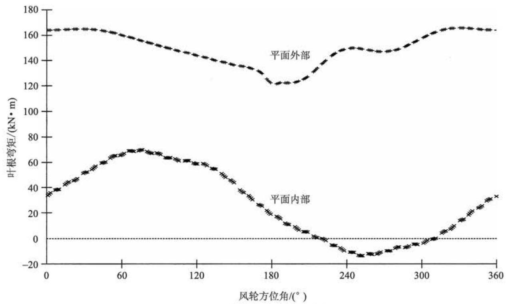

图 5.42 稳定风中的叶根弯矩

平面外力矩总是正的，叶片上的气动推力决定着其平均值。风切变导致系统方位角的变化，在 ${180}^{ \circ  }$ (下止点)角时产生比 ${0}^{ \circ  }$ 小的载荷。在 ${180}^{ \circ  }$ 处的急剧下降是很明显的, 这是塔影的影响 (塔附近风速减小)。叶片外部的动态振动造成了明显的高频率变化。

在湍流中, 载荷表现为更加随机的形式, 如图 5.43 所示。尤其是平面外载荷会随风速而变化, 因为是变桨距控制机组, 也会随桨距角而变化。内部载荷更有规律一些, 一般都是由扭转的重力载荷决定。

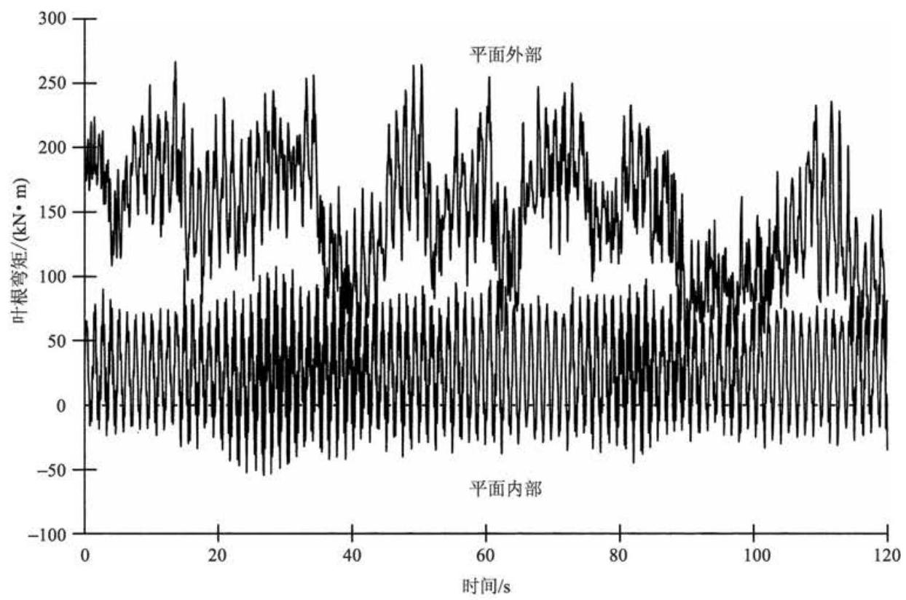

图 5.43 湍流风中的叶根弯矩

频谱分析对于理解这些变化提供了有效的途径。图 5.44 展示了叶根平面外弯矩的自动频谱和轮毂推力。平面外弯矩由转动频率 ${0.8}\mathrm{\;{Hz}}$ 所有整数倍处峰值决定。这些主要是由湍流的旋转采样引起的, 因为叶片扫动, 重复穿过湍流漩涡。 风切变和塔影也促成了这些峰值。可以看到第一个平面外振动模式在 ${3.7}\mathrm{\;{Hz}}$ 附近形成了一个小高峰。第一个塔前后波动模式在 ${0.4}\mathrm{\;{Hz}}$ 附近也有很显著的影响。 在轮毂推力谱线上，塔架的影响也很明显。然而，这个力是由三个叶根的切向力的总和产生的。这些力之间方位角相差 ${120}^{ \circ  }$ ,导致旋转频率 $\left( {1\mathrm{P}}\right)$ 峰值就抵消了。当频率为 $2\mathrm{P}\text{ 、 }4\mathrm{P}$ 等整数倍时的峰值也是一样的。只有当 $3\mathrm{P}$ 的整数倍时,峰值三个叶片的频率才同相位。

这种影响在平面内载荷谱线中更加明显 (图 5.45)。叶片载荷峰值在 $1\mathrm{P}$ 的整数倍时只有相对小的在 $3\mathrm{P}$ 和 $6\mathrm{P}$ 时的峰值穿过到达轮毂转矩。由重力决定的 $1\mathrm{P}$ 载荷峰值相当大，但是完全在轮毂转矩中消除。塔架峰值在 ${0.4}\mathrm{\;{Hz}}$ 时，两种载荷就都可见了。在第一个面内叶片振动模式在 ${4.4}\mathrm{\;{Hz}}$ 可以见到大叶片载荷峰值，但是在这种模式下轮毂不旋转，那么也就不能在轮毂转矩中见到。一些更高频叶片模式(图中未显示)会被轮毂旋转耦合。

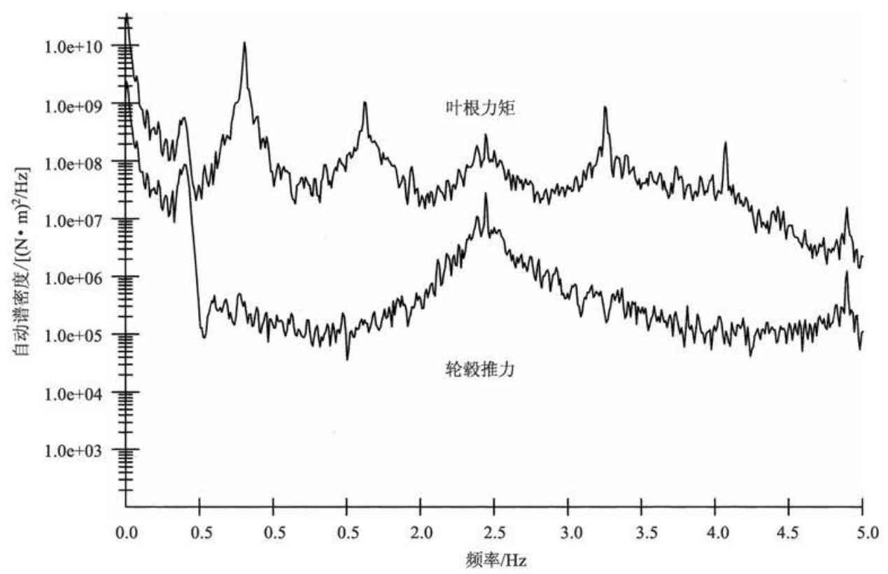

图 5.44 湍流风中的平面外载荷谱

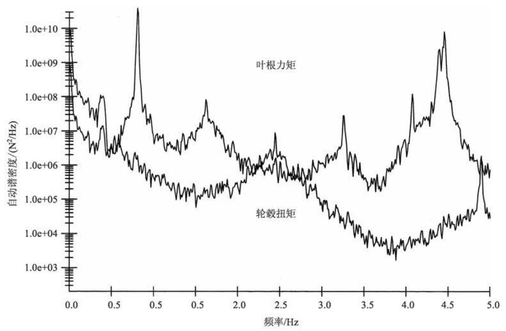

图 5.45 湍流风中的平面内载荷谱

## 5.14 从仿真推测极限载荷

载荷情况 1.1 中(湍流风中正常运行)，IEC 61400-1 第三版需要特性叶根平面内和平面外弯矩, 特性叶尖挠度由仿真输出载荷时间序列极值的统计推断决定。 持续 10min 的仿真,特定值定义为 ${3.8} \times  {10}^{-7}$ 的超标概率,即 50 年一遇的载荷。本节讨论载荷超标概率分布可以从仿真和推测到 ${3.8} \times  {10}^{-7}$ 的值得到的方法。用载荷非超标概率分布工作起来更方便, 或者叫积累分布函数, 下面讨论的就是在这些条款中,用到符号 $P\left( {X \leq  x}\right)  = F\left( x\right)$ 。为了从不同的风速段的仿真数据中组成单个的载荷概率分布, 有两条规律可循:

(1)每个风速段的载荷非超标概率分布的推导都遵循每段内的一定比例的分布和运行时间的组合 (聚集前拟合)。

(2)所有风速段的集合结果与每一段的模拟数和每段的运行时间成正比，其次推导出一个单一的载荷非超标概率分布 (拟合前聚集)。

同时,决定每个仿真中要使用多少极值也很必要。在 “全局极值” 法中,只有每 10min 仿真中最大的极值(全局极值)用来建立载荷非超标概率分布，但是在 “局部极值”法中，所有极值都可以独立使用。 “局部极值”法似乎更有吸引力，因为其使用了更多可用数据，但是却伴有建立独立标准的问题。

“聚集前拟合”序列的各个阶段首选 “全局极值”法。

### 5.14.1 全局极值经验累积分布函数的推导

据研究,每个 ${10}\mathrm{\;{min}}$ 时间序列都会产生载荷最大值,并且 $n$ 次某一特定风速 ${10}\mathrm{\;{min}}$ 仿真,会产生 $n$ 个全局极值从最小到最大排列为 $1,2,\cdots , i,\cdots ,{n}_{k}$ 。 ${10}\mathrm{\;{min}}$ 极限载荷的经验非超标概率分布 ${x}_{k}$ ,在风速 ${U}_{k}$ 下可以得出

$$
F\left( {{x}_{ki} \mid  {U}_{k}}\right)  = \frac{i}{{n}_{k} + 1},\;i = 1,2,\cdots ,{n}_{k} \tag{5.147}
$$

Harris(1996) 指出,如果 $F\left( x\right)$ 是 $x$ 的已知函数, $L$ 组 $n$ 个 ${10}\mathrm{\;{min}}$ 仿真中 $L$ 的非超标概率分布 $F\left( {x}_{i}\right)$ 平均值的第 $i$ 个极值,来推导 ${x}_{i}$ 的模拟值,往往 $i/\left( {n + 1}\right)$ 的大小为 $L$ 。

### 5.14.2 经验分布的拟合极值分布

有一些极值分布可以拟合仿真中获得的经验概率分布, 这包括 Gumbel 分布 (或叫 Fisher-Tippett I 分布), 在 2.8 节极端风速的内容中有所介绍, 对数正态分布、三参数 Weibull 分布和广义极值分布都将在后面依次介绍。

#### 1 Gumbel 分布

变量 $X$ 不超过 $x$ 的值的概率由下式给出:

$$
P\left( {X \leq  x}\right)  = F\left( x\right)  = \exp \left\lbrack  {-\exp \left( {-\frac{x - {x}_{0}}{c}}\right) }\right\rbrack \tag{5.148}
$$

其中, ${x}_{0}$ 为最大可能的极值或分布模式; $c$ 是分散度; $y = \left( {x - {x}_{0}}\right) /c$ 称为减少变量。

如果 $y =  - \ln \{  - \ln \left\lbrack  {F\left( x\right) }\right\rbrack  \}$ 对 $x$ 作图其关系是一条直线,那么 Gumbel 分布可以通过最小二乘法和由此确定的参数 ${x}_{0}$ 和 $c$ 拟合到经验分布中。然而, Harris (1996)指出了经典最小二乘法的两个缺点。

首先，绘制的函数平均值 $- \ln \left\{  {-\ln \left\lbrack  {F\left( {x}_{i}\right) }\right\rbrack  }\right\}$ ，与式 (5.147) 给出的作为双自然对数的平均值 $F\left( {x}_{i}\right)$ 本身不一样。Harris 通过 $- \ln \left\{  {-\ln \left\lbrack  {F\left( {x}_{i}\right) }\right\rbrack  }\right\}$ 的平均值提供了一个公式 ${y}_{i}$ ,可以评估符合 Gumbel 分布的数据,如下所示:

$$
{\bar{y}}_{\nu } = \frac{N!}{\left( {\nu  - 1}\right) !\left( {N - \nu }\right) !}{\int }_{0}^{1} - \ln \left\lbrack  {-\ln \left( z\right) }\right\rbrack  {z}^{N - \nu }{\left( 1 - z\right) }^{\nu  - 1}\mathrm{\;d}z \tag{5.149}
$$

在这个方程中, $N$ 是数据点数 $\left( { = {n}_{k}}\right) ,\nu$ 是数据点的排名最大的排第一,所以 $\nu  = \left( {N + 1}\right)  - i$ 且 $z = F\left( {x}_{y}\right)$ 。

其次, 经典最小二乘法假定每个图的纵坐标的变化是相同的, 不过, 对于极值数据,减少变量的变化率 $y$ ,比其他的最大值还要大得多。因此, Harris 提出在进行最小二乘法拟合之前,加权的数据与 $y$ 值的方差成反比。

当 $N = {15}$ 时, $y$ 的值和其标准差在表 5.10 中给出,符合 IEC 61400-1 第三版对高于额定风速进行至少 15 个 ${10}\mathrm{\;{min}}$ 的仿真的要求。标准 Gumbel 法计算的 $y$ 值也包括比较值，并且可以看出与最大极值有明显不同。Harris 加权因子也包括在表格的最后一栏中。可以看到，一般来说，Harris 法会产生一条更陡峭的直线， 最大的极值对其影响较小。另外一种方法是统计力矩法 (Moriarty 等, 2004)。在该方法中, 数据的前两个统计力矩 (分别定义为均值和方差) 与这些力矩的解析表达式相等。因此,对于标准 Gumbel 分布, $F\left( y\right)  = \exp \left\lbrack  {-\exp \left( {-y}\right) }\right\rbrack$ ,概率密度函数为 $f\left( y\right)  = \mathrm{d}F\left( y\right) /\mathrm{d}y = \exp \left\lbrack  {-y - \exp \left( {-y}\right) }\right\rbrack$ ,平均值为

$$
{\mu }_{y} = {\int }_{-\infty }^{\infty }{yf}\left( y\right) \mathrm{d}y = {\int }_{-\infty }^{\infty }y\exp \left\lbrack  {-y - \exp \left( {-y}\right) }\right\rbrack  \mathrm{d}y = \gamma  = {0.5772}
$$

(5.150)

表 5.10 减少变量的平均值表

<table><tr><td>✓ (从小到大)</td><td>$i$ (从小到大)</td><td>${y}_{y} =  - \ln \{  - \ln \left\lbrack  {\left( {N + 1 - y}\right) /\left( {N + 1}\right) }\right\rbrack  \} \; =  - \ln \{  - \ln \left\lbrack  {i/\left( {N + 1}\right) }\right\rbrack  \}$ (Gumbel 法)</td><td>${y}_{y}$ 一式 (5.149) (Harris 法)</td><td>${\sigma }_{y} - {y}_{v}$ 的标准差</td><td>Harris 加权因子 ${w}_{y}$</td></tr><tr><td>1</td><td>15</td><td>2.7405</td><td>3.2853</td><td>1.2825</td><td>0.0064</td></tr><tr><td>2</td><td>14</td><td>2.0134</td><td>2.2504</td><td>0.8031</td><td>0.0164</td></tr><tr><td>3</td><td>13</td><td>1.572</td><td>1.7133</td><td>0.6291</td><td>0.0266</td></tr><tr><td>4</td><td>12</td><td>1.2459</td><td>1.3404</td><td>0.5341</td><td>0.037</td></tr><tr><td>5</td><td>11</td><td>0.9816</td><td>1.0478</td><td>0.4726</td><td>0.0472</td></tr><tr><td>6</td><td>10</td><td>0.755</td><td>0.8019</td><td>0.4291</td><td>0.0573</td></tr><tr><td>7</td><td>9</td><td>0.5528</td><td>0.5852</td><td>0.3965</td><td>0.0671</td></tr><tr><td>8</td><td>8</td><td>0.3665</td><td>0.3873</td><td>0.3714</td><td>0.0765</td></tr><tr><td>9</td><td>7</td><td>0.1903</td><td>0.201</td><td>0.3518</td><td>0.0852</td></tr><tr><td>10</td><td>6</td><td>0.0194</td><td>0.0206</td><td>0.3366</td><td>0.0931</td></tr><tr><td>11</td><td>5</td><td>-0.1511</td><td>-0.1595</td><td>0.3254</td><td>0.0996</td></tr><tr><td>12</td><td>4</td><td>-0.3266</td><td>-0.3458</td><td>0.3184</td><td>0.104</td></tr><tr><td>13</td><td>3</td><td>-0.5152</td><td>-0.5485</td><td>0.317</td><td>0.1049</td></tr><tr><td>14</td><td>2</td><td>-0.7321</td><td>-0.7884</td><td>0.3257</td><td>0.0994</td></tr><tr><td>15</td><td>1</td><td>-1.0198</td><td>-1.1326</td><td>0.3648</td><td>0.0793</td></tr></table>

同样, 方差为

$$
{\sigma }_{y}^{2} = {\int }_{-\infty }^{\infty }{\left( y - {\mu }_{y}\right) }^{2}f\left( y\right) \mathrm{d}y = {\int }_{-\infty }^{\infty }{\left( y - {\mu }_{y}\right) }^{2}\exp \left\lbrack  {-y - \exp \left( {-y}\right) }\right\rbrack  \mathrm{d}y = \frac{{\pi }^{2}}{6}
$$

(5. 151)

极值的数据集的平均值以及标准差分别用 ${\mu }_{x}$ 和 ${\sigma }_{x}$ 表示,并且指出 $y = (x - \; \left. {x}_{0}\right) /c$ ,可以得到 ${\mu }_{y} = \left( {{\mu }_{\mathrm{x}} - {x}_{0}}\right) /c = {0.5772}$ 和 ${\sigma }_{y} = {\sigma }_{x}/c = {1.2825}$ 。

故

$$
c = {\sigma }_{x}/{1.2825},{x}_{0} = {\mu }_{x} - {c}_{\mu y} = {\mu }_{x} - {0.5772}\frac{{\sigma }_{x}}{1.2825} = {\mu }_{x} - {0.450}{\sigma }_{x}
$$

图 5.46 对上述三种在 Gumbel 图上的经验数据拟合直线的方法进行了比较, 其数据集由运行在 ${12}\mathrm{\;m}/\mathrm{s}$ 的风速中的 15 个 ${10}\mathrm{\;{min}}$ 仿真中得到的叶根平面外弯矩的 15 个全局极值集组成。需注意利用 Harris 法和矩量法得到的直线相比于最小二乘法得到的, 受最大值的影响较小。

#### 2 对数正态分布

在对数正态分布中,变量的对数是正常分布的,所以变量 $x$ 的概率分布函数为

$$
f\left( x\right)  = \frac{1}{\sqrt{2\pi }{\sigma }_{z}x}\exp \left\lbrack  {-\frac{1}{2}{\left( \frac{\ln x - {\mu }_{z}}{{\sigma }_{z}}\right) }^{2}}\right\rbrack \tag{5. 152}
$$

其中, ${\mu }_{z}$ 和 ${\sigma }_{z}$ 分别为 $z = \ln \left( x\right)$ 的平均值和标准差。变量 $x$ 自身的平均值和标准差 ${\mu }_{x}$ 和 ${\sigma }_{x}$ 在下式中给出:

$$
{\mu }_{x} = \exp \left( {{\mu }_{z} + {\sigma }_{z}^{2}/2}\right) ,\;{\sigma }_{x} = \exp \left( {{\mu }_{z} + {\sigma }_{z}^{2}/2}\right) \sqrt{\exp \left( {\sigma }_{z}^{2}\right)  - 1} = {\mu }_{x}\sqrt{\exp \left( {\sigma }_{z}^{2}\right)  - 1}
$$

(5.153)

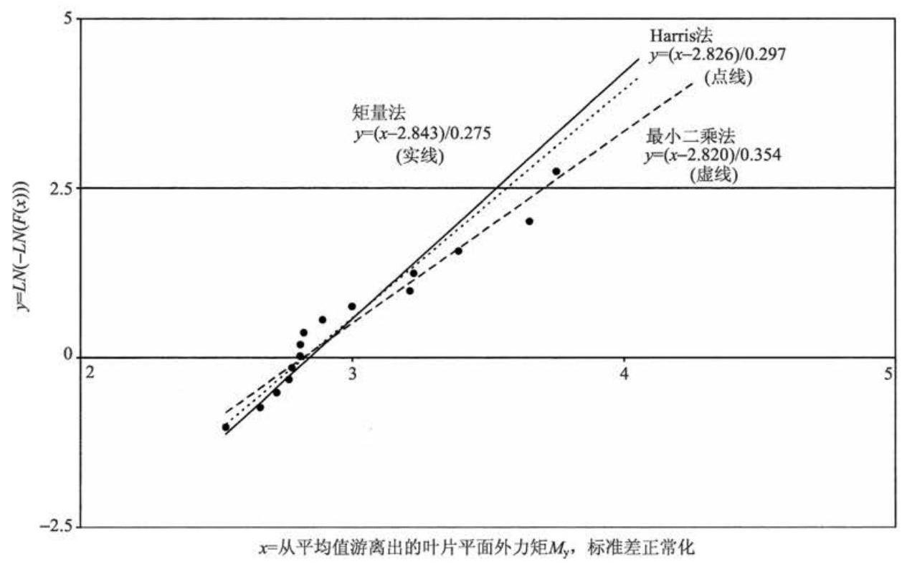

图 5.46 在 Gumbel 图上经验数据拟合直线的方法比较

对数正态分布参数 ${\mu }_{z}$ 和 ${\sigma }_{z}$ 在统计矩法的极值数据中同样适用,使用

$$
{\sigma }_{z} = \sqrt{\ln \left\lbrack  {1 + {\left( {\sigma }_{x}/{\mu }_{x}\right) }^{2}}\right\rbrack  },\;{\mu }_{z} = \ln {\mu }_{x} - {\sigma }_{z}^{2}/2 \tag{5.154}
$$

由式(5.153)得到。

#### 3 三参数 Weibull 分布

三参数 Weibull 分布定义为 $P\left( {Y \leq  y}\right)  = F\left( y\right)  = 1 - \exp \left( {-{y}^{a}}\right) , y = \left( {x - {x}_{0}}\right) /c$ 与之前一样, $F\left( y\right)$ 只适用于正的 $y$ 值。因此,概率密度函数 $f\left( y\right)$ 为 $\alpha {y}^{\alpha  - 1}\exp \left( {-{y}^{\alpha }}\right)$ 。 三个参数 ${x}_{0}, c$ 和 $\alpha$ 可以适用在上述统计矩法得出的数据,但在这种情况下,使用前三个力矩，而不是前两个了。

利用 ${G}_{m}\left( a\right)  = \left( {m/a}\right) \Gamma \left( {m/a}\right)$ ,其中 $\Gamma$ 是 Gamma 函数,前三个统计矩如下:

$$
{\mu }_{y} = {G}_{1}\left( \alpha \right) ,\;{\sigma }_{y}^{2} = {G}_{2}\left( \alpha \right)  - {G}_{1}^{2}\left( \alpha \right) ,
$$

$$
{\eta }_{y}{\sigma }_{y}^{3} = {\int }_{-\infty }^{\infty }{\left( y - {\mu }_{y}\right) }^{3}f\left( y\right) \mathrm{d}y = {G}_{3}\left( \alpha \right)  - 3{G}_{2}\left( \alpha \right) {G}_{1}\left( \alpha \right)  + 2{G}_{1}^{3}\left( \alpha \right)
$$

(5.155)

需要注意的是偏参数 ${\eta }_{y}$ 是标准差的立方正常化的第三统计矩。

#### 4 广义极值 (GEV) 分布

广义极值分布是 Jenkinson 在 1995 年提出的, 并且比 Gumbel 分布应用更加广泛,允许偏态极值分布进行建模和扩展。其定义为 $P\left( {Y \leq  y}\right)  = F\left( y\right)  = \; \exp \left\lbrack  {-{\left( 1 - ky\right) }^{1/k}}\right\rbrack  , y = \left( {x - {x}_{0}}\right) /c$ 与上述相同, $k$ 是形状参数,如果 $- \ln \{  - \ln \left\lbrack  {F\left( x\right) }\right\rbrack  \}$ 对 $x$ 作圆,那么 $k$ 决定曲率分布。如果 $k$ 是正值,则曲线是向上凸的,且有上限 ${x}_{0} \; + c/k$ 。而如果 $k$ 为负值,曲线是向下凹的,且有下限 ${x}_{0} + c/k$ 。

Hosking, Wallis 和 Wood(1985)主张用概率加权矩 (PWMs) 法拟合经验数据的 GEV 分布。对于概率分布 $F = F\left( x\right)$ ,逆分布函数 $x\left( F\right)$ ,概率加权矩 ${\beta }_{0},{\beta }_{1}$ 和 ${\beta }_{2}$ 由 ${\beta }_{\mathrm{r}} = {\int }_{0}^{1}x\left( F\right) {F}^{\tau }\mathrm{d}F$ 定义, GEV 的参数 ${x}_{0}, c$ 和 $k$ 由 GEV 的 PWM 的经验数据 PWMs 等式决定。GEV 的 PWMs 由下式给出:

$$
{\beta }_{\mathrm{r}} = \frac{1}{r + 1}\left\{  {{x}_{0} + \frac{c}{k}\left\lbrack  {1 - \frac{\Gamma \left( {1 + k}\right) }{{\left( r + 1\right) }^{k}}}\right\rbrack  }\right\}
$$

$k >  - 1,\Gamma$ 是 Gamma 函数,于是得出

$$
{\beta }_{0} = {x}_{0} + \frac{c}{k}\left\lbrack  {1 - \Gamma \left( {1 + k}\right) }\right\rbrack  ,\;2{\beta }_{0} - {\beta }_{1} = \frac{c}{k}\Gamma \left( {1 + k}\right) \left( {1 - {2}^{-k}}\right)
$$

$$
\frac{3{\beta }_{2} - {\beta }_{0}}{2{\beta }_{1} - {\beta }_{0}} = \frac{1 - {3}^{-k}}{1 - {2}^{-k}} \tag{5. 156}
$$

解最后一个方程需要迭代的方法,但是 Hosking 等 (1985) 已经给出了 $k$ 的优化近似 ${7.8590C} + {2.9554}{C}^{2}$ ,其中 $C = \left( {2{\beta }_{1} - {\beta }_{0}}\right) /\left( {3{\beta }_{2} - {\beta }_{0}}\right)  - \left( {\log 2/\log 3}\right)$ 。这个 $k$ 值可以代入式(5.156)中的前两个方程来得到 ${x}_{0}$ 和 $c$ 。

从下面的方程可以估计出 PWMs 经验数据:

$$
{\beta }_{\mathrm{r}}\left\lbrack  {p}_{i, n}\right\rbrack   = \frac{1}{n}\mathop{\sum }\limits_{{i = 1}}^{n}{p}_{i, n}^{r}{x}_{i} \tag{5. 157}
$$

其中 ${p}_{i, n}$ 是分配给第 $i$ 个全局极值的概率,从小到大排列。Hosking 等提出了两个可替换表达式来估计 ${p}_{i, n}$ ,如下:

$$
{P}_{i, n} = \left( {i - a}\right) /n
$$

$$
{p}_{i, n} = \left( {i - a}\right) /\left( {n + 1 - {2a}}\right) ,\; - {0.5} < a < {0.5}
$$

另一种估计 PWMs 的方法直接来自于无偏估计 ${b}_{\mathrm{r}}$ ,由下式给出:

$$
{b}_{\mathrm{r}} = \frac{1}{n}\mathop{\sum }\limits_{{i = 1}}^{n}\frac{\left( {i - 1}\right) \left( {i - 2}\right) \cdots \left( {i - r}\right) }{\left( {n - 1}\right) \left( {n - 2}\right) \cdots \left( {n - r}\right) }{x}_{i} \tag{5.158}
$$

图 5.47 比较了两种拟合上述的 15 个全局极值数据集的 GEV 分布, 并且推断 50 年一遇的情况。在一种情况下, PWMs 的无偏估计用于拟合, 而其他情况下, 当 $a = {3.5}$ 时,公式 ${p}_{i, n} = \left( {i - a}\right) /n$ 用于概率,因为这是通过 Hosking 等得到的计算机仿真中最佳的全局结果。同时为了作比较, 还示出了 Gumbel 分布拟合统计矩法的数据集情况。

可以看出, 这两个 GEV 分布相同之处很少, 这很有可能是因为 (至少部分由于)数据集太小，从而导致 PWMs 的粗略估计。还应当指出的是，相同载荷情况下的不同的数据集的使用, 导致形状参数相当大的变化, 15 个全局极值的数据集对于得出有意义的结果来说, 还不够大。

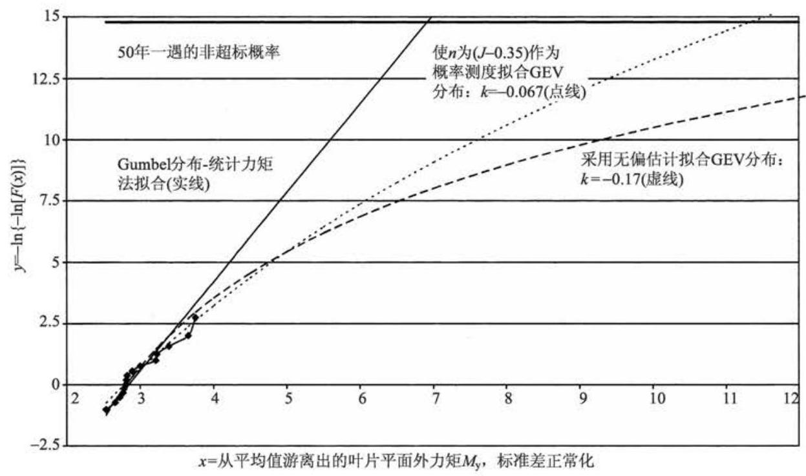

图 5.47 Gumbel 图上拟合经验数据的 GEV 分布比较

### 5.14.3 极值分布的比较

Gumbel 分布、三参数 Weibull 分布和对数正态分布已用在拟合上面介绍的叶根平面外弯矩 15 个全局极值数据集中,在每种情况中用统计矩法, $- \ln \{  - \ln \left\lbrack  {F\left( x\right) }\right\rbrack  \}$ 对正常化弯矩偏移 $x$ 的 Gumbel 图在图 5.48 中进行比较。

图 5.48 显示三极值分布推断 50 年一遇的超标概率为 ${3.8} \times  {10}^{-7}$ (其中, $- \ln \{  - \ln \left\lbrack  {F\left( x\right) }\right\rbrack  \}$ 为 14.78 ) 来说明其特点。可以看出,50 年一遇载荷的预测值的变化范围很大。

尽管风力机部件的载荷一般来说不是窄带, 但还是值得研究上述三种极值分布和GEV分布能够多么好地拟合在窄带进程产生的全局极值。叶片以 ${15}\mathrm{r}/\mathrm{{min}}$ 的速度旋转，意味着 ${10}\mathrm{\;{min}}$ 内 150 个载荷循环。假设极端载荷在相邻的三个周期块是相互独立的，间隔 ${10}\mathrm{{min}}$ 有 50 个独立的最大值，并且全局最大值的累积概率分布为

$$
F\left( x\right)  = {\left\lbrack  1 - \exp \left( -\frac{{x}^{2}}{2}\right) \right\rbrack  }^{50} \tag{5.159}
$$

Gumbel、三参数 Weibull、对数正态分布和 GEV 分布已经拟合在使用统计矩法的分布上, Gumbel 曲线的拟合分布图及其定义的参数见图 5.49。

可以看出, 对数正态分布和三参数 Weibull 分布比其他两个更适合窄带进程全局最大值的分布。

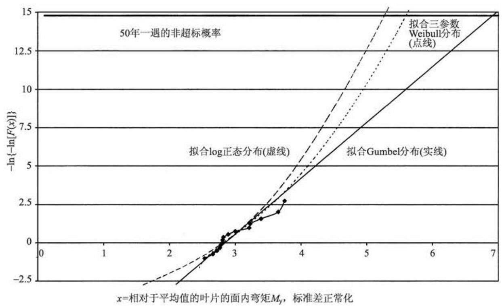

图 5.48 三极值分布拟合经验数据 Gumbel 图比较

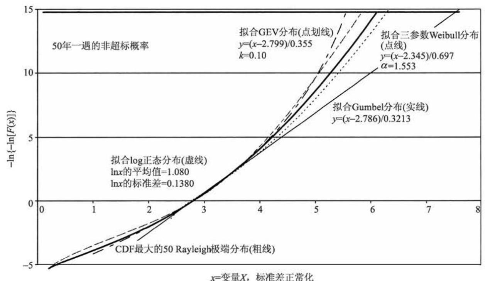

图 5.49 最大的 50 Rayleigh 分散极端拟合分布的四个极值分布 Gumbel 图比较

Freudenreich 和 Argyriadis(2008)比较了上述 4 种极值分布的推断,参考了 5 架 5MW 变桨距风力机一年的仿真,利用每个风速段 30 个 ${10}\mathrm{\;{min}}$ 时间历程作为输入得出的极值，得出叶片扫动时叶根弯矩的推断，三参数威布尔分布和对数正态分布是最准确的, 而 Gumbel 推断很明显是保守的。

### 5.14.4 概率分布组合

据前文所述，根据模拟期的极端载荷风速值，可以得出一个载荷非超标概率分布组程序， $F\left( {x \mid  {U}_{k}}\right)$ 为每一个风速段产生一个程序。根据适于风速段运行的小时数, 把所有程序的结果加在一起, 对每个风速进行加权, 可以生成一个所有运行风速的单一分布。数学上，求和的表示如下:

$$
{F}_{\text{ Long-term }}\left( x\right)  \approx  \mathop{\sum }\limits_{{k = 1}}^{M}F\left( {x \mid  {U}_{k}}\right) {p}_{k} \tag{5.160}
$$

其中 ${p}_{k}$ 是在平均风速 ${U}_{k}$ 下风速段运行小时数的比例,风速的运行范围被分为 $M$ 个段。

### 5.14.5 推 断

50 年一遇的载荷是由 ${F}_{\text{ Long-term }}\left( x\right)$ 对必要的非超标概率的推断得到的,即 $\left( {1 - {3.8} \times  {10}^{-7}}\right.$ 为 ${10}\mathrm{\;{min}}$ 的模拟周期 $)$ 。 ${F}_{\text{ Long-term }}\left( x\right)$ 是一些数学方法定义的分布的总和, 这很简单。图 5.48 说明了单一风速段为主的极限载荷, 推断如何寻找提到过的三极值分布。

### 5.14.6 聚合后拟合概率分布

在此序列，第一步就是要将所有风速段仿真的数据点聚合起来。如果每个风速段仿真的数目与在这个风速段中运行时间的数目成正比，并且总共有 $m$ 个 10min 仿真，那么这 $m$ 个全局极值可以排序为 $1,2,\cdots , i,\cdots , m$ 从小到大排列， 10min 极端载荷的长期经验载荷非超标概率分布 $x$ 可以根据下式建立:

$$
{F}_{\text{ Long-term }}\left( {x}_{i}\right)  = \frac{i}{m + 1},\;i = 1,2,3,\cdots , m
$$

在每个风速段的仿真数目与实际可能的数字不成正比的情况下, 不同段内的全局极值需要分配不同的加权法, 那么概率分布变为

$$
{F}_{\text{ Long-term }}\left( x\right)  = \mathop{\sum }\limits_{{k = 1}}^{b}\left( {\mathop{\sum }\limits_{{i = 1}}^{{n}_{k}}\frac{I\left\lbrack  {{x}_{i, k} \leq  x}\right\rbrack  }{m + 1}}\right) {w}_{k} = \mathop{\sum }\limits_{{k = 1}}^{b}\left( {\mathop{\sum }\limits_{{i = 1}}^{{n}_{k}}\frac{I\left\lbrack  {{x}_{i, k} \leq  x}\right\rbrack  }{m + 1}}\right) \frac{m{p}_{k}}{{n}_{k}}
$$

(5.161)

其中, ${x}_{i, k}$ 是在第 $k$ 个风速段中的第 $i$ 个极端值; 当 ${x}_{i, k} \leq  x$ 时, $I\left\lbrack  {{x}_{i}, k \leq  x}\right\rbrack$ 为 1,反之为 $0\text{ 。 }{n}_{k}$ 是第 $k$ 个风速段仿真的数目; $b$ 是风速段的数目; ${w}_{k}$ 是第 $k$ 个风速段的加权因子; ${p}_{k}$ 是第 $k$ 个风速段运行时间的比例。

第二步就是将极值分布拟合到长期经验载荷分布来运行 50 年一遇载荷的推断。很明显，“拟合前聚集”法比“聚集前拟合”法更简单，只需要一个拟合操作，不过长期经验分布的固有复杂性可能使紧密拟合更加难以实现。

### 5.14.7 局部极值方法

局部极值方法与全局极值方法一样,不同的是每 10min 的仿真都有几个独立的极值, 用来构建经验载荷非超标概率分布, 从而取代单一的最大值, 即 “全局极值”。

如果每个 ${10}\mathrm{\;{min}}$ 仿真有 $n$ 个独立极值,那么 ${10}\mathrm{\;{min}}$ 极端载荷经验非超标概率分布 ${x}_{k}$ ,在风速 ${U}_{k}$ 下运用下式在局部极值的非超标概率分布中得到

$$
F\left( {{x}_{k} \mid  {U}_{k}}\right)  = {\left\lbrack  {F}_{\text{ local }}\left( {x}_{k} \mid  {U}_{k}\right) \right\rbrack  }^{n}
$$

为了保证局部极值的独立性, IEC 61400-1 第三版的附录 F 建议独立的极值应该彼此隔开至少三个响应周期。一个不太严格，但是计算上较简单的方法是将 10min 仿真分成 $n$ 个段或者“块”，每个都有相同的持续时间和各自的最大值。这种提取局部极值的方法如图 5.50 所示，风力机以 ${15}\mathrm{r}/\mathrm{{min}}$ 转速，块大小为 ${12}\mathrm{s}$ ，对应的就是三个旋转周期。

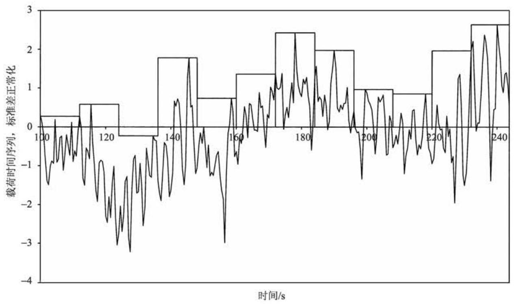

图 5.50 块持续时间为 ${12}\mathrm{\;s}$ 的局部极值

Fogle 等(2008)已经将独立静态测试应用在从一个 NREL 开发的 5MW 风力机模型的 200 仿真载荷时间历程中得到块最大值, 并且得出结论, 块持续时间为 30s 以确保独立性。然而,他们同时也发现把块持续时间缩短到 5s,在经验概率分布尾部几乎没有什么不同。

### 5.14.8 收敛要求

IEC 61400-1 第三版规定了一个推断载荷不确定性的限制, 即需要进行足够的仿真，使该载荷的 84% 分位数(即 10 min 仿真的极端载荷可能会超过 16% 的时间) 的 90% 的置信区间小于载荷的 15%。该要求表示为

$$
\frac{{\widehat{S}}_{{0.84},{0.05}} - {\widehat{S}}_{{0.84},{0.95}}}{{\widehat{S}}_{0.84}} < {0.15} \tag{5.162}
$$

其中置信区间 ${\widehat{S}}_{{0.84},{0.05}}$ 和 ${\widehat{S}}_{{0.84},{0.95}}$ 是 84% 分位数载荷的经验估计,分别不超过 5% 和 95% 的概率。

估计置信区间一个方法利用二项式展开来得到 $m$ 次模拟中的 $j$ 或更少出现的 ${84}\%$ 分位数载荷不超标概率 $C\left( {j;m,{0.84}}\right)$ 。由下式得到:

$$
C\left( {j;m,{0.84}}\right)  = \mathop{\sum }\limits_{{i = 0}}^{j}\frac{m!}{i!\left( {m - i}\right) !}{0.84}^{i} \times  {0.16}^{m - i} \tag{5.163}
$$

例如，图 5.51 中 $m = {15}$ 的仿真对 $j$ 的概率绘制图。可以看到 $5\%$ 和 ${95}\%$ 置信区间在 84% 分位数载荷的非超标数分别为 9.5 和 14.3。在 84% 分位数载荷的置信区间， ${\widehat{S}}_{{0.84},{0.05}}$ 和 ${\widehat{S}}_{{0.84},{0.95}}$ ，所需的不等式[式(5.162)] 可以分别从第 9 和第 10 以及第 14 和第 15 极端值之间的插值推导出来。同样是从小到大排序。

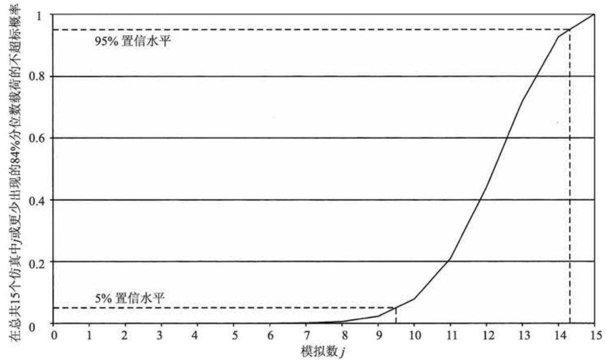

图 5.51 在总共 15 个仿真中 $j$ 或更少出现的 80% 分位数载荷的不超标概率

IEC 61400-1 第三版附录 F 提供了一个有关模拟数的 5% 和 9% 置信区间表, 在表中模拟总数 $m$ 从 ${15} \sim  {35}, m$ 的每个值的 80% 分位数载荷都不超标。选择的数值在表 5.11 中给出。

表 5.11 84% 分位数载荷不超过不同数量的总载荷模拟数的置信区间表

<table><tr><td>模拟总数 $m$</td><td>不超出 5%概率的 84%分位数载荷的不超标数</td><td>不超出 95%概率的 84% 分位数载荷的不超标数</td></tr><tr><td>15</td><td>9.5</td><td>14.32</td></tr><tr><td>20</td><td>13.35</td><td>18.83</td></tr><tr><td>25</td><td>17.23</td><td>23.39</td></tr><tr><td>30</td><td>21.18</td><td>27.83</td></tr><tr><td>35</td><td>25.13</td><td>32.32</td></tr></table>

## 参考文献

Armstrong, J.R.C. and Hancock, M. (1991) Feasibility study of teetered, stall-regulated rotors. ETSU Report No. WN 6022.

Barltrop, N.D.P. and Adams, A.J. (1991) Dynamics of Fixed Marine Structures, 3rd edition., Butterworth-Heinemann, Oxford.

Batchelor, G.K. (1953) The Theory of Homogeneous Turbulence. Cambridge University Press, Cambridge.

Bierbooms, W.A.A.M. (2006) Constrained stochastic simulation - generation of time series around some specific event in a normal process. Extremes 8, 20-224.

Bishop, N.W.M., Zhihua, H. and Sheratt, F. (1991) The Analysis of Non-Gaussian Loadings from Wind Turbine Blades Using Frequency Domain Techniques. Proceedings of the 1991 BWEA Conference, pp. 317-323.

Bishop, N.W.M., Wang, R. and Lack, L. (1995) A Frequency Domain Fatigue Predictor for Wind Turbine Blades Including Deterministic Components. Proceedings of the 1995 BWEA Conference, pp. 53-58.

British Standard Institution (1980). BS 5400: Part 10: 1980 Steel, concrete and composite bridges - Code of practice for fatigue. British Standard Institution, London.

British Standard Institution (1986). BS 8100: Part 1: 1986 Lattice towers and masts - Code of practice for loading. British Standard Institution, London.

Clough, R.W. and Penzien, J. (1993) Dynamics of Structures. Mc Graw Hill, New York.

Craig, Jr., R.R. and Bampton, M.C.C. (1968) Coupling of substructures for dynamic analysis, AIAA Journal, 6(7), 1313-1319.

Creed, R.F. (1993) High cycle tensile fatigue of unidirectional fiberglass composite tested at high frequency. PhD thesis, Montana State University.

Danish Standards (1992). DS 472: Loads and Safety of Wind Turbine Construction, 1st edition. Danish Standard Foundation, Denmark.

Danish Standards (1983). DS 410: Loads for the design of structures, 3rd edition. Danish Standard Foundation, Denmark.

Davenport, A.G. (1964) Note on the distribution of the largest value of a random function with application to gust loading. Proceedings of the Institute of Civil Engineering Conference, 28, pp. 187-196.

Dirlik, T. (1985) Application of computers in fatigue analysis. PhD thesis, University of Warwick.

Eurocode 1 (2005). Actions on structures - Part 1.4: Actions on structures - Wind actions. (EN 1991-1-4:2005).

Fogle, J. et al. (2008). Towards an improved understanding of statistical extrapolation for wind turbine extreme loads. Wind Energy, 11, 613-635. (Expanded version published by American Institute of Aeronautics and Astromatics).

Freudenreich, K. and Argyriadis, K. (2008). Wind turbine load level based on extrapolation and simplified methods. Wind Energy, 11, 589-600.

Garrad, A.D. and Hassan, U. (1986) The Dynamic Response of Wind Turbines for Fatigue Life and Extreme Load Prediction. Proceedings of the EWEA 1986 Conference, pp. 401-406.

Garrad, A.D. (1987) The Use of Finite Element Methods for Wind Turbine Dynamics. Proceedings of the EWEA 1987 Conference, pp. 79-83.

Garrad Hassan (2010) Bladed Theory Manual, Version 4.0. Garrad Hassan, Bristol.

Germanischer Lloyd (2003) Rules and Guidelines: IV - Industrial Services: Part 1 - Guideline for the Certification of Wind Turbines. Germanischer Lloyd, Hamburg.

Gibson, R.F. et al. (1982) Vibration characteristics of automotive composite materials. In: Short Fiber Reinforced Composite Materials (ed. B.A. Sanders), pp. 133-150, STP 772. ASTM, West Conshohocken, PA.

Hansen, A.C. (1998) User's guide to the Wind Turbine Dynamics Computer Programs YawDyn and AeroDyn for Adams, Version 11.0. University of Utah, Utah.

Harris, R.I. (1996) Gumbel re-visited - a new look at extreme value statistics applied to wind speeds. Journal of Wind Engineering and Industrial Aerodynamics, 59, 1-22.

Hoskin, R.E., Warren, J.G. and Draper, J. (1989) Prediction of fatigue damage in wind turbine rotors. In: Proceedings of the EWEC 1989 Conference, pp. 389-394.

Hosking, J.R.M., Wallis, J.R. and Wood, E.F. (1985) Estimation of the generalized extreme value distribution by the method of probability-weighted moments. Technometrics, 27(3), 251-261.

International Electrotechnical Commission (2005) IEC 61400-1: Wind turbines - Part 1: Design Requirements, 3rd edition. International Electrotechnical Commission, Geneva.

Jamieson, P. and Hunter, C. (1985) Analysis of data from Howden 300 kW wind turbine on Burgar Hill Orkney. In: Proceedings of the BWEA 1985 Conference, pp. 253-258.

Jamieson et al. (2000) Wind turbine design for offshore. In: P. Jamieson, T.R. Camp and D.C. Quar-ton, Proceedings of the Offshore Wind Energy in Mediterranean and European Seas Conference, pp. 405-414. CEC/EWEA/IEA, Sicily.

Jenkinson, A.F. (1955) The frequency distribution of the annual maximum (or minimum) of meteorological elements. Quarterly Journal of the Royal Meteorological Society. 81, 158-171.

Kaimal, J.C. et al. (1972) Spectral characteristics of surface-layer turbulence. Quarterly Journal of The Meteorological Society, 98, 563-598.

Larsen, G.C., Ronold, K., Jorgensen, H.E., Argyriadis, K. and de Boer, J. (1999) Ultimate Loading of Wind Turbines. No R-1111, Riso National Laboratory.

Lobitz, D.W.A. (1984) NASTRAN based computer program for structural dynamic analysis of HAWT's. Proceedings of the EWEA 1984 Conference.

Madsen, P.H., Frandsen, S., Holley, W.E. and Hansen, J.C. (1984) Dynamics and fatigue damage of wind turbine rotors during steady operation. No. R-512, Risø National Laboratory.

Mann, J. (1994): The spatial structure of neutral atmospheric surface-layer turbulence. Journal of Fluid Mechanics, 273, 141-168.

Mann, J. (1998) Wind field simulation. Journal of Probability Engineering Mechanics, 13(4), 269- 282.

Matsuishi, M. and Endo, T. (1968) 'Fatigue of metals subject to varying stress' Japan Society of Mechanical Engineers, Jukvoka.

Molenaar, D.P. and Dijkstra, S. (1999) State-of-the-art of wind turbine design codes: main features overview for cost-effective generation. Wind Engineering, 23(5), 295-311.

Morgan, C.A. and Tindal, A.J. (1990) Further analysis of the Orkney MS-1 data. In: Proceedings of the BWEA 1990 Conference, pp. 325-330.

Moriaty, P.J., Holley, W.E. and Butterfield, S.P. (2004) Extrapolation of extreme and fatigue loads using probabilistic methods. NREL Report TP-500-34421.

Petersen, J.T., Madsen, H.A., Björck, A., Enevoldsen, P., Øye, S., Ganander, H. and Winkelaar, D. (1998) Prediction of dynamic loads and induced vibrations in stall. No. R-1045, Risø National Laboratory.

Putter, S. and Manor, H. (1978) Natural frequencies of radial rotating beams. Journal of Sound and Vibration 56(2), 175-185.

Ragan, P. and Manuel, L. (2007) Comparing estimates of wind turbine fatigue loads using time-domain and spectral methods. Wind Engineering 31(2), 83-99.

Shabana, A.A. (1998) Dynamics of Multibody Systems, 2nd edition. Cambridge University Press, Cambridge.

Thomsen, K. and Madsen, P.H. (1997) Application of statistical methods to extreme loads for wind turbines. In: Proceedings of the 1997 EWEC Conference, pp. 595-598.

Thomsen, K. (1998) The statistical variation of wind turbine fatigue loads, No. R-1063. Risø National Laboratory.

Veers, P.S. (1988) Three-dimensional wind simulation, SAND88-0152. Sandia National Laboratory.

Von Karman, T. (1948) Progress in the statistical theory of turbulence. In: Proceddings of The National Academy of Sciences. Vol. 34, pp. 530-539.

Warren, J.G., Quarton, D.C., Lack, L. and Draper, J. (1988) Prediction of Fatigue Damage in Wind Turbine Rotors. Proceedings of the 1988 BWEA Conference.

## 附录 B 湍流风速下静止叶片的 动态响应

### B.1 引 言

正如第 2 章所描述的那样，湍流包括很大范围频率内的风速波动。虽然大量湍流频率比叶片一阶模态频率低，具有代表性的为 $1\mathrm{\;{Hz}}$ 以上，而和一阶模态频率相近的小部分将会引起叶片共振。利用本章节描述的方法可以确定共振特性。在频域范围内，叶尖移位和叶根弯矩响应的标准差表达式被导出，这样在给定周期内获得峰值的方法也就被描述。开始时，假定风完全作用于叶片，但是接下来的处理则将包括空间变更对其的影响。

### B.2 频域响应函数

#### 1 运动方程

利用模态分析，脉动空气动力载荷对悬臂叶片的动态响应可以很方便地进行研究。分别计算出不同振动模态下的响应然后对其进行叠加。这样在半径 $r$ 处的偏差 $x\left( {r, t}\right)$ 为

$$
x\left( {r, t}\right)  = \mathop{\sum }\limits_{{i = 1}}^{\infty }{f}_{i}\left( t\right) {\mu }_{i}\left( r\right)
$$

通常, 在叶片静止的情况下, 一阶模态占优, 其他的模态可以不被考虑。从 5.8.1 节中获得的第 $i$ 阶模态的运动方程如下:

$$
{m}_{i}{\ddot{f}}_{i}\left( t\right)  + {c}_{i}{\dot{f}}_{i}\left( t\right)  + {m}_{i}{\omega }_{i}^{2}{f}_{i}\left( t\right)  = {\int }_{0}^{R}{\mu }_{i}\left( r\right) q\left( {r, t}\right) \mathrm{d}r \tag{B. 1}
$$

式中, $q\left( {r, t}\right)$ 为外部载荷; ${f}_{i}\left( t\right)$ 为叶尖移位; ${\mu }_{i}\left( r\right)$ 为第 $i$ 阶模态的无量纲振形,对其正交化,使得振形向量与一给定的叶尖变形一致; ${\omega }_{i}$ 为固有频率,单位为 $\mathrm{{rad}}/\mathrm{s};{m}_{i}$ 为广义质量, ${\int }_{0}^{R}m\left( r\right) {\mu }_{i}^{2}\left( r\right) \mathrm{d}r;{c}_{i}$ 为广义阻尼, ${\int }_{0}^{R}\widehat{c}\left( r\right) {\mu }_{i}^{2}\left( r\right) \mathrm{d}r$ 。

#### 2 频域响应函数

如果 $q\left( {r, t}\right)$ 随着频率 $\omega$ 和幅值 ${q}_{0}\left( r\right)$ 同步发生变化,则它可以被表达为如下形式:

$$
{f}_{i}\left( t\right)  = \frac{1}{{m}_{i}}\frac{{\int }_{0}^{R}{\mu }_{i}\left( r\right) {q}_{0}\left( r\right) \mathrm{d}r}{\sqrt{{\left( {\omega }_{i}^{2} - {\omega }^{2}\right) }^{2} + {\left( {c}_{i}/{m}_{i}\right) }^{2}{\omega }^{2}}}\cos \left( {{\omega t} + {\phi }_{i}}\right)
$$

$$
= \frac{1}{{m}_{i}{\omega }_{i}^{2}}\frac{{\int }_{0}^{R}{\mu }_{i}\left( r\right) {q}_{0}\left( r\right) \mathrm{d}r}{\sqrt{{\left( 1 - {\omega }^{2}/{\omega }_{i}^{2}\right) }^{2} + {\left( {c}_{i}/{m}_{i}{\omega }_{i}^{2}\right) }^{2}{\omega }^{2}}}\cos \left( {{\omega t} + {\phi }_{i}}\right) \tag{B. 2}
$$

定义 ${k}_{i} = {m}_{i}{\omega }_{i}^{2}$ ,阻尼比 ${\xi }_{i} = {c}_{i}/2{m}_{i}{\omega }_{i}$ ,上式变为

$$
{f}_{i}\left( t\right)  = \frac{1}{{k}_{i}}\frac{{\int }_{0}^{R}{\mu }_{i}\left( r\right) {q}_{0}\left( r\right) \mathrm{d}r}{\sqrt{{\left( 1 - {\omega }^{2}/{\omega }_{i}^{2}\right) }^{2} + 4{\xi }_{i}^{2}{\omega }^{2}/{\omega }_{i}^{2}}}\cos \left( {{\omega t} + {\phi }_{i}}\right)  = {A}_{i}\cos \left( {{\omega t} + {\phi }_{i}}\right)
$$

(B. 3)

分子 ${\int }_{0}^{R}{\mu }_{i}\left( r\right) {q}_{0}\left( r\right) \mathrm{d}r$ 是悬臂末端等效负荷的幅值,它所产生的叶尖位移与外部载荷 $q\left( {r, t}\right)$ 所引起的叶尖位移一致。相对于第 $i$ 阶模态的 ${Q}_{i}\left( t\right)$ ,被认为是广义载荷。这样叶尖位移的幅值和广义载荷幅值的比值为

$$
\frac{{A}_{i}}{{\int }_{0}^{R}{\mu }_{i}\left( r\right) {q}_{0}\left( r\right) \mathrm{d}r} = \frac{1}{{k}_{i}\sqrt{{\left( 1 - {\omega }^{2}/{\omega }_{i}^{2}\right) }^{2} + 4{\xi }_{i}^{2}{\omega }^{2}/{\omega }_{i}^{2}}}
$$

$$
= \frac{1}{{k}_{i}\sqrt{{\left( 1 - {n}^{2}/{n}_{i}^{2}\right) }^{2} + 4{\xi }_{i}^{2}{n}^{2}/{n}_{i}^{2}}} = \left| {{H}_{i}\left( n\right) }\right| \tag{B. 4}
$$

${H}_{i}\left( n\right)$ 是综合频率响应函数的模数; ${H}_{i}\left( n\right)$ 和它的平方可以用来将与叶片相伴随的风的功率频谱转换成第 $i$ 阶模态叶尖位移的功率频谱。这样,在占优势的一阶模态情况下,响应广义载荷 ${Q}_{1}\left( t\right)$ ,频率为 $n$ 的叶尖位移表达式如下:

$$
{x}_{1}\left( {R, t}\right)  = {f}_{1}\left( t\right)  = {Q}_{1}\left( t\right) \left| {{H}_{1}\left( n\right) }\right|
$$

一阶模态叶尖变形的功率频谱为 ${S}_{1x}\left( n\right)  = {S}_{Q1}\left( n\right) {\left| {H}_{1}\left( n\right) \right| }^{2}$ 。

在下文中，简化假设风是在沿着叶片方向完全相关联的。

### B.3 忽略风速沿叶片变化的共振位移响应

#### 1 网载的线性化

对于波动的风速 $U\left( t\right)  = \bar{U} + u\left( t\right)$ ,在叶片上每单位长度的风力载荷为

$$
\frac{1}{2}{C}_{\mathrm{f}}\rho {U}^{2}\left( t\right) c\left( r\right)  = \frac{1}{2}{C}_{\mathrm{f}}\rho \left\lbrack  {{\bar{U}}^{2} + 2\bar{U}u\left( t\right)  + {u}^{2}\left( t\right) }\right\rbrack  c\left( r\right)
$$

式中, ${C}_{\mathrm{f}}$ 为升力或阻力系数; $c\left( r\right)$ 是半径为 $r$ 处的叶片弦长。为了能够进行线性化处理,方括号中的第三项与前两项相比很小,可以忽略不计,于是波动负荷 $q\left( {r, t}\right)$ 变成 ${C}_{\mathrm{f}}\rho \bar{U}u\left( t\right) c\left( r\right)$ 。

#### 2 一阶模态位移响应

规定 $q\left( {r, t}\right)  = {C}_{\mathrm{f}}\rho \bar{U}u\left( t\right) c\left( r\right)$ ,对于由式 (5.149) 给出的频率为 $n\left( { = \omega /{2\pi }}\right)$ 和幅值为 ${u}_{0}\left( n\right)$ 的正弦风速波动,其一阶模态位移响应变为

$$
{f}_{1}\left( t\right)  = {\int }_{0}^{R}{\mu }_{1}\left( r\right) {C}_{\mathrm{f}}\rho \bar{U}c\left( r\right) \mathrm{d}r{u}_{ \circ  }\left( n\right) \left| {{H}_{1}\left( n\right) }\right| \cos \left( {{2\pi nt} + {\phi }_{1}}\right)
$$

$$
= {C}_{\mathrm{f}}\rho \bar{U}{\int }_{0}^{R}{\mu }_{1}\left( r\right) c\left( r\right) \mathrm{d}r{u}_{ \circ  }\left( n\right) \left| {{H}_{1}\left( n\right) }\right| \cos \left( {{2\pi nt} + {\phi }_{1}}\right) \tag{B. 5}
$$

因此，一阶模态叶尖位移功率频谱为

$$
{S}_{1\mathrm{x}}\left( n\right)  = {\left\lbrack  {C}_{\mathrm{f}}\rho \bar{U}{\int }_{0}^{R}{\mu }_{1}\left( r\right) c\left( r\right) \mathrm{d}r\right\rbrack  }^{2}{S}_{\mathrm{u}}\left( n\right) {\left| {H}_{1}\left( n\right) \right| }^{2} \tag{B. 6}
$$

式中, ${S}_{\mathrm{u}}\left( n\right)$ 为沿着风湍动方向的功率频谱。这样,一阶模态叶尖位移的标准偏差表示如下:

$$
{\sigma }_{1\mathrm{x}}^{2} = {\left\lbrack  {C}_{\mathrm{f}}\rho \bar{U}{\int }_{0}^{R}{\mu }_{1}\left( r\right) c\left( r\right) \mathrm{d}r\right\rbrack  }^{2}{\int }_{0}^{\infty }{S}_{\mathrm{u}}\left( n\right) {\left| {H}_{1}\left( n\right) \right| }^{2}\mathrm{\;d}n \tag{B. 7}
$$

#### 3 背景和共振响应

通常,大量的湍流能位于比一阶模态频率更低的频率范围。如图 B. 1 所示,其中比较了一个典型的脉动风功率频谱与一个共振频率为 $1\mathrm{\;{Hz}}$ 的频率响应函数的平方 ${\left| {H}_{1}\left( n\right) \right| }^{2}$ 。功率频谱源于 Kaimal 谱 (Eurocode1,1997),其表达式如下:

$$
n{S}_{\mathrm{u}}\left( n\right)  = {\sigma }_{\mathrm{u}}^{2}\frac{{6.8n}{L}_{u}^{x}/\bar{U}}{{\left( 1 + {10} \times  2n{L}_{u}^{x}/\bar{U}\right) }^{\frac{5}{3}}} \tag{B. 8}
$$

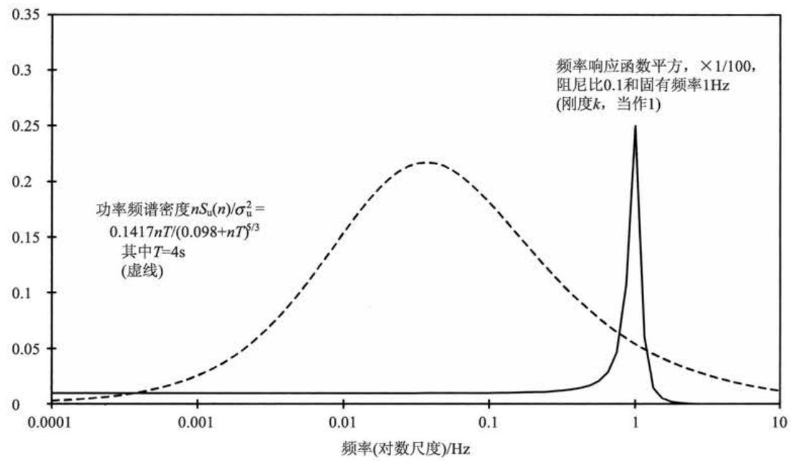

图 B. 1 功率频谱和频率响应函数

功率谱图纵坐标为无量纲功率频谱密度函数 ${R}_{u}\left( n\right)  = {nc}{S}_{u}\left( n\right) /{\sigma }_{u}^{2}$ ,横坐标为频率的对数。在平均风速为 ${50}\mathrm{\;m}/\mathrm{s}$ 和积分比例 ${L}_{u}^{x} = {200}\mathrm{\;m}$ 的基础上计算得到时间比例 ${L}_{u}^{x}/\bar{U} = 4\mathrm{\;s}$ 。

基于共振响应总是发生在功率频谱尾部很窄的一个带宽内, 通常将它在低频段分离出来单独对待,并忽略共振频率 ${n}_{1}$ 两边的 $n{S}_{\mathrm{u}}\left( n\right)$ 变动 (Wyatt,1980)。总的叶尖位移变化变为

$$
{\sigma }_{\mathrm{x}}^{2} = {\sigma }_{\mathrm{B}}^{2} + {\sigma }_{\mathrm{x}1}^{2}
$$

其中，一阶模态共振响应变化 ${\sigma }_{\mathrm{x}1}$ 由下式给出:

$$
{\sigma }_{\mathrm{x}1}^{2} = {\left\lbrack  {C}_{\mathrm{f}}\rho \bar{U}{\int }_{0}^{R}{\mu }_{1}\left( r\right) c\left( r\right) \mathrm{d}r\right\rbrack  }^{2}{S}_{\mathrm{u}}\left( {n}_{1}\right) {\int }_{0}^{\infty }{\left| {H}_{1}\left( n\right) \right| }^{2}\mathrm{\;d}n \tag{B. 9}
$$

更高模式的共振频率 ${\sigma }_{x2}^{2}\text{ 、 }{\sigma }_{x3}^{2}$ 等则被忽略。非共振响应 ${\sigma }_{B}$ 被称为背景响应,它可以从简单的静态电波理论中获得。

Newland 在 1984 年提出 ${\int }_{0}^{\infty }{\left| {H}_{1}\left( n\right) \right| }^{2}\mathrm{\;d}n$ 可以归纳为 $\left( {{\pi }^{2}/{2\delta }}\right) \left( {{n}_{1}/{k}_{1}^{2}}\right)$ ,这里 $\delta$ 是阻尼对数增量。阻尼对数增量是 ${2\pi }$ 倍的阻尼比 ${\xi }_{1}$ ,其中 ${\xi }_{1} = {c}_{1}/2{m}_{1}{\omega }_{1}$ 。这样式 (5.156)变为

$$
{\sigma }_{\mathrm{x}1}^{2} = {\left\lbrack  {C}_{\mathrm{f}}\rho \bar{U}{\int }_{0}^{R}{\mu }_{1}\left( r\right) c\left( r\right) \mathrm{d}r\right\rbrack  }^{2}{S}_{\mathrm{u}}\left( {n}_{1}\right) \frac{{\pi }^{2}}{2\delta }\frac{{n}_{1}}{{k}_{1}^{2}} \tag{B. 10}
$$

为了进行比较,一阶模态稳定响应成分 ${\bar{x}}_{1}$ 可以通过设定式 (B. 3) 中 $\omega  = 0$ 和 ${q}_{0}\left( r\right)  = \frac{1}{2}\rho \bar{U}{C}_{i}c\left( r\right)$ 来获得

$$
{\bar{x}}_{1} = \frac{1}{2}\rho {\bar{U}}^{2}{C}_{\mathrm{f}}\frac{1}{{k}_{1}}{\int }_{0}^{R}{\mu }_{1}\left( r\right) c\left( r\right) \mathrm{d}r \tag{B. 11}
$$

一阶模态共振响应标准偏差和一阶模态稳态响应成分之比为

$$
\frac{{\sigma }_{\mathrm{x}1}}{{\bar{x}}_{1}} = 2\frac{{\sigma }_{\mathrm{u}}}{\bar{U}}\frac{\pi }{\sqrt{2\delta }}\sqrt{\frac{{n}_{1}{S}_{\mathrm{u}}\left( {n}_{1}\right) }{{\sigma }_{\mathrm{u}}^{2}}} = 2\frac{{\sigma }_{\mathrm{u}}}{\bar{U}}\frac{\pi }{\sqrt{2\delta }}\sqrt{{R}_{\mathrm{u}}\left( {n}_{1}\right) } \tag{B. 12}
$$

沿着湍流风向越靠近功率频谱尾部, ${n}_{1}$ 越可能被设定, $\sqrt{{R}_{u}\left( {n}_{1}\right) }$ 也越趋向于 $\sqrt{{0.1417}/{\left( n{L}_{u}^{x}/\bar{U}\right) }^{2/3}}$ 。

### B.4 湍流风速横向分布对共振位移响应的影响

在前述的处理中, 风被假定为是和沿着叶片方向完全相关的。现在就要考虑去除这种假设的应用问题。

每单位叶片长度上的波动载荷 $q\left( {r, t}\right)$ 为 ${C}_{i}\rho \bar{U}u\left( {r, t}\right) c\left( r\right)$ ,关于一阶模态的广义波动载荷变成

$$
{Q}_{1}\left( t\right)  = {\int }_{0}^{R}{\mu }_{1}\left( r\right) q\left( {r, t}\right) \mathrm{d}r = {C}_{\mathrm{f}}\rho \bar{U}{\int }_{0}^{R}\mu \left( {r, t}\right) c\left( r\right) {\mu }_{1}\left( r\right) \mathrm{d}r \tag{B. 13}
$$

${Q}_{1}\left( t\right)$ 的标准偏差 ${\sigma }_{\mathrm{Q}}$ 由下式给出:

$$
{\sigma }_{\mathrm{Q}1}^{2} = \frac{1}{T}{\int }_{0}^{T}{Q}_{1}^{2}\left( t\right) \mathrm{d}t = {\left( \rho \bar{U}{C}_{\mathrm{f}}\right) }^{2}\frac{1}{T}{\int }_{0}^{T}\left\lbrack  {{\int }_{0}^{R}u\left( {r, t}\right) c\left( r\right) {\mu }_{1}\left( r\right) \mathrm{d}r}\right\rbrack
$$

$$
\times  \left\lbrack  {{\int }_{0}^{R}u\left( {{r}^{\prime }, t}\right) c\left( {r}^{\prime }\right) {\mu }_{1}\left( {r}^{\prime }\right) \mathrm{d}{r}^{\prime }}\right\rbrack  \mathrm{d}t
$$

$$
= {\left( \rho \bar{U}{C}_{i}\right) }^{2}{\int }_{0}^{R}{\int }_{0}^{R}\left\lbrack  {\frac{1}{T}{\int }_{0}^{T}u\left( {r, t}\right) u\left( {{r}^{\prime }, t}\right) \mathrm{d}t}\right\rbrack  c\left( r\right) c\left( {r}^{\prime }\right) {\mu }_{1}\left( r\right) {\mu }_{1}\left( {r}^{\prime }\right) \mathrm{d}r\mathrm{\;d}{r}^{\prime }
$$

(B. 14)

方括号中的表达式即为交叉关联函数 ${\kappa }_{\mathrm{u}}\left( {r,{r}^{\prime },\tau }\right)  = E\{ u\left( {r, t}\right) u\left( {{r}^{\prime }, t + \tau }\right) \}$ 在 $\tau  = 0$ 时的情况。交叉关联函数和交叉频谱有关，交叉频谱 ${S}_{\mathrm{{uu}}}\left( {r,{r}^{\prime }, n}\right)$ 表示如下:

$$
{\kappa }_{\mathrm{u}}\left( {r,{r}^{\prime },\tau }\right)  = \frac{1}{2}{\int }_{-\infty }^{\infty }{S}_{\mathrm{{uu}}}\left( {r,{r}^{\prime }, n}\right) \exp \left( {i2\pi n\tau }\right) \mathrm{d}n
$$

给定

$$
{\kappa }_{\mathrm{u}}\left( {r,{r}^{\prime },0}\right)  = \left\lbrack  {\frac{1}{T}{\int }_{0}^{T}u\left( {r, t}\right) u\left( {{r}^{\prime }, t}\right) \mathrm{d}t}\right\rbrack   = {\int }_{0}^{\infty }{S}_{\mathrm{{uu}}}\left( {r,{r}^{\prime }, n}\right) \mathrm{d}n,\;\tau  = 0
$$

(B. 15)

这样

$$
{\sigma }_{\mathrm{Q}1}^{2} = {\left( \rho \bar{U}{C}_{\mathrm{f}}\right) }^{2}{\int }_{0}^{R}{\int }_{0}^{R}\left\lbrack  {{\int }_{0}^{\infty }{S}_{\mathrm{{uu}}}\left( {r,{r}^{\prime }, n}\right) \mathrm{d}n}\right\rbrack  c\left( r\right) c\left( {r}^{\prime }\right) {\mu }_{1}\left( r\right) {\mu }_{1}\left( {r}^{\prime }\right) \mathrm{d}r\mathrm{\;d}{r}^{\prime }
$$

(B. 16)

标准交叉频谱被定义为 ${S}_{\mathrm{{uu}}}^{\mathrm{N}}\left( {r,{r}^{\prime }, n}\right)  = {S}_{\mathrm{{uu}}}\left( {r,{r}^{\prime }, n}\right) /{S}_{\mathrm{u}}\left( n\right)$ ,由于在不同高度风速波动的相位不同，在一般意义上 ${S}_{\mathrm{{uu}}}\left( {r,{r}^{\prime }, n}\right)$ 被认为是一个综合量。由于只有同步风速波动才会影响响应, 只考虑标准化交叉频谱的实部——标准化共谱, 用 ${\Psi }_{uu}^{N}\left( {r,{r}^{\prime }, n}\right)$ 来表示。代入式(B. 16)中得

$$
{\sigma }_{\mathrm{Q}1}^{2} = {\left( \rho \bar{U}{C}_{\mathrm{f}}\right) }^{2}{\int }_{0}^{R}{\int }_{0}^{R}\left\lbrack  {{\int }_{0}^{\infty }{S}_{\mathrm{u}}\left( n\right) {\psi }_{uu}^{N}\left( {r,{r}^{\prime }, n}\right) \mathrm{d}n}\right\rbrack  c\left( r\right) c\left( {r}^{\prime }\right) {\mu }_{1}\left( r\right) {\mu }_{1}\left( {r}^{\prime }\right) \mathrm{d}r\mathrm{\;d}{r}^{\prime }
$$

(B. 17)

从这里可以推导出关于一阶模态的广义载荷功率频谱为

$$
{S}_{\mathrm{{Ql}}}\left( n\right)  = {\left( \rho \bar{U}{C}_{\mathrm{f}}\right) }^{2}{\int }_{0}^{R}{\int }_{0}^{R}{S}_{\mathrm{u}}\left( n\right) {\psi }_{uu}^{N}\left( {r,{r}^{\prime }, n}\right) c\left( r\right) c\left( {r}^{\prime }\right) {\mu }_{1}\left( r\right) {\mu }_{1}\left( {r}^{\prime }\right) \mathrm{d}r\mathrm{\;d}{r}^{\prime }
$$

(B. 18)

脉动风的功率频谱随着高度的不同而有所不同，所以应该严格使用 ${S}_{\mathrm{u}}\left( {n, z}\right)$ 来代替 ${S}_{\mathrm{u}}\left( n\right)$ 。然而,沿着垂直叶片长度方向上的变化量是很小的,以至于可以将其忽略。

至于风载荷被假定为是和沿着叶片方向相关联的情况，一阶模态叶尖位移功率频谱是广义载荷(相对于一阶模态)功率频谱和频率响应函数平方的乘积，也就是

$$
{S}_{1\mathbf{x}}\left( n\right)  = {S}_{Q1}\left( n\right) {\left| {H}_{1}\left( n\right) \right| }^{2} \tag{B. 19}
$$

如前面所述， ${S}_{\mathrm{Q}1}\left( n\right)$ 被假定为介于在共振频率两边窄频上的常数，则共振叶尖响应标准偏差变成

$$
{\sigma }_{\mathrm{x}1}^{2} = {S}_{\mathrm{Q}1}\left( {n}_{1}\right) {\int }_{0}^{\infty }{\left| {H}_{1}\left( n\right) \right| }^{2}\mathrm{\;d}n = {S}_{\mathrm{Q}1}\left( {n}_{1}\right) \frac{{\pi }^{2}}{2\delta }\frac{{n}_{1}}{{k}_{1}^{2}} \tag{B. 20}
$$

还要评价 ${S}_{\mathrm{Q}1}\left( {n}_{1}\right)  = {\left( \rho \bar{U}{C}_{\mathrm{f}}\right) }^{2}{S}_{\mathrm{u}}\left( {n}_{1}\right) {\int }_{0}^{R}{\int }_{0}^{R}{\psi }_{uu}^{N}\left( {r,{r}^{\prime }, n}\right) c\left( r\right) c\left( {r}^{\prime }\right) {\mu }_{1}\left( r\right) {\mu }_{1}\left( {r}^{\prime }\right)  \times \; \mathrm{d}r\mathrm{\;d}{r}^{\prime }$ 。标准化共谱 ${\psi }_{uu}^{N}\left( {r,{r}^{\prime }, n}\right)$ 必须随着被考虑的两个点之间的空间 $\left| {r - {r}^{\prime }}\right|$ 的增加而减少, 并且它被直观地认为减少的速度远比脉动风的高频成分快很多。在实验的基础上, Davenport(1962)提出了一个标准化共谱的指数形式表达式, 如下式所示:

$$
{\psi }_{m}^{N}\left( {r,{r}^{\prime }, n}\right)  = \exp \left( {-C\left| {r - {r}^{\prime }}\right| n/\bar{U}}\right) \tag{B. 21}
$$

式中, $C$ 为无量纲衰减常数。Davenport 指出,由 Cramer (1958) 提出的测量方法表明, $C$ 的取值范围为从不稳定条件下的 7 到稳定条件下的 50。尽管在高风速下存在稳定条件的可能性, 但是保守起见, 他还是推荐使用较小数字。Dyrbye 和 Hansen(1997)引用 Risø 测量方法,推荐在设计中 $C$ 取为 9.4, Risø 测量方法是由 Mann 于 1994 年报道的,他推荐 $C$ 取值为 10 。在欧洲标准/(1997)中被含蓄地假定为 11.5 。

标准化共谱在实验表达式中有一处明显的矛盾, 即求它从垂直平面到风向上的积分时, 其结果是正的, 而实际上却应该为 0 。这导致了由 Harris (1971) 和 Krenk(1995)提出的更为复杂的表达式的发展。然而，在这里将使用 Davenport 方程式如下:

$$
{\sigma }_{\mathrm{x}1}^{2} = {S}_{\mathrm{Q}1}\left( {n}_{1}\right) \frac{{\pi }^{2}}{2\delta }\frac{{n}_{1}}{{k}_{1}^{2}} = {\left( \rho \bar{U}{C}_{\mathrm{f}}\right) }^{2}{S}_{\mathrm{u}}\left( {n}_{1}\right)
$$

$$
\times  {\int }_{0}^{R}{\int }_{0}^{R}\exp \left( {-C\left| {r - {r}^{\prime }}\right| {n}_{1}/\bar{U}}\right) c\left( r\right) c\left( {r}^{\prime }\right) {\mu }_{1}\left( r\right) {\mu }_{1}\left( {r}^{\prime }\right) \mathrm{d}r\mathrm{\;d}{r}^{\prime }\left( {\frac{\pi }{2\delta }\frac{{n}_{1}}{{k}_{1}^{2}}}\right)
$$

(B. 22)

共振响应的表达式可以根据稳定响应的一阶模态成分 ${\bar{x}}_{1}$ 表达如下:

$$
\frac{1}{2}\rho {\bar{U}}^{2}{C}_{\mathrm{f}}\left( {1/{k}_{1}}\right) {\int }_{0}^{R}{\mu }_{1}\left( r\right) c\left( r\right) \mathrm{d}r
$$

从式 (B. 11) 中得出,

$$
\frac{{\sigma }_{\mathrm{z}1}^{2}}{{\bar{x}}_{1}^{2}} = 4\frac{{\sigma }_{\mathrm{u}}^{2}}{{\bar{U}}^{2}}\frac{{\pi }^{2}}{2\delta }{R}_{\mathrm{u}}\left( {n}_{1}\right)
$$

$$
\times  \frac{{\int }_{0}^{R}{\int }_{0}^{R}\exp \left( {-C\left| {r - {r}^{\prime }}\right| {n}_{1}/\bar{U}}\right) c\left( r\right) c\left( {r}^{\prime }\right) {\mu }_{1}\left( r\right) {\mu }_{1}\left( {r}^{\prime }\right) \mathrm{d}r\mathrm{\;d}{r}^{\prime }}{{\left\lbrack  {\int }_{0}^{R}c\left( r\right) {\mu }_{1}\left( r\right) \mathrm{d}r\right\rbrack  }^{2}}
$$

(B. 23)

因此

$$
\frac{{\sigma }_{\mathrm{x}1}}{{\bar{x}}_{1}} = 2\frac{{\sigma }_{\mathrm{u}}}{\bar{U}}\frac{\pi }{\sqrt{2\delta }}\sqrt{{R}_{\mathrm{u}}\left( {n}_{1}\right) }\sqrt{{K}_{\mathrm{{Sx}}}\left( {n}_{1}\right) } \tag{B. 24}
$$

其中

$$
{K}_{\mathrm{{Sx}}}\left( {n}_{1}\right)  = \frac{{\int }_{0}^{R}{\int }_{0}^{R}\exp \left( {-C\left| {r - {r}^{\prime }}\right| {n}_{1}/\bar{U}}\right) c\left( r\right) c\left( {r}^{\prime }\right) {\mu }_{1}\left( r\right) {\mu }_{1}\left( {r}^{\prime }\right) \mathrm{d}r\mathrm{\;d}{r}^{\prime }}{{\left\lbrack  {\int }_{0}^{R}c\left( r\right) {\mu }_{1}\left( r\right) \mathrm{d}r\right\rbrack  }^{2}}
$$

(B. 25)

式(B. 25)表示尺寸缩减因数，它由缺少风在沿叶片方向的相关性产生。作为一个实例，尺寸缩减因数 ${K}_{\mathrm{{Sx}}}\left( {n}_{1}\right)$ /频率图如图 B. 2 所示，叶片长度为 ${40}\mathrm{\;m}$ ，弦长 $c\left( r\right)  = {0.0961R} - {0.06467r}$ (锥形叶片),假定衰减常数 $C = {10}$ ，平均风速 $= {50}\mathrm{m}/\mathrm{s}$ 。 采样的外形样式与 5.6.3 节中的例子一样(图 5.4)。同时显示了均一致悬臂相应参数的比较。

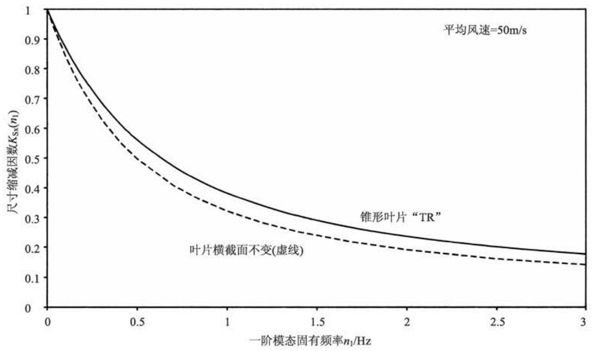

图 B. 2 缺少风载荷在沿长度为 ${40}\mathrm{\;m}$ 的叶片变化与频率的相关关系情况下的一阶模态共振响应的尺寸缩减因数

### B.5 叶根弯矩的共振

由于叶根的动态效应是至关重要的, 所以为满足设计要求, 增加了叶根弯矩。 一阶模态下叶根弯矩的标准偏差与稳态弯矩的比值可以由下式得出。

定义 ${M}_{1}\left( t\right)$ 为一阶模态下由于风况波动的叶根弯矩,可以得到

$$
{M}_{1}\left( t\right)  = {\int }_{0}^{R}m\left( r\right) {\ddot{x}}_{1}\left( {t, r}\right) r\mathrm{\;d}r = {\int }_{0}^{R}m\left( r\right) {\omega }_{1}^{2}{x}_{1}\left( {t, r}\right) r\mathrm{\;d}r
$$

$$
= {\omega }_{1}^{2}{f}_{1}\left( t\right) {\int }_{0}^{R}m\left( r\right) {\mu }_{1}\left( r\right) r\mathrm{\;d}r \tag{B. 26}
$$

由此, ${M}_{1}\left( t\right)$ 的标准差如下:

$$
{\sigma }_{\mathrm{M}1} = {\omega }_{1}^{2}{\sigma }_{\mathrm{x}1}{\int }_{0}^{R}m\left( r\right) {\mu }_{1}\left( r\right) r\mathrm{\;d}r \tag{B. 27}
$$

稳态叶根弯矩为

$$
\bar{M} = {\int }_{0}^{R}\frac{1}{2}\rho {\bar{U}}^{2}{C}_{\mathrm{f}}c\left( r\right) r\mathrm{\;d}r = \frac{1}{2}\rho {\bar{U}}^{2}{C}_{\mathrm{f}}{\int }_{0}^{R}c\left( r\right) r\mathrm{\;d}r \tag{B. 28}
$$

可以得到两者之比为

$$
\frac{{\sigma }_{\mathrm{{M1}}}}{\bar{M}} = \frac{{\omega }_{1}^{2}{\sigma }_{\mathrm{x}1}{\int }_{0}^{R}m\left( r\right) {\mu }_{1}\left( r\right) r\mathrm{\;d}r}{\frac{1}{2}\rho {\bar{U}}^{2}{C}_{\mathrm{f}}{\int }_{0}^{R}c\left( r\right) r\mathrm{\;d}r} \tag{B. 29}
$$

将式(B. 22)中的 ${\sigma }_{\mathrm{{x1}}}$ 表达式代入，可以得到

$$
\frac{{\sigma }_{M1}}{M}
$$

$$
= \frac{{\omega }_{1}^{2}\rho \overline{U}{C}_{t}\frac{\pi }{\sqrt{2\delta }}\frac{\sqrt{{n}_{1}{S}_{u}\left( {n}_{1}\right) }}{{k}_{1}}{\int }_{0}^{R}m\left( r\right) {\mu }_{1}\left( r\right) \mathrm{d}r\sqrt{{\int }_{0}^{R}{\int }_{0}^{R}\exp \left( {-C\left| {r - {r}^{\prime }}\right| {n}_{1}/\overline{U}}\right) c\left( r\right) c\left( {r}^{\prime }\right) {\mu }_{1}\left( r\right) {\mu }_{1}\left( {r}^{\prime }\right) \mathrm{d}r\mathrm{d}{r}^{\prime }}}{\frac{1}{2}\rho {\overline{U}}^{2}{C}_{t}{\int }_{0}^{R}c\left( r\right) r\mathrm{d}r}
$$

(B. 30)

注意到 ${R}_{\mathrm{u}}\left( n\right)  = n{S}_{\mathrm{u}}\left( n\right) /{\sigma }_{\mathrm{u}}^{2}$ 和 ${k}_{1} = {m}_{1}{\omega }_{1}^{2}{}^{\prime }$ ，上式可简化为

$$
\frac{{\sigma }_{\mathrm{M}1}}{\bar{M}} = 2\frac{{\sigma }_{\mathrm{u}}}{\bar{U}}\frac{\pi }{\sqrt{2\delta }}\sqrt{{R}_{\mathrm{u}}\left( n\right) }\frac{{\int }_{0}^{R}m\left( r\right) {\mu }_{1}\left( r\right) r\mathrm{\;d}r}{{m}_{1}{\int }_{0}^{R}c\left( r\right) r\mathrm{\;d}r}
$$

$$
\times  \sqrt{{\int }_{0}^{R}{\int }_{0}^{R}\exp \left( {-C\left| {r - {r}^{\prime }}\right| {n}_{1}/\bar{U}}\right) c\left( r\right) c\left( {r}^{\prime }\right) {\mu }_{1}\left( r\right) {\mu }_{1}\left( {r}^{\prime }\right) \mathrm{d}r\mathrm{\;d}{r}^{\prime }}
$$

(B. 31)

其中, ${m}_{1} = {\int }_{0}^{R}m\left( r\right) {\mu }_{1}^{2}\left( r\right) \mathrm{d}r$ ,是关于一阶模态下的广义质量,并且双重积分的指数部分允许缺乏与沿叶片风的波动的关联。用 ${\int }_{0}^{R}c\left( r\right) {\mu }_{1}\left( r\right) \mathrm{d}r{K}_{\mathrm{{Sx}}}\left( {n}_{1}\right)$ 代替双重积分的平方根, 利用式(B.25), 可以得出

$$
\frac{{\sigma }_{\mathrm{M}1}}{\bar{M}} = 2\frac{{\sigma }_{\mathrm{u}}}{\bar{U}}\frac{\pi }{\sqrt{2\delta }}\sqrt{{R}_{\mathrm{u}}\left( n\right) }\frac{{\int }_{0}^{R}m\left( r\right) {\mu }_{1}\left( r\right) r\mathrm{\;d}r}{{m}_{1}{\int }_{0}^{R}c\left( r\right) r\mathrm{\;d}r}\left\lbrack  {{\int }_{0}^{R}c\left( r\right) {\mu }_{1}\left( r\right) \mathrm{d}r}\right\rbrack  \sqrt{{K}_{\mathrm{{Sx}}}\left( {n}_{1}\right) }
$$

(B. 32)

定义积分的比例为

$$
\frac{{\int }_{0}^{R}m\left( r\right) {\mu }_{1}\left( r\right) r\mathrm{\;d}r}{{m}_{1}{\int }_{0}^{R}c\left( r\right) r\mathrm{\;d}r}\left\lbrack  {{\int }_{0}^{R}c\left( r\right) {\mu }_{1}\left( r\right) \mathrm{d}r}\right\rbrack   = \frac{\frac{{\sigma }_{\mathrm{M}1}}{M}}{\frac{{\sigma }_{\mathrm{x}1}}{{\bar{x}}_{1}}} \tag{B. 33}
$$

作为 ${\lambda }_{\mathrm{M}1}$ ，可以得到

$$
\frac{{\sigma }_{\mathrm{M}1}}{\bar{M}} = 2\frac{{\sigma }_{\mathrm{u}}}{\bar{U}}\frac{\pi }{\sqrt{2\delta }}\sqrt{{R}_{\mathrm{u}}\left( {n}_{1}\right) }\sqrt{{R}_{\mathrm{{Sx}}}\left( {n}_{1}\right) }{\lambda }_{\mathrm{M}1} \tag{B. 34}
$$

### B.6 叶根弯矩的背景效应

叶根弯矩的背景效应可以用包括响应在内的叶根弯矩的标准差来表示。如果风是紧贴叶片的话，它可以由下式给出:

$$
{\sigma }_{\mathrm{{MB}}} = {C}_{\mathrm{f}}\rho \bar{U}{\sigma }_{\mathrm{u}}{\int }_{0}^{R}c\left( r\right) r\mathrm{\;d}r \tag{B. 35}
$$

然而, 如果将沿叶片风的波动的关联关系考虑在内, 可以得到

$$
{\sigma }_{\mathrm{{MB}}} = {C}_{\mathrm{f}}\rho \bar{U}{\sigma }_{\mathrm{u}}\sqrt{{\int }_{0}^{R}{\int }_{0}^{R}{\rho }_{\mathrm{u}}\left( {r - {r}^{\prime }}\right) c\left( r\right) c\left( {r}^{\prime }\right) r{r}^{\prime }\mathrm{d}r\mathrm{\;d}{r}^{\prime }} \tag{B. 36}
$$

式中, ${\rho }_{\mathrm{u}}\left( {r - {r}^{\prime }}\right)$ 为不同叶片半径在同步风速波动下的正交对比方程,并且定义如下:

$$
{\rho }_{\mathrm{u}}\left( {r - {r}^{\prime }}\right)  = \frac{1}{{\sigma }_{\mathrm{u}}^{2}}E\left\lbrack  {u\left( {r, t}\right) u\left( {{r}^{\prime }, t + \tau }\right) }\right\rbrack \tag{B. 37}
$$

其中, $\tau$ 被设置为 0,测量表明该方程是成指数递减的。因此,它也可以用下式来表示:

$$
{\rho }_{\mathrm{u}}\left( {r - {r}^{\prime }}\right)  = \exp \left( {-\left| {r - {r}^{\prime }}\right| /{L}_{u}^{r}}\right) \tag{B. 38}
$$

式中, ${L}_{u}^{r}$ 为沿叶片风向所测得的纵向波动部分的积分长度尺度,将其定义为: ${\int }_{0}^{\infty }{\rho }_{u}\left( {r - r}\right) \mathrm{d}\left( {r - {r}^{\prime }}\right)$ 。如果垂直方向测得的该值 ${L}_{u}^{x}$ 比水平方向 ${L}_{u}^{y}$ 小,那么保守地来讲，可以将 ${L}_{u}^{r}$ 认为与水平方向的 ${L}_{u}^{y}$ 值相等，即 ${L}_{u}^{r} = {L}_{u}^{y}$ 。一般来讲， ${L}_{u}^{y}$ 大约为 ${L}_{u}^{y}$ 的 ${30}\% ,{L}_{u}^{r}$ 为沿风向所测量的值。考虑到

$$
\bar{M} = \frac{1}{2}\rho {\bar{U}}^{2}{C}_{\mathrm{f}}{\int }_{0}^{R}c\left( r\right) r\mathrm{\;d}r
$$

可以得到

$$
\frac{{\sigma }_{\mathrm{{MB}}}}{\bar{M}} = 2\frac{{\sigma }_{\mathrm{u}}}{\bar{U}}\sqrt{{K}_{\mathrm{{SMB}}}} \tag{B. 39}
$$

式中, ${K}_{\mathrm{{SMB}}}$ 为叶根弯矩效应的幅值减小系数,将其定义为

$$
{K}_{\mathrm{{SMB}}} = \frac{{\int }_{0}^{R}{\int }_{0}^{R}\exp \left( {-\left| {r - {r}^{\prime }}\right| /{0.3}{L}_{u}^{x}}\right) c\left( r\right) c\left( {r}^{\prime }\right) r{r}^{\prime }\mathrm{d}r\mathrm{\;d}{r}^{\prime }}{{\left\lbrack  {\int }_{0}^{R}c\left( r\right) r\mathrm{\;d}r\right\rbrack  }^{2}} \tag{B. 40}
$$

对于同一长度弦长的叶片来说，该积分值可以直接得到

$$
{K}_{\mathrm{{SMB}}} = 4\left\lbrack  {\frac{2}{3\phi } - \frac{1}{{\phi }^{2}} + \frac{2}{{\phi }^{4}} - \exp \left( {-\phi }\right) \left( {\frac{2}{{\phi }^{3}} + \frac{2}{{\phi }^{4}}}\right) }\right\rbrack  ,\;\phi  = \frac{R}{{0.3}{L}_{u}^{x}} \tag{B. 41}
$$

举例说明,在 $R = {40}\mathrm{\;m}$ 和 ${L}_{u}^{x} = {189}\mathrm{\;m}$ 情况下, ${K}_{\mathrm{{SMB}}}$ 等于 0.837 。这说明,忽略风波动相关性的影响是微小的。

对于正常的渐短弦长的叶片来说， ${K}_{\mathrm{{SMB}}}$ 可以精确地计算得出。如果叶片尖端弦长是最大弦长的 ${33}\% ,{K}_{\mathrm{{SMB}}} = {0.829}$ ，和前面的 $\phi$ 值相同，则说明形对叶片的影响是可以忽略的。

### B.7 峰值效应

在叶片设计中一个关键的参数就是叶片最大扭矩。将该扭矩看作一个高斯过程, Davenport(1964)给出了期望值同平均值的最大偏差,是标准差同峰值系数 $g$ 的乘积, 其中

$$
g = \sqrt{2\ln \left( {\nu T}\right) } + \frac{0.5772}{\sqrt{2\ln \left( {\nu T}\right) }} \tag{B. 42}
$$

式中, $\nu$ 为叶根弯矩波动的平均零穿透频率; $T$ 为平均风速时间。同叶尖位移一样处理, 叶根弯矩的方差等于背景和共振叶根弯矩响应方差的和, 即为

$$
{\sigma }_{\mathrm{M}}^{2} = {\sigma }_{\mathrm{{MB}}}^{2} + {\sigma }_{\mathrm{M}1}^{2} \tag{B. 43}
$$

由此, 从式 (B. 39) 和式 (B. 34) 可得

$$
{\sigma }_{\mathrm{M}}^{2} = {\sigma }_{\mathrm{{MB}}}^{2} + {\sigma }_{\mathrm{M}1}^{2} = 4{\bar{M}}^{2}\frac{{\sigma }_{\mathrm{u}}^{2}}{{\bar{U}}^{2}}\left\lbrack  {{K}_{\mathrm{{SMB}}} + \frac{{\pi }^{2}}{2\delta }{R}_{\mathrm{u}}\left( {n}_{1}\right) {K}_{\mathrm{{Sx}}}\left( {n}_{1}\right) {\lambda }_{M1}^{2}}\right\rbrack \tag{B. 44}
$$

这样

$$
{M}_{\max } = \bar{M} + g{\sigma }_{\mathrm{M}} = \bar{M}\left\lbrack  {1 + {2g}\frac{{\sigma }_{\mathrm{u}}}{\bar{U}}\sqrt{{K}_{\mathrm{{SMB}}} + \frac{{\pi }^{2}}{2\delta }{R}_{\mathrm{u}}\left( {n}_{1}\right) {K}_{\mathrm{{Sx}}}\left( {n}_{1}\right) {\lambda }_{M1}^{2}}}\right\rbrack
$$

(B. 45)

叶根弯矩平均零穿透频率 $\nu$ 定义为

$$
\nu  = \sqrt{\frac{{\int }_{0}^{\infty }{n}^{2}{S}_{\mathrm{M}}\left( n\right) \mathrm{d}n}{{\int }_{0}^{\infty }{S}_{\mathrm{M}}\left( n\right) \mathrm{d}n}} \tag{B. 46}
$$

式中, ${S}_{\mathrm{M}}\left( n\right)$ 为叶根弯矩波动的频谱。如果将一阶模态下在频率 ${n}_{1}$ 的共振响应中的背景效应的频谱剔除, 式 (B. 46) 就可以写成

$$
\nu  = \sqrt{\frac{\left\lbrack  {{\int }_{0}^{\infty }{n}^{2}{S}_{\mathrm{{MB}}}\left( n\right) \mathrm{d}n}\right\rbrack   + {n}_{1}^{2}{\sigma }_{\mathrm{M}1}^{2}}{{\sigma }_{\mathrm{{MB}}}^{2} + {\sigma }_{\mathrm{M}1}^{2}}} \tag{B. 47}
$$

则

$$
{S}_{\mathrm{{MB}}}\left( n\right)  = {\left( {C}_{\mathrm{f}}\rho \bar{U}\right) }^{2}{S}_{\mathrm{u}}\left( n\right) {\int }_{0}^{R}{\int }_{0}^{R}{\psi }_{uu}^{N}\left( {r,{r}^{\prime }, n}\right) c\left( r\right) c\left( {r}^{\prime }\right) r{r}^{\prime }\mathrm{d}r\mathrm{\;d}{r}^{\prime } \tag{B. 48}
$$

$$
\bar{M} = {C}_{\mathrm{f}}\frac{1}{2}\rho {\bar{U}}^{2}{\int }_{0}^{R}c\left( r\right) r\mathrm{\;d}r \tag{B. 49}
$$

由此

$$
{S}_{\mathrm{{MB}}}\left( n\right)  = 4\frac{{\bar{M}}^{2}}{{\bar{U}}^{2}}\frac{{S}_{\mathrm{u}}\left( n\right) {\int }_{0}^{R}{\int }_{0}^{R}{\psi }_{uu}^{N}\left( {r,{r}^{\prime }, n}\right) c\left( r\right) c\left( {r}^{\prime }\right) r{r}^{\prime }\mathrm{d}r\mathrm{\;d}{r}^{\prime }}{{\left\lbrack  {\int }_{0}^{R}c\left( r\right) r\mathrm{\;d}r\right\rbrack  }^{2}} \tag{B. 50}
$$

定义

$$
{K}_{\mathrm{{SMB}}}\left( n\right)  = \frac{{\int }_{0}^{R}{\int }_{0}^{R}{\psi }_{uu}^{N}\left( {r,{r}^{\prime }, n}\right) c\left( r\right) c\left( {r}^{\prime }\right) r{r}^{\prime }\mathrm{d}r\mathrm{\;d}{r}^{\prime }}{{\left\lbrack  {\int }_{0}^{R}c\left( r\right) r\mathrm{\;d}r\right\rbrack  }^{2}} \tag{B. 51}
$$

可得

$$
{S}_{\mathrm{{MB}}}\left( n\right)  = 4\frac{{\bar{M}}^{2}}{{\bar{U}}^{2}}{S}_{\mathrm{u}}\left( n\right) {K}_{\mathrm{{SMB}}}\left( n\right) \tag{B. 52}
$$

将式(B. 47)代入得

$$
\nu  = \sqrt{\frac{\frac{{\bar{M}}^{2}}{{\bar{U}}^{2}}\left\lbrack  {{\int }_{0}^{\infty }{n}^{2}{S}_{\mathrm{u}}\left( n\right) {K}_{\mathrm{{SMB}}}\left( n\right) \mathrm{d}n}\right\rbrack   + {n}_{1}^{2}{\sigma }_{\mathrm{M}1}^{2}}{{\sigma }_{\mathrm{M}\mathrm{B}}^{2} + {\sigma }_{\mathrm{M}1}^{2}}} \tag{B. 53}
$$

注意到式 (B. 52) 中 ${\sigma }_{\mathrm{{MB}}}^{2} = 4\left( {{\bar{M}}^{2}/{\bar{U}}^{2}}\right) {S}_{\mathrm{u}}\left( n\right) {K}_{\mathrm{{SMB}}}\left( n\right) \mathrm{d}n,\nu$ 的表达式变为

$$
\nu  = \sqrt{\frac{{n}_{0}^{2}{\sigma }_{\mathrm{{MB}}}^{2} + {n}_{1}^{2}{\sigma }_{\mathrm{M}1}^{2}}{{\sigma }_{\mathrm{{MB}}}^{2} + {\sigma }_{\mathrm{M}1}^{2}}} \tag{B. 54}
$$

其中

$$
{n}_{0} = \frac{{\int }_{0}^{\infty }{n}^{2}{S}_{\mathrm{u}}\left( n\right) {K}_{\mathrm{{SMB}}}\left( n\right) \mathrm{d}n}{{\int }_{0}^{\infty }{S}_{\mathrm{u}}\left( n\right) {K}_{\mathrm{{SMB}}}\left( n\right) \mathrm{d}n} \tag{B. 55}
$$

将 ${\psi }_{uu}^{N}\left( {r,{r}^{\prime }, n}\right)  = \exp \left\lbrack  {-C\left( {r - {r}^{\prime }}\right) n/\bar{U}}\right\rbrack$ 代入 ${K}_{\mathrm{{SMB}}}\left( n\right)$ 的表达式 (B. 55) 中得到

$$
{\int }_{0}^{\infty }{n}^{2}{S}_{\mathrm{u}}\left( n\right) {K}_{\mathrm{{SMB}}}\left( n\right) \mathrm{d}n
$$

$$
= {\int }_{0}^{\infty }{n}^{2}{S}_{\mathrm{u}}\left( n\right) \frac{{\int }_{0}^{R}{\int }_{0}^{R}\exp \left\lbrack  {-C\left( {r - {r}^{\prime }}\right) n/\bar{U}}\right\rbrack  c\left( r\right) c\left( {r}^{\prime }\right) r{r}^{\prime }\mathrm{d}r\mathrm{\;d}{r}^{\prime }}{{\left\lbrack  {\int }_{0}^{R}c\left( r\right) r\mathrm{\;d}r\right\rbrack  }^{2}}\mathrm{\;d}n \tag{B. 56}
$$

在高频情况下, 在极限范围内, 双重积分值同频率是成反比的, 因此, 被积分函数 ${n}^{2}{S}_{\mathrm{u}}\left( n\right) {K}_{\mathrm{{SMB}}}\left( n\right)$ 同 ${n}^{2}{n}^{-5/3}{n}^{-1} = {n}^{-2/3}$ 成正比,并且积分是不收敛的。因此,有必要将高频时同风速波动关联性的缺失考虑进来。这样就可以发现在极限范围内, 被积分函数同 ${n}^{-5/3}$ 成正比，并且是有限的。该积分的计算是十分困难的，因此，最好的办法就是对频率 ${n}_{0}$ 采取一种近似的公式计算，特别是在该频率 ${n}_{0}$ 对于峰值系数 $g$ 的影响比较小时。在欧洲标准 $1\left( {1997}\right)$ 中给出了一种计算公式。但 Dyrbye 和 Hansen 在 1997 年给出了一种关于等截面悬臂梁的更简单的计算公式, 如下表示:

$$
{n}_{0} = {0.3}\frac{\bar{U}}{\sqrt{{L}_{u}^{x}\sqrt{Rc}}} \tag{B. 57}
$$

式中, $R$ 为叶尖半径; $c$ 为弦长,都假设其为恒值。对于锥形叶片,可用平均弦长取代。

### B.8 叶片中部的弯矩

#### 1 背景效应

将 ${\sigma }_{\mathrm{{MB}}}\left( {r}^{ * }\right)$ 作为半径为 ${r}^{ * }$ 时准静态或背景弯矩波动时的标准差,显然,

$$
\frac{{\sigma }_{\mathrm{{MB}}}\left( {r}^{ * }\right) }{{\sigma }_{\mathrm{{MB}}}\left( 0\right) } = \sqrt{\frac{{K}_{\mathrm{{SMB}}}\left( {r}^{ * }\right) }{{K}_{\mathrm{{SMB}}}\left( 0\right) }}\frac{{\int }_{{r}^{ * }}^{R}c\left( r\right) \left( {r - {r}^{ * }}\right) \mathrm{d}r}{{\int }_{0}^{R}c\left( r\right) r\mathrm{\;d}r} \tag{B. 58}
$$

在半径为 ${r}^{ * }$ 的稳态弯矩同叶根弯矩的比值是 ${\int }_{r}^{R * }c\left( r\right) \left( {r - {r}^{ * }}\right) \mathrm{d}r/{\int }_{0}^{R}c\left( r\right) r\mathrm{\;d}r$ , 因此,半径 ${r}^{ * }$ 准稳态扰动的标准差同稳态的比值为

$$
\frac{{\sigma }_{\mathrm{{MB}}}\left( {r}^{ * }\right) }{\bar{M}\left( {r}^{ * }\right) } = \frac{{\sigma }_{\mathrm{{MB}}}\left( {r}^{ * }\right) }{{\sigma }_{\mathrm{{MB}}}\left( 0\right) }\frac{{\sigma }_{\mathrm{{MB}}}\left( 0\right) }{\bar{M}\left( 0\right) }\frac{\bar{M}\left( 0\right) }{\bar{M}\left( {r}^{ * }\right) } = \frac{{\sigma }_{\mathrm{{MB}}}\left( 0\right) }{\bar{M}\left( 0\right) }\sqrt{\frac{{K}_{\mathrm{{SMB}}}\left( {r}^{ * }\right) }{{K}_{\mathrm{{SMB}}}\left( 0\right) }} \tag{B. 59}
$$

一般来说，平方根值接近于 1 ，因此，该比值将接近于常值。

#### 1 共振效应

由 B. 5 中的内容可以知道，叶根弯矩在一阶模态中的标准差等于 ${\omega }_{1}^{2}{\sigma }_{x1}{\int }_{0}^{R}m\left( r\right) {\mu }_{1}\left( r\right) r\mathrm{\;d}r$ 。对于其他半径的对应的特性,同样可以得到如下公式:

$$
{\sigma }_{\mathrm{M}1}\left( {r}^{ * }\right)  = {\omega }_{1}^{2}{\sigma }_{\mathrm{x}1}{\int }_{{r}^{ * }}^{R}m\left( r\right) {\mu }_{1}\left( r\right) \left( {r - {r}^{ * }}\right) \mathrm{d}r \tag{B. 60}
$$

因此,半径为 ${r}^{ * }$ 时的标准差同稳态数值的比为

$$
\frac{{\sigma }_{\mathrm{M}1}\left( {r}^{ * }\right) }{\bar{M}\left( {r}^{ * }\right) } = \frac{{\sigma }_{\mathrm{M}1}\left( {r}^{ * }\right) }{{\sigma }_{\mathrm{M}1}\left( 0\right) }\frac{{\sigma }_{\mathrm{M}1}\left( 0\right) }{\bar{M}\left( 0\right) }\frac{\bar{M}\left( 0\right) }{\bar{M}\left( {r}^{ * }\right) }
$$

$$
= \frac{{\int }_{{r}^{ * }}^{R}m\left( r\right) {\mu }_{1}\left( r\right) \left( {r - {r}^{ * }}\right) \mathrm{d}r}{{\int }_{0}^{R}m\left( r\right) {\mu }_{1}\left( r\right) r\mathrm{\;d}r}\frac{{\int }_{0}^{R}c\left( r\right) r\mathrm{\;d}r}{{\int }_{{r}^{ * }}^{R}c\left( r\right) \left( {r - {r}^{ * }}\right) \mathrm{d}r}\frac{{\sigma }_{\mathrm{M}1}\left( 0\right) }{\bar{M}\left( 0\right) }
$$

(B. 61)

## 参考文献

Cramer, H.E. (1958) Use of power spectra and scales of turbulence in estimating wind loads, Second National Conference on Applied Meteororlogy, Ann Arbor, Michigan, USA.

Davenport, A.G. (1962) The response of slender, line-like structures to a gusty wind. Proc. Inst. Civ. Eng., 23, 389-408.

Davenport, A.G. (1964) Note on the distribution of the largest value of a random function with application to gust loading. Proc. Inst. Civ. Eng., 28, 187-196.

Dyrbye, C., and Hansen, S.O (1997) Wind loads on structures. John Wiley and Sons.

Eurocode 1 (2005) Actions on structures - Part 1-4: General actions - Wind actions (EN 1991-1-4: 2005)

Harris, R.I. (1971) The nature of the wind. Proceedings of the CIRIA Conference, pp 29-55.

Krenk, S. (1995) Wind field coherence and dynamic wind forces. Symposium on the advances in Non-linear Stochastic Mechanics. Kluwer, Dordrecht, Germany.

Mann, J. (1994) The spatial structure of neutral atmospheric surface-layer turbulence. J. Ind. Aerodyn., 1, 167-175.

Newland, D.E. (1984) Random vibrations and spectral analysis. Longman, UK.

Wyatt, T.A. (1980). The dynamic behaviour of structures subject to gust loading. Proceedings of the CIRIA Conference, "Wind engineering in the eighties" pp. 6-1-6-22.

