# 第 6 章 水平轴风力机的 概念设计

## 6.1 简 介

一般用于并网发电的水平轴风力机，在机械结构、功率控制策略和制动系统等方面具有多种选择方案。本章着眼于不同的设计选择，并考虑在每种情况下传统选择的利与弊。考虑某个方面所作出的决定会对另一个方面有所影响, 这种影响有时候是不可避免的, 将在后文讲解该内容。

除了这些特殊的设计选择，许多基本设计参数必须在设计初期确定，如风轮直径、额定功率和风轮转速等。而那些用于数学优化计算的连续变量，在本章开篇也会做相应的介绍。

风能——事实(2009)给出了风力机设计的启发性的概述，包括电源控制策略和特定厂商采用的传动系统配置，由欧洲风能协会发布。

## 6.2 风轮直径

究竟需要多大容量的风力发电机组才能使发电的成本最小化，这个问题已经持续争论了很长时间。大型风力发电机组的支持者喜欢引用规模经济的理论以及风速随高度增加而增加的原则来论证他们的观点; 另一个阵营则引用了“平方立方法则”, 即获得的能量随风轮直径的平方增加而增加, 而风轮质量 (同时也是成本) 随其立方而增加, 这是该阵营的支持者所提出的观点。

事实上, 这两个观点都是正确的, 而且在规模经济和考虑风切变效应的 “平方立方法则”变量之间存在折中。这种折中可以通过简单的成本模型来进行研究，下面就来讲解这个问题。

### 6.2.1 成本模型

电能成本对风力发电机组设计参数变化的敏感度可以通过相应部件成本变化的模型来进行研究。一般程序是从一个基准方案开始, 其中各种部件的成本是已知的。经过进一步严格分析, 将不同的值分配给所选的参数, 从而产生新的方案, 得出修正后的部件重量, 基于此重量, 即可计算出新的部件成本。

一般地,部件的成本不会简单地根据质量成比例增加,而是会包含较慢的增加因素。典型的例子是塔架表面的保护涂层，如果所有尺寸与高度成比例发生变化， 那么涂层成本的增长近似为架高度的平方。如果考虑到设计参数的变化只有 ±50%，它通常可以十分准确地将部件成本和质量的关系表现为带有固定分量的线性关系:

$$
C\left( x\right)  = {C}_{\mathrm{B}}\left\lbrack  {\mu \frac{m\left( x\right) }{{m}_{\mathrm{B}}} + \left( {1 - \mu }\right) }\right\rbrack \tag{6.1}
$$

其中,当设计参数为 $x$ 时, $C\left( x\right)$ 和 $m\left( x\right)$ 为部件的成本和质量, ${C}_{\mathrm{B}}$ 和 ${m}_{\mathrm{B}}$ 是基准值; $\mu$ 是随质量变化的比例系数，在大小不同的基准风力机中，它将明显不同。

考虑到生产成本会随产品生产规模的变化而发生改变, $\mu$ 值的选择需要相当多的经验,但在产品开发的早期阶段,要做到这一点是有局限性的。因此,耗费精力为不同的设计参数值研究新的设计方案可能是没有意义的，所以 $\mu$ 值的确定方法一般是基于相似的关系按比例得到的。这种方法适用于下面对最佳风力机大小的研究。

### 6.2.2 风力机大小最优化的简化成本模型实例

选用风轮直径为 ${60}\mathrm{\;m}$ 、 ${1.5}\mathrm{{MW}}$ 的风力发电机组作为基准风力发电机组设计, 各个部分的成本取自 Fuglsang 和 Thomsen(1998) 的 Risø 出版的“大型海上风电场风力发电机组的成本优化(Risø-R-1000)”。表 6.1 中给出了各个部件成本占总成本的百分比。

表 6.1 1.5MW, 60m 直径陆上风力发电机组

各部分价格百分比 (Fuglsang and Thomsen, 1998)

<table><tr><td>部件</td><td>占总成本的百分比/%</td><td>部件</td><td>占总成本的百分比/%</td></tr><tr><td>叶片</td><td>18.3</td><td>塔架</td><td>17.5</td></tr><tr><td>轮毂</td><td>2.5</td><td>制动系统</td><td>1.7</td></tr><tr><td>主轴</td><td>4.2</td><td>地基</td><td>4.2</td></tr><tr><td>齿轮箱</td><td>12.5</td><td>安装</td><td>2.1</td></tr><tr><td>发电机</td><td>7.5</td><td>运输</td><td>2.0</td></tr><tr><td>机舱</td><td>10.8</td><td>电网接入</td><td>8.3</td></tr><tr><td>偏航系统</td><td>4.2</td><td>总成本</td><td>100</td></tr><tr><td>控制器</td><td>4.2</td><td></td><td></td></tr></table>

其他直径风力机的结构数据是根据基准机型将部件尺寸按相同比例缩放而得到的, 但是其中不包括齿轮箱、发电机、电网接入和控制器。风轮转速和风轮直径成反比, 以维持叶尖速度恒定, 从而保证了在给定风速下叶尖速比的恒定。

这样, 所有机组的设计都可以在相同的风速下达到额定功率, 所以额定功率与风轮直径的平方成比例。因此, 低速轴的转矩增加与风轮直径的立方成正比, 这是齿轮箱质量随风轮直径立方增加的依据，尽管齿轮箱的速比是变化的。因此，如果为了简化, $\mu$ 的综合值取为 0.9,那么对于一台风轮直径为 $D$ 的风力机,除了发电机、控制器和电网接入以外的成本是

$$
{C}_{1}\left( D\right)  = {0.8}{C}_{\mathrm{T}}\left( {60}\right) \left\lbrack  {{0.9}{\left( \frac{D}{60}\right) }^{3} + {0.1}}\right\rbrack \tag{6.2}
$$

式中, ${C}_{\mathrm{T}}\left( {60}\right)$ 为基准风力机的总成本。

发电机的额定容量和电网接入只与风轮直径的平方成比例。假设式 (6.1) 适用于这些部件的成本计算,但需要用额定容量代替重量。如果 $\mu$ 仍然取为 0.9,则发电机和并网设备的成本为

$$
{C}_{2}\left( D\right)  = {0.158}{C}_{\mathrm{T}}\left( {60}\right) \left\lbrack  {{0.9}{\left( \frac{D}{60}\right) }^{2} + {0.1}}\right\rbrack \tag{6.3}
$$

假设控制器的成本固定, 则风力发电机组的最终成本表示为风轮直径的函数就是

$$
{C}_{\mathrm{T}}\left( D\right)  = {C}_{\mathrm{T}}\left( {60}\right) \left\{  {{0.8}\left\lbrack  {{0.9}{\left( \frac{D}{60}\right) }^{3} + {0.1}}\right\rbrack   + {0.158}\left\lbrack  {{0.9}{\left( \frac{D}{60}\right) }^{2} + {0.1}}\right\rbrack   + {0.042}}\right\}
$$

$$
= {C}_{\mathrm{T}}\left( {60}\right) \left\lbrack  {{0.72}{\left( \frac{D}{60}\right) }^{3} + {0.142}{\left( \frac{D}{60}\right) }^{2} + {0.1378}}\right\rbrack \tag{6.4}
$$

由于假设塔架高度以及其他相关的尺寸都与风轮直径成比例增加, 在轮毂高度位置的年平均风速会由于风切变的影响而随叶轮直径的增加而增高, 因此, 这对发电量有显著影响, 因为每单位的扫掠面积的发电量随年平均风速而变化, 在此列中,扰动有关的年平均风速中间值取 $8\mathrm{\;m}/\mathrm{s}$ ,每单位扫掠面积的发电量提高到 1.9 的幂。于是发电成本(除去运行和维护的费用)就可以通过用风力发电机组的成本除以年产量来计算,并以 $\left( {\mathrm{\text{ € }}/\mathrm{{kW}} \cdot  \mathrm{h}}\right) /\mathrm{a}$ 为单位。发电成本随直径的变化可以根据上面的假设计算出来,在图 6.1 中绘出了两级的风切变,对应于粗糙度 ${z}_{0}$ 为 0.001m 和 0.05m。根据这种关系，轮毂高度位置的平均风速可以按比例得到(见 2.6.2 节)。

$$
\bar{U}\left( z\right)  \propto  \ln \left( {z/{z}_{0}}\right)
$$

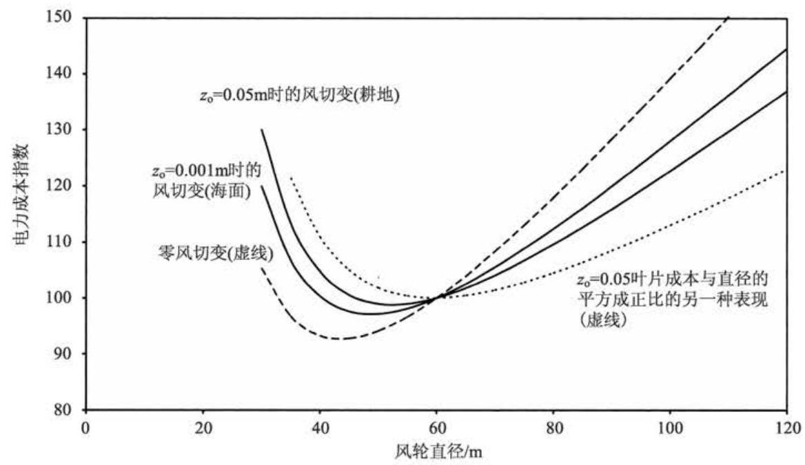

图 6.1 基于简化成本模型的最佳的风轮尺寸随风切变的变化 (假设轮毂高度等于直径)

同时, 图 6.1 中还绘出了零风切变时的曲线。显然, 风切变的等级对最佳风轮直径有显著的影响, 风轮直径从零风切变时的 44m 变化到 52m, 此时对应的表面粗糙度为 ${0.05}\mathrm{\;m}$ ,后者应用于带边界树篱的农场和临时建筑。严格地说,随轮毂高度增加而增加的年平均风速对风轮和其他部件的疲劳设计影响也应该计算到成本中, 这样可以稍微减小最佳风力机尺寸的大小。

必须强调的是,由上面的论证可知,最佳尺寸取决于 $\mu$ 的取值。举例来说,如果 $\mu$ 的取值由 0.9 变成 0.8,则零风切变条件下的最佳风轮直径将增至 ${64}\mathrm{\;m}$ ,尽管最小发电成本仅改变了 ${0.9}\%$ 。更为复杂的方法是对不同部件应该取不同的 $\mu$ 值, Fuglsang 和 Thomsen(1998) 便采用这种方法。在理想的情况下, 这些都以构造相同但尺寸不同的部件的成本数据为基础。

对于选定的风力机方案，上述的成本模型为研究风力机设计经济性的比例效应提供了直接的方法。实际上, 对不同大小的风电机组使用不同材料或不同结构可能证明更经济,并且将产生一系列可供选择的成本风轮直径曲线。

技术发展对简单缩放规则影响的一个例子是特定叶片质量轨迹一定义为叶片质量除以风力机直径的立方—随着时间的推移, 需要更长叶片的设计。图 6.2 展示了 LM Glasfiber 制造并于 2004 年应用的特定叶片质量对叶片直径的图。

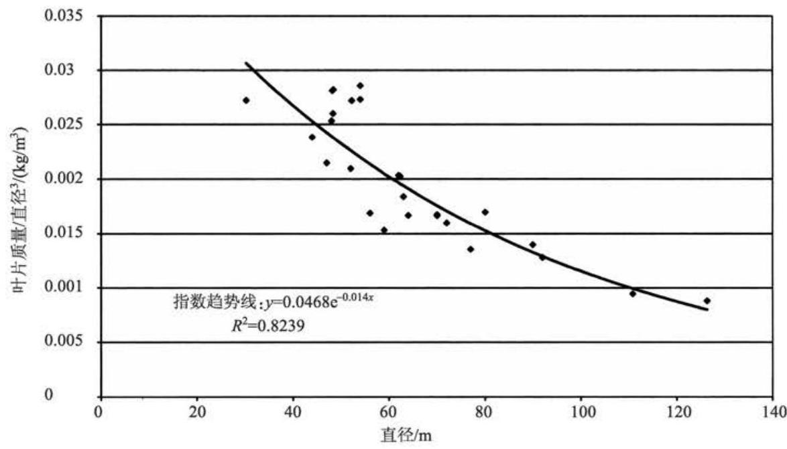

图 6.2 2004 年应用的 LM 叶片的特定叶片质量与直径的变化

可以看到, 特定的叶片质量与直径大致成反比, 也就是说, 叶片质量随着直径的平方增加, 而不是直径的立方。特定叶片质量的下降部分是因为蒙皮厚度较低的实际限制，导致较小叶片比它们反之需要的更重。

叶片成本模型采用的叶片成本缩放规则很明显地对最佳风轮直径有决定性影响(在风切变情况下表面粗糙度为 ${0.05}\mathrm{\;m}$ ),当叶片成本以直径的平方缩放时,最佳风轮直径从 ${52}\mathrm{\;m}$ 增加到 ${59}\mathrm{\;m}$ ，如图 6.1 中的虚线所示。

### 6.2.3 NREL 成本模型

在“风电机组设计成本和缩放模型”NREL(2006)的研究报告中，总结了一组对风力机配置有用的质量和成本缩放规则，可以作为判断各个组件设计创新的基准。旨在缩放规则随着时间的推移更新作为附加数据可用。

基准风力机设计是 ${70}\mathrm{\;m}$ 直径、 1.5MW 变速变桨距调节机组，配有三级行星齿轮。许多缩放规则与上一节列出的类似,主要区别如下所示:

(1)叶片成本被分为数量相同的材料和做工成本，前者随直径的立方 ${D}^{3}$ 缩放，而后者随 ${D}^{2.5}$ 缩放。

(2)变速箱成本随 ${D}^{2.5}$ 缩放，而不是 ${D}^{3}$ 。

(3)机舱成本随 ${D}^{1.95}$ 缩放，而不是 ${D}^{3}$ 。

(4)建立成本随 ${D}^{1.2}$ 缩放，而不是 ${D}^{3}$ 。

(5)传输成本的一个元素随直径的六次方的提高而提高。

表 6.2 展示了 2005 年基准风力机部件成本 (美元) 和各自总数的百分比, 同样展示了前节中的适用于 ${60}\mathrm{\;m}$ 直径、 1.5MW 机组对应的百分比。不过,在部件定义可能有所不同的情况下进行比较应谨慎。

表 6.2 NREL 的 1.5MW，70m 直径的基准风力机的部件成本和百分比

<table><tr><td></td><td>1.5MW, 70m 直径 NREL 基准风力机 (轮毂高度 70m) 的部件成本 \$ 1000(2005)</td><td>NREL 基准风力机部件的成本百分比</td><td>Risø-R-1000 1.5MW, 60m 直径风力机的成本百分比</td></tr><tr><td>叶片</td><td>151</td><td>11.4%</td><td>18.3%</td></tr><tr><td>轮毂</td><td>47</td><td>3.6%</td><td>2.9%</td></tr><tr><td>变桨轴承和机械</td><td>56</td><td>4.3%</td><td>N/A</td></tr><tr><td>低速轴和主轴承</td><td>33</td><td>2.5%</td><td>4.2%</td></tr><tr><td>变速器</td><td>152</td><td>11.6%</td><td>12.9%</td></tr><tr><td>发电机</td><td>98</td><td>7.4%</td><td>7.5%</td></tr><tr><td>变流器</td><td>119</td><td>9.0%</td><td>N/A</td></tr><tr><td>机舱</td><td>119</td><td>8.9%</td><td>10.8%</td></tr><tr><td>偏航驱动器和轴承</td><td>20</td><td>1.5%</td><td>4.2%</td></tr><tr><td>控制系统</td><td>35</td><td>2.7%</td><td>4.2%</td></tr><tr><td>塔基</td><td>158</td><td>12.0%</td><td>17.5%</td></tr><tr><td>刹车和 HS 耦合</td><td>3</td><td>0.2%</td><td>1.7%</td></tr><tr><td>地基</td><td>47</td><td>3.6%</td><td>4.2%</td></tr><tr><td>装配及安装</td><td>42</td><td>3.2%</td><td>2.1%</td></tr><tr><td>运输</td><td>51</td><td>3.9%</td><td>2.0%</td></tr><tr><td>电气连接包括电网接入</td><td>187</td><td>14.2%</td><td>8.3%</td></tr><tr><td></td><td>1317</td><td>100%</td><td>100%</td></tr></table>

图 6.3 给出了基于上述机组 NREL 成本模型, 发电成本随风力机直径的变化。在 ${50}\mathrm{\;m}$ 高度的年平均风速取 ${7.25}\mathrm{\;m}/\mathrm{s}$ ,并且据功率法则 $\bar{U}\left( z\right)  = \bar{U}\left( {50}\right) {\left( z/{50}\right) }^{0.14}$ 假设风速随着轮毂高度变化。同以前一样，轮毂高度等于风力机直径，在所有情况下的额定风速为 ${11.55}\mathrm{m}/\mathrm{s}$ 。风力机寿命一般是 20 年，有 ${10}\%$ 的使用折旧率。

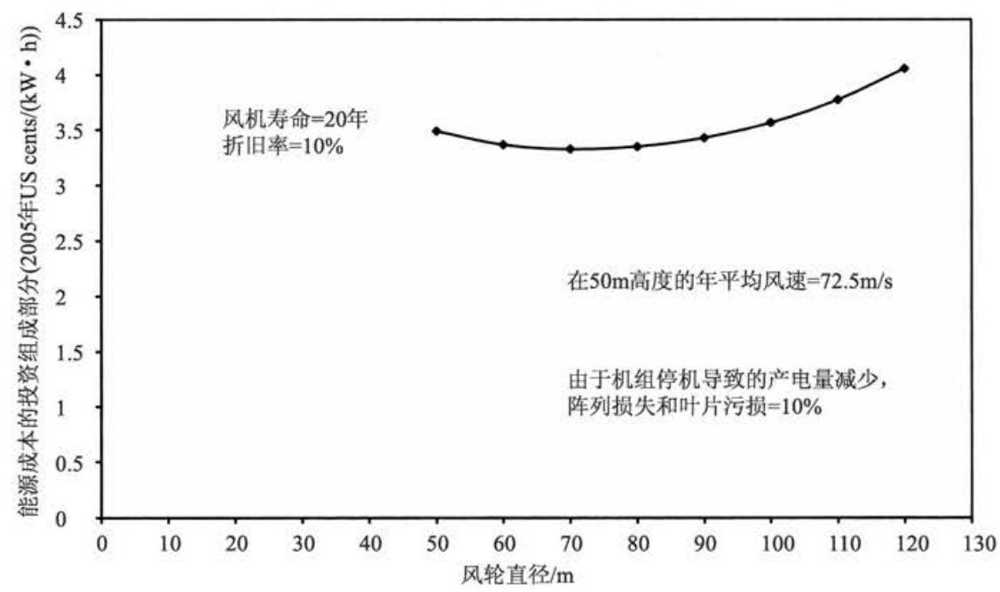

图 6.3 NREL 基准风力机的发电成本随风力机直径的变化——只考虑投资成本部件

可以看出，模型表明最佳的风力机直径刚刚超过 ${70}\mathrm{m}$ ，而大于上一节的成本模型。鉴于一些部件缩放规则的直径减小的指数，这是可以预料的。

### 6.2.4 整机尺寸增长

在 20 世纪 80 年代到 90 年代，商业化生产的最大风力机尺寸大概每 7 年就翻一番。最近促进风力机尺寸继续增长的原因无疑是海上风电场的发展，大量支撑结构固定要素和海底电缆的安装成本促使开发比陆地上更加大型的机组。然而， “风能——事实”(2009)指出最大商用风力机的直径在 2004~2008 年间没有任何增长, 迄今为止, 在风力机尺寸显著增加时期, 这是一个惊人的暂停。

随着 ${80}\mathrm{\;m}$ 和 ${90}\mathrm{\;m}$ 直径的风电机组在陆地上的日益普及,无疑产生了问题,即为什么风力机尺寸比表观最优尺寸还要大。部分答案可能在于成本模型的缺陷。 然而, 促使选较大风力机的一个重要因素无疑就是因为较大风力机的使用能够使机组更好地利用有限的面积。例如, 在狭窄地带能够安装的总额定容量随着风力机尺寸的增长而大致呈线性增长, 假设 (通常情况下) 允许的最小间距由开发商根据固定数量的风力机直径指定。鉴于一些地区的开发成本, 如允许和电网连接, 并没有随风电场的额定容量发生显著变化, 这是最大限度地提高装机容量的一个诱因。

### 6.2.5 重力限制

上述简化的成本模型是基于假设叶片的设计只受空气动力载荷影响的。然而, 随着直径的增大, 由于叶片自身重量沿边力矩势必会变得越来越重要。由基准设计产生的叶片设计组, 是通过简单的缩放相同量的直径和其他尺寸, 叶根重力力矩会随直径的 4 次方增加, 而截面模量只是随直径的 3 次方增长。尽管最初会有一些范围通过调配材料更接近前缘和尾缘, 来满足增加的重力力矩, 但对于任何特定的叶片材料来说,一个切实可行的直径限制最终必须达标。

## 6.3 风力机的容量

风力机的容量决定了达到额定功率时的风速 (即额定风速)。如果容量太大, 风力机很少会达到额定功率, 这样传动链和发电机的成本将不再由发电量调节。 另外, 如果容量过小低于最佳情况时, 风轮及其支撑结构的成本则会过多地依赖于发电量。

对于风轮直径和额定功率最佳关系的研究可以在 6.2 节对成本模型技术研究的基础上进行。

### 6.3.1 相对风轮直径优化风力机容量的简化成本模型

不同的风力发电机组部件设计方法受额定速度变化的影响，这个变化取决于旋转速度的任何伴随变化的性质。然而, 鉴于实际情况陆地上风电机组的最大旋转速度一般会受到限制以抑制噪声传播 (见 6.4 节)，假设最大叶尖速度限制到 80m/s，不考虑额定风速。

简化的成本模型应用在变速变桨距调节机组中,因为这些正是越来越多的风力机的选择。假设风力机是为达到叶尖速比为 8 的最佳性能而设计的，并且运行风速为 ${10}\mathrm{m}/\mathrm{s}$ 时以此叶尖速比运行，在更高的风速下，名义上叶尖速度为 ${80}\mathrm{m}/\mathrm{s}$ 。

假设叶片平面形状和扭角分布固定不变，年发电量可以利用一系列额定风速、 年平均风速和威布尔分布形状因子计算。假定风力机风轮转速变化简单地与额定风速成比例。优化目标是既定发电量下成本最小, 这需要知道容量改变时, 不同风力发电机部件的成本会受到怎样的影响。虽然理论上这只能严格地来源于风力机一系列地详细设计, 但是实际上, 可以通过对影响每类部件设计参数的识别来得到有用的成本趋势数据, 并研究它们对额定风速的依赖。如果一个基准风力机不同部件分离后的成本是可知的, 则这些成本趋势就可以用于决定最优容量。再用表 6.2 中直径 70m、1.5MW 的风力机成本组成来举例。

首先,每个主要部件设计方式受额定风速影响如下:

(1)叶片重量。做以下假设:

- 叶片平面形状固定。

- 叶片设计取决于平面外疲劳弯矩。

- 平面外弯矩的波动同风速波动与风轮转速的乘积成正比[见式(5.28)]。

- 转速是主风向风速的函数，但与已说过的额定风速无关。

- 叶片蒙皮的厚度与额定风速无关。

因此，叶片蒙皮厚度和叶片重量在额定风速下，未受到任何影响。

(2)轮毂和变桨系统重量。同叶片一样，假设它正比于平面外的弯矩，与额定风速无关。

(3)低速轴重量。假设它取决于支撑风轮和轮毂重量所形成的轴的弯矩，而轮毂重量与额定风速无关。

(4)齿轮箱和制动器。齿轮箱和制动器的设计取决于额定转矩 $P/\Omega$ 。额定功率正比于额定风速的立方，最大转速是固定的，而转矩随额定功率变化。齿轮箱和制动器的重量和额定功率成正比。

(5)发电机和变流器。发电机和变流器的设计取决于额定功率，因此，发电机的重量看作正比于额定风速的立方。

(6)机舱结构、偏航系统、塔架和基座。它们的设计原则上由风轮极限载荷或者波动载荷决定，两者都假设与额定风速无关，其重量因此不会受到额定风速的影响。

(7)电网接入。假设电缆、开关和变压器的重量正比于额定功率。

(8)控制器、装配和运输。假设这些内容与额定风速无关。

在表 6.3 中, 上面所列举的各种部件按其重量随额定风速变化的方式不同, 归入不同的类别。同时列出的还有部件成本占基准风力机总成本的百分比, 以及各个类别的总和。

表 6.3 70m 直径，1.5MW 的 NREL 基准风力机的不同部件所占整机成本百分比，

据其成本是否随额定功率变化分类

<table><tr><td colspan="2">部件的重量/成本与额定风速不相关</td><td colspan="2">部件的重量随额定功率变化</td></tr><tr><td>部件</td><td>成 本</td><td>部件</td><td>成 本</td></tr><tr><td>叶片</td><td>11.4%</td><td>变速箱</td><td>11.6%</td></tr><tr><td>轮毂和旋转</td><td>3.6%</td><td>发电机</td><td>7.4%</td></tr><tr><td>变桨轴承和机械</td><td>4.3%</td><td>变流器</td><td>9%</td></tr><tr><td>低速轴和轴承</td><td>2.5%</td><td>刹车或 HS 耦合</td><td>0.2%</td></tr><tr><td>机舱</td><td>8.9%</td><td>内部电缆和电网接入</td><td>14.2%</td></tr><tr><td>偏航驱动器或轴承</td><td>1.5%</td><td></td><td></td></tr><tr><td>控制系统</td><td>2.7%</td><td></td><td></td></tr><tr><td>塔架</td><td>12%</td><td></td><td></td></tr><tr><td>地基</td><td>3.6%</td><td></td><td></td></tr><tr><td>装配</td><td>3.2%</td><td></td><td></td></tr><tr><td>运输</td><td>3.9%</td><td></td><td></td></tr><tr><td>总计</td><td>57.6%</td><td>总计</td><td>42.4%</td></tr></table>

因此, 下述表达式得到的是以机组成本作为基准机的额定功率的比率的函数 ${P}_{\mathrm{R}}/{P}_{\mathrm{{RB}}}$

$$
{C}_{\mathrm{T}} = {C}_{\mathrm{{TB}}}\left\lbrack  {{0.576} + {0.424}\left( {{P}_{\mathrm{R}}/{P}_{\mathrm{{RB}}}}\right) }\right\rbrack \tag{6.5}
$$

发电成本的关键部分通过式(6.5)除以机组成本得到,其整个使用寿命内年发电量要打折扣,结合相关的功率曲线和风速的威布尔分布来为每个额定风速进行计算。这个练习已经在直径 ${70}\mathrm{\;m}\text{ 、 }{1.5}\mathrm{{MW}}$ 变速变桨 NREL 机组作为基准,假设年度平均风速为 ${7.5}\mathrm{m}/\mathrm{s}$ ，并且基准机组的额定风速为 ${11.55}\mathrm{m}/\mathrm{s}$ 的情况下推出。结果如图 6.4 所示, 说明最佳机组的额定功率与基准 1.5MW 很接近。发电成本伴随额定功率的变化在最佳设置的哪一边都是很小的, 发电成本最大值上升超过范围 ${1100} \sim  {2000}\mathrm{\;{kW}}$ 仅占 $3\%$ 。

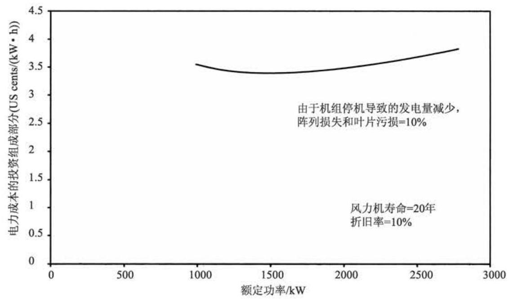

图 6.4 年平均风速为 ${7.5}\mathrm{\;m}/\mathrm{s},{70}\mathrm{\;m}$ 直径,变速变桨风力机的发电成本随额定功率的变化,基于简化成本模式

### 6.3.2 最佳额定风速与年平均风速的关系

最佳额定功率当然在很大程度上依赖于年平均风速 ${U}_{\mathrm{{ave}}}$ 。对于上面提到的风轮直径为 ${70}\mathrm{\;m}$ 的变桨距风力机,最佳额定风速 ${U}_{\mathrm{R}}$ ,在表 6.4 中给出了年度平均风速范围。 ${U}_{\mathrm{{Ro}}}/{U}_{\mathrm{{ave}}}$ 比值范围是 ${1.6} \sim  {1.4}$ ，随着风速的增长而降低。

表 6.4 变桨距风力机最佳额定风速随年平均风速的变化

<table><tr><td>年平均风速 ${U}_{\mathrm{{ave}}}/\left( {\mathrm{m}/\mathrm{s}}\right)$</td><td>最佳额定风速 ${U}_{\mathrm{{Ro}}}/\left( {\mathrm{m}/\mathrm{s}}\right)$</td><td>比例 ${U}_{\mathrm{{ro}}}/{U}_{\mathrm{{ave}}}$</td><td>最佳额定功率 /kW</td><td>比功率, 定义为单位扫掠面积的额定功率/ $\left( {\mathrm{{kW}}/{\mathrm{m}}^{2}}\right)$</td><td>成本指数 (将年平均风速为 ${7.5}\mathrm{m}/\mathrm{s}$ 的电力成本作为 100</td></tr><tr><td>7</td><td>11.1</td><td>1.59</td><td>1340</td><td>349</td><td>113</td></tr><tr><td>7.5</td><td>11.5</td><td>1.54</td><td>1495</td><td>388</td><td>100</td></tr></table>

续表 6.4

<table><tr><td>年平均风速 ${U}_{\mathrm{{ave}}}/\left( {\mathrm{m}/\mathrm{s}}\right)$</td><td>最佳额定风速 ${U}_{\mathrm{{Ro}}}/\left( {\mathrm{m}/\mathrm{s}}\right)$</td><td>比例 ${U}_{\mathrm{{ro}}}/{U}_{\mathrm{{ave}}}$</td><td>最佳额定功率 /kW</td><td>比功率, 定义为单位扫掠面积的额定功率/ $\left( {\mathrm{{kW}}/{\mathrm{m}}^{2}}\right)$</td><td>成本指数 (将年平均风速为 ${7.5}\mathrm{m}/\mathrm{s}$ 的电力成本作为 100)</td></tr><tr><td>8</td><td>11.9</td><td>1.49</td><td>1535</td><td>425</td><td>90</td></tr><tr><td>8.5</td><td>12.3</td><td>1.445</td><td>1770</td><td>460</td><td>81</td></tr><tr><td>9</td><td>12.65</td><td>1.41</td><td>1905</td><td>495</td><td>75</td></tr></table>

对于定桨距风力发电机组, 可以做类似的计算, 以确定其最佳额定功率, 得到相似的结果。但定桨距风力机相对于变桨距风力机来说, 显著地需要更高的风速才能达到额定功率 (图 6.4),并且其 ${U}_{\mathrm{{Ro}}}/{U}_{\mathrm{{ave}}}$ 的比要超过 2 。

### 6.3.3 风力机的比功率

研究额定功率和风力机扫掠面积的关系对批量生产的风力机是很有意义的, 图 6.5 中标出了 2008 年批量生产的 79 台风力机的数据。虽然不同的风力机被设计成适合不同的年平均风速, 但其离散度并不高, 并且很容易看出其发展趋势, 它们都趋向于一条通过原点的直线。这 79 台风力机的平均比功率为 ${380}\mathrm{\;W}/{\mathrm{m}}^{2}$ ,其定义为额定功率除以扫掠面积,很接近表 6.3 中年平均风速为 ${7.5}\mathrm{\;m}/\mathrm{s}$ 时的最佳值。

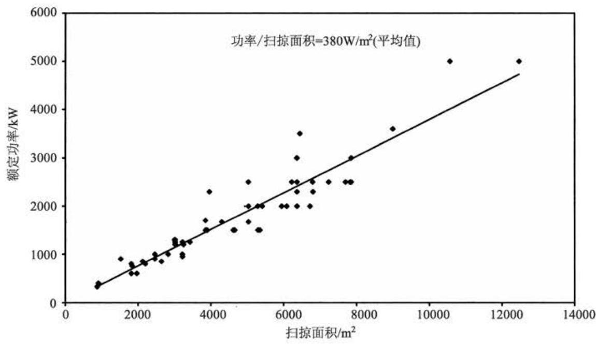

图 6.5 2008 年生产的风力发电机组额定功率与扫掠面积的关系图

## 6.4 风轮转速

风力机设计者的目标是以最低的成本产生电能, 这受制于环境的影响。但是, 对于许多不同转速, 而不是相同的额定功率的叶片优化设计实质上能够产生同样多的电能, 所以转速的选择是基于风力机成本, 而不是电能的产出。

决定成本的关键是额定功率下的风轮转矩, 这也是决定传动链成本的主要因素。对于给定的风轮半径和风力机的额定容量, 风轮转矩反比于转速, 这样就证明适宜采用较高的风轮转速。但是提高转速会对风轮的设计带来不利的影响, 后面将会研究这个问题。

### 6.4.1 风轮转速和实度的理想关系

式(3.77)给出特定叶尖速比下的最大功率。根据升力系数，并忽略阻力和叶尖损失, 得出的最优叶片张力分布为

$$
{\sigma }_{\mathrm{r}}\lambda {C}_{1} = \frac{\frac{8}{9}}{\sqrt{{\left( 1 - \frac{1}{3}\right) }^{2} + {\lambda }^{2}{\mu }^{2}{\left( 1 + \frac{2}{9{\lambda }^{2}{\mu }^{2}}\right) }^{2}}}
$$

式中, $\lambda$ 为叶尖速比; ${\sigma }_{\mathrm{r}}$ 为实度; $\mu  = r/R$ 。叶片靠外侧部分提供了大部分功率,局部速比 ${\lambda \mu }$ 可以大到使分母近似等于 ${\lambda \mu }$ ,得到

$$
{\sigma }_{\mathrm{r}}\lambda {C}_{1} = \frac{{Nc}\left( \mu \right) }{2\pi R}\lambda {C}_{1} = \frac{8}{9\lambda \mu } \tag{6.6}
$$

式中, $N$ 为叶片数。整理后得

$$
c\left( \mu \right) {\left( \frac{\Omega R}{{U}_{\infty }}\right) }^{2} = \frac{16\pi R}{9{C}_{1}N}\frac{1}{\mu } \tag{6.7}
$$

因此, 可以看出,对于相同风速下不同转速的最优化设计, 使叶片弦长在特定半径上反比于转速的平方,条件是假设 $N$ 和 $R$ 不变,并通过改变桨距来保持攻角不变, 使升力系数保持为常值。

注意:对于变桨距机组，如果在整个工作风速范围内发电状态最佳，则式 (6.7) 不适用。在这种情况下，已经证明叶片具有半径上的弦长近似地反比于转速而不是转速的平方(Jamieson 和 Brown, 1992)。

### 6.4.2 转速对于叶片重量的影响

转速对于叶片重量的影响可参考刚刚说明的叶片设计确定。如 6.3.1 节所述, 假设叶片设计取决于平面外的疲劳弯矩和正比于风速波动、转速和弦长比例因子乘积[见式(5.28)]的力矩波动。按式(6.7)，弦长比例因子反比于转速的平方， 故力矩波动的变化恰好与转速变化相反。

各个半径处的厚度对弦长的比与弦长变化没有关系, 所以在给定的半径下, 对于平面外弯曲的叶片截面系数正比于叶片外壳蒙皮厚度 $w\left( r\right)$ ,以及局部弦长平方的乘积。因此，

$$
Z\left( r\right)  \propto  w\left( r\right) {\left\lbrack  c\left( r\right) \right\rbrack  }^{2} \propto  w\left( r\right) /{\Omega }^{4} \tag{6.8}
$$

为了将疲劳应力变化保持在同一个等级，需要叶片截面系数 $Z\left( r\right)$ 随力矩波动变化,上面已经提到力矩波动与转速变化相反,因此,

$$
Z\left( r\right)  \propto  1/\Omega \text{ ,所以 }\omega \left( r\right) /{\Omega }^{4} \propto  1/\Omega \text{ ,且 }\omega \left( r\right)  \propto  {\Omega }^{3} \tag{6.9}
$$

叶片重量正比于外壳厚度与弦长的乘积, 因此, 其随转速而变化。

### 6.4.3 最佳风轮转速

根据 6.4.2 节中的假设(这并不是经常用到的)，叶片重量的增加正比于转速。 叶片平面外的疲劳载荷决定了机舱结构与塔架的设计，与转速的变化相反。因此， 当转速增加时, 很可能出现折中方案, 即一方面减少了传动链、机舱结构和塔架的成本; 另一方面却增加了风轮的成本, 折中方案将决定最佳风轮转速值。

### 6.4.4 对风轮转速的噪声限制

由风力发电机组产生的气动噪声与叶尖速度的 5 次方成正比。因此，限制风力发电机组的转速是非常必要的, 特别是在风速很小、环境噪声水平较低时。所以,风力机制造商通常将陆基风力发电机组的叶尖速度限制在 ${65}\mathrm{\;m}/\mathrm{s}$ 左右。

变速机组的最大叶尖速度一般来说比较高，典型的范围是 ${70} \sim  {85}\mathrm{m}/\mathrm{s}$ ，但是可以肯定的是，只有当风速比较高而环境噪声水平也高时才能到达。

海上风力发电机组就不用像陆上风力发电机组一样在最大叶尖速度问题上考虑环境噪声，因此，专门为海上设计的典型机组叶尖速度要比较大。然而，Jamieson (2009)研究出一种大幅度提升叶尖速度至 ${120}\mathrm{m}/\mathrm{s}$ ，以减少驱动机构的成本的方法。

### 6.4.5 视觉考虑

多数人认为，风力发电机组的风轮旋转得越快，看起来越不舒服。

## 6.5 叶片数量

### 6.5.1 引 言

传统的欧洲风力机有 4 个叶片, 也许是因为早期的工业技术为了便于在转轴上组装叶片的支架,将相对的叶片制成一根连续的木制轴形成“十”字形安排。与之相比, 现在生产的大部分水平轴风力机都使用两个或三个叶片。尽管不止一个厂家曾经研究过单叶片风力机，但它并不常见。它在使用上会受到限制，在 6.5.7 节的内容中会有阐述，6.5 节的其他部分将介绍两叶片和三叶片的风力机。

如果对有不同叶片数量的风力机的有关指标进行比较, 需要考虑性能、载荷、 风轮成本、对传动链成本的影响、噪声发射、视觉效果等几方面的因素。其中，一些因素受到风轮转速和风轮实度影响极大，这些参数同叶片数量的理想关系会在下一节中进行介绍。6. 5.3 节介绍基准三叶片风力机方案转化为两叶片替代方案, 并比较它们的发电量以及理论成本, 6.5.4 节介绍两叶片和三叶片风轮支撑结构上载荷的差异, 6.5.5 节介绍噪声对转速的限制。视觉效果的影响会在 6.5.6 节中研究。

### 6.5.2 叶片数量、转速和实度的理想关系

式(6.7)中给出了在特定风速下叶片数量对最佳化风力机叶片弦长和风轮转速的影响:

$$
{Nc}\left( \mu \right) {\left( \frac{\Omega R}{{U}_{\infty }}\right) }^{2} = \frac{16\pi R}{9{C}_{1}}\frac{1}{\mu }
$$

因此，可以看出，如果叶片数量从三个减少到两个，则在特定风速下为保持最佳工作状态，只能选择弦长增加 50% 或风轮转速增加 22.5% (假设通过改变叶片桨距角来保证叶片攻角不变使升力系数保持为恒定值)。

### 6.5.3 某些性能和成本比较

由于不能建立等效设计, 所以两叶片和三叶片风力发电组间进行准确的比较是很困难的。在概念上,简单的办法就是对所有半径上的弦长都增加 50%,而保持包括转速在内的其他部分不变。不考虑叶尖损失时, 诱导因子和年上网电量都保持不变，但是将叶尖损失考虑进来后，年上网电量下降了大约2.5%。保持相同的风轮实度便大大抵消了减少叶片数量的主要好处，所以这种方案不会被应用。 取而代之是，建议采用三叶片风力机原叶片方案，并考察采用相同叶片的两叶片机组, 在不同转速下的性能和成本推断。

影响性能比较的因素有扫掠面积内的额定功率 (见 6.3 节) 和所采用的翼形数据。在此情况下，一个直径 ${70}\mathrm{\;m}$ 、 ${1.5}\mathrm{{MW}}$ 、变速变桨三叶片风力发电机组运行在叶尖速比为 8 , 风速低于 10m/s ,并且采用上述叶尖速度常量作为基准机组, 最大风轮速度是 ${80}/{35} = {2.29}\mathrm{{rad}}/\mathrm{s}$ 或者 ${21.8}\mathrm{r}/\mathrm{{min}}$ 。叶片平面形状和厚度分布都如图 5.4 (a) 给出的 T40 数据。根据经验选用 LM 19.0 叶片的三维翼形数据(图 5.9)，最大升力系数由叶尖到根部逐渐增加，这样就可以更准确地推断功率曲线。这些数据取自 Petersen 等的研究成果(1998)。叶片的扭角分布设置在年平均风速 ${7.5}\mathrm{m}/\mathrm{s}$ 的地方,年发电量 ${100}\%$ 可用的达 ${4937}\mathrm{{MW}} \cdot  \mathrm{h}$ 。基准机组性能曲线如图 6.6 所示。

在具有相同年平均风速的地方，选择了风轮直径为 ${70}\mathrm{\;m}$ 的两叶片的失速调节型风力机和基准的三叶片风力机，并对它们的理论发电成本作了比较。两叶片的和三叶片的风力机在成本上的差别主要体现在部件成本上, 具体数据和分析方法可以见表 6.2 以及 6.3.1 节中的内容。

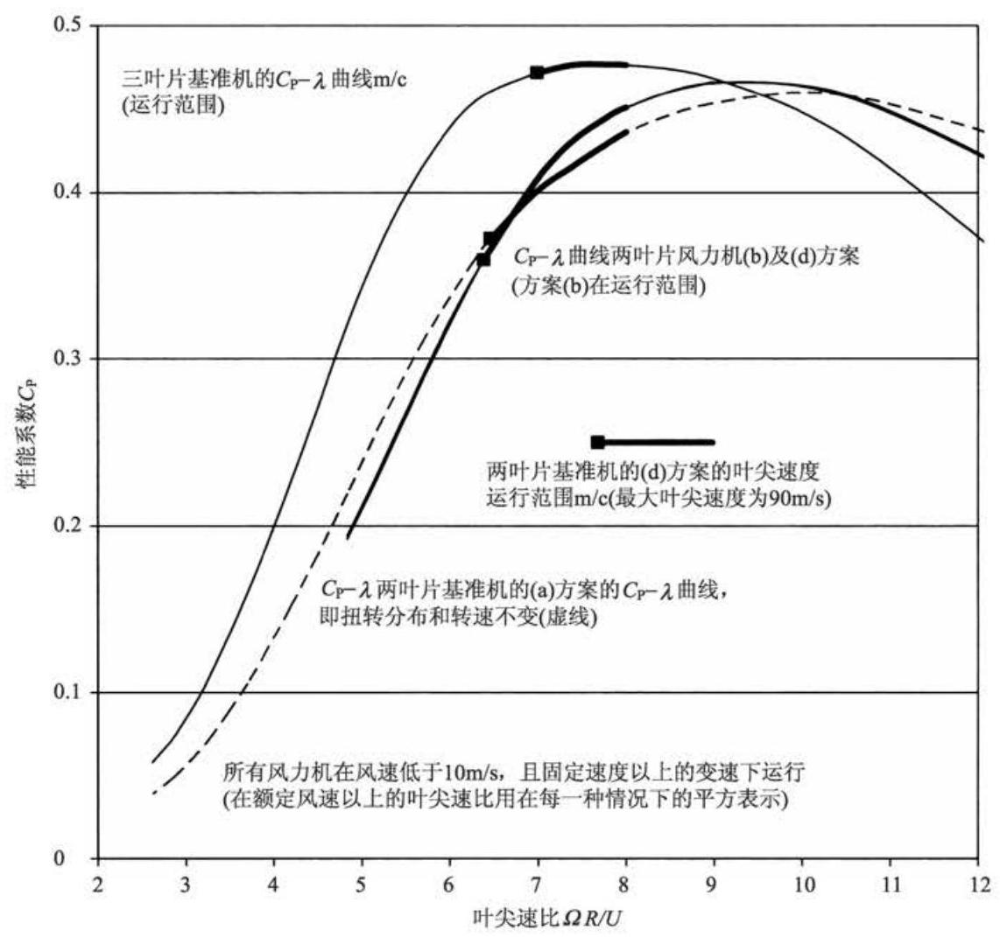

图 6.6 两叶片和三叶片基准机的 ${C}_{\mathrm{P}}$ 曲线的比较

叶片设计假设由平面外疲劳弯矩掌控, 伴有波动力矩的增加以适应风轮转速 [见式 (5.28)]。因此，叶片重量假设随风轮转速线性增加，但是整个两叶片机组重量在基准转速情况下下降了 1/3。轮毂、主轴、机舱和偏航系统的重量也假设是随转速增加的,但是没有考虑具有刚性轮毂的两叶片风力机中这些部件的载荷增加。

塔架的设计假设取决于第一个例子中的疲劳因素, 所以塔架的质量正比于风轮转速。如果叶片的平面形状相同, 则对于转速相同的两叶片和三叶片的风力机, 因湍流作用在风轮上的循环能力载荷实际是相同的，所以在基准速度下塔架的成本组成不变。

齿轮箱和刹车系统的重量正比于转矩 ${P}_{\mathrm{R}}/\Omega$ ,发电机、电缆和电网接入设备的重量正比于额定功率 ${P}_{\mathrm{R}}$ 。

在表 6.5 中, 根据重量随转速和额定功率的变化关系, 将不同的部件分为不同的种类。表 6.5 中列出的还有两叶片风力机部件成本占三叶片基准风力机的成本总额的百分比，同时还列出了每一类的总和。

表 6.5 根据假设的部件成本与转速、额定转矩、额定功率之间的关系分类, 两叶片风力机部件成本所占的百分比 (用三叶片基准机成本的百分比表示)

<table><tr><td colspan="2">部件重量/成本与额定功率或转速不相关</td><td colspan="2">部件重量/成本随转速 $\Omega$ 变化</td><td colspan="2">部件重量/成本随额定转矩 ${P}_{\mathrm{R}}/\Omega$ 变化</td><td colspan="2">部件重量/成本随额定功率 ${P}_{\mathrm{R}}$ 变化</td></tr><tr><td>部件</td><td>成 本</td><td>部件</td><td>成 本</td><td>部件</td><td>成 本</td><td>部件</td><td>成 本</td></tr><tr><td>地基</td><td>3.6%</td><td>叶片</td><td>7.7%</td><td>变速箱</td><td>11.6%</td><td>发电机</td><td>7.4%</td></tr><tr><td>控制器</td><td>2.7%</td><td>轮毂</td><td>3.6%</td><td>制动系统</td><td>0.2%</td><td>变流器</td><td>9.0%</td></tr><tr><td>装配</td><td>3.2%</td><td>变桨系统</td><td>4.3%</td><td></td><td></td><td></td><td></td></tr><tr><td>运输</td><td>3.9%</td><td></td><td></td><td></td><td></td><td></td><td></td></tr><tr><td></td><td></td><td>低速轴与轴承</td><td>2.5%</td><td></td><td></td><td>电网接入</td><td>14.1%</td></tr><tr><td></td><td></td><td>机舱</td><td>8.9%</td><td></td><td></td><td></td><td></td></tr><tr><td></td><td></td><td>偏航系统</td><td>1.5%</td><td></td><td></td><td></td><td></td></tr><tr><td></td><td></td><td>塔基</td><td>12.0%</td><td></td><td></td><td></td><td></td></tr><tr><td>总计</td><td>13.4%</td><td>总计</td><td>40.5%</td><td>总计</td><td>11.8%</td><td>总计</td><td>30.5%</td></tr></table>

根据各个部件成本与重量的关系，得到转速和额定功率的函数为风力机成本， 表达式为

$$
{C}_{\mathrm{T}} = {C}_{\mathrm{{TB}}}\left\lbrack  {{0.134} + {0.4047}\left( {\Omega /{\Omega }_{\mathrm{B}}}\right) }\right\rbrack   + {0.118}\left( {{\Omega }_{\mathrm{B}}/\Omega }\right) \left( {{P}_{\mathrm{R}}/{P}_{\mathrm{{RB}}}}\right)
$$

$$
+ {0.305}\left( {{P}_{\mathrm{R}}/{P}_{\mathrm{{RB}}}}\right) \tag{6.10}
$$

式中, ${P}_{\mathrm{{RB}}},{\Omega }_{\mathrm{B}}$ 是基准机组的额定功率和转速的值,分别为 ${1500}\mathrm{\;{kW}}$ 和 ${21.8}\mathrm{r}/\mathrm{{min}}$ 。 现在可以研究三种设计方案。

(1)平面形状、扭矩和风轮转速与基准机组相比没有变化。

由于叶片数量的减少, 性能系数在叶尖速比为 8 的情况下 (适用于风速低于 10m/s 环境中)下降了 8.4%，但是发电量仅减少了不到 6.3%。图 6.6 中相关的 ${C}_{\mathrm{P}} - \lambda$ 曲线用虚线展示了叶尖速比的所有范围，并大胆展示更加限制的运行范围，证明了三叶片基准机组的最优叶尖速比从 7.7 上升到 10。很明显，上端叶尖速度 80m/s 的限制造成了明显的性能下降。

下降的发电量和机组主要成本相结合节省了 3.8%，成本的节省是因为减掉了一个叶片，导致了电力成本上升 2.6%。

(2)与选项(1)相同，但是扭矩分布重新优化了。

扭矩分布的重新优化相比于基准三叶片机组降低了 ${4.6}\%$ 的发电量损失，导致上升的发电成本下降到 ${0.8}\%$ 。相关的 ${C}_{P} - \lambda$ 曲线在图 6.6 中展示了叶尖速比的所有范围，并且大胆展示了更加限制的运行范围。

(3)叶尖速比计划缩放与扭矩分布最佳化相结合得到基于式(6.10)的机组成本方程中的最小发电成本(塔架和机舱成本随着最大风轮速度增加)。

每个风速的叶尖速度可以按相同的比例进行放大以便产生最大发电量, 同时扭矩分布重新最优化。这使发电量损失与基准三叶片机组相比减少到只有 1.3%，叶尖速度缩放系数为 1.21。然而，式 (6.10) 的应用导致相比于基准机组主要成本上升 2.5%，并造成发电成本的上升 3.8%(再次与基准机组相比)。

从另一个角度上来讲, 发电成本的最小化引出了更小的叶尖缩放系数 1.035 。 相比于基准机组产电量损失和主要成本的下降现在分别是 ${3.3}\%$ 和 ${2.8}\%$ ,导致发电成本上升只有0.5%。

(4)叶尖速度缩放与扭矩分布最佳化相结合得到基于式 (6.10) 的机组成本方程中的最小发电成本, 所以塔座和机舱的成本也固定了。

很明显，假设塔架和机舱重量的上升与转速成正比，考虑了不同的选项 (3) 导致两叶片相比于三叶片机组发电成本有小幅度上升。然而, 如果机舱结构的重量是由能够容纳变速箱发电机和其他设备的外壳尺寸决定的, 而不是由疲劳载荷决定的话,那么机组的额定值为常数。如果还假设塔架的设计由极限载荷决定而不是疲劳载荷, 那么额定功率下风轮转速的机组成本方程就得如下表示:

$$
{C}_{\mathrm{T}} = {C}_{\mathrm{{TB}}}\left\lbrack  {{0.254} + {0.2847}\left( {\Omega /{\Omega }_{\mathrm{B}}}\right)  + {0.118}\left( {{\Omega }_{\mathrm{B}}/\Omega }\right) \left( {{P}_{\mathrm{R}}/{P}_{\mathrm{{RB}}}}\right) }\right\rbrack
$$

$$
\left. {+{0.305}\left( {{P}_{\mathrm{R}}/{P}_{\mathrm{{RB}}}}\right) }\right\rbrack \tag{6.11}
$$

叶尖速度缩放系数导致发电成本的最小化, 然后上升到 1.12 , 并且发电成本下降到 1.1%，低于基准机组的数值。如图 6.6 所示，所有叶尖速比范围的相关 ${C}_{\mathrm{P}} - \lambda$ 曲线几乎与选项 (2)一致，但是叶尖速比运行范围不同。上述结果在表 6.6 中有所总结。

表 6.6 使用相同的平面形状和厚度/弦比分布的叶片的 70m 直径，

1.5MW 三叶片变速变桨基准机与两叶片设计变种的比较

<table><tr><td>两叶片 70m 直径, 1.5WM风力机的设计方案</td><td>最大额定转速和叶尖速度</td><td>年发电量 /(MW·h)</td><td>年发电量比基准机组减少 m/c</td><td>机组整体成本比三叶片基准机减少</td><td>发电成本增加/减少量</td></tr><tr><td>a)相同的叶片和叶尖速度</td><td>21.8r/min 80m/s</td><td>4625</td><td>6.3%</td><td>3.8%</td><td>+2.6%</td></tr><tr><td>b) 除叶片扭曲分布的优化外, 同上</td><td>21. 8r/min 80m/s</td><td>4709</td><td>4.6%</td><td>3.8%</td><td>+0.8%</td></tr><tr><td>c)叶尖速度与扭曲分布随每个方程 (6.10) 给出的 $E$ 的最小的 $C$ 变化</td><td>22.6r/min 83m/s</td><td>4775</td><td>3.3%</td><td>2.8%</td><td>+0.5%</td></tr><tr><td>d) 叶尖速度与扭曲分布随 $E$ 中最小的 $C$ 变化,假设机舱和塔固定费用，即利用式(6.11)</td><td>24.5r/min 90m/s</td><td>4857</td><td>1.6%</td><td>2.7%</td><td>-1.1%</td></tr></table>

表 6.6 中的数据显示, 两叶片和刚性轮毂的风力机相对三叶片风力机, 未必有明显的成本效益, 尽管塔架的设计是由极限载荷决定的, 但是应该谨慎地处理这个结果, 因为成本的变化是基于对叶片载荷和对其他部件撞击影响的简单处理之上的(刚性轮毂两叶片风力机与三叶片风力机的载荷会在下一节中作更多细节上的比较)。

在风轮和低速轴之间引入的摆动铰链, 可使两叶片风力机机舱的载荷显著降低，从而可以带来潜在的成本效益。铰链消除了平面外气动弯矩由风轮到低速轴之间的传递, 这样就大幅度降低了轴、机舱和偏航驱动系统上的运行载荷, 并使这些载荷对转速的依赖程度大为降低，从而考虑了发电成本，提高两叶片风力机最佳转速。

尽管摆动铰链使轴、机舱和偏航驱动系统的成本减少(大约是基准风力机成本的 20%)，但是被摆动铰链及摆动限位系统的费用所抵消。

### 6.5.4 叶片数量对载荷的影响

在 5.10 节和 5.11 节中分析了三叶片和刚性轮毂两叶片风力机在低速轴和机舱结构上的瞬态载荷，下面的表 6.7 中对于相同直径和转速的风力机作了比较。 随机载荷的比较是基于湍流长度与风轮直径的比,其值为 1.84 。

由表 6.7 可以看出，刚性轮毂两叶片风轮产生的载荷明显大于三叶片风轮产生的载荷，但是在多数两叶片风力机的设计中，风轮都允许跷动的而不是刚性安装, 这样就消除了表 6.7 中主轴和机舱结构方面的气动力矩, 同时也可以减小叶片平面外根部的弯矩。跷跷板风轮的利弊会在 6.6 节中讲到。

表 6.7 三叶片和刚性轮毂两叶片风力机轴上和机舱载荷的比较 ( $\psi$ 是叶片方位角)

<table><tr><td rowspan="2">力矩载荷的位置</td><td colspan="2">由于风切变或偏航系统未对准所引起的确定性载荷, 响应于叶片叶平面外根部的弯矩幅值 ${M}_{0}$</td><td>随机载荷</td></tr><tr><td>三叶片风力机</td><td>刚性轮毂两叶片风力机</td><td>刚性轮毂两叶片风力机比三叶片风力机增加的百分比</td></tr><tr><td>轴弯曲力矩幅值</td><td>1.5M。</td><td>2M。</td><td>22%</td></tr><tr><td>机舱下垂力矩</td><td>1.5M。</td><td>${M}_{0}\left( {1 + \cos {2\psi }}\right)$</td><td>22%</td></tr><tr><td>机舱偏航力矩</td><td>0</td><td>${M}_{0}\sin {2\psi }$</td><td>22%</td></tr></table>

由于加载的随机性, 按叶片穿越频率变化的风轮推力是影响塔架疲劳设计的决定因素, 对转速相同的两叶片和三叶片风力机其变化很小。但是相同直径时, 两叶片风力机比三叶片风力机旋转得更快，所以这种周期性的风轮推力变化频率更高。

### 6.5.5 对风轮转速的噪声限制

如 6.5.3 节中所述，提高转速的两叶片方案得到明显的成本效益，因为除了节省叶片以外, 也由于扭矩的降低而降低了整个传动链的成本。但 6.4.4 节中提到, 为了限制发射气动力噪声，应该把叶尖速度限制在 ${65}\mathrm{m}/\mathrm{s}$ 或者 ${85}\mathrm{m}/\mathrm{s}$ 。 6.5.3 节中的基准风力机叶尖速度为 ${80}\mathrm{m}/\mathrm{s}$ ，是在所允许的噪声范围之内的，但选项 (4) 中 90m/s 的叶尖速度就显得有些不能接受了，除非是在偏远的地区或海上。这个问题还会在 6.9 节中进行深入的讲解。

### 6.5.6 视觉效果

尽管视觉效果是很主观的评价, 但多数人都认为三叶片风力机比两叶片风力机看起来更平静，其中一个原因可能是看似较大的三叶片风力机随时间看起来变化不大, 而两叶片风力机旋转时看起来像是空中的一条直线, 每旋转一圈直立两次；另一个原因是两叶片风力机通常旋转得更快，这使人们感到心烦。

### 6.5.7 单叶片风力机

除了节省风轮本身的成本外，由于通过提高转速还可降低传动链的成本，所以单叶片风力机的方案很吸引人 (见 6.5.2 节)。单叶片风力机的一个明显的缺点是风轮转速的提高会造成噪声的加大，但在海上这就不成问题了。另一个顾虑是由于叶尖损失的增大而使发电量有所减少。例如，一个直径为 ${70}\mathrm{\;m},{1.5}\mathrm{{MW}}$ 变桨距的单叶片风力机，6.5.3 节中考虑的变速三叶片基准机组设计，每个风速下的转速据式 (6.7) 缩小、 $\sqrt{3}$ 倍,并且扭矩分布最优化得到最大发电量,相比于基准机组年输出电能减少 ${5.5}\%$ 。

必须设法平衡单叶片风力机，并消除由于离心载荷而引起的转矩波动以及系列涡动趋向。此外，相对于两叶片和三叶片风力机，刚性轮毂将使机舱承受更大的摆动和偏航力矩, 单叶片风轮一般安装在摆动铰链上, 故不平衡的气动面外的力矩可以被离心力偶抑制, 因此, 减少了轮毂所受的力矩。尽管如此, 叶片的运动还是比两叶片风力机显著地增大，所以这种风轮通常安装在下风向。Morgan (1994) 提出在输电线路损耗和紧急停车时, 会遇到预测偏动幅度的困难, 导致摆动停止产生冲击过大的风险。

## 6.6 摆动的结构

### 6.6.1 具有减小载荷的优点

两叶片风力机的风轮一般安装在摆动铰链上, 铰链轴与主轴垂直, 但不一定要与叶片纵轴垂直, 这是为了防止运行时不同叶根平面外弯矩的上升。两叶片风力机叶片上的气动载荷差异造成了风轮对摆动轴的角加速度，同时由离心力所产生的恢复力矩可制止大幅度摆动，见 5.8.8 节中所讲解的内容。但是当风力机停机时没有离心恢复力矩, 所以叶片载荷差异将造成叶轮摆动直到制动器自行停下, 制动器需要适当的缓冲。因此，当风力机停机时，摆动铰链对于叶根平面外极限力矩没有任何帮助。

摆动铰链使载荷减少, 为载荷传递路径上的各主要构件都不同程度地带来了好处, 概括如下:

(1)叶片。主要好处是消除了因偏航(图 5.10)、主轴的倾斜、风切变(图 5.11)和塔影效应(图 5.14)引起的平面外弯矩的周期性变化。与之相比，随机载荷引起的叶根平面外弯矩只有小幅度减少——见 5.8.8 节中的例子，减少 11%。 因此，尽管其作用始终受到重力力矩而削弱，但是摆动还是全面大比例地减少了平面外的疲劳载荷。

(2)低速轴。低速轴的设计取决于由悬臂风轮重量造成的循环重力力矩。在刚性轮毂机组上, 由固定和随机的风轮平面外载荷产生的轴力矩 “等价破坏载荷” 或称 DEL(在 5.12.6 节中已定义)，其大小接近，所以引入摆动铰链能显著降低整个主轴上的力矩 DEL。但应该注意的是，风切变产生的循环轴力矩能减轻重力在刚性轮毂机组上引起的力矩, 故摆动对于这种载荷成分没有有利之处。

不考虑偏航误差和塔架的影响，刚性轮毂风力机上总的轴力矩 DEL 的粗略估计可以通过取随机载荷及由重力、风切变和轴倾斜联合形成的循环载荷的平方和, 再取平方根得到。

(3)机舱结构。摆动铰链的引入可以完全消除工作时机舱的上下摆动和偏航力矩, 只剩下风轮转矩、推力和平面截荷。这将会对机舱结构的疲劳设计很有利, 但是不包括极限载荷设计, 具体原因已经解释过了。

(4)偏航轴承和偏航驱动。刚性轮毂风力机承受由固定和随机两方面载荷引起的严重偏航力矩, 这些载荷在许多早期的设计中都被低估了。摆动铰链的引入对解决这一问题产生了显著的效果，它通过消除轮毂上叶轮平面外的力矩而减小了偏航力矩，但是由于平面内载荷，风轮上的偏航力矩仍然存在。

刚性轮毂风轮上的平面内 (与平面外的相对) 载荷造成的偏航力矩的大小可以通过比较风速波动 $u$ 、叶片上平面内的和平面外的载荷来确定。假设叶片没有失速且 $\Phi$ 很小，由式 (5.140) 可知，单位长度平面内载荷近似为

$$
- {F}_{\mathrm{Y}} = \left( {\frac{1}{2}{\rho \Omega }\frac{\mathrm{d}{C}_{1}}{\mathrm{\;d}\alpha }}\right) c\left( r\right) {ru}\left( {\frac{{C}_{1}}{\mathrm{\;d}{C}_{1}\mathrm{\;d}\alpha } + \sin \phi }\right) \tag{6.12}
$$

由式 (5.28) 可知,单位长度平面外载荷近似为

$$
{F}_{\mathrm{x}} = \left( {\frac{1}{2}{\rho \Omega }\frac{\mathrm{d}{C}_{1}}{\mathrm{\;d}\alpha }}\right) c\left( r\right) {ru} \tag{6.13}
$$

将轮毂中心与塔架中心线之间的距离定义为 $e$ ，则平面内风轮载荷产生的偏航力矩是平面外载荷产生偏航力矩的 $\left( {e/r}\right) \left\lbrack  {{C}_{1}/\left( {\mathrm{d}{C}_{1}/\mathrm{d}\alpha }\right)  + \sin \phi }\right\rbrack$ 倍。由于 $e$ 大约是叶尖半径的 $1/{10}$ ，故平面内载荷产生的偏航力矩至少在数量级上小于由平面外力矩所产生的偏航力矩,所以摆动铰链的引入明显地减少了偏航力矩的影响。

(5)塔架。如果是跷跷板风轮，由力矩 ${M}_{\mathrm{Y}}$ 和转矩 ${M}_{\mathrm{Z}}$ 产生的疲劳载荷在塔顶会明显地减小，但是当推力载荷占主导地位时这种效果将被忽略。

### 6.6.2 大摆幅限制

如果只是为了防止叶片和塔架的碰撞, 则必须规定摆动幅度极限。如果摆动铰链的位置靠近叶片轴, 并且低速轴穿过轮毂壳壁上的孔, 最大摆幅则应该由该孔的尺寸来决定。

由固定和随机载荷产生的摆动在5.8.8节中已经介绍过。尽管允许角度的摆动范围约 $\pm  {5}^{ \circ  }$ ,能满足正常运行期间绝大部分摆幅要求偏移限制在绝大多数正常运行中已经足够，但满足不了可能发生的最大的摆幅。因此，为了将摆动快停止时金属对金属碰撞的可能减到最小, 通常需要安装带有弹簧和 (或) 阻尼元件的缓冲器。在离心恢复转矩降低时, 这些措施对限制大幅度摆动偏移也是非常重要的, 否则有可能会在启动和停机时发生大幅度摆动。

### 6.6.3 变桨距和摆动耦合

如 5.8.8 节中所述，通过叶片变桨距和摆角来耦合减小，以产生正比于摆角的气动恢复力矩使摆角减小。这种方法可以很容易通过设置摆动铰链与风轮轴垂线成某一个角度, 也就是 Delta3 角来得以实现。相应地, 在变桨距控制的风力机中, 变桨距摆动耦合器可以用穿过低速轴中心孔的杆前后运动驱动 (图 6.7)。

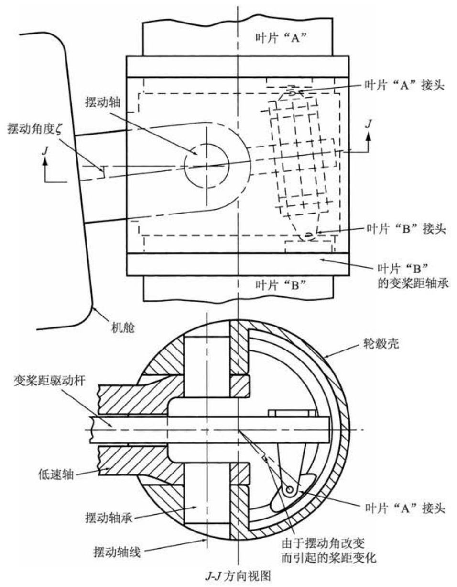

图 6.7 变桨距-摆动耦合器

### 6.6.4 失速调节型风力机的摆动稳定性

从第一反应来看, 可能认为失速以后风轮的摆动是不稳定的, 因为失速以后 ${C}_{1} - \alpha$ 曲线的负斜率会产生负阻尼作用。然而,从二维气动理论很难推出失速以后的动作,并且实践已经证明,设计稳定的摆动风轮是可能的,如 Gamma 60 (Fal-chetta 等, 1996) 和 Nordic 1000 (Engstrom 等, 1997)。在 Armstrong 和 Hancock (1991)及 Rawlinson-Smith(1994) 的研究中, 对该方案进行了深入的讲解。

## 6.7 功率控制

### 6.7.1 被动失速控制

最简单的功率控制形式是被动失速控制，由于失速以后升力系数减小而阻力系数增大, 随着风速增大输出功率会达到上限, 而不需要改变叶片的几何形状。失速型风力机的应用可以使风力发电机组在期望的风速下达到最大或额定功率。

失速型风力机在失速状态后，由于受到不确定的气动方面的不利影响，可能会导致在额定风速或更高风速时对功率等级和叶片载荷的误差估计。在 3.12.3 节中已经对这些内容作了深入的讲解。

### 6.7.2 主动变桨距控制

主动变桨距控制可以在大于额定风速时限制功率, 这种控制的实现是通过将每个叶片的部分或全部相对于叶片轴方向进行旋转以减小攻角，同时也减小了升力系数。这一过程被称为顺桨, 实现了限制功率。主动变桨距控制的优点是提高了能量捕获能力, 提供了一种利用气动刹车的功能且减小了停机时作用于风力发电机组上的极限载荷 (可以参见 3.13 节和 8.2.1 节中的内容)。

变桨距系统的动作必须快速,如所给出桨距角的变化率为 ${5}^{ \circ  }/\mathrm{s}$ 或更快,以便将作用于风轮上的瞬间过大的能量限制到一个可接受的范围。但是,由于叶片连续通过局部阵风区域 (见 5.7.5 节)，在叶片穿越频率上，平滑循环功率波动并不总是有效的，其结果是达到 100%幅度的功率波动时有发生。

通过变桨距控制而获得的额外电能并不都是很多。与失速型风力机有相同额定功率的变桨距控制风力机应用相同的叶片, 在相同的风速下运行, 它在额定风速下需要比失速型风力机有更大的桨距角, 用以减小攻角从而在接近额定风速时增加输出功率。如果将6.5.3节中描述的 ${1500}\mathrm{\;{kW}}$ 、直径 ${70}\mathrm{\;m}$ 、运行在固定的 17.1 r/min(对应的叶尖速度为 ${62.8}\mathrm{\;m}/\mathrm{s}$ )的失速型风力机作为基准，变桨距风力机将多产生 ${2.7}\%$ 的电能,相比于失速控制运行在 ${7.5}\mathrm{\;m}/\mathrm{s}$ 的年平均风速,假设在每种情况下叶片扭矩分布都处于最优状态。两种固定速度机组的功率曲线在图 6.8 中进行比较, 同时还展示了变速变桨控制机组的功率曲线。这会比恒速变桨机组多产生 5%的电量。注意:在实际额定速度处功率曲线的拐点实际中应更圆滑，因为变桨距的控制跟不上湍流的高频分量。

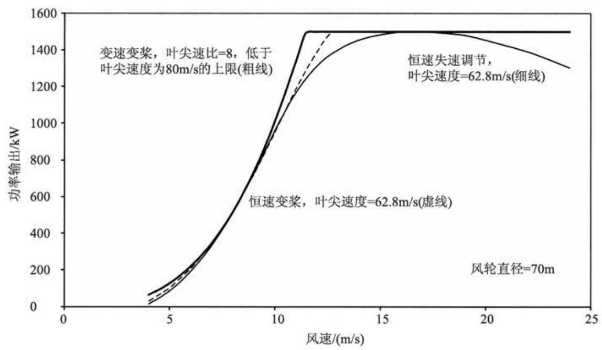

图 6.8 恒速失速调节/恒速变桨/变速变桨 1.5MW 额定风力机功率曲线比较

图 6.9 中示出的是 ${1500}\mathrm{\;{kW}}$ 、直径 ${70}\mathrm{\;m}$ 的变桨距控制风力机在转速为 17.1 r/min时，桨距角范围内的功率曲线族。这些曲线同 ${1500}\mathrm{\;{kW}}$ 功率交点处的横坐标给出了特定风速和控制要求的桨距角的关系 (图 6.10)。根据交点处功率曲线的斜率很容易看出, 当平均风速很高时, 风速的快速变化将导致较大的功率波动。

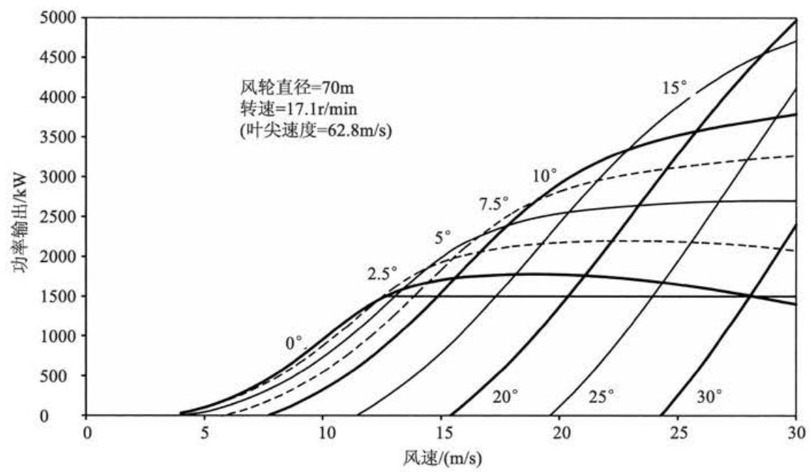

图 6.9 不同正桨距角时的功率曲线: 直径 ${70}\mathrm{\;m}$ 的三叶片风轮转速为 ${17.1}\mathrm{r}/\mathrm{{min}}$

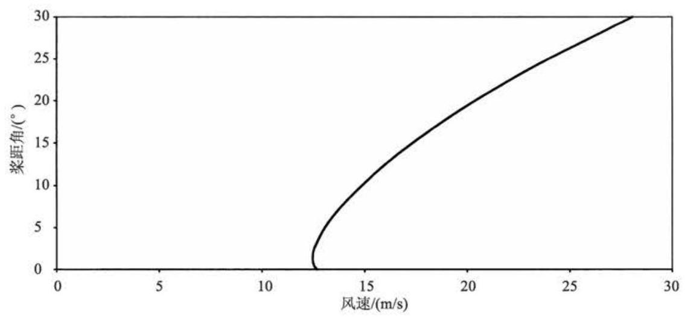

图 6.10 在图 6.9 中描绘的用于限制 1.5MW 风力机输出功率的桨距角与风速表

功率控制所需的叶片桨距角的范围是从 ${0}^{ \circ  }$ (通常称为 “细距”)开始，这时叶尖弦线在旋转平面内或很接近旋转平面,到大约 ${35}^{ \circ  }$ 。但是,为了有效地气动刹车,叶片必须变桨距角到 ${90}^{ \circ  }$ 或完全顺桨,这时叶尖弦线平行于风轮旋转轴向使边缘指向风速的方向。

现在许多变桨距驱动系统已经投入使用 (见 8.5 节)。它们分为每个叶片具有独立变桨距驱动系统，以及用一个驱动器同时驱动所有叶片的桨距驱动系统两类。 前者的优点是它由两个或三个独立的气动刹车系统来控制超速，缺点是它需要非常精确地控制每个叶片的桨距角以避免正常工作时出现不可接受的桨距角度差异。后面一种设计的优点在于它具有变桨距驱动器, 如可以装在机舱中的液压缸, 用一根穿过低速轴中心孔的杆(图 6.11)使轮毂内的变桨距联动器产生前后运动。 同样, 杆的轴向位置可以通过滚珠丝缸和滚珠螺母装置来控制, 其中滚珠螺母由伺服电机驱动。通常滚珠螺母与叶轮的转速相同，但是当变桨距时，需要临时改变滚珠螺母的转速。在这个系统中安装有故障保护装置，以便在伺服电机或控制系统出现故障时, 伺服电机能够自动刹车且滚珠螺母能推动叶片到顺桨状态。

中间的三脚架用通过低速轴中心孔的杆连接到驱动器上。三脚架的连杆通过每个叶片伸入轮毂内的悬臂曲柄驱动叶片的变桨距。每个悬臂都平行于它的叶片轴线, 但是不同轴分别用液压缸改变对叶片的桨距控制, 它们被安放在轮毂中, 通常每个活塞杆都直接连接到叶片轴承的一个附加装置上(图 6.12)。当叶片旋转时, 此附加装置的连接点轨迹是圆形的, 所以缸体必须可以旋转。还有另外一种变桨距控制方法, 即用电动机驱动与叶片轴承内侧轮齿啮合的小齿轮 (图 6.13), 这种方法每个液压驱动缸都由万向螺栓固定到轮毂上, 它的活塞通过与叶片偏心的悬臂锥形管将变桨转矩作用于叶片上。叶片装在变桨距轴承的外环上由电机通过行星齿轮箱驱动的小齿轮与变桨距轴承内环的轮齿啮合, 叶片用螺拴固定在轴承内环上。叶片并未在轴承上，所以可以看到，固定孔看起来更加简捷。两种系统都需要空心轴，不是用来安装液压管，就是用来安装变桨驱动器的动力电缆，以及测量桨距角的传感器信号电缆。此外, 在轴的末端还需要有适当的滑环。

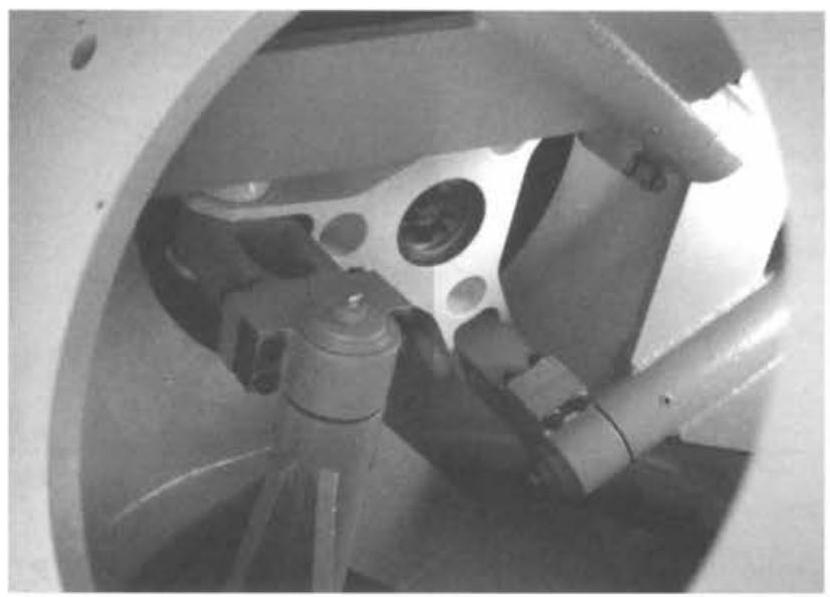

图 6.11 用装在机舱中的单液压缸驱动的变桨距有关驱动器系统

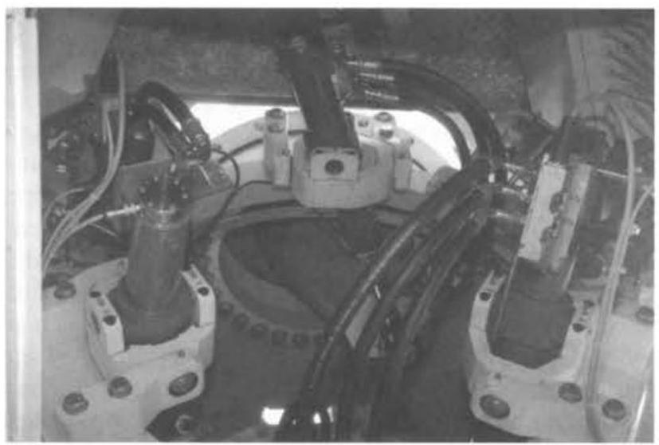

图 6.12 每个叶片使用独立液压驱动器的变桨距系统

每个液压驱动缸都由万向螺栓固定到轮毂上，它的活塞通过与叶片偏心

的悬臂锥形管将变桨转矩作用于叶片上。叶片装在变桨距轴承的外环上

在机组脱网时提供后备电源以确保叶片能够及时顺桨的方法将在 8.5 节中进行讲解。

虽然全程的变桨距控制是绝大多数制造商支持的选择, 但是对于那种只有叶片外部 15%是可变桨距的机组来说, 这里的功率控制仍然是完全有效的。这种机组的主要好处是变桨距执行机构负载明显地降低, 内侧部分叶片仍然失速, 有效地减小了叶片上载荷的波动。但是另一方面, 部分桨距控制也有如下的缺点:

(1)叶尖附近增加了额外的重量。

(2)叶片外形与变桨距执行机构之间在物理上很难相互匹配。

(3)叶尖转轴承受很高的弯矩。

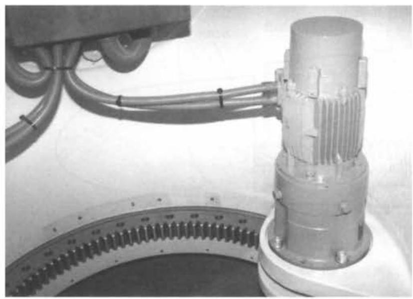

图 6.13 每个叶片拥有独立电机的叶片变桨距系统

由电机通过行星齿轮箱驱动的小齿轮与变桨距轴承内环的轮齿啮合, 叶片螺栓固定在轴承内环上。图中叶片并未在轴承上，所以可以看到固定孔

(4)需要设计适应在较大的直径上产生的高离心载荷的设备。

(5)维护困难。

从上面对变桨距控制系统的说明可知, 设计变桨距执行机构的主要任务是其硬件的设计。另外, 作为控制器, 变桨距的调整需要对闭环控制系统作出快速的响应, 但是在失速型风力机中并不需要这种管理功能。因此, 对于应用变桨距控制的机组来说, 除了这些优点外, 还必须考虑由此而增加的所有的额外费用, 包括维护费用等。

需要考虑的另一个因素是疲劳载荷。它在全程的变桨距风力机中明显增大, 这是因为升力系数随攻角的变化率始终保持在 ${2\pi }$ 左右 [见附录 A 中式(A.9)],而不是随着叶片的失速而减小为零。结果在额定风速以上时, 风速的快速变化会造成更大的推力载荷突变。

变桨距系统控制器的设计参见第 8 章。

### 6.7.3 被动变桨距控制

被动变桨距控制是一种令人关注的、可替代主动变桨距限制功率方式, 其思路是将叶片或叶片的轮毂设计成在叶片载荷的作用下扭转, 以便在高风速下获得所需的桨距角。不过, 尽管理论说起来很简单, 却很难实践, 因为所必需的叶片随风速变化而扭转的变化量一般并不与叶片相应的载荷变化相匹配。对于独立运行的风力发电机组的情况, 发电量的最大化不是主要目标, 被动变桨距控制方案有时候被采用, 但是这一概念在并网运行的风力发电机组中尚未应用。

Corbet 和 Morgan(1991)进行了一个可能作用于叶片上的不同载荷的研究。 在变速机组中利用离心载荷明显是有希望的, 需要一个螺旋套筒和预加载荷的弹簧来被动控制每个叶尖, 这已在荷兰 FLEXHAT 计划中被验证。当离心力超过预加载荷时, 叶尖被驱动顶着弹簧向外移动而变距 (图 6.14)。

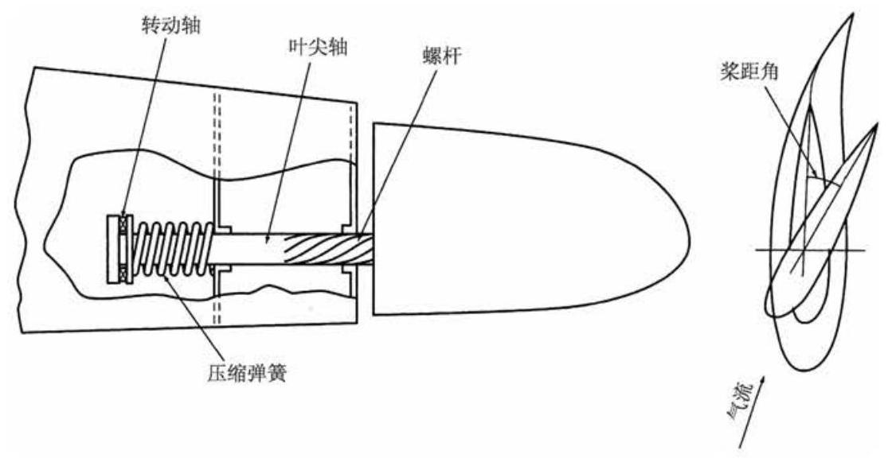

图 6.14 叶尖的被动控制, 在叶尖轴上使用螺杆和弹簧

Joose 和 Kraan(1997)提议用一种免维护的“绷紧管”来代替这种机构，它会在拉力的作用下扭转。这种管子用碳塑纤维增强, 让所有的纤维与管子轴线成一定角度, 这样离心力的作用就会引起扭转。它将被放在叶尖钢轴的孔里, 而轴承将受叶尖上的空气动力载荷。

### 6.7.4 主动失速控制

主动失速控制通过将叶片向失速方向变桨距，实现大于额定风速时的功率限制。即与主动变桨距控制相反方向变桨距, 有时也称之为负变桨距控制。但是, 在更高风速下，通常会将叶片转回顺桨状态以保持额定输出功率。

主动失速控制的主要好处是当风速大于额定风速时, 叶片必须保持失速状态, 这样在阵风下 (见 6.7.2 节), 只会造成叶片上的载荷和功率输出的小幅度波动。 对于主动失速型机组, 只需要桨距角的小幅度改变就能将功率输出保持在额定值, 所以变桨距速度不需要像主动变桨距控制那么快, 而且充分的空气动力刹车只需要-20°的桨距角，所以相比于主动变桨距控制，叶片的变桨距行程大幅度减小。

图 6.15 中比较了使用相同叶片的主动失速控制和主动变桨距控制的桨距角与风速关系曲线。主动失速控制曲线取自图 6.16 中不同负桨距角功率曲线族与当输出功率为 ${1500}\mathrm{\;{kW}}$ 、直径 ${70}\mathrm{\;m}$ 时的交点的横坐标。注意到风轮转速上升了 10%，所以机组运行在远离失速且低于额定风速的状态，否则负桨距角适用范围会很小。

主动失速控制的主要缺点是在失速情况下很难精确预测空气动力学特性。在 8.2.1 节中将深入介绍主动失速控制。

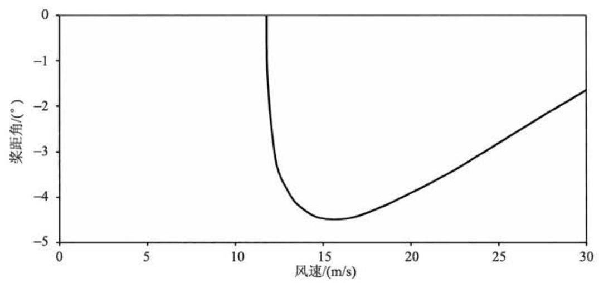

图 6.15 在不同风速下,采用主动失速控制,限制 ${70}\mathrm{\;m}$ 直径的 ${1.5}\mathrm{{MW}}$ 的风力机输出所需的桨距角表

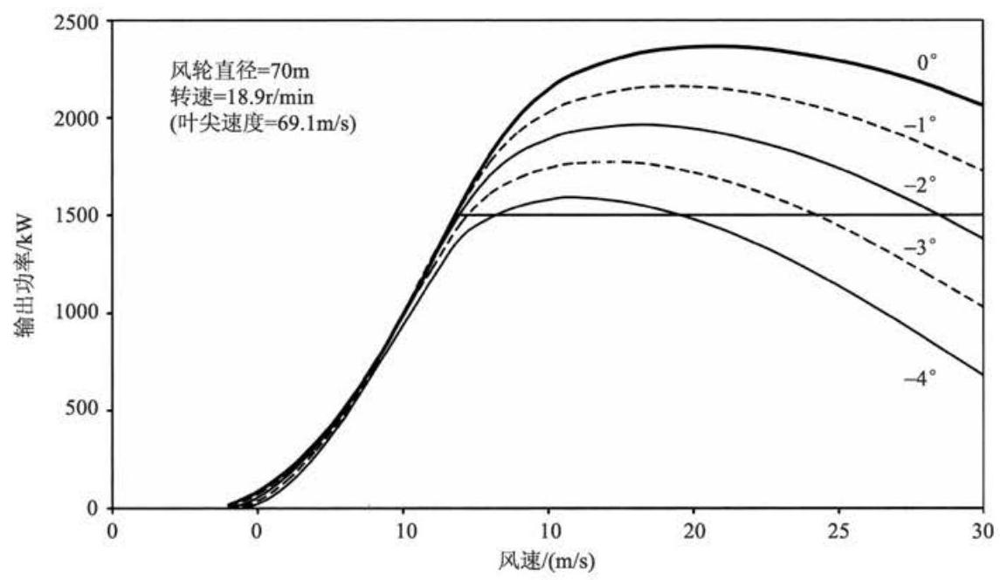

图 6.16 对于不同负桨距角的功率曲线: 直径为 ${70}\mathrm{\;m}$ 的三叶片风轮,转速为 ${18.9}\mathrm{r}/\mathrm{{min}}$

### 6.7.5 偏航控制

大多数水平轴风力机都使用偏航驱动机构来保持风力发电机组正对风向, 使用偏航机构将风力发电机组偏向风向来限制功率输出很吸引人。但两个因素限制了这种功率限制系统的快速响应。第一,机舱和叶轮对偏航轴承的巨大转动惯量; 第二, 风速垂直于风轮圆盘的分量和偏航角的余弦关系。后者意味着在偏航角改变较小时,如 ${10}^{ \circ  }$ ,只会减少很小一部分的输出功率,而 ${10}^{ \circ  }$ 桨距角的变化可使功率输出减半。因此, 主动偏航控制只适用于变速机组, 其中阵风的能量可以储存为叶轮的动能直到偏航驱动作出必要的偏航修正为止。这个设计理论已经成功地应用到意大利的直径 ${60}\mathrm{\;m}$ 、Gamma 60 机型上,它的最大偏航速度是 ${8}^{ \circ  }/\mathrm{s}$ (Coiante 等, 1989)。

## 6.8 制动系统

### 6.8.1 独立制动系统——标准要求

DS 472(见 5.1.4 节) 和 GL 标准 (见 5.1.3 节) 都要求风力发电机组有两套独立的制动系统。另外, IEC 61400-1 (见 5.1.2 节) 并没有要求提供两套制动系统 (声明保护系统应包括一套以上能使风轮达到静止或空转状态的系统), 但它要求在任何非安全保护系统部件失效后保护系统仍然能够保持有效地工作。

IEC 61400-1 和 GL 标准要求风力发电机组至少有一套制动系统作用于风轮或低速轴上，而 DS 472 进一步要求必须有一套空气动力制动系统。

在实际应用中, 空气动力制动和机械制动两种都要提供。但是, 如果每个叶片都有独立的空气动力制动系统, 而且每个空气动力制动系统都可以在电网掉电的情况下使风力机减速，那么就不必为此设计机械制动器。此时，机械制动器的功能只是使风轮静止，即停机，因为空气动力制动不能使风力机停机。

### 6.8.2 空气动力学制动方案

#### 1 主动变桨距控制

叶片变桨距到顺桨 (即将叶片弦顺着风向) 形成高效的空气动力制动方法。叶片变桨距速度为 ${10}^{ \circ  }/\mathrm{s}$ 就足够了,这也是功率控制的要求。在风力机启动和功率控制中使用变桨距控制可以克服潜在的危险。

依靠变桨距控制来实现紧急制动的风力机中，每个叶片需要独立制动，而且所有叶片都要满足“失败安全”运行要求，即来自机舱的电源或穿过低速轴的液压驱动要求瞬间切断。在液压制动情况下，压力油一般存放在轮毂中的蓄能器里。

#### 2 变桨距叶尖

对于失速型风力发电机组来说，叶尖的顺桨控制已经成为空气动力学制动的标准形式。典型的形式，叶尖安装在叶尖转轴上，如图 6.14 所示，并在正常运行时用液压缸拉紧抵消离心力。一旦释放液压 (由控制系统触发或直接由超速传感器触发)，叶尖在离心力作用下向外飞出，并同时通过螺杆变距到顺桨状态。叶尖的长度一般大约是叶尖半径的 15%。

控制系统触发叶尖动作的能力是非常重要的。在许多早期的设计中, 叶尖仅受离心力作用，所以它们不工作时就不会有超速现象。当偶然需要运行时，结果会有卡死的危险发生。现在普遍的设计可以使控制系统作用于叶尖, 系统可以按程序自动进行检测。其缺点就是低速轴需要打孔给液压缸供压。

#### 3 扰流板

扰流板被铰链到叶片上，可顺着叶片翼形收回，展开时与叶片翼形成一定角度。尽管这种设备过去被使用, 但是为了使叶轮充分减速, 还需要考虑长度 (Jamieson 和 Agius,1990)。这种设计需要有充分的测试, 否则扰流板将存在着无法甩出的风险。

#### 4 其他设备

其他不同的制动设备如下所示:

(1)副翼。

(2)前缘滑动设备或 SLEDGE，其中，在叶尖处的前缘沿径向向外滑动。

(3)浮动前缘设备或 FLEDGE，其中整个前缘和相邻弯曲表面的一部分一起向顺桨方向变距。

Jamieson 和 Agius(1990)及 Armstrong 和 Hancock(1991)对这些设备和其他空气动力制动设备进行了研究，并提出SLEDGE 设备只占用叶片 2% 或 3% 的面积, 在空气动力学上是很有效的。Derrick(1992)更进一步地研究了 SLEDGE 设备和 FLEDGE 设备在制动及功率控制两方面的能力。尽管有了上述这些研究人员的研究成果,但是这些设备还都没有进行商业化应用。

### 6.8.3 机械制动方案

6.8.1 节中提到，在有独立驱动器的气动刹车组中，机械刹车需要的功能只是使风力机制动停机。但是，在变桨距控制中，只是由一个驱动器来控制叶片的位置,完全独立制动必须由机械制动来提供。值得注意的是,许多失速型风力机厂商安装独立的叶尖制动来协助机械制动使风力机停止转动。这样可以满足一些国家必须具备两套不同类型的独立制动系统的要求。

一个典型的风力发电机组制动器由一个钢制刹车盘和一个或多个与其作用的刹车钳组成。圆盘可以固定在叶轮主轴上(即低速轴)，也可以在齿轮箱和发电机之间的轴上 (即高速轴)。后者更加普遍, 因为制动转矩反比于轴的速度而较小, 但该方式明显的缺点是齿轮箱的传动链承受制动力矩。这可能会使齿轮额定转矩等级增加 50%,还要取决于制动使用的频率 (见 7.4.5 节)。另一个因素是由于产生的离心应力很大，对安装在高速轴上的刹车盘的品质要求更高。

制动系统总是处于准备工作状态，这样制动就可以随时根据实际情况对机组进行制动, 或者是由液压系统解除制动, 也就是说, 失效安全。

考虑到叶片结构和传动链载荷, 空气动力制动性能优于机械制动, 所以停机时, 都优先选择空气动力制动。

### 6.8.4 停机和空转比较

当风力机组需要维护时，要使用机械制动使风力机组处于停机状态。但是许多厂家允许在低风速情况下风轮空转。风轮空转有两个好处，一个是它减少了机组齿轮箱上的制动载荷的频率, 而且在空转的情况下, 即使没有并网发电, 仍然可以让人觉得机组处于工作状态; 另一个是空转状态也使齿轮箱和轴承润滑保持畅通。

## 6.9 恒速、双速或变速方案

风力机叶片在特定的叶尖速比下能提供峰值效率(图 3.15)。因此，恒速风力机将在低于最佳效率的状态下运行，除非风速正好符合最佳叶尖速比的条件。通过改变转速使之随着风速的变化可以获得最佳叶尖速比, 能量的获取就会明显增加, 或者较为低层次的改进方法是风电机组是双速发电机, 根据风况的不同, 使之运行在其中的一个转速上，使它运行的叶尖速比接近于最佳叶尖速比，从而提高能量获取能力。

对于非恒速风力发电机组, 在判定最佳时, 噪声因素的考虑比能量获取更为重要。6.4.4 节中已经提到, 风力发电机组产生的空气动力学噪声大约与叶尖速度的 5 次方成正比。变速和双速风电机组都要求在低风速时相应地减速运行, 因此, 可以减小不良的空气动力学噪声。但过低的环境噪声，有时反而是不好的。

变速运行会导致机组机械载荷的下降，因为控制系统效力会减少，以允许叶轮速度的微小变化来回应湍流风和循环力矩变化(例如由塔影产生的)。同时，电网运营商要求更大的风电场达到电网标准指定需要的电力性能。这些标准或规范的设定是为了保证风电场支持电力系统，例如通过控制它们的输出电压以及当电网产生故障时继续运行。这些需求恒速或者双速感应发电机很难满足。

### 6.9.1 双速方案

双速运行利用两个恒定速度的发电机来实施。在低风速情况下，较小的(较低的功率和速度) 发电机用在较低风速范围内。当风速上升，达到风力机速度极限时，较小发电机断开连接，一个满功率、更高速度的发电机连接进来。同样，当风速下降时，满功率发电机断开，连接较小的发电机投入使用。控制系统的功率测量投入使用，限制切换运行的次数(图 6.17)。

过去, 双速运行的成本相对较高是因为需要有两个不同功率的发电机, 或者是不同极数的发电机连接到齿轮箱输出轴上在相同速度下旋转, 或者是相同极数的发电机连接到输出轴上在不同速度下旋转。发电机低速工作的额定功率远低于风力发电机组的额定功率。

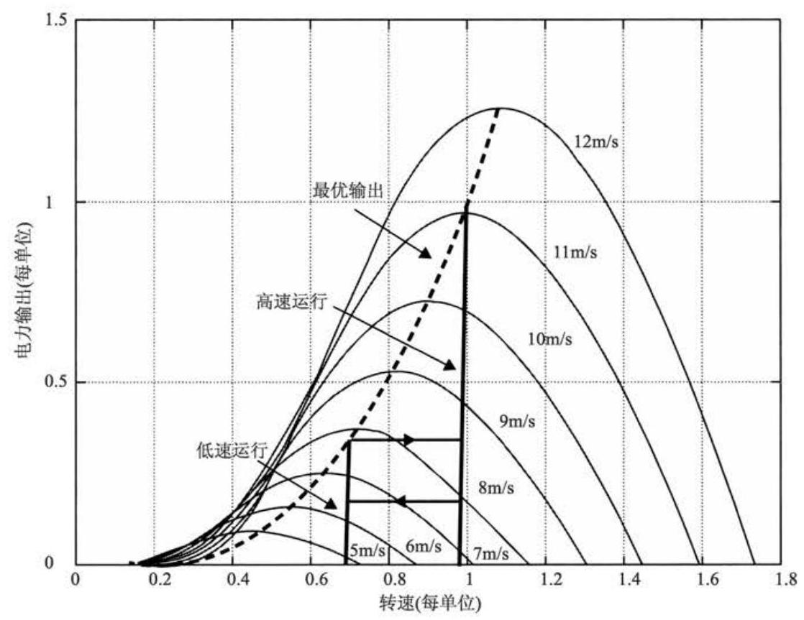

图 6.17 双速风力发电机组的运行轨迹

有两套独立绕组的感应发电机的发展已经允许在独立发电机上通过不同方式的连接来改变极数的变化。这种类型的发电机的优点是可以在 4 极和 6 极之间切换，它们之间的速度比例是 ${1.5}\left( {{1800}\mathrm{r}/\mathrm{{min}}}\right.$ 和 ${1200}\mathrm{r}/\mathrm{{min}}$ 对于 ${60}\mathrm{{Hz}}$ 系统)。考虑到两个可选的运行速度，可以使能量捕获更接近最佳。

很重要的一点是，在失速型风力发电机组中，对于给定的额定功率，从恒速到双速工作的切换会限制能量的获取，因为为了限制功率到额定值，双速风电机组的最大转速被限制为恒速。增加的发电量只是正常发电量的 2% 或 3%。然而，考虑到噪声因素，双速运行在失速型风力发电机组上是合适的。

对于变桨距控制风力发电机组, 相比于恒速机组, 其能量获取要去掉双速运行的功率等级和转速基准。相关的叶轮直径和弦长的选择接近最佳值时, 能量获得大约为 3%。但是，当基准设计最佳时，可以获得 10% 的增量。

双速方案的缺点如下所述:

(1)额外的发电机费用。

(2)需要改变运行频率的额外的开关设备。

(3)每次速度的变化都需要对风力发电机组进行控制。

(4)每次速度变化时发电机的断开会造成能量损失。

### 6.9.2 可变滑差方案

可变滑差是恒速和变速之间的折中方案(Bossanyi and Gamble,1991; Pedersen,1995)。变滑差发电机本质上是转子电路上带有连续可变电阻器的感应发电机，转子电路由高频半导体开关控制。在额定功率以下，它的效果就像普通的恒速感应发电机。在额定功率以上, 有效的电阻控制可以使气隙转矩得到控制, 并且使滑动速度发生变化，这种特性类似于变速系统。通常的速度变化范围是大约 10%。

它比变速系统的成本低，而且有很多其他的优点，特别是对传动链转矩的控制和超过额定功率后空气动力学转矩波动的滤除。在额定功率以下, 它不能增加空气动力学效率 (也没有变流器损失), 也不能控制功率因数, 但是在额定功率以上闪变减弱，功率输出平滑。

通过在发电机转子上安装变阻器和控制电路 (Heier, 2006) 可以去掉滑差。 控制功率电子开关的信号利用无触点光学器件发送到旋转轴。

通过滑环安装在外部的优点是更容易吸收额定功率之上时所产生的热量。反之, 它是大容量发电机的限制因素。

### 6.9.3 变速方案

通过在发电机(可能是同步发电机或者感应发电机)和电网之间加入变流器， 发电机转速就可以与电网频率解耦，并允许风轮速度有变化，也能控制发电机气隙转矩。允许风轮速度的变化同时允许最大能量吸收的变化, 发电机的气隙转矩或许可以被控制并且机械载荷下降。同步或者感应发电机变速的另外一种办法就是利用绕线式转子感应发电机，还有可变滑环，用变流器代替电源电路里的外部电阻。上述办法被称为双馈感应发电机 (DFIG)，并且被广泛应用。

变速运行有如下优点:

(1)在额定速度下，风轮速度可以随风速变化以保持最大空气动力学效率。

(2)低风速下叶轮速度的降低减小了气动噪声——减小低风速下的噪声尤其重要，此时周围风的噪声不足以遮盖风力发电机组产生的噪声。

(3)风轮可以作为飞轮，以便在传动链之前除去空气动力学转矩波动——在叶片穿越频率下这是特别重要的。

(4)对气隙转矩的直接控制使齿轮箱超过规定平均水平的转矩偏差保持很小。

(5)有功功率和无功功率都可以控制，这样可以维持功率因数，甚至可以用变速运行风电场作为无功功率源来补偿电网中其他用户不良的功率因数。对于大型的风电场, 变速风电机组比恒速风电机组更容易满足电网运营商对于电网规范 (标准)的需求。

(6)变速风力机同样可以给出较高的功率(电压)质量，归功于它们开发的更平滑功率输出。应用在逐步连接发电机和大功率变流器最大限度地减少电气连接中的瞬变。

实际运行时, 频率转换的损失可能占几个百分点, 抵消了额定功率下的空气动力学功率的增加。就风能的获取而言, 往往很少在双速和变速风力机间选择。但是, 降低载荷的可能性对于现在绝大多数以某种形式变速运行的兆瓦级风力发电机组非常重要。实际上, 大型风力机在叶片穿越频率上的气动扭矩变化相当明显, 这是由于风轮的直径尺寸与纵向湍流的长度尺度相当引起的。

显然, 变速驱动和变流增加了成本, 但要与其带来的优点作相应的权衡。变速驱动和变流的其他不利因素还包括增加了系统控制的复杂性, 并且变流系统会产生电噪声和谐波。因为采用绝缘栅双极晶体管 (IGBTs) 可以达到高频变化, 所以现代的 PWM 变流器比早期使用晶闸管的不控整流设计产生的低阶不良谐波 (例如,第5,7,11,13次谐波等) 水平低得多。如果没有充分考虑到电缆隔离保护,风力发电机组中的电噪声对于控制信号来说是个问题。光纤通信的应用日益增多, 光纤通信不会对风力发电机组控制产生影响。

目前, 主要有两种方法来实现变速运行, 一是 “宽带” 变速, 其中发电机的定子通过变流器连接到电网; 二是 “窄带” 变速, 其中发电机的定子和转子都连接到电网, 定子直接与电网相连, 转子则通过滑环和变流器连接到电网。

宽带变速允许带载从零变到额定速度, 但是所有功率输出必须通过变流器。 窄带变速允许使用价格相对便宜的变流器, 因为只有很少一部分的电能通过它, 但是速度也只能是在很小的范围内变化,一般两边都是同步速度的 20% < 40%。实际上, 这已经足够实现变速运行的所有优点, 这种方法得到了普遍运用。它的缺点是滑环需要维护。

风力机无论是在较窄还是较宽的变速范围，变流器由两个背靠背电压源变流器通过直流连接而成。电压源变流器将电源整流成为直流母线, 然后形成电网频率或者回馈给发电机。可以从较广范围内的发电机的速度或者从 DFIG 风力机的转子频率中整流成直流或逆变成电网频率。无论在哪种情况下，控制系统都是通过测量发电机旋转速度来工作的，并且应用需求的转矩来保证气动风轮在比较宽的风速范围处于最佳叶尖速比。

图 6.18 展示了变速风力机的控制对象。叶轮速度得到测量, 并且一旦达到切入转速,变速发电为了靠近最佳曲线 $\left( {O - A}\right)$ 应用某力矩。在最大旋转速度 $\left( {\text{ 点 }A}\right)$ ， 由变流器维持直到叶片变桨距控制输入功率。

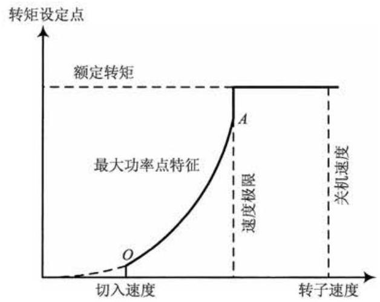

图 6.18 变速风力机的控制目标

图 6.19(a) $\sim$ (e) 展示了风力机系统的一般应用。

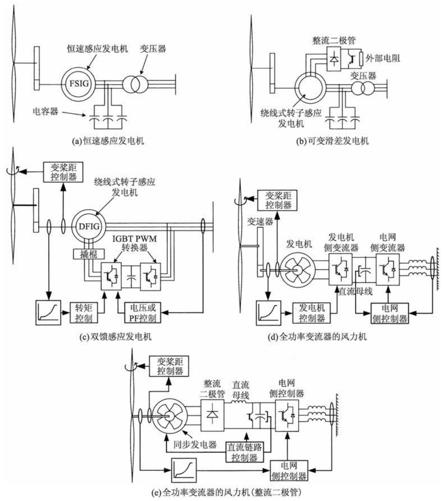

图 6.19 风力机架构 (Anaya Lara, 2009)

(1)图 6.19(a) 展示了投切电容器恒速(鼠笼型)感应发电机来提升输出功率因数。当风力功率增加时, 这些电容器可能转换提供更多的无功功率。

(2)在图 6.19(b) 中，类似的功率因数校正电容器连接到绕线式转子感应发电机的定子端。然而, 转子回路有额外的转子电阻, 由脉宽调剂 (PWM) 开关控制, 来进行可变滑差控制。

(3)在图 6.19(c) 中，可控转子电阻由背-背变流器取代(利用绝缘栅双极性晶体管, IGBT), 将转子连接到电网。这样使变速运行在一个受限制的速度范围内, 取决于转子回路里功率流的方向。尽管变流器有开关损耗，这种布局防止了能源在外部转子电阻内被吸收。发电机速度和功率因数的控制是由转子侧的变流器完成的, 此时电网侧的变流器保持直流母线电压。保护电路是为了在 AC 网络出现故障时保护发电机侧的变流器, 并且协助保证风力机在这种故障中能够持续运行。

(4)发电机的所有能量(可能是同步类型也可能是感应类型)整流成直流如图 6.19(d) 中的拓扑。发电机转矩和励磁都将由机组侧变流器控制而电网侧变流器则维持直流母线电压。电网侧变流器可以控制电网电压或者无功功率流入电网。

(5)另外一种排列如图 6.19(e) 所示，电网侧变流器控制发电机输出功率(从而控制风力机速度)，而机组侧是由简单二极管搭建的直流-直流变流器。那么发电机就必须是同步类型, 不是绕线转子就是永磁, 但是二极管整流相比于可控性 IGBT 变流器有更低的功耗。

### 6.9.4 变速方案的其他途径

有许多方法可以实现变速方案, 尽管它们都没有商业应用。它们包括如下内容:

(1)应用差动齿轮箱，带有由变速电动机/发电机控制(Law 等，1984；Burton 等，1990)或由液压泵/液压马达控制(Henderson 等，1990)的第三个轴。

(2)机械连续可变传动系统，如已经开发的汽车应用系统。

## 6.10 发电机的类型

恒速风力发电机组不同于传统的发电机组, 因为它用的是感应发电机, 而不是同步发电机。这种选择是驱动系统中阻尼的需要, 阻尼是由叶轮周期性的转矩变化造成的。

同步发电机和感应发电机在定子上有相似的绕组分布, 当接到三相电压时, 可以产生固定速度的旋转磁场。但是两种发电机的转子是完全不同的 (Hindmarsh, 1984; McPherson, 1990)。同步发电机的转子上装有磁体, 转子磁场与定子的相对运动使其在同步速度下运行。发出功率时, 转子上的磁体直接受到外部电流励磁。 尽管转子运行在与定子磁场相同的速度下，但是在外加力矩的作用下，它领先定子磁场一定的角度。与之相比，传统的感应发电机的转子采用“鼠笼”型绕组，当转子笼条切割定子产生磁场时绕组中便产生电流。因此, 感应发电机只有在转速大于定子磁场转速时才能产生转矩。这个“滑差速度”正比于外力矩。

同步发电机运行可以假设为转矩弹簧模拟转矩正比于转子和定子磁场间的夹角, 这个角被称为载荷角或功率角。与之相比, 感应发电机可以看作扭转阻尼器, 它的转矩正比于转子和定子磁场(滑差速度)间的速度差。图 6.20 是一个简单的示意图。显然, 如果安装了同步发电机的恒速风力发电机组简化模型, 受到风力发电机组风轮周期性转矩的激励，则这样传动链中就没有控制转矩波动的阻尼。这是个简单的双弹簧、双部件系统。与之相比, 如果装有感应发电机, 则发电机与电网的连接用扭转阻尼器代替。风力发电机组风轮的主要周期性扭矩具有叶片穿越频率, 但是不利的是, 它通常与连接在电网上的小型同步发电机的固有振动频率相一致。

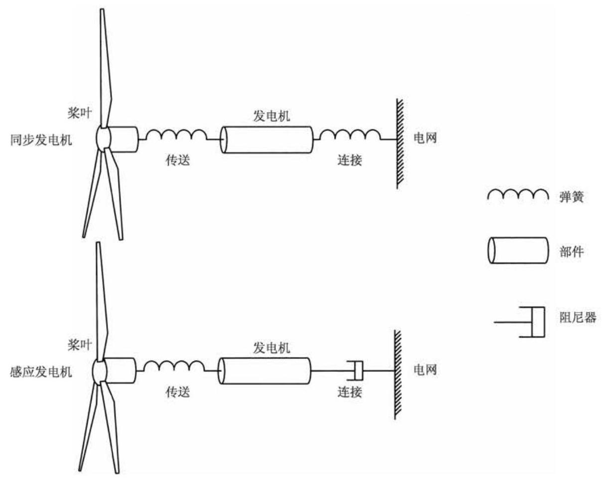

图 6.20 恒速风力发电机组的机械比较

在实际运行中, 同步发电机通常加装额外的笼型阻尼绕组, 但是对于风力发电机组的应用实际上不能提供需求的阻尼度, 而且在更高额定容量时 (如大于 1MW), 二阶的效应有降低感应发电机的阻尼的倾向 (Saad-Saoud and Jenkins, 1999)。但基本的原则是感应发电机提供的阻尼对于恒速风力发电机组是必需的。

与之相比, 变速风力发电机组发电机没有直接连接到电网上, 而是通过大功率变流器隔开。因此, 可以应用同步发电机。

### 6.10.1 同步发电机的应用

所有大型水电、化石燃料或者核能电厂都用的是同步发电机。对于大功率发电机，同步发电机性能优于感应发电机，感应发电机具有如下缺点:

(1)转子中的阻尼造成比同步发电机更大的能量损失，必须布置消除转子中的热量的装置。

(2)所有用于励磁的无功功率必须由电网(或本地电容)提供，如果使用本地电容, 则当断开与电网的连接时就有发生自激振荡的危险。

(3)不能直接控制过端电压或无功电流。

(4)对于三相电网的故障，感应发电机不能产生持续的故障电流。

(5)对电压不稳定的影响，这对有限的风力发电不是问题，但是对于大型风电场就需要考虑了。

因此，在风力发电机组的早期发展中，通常都要考虑使用同步发电机。例如， 美国的 Westinghouse 和英国的 Howden 都在驱动链中使用液力耦合器提供阻尼。 英国风能组织安装了250kW 使用弹簧阻尼系统的同步发电机，通过一个复杂的变速齿轮箱连接到一个 3MW 的同步发电机上 (Law, Doubt 和 Cooper, 1984)。但是, 以上提及的大型风力发电机组的同步发电机的应用, 现在只有历史价值了。

### 6.10.2 直驱发电机

直接由风力发电机组风轮驱动而没有增速齿轮箱的发电机的应用是很受关注的, 并且有许多制造商提供这种风力发电机组。旋转发电机的输出功率一般都可以由下式描述(Laithwaite 和 Freris, 1980):

$$
P = K{D}^{2}{Ln}
$$

式中, $D$ 为转子直径; $L$ 为长度; $n$ 为转速; $K$ 为常数。

因此，可以认为，如果转速减小，则应该按比例增加发电机长度或增大其直径。 增大发电机直径更为经济，因为功率是按直径的平方而不是线性增大。因此，风力发电机组的直接驱动发电机一般都有较大的直径，但长度受到限制。

感应发电机要求转子表面到定子的距离 (即气隙) 非常小。这是由于所有的励磁都是由定子提供的, 必须确保有足够的气隙磁通密度。与之相比, 同步发电机在转子上有励磁系统, 这样就可以在较大的气隙下工作。由于机械和热的原因, 很难生产出很大直径的小气隙发电机。因此,直驱型风力发电机组使用同步发电机 (使用永磁激励或更多的是用绕线转子和磁体产生磁场)。使用同步发电机需要大功率变流器, 以便将发电机与电网解耦并允许发电机变速运行。如果使用永磁，那么无法对同步机组的励磁进行控制, 其输出电压随转速变化。那么或许需要使用额外的功率变流器来控制直流母线电压。非常大型的风电机组永磁发电机的制造非常困难，因为磁力会非常大。

直驱径向磁通同步发电机 (图 6.27) 使用电励磁直到最高级。永磁型励磁发电机可以是径向或轴向设计, 但是为了减限制稀土类永磁的成本, 转子和定子之间保持尽可能小的气隙，这样就可以产生很大的力。双气隙设计用来平衡永磁力 (Heier, 2006)。

完全去掉齿轮箱的另一种方法是一种混合方法, 就是齿轮箱的一或两个阶段和中速发电机通过全功率转换器连接。这样就有一个更简单和更可靠的齿轮箱可以使用带有相同尺寸的发电机 (EWEA, 2009)。更进一步的替换设计方法是使用齿轮箱的多个高速轴和多个发电机。这又导致一个紧凑和平衡的传动系统，但需要多个功率变流器并联。中速发电机一般是永磁同步发电机。

### 6.10.3 发电机系统的演变

图 6.21 展示了风力发电机系统的演变。早期风电机组使用单速或双速定速感应发电机(FSIG)，使用失速调节的空气动力学风轮或叶片变桨距控制在有效恒定速度(滑差小于 $3\%$ )运行。这种设计常应用在 ${1.5}\mathrm{{MW}}$ 级别的风力机上，但是大于这个级别的在控制传动系统振动和限制机械载荷就越来越困难。另外, FSIG 风力机很难满足应用在大型风电场电网规则的需求。使用转子电阻的变滑差风电机组得到了发展, 但使用转子电阻会有明显的损耗。

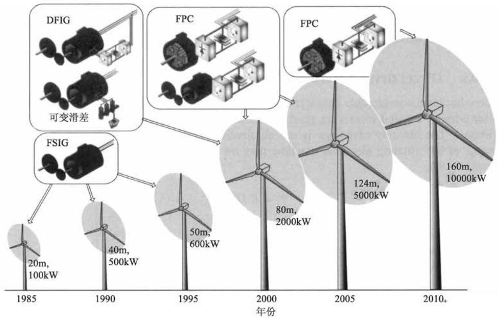

图 6.21 风力机发电机系统的演变

2000 年左右, 双馈感应发电机 (DFIG) 在大型风力机中越来越普遍, 在这种场合下，具有有限变速运行的优势，同时降低了成本，变流器只输出功率的一部分。 然而, 发电机转子需要滑环, 并且绕线转子感应发电机的气隙必须要小。未来可能的发展方向是使用无刷双馈发电机, 在这里不再使用滑环, 转子由第二个控制绕组励磁。这种方法不需要滑环和电刷，但至今尚未在商业上应用。

在 DFIG 体系结构被广泛实施的同时, 全功率转换 (FPC)设备用在由变速箱驱动的发电机和由空气动力风轮直接驱动的发电机上。绕线转子和永磁低速的大直径同步发电机已用于直驱应用程序。目前, 对于未来的大型风电机组发电机系统结构体系很少有共识。

## 6.11 传动链装配方案

### 6.11.1 低速轴装配

低速轴的功能是传递从风轮轮毂到齿轮箱的驱动转矩, 并将风轮的其他载荷传递到机舱。低速轴在轴承前后的安装可以分别实现两个功能，齿轮箱挂在轴后端连接在轴承外面, 由转矩臂承担驱动转矩。前轴承尽可能靠近轴/轮毂的连接法兰盘, 这样可以使悬臂质量形成的重力力矩最小, 其质量也决定了轴的疲劳设计。 两个轴承之间的距离通常要大于前轴承与风轮轮毂之间的距离, 这样是为了减小轴弯矩带来的轴承载荷 (图 6.22 为典型设计示意图)。

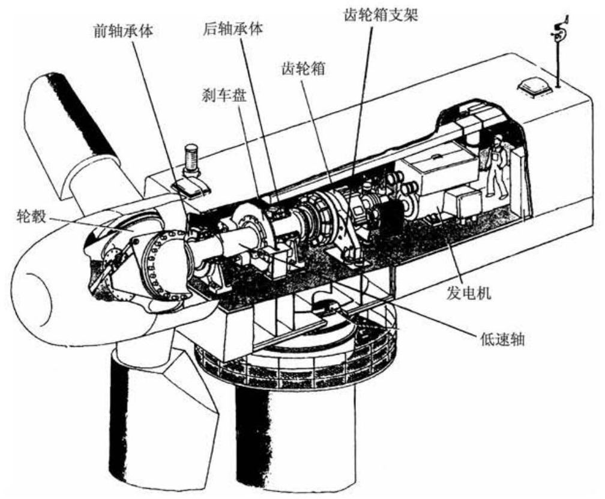

图 6.22 机舱中传统驱动轴安装示意图

相反的方法是在低速轴和塔架顶部之间的载荷传递上将齿轮箱制成一个整体，即“整体齿轮箱”。低速轴的前后轴承全在齿轮箱内，将其移到机舱前部使叶轮悬臂距离最小,并且将齿轮箱外壳的载荷传递到机舱底板上 (图 6.28)。很明显, 这种方法需要更结实的齿轮箱外壳, 它不仅要承受风轮载荷, 还要不能有削弱其功能的变形, 而且必须增加其前后长度以缓和由轴弯矩传来的轴承载荷。它的好处在于减小了底盘的面积, 并避免了独立的轴承需要的润滑, 其主要的缺点是变速箱的重新安装需要拆掉风轮。

一个越来越受欢迎的结构是上面提到的两个轴承中的后面的轴承在齿轮箱中。齿轮箱通常安装在前轴承的后面以减少后轴承的载荷, 并固定在机舱的两边以支撑底座。图 6.23 中是典型的布置,其中显示了 Nordex N-60 风力发电机组机舱的一个切面，图 6.24 也一样。注意:轴的锥度向直径方向的减小反映了弯矩的减小。这种布置的好处是齿轮箱外壳不再承担任何由悬臂质量或风轮平面外载荷引起的弯矩。

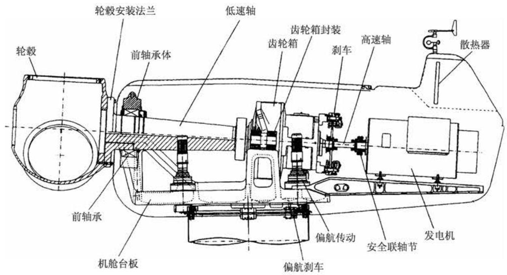

图 6.23 Nordex N-60 风力发电机组机舱结构 (由 Nordex 提供)

图 6.25 和图 6.26 是有相似驱动系统分布的 NEG-Micon 1.5MW 机组机舱, 而且安装了低速轴。

在使用直驱发电机的风力发电机组中, 低速轴的布置截然不同。低速轴将风轮轮毂与发电机转子相连, 并且是中空的, 这样就可以将其安装在同心的固定轴上,并且从机舱底盘上伸出来 (图 6.27)。

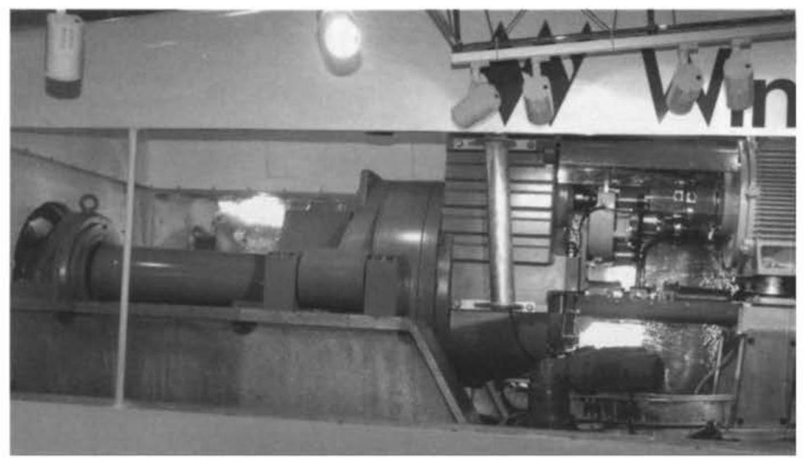

图 6.24 驱动系侧面图。通过切降机舱壁看到的部件, 从左到右的组件为低速轴前端轴承、 低速轴、齿轮箱支座、齿轮箱、带刹车的高速轴、发电机, 还可以看到造好的机舱底盘

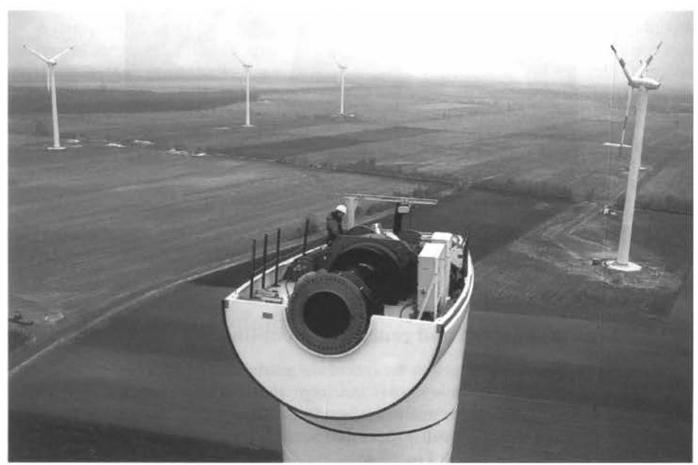

图 6.25 空中风力发电机组装配 (1)。安装了低速轴 (前) 和齿轮箱的 1.5MW NEG Micon 风力发电机组机舱视图。低速轴法兰盘中轮毂的安装螺栓孔环清晰可见 (由 NEG Micon 提供)

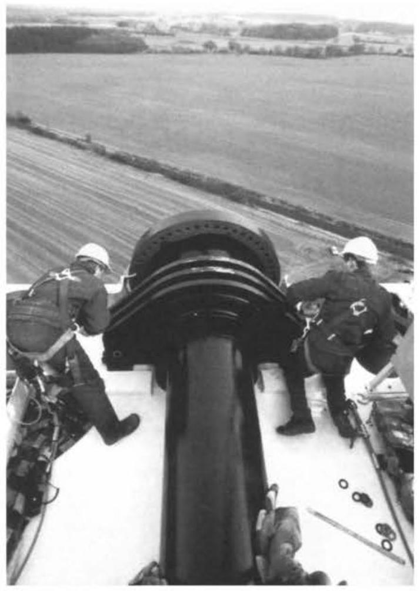

图 6.26 空中风力发电机组装配(2)。装完低速轴和前轴承的 1.5MW NEG Micon 风力发电机组示意图 (由 NEG Micon 提供)

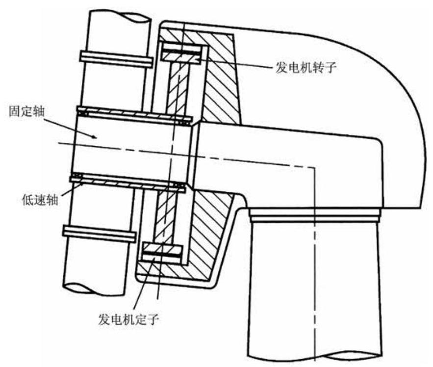

图 6.27 直接驱动发电机结构

### 6.11.2 高速轴和发电机的装配

发电机通常安装在齿轮箱后面，在机舱底盘的外延部分连接的驱动轴 “ 隔 台 座 台 座速轴”, 两端用柔性联轴器连接, 以配合发电机和齿轮箱之间的装配偏差。

发电机轴线通常与低速轴轴线发生偏置。这是因为除了机组装有作用于风轮的机械刹车外, 还有空气动力刹车的动作在低速轴的后端需要有通道。通常, 发电机要么偏置在机舱一侧, 这样会使机舱底板不对称; 要么垂直向上偏置, 这样底板上需要一个垂直的台阶。

通过转接管将发电机用螺栓固定到齿轮箱后面 (图 6.28), 这样可以得到更紧凑的结构。配合的表面必须仔细加工以保证同轴, 而且要有合适的通道连接发电机和齿轮箱输出轴。不管设计是否整齐，厂商能够采用才是最重要的。

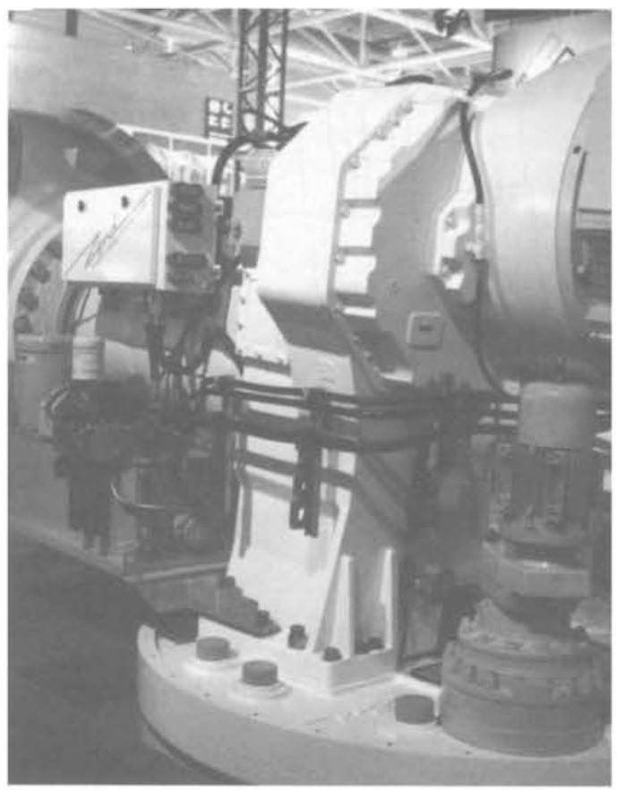

图 6.28 Zond Z-750 风力发电机组上集成的齿轮箱安装在圆形机舱底盘上, 轮毂在左边, 发电机的后面。在发电机下面可以看到电机驱动的偏航驱动器

发电机安装在机舱中的一个结果就是沿塔向下的输电电缆会随着机舱的偏航而纽缆。在一些大型风力发电机组中, 通过将发电机垂直安装在塔架顶部避免了电缆纽缆的问题产生, 并通过锥形齿轮箱驱动高速轴。还有一种解决电缆纽缆的方法是将发电机保留在机舱中,并在那里转换为更高的电压。

## 6.12 传动链的要求

传动链的转动力学对载荷产生主要影响，但是对恒速风力发电机组和变速风力发电机组的影响是不同的, 无论什么情况, 在设计阶段忽略传动链动力学的重要性, 其结果都是很严重的。

在变速的情况下，动力学问题可能很简单。传动链可以看作风轮和发电机的惯性模型,由转矩弹簧分开。这种响应系统的固有频率是很高的,量级一般为 $3 \sim$ 4Hz。但是这种模型仅限于阻尼很小的情况, 特别是在高于额定发电机的转矩保持恒定时 (低于额定的转矩将根据转速的函数来变化, 因而提供较小的阻尼)。来自风轮的空气动力阻尼很小，模型的波动会带来齿轮箱转矩很大的波动。在第 8 章中将介绍控制系统通过控制发电机合适的转矩来抑制这种情况，但确保外部频率不与共振频率匹配是很重要的, 它会使通过控制系统得到足够的阻尼变得很困难。

在恒速情况下，直接联网的感应发电机提供很大的阻尼，由于气隙转矩随发电机速度的增加而急剧增加。与变速情况相比，转矩滑差曲线完全改变了动力学性能，导致一阶模态频率很低，通常接近 $1\mathrm{\;{Hz}}$ 。阻尼因数主要取决于发电机的滑差: 有 ${0.5}\%$ 额定滑差的发电机在共振频率下能产生 $2 \sim  5$ 倍的动态峰值，如果是 $2\%$ 的滑差则其倍率小于 $1 \sim  {1.5}$ 。对于叶片穿越频率，峰值位置是很严格的:如果叶片穿越频率紧靠峰值位置，则在这个频率下齿轮箱会产生很大的转矩和电功率波动。变桨距控制下，该情况会更加明显。

两叶片风力发电机组的叶片穿越频率一般更接近于共振尖峰，三叶片风力发电机组的叶片穿越频率要高一些, 而动力学倍率更低。然而, 即使是三叶片风力发电机组在高风速变桨距控制中,在叶片穿越频率下功率和转矩波动达到 $\pm  {50}\%  \sim \; \pm  {100}\%$ 也是正常的。

高“滑差”发电机的应用可以改善这种情况，但它有两个缺点，第一，“滑差”每 1%就相当于 1%的额外损耗，在额定风速下减少了发电量；第二，这些额外损耗等于发电机中发出的热量, 这样更不容易使发电机冷却, 特别是在大型风力机中。

对于高 “滑差” 发电机, 有时在齿轮箱和发电机之间设计液力耦合器。这种设备产生正比于“滑差”速度的转矩，与高“滑差”发电机有同样的缺点。

有时使用的另一种技术是通过在传动链中引入额外的扭转力以减小共振频率。可以使用中空轴、柔性低速联轴器或齿轮箱, 甚至整个底盘的柔性支架。然而, 频率的减小伴随着阻尼的进一步损失, 甚至因此有必要将额外机械阻尼和扭转力进行合并, 这对于设计工程师来说是很困难的。高速轴上的扭转力是不实际的, 由于需要达到必要柔性的大角度移动，需要高速轴旋转半圈，而低速轴只需要旋转 ${1}^{ \circ  }$ 或 ${2}^{ \circ  }$ 。一个有趣的变形(Leithead 和 Rogers,1995)是将发电机装到柔性设备上。 这种系统可以调整为在叶片穿越频率下吸收能量，通过额外的发电机外壳缓解这个设备的振动。这个模态也会影响发电机的“滑差”速度(转子和外壳速度的不同),因此,受到“滑差”特性的抑制。然而,发电机外壳的改变需要达到 ${10}^{ \circ  } \sim  {15}^{ \circ  }$ , 这对于工程师来说也不容易。

## 6.13 风轮相对于塔架的位置

### 6.13.1 上风向布置

上风向布置是最普遍的选择，其主要的优点是塔架的阴影影响远小于相同的叶片与塔架之间的间距，减小了叶片上的动力载荷以及间歇噪声影响。这种设计要避免叶片与塔架相撞的风险，需要在湍流风载下准确地预测叶片的变形。

通过增大叶片和塔架的空隙，可以将低速轴向上倾斜或增大风轮伸出量。保持叶轮伸出量较小是合适的，这样可以使低速轴和机舱底盘的弯矩最小，所以低速轴通常向上倾斜 ${5}^{ \circ  }$ 或 ${6}^{ \circ  }$ ，以提供必要的叶片与塔架之间的间距，以功率输出小幅度减少为代价。

### 6.13.2 下风向布置

在风力发电机组塔架后面风力的不足远比塔架前面的严重，Powles (1983) 提出在八角形塔架的下游, 4 倍塔架直径范围内存在着没有向前速度的湍流区域。 超过这个距离，风力恢复是很快的，在下游 7 倍塔架直径距离处可减少到 25%。

除了塔架后面平均风速的不足, 产生的湍流还导致了除现有波动以外的风速波动。两种效果的结合使塔架后面的叶片处在混乱的环境中。叶片每次经过塔架的时候都会受到巨大的负冲击载荷，加重了叶片的疲劳损坏，而且还听到塔架不受欢迎的低沉噪声。设计者必须通过安排好叶轮平面相对于塔架的位置来减轻这两种影响, 但是机舱成本就会不可避免地增加。

下风向布置的一个主要好处是可以使用非常有弹性的叶片而没有与塔架相撞的风险。这种叶片受到塔影卸载的影响较小，因为风载使叶片挠曲自原始位置远离塔架。

## 6.14 塔架的刚度

风力发电机组设计中考虑的一个关键因素是避免在转动或叶片穿越频率下, 塔架的摆动与叶轮推力波动发生共振。对于塔架的前后摆动阻尼比只有 $2\%  \sim$ 3%，对于两边的摆动则更小，所以如果叶片穿越频率和塔架的固有频率一致，则会产生不可接受的巨大应力和位移。这一部分由观察一些励磁的相对震级开始。

### 6.14.1 叶片穿越频率的随机推力载荷

当三个叶片的载荷加在一起时, 由于风切变、偏航等引起的叶片载荷确定性变化大部分被抵消, 湍流随机载荷在叶片穿越频率不会造成明显的风轮推力。量的大小可根据式 (5.28), 通过假设风的波动和由此产生的载荷波动之间是线性关系来简单推测。

5.12.4 节中提到的三叶片风力机的例子, 如果穿过风轮的风速变化完全相关,风轮推力的总方差只有约 20%,比预想的要小。因此,从式 (5.138) 得

$$
{\sigma }_{\mathrm{T}} = \left( {\frac{1}{2}{\rho \Omega }\frac{\mathrm{d}{C}_{1}}{\mathrm{\;d}\alpha }}\right) {\sigma }_{\mathrm{u}}\oint {{cr}\mathrm{\;d}r}\left( {0.8}\right) \tag{6.14}
$$

其中，积分符号 $\oint$ 表明积分是在整个风轮上的。使用式(5.139)风轮推力的功率谱表示式表明，叶片穿越频率的 $\pm  {10}\%$ 以内的推力波动的方差约占总数的 ${1.4}\%$ 。 尽管这是很小的一部分(可以从图 5.40 中看出)，该频率范围内推力波动的标准差的比例高得多， ${\sigma }_{\mathrm{T}}$ ，即 $\sqrt{0.014} \cong  {12}\%$ 。叶片穿越频率的 $\pm  {10}\%$ 内的推力波动标准差以 ${\sigma }_{\mathrm{T}{.3}\mathrm{p}}$ 表示，可以得到

$$
{\sigma }_{\mathrm{T},\mathrm{{3p}}} \cong  {0.1}\left( {\frac{1}{2}{\rho \Omega }\frac{\mathrm{d}{C}_{1}}{\mathrm{\;d}\alpha }}\right) {\sigma }_{\mathrm{u}}\oint {{cr}\mathrm{\;d}r} \tag{6.15}
$$

怎样把这个风轮推力与最大稳定运行推力载荷相比较? 对于运行在额定风速的变桨距机组来说, 风轮推力近似为

$$
T = \frac{1}{2}\rho {\Omega }^{2}\oint {C}_{1}\left( r\right) c{r}^{2}\mathrm{\;d}r
$$

其最大稳定值可以通过设定 ${C}_{1}\left( r\right)  = {1.5}$ 来推算,得

$$
{T}_{\max } = \frac{1}{2}\rho {\Omega }^{2}{1.5}\oint c{r}^{2}\mathrm{\;d}r \tag{6.16}
$$

因此，叶片穿越频率 $\pm  {10}\%$ 以内的推力波动与最大稳定推力的比为

$$
\frac{{\sigma }_{\mathrm{T},\mathrm{{3p}}}}{{T}_{\max }} \cong  \frac{{0.1}\left( {\frac{1}{2}{\rho \Omega }\frac{\mathrm{d}{C}_{1}}{\mathrm{\;d}\alpha }}\right) {\sigma }_{\mathrm{u}}\oint {cr}\mathrm{\;d}r}{\frac{1}{2}\rho {\Omega }^{2}{1.5}\oint {c{r}^{2}}\mathrm{\;d}r} = \frac{{0.1}\left( \frac{\mathrm{d}{C}_{1}}{\mathrm{\;d}\alpha }\right) {\sigma }_{\mathrm{u}}}{1.5\Omega }\frac{\oint {cr}\mathrm{\;d}r}{\oint {c{r}^{2}}\mathrm{\;d}r} \tag{6.17}
$$

令 $\mathrm{d}{C}_{1}/\mathrm{d}\alpha$ 为 ${2\pi }$ ,并且需要注意 $\oint c{r}^{2}\mathrm{\;d}r\oint {cr}\mathrm{\;d}r$ 约等于 ${0.6R}$ ,得出

$$
\frac{{\sigma }_{\mathrm{T}{.3}\mathrm{p}}}{{T}_{\max }} \cong  \frac{{0.1}\left( {2\pi }\right) {\sigma }_{\mathrm{u}}}{{1.5\Omega }\left( {0.6R}\right) } \cong  {0.7}\frac{{\sigma }_{\mathrm{u}}}{\Omega R} \tag{6.18}
$$

湍流的标准差 ${\sigma }_{\mathrm{u}}$ 是 ${1.8}\mathrm{\;m}/\mathrm{s}$ ，叶尖速度为 ${65}\mathrm{m}/\mathrm{s}$ ，力矩比接近0.02。

值得注意的是， $S - N$ 曲线 $\log  - \log$ 图逆斜率 $m = 4$ 的材料，其损伤疲劳等效的应力范围是窄带过程应力标准差的 3.36 倍，可以看出，在塔架的抗疲劳设计中，接近叶片穿越频率的推力波动的损伤等效载荷范围是在所有因素被考虑情况下最大推力的 6.5%左右。

### 6.14.2 叶片螺距误差引起的塔顶力矩波动

三个叶片桨间距的意料外差异会导致叶根力矩 ${M}_{\mathrm{Y}1},{M}_{\mathrm{Y}2}$ 和 ${M}_{\mathrm{Y}3}$ (图 5.36) 的永久性差异，这将转变成旋转力矩，施加到机舱。这反过来会在塔顶旋转频率上施加一个正弦力矩 ${M}_{\mathrm{Y}}$ 。

考虑风力机叶片螺距误差 ${\Delta \theta }$ ， $- {\Delta \theta }$ 和 0 依次在 1,2 和 3 叶片上。叶片 1 的攻角下降 ${\Delta \theta }$ ，使用下式叶根力矩变为

$$
\Delta {M}_{\mathrm{Y}1} = \frac{1}{2}\rho {\Omega }^{2}\frac{\mathrm{d}{C}_{1}}{\mathrm{\;d}\alpha }\left( {-{\Delta \theta }}\right) {\int }_{0}^{R}c{r}^{3}\mathrm{\;d}r \tag{6.19}
$$

当叶片 1 和叶片 2 垂直相差 ${30}^{ \circ  }$ 时塔顶力矩波动达到其最大值和最小值，其幅度为

$$
\Delta {M}_{\mathrm{Y}} = \frac{1}{2}\rho {\Omega }^{2}{2\pi }\left( {\Delta \theta }\right) {\int }_{0}^{R}c{r}^{3}\mathrm{\;d}r\left( {2\cos {30}^{ \circ  }}\right) \tag{6.20}
$$

比较该力矩与最大稳定推力下塔的平均值具有指导意义。轮毂以下深度 $R$ 处,力矩比为

$$
\frac{\Delta {M}_{\mathrm{Y}}}{{T}_{\max }R} = \frac{\frac{1}{2}\rho {\Omega }^{2}{2\pi }\left( {\Delta \theta }\right) {\int }_{0}^{R}c{r}^{3}\mathrm{\;d}r\left( \sqrt{3}\right) }{\frac{1}{2}\rho {\Omega }^{2}{1.5}\% {r}^{2}\mathrm{\;d}{rR}} \cong  \frac{{2\pi }\left( {\Delta \theta }\right) {0.7}\left( \sqrt{3}\right) }{{1.5}\left( 3\right) } \cong  {1.7}\left( {\Delta \theta }\right)
$$

(6.21)

${\int }_{0}^{R}c{r}^{3}\mathrm{\;d}r/\oint c{r}^{2}\mathrm{\;d}r$ 近似等于 ${0.7R}/3$ 。

如果使用 GL 风电机组认证准则 2003 版规定的默认叶片螺距误差 ${0.3}^{ \circ  }$ ,那么，力矩比等于 ${0.9}\%$ 。因此，在旋转频率叶片桨间距力矩的误差范围大概是轮毂以下 $R$ 处额定推力，约 ${1.8}\%$ ，显著小于叶片穿越频率随机推力载荷在该位置的等效疲劳力矩范围，约 6.5%。

### 6.14.3 风轮重量不平衡产生的塔顶力矩波动

三个叶片重量间的意料外差异会导致一个以低速轴为轴的正弦重力力矩, 并会传递到塔架。虽然 IEC 61400-1 第三版和 GL 风电机组认证准则 2003 版规定， 考虑风轮重量不平衡要根据制造商的说明书, 后者的 1999 版规定, 平衡风轮的重量偏心率为 ${0.005R}$ ,此处也这么认为。

以 ${80}\mathrm{\;m}$ 风力机直径为例,叶片重量一般为 ${7.5}\mathrm{t}$ ,所以三个叶片的重量加上轮毂的重量使总风轮重量达 ${45}\mathrm{t}$ 。偏心距 ${0.005} \times  {40} = {0.2}\mathrm{\;m}$ ,塔顶一侧到另一侧力矩范围约为 ${180}\mathrm{{kN}} \cdot  \mathrm{m}$ 。

像以前一样, 该力矩与最大稳定推力下塔架力矩平均值进行比较。后者取 ${250}\mathrm{{kN}} \cdot  \mathrm{m}$ (图 5.39),轮毂下方深度 $R$ 处塔架力矩为 ${10000}\mathrm{{kN}} \cdot  \mathrm{m}$ 。因此,风轮重量不平衡产生的塔架旋转频率力矩范围约为轮毂下 $R$ 深度处额定推力力矩的 1.8%。

基于上述可以看出，重量不平衡的影响与叶片螺距误差造成的影响大致相同。 然而, 当动力放大也考虑进去的话, 重量不平衡的影响更具破坏性, 因为侧-侧塔架振荡的阻尼比可能比前-后振荡的阻尼比小一个数量级。这是因为气动学阻尼对侧一侧运动阻尼的影响可以忽略不计。

### 6.14.4 塔架刚度分类

风力发电机组塔架通常根据塔架的固有频率与激振频率的关系来进行分类。 塔架的固有频率大于叶片穿越频率时称其为刚性塔架, 而塔架的固有频率在旋转频率和叶片穿越频率之间时称为柔性塔架。如果固有频率小于旋转频率, 则塔架被称为超软塔架。

如果塔架被设计为满足其强度的需要而不是更高, 则它的频率分类主要取决于塔架高度与风力发电机组直径的比例, 比例越高, 塔架就越柔。刚性塔架的优点是允许风力发电机组加速而不用通过共振频率, 并且发出较小的噪声。但是, 当刚性塔架需要额外的材料供应而不要求强度时, 采用柔性塔架架更加合适。

## 6.15 人员安全和通道问题

完整的风力发电机组的设计要包括对运行和维修人员的必要安全要求。最低的要求包括以下几项:

(1)在塔架、机舱和轮毂的关键位置安装“紧急停机”按钮，使人员在发生紧急情况时能够停止风力发电机组及其系统。

(2)在每个塔架底部安装“远程/本地”开关。使技术人员能够充分控制风力发电机组, 当进行维修时, 可以通过切换开关到 “本地” 位置进入。这样消除了第三方远程控制重启风力发电机组的必要。

(3)安装通往机舱具备防坠落系统的梯子，这包括一个可以在整个梯子上滑动的在某个全风电缆上的防坠落装置, 位于梯子的中间位置, 或用螺栓固定在梯节的钢性导轨上。正常使用时, 防坠落装置通过错线连接到攀爬者向上提或降下来, 每当发生坠落时，错线上的张力释放一把钳子，钳子再次锁定到电缆或导轨上。

(4)在塔架中安装中间着陆或较小的休息平台，让攀爬人员休息。

(5)可选的机舱出口，用于塔里发生火灾的情况——可以采用惯性滑轮设备的形式，使人员能够通过机舱地板上的出口下去。

(6)固定风轮和偏航机构的锁定设备——没有充分考虑到风轮刹车和偏航刹车, 会有在意外释放和偶尔需要解除它们来进行维护所带来的危险。风轮锁定装置应该作用于低速轴，这样它的效力会不完全取决于齿轮箱。设备一般由装在固定壳体上的销子构成，它可以用在轴圆盘上的洞上。

(7)机舱中旋转部分的保护。

(8)连接机舱外工作人员安全带的合适的固定装置。

特别需要注意的是，塔架顶部和机舱之间的通道要避免偏航的突然移动造成伤害。现代风力发电机组的安全系统只有当风力机停机的时候才允许到机舱。

设计者在早期需要考虑在任何天气下进入机舱的需要。桁架式塔架没有考虑提供任何有关天气的保护，所以可以维护的天数就很有限了。如果机舱盖必须打开才能有人员进出活动，这时也会有相似的限制。

要提供上下乘坐的工具及备用设备。如果塔架内部被中间的平台分开，这些操作就必须在外面完成, 这样就会受到天气的限制。

随着风力机尺寸的增加，相应的塔架高度也增加，那么无辅助攀爬变成了一个力气活。因此，EN 50308:2004(风力机一保护措施:设计、运行和维护的需求)规定, 电梯是通向风力机的首选方法, 反对梯子的使用。然而, 尖细塔顶端的直径越往高处变得越小, 乘电梯到达塔尖几乎是不现实的。无论怎样, 一定数量的梯子攀爬在电梯运行和维护的同时还是需要的。对较大的风力机，一般大于 ${60}\mathrm{\;m}$ 轮毂高度, 法律规定必须使用电梯, 一些国家只有在紧急事件时使用梯子。

降低维护人员体力需求的另外一种方法就是辅助攀爬设备的使用，卷扬机上的电缆绑在身上很明显可以在上升过程中抵消一部分自身重量。

TUV/NEL 报告(2007)提供了风力机日常运维选项的论述。

电力安全的标准对所有电力设备都适用。但是,对塔架和机舱之间的电缆通道必须小心地进行处理，以避免它们因缠绕摩擦产生潜在的危险。如果变压器位于塔底或机舱内，而不是在地面被隔离起来，则应该对它进行隔离将火灾的危险降到最低。

## 参考文献

Anaya-Lara et al. (2009) Wind Energy Generation, Modelling and Control 2009, John Wiley & Sons, Ltd, Chichester.

Armstrong, J.R.C. and Hancock, M. (1991) Feasibility study of teetered, stall-regulated rotors. ETSU Report No. WN 6022.

Bossanyi, E.A. and Gamble, C.R. (1991) Investigation of torque control using a variable slip induction generator. ETSU WN-6018, Energy Technology Support Unit, Harwell, UK.

Burton, A.L., Mill, P.W. and Simpson, P.B. (1990) LSI post-synchronization commissioning. In: Proceedings of the 12th BWEA Conference, pp. 183-193. Mechanical Engineering Publications, Bury St Edmunds, UK.

Coiante, D. et al. (1989) Gamma 60 1.5 MW wind turbine generator. In: Proceedings of the European Wind Energy Conference, pp. 1027-1032. Glasgow.

Corbet, D.C. and Morgan, C.A. (1991) Passive control of horizontal axis wind turbines. In: Proceedings of the ${13}^{\text{ th }}$ BWEA Annual Conference, pp. 131-136. Mechanical Engineering Publications, Bury St Edmunds, UK.

Derrick, A. (1992) Aerodynamic characteristics of novel tip brakes and control devices for HAWTs. In: Proceedings of the ${14}^{\text{ th }}$ BWEA Annual Conference, pp. 73-78. Mechanical Engineering Publications, Bury St Edmunds, UK.

Engstrom et al. (1997) Evaluation of the Nordic 1000 Prototype. In: Proceedings of the European Wind Energy Conference, pp. 213-216. Dublin.

EWEA (2009) Wind energy, the facts. Earthscan, London.

Falchetta et al. (1996) Structural behaviour of the Gamma 60 prototype. In: Proceedings of the European Union Wind Energy Conference, pp. 269-271. Göteborg.

Fuglsang, P. and Thomsen, K. (1998) Cost optimisation of wind turbines for large-scale offshore wind farms. Riso National Laboratory Report No. R-1000.

Jamieson, P. and Agius (1990) A comparison of aerodynamic devices for control and overspeed protection of HAWTs. In: Proceedings of the ${12}^{\text{ th }}$ BWEA Annual Conference, pp. 205-213. Mechanical Engineering Publications, Bury St Edmunds, UK.

Jamieson, P. and Brown, C.J. (1992) The optimisation of stall regulated rotor design. In: Proceedings of the ${14}^{\text{ th }}$ BWEA Annual Conference, pp. 79-84. Mechanical Engineering Publications, Bury St Edmunds, UK.

Joose, P.A. and Kraan, I. (1997) Development of a tentortube for blade tip mechanisms. In: Proceedings of the European Wind Energy Conference, pp. 638-641. Dublin.

Heier, S. (2006) Grid Integration of Wind Energy Conversion Systems, 2" Edition. John Wiley & Sons, Ltd, Chichester.

Henderson, G.M. et al. (1990) Synchronous wind power generation by means of a torque limiting gearbox. In: Proceedings of the ${12}^{\text{ th }}$ BWEA Conference, pp. 41-46. Mechanical Engineering Publications, Bury St Edmunds.

Hindmarsh, J. (1984) Electrical machines and their applications. Butterworth Heinemann, London.

Laithwaite, E.R. and Freris, L.L. (1980) Electric energy: its generation, transmission and use. McGraw-Hill, Maidenhead.

Law, H., Doubt, H.A. and Cooper, B.J. (1984) Power control systems for the Orkney wind turbine generators. GEC Engineering, No 2.

Leithead, W.E. and Rogers, M.C. (1995) Improving damping by a simple modification to the drive train. In: Proceedings of the ${17}^{\text{ th }}$ BWEA Annual Conference. Mechanical Engineering Publications, Bury St Edmunds, UK.

McPherson, G. (1990) An Introduction to Electrical Machines and Transformers, 2"d edition. John Wiley & Sons, Inc., New York.

Morgan, C. (1994) The prospects for single-bladed horizontal axis wind turbines. ETSU Report No. W/45/00232/REP.

Muller, S., Deicke, M. and De Doncker, R. (2002) Doubly fed induction generator systems for wind turbines, Industry Applications Magazine, IEEE, May- 8(3), 26-33.

NREL, Fingersh, L., Hand, M. and Laxson, A. (2006) Wind turbine design cost and scaling model. Technical Report NREL/TP-500-40566.

Pedersen, T.K. (1995) Semi-variable speed - a compromise? In: Proceedings of the Wind Energy Conversion, 17th BWEA Conference, pp. 249-260. Mechanical Engineering Publications, Bury St Edmunds.

Petersen, J.T., Madsen, H.A., Bkörk, A., Enevoldsen, P., Øye, S., Ganander, H. and Winkelaar, D. (1998) Prediction of dynamic loads and induced vibrations in stall. Riso National Laboratory Report No. R-1045.

Powles, S.J.R. (1983) The effects of tower shadow on the dynamics of horizontal axis wind turbines. Wind Engineering 7(1), 26-42.

Rawlinson-Smith, R.I. (1994) Investigation of the teeter stability of stalled rotors. ETSU Report No. W.43/00256/REP.

Saad-Saoud, Z. and Jenkins, N. (1999) Models for predicting flicker induced by large wind turbines. IEEE Transactions on Energy Conversion, 14(3), 743-748.

TUV NEL Ltd (East Kilbride) and Risktec (2007) Safe wind turbine tower access: a decision making framework. Report No. 2007/219.

