# 第 11 章 海上风力发电机组 和风电场

## 11.1 海上风力发电的发展

海上风力发电正在迅速发展(图 11.1)，在 2010 年，总装机容量约为 3000MW， 约占全世界风电场总容量的 1.5%。许多北欧国家开发大规模的陆上风电场变得很困难，所以将注意力转移到海上风力发电领域，风电场主要在北海和波罗的海沿岸。为了满足其温室气体减排的指标, 英国提出了雄心勃勃的计划, 到 2020 年发展 15000~20000MW 的海上风电场容量，其中包含一些在距离海岸超过 100km， 平均水深 50m 的项目。

将风电场定位在海上的优势如下:

(1)广阔的区域来建设风电场，同时环境影响有限。

(2)平均风速高，提供了较高容积因子。

(3)湍流风小。

(4)着陆电缆和电网的连接点更加接近城市和载荷中心。

图 11.1 显示了世界范围内海上风电场容量的发展。2000 年以前, 项目都很小并且分布在距离海岸不到 $5\mathrm{\;{km}}$ 的浅海中,2000 年以后,较大的风电场开始进行建设, 尤其是两个大型的丹麦风电场, 位于 Horns Rev (160MW, 2002) 和 Nysted (166MW, 2003)。最近一些容量为 ${500}\mathrm{{MW}}$ 的风电场正在北欧建设,尤其是在英国，还有一些较小的分布在远东地区尤其是中国外海(表 D. 1)。

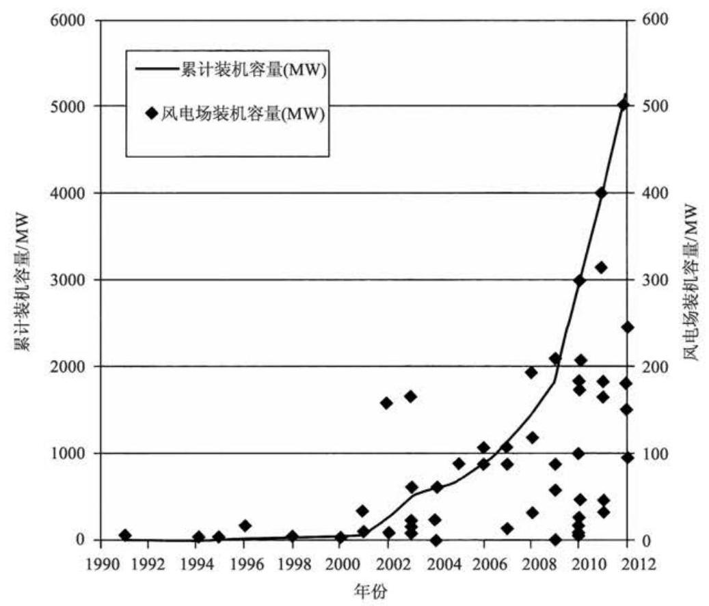

图 11.1 海上风电场全球容量(1991~2012)

海上安装仅占整个风电场的一小部分, 风力发电机组主要是来自于陆上使用的风力发电机组 (额定功率达到 3.6MW), 但是一些较大的风力发电机组 (达到 5MW)位于深水区域，还有安装两个浮动式的风力发电机组。当水深达 20m 处，可以使用单桩或者重力式基础，而套层式或三脚架式结构用在更深的水域。对于较小的比较靠近岸边的风电场,集电电缆为 ${30} \sim  {36}\mathrm{{kV}}$ ,延伸到岸边。较大的风电场使用海上变电站，而高压直流输电被用于规模非常大的远程项目。维护手段一般都是通过船只，在某些项目中也使用直升机。

表 11.1 展示了一个海上风电场的成本明细。陆上项目的支撑结构, 电缆和电气连接的比例较大，相比之下，海上风力机仅占相对较小的成本份额。当然，海上风力发电机组的安装成本高。

表 11.1 典型的海上风电场的成本明细 (EWEA, 2009)

<table><tr><td>海上发电场的构成</td><td>总成本的百分比</td></tr><tr><td>风力发电机组</td><td>51</td></tr><tr><td>支撑结构</td><td>19</td></tr><tr><td>电缆和网络连接(包括安装)</td><td>15</td></tr><tr><td>风力发电机组和支撑结构的安装</td><td>9</td></tr><tr><td>其他资本成本</td><td>6</td></tr></table>

安装海上风力发电机组的劣势是较高的安装和运行成本，海上风力发电发展的时间较短，其成本的增加是显著的。这种成本的增加已经由 Gross 等在 2010 年进行了研究。从 2002 年到 2004 年，英国海上风电场的资本成本已经基本稳定在 £1.5m/MW 以下。然而，从那以后其资本成本翻了一番变为£3m/MW，电能的均化成本从£ ${94}/\left( {\mathrm{{MW}} \cdot  \mathrm{h}}\right) \left( {2004}\right)$ 上升至£ ${150}/\left( {\mathrm{{MW}} \cdot  \mathrm{h}}\right) \left( {2010}\right)$ 。而相比之下， 陆上风能的成本为£1.3m/MW 到£1.8m/MW 之间，电能的均化成本为£94 $\left( {\mathrm{{MW}} \cdot  \mathrm{h}}\right) \left( {\mathrm{{DECC}},{2010}}\right)$ 。在英国，联合循环燃气风力发电机的电能均化成本为 £80/MW + h(2010)。

因此，陆上风力发电可以认为是最经济有效的低碳科技发电，但海上风力发电是昂贵的，需要足够的额外支持 ${}^{1)}$ 。

Gross 等(2010)认为推动英国海上风电场成本从 20 世纪中期到 2009 年期间上升的原因(按影响从大到小排列):

(1)材料、商品和劳动力成本。

(2)电力传输。

---

1)英国海上风电场产生的电力引入了两个可再生能源义务证书或从陆上风电场发电的双倍支持。

---

(3)由于供应链限制、市场条件和工程问题，导致风力发电机组价格上升且超过材料成本。

(4)增加水深和加大距离的项目影响安装、建立、运行和维护(O & M)成本。

(5)供应链限制，特别是在船舶和港口。

(6)计划和审批的延迟。

最近一些证据显示英国风电场的成本从 $\textsterling 3\mathrm{m}/\mathrm{{MW}}\left( {2009}\right)$ 小幅下降至 £2.9m/MW(2010)，最佳推测是到 21 世纪 20 年代中期电能成本为£115/(MW + h)。 波罗的海的项目都在浅水区，靠近海岸的避风水域，它们的成本较低。它是英国海上风力发电场在靠近岸边较浅水域的初体验，它的成本相当乐观。后期较大型风电场坐落于更高要求的海上环境将会导致电能更高的成本, 除非有相当大的技术创新来降低资本和运行成本。

海上风力发电处于起步阶段，为能够在距离海岸较远和更加苛刻的环境中构建风电场, 需要不断地吸收经验。现在, 可以看到许多关于海上风能的书籍和报道。海上气候和气象由 Barthelmie 等进行了探讨, Dalen 和 Jakobsson 在由 Twidell 和 Gaudiosi (2009) 出版的综合性书籍引用了海上风力发电。Ackerman (2005)设计了海上电力系统，Hau(2006)提供了这个题目的概况。通过对海上气象学的回顾, 本章认为海上风力发电机组的设计载荷与陆上风力发电机组完全不同, 支撑结构的设计的描述包括单桩基础疲劳度的计算, 而且海上电量采集系统特殊的方面也有所涉及。

## 11.2 海上风力资源

### 11.2.1 海上风力的结构

距离海岸较远的地方, 以及当风从海面吹向陆地时距离海岸较近的地方, 平均风速要比陆上的高，这是由于没有阻挡气流的障碍物。同样，湍流水平也比陆上的要低很多, 并且由于比较小的表面粗糙度风剪切力也较低。然而, 表面粗糙度随着波浪的升高而增加，所以湍流和风切变在大波浪期间可能会更高。这与强风持续时间有关系, 因为通常是风驱动波浪, 但可能有比较明显的时间滞后, 因此, 在海上风暴引起高波浪时，风电场可能遇到的是低风速。同样的低频的涌浪可以传很远的距离, 某处强风可能会引起波浪, 而这风永远也不会吹到风电场这里来。风对海上风力机组载荷设计的贡献将在 11.3.2 节中提到。

### 11.2.2 现场风速评估

潜在风力场长期风力资源的量化在决定项目经济可行性上起着核心作用。对于陆上风电场来说,典型的方法是通过该地区的气象学桅杆收集的风力数据和(或者)从邻近的运行中的项目的电力生成数据分析来实现 (9.1.3 节)。

海上风电项目可以采用类似的方法, 但是在海上竖立气象桅杆需要更高的成本。另外, 风资源评估也可基于次要来源, 比如邻近地点的风力测量数据或者是基于该地区的利益、政府资助的测量站。在这种环境下, 风力分析必须评估风况在参考桅杆和目标站间的不同，以及这一评估相关的不确定性。

有一种很普遍的假设 (barthelmie 1993; Coelingh 等, 1996) 指出海上环境的长期平均风速的水平空间变化是相对有限的。因此, 用不确定的外推方法来测量一个物理位置到另一个的距离，通常被认为是相对有限的。无论如何，在缺少一些公共领域高质量的可靠测量节点的数据的情况下，这些假设几乎没有依据，所以当缺少我们所需要的高质量测量时，从利益的角度看，风况预测在很大程度上是不确定的。这样会对一些项目的融资前景带来很大的影响。

为了评估风能资源跨越海上环境广阔领域的变化，使用了各种各样的方法。 这其中包括传统的计算流建模技术，例如 WAsP(Mortensen 等，1993) 和更先进的建模方法, 包括计算流体力学 (CFD) 和中尺度方法。后者则越来越多地应用气象研究协会发展的基于数值天气预报模式的技术。人们用全球气候模式来找出高层大气情况，并且这些结果后来也作为区域气候模式(一般在一个 ${50}\mathrm{\;{km}} \times  {50}\mathrm{{km}}$ 的范围)的边界情况或者经验得出的海面参数、温度和风速的关系(Barthemie 等在 Twidell 和 Gaudiosi, 2009)。这种方法的优点是它的捕捉潜力。通过应用理论上强大的气象模型, 它能捕捉到大范围的天气趋势, 更多的局部热和地形的影响。这种气象模型是从历史上观察所得的大量数据中得来的。

通过安装在卫星上的设备对记录的图像进行分析，也成为一种研究海上风能资源的变化更频繁的应用方法，其中最常用的工具是散射仪。散射仪是一种有源微波设备，通过接收扇形束短脉冲的返回信号来估计风速和风向。这些返回的数据以各种入射角接收，而这些入射角反映海面的粗糙程度。当入射光纤的波长和短波峰局部“风波”波长同相时(考虑入射光纤的角度)，共振信号就会成为当前的反向散射返回值(Aage 等，1998)。共振反向散射的强度和风波的陡度成正比，所以也和观察时局部风速成正比。共振反向散射的大小和风速的大小的关系已经通过经验得到。其中也要考虑入射角和相对于风的方向的卫星观测方向的方位角 (Aage 等, 1998)。由于受到经验性推算方法的应用有效性的影响, 来自风速值的绝对精度是有限制的。而数据的可用性局限于少有的空间和暂态抽样中, 与此同时, 分析的方法已经发展到了允许估计几百公里领域的风力资源空间变化的阶段 (Phillips 等, 2008)。

综上所示，各种各样的测量方法和计算机建模为基础的应用程序都可以用来在任何指定的海上的风电场中确定风资源。源数据相关的不确定性和采用的分析方法在确定置信水平中起着重要作用，这可以称为长期能源生产计划，反过来，置信水平又对于任何指定的海上风电场发展的经济可行性有很大的影响。

### 11.2.3 海上风电场的尾流损失及阵列损失

海上风电场的尾流损失可能导致相当大的能量损失, 特别是在低于额定风速时。通过风力机推力系数, 尾流损失很大程度上取决于风速, 在低风速时较高, 风速变大时会降低。当超过额定风速时, 变桨距调节风力机会通过顺桨来限制发电量。顺桨能减小推力系数从而减少下游风力机的尾流损失。所以当风速高于一定值后, 尽管会有尾流损失, 所有风电机组仍然可以达到额定功率。失速调节风力机会继续有较高推力系数, 这样在所有风速下可能导致很高的尾流损失。

推力系数意味着从气流中提取动量的大小，但是风电场上方的更高速气流的混合会补充较远的下游动量。大气边界层模型可以提供计算动量补充率的方法, 通过这些方法, 可以计算出风电场的效率 (Bossanyi, 1980)。不过, 更详细的评估应该考虑单个风电机尾流的变化和与下游风电机组的相互作用。这就意味着尾流损失很大程度上与风向和风力机的间距有关。风电机组规则排列时, 尾流损失在一些狭窄的扇形风区会变高, 而总体平均损失取决于风速和风向的联合分布。

某些工程中风电机组的小间距排列会加剧阵列尾流损失，而且阵列尾流损失也和低水平的海上风况的大气湍流有关(Barthelmie 等，2005)。例如，Lillgrund 海上风电场中采用的是 48 台，功率为 ${2.3}\mathrm{{MW}}$ ，叶轮直径为 ${93.5}\mathrm{m}$ 直径的风电机组 (Dahlberg 和 Thor, 2009)。这个风电场的风电机组就在相当小的间距下建造的 (每一排 3.3D,行间距 ${4.4D}$ )。当基座的位置确定后,制造商在风电场许可的范围内增大风力机的风轮直径, 从而产生了小间距排列。广泛应用的测量方法表明当风直接吹到第一排时,第二排的风力机上的能量下降 80% 的尾流损失 (即低于额定风速范围时，第二排的风力发电机组的发电量仅为第一排风力机的 20%)。同样,间距为 ${4.4D}$ 时,能量下降 ${70}\%$ 左右。

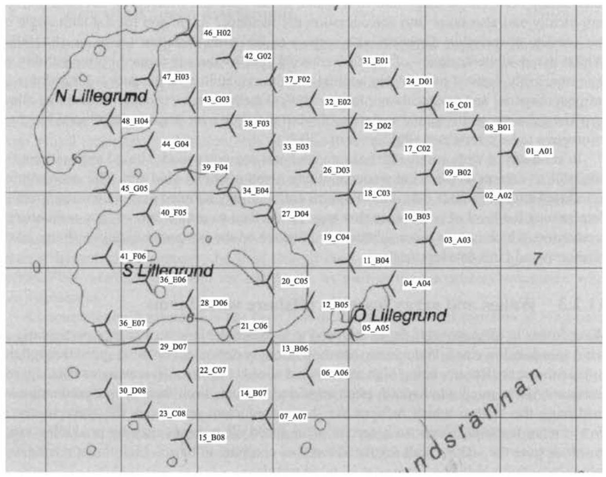

图 11.2 Lillgrund 风电场的布局 (Dahlberg 和 Thor, 2009), Vattenfall 公司许可转载

图 11.3 显示了低于额定风速时, 风电场阵列效率随风向的变化。阵列效率 (相对功率)定义是,在给定风速下,每个风力机平均列发电量除以不受尾流损失影响的每台风力机的相应输出。风在行间刮过时,会有一个明显的下降。在各向同性风概率分布的假设下, 风电场的整个阵列效率在低于额定风速时估计为 67%, 假设风电场的风速分布是 8m/s 年平均风速的 Rayleigh 分布，则为 77%。这表明在相当密集的海上风电场的电力输出较单台风力机减少约 23% (Lillgrund 试点项目,2008)。据报道, Middelgrunden 风电场 (风力机曲线单行分布,间距 ${2.4}\mathrm{D}$ ) 尾流损失大约是 10%(Barthelmie 等, 2007)。

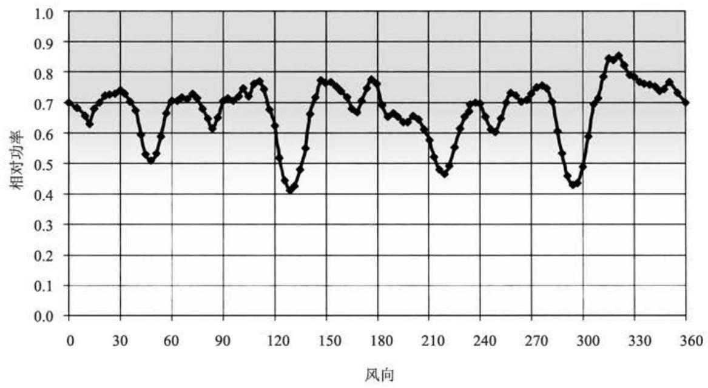

图 11.3 Lillgrund 风电场:低于额定风速时，阵列效率随风向的变化 (Dahlberg 和 Thor, 2009), Vattenfall 公司许可转载

Lillgrund 风电场以它的小间距风电机组分布而显得与众不同。Horns Rev 风电场为每一行 ${7D}$ 、行间距 ${10D}$ 。它的输出经分析 (Hansen 等,2010) 显示,当风速在 $5 \sim  9\mathrm{\;m}/\mathrm{s}$ 时,阵列中的第二个风力机尾流损失最大功率下降约为 40%; 当风速为 ${11} \sim  {13}\mathrm{\;m}/\mathrm{s}$ ,风向在一个很小的范围变化时,这一数据将下降到 ${30}\%$ 。每台风力机的产生的流量下降在 ${25}^{ \circ  } \sim  {30}^{ \circ  }$ 。据报告，整个阵列损失是 ${12.4}\%$ (Sørensen 等, 2006)。

大气的湍流和稳定性对尾流损失有很大的影响 (Barthelmie 和 Jensen, 2010)。 当顺风对流时，混合的湍流会引起尾流速度下降的扩大或缩小。典型的一些海上风电场的部分尾流低水平湍流会持续影响较远的下游，但是其影响将波及较窄的方向范围。

大量方法已经用于预测海上阵列效率。Barthelmie 等(2009)比较了 6 种不同的模型。最简单的模型用到了一个简单的“顶-帽”尾流廊线。假定尾流衰减系数的线性扩展。较为复杂的是运用尾流模型, 尾流模型来自 Reynolds-Averaged Navier-Stokes(RANS)方程结合生成尾流的湍流与多个尾流叠加的经验关系; 两种模型使用完整的计算流体力学(CFD)建模穿过风电场的气流，把风轮盘当做下沉的动量。Barthelmie 等的论文指出:尽管大部分公认的尾流模型似乎能给出单个尾流或者小型风电场的合理结论, 但大型的海上阵列的尾流损失的预测仍然偏低。人们认为这不足以代表上游风力发电机组产生的湍流和大气的稳定性的影响。在陆地上, 这些影响更可能被地形引起的高湍流所掩盖。通过修改参数可以提高各种模型的功能 (Barthelmie 等, 2010; Cleve 等, 2009; Schlez 和 Neubert, 2009), 但研究仍在继续, 以便更好地了解和预测海上风电场的气流和尾流。

大体上来说, 随着更多的风电场的建立, 整个风电场尾流对于其他海上风电场发电量的影响开始受到人们的关注, 同样, 这种影响也会波及一定海域提取到的总的风能资源。这种影响是很难估计的, 部分原因是缺乏测量。最终的结论 (Frand-sen 等, 2009)表明各种建模方法也许是适当的, 但是如果想用这些方法在风电场建设前成功地估计发电量, 还需要进一步的验证。

## 11.3 设计载荷

### 11.3.1 国际标准

当最早开采北海石油的时候，国家设计标准就对海上工程建筑上的风载荷和波载荷进行了说明，并且随后用于第一个海上风电场的设计。不过，海上风电场不同于海上石油平台, 因为作用在风力发电机组支撑结构上的风载荷在总载荷中与海上石油平台的情况相比是非常重要的元素，所以人们很快意识到需要为海上风电场制定一个设计标准。

海上风电机组的第一个设计标准是 2004 年 Det Norske Veritas 发布的海上标准 DNV-OS-J101, 称作“海上风电机组结构设计”, 是一个综合性文件。其中包括海况、设计载荷情况、波载荷和结构设计。设计载荷情况和 IEC 61400-1 中记载的相同，但指定了适当的浪高和海况。在 2007 年，修正版出版，修改的载荷的情况记录在里面，符合 IEC 61400-3 草案中(见下文)的情况。

Germanischer Lloyd 在 2005 年出版了《海上风力发电机组认证准则》，其中包括叶片和机舱部件以及支撑结构。该准则采用的框架与陆上风力发电机组同样， 但该准则单独用一章详述海上风电场选址需要注意的问题。

国际电工委员会标准 IEC 61400-3, “风力发电机组-第三部分: 海上风力发电机组的设计要求”发表于 2009 年，不像上面 GL 指导方针，这不是一个独立的文件，需要和 IEC 61400-1(见第 5 章)结合起来阅读才能更好地理解。

在每种情况下都把海况考虑进去, 则 IEC 61400-3 中规定的载荷情况就和 IEC 61400-1 中规定的高度一致了。在一些载荷情况中, 确定性波要与确定性阵风结合考虑, 但是大多数标准中都明确指出随机的海况和湍流风都需要进行多次 10 分钟的模拟。每个轮毂高度处平均风速最少需要 6 次模拟，而每种载荷都要考虑海况。 但是很显然, 对于某些载荷情况来说需要更多的模拟次数。我们将在下一节中介绍风况和海况。

一些 IEC 61400-3 准则的发展工作在欧盟支持下进行了 R&D 工程“海上风力机组设计建议" (合同号 ENK5-CT-2000-00322) 或 RECOFF, 据报道约有 70 篇论文。

### 11.3.2 风 况

IEC 61400-3 规定的支撑结构用于设计特定风电场的风力条件, 但对叶片-机舱装配来说，也应该遵循在 IEC 61400-1 中规定的风力发电机组类型设计的可替代方法。

以下是一些在现场确定轮毂高度风参数的方法, 测定时最好是通过现场检测:

(1)50 年重现周期的极端十分钟平均风速 ${u}_{\mathrm{{ref}}}$ 。

(2)风速和风向的分布。

(3)超过工作范围并在 ${v}_{\mathrm{{ref}}}$ 的风速湍流强度。

(4)每个风速湍流强度的标准差。

(5)风切变。

(6)空气密度。

在缺少现场检测的情况下, 上面的参数应根据当地的标准来评估或就湍流强度来说,应该根据表面粗糙度参数 ${z}_{0}$ 。海面粗糙度随着风速增大, ${z}_{0}$ 可以从 Charnock 表达式计算:

$$
{z}_{0}\left( \bar{U}\right)  = \frac{{A}_{\mathrm{c}}}{g}{\left\{  \frac{k\bar{U}}{\ln \left\lbrack  {{z}_{\mathrm{{hub}}}/{z}_{0}\left( \bar{U}\right) }\right\rbrack  }\right\}  }^{2} \tag{11.1}
$$

其中, ${A}_{\mathrm{c}}$ 是 Charnock 常数, $g$ 是重力加速度, $k$ 是 Von Karman 常数 $\left( {0.4}\right) \text{ 。 }{A}_{\mathrm{c}}$ 的标准建议值介于海面的 0.011 与近海的 0.034 之间。湍流强度的设计值取为 90% 分位数,由下式给出:

$$
{I}_{\mathrm{u}} = 1/\ln \left\lbrack  {{z}_{\mathrm{{hub}}}/{z}_{0}\left( \bar{U}\right) }\right\rbrack   + {1.28}\left( {{1.44}{I}_{15}}\right) /\bar{U} \tag{11.2}
$$

上面式子的第一项是公认的平均湍流强度公式, 第二项代表湍流强度所需的 90% 分位数的 1.28 个标准差。所以, ${I}_{15}$ 可以估计为 $1/\ln \left\lbrack  {{z}_{\text{ hub }}/{z}_{0}\left( {15}\right) }\right\rbrack$ 。

图 11.4 显示的是海面和岸边风速的湍流强度的变化。图中将这些湍流变化与陆上中度湍流 (B 类) 进行了比较。如图中所示, 近海的湍流强度略高于海面, 但不论是海面还是近海，特别是整个运行速度范围在 $5 \sim  {25}\mathrm{m}/\mathrm{s}$ 时，湍流强度都显著低于陆上的情况。

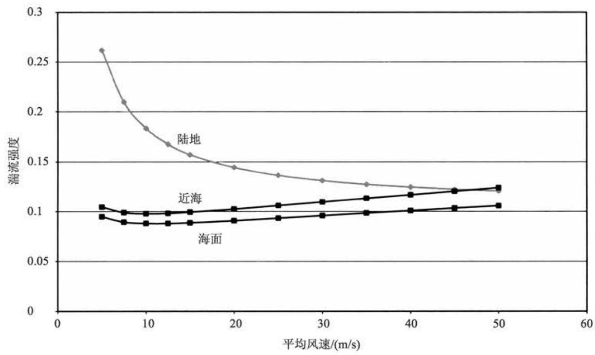

图 11.4 陆上和海上湍流强度随风速的变化

### 11.3.3 海 况

海况相关的支撑结构设计包括海浪、海流、水位，并在适当情况下，包括冲刷、 海底运动和海冰。IEC 61400-3 中的操作载荷情况与 IEC 61400-1 中都有相同的情况(除了 1.6 的载荷情况)，这些被规定为正常海况。恶劣海况适用于载荷情况 1.6 , 而极端海况适用于非运行载荷情况。

波浪气候条件是对随机海况模型的最准确的描述。但鉴于暴风情况下非线性波浪载荷模型, 有必要引入确定性设计波浪。IEC 61400-3 中定义了各种海况, 确定性设计波将在下一节中介绍。下一节中还会详细介绍共存的水流和水位要考虑的问题。在此之前, 先介绍一下随机海况模型通常使用的波谱。

### 11.3.4 波 谱

海的表面轮廓是很多不同振幅和周期的微小前进波相互叠加的结果。相反, 集体波可以用频谱描述, 即相对于平均海平面的水平高度差的平方与频率的频谱密度图。此频谱通常用来定义持续周期为 3 小时的海况。

频谱的主要参数有两个:一个是有效波高 ${H}_{s}$ ; 另一个是对应峰值频谱密度的频率值 ${f}_{\mathrm{p}}$ 。有效波高的传统定义是:在一个选定的参考周期(一般为 3 小时)中，最高的 $1/3$ 的波的平均高度，有效波高也是观察者通常报告的波高。频谱下面积等于海面高度的方差 ${\delta }_{\eta }^{2}$ 。

频谱的形状取决于风区和风吹过风区之前的风速的变化。Pierson-Moskowi-tz 谱是一个数学构造, 是描述充分成长的海的频谱的一个很好的拟合。在 IEC 61400-3 中, 用下式表示:

$$
{S}_{\eta \eta }\left( f\right)  = \frac{5}{16}\frac{{H}_{\mathrm{s}}}{f}{\left( \frac{{f}_{\mathrm{p}}}{f}\right) }^{4}\exp \left\lbrack  {-\frac{5}{4}{\left( \frac{{f}_{\mathrm{p}}}{f}\right) }^{4}}\right\rbrack \tag{11.3}
$$

式中,假设有效波高 $\left( {H}_{\mathrm{s}}\right)$ 为海面高度标准差的 4 倍,且符合波高的瑞利分布。尽管严格地说, 波高的瑞利分布只能由窄带频谱产生, 对于真实的波谱情况, 波高的瑞利分布被认为是一种合理的近似。

在完全开发的风浪区，仅仅在风速的持续时间足以通过足够长的风区后，充分成长的海的情况才会出现。在大多数的情况，风暴的持续时间或风区或者两者都太小, 从而频谱显示了一个 Pierson-Moskowitz (PM) 谱更高的峰值。JONSWAP (北海波浪研究联合计划)谱是从德国的叙尔特岛附近的波测量中研发出来的，是 PM 谱模拟峰值增强的一个变体。从本质上讲, 为确保 LONSWAP 谱下面积与 PM 谱下面积相同，PM 谱还需要乘以一个频率依赖峰值增强因子(峰值在 $1 \sim  5$ 之间)和一个正常化因子。

峰值增强因子 $\left( {\gamma }^{\prime }\right)$ 由一些参数共同确定，这些参数包括:有效波高 ${H}_{s}$ (单位: 米,谱峰周期)、谱峰周期 ${T}_{\mathrm{p}} = 1/{f}_{\mathrm{p}}$ 秒和频率 $f\text{ 。 }\gamma  = \exp \left( {{5.75} - {1.15}{T}_{\mathrm{p}}/{H}_{\mathrm{a}}^{0.5}}\right)$ ,其中 ${T}_{\mathrm{p}}/{H}_{\mathrm{s}}^{0.5}$ 的范围为 ${3.6} \sim  5$ 。 $\alpha  = \exp \left\lbrack  {-{0.5}{\left( f/{f}_{\mathrm{p}} - 1\right) }^{2}/{\sigma }^{2}}\right\rbrack$ ,当 $f < {f}_{\mathrm{p}}$ 时, $\sigma  = {0.07}$ ; 当 $f > {f}_{\mathrm{p}}$ 时, $\sigma  = {0.09}$ 。正常化因子的式子是 $1 - {0.287}\ln \gamma$ 。可以看出,当 ${T}_{\mathrm{p}}/{H}_{\mathrm{s}}^{0.5} < {3.6}$ 时， $\gamma$ 为 5；当 ${T}_{\mathrm{p}}/{H}_{\mathrm{s}}^{0.5} > 5$ 时， $\gamma$ 为 1 。当 ${T}_{\mathrm{p}}/{H}_{\mathrm{s}}^{0.5} > 5$ 时，JONSWAP 谱和 PM 谱是相同的。

图 11.5 比较了有效波高为 $3\mathrm{\;m}$ 谱峰周期为 $7\mathrm{\;s}$ 时的 JONSWAP 和 PM 谱。

图 11.6 显示了利用上述 JONSWAP 谱的一个模拟海面高度的时间历程的一个例子。

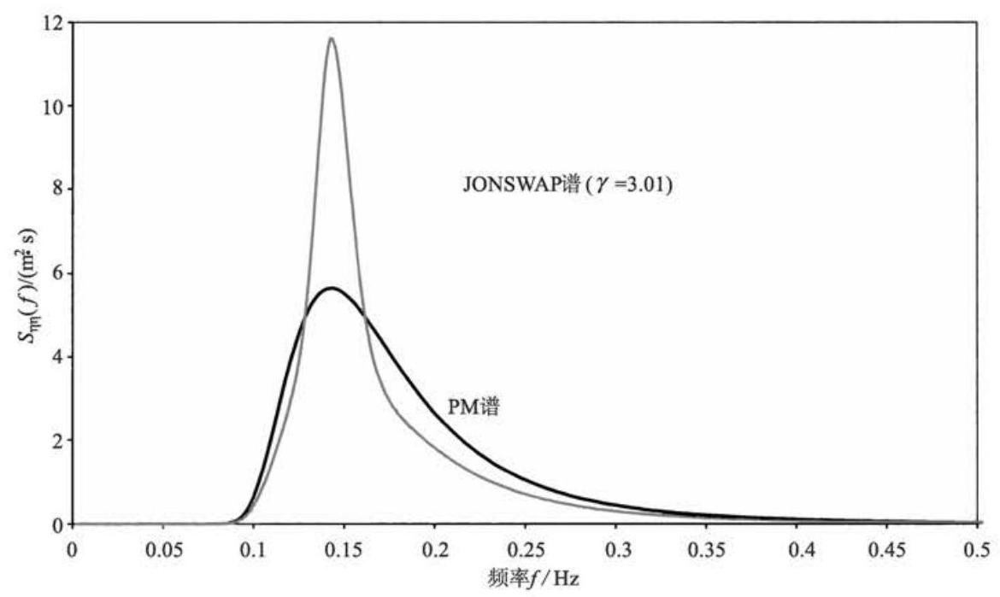

图 11.5 ${H}_{\mathrm{s}} = 3\mathrm{\;m},{T}_{\mathrm{p}} = 7\mathrm{\;s}$ 时的 PM 谱和 JONSWAP 谱

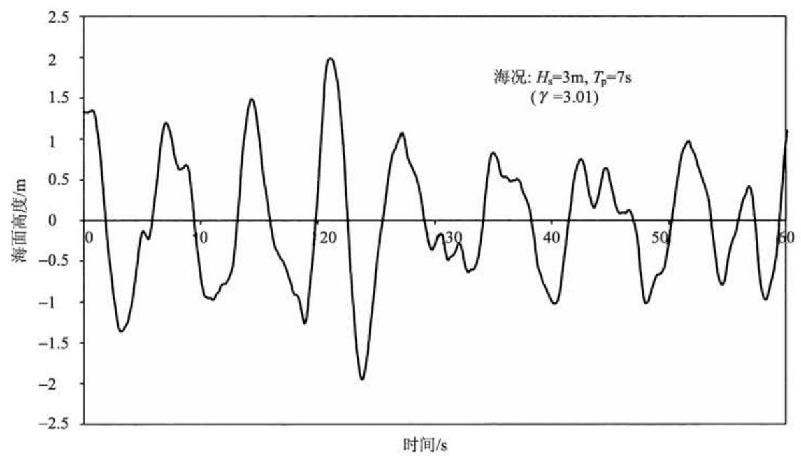

图 11.6 基于 JONSWAP 谱的模拟海面高度时间历程

### 11.3.5 极限载荷:运行载荷情况及随行波候

表 11.2 中概述了 IEC 61400-3 中运行载荷的极限载荷情况, 这些载荷情况相当于 IEC 61400-1 中在每种情况下的陆上载荷情况。

表 11.2 运行中的极限载荷情况

<table><tr><td>M/c 状态</td><td>载荷情况</td><td>陆上当量 LC</td><td>风 沉</td><td>风速范围</td><td>波 况</td><td>海平面</td><td>电网状态; 故障类型</td><td>载荷情况类型</td></tr><tr><td rowspan="6">发电量</td><td>1.1</td><td>1.1</td><td>NTM</td><td>切入-切出</td><td>正常海况 ${H}_{\mathrm{a}} = E\left\lbrack  {H}_{\mathrm{a}}\right\rbrack  \bar{U}$ 需要推导</td><td>平均</td><td>无</td><td>N</td></tr><tr><td>1.3</td><td>1.3</td><td>ETM</td><td>切入-切出</td><td>正常海况</td><td>平均</td><td>无</td><td>N</td></tr><tr><td>1.4</td><td>1.4</td><td>ECD</td><td>额定±2m/s</td><td>正常海/波况</td><td>平均</td><td>无</td><td>N</td></tr><tr><td>1.5</td><td>1.5</td><td>EWS</td><td>切入-切出</td><td>正常海/波况</td><td>平均</td><td>无</td><td>N</td></tr><tr><td>1.6a</td><td>无</td><td>NTM</td><td>切入一切出</td><td>恶劣海况-50 年一遇的 ${H}_{n}$ 作用于所选风速</td><td>正常范围</td><td>无</td><td>N</td></tr><tr><td>1.6b</td><td>无</td><td>NTM</td><td>切入-切出</td><td>恶劣波高-50 年一遇的波况作用于所选风速</td><td>正常范围</td><td>无</td><td>N</td></tr><tr><td rowspan="3">发生故障的发电量</td><td>2.1</td><td>2.1</td><td>NTM</td><td>切入-切出</td><td>正常海况</td><td>平均</td><td>控制系统或电网损耗</td><td>N</td></tr><tr><td>2.2</td><td>2.2</td><td>NTM</td><td>切入-切出</td><td>正常海况</td><td>平均</td><td>保护系统或电气故障</td><td>A</td></tr><tr><td>2.3</td><td>2.3</td><td>EOG</td><td>额定 ±2m/s</td><td>正常海/波况</td><td>平均</td><td>外部或内部电气故障</td><td>A</td></tr><tr><td rowspan="2">启动</td><td>3.2</td><td>3.2</td><td>EOG</td><td>切入，额定， 切出</td><td>正常海/波况</td><td>平均</td><td>无</td><td>N</td></tr><tr><td>3.3</td><td>3.3</td><td>EDC</td><td>切入，额定， 切出</td><td>正常海/波况</td><td>平均</td><td>无</td><td>N</td></tr><tr><td>停机</td><td>4.2</td><td>4.2</td><td>EOG</td><td>额定, 切出</td><td>正常海/波况</td><td>平均</td><td>无</td><td>N</td></tr><tr><td>紧急停机</td><td>5.1</td><td>5.1</td><td>NTM</td><td>额定, 切出</td><td>正常海况</td><td>平均</td><td>无</td><td>N</td></tr></table>

正常和不正常载荷情况分别用字母 $\mathrm{N}$ 和 $\mathrm{A}$ 表示。适用载荷系数见表 5.2。

表 11.2 中风况的首字母缩写如下:

NTM 正常湍流模式

ETM 极端湍流模式

ECD 方向变化的极端连续阵风

EWS 极端风切变

EOG 极端运行阵风

EDC 极端方向变化

每个风况的描述见 5.4.2 节。

在除了载荷情况 ${1.6}\mathrm{a}$ 和 ${1.6}\mathrm{\;b}$ 的所有载荷情况中,波浪情况被分为 “正常海况”和“正常波高”。1.6a 适用于“恶劣海况”，1.6b 适用于“恶劣波高”。下面将依次介绍这四种波况。

#### 1 正常海况

IEC 61400-3 根据基于 PM 谱或 JONSWAP 谱的随机海况模型来定义正常海况。对于每一个正常海况, 有效波高是平均风速下的预期值, 是基于特定场址的海洋气象数据库分析得来的。一般的做法是将这些海洋气象数据绘成风波散布图。 这种方法可以得到每个风速下的期望的有效波高。通常情况下,二维的风波分布图以表格的形式记录平均风速和有效波高在二维矩阵中不同段中的时间百分比。 在三维分布图中,记录着不同谱峰周期的发生频率 ${T}_{\mathrm{p}}$ 和平均零交叉周期 ${T}_{\mathrm{z}}$ 。用下面这种关系式可以将平均零交叉周期转换成谱峰周期:

$$
{T}_{\mathrm{p}} = {T}_{z}\sqrt{\frac{{11} + \gamma }{5 + \gamma }}
$$

$\gamma$ 在上一节中已定义。

图 11.7 记录了一个二维分布图的数据, 反映的是距离荷兰海岸 Ijmuiden 约 15km 的指定风电场 NL-1 的情况。图中显示的是当每个有效波高以 ${0.5}\mathrm{\;m}$ 为间隔时不同平均风速的发生频率, 参照在每一种情况下不同的水平轴。

结果应该考虑到谱峰周期 $\left( {T}_{\mathrm{p}}\right)$ 的范围。在适当情况下,应该考虑接近支撑结构固有频率 ${T}_{\mathrm{p}}$ 的值。

海况对于所有极限运行载荷情况基本上是相同的, 除了载荷情况 1.6 。包括平均海平面的“正常”的海流和水流的正常海况。正常海流包括风引起的海流和海浪引起的破碎波(如果有的话)。其中风引起的水流估计为每小时平均风速的 $1\%$ 。破碎波用式子 ${U}_{\mathrm{{bw}}} = {2s}\sqrt{g{H}_{\mathrm{B}}}$ 计算。其中, $s$ 是海底坡度, ${H}_{\mathrm{B}}$ 是破碎波高。

#### 2 正常确定性设计波

正常确定性设计波的高度被视为等同于平均风速下预期的有效波高。

#### 3 恶劣海况

像正常海况一样, IEC61400-3 中的恶劣海况也发生在风机运行期间 (载荷情况 1.6a),只是在有效波高方面，与正常海况不同。对于每个平均风速 $\left( \bar{U}\right)$ ，有效波高 $\left\lbrack  {{H}_{8,{885}}\left( \bar{U}\right) }\right\rbrack$ 都有一个值。这个值结合了恶劣海况的重现周期为 50 年的平均风速, 是基于场址特定的海况数据来推断的。在这部分的最后有一小段叫做“环境轮廓”。这一段就是介绍上述推断是怎么实现的。在正常海况的情况下, 谱峰周期的不良预期值也应该考虑在内。

载荷情况 1.6 中的其他的海况, 包括了“正常”海流和任何处于“正常水位高度范围”中的水位，这个范围是天文中潮汐的范围。

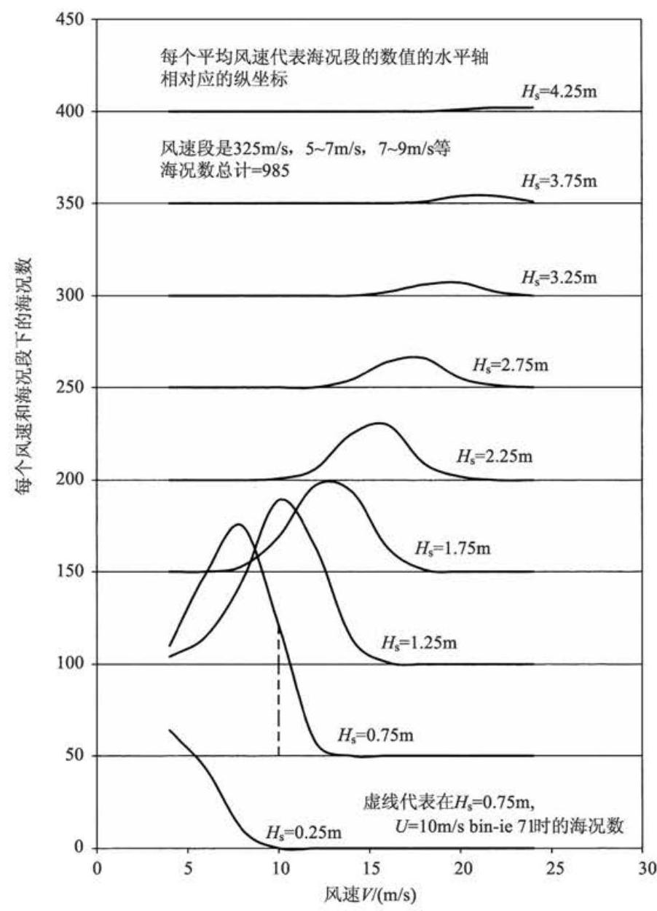

图 11.7 NL-1 站的风-波散点图数据

#### 4 恶劣确定性设计波

IEC 61400-3 载荷情况 ${1.6}\mathrm{\;b}$ 指定的确定性设计波来自每个平均风速下的恶劣海况(上述的) 有效波高。这种确定性设计波的高度, 或者叫恶劣波高, 用符号 ${H}_{\mathrm{{SWH}}}\left( \bar{U}\right)$ 表示，适用于恶劣海况极端波的预期高度。如果波高服从瑞利分布，那么单个波高大于 $H$ 的概率是:

$$
P\left( {h > H}\right)  = \exp \left\lbrack  {-{0.5}{\left( \frac{H/2}{{\sigma }_{\eta }}\right) }^{2}}\right\rbrack   = \exp \left\lbrack  {-2{\left( \frac{H}{{H}_{\mathrm{s}}}\right) }^{2}}\right\rbrack \tag{11.4}
$$

大于最高的 $N$ 波的波高的概率是 ${H}_{\mathrm{s}}\sqrt{{0.5}\ln N}$ 。预期极端波的幅度比 ${H}_{\mathrm{s}}\sqrt{{0.5}\ln N} + {0.2886}/\sqrt{2\ln N}$ 略高。

对于一个平均波周期为 ${10.8}\mathrm{\;s}$ 的海况来说,3 小时的参考周期中会有 1000 个波。所以,极端波可能大于 ${1.86}{H}_{\mathrm{s}}$ ,并且其预期幅度是 ${1.94}{H}_{\mathrm{s}}$ 。不过, IEC 61400-3 中的附录 G 允许的每种恶劣海况下的确定性设计波的高度可以通过下式计算:

$$
{H}_{s * H}\left( \bar{U}\right)  = {1.86}{H}_{s,{sss}}\left( \bar{U}\right)
$$

采用的波周期的值在 ${11.1}\sqrt{{H}_{\mathrm{s},\mathrm{{SSS}}}\left( \bar{U}\right) /g}$ 到 ${14.3}\sqrt{{H}_{\mathrm{s},\mathrm{{SSS}}}\left( \bar{U}\right) /g}$ 之间,会产生最高的波载荷。

如果非线性波运动可以用载荷情况 ${1.6}\mathrm{a}$ 的分析来建模,那么载荷情况 ${1.6}\mathrm{\;b}$ 就可以省略了。

#### 5 环境轮廓

每个载荷情况都对应发出电能情况。载荷情况 1.6 与 50 年一遇的平均风速的组合 $\bar{U}$ 和有效波高 $H$ ，有关将这两者合在一起，形成在 $\bar{U}$ 和 $H$ ，间的环境轮廓。得到这种轮廓的一个方法是逆一阶可靠性方法 (IFORM)。这个方法记录在 IEC 61400-3 的附录 $\mathrm{G}$ 中。本节将介绍这种方法。

平均风速和有效波高组合的不超过概率记作 $F\left( {{H}_{\mathrm{s}}/\bar{U}}\right)$ 。 $F\left( \bar{U}\right)$ 是平均风速的累积分布函数 (CDF)。 $F\left( {{H}_{\mathrm{s}}/\bar{U}}\right)$ 是在平均风速下的有效波高的 CDF。

通过 50 年数据的联立运算,这个概率应该等于 $1 - 1/N$ 。其中, $N$ 是 50 年中海况数，即对于持续 3 小时的海况来说，这个数是 ${50} \times  {365} \times  {24}/3 = {146000}$ 。

环境轮廓可以通过变换平均风速和有效波高为两个不相关的正态分布变量 ${U}_{1}$ 和 ${U}_{2}$ 来计算,

$$
F\left( \bar{U}\right)  = \phi \left( {U}_{1}\right) \;F\left( {{H}_{s}/\bar{U}}\right)  = \phi \left( {U}_{2}\right) \tag{11.5}
$$

其中

$$
\phi \left( U\right)  = \frac{1}{\sqrt{2\pi }}{\int }_{-\infty }^{U}\exp \left( {-{u}^{2}/2}\right) \mathrm{d}u \tag{11.6}
$$

正态分布变量 ${U}_{1},{U}_{2}$ 的联合概率密度函数 (pdf) 是:

$$
p\left( {{U}_{1},{U}_{2}}\right)  = \frac{1}{\sqrt{2\pi }}\exp \left( {-\frac{{U}_{1}^{2}}{2}}\right)  \cdot  \frac{1}{\sqrt{2\pi }}\exp \left( {-\frac{{U}_{2}^{2}}{2}}\right)  = \frac{1}{2\pi }\exp \left( {-\frac{{U}_{1}^{2} + {U}_{2}^{2}}{2}}\right)
$$

(11.7)

所以联合 $\mathrm{{pdf}}$ 是关于原点的轴对称函数。 ${U}_{1},{U}_{2}$ 的值域分布在自原点的相同半径的区域,并有相同的概率密度。联合 pdf 如图 11.8 所示。

显然, $N$ 年一遇的风速和有效波高无关, $N$ 年一遇的风速是 $F\left( \bar{U}\right)  = \phi \left( {U}_{1}\right)  = \; 1 - 1/N$ ,也就是说, ${U}_{1} = {\phi }^{-1}\left( {1 - 1/N}\right)$ 。在 ${U}_{1},{U}_{2}$ 的值域中,风超过 $N$ 年一遇值的概率以点 ${U}_{1},{U}_{2}$ 在图 11.9 中位于 ${ABC}$ 线右侧表示,其中 $\beta  = {\phi }^{-1}\left( {1 - 1/N}\right)$ 。

鉴于联合概率密度函数的表面下体积 (图 11.8) 位于半径为 $\beta$ 的圆的任意切线外的量是相同的。它遵循的规律是点 ${U}_{1},{U}_{2}$ 位于切线 ${DEF}$ 外的概率与点 ${U}_{1},{U}_{2}$ 位于切线 ${ABC}$ 外的概率是相同的,即 $1/N$ 。这样,半径为 $\beta$ 的圆是一个切线组合的内部环,例如 ${U}_{1},{U}_{2}$ 位于每一个外的概率是 $1/N$ 。从这个意义上说,它代表了 $N$ 年的环境轮廓转化为二维的正常空间。需要注意的是圆的 ${U}_{1}$ 或 ${U}_{2}$ 部分代表在每种情况下 $N$ 年一遇的最低值的负值。

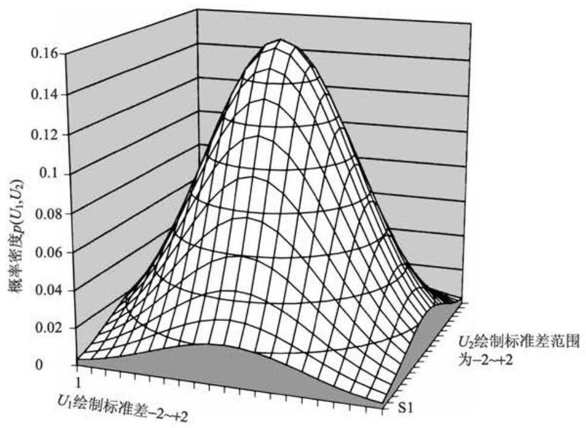

图 11.8 两个不相关的正态分布变量的联合概率密度

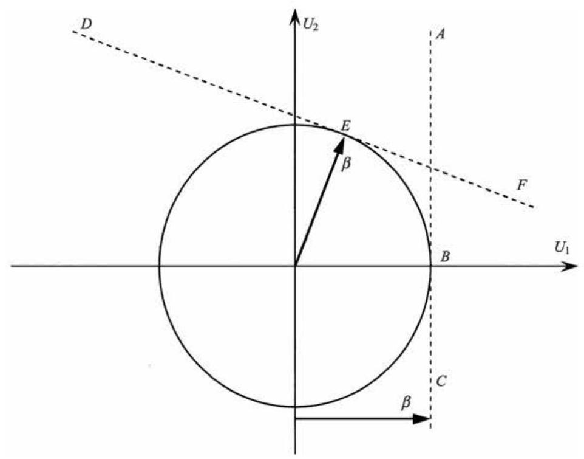

图 11.9 在 ${U}_{1} \cdot  {U}_{2}$ 间的 $\beta$ 为半径的圆,代表环境轮廓

平均风速和有效波高分布图形式的海洋气象数据方法的实际应用程序如下:

步骤一:

(a) 运用分布图计算出不超标概率值 $F\left( \bar{U}\right)$ 。该值和一个特定风速段中的平均风速 $\bar{U}$ 有关。

(b) 计算出相应的正态分布变量的值 ${U}_{1} = {\phi }^{-1}\left\lbrack  {F\left( \bar{U}\right) }\right\rbrack$ 。

(c) 计算 ${U}_{2} = \sqrt{{\beta }^{2} - {U}_{1}^{2}}$ (对应于 ${H}_{\mathrm{s}}$ 的最小值的负根)。

(d) 通过 $\bar{U}$ 计算出 50 年一遇的有效波高

$$
{H}_{\mathrm{s},\mathrm{{SSS}}}\left( \bar{U}\right)  = {\bar{H}}_{\mathrm{s}}\left( \bar{U}\right)  + {U}_{2}\sigma {H}_{\mathrm{s}}\bar{U}
$$

其中, ${\bar{H}}_{\mathrm{s}}\left( \bar{U}\right)$ 和 $\sigma {H}_{\mathrm{s}}\left( \bar{U}\right)$ 分别是从分布图中提取的 $\bar{U}$ 的有效波高的平均值和标准差。

步骤二:在另一风速段中重复步骤一。

步骤三:画出环境轮廓，连接 $\left\lbrack  {{H}_{\mathrm{s},\mathrm{{SSS}}}\left( \bar{U}\right) ,\bar{U}}\right\rbrack$ 点。

需要注意的是,上述过程中的有效波高,是假定 $\bar{U}$ 是正态分布的情况下的,并不一定与数据完全一致。更保守地说, 是假定有效波高是对数正态分布。不论选择哪一种方法, 为了确定其适用性, 都应进行拟合优度检测 (视觉上和/或统计上)。

图 11.10 给出了一个 50 年一遇的环境轮廓的例子。这个例子是从 NL-1 地区 (见图 11.7) 的分布图中得到的。一个轮廓是基于有效波高亦是正态分布, 另一个是基于对数正态分布。

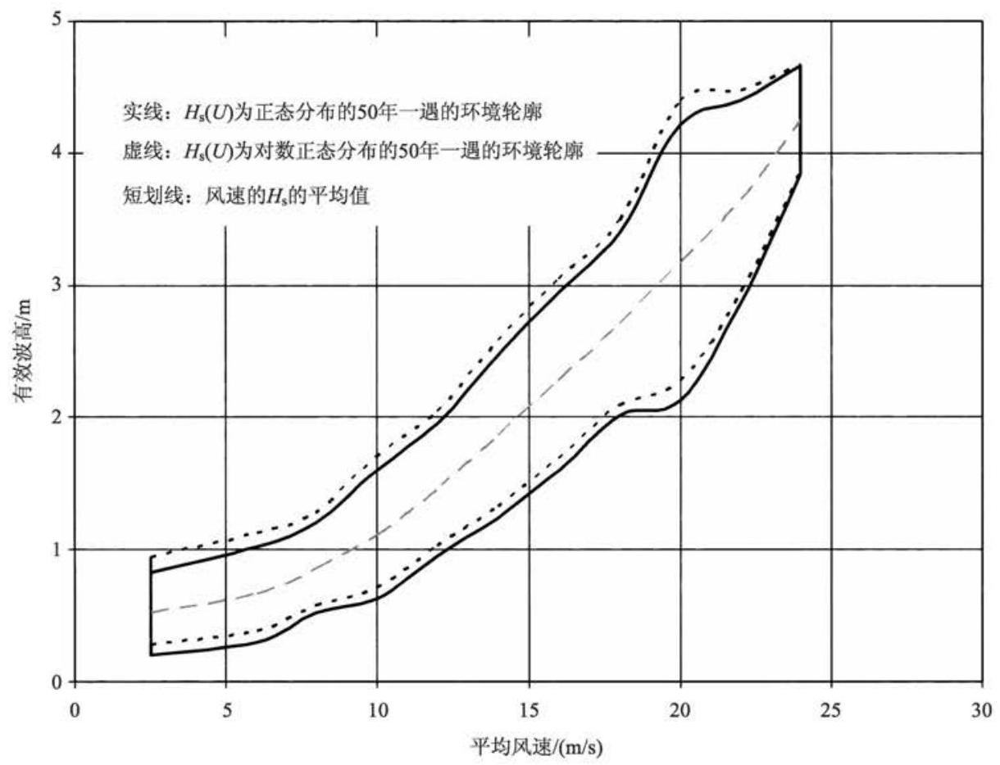

图 11.10 由 NL-1 地区得出的 50 年有效波高与平均风速的环境轮廓分布图

### 11.3.6 极限载荷:非运行时载荷情况及随行波候

表 11.3 给出了非运行时载荷情况的极限载荷情况在 IEC61400-3 中的概述, 其中，指出了每种情况下的载荷情况等价的在 IEC61400-1 中的陆上载荷情况。

表 11.3 极限非运行载荷情况

<table><tr><td>M/c 状态</td><td>载荷情况</td><td>陆上 LC 当量</td><td>风 况</td><td>风 速</td><td>波 况</td><td>水 位</td><td>电网偏航和故障状态</td><td>载荷情况类型</td></tr><tr><td rowspan="7">停机 (待机或怠速)</td><td>6. la</td><td>6.1</td><td>50 年 EWM 湍流</td><td>${k}_{1}{U}_{\mathrm{{ref}}}$</td><td>50 年极端海况 ${H}_{8} = {k}_{2}{H}_{850}$</td><td>极限范围</td><td>无</td><td>N</td></tr><tr><td>6. 1b</td><td>6.1</td><td>50 年 EWM 稳定</td><td>${U}_{\mathrm{e}{50}}$</td><td>50 年降低的波高 $H =  \sim  {0.7}{H}_{50}$</td><td>极限范围</td><td>无</td><td>N</td></tr><tr><td>6. 1c</td><td>无</td><td>50 年 EWM 稳定</td><td>0.786✘ ${U}_{\mathrm{e}{50}}$</td><td>50 年极端波高 $H = {H}_{850}$</td><td>极限范围</td><td>无</td><td>N</td></tr><tr><td>6. 2a</td><td>6.2</td><td>50 年 EWM 湍流</td><td>${k}_{1}{U}_{\mathrm{{ref}}}$</td><td>50 年极端海况 ${H}_{8} = {k}_{2}{H}_{850}$</td><td>极限范围</td><td>电网损耗 180°偏航</td><td>A</td></tr><tr><td>6. 2b</td><td>6.2</td><td>50 年 EWM 稳定</td><td>${U}_{\mathrm{e}{50}}$</td><td>50 年降低的波高 $H =  \sim  {0.7}{H}_{50}$</td><td>极限范围</td><td>电网损耗 180°偏航</td><td>A</td></tr><tr><td>6. 3a</td><td>6.3</td><td>1 年 EWM 湍流</td><td>0.8× ${k}_{1}{U}_{\mathrm{{ref}}}$</td><td>1 年极端海况 ${H}_{\mathrm{s}} = {k}_{2}{H}_{\mathrm{s}1}$</td><td>正常范围</td><td>极端偏航 (20°)</td><td>N</td></tr><tr><td>6. 3b</td><td>6.3</td><td>1 年 EWM 稳定</td><td>${U}_{\mathrm{e}1}$</td><td>1 年降低的波高 $H =  \sim  {0.7}{H}_{1}$</td><td>正常范围</td><td>极端偏航 (30°)</td><td>N</td></tr><tr><td rowspan="3">故障停机</td><td>7.1a</td><td>7.1</td><td>1年 EWM 湍流</td><td>0.8× ${k}_{1}{U}_{\mathrm{{ref}}}$</td><td>1 年极端海况 ${H}_{3} = {k}_{2}{H}_{a1}$</td><td>正常范围</td><td>故障状态</td><td>A</td></tr><tr><td>7.1b</td><td>7.1</td><td>1年 EWM 稳定</td><td>${U}_{\mathrm{e}1}$</td><td>1 年降低的波高 $H =  \sim  {0.7}{H}_{1}$</td><td>正常范围</td><td>故障状态</td><td>A</td></tr><tr><td>7.1c</td><td>无</td><td>1 年 EWM 稳定</td><td>0.786✘ ${U}_{\mathrm{e}1}$</td><td>1 年极端波高 $H = {H}_{1}$</td><td>正常范围</td><td>故障状态</td><td>A</td></tr></table>

注:EWM 和 RWM 分别代表极端风速模型和降低的风速模型。

由表 11.3 可以看出, 对于 IEC61400-1 中的四种陆上载荷情况的每一种, IEC61400-3 中都指定了 2 个或 3 个子载荷情况用于海上。这些子载荷情况分别用后缀a、b 和 c 区分。它们的不同如下:

(1)后缀 a 的载荷情况表示极端随机海况下极端湍流风。

(2)后缀 b 的载荷情况表示 “降低的”确定性设计波(0.7 × 极端确定设计波高)的极端稳定风。

(3)后缀 c 的载荷情况表示极端确定设计波的“降低的”稳定风 ( ${1.1}/{1.4}$ ×极端稳定风)。

设计者已经给出了随机载荷情况 $\mathrm{a}$ 和确定性载荷 $\mathrm{b}$ 和 $\mathrm{c}$ (其中包括)。对于无故障载荷情况 6.1 和 6.2 来说，风和波/海况的重现周期是 50 年。而对于载荷情况 6.3 和 7.1 来说是 1 年，载荷情况 6.3 和 7.1 分别涉及极端偏航和机器故障。 需要注意的是，电网损失载荷情况 6.2 可以包括高达 ${180}^{ \circ  }$ 的偏航误差，除非为控制系统和偏航系统提供 6 小时的后备电源。

请注意，后缀a 的载荷情况中假定极端随机海况和极端湍流风是同时发生的。

后缀b 和 c 的载荷情况简化了非线性波浪载荷的研究。计算它需要形成后缀 a 的载荷情况的随机海况的多重叠加的线性波。不幸的是，尽管标准附录 D 描述了稳定风速该如何提高上面的设计值来校正这种情况，后缀 $\mathrm{b}$ 和 $\mathrm{c}$ 的载荷情况还是不能捕获风力发电机组结构在湍流风中的动态响应的情况。两种确定性载荷情况是必需的, 因为假定的极端阵风和极端波浪载荷同时发生的概率微乎其微, 而主导风向和主导波浪载荷都需要考虑在内。后缀 b 和 c 的载荷情况中波高的衰减系数为 0.7 和在后缀 c 的载荷情况中风速的衰减系数为 ${1.1}/{1.4}\left( { = {0.79}}\right)$ ,都是根据 Tarp-Johansen 工作的基础上(2005)。这表明，在忽略相对风速和波浪载荷大小的前提下,如果风和波浪载荷被视为高斯值,波浪载荷是阻力的主导的话,以后缀 $\mathrm{b}$ 为主的风载荷情况波高的衰减系数为 $\sqrt{0.35} = {0.59}$ ,以后缀 $\mathrm{c}$ 为主的波浪载荷情况的风速的衰减系数为 $\sqrt{0.65} = {0.81}$ ，形成了总体载荷中这些载荷情况的最佳拟合。

对于所有的非运行时载荷情况，考虑风向和波的方向可能的错位带来的影响是必需的。

#### 1 极端海况

IEC61400-3 中的极端海况的随机海况模型和 11.2.5 节中的正常海况是相同的。但是有效波高需要考虑根据载荷情况的 50 年或者 1 年的重现周期。这些可能决定于有效波高的长期分布的局部推断。对于正常海况，谱峰周期的最不利的预期值是要考虑的。

其他的海况包括极端水流 (包括潮汐和风暴潮产生的水流) 和当有效波高和风暴潮共同作用时，相同重现周期的水位范围。

极端风速 ${U}_{\mathrm{{ref}}}$ 被定义为 10 分钟的平均值，有效波高的参考周期一般为 3 小时， 后缀 a 的载荷情况中极端风速和波浪载荷需要用到两个参数的共同的平均周期。 该标准采用了一个 1 小时的共同平均周期。其中定义了每小时的平均风速为 10 分钟平均值乘以一个大小为 0.95 的参数 ${k}_{1}$ 。定义一小时的湍流标准差的值为 10 分钟的值加上 ${0.2}\mathrm{\;m}/\mathrm{s}$ 。同样,3 小时的参考周期的有效波高乘以一个大小为 1.09 的参数 ${k}_{2}$ ,将其转换为较短的 1 小时参考周期的适当的值。

一般情况下, 至少需要 6 个 1 小时的仿真。但是, 如果更短的仿真不会减少极端响应的话，也可以应用。例如，在 11.3.10 节中介绍的“约束波”。

#### 2 极端确定性设计波

极端确定性设计波分为两种,一种重现周期为 50 年,一种重现周期为 1 年。

如果前面在极端海况下波高呈现瑞利分布，那么预计超过 $N$ 个波的最高值的波高为 $H$ ， $\sqrt{{0.5}\ln N}$ 。当 $N = {1000}$ 时，50 年重现周期和 1 年重现周期出现的极端波高分别为:

---

$$
{H}_{50} = {1.86}{H}_{\mathrm{a}{50}}\;{H}_{1} = {1.86}{H}_{\mathrm{s}1}
$$

---

#### 3 浅水区波候的改进

当波高达到平均水深的 78% 的时候，波浪开始中断，所以，随着深的海浪前进到较浅的水域，瑞利分布上的尾部波高会衰减，这将导致在运用 ${1.86}{H}_{\mathrm{s}}$ 公式计算超过最大值 1000 的波的波高变得保守。Battjies 和 Groeneddijk(2000)已经开发出一种改进了的在均匀斜度的海底分布的波模型。见 IEC61400-3 的附录 C。该模型依赖于测量站点特定的波形数据的可用性, 且适用的波方向是海底最陡坡度在 ${30}^{ \circ  }$ 以内的方向。

### 11.3.7 疲劳载荷

IEC61400-3 中疲劳载荷情况的概述(运行的和非运行的)在表 11.4 中给出。 其中指出了各种情况等价的 IEC61400-1 中的陆上情况。

表 11.4 疲劳载荷情况

<table><tr><td>M/c 状态</td><td>载荷情况</td><td>陆上 LC 当量</td><td>风 况</td><td>风 速</td><td>波 况</td><td>水 位</td><td>电网、偏航和故障状态</td></tr><tr><td>发电量</td><td>1.2</td><td>1.2</td><td>NTM</td><td>切入-切出</td><td>NSS 联合概率分布 ${H}_{\mathrm{a}},{T}_{\mathrm{p}},\bar{U}$</td><td>NWLR 或 ≥MSL</td><td>无</td></tr><tr><td>发生故障时的发电量</td><td>2.4</td><td>2.4</td><td>NTM</td><td>切入-切出</td><td>正常海况 ${H}_{\mathrm{s}} = E\left\lbrack  {{H}_{\mathrm{s}} \mid  \bar{U}}\right\rbrack$</td><td>NWLR 或 ≥MSL</td><td>故障条件</td></tr><tr><td>启动</td><td>3.1</td><td>3.1</td><td>NWP</td><td>切入-切出</td><td>正常海况 ${H}_{3} = E\left\lbrack  {{H}_{3} \mid  \bar{U}}\right\rbrack$</td><td>NWLR 或 ≥MSL</td><td>无</td></tr><tr><td>正常停机</td><td>4.1</td><td>4.1</td><td>NWP</td><td>切入-切出</td><td>正常海况 ${H}_{s} = E\left\lbrack  {{H}_{s} \mid  \bar{U}}\right\rbrack$</td><td>NWLR 或 ≥MSL</td><td>无</td></tr><tr><td>停机</td><td>6.4</td><td>6.4</td><td>NTM</td><td>$< {0.7}{U}_{\text{ ref }}$</td><td>NSS 联合概率分布 ${H}_{\mathrm{s}},{T}_{\mathrm{p}},\bar{U}$</td><td>NWLR 或 ≥MSL</td><td>无</td></tr><tr><td>故障停机</td><td>7.2</td><td>None</td><td>NTM</td><td>$< {0.56}{U}_{\text{ ref }}$</td><td>NSS 联合概率分布 ${H}_{2},{T}_{\mathrm{p}},\bar{U}$</td><td>NWLR 或 ≥MSL</td><td>故障条件</td></tr></table>

表中所示的风况和水位的缩写如下:

NTM 正常湍流模式

NWP 无湍流的正常风廓(遵循的幂律指数为 0.14)

NSS 正常海况

NWLR 正常水位范围

MSL 平均海平面

忽略海流。

在每个风速下, 都应该考虑一系列的有效波高和波周期, 每个风速和海况组合的持续时间都是从站点特定的三维分布图中得出的, 特别是对应于支撑结构的固有频率 ${T}_{\mathrm{p}}$ 的值也应该进行研究。无论如何,最好是避免大量的仿真,所以如果可能的话，组合载荷情况是有好处的。

如果每个段都计算出 “损伤等效平均波高” 和 “损伤等效平均周期” 的话，那么粗波高和波周期段产生的错误就能减少。损伤等效平均波高可以由下式计算:

$$
{H}_{\mathrm{s}} = {\left( \frac{1}{N}\mathop{\sum }\limits_{{i = 1}}^{N}{H}_{\mathrm{{si}}}^{m}\right) }^{\frac{1}{m}}
$$

其中 $m$ 是 $S - N$ 曲线的逆斜率，损伤等效平均周期取平均波频的倒数。在实例研究中，Evans(2005)指出，对于宽 $2\mathrm{m}/\mathrm{s}$ 的风速段，损耗等效负荷的偏差导致从0.5m 的波高和 ${0.5}\mathrm{\;s}$ 波周期段到一个单一的波高/波周期段的移动，而且这种方法仅百分之几。

IEC61400-3 通过机器的停机和空转将疲劳载荷分为两类。一类是没有故障状态, 而另一类是有故障状态。IEC61400-1 中没有后一类, 但在海上是必需的, 因为海上停机时间可能更长，并且风电机组停机时，气动阻尼会大幅下降。

在没有故障 (DLC6.4) 的情况下，停机的风电机组的疲劳载荷的最大风速为 0.7 ${U}_{\text{ ref }}$ ,每年大约有 0.6 小时超过此值。然而,在风力机有故障停机 (DLC7.2) 的情况下，上部的风速仅为 ${{0.56}\;{U}_{\text{ ref }}}$ ，每年大约有 19 小时超过比值。对于 DLC7.2 可能的总风电机组停机时间没有指导，这显然需要非常谨慎地预测。

### 11.3.8 波理论

有一些波理论可以用来描述规律的、周期性的、二维波的流体运动，但仅有三个理论是通常用于海上载荷结构的计算即艾里(Airy)波理论、Stokes 波理论和 Dean 的流函数理论。

Airy 波理论是线性的, 因此, 允许真实海况中包括多种不同频率和波长的小波的水粒子运动叠加进行建模。然而, 随着波高相对于水深或者波长的增加, Airy 波理论变得有些不准确。而非线性理论如 Stokes 理论和 Dean 的流函数理论可以代替它使用。然而, 由于它们的非线性, 这些理论只能应用于单一的规律的波列。 图 11.11 显示了这些理论在波高，水深和波浪周期不同关系中的应用。

从图 11.11 中可以明显看出 Dean 的流函数理论可以应用在除了近破波外所有的情况。鉴于此, 以及 Stokes 波理论的相对的复杂性, Stokes 波理论在此不作深入研究。本节主要集中讨论其他两种波理论。

#### 1 Airy 波理论

规律的周期性的二维波的流体运动满足拉普拉斯方程 ${\nabla }^{2}\phi \left( {x, z, t}\right)  = 0$ ,其中 $\phi$ 是速度势,从而水平和垂直粒子速度分别为 $u =  - \partial \phi /\partial x$ 和 $w =  - \partial \phi /\partial z\text{ 。 }x$ 是平行于水平坐标方向的波浪运动， $z$ 是相对于平均水位向上的垂直坐标的测量的值，

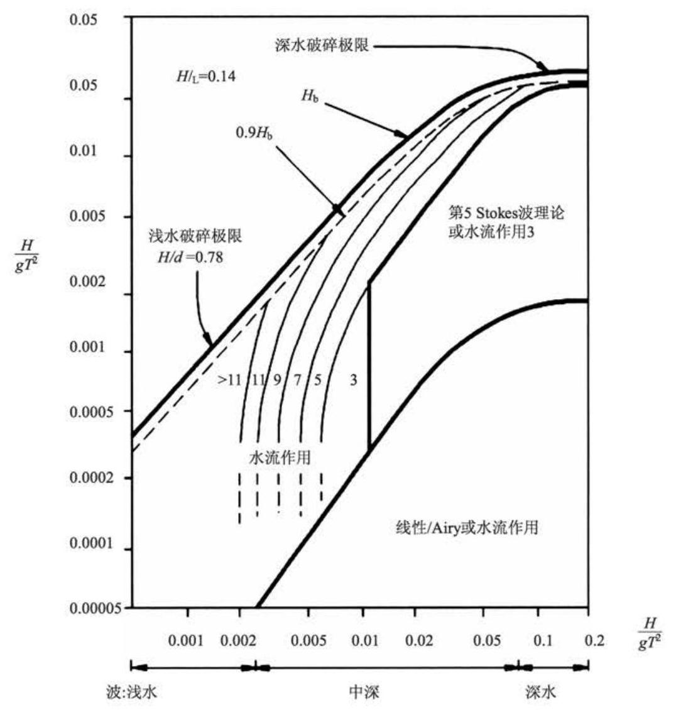

图 11.11 规律波理论选择图: 对数尺度, Barltrop 等, 1990, 根据公开的政府许可 v1.0 转载如图 11.12 所示。

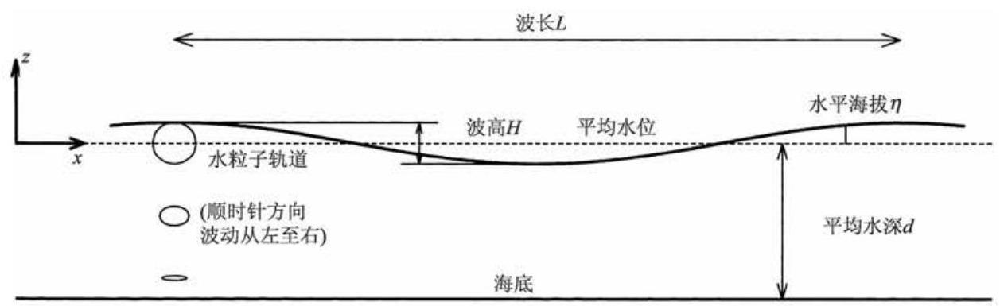

图 11.12 规律周期性二维波的参数定义和坐标

流体运动还必须满足 5 个边界条件:

(1)零流量垂直粒子速度 $w$ ，在假设是水平的海底的情况下。

(2)垂直于自由表面的零流量。

(3)自由表面的 Bernouilli 公式的非定常形式。

(4)时间周期的边界条件 $- \phi \left( {x, z, t}\right)  = \phi \left( {x, z, t + T}\right)$ ，其中 $T$ 是波的周期。

(5)空间周期的边界条件 $- \phi \left( {x, z, t}\right)  = \phi \left( {x + L, z, t}\right)$ ，其中 $L$ 是波长。

条件(2)可表示为

$$
w = \frac{\partial \eta }{\partial t} + u\frac{\partial \eta }{\partial x} \tag{11.8}
$$

其中 $\eta$ 高于平均值的水面海拔, $u$ 是水平的水粒子速度。作用在自由水平面上的大气的压力视为常量。所以，情况(3)的 Bernouilli 公式的非定常形式变为:

$$
- \frac{\partial \phi }{\partial t} + \frac{{u}^{2} + {w}^{2}}{2} + {gz} = C\left( t\right) \tag{11.9}
$$

根据艾里波理论, 水中任意点的速度势是:

$$
\phi  =  - \frac{Hg}{2\omega }\frac{\cosh k\left( {z + d}\right) }{\cosh {kd}}\sin \left( {{kx} - {\omega t}}\right) \tag{11.10}
$$

其中 $H$ 是波高, $d$ 为平均水深, $k = {2\pi }/L, w = {2\pi }/T$ 。图 11.13 显示了在 ${15}\mathrm{\;m}$ 的水深, ${80}\mathrm{\;m}$ 的波长情况下,一个全波长的相应的速度势轮廓。值得注意的是,这里仅显示了延伸到水位的轮廓,当波高小到可以忽略时,艾里波理论达到接近 ${100}\%$ 的准确率。假设波从左至右移动，最大的速度势在水面的右边四分之一处。

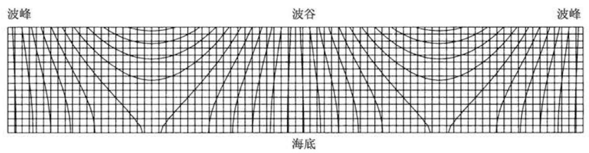

图 11.13 艾里波理论的速度势的轮廓

速度势的式子满足上面的条件(1)，(4)，(5)，但是只满足式(11.8)和式(11.9) 的线性化形式。

式(11.9)的“线性化”形式是通过扩展公式的左边得到的，当 $z = 0$ 时，运用了一个截短的 Taylor 级数。

$$
{\left( -\frac{\partial \phi }{\partial t} + \frac{{u}^{2} + {w}^{2}}{2} + gz\right) }_{z = \eta } = \left( {-\frac{\partial \phi }{\partial t} + \frac{{u}^{2} + {w}^{2}}{2} + {gz}}\right)
$$

$$
+ \eta {\left\lbrack  -\frac{{\partial }^{2}\phi }{\partial t\partial z} + \frac{\partial }{\partial z}\left( \frac{{u}^{2} + {w}^{2}}{2}\right)  + g\right\rbrack  }_{z = {10}} + \cdots  = C\left( t\right)
$$

(11.11)

然后, 假设所有的一阶和二阶项都很小, 可以忽略不计, 得到

$$
{\left( -\frac{\partial \phi }{\partial t}\right) }_{z = 0} + {ng} = C\left( t\right) \text{ 或者 }\eta  = \frac{1}{g}{\left( \frac{\partial \phi }{\partial t}\right) }_{z = 0} + \frac{1}{g}C\left( t\right) \tag{11.12}
$$

用式(11.12)代入式(11.10)。需要指出当水面高度的空间和时间等于零时, 得到 $C\left( t\right)  = 0$ ,并且

$$
\eta  = \frac{H}{2}\cos \left( {{kx} - {wt}}\right) \tag{11.13}
$$

式 (11.18) 应用相似的步骤可得到在 $z = 0$ 时, $w = \partial \eta /\partial t$ ,代入为:

$$
w =  - {\left( \frac{\partial \phi }{\partial z}\right) }_{z = 0} = \frac{Hgk}{2w}\frac{\sinh {kd}}{\cosh {kd}}\sin \left( {{kx} - {wt}}\right) \tag{11.14}
$$

${\left( \partial \eta /\partial t\right) }_{x = 0} = \left( {H/2}\right) w\sin \left( {{kx} - {wt}}\right)$ 得到

$$
L = \frac{g{T}^{2}}{2\pi }\tanh {kd} \tag{11.15}
$$

任意深度的水平和垂直粒子速度 $u$ 和 $w$ ，由下式给出:

$$
u =  - \left( \frac{\partial \phi }{\partial x}\right)  = \frac{Hgk}{2w}\frac{\cosh k\left( {z + d}\right) }{\cosh {kd}}\cos \left( {{kx} - {wt}}\right)  = \frac{{Hw}\cosh k\left( {z + d}\right) }{2}\cos \left( {{kx} - {wt}}\right)
$$

(11. 16)

$$
w =  - \left( \frac{\partial \phi }{\partial z}\right)  = \frac{Hgk}{2w}\frac{\sinh k\left( {z + d}\right) }{\cosh {kd}}\sin \left( {{kx} - {wt}}\right)  = \frac{Hw}{2}\frac{\sinh k\left( {z + d}\right) }{\sinh {kd}}\sin \left( {{kx} - {wt}}\right)
$$

(11.17)

整合上面的公式可以得到粒子的位移。水粒子在水平轴上按椭圆轨道运动如图 11.12 所示。

图 11.14 显示了艾里波理论在预测波峰处水平粒子速度方面的准确性, 通过不同的 $H/g{T}^{2}$ 和 $d/g{T}^{2}$ 比值与更精确的 Dean 和 Stokes 的第五理论进行比较。 此图选自 Barltrop 和 Adams(1991)的固定海洋结构动态的文章，其中包含相似的图, 用来预测其他参数的准确性。

#### 2 Dean 的流函数理论

Dean 的流函数理论(Dean 和 Dalrymple, 1984)是艾里波理论的有效的扩展。 艾里波理论是通过增加一系列的谐波项来表达速度势, 这使得该理论可以满足自由海面的边界条件，而不需要“线性化”。然而，该理论使用了已知的流函数的参考参数, 而不是速度势, 这正是接下来将要介绍的。

水粒子在波内的路径称为流线，每一个流函数的参数都有一个恒定值。流函数的定义使得在垂直水流方向上的梯度和局部粒子速度是成正比的, 从而,

$$
u =  - \frac{\partial \psi }{\partial z}\text{ 和 }w = \frac{\partial \psi }{\partial x} \tag{11.18}
$$

艾里波理论中的流函数为:

$$
\psi  =  - \frac{Hg}{2\omega }\frac{\sinh k\left( {z + d}\right) }{\cosh {kd}}\cos \left( {{kx} - {\omega t}}\right) \tag{11.19}
$$

图 11.15 显示了在水深 15m，波长 80m 的情况下，一个全波长的相应的流线。

式(11.19)中的流线和图 11.15 是相对于一种固定参考系下定义的。然而，在动态参考系下定义这些概念是完全可能的, 因其以相同的速度在波峰和波谷运动, 也就是说,波速 $C = L/T$ 。

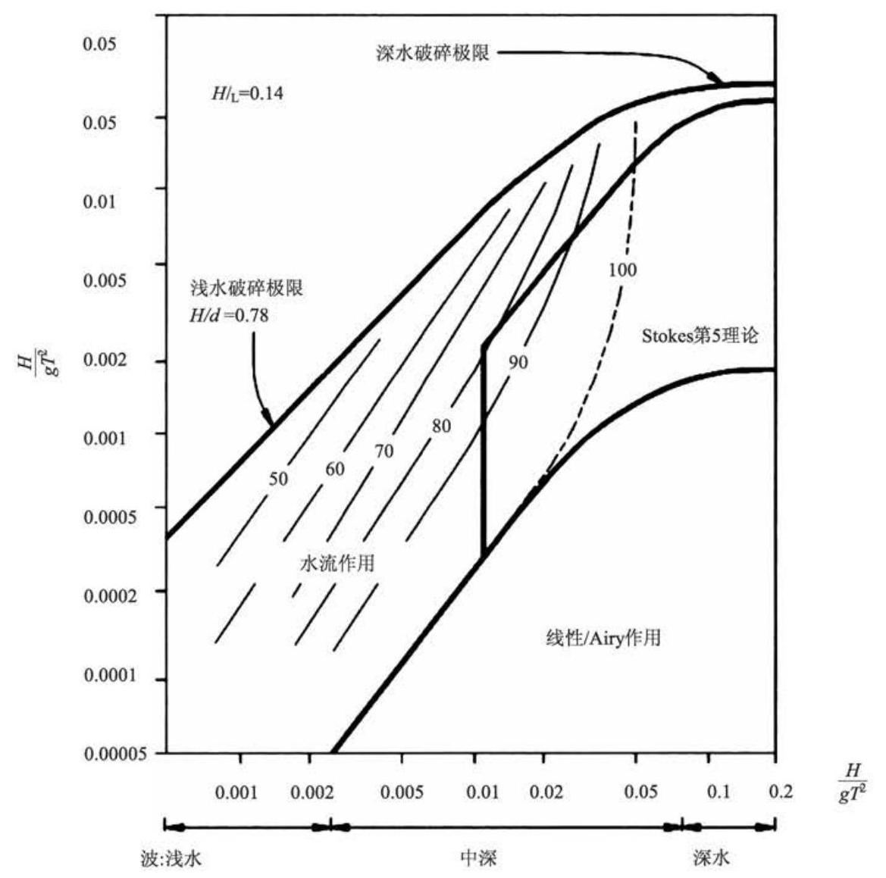

图 11.14 波峰处水平粒子速度:艾里理论理论值的百分比如图 11.11 所示。

Barltrop 等, 1990。根据公开的政府许可 v1.0 转载

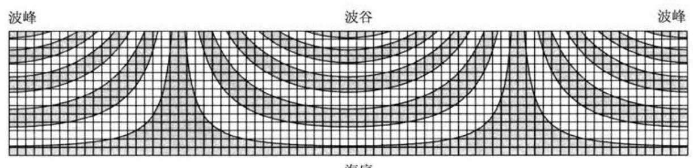

图 11.15 固定参考系的艾里波理论的流线。值得注意的是, 正如这个图表现的速度势轮廓, 流线仅仅延伸到静止水位,因为艾里波理论仅仅当波高很小的时候才接近 100% 的准确率

这时, 艾里波理论的流函数变为:

$$
\overline{\psi } = {Cz} - \frac{Hg}{2w}\frac{\sinh k\left( {z + d}\right) }{\cosh {kd}}\cos \left( {kx}\right) \tag{11.20}
$$

它的优点是不随时间变化。图 11.16 中显示了与上述相同情况下全波长的动态参考系下的流线。然而,为了清楚起见,选择一个相对大的 $4\mathrm{\;m}$ 的波高,因为这样的波, 艾里波理论的方法就不准确了。

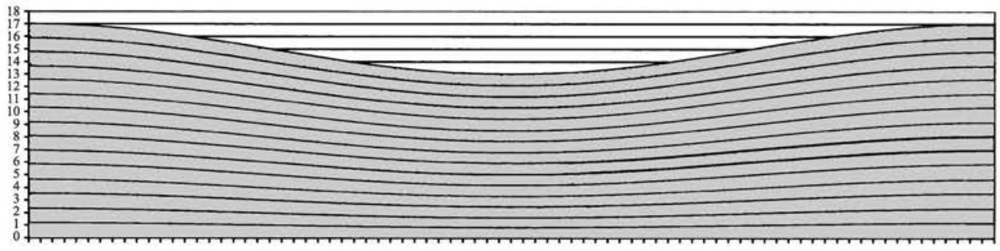

图 11.16 波列运动在动态参考系下艾里波理论流线

Dean 的流函数是在相同的动态参考系下定义的, 其中包括了谐波系列的描述如下:

$$
\overline{\psi } = {Cz} + \mathop{\sum }\limits_{{n = 1}}^{N}{X}_{n}\sinh {nk}\left( {z + d}\right) \cos \left( {nkx}\right) \tag{11.21}
$$

当 $N = 1$ 时,式 (11.21) 等于式 (11.20),所以

$$
{X}_{1} =  - \frac{Hg}{{2w}\cosh {kd}} \tag{11.22}
$$

相应的水粒子速度为:

$$
u =  - \frac{\partial \overline{\psi }}{\partial z} =  - C - \mathop{\sum }\limits_{{n = 1}}^{N}{nk}{X}_{n}\cosh {nk}\left( {z + d}\right) \cos \left( {nkx}\right) \tag{11. 23}
$$

$$
w = \frac{\partial \overline{\psi }}{\partial x} =  - \mathop{\sum }\limits_{{n = 1}}^{N}{nk}{X}_{n}\sinh {nk}\left( {z + d}\right) \sin \left( {nkx}\right) \tag{11.24}
$$

参数的个数 $N$ ,会随着波浪的高度接近破碎的极限而增加。使用 $N$ 个参数的方法称为 $N$ 阶。将 $z = \eta$ 代入式(11.21)得到:

$$
\eta  = \frac{{\overline{\psi }}_{0}}{C} - \frac{1}{C}\mathop{\sum }\limits_{{n = 1}}^{N}{X}_{n}\sinh {nx}\left( {\eta  + d}\right) \cos \left( {nkx}\right) \tag{11.25}
$$

空间平均水面高度 $\eta$ 据定义为零,有

$$
{\overline{\psi }}_{0} = \frac{1}{L}{\int }_{0}^{L}\mathop{\sum }\limits_{{n = 1}}^{N}{X}_{n}\sin {nk}\left( {\eta  + d}\right) \cos \left( {nkx}\right) \mathrm{d}x \tag{11.26}
$$

等式的右边表达式不为零,是利用双曲系数 $\sinh {nk}\left( {\eta  + d}\right)$ 来加权变量 $\cos \left( {nkx}\right)$ 。

需要满足的边界条件如下:

(1)假设海底为水平的前提下，零流量垂直粒子速度 $w$ 。

(2)垂直于自由表面的零流量。

(3)自由表面的 Beronuilli 公式的稳定形式。

(4)空间周期的边界条件 $\overline{\psi }\left( {x, z}\right)  = \overline{\psi }\left( {x + L, z}\right)$ ，其中 $L$ 是波长。

式 (11.24) 和式 (11.21) 分别满足条件 (1) 和条件 (4), 而条件 (2) 被满足是因为自由表面是流线型。

Beronulli 公式在自由表面处的稳定形式[条件(3)]是:

$$
\left( \frac{{u}^{2} + {w}^{2}}{2}\right)  + {g\eta } = K \tag{11.27}
$$

如果波长、平均水深和波高 $H$ 是已知的量，问题的解决方法在于找到一组 ${X}_{n}$ 系数与波速 $C$ 的结合值，以使在 ${\eta }_{\max } - {\eta }_{\min } = H$ 的条件下，式 (11.27) 尽可能地满足波形中的所有的点。

下面的步骤可以在电子表格中得到低阶的解决方案:

(1)设置 ${X}_{2}$ ， ${X}_{3}$ ⋯ ${X}_{N}$ 都为 0。

(2)设置 $C = \sqrt{\left( {g/k}\right) \tanh {kd}}$ ，其值通过艾里波理论确定。

(3)设置 ${X}_{1}$ 比式(11.22)中给出的值稍微小一点，也就是说，

$$
{X}_{1} = \frac{-{0.8Hg}}{{2w}\cosh {kd}}
$$

(4)通过反复迭代式 (11.25) 和式 (11.26),计算出在 $M$ 等距点的半波长的水位曲线。

(5)用式(11.27)，计算出 $M$ 点处的 ${K}_{1},{K}_{2},\cdots ,{K}_{m},\cdots ,{K}_{M}$ 的值。

(6) 计算出总和 $\mathop{\sum }\limits_{{m = 1}}^{M}{\left( {K}_{m} - \bar{K}\right) }^{2}$ ,其中 $\bar{K} = \mathop{\sum }\limits_{{m = 1}}^{M}{K}_{m}/M$ 。

(7)尽量减小上述 ${X}_{1}$ 和 $C$ 的总和,使其满足条件 ${\eta }_{\max } - {\eta }_{\min } = H$ ,来得到新的 ${X}_{1}$ 和 $C$ 的值。

(8)变化 ${X}_{2}$ ，重复步骤(4)~(7)。

(9)变化 ${X}_{2}$ 和 ${X}_{3}$ ，重复步骤(4)~(7)。

......

图 11.17 中显示了在 ${15}\mathrm{\;m}$ 水深, ${100}\mathrm{\;m}$ 波长和 ${10}\mathrm{\;m}$ 波高的情况下， $M$ 值为 40 时的半个波长。很明显这个波不是正弦波，其有一个狭窄的波峰和一个广阔的波谷, 所以平均海平面以上的波峰比平均海平面下的波谷的部分高很多。

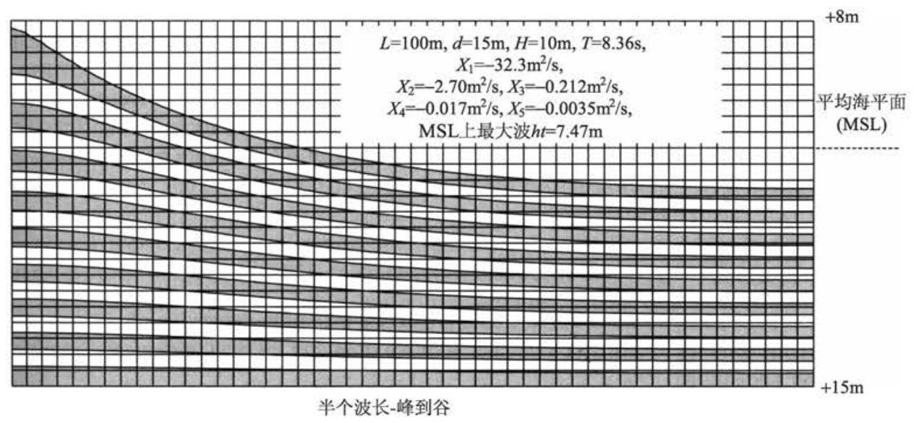

图 11.17 Dean 的流函数理论在动态参考系下的流线

用流函数式 (11.23) 可以计算出水平粒子速度。上例中波峰和波谷下的相对于固定参考系水平粒子速度如图 11.18 所示。

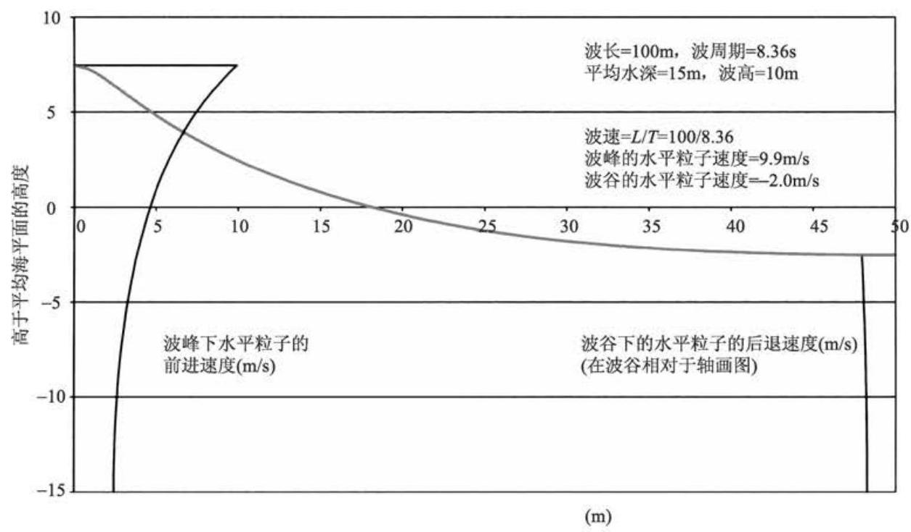

图 11.18 波峰和波谷以下的水平粒子速度的分布,

需注意波峰处的水平粒子速度较高，接近波速

一个网上资源提供了 Dean 流函数理论和波曲线的参数, 在网址 http:// www. coasta. udel. edu/rad//streamless. html 中可以找到用户输入的波参数。

### 11.3.9 支撑结构上的波浪载荷

沉浸结构的波浪载荷决定于它的大小、形状和表面粗糙度。那些相比之下波长较小，由结构引起的波浪运动的扰动可以忽略，通过 Morison 方程可以得到基于原形波运动的载荷。然而, 对于一些较大的元素, 考虑波形式的修改是必需的。这些可以通过衍射的分析完成, 在这种方法中, 通过数值的方法计算出结构离散面的不同压力。

#### 1 Morison 方程

对于宽度小于波长 1/5 的结构元素，一般用来描述独立的，添加阻力和惯性参数的载荷。由 Morison 方程给出:

$$
F = \frac{1}{2}{C}_{\mathrm{D}}{\rho D}\left| u\right| u + {C}_{\mathrm{M}}{\rho A}\frac{\partial u}{\partial t} \tag{11.28}
$$

式中 $F$ 是构件每单位长度上的力, $D$ 是构件宽度, $A$ 是横断面积, ${C}_{\mathrm{D}}$ 是阻力系数, ${C}_{\mathrm{M}}$ 是惯性系数。水粒子速度 $u$ 和加速度是适用于构件中心线的原形值。值得注意的是，由第一项给出的阻力载荷是非线性的，因为它取决于水粒子速度的平方。 当波峰达到该构件时，它达到峰值，而惯性载荷提前达到峰值(早于艾里波 T/4)。

Morison 方程普遍适用于棱形构件, 同时也适用于圆柱形件, 无论是单桩还是导管架结构部件。

#### 2 阻力和惯性系数的值

实验性阻力和惯性系数取决于:

(1)雷诺数 ${uD}/v$ ，其中 $v$ 是海水运动黏度(10°C时为 ${{1.35} \times  }{10}^{-6}{\mathrm{\;m}}^{2}/\mathrm{s}$ )。

(2)柱体的相关粗糙度 $k/D$ ，其中 $k$ 是谷底高度峰值的表面粗糙度。

(3)Keulegan-Carpenter 数， ${K}_{\mathrm{C}} = {u}_{\max }T/D$ 。其中 ${u}_{\max }$ 是水粒子速度的最大值 (在水面处, ${u}_{\max } = {Hw}/2\tanh {kd}$ ,所以 ${K}_{\mathrm{C}} = {\pi H}/D\tanh {kd}$ )。

(4)水流与最大的波引起的水粒子速度的比率。

雷诺数的影响 风力发电机组支撑结构的情况中, 除了最平静的海域, 雷诺数都有对应的后临界动态，使稳流阻力系数 ${C}_{\mathrm{{DS}}}$ 和雷诺数无关。

相对粗糙度的影响 稳流阻力系数从光滑柱体的 0.65 增加到粗糙柱体的 1.05。如图 11.19 所示,这表明 ISO19902:2007“石油和天然气工业 — 固定式海上钢结构”和 DNV-RP-205“环境条件和环境载荷”(2007 年 4 月)的建议, 它们在 ${C}_{\mathrm{{DS}}}$ 方面十分相似。

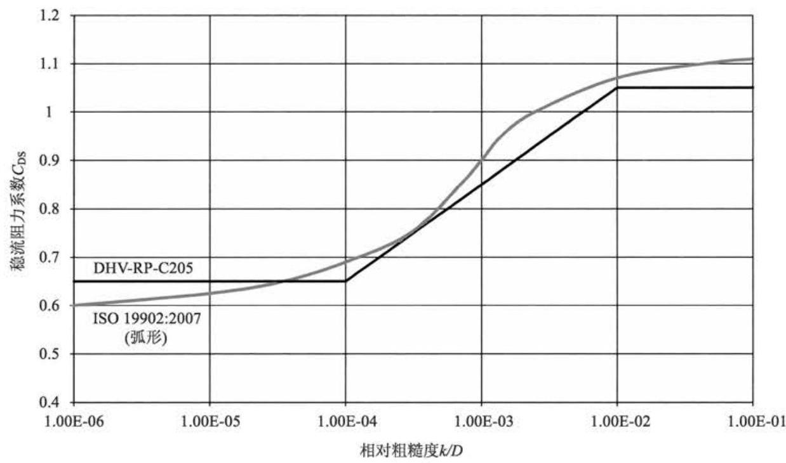

图 11.19 依赖相对粗糙度的稳流阻力系数

在高潮位以下，海洋生物生长对表面粗糙度和构件直径的影响必须考虑。终端厚度为 ${200}\mathrm{\;{mm}}$ 和 ${60} \sim  {100}\mathrm{\;{mm}}$ 的海洋生物分别在 HSE 海洋科技报告 ${2001}/{010}$ “环境因素”和“DNV-RP-C105”中提到, 但是海洋生物生长是有地域差异性的。如果悲观地假设谷底高度的表面峰值近似于终端厚度,那么典型的一个 $4\mathrm{\;m}$ 直径的单桩风力发电机组的相对粗糙度预期是在 ${0.015} \sim  {0.05}$ 内,从而导致稳流阻力系数在 ${1.05} \sim  {1.10}$ 内。

在高潮位以上，海洋生物的影响可以忽略。表 11.5 中给出的表面粗糙度 $k$ 就可以使用了。

表 11.5 表面粗糙度 (DNV-RP-205)

<table><tr><td>材 料</td><td>表面粗糙度 $k/\mathrm{{mm}}$</td></tr><tr><td>钢，新的，无涂层的</td><td>0.05</td></tr><tr><td>钢，涂漆的</td><td>0.005</td></tr><tr><td>高度腐蚀的钢</td><td>3</td></tr><tr><td>混凝土</td><td>3</td></tr></table>

Keulegan-Carpenter 数的影响 前进波相关的振荡流表示随着水流逆转, 柱体尾流从柱体一边传到另一边。在水流逆转后, 先前在尾流处缓慢移动的水流量会在相反的方向上增加速度, 这是与没有柱体的情况比较得到的结果。

在计算波浪载荷的阻力系数 ${C}_{\mathrm{D}}$ 时,结果可以通过稳流阻力系数 ${C}_{\mathrm{{DS}}}$ 乘以尾流放大系数 $\psi$ 得到。 $\psi$ 依赖于 Keulegan-Carpenter 数。图 11.20 显示了 $\psi$ 和 DNV-RP-205 中给出的 ${K}_{\mathrm{C}}$ 在粗糙和光滑柱体的关系。这些和 ISO19902: 2007 中给出的很相似。

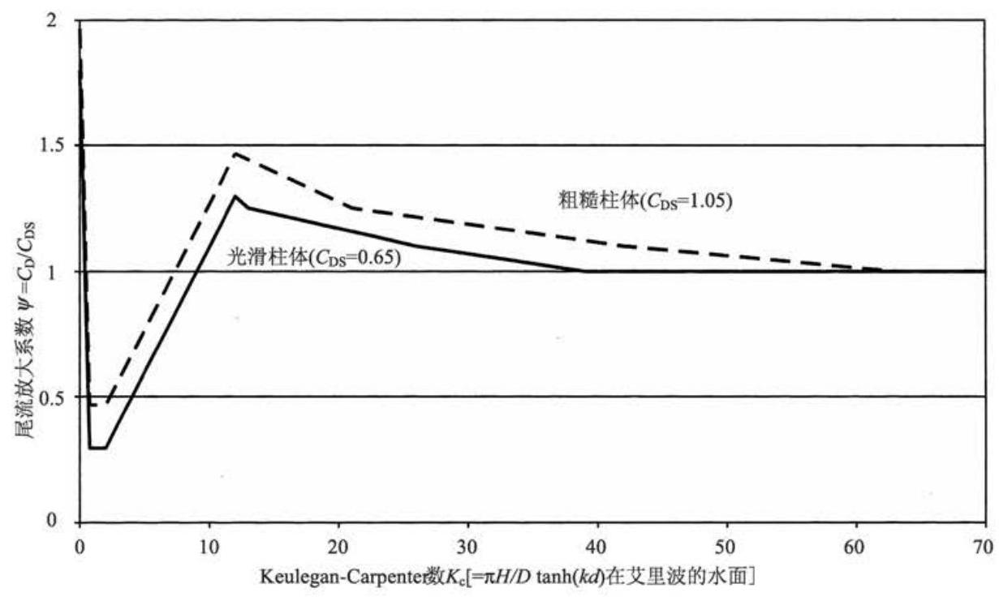

图 11.20 尾流放大系数 $\psi  = {C}_{\mathrm{D}}/{C}_{\mathrm{{DS}}}$ 随 DNV-RP-205 中的 Keulegan-Carpenter 数的变化

在很小的 Keulegan-Carpenter 数的情况下, 惯性系数可以取 2.0 , 这是在没有流分离情况下的位势论的理论值。对于 ${K}_{\mathrm{C}} > 3$ 的情况,这个值会从分流开始减小, 逐渐达到光滑时的 1.6 和粗糙时的 1.2 的渐进值。图 11.21 显示了粗糙和光滑柱体上的 ${C}_{\mathrm{M}}$ 和 DNV-RP-C205 给出的 ${K}_{\mathrm{C}}$ 的关系。这些和 ISO19902: 2007 中给出的基本一致。

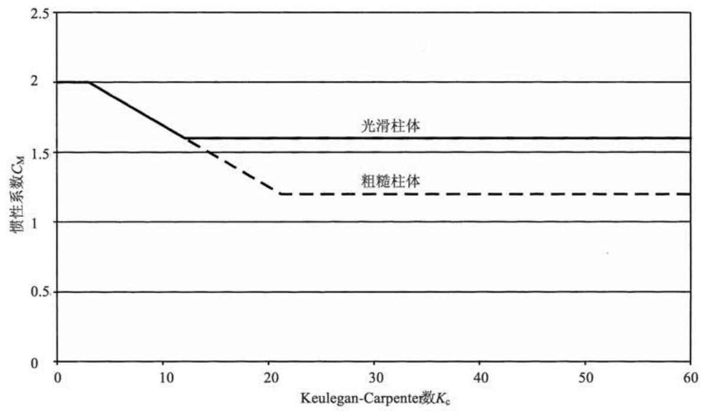

图 11.21 惯性系数 ${C}_{\mathrm{M}}$ 随 DNV-RP-C205 中的 Keulegan-Carpenter 数的变化

水流的影响 在不考虑波传播的方向和水流方向关系的前提下，稳定水流的影响是使得阻力系数 ${C}_{\mathrm{D}}$ 向稳定水流值 ${C}_{\mathrm{{DS}}}$ 靠近。在同轴的水流的情况中，当水流大于 0.4 倍的基于波浪运动的最大轨道速度时, ${C}_{\mathrm{D}}$ 可以认为和 ${C}_{\mathrm{{DS}}}$ 相等。

#### 3 阻力与惯性力比

在艾里波理论中, 在海平面, 单位长度的最大阻力与最大惯性力的比为:

$$
\frac{{F}_{\mathrm{D}.\mathrm{{Max}}}}{{F}_{\mathrm{M}.\mathrm{{Max}}}} = \frac{{C}_{\mathrm{D}}}{{C}_{\mathrm{M}}}\frac{H}{\pi D}\frac{1}{\tanh \left( {kd}\right) } = \frac{{C}_{\mathrm{D}}}{{C}_{\mathrm{M}}}\frac{{K}_{\mathrm{C}}}{{\pi }^{2}} \tag{11.29}
$$

图 11.22 显示了对于粗糙柱体 $\left( {{C}_{\mathrm{{DS}}} = {1.05}}\right)$ 的 ${C}_{\mathrm{D}}$ 和 ${C}_{\mathrm{M}}$ 如何随 Keulegan-Carpenter数变化, 这些是基于 DNV-RP-C205 的建议。由此产生的最大阻力和最大惯性力比率的变化已经从式 (11.29) 中获得, 也在同一个图中有所显示。

主要阻力和主要惯性可以根据占主要的载荷部分来定义。对于一个粗糙的柱体,当 Keulegan-Carpenter 数大于 ${\pi }^{2}{C}_{\mathrm{M}}/{C}_{\mathrm{D}}$ 时,从惯性为主的情况变成以阻力为主的情况。也就是说，近似为 ${\pi }^{2}\left( {{1.64}/{1.45}}\right)  = {11.2}$ ，对于深水的情况， $\tanh {kd}$ 接近 1，当波高与柱体直径的比大于11.2/π，也就是大于3.5 时，阻力占主导。在浅水区，tanh ${kd}$ 小于 1，阈值会按比例降低。可以看出，对于正常海况，在大约4.0 m 直径的单桩载荷可能惯性载荷占主要部分。

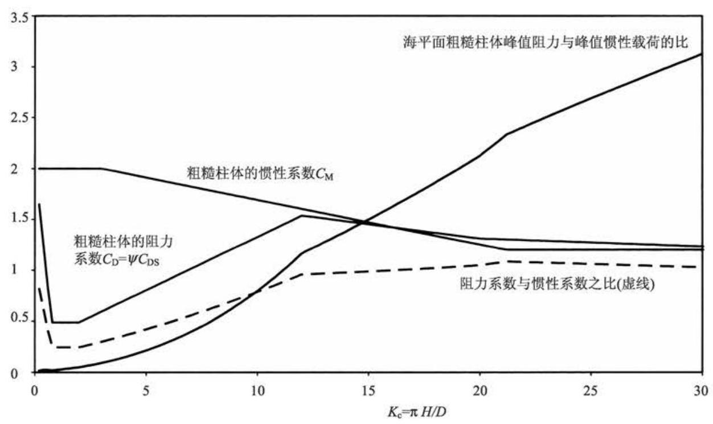

图 11.22 粗糙柱体在海平面 ${C}_{\mathrm{D}},{C}_{\mathrm{M}},{C}_{\mathrm{D}}/{C}_{\mathrm{M}}$ 以及最大阻力

与最大慢性力的比如何随 Keulegan-Carpenter 数变化

#### 4 柱体上的艾里波载荷

艾里波在柱体的载荷可以通过在式(11.28)中插入水平粒子速度[式(11.16) 和加速度轻易得到。

然而, 艾里理论是基于极微小的波的, 它不能提供静水位之上的速度和加速度。因此, 假设瞬间自由表面运动和艾里波理论中静水位所给出的相同是非常普遍的做法。在水柱被均匀地压缩或拉伸到平均水深相应的高度后, 中间水深处的运动学由艾里理论给出。这个方法是 Wheeler (1970) 提出的, 被称为 Wheeler 延展。

图 11.23 显示了在完整的地方水深中的 $4\mathrm{\;m}$ 直径垂直柱体上的阻力和惯性载荷在 $3\mathrm{\;m}$ 艾里波的时候是如何随着时间变化的。正如预期的那样,阻力部分比惯性部分要小得多。从图中可以看出, 在接近波峰的地方, Wheeler 延展代替了惯性载荷峰值。

显然, 在这种情况下, 阻力载荷对最大总体载荷基本上没有影响。在一般情况里,当 ${K}_{\mathrm{C}} > {0.5}{\pi }^{2}{C}_{\mathrm{M}}/{C}_{\mathrm{D}}$ 时,阻力载荷才开始影响到最大全体载荷。

#### 5 非线性波的柱体载荷

在较大的非线性波的情况中, 水粒子速度和加速度输入到 Morison 公式中必须是依据非线性波理论。图 11.24 显示了基于五阶 Dean 流函数理论,在 ${10}\mathrm{\;m}$ 的规律波中，直径为 $4\mathrm{\;m}$ 的垂直柱体上的阻力和惯性载荷的变化。用到的阻力系数和惯性系数是基于 DNR-RO-C105 的建议。载荷如以前一样是整个地方水深的集成。

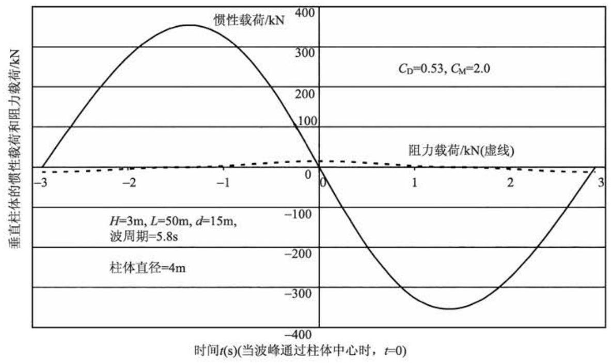

图 11.23 $4\mathrm{\;m}$ 直径的垂直柱体在一个完整的波周期为 $3\mathrm{\;m}$ 艾里波,平均水深 ${15}\mathrm{\;m}$ 的波载荷变化

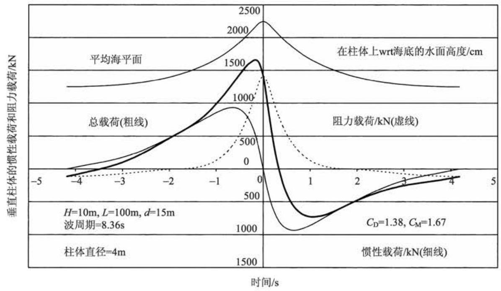

图 11.24 ${10}\mathrm{\;m}$ 规律波和 ${15}\mathrm{\;m}$ 平均水深的情况下,

直径为 $4\mathrm{\;m}$ 的垂直柱体上的波浪载荷在一个全周期内的变化

当波峰通过柱体时, 阻力载荷会达到一个显著的峰值，这是由于不断增加的水深和波峰处高的水粒子的速度，相比于波速的 12m/s，这个速度为 ${9.9}\mathrm{\;m}/\mathrm{s}$ 。

相比于艾里波中应用的 $T/4$ ，惯性载荷最大值的相位超前减小很多。令人吃惊的是, 相比于上述的艾里波的例子, 阻力载荷和惯性载荷峰值的比增加了一个大小为 35 的因子,尽管 $\left( {{C}_{\mathrm{D}}/{C}_{\mathrm{M}}}\right)  \cdot  \left( {H/D}\right)$ 的比值只增加了一个 10.4 大小的因子。

#### 6 衍 射

相对于波长而言, 结构元素中的有效宽度改变了波的行为。所以隐含在 Morison 公式中假设透明度不再适用了, 取而代之的是一种衍射分析的方法。在这种方法中,结构附近的变形波流可以从一系列速度势分布中得到, 这些分布满足了没有水流垂直于结构表面的额外的需求。值得注意的是, 衍射分析能够确定结构上的惯性载荷, 但是不能确定阻力载荷。在大型结构中, 通常忽略阻力载荷, 惯性载荷除外。衍射分析法的更重要的限制是它严格要求研究对象是线性波, 因为速度势在自由水表面仅仅满足边界条件的线性形式。

基于 Bessel 函数速度势闭式解决方法是 MacCamy 和 Fuchs(1954)基于突出水面上的大型垂直柱体的工程中开发出来的。这个方法将速度势分为 2 个部分。 第一部分是没有柱体情况下的速度势, 第二部分是去掉第一部分假设的柱体表面水流的速度势。所得结果通过与非定常的 Bernouilli 公式结合计算出柱体的压力分布, 进一步得到单位长度的载荷。图 11.25 显示了惯性系数是如何随直径波长比 $D/L$ 变化的。

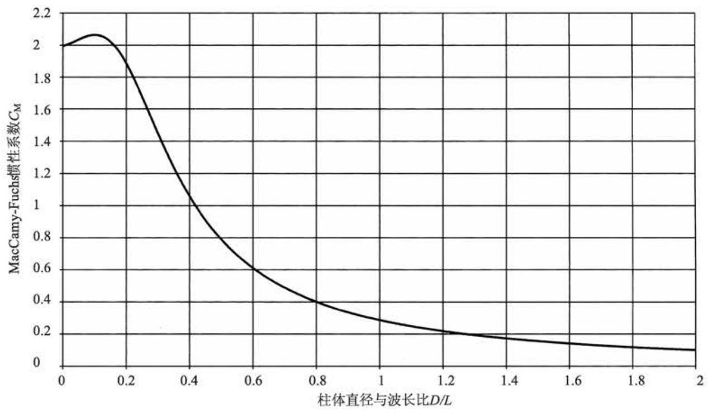

图 11.25 基于 MacCamy 和 Fuchs 而得到的大柱体直径对惯性系数的影响

可以看出,在起初一个少量的增加后,惯性系数随着 $D/L$ 的增加迅速下降。

关于速度势和柱体载荷的 MacCamy 和 Fuchs 表达式的推导是 Dean 和 Dalrymple(1984)描述的。

一般情况下, 没有闭式解可用则采用数值方法。这个方法也包括在结构缺失情况下确定速度势和在第一速度势的基础上叠加的第二个速度势的推导，结果零流量通过结构表面，同时满足拉普拉斯公式和其他边界条件。结构的表面分为 $N$ 个区域或者小平面。每一个都有自己的振荡流源均匀分布在小平面。第二个速度势是 $N$ 个振荡流源产生的速度势的总和。零流量要求在每个小平面的应用结果是确定每个源大小的 $N$ 联立方程。

指出小平面 $\mathrm{i}$ 的单位面积的源强度用 ${f}_{\mathrm{i}}$ 表示。从每个小平面 $\mathrm{i}$ 中心辐射出的每个单位的振荡源的速度势是 ${\phi }_{\mathrm{i}}\left( {x, y, z, t}\right) /{4\pi }$ ,总体的势梯度垂直于小平面 $\mathrm{j}$ ,所以,所有的 $N$ 个振荡源变为:

$$
{\left( \frac{\partial {\phi }_{\mathrm{s}}}{\partial n}\right) }_{\mathrm{j}} = \frac{1}{4\pi }\left\lbrack  {{\left( \frac{\partial {\Phi }_{1}}{\partial n}\right) }_{\mathrm{j}}{f}_{1}{S}_{1} + \cdots  + {\left( \frac{\partial {\Phi }_{\mathrm{i}}}{\partial n}\right) }_{\mathrm{j}}{f}_{\mathrm{i}}{S}_{\mathrm{i}} + \cdots  + {\left( \frac{\partial {\Phi }_{\mathrm{N}}}{\partial n}\right) }_{\mathrm{j}}{f}_{\mathrm{N}}{S}_{\mathrm{N}}}\right\rbrack
$$

$$
= \frac{1}{4\pi }\mathop{\sum }\limits_{i}{\left( \frac{\partial {\Phi }_{1}}{\partial n}\right) }_{\mathrm{i}}{f}_{\mathrm{i}}{S}_{\mathrm{i}}
$$

其中 ${S}_{\mathrm{i}}$ 是小平面 $\mathrm{i}$ 的表面面积。

对于零流量穿过小平面 $\mathrm{j}$ 的情况, ${\left( \partial {\phi }_{1}/\partial n\right) }_{\mathrm{j}} =  - {\left( \partial {\phi }_{\mathrm{s}}/\partial n\right) }_{\mathrm{j}}$ ,其中 ${\left( \partial {\phi }_{1}/\partial n\right) }_{\mathrm{j}}$ 是在结构缺失的垂直于小平面的势梯度。这可以导出一组方程:

$$
{\left( \frac{\partial {\phi }_{\mathrm{I}}}{\partial n}\right) }_{\mathrm{j}} =  - \frac{1}{4\pi }\mathop{\sum }\limits_{i}{\left( \frac{\partial {\Phi }_{\mathrm{i}}}{\partial n}\right) }_{\mathrm{j}}{f}_{\mathrm{i}}{S}_{\mathrm{i}} \tag{11.30}
$$

这个可以解决源强度 ${f}_{\mathrm{i}}$ 的问题。

Wehausen 和 Laitone(1960)在《地面波》的 478 页上给出了一个关于 ${\phi }_{\mathrm{i}}(x, y$ , $z, t)$ 的式子。除了预期的点源项 $\left( {1/r}\right) \cos {wt}$ 和海底下面假想的“镜像”源项 $\left( {1/{r}_{2}}\right)  \times \; \cos {wt}$ [其中 $r$ 和 ${r}_{2}$ 分别是点源和镜像源到点 $\left( {x, y, z}\right)$ 的半径],第一种 Bessel 函数中还涉及其他的两项,一个是相位,另一个是源的 ${90}^{ \circ  }$ 反相位。这些项需要满足自由表面的临界条件并且预期向无限衰减。

如上面提到的, 衍射理论仅能提供线性波的精确解。然而, 通过增加结构表面每个小平面载荷的方法可以得到非线性波的近似解, 其中, 这些载荷是通过衍射分析法分析小平面上非线性波粒子的加速度和线性波浪粒子加速度的比值得到的, 这个过程中认为结构是明晰的。

#### 7 破碎波

深水波破碎是在它们到达波高与水深的比超过 0.78 的较浅水域时发生的, 并可能导致短期载荷大于那些非破波。

破碎波一般分为 3 种不同的类型:造型、卷跃型和澎湃型。Muri Wood 和 Fleming(1981)区分它们如下:原则上，卷波发生在峰值速度大于波浪本身的速度时, 溢型破碎波发生在峰值速度保持近似等于波浪速度时, 澎湃型碎波发生在波浪的基底在峰值涌向前之前达到海岸时。显然卷跃型碎波对风力发电机组的结构影响最大，因为前进的水墙在垂直表面上会产生冲击载荷。

波浪的流体力在一个面上的影响是一个复杂的三维问题，由于结构的形式，波前的形状和夹带空气的存在，所以简化假设很必要。图 11.26 显示了一个卷波作用在垂直圆柱体上。尽管波前的表面是凹的，但通常认为它是垂直的。其中高度是波峰高度 ${\eta }_{b}$ 的 $\lambda$ 倍，而且认为圆柱体周围的水流都是二维的， $\lambda$ 被叫做卷跃因子。

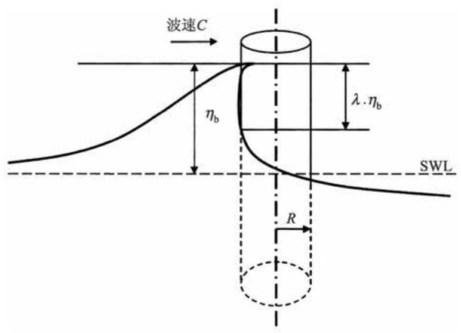

图 11.26 在垂直圆柱体上的破碎波

当破碎波包围圆柱体时, 关于圆柱体上的冲击载荷的理论有很多, 并且总结在 Wienke 和 Oumeraci(2005)中。图 11. 27 中显示了一些理论的单位长度上冲击力的时间历程。

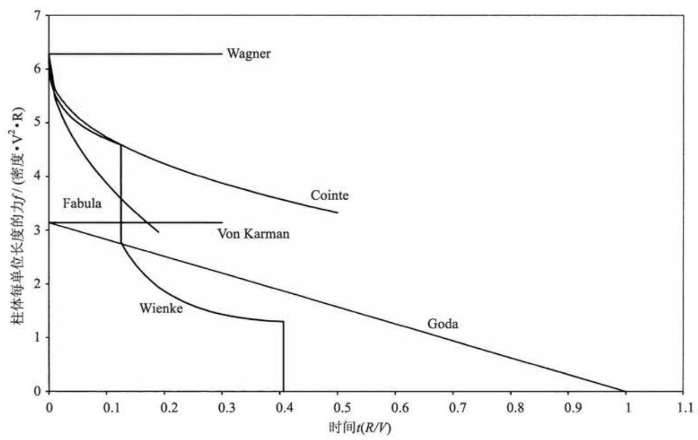

图 11.27 不同理论的柱体冲击力的时间历程

从图中可以看出,最初的冲击力系数的大小可以表示为 $f/\left( {\rho {V}^{2}R}\right)$ ,这个值是相当不确定的,在 $\pi$ 和 ${2\pi }$ 之间。较高的值是由于圆柱体的任一侧的 $k$ 的堆积 (图 11.28)。

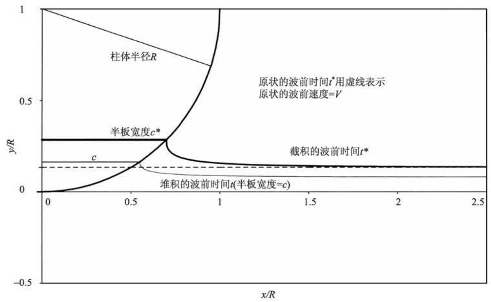

图 11.28 当波前到达柱体周围时的水的堆积情况

柱体上的力等于浸没于海面下的压力分布的积分。从非定常 Bernouilli 公式中得到:

$$
p\left( {x, t}\right)  = \rho \frac{\partial \phi }{\partial t} - \frac{1}{2}\rho \left\lbrack  {{\left( \frac{\partial \phi }{\partial x}\right) }^{2} + {\left( \frac{\partial \phi }{\partial x}\right) }^{2}}\right\rbrack   + C\left( t\right) \tag{11.31}
$$

重力项被忽略,高度是恒定的。

利用平板理想化速度势 确定速度势 $\phi$ 的问题可以简化,如果假设瞬时的流场适用于平板的绕流，那么其宽度等于柱体瞬时沉浸的宽度 (图 11.28)。垂直于平均水流方向的平板周围流的复势能由 Mine-Thomson(1967) 给出:

$$
w =  - \mathrm{i}V\sqrt{{z}^{2} - {c}^{2}} \tag{11.32}
$$

其中, $V$ 是远离平板的在 $y$ 轴负方向的流速, $z = x + \mathrm{i}y$ ,平板的宽度为 ${2c}\text{ 。 }w$ 的实部给出了速度势,在平板表面的上游的速度势等于 $\phi  = V\sqrt{{c}^{2} - {x}^{2}}$ 。

在远离平板上游的点,液体的压力 $\partial \phi /\partial t$ 和 $\partial \phi /\partial x$ 都是零,所以 $C\left( t\right)  = {0.5\rho }{V}^{2}$ , 式(11.31)变成了:

$$
p\left( {x, t}\right)  = \rho \frac{\partial }{\partial t}\left( {V\sqrt{{c}^{2} - {x}^{2}}}\right)  - \frac{1}{2}\rho {\left( \frac{\partial \phi }{\partial x}\right) }^{2} + \frac{1}{2}\rho {V}^{2}
$$

$$
= \frac{\rho Vc}{\sqrt{{c}^{2} - {x}^{2}}}\frac{\mathrm{d}c}{\mathrm{\;d}t} - \frac{1}{2}\rho {V}^{2}\frac{{x}^{2}}{{c}^{2} - {x}^{2}} + \frac{1}{2}\rho {V}^{2} \tag{11.33}
$$

波前堆积 Wagner(1932) 制定出了一个计算静止水面的船体周围每个侧面的波前加速的方法。通过这些可以得到波前对柱体的影响, $\mathrm{d}c/\mathrm{d}t$ (图 11.28)。

由式 (11.3) 可知,水流经过想象中的平板上的一点的速度为:

$$
{\left( \frac{\partial \phi }{\partial y}\right) }_{y = 0, x > c} = \frac{V}{\sqrt{1 - {\left( c/x\right) }^{2}}} \tag{11.34}
$$

这个表达式相对于时间的积分给出了 $y$ 点的坐标 $\left( {{C}^{ * }, y}\right)$ ,其中波前到达柱体表面的时间是 ${t}^{ * }$

$$
y\left( {t}^{ * }\right)  = {\int }_{0}^{{t}^{ * }}\frac{V\mathrm{\;d}t}{\sqrt{1 - {\left( c/{c}^{ * }\right) }^{2}}} \tag{11.35}
$$

我们现在定义 $u = V/\left( {\mathrm{d}c/\mathrm{d}t}\right)$ ,所以 $V\mathrm{\;d}t = u\mathrm{\;d}c$ ,以及

$$
y\left( {t}^{ * }\right)  = {\int }_{0}^{{c}^{ * }}\frac{u\mathrm{\;d}c}{\sqrt{1 - {\left( c/{c}^{ * }\right) }^{2}}} \tag{11.36}
$$

我们假设 $u = {a}_{1}c + {a}_{3}{c}^{3} + {a}_{5}{c}^{5} + \cdots$ ,进行积分,而 ${a}_{n}$ 的值取决于柱体外形上的 $y\left( {t}^{ * }\right) ,{c}^{ * }$ 的需要。例如,如果 $u = {a}_{1}c$ ,那么

$$
y\left( {t}^{ * }\right)  = {\int }_{0}^{{c}^{ * }}\frac{{\alpha }_{1}c\mathrm{\;d}c}{\sqrt{1 - {\left( c/{c}^{ * }\right) }^{2}}} = {\alpha }_{1}{\left\lbrack  -{c}^{*2}\sqrt{1 - {\left( c/{c}^{ * }\right) }^{2}}\right\rbrack  }_{0}^{{c}^{ * }} = {\alpha }_{1}{c}^{*2}
$$

(11.37)

抛物线形的解决方法 让 ${a}_{1}{c}^{*2}$ 近似等于一个圆, $y\left( {t}^{ * }\right)  = {0.5}{c}^{*2}/R$ ,令 ${a}_{1} = {0.5}/R$ ,因此 $u = {0.5c}/R,\mathrm{\;d}c/\mathrm{d}t = V/u = V \cdot  {2R}/c$ 。可以代入式 (11.33) 得到:

$$
p\left( {x, t}\right)  = \frac{{2\rho }{V}^{2}R}{\sqrt{{c}^{2} - {x}^{2}}} + \frac{1}{2}\rho {V}^{2} - \frac{1}{2}\rho {V}^{2}\frac{{x}^{2}}{{c}^{2} - {x}^{2}}
$$

$$
= \frac{{2\rho }{V}^{2}R}{\sqrt{{c}^{2} - {x}^{2}}} + \frac{1}{2}\rho {V}^{2}\left( {2 - \frac{{c}^{2}}{{c}^{2} - {x}^{2}}}\right) \tag{11.38}
$$

这个式子是平板宽度对柱体单位长度的力的积分。

$$
f = {2\rho }{V}^{2}R \cdot  2{\int }_{0}^{c}\frac{\mathrm{d}x}{\sqrt{{c}^{2} - {x}^{2}}} + \frac{1}{2}\rho {V}^{2} \cdot  2{\int }_{0}^{c}\left( {2 - \frac{{c}^{2}}{{c}^{2} - {x}^{2}}}\right) \mathrm{d}x
$$

$$
= {4\rho }{V}^{2}R\arcsin \left( \frac{x}{c}\right)  + \rho {V}^{2}{\int }_{0}^{c}\left( {2 - \frac{{c}^{2}}{{c}^{2} - {x}^{2}}}\right) \mathrm{d}x
$$

$$
= \rho {V}^{2}R\left\{  {{2\pi } + \frac{2c}{R} - \frac{c}{R}{\left\lbrack  \operatorname{arctanh}\left( \frac{x}{c}\right) \right\rbrack  }_{0}^{c}}\right\} \tag{11.39}
$$

式(11.39)中的第三项在理论上是无限负的，因为假想平板的边缘上的力趋向于负无穷大。然而,如果忽略了负压,将会得到一个保守的结果。当 $c = 0$ 时,单位长度上的起初力是 ${2\pi \rho }{V}^{2}R$ ,这个力比速度的阻力大一个数量级。

双阶解决方法 Wienke (2001) 通过上面的抛物线 ${c}^{ * }/R < 1/\sqrt{2}$ 和四次曲线来接近圆形。图 11.27 显示了产生的阶梯状力的时间历程。

近圆形的复合解法 柱体的圆形 $y\left( {t}^{ * }\right) /R = 1 - \sqrt{1 - {\left( {c}^{ * }/R\right) }^{2}}$ 可以通过二项级数进行近似:

$$
y\left( {t}^{ * }\right)  = \frac{1}{2}{\left( \frac{{c}^{ * }}{R}\right) }^{2} + \frac{1}{8}{\left( \frac{{c}^{ * }}{R}\right) }^{4} + \frac{1}{16}{\left( \frac{{c}^{ * }}{R}\right) }^{6} + \frac{5}{128}{\left( \frac{{c}^{ * }}{R}\right) }^{8} + \cdots \tag{11.40}
$$

用 $u = {a}_{1}c + {a}_{3}{c}^{3} + {a}_{5}{c}^{5} + \cdots$ 代入式(11.36)中得到:

$$
\mu  = \frac{1}{2}\left( \frac{c}{R}\right)  + \frac{3}{16}{\left( \frac{c}{R}\right) }^{3} + \frac{5}{128}{\left( \frac{{c}^{ * }}{R}\right) }^{5} + \cdots
$$

$$
+ \frac{\left( {{2n} + 1}\right) \left( {{2n} - 1}\right) \left( {{2n} - 3}\right) \cdots }{{2n}\left( {{2n} - 2}\right) \left( {{2n} - 4}\right) \cdots }\frac{\left( {{2n} - 1}\right) \left( {{2n} - 3}\right) \left( {{2n} - 5}\right) \cdots }{\left( {{2n} + 2}\right) \left( {2n}\right) \left( {{2n} - 2}\right) \cdots }{\left( \frac{c}{R}\right) }^{{2n} + 1}
$$

尽管只有几项[式(11.40)在 ${c}^{ * }/R < {0.8}$ 表示形状时需要用到，但多数项在 ${c}^{ * }/R$ 接近于 1 时会用到。压力分布的式 (11.33) 变为:

$$
p\left( {x, t}\right)  = \frac{\rho {V}^{2}c/\mu }{\sqrt{{c}^{2} - {x}^{2}}} + \frac{1}{2}\rho {V}^{2}\left( {2 - \frac{{c}^{2}}{{c}^{2} - {x}^{2}}}\right) \tag{11.41}
$$

单位长度上的力可以通过整合式 (11.41) 的浸没宽度得到, 其中不考虑之前假想平板边缘上的负压。当压力变化记为 ${c}^{\prime }$ 时表示 $x$ 的值,则圆柱体的单位长度上的力为:

$$
f = \rho {V}^{2}R\left\lbrack  {\frac{2c}{\mu R}\arcsin \left( \frac{{c}^{\prime }}{c}\right)  + \frac{2{c}^{\prime }}{R} - \frac{c}{R}\operatorname{arctanh}\left( \frac{{c}^{\prime }}{c}\right) }\right\rbrack \tag{11.42}
$$

波浪第一次击打圆柱体所用时间与浸没宽度 ${2c}$ 间的关系，可以从式子 $V\mathrm{\;d}t = \; u\mathrm{\;d}c$ 中得到。图 11.29 显示了当级数表达式中 $\mu$ 取 100 项时单位长度上力随时间变化的结果。

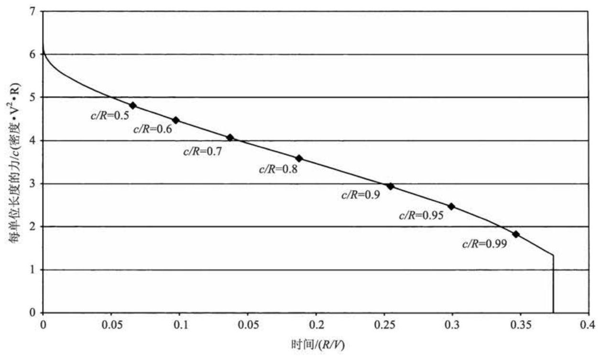

图 11.29 使用理想化平板, 破碎波作用于垂直圆柱体单位长度上的力随时间的变化

值得注意的是，当 $c/R$ 接近于 1 时，值会变得不准确。因为将这一系列近似为圆而产生不可避免的不准确性。然而,对于大的 $c/R$ ,人们更关心的是平板的理想化会变的不切实际。

实验测量 在汉诺威的 Forschungszentrum Küste 的造波水池中, 对于垂直和斜圆柱体破碎波的一系列广泛的测量已经由 Wienke 和 Oumercaci(2005) 报道。 在圆柱体周围的压力测量证明了 Wagner 波前堆积模型的有效性。总负载的测量指出了对于垂直圆柱体的卷跃因子的最大值为 0.46 。这符合 Goda(1966) 给出的取值范围为 ${0.4} \sim  {0.5}$ 。

### 11.3.10 约束波

在随机的海况中由大波浪引起的结构载荷的分析是复杂的过程,因为线性波的理论应用到了无数个体的微小的正弦分量波形的情况，每一个都自我作用，当结合在一起时, 因为产生的波幅大而破碎。IEC61400-3 的附录 D 提出了几种简化问题的方法。其中之一——约束波法包括在一系列不规则的线性波中嵌入一个单个的非线性规则波(在波谷开始和结束)而形成的一个较长的仿真。

很明显, 为了保持一个基本相似的两个波运动, 需要从仿真波形和嵌入波之间的平滑过渡。理想情况下, 可以在仿真的波形中找到类似幅度的波指定为规则波, 然后用后者代替前者。然而，为找到足够大的波，还是需要大量的仿真。而任一侧波峰上的波谷不太可能是相同的高度。此外, 对于任何仿真波来说, 在静水位以上的峰值的高度通常为波高的一半，而对于嵌入的非线性波约为 3/4。

为了克服这些困难, Rainey 和 Camp(2007)建议在三个点约束仿真波形的高度和斜度, 这三个点与嵌入波的波峰和波谷是一致的。约束波形可以通过校正一原始的仿真波得到，这个仿真波运用了新波理论(Tromans 等，1991)来满足附加条件。

Bierbooms (2006)通过应用在风的仿真中介绍了这个方法, 并得出了约束阵风时间历程的表达式。约束水面高度时间历程的类似的表达式,在时间 $t = {t}_{0}$ 时,有一个 $A$ 的极端值，如下所示:

$$
{\eta }_{\mathrm{c}}\left( t\right)  = \eta \left( t\right)  + \kappa \left( {t - {t}_{0}}\right) \left\lbrack  {A - \eta \left( {t}_{0}\right) }\right\rbrack   - \frac{\dot{\kappa }\left( {t - {t}_{0}}\right) }{\ddot{\kappa }\left( 0\right) }\dot{\eta }\left( {t}_{0}\right) \tag{11.43}
$$

其中 $\eta \left( t\right)$ 是从最初的仿真中得到的水面高度, $k\left( {t - {t}_{0}}\right)$ 是水面高度的自相关函数, $k\left( {t - {t}_{0}}\right)$ 是其时间导数, $k\left( 0\right)$ 是 $t = {t}_{0}$ 时的第二时间导数。图 11.30 中给出了自相关函数及其时间导数 $\left( {\ddot{\kappa }\left( 0\right) }\right.$ 标准化)。其中示出了这两个相关项是如何随波频波动以及随 $\left| {t - {t}_{0}}\right|$ 增加而减弱的。

这个方法可以扩展到水面高度的约束中以及找出三个连续的时间点的斜率。 图 11.31 展示了一个水面高度仿真时间历程的例子,以及在波峰 (时间 ${t}_{2}$ ) 处 $C$ 的理想约束高度和波谷前和后 (时间 ${t}_{1}$ 和 ${t}_{3}$ ) 的 $D$ 的理想约束高度。

水面高度的模拟时间历程的 6 个约束方程为:

$$
{\eta }_{\mathrm{c}}\left( t\right)  = \eta \left( t\right)  + {\alpha \kappa }\left( {t - {t}_{1}}\right) \left\lbrack  {D - \eta \left( {t}_{1}\right) }\right\rbrack   + b\frac{\kappa \left( {t - {t}_{1}}\right) }{\dot{\kappa }\left( 0\right) }\eta \left( {t}_{1}\right)  + \alpha \left( {t - {t}_{2}}\right) \left\lbrack  {C - \eta \left( {t}_{2}\right) }\right\rbrack
$$

$$
+ \mathrm{d}\frac{\dot{\kappa }\left( {t - {t}_{2}}\right) }{\ddot{\kappa }\left( 0\right) }\dot{\eta }\left( {t}_{2}\right)  + e\dot{\kappa }\left( {t - {t}_{3}}\right) \left\lbrack  {D - \eta \left( {t}_{3}\right) }\right\rbrack   + f\frac{\dot{\kappa }\left( {t - {t}_{3}}\right) }{\ddot{\kappa }\left( 0\right) }\dot{\eta }\left( {t}_{3}\right)
$$

(11.44)

其中 $a, b, c, d, e$ 和 $f$ 是 6 个未知系数。它们可以从六联立方程组中依次令 $t$ 等于 ${t}_{1},{t}_{2},{t}_{3}$ 代入式 (11.44) 得到,其时间导数 ${\eta }_{\mathrm{c}}\left( {t}_{1}\right)$ 为 $D,{\eta }_{\mathrm{c}}\left( {t}_{2}\right)$ 为 $C,{\eta }_{\mathrm{c}}\left( {t}_{3}\right)$ 为 $D$ ,而 ${\dot{\eta }}_{\mathrm{c}}\left( {t}_{1}\right) ,{\dot{\eta }}_{\mathrm{c}}\left( {t}_{2}\right) ,{\dot{\eta }}_{\mathrm{c}}\left( {t}_{3}\right)$ 都为 0 。

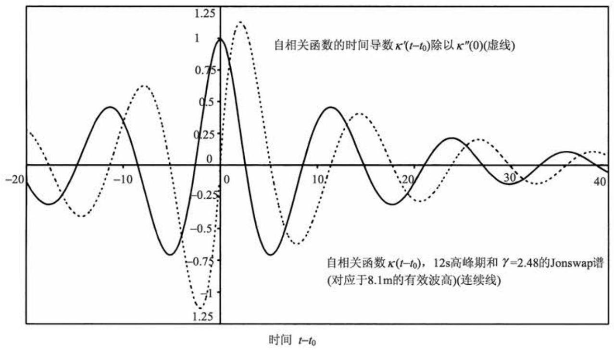

图 11.30 Jonswap 谱自相关函数及其时间导数

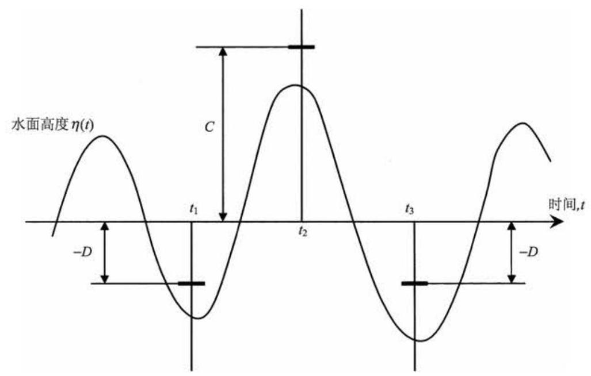

图 11.31 模拟水面的时间历程和在时间 ${t}_{1},{t}_{2},{t}_{3}$ 的预期约束

图 11.32 提供了一个模拟水面高度时间历程约束允许 ${15}\mathrm{\;m}$ 的规则波插入的一个例证。Jonswap 谱用于有效波高为 ${8.1}\mathrm{\;m}$ 的模拟,也就是说,在 3 小时的参考周期中，会产生一个超过 ${15}\mathrm{m}$ 的极端波。频谱的峰值频率对应的波周期为 ${12}\mathrm{s}$ 。

嵌入波形代替了从 ${276.5}\mathrm{\;s}$ 开始的超过 ${12}\mathrm{\;s}$ 的约束仿真，这来自 5 阶流函数理论。Rainey 和 Camp(2007)建议在每个波谷之间使用余弦混合函数来使得波动力学中的假设的线性与非线性之间的边界处必然的不连续的部分(并因此波载荷)变得光滑。过渡区的水粒子的速度和加速度然后计算线性和非线性方法的加权平均值，这些加权来自于混合函数。

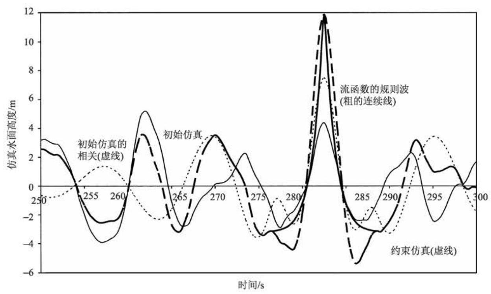

图 11.32 模拟水面高度时间历程约束使能够插入 ${15}\mathrm{\;m}$ 规则波的例子

尽管这些没能提供一个波动方程严格的方法，但是它确实提供了一个有实际意义的工程方法，其中以不规律的海况为背景，在非线性极端波的通过结构前设为初始动态情况。

### 11.3.11 支撑结构载荷分析

一般地, 在进行海上油气平台结构载荷计算时候, 习惯上, 要考虑确定性, 规则的非线性波用于极限载荷, 接触到的不同的随机海况用于疲劳载荷。在后一种载荷中，频谱分析允许被占用一个频率相关的传递函数响应激发结构的动态行为，但依赖于假设的线性波和相对小的阻力载荷, 允许对 Morison 公式中的阻力项 “线性化”。

风力发电机组支撑结构载荷和典型的海上油气开采结构的载荷不同主要有以下几个方面:

(1)风力发电机组设置在较浅的水域，非线性波载荷更重要。

(2)风力发电机组比静水位以上，加上在深水的地方选址，导致风载荷更重要。

(3) 一个运行的风力发电机组的支撑结构上的风载荷与石油平台或静止风力发电机组的载荷是完全不同的, 因为即使风速很低, 还是有很大的推力载荷, 阵风叶片和叶轮的转速以及桨距角的主动控制使得载荷周期随机变化。

(4)风力发电机组一般支撑在单个的圆柱上，它没有一般用于油气平台的桁架结构坚硬。

随机变化的周期性载荷如(3)中所述，加上额定风速以上的非线性空气动力学，是风力发电机组载荷分析在时域中使用多个仿真的主要驱动因素。在海上风力发电机组中, 波载荷也要被输入仿真中。

波载荷的仿真从波频谱定义下的海况调查开始(11.3.4 节)，并且包含了很多不同频率的随机相位的微小波的叠加，每个波的振幅是由有关频率的频谱密度的平方根决定的。在关键的假设下, 这些可以得到水面高度的时间历程和水粒子的运动。这个假设是线性波理论给出的。最后, 波载荷通过运用 Morison 方程得到的水粒子运动计算出来。

尽管波载荷不会直接作用在叶片和机舱上，塔顶加速度由于支撑结构的波载荷产生风力发电机组的惯性载荷。不过, 这些载荷通常较小, 在一定范围内, 陆上风力发电机组设计往往可以用于海上风力发电机组设计。

下面分别对极限载荷和疲劳载荷情况下波载荷进行分析。

#### 1 极限载荷

一般来说极限载荷情况需要指定的湍流风和随机海况, 这要求将线性波理论的假设用在计算水粒子运动和对载荷的推导上。在 11.3.5 节和 11.3.6 节中详述了许多载荷情况，主要涉及极限风载荷，所以线性波假设的误差不是一个问题。然而，在载荷情况 ${1.6}\mathrm{a},{6.1}\mathrm{a},{6.2}\mathrm{a},{6.3}\mathrm{a}$ 和 ${7.1}\mathrm{a}$ 中涉及极限波的情况下，该标准要求正确反映非线性波运动学(例如，在附录 D 中指出可以通过加入一个约束波或通过其他方法)。如果做不到这一点, 规则的非线性波的另一种载荷情况就要进行研究。

#### 2 疲劳载荷

正如在 5.9.4 节所说，风载荷疲劳损伤评估优先在时域的模拟频谱分析，因为它们是非线性的空气动力学与确定性和随机载荷组件的组合。对于海上风力发电机组结构, 在时域中模拟时具有更大的优势, 即它直接对波引起的塔运动的气动阻尼进行建模，以及能够从不同的风和波载荷产生的复合应力波动直接获得应力循环的雨流计数。

由于小的波, 当计算波载荷时是基于线性波浪理论, 这个假设导致的误差是相对小的。

当对疲劳载荷在时域进行分析时，特别是几个风力发电机组的安装地点正在调研中时, 他将不可避免地涉及大量的模拟。这种方法如果按计算时间的要求来看最终验证是可取的, 因此在频域中疲劳分析在初期支持结构设计中是优先考虑的。在 11.5.2 节的单柱支撑结构中进一步讨论了这种方法。

## 11.4 整机尺寸优化

原则上, 海上风力发电机组的最佳的风力发电机组直径可以以在第 6 章讨论过的陆上风力发电机组同样的方法用成本模型和适当的缩放规则来估计最优尺寸。这些的主要挑战之一是制定出支撑结构施工和安装成本的理想模型, 这通常占海上风力机组总成本的很大比例。该模型需要考虑不同水深和基础类型, 以及对不同的风力发电机组直径最好应根据已建成的风电场的成本数据, 但在实际情况中, 这些信息不容易得到。

显然，在海上建立任何永久性结构是一个非常昂贵的事情，这可以从支持单桩的 ${100}\mathrm{\;m}$ 的气象桅杆打入海底的成本需要 100 万到 500 万欧元这一事实来说明。 粗略的风电机组成本模型可以假设不同直径的海上发电机组的安装成本包含固定成本因素, 这个固定成本因素取决于水深, 这与配置气象桅杆的成本相似。暂定的 NREL 海上风力发电机组成本模型修改已经完成(NREL, 2006)，这是一个扩展的陆基风力发电机组成本模型, 这已在 6.2.3 节中讨论过, 所以风力发电机组的安装成本在浅水场址包括一个 100 万美元的固定组件加上不同组件相当于风力发电机组投资成本的 10%。继 NREI 模型后, 风力发电机组投资成本相对于陆基风力发电机组上升了 13.5%。

海上风力发电机组其他主要成本要素是塔架的支撑结构和海底电缆的电网连接,假设支撑结构是钢单桩座,重量 (和成本) 为 ${70}\mathrm{\;m}$ 直径风力发电机组的塔架两倍多。单桩长度的确定主要取决于水深和波高, 因此, 很大程度上独立于风力发电机组直径, 所以单桩座的重量和成本都视为缩放风力发电机组直径的平方, 而不是直径立方。继 NREL 后, 给定的到岸距离的电网连接的成本与风力发电机组额定功率成正比，为 300 美元/kW。NREL 为冲刷保护提供的津贴为 55 美元/kW，人员(接入设备也包括在内)的津贴为 60000 美元/风力发电机组。

图 11.33 示出了产生的电能成本随风力发电机组直径的变化。

该图表明,对于一个直径为 ${110}\mathrm{\;m}$ 的风力发电机组,选择的额定风速为 12.5m/s 的最佳整机功率等级为 4.5MW。然而,正如上面所述,该图是根据一些未经证实的假设, 因此这仅是说明性的。不过值得注意的是最低投资组件电能成本在 2005 年为 6.5 美分/(kW·h), 如图 11.33 所示, 尽管增加了年平均风速, 这几乎是岸上风力发电机的两倍 (图 6.3)。

欧盟资助的 “迎风” 项目, 是非常大的风力发电机组的研究设计挑战 (8 ~ 10MW)。初步调查结果是,从 5MW 转换为 10MW 海上风力机组时,电能成本略有增加(Hendrix, 2008)。

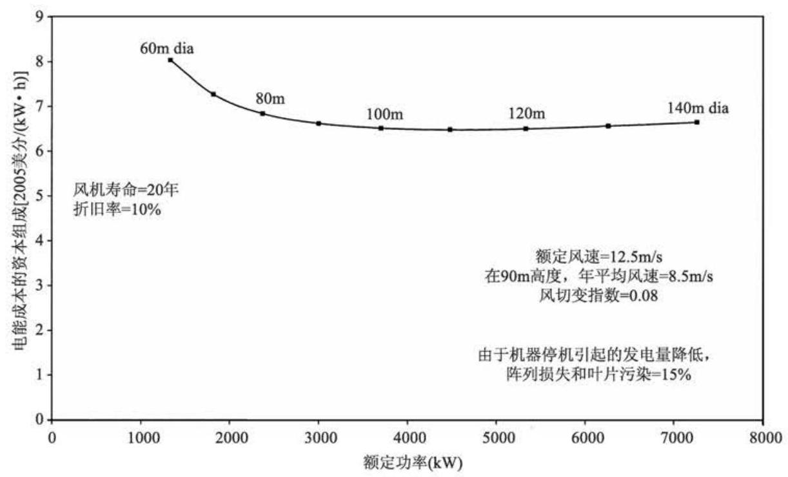

图 11.33 固定的风力发电机组件的安装费用为 100 万美元的情况下, 基于改进的 NREL 成本模型的电能成本随风力发电机直径的变化

## 11.5 海上风力发电机组的可靠性

期望风力发电机组应有很高水平的可靠性, 无论选址在陆上或海上, 因为任何设备故障都可能导致长时间的停机和动用维修人员。图 11.34 显示了来自两大欧洲调查的不同的风力发电机组的分部件的故障率, 还有每次故障时的停机时间 (WMEP=基于德国卡塞尔的 Fraunhofer 研究所的风能系统的风科学监测和评估项目, LWK=Landwirtschafts-Kammer,在德国 Schleswig-Holstein 州)。

对于海上风力发电机组来说, 维修既费时又费钱, 也非常容易受天气影响, 导致更长的停机时间，因此高可靠性显得尤为重要。

这一节简要地介绍以下标题:机组架构、冗余、腐蚀防护和状态监测，以提高风力发电机组的可靠性。

#### 1 机组架构

虽然风力发电机组有核心部件不可减化的问题, 追求最大发电量、电网兼容性和传动链的一致性，特别是在大型风力发电机组，导致更大的复杂性和压倒性优势的变速变桨海上风力发电机组。事实上, 这种类型的风力发电机组需要两个额外的系统一变流器和变桨距控制机构, 人们发现这种风力发电机组最大停机时间的百分比分别为 ${20}\%$ 和 ${13}\%$ ,这些是在 Reliawind 可靠性领域研究中发现的 (Wilkson 等, 2010)。

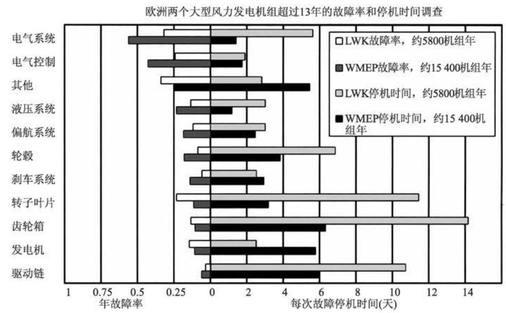

图 11.34 基于两个欧洲调查的 20000 机组年数据的风力发电机组的主要部件故障率和每次故障的停机时间(经 Durham 大学和 Fraunhofer 研究所的风能系统的转载许可)

大型的恒速风力发电机组被认为是不切实际的, 因为功率的波动使阻尼不足, 变桨距控制系统的优点在海上可能不适用。考虑到额外的停机时间的能量损失之后, 还必须要衡量净增加的成本和产生的多余的能量。很显然, 在没有变桨距控制的情况下，就需要提供一个制动系统(例如叶尖制动)，它的费用也要考虑其中。

直驱发电机没有变速箱, 所以也就没有与其相关的故障。尽管变速箱的故障率相对较低, 但是最终导致的停机时间还是比 WMEP 和 LWK 研究中的所有其他子部件(图 11.34)高。Spinato 等(2009)的研究表明，直驱风力发电机和变流器的故障率比双馈风力发电机组的齿轮箱、发电机、变流器的故障率大很多。然而, 向直驱风电机组的过渡可以提高发电机和变流器可靠性, 使其故障时间比带变速箱的故障时间短。

#### 2 冗 余

提供冗余对于安全关键系统是强制性的, 关键部件的重复能保证更大的运行可靠性，值得考虑，特别是海上风力机组。一些制造商已经实施的实例包括了两个独立系统的调度。这些系统是用来测量叶片桨距角和提供备用变流器块。一些类似的理论可以扩展应用到机械系统的设计中, 例如变桨距机构和偏航驱动, 扩展后备增加一定的使用寿命。

#### 3 部件质量

可靠性获益在一些海上风电场中使用高质量部件得到了证实。例如, 双列变桨轴承比那些只有一列的更稳固。Spinato 等发现风力发电机和变流器的故障频率比其他工业的要高很多。至少是在初始阶段的运行阶段中是这样的, 建议它们实施更全面的测试。另一方面, 他们发现风力发电机组齿轮箱的可靠性和其他工业的齿轮箱的可靠性差不多。

#### 4 腐蚀防护

海洋大气里的盐粒子的浓度会因为风速而大大增强 (Gong 等, 1997), 这就意味着我们必须对海上风力发电机组部件采取额外的保护措施。除了高规格的表面涂层外，还包括装有空气-空气热交换器的密封发电机和其他的电器设备的相似的装置, 例如变压器。从这些热交换器中排出的空气有助于机舱的空气在结露点以上，避免结露。另外，机舱和轮毂可加压，从而防止潮湿、盐雾空气进入。如果机舱和轮毂之间没有隔板，就需要曲径密封垫置于旋转机构和机舱之间，阻止空气泄漏。

#### 5 状态监测

很显然, 如果初期的故障可以在导致系统故障之前被状态监测器检测出来的话，可靠性就可以得到提高。传统的监测风力发电机组系统正常指数的方法如下:

(1)当一些参数例如油压、轴承温度和振动超过最低限度时，报警自动显示。

(2)定期的检查:例如，齿轮齿面的磨损和高速轴的校准。

(3)机组运行情况的观察。

(4)定期采样油样本。

这些监测状态的例子，已被定义为机械条件参数的监测过程，例如一个显著的变化表示故障的产生。

定期维护海上风力发电机组的高昂费用和难度，鼓励扩大发展远程在线状态检测技术，特别是齿轮箱传动链和轴承。需要从机组的特定故障开始着手，建立一个可衡量的标准，用于判断是否需要干预。Conmow 最终报告名叫“海上风电场先进的状态监测”(Wiggelinkhuizen 等, 2007) 和海上 M&R 最终报告里的“运用故障预测和状态监测技术的风电场先进的保养和维修” (ISET, 2006) 提供了很多有帮助的技术以及这些技术的用途,还有一些现场试验报告。而 Crabtree(2010)列出了目前市场销售的状态监测系统。

几种不同的状态监测技术介绍如下。

#### 1 传动链的振动监测

加速器安装在变速箱和发电机外壳上，可以连续监测每个位置的振动信号。 对于恒速风力发电机组, 每个信号都可以通过快速傅里叶变换 (FFT) 计算出振动的频谱，其中包括与齿啮合频率相对应的谱峰和不同齿轮阶段的轴转速。为了观察由于轴承磨损和齿损坏引起的变化，这些振动信号的变化都可以被检测出来，尽管这比其他部分稍显困难, 例如行星轴承, 间接的振动传送到外壳的加速器时, 谱峰很难检测出来。另外, 在低速轴轴承的情况, 轴转速太慢导致加速器检测不出来。

振动的信号会随着功率的等级、风速和偏航误差而变化, 因此他们要被分成不同的段。如果数据集中起来, 不规则性会更加明显, 所以可以比较相同类型的不同风力发电机组的情况。

在变速风力机的情况中，不同谱峰的频率会持续变化，所以阶比跟踪技术是必须应用在频谱中，其中频率通过机组转速而正常化。一种方法是同步阶比跟踪技术, 这种技术是通过一个轴编码器, 在 FFT 分析前控制信号采样周期为一个固定的每转数。另外, 每转一次的转速计信号可以被馈送到分析仪中, 从而使其采样频率的变化与 RPM 成正比。一个简单的选择是当风力机转速几乎恒定时, 在此期间运行限制振动监测高于额定风速。

很显然, 从上述振动监测系统会得到大量的数据, 这需要专门的信号处理的程序来找出可疑的振动信号的变化。理想的情况是，一个专家小组能够监测出这些变化, 然后找出什么时候应该采取措施。但是在 2007 年, Conmow 的报告得出的结论是还没有足够的经验能得到这样的预测, 所以对于数据异常的一般反应就是停机或增加检测的频率。

#### 2 润滑油渣渍检测

测量润滑油里的油渣渍浓度可以从检测磨损的故障开始，不需要对油进行常规采样分析。然而, 该设备需要安装在润滑管里, 当油被送到承压的轴承或齿轮时开始工作。所以在飞溅润滑油的齿轮箱里是不适用的。

#### 3 机舱振动监测

横向和前-后方向安装的机舱加速器可以检测出叶片重量的不平衡和叶片变桨距故障。叶片重量不平衡可能会因进水或者结冰而增加。对于较低的叶片旋转频率, 需要用到一种特殊的加速器, 叫做静态加速器 (ISET 2006)。

#### 4 变桨轴承阻力

变桨轴承的情况可以通过测量电机电流检测, 信号中较大的峰值是轴承卡住引起的震荡的表现。

#### 5 附加值

如果有大量的假报警，状态监测的好处就会减少，这可能和过于谨慎设置的警报水平和系统本身故障有关。尽管 Conmow 在设定附加值时考虑了很多元素，包括假报警的水平，但它没能得出安装状态监测系统的整体益处的一般性结论。

## 11.6 支撑结构

海上风力发电机组的支撑结构必然远远超过陆上风力发电机组, 因为海上风力机组需要更大的轮毂高度的基础和额外的波浪载荷。结果是, 它们构成了海上风力发电机组比陆地风力发电机组更高的安装成本，当然，考虑经济性设计更为重要。

大多数的海上风力发电机组的设计相对于陆上设计已经有了很大的进步。所以常见的做法是利用陆上塔架设计高于波峰水平的海上机组, 并加入一个额外的结构，即它和海底之间的子结构。虽然术语“支撑结构”适用于支撑机舱的完整结构,但是这节主要讨论子结构。

五种不同类型的子结构已经被使用在海上风力发电机组的设计中:单桩、导管架结构、三脚架、三桩和重力式基础，而单桩是最常用的，而且是首先考虑的。

在频域范围内的单桩疲劳分析已经作为一个独立的章节 (11.6.2 节) 做了探讨。

### 11.6.1 单 桩

单桩是打入海底的一个钢的圆筒管，有的从内部挖掘的支持，有的则没有。在软岩上，在接到桩之前套桩可能先钻出来。在水深约 10m 的最低天文潮 (LAT) 时，单桩的直径在 ${4.5} \sim  5\mathrm{m}$ 。

#### 1 过渡段

鉴于在操作的过程中保持准确的垂直单桩的难度, 在单桩和塔基塔之间引入一个附加的圆筒形管作为过渡段是正常的。塔架然后用螺栓固定到过渡段顶部的法兰上。图 11.35 是一个典型的安排(不过，在特殊情况下，Scroby Sands 风电场， 是用螺栓直接固定在单桩顶部的法兰上，这对塔的驱动是十分有利的)。

过渡段常常套在单桩上，重叠长度是直径的 1.5 倍。管之间的间隙为 50~ 100mm，允许过渡段被设置为垂直，随后的环形空间要灌浆。灌浆联合设计是下一个单独的子标题。

一般要找到一个包围在过渡段顶部塔基的外部平台，以便于进入风力发电机组。如果用船的话，是通过一个梯子，梯子固定在一对作为挡泥板的垂直管之间的过渡段外面。

过渡段的顶部通常要设置一个足够的间隙, 即在平台和最高波波峰间的气隙, 同时，要为潮差和风暴潮留出余地。目标气隙为x.5m。如果单桩的顶部设置在高于 LAT0.5m 的话，所需的过渡段的长度是套筒长度、潮差、风暴潮、50 年一遇的波峰高度 $\eta {H}_{50}$ 的总和再加上 $1\mathrm{\;m}$ 。在英国水域，由于有效潮差范围，所用的过渡段长度可超过 ${25}\mathrm{\;m}$ ,导致重量接近 200 吨。

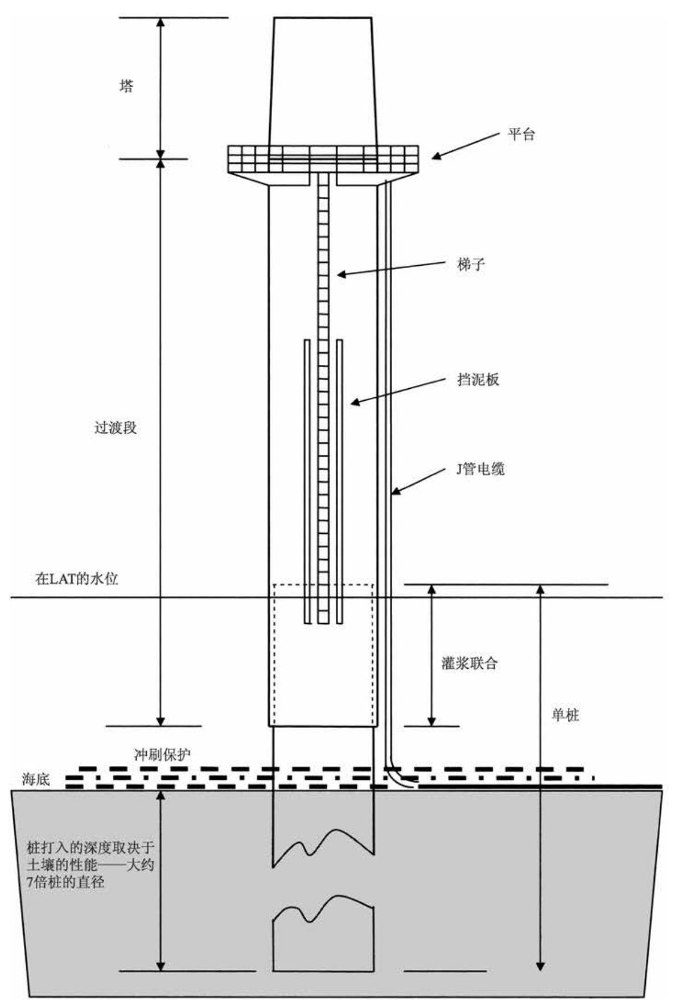

图 11.35 典型的单桩和过渡段的安排

在更深的水域，所需单桩在 $6\mathrm{\;m}$ 直径及以上，它对于灌浆联合之上的直径的锥形过渡段是有利的，以减少波浪载荷的作用以及匹配直径较小的塔基。

#### 2 电缆管道

风力发电机组的电力电缆通过钢保护管传送，被称为 J 管，它可以位于过渡段/单桩的内部或外部。之所以称为 J 管, 是因为它们在海底水平有一个 90° 弯曲, 使电缆能水平退出。

#### 3 冲 刷

如果海底是由沙子和其他的颗粒状物质构成的，那么水流和由波浪引起的水的运动将会导致明显的在单桩周围的海底侵蚀。Sumer 和 Fredsoe(2001) 通过全面的实验得出结论, 最大冲刷深度发生在海流单独作用下, 并且达到 1.3 倍桩直径 $D$ 的深度，而平均而言，为0.7 $D$ 的标准差。

这个幅度的冲刷对基础稳定和支撑结构的固有频率有一定的影响，所以一般应提供(或维护)冲刷岩石盔甲形式的保护。这可以在单桩安装(静态冲刷保护)不久之后在海底铺设, 或者在几个星期后的冲刷坑时铺设(动态冲刷防护)。静态冲刷保护铺设在海底的缺点是冲刷可能发生在岩石保护不到的边缘部位，但可以确定径向的保护范围。

冲刷防护可能出现的一些问题如下:过渡段涂层、二级结构或海底电缆在安装时可能损坏，偶尔补充的需要和由于大量的材料运过来可能增加对环境的影响。 为适应冲刷已设计了一些项目，如使用少量的拨备用以减少倾覆阻力和支撑结构的固有频率。

辅助设计冲刷坑深度预测和冲刷保护设计，被称为优化桩设计工具(den Boom 等, 2004)，已开发和校准模型，测试结果和数据从现有的风电场获得。这使得在计算最大电流的条件和径向所需的保护程度时, 岩石的大小是固定的。正如预期的那样, den Boom 等的模型试验报告表明需要较大的岩石尺寸时, 冲刷防护要求的海底的水平要高。当在静态保护时，它会凹进下面。

#### 4 腐蚀防护

防腐蚀的方法随暴露类型的单桩的高度而不同。定义三个区域——大气区、 飞溅区和淹没区，其中包括嵌入部分。DNV-OS-J101要求在大气区，可以通过高品质、多涂层保护钢单桩。在飞溅区，除了表面的涂层外，还需要额外的钢板厚度来防腐蚀。可以假定在北海的结构，腐蚀速率范围在每年0.3~0.5mm。

在淹没区要提供阴极保护，在冲刷区要加上 $2\mathrm{\;{mm}}$ 的腐蚀余量。通常阴极保护是以消耗阳极的形式进行的,使用锌基阴极的阴极保护可能重达 $5\mathrm{t}$ 左右,在 ${20}\mathrm{\;m}$ 水深、5m 直径桩的外部。

单桩内表面的腐蚀防护不是必需的。正常情况下，内部空间在过渡段顶部被隔膜密封(配有一个气密舱口盖)，这需要被设计用来吸收压力差。一些问题可能在失去密封的同时发生(例如内部 J 管的出口孔周围)。在富含硫的海底环境，通过添加杀菌剂来处理厌氧腐蚀，虽然这在环境上是可接受的。

#### 5 单桩设计

单桩的大小由三个关键因素决定:

(1)耐极限载荷。

(2)耐疲劳载荷。

(3)调整支撑结构的固有频率，以避免循环载荷激励。

通常极限波浪载荷，以阻力载荷为主，与直径呈线性增加；而疲劳波浪载荷，以惯性载荷为主，类似截面模数，与直径的平方成正比。另一方面，单桩弯矩的风载荷分量几乎不受单桩直径的影响，所以它显然有利于提高单桩直径和减小壁厚，直到耐屈曲应力下降，阻止截面面积的进一步减少。然而，实际的考虑，如塔基直径的兼容性——假设平行侧面的过渡段制造能力可能限制单桩直径的进一步减小。

波疲劳载荷取决于支撑结构模态[见式 (11.51)], 而这又取决于刚度分布, 所以对疲劳载荷的设计必然是一个反复的过程。因此, 它是在耐极限载荷的初始设计的基础上的简单发展, 然后可以被用来获得疲劳载荷的初始模态和设置。应当指出的是, 在设计时波浪载荷是重要的因素, 极端载荷的弯矩分布将出现波峰水平附近“明显的膝”，这很可能在疲劳载荷弯矩图是看不到的。

这是由于疲劳载荷通常激发支持结构的共振，而弯矩分布主要是由塔架顶部重量决定, 而不是波浪载荷本身。因此陆上塔架的设计可能不适合于海上, 因为即使海浪没有撞击塔架本身，波浪也会产生疲劳载荷。5MW 的发电机组支撑结构弯矩的极限载荷和疲劳载荷的分布如图 11.36 所示。

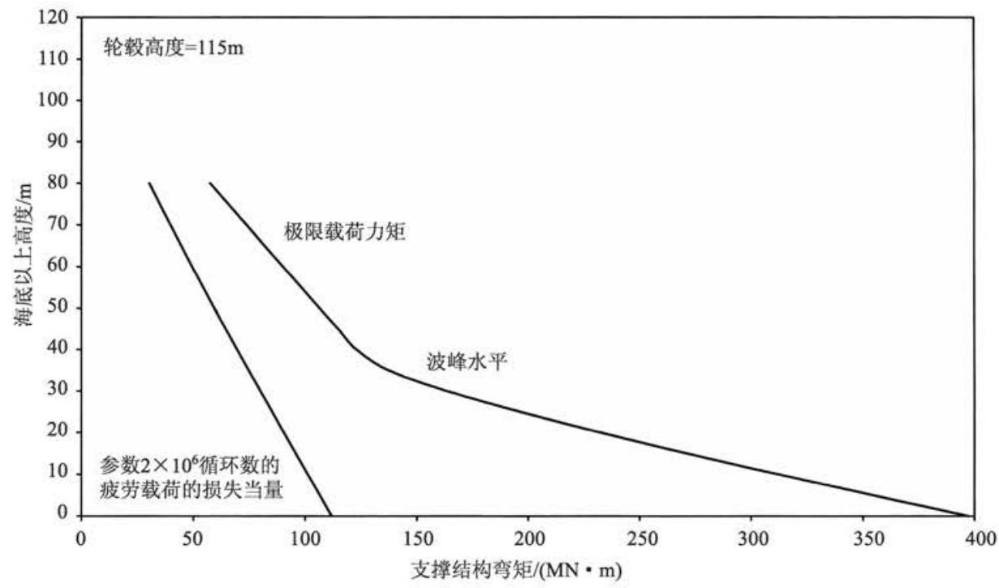

图 11.36 5MW 风力发电机组支撑结构的极限载荷和疲劳载荷随高度的变化

可以看出, 在海底水平设计要主要考虑极限载荷, 而在波峰水平主要考虑疲劳载荷, 不过, 如果主要的疲劳详细类别为假定 90 类的话, 疲劳载荷则在海底水平起主要作用。在一般情况下，一系列的因素，包括极限载荷和疲劳载荷，疲劳主要细节类别和单桩壁细长的相对大小，将决定在不同的高度是极限载荷或疲劳载荷起作用。在实践中, 极限载荷 (不可能运行于低速的海上湍流和阵风) 往往在埋置深度起作用，而疲劳载荷则在其他方面起作用。

其他关键设计驱动程序是支撑结构的固有频率限制, 这最好早在设计迭代的过程中解决。

海上风力发电机组的配置, 往往比大部分陆地上的大很多, 因此几乎总是在变速下运行, 因为允许在叶轮加速的情况下风功率吸收波动, 而不是电功率快速波动。最大与最小转速的比例通常是相当广泛的 ——1.5 ~ 2.5，其结果是塔架的固有频率在最大的旋转频率和最小的叶片穿越频率间的频带大大缩小。图 11.37 所示是一个 $5\mathrm{{MW}}$ 的风力发电机组。

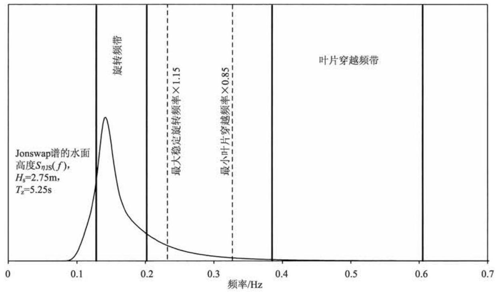

图 11.375MW 风力发电机组支撑结构的固有频率限制区

鉴于在风力发电机组的激振频率和支撑结构的固有频率之间需要有大约 15%的裕量，可以看出，在这种情况下，可行的频率范围被限制在 ${0.23} \sim  {0.33}\mathrm{\;{Hz}}$ 。

对于在 ${20}\mathrm{\;m}$ 水深处的一个 $6\mathrm{\;m}$ 直径单桩支撑的 $5\mathrm{{MW}}$ 风力机来说,极限和疲劳载荷下提供足够的强度设计有一个自然频率略高于 ${0.23}\mathrm{\;{Hz}}$ 的下限。

疲劳分析将在 11.6.2 节中进一步讨论。

#### 6 埋 置

除了单桩插入岩石座的情况外, 单桩嵌入的土壤被认为是允许在海底水平以下横向运动和弯曲的柔性介质，这降低了悬臂支撑结构有效固定性的深度，对固有频率有决定性的影响。

这是正常的桩与桩土之间的相互作用，通过分析，将土壤模拟为一系列非线性横向弹簧 (称为 PY 弹簧)，在其嵌入深度作用于桩。这个模型可以确定桩的极限抗侧向载荷，已开发出用于黏土和沙土的 $\left( {p - y}\right)$ 曲线。需要注意，线性化的 $\left( {p - y}\right)$ 曲线可以确定服务载荷的桩顶刚度，特别是在黏土的情况下，在通常封闭形式的曲线有极大的初始斜坡。推荐的(p-y)曲线和它们的应用程序的建议载于 DNV JS-101 (2007)。

#### 7 灌浆联合设计

单桩和过渡段之间的灌浆联合必须能够支持上述重量及抗倾覆力矩及扭转载荷。轴向和扭转载荷在灌浆/钢界面产生剪切, 而倾覆力矩产生压缩, 所以一般将两种类型的载荷分开对待。

(1)倾覆力矩。力矩在套筒和灌浆压力下的桩之间转移，从联合中间高度的零到顶部和底部的最大值近似呈线性变化。假设过渡段是套在单桩上的, 联合的上半部压缩是在上风侧，而联合的下半部的压缩是在下风侧。

套筒与桩之间的水平力量在每个壁上产生高剪切应力, 达到套筒/桩力矩容量时,这些方法灌浆联合的最大允许值 $L/D$ 的比为 1.5 。然而,在灌浆中相应的压缩应力是比较低的，满载的联合为 $5\mathrm{{MPa}}$ 或 ${10}\mathrm{{MPa}}$ 。

(2)轴向和扭转载荷。由于横跨灌浆/钢界面的剪切轴向和扭转载荷可以抵抗以焊珠或焊接到钢管的薄钢板的形式提供的剪切键。然而, 每个剪切键引入了疲劳应力集中，这不利于它们的使用。

如果没有剪切键, 钢/水泥浆界面剪切阻力取决于桩筒和桩表面的不规则性, 这在灌浆表面也会出现。为了桩和套筒之间发生相对运动, 桩筒和桩必须分别膨胀和收缩从而允许在钢管中的脊相反运动。因此，表面不规则的深度为 $\delta$ ，滑动产生的径向压力约为 $E\left( {\delta /{2R}}\right) \left( {t/R}\right)$ ，其中 $E$ 是钢的杨氏(Young’s)模量， $R$ 为联合半径, $t$ 是桩筒和单桩的壁厚 (假设是相同的)，那么，单位面积的抗剪设计为

$$
{\tau }_{\mathrm{d}} = \frac{\mu }{{\gamma }_{\mathrm{m}}}E\frac{\delta }{2R}\frac{t}{R} \tag{11.45}
$$

其中 $\mu$ 是灌浆和钢之间的摩擦系数， ${\gamma }_{\mathrm{m}}$ 为材料强度的局部安全系数。DNV-OS-J101 建议最大摩擦系数为 0.4 , 材料系数为 3.0 。

从式 (11.45) 可以明显看出,其结果关键取决于表面不规则 $\delta$ 的大小。传统上,假定 $\delta /R$ 的比值是恒定的,2007 年版的 DNV JS-101 建议值为 0.00037 。然而, 在 2009 年,联合滑动的实例导致这种假设受到严重质疑, 在不考虑联合半径的情况下，固定表面不规则的临时指导值只有 ${0.074}\mathrm{\;{mm}}$ 。这意味着典型的单桩的直径 $\delta$ 的大幅减少，例如使用 $\delta /R = {0.00037}$ ，假设有一个 $5\mathrm{m}$ 直径的桩， $\delta$ 值约为 ${0.9}\mathrm{\;{mm}}$ 。

增加灌浆联合的轴向负荷能力的措施有如下考虑, 包括在顶部提供一个弹性弹簧或在单桩和过渡段引入一个匹配的锥形件。

#### 8 在更深的水域的单桩

风荷载控制在浅水中单桩弯矩, 因为波浪载荷在一个更小的力臂起作用, 所以单桩的重量将预计首先随单桩的长度成比例的增加。然而, 在更深的水中, 波浪载荷开始起主要作用，单桩直径需要增加，重量的增幅更大。

De Vries 和 Krolis(2007)编制的 Vestas V90 的 3MW 的风力发电机组在 20 $\mathrm{m}$ 和 ${50}\mathrm{\;m}$ 之间的不同水深的支撑结构设计纲要,为距离荷兰海岸 ${80}\mathrm{\;{km}}$ 处的北海风电场设计适当的 ${20.3}\mathrm{\;m}$ 的极端波高,以实现目标为 ${0.32}\mathrm{\;{Hz}}$ 的固有频率和满足屈曲强度的要求。图 11.38 显示支撑结构的重量(包括单桩、过渡段和塔架)随水深的变化。

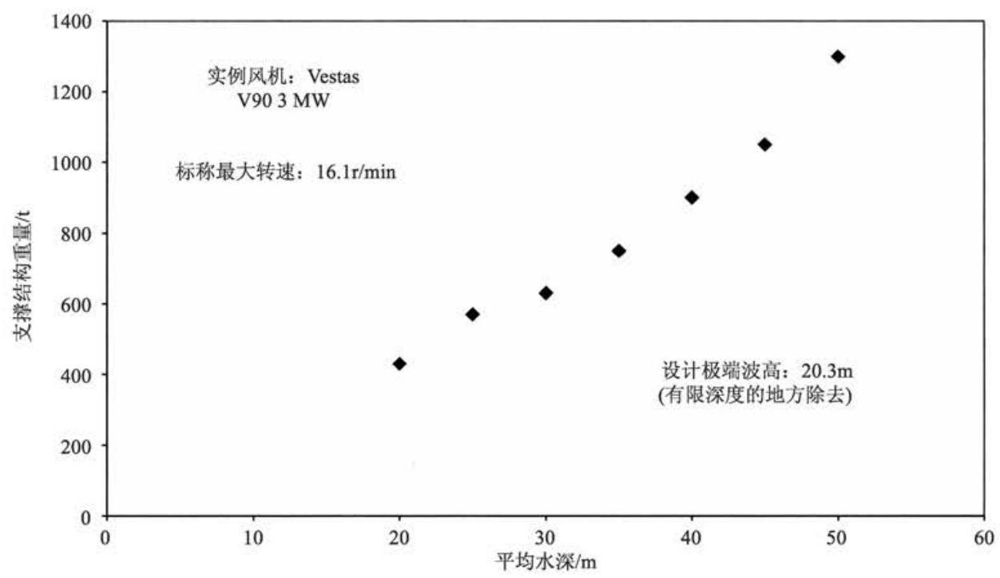

图 11.38 支撑结构的重量随平均水深的变化

(来自 Van der Tempel,2007)

20m 水深的重量在一般趋势线以下，因为在这种情况下，极端波高深度有限， 所以平台的高度和轮毂高度都减少。把上下文中的支撑结构的重量放在一起，可以注意到, VestasV90 风力机的重量 (风轮, 轮毂和机舱)只有 112t。

选定的单桩直径范围为 ${20}\mathrm{\;m}$ 水深时的 $4\mathrm{\;m}$ 至 ${50}\mathrm{\;m}$ 水深时的 $6\mathrm{\;m}$ ，一些现有的生产设施能力直径在 $8\mathrm{\;m}$ 以内。

### 11.6.2 在频域中单桩疲劳分析

在短期内, 风和波浪载荷是统计学上独立的过程, 这表明从两个来源的支撑结构的任何横截面的载荷的功率谱可以简单地加在一起得出总载荷的功率谱这一部分开始分别讨论波和风载荷的疲劳和之后将两者结合起来。

在海上风力发电机组结构上, 建立的计算在频域内的波疲劳损伤的方法可以在汽油和天然气领域应用。该方法的优点在于它的计算效率远远超过在时域进行无数的雨流循环计数的模拟。这个过程始于考虑点的应力谱, 该点来自于利用传递函数的每个海况的波谱。其中这个函数将应力振幅与每个频率的波高联系起来。每个应力谱再转换成一个应力范围概率分布,结合适当的 $S - N$ 曲线,使疲劳损伤接触到每个海况中。最后, 所有的海况损失归纳得到在每个考虑下的点的总疲劳损伤。

这个方法依赖于波载荷和波高之间的线性关系。如在 11.3.9 节, 圆柱的波浪载荷的莫里森方程包含两项，惯性项是线性的而波高和阻力项则不是。幸运的是， 在计算疲劳载荷时非线性阻力项通常可以忽略，Keulegan-Carpenter 数的惯性载荷小于 11，这相当于在深水中波高与柱体直径比小于 3.5。

本节按顺序讨论各个阶段的疲劳损伤计算。

#### 1 单桩的弯矩和应力传递函数

(1)准静态行为。对于一个圆柱形单桩支撑结构，半径为 $r$ ，由于波浪载荷高峰期准静态泥线力矩的表达式 ${M}_{0}$ 是通过整合关于水深的莫里森方程得到的，因此:

$$
{M}_{0} = {C}_{\mathrm{M}}{\rho \pi }{\gamma }^{2}{\int }_{-d}^{0}{\left( u\right) }_{\max }\left( {z + d}\right) \mathrm{d}z
$$

$$
= {C}_{\mathrm{M}}{\rho \pi }{\gamma }^{2}\frac{Hgk}{2}{\int }_{-d}^{0}\frac{\cosh k\left( {z + d}\right) }{\cosh {kd}}\left( {z + d}\right) \mathrm{d}z
$$

$$
= {C}_{\mathrm{M}}{\rho \pi }{\gamma }^{2}\frac{Hg}{2}\tanh {kd}\left( {d + \frac{1 - \cosh {kd}}{k\sinh {kd}}}\right) \tag{11.46}
$$

在深水中，当 $d > {0.08g}{T}^{2}$ 时，约为:

$$
{M}_{0} = {C}_{\mathrm{M}}{\rho \pi }{\gamma }^{2}{Hgd}/2 \tag{11.47}
$$

一般来说， ${M}_{0}$ 是频率依赖的，因为波数 $k\left( { = {2\pi }/L}\right)$ 取决于波频率。传递函数的峰值准静态弯矩 ${M}_{0}$ 与不同波数的波幅的比是:

$$
{H}_{\mathrm{{Mo}}/\eta }\left( f\right)  = \frac{{M}_{0}}{H/2} = {C}_{\mathrm{M}}{\rho \pi }{\gamma }^{2}g\tan {kd}\left( {d + \frac{1 - \cosh {kd}}{k\sinh {kd}}}\right) \tag{11.48}
$$

对于单桩壁厚 $t$ ,弯曲应力是 ${M}_{0}/\pi {r}^{2}t$ ,所以弯曲应力峰值与波振幅的比一弯曲应力的转移函数在没有动态放大的情况下是

$$
{H}_{{\sigma 0}/\eta } = {C}_{\mathrm{M}}\rho \frac{g}{t}\tanh {kd}\left( {d + \frac{1 - \cosh {kd}}{k\sinh {kd}}}\right) \tag{11.49}
$$

值得注意的是，在此表达式中单桩半径表达的不是很明确，尽管它可能影响到惯性系数 ${C}_{\mathrm{M}}$ 的值。

(2)共振行为。当波的频率接近支撑结构的固有频率时,后者动态响应,其响应以附录 B 中描述的固定叶片的类似方式被放大。如果为简单起见,认为海床是刚性的, 然后通过式 (B. 26) 类推, 由于第一模式的支撑结构的波激发泥线力矩为

$$
{M}_{1}\left( T\right)  = {\omega }_{1}^{2}{F}_{1}\left( t\right) {\int }_{0}^{H + d}m\left( y\right) {\mu }_{1}\left( y\right) y\mathrm{\;d}y \tag{11.50}
$$

式中, ${\omega }_{1}$ 为支撑结构的固有频率,单位是 $\operatorname{rad}/\mathrm{s};{f}_{1}\left( t\right)$ 为第一模式的轮毂移位; $m\left( y\right)$ 是单位长度的质量分布; $y\left( { = z + d}\right)$ 是海床之上的高度; ${\mu }_{1}\left( y\right)$ 是第一模式的形状。通过式(B.3)类推,轮毂移位为

$$
{f}_{1}\left( t\right)  = \frac{1}{{k}_{1}}\frac{{\int }_{0}^{H + d}{\mu }_{1}\left( y\right) {q}_{1}\left( y\right) \mathrm{d}y}{\sqrt{{\left\lbrack  1 - {\left( \omega /{\omega }_{1}\right) }^{2}\right\rbrack  }^{2} + 4{\xi }_{1}^{2}{\left( \omega /{\omega }_{1}\right) }^{2}}}\cos \left( {{\omega t} + \phi }\right) \tag{11.51}
$$

式中, ${k}_{1} = {m}_{1}{\omega }_{1}^{2};{q}_{1}\left( y\right)$ 是波浪载荷幅值; ${\xi }_{1}$ 是第一模式阻尼比; ${m}_{1}$ 是广义质量; ${\int }_{0}^{H + d}m\left( y\right) {\mu }_{1}^{2}\left( y\right) \mathrm{d}y$ 和 $\omega$ 是波浪角频率,因此

$$
{M}_{1}\left( t\right)  = {C}_{\mathrm{M}}{\rho \pi }{r}^{2}\frac{Hgk}{2}{\int }_{0}^{d}{\mu }_{1}\left( y\right) \frac{\cosh {ky}}{\cosh {kd}}\mathrm{\;d}y
$$

$$
\times  \frac{{\int }_{0}^{H + d}m{\left( y\right) }_{{\mu }_{1}}\left( y\right) y\mathrm{\;d}y}{{m}_{1}\sqrt{{\left\lbrack  1 - {\left( \omega /{\omega }_{1}\right) }^{2}\right\rbrack  }^{2}} + 4{\xi }_{1}^{2}{\left( \omega /{\omega }_{1}\right) }^{2}}\cos \left( {{\omega t} + \phi }\right) \tag{11.52}
$$

广义质量 ${m}_{1}$ 通常主要为塔顶质量, ${\int }_{0}^{H + d}m\left( y\right) {\mu }_{1}^{2}\left( y\right) \mathrm{d}y/{m}_{1}$ 的比值接近海床之上的轮毂高度 $H + d$ 。定义海床之上的有效轮毂高度 ${H}^{\prime } + d$ 等于 ${\int }_{0}^{H + d}m\left( y\right) {\mu }_{1}^{2}\left( y\right) \mathrm{d}y/{m}_{1}$ 。 式(11.52)可以缩短为

$$
{M}_{1}\left( t\right)  = {C}_{\mathrm{M}}{\rho \pi }{r}^{2}\frac{Hqk}{2}{\int }_{0}^{d}{\mu }_{1}\left( y\right) \frac{\cosh {ky}}{\cosh {kd}}\mathrm{d}y\frac{{H}^{\prime } + d}{\sqrt{{\left\lbrack  1 - {\left( \omega /{\omega }_{1}\right) }^{2}\right\rbrack  }^{2}}}\cos \left( {{\omega t} + \phi }\right)
$$

(11.53)

将共振力矩的幅度 $\left\lbrack  {\text{ 式 }\left( {11.53}\right) }\right\rbrack$ 与准静态力矩 $\left\lbrack  {\text{ 式 }\left( {11.46}\right) }\right\rbrack$ 相比较可以看出, 由于第一模式动态激励，泥线力矩的放大率为

$$
\frac{{M}_{1}}{{M}_{0}} = \frac{k{\int }_{0}^{d}{\mu }_{1}\left( y\right) \frac{\cosh {ky}}{\cosh {kd}}\mathrm{\;d}y}{\tanh {kd}\left( {d + \frac{1 - \cosh {kd}}{k\sinh {kd}}}\right) }\frac{{H}^{\prime } + d}{{\left\lbrack  1 - {\left( \omega /{\omega }_{1}\right) }^{2}\right\rbrack  }^{2} + 4{\xi }_{1}^{2}{\left( \omega /{\omega }_{1}\right) }^{2}}
$$

$$
= \frac{\lambda \left( d\right) }{\sqrt{{\left\lbrack  1 - {\left( f/{f}_{1}\right) }^{2}\right\rbrack  }^{2} + 4{\xi }_{1}^{2}{\left( f/{f}_{1}\right) }^{2}}} \tag{11.54}
$$

式中

$$
\lambda \left( d\right)  = \frac{k{\int }_{0}^{d}{\mu }_{1}\left( y\right) \frac{\cosh {ky}}{\cosh {kd}}\mathrm{d}y}{\tanh {kd}\left( {d + \frac{1 - \cosh {kd}}{k\sinh {kd}}}\right) }\left( {{H}^{\prime } + d}\right) \tag{11.55}
$$

比率 $\lambda \left( d\right)$ 是在第一模式上悬臂根部附近波浪载荷影响的量,不包括为 DMR 提供的动力放大率 $1/\sqrt{{\left\lbrack  1 - {\left( f/{f}_{1}\right) }^{2}\right\rbrack  }^{2} + 4{\xi }_{1}^{2}{\left( f/{f}_{1}\right) }^{2}}$ 。对于深水波浪，波浪载荷集中在平均水位附近地区，所以， ${\lambda }_{\mathrm{d}}$ 表达式中的上半部分和 ${\mu }_{1}\left( d\right) /d$ 相似。此外，如上所述， $\left( {{H}^{\prime } + d}\right)$ 可近似为 $\left( {H + d}\right)$ 。将这两个相似的式子合并，得到

$$
{\lambda }^{ * }\left( d\right)  = \frac{{\mu }_{1}\left( d\right) \left( {H + d}\right) }{d} \tag{11.56}
$$

式中,星号代表近似值。

波浪载荷常常用于支撑结构的基础上,因此 ${\mu }_{1}\left( d\right)$ 远小于 $d/\left( {H + d}\right)$ 。例如 ${\mu }_{1}\left( d\right)$ 为 0.03,刚性海床的 $d/\left( {H + d}\right)$ 为 ${0.2},{\lambda }^{ * }\left( d\right)$ 为 0.15 。实际上,海床很少能被视为完全刚性的,并且在海床下面有效固定桩深 $m$ ,可能有几个桩的直径导致较大的 ${\mu }_{1}\left( d\right)$ 的值。然而,在所有情况下,波浪载荷的泥线力矩动态放大远小于施加在塔顶的相同的载荷。

传递函数为不同波频率 $f$ (单位为 $\mathrm{{Hz}}$ ) 的波振幅给出了峰值弯矩比 ${M}_{1}$ ,即

$$
{H}_{\mathrm{M}1/\eta }\left( f\right)  = \frac{{M}_{1}}{H/2}
$$

$$
= {C}_{\mathrm{M}}{\rho \pi }{r}^{2}{gk}{\int }_{0}^{d}{\mu }_{1}\left( y\right) \frac{\cosh {ky}}{\cosh {kd}}\mathrm{d}y\frac{\left( {H}^{\prime } + d\right) }{\sqrt{{\left\lbrack  1 - {\left( f/{f}_{1}\right) }^{2}\right\rbrack  }^{2} + 4{\xi }_{1}^{2}{\left( f/{f}_{1}\right) }^{2}}}
$$

(11.57)

上述公式能简单地缩写为:

$$
{H}_{\mathrm{M}1/\eta }\left( f\right)  = {G}_{{M1}/\eta }\left( f\right) \frac{1}{\sqrt{{\left\lbrack  1 - {\left( f/{f}_{1}\right) }^{2}\right\rbrack  }^{2} + 4{\xi }_{1}^{2}{\left( f/{f}_{1}\right) }^{2}}} = {G}_{{M1}/\eta }\left( f\right)  \cdot  {DMR}
$$

(11.58)

式中

$$
{G}_{\mathrm{M}1/\eta }\left( f\right)  = {C}_{\mathrm{M}}{\rho \pi }{r}^{2}{gk}{\int }_{0}^{d}{\mu }_{1}\left( y\right) \frac{\cosh {ky}}{\cosh {kd}}\mathrm{d}y\left( {{H}^{\prime } + d}\right) \tag{11.59}
$$

然后

$$
\lambda \left( d\right)  = \frac{{M}_{1}/{DMR}}{{M}_{0}} = \frac{{H}_{\mathrm{M}/\eta }\left( f\right) /{DMR}}{{H}_{\mathrm{M}0/\eta }\left( f\right) } = \frac{{G}_{\mathrm{M}1/\eta }\left( f\right) }{{H}_{\mathrm{M}0/\eta }\left( f\right) } \tag{11.60}
$$

#### 2 泥线弯矩传递函数

图 11.39 说明了在此讨论的例子 $5\mathrm{{MW}}$ 的风力发电机组的支撑结构。塔架安装于打入海底的 $6\mathrm{\;m}$ 直径的单桩上。假设土壤性质为在海底以下 ${20}\mathrm{\;m}$ 深度 $m$ 的位置的单桩有效地固定。轮毂高度为海床以上 ${115}\mathrm{\;m}$ ，平均水深 $d$ 为 ${23}\mathrm{\;m}$ 。

坐标 $y$ 定义为悬臂根的距离,这个距离是从海底以下固定点的深度 $m$ 测量得到。这对准静态的泥线力矩没有影响，但会明显增加谐振泥线力矩。式 (11.52) 变为

$$
{M}_{1}\left( t\right)  = {C}_{\mathrm{M}}{\rho \pi }{r}^{2}\frac{Hgk}{2}{\int }_{m}^{d + m}{\mu }_{1}\left( y\right) \frac{\cosh {ky}}{\cosh {kd}}\mathrm{\;d}y
$$

$$
\times  \frac{{\int }_{0}^{H + d + m}m\left( y\right) {\mu }_{1}\left( y\right) \left( {y - m}\right) \mathrm{d}y}{{m}_{1}\sqrt{{\left( 1 - {\left( \omega /{\omega }_{1}\right) }^{2}\right) }^{2} + 4{\xi }_{1}^{2}{\left( \omega /{\omega }_{1}\right) }^{2}}}\cos \left( {{\omega t} + \phi }\right) \tag{11.61}
$$

式中 ${\int }_{0}^{H + d + m}m\left( y\right) {\mu }_{1}\left( y\right) \left( {y - m}\right) \mathrm{d}y/{m}_{1}$ 可以像原来一样被 $\left( {{H}^{\prime } + d}\right)$ 代替。

模式形状的测定导致平均水位偏转正常化, ${\mu }_{1}\left( {d + m}\right)$ ,为 ${0.071},{\lambda }^{ * }\left( {d + m}\right)  = \; {\mu }_{1}\left( {d + m}\right) \left( {{H}^{\prime } + d}\right) /d = {0.071}\left( {{115}/{23}}\right)  = {0.355}$  。

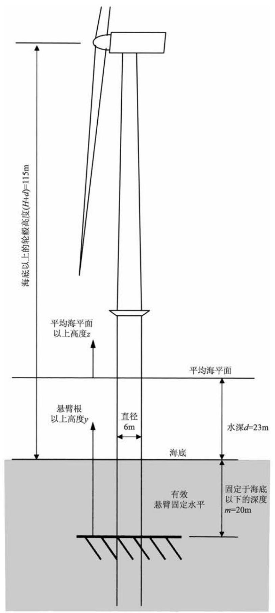

图 11.39 5MW 风力机的支撑结构实例

准静态泥线力矩 ${H}_{\mathrm{M}0/\eta }\left( F\right)$ 和第一模式泥线力矩 ${H}_{\mathrm{M}1/\eta }\left( F\right)$ 的传递函数以及 Jonswap 频谱的一个例子 $\left( {{H}_{\mathrm{S}} = {2.75}\mathrm{\;m}}\right.$ 和 $\left. {{T}_{\mathrm{Z}} = {5.25}\mathrm{\;s}}\right)$ 在图 11.40 中示出。支撑结构固有频率 ${f}_{1}$ 为 ${0.24}\mathrm{\;{Hz}}$ ,阻尼比 $\xi$ 为 $5\%$ ,峰值动态放大比率是 10 。

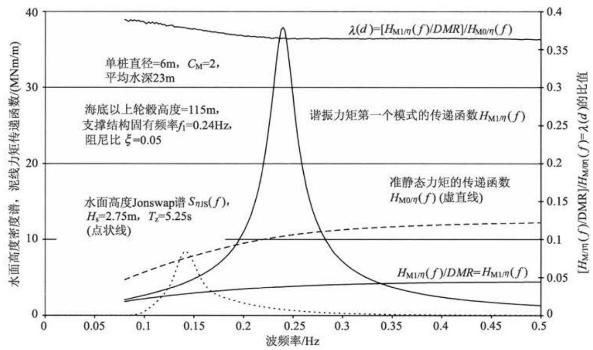

图 11.40 图 11.39 支撑结构实例中的泥线力矩的准静态传递函数和谐振传递函数的比较

显然, 阻尼比在确定共振峰时十分重要。阻尼的主要部分——空气动力学、结构和土壤滞后将在本节后续部分进行讨论。

可以看到, 准静态载荷的泥线力矩传递函数随波频率的增加而增加。这样, 尽管水的流动，由于波长减小，波载荷越来越集中在表面附近，增加了粒子加速度克服作用，从而增加了给定振幅波的倾覆力矩。

图 11.40 示出第一模式共振泥线力矩传递函数除以动力放大倍数 ${H}_{\mathrm{M}1/\eta }\left( f\right) / \; {DMR} = {G}_{{M1}/\eta }\left( f\right)$ ，函数 ${G}_{{M1}/\eta }\left( f\right)$ 是与准静态形式相似的函数。可由两者的比率图得知, $\lambda \left( d\right)  = {G}_{\mathrm{M}1/\eta }\left( f\right) /{H}_{\mathrm{M}0/\eta }\left( f\right)$ ,这被认为对波频率不敏感,接近 ${\lambda }^{ * }\left( d\right)$ 值 0.355。

#### 3 衍射效应

11.3.9 节介绍了当气缸的直径相对于波长大小来说很大的时候, 波衍射如何影响惯性系数。 $D/L$ 的比值大于 0.17 时,衍射导致低于标准值 2.0 的惯性系统数的迅速减少，如图 11.25 所示。在图 11.40 中，为简单起见，假设惯性系数为常数 2.0 。在准静态泥线力矩，衍射对传递函数的影响则如图 11.41 所示。图中同时显示了，在 ${H}_{\mathrm{s}} = {2.75}\mathrm{\;m}$ ， ${T}_{\mathrm{z}} = {5.25}\mathrm{\;s}$ 的海况下的 Jonswap 频谱。

很明显, 对于特定的海况和支撑结构, 惯性系数的降低仅影响波频谱的上尾部的载荷。然而,由于支撑结果的共振频率为 ${0.24}\mathrm{\;{Hz}}$ , Mac Camy 和 Fuchs 惯性系

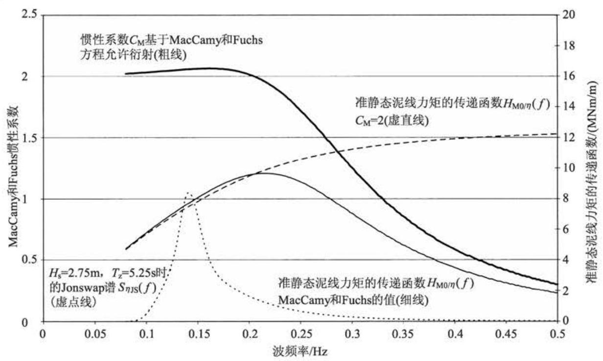

图 11.41 图 11.39 支撑结构实例中的准静态泥线力矩传递函数的衍射效应数会降低到 1.8 ，因此，衍射所导致的谐振力矩有些下降也是允许的。

#### 4 气动阻尼

在机组运行过程中，在前后方向，风轮的气动阻提供了显著的波引起的支撑结构的运动阻尼。对于恒定的叶片桨距, 使用式 (5.145) 中的闭合形式公式, 可以很容易估算出风轮的气动阻尼，但是，桨距系统是动态的时候，风轮的气动阻尼则更多地取决于控制策略，而很难进行估算。

风力发电机组可以自动模拟时域的支撑系统气动阻尼，但这种做是模糊的，并不明确。然而, 通过对湍流风场中运行的风力机塔顶阶跃载荷瞬态自由振动进行时域仿真，可以估算出不同风速下的气动阻尼，包括叶片桨距的影响。在每种情况下, 都有必要从无塔顶阶跃负载的模拟结果里减去塔顶的位移的时间历程, 同时, 还可以确定瞬态塔顶位移对其阶跃载荷的响应。可以通过第一模式下, 自由振动的对数衰减率来计算阻尼比。

图 11.42 显示了Kuhn(2001) 使用上述方法获得的平均风速气动阻尼的变化图。参考风力发电机组采用 3MW、双叶片、定速变桨距调节机，采用软-软单桩支撑系统，距离海床 80m，水深 21m，这是发达国家在 Opti-OWECS 的研究。

图 11.42 显示了由于增加叶片内部流动分离而引起的阻尼下降速率超过 10m/s，直到叶片变桨距高于13.7m/s的额定风速，导致流动再附着和阻尼恢复。 然而,高于 ${16}\mathrm{\;m}/\mathrm{s}$ 时,为了响应塔顶振荡运动显著降低较高风速下的气动阻尼,桨距控制系统的动作会越来越快。这是因为,当塔顶在风中摆动时, 叶片的阻力增加, 风轮推力降低, 反之亦然。

目前, 它已经成为在谐振频率下, 能抑制支撑结构振荡的控制系统非常普遍的做法, 这个系统可以产生有效的气动阻尼比, 超过有附着流时定速变桨距运行产生的气动阻尼比 (见第 8 章)。

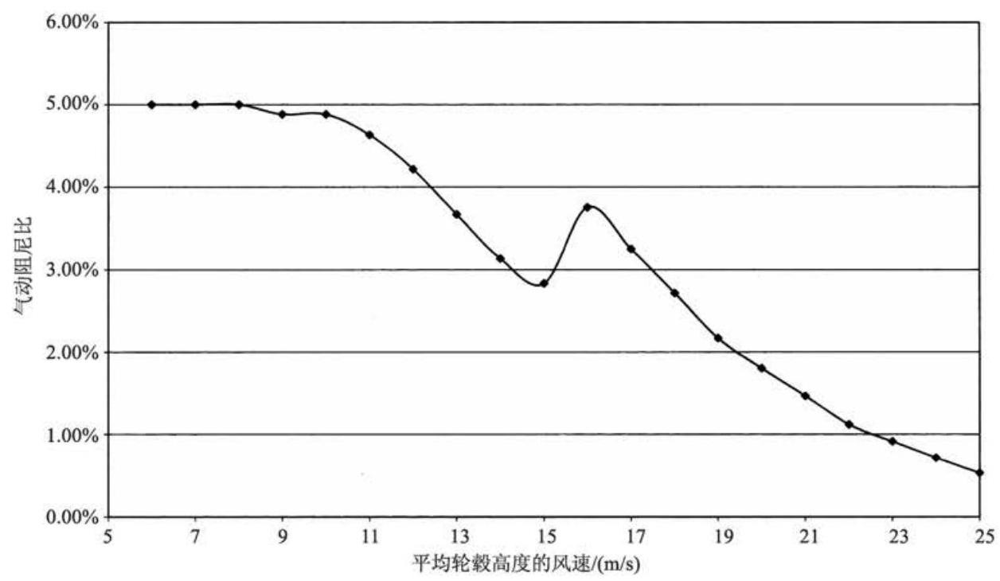

图 11.42 定速变桨距调节风力发电机组在湍流风中的气动阻尼随风速的变化

#### 5 风浪方向不一致

当风和波浪方向不一致时，气动阻尼结构的支撑动作将减少，因为风力机气动阻尼的侧方运动是非常小的，这需要考虑疲劳分析。

#### 6 结构阻尼

由单桩和塔架提供的结构阻尼的水平远低于其气动阻尼。例如，风载荷的欧洲标准, EN1991-1-4 给出了结构阻尼的对数衰减率为 0.012 , 相当于焊接钢烟囱的阻尼比为 ${0.19}\% ,\mathrm{{DNV}} - \mathrm{{RP}} - \mathrm{C}{205}$ 环境条件和环境载荷给出了在空气中钢构件的阻尼比为 0.15%。

#### 7 土壤阻尼

Tarp-Johansen(2009)使用海床周围单桩基础的三维有限元模型对土壤阻尼进行了调查,并得出结论,认为土壤提供的对数衰减的支持结构阻尼可在 ${0.035} \sim$ 0.05范围内，相当于一个0.55%～0.8%的阻尼比。然而，桩埋置很低导致了土壤更大的运动，因此，通常情况下的土壤阻尼比更大。

鉴于在一个站点基础上进行量化是困难的, 一些设计师采用保守的方法并且完全忽略它进行简化。

#### 8 风力发电机组停机时的阻尼

当风力发电机组停机时，气动阻尼比是可以忽略的，在小的流体动力阻尼的作用下, 支撑结构阻尼将受到提供的焊接结构和土壤基础的限制。Germanischer Lloyd 的指导方针为海上风电机组作了一个粗略的估计, 建议在这种情况下阻尼比为 1%。大大减少的阻尼水平在风力机停机时将导致相当大的在机组安全运行时对支撑结构的共振的波励磁，所以需谨慎估计疲劳损伤计算中的假设风力机停机时间的百分比。

#### 9 单桩弯矩频谱

第一模式谐振泥线力矩的频谱是由波频谱的平方与第一模式谐振泥线力矩传递函数的平方乘以波频谱而得:

$$
{S}_{\mathrm{M}1}\left( f\right)  = {S}_{\eta \mathrm{{JS}}}{\left\lbrack  {H}_{\mathrm{M}1/\eta }\left( f\right) \right\rbrack  }^{2} \tag{11.62}
$$

图 11.39 中的使用 Jonswap 频谱的模拟海况的支撑结构的波频谱转变为支撑结构的弯矩频谱,如图 11.43 所示。海况取 ${H}_{\mathrm{s}} = {2.75}\mathrm{\;m},{T}_{\mathrm{z}} = {5.25}\mathrm{\;s}$ ,峰值形状因子 $\gamma$ 是2.32,峰值频率 ${f}_{\mathrm{p}}$ 为 ${0.141}\mathrm{\;{Hz}}$ 。该图显示了 Jonswap 频谱,第一模式泥线力矩响应传递函数的平方和第一模式谐振泥线力矩得到的频谱。

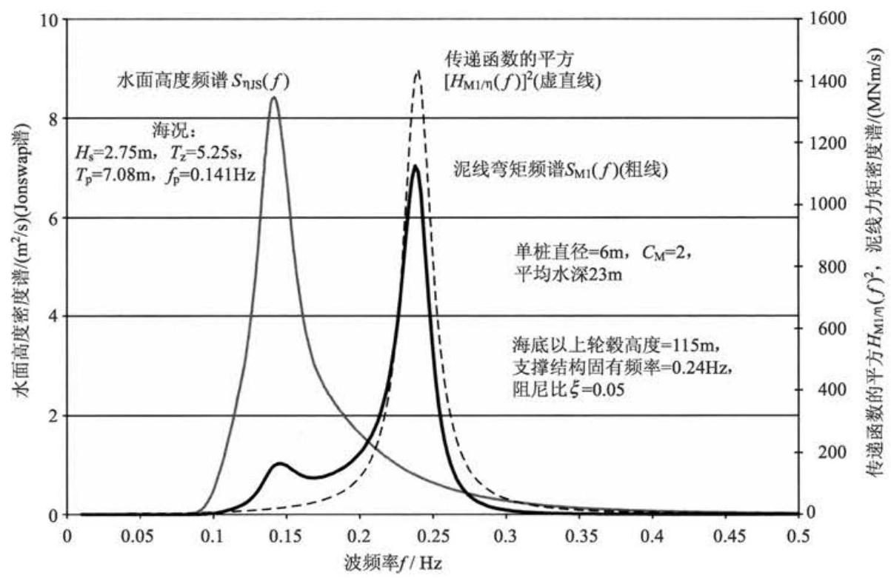

图 11.43 图 11.39 支撑结构实例在 ${H}_{\mathrm{s}} = {2.75}\mathrm{\;m}/{T}_{\mathrm{z}} = {5.25}\mathrm{\;s}$ 的海况的水面高度频谱和谐振泥线弯矩频谱

一个完整的分析将要调查第二和更高的支撑结构模式的动态响应,但当惯性载荷占主导地位时, 这些模式的励磁很小。

显然, 在本例中, 第一模式谐振力矩响应频谱的共振峰占据主导地位, 一个小得多的峰值出现在峰值波频率处。后者的峰值远远小于准静态频谱的峰值 (图 11.44), 但如果泥线力矩响应更高的支撑结构的振动模式励磁频谱中加入上述所示的第一模式, 预期会有好的一致性。

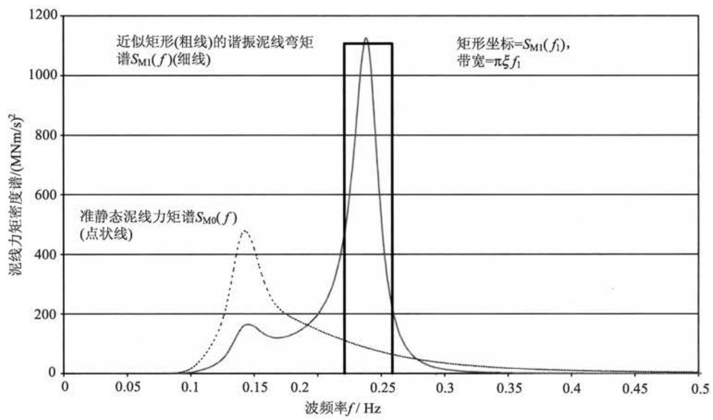

图 11.44 泥线力矩谱近似图

#### 10 疲劳分析的瞬间响应近似处理

鉴于第一模式谐振响应是窄带状, 疲劳分析的谐振矩谱可近似矩形的高度 ${S}_{\mathrm{M}1}\left( {f}_{1}\right)$ 和宽度 (带宽) ${\pi \xi }{f}_{1}$ ,集中在第一模式的谐振频率 ${f}_{1}\mathrm{{Hz}}$ 。如图 11.44 所示。 矩形内面积为

$$
{S}_{\mathrm{M}1}{\pi \xi }{f}_{1} = {S}_{\eta \mathrm{{JS}}}\left( {f}_{1}\right) {\left\lbrack  {H}_{\mathrm{M}1/\eta }\left( {f}_{1}\right) \right\rbrack  }^{2}{\pi \xi }{f}_{1} \tag{11.63}
$$

在谐振情况下,传递函数与动态放大倍率 $\left( {DMR}\right)$ 成正比。因此,矩形内面积与阻尼比成反比。谐振弯矩的标准等于矩形面积的平方根, 因此, 由下式得出

$$
{\sigma }_{\mathrm{M}1} = {H}_{\mathrm{M}1/\eta }\left( {f}_{1}\right) \sqrt{{S}_{\eta }\left( {f}_{1}\right) {\pi \xi }{f}_{1}}
$$

$$
= {C}_{\mathrm{M}}{\rho \pi }{r}^{2}{gk}{\int }_{m}^{d + m}{\mu }_{1}\left( y\right) \frac{\cosh {ky}}{\cosh {kd}}\mathrm{\;d}y\left( {{H}^{\prime } + d}\right) \sqrt{{S}_{\eta }\left( {f}_{1}\right) {f}_{1}\pi /\left( {4\xi }\right) }
$$

(11.64)

鉴于矩形近似的弯曲谐振谱和准静态频谱的区域之间的重叠小, 总矩谱可以保守地由两个近似的值求和得出。

进一步简化, 不考虑准静态传递函数随频率的变化, 则准静态矩谱等于波谱和准静态传递函数峰值波频率的平方的乘积

$$
{S}_{\mathrm{M}0}\left( f\right)  = {S}_{\eta \mathrm{S}}\left( f\right) {\left\lbrack  {H}_{\mathrm{M}0/\eta }\left( {f}_{\mathrm{p}}\right) \right\rbrack  }^{2} \tag{11.65}
$$

然后准静态弯矩的标准差变得简单

$$
{\sigma }_{\mathrm{M}0} = {\sigma }_{\eta }{H}_{\mathrm{M}0/\eta }\left( {f}_{\mathrm{p}}\right)  = \frac{{H}_{\mathrm{s}}}{4}{C}_{\mathrm{M}}{\rho \pi }{r}^{2}g\tanh {k}_{\mathrm{p}}d\left( {d + \frac{1 - \cosh {k}_{\mathrm{p}}d}{{k}_{\mathrm{p}}\sinh {k}_{\mathrm{p}}d}}\right) \tag{11.66}
$$

${\sigma }_{\eta }$ 是水面高度标准差; ${k}_{\mathrm{d}}$ 是峰值频率 ${f}_{\mathrm{p}}$ 对应的波数。准静态和谐振响应的平方和的平方根即为总泥线力矩响应的标准偏差:

$$
{\sigma }^{\mathrm{M}} = {\sigma }_{\mathrm{M}0}^{2} + {\sigma }_{\mathrm{M}1}^{2} \tag{11.67}
$$

#### 11 疲劳损伤的推导

矩谱的疲劳损伤的计算方法是否可行取决于是否可以视为窄带 (即发生在一个狭窄范围的频率)。当谐振力矩占主导时, 峰波频率为中心的准静态响应几乎没有任何影响, 并且在共振频率下发生的所有载荷周期, 可以被视为窄带响应。值得指出的是, 所用的准静态响应的标准差, 包括使用式 (11.66), 窄带的假设是保守的, 因为宽带的修正值减少了计算的疲劳损伤。

它可以证明(Barltrop 和 Adams, 1991)窄带振荡载荷的一个参数的周期数的损伤等效应力范围 ${N}_{\mathrm{R}}$ ，由下式给出

$$
\Delta {\sigma }_{\mathrm{{eq}}} = {\sigma }_{\sigma }\sqrt{8}\sqrt[m]{\frac{n}{{N}_{\mathrm{R}}}\Gamma \left( \frac{2 + m}{2}\right) } \tag{11.68}
$$

其中 ${\sigma }_{a}$ 是波动应力的标准差 $\left( { = {\sigma }_{\mathrm{M}}/\pi {r}^{2}t}\right) , m$ 是 $S - N$ 曲线 (假定为一条直线不是双线) $\log  - \log$ 图的逆斜率, $n$ 是海况持续时间的载荷周期数。其中 $m = 4, n = {N}_{\mathrm{R}}$ , $\Delta {\sigma }_{\mathrm{{eq}}} = {3.363}{\sigma }_{o}$ 。

另一方面，如果总矩谱是宽带，那么，Dirlik 方法可以用来得到一个近似的应力范围概率分布,然后结合 $S - N$ 曲线,以获得每个海况的疲劳损伤。

#### 12 S-N 曲线的推导

用于损伤计算的 $S - N$ 曲线的推导必须用疲劳、腐蚀、板的厚度和材料强度的局部安全系数解释。

(1)疲劳细节的影响。除非有 J 管贯穿单桩壁或焊接附件，否则关键的疲劳细节很可能是横向对接焊缝。根据 EN1993-1-9“钢结构设计-疲劳”，横向对接焊缝详细类别 90，焊缝凸小于 10% 或如果焊接磨平为 112 。详细类别 80 适用的焊接凸在 10%~20%。

ISO19902:2007 石油和天然气工业固定式钢海上结构使用一组不同的 $S - N$ 曲线,确定不同的英文字母这源于钢结构桥架的英国标准 BS153。在横向对接焊缝的情况下,低凸焊接和高凸焊缝分别适用 $S - N$ 曲线, $\mathrm{D}$ 和 $\mathrm{E}$ 磨平焊接。低焊接凸曲线、ISO 19902 曲线 D 和 EN 1993-1-9 详细类别 90 曲线互相平行, 且在停机之前相当接近，如图 11.45 所示。

(2)腐蚀的影响。海水中的阴极保护标本的疲劳试验表明，减少相应的疲劳寿命的疲劳强度应力范围的大小少于 ${10}^{6}$ 次,这反映在 ISO 19902 中规定的“有足够的防腐蚀保护”的海水中的结构不同的 $S - N$ 曲线。海水中不同的曲线 $D$ 如图 11.45 所示。

(3)板厚度的影响。当板的厚度 $t$ 超过 ${25}\mathrm{\;{mm}}$ 时，EN 1993-1-9 规定的疲劳强度按 ${\left( {25}/t\right) }^{0.2}$ 的比例缩小。单桩管壁厚度往往达到 ${80}\mathrm{\;{mm}}$ ,给定的比率为 0.792 , 所以,这是一个重要的考虑因素。较为保守的 ISO 19902 压缩比公式为 ${\left( {16}/t\right) }^{0.25}$ 。

(4)材料强度的局部安全系数。因为海洋生物和危险的环境，检查单桩疲劳损伤通常是行不通的，所以它必须设计为“安全寿命”。单桩失败的后果将会很大， 在此基础上, EN 1993-1-9 建议材料强度的局部安全系数为 1.35 。这个值高于 IEC 61400-1 中的相应值 1.265 , 这是缺乏定期检查情况下的材料系数的 1.1 和高风险故障系统结果的 1.15 的乘积。

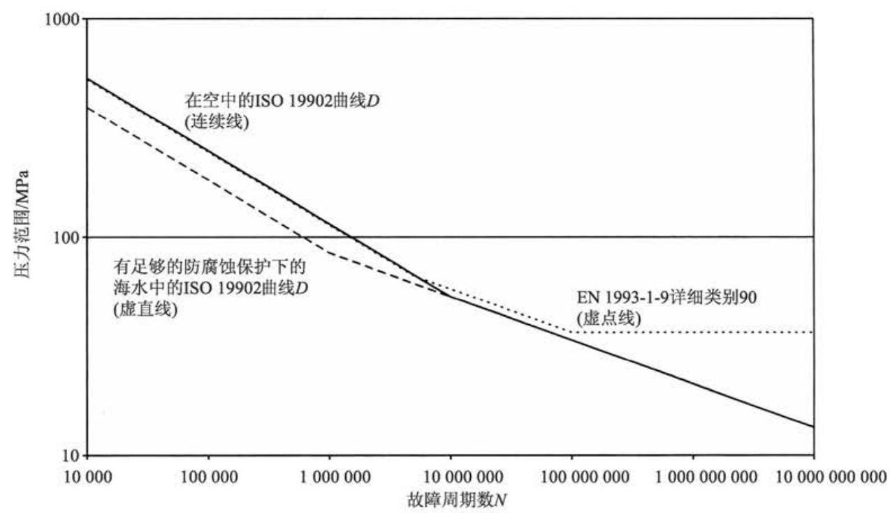

图 11.45 没有过多加强的横向对接焊缝的 $S - N$ 曲线设计的比较

在 ISO 19902 中, 材料强度的局部安全系数取 1 , 由于夸大了计算的疲劳损伤总和 (通常取小于 1 的值) 的故障严重后果的疲劳损伤设计系数取 10 。这相当于在逆斜率 $m = 5$ 的 $S - N$ 曲线中的一个 1.58 的相当高的局部材料强度系数,这反映了石油和天然气的结构具有更高的安全临界。

DNV-OS-J101 “海上风力发电机组结构设计”中，缺乏定期检查且较低故障后果的组件采用较低的疲劳损伤设计系数 3,这相当于 $m = 5$ 时的 $\gamma$ 取 1.25。然而, 对于故障后果较高的结构组件并没有给出相应的指导。

#### 13 频域内的风载荷

在 5.12.5 节和 5.12.6 节分别对频域内岸上风力发电机组的支撑结构的动力学和疲劳分析进行了讨论, 同时, 类似的考虑也适用于风载荷下的海上支撑结构。 由于风和波浪载荷的统计独立性, 风载荷引起的矩谱简单地叠加到波载荷引起的矩谱可以得到组合载荷矩谱。

#### 14 时域内的风载荷

正如上一部分结尾所提到的, 由风载荷疲劳损伤评估的频域计分析优先选择时域仿真，因为它们包括非线性空气动力学、非线性控制系统行为以及确定性和随机载荷的组合。下面讨论时域内的风载荷疲劳周期和频域内的波浪载荷疲劳周期相结合的方法。

#### 15 风和波浪载荷疲劳谱的组合

(1)使用模拟和雨流计数的风载荷疲劳。Kuhn(2001)提出了利用正常风模拟和频谱疲劳分析来分别计算风和波浪的疲劳损伤，然后两者结合。过程示意图如图 11.46 所示。

下面示意图提到的损伤等效应力范围定义为在一个指定的周期数 ${N}_{\mathrm{R}}$ ，会产生与实际计算的疲劳应力谱相同的疲劳损伤的应力范围。 ${N}_{\mathrm{R}}$ 通常取 ${10}^{7}$ 。

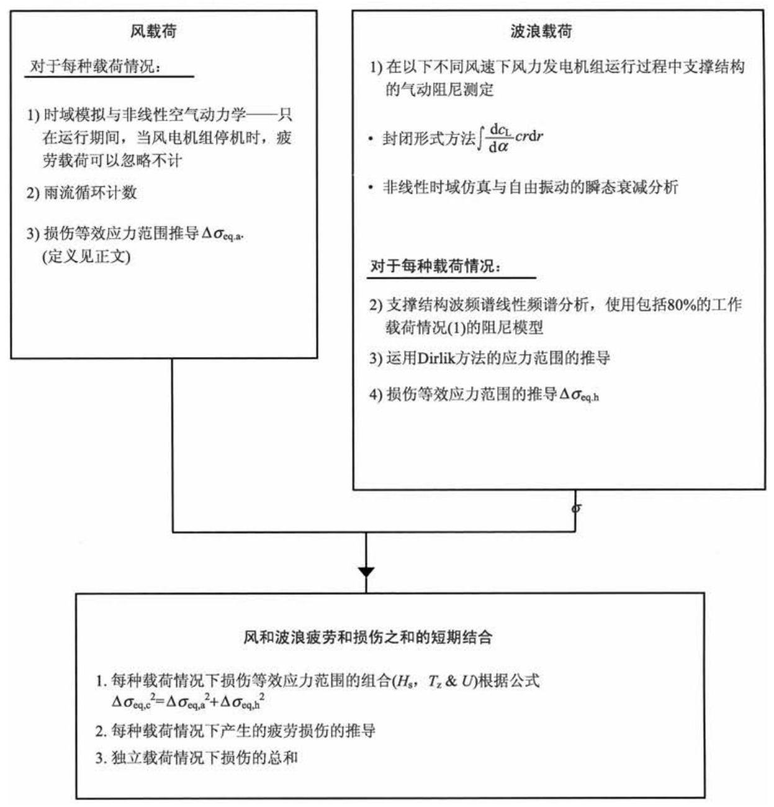

图 11.46 疲劳损伤简化计算示意图

在图 11.46 中所示过程的关键步骤是风和波浪的损伤等效应力范围的组合, 下面列出此步骤的基础。

这里已经指出,对于给定参考周期数 ${N}_{\mathrm{R}}$ 的窄带振荡载荷的损伤等效应力范围由下式给出:

$$
\Delta {\sigma }_{\mathrm{{eq}}} = {\sigma }_{\sigma }\sqrt{8}\sqrt[m]{\frac{n}{{N}_{\mathrm{R}}}\Gamma \left( \frac{2 + m}{2}\right) } \tag{11.69}
$$

Hancock 和 Gall(1985)提出了以经验为基础的上述广域带状载荷的情况下公式的修改，乘以波峰和过零期间的平均周期的比 ${T}_{\mathrm{c}}/{T}_{\mathrm{z}}$ 的 $m$ 次方根 $\beta$ ，得到

$$
\Delta {\sigma }_{\mathrm{{eq}}} = {\sigma }_{\sigma }\sqrt{8}\sqrt[m]{\frac{{T}_{\mathrm{c}}}{{T}_{z}}\frac{n}{{N}_{\mathrm{R}}}\Gamma \left( \frac{2 + m}{2}\right) } \tag{11.70}
$$

组合响应方差 ${\sigma }_{a, c}^{2}$ ，与空气动力和流体动力载荷响应方差的总和 ${\sigma }_{a, a}^{2} + {\sigma }_{a, b}^{2}$ 相等。因此,反复应用式 $\left( {11.70}\right)$ 可得:

$$
\Delta {\sigma }_{\mathrm{{eq}},\mathrm{c}} = \sqrt{\Delta {\sigma }_{\mathrm{{eq}},\mathrm{a}}^{2}{\left( \frac{{T}_{\mathrm{z},\mathrm{a}}}{{T}_{\mathrm{z},\mathrm{c}}}\right) }^{\frac{2}{m}} + \Delta {\sigma }_{\mathrm{{eq}},\mathrm{h}}^{2}{\left( \frac{{T}_{\mathrm{z},\mathrm{h}}}{{T}_{\mathrm{z},\mathrm{c}}}\right) }^{\frac{2}{m}}} \tag{11.71}
$$

如果过零期间的权重都省略,则简化为:

$$
\Delta {\sigma }_{\mathrm{{eq}},\mathrm{c}} = \sqrt{\Delta {\sigma }_{\mathrm{{eq}},\mathrm{a}}^{2} + \Delta {\sigma }_{\mathrm{{eq}},\mathrm{h}}^{2}} \tag{11.72}
$$

Kuhn(2001)报告了上面的简化方法的准确性的调查, 适用于泥线以下的横截面在 ${5.5}\mathrm{\;m}$ 和上面提到的参考设计的软-软单桩支撑结构塔顶法兰以下的横截面 ${10.6}\mathrm{\;m}$ 的疲劳载荷计算。风和波浪载荷组合的全时域仿真的等效应力范围与简化方法进行比较, 使用式 (11.71) 加权二次叠加, 也可以用式 (11.72) 的未加权等效与等效气动应力和流体力学载荷结合。这两种方法都取得了准确的结果, 但是, 令人惊讶的是，未加权的二次叠加更加准确，等效应力的最大误差约 $3\%$ ，而加权二次叠加为 5%。

(2)使用模拟来获得风载荷弯曲应力谱。另一种方法由 Van Der Tempel (2006 年) 提出，指出使用时域模拟来获取风载荷弯曲应力谱。关键的步骤如下:

步骤一:在固定塔顶部进行每个平均风速下的时域模拟，推导出应用到塔顶的波动载荷与它的时间历程的频谱。

步骤二:进风的湍流谱除以后者的频谱，得到进风波动和塔顶载荷波动之间的传递函数。

步骤三:得到不同风速下的气动阻尼值，例如，通过响应塔顶阶跃载荷(如上述标题下的气动阻尼)的瞬态自由振动的时域模拟。

步骤四:使用一个支撑结构的 FE 模型，推导塔顶载荷与所需的支撑结构弯曲应力之间的不同气动阻尼值下的传递函数。

步骤五:步骤二和步骤四得出的传递函数相乘得到在每个平均风速下的进风速度和弯曲应力波动 ${H}_{\sigma /U}f\left( {f,\bar{U}}\right)$ 的传递函数。

步骤六:用进风波动频谱乘以 ${H}_{\sigma /U}f\left( {f,\bar{U}}\right)$ 的传递函数，获取在每个平均风速下的风载荷的弯曲应力波动谱。

这种方法的一个优点是，使用时域模拟与塔顶固定装置意味着独立于所使用的支撑结构，因此不需要重复进行不同水深、土壤条件的计算。

风和波浪载荷组合得到的弯曲应力谱是通过每种组合平均风速和海况下的波浪载荷谱加入风载荷谱得到的。这些组合的弯曲应力谱可以用来推导出使用 Dir-lik 方法的应力范围的概率分布，以及疲劳损伤。

### 11.6.3 重力式基础

支撑海上风力发电机组的重力式基础的构造本质上与陆地上使用板结构是相同的。也就是说，它依赖于支撑结构提供的恢复力矩和风力发电机组的自身重量来抵抗倾覆力矩。然而, 在海上的重力式基础, 也总是用钢筋混凝土构造 (尽管钢铁或钢/混凝土组合材料结构是可行的), 却不如陆地上抗倾覆力矩那么有效, 因为浮力减少了它们的有效重量。因此作为补偿, 通常要添加额外的压舱物。值得注意的是, 在颗粒材料基础的情况下, 轴承的阻力比相应的陆上未在水中的部分的少, 这是因为粒子有效应力减少。

陆上风力发电机组的基础底板可以倒在原地, 但海上发电机组却不能。相反, 海上发电机组的重力式基础将建造一个码头, 驳船运到风电场现场, 并下降到海底准备接收。起重机起重能力有运输重力式基础的重量的限制, 所以通常将结构设计成中空的, 到目的地后再用重物材料填补空隙。

通过控制沉没进行漂浮式生产、拖曳运输和安装是可能的(在海上风电场其他章节已证明)，并且这些建议在理论上是存在的。这些建议的实施可以提高制造效率和减少延误风险及安装成本。

重力式基础比其他的构造大很多, 因此, 在某些情况下, 对环境的影响限制了它的推广使用。

#### 1 在波罗的海南部的重力式基础

波罗的海南部的波候相对温和，潮差几乎可以忽略不计，使得海底准备和重力式基础运输的挑战性较更恶劣条件下的北海少，所以人们一直看好把重力式基础设在丹麦和瑞典的海岸附近的浅水区。

图 11.47 说明了用于支持西门子 2.3MW 发电机组 (共 48 台) 的在瑞典 Öresund 桥以南水域的 Lillgrund 风力发电场的重力式基础设计(该信息来自 Lill-grund 风电场,由 Vattenfall 拥有和经营)。该基础由一个空心圆柱轴从 ${16.45}\mathrm{\;m}$ 宽六角板 (对角 ${19}\mathrm{\;m}$ ) 上升,这是径向支撑轴加固到约 2.4m 高的外围墙。六芯的重物回填到压载岩石及基础安装后的外部岩石中。构建时有五个不同的设计, 整体高度分别为 ${10.3}\mathrm{\;m},{11.3}\mathrm{\;m},{12.3}\mathrm{\;m},{13.3}\mathrm{\;m},{14.3}\mathrm{\;m}$ ,适合水深在 $4 \sim  9\mathrm{\;m}$ (圆柱轴顶部整个的大倒椎用来减少冰载荷)。该基础建在波兰海岸的 Swinoujscie 码头停泊的驳船上，每个驳船可容纳 4 个基础(图 11.48)，便于最终运输到场址。

现场的准备工作包括在海底挖掘约 ${2.5}\mathrm{\;m}$ 深的一个浅坑，在周围挖掘钢架的位置, 接着是沉积一层薄薄的碎石为重力式基础做准备。钢架设置为水平位, 通过潜水员利用安装在中央支撑上的旋转梁使岩床处于水平位。通过驳船的起重机安装完每个基础后(图 11.49)，围绕基础开挖回填岩石护面块石作为冲刷防护。最后, 在圆柱轴上空隙填满压重材料和在它上面放置混凝土的板坯连铸。最高的基

础重量在没有压舱物时是 1375t，有压舱物时达 2250t。

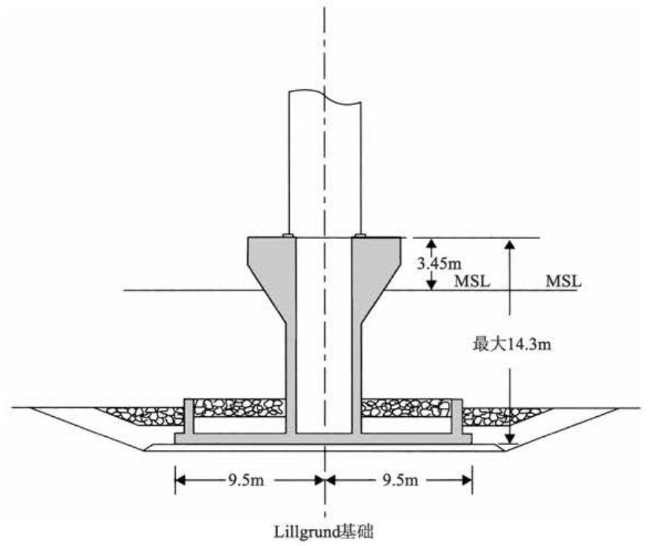

图 11.47 瑞典 Lillgrund 风电场使用的钢筋混凝土重力式基础设计

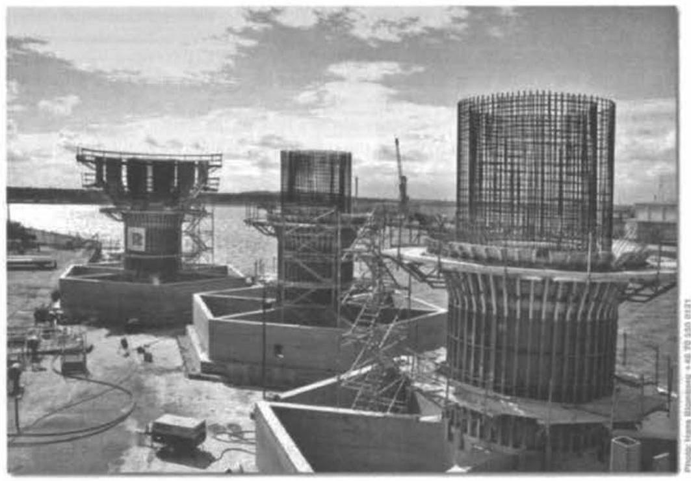

图 11.48 在 Swinoujscie 码头驳船上建造的重力式基础

(Lillgrund 试点项目, 2008 年, Vattenfall 许可授权)

类似的重力式基础设计也应用在波罗的海的其他大型风力发电场，Rodsand 1 (Nysted)和 Rodsand 2，其中西门子 2.3MW 的风力机也这样部署。然而，对于 Rodsand 2 来说，底板是四个短边和四个长边的八角形，内部的墙壁是一个十字形排列。Rodsand 基础在 2010 年的安装成本为 350000 美元/MW, 自称是英国单桩基础的一半。

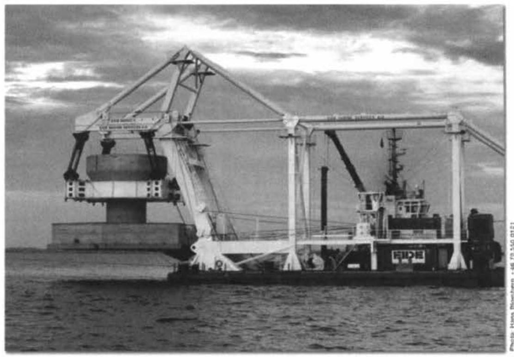

图 11.49 在 Lillgrund 风电场安装过程中使用浮吊起重机将重力式基础降低 (Lillgrund 试点项目, 2008 年, Vattenfall 授权许可)

#### 2 临近比利时北海的重力式基础

直到 2008 年, 重力式基础的地基才非常显眼地出现在北海——可能是上述原因。然而, 在这一年, 6 个非常大的重力式基础被安装在 Thornton Bank 的深水中，距离比利时海岸 30km，支撑 REpower 5MW 风力机 (见图 11.50)。

在该项目的规划阶段,对单桩和重力式基础都进行了详细考虑,但大尺寸的单桩要求安装在 ${23}\mathrm{\;m}$ 水深,钢材成本和操控性升级制约了重力式基础的选择。Peire 等(2009)完整描述了重力式基础的设计和安装。

Thornton Bank 在深水的重力式基础配置与波罗的海南部的浅水设计差别很大。取代轴和悬臂式平板，轴被安装在一个圆台上，它提供了一个高效的到底板周围的载荷路径，且不会增加水位线附近的波浪载荷。像往常一样，无压舱物结构的重量是至关重要的, 所以使用预应压力的混凝土对轴和圆台更有效。

关键尺寸如下:

(1)高度(取决于当地的海床深度):最大 ${44}\mathrm{m}$ 。

(2)轴直径: ${6.5}\mathrm{m}$ 。

(3)底板直径: ${23.5}\mathrm{m}$ 。

(4)圆台高度和基础直径:17m。

(5)轴和圆台壁厚:0.5m。

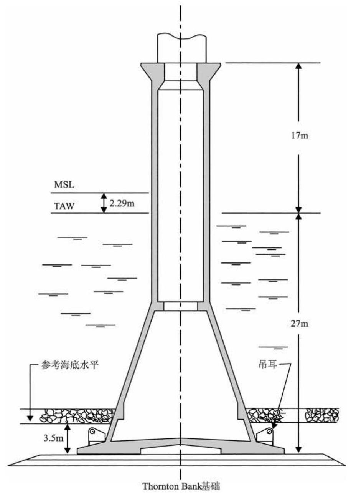

图 11.50 预应力混凝土重力式基础设计用于比利时 Thornton Bank 风力发电场

重力式基础建立于参考水平海底的 ${3.5}\mathrm{\;m}$ ,这被定义为最低的海底水平,其在沙浪波动和自然侵蚀的情况下可以保证 30 年以上。重力式基础的顶部, 其中包括接入平台,是 TAW 以上 ${17}\mathrm{\;m}$ ,比利时海平面的参考水平,是低于平均海平面 ${2.29}\mathrm{\;m}$ 。

建在高约 ${1.2}\mathrm{\;m}$ 的平行混凝土梁上的基础置于 Ostend 码头。对每个基础的建成, 自走式多轴模块化拖车在混凝土梁和其延长液压悬架间移动, 提高了混凝土梁的基础之间的空间位置。拖车, 然后非常缓慢地运往基础码头, 浮式起重机 Rambiz 使用特制的升降架和安装在底板上的四个大型吊耳能够精确地将其抬起。 Thornton Bank 开建后, 使用一种特殊的液压驱动引脚释放机械降低每个基础到准备好的床板的位置,并释放悬挂电缆。

有必要在每个场址的重力式基础提前安装一个宽 ${50}\mathrm{\;m}$ ,长 ${80}\mathrm{\;m}$ ,约 $7\mathrm{\;m}$ 深的基坑, 长边与东北/西南方向相同, 平行于当时的水流方向。在最后几米深的疏浚阶段,为了达到一个合理的水平面,要在相对平静的条件下进行。 ${1.3}\mathrm{\;m}$ 厚的砾石基础床一更细的过滤层,接着是较粗糙层组成 ——然后是沉积的“海马”, 18000 t 船舶动态定位，配合在海底的运输工具配备的测量设备远程操作工作。最后，通过拖动一个专用的拖平工具精确地将表面弄平。因此，安装结构的垂直方向的倾斜是非常低——平均 ${0.1}^{ \circ  }$ 。

安装后, 每个重力式基础周围的坑都用砂回填, 来复原最初疏浚的沉积, 基础内用相同的材料充填。最后, 每个基地周围沉积的岩石外壳作为冲刷保护。

44m 高的无填充物的基础的重量为 3000t,沙子作为填充物时的容量约为 ${2000}{\mathrm{\;m}}^{3}$ 。

### 11.6.4 导管架结构

导管架结构为更深水域的单桩和重力式基础提供了更轻的替代品。基本的设计理念是几个近乎垂直的管状腿由每个面更小的管连在一起，这起源于石油和天然气工业,但因为风电行业的更高的经济要求使其正在发生转型。

如图 11.51 所示, 2009 年在北海的 Alpha-Ventus 风电场安装的四个托架呈斜撑结构。场址位于在 ${30}\mathrm{\;m}$ 深的水域，靠近荷兰边境的德国 Borkum 岛以北 ${45}\mathrm{\;{km}}$ 。 这个想法最早是在 2006 年的 Beatrice 示范项目试用, 为两个高大的、五个托架结构,部署在苏格兰 Moray Firth 45m 水深处。2010 年,改为 30 个小管、三个托架的结构，但其他的设计类似，在 Ormonde 项目中就安装在爱尔兰海的 17~21 m 深处水域。支撑三个场址的 RE Power 5MW 风力发电机组的均为此结构。

导管架结构与单桩结构相比可以在相当大的程度上减轻比重, 因为支撑腿的广泛分离, 在更高的杠杆臂抵抗了主要载荷——倾覆力矩。而且, 疲劳损伤的关键因素——结构上的波惯性载荷较小，这是因为降低了总组件的横截面积。另一方面，极端载荷的关键因素——波阻力载荷增加了，这是因为增加的总组件的宽度。

在成本方面，在支撑构件与腿之间的许多几何形状复杂的接头的制备及焊接需要一个相当大的成本花销, 甚至在此之前, 要考虑更高的应力集中和性能较差的焊缝疲劳而产生的额外的材料要求 (见 7.8.3 节)。此外, 在导管架结构的顶部的下台阶的宽度从宽大的腿到塔的直径必须提供大量过渡段。这包括一个圆柱形塔根上支持组件扩展到每个导管架的腿, 水平构件沿一个正方形的边连接在一起, 整体塔根部的基础在同一平台。导管架腿屈伸的水平分量引起的塔根壁的形变可以通过在上面项目提到的大的水平环形结构的加固来防止。对于 Beatrice 支撑结构来说，过渡段重达 163t，导管架本身的重量几乎是 360t 的一半。

联合制作的另一种方法是使用铸钢节点, 它可以直接对接环焊缝焊接管。 Weserwind(Seidel,2007A)已为导管架结构的三种类型的连接开发了标准铸造点:

(1)X-节点，在面上的每个对角线的交点。

(2)双 K 节点，在两个面到腿间加入对角线。

(3)双Y节点，连接每个腿的顶部到两条对角线以及塔的过渡段。

在导管架的设计原型中，腿更接近顶端，以使它们配合塔过渡段，塔过渡段是一个圆台形成的旋转壳。结构上, 这是一种更有效的过渡性安排, 但显然它需要的腿太重了。

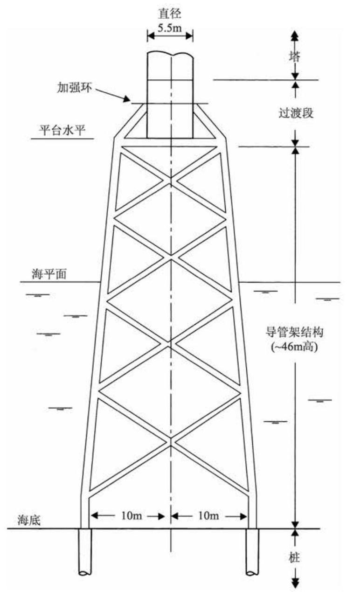

图 11.51 Alpha-Ventus 风电场的支撑 RE Power 5MW 风力机的导管架结构 (为清晰起见，省略了阶梯、平台、栏杆和 J 管)

#### 1 桩

导管架结构的每个角必须以某种方式连接到海底, 以便抵抗倾覆力矩产生的隆起。到目前为止已完成了打桩，虽然使用的吸力铲头仍在研究中。

Beatrice 导管架结构的制作是通过桩筒连接到每个腿。导管架结构安装之后，1.83m直径的桩穿过每个桩筒打入到海底。然后，每个桩和桩筒铆接在一起， 通过扩大液压压力使桩扩大，变形到桩筒中的环形凹槽中。

另一种是 Alpha-Ventus 采用的方法, 即提前挖桩。不使用桩套筒, 导管架腿扩展安装在导管架脚下面，在安装导管架时，当导管架降低时，这些被旋入桩中(插入处上部的土提前被移除)。最后, 导管架的脚置于桩顶部, 在每个导管架腿延伸 (称为导管架 “刺”) 的空隙处, 该桩灌浆, 以使导管架锚固于海底。这种安排与 Ormonde风电场采用的相似, 如图 11.52 所示。

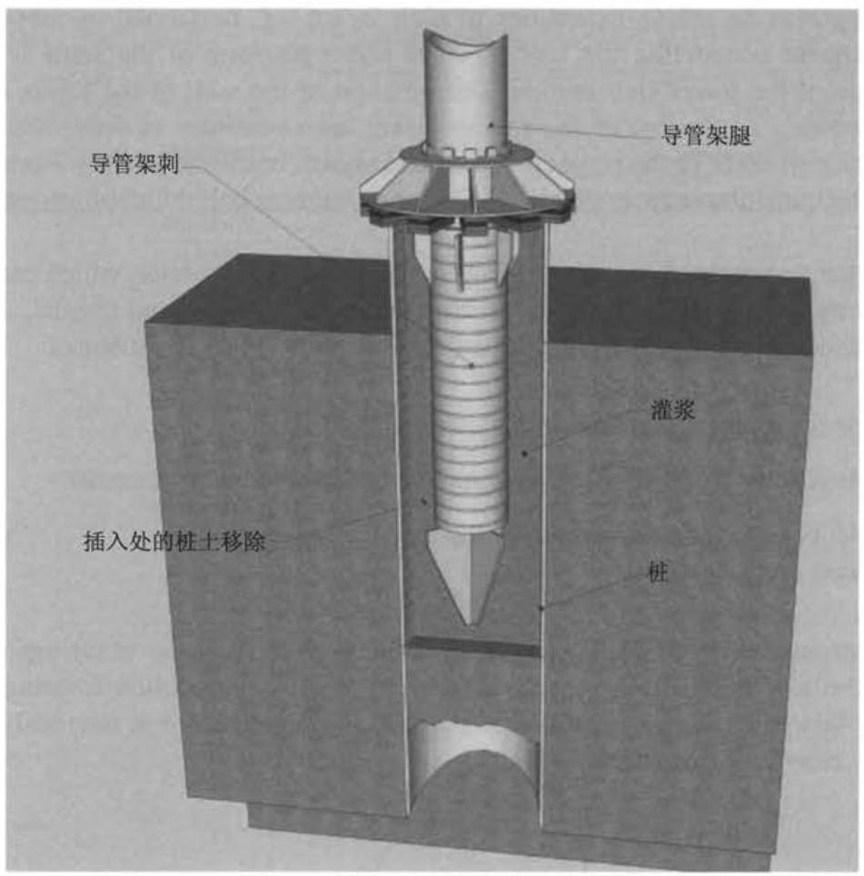

图 11.52 使用同心导管架刺和灌浆联合将导管架腿铆入桩中[Ormonde 风力发电场, 海上设计工程有限公司 (ODE) 许可复印]

在此过程中的一个关键要素首先是桩的准确定位, 这是由铺设在海底的一个两部分组成的钢模板实现的 (Norwind, 2010)。外层组件依次定位于围绕中央的八角形组件的四个位置, 由临时桩保持这个位置 (外层组件已纳入桩指南中)。在每个位置上,一个新桩插入并驱动到终点。

#### 2 安装方法

大型浮式起重机, 用来放置 Beatrice 和 Alpha-Ventus 风电场的海底导管架结构。浮式起重机也被用来安装预组装的风轮、机舱和 Beatrice 风电场(图 11.53)的塔架上每个导管架结构。

该图显示了精心制作的八角形的临时接口连接到导管架的顶部和塔基, 以方便配套过程。这些内置的液压油缸能够弥补浮吊和外套结构膨胀, 从而避免强烈冲击的相对运动。相比之下, 在 Alpha-Ventus 自升式驳船安装起重机被用于单独安装塔架, 机舱和风轮在较浅的水域。

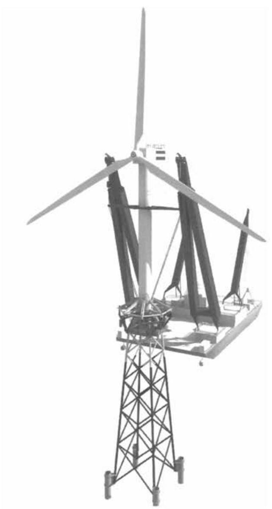

图 11.53 Beatrice 风电场利用浮式起重机安装塔架、机舱和风轮 (英国 Talisman 能源公司许可转载)

#### 3 导管架重量

表 11.6 给出了在 Beatrice 和 Alpha-Ventus 的导管架结构、次要元件和桩的大约重量。

很明显, 在每种情况中, 桩的重量都超过总重量的三分之一, Beatrice 的过渡段接近导管架结构重量的一半。

表 11.6 Beatrice 和 Alpha-Ventus 风电场的导管架结构、次要部件和桩的大约重量

<table><tr><td>风电场场址水深</td><td>BEATRICE 45m</td><td>ALPHA VENTUS 30m</td></tr><tr><td>部件</td><td></td><td></td></tr><tr><td>导管架</td><td>360t</td><td></td></tr><tr><td>过渡段, 包括平台</td><td>160t</td><td></td></tr></table>

续表 11.6

<table><tr><td>风电场场址水深</td><td>BEATRICE 45m</td><td>ALPHA VENTUS 30m</td></tr><tr><td>桩筒</td><td>163t</td><td>不适用</td></tr><tr><td>主要结构总计</td><td>683t</td><td>425t</td></tr><tr><td>着陆船</td><td>68t</td><td></td></tr><tr><td>阳极</td><td>52t</td><td></td></tr><tr><td>杂项 (例如 J 管)</td><td>25t</td><td></td></tr><tr><td>次要结构总计</td><td>145t</td><td>85t</td></tr><tr><td>桩</td><td>468t</td><td>315t</td></tr><tr><td>总体总计</td><td>1296t</td><td>825t</td></tr></table>

(Seidel, 2007a 和 2007b)

#### 4 单桩重量的比较

de Vries 和 Krolis(2007)预测了 Vestas V903MW 风力机(11.6.1 节), 包括塔的单桩支撑结构重量, 可以用来估计 RE Power 5MW 的相应值, 使用比例规则保持支撑结构的固有频率和标准额定功率的旋转频率之间的关系。把单桩和塔支撑结构作为统一失重悬臂长度 $L$ ,支撑塔顶质量 $M$ ,它可以很容易地显示,固有频率由下式给出:

$$
{\omega }^{2} = \frac{3EI}{M{L}^{3}}\mathrm{{rad}}/\mathrm{s}
$$

因此所需面积的二次矩得到特定的固有频率是

$$
I = \frac{M{L}^{3}{\omega }^{2}}{3E} \tag{11.73}
$$

此公式也适用于几何结构类似锥形的支撑结构面积所需的泥线的二次矩, 只是分母中的数字会有不同。

如果假定单桩的壁厚和半径，对于给定的水深、V903MW 风力机的塔设计都以相同的比例进行缩放, 以实现 5MW Repower 的风力机的单桩和塔设计在同一水深度的面积的更大的二次矩, 那么, 横截面积的比例系数等于面积的二次矩比例系数的平方根, 即

$$
{K}_{A} = \frac{{\omega }_{5}}{{\omega }_{3}}\sqrt{\frac{{M}_{5}}{{M}_{3}}\frac{{L}_{5}^{3}}{{L}_{3}^{5}}} = \frac{{\omega }_{5}}{{\omega }_{5}}\sqrt{\frac{{M}_{5}}{{M}_{3}}\frac{{\left( D + {H}_{5}\right) }^{3}}{{\left( D + {H}_{3}\right) }^{3}}} \tag{11.74}
$$

其中, ${\omega }_{5}/{\omega }_{3}$ 的比值等于在运行过程中的标准转速与额定功率的比值, $D$ 是水的深度, ${H}_{5},{H}_{3}$ 分别是 $5\mathrm{{MW}}$ 和 $3\mathrm{{MW}}$ 风力机轮毂高度。重量比例因子 ${K}_{\mathrm{w}}$ 为横截面积的比例系数乘以悬臂长度比 $\left( {D + {H}_{5}}\right) /\left( {D + {H}_{3}}\right)$ 。表 11.7 给出了上述表达式的参数值。

表 11.7 用于推导出不同水深的重量比例因子的风力机参数值

<table><tr><td>风力机</td><td>Vestas V903 MW</td><td>REpower 5 MW</td></tr><tr><td>标准额定转速 $\omega$</td><td>16. $1\mathrm{r}/\mathrm{{min}}$</td><td>12. $\mathrm{{1r}/{min}}$</td></tr><tr><td>塔顶质量 $M$</td><td>112t</td><td>410t</td></tr><tr><td>轮毂高度 $H$</td><td>68.5m</td><td>87m</td></tr><tr><td>30m 水深时单桩和塔的重量比例因子</td><td>1</td><td>2.211</td></tr></table>

支撑 VestasV903MW 风力机和 RE Power 5MW 风力机在不同水深和不同缩放值的单桩和塔的大约重量, 以及 Beatrice 和 Alpha-Ventus 风电场的导管架支撑结构的主要结构、桩和塔的总重量(为 210 吨)绘制在图 11.54 中。可以看出，导管架结构的重量轻化非常显著，在更深的水域更加明显。

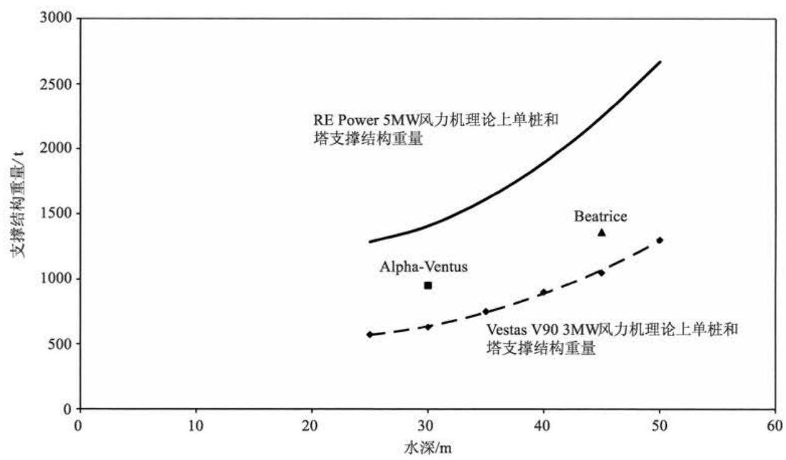

图 11.54 Alpha-Ventus 和 Beatrice 支撑结构实际重量比较

5MW 风力机单桩支撑结构重量随水深的理论变化

#### 5 综合导管架结构和塔

消除导管架结构和管状塔架之间沉重的过渡段的方法之一，是前者与桁架式塔架相结合。桁架式塔架腿是简单的导管架腿的延续。支撑迎风风电机组的桁架式塔架通常为高腰, 以提供足够的间隙, 但在顺风风电机组的情况下, 从海底到机舱腿都是直的。从平台水平到机舱是通过电梯, 电梯可以用加固的塑料管围起来, 以保护它。

### 11.6.5 三脚架结构

三脚架结构的优点如下:在抗倾覆力矩方面，它比单桩更有效；如果是有压载的时候，脚的宽间距可以避免打桩的需要。然而，不像导管架结构那样，它不能消除旋翼推力引起的主要组件的弯矩，尽管在一些组件间因为共享使力矩明显减少， 且在三脚架顶点和海床之间时线性减少。

一些不同形式的三脚架的结构可以应用。平三脚架设计包括三条顶点交在一起的斜腿，三条腿用系梁连接起来，形成了一个等边三角形。塔就固定在短柱的顶部。

三脚架的一个变体, 被称为中心, 柱三脚架 (CCT), 短柱被一个长的柱体代替, 这个柱体延伸到海底，在海底它用径向的系梁的斜腿连接到脚，取代脚间的系梁。

三脚架组件的数量可以根据平面三脚架结构(FFT)来减少，其中柱可以移动到 ${90}^{ \circ  }$ 直角等腰三角形的顶点，构成三角的基础。在这种情况下，只有两个斜腿，和两个系杆将每只脚系到柱基础上。

三脚架结构的好处是减少柱弯矩明显增加三脚架的高度, 但最好避免放置三脚架的顶点在波峰水平以减小波浪载荷。然而, 将顶端设置在峰值水平之上, 使得船进入变得更难。

在北海 30m 水深的地方安置了 6 个三脚架结构, 用来支撑 Alpha-Ventus 风电场的 Multibrid M5000 风力机 (见前一章)。这些是 CCT 结构, 三脚架的顶点位于水平面以下。结果是, 三脚架的基础相对较小, 三脚架腿可以避免桩的隆起。

表 11.8 比较了在相同风电场, 三脚架结构和导管架结构重量的估算 (Seidel, 2007a)。

表 11.8 Alpha Ventus 的三脚架和导管架结构重量比较

<table><tr><td>结构类型组成</td><td>三脚架估计重量</td><td>导管架重量</td></tr><tr><td>主要结构, 包括桩筒、平台和过渡段 (只有导管架)</td><td>840t</td><td>425t</td></tr><tr><td>次要结构(登陆船、J管和阳极)</td><td>85t</td><td>85t</td></tr><tr><td>桩</td><td>370t</td><td>315t</td></tr><tr><td>总计</td><td>1295t</td><td>825t</td></tr></table>

可以看出, 完整的三脚架结构包括桩的估计重量比导管架结构的相应的结构的重量大 50%以上。

是否较大的 FFT 三脚架更加经济仍然在讨论之中。

### 11.6.6 三桩结构

BARD 已经发明了一种在 ${25} \sim  {40}\mathrm{\;m}$ 水深的地方支撑 $5\mathrm{{MW}}$ 风力机的三桩结构。该设计包括 3 个间距约 ${20}\mathrm{\;m}$ 的直径为 ${3.35}\mathrm{\;m}$ 的垂直柱。这三条臂由塔架上安装的过渡结构连在一起，安装在塔上。一个垂直的圆筒形管件从每个臂的端部和三个管向下插入三个桩的顶部，并以同样的方式为单桩过渡段灌浆。矩形横截面的过渡结构的手臂，使它们能够很容易地由平板制造。

图 11.55 表明了安装后的三桩结构。

过渡结构的重量是 ${470}\mathrm{t}$ ,桩重达 420t,所以总重量可与 Alpha-Ventus 导管架结构 (820t) 相比。

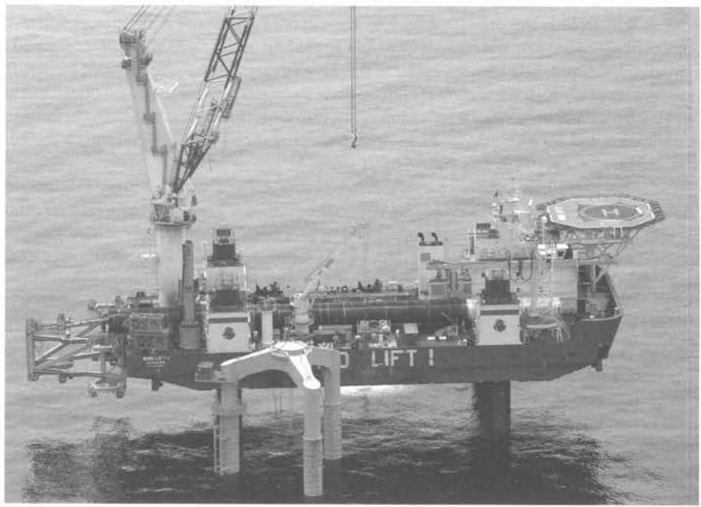

图 11.55 安装后的三桩结构。BARD 小组创造

## 11.7 海上风电场的环境评估

海上风电场经常扩展到大面积的环境的重要性的浅海水域, 可能对海洋环境有相当大的影响。与任何大型陆上风电场项目一样, 环境影响评估之前必须提交申请, 申请同意建造及营办一个海上风电场项目。在欧洲的环境影响评估指令 (97/11/EC,1997)中, 要求进行环境影响评估(EIA), 并且对发展海上风电场在环保方面提供一些建议。渔业和水产养殖中心环境科学(CEFAS)(2004)通过英国的相关法规指出了如何进行相关指导。

EIA 评估该项目的建设、运营和报废等各个阶段对环境的影响。可以通过采取措施避免不良影响，或如果影响不可避免，那么可以通过一些方法减轻影响。研读环境声明的主要是当局, 当局必须给出该项目继续进行, 以及与海洋环境有关的各种利益相关者的许可。沿海地区被用于一系列的用途，例如渔业、矿产开采、运输或康乐活动，很多团体有可能对任何拟议的海上风力发电场的开发有浓厚兴趣。 英国风能协会(BWEA)(2002)描述了如何实践管理咨询。

97/11/EC 中描述了任何环境声明的内容, 包括该项目的说明和建议, 以及避免和减轻重大不利影响的措施。这将包括必要的数据，以识别和评估该项目对环境和项目开发者主要选择的研究纲要的主要影响。在该项目的发展中作出的选择,必须合理考虑对环境的影响。且需要全面的技术文档和较短的非技术性摘要。 在进行细致的工作，包括数据收集和调查之前通，常要审批当局同意的定义 EIA 调查程度范围的报告。

除了单个风电场项目外，战略环境影响评估(SEA)所需的环境影响评估是由国家或地区政府识别海上风电场的开发是否在适当的地方,并在个别项目的环境影响评估中找出需要特别强调的(EWEA,2009; DECC,2009)。例如,英国海上风电场的第二轮开发海域确定了三个战略领域: Greater Wash、Thames Estuary 和英格兰西北部的海域。它建立的几个重要的原则，较大的风力发电场(约 ${1000}\mathrm{{MW}}$ ) 是首选，优于较小的近岸项目。风电机组不能安装在距离岸边 $8\mathrm{\;{km}}$ 到 ${13}\mathrm{\;{km}}$ 的沿海地带,特别是景观敏感性区域。风电机组也不能安装和使用在这些小于 ${10}\mathrm{\;m}$ 水深浅水区的鸟类栖息地，以及作为康乐及近海捕鱼的特定地区。这三个地区都接近电力载荷中心，有良好的电力传输系统。在战略环境影响评估(SEA)发布后，共收到 ${7.2}\mathrm{{GW}}$ 的海上风力发电能源发展意向书。

海上风电场的环境影响评估, 开始是一个完整的发展计划, 这将包括风力发电机组、它们的布局和基础、阵列布线、海上变电站、岸边的海底输电电缆、陆地电缆和陆上变电站的许多额外工程。在项目区进行的大量工作是收集数据，包括海底、 海洋生物学、鸟类和哺乳动物、鱼类资源、海上交通、电力电缆上岸的潮间带区和考古调查。同时还要开展基线景观调查和海景视觉评估。施工和调试环境监测通常需要一段时间。

特别需要考虑的对环境的影响包括:

(1)沿海和沉积过程——输沙，冲刷。

(2)波浪和潮汐环境。

(3)水质——浊度。

(4)底栖生物——海底的植物群和动物群。

(5)鱼类资源——迁移模式，育苗区。

(6)商业渔业。

(7)海上航行。

(8)考古学。

(9)海洋哺乳动物——分布，干扰，噪声和振动位移的影响。

(10)鸟类——分布，干扰，位移，死亡率。

(11)指定区域(被认为是环境重要性的特别保护政策到位的区域)。

与陆上风电场相比，景观和感观的变化可能会成为关注和反对风电场发展的原因。DTI 2005 年提供了对如何进行海景及视觉影响评估(SVIA)海上风能发展详细的指导。使用了区域理论视觉影响区域(ZTV)描述潜在的可见性发展程度。 这种技术可以针对一个或者更多的风电机组或者是风电机组的一部分, 考虑到地形和地球曲率两个方面，但不对任何大气条件进行评估。因此，ZTV 表示所能达到的最大程度的可见性为了顾及不同的大气条件和光照条件，视受影响的发展说明在划定范围内可以使用线框和蒙太奇照片。三维建模和蒙太奇照片越来越多地用于大型风电场。距岸边大于 24km 的风电场对可视度的影响是轻微的。海景及视觉影响评估可识别风电场现有的特征并对其发展对视觉特征的变化进行评估。 判断是基于受体敏感性的评估和海景适应变化的能力。当地居民是对工业活动最敏感的受体，港口最不敏感。同样，坐船出海游玩是高敏感受体，而油气钻井不敏感。考虑海洋景观的整体素质和风电场的敏感度，以及海景的附加价值进行了适应变化能力评估。DTI 2005 年对于如何做出判断给出了指导, 并作了记录。

噪声，特别是在施工期间，一直是一些靠近岸边的海上风电场的问题。可以采取的措施是在特别嘈杂的单桩基础设施修建时限制工作时间。在打桩作业时，在水中传播的噪声会很大 (在 $1\mathrm{m}$ 内 ${200}\mathrm{\;{dB}}$ )，常见的做法是使用软启动打桩作业，使鱼类和海洋哺乳动物离开该地区。

风力机和变电站基础和电缆路线周围局部冲刷是共同的关注点，同时可能需要额外冲刷防护(例如使用排岩)。这会改变海底表面，并可能影响底栖动植物的变化。

客轮和渔船经常使用简单、低成本的脉冲雷达，而不是使用更先进设备中常见的多普勒效应区分固定及移动目标的航空雷达。有一部分使用先进的数字信号处理技术，来减少风电场对海洋雷达的影响，但是试验表明风电场产生的盲区无法检测到其他风力机和船只，除非观测船只移动 (Howard 和 Brown, 2004)。此外，高的风电机组结构产生大的回波和雷达反应非常强大，会产生多余的多重反射回波。

Drewitt 和 Langston 于 2006 年提出海上风电场对鸟类的影响有四大类:碰撞、干扰位移、阻隔效果和栖息地的丧失。虽然证据并不完整，而且大量研究的风力发电场的建在远离大密度的鸟类栖息地，但仍有证据表明存在碰撞死亡。从 Horns Rev 和 Nysted 风电场, 同样有由于干扰而不是屏障作用引起的位移的一些证据，但是也很有限。而对于陆上设施(变电站)导致鸟类潜水栖息地的丧失，强调特别关注。

一个全面的环境监测方案从 2000 年到 2006 年在丹麦的两个风电场 Horns Rev(160MW,海上 14 ~ 20km) 和 Nysted (166kW,海上 10km) 进行了试验 (DONGEnergy 等, 2006), 研究了风电场的建设和运营的影响:

(1)海底栖息动植物，特别是基础和冲刷防护的影响。

(2)风电场周围的电磁场对鱼类的分布的影响。

(3)海洋哺乳动物的行为和它们的反应对风电场的影响，包括建造。

(4)觅食和栖息的鸟类的数量和分布和对候鸟的影响，包括碰撞风险。

风电场在沙质沉积海底上使用硬冲刷防护，这导致更多样化的表面和底栖生物群落的生物量增加 50~150 倍。没有证据表明风电场对本地鱼种群或电磁场对鱼类有任何影响。对海洋哺乳动物 (海豹和海豚) 的主要影响是在单桩基础安装期间海豚要离开该地区。有证据表明鸟类为避开风电场而稍微延长了迁移距离。 在 Nysted 模拟中碰撞率很低，为 0.02% (45 只鸟)。总之，这两个大型风电场的监测对环境的影响是有限的。

环境监测方案在两个早期英国海上风电场 North Hoyle 和 Scroby Sands 已经施行。每个风电场由三十个 $2\mathrm{{MW}}$ 的风力机直接连接到 ${33}\mathrm{{kV}}$ 陆基电力系统，没有海上变电站。North Hoyle 风电场距离北威尔士海 4 ~5 英里，而 Scroby Sands 距离英格兰东海岸 2 英里。对 North Hoyle 风电场进行环境监测, 在投产两年后，显示海洋沉积物组成有小规模的变化, 底栖生态和鸟类分布未改变 (DTI, 2006a)。 由于风电场的建设和运作了两年没有重大的环境影响，所以这不能归结为风电场的趋势和总体结论。

Scroby Sands(DTI, 2006b)的监测方案包括水深测量、围绕风力机分析和出口电缆的线路。也有海鸥和小鸥种群的调查。水深测量确认一些风力机周围的深达 $5\mathrm{\;m}$ ,直径 ${60}\mathrm{\;m}$ 的冲刷坑,这些坑都装满岩石。也有证据表明,铺设的海底电缆的深度(最初 $3\mathrm{m}$ )随海底条件和为防止出口电缆暴露或损坏铺置的岩石垫改变。审查动态的冲刷和单桩基础冲刷防护的数据是从五个海上风电场得来的。

## 11.8 海上电力采集与传输

第一个示范海上风电场很小,使用简单,成熟的风力发电机组通常为 500 ~ 600kW 功率等级，经常使用失速调节恒速感应发电机。集电电压为 10 ~11kV 的海底电力收集电缆, 有几公里的长度, 直接连接到陆上的电力系统。通过使用更高的海上额定 (如 2MW) 变速风电机组,这个电压被提高到 ${30} \sim  {36}\mathrm{{kV}}$ ,但仍然是阵列电力采集电压连接到岸上。然后建造了较大的风电场, 需要使用海上变电站, 增加传输到岸上的电压 $\left( {{132} \sim  {150}\mathrm{{kV}}}\right)$ 。海上风电项目在大小及离岸距离上不断增加, ${400}\mathrm{{MW}} \pm  {150}\mathrm{{kV}}$ 电压源变流器高压直流母线电压的安装，可以从距离约 200 km 的几个风电场电网连接点传输电量。

继最早的示范海上风电场后, 海上风电场的电力系统被认为有三个阶段, 对应的是英国海上风电场的三轮开发。三轮的划分是在行政许可过程中, 英国采用的, 但确实反映了海上电力采集和传输系统的发展(图 11.56)。

在第 1 轮,海上风电场 60~90MW 容量,每个风电场有 30 台风电机组,离岸边不到 30km。当时,可以使用该风电场的集电电压为 ${30} \sim  {36}\mathrm{{kV}}$ ，岸上电源使用两个或三个电缆并联。

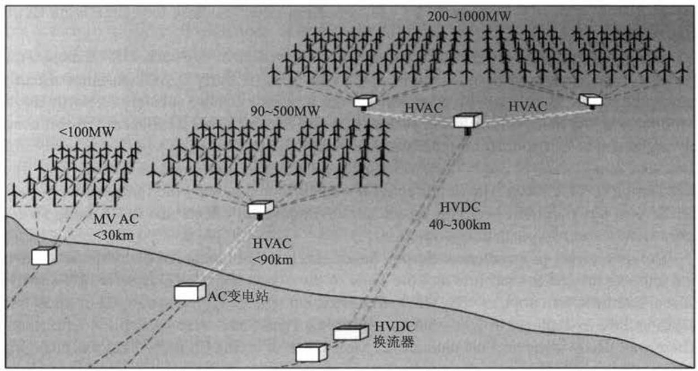

图 11.56 海上风电场传输选项

第 2 轮,海上风电场较大 (可达 ${500}\mathrm{{MW}}$ ),但离岸边小于 ${90}\mathrm{\;{km}}$ 。连接到岸上的可能是交流电，但在海上变电站，需要增加输电电压达到 ${132} \sim  {150}\mathrm{{kV}}$ 。

第 3 轮,目前正在规划中,高达 ${1000}\mathrm{{MW}}$ ,离岸边 ${300}\mathrm{\;{km}}$ 。这些都可能使用交流从风电场采集电力, 然后多个 HVDC 传输链接, 把它传送到岸边。

在所有情况下,一个变压器及其相关的位于每个风力机塔架内的开关装置,可以将发电机的电压约从 ${690}\mathrm{\;V}$ 升到 ${30} \sim  {36}\mathrm{{kV}}$ 。集电阵列电缆通过 $\mathrm{J}$ 管进入海上风力发电机组, J 管与单桩支撑结构的过渡段相连, J 管中的短电缆的温度决定了它的等级。风力机变压器,经常为干树脂浇铸型,其与风力机的 ${30} \sim  {36}\mathrm{{kV}}$ 开关一起位于塔架内。在一些较大的风电机组的风力机变压器位于塔架顶部, 以减少电缆的尺寸、重量和损失。最大的风力发电机组, 也正在考虑增加阵列集电系统的电压至 ${72}\mathrm{{kV}}$ 和发电机/变速设备至 ${3.3}\mathrm{{kV}}$ 或 $6\mathrm{{kV}}$ 。

### 11.8.1 海上风电场传输

为了获得所需的电力传输能力,第 1 轮英国海上风电场使用多个 ${33}\mathrm{{kV}}$ 电缆线路并联，每次传输 30~40MW(600~800Amps)。风电机组阵列串联和三相海底集电电缆延伸到岸边,在岸边进入地下电缆的过渡联合,再进入了第 ${33}/{132}\mathrm{{kV}}$ 的变电站。

图 11.57 显示了一个典型的第 2 轮海上风电场配电系统。径向 ${33}\mathrm{{kV}}$ XLPE ${}^{2)}$ 阵列的电源容量为 ${30} \sim  {40}\mathrm{{MW}}$ 的集合电缆被用来连接到岸上的八个风力发电机组的海上分站。这些电缆的导体直径离开分站后往往逐渐变细。分站被用来连接阵列电缆和变换集电电压从 ${33}\mathrm{{kV}}$ 至 ${132}\mathrm{{kV}}$ 传输到岸上。高达 ${90}\mathrm{{MV}} \cdot  \mathrm{A}$ 容量的变电站通常使用一个海上变压器。较大的海上分站有多个变压器, 以减少个别项目的设备的重量并且当一台变压器停止服务时, 风电场可以继续运行 (小于额定输出)。海上变电站平台上通常有一个的辅助柴油发电机。集电电路中使用三芯 XLPE 电缆, 以减少对环境的影响。

---

1)少数较偏远的第一轮海上风电场(如 Battow)使用了一个海上变电站，但最好是使用多个集电电压的输电电缆避免该成本。

2) XLPE: 交联聚乙烯绝缘电缆。

---

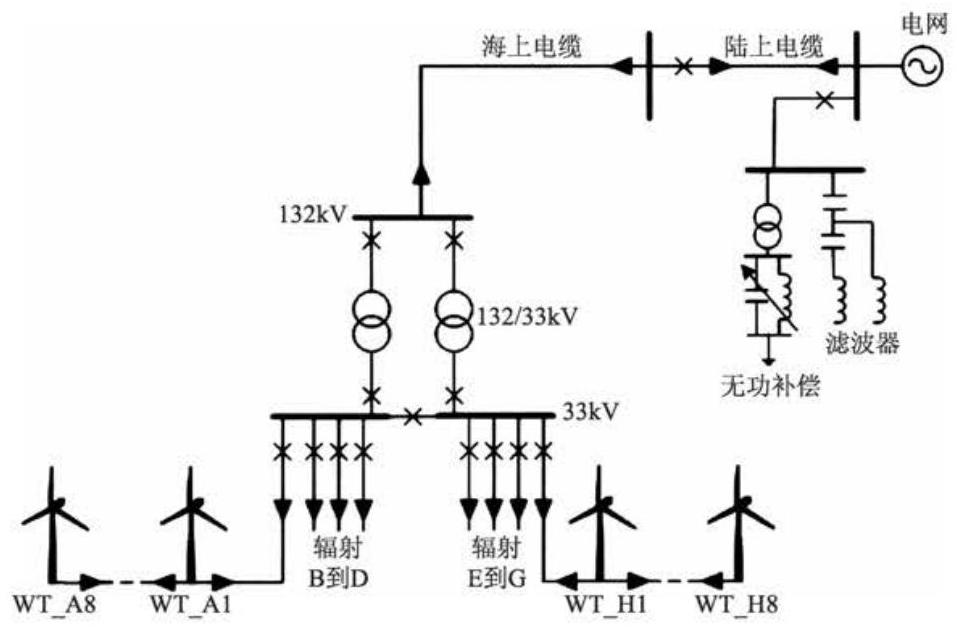

图 11.57 典型的英国第 2 轮海上风电场的电力采集和传输

到岸上的传输电路,也采用三芯 XLPE 电缆,通常在 ${132} \sim  {150}\mathrm{{kV}}$ ,但也可以使用 ${220}\mathrm{{kV}}$ 。海底交流电缆 $\left( {{800}{\mathrm{\;{mm}}}^{2}\text{ 铜 }}\right)$ 的容量在 ${132}\mathrm{{kV}}$ 约 ${200}\mathrm{{MV}} \cdot  \mathrm{A}$ 和在 ${220}\mathrm{{kV}}$ 为 ${330}\mathrm{{MV}} \cdot  \mathrm{A}$ 。在陆地上,过渡接头,用于连接三芯海底电缆到三个单核心的地下电缆。在某些情况下, 在陆地变电站的电缆连接之前, 也有一个架空线部分。陆上分站通常位于距岸边几十公里的地方, 包括无功补偿和谐波滤波器。

在风电机组阵列和重达 ${100}\mathrm{\;{kg}}/\mathrm{m}$ 的 ${220}\mathrm{{kV}}$ 海底高压电缆中进行电力传输时, 需要专业设备来铺设海底电缆。图 11.58 所示是 Lillgrund 风电场的 3 芯, ${400}{\mathrm{\;{mm}}}^{2}$ 铜线， ${130}\mathrm{{kV}}$ ， ${17}\mathrm{{km}}$ 长的海底传输电缆从海上变电站(图 11.59)到陆上。 注意光纤通信电缆的内芯。

第 3 轮海上风电场项目尚未兴建, 但最大的项目 (如 Dogger Bank 风电机组的总容量为 ${9000}\mathrm{{MW}}$ ,电缆线路长度为 ${200}\mathrm{\;{km}}$ ),有可能使用 HVDC 输电。

海上风电场电气系统的设计要求综合电力系统的研究。Lillgrund 项目进行了以下研究(Lillgrund 试点项目，2008):电缆规格、载荷流、短路、谐波、接地、电压波动、可靠性、故障电弧、动态模拟、协调保护、绝缘配合、电磁干扰、防雷击保护。

在陆地上, 电力传输系统为客户提供电能, 其中一些有非常高端负荷, 因此需要一个可靠的电力供应。安装冗余电路, 以确保一个单一的电路故障, 或有时两个独立的故障，不会导致断电。与此相反，海上风电场传输系统的功能是提供风力发电。海上设备成本高，特别是海底电缆，相对中等度的电能价值意思是说，与陆上风电场相比，还没有证明能够提供总冗余的电路。而部分冗余可以提供一个更高机率和高影响故障的部件。例如,两个变压器,每个占风电场容量的 ${50}\%$ 或 ${70}\%$ 的安装容量。在这种情况下, 如果一台变压器的故障只有一小部分的能量削减, 而风电场将仅运行在其年总输出的一小部分。

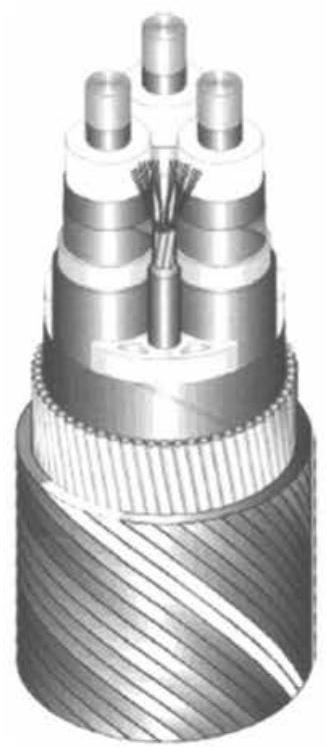

图 11.58 在 Lillgrund 海上风电场的 ${130}\mathrm{{kV}}$ 海底输电电缆。2008 年 Lillgrund 试点项目。Vattenfall 许可转载, 电缆由在瑞典 Karlskrona 的 ABB HVC 公司制造

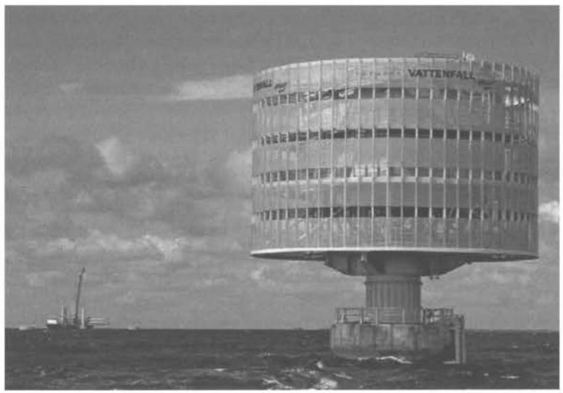

图 11.59 Lillgrund 的海上分站, 2008 年 Lillgrund 的试点项目。Vattenfal 许可转载

成本效益分析，以英国第三轮海上风电场的连接确定最符合成本效益的结构 (Djapic 和 Strbac, 2008)。本研究平衡了海上传输系统成本, 包括海底传输电缆、 海上平台(包括变压器、无功补偿和开关)、陆上线路和整改维护投资成本、对预期因设备故障和维修而发电受限，以及该项目的成本损失超过预期的投资成本。结果表明，与陆上风电场相似，海上风电传输电路设计应没有明确的冗余。海上传输电路设备故障维修需要比在陆上更长的时间(如海上变压器被假定为 6 个月的平均修复时间), 但海上设备的成本太高, 所以变压器或海底电缆没有冗余是有道理的。由于海底电缆有限的等级, 大型海上风电场需要多相交流电缆线路。此外, 风电场将其电力全部输出, 仅年输出量的一小部分用于运行。因此, 虽然传输链路没有冗余容量设计,但其安全性是相当高的。一个拥有 $3 \times  {132}\mathrm{{kV}}$ 海底电缆的 600MW 的海上风电场的计算表明,一根电缆发生故障只会导致在年度风力发电场能量被削减 $8\%$ 。选择传输链路容量略低于分散在广域中的所有的风力发电机组的全功率额定值的简单相加, 这可能更符合成本效益。

高压交流电缆有用的路线长度有限, 这是由于其电容和它们所产生的无功功率。因此,第 3 轮的大型风电场远程使用高压直流输电电缆线路长度超过 60~ 90km，这使它变得更具成本效益(精确的盈亏平衡点时，高压直流输电变得比交流输电更具成本效益, 这取决于风电场等级和商业因素影响设备的价格)。

### 11.8.2 海底交流电缆系统

大型海上风电场，有非常广泛的电力采集和传输到岸上的海底交流电缆。30~ ${36}\mathrm{{kV}}$ 的电力采集电路,以及 ${132} \sim  {150}\mathrm{{kV}}$ 输电电缆到岸上的线很长,而且没有任何特别的重要的负载连接到他们。陆上的公共电力供应系统中都没有发现类似的电缆系统。中国和美国的部分陆上风电场的电气系统, 为了降低成本要从风电场地下电缆变为架空线是可行的。

高电压海底电缆使用高介电值的固体 XLDE 绝缘。它们比使用空气的绝缘架空线有更高的分流 (并联) 电容。因此, 海上风电场的电缆线路是独一无二的, 需要特别考虑。

在 ${50}/{60}\mathrm{\;{Hz}}$ ,高电压的高并联电容产生无功功率 (VAR) 降低了电路的传输有功功率的能力, 也增加了网络的电压。电缆空载时无功发电由下式给出:

$$
Q = {2\pi flC}{V}^{2}
$$

其中, $f$ 是系统频率; $V$ 是额定电压; $l$ 是电缆长度; $C$ 是单位长度电缆的电容。

图 11.60 显示了 $1\mathrm{\;{km}}$ 长的 ${132}\mathrm{{kV}}$ 电缆的每相近似等效电路。没有电能传输时, 它会产生约 1MVAr。这种无功功率增加了风电场的电压, 也使用电缆额定值的一部分。无功补偿设备的控制电压上升, 通常是一个固定的海上平台上并联电抗器和岸上变电站的 STATCOM 或 SVC。

除了在基频 $\left( {{50}\mathrm{\;{Hz}}\text{ 或 }{60}\mathrm{\;{Hz}}}\right)$ 产生无功功率,大型电缆网络的并联电容对谐波频率也有重要影响。

图 11.61 显示了图 11.62 中的在谐波频率, 132kV 母线网络, 计算得到的阻抗。电缆和变压器的电缆电容和感抗的相互作用产生很多的串联和并联的共振。 这些共振表现为低阻抗共振(串联共振)和高阻抗共振(并联共振)。谐波共振频率的不同频率和幅度取决于电缆和使用的风力机数量(King and Ekanayake, 2010)。

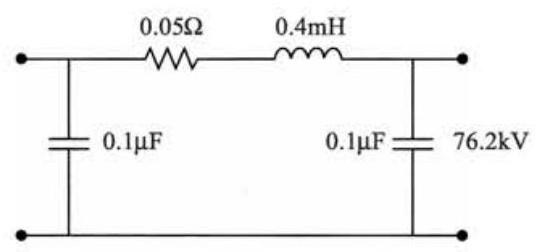

图 11.60 $1\mathrm{\;{km}}$ 长 ${132}\mathrm{{kV}}$ 电缆的每相近似等效电路

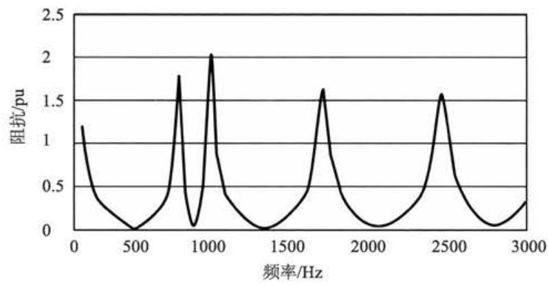

图 11.61 图 11.60 中得到的 ${132}\mathrm{\;{kV}}$ 母线网络的阻抗

所有陆基电力系统电压都含有谐波, 这是由非线性载荷电流引起的。因此谐波过滤器可能需要在陆上变电站, 以确保风电场的网络内的谐波共振不被之前就存在的失真激励。此外, 变速风电机组使用电力电子变换器和电力电子无功补偿设备, 如静止同步补偿器 (STATCOMS), 以及将谐波电流注入电缆网络。如果这些谐波被放大, 它们可能会在海上网络导致有效电压应力, 也可能在电力电子控制系统产生复杂的相互作用，造成不可预知的设备故障。

一般海上风电场电网的瞬态过电压是由电路断路器引起的, 不像陆上风电场的架空线系统中的瞬态高电压的主要原因是雷击 (Lars Liljstrand, 2007)。由于其高可靠性和低维护要求，真空断路器经常被用来控制在海上风电场的 MV 网络。 在某些情况下, 真空断路器可以提供多个预先停机和重新启动, 因此产生高频的瞬态电流。结合大量的升压变压器的海上风电场的广泛的电缆系统, 导致许多电压反射。激增电缆阻抗小于 ${40\Omega }$ ,而架空线,通常是 ${300} \sim  {400\Omega }$ ,和较低的激增阻抗一起导致更高的瞬态过电压的上升速率。因此, 海上风电场广泛的电缆系统, 可导致高瞬态过电压和断路器的苛刻要求。这也可能是必要的，以配合避雷器保护风力发电机组变压器免受开关过电压的影响。

图 11.63 显示了一个海上风电场的采集电缆模拟电压为 ${33}\mathrm{{kV}}$ ,它是由真空断路器通电。

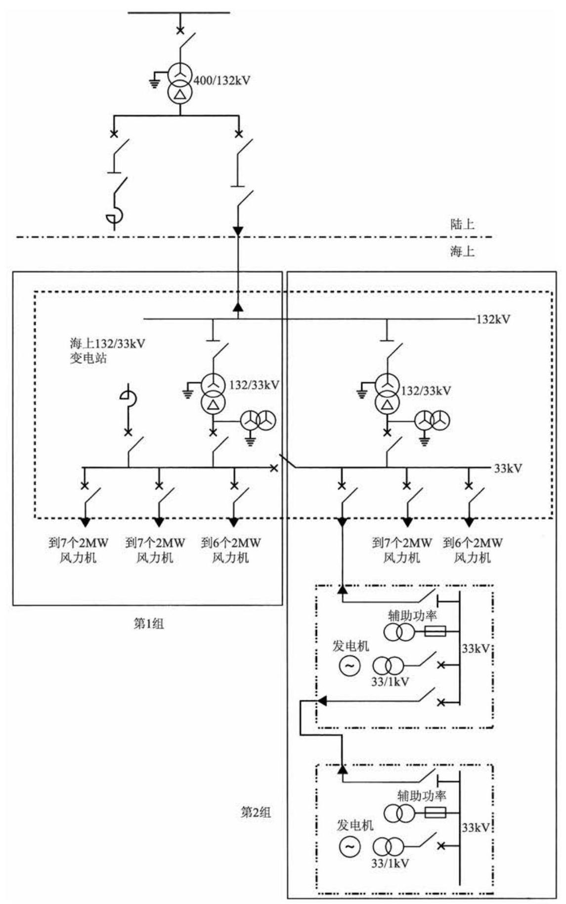

图 11.62 典型的海上风电场交流连接

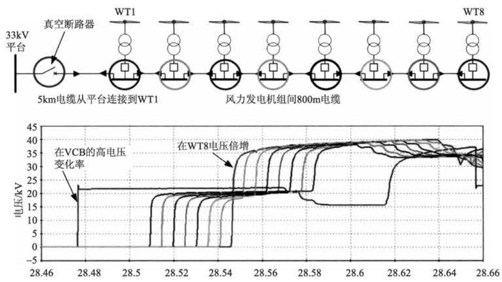

图 11.63 在通电期间电压通过风力发电机组电量采集径向电路的电压传递。转载自 R. King

更持久的暂时过电压，可能会发生，如果在陆上连接点的主断路器从风电场传输网络的其余部分断开，使运行的风电场和高压电缆孤立(Akhmatov，2006; Wiec-howski, 2008)。根据风电机组的保护系统，它们可能会继续输入有功电流到孤立的网络, 使其电容充电。一旦风力机断开, 在长的交流电缆电容和并联电抗器的电感储存的能量产生低频振荡, 导致高过电压持续几秒钟。如果这种情况有可能发生的话，过电压保护能够从电缆/反应器系统吸收能量，这可能是必需的。

目前, 虽然运行中的大型海上风电场相对较少, 但已报道的变压器故障率很高。在大量的故障后, 两个海上风电场的风力机变压器被取代了, 在另一个海上风电场,主要海上变压器故障导致整个风电场四个半月停运。这些故障的原因是复杂的, 非常广泛的电缆系统的瞬态性能仍是研究课题。但主要可能是高频率、高电压开关瞬态导致这些绝缘故障。因此, 适当地协调浪涌保护装置和电力设备的绝缘强度, 对于保护海上电力系统过电压是必不可少的[电气和电子工程师学会, 电力及能源学会，风电场收集系统设计工作组(2009)。

### 11.8.3 HVDC 传输

HVDC 传输电缆线路长度超过 50km，成为一种可行的选项(Kock and Retz-mann,2010)。约 ${100}\mathrm{\;{km}}$ 以上的 HVDC 是唯一的选择,因为 HVAC 输电传输产生的无功功率的高水平使其有长度限制。对于规模约 200MW 以上的风电场, HVDC 输电往往有最低数量的电缆连接到岸上风电场。

有两种截然不同的 HVDC 输电技术, 线路换向电流源换流器 (CSC) 和自换相电压源换流器 (VSC), 如表 11.9 所示。CSC 技术是根据线路换向装置, 如晶闸管由脉冲接通, 关闭时, 电流流经它们降低到零。转换器有一个连接到一个强大的交流系统的要求，因为交流系统电压，迫使电流整流从一个阶段到另一个。电流必须总是以相同的方向流动通过晶闸管, 这意味着，为了改变功率流的方向，转换器的电压极性必须扭转。

表 11.9 HVDC CSC 和 HVDC VSC 之间的比较

<table><tr><td>HVDC CSC</td><td>HVDC VSC</td></tr><tr><td>线换向电流源转换器(LCC/CSC)</td><td>自换相电压源换流器(SCC/VSC)</td></tr><tr><td>只有导通功能(晶闸管)</td><td>具有导通和断开功能的半导体开关 (IGBTs)</td></tr><tr><td>低开关频率 $\left( {{50}/{60}\mathrm{\;{Hz}}}\right)$</td><td>高开关频率 $\left( { \sim  {1000}\mathrm{\;{Hz}}}\right)$</td></tr><tr><td>低损耗(全功率每个终端~0.8%)</td><td>高损耗(全功率每个终端~1.8%)</td></tr><tr><td>转换器内换相由交流电压驱动 (至少需要短路电源)。如果 LCC 用于海上，需要为 STATCOM 提供参考交流电压</td><td>不要求整流系统电压</td></tr><tr><td>由于滤波器,需要大的空间(限制谐波和提供无功功率控制)</td><td>空间要求低</td></tr><tr><td>转换器吸收无功功率</td><td>有功和无功功率独立控制</td></tr><tr><td>自 1954 年以来投入使用</td><td>自 1997 年以来投入使用</td></tr><tr><td>装机容量 $> {70}\mathrm{{GW}}$</td><td>装机容量~1 GW</td></tr><tr><td>最高电压: $\pm  {800}\mathrm{{kV}}\mathrm{{DC}}$</td><td>最高电压: $\pm  {400}\mathrm{{kV}}$ DC</td></tr><tr><td>最大的计划: 6400 MW(架空线)</td><td>最大的计划: ${400}\mathrm{{MVA}}$ (电缆)</td></tr></table>

HVDC VSC 使用半导体开关, 可以打开和关闭的控制方式, 即 HVDC VSC 在没有本地发电时也能够工作，并可以控制交流系统的电压和频率。目前大多数 HVDC VSC 转换器工作时在两个或三个电压电平之间切换, 以建立转换器的交流端电压。然而, 为了降低开关损耗, HVDC VSC 的模块化多电平转换器 (MMC) 的设计现在已经市售。

虽然传统的 CSC HVDC 已经发展得较好了, 但与具有较低的资本成本和损失的 VSC 技术相比, 它还是具有明显的谐波滤波器的痕迹。VSC 技术中的有功和无功功率控制提供了更大的灵活性，可用于变速风力发电机组(见图 11.64)。目前， VSC 只用于海上风电场 HVDC 连接。

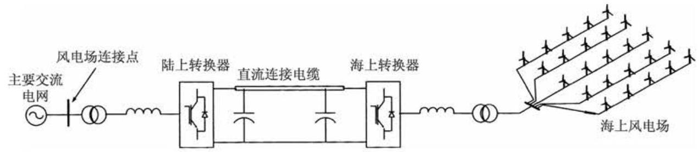

图 11.64 海上风电场的 VSC HVDC 传输

## 11.9 运行和进入

进入海上风电场, 维持风力发电机组的高可靠性比陆上风电场更加困难和昂贵。在许多陆上风电场，在施工期间利用大型起重机进行安装，以确保项目周期。 即使这些在施工后，人员使用轻型车辆直接进入塔基础后要拆除，并且如果这是必要的话，大型起重机可以重新将进入通道恢复。相比之下，建设海上风电场需要使用专门的船只，一旦安装完成后，进入和重新建设可能都是困难和昂贵的。海上风电机组在机舱内通常包含一个轻型的起重机, 可能还包括一个用于更大的内部起重机安装的传送链。不用起重船, 齿轮箱或发电机也可以更换。更换损坏的叶片可能需要起重船(Amec Energy, 2004)。

需要对每个风电机组进行日常维护、故障诊断及维修, 这可能每年需要 10 ~ 20 人。除了故障维修，将进行 6 个月和 12 个月的风力机检修和各种设备及安全要求的检查。海上风力发电机组工作最少需要一组三人的队伍。Twiddell 和 Gaud-iosi(2009) 估计进入海上风电场的总人数到 2010 年为每年 20 万人。Horns Rev 风电场的早期经验证实了频繁的人员进入的需要，在 North Hoyle 风电场(DTI， 2006a) 在建设和运行的前两年，在船和塔架之间工作的有 10000 人，风电机组这种频繁的人员进入显然需要安全和可靠的进入方式。

曾经尝试过许多进入技术。在 Horns Rev 经常使用直升机，不需要着陆，但到机舱顶部维修人员数减少了。更常见的, 使用梯子和船护舷系统, 通过船压住风电机组的基座上附带的钢管挡泥板, 技术人员通过梯子上和下。从船上到风电机组, 包括动态控制平台的许多其他方法正在研究。在一些风电场使用双体船, 尽管它们比单壳船价格昂贵，但它们更稳定和有更大的甲板空间。

英国的经验表明，当有效波高达 ${1.5}\mathrm{\;m}$ 时，使用梯子和船护舷系统进出是可能的，这要据风和海况而定。这样，允许进入的风力机今年为50%~80%(EWEA， 2009)。随着经验的积累和使用不同的进入安排，在 Scroby Sands(DTI，2006b)对风电场不能进入的天数从运作的第一年的 143 天(一年的 39%)下降到第二年的 76(21%)。不过，在高风速的冬季进入期间，因为风和海况的影响，限制了发电量， 所以有许多风电场正在继续努力提高进入量多达一年的 90% ，例如，通过使用双体船和动态控制传输平台来提高进入系统。较高的进入率可能是昂贵的，因此，也有不断的努力，通过使用 SCADA(监控和可靠性数据采集)和远程状态监测以提高风电机组的进入率 (见 11.4 节)。评估海上风电场的维护策略的一些仿真模型已开发出来了，这些仿真模型用概率表述天气、发电机组的进入，以及组件故障及维修时间。

表 11.10 显示了两个早期的英国海上风电场在运行的最初两年的表现。这两个风电场从英国政府获得资助，并记录了风电场的初期运行，以及进行环境监测方案(DTI,2006a 和 2006b)。

表 11.10 早期 North Hoyle 和 Scroby Sands 海上风电场的运行情况

<table><tr><td></td><td>North Hoyle</td><td>Scroby Sands</td></tr><tr><td>投资成本</td><td>1.35 英镑/(m/MW)</td><td>1.26 英镑/(m/MW)</td></tr><tr><td>第 1 年</td><td>2004.7~2005.6</td><td>2005.1~2005.12</td></tr><tr><td>可靠性</td><td>84%</td><td>84%</td></tr><tr><td>发电量</td><td>188GW·h</td><td>153GW·h</td></tr><tr><td>容积因子</td><td>36%</td><td>29%</td></tr><tr><td>第 2 年</td><td>2005.7~2006.6</td><td>2006.1~2006.12</td></tr><tr><td>可靠性</td><td>91%</td><td>75%</td></tr><tr><td>发电量</td><td>197GW·h</td><td>129GW·h</td></tr><tr><td>容积因子</td><td>34%</td><td>25%</td></tr></table>

每 30 个风电机组的风电场靠近岸边, 人员出入通过梯子和船护舷系统。当时典型的海上风电场的成本相当低。随后的海上风电场的成本大幅上升 (Gross 等, 2010)。

这两个风电场都采用单桩地基。在 North Hoyle 安装驱动器钻技术利用单桩驱动通过上部砂和黏土层和然后钻到下面岩石。Scroby Sands 海床为砂质条件, 并不需要任何钻孔。在这两个风电场, 桩、塔和机舱安装了通过使用双腿的自升式船延伸到海底, 以提供一个稳定的平台。机舱中安装两个叶片连接, 一旦机舱到达位置后, 会安装第三叶片连接到轮毂。在 Scroby Sands，塔和风力机装配约需 12 小时,两个风力机安装每一个需要 $3 \sim  4$ 天。

这两个风电场的可用性低于计划水平。计划为期三天的电网停电时, North Hoyle 和 Scroby Sands 的一次海陆电缆接头故障导致 12 周的 ${33}\mathrm{{kV}}$ 电路断电。 North Hoyle 发电机和齿轮箱的轴承的替换需要原位替换, 而在 Scroby Sands, 所有的发电机轴承都要更换, 而齿轮箱轴承则部分需要更换。Scroby Sands, 安装额外的远程监控，以提高可用性。

在保修期内,运营商运行和维护的项目成本是 10~13 英镑/(MW · h)，因为这是有关可用性和不定期的维护的费用(估计三之一的运行费用)，所以由制造商承担。这和 Opti-EWECs 项目 (van Bussel 等, 2010) 的计算结果相符。海上风电场的运行和维护费用是电能均化成本的 25%。

## 参考文献

Aage, C., Allan, T.D., Carter, D.J.T., Lindgren, G. and Olagnon, M. (1998) Oceans from Space: A Textbook for Offshore Engineers and Naval Architects. Ifremer Repéres Océans, France.

Ackerman, T. (ed.) (2005) Wind Power in Power Systems. John Wiley & Sons, Ltd, Chichester.

Akhmatov, V. (2006) Excessive overvoltage in long cables of large offshore wind farms, Wind Engineering, 30(5), 375-383.

Amec Energy (2004) Blythe harbour wind farm - operational aspects, DTI report W35/00563/00/00. http://www.berr.gov.uk/files/file20295.pdf, accessed July 2010.

Assessment of the Lillgrund Windfarm, Power Performance, Wake Effects, Lillgrund Pilot Project September 2009. http://www.vattenfall.se/sv/search.htm, accessed Sept 2010.

Barltrop, N.D.P. Mitchell, G.M. and Atkins, J.B. (1990) "Fluid Loading on Fixed Offshore Structures" (Offshore Technology Report OTH90322), HMSO.

Barltrop, N.D.P. and Adams, A.J. (1991) Dynamics of Fixed Marine Structures. Butterworth-Heinemann, London.

Barthelmie, R.J. (1993) Prospects for Offshore Wind Energy: The State of the Art and Future Opportunities. Offshore Wind Climate and Wind Energy Applications. BWEA/DTI Seminar on Offshore Wind Energy, Harwell, UK.

Barthelmie, R.J. et al. (2009) Modelling and measuring flow and wind turbine wakes in large wind farms offshore, Wind Energy, 12, 431-444.

Barthelmie, R., Hansen, O., Enevoldsen, K., Højstrup, J., Larsen, S., Frandsen, S., Pryor, S., Motta, M. and Sanderhoff, P. (2005) Ten years of meteorological measurements for offshore wind farms, Journal of Solar Energy Engineering, 127(2), 170-176.

Barthelmie, R.J., Frandsen, S.T., Nielsen, N.M., Pyror, S.C., Rethore, P.E. and Jørgensen, H.E. (2007) Modelling and measurements of power losses and turbulence intensity in wind turbine wakes at Middelgrunden offshore wind farm, Wind Energy, 10, 217-228.

Barthelmie, R.J. and Jensen, L.E. (2010) Evaluation of power losses due to wind turbine wakes at the Nysted offshore wind farm, Wind Energy, DOI: 10.1002/we.408.

Barthelmie, R.J., Pryor, S.C., Frandsen, S.T., Hansen, K., Schepers, J.G., Rados, K., Schlez, W., Neubert, A., Jensen, L.E. and Neckelmann, S. (2010) Quantifying the impact of wind turbine wakes on power output at offshore wind farms, Journal of Atmospheric and Oceanic Technology, 27, 1302-1317.

Barthelmie, R.J. et al. (2009) In: Offshore Wind Power (Twidell and Gaudiosi). Earthscan, London.

Battjes, J.A. and Groenendijk, H.W. (2000) Wave height distributions on shallow foreshores, Journal of Coastal Engineering, 40, 161-182.

Bierbooms, W.A.A.M. (2006) Constrained stochastic simulation - generation of time series around some specific event in a normal process, Extremes, 8, 207-224.

den Boom, J.H. et al. (2004) Scour behaviour and scour protection for monopile foundations of offshore wind turbines. EWEC.

Bossanyi et al. (1980) The efficiency of wind turbine clusters, 3rd International Symposium on wind energy systems, August 26-29 1980, Lyngby, Denmark (BHRA).

BWEA (2002) Best practice guidelines: consultation for offshore wind energy developments. http://www.bwea.com/pdf/bwea-bpg-offshore.pdf accessed July 2010.

CEFAS (2004) Offshore wind farms: Guidance note for environmental impact assessment in respect of FEPA and CPA requirements, 2004 http://www.cefas.co.uk/publications/files/windfarm-guidance.pdf, accessed July 2010.

Coelingh et al. (1996) Analysis of wind speed observations over the North Sea, Journal of Wind Engineering and Industrial Aerodynamics, 61, 51-69.

Cleve, J., Grenier, M., Enevoldsen, P., Birkemose, B. and Jensen, L. (2009) Model-based analysis of wake-flow data in the Nysted offshore wind farm, Wind Energy DOI: 10.1002/we.314.

Crabtree, C.J. (2010) Survey of commercially available condition monitoring systems for wind turbines' Supergen wind energy technologies, Consortium/Durham University.

Dahlberg, J. Á. and Thor, S.E. (2009) Power performance and wake effects in the closely spaced Lillgrund offshore wind farm, European Offshore Conference, Stockholm, p. 1.

Dean, R.G. and Dalrymple, R.A. (1984) Water Wave Mechanics for Engineers and Scientists. World Scientific.

DECC (2008) Dynamics of scour pits and scour protection - synthesis report and recommendations, http://www.decc.gov.uk/assets/decc/what%20we%20do/uk%20energy%20supply/energy%20mix/ renewable%20energy/policy/offshore/rag/complete/file50448.pdf accessed July 2010.

DECC (2009) Draft national policy statement for renewable energy infrastructure (EN-3) http://data.energynpsconsultation.decc.gov.uk/documents/npss/EN-3.pdf, accessed July 2010.

DECC (2010) UK electricity generation costs update, Report by Mott McDonald (http://www.decc.gov.uk/assets/decc/Statistics/Projections/71-uk-electricity-generation-costs-update-.pdf).

Djapic, P. and Strbac, G. (2008) Cost benefit methodology for optimal design of offshore transmission systems. Centre for Distributed Generation and Sustainable Electrical Energy, http://www.sedg.ac.uk/.

DNV-OS-J101 (2007) Offshore Standard Design of offshore wind turbine structures. Det Norske Veritas.

DONG Energy et al. (2006) Danish Offshore Wind - key environmental issues http://www.windaction.org/documents/6690, accessed July 2010.

Drewitt, A.L. and Langston, R.H.W. (2006) Assessing the impact of wind farms on birds, Ibis, 148, 29-42.

DTI (2005) Guidance on the assessment of the impact of offshore wind farms, seascape and visual impact report http://www.berr.gov.uk/files/file22852.pdf, accessed July 2010.

DTI (2006a) Capital grants scheme for North Hoyle offshore wind farm, http://www.berr.gov.uk/files/file41542.pdf, accessed July 2010.

DTI (2006b) Capital grants scheme for Scroby Sands offshore wind farm, http://www.berr.gov.uk/files/file41543.pdf, accessed July 2010.

97/11/EC (1997) The Environmental Impact Assessment Directive http://ec.europa.eu/ environment/eia/full-legal-text/9711.htm, accessed July 2010.

EN 1993-1-9 (2005) European Standard 'Eurocode 3: Design of Steel Structures - Part 1-9: Fatigue',

European Wind Energy Association (2009) Wind Energy - The Facts. European Wind Energy Association, http://windfacts.eu.

Evans, B. (2004) Lumping of Fatigue Load Cases. RECOFF Document No. 16a.

Frandsen S., Barthelmie, R.J., Jorgensen, H.E., Rathmann, O., Badger, J., Hansen, K., Ott, S., Rethore, P., Larsen, S.E. and Jensen, L. (2009) The making of a second-generation wind farm efficiency model-complex, Wind Energy, 12, 431-444.

Germanischer Lloyd (2005) Guideline for the certification of offshore wind turbines.

Goda, Y. et al. (1966) Study on impulsive breaking wave forces on piles, Port and Harbour Technical Research Institute 6(5), 1-30 (in Japanese).

Gong et al. (1997) Modelling sea-salt aerosols in the atmosphere, Journal of Geophysical Research, 102, D3, 3805-3818.

Gross, R., Greenacre, P. and Heptonstall, P. (2010) Great Expectations: The Cost of Offshore Wind in UK Waters, Understanding the Past and Projecting the Future. UK Energy Research Centre, London.

Hancock, J.W. and Gall, D.S. (1985) Fatigue under narrow and broad band stationary loading. Final Report of the Cohesive Programme of RandD into Fatigue of Offshore Structures. Marine Technology Directorate Ltd, UK.

Hansen, K. et al. (2010) Power deficits due to wind turbine wakes at Horns Rev wind farm, TORQUE 2010: The Science of making torque from wind, June 28-30, Crete, Greece.

Hau, E. (2006) Wind Turbine Fundamentals Technologies, Applications and Economics. Springer, London.

Hendriks, H.B. (2008) Upwind Project: Upscaling. Presentation at EWEC 2008: http://www.ewec2008proceedings.info/ewec2008/allfiles/588_EWEC2008presentation.ppt.

Howard, M. and Brown, C. (2004) Results of the electromagnetic investigations and assessment of marine radar, communications and positioning systems undertaken at the North Hoyle wind farms by Qinetiq and Maritime and Coasguard Agency. http://www.mcga.gov.uk/c4mca/ effects_of_offshore_wind_farms_on_marine_systems-2.pdf, accessed July 2010.

IEEE PES Wind Plant Collector System Design Working Group (2009) Wind power plant grounding, overvoltage protection, and insulation coordination, IEEE Power and Energy Society General Meeting, Calgary.

IEC 61400-3 (2009) International Standard 'Wind Turbines - Part 3: Design requirements for offshore wind turbines'. International Electrotechnical Commission.

ISO 19902 (2007) International Standard 'Petroleum and natural gas industries - Fixed steel offshore structures'.

ISET (2006) Advanced maintenance and repair for offshore wind farms using fault prediction and condition monitoring techniques. Offshore M&R Final Report.

King, R. and Ekanayake, J.B., Harmonic modelling of offshore wind farms, IEEE PES Meeting July 2010.

Koch, H. and Retzmann, D. (2010) Connecting large offshore wind farms to the transmission network, Transmission and Distribution Conference and Exposition, 2010 IEEE PES, pp. 1-5, 19-22.

Kuhn, M.J. (2001) Dynamics and design optimisation of offshore wind energy conversion systems. DUWIND, Delft University.

Lars Liljestrand, A.S. (2007) Transients in collection grids of large offshore wind parks. Wind Energy, 11(1), 45-61.

Lillgrund Pilot Project September 2008 Technical Description Lillgrund Wind Power Plant. www.vattenfall.se/lillgrund.

MacCamy, R.C. and Fuchs, R.A. (1954) Wave forces in piles: A diffraction theory. Technical Memorandum No. 69, Beach Erosion Board, US Navy Corps of Engineers.

Milne-Thomson, L.M. (1967) Theoretical Hydrodynamics, fifth edition. Macmillan, Basingstoke.

Mortensen et al (1993): Wind Atlas Analysis and Application Program (WAsP), User's guide, Risø-I- 666-(EN)(v.2), N G Mortensen, L Landberg, I Troen and E L Petersen, Risø National Laboratory, Roskilde, Denmark, 1993.

Muir Wood, A.M. and Fleming, C.A. (1981) Coastal Hydraulics, second edition. Macmillan, Basingstoke.

Norwind (2010) Lessons learned from the first German Offshore Wind Farm -Alpha Ven-tus, by Ivan Østvik, SPE Conference Bergen, 14 April 2010. bergen.spe.no/publish_files/ ODS2010_PG_Oestvik.pdf.

NREL (2006) Wind turbine design cost and scaling model. Technical Report NREL/TP-500-40566 by Fingersh, L., Hand, M. and Laxson, A.

Phillips et al. (2008) Methods for assessing the spatial variation of offshore wind resource: The role of Mesoscale Modelling and Earth Observation data. In: Proceedings of the Global Wind Power Conference, Beijing, 2008 (eds. J L Phillips, D P Bacon, M R F Taylor, E Stavroulia, C A Morgan).

Peire, K., Nonneman, H. and Bosschen, E. (2009) Gravity Base foundations for the Thornton Bank offshore wind farm. Terra et Aqua, No. 115, June 2009.

Rainey and Camp (2007) Constrained non-linear waves for offshore wind turbine design. The Science of making torque from wind: Journal of Physics Conference Series Vol. 75, 012067.

Schlez, W. and Neubert, A. (2009) New developments in large wind farm modelling. In: European Wind Energy Conference, Marseilles, p. 8.

Seidel, M. (2007a) Jacket substructures for the REpower 5M wind turbine. Conference Proceedings European Offshore Wind 2007, Berlin.

Seidel, M. (2007b) Tragstruktur und Installation der REpower 5M in 45 m Wassertiefe, Stahlbau 76, Heft 9.

Sørensen, T., Nielsen, P. and Thøgersen, M.T. (2006) Recalibrating wind turbine wake model parameters - validating the wake model performance for large offshore wind farms. European Wind Energy Conference and Exhibition, p. 6.

Spinato, F. (2009) Reliability of wind turbine subassemblies, IET Renewable Power Generation, 3(4), 387-401.

Sumer, B.M. and Fredsoe, J. (2001) Scour around pile in combined waves and current, Journal of Hydraulic Engineering, 127(5), 403-411.

Tarp-Johansen, N.J. (2004) Partial safety factors and characteristic values for combined extreme wind and wave load effects, RECOFF Document No. 71.

Tarp-Johansen, N.J. et al. (2009) Comparing sources of damping of cross-wind motion, EWEC.

Tromans, P., Anaturk, A. and Hagermeijer, P. (1991) A new model for the kinematics of large ocean waves - application as a design wave. Proceedings of the first International Offshore and Polar Engineering Conference, Edinburgh.

Twidell, J. and Gaudiosi, G. (eds) (2009) Offshore Wind Power. Earthscan, London.

van Bussel et al. (2009) State of the art and technology trends for offshore wind energy: operation and maintenance issues, http://www.offshorewindenergy.org/ca-owee/indexpages/ downloads/Brussels01_OandM.pdf, accessed July 2010.

Van der Tempel, J. (2006) Design of support structures for offshore wind turbines. PhD thesis, Delft University of Technology.

de Vries, W.E. and Krolis, V.D. (2007) Effects of deep water on monopile support structures for offshore wind turbines. EWEC.

Wagner, H. (1932) Über Stoß- und Gleitvorgänge an der Oberfläche von Flüssigkeiten, Zeitschrift für angewandte Mathematik und Mechanic, 12(4), 193-215 (in German).

Wehausen, J.V. and Laitone, E.V. (1960) Surface Waves. Encyclopedia of Physics, Vol IX, Springer-Verlag. Available on-line at the University of California website, www.coe.berkeley.edu .

Wheeler, J.D. (1970) Method of calculating forces produced by irregular waves, Journal of Petroleum Technology, 22, 359-367.

Wiechowski, P.B. (2008) Selected studies on offshore wind farm cable connections - challenges and experience of the Danish TSO. Power and Energy Society General Meeting - Conversion and Delivery of Electrical Energy in the 21st Century, pp. 1-8. Pittsburgh, PA: IEEE.

Wienke, J. (2001) Druckschlagbelastung auf schlanke zylindrische bauwerkr durch brechende Wellen - theoretische unde großmaßstäbliche Laboruntersuchungen. PhD thesis, Braunschweig Technological University, www.biblio.tu-bs.de (in German).

Wienke, J. and Oumeraci, H. (2005) Breaking wave impact force on a vertical and inclined slender pile - theoretical and large-scale model investigations, Journal of Coastal Engineering, 52, 435- 462.

Wiggelinkhuizen et al. (2007) Condition monitoring for offshore wind farms. Conmow Final Report ECN-E-07-044.

Wilkinson et al. (2010) Methodology and results of the Reliawind reliability field study, EWEC.

## 附录 D

附表 D. 1 Offshore wind farms from 1991-2010

<table><tr><td>年份</td><td>风电场容量 /MW</td><td>位置</td><td>海上派出所</td><td>距离岸边 /km</td><td>水深</td><td>评级的风力发电机组/MW</td><td>基础</td><td>参考文献</td></tr><tr><td>1991</td><td>5</td><td>Vindeby, DK</td><td>N</td><td>1.5 to 3</td><td>2~4m</td><td>0.45 (11 × Siemens Gravity 1 Bonus)</td><td>Gravity</td><td>1</td></tr><tr><td>1994</td><td>2</td><td>Lely, NL</td><td>N</td><td>0.8</td><td>3~4m</td><td>0.5(4×Nedwind)</td><td>Monopile</td><td>2</td></tr><tr><td>1995</td><td>5</td><td>Tung Knob, DK</td><td>N</td><td>3</td><td>4~7m</td><td>0.5 (10×Vestas)</td><td>Gravity</td><td>2</td></tr><tr><td>1996</td><td>16.8</td><td>Irene Vonink, NL</td><td>N</td><td>0.8</td><td>2~3m</td><td>0.6(28×Nordtank)</td><td>Monopile</td><td>3</td></tr><tr><td>1998</td><td>2.8</td><td>Bockstigen, SE</td><td>N</td><td>4</td><td>5~6m</td><td>0.5 (5×WindWorld)</td><td>Monopile</td><td>2</td></tr><tr><td>2000</td><td>4</td><td>Blyth, UK</td><td>N</td><td>1.6</td><td>5m</td><td>2(2×Vestas)</td><td>Monopile</td><td>4</td></tr><tr><td rowspan="2">2001</td><td>40</td><td>Middelgrunden, DK</td><td>$\mathbf{N}$</td><td>2</td><td>3~6m</td><td>2 ( ${20} \times$ Siemens Bonus)</td><td>Gravity</td><td>5</td></tr><tr><td>10.5</td><td>Utgrunden, SE</td><td>N</td><td>7</td><td>6~15m</td><td>1.5(7×GE)</td><td>Monopile</td><td>2</td></tr><tr><td rowspan="2">2002</td><td>160</td><td>Horns RevI, DK</td><td>Y</td><td>14~20</td><td>6~14m</td><td>2(80×Vestas)</td><td>Monopile</td><td>6</td></tr><tr><td>10</td><td>Yttre Stengrund, SE</td><td>N</td><td>5</td><td>6~8m</td><td>2 (5×NEG Micon) Monopile 2</td><td></td><td></td></tr><tr><td rowspan="5">2003</td><td>10.6</td><td>Frederikshavn, DK</td><td>N</td><td>3.2</td><td>1~4m</td><td>4 turbines 2.3 to 3 MW(Nordex, Vestas, bucket Bonus)</td><td>Monopile, bucket</td><td>7</td></tr><tr><td>60</td><td>North Hoyle, UK</td><td>N</td><td>6.5~8</td><td>5~12m</td><td>2 (30×Vestas)</td><td>Monopile</td><td>8</td></tr><tr><td>166</td><td>Rodsand1, Nysted, DK</td><td>Y</td><td>10</td><td>6~9m</td><td>2. 3 (72×Siemens Bonus)</td><td>Gravity</td><td>9</td></tr><tr><td>23</td><td>Samsø, DK</td><td>N</td><td>4</td><td>10~13m</td><td>2. 3 (10 × Siemens Bonus)</td><td>Monopile</td><td>2</td></tr><tr><td>17</td><td>Rønland, DK</td><td>N</td><td>0.1</td><td>0~2m</td><td>2 to 2.3(4×2MW and 4×2.3MW)</td><td>Monopile</td><td>7</td></tr><tr><td rowspan="3">2004</td><td>25</td><td>Arklow Bank, IE</td><td>N</td><td>10</td><td>1~5m</td><td>3.6 $\left( {7 \times  \mathrm{{GE}}}\right)$</td><td>Monopile</td><td>10</td></tr><tr><td>60</td><td>Scroby Sands, UK</td><td>N</td><td>2.5</td><td>0~8m</td><td>2(30×Vestds)</td><td>Monopile</td><td>11</td></tr><tr><td>1.2</td><td>Setana, JP</td><td>N</td><td>0.7</td><td>10m</td><td>0.66(2×Vestas)</td><td></td><td>2</td></tr><tr><td>2005</td><td>90</td><td>Kentish Flats, UK</td><td>N</td><td>9~10</td><td>3~5m</td><td>3(30×Vestas)</td><td>Monopile</td><td>12</td></tr><tr><td>2006</td><td>90</td><td>Barrow, UK</td><td>Y</td><td>7</td><td>12~16m</td><td>3(30×Vestas)</td><td>Monopile</td><td>13</td></tr></table>

续附表 D. 1

<table><tr><td>年份</td><td>风电场容量 /MW</td><td>位置</td><td>海上派出所</td><td>距离岸边 /km</td><td>水深</td><td>评级的风力发电机组/MW</td><td>基础</td><td>参考文献</td></tr><tr><td>2006</td><td>108</td><td>Egmond aan Zee, NL</td><td>N</td><td>10~18</td><td>15~18m</td><td>3(36×Vestas)</td><td>Monopile</td><td>14</td></tr><tr><td rowspan="3">2007</td><td>10</td><td>Beatrice, UK</td><td>N</td><td>25</td><td>35~50m</td><td>5(2×Repower)</td><td>Jacket</td><td>15</td></tr><tr><td>90</td><td>Burbo Bank, UK</td><td>N</td><td>6.4~7.2</td><td>0~6m</td><td>3.6(25×Siemens)</td><td>Monopile</td><td>16</td></tr><tr><td>110</td><td>Lillgrund, SE</td><td>Y</td><td>10</td><td>4~13m</td><td>2.3(48×Siemens)</td><td>Gravity</td><td>17</td></tr><tr><td rowspan="4">2008</td><td>30</td><td>Kemi Ajos I + II , FI</td><td>N</td><td>2.6~6</td><td>1~7m</td><td>3(10×WinWinD)</td><td>Gravity</td><td>2</td></tr><tr><td>194</td><td>Lynn and Inner Dowsing, UK</td><td>N</td><td>5</td><td>6~11m</td><td>3.6(54×Siemens)</td><td>Monopile</td><td>18</td></tr><tr><td>120</td><td>Princess Amalia, NL</td><td>Y</td><td>23</td><td>19~24m</td><td>2(60×Vestas)</td><td>Monopile</td><td>19</td></tr><tr><td>30</td><td>Thornton BankI, BE</td><td>Y</td><td>27~30</td><td>13~19m</td><td>5(6×Repower)</td><td>Gravity</td><td>20</td></tr><tr><td rowspan="4">2009</td><td>60</td><td>Alpha Ventus, DE</td><td>Y</td><td>45</td><td>28~30m</td><td>5 (6×Repower,6× Multibrid)</td><td>Jacket, Tripod</td><td>21</td></tr><tr><td>2</td><td>Hywind, NO</td><td>N</td><td>10</td><td>220m</td><td>2 (Floating wind turbine, 220m deep water)</td><td>Floating</td><td>22</td></tr><tr><td>209</td><td>Horns Rev II , DK</td><td>Y(with separate accommo dation platform)</td><td>31</td><td>9~17m</td><td>2. 3(91×Siemens)</td><td>Monopile</td><td>23</td></tr><tr><td>90</td><td>Phyl Flats, UK</td><td>N</td><td>8</td><td>4~11m</td><td>3.6(25×Siemens)</td><td>Monopile</td><td>24</td></tr><tr><td rowspan="8">2010</td><td>180</td><td>Robin Rigg, UK</td><td>Y</td><td>11</td><td>0~12m</td><td>3(60×Vestas)</td><td>Monopile</td><td>25</td></tr><tr><td>173</td><td>Gunfleet Sands, UK</td><td>Y</td><td>8.5</td><td>2~13m</td><td>3.6(48×Siemens)</td><td>Monopile</td><td>25</td></tr><tr><td>102</td><td>Shanghai Donghai Bridge, CN</td><td>N</td><td>8~13</td><td>10m (Average)</td><td>3(34×Sinovel)</td><td>Gravity</td><td>26</td></tr><tr><td>6</td><td>Xianshui Intertidal Project, CN</td><td>N</td><td>3.5</td><td>0~4m</td><td>2 (3 × Shanghai Electric)</td><td></td><td>26,2</td></tr><tr><td>7.2</td><td>Avedore Holme, DK</td><td>N</td><td>1.4</td><td>2m</td><td>3. $6\left( {2 \times  \text{ Siemens }}\right)$</td><td>Gravity</td><td>2</td></tr><tr><td>30</td><td>Vindpark Vanem, SE</td><td>N</td><td>3.5</td><td>1~22m</td><td>3(10×WinWinD & Dynawind)</td><td>Gravity 2</td><td></td></tr><tr><td>21</td><td>Sprogg, DK</td><td>N</td><td>10.6</td><td>6~16m</td><td>3(7×Vestas)</td><td>Gravity base</td><td>2</td></tr><tr><td>12</td><td>Frederikshavn, DK</td><td>N</td><td>4.5</td><td>1~4m</td><td>6(test site)</td><td>Monopile</td><td>27</td></tr></table>

续附表 D. 1

<table><tr><td>年份</td><td>风电场容量 /MW</td><td>位置</td><td>海上派出所</td><td>距离岸边 /km</td><td>水深</td><td>评级的风力发电机组/MW</td><td>基础</td><td>参考文献</td></tr><tr><td rowspan="4">2010</td><td>48</td><td>EnBW Baltic 1, DE</td><td></td><td>16</td><td>20~42m</td><td>2. 3(21×Siemens)</td><td>Monopile</td><td>2</td></tr><tr><td>207</td><td>Rødsand II , DK</td><td>Y</td><td>4</td><td>6~12m</td><td>2. 3(92×Siemens)</td><td>Gravity</td><td>28</td></tr><tr><td>300</td><td>Thanet, UK</td><td>Y</td><td>12</td><td>14~23m</td><td>3(100×Vestas)</td><td>Monopile</td><td>29</td></tr><tr><td>14</td><td>Kamisu, JP</td><td>N</td><td>0.1</td><td>5m</td><td>2(7×Subaru)</td><td>Monopile</td><td>2</td></tr><tr><td rowspan="6">2011</td><td>30</td><td>Rudong Intertidal Project, CN</td><td>N</td><td>3.5</td><td></td><td>1.5 to 3(3 of 16 turbines -2×UP82-1500 and 1 X Mingyang-installed by the end of 2009.)</td><td></td><td>26</td></tr><tr><td>315</td><td>Sheringham Shoal, UK</td><td>Y</td><td>17~23</td><td>14~23m</td><td>3.6(88×Siemens)</td><td>Monopile</td><td>30</td></tr><tr><td>400</td><td>BARD Offshore1, DE</td><td>Y (HVDC)</td><td>100(200km total export cable)</td><td>39~41m</td><td>5(80×BARD)</td><td>Tripile</td><td>2</td></tr><tr><td>184</td><td>Walney Phase1, UK</td><td>Y</td><td>14</td><td>19~23m</td><td>3.6(51×Siemens)</td><td>Monopile</td><td>2</td></tr><tr><td>45</td><td>Weihai Offshore wind farm, phase 1, CN (2)</td><td></td><td></td><td>1.5(30×)</td><td></td><td></td><td>2</td></tr><tr><td>165</td><td>Belwind, BE</td><td>Y</td><td>45</td><td>16~31m</td><td>3(55×Vestas)</td><td>Monopile</td><td>2</td></tr><tr><td rowspan="5">2012</td><td>500</td><td>Greater Gabbard, UK</td><td>Y(2-Gab bard and Galloper)</td><td>34</td><td>4~37m</td><td>3.6(140×Siemens)</td><td>Monopile</td><td>31</td></tr><tr><td>150</td><td>Ormonde, UK</td><td>Y</td><td>10</td><td>17~21m</td><td>5(30×Repower)</td><td>Jacket</td><td>28</td></tr><tr><td>92</td><td>Tricase, IT</td><td></td><td>20</td><td>92m</td><td>2. 4 and 3. 5 (24 ) Blue H, floating turbines in 118m water depth)</td><td>Floating</td><td>33,2</td></tr><tr><td>184</td><td>Walney Phase 2, UK</td><td>Y</td><td>14</td><td>19~23m</td><td>3.6(51×Siemens)</td><td>Monopile</td><td>2</td></tr><tr><td>248</td><td>Lines, UK</td><td>Y</td><td>8</td><td>7~12m</td><td>3.6(69×Siemens)</td><td>Monopile</td><td>2</td></tr></table>

