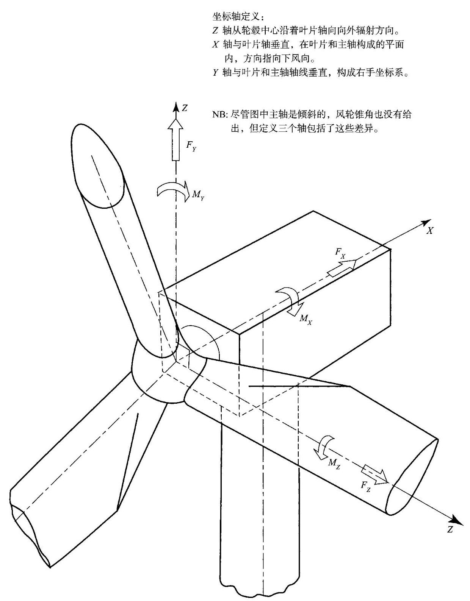
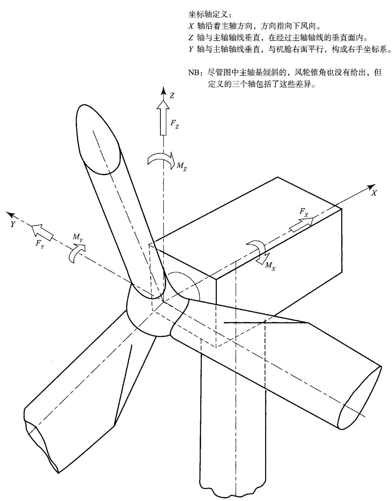

# 符号表

$a$ 轴向诱导因子

${a}^{\prime }\;$ 切向诱导因子

${a}_{\mathrm{t}}{}^{\prime }$ 叶尖切向诱导因子

${a}_{0}$ 二维升力线斜率 $\left( {\mathrm{d}{C}_{1}/\mathrm{d}\alpha }\right)$

${a}_{1}$ 结构阻尼幅值常数

${A}_{1},{A}_{\mathrm{D}}\;$ 风轮扫掠面积

${A}_{\infty },{A}_{\mathrm{w}}$ 上风向和下风向流管横截面积

${A}_{\mathrm{c}}$ Charnock 常数

$b$ 齿轮箱接触面宽度

$B$ 叶片数

$C$ 叶弦, 威布尔参数

${c}^{ * }$ 半圆柱体宽度时间 ${t}^{ * }$

$\widehat{c}$ 单位长度阻尼比

${c}_{i}$ 对应 $i$ 阶模态的总阻尼比

$C$ 衰变常数

$C\left( \nu \right)$ 斯德鲁哈尔函数, $\nu$ 为缩减频率, $C\left( \nu \right)  = F\left( \nu \right)  + \mathrm{i}G\left( \nu \right)$

${C}_{\mathrm{d}}$ 截面阻力系数

${C}_{\mathrm{D}}$ 莫里森的阻力系数

${C}_{\mathrm{{DS}}}$ 莫里森的低阻力系数

${C}_{\mathrm{f}}$ 截面受力系数

${C}_{\mathrm{i}},{C}_{\mathrm{L}}$ 截面升力系数

${C}_{\mathrm{M}}$ 压力分布系数

${C}_{n}^{m}$ Kinner 压力分布系数

${C}_{\mathrm{p}}$ 压力系数

${C}_{\mathrm{P}}$ 功率系数

${C}_{\mathrm{Q}}$ 扭矩系数

${C}_{\mathrm{T}}$ 推力系数

${C}_{\mathrm{{TB}}}$ 风力机基本成本

${C}_{x}$ 垂直于风轮平面的叶片截面受力系数

${C}_{y}$ 平行于风轮平面的叶片截面受力系数

$C\left( {{\Delta r}, n}\right)$ 相干性归一化交叉谱风向横截面上不同距离点的风速波动

${C}_{jk}\left( n\right)$ 相干性归一化交叉谱点 $j$ 和 $k$ 的纵向风速波动

符号表

d 尾流中涡面之间的流线长度

${d}_{1}\;$ 小齿轮中径

${d}_{\mathrm{{PL}}}\;$ 行星齿轮中径

D 阻力、塔架直径、风轮直径

E 能量捕获, 确定时间内风力机产生的能量

$E\{ \} \;$ 科里奥利参数

$E\left\lbrack  {{H}_{s} \mid  \bar{U}}\right\rbrack  \;$ 在轮毂高度处平均速度 $\bar{U}$ 下有效波高的期望值

$f\;$ 叶尖损失因子

$f\left( \right)$ 概率密度函数

${f}_{1}\left( t\right) \;$ 一阶模态支撑结构的偏移量

${f}_{j}\left( t\right) \;$ 第 $j$ 阶模态叶尖偏移量

${f}_{\text{ in }}\left( t\right) \;$ 第 $i$ 阶模态叶尖偏移量

${f}_{\mathrm{T}}\left( t\right) \;$ 对应塔架一阶模态下的轮毂偏移量

$F$

${F}_{\mathrm{x}}\;x$ 方向载荷

${F}_{\mathrm{Y}}\;y$ 方向载荷

${F}_{\mathrm{t}}\;$ 齿间垂直于齿的连线的力

$F\left( \mu \right) \;$ 决定垂直风轮平面的诱导速度径向分布的函数

$F\left( \right) \;$ 累积概率密度函数

$F\left( {x \mid  {U}_{\mathrm{k}}}\right) \;$ 在 $U = {U}_{\mathrm{k}}$ 时变量 $x$ 的累积概率密度函数

$g$ 涡面强度；对零上切频率 $v$ 定义为一个变量增加到平均值上以

获得某个接触周期内极值的标准偏差的数量

${g}_{0}\;$ 峰值因子,定义如上,但是对零上切频率为 ${n}_{0}$

$G$ 旋转风速、剪切模量、齿轮箱变速

$G\left( t\right) \;t$ 的第二阵风因子

h 大气边界层高度；时间步长；薄壁板厚度；单齿最大高度

H 轮毂高度

${H}_{1}\;1$ 年极限波高

${H}_{jk}\;$ 变换矩阵元素,用于风模拟

${H}_{i}\left( n\right) \;$ 第 $i$ 阶模态复频响应函数

$H\left( f\right) \;$ 与频率相关的传递函数

${H}_{\mathrm{s}}\;$ 有效波高

${H}_{\mathrm{s}1}\;$ 在 3 小时参考周期内 1 年极限波高

${H}_{\mathrm{s}{50}}\;$ 在 3 小时参考周期内 50 年极限波高

${H}_{\mathrm{B}}\;$ 破碎波高

I 湍流强度，二次面矩; 惯性力矩; 电流

${I}_{\mathrm{B}}\;$ 叶片根部惯量

662

${I}_{0}\;$ 边缘湍流强度

${I}_{15}\;$ 平均风速 ${15}\mathrm{\;m}/\mathrm{s}$ 时轮毂高度处的湍流强度

${I}_{ + }\;$ 附加湍流强度

${I}_{+ + }\;$ 轮毂高度上附加湍流强度

${I}_{\mathrm{R}}\;$ 风轮水平轴惯量

${I}_{\mathrm{u}}\;$ 纵向湍流强度

${I}_{\mathrm{v}}\;$ 横向湍流强度

${I}_{\mathrm{w}}\;$ 竖向湍流强度

${I}_{\text{ wake }}$ 总湍流强度

$j$

$k\;$ 威布尔函数形状参数

${k}_{i}\;$ 对应第 $i$ 阶模态通用刚度系数,定义为 ${m}_{i}{\omega }_{i}^{2}$

${k}_{1},{k}_{2}\;$ 海洋条件下基准期转换因子

$K$

${K}_{\mathrm{c}}\;$ Keulegan-Carpenter 常数

${K}_{\mathrm{P}}\;$ 基于叶尖速度的功率系数

由于缺少风脉动与结构元或基础的相关性而产生的尺寸缩减系数

${K}_{\mathrm{{Sx}}}\left( {n}_{1}\right) \;$ 由于缺少谐振频率时由于缺少谐振频率时风波动与结构元或基础的相关性而产生的尺寸缩减系数

${K}_{\mathrm{v}}\left( \right)$ 第二类 $v$ 阶修正贝塞尔函数

$K\left( \chi \right) \;$ 决定偏航风轮平面法线方向诱导速度的函数

Lim流光度 (取决于上下文的下角码和上角码); 升力

${L}_{u}^{x}\;$ 在纵向 $x$ 测得的顺风向湍流分量 $u$ 的积分尺度

$m\;$ 单位长度的质量,整数

${m}_{\mathrm{{T1}}}\;$ 对应一阶模态的广义质量

${m}_{\mathrm{{T1}}}\;$ 对应一阶模态的塔架、机舱和风轮的广义质量

$M\;$ 力矩; 整数

$\bar{M}\;$ 平均弯矩

${M}_{0}\;$ 峰值准静态力矩

${M}_{1}\left( t\right) \;$ 第一振型波动悬臂根部弯矩

${M}_{\mathrm{T}}$ 摆动力矩

${M}_{\mathrm{X}}\;$ 叶片面内力矩 (即在旋转面叶片面内力矩(即在旋转面内导致弯矩)；塔架左右方向力矩

${M}_{\mathrm{Y}}\;$ 叶片面外力矩 (即在旋转面外导致弯矩)；塔架前后力矩

${M}_{\mathrm{Z}}\;$ 叶片扭矩; 塔架扭矩

${M}_{\mathrm{{YS}}}\;$ 低速轴关于垂直于叶片 1 旋转轴的力矩

${M}_{\mathrm{{zs}}}\;$ 低速轴关于平行于叶片 1 的轴旋转轴的力矩

符号表

${M}_{\mathrm{{YN}}}\;$ 低速轴引起的机舱关于 $y$ 轴的力矩

${M}_{\mathrm{{ZN}}}\;$ 低速轴引起的机舱关于 $z$ 轴的力矩

$n\;$ 频率 $\left( \mathrm{{Hz}}\right)$ ; 疲劳载荷周期数; 整数

${n}_{0}\;$ 准静态响应的零上切频率

${n}_{1}\;$ 振动一阶模态频率 $\left( \mathrm{{Hz}}\right)$

N 叶片数；每转的时间步长数；整数

$N\left( r\right) \;$ 离心力

$N\left( S\right) \;S$ 应力水平下的疲劳失效次数

$p\;$ 静态压力

$p\left( \right)$ 概率密度函数

$P\;$ 气动力或功率

${P}_{n}^{m}\left( \right) \;$ 第一类关联 Legendre 多项式

$q\left( {r, t}\right) \;$ 单位长度的脉动气动升力

Q 风轮转矩; 无功功率

Q. 气动力矩

Q 热传导速率

$\bar{Q}\;$ 单位长度的平均气动升力

动力因子，定义为极限力矩与阵风准静态力矩的比值

${Q}_{\mathrm{g}}\;$ 发电机负载转矩

${Q}_{\mathrm{L}}\;$ 损耗转矩

${Q}_{n}^{m}\left( \right) \;$ 第二类关联 Legendre 多项式

${Q}_{1}\left( t\right) \;$ 对于悬臂叶片的广义载荷

$r\;$ 叶素元或叶片上某点处的半径叶素元或叶片上某点处的半径；功率和风速间的相关系数；管状塔架的半径

${r}^{\prime }\;$ 叶片上某点处的半径

${r}_{1},{r}_{2}\;$ 叶片上某点处或叶片的半径

$R\;$ 叶尖半径; 疲劳叶尖半径; 疲劳载荷周期中最小应力与最大应力之比; 电阻

Re 雷诺数

在固定点 $u$ 点处纵向风速脉动的标准功率谱密度, $n \cdot  {S}_{\mathrm{u}}\left( n\right) /{\sigma }_{\mathrm{u}}^{2}$

$s\;$ 从叶尖到内侧从叶尖到内侧的距离；从前缘沿叶片弦长方向的距离；两点之间的间隙；拉普拉斯算子；感应电机滑差

${s}_{1}$ 顺风向测得的两点间的间隙

S 翼面积；旋翼飞机转盘面积；疲劳应力幅值

S 复(视在)功率(黑体表示其是一个复数)

S() 不确定度或误差带

${S}_{jk}\left( n\right) \;$ 在 $j$ 点和 $k$ 点处纵向脉动风速的互谱 (单边)

${S}_{\mathrm{M}}\left( n\right) \;$ 弯矩的单边功率谱

664

${S}_{\mathrm{{Ql}}}\left( n\right) \;$ 广义载荷的单边功率谱

${S}_{\mathrm{u}}\left( n\right) \;$ 在固定点处的纵向脉动风速 $u$ 单边功率谱

${S}_{\mathrm{u}}^{0}\left( n\right) \;$ 在旋转叶片上基点处纵向脉动风速 $u$ 的单边功率谱 (也称旋转采样谱)

${S}_{\mathrm{u}}^{0}\left( {{r}_{1},{r}_{2}, n}\right) \;$ 在旋转叶片或风轮上半径为 ${r}_{1}$ 和 ${r}_{2}$ 点处纵向脉动风速 $u$ 的互谱(单边)

${S}_{\mathrm{v}}\left( n\right)$ 在固定点处的水平脉动风速 $v$ 的单边功率谱

${S}_{\mathrm{w}}\left( n\right) \;$ 在固定点处的垂直脉动风速 $w$ 的单边功率谱

${S}_{nn}\left( n\right) \;$ 海面高度的单边功率谱

$t$ 时间；临界根部截面处的齿厚；塔架筒壁厚

风轮推力；离散突风持续时间；风速平均周期

${T}_{\mathrm{c}}\;$ 平均波峰之间的周期

${T}_{\mathrm{p}}\;$ 波峰周期

${T}_{z}\;$ 平均零交叉波周期

$u$ 方向风速脉动分量； $x$ 方向方向风速脉动分量； $x$ 方向诱导速度； $x$ 方向板平面内偏离；当轮齿数比

${u}^{ * }\;$ 边界层的摩擦速度

${U}_{\infty }\;$ 自由流速度

$U, U\left( t\right)$ 顺风向瞬时风速

$\overline{U}$ 顺风向风速平均分量——特指 10min 或 1h 周期

${U}_{\text{ ave }}$ 轮毂高度年平均风速

${U}_{\mathrm{d}}\;$ 风轮处的末流速度

${U}_{\mathrm{w}}\;$ 尾流远端的末流速度

${U}_{\mathrm{e}1}\;1$ 年重现的极限 $3\mathrm{\;s}$ 阵风

${U}_{\mathrm{e}{50}}\;{50}$ 年重现的极限 $3\mathrm{\;s}$ 阵风

${U}_{0}\;$ 风力机切出风速

风力机的额定风速, 定义为达到额定功率时的风速

${U}_{\text{ ref }}$ 参考风速,定义为在轮毂高度处 50 年重现的 ${10}\mathrm{{min}}$ 平均风速参考风速,定义为在轮毂高度处 50 年重现的 ${10}\mathrm{{min}}$ 平均风速

${U}_{1}$ 金属盘面扭曲时的应力能

${U}_{2}\;$ 平面内应力能

$v\;y$ 方向上风速的脉动分量; $y$ 方向上风速的脉动分量; $y$ 方向的诱导速度; $y$ 轴方向上的平面

$V$ 旋转翼型处的空气速度; 旋转翼型处的空气速度；致动盘处的垂直空气速度， ${U}_{\infty }\left( {1 - \alpha }\right)$ (见 7.19 节); 电压 (黑体表示其是一个复数)

$V\left( t\right) \;$ 横向风速的瞬时分量

VA 电气伏安

${V}_{\mathrm{f}}\;$ 在复合材料中纤维体积分量

符号表

${V}_{\mathrm{t}}$ 叶片的叶尖速度

$w$ 在 $z$ 轴上风速的波动部分; $z$ 轴方向的诱导速度; 面平面挠曲

$w\left( r\right)$ 叶片壳皮厚度

W 旋转叶片上某一点对应的风速；电功率损失

$x$ 下风向坐标静止和旋转坐标系统；下风向位移

$x\left( t\right)$ 一个变量的随机部分

${x}_{\mathrm{n}}$ 接近尾流区的长度

$\overline{{x}_{1}}$ 叶尖位移静态的一阶模态量

$X$ 电感抗

$y$

相对垂直轴的横向坐标 (向右为正) 静止坐标系; 相对叶片轴线的横向坐标旋转坐标系; 横向位移

$z$

垂直坐标 (向上为正) 静止坐标系; 沿着叶片轴线的径向坐标旋转坐标系

$Z$ 截面模量

z 电阻抗(黑色表示复数)

${z}_{0}$ 地面粗糙度的长度

${z}_{1}$ 小齿轮的齿数

$z\left( t\right)$ 变量的周期部分

希腊字母

$\alpha$

攻角即叶片上的气流方向与叶片弦线之间的夹角；风剪切能量的定律指数

${a}_{x}$ 经向弹性缺陷降低系数

$\beta$ 当地叶片弦线到相对于风轮轮平面的倾角(如叶片扭曲加上桨距角)

${\beta }_{r}$ 功率 $r$ 时的概率加权力矩

$\chi$ 尾流的歪斜角:偏航风轮的尾流轴线与风轮旋转轴线之间的夹角

${\chi }_{\mathrm{M}1}$ 5.8.6 小节定义的加权质量比

${\delta }_{\mathrm{a}}$ 气动阻尼的对数衰减

结构阻尼的对数衰减

$\delta$ 气动和结构阻尼组合的对气动和结构阻尼组合的对数衰减；塔影遮挡部分的宽度

${\delta }_{3}$ 摆动铰链轴线和风轮轴线与摆动铰链轴线和风轮轴线与低速轴轴线正交的夹角

$\varepsilon \;$ 轴向应力的总应力的比例

${\varepsilon }_{1},{\varepsilon }_{2},{\varepsilon }_{3}\;$ 在一个三电平在一个三电平方波中一个变量取最大、平均、最小值的时间比例

合成速度 $W$ 与风轮平面的角

666

$\Phi \left( \right)$ 标准正态分布函数

$\Phi \left( {x, y, z, t}\right)$ 每个单位的振荡源的速度势

$\gamma$ 偏航角；欧拉常数 $\left( { = {0.5772}}\right)$

${\gamma }_{\mathrm{L}}\;$ 载荷因子

${\gamma }_{\mathrm{{mf}}}\;$ 材料疲劳强度的局部安全因数

${\gamma }_{\mathrm{{mu}}}\;$ 材料极限强度的局部安全因数

$\Gamma \;$ 叶片环量; 涡旋强度

$\Gamma \left( \right)$ Gamma 函数

$\eta$ 椭圆参数；主轴倾角；洛克数的 $1/8$ (见 5.8、8 小节)

${\eta }_{\mathrm{b}}\;$ DS472 中的影响因子，定 DS472 中的影响因子，定义为极限力矩与 ${10}\mathrm{{min}}$ 平均值的比值

$\kappa \;$ 卡尔曼常数

$\kappa \left( {t - {t}_{0}}\right)$ 自相关函数

${\kappa }_{\mathrm{L}}\left( s\right) \;$ 在相距 $s$ 的点之间自在相距 $s$ 的点之间的速度分量的互相关函数，与它们的连线相平行

${\kappa }_{\mathrm{T}}\left( s\right) \;$ 在相距 $s$ 的点之间在相距 $s$ 的点之间的速度分量的互相关函数，与它们的连线相正交

${\kappa }_{\mathrm{u}}\left( {r,\tau }\right) \;$ 在静止风轮半径 $r$ 处顺风风向速度部分的自相关性函数

${\kappa }_{\mathrm{u}}^{0}\left( {r,\tau }\right) \;$ 对旋转风轮，在半径 $r$ 处顺风风向的速度部分的自相关性函数

${\kappa }_{\mathrm{u}}\left( {{r}_{1},{r}_{2},\tau }\right) \;$ 对静止风轮，半径 ${r}_{1}$ 和 ${r}_{2}$ (不一定为同一叶片) 处顺风风向风速部分的自相关性函数

${\kappa }_{\mathrm{u}}^{0}\left( {{r}_{1},{r}_{2},\tau }\right) \;$ 对旋转风轮，半径 ${r}_{1}$ 和 ${r}_{2}$ (不一定为同一叶片)处顺风风向风速部分的自相关性函数

$\lambda \;$ 叶尖速比；纬度；纵向半波波长同横向的比值

$\lambda \left( d\right) \;$ 一阶模态下悬臂根部测量的比值

${\lambda }^{ * }\left( d\right) \;\lambda \left( d\right)$ 的近似值

${\lambda }_{\mathrm{r}}\;$ 叶片半径 $r$ 处的切向速度与风速的比值

$\Lambda \;$ 偏航速率

$\mu$ 无因次径向位置, $r/R$ ; 黏性; 摩擦系数

${\mu }_{i}\left( r\right) \;$ 第 $i$ 阶叶片模态的形状

${\mu }_{1}\left( y\right) \;$ 海上支撑结构的一阶模态的形状

${\mu }_{i}\left( z\right) \;$ 第 $i$ 阶塔架模态的形状

${\mu }_{\mathrm{T}}\left( z\right) \;$ 塔架一阶模态形状

塔架第一阶模态激励下叶片 $j$ 的标准刚性体偏转角

${\mu }_{2}\;$ 变量 $z$ 的平均值

$v$ 椭圆坐标系; 平均零穿越频率

$\theta$ 风向变化;随机相角; 柱坐标; 刹车盘温度

$\rho$ 空气密度

${\rho }_{\mathrm{u}}^{0}\left( {{r}_{1},{r}_{2},\tau }\right) \;$ 旋转风轮在半径 ${r}_{1}\text{ 、 }{r}_{2}$ 处顺风向风速分量的标准互补

$\sigma \;$ 叶片实度; 标准偏差; 应力

$\overline{\sigma }\;$ 平均应力

${\sigma }_{\mathrm{{cr}}}\;$ 弹性屈曲临界应力

${\sigma }_{\mathrm{M}}\;$ 弯矩的标准偏差

${\sigma }_{\mathrm{M}1}$

叶片共振时叶根或塔架共振时塔架根部一阶模态共振弯矩的

标准偏差

${\sigma }_{\mathrm{{MB}}}$ 准静态弯矩的标准偏差 (或弯曲力矩背景响应)

${\sigma }_{\mathrm{{Mh}}}$ 轮毂反作用力矩的标准偏差

${\sigma }_{\mathrm{{MT}}}$ 两叶片风轮刚性连接摆动力矩的标准偏差

${\sigma }_{\bar{M}}$ 两叶片风轮叶根平均弯矩的标准偏差

${\sigma }_{Q1}$ 一阶模态下风轮广义负载的标准偏差

${\sigma }_{\mathrm{r}}\;$ 风轮坚实度

${\sigma }_{\mathrm{u}}\;$ 沿风向波动分量的标准偏差

${\sigma }_{\mathrm{v}}\;$ 与风向垂直方向风速的标准偏差

${\sigma }_{\mathrm{w}}\;$ 垂直方向风速的标准偏差

${\sigma }_{\mathrm{x}1}\;$ 一阶模态共振位移的标准偏一阶模态共振位移的标准偏差, 参考叶片共振时的叶尖和塔架

共振时的机舱

$\tau$ 时间间隔，无因次时间，剪切应力

p 泊松比

$\omega \;$ 角频率 (rad/s)

${\omega }_{\mathrm{d}}\;$ 发电机给定转速

${\omega }_{i}\;$ 第 $i$ 阶模式下的固有频率

${\omega }_{g}\;$ 发电机转速

${\omega }_{\mathrm{r}}$ 感应电机转子旋转速度

$\omega$ ,感应电机定子磁场旋转速度

$\Omega$ 风轮转速; 地球方向旋转速度

$\xi$ 阻尼比

$\psi \;$ 叶片方位角; 柱面内的中心角

${\psi }_{\mathrm{{un}}}\left( {r,{r}^{\prime }, n}\right) \;$ 归一化交叉谱的实数部分

5 摆动角

下标

a 空气动力

B 基准线

c 可压缩

d 盘; 阻力; 设计

668

e1 1 年一遇的极值

e50 50 年一遇的极值

ext 极限

f 纤维

$i$ 模态 $i$

$j$ 模态 $j$

J 叶片J

$\mathbf{k}$ 特性

1 升力

m 矩阵

$M$ 力矩

max 变量最大值

min 变量最小值

$n$ 第 $n$ 个时间步长结束时的值

Q 广义载荷

$R$ 叶尖半径处值

s 结构

t 拉力

T 推力

$\mathbf{u}$ 下风向;临界

$\mathbf{v}$ 横向

w 竖向

$\omega$ 尾流

$\mathbf{x}$ 沿风向的偏移量

上标

0 旋转采样(应用于风速频谱)

图 A 叶片载荷、位置以及偏转角 (随叶片转动) 坐标系

NB: 尽管图中主轴是倾斜的, 风轮锥角也没有给出, 但定义的三个轴包括了这些差异

图 B 轮毂载荷、偏转以及相对轮毂的位置固定坐标系

NB: 尽管图中主轴是倾斜的, 风轮锥角也没有给出, 但定义的三个轴包括了这些差异

WILEY (TM-0664.01)

责任编辑:杨凯

责任制作:魏谨

封面设计:刘洋洋

科学出版社 东方科龙公司

联系电话:010-82840399

E-mail: boktp@mail.sciencep.com

有关网址:http://www.okbook.com.cn

销售分类建议:工业技术/能源利用