Wind Energy Handbook

# Wind Energy Handbook Second Edition

Tony Burton

Wind Energy Consultant, Powys, UK

Nick Jenkins

Cardiff University, UK

David Sharpe

Wind Energy Consultant, Essex, UK

Ervin Bossanyi

GL Garrad Hassan, Bristol, UK

This edition first published 2011

© 2011, John Wiley & Sons, Ltd

First Edition published in 2001

## Registered office

John Wiley & Sons Ltd, The Atrium, Southern Gate, Chichester, West Sussex, PO19 8SQ, United Kingdom

For details of our global editorial offices, for customer services and for information about how to apply for permission to reuse the copyright material in this book please see our website at www.wiley.com.

The right of the author to be identified as the author of this work has been asserted in accordance with the Copyright, Designs and Patents Act 1988.

All rights reserved. No part of this publication may be reproduced, stored in a retrieval system, or transmitted, in any form or by any means, electronic, mechanical, photocopying, recording or otherwise, except as permitted by the UK Copyright, Designs and Patents Act 1988, without the prior permission of the publisher.

Wiley also publishes its books in a variety of electronic formats. Some content that appears in print may not be available in electronic books.

Designations used by companies to distinguish their products are often claimed as trademarks. All brand names and product names used in this book are trade names, service marks, trademarks or registered trademarks of their respective owners. The publisher is not associated with any product or vendor mentioned in this book. This publication is designed to provide accurate and authoritative information in regard to the subject matter covered. It is sold on the understanding that the publisher is not engaged in rendering professional services. If professional advice or other expert assistance is required, the services of a competent professional should be sought.

## Library of Congress Cataloguing-in-Publication Data

Wind energy handbook / Tony Burton ... [et al.]. - 2nd ed.

p. cm.

Includes bibliographical references and index.

ISBN 978-0-470-69975-1 (hardback)

1. Wind power-Handbooks, manuals, etc. I. Burton, Tony, 1947-

TJ820.H35 2011

621.31'2136-dc22

2010053397

A catalogue record for this book is available from the British Library.

Print ISBN: 978-0-470-69975-1

E-PDF ISBN: 978-1-119-99272-1

O-book ISBN: 978-1-119-99271-4

E-Pub ISBN: 978-1-119-99392-6

mobi ISBN: 978-1-119-99393-3

Typeset in 10/12pt Times by Aptara Inc., New Delhi, India.

## Contents

About the Authors xvii

Preface to Second Edition xix

Acknowledgements for First Edition xxi

Acknowledgements for Second Edition xxiii

List of Symbols XXV

Figures C1 and C2 - Co-ordinate Systems XXXV

1 Introduction 1

1.1 Historical development 1

1.2 Modern wind turbines 4

1.3 Scope of the book 6

References 7

Further reading 8

2 The wind resource 9

2.1 The nature of the wind 9

2.2 Geographical variation in the wind resource 10

2.3 Long-term wind speed variations 11

2.4 Annual and seasonal variations 12

2.5 Synoptic and diurnal variations 14

2.6 Turbulence 14

2.6.1 The nature of turbulence 14

2.6.2 The boundary layer 16

2.6.3 Turbulence intensity 18

2.6.4 Turbulence spectra 20

2.6.5 Length scales and other parameters 22

2.6.6 Asymptotic limits 24

2.6.7 Cross-spectra and coherence functions 25

2.6.8 The Mann model of turbulence 28

2.7 Gust wind speeds 28

2.8 Extreme wind speeds 29

2.8.1 Extreme winds in standards 30

2.9 Wind speed prediction and forecasting 32

2.9.1 Statistical methods 32

2.9.2 Meteorological methods 33

2.10 Turbulence in wakes and wind farms 33

2.11 Turbulence in complex terrain 36

References 36

3 Aerodynamics of horizontal axis wind turbines 39

3.1 Introduction 39

3.2 The actuator disc concept 40

3.2.1 Simple momentum theory 41

3.2.2 Power coefficient 42

3.2.3 The Lanchester-Betz limit 43

3.2.4 The thrust coefficient 43

3.3 Rotor disc theory 44

3.3.1 Wake rotation 44

3.3.2 Angular momentum theory 46

3.3.3 Maximum power 48

3.4 Vortex cylinder model of the actuator disc 49

3.4.1 Introduction 49

3.4.2 Vortex cylinder theory 50

3.4.3 Relationship between bound circulation and the induced velocity 51

3.4.4 Root vortex 51

3.4.5 Torque and power 53

3.4.6 Axial flow field 53

3.4.7 Tangential flow field 53

3.4.8 Axial thrust 55

3.4.9 Radial flow field 56

3.4.10 Conclusions 57

3.5 Rotor blade theory (blade-element/momentum theory) 57

3.5.1 Introduction 57

3.5.2 Blade element theory 57

3.5.3 The blade-element/momentum (BEM) theory 59

3.5.4 Determination of rotor torque and power 62

3.6 Breakdown of the momentum theory 64

3.6.1 Free-stream/wake mixing 64

3.6.2 Modification of rotor thrust caused by flow separation 64

3.6.3 Empirical determination of thrust coefficient 65

3.7 Blade geometry 66

3.7.1 Introduction 66

3.7.2 Optimal design for variable speed operation 66

3.7.3 A simple blade design 70

3.7.4 Effects of drag on optimal blade design 73

3.7.5 Optimal blade design for constant speed operation 74

3.8 The effects of a discrete number of blades 75

3.8.1 Introduction 75

3.8.2 Tip-losses 75

3.8.3 Prandtl's approximation for the tip-loss factor 81

3.8.4 Blade root losses 83

3.8.5 Effect of tip-loss on optimum blade design and power 85

3.8.6 Incorporation of tip-loss for non-optimal operation 88

3.8.7 Alternative explanation for tip-loss 89

3.9 Stall delay 92

3.10 Calculated results for an actual turbine 95

3.11 The performance curves 97

3.11.1 Introduction 97

3.11.2 The ${C}_{P} - \lambda$ performance curve 98

3.11.3 The effect of solidity on performance 98

3.11.4 The ${C}_{Q} - \lambda$ curve 100

3.11.5 The ${C}_{T} - \lambda$ curve 101

3.12 Constant rotational speed operation 101

3.12.1 Introduction 101

3.12.2 The ${K}_{P} - 1/\lambda$ curve 101

3.12.3 Stall regulation 102

3.12.4 Effect of rotational speed change 103

3.12.5 Effect of blade pitch angle change 105

3.13 Pitch regulation 105

3.13.1 Introduction 105

3.13.2 Pitching to stall 106

3.13.3 Pitching to feather 106

3.14 Comparison of measured with theoretical performance 107

3.15 Variable speed operation 108

3.16 Estimation of energy capture 109

3.17 Wind turbine aerofoil design 114

3.17.1 Introduction 114

3.17.2 The NREL aerofoils 114

3.17.3 The Risø aerofoils 116

3.17.4 The Delft aerofoils 117

References 119

Websites 120

Further reading 120

Appendix A3 lift and drag of aerofoils 120

A3.1 Definition of drag 121

A3.2 Drag coefficient 123

A3.3 The boundary layer 124

A3.4 Boundary layer separation 124

A3.5 Laminar and turbulent boundary layers 125

A3.6 Definition of lift and its relationship to circulation 127

A3.7 The stalled aerofoil 130

A3.8 The lift coefficient 131

A3.9 Aerofoil drag characteristics 131

A3.10 Cambered aerofoils 134

4 Further aerodynamic topics for wind turbines 137

4.1 Introduction 137

4.2 The aerodynamics of turbines in steady yaw 137

4.2.1 Momentum theory for a turbine rotor in steady yaw 138

4.2.2 Glauert's momentum theory for the yawed rotor 140

4.2.3 Vortex cylinder model of the yawed actuator disc 144

4.2.4 Flow expansion 146

4.2.5 Related theories 152

4.2.6 Wake rotation for a turbine rotor in steady yaw 152

4.2.7 The blade element theory for a turbine rotor in steady yaw 154

4.2.8 The blade element - momentum theory for a rotor in steady yaw 155

4.2.9 Calculated values of induced velocity 158

4.3 The method of acceleration potential 163

4.3.1 Introduction 163

4.3.2 The general pressure distribution theory of Kinner 165

4.3.3 The axi-symmetric pressure distributions 168

4.3.4 The anti-symmetric pressure distributions 171

4.3.5 The Pitt and Peters model 174

4.3.6 The general acceleration potential method 175

4.3.7 Comparison of methods 175

4.4 Unsteady flow 176

4.4.1 Introduction 176

4.4.2 Adaptation of the acceleration potential method to unsteady flow 177

4.4.3 Unsteady yawing and tilting moments 180

4.5 Quasi-steady aerofoil aerodynamics 183

4.5.1 Introduction 183

4.5.2 Aerodynamic forces caused by aerofoil acceleration 184

4.5.3 The effect of the wake on aerofoil aerodynamics in unsteady flow 185

4.6 Dynamic stall 189

4.7 Computational fluid dynamics 190

References 191

Further reading 192

5 Design loads for horizontal axis wind turbines 193

5.1 National and international standards 193

5.1.1 Historical development 193

5.1.2 IEC 61400-1 193

5.1.3 GL rules 194

5.2 Basis for design loads 194

5.2.1 Sources of loading 194

5.2.2 Ultimate loads 195

5.2.3 Fatigue loads 195

5.2.4 Partial safety factors 195

5.2.5 Functions of the control and safety systems 197

5.3 Turbulence and wakes 197

5.4 Extreme loads 199

5.4.1 Operational load cases 199

5.4.2 Non-operational load cases 202

5.4.3 Blade/tower clearance 204

5.4.4 Constrained stochastic simulation of wind gusts 204

5.5 Fatigue loading 205

5.5.1 Synthesis of fatigue load spectrum 205

5.6 Stationary blade loading 205

5.6.1 Lift and drag coefficients 205

5.6.2 Critical configuration for different machine types 206

5.6.3 Dynamic response 206

5.7 Blade loads during operation 213

5.7.1 Deterministic and stochastic load components 213

5.7.2 Deterministic aerodynamic loads 213

5.7.3 Gravity loads 222

5.7.4 Deterministic inertia loads 222

5.7.5 Stochastic aerodynamic loads: analysis in the frequency domain 225

5.7.6 Stochastic aerodynamic loads: analysis in the time domain 235

5.7.7 Extreme loads 238

5.8 Blade dynamic response 241

5.8.1 Modal analysis 241

5.8.2 Mode shapes and frequencies 244

5.8.3 Centrifugal stiffening 245

5.8.4 Aerodynamic and structural damping 247

5.8.5 Response to deterministic loads: step-by-step dynamic analysis 249

5.8.6 Response to stochastic loads 254

5.8.7 Response to simulated loads 256

5.8.8 Teeter motion 256

5.8.9 Tower coupling 261

5.8.10 Aeroelastic stability 266

5.9 Blade fatigue stresses 267

5.9.1 Methodology for blade fatigue design 267

5.9.2 Combination of deterministic and stochastic components 269

5.9.3 Fatigue prediction in the frequency domain 269

5.9.4 Wind simulation 271

5.9.5 Fatigue cycle counting 272

5.10 Hub and low speed shaft loading 273

5.10.1 Introduction 273

5.10.2 Deterministic aerodynamic loads 274

5.10.3 Stochastic aerodynamic loads 275

5.10.4 Gravity loading 276

5.11 Nacelle loading 277

5.11.1 Loadings from rotor 277

5.11.2 Cladding loads 278

5.12 Tower loading 278

5.12.1 Extreme loads 278

5.12.2 Dynamic response to extreme loads 279

5.12.3 Operational loads due to steady wind (deterministic component) 282

5.12.4 Operational loads due to turbulence (stochastic component) 283

5.12.5 Dynamic response to operational loads 285

5.12.6 Fatigue loads and stresses 287

5.13 Wind turbine dynamic analysis codes 288

5.14 Extrapolation of extreme loads from simulations 294

5.14.1 Derivation of empirical cumulative distribution function of global extremes 295

5.14.2 Fitting an extreme value distribution to the empirical distribution 296

5.14.3 Comparison of extreme value distributions 301

5.14.4 Combination of probability distributions 302

5.14.5 Extrapolation 303

5.14.6 Fitting probability distribution after aggregation 303

5.14.7 Local extremes method 304

5.14.8 Convergence requirements 305

References 306

Appendix 5: dynamic response of stationary blade in turbulent wind 308

A5.1 Introduction 308

A5.2 Frequency response function 309

A5.2.1 Equation of motion 309

A5.2.2 Frequency response function 309

A5.3 Resonant displacement response ignoring wind variations along the blade 310

A5.3.1 Linearisation of wind loading 310

A5.3.2 First mode displacement response 311

A5.3.3 Background and resonant response 311

A5.4 Effect of across-wind turbulence distribution on resonant displacement response 313

A5.4.1 Formula for normalised co-spectrum 314

A5.5 Resonant root bending moment 316

A5.6 Root bending moment background response 318

A5.7 Peak response 319

A5.8 Bending moments at intermediate blade positions 322

A5.8.1 Background response 322

A5.8.2 Resonant response 322

References 323

6 Conceptual design of horizontal axis wind turbines 325

6.1 Introduction 325

6.2 Rotor diameter 325

6.2.1 Cost modelling 326

6.2.2 Simplified cost model for machine size optimisation an illustration 326

6.2.3 The NREL cost model 329

6.2.4 Machine size growth 331

6.2.5 Gravity limitations 332

6.3 Machine rating 332

6.3.1 Simplified cost model for optimising machine rating in relation to diameter 332

6.3.2 Relationship between optimum rated wind speed and annual mean 334

6.3.3 Specific power of production machines 335

6.4 Rotational speed 336

6.4.1 Ideal relationship between rotational speed and solidity 336

6.4.2 Influence of rotational speed on blade weight 337

6.4.3 Optimum rotational speed 338

6.4.4 Noise constraint on rotational speed 338

6.4.5 Visual considerations 338

6.5 Number of blades 338

6.5.1 Overview 338

6.5.2 Ideal relationship between number of blades, rotational speed and solidity 339

6.5.3 Some performance and cost comparisons 339

6.5.4 Effect of number of blades on loads 343

6.5.5 Noise constraint on rotational speed 345

6.5.6 Visual appearance 345

6.5.7 Single-bladed turbines 345

6.6 Teetering 346

6.6.1 Load relief benefits 346

6.6.2 Limitation of large excursions 347

6.6.3 Pitch-teeter coupling 348

6.6.4 Teeter stability on stall-regulated machines 348

6.7 Power control 349

6.7.1 Passive stall control 349

6.7.2 Active pitch control 349

6.7.3 Passive pitch control 354

6.7.4 Active stall control 354

6.7.5 Yaw control 355

6.8 Braking systems 356

6.8.1 Independent braking systems: requirements of standards 356

6.8.2 Aerodynamic brake options 356

6.8.3 Mechanical brake options 358

6.8.4 Parking versus idling 358

6.9 Fixed speed, two speed or variable speed 358

6.9.1 Two speed operation 359

6.9.2 Variable slip operation (see also Chapter 8, Section 8.3.8) 360

6.9.3 Variable speed operation 361

6.9.4 Other approaches to variable speed operation 363

6.10 Type of generator 365

6.10.1 Historical attempts to use synchronous generators 365

6.10.2 Direct drive generators 367

6.10.3 Evolution of generator systems 368

6.11 Drive train mounting arrangement options 369

6.11.1 Low speed shaft mounting 369

6.11.2 High speed shaft and generator mounting 372

6.12 Drive train compliance 373

6.13 Rotor position with respect to tower 375

6.13.1 Upwind configuration 375

6.13.2 Downwind configuration 376

6.14 Tower stiffness 376

6.14.1 Stochastic thrust loading at blade passing frequency 376

6.14.2 Tower top moment fluctuations due to blade pitch errors 378

6.14.3 Tower top moment fluctuations due to rotor mass imbalance 378

6.14.4 Tower stiffness categories 379

6.15 Personnel safety and access issues 379

References 381

7 Component design 383

7.1 Blades 383

7.1.1 Introduction 383

7.1.2 Aerodynamic design 384

7.1.3 Practical modifications to optimum design 384

7.1.4 Form of blade structure 385

7.1.5 Blade materials and properties 386

7.1.6 Properties of glass/polyester and glass/epoxy composites 390

7.1.7 Properties of wood laminates 395

7.1.8 Blade loading overview 398

7.1.9 Blade resonance 409

7.1.10 Design against buckling 414

7.1.11 Blade root fixings 418

7.2 Pitch bearings 419

7.3 Rotor hub 422

7.4 Gearbox 425

7.4.1 Introduction 425

7.4.2 Variable loading during operation 425

7.4.3 Drive train dynamics 427

7.4.4 Braking loads 427

7.4.5 Effect of variable loading on fatigue design of gear teeth 429

7.4.6 Effect of variable loading on fatigue design of bearings and shafts 432

7.4.7 Gear arrangements 433

7.4.8 Gearbox noise 435

7.4.9 Integrated gearboxes 436

7.4.10 Lubrication and cooling 436

7.4.11 Gearbox efficiency 437

7.5 Generator 437

7.5.1 Fixed-speed induction generators 437

7.5.2 Variable slip induction generators 439

7.5.3 Variable speed operation 440

7.5.4 Variable speed operation using a Doubly Fed Induction Generator (DFIG) 442

7.5.5 Variable speed operation using a Full Power Converter (FPG) 445

7.6 Mechanical brake 446

7.6.1 Brake duty 446

7.6.2 Factors governing brake design 447

7.6.3 Calculation of brake disc temperature rise 448

7.6.4 High speed shaft brake design 450

7.6.5 Two level braking 452

7.6.6 Low speed shaft brake design 453

7.7 Nacelle bedplate 453

7.8 Yaw drive 453

7.9 Tower 456

7.9.1 Introduction 456

7.9.2 Constraints on first mode natural frequency 456

7.9.3 Steel tubular towers 457

7.9.4 Steel lattice towers 466

7.10 Foundations 467

7.10.1 Slab foundations 467

7.10.2 Multi-pile foundations 468

7.10.3 Concrete monopile foundations 468

7.10.4 Foundations for steel lattice towers 469

7.10.5 Foundation rotational stiffness 469

References 471

8 The controller 475

8.1 Functions of the wind turbine controller 476

8.1.1 Supervisory control 476

8.1.2 Closed loop control 477

8.1.3 The safety system 477

8.2 Closed loop control: issues and objectives 478

8.2.1 Pitch control (See also Chapter 3, Section 3.13 and Chapter 6, Section 6.7.2) 478

8.2.2 Stall control 480

8.2.3 Generator torque control (see also Chapter 6, Section 6.9 and Chapter 7, Section 7.5) 480

8.2.4 Yaw control 481

8.2.5 Influence of the controller on loads 481

8.2.6 Defining controller objectives 482

8.2.7 PI and PID controllers 483

8.3 Closed loop control: general techniques 484

8.3.1 Control of fixed speed, pitch regulated turbines 484

8.3.2 Control of variable speed pitch regulated turbines 485

8.3.3 Pitch control for variable speed turbines 488

8.3.4 Switching between torque and pitch control 488

8.3.5 Control of tower vibration 490

8.3.6 Control of drive train torsional vibration 492

8.3.7 Variable speed stall regulation 494

8.3.8 Control of variable slip turbines 495

8.3.9 Individual pitch control 496

8.3.10 Multivariable control - decoupling the wind turbine control loops 497

8.3.11 Two-axis decoupling for individual pitch control 499

8.3.12 Load reduction with individual pitch control 501

8.3.13 Individual pitch control implementation 503

8.3.14 Further extensions to individual pitch control 505

8.3.15 Commercial use of individual pitch control 505

8.3.16 Feedforward control using lidars 505

8.4 Closed loop control: analytical design methods 506

8.4.1 Classical design methods 506

8.4.2 Gain scheduling for pitch controllers 511

8.4.3 Adding more terms to the controller 511

8.4.4 Other extensions to classical controllers 512

8.4.5 Optimal feedback methods 513

8.4.6 Pros and cons of model-based control methods 516

8.4.7 Other methods 517

8.5 Pitch actuators (see also, Chapter 6 Section 6.7.2) 518

8.6 Control system implementation 519

8.6.1 Discretisation 520

8.6.2 Integrator desaturation 521

References 522

9 Wind turbine installations and wind farms 525

9.1 Project development 526

9.1.1 Initial site selection 526

9.1.2 Project feasibility assessment 528

9.1.3 The Measure-Correlate-Predict (MCP) technique 529

9.1.4 Micrositing 530

9.1.5 Site investigations 530

9.1.6 Public consultation 530

9.1.7 Preparation and submission of the planning application 531

9.2 Landscape and visual impact assessment 533

9.2.1 Landscape character assessment 534

9.2.2 Design and mitigation 537

9.2.3 Assessment of impact 538

9.2.4 Shadow flicker 540

9.2.5 Sociological aspects 541

9.3 Noise 542

9.3.1 Terminology and basic concepts 542

9.3.2 Wind turbine noise 546

9.3.3 Measurement, prediction and assessment of wind farm noise 548

9.4 Electromagnetic Interference 551

9.4.1 Modelling and prediction of EMI from wind turbines 553

9.4.2 Aviation radar 557

9.5 Ecological assessment 558

9.5.1 Impact on birds 559

References 562

10 Wind energy and the electric power system 565

10.1 Introduction 565

10.1.1 The electric power system 565

10.1.2 Electrical distribution networks 566

10.1.3 Electrical generation and transmission systems 568

10.2 Wind farm power collection systems 569

10.3 Earthing (grounding) of wind farms 572

10.4 Lightning protection 575

10.5 Connection of wind generation to distribution networks 578

10.6 Power system studies 581

10.7 Power quality 582

10.7.1 Voltage flicker 586

10.7.2 Harmonics 587

10.7.3 Measurement and assessment of power quality characteristics of grid connected wind turbines 589

10.8 Electrical protection 590

10.8.1 Wind farm and generator protection 592

10.8.2 Islanding and self-excitation of induction generators 594

10.8.3 Interface protection for wind turbines connected to distribution networks 596

10.9 Distributed generation and the Grid Codes 598

10.9.1 Grid Code - continuous operation 599

10.9.2 Grid Code - voltage and power factor control 599

10.9.3 Grid Code - frequency response 601

10.9.4 Grid Code - fault ride through 601

10.9.5 Synthetic inertia 602

10.10 Wind energy and the generation system 602

10.10.1 Capacity credit 603

10.10.2 Wind power forecasting 604

References 607

Appendix A10 Simple calculations for the connection of wind turbines 609

A10.1 The Per-unit system 609

A10.2 Power flows, slow voltage variations and network losses 609

11 Offshore wind turbines and wind farms 613

11.1 Development of offshore wind energy 613

11.2 The offshore wind resource 616

11.2.1 The structure of winds offshore 616

11.2.2 Site wind speed assessment 616

11.2.3 Wakes and array losses in offshore wind farms 617

11.3 Design loads 620

11.3.1 International Standards 620

11.3.2 Wind conditions 621

11.3.3 Marine conditions 622

11.3.4 Wave spectra 623

11.3.5 Ultimate loads: operational load cases and accompanying wave climates 624

11.3.6 Ultimate loads: non-operational load cases and accompanying wave climates 632

11.3.7 Fatigue loads 634

11.3.8 Wave theories 636

11.3.9 Wave loading on support structure 644

11.3.10 Constrained waves 657

11.3.11 Analysis of support structure loads 660

11.4 Machine size optimisation 661

11.5 Reliability of offshore wind turbines 663

11.6 Support structures 667

11.6.1 Monopiles 667

11.6.2 Monopile fatigue analysis in the frequency domain 674

11.6.3 Gravity bases 690

11.6.4 Jacket structures 695

11.6.5 Tripod structures 702

11.6.6 Tripile structures 702

11.7 Environmental assessment of offshore wind farms 704

11.8 Offshore power collection and transmission 707

11.8.1 Offshore wind farm transmission 708

11.8.2 Submarine AC cable systems 712

11.8.3 HVDC transmission 715

11.9 Operation and access 717

References 719

Appendix A11 723

References for table A11.1 723

Index 729

## About the Authors

Tony Burton: After an early career in long-span bridge design and construction, Tony Burton joined the Wind Energy Group in 1982 to co-ordinate Phase IIB of the Offshore Wind Energy Assessment for the UK Department of Energy. This was a collaborative project involving British Aerospace, GEC and the CEGB, which had the task of producing an outline design and costing of a ${100}\mathrm{\;m}$ diameter wind turbine in a large offshore array. Following this, he worked on the design development for the UK prototype 3 MW turbine, before moving to Orkney to supervise its construction and commissioning. Later he moved to Wales to be site engineer for the construction and operation of Wind Energy Group's first wind farm at Cemmaes and he now works as a wind energy consultant.

Nick Jenkins was at the University of Manchester (UMIST) from 1992 to 2008. He then moved to Cardiff University where he is now Professor of Renewable Energy. His previous career had included 14 years industrial experience, of which five years were in developing countries. He is a Fellow of the IET, IEEE and Royal Academy of Engineering and for three years was the Shimizu Visiting Professor at Stanford University.

David Sharpe has worked in the aircraft industry for the British Aircraft Corporation as a structural engineer. From 1969 to 1995 he was a Senior Lecturer in aeronautical engineering at Kingston Polytechnic and at Queen Mary College, University of London. Between 1996 and 2003 he was at Loughborough University as a Senior Research Fellow at the Centre for Renewable Energy Systems Technology. David is a member of the Royal Aeronautical Society and was a member of the British Wind Energy Association at its inception. He has been active in wind turbine aerodynamics research since 1976.

Ervin Bossanyi: After graduating in theoretical physics and completing a PhD in energy economics at Cambridge University Ervin Bossanyi has been working in wind energy since 1978. He was a research fellow at Reading University and then Rutherford Appleton Laboratory before moving into industry in 1986 where he worked on advanced control methods for the Wind Energy Group. Since 1994 he has been with international consultants Garrad Hassan where he is a principal engineer.

## Preface to Second Edition

The second edition of the Wind Energy Handbook seeks to reflect the evolution of design rules and the principal innovations in the technology that have taken place in the ten years since the first edition was published. A major new direction in wind energy development in this period has been the expansion offshore and so the opportunity has been taken to add a new chapter on offshore wind turbines and wind farms.

The offshore chapter begins with a survey of the present state of offshore wind farm development, before consideration of resource assessment and array losses. Then wave loading on support structures is examined in depth, including a summary of the combinations of wind and wave loading specified in the load cases of the IEC standard and descriptions of applicable wave theories. Linear (Airy) wave theory and Dean stream function theory are explained, together with their translation into wave loadings by means of Morison's equation. Diffraction and breaking wave theories are also covered.

Consideration of wave loading leads to a survey of the different types of support structure deployed to date. Monopile, gravity bases, jacket structures, tripods and tripiles are described in turn. In view of their popularity, monopiles are accorded the most space and, after an outline of the key design considerations, monopile fatigue analysis in the frequency domain is explained.

Another major cost element offshore is the undersea cable system needed to transmit power to land. This subject is considered in depth in the section on the power collection and transmission cable network. Machine reliability is also of much greater importance offshore, so developments in turbine condition monitoring and other means of increasing reliability are discussed. The chapter is completed by sections covering the assessment of environmental impacts, maintenance and access, and optimum machine size.

The existing chapters in the first edition have all been revised and brought up to date, with the addition of new material in some areas. The main changes are as follows:

Chapter 1: Introduction This chapter has been brought up to date and expanded.

Chapter 2: The wind resource Descriptions of the high frequency asymptotic behaviour of turbulence spectra and the Mann turbulence model have been added.

Chapters 3 and 4: Aerodynamics of horizontal axis wind turbines The contents of Chapters 3 and 4 of the first edition have been rearranged so that the fundamentals are covered in Chapter 3 and more advanced subjects are explored in Chapter 4. Some material on field-testing and performance measurement has been omitted to make space for a survey of wind turbine aerofoils and new sections on dynamic stall and computational fluid dynamics.

Chapter 5: Design loads for horizontal axis wind turbines The description of IEC load cases has been brought up to date and a new section on the extrapolation of extreme loads from simulations added. The size of the 'example' wind turbine has been doubled to ${80}\mathrm{\;m}$ , in order to be more representative of the current generation of turbines.

Chapter 6: Conceptual design of horizontal axis wind turbines The initial sections on choice of machine size, rating and number of blades have been substantially revised, making use of the NREL cost model. Variable speed operation is considered in greater depth. The section on tower stiffness has been expanded to compare tower excitation at rotational frequency and blade passing frequency.

Chapter 7: Component design New rules for designing towers against buckling are described and a section on foundation rotational stiffness has been added.

Chapter 8: The Controller Individual blade pitch control is examined in greater depth.

Chapter 9: Wind turbine installations and wind farms A survey of recent research on the impact of turbines on birds has been added.

Chapter 10: Electrical systems New sections covering (a) Grid Code requirements for the connection of large wind farms to transmission networks and (b) the impact of wind farms on generation systems have been added.

Acknowledgements for First Edition

A large number of individuals have assisted the authors in a variety of ways in the preparation of this work. In particular, however, we would like to thank David Infield for providing some of the content of Chapter 4, David Quarton for scrutinising and commenting on Chapter 5, Mark Hancock, Martin Ansell and Colin Anderson for supplying information and guidance on blade material properties reported in Chapter 7, and Ray Hicks for insights into gear design. Thanks are also due to Roger Haines and Steve Gilkes for illuminating discussions on yaw drive design and braking philosophy, respectively, and to James Shawler for assistance and discussions about Chapter 3.

We have made extensive use of ETSU and Risø publications and record our thanks to these organisations for making documents available to us free of charge and sanctioning the reproduction of some of the material therein.

While acknowledging the help we have received from the organisations and individuals referred to above, the responsibility for the work is ours alone, so corrections and/or constructive criticisms would be welcome.

Extracts from British Standards reproduced with the permission of the British Standards Institution under licence number 2001/SK0281. Complete Standards are available from BSI Customer Services. (Tel +44 (0) 20 8996 9001).

## Acknowledgements for Second Edition

The second edition benefited greatly from the continuing help and support provided by many who had assisted in the first edition. However, the authors are also grateful to the many individuals not involved in the first edition who provided advice and expertise for the second, especially in relation to the new offshore chapter. In particular the authors wish to acknowledge the contribution of Rose King to the discussion of offshore electric systems, based on her PhD thesis, and of Tim Camp to the discussion of offshore support structure loading. Thanks are also due to Bieshoy Awad for the drawings of electrical generator systems, Rebecca Barthelmie and Wolfgang Schlez for advice on offshore wake effects, Joe Phillips for his contribution to the offshore wind resource, Sven Eric Thor for provision of insights and illustrations from the Lillgrund wind farm, Marc Seidel for information on jacket structures, Jan Wienke for discussion of breaking wave loads and Ben Hendricks for his input on turbine costs in relation to size.

In addition, several individuals took on the onerous task of scrutinising sections of the draft text. The authors are particularly grateful to Tim Camp for examining the sections on design loading, on- and offshore, Colin Morgan for providing useful comments on the sections dealing with support structures and Graeme McCann for vetting sections on the extrapolation of extreme loads from simulations and monopile fatigue analysis in the frequency domain. Nevertheless, responsibility for any errors remains with the authors. (In this connection, thanks are due to those who have pointed out errors in the first edition).

Tony Burton would also like to record his thanks to Martin Kuhn and Wim Bierbooms for providing copies of their PhD theses - entitled respectively 'Dynamics and design optimisation of offshore wind energy conversion systems' and 'Constrained stochastic simulation of wind gusts for wind turbine design' - both of which proved invaluable in the preparation of this work.

## List of Symbols

Note: This list is not exhaustive, and omits many symbols that are unique to particular chapters.

$a$ axial flow induction factor; flange projection beyond bolt centre

${a}^{\prime }\;$ tangential flow induction factor

${a}_{\mathrm{t}}^{\prime }$ tangential flow induction factor at the blade tip

two-dimensional lift curve slope, $\left( {\mathrm{d}{C}_{1}/\mathrm{d}\alpha }\right)$

constant defining magnitude of structural damping

$A,{A}_{\mathrm{D}}\;$ rotor swept area

upstream and downstream stream-tube cross-sectional areas

${A}_{\mathrm{c}}$

$b$ face width of gear teeth; eccentricity of bolt to tower wall in bolted flange joint

${b}_{r}\;$ unbiased estimator of ${\beta }_{r}$

$B\;$ Number of blades

blade chord; Weibull scale parameter; dispersion of distribution; flat plate half width; half of cylinder immersed width

half of cylinder immersed width at time ${t}^{ * }$

$\widehat{c}\;$ damping coefficient per unit length

generalised damping coefficient with respect to the $i$ th mode

decay constant; wave celerity, L/T; constrained wave crest elevation

Theodorsen’s function, where $v$ is the reduced frequency: $C\left( v\right)  = F\left( v\right)  + \; {iG}\left( v\right)$

${C}_{\mathrm{d}}\;$ sectional drag coefficient

${C}_{\mathrm{D}}\;$ drag coefficient in Morison's equation

${C}_{\mathrm{{DS}}}\;$ steady flow drag coefficient in Morison's equation

sectional force coefficient (i.e. ${C}_{d}$ or ${C}_{1}$ as appropriate)

${C}_{1},{C}_{\mathrm{L}}\;$ sectional lift coefficient

${C}_{\mathrm{M}}\;$ inertia coefficient in Morison’s equation

${C}_{n}^{m}\;$ coefficient of a Kinner pressure distribution

${C}_{p}\;$ pressure coefficient

${C}_{P}\;$ power coefficient

${C}_{Q}\;$ torque coefficient

${C}_{T}$ thrust coefficient; total cost of wind turbine

${C}_{\mathrm{{TB}}}$ total cost of baseline wind turbine

${C}_{x}$ coefficient of sectional blade element force normal to the rotor plane

${C}_{y}$ coefficient of sectional blade element force parallel to the rotor plane

$C\left( {{\Delta r}, n}\right)$ coherence - i.e. normalised cross spectrum - for wind speed fluctuations at points separated by distance ${\Delta r}$ measured in the across wind direction

${C}_{jk}\left( n\right)$ coherence - i.e. normalised cross spectrum - for longitudinal wind speed fluctuations at points $j$ and $k$

d streamwise distance between vortex sheets in a wake; water depth

${d}_{1}$ pitch diameter of pinion gear

${d}_{\mathrm{{PL}}}$ pitch diameter of planet gear

$D$

drag force; tower diameter; rotor diameter; flexural rigidity of plate; constrained wave trough elevation

$E$ energy capture, i.e. energy generated by turbine over defined time period; modulus of elasticity

E \{\} time averaged value of expression within brackets

$E\left\lbrack  {{H}_{s} \mid  \bar{U}}\right\rbrack$ expected value of significant wave height conditional on a hub-height mean wind speed $\bar{U}$

$f$ tip loss factor; Coriolis parameter; wave frequency; source intensity

$f\left( \right)$ probability density function

${f}_{1}\left( t\right)$ support structure first mode hub displacement

${f}_{j}\left( t\right)$ blade tip displacement in $j$ th mode

${f}_{in}\left( t\right)$ blade tip displacement in $i$ th mode at the end of the $n$ th time step

${f}_{J}\left( t\right)$ blade $j$ first mode tip displacement

${f}_{p}$ wave frequency corresponding to peak spectral density

${f}_{\mathrm{T}}\left( t\right)$ hub displacement for tower first mode

$F$ force; force per unit length

${F}_{X}$ load in $x$ (downwind) direction

${F}_{Y}$ load in $y$ direction

${F}_{\mathrm{t}}$ force between gear teeth at right angles to the line joining the gear centres

$F\left( \mu \right)$ function determining the radial distribution of induced velocity normal to the plane of the rotor

$F\left( \right)$ cumulative probability distribution function

$F\left( {x \mid  {U}_{k}}\right)$ cumulative probability distribution function for variable $x$ conditional on $U = \; {U}_{k}$

$g$

acceleration due to gravity; vortex sheet strength; peak factor, defined as the number of standard deviations of a variable to be added to the mean to obtain the extreme value in a particular exposure period, for zero-up-crossing frequency, $v$

${g}_{0}$ peak factor as above, but for zero upcrossing frequency ${n}_{0}$

$G$ geostrophic wind speed; shear modulus; gearbox ratio

$G\left( f\right)$ transfer function divided by dynamic magnification ratio

$G\left( t\right) \; t$ second gust factor

$h$ height of atmospheric boundary layer; duration of time step; thickness of thin-walled panel; maximum height of single gear tooth contact above critical root section

$H$ hub height; wave height; hub height above mean sea level

${H}_{1}\;1$ year extreme wave height

${H}_{50}\;{50}$ year extreme wave height

${H}_{jk}\;$ elements of transformational matrix, $\mathbf{H}$ , used in wind simulati

${H}_{i}\left( n\right)$

$H\left( f\right) \;$ frequency dependant transfer function

${H}_{s}\;$ significant wave height

${H}_{s1}$ 1 year extreme significant wave height based on 3 hour reference period

${H}_{s50}$ 50 year extreme significant wave height based on 3 hour reference period

${H}_{B}$

turbulence intensity; second moment of area; moment of inertia; electrical current (shown in bold when complex)

${I}_{B}\;$ blade inertia about root

${I}_{0}\;$ ambient turbulence intensity

${I}_{15}$ expected value of hub height turbulence intensity at reference mean wind speed of ${15}\mathrm{\;m}/\mathrm{s}$

${I}_{ + }\;$ added turbulence intensity

${I}_{+ + }\;$ added turbulence intensity above hub height

${I}_{\mathrm{R}}\;$ inertia of rotor about horizontal axis in its plane

${I}_{u}\;$ longitudinal turbulence intensity

${I}_{v}\;$ lateral turbulence intensity

${I}_{w}\;$ vertical turbulence intensity

${I}_{\text{ wake }}$ total wake turbulence intensity

$j \; \sqrt{-1}$

$k$ shape parameter for Weibull function; shape parameter for GEV distribution; integer; reduced frequency, $\left( {{\omega c}/{2W}}\right)$ ; wave number, ${2\pi }/\mathrm{L}$ ; surface roughness

generalised stiffness with respect to the $i$ th mode, defined as ${m}_{i}{\omega }_{i}^{2}$

${k}_{1},{k}_{2}$ marine conditions reference period conversion factors

$K$ constant on right hand side of Bernouilli equation

${K}_{C}\;$ Keulegan-Carpenter number

${K}_{P}\;$ power coefficient based on tip speed

${K}_{\mathrm{{SMB}}}$ size reduction factor accounting for the lack of correlation of wind fluctuations over structural element or elements

size reduction factor accounting for the lack of correlation of wind fluctuations at resonant frequency over structural element or elements

modified Bessel function of the second kind and order $v$

$K\left( \chi \right)$ function determining the induced velocity normal to the plane of a yawed rotor

Llength scale for turbulence (subscripts and superscripts according to context); lift force; wave length

integral length scale for the along wind turbulence component, $u$ , measured in the longitudinal direction, $x$

mass per unit length, integer; depth below seabed of effective monopole fixity; inverse slope of log-log plot of S-N curve

${m}_{i}$ generalised mass with respect to the $i$ th mode

${m}_{\mathrm{{T1}}}$ generalised mass of tower, nacelle and rotor with respect to tower first mode

$\frac{M}{M}$ moment; integer; tower top mass

mean bending moment

${M}_{0}$ peak quasi-static mudline moment

${M}_{1}\left( t\right)$ fluctuating cantilever root bending moment due to excitation of first mode ${M}_{\mathrm{T}}$ teeter moment

${M}_{X}$ blade in-plane moment (i.e. moment causing bending in plane of rotation); tower side-to-side moment

${M}_{Y}$ blade out-of-plane moment (i.e. moment causing bending out of plane of rotation); tower fore-aft moment

${M}_{Z}$ blade torsional moment; tower torsional moment

${M}_{YS}$ low-speed shaft moment about rotating axis perpendicular to axis of blade 1

${M}_{ZS}$ low-speed shaft moment about rotating axis parallel to axis of blade 1

${M}_{\mathrm{{YN}}}$ moment exerted by low-speed shaft on nacelle about (horizontal) $y$ -axis

${M}_{\mathrm{{ZN}}}$ moment exerted by low-speed shaft on nacelle about (vertical) $z$ -axis

$n$ frequency (Hz); number of fatigue loading cycles; integer; distance measured normal to a surface

${n}_{0}$ zero up-crossing frequency of quasistatic response

${n}_{1}$ frequency (Hz) of 1st mode of vibration

Nnumber of blades; number of time steps per revolution; integer; design fatigue life in number of cycles for a given constant stress range

$N\left( r\right)$ centrifugal force

$N\left( S\right)$ number of fatigue cycles to failure at stress level S

$p$ static pressure

$p\left( \right)$ probability density function

$P$ aerodynamic power; electrical real (active) power

${P}_{n}^{m}\left( \right)$ associated Legrendre polynomial of the first kind

$q\left( {r, t}\right)$ fluctuating aerodynamic lift per unit length

$Q$ rotor torque; electrical reactive power

${Q}_{\mathrm{a}}$ aerodynamic torque

Q rate of heat flow

Q mean aerodynamic lift per unit length

${Q}_{\mathrm{D}}$ dynamic factor defined as ratio of extreme moment to gust quasistatic moment

${Q}_{g}$ load torque at generator

${Q}_{L}$ loss torque

${Q}_{n}^{m}\left( \right)$ associated Legrendre polynomial of the second kind

${Q}_{1}\left( t\right)$ generalised load, defined in relation to a cantilever blade by Equation (A5.13)

$r$ radius of blade element or point on blade; correlation coefficient between power and wind speed; radius of tubular tower; radius of monopile

${r}^{\prime }$ radius of point on blade

${r}_{1},{r}_{2}$ radii of points on blade or blades

Rblade tip radius; ratio of minimum to maximum stress in fatigue load cycle; electrical resistance

Re Reynold's number

${R}_{u}\left( n\right)$ normalised power spectral density, $n.{S}_{u}\left( n\right) /{\sigma }_{u}^{2}$ , of longitudinal wind-speed fluctuations, $u$ , at a fixed point

$S$ distance inboard from the blade tip; distance along the blade chord from the leading edge; separation between two points; Laplace operator; slip of induction machine

${s}_{1}$ separation between two points measured in the along-wind direction

$S$ wing area; autogyro disc area; fatigue stress range; surface area

$S$ electrical complex (apparent) power (bold indicates a complex quantity)

$S\left( \right)$ uncertainty or error band

${S}_{jk}\left( n\right)$ cross spectrum of longitudinal wind-speed fluctuations, $u$ , at points $j$ and $k$ (single-sided)

${S}_{\mathrm{M}}\left( n\right)$ single-sided power spectrum of bending moment

${S}_{\mathrm{Q}1}\left( n\right)$ single-sided power spectrum of generalised load

${S}_{u}\left( n\right)$ single-sided power spectrum of longitudinal wind-speed fluctuations, $u$ , at a fixed point

${S}_{u}^{0}\left( n\right)$ single-sided power spectrum of longitudinal wind-speed fluctuations, $u$ , as seen by a point on a rotating blade (also known as rotationally sampled spectrum)

${S}_{u}^{0}\left( {{r}_{1},{r}_{2}, n}\right)$ cross spectrum of longitudinal wind-speed fluctuations, $u$ , as seen by points at radii ${r}_{1}$ and ${r}_{2}$ on a rotating blade or rotor (single-sided)

${S}_{v}\left( n\right)$ single-sided power spectrum of lateral wind speed fluctuations, $v$ , at a fixed point

${S}_{w}\left( n\right)$ single-sided power spectrum of vertical wind-speed fluctuations, $w$ , at a fixed point

${S}_{\eta \eta }\left( n\right)$ single-sided power spectrum of sea surface elevation

$t$ time; gear tooth thickness at critical root section; tower wall thickness; monopole wall thickness

Trotor thrust; duration of discrete gust; wind-speed averaging period; wave period for regular waves

${T}_{c}$ mean period between wave crests

${T}_{p}$ peak wave period, $1/{\mathrm{f}}_{p}$

${T}_{z}$ mean zero crossing wave period

$u$ fluctuating component of wind speed in the $x$ -direction; induced velocity in $x$ -direction; in-plane plate deflection in $x$ -direction; gear ratio; water particle velocity in x-direction

${u}^{ * }$ friction velocity in boundary layer

${U}_{\infty }$ free stream velocity

$\underset{\overline{}}{U}, U\left( t\right)$ instantaneous wind speed in the along-wind direction

mean component of wind speed in the along-wind direction - typically taken over a period of ${10}\mathrm{\;{min}}$ or $1\mathrm{\;h}$

${U}_{\mathrm{{ave}}}$ annual average wind speed at hub height

${U}_{\mathrm{d}}$ streamwise velocity at the rotor disc

${U}_{\mathrm{w}}$ streamwise velocity in the far wake

${U}_{\mathrm{e}1}$ extreme $3\mathrm{\;s}$ gust wind speed with 1 year return period

${U}_{\mathrm{e}{50}}$ extreme $3\mathrm{\;s}$ gust wind speed with 50 year return period

${U}_{0}$ turbine upper cut-out speed

${U}_{\mathrm{r}}$ turbine rated wind speed, defined as the wind speed at which the turbine's rated power is reached

${U}_{\mathrm{{ref}}}$ reference wind speed defined as ${10}\mathrm{\;{min}}$ mean wind speed at hub height with 50 year return period

${U}_{1}$ strain energy of plate flexure

${U}_{2}$ in-plane strain energy

fluctuating component of wind speed in the $y$ -direction; induced velocity in $y$ -direction; in-plane plate deflection in $y$ -direction

airspeed of an autogyro; longitudinal air velocity at rotor disc, ${U}_{\infty }\left( {1 - a}\right)$ (Section 7.1.9); voltage (shown in bold when complex)

$V\left( t\right) \;$ instantaneous lateral wind speed

VA electrical volt-amperes

${V}_{\mathrm{f}}$ fibre volume fraction in composite material

${V}_{\mathrm{t}}\;$ blade tip speed

fluctuating component of wind speed in the $z$ -direction; induced velocity in $z$ -direction; out-of-plane plate deflection; weighting factor; water particle velocity in z-direction

$w\left( r\right)$ blade shell skin thickness (Section 6.4.2)

$W$ wind velocity relative to a point on rotating blade; electrical power loss

$x$ downwind co-ordinate - fixed and rotating axis systems; downwind displacement

$x\left( t\right) \;$ stochastic component of a variable

${x}_{\mathrm{n}}$ length of near wake region

${x}_{0}$

$\overline{{x}_{1}}$ first-mode component of steady tip displacement

$X$ electrical inductive reactance

${X}_{\mathrm{n}}\;$ coefficient of $n$ th term in Dean’s stream function

$y$ lateral co-ordinate with respect to vertical axis (starboard positive) - fixed-axis system

$y$ lateral co-ordinate with respect to blade axis - rotating-axis system

lateral displacement; reduced variate of distribution; height above seabed

vertical co-ordinate (upwards positive) - fixed-axis system

radial co-ordinate along blade axis - rotating-axis system

section modulus; externally applied load on flanged joint

electrical impedance (bold indicates a complex quantity)

${z}_{0}\;$ ground roughness length

${z}_{1}\;$ number of teeth on pinion gear

$z\left( t\right) \;$ periodic component of a variable

Greek

angle of attack - i.e. angle between air flow incident on the blade and the blade

chord line; wind-shear power law exponent; exponent of reduced variate in

3 parameter Weibull distribution; exponent of Jonswap spectrum peak shape parameter

${\alpha }_{x}$ Meridional elastic imperfection reduction factor

inclination of local blade chord to rotor plane (i.e. blade twist plus pitch angle, if any); radius of environmental contour

${\beta }_{r}\;$ probability weighted moment to power $r$

wake skew angle: angle between the axis of the wake of a yawed rotor and the axis of rotation of rotor; buckling strength reduction factor

${\chi }_{M1}$ weighted mass ratio defined in Section 5.8.6

${\delta }_{\mathrm{a}}$ logarithmic decrement of aerodynamic damping

${\delta }_{\mathrm{s}}$ logarithmic decrement of structural damping

$\delta$ logarithmic decrement of combined aerodynamic and structural damping; width of tower shadow deficit region; depth of surface irregularity

${\delta }_{3}$ angle between axis of teeter hinge and the line perpendicular to both the rotor axis and the low-speed shaft axis

$\varepsilon$ proportion of axial stress to total stress

${\varepsilon }_{1},{\varepsilon }_{2},{\varepsilon }_{3}$ proportion of time in which a variable takes the maximum, mean or minimum values in a three-level square wave

$\phi$ flow angle of resultant velocity $\mathrm{W}$ to rotor plane; velocity potential

$\Phi \left( \right)$ standard normal distribution function

$\Phi \left( {x, y, z, t}\right)$ velocity potential due to unit source

y yaw angle; Euler's constant (= 0.5772); Jonswap spectrum peak shape parameter

${\gamma }_{\mathrm{L}}$ load factor

${\gamma }_{\mathrm{{mf}}}$ partial safety factor for material fatigue strength

${\gamma }_{\mathrm{{mu}}}$ partial safety factor for material ultimate strength

$\Gamma$ blade circulation; vortex strength

$\Gamma \left( \right)$ gamma function

$\eta$ ellipsoidal parameter; shaft tilt; one eighth of Lock number (defined in Section 5.8.8); skewness parameter; water surface elevation

${\eta }_{b}$ crest elevation above still water level for a breaking wave

$\kappa$ von Karman's constant

$\kappa \left( {t - {t}_{0}}\right)$ auto correlation function

${\kappa }_{\mathrm{L}}\left( s\right)$ cross-correlation function between velocity components at points in space a distance $s$ apart, in the direction parallel to the line joining them

${\kappa }_{\mathrm{T}}\left( s\right)$ cross-correlation function between velocity components at points in space a distance $s$ apart, in the direction perpendicular to the line joining them

${\kappa }_{u}\left( {r,\tau }\right)$ auto-correlation function for along-wind velocity component at radius $r$ on stationary rotor

${\kappa }_{u}^{0}\left( {r,\tau }\right)$ auto-correlation function for along-wind velocity component as seen by a point at radius $r$ on a rotating rotor

${\kappa }_{u}\left( {{r}_{1},{r}_{2},\tau }\right)$ cross-correlation function between along-wind velocity components at radii ${r}_{1}$ and ${r}_{2}$ (not necessarily on same blade), for stationary rotor

${\kappa }_{u}^{0}\left( {{r}_{1},{r}_{2},\tau }\right)$ cross-correlation function between along-wind velocity components as seen by points (not necessarily on same blade) at radii ${r}_{1}$ and ${r}_{2}$ on a rotating rotor

$\lambda$ tip speed ratio; latitude; ratio of longitudinal to transverse buckle half wavelengths; relative shell slenderness; curling factor of breaking wave

${\lambda }_{r}$ tangential speed of blade element at radius $r$ divided by wind speed: local speed ratio

$\lambda \left( d\right)$ ratio measuring influence of loading near cantilever root on first mode resonance

${\lambda }^{ * }\left( d\right)$ approximate value of $\lambda \left( d\right)$

Λ yaw rate

$\mu$ non-dimensional radial position, $r/R$ ; viscosity; coefficient of friction

${\mu }_{i}\left( r\right)$ mode shape of $i$ th blade mode

${\mu }_{1}\left( y\right)$ mode shape of first mode of offshore support structure

${\mu }_{i}\left( z\right)$ mode shape of $i$ th tower mode

${\mu }_{\mathrm{T}}\left( z\right)$ tower first mode shape

normalized rigid body deflection of blade $j$ resulting from excitation of tower first mode

${\mu }_{z}$ mean value of variable $z$

$\nu$ ellipsoidal co-ordinate; mean zero up-crossing frequency; rank in series of data points; kinematic viscosity

$\theta$

wind-speed direction change; random phase angle; cylindrical panel coordinate; brake disc temperature

$\rho$ air density; water density

${\rho }_{u}^{0}\left( {{r}_{1},{r}_{2},\tau }\right)$ normalized cross-correlation function between along-wind velocity components as seen by points (not necessarily on same blade) at radii ${r}_{1}$ and ${r}_{2}$ on a rotating rotor (i.e, ${\kappa }_{u}^{0}\left( {{r}_{1},{r}_{2},\tau }\right) /{\sigma }_{u}^{2}$ )

$\sigma$ blade solidity; standard deviation; stress

$\overline{\sigma }$ mean stress

${\sigma }_{cr}$ elastic critical buckling stress

${\sigma }_{M}$ standard deviation of bending moment

${\sigma }_{M1}$ standard deviation of first-mode resonant bending moment, at blade root for blade resonance, and at tower base for tower resonance

${\sigma }_{MB}$ standard deviation of quasistatic bending moment (or bending moment background response)

${\sigma }_{Mh}$ standard deviation of hub dishing moment

${\sigma }_{MT}$ standard deviation of teeter moment for rigidly mounted, two-bladed rotor

${\sigma }_{\bar{M}}$ standard deviation of mean of blade root bending moments for two-bladed rotor

${\sigma }_{Q1}$ standard deviation of generalized load with respect to first mode

${\sigma }_{r}$

${\sigma }_{u}$ standard deviation of fluctuating component of wind in along-wind direction

${\sigma }_{v}$ standard deviation of wind speed in across-wind direction

${\sigma }_{w}$ standard deviation of wind speed in vertical direction

standard deviation of first-mode resonant displacement, referred to blade tip for blade resonance, and to nacelle for tower resonance

time interval; non-dimensional time; shear stress

Poisson's ratio

angular frequency (rad/s)

demanded generator rotational speed

natural frequency of $i$ th mode (rad/s)

generator rotational speed

induction machine rotor rotational speed

${\omega }_{\mathrm{s}}$ induction machine stator field rotational speed

Ω rotational speed of rotor; earth's rotational speed

$\xi$ damping ratio

$\psi$ blade azimuth

$\psi$ angle subtended by cylindrical plate panel; stream function parameter with respect to fixed reference frame; wake amplification factor

$\overline{\psi }$ stream function parameter with respect to frame of reference moving at same speed as wave crests and troughs

${\psi }_{\mathrm{{uu}}}\left( {r,{r}^{\prime }, n}\right)$ real part of normalised cross spectrum (see Appendix 1, section A1.4)

$\zeta$ teeter angle

Subscript

a aerodynamic

B baseline

C compressive

d disc; drag; design

e1 extreme value with return period of 1 year

e50 extreme value with return period of 50 years

ext extreme

f fibre

$i$ mode $i$

$j$ mode $j$

$J$ blade $J$

$k$ characteristic

1 lift

m matrix

$M$ moment

$\max$ maximum value of variable

min minimum value of variable

$n$ value at end of $n$ th time step

$Q$ generalised load

$R$ value at tip radius, $R$

S structural

t tensile

T thrust

$u$ downwind; ultimate

$v$ lateral

w vertical

w wake

$x$ deflection in along-wind direction

Superscripts

0 rotationally sampled (applied to wind-speed spectra)

Figures C1 and C2 - Co-ordinate

Systems

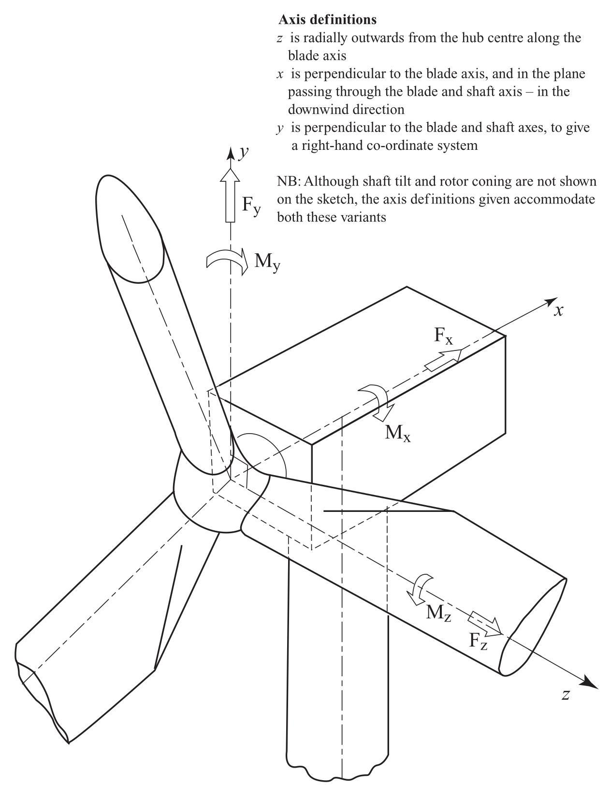

Figure C1 Co-ordinate System for Blade Loads, Positions and Deflections (rotates with blade)

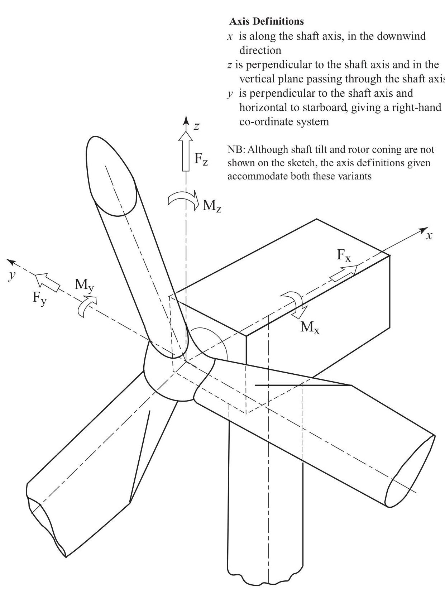

Figure C2 Fixed Co-ordinate System for Hub Loads and Deflections, and Positions with Respect to Hub

Plate 1 Figure 1.2(a) Rhyl Flats Offshore Wind Farm: 25 × 3.6 MW Siemens wind turbines. Rhyl Flats was built and is operated by RWE npower renewables. Photographer: Guy Woodland. Photos reproduced courtesy of RWE npower renewables.

Plate 2 Figure 1.2(c) Assembly of Siemens 3.6 MW wind turbine. Photographer: Guy Woodland. Photos reproduced courtesy of RWE npower renewables.

Plate 3 Figure 7.8 Blade Production. View of veneer lay-up in mould to make one blade skin. The blade is completed by glueing face and camber skins together. Reproduced by permission of NEG-Micon

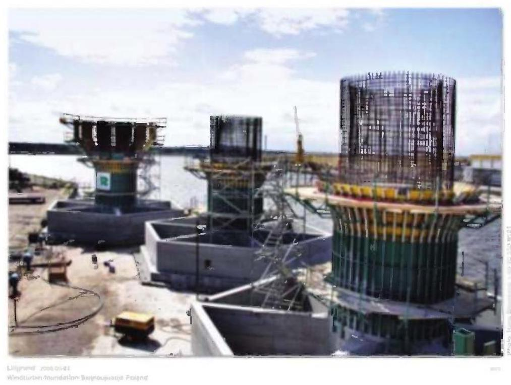

Plate 4 Figure 11.48 Gravity bases for Lillgrund under construction on barge at quayside at Swinoujscie. (Lillgrund Pilot Project, 2008). Reproduced by permission of Vattenfall

Plate 5 Figure 11.49 Lowering of gravity base by floating crane during installation at Lillgrund windfarm. (Lillgrund Pilot Project, 2008). Reproduced by permission of Vattenfall

Plate 6 Figure 11.52 Anchorage of jacket leg to pile using concentric jacket stab-in and grouted joint-Ormonde windfarm. Reproduced by permission of Offshore Design Engineering Ltd (ode)

Plate 7 Figure 11.55 Tripile structure after installation. The yellow pile tops, which sport circumferential stripe markings, extend up to platform level with the cylinders above forming part of the three-arm transition structure. Reproduced by permission of BARD Group/Scheer

Plate 8 Figure 11.59 Offshore sub-station at Lillgrund. Lillgrund Pilot Project, 2008. Reproduced by permission of Vattenfal

## 1 Introduction

### 1.1 Historical development

Windmills have been used for at least 3000 years, mainly for grinding grain or pumping water; while in sailing ships the wind has been an essential source of power for even longer. From medieval times, horizontal axis windmills were an integral part of the rural economy and only fell into disuse with the advent of cheap fossil-fuelled stationary engines and then the spread of rural electrification (Musgrove, 2010). The use of windmills (or wind turbines) to generate electricity can be traced back to the late nineteenth century with the ${12}\mathrm{\;{kW}}$ direct current windmill generator constructed by Charles Brush in the USA and the research undertaken by Poul la Cour in Denmark. However, for much of the twentieth century there was little interest in using wind energy for electricity generation, other than for battery charging for remote dwellings; and these low power systems were quickly removed once access to the electricity grid became available. One notable development was the 1250 kW Smith-Putnam wind turbine constructed in the USA in 1941. This remarkable machine had a steel rotor ${53}\mathrm{\;m}$ in diameter, full span pitch control and flapping blades to reduce loads. Although a blade spar failed catastrophically in 1945, it remained the largest wind turbine constructed for some 40 years (Putnam, 1948).

Golding (1955) and Shepherd and Divone in Spera (1994) provide a fascinating history of early wind turbine development. They record the ${100}\mathrm{\;{kW}}{30}\mathrm{\;m}$ diameter Balaclava wind turbine in the then USSR in 1931 and the Andrea Enfield ${100}\mathrm{{kW}}{24}\mathrm{\;m}$ diameter pneumatic design constructed in the UK in the early 1950s. In this turbine, hollow blades, open at the tip, were used to draw air up through the tower where another turbine drove the generator. In Denmark the ${200}\mathrm{{kW}}{24}\mathrm{\;m}$ diameter Gedser machine was built in 1956, while Electricite de France tested a 1.1 MW 35 m diameter turbine in 1963. In Germany, Professor Ulrich Hutter constructed a number of innovative, lightweight turbines in the 1950s and 1960s. In spite of these technical advances and the enthusiasm of Golding at the Electrical Research Association in the UK, among others, there was little sustained interest in wind generation until the price of oil rose dramatically in 1973.

---

Wind Energy Handbook, Second Edition. Tony Burton, Nick Jenkins, David Sharpe and Ervin Bossanyi.

© 2011 John Wiley & Sons, Ltd. Published 2011 by John Wiley & Sons, Ltd. ISBN: 978-0-470-69975-1

---

The sudden increase in the price of oil stimulated a number of substantial, government funded programmes of research, development and demonstration. In the USA this led to the construction of a series of prototype turbines starting with the ${38}\mathrm{\;m}$ diameter ${100}\mathrm{\;{kW}}$ Mod-0 in 1975 and culminating in the ${97.5}\mathrm{\;m}$ diameter ${2.5}\mathrm{{MW}}$ Mod-5B in 1987. Similar programmes were pursued in the UK, Germany and Sweden. There was considerable uncertainty as to which architecture might prove most cost-effective and several innovative concepts were investigated at full scale. In Canada, a 4 MW vertical axis Darrieus wind turbine was constructed and this concept was also investigated in the ${34}\mathrm{\;m}$ diameter Sandia Vertical Axis test facility in the USA. In the UK, an alternative, vertical axis design using straight blades to give an 'H' type rotor was proposed by Dr Peter Musgrove and a ${500}\mathrm{{kW}}$ prototype constructed (Musgrove, 2010). In 1981 an innovative horizontal axis 3 MW wind turbine was built and tested in the USA. This used hydraulic transmission and, as an alternative to a yaw drive, the entire structure was orientated into the wind. The best choice for the number of blades remained unclear for some while and large horizontal axis turbines were constructed with one, two or three blades.

Much important scientific and engineering information was gained from these government funded research programmes and the prototypes generally worked as designed. However, the problems of operating very large wind turbines, unmanned and in difficult wind climates, were often underestimated and the reliability of the prototypes was not good. At the same time as the multi-megawatt prototypes were being constructed private companies, often with considerable state support, were manufacturing much smaller, often simpler, turbines for commercial sale. In particular the financial support mechanisms in California in the mid-1980s resulted in installation of a very large number of quite small (<100 kW) wind turbines. A number of these designs also suffered from various problems but, being smaller, they were generally easier to repair and modify. The Danish wind turbine concept emerged of a three-bladed, upwind stall regulated rotor and a fixed-speed, induction generator drive train. This deceptively simple architecture proved to be remarkably successful and was implemented on turbines as large as ${60}\mathrm{\;m}$ in diameter and at ratings of up to 1.5 MW. However, at large rotor diameters and generator ratings, the architecture ceases to be effective as aerodynamic stall is increasingly difficult to predict, an induction generator no longer easily provides enough damping and torsional compliance in the drive train and the requirements of the electrical Transmission System Operators for connection to the network, the Grid Codes become difficult to meet. Hence, as the size of commercially available turbines approached or exceeded that of the large prototypes of the 1980s the concepts investigated then of variable speed operation, full-span control of the blade pitch and advanced materials were used increasingly by designers.

In 1991 the first offshore wind farm was constructed at Vindeby consisting of eleven, ${450}\mathrm{\;{kW}}$ wind turbines located up to $3\mathrm{\;{km}}$ offshore. Throughout the 1990s small numbers of offshore wind turbines were placed close to shore, while in 2002 the Horns Rev, 160 MW wind farm, some ${20}\mathrm{\;{km}}$ off the western coast of Denmark, was constructed. This was the first project to use an offshore substation that increased the power collection voltage of ${30}\mathrm{{kV}}$ to ${150}\mathrm{{kV}}$ for transmission to shore. At the time of writing (2010) a ${500}\mathrm{{MW}}$ wind offshore wind farm (Greater Gabbard) is under construction off the coast of England with 1000 MW projects under development. The wind turbines that have been installed in these offshore wind farms have been marinised versions of 3-bladed, upwind terrestrial designs. However, the possibility of higher blade tip-speeds, because of more relaxed noise constraints and a reduced emphasis on visual appearance in sites far from land, are leading to an interest in the development of very large, lower solidity rotors with two or even one blade.

The stimulus for the development of wind energy in 1973 was the increase in the price of oil and concern over limited fossil fuel resources. From around 1990, the main driver for use of wind turbines to generate electrical power was the very low ${\mathrm{{CO}}}_{2}$ emissions (over the entire life cycle of manufacture, installation, operation and de-commissioning) and the potential of wind energy to help mitigate climate change. Then from around 2006 the very high oil price and concerns over security of energy supplies led to a further increase of interest in wind energy and a succession of policy measures were put in place in many countries to encourage its use. In 2007 the European Union declared a policy that ${20}\%$ of all energy should be from renewable sources by 2020. Because of the difficulty of using renewable energy for transport and heat, this implies that in some countries 30-40% of electrical energy should come from renewables, with wind energy likely to play a major part. Energy policy continues to develop rapidly with many countries adopting ambitions to reduce greenhouse gas emissions of up to 80% by 2050 in order to mitigate climate change.

The development of wind energy in some countries has been more rapid than in others and this difference cannot be explained simply by differences in the wind speeds. Important factors include the financial support mechanisms for wind generated electricity, access to the electrical network, the process by which the local authorities give permission for the construction of wind farms and the perception of the general population, particularly with respect to visual impact. The development of offshore sites, although at considerably increased cost, is in response to these concerns over the environmental impact of wind farms.

As a relatively new generation technology, wind energy requires financial support to encourage its development and stimulate investment from private companies. Such support is provided in many countries and recognises the contribution wind generation makes to climate change mitigation and security of national energy supplies. There is presently an active debate as to the best mechanism of providing such support so that it stimulates the development of wind energy at minimum cost and without distorting the electricity market.

Feed-in-Tariffs are offered in a number of countries, most notably Germany and Spain. A fixed price is paid for each kWh generated from renewable sources with different rates for wind energy, photovoltaic solar energy and other renewable energy technologies. This support mechanism has the benefit of giving certainty of the revenue stream from a successful project and is credited by its supporters for the very rapid development of wind energy, and other renewables, in these countries. An alternative approach is a quota or Renewable Portfolio Standard system where a government places an obligation on electricity suppliers to source a certain fraction of the energy they supply from renewable sources. An example is the UK Renewable Obligation Certificate system where renewable energy generators are awarded green certificates for energy generated from renewable sources. These green certificates are traded independently from the electrical energy and electricity suppliers who fail to acquire their quota pay a buy-out price. With this support mechanism risk is transferred to the project developer and only the most commercially attractive renewable technologies are developed. Historically, Capacity Auctions have also been used, such as the earlier UK NFFO mechanism and similar examples in Ireland and France. A national government determines the volume of wind energy required and conducts an auction for capacity on price. Capacity Auctions suffered from some wind farm developers bidding low to secure agreements and then not constructing projects.

Although the form of these support mechanisms, and particularly their stability, is important, it may be argued that other factors including access to the electricity grid, speed of the planning/permitting system and public acceptability play a critical role in determining the rate of deployment of wind energy. It is also likely that more general support measures for low carbon electricity generation, for example the European Union Emissions Trading Scheme or wider carbon taxes, will provide significant support for the development of wind energy in the future.

### 1.2 Modern wind turbines

The power output from a wind turbine is given by the well-known expression:

$$
P = \frac{1}{2}{C}_{p}{\rho A}{U}^{3} \tag{1.1}
$$

where

$\rho$ is the density of air $\left( {{1.25}\mathrm{\;{kg}}/{\mathrm{m}}^{3}}\right)$

${C}_{p}$ is the power coefficient

$A$ is the rotor swept area

$U$ is the wind speed

The density of air is rather low, 800 times less than water which powers hydro plant, and this leads directly to the large size of a wind turbine. Depending on the design wind speed chosen, a $3\mathrm{{MW}}$ wind turbine may have a rotor that is more than ${90}\mathrm{\;m}$ in diameter. The power coefficient describes that fraction of the power in the wind that may be converted by the turbine into mechanical work. It has a theoretical maximum value of 0.593 (the Betz limit) and rather lower peak values are achieved in practice (see Chapter 3). The power coefficient of a rotor varies with the tip speed ratio, (the ratio of rotor tip speed to free wind speed) and is only a maximum for a unique tip speed ratio. Incremental improvements in the power coefficient are continually being sought by detailed design changes of the rotor and by operating at variable speed it is possible to maintain the maximum power coefficient over a range of wind speeds. However, these measures will give only a modest increase in the power output. Major increases in the output power can only be achieved by increasing the swept area of the rotor or by locating the wind turbines on sites with higher wind speeds.

Hence, over the last 40 years there has been a continuous increase in the rotor diameter of commercially available wind turbines from less than ${30}\mathrm{\;m}$ to more than ${100}\mathrm{\;m}$ . A tripling of the rotor diameter leads to a nine times increase in power output. The influence of the wind speed is, of course, more pronounced with a doubling of wind speed leading to an eight fold increase in power. Thus, there have been considerable efforts to ensure that wind farms are developed in areas of the highest wind speeds and the turbines optimally located within wind farms. In certain countries very high towers are being used (more than ${100}\mathrm{\;m}$ high) to take advantage of the increase of wind speed with height.

In the past a number of studies were undertaken to determine the 'optimum' size of a wind turbine by balancing the complete costs of manufacture, installation and operation of various sizes of wind turbines against the revenue generated (Molly et al., 1993). The results indicated a minimum cost of energy would be obtained with wind turbine diameters in the range of ${35} - {60}\mathrm{\;m}$ , depending on the assumptions made. However, these estimates would now appear to be too low and there is no obvious point at which rotor diameters and, hence, output power will be limited particularly for offshore wind turbines where the very large components can be transported by ship directly from the factory to site.

Figure 1.1 Wind power capacity world-wide (World Wind Energy Association, 2009)

All modern electricity generating wind turbines use the lift force derived from the blades to drive the rotor. A high rotational speed of the rotor is desirable in order to reduce the gearbox ratio required and this leads to low solidity rotors (the ratio of blade area/rotor swept area). The low solidity rotor acts as an effective energy concentrator and as a result the energy generated over a wind turbine's life is much less than that used for its manufacture and installation. An energy balance analysis of a 3 MW wind turbine showed that the expected average time to generate a similar quantity of energy to that used for its manufacture, operation, transport, dismantling and disposal was 6-7 months (European Wind Energy Association (EWEA), 2009). A similar time was calculated for installation both onshore and offshore.

Until around 2000, the installed wind turbine generating capacity was so low that its output was viewed by electricity Transmission System Operators simply as negative load that supplied energy but played no part in supporting the operation of the power system and maintaining its stability. Since then, with the very much increased capacity of wind generation (Figure 1.1), turbines are required to contribute to the operation of the power system. The requirements for their performance are defined through the Grid Codes, issued by the Transmission System Operators. Compliance is mandatory before connection to the network is allowed. The Grid Codes specify operational requirements so that in addition to contributing energy, or real power, ${}^{1}$ the wind turbines provide ancillary services particularly for voltage and frequency control. At present the Grid Codes differ in detail from country to country but generally specify that wind turbines must remain stable and connected to the network in case of electrical faults on the network, define their performance in terms of reactive power for voltage control and their ability to vary real power for frequency support. As wind turbines become an ever increasing fraction of electricity generating capacity, it is likely that further requirements will be placed on them to replicate the ancillary services previously provided by conventional synchronous generators. Compliance with the Grid Code requirements is difficult to achieve with simple fixed speed induction generators using the Danish concept and these regulations are a major driver for the use of variable speed generators.

---

${}^{1}$ In a large interconnected electric power transmission system, real power controls system frequency while reactive power determines the voltages of the network.

---

### 1.3 Scope of the book

The use of wind energy to generate electricity is now well accepted with a large industry manufacturing and installing tens of GWs of new capacity each year. Although there are exciting new developments, particularly in very large wind turbines, and many challenges remain, there is a considerable body of established knowledge concerning the science and technology of wind turbines. This book records some of this knowledge and presents it in a form suitable for use by students (at final year undergraduate or post-graduate level) and by those involved in the design, manufacture or operation of wind turbines. The overwhelming majority of wind turbines presently in use are horizontal axis connected to a large electricity network. These turbines are the subject of this book.

Chapter 2 discusses the wind resource. Particular reference is made to wind turbulence due to its importance in wind turbine design. Chapter 3 sets out the basis of the aerodynamics of horizontal axis wind turbines, while Chapter 4 discusses aspects of their performance. Any wind turbine design starts with establishing the design loads and these are discussed in Chapter 5. Chapter 6 sets out the various design options for horizontal axis wind turbines with approaches to the design of some of the important components examined in Chapter 7. The functions of the wind turbine controller and some of the possible analysis techniques described are discussed in Chapter 8. In Chapter 9 wind farms and the development of wind energy projects are reviewed with particular emphasis on environmental impact. Chapter 10 considers how wind turbines interact with the electrical power system while Chapter 11 deals with the important topic of offshore wind energy.

The book attempts to record well-established knowledge that is relevant to wind turbines which are currently commercially significant. Thus, it does not discuss a number of interesting research topics or areas where wind turbine technology is still evolving. Although they were investigated in considerable detail in the 1980s, large vertical axis wind turbines have not proved to be commercially competitive and are not currently manufactured in significant numbers. Hence, the particular issues of vertical axis turbines are not dealt with in this text.

There are presently some 2 billion people in the world without access to mains electricity and, in conjunction with other generators (e.g. diesel engines), wind turbines may in the future be an effective means of providing some of them with power. However, autonomous power systems are extremely difficult to design and operate reliably, particularly in remote areas of the world and with limited budgets. A small autonomous AC power system has all the technical challenges of a large national electricity system but, due to the low inertia of the generators, requires a very fast, sophisticated control system to maintain stable operation. Over the last 30 years there have been a number of attempts to operate autonomous wind-diesel systems on islands or for other remote communities throughout the world, but with only limited success. This class of installation has its own particular problems and again, given the very limited size of the market at present, this specialist area is not dealt with in this book.

Installations of offshore wind turbines are now commencing in significant numbers (Figure 1.2). The first offshore wind farms were installed in rather shallow waters and used marinised terrestrial designs. A number of larger offshore wind farms used offshore substations to increase the transmission voltage, while prototype floating wind turbines for deeper waters have been deployed. Very large wind farms with multi-megawatt turbines many kilometres offshore are now being planned and will be constructed over the coming years.

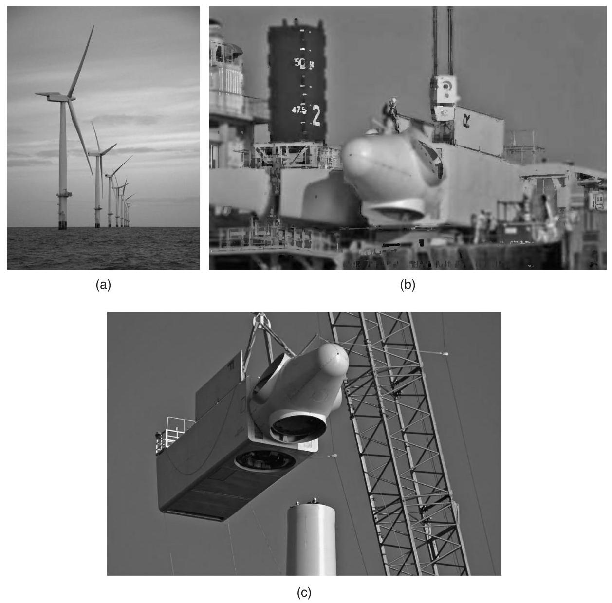

Figure 1.2 (a) Rhyl Flats Offshore Wind Farm. See Plate 1 for the colour figure. (b) 3.6 MW nacelle prior to lifting. (c) Assembly of 3.6 MW wind turbine. Rhyl Flats Offshore Wind Farm consists of ${25} \times  {3.6}\mathrm{{MW}}$ Siemens wind turbines. Hub height $- {80}\mathrm{\;m}$ above mean sea level (MSL). Height to blade tip - 134 m above MSL. Rhyl Flats Offshore Wind Farm was built and is operated by RWE npower renewables. Photographer: Guy Woodland. Photos reproduced courtesy of RWE npower renewables. See Plate 2 for the colour figure

## References

European Wind Energy Association (EWEA) (2009) Wind energy the facts. Earthscan, London.

Golding, E.W. (1955) 'The generation of electricity from wind power', E & F.N. Spon, London (reprinted R.I. Harris, London 1976).

8 INTRODUCTION

Molly, J.P., Keuper, A. and Veltrup, M. (1993) 'Statistical WEC Design and Cost Trends', Proceedings of the European Wind Energy Conference, Travemunde 8-12 March 1993, pp. 57-59.

Musgrove, P. (2010) 'Wind Power', Cambridge University Press, Cambridge.

Putnam, G.C. (1948) 'Power from the Wind', Van Nostrand Rheinhold, New York.

Spera, D.A. (1994) 'Wind Turbine Technology, Fundamental Concepts of Wind Turbine Engineering', ASME Press, New York.

World Wind Energy Association (2009), 'World wind energy report 2009'. www.wwindea.org.

## Further Reading

Eggleston, D.M. and Stoddard, F.S. (1987) 'Wind Turbine Engineering Design', Van Nostrand Rhein-hold, New York.

Freris, L.L. (ed.) (1990) 'Wind Energy Conversion Systems', Prentice-Hall, New York.

Gipe, P. (1995) 'Wind Energy Comes of Age', John Wiley & Sons Inc., New York.

Harrison, R., Hau, E., and Snel, H. (2000) 'Large Wind Turbines, Design and Economics', John Wiley & Sons Ltd., Chichester.

Hau, E. (2006) 'Wind Turbines: Fundamentals, Technologies, Application, Economics, 2nd edition', Springer, Heidelberg.

Johnson, L. (1985) 'Wind Energy Systems', Prentice-Hall, New York.

Le Gourieres, D. (1992) 'Wind Power Plants Theory and Design', Pergamon Press, Oxford.

Manwell, J.W., McGowan, J.G. and Rogers, A.L. (2009) 'Wind Energy Explained, Theory, Design and Application, 2nd edition', Wiley-Blackwell, Oxford.

Twiddell, J.W. and Weir, A.D. (1986) 'Renewable Energy Resources', E & F.N. Spon, London.

Twidell, J.W. and Gaudiosi, G. (eds) (2009) 'Offshore Wind Power', Multi-science Publishing Co., Brentwood.

## 2 The wind resource

### 2.1 The nature of the wind

The energy available in the wind varies as the cube of the wind speed, so an understanding of the characteristics of the wind resource is critical to all aspects of wind energy exploitation, from the identification of suitable sites and predictions of the economic viability of wind farm projects through to the design of wind turbines themselves, and understanding their effect on electricity distribution networks and consumers.

From the point of view of wind energy, the most striking characteristic of the wind resource is its variability. The wind is highly variable, both geographically and temporally. Furthermore this variability persists over a very wide range of scales, both in space and time. The importance of this is amplified by the cubic relationship to available energy.

On a large scale, spatial variability describes the fact that there are many different climatic regions in the world, some much windier than others. These regions are largely dictated by the latitude, which affects the amount of insolation. Within any one climatic region, there is a great deal of variation on a smaller scale, largely dictated by physical geography - the proportion of land and sea, the size of land masses and the presence of mountains or plains, for example. The type of vegetation may also have a significant influence through its effects on the absorption or reflection of solar radiation, affecting surface temperatures, and on humidity.

More locally, the topography has a major effect on the wind climate. More wind is experienced on the tops of hills and mountains than in the lee of high ground or in sheltered valleys, for instance. More locally still, wind velocities are significantly reduced by obstacles such as trees or buildings.

At a given location, temporal variability on a large scale means that the amount of wind may vary from one year to the next, with even longer scale variations on a scale of decades or more. These long-term variations are not well understood, and may make it difficult to make accurate predictions of the economic viability of particular wind farm projects, for instance.

On timescales shorter than a year, seasonal variations are much more predictable, although there are large variations on shorter timescales still, which although reasonably well understood are often not very predictable more than a few days ahead. Depending on location, there may also be considerable variations with the time of day (diurnal variations) which again are usually fairly predictable. On these timescales, the predictability of the wind is important for integrating large amounts of wind power into the electricity network, to allow the other generating plant supplying the network to be organised appropriately.

---

Wind Energy Handbook, Second Edition. Tony Burton, Nick Jenkins, David Sharpe and Ervin Bossanyi.

© 2011 John Wiley & Sons, Ltd. Published 2011 by John Wiley & Sons, Ltd. ISBN: 978-0-470-69975-1

---

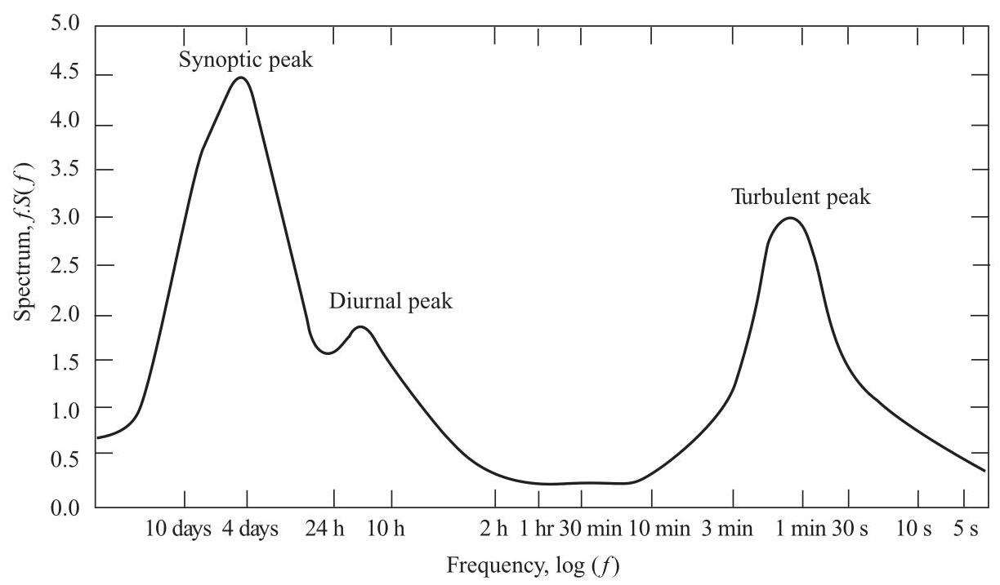

Figure 2.1 Wind spectrum from Brookhaven based on work by van der Hoven (1957)

On still shorter timescales of minutes down to seconds or less, wind speed variations known as turbulence can have a very significant impact on the design and performance of the individual wind turbines, as well as on the quality of power delivered to the network and its effect on consumers.

Van der Hoven (1957) constructed a wind speed spectrum from long and short-term records at Brookhaven, New York, showing clear peaks corresponding to the synoptic, diurnal and turbulent effects referred to above (Figure 2.1). Of particular interest is so-called 'spectral gap' occurring between the diurnal and turbulent peaks, showing that the synoptic and diurnal variations can be treated as quite distinct from the higher frequency fluctuations of turbulence. There is very little energy in the spectrum in the region between two hours and ten minutes. As indicated in the next section, the nature of the wind regime in different geographical locations can vary widely, so the Van der Hoven spectrum cannot be assumed to be universally applicable. Nevertheless the concept of a spectral gap at frequencies below ten minutes is very often used, often implicitly, when making assumptions about the wind regime.

### 2.2 Geographical variation in the wind resource

Ultimately the winds are driven almost entirely by the sun's energy, causing differential surface heating. The heating is most intense on land masses closer to the equator, and obviously the greatest heating occurs in the daytime, which means that the region of greatest heating moves around the earth's surface as it spins on its axis. Warm air rises and circulates in the atmosphere to sink back to the surface in cooler areas. The resulting large scale motion of the air is strongly influenced by Coriolis forces due to the earth's rotation. The result is a large-scale global circulation pattern. Certain identifiable features of this are well known, such as the trade winds and the 'roaring forties'.

The non-uniformity of the earth's surface, with its pattern of land masses and oceans, ensures that this global circulation pattern is disturbed by smaller-scale variations on continental scales. These variations interact in a highly complex and non-linear fashion to produce a somewhat chaotic result, which is at the root of the day-to-day unpredictability of the weather in particular locations. Clearly though, underlying tendencies remain which lead to clear climatic differences between regions. These differences are tempered by more local topographical and thermal effects.

Hills and mountains result in local regions of increased wind speed. This is partly a result of altitude - the boundary layer flow over the earth's surface means that wind speed generally increases with height above the ground, and hill tops and mountain peaks may 'project' into the higher wind speed layers. It is also partly a result of the acceleration of the wind flow over and around hills and mountains, and funnelling through passes or along valleys aligned with the flow. Equally, topography may produce areas of reduced wind speed, such as sheltered valleys, areas in the lee of a mountain ridge or where the flow patterns result in stagnation points.

Thermal effects may also result in considerable local variations. Coastal regions are often windy because of differential heating between land and sea. While the sea is warmer than the land, a local circulation develops in which surface air flows from the land to the sea, with warm air rising over the sea and cool air sinking over the land. When the land is warmer the pattern reverses. The land will heat up and cool down more rapidly than the sea surface, and so this pattern of land and sea breezes tends to reverse over a 24-hour cycle. These effects were important in the early development of wind power in California, where an ocean current brings cold water to the coast, not far from desert areas which heat up strongly by day. An intervening mountain range funnels the resulting air flow through its passes, generating locally very strong and reliable winds (which are well correlated with peaks in the local electricity demand caused by air conditioning loads).

Thermal effects may also be caused by differences in altitude. Thus, cold air from high mountains can sink down to the plains below, causing quite strong and highly stratified 'downslope' winds.

The brief general descriptions of wind speed variations in Sections 2.1-2.5 are illustrative, and more detailed information can be found in standard meteorological texts. Section 9.1.3, in Chapter 9, describes how the wind regimes at candidate sites can be assessed, while wind forecasting is covered in Section 2.9.

Section 2.6 presents a more detailed description of the high frequency wind fluctuations known as turbulence, which are crucial to the design and operation of wind turbines and have a major influence on wind turbine loads. Extreme winds are also important for the survival of wind turbines, and these are described in Section 2.8.

### 2.3 Long-term wind speed variations

There is evidence that the wind speed at any particular location may be subject to very slow long-term variations. Although the availability of accurate historical records is a limitation, careful analysis by, for example, Palutikoff et al. (1991) has demonstrated clear trends. Clearly these may be linked to long-term temperature variations for which there is ample historical evidence. There is also much debate at present about the likely effects of global warming, caused by human activity, on climate, and this will undoubtedly affect wind climates in the coming decades.

Apart from these long-term trends there may be considerable changes in windiness at a given location from one year to the next. These changes have many causes. They may be coupled to global climate phenomena such as el niño, changes in atmospheric particulates resulting from volcanic eruptions, and sunspot activity, to name a few.

These changes add significantly to the uncertainty in predicting the energy output of a wind farm at a particular location during its projected lifetime.

### 2.4 Annual and seasonal variations

While year-to-year variation in annual mean wind speeds remains hard to predict, wind speed variations during the year can be well characterised in terms of a probability distribution. The Weibull distribution has been found to give a good representation of the variation in hourly mean wind speed over a year at many typical sites. This distribution takes the form

$$
F\left( U\right)  = \exp \left( {-{\left( \frac{U}{c}\right) }^{k}}\right) \tag{2.1}
$$

where $F\left( U\right)$ is the fraction of time for which the hourly mean wind speed exceeds $U$ . It is characterised by two parameters: a ’scale parameter’ $c$ and a ’shape parameter’ $k$ which describes the variability about the mean. $c$ is related to the annual mean wind speed $\bar{U}$ by the relationship

$$
\bar{U} = {c\Gamma }\left( {1 + 1/k}\right) \tag{2.2}
$$

where $\Gamma$ is the complete gamma function. This can be derived by consideration of the probability density function

$$
f\left( U\right)  =  - \frac{{dF}\left( U\right) }{dU} = k\frac{{U}^{k - 1}}{{c}^{k}}\exp \left( {-{\left( \frac{U}{c}\right) }^{k}}\right) \tag{2.3}
$$

since the mean wind speed is given by

$$
\bar{U} = {\int }_{0}^{\infty }{Uf}\left( U\right) {dU} \tag{2.4}
$$

A special case of the Weibull distribution is the Rayleigh distribution, with $k = 2$ , which is actually a fairly typical value for many locations. In this case, the factor $\Gamma \left( {1 + 1/k}\right)$ has the value $\sqrt{\pi }/2 = {0.8862}$ . A higher value of $k$ , such as 2.5 or 3, indicates a site where the variation of hourly mean wind speed about the annual mean is small, as is sometimes the case in the trade wind belts, for instance. A lower value of $k$ , such as 1.5 or 1.2, indicates greater variability about the mean. A few examples are shown in Figure 2.2. The value of $\Gamma \left( {1 + 1/k}\right)$ varies little, between about 1.0 and 0.885: see Figure 2.3.

Figure 2.2 Example Weibull distributions

The Weibull distribution of hourly mean wind speeds over the year is clearly the result of a considerable degree of random variation. However, there may also be a strong underlying seasonal component to these variations, driven by the changes in insolation during the year as a result of the tilt of the earth's axis of rotation. Thus, in temperate latitudes the winter months tend to be significantly windier than the summer months. There may also be a tendency for strong winds or gales to develop around the time of the spring and autumn equinoxes. Tropical regions also experience seasonal phenomena, such as monsoons and tropical storms, which affect the wind climate. Indeed the extreme winds associated with tropical storms may significantly influence the design of wind turbines intended to survive in these locations.

Figure 2.3 The factor $\Gamma \left( {1 + 1/k}\right)$

Although a Weibull distribution gives a good representation of the wind regime at many sites, this is not always the case. For example, some sites showing distinctly different wind climates in summer and winter can be represented quite well by a double-peaked 'bi-Weibull' distribution, with different scale factors and shape factors in the two seasons, that is,

$$
F\left( U\right)  = {F}_{1}\exp \left( {-{\left( \frac{U}{{c}_{1}}\right) }^{{k}_{1}}}\right)  + \left( {1 - {F}_{1}}\right) \exp \left( {-{\left( \frac{U}{{c}_{2}}\right) }^{{k}_{2}}}\right) \tag{2.5}
$$

Certain parts of California are good examples of this.

### 2.5 Synoptic and diurnal variations

On shorter timescales than the seasonal changes described in Section 2.4, wind speed variations are somewhat more random and less predictable. Nevertheless, these variations contain definite patterns. The frequency content of these variations typically peaks at around four days or so. These are the 'synoptic' variations which are associated with large-scale weather patterns such as areas of high and low pressure and associated weather fronts as they move across the earth's surface. Coriolis forces induce a circular motion of the air as it tries to move from high to low pressure regions. These coherent large-scale atmospheric circulation patterns may typically take a few days to pass over a given point, although they may occasional 'stick' in one place for longer before finally moving on or dissipating.

Following the frequency spectrum to still higher frequencies, many locations will show a distinct diurnal peak, at a frequency of 24 hours. This is usually driven by local thermal effects. Intense heating in the daytime may cause large convection cells in the atmosphere, which die down at night. This process is described in more detail in Section 2.6 as it also contributes significantly to turbulence, on timescales representative of the size of the convection cells. Land and sea breezes, caused by differential heating and cooling between land and sea, also contribute significantly to the diurnal peak. The daily direction reversal of these winds would be seen as a 12-hour peak in the spectrum of wind speed magnitude.

### 2.6 Turbulence

#### 2.6.1 The nature of turbulence

Turbulence refers to fluctuations in wind speed on a relatively fast timescale, typically less than about ten minutes. In other words it corresponds to the highest frequency spectral peak in Figure 2.1. It is useful to think of the wind as consisting of a mean wind speed determined by the seasonal, synoptic and diurnal effects described above, which varies on a timescale of one to several hours, with turbulent fluctuations superimposed. These turbulent fluctuations then have a zero mean when averaged over about ten minutes. This description is a useful one as long as the 'spectral gap' as illustrated in Figure 2.1 is reasonably distinct.

Turbulence is generated mainly from two causes: 'friction' with the earth's surface, which can be thought of as extending as far as flow disturbances caused by topographical features such as hills and mountains; and thermal effects which can cause air masses to move vertically as a result of variations in temperature and, hence, in the density of the air. Often these two effects are interconnected, such as when a mass of air flows over a mountain range and is forced up into cooler regions where it is no longer in thermal equilibrium with its surroundings.

Turbulence is clearly a complex process, and one which cannot be represented simply in terms of deterministic equations. Clearly it does obey certain physical laws, such as those describing the conservation of mass, momentum and energy. However, in order to describe turbulence using these laws it is necessary to take account of temperature, pressure, density and humidity as well as the motion of the air itself in three dimensions. It is then possible to formulate a set of differential equations describing the process, and in principle the progress of the turbulence can be predicted by integrating these equations forward in time starting from certain initial conditions and subject to certain boundary conditions. In practice of course, the process can be described as 'chaotic' in that small differences in initial conditions or boundary conditions may result in large differences in the predictions after a relatively short time. For this reason it is generally more useful to develop descriptions of turbulence in terms of its statistical properties.

There are many statistical descriptors of turbulence which may be useful, depending on the application. These range from simple turbulence intensities and gust factors to detailed descriptions of the way in which the three components of turbulence vary in space and time as a function of frequency.

The turbulence intensity is a measure of the overall level of turbulence. It is defined as

$$
I = \frac{\sigma }{\bar{U}} \tag{2.6}
$$

where $\sigma$ is the standard deviation of wind speed variations about the mean wind speed $\bar{U}$ , usually defined over ten minutes or an hour. Turbulent wind speed variations can be considered to be roughly Gaussian, meaning that the speed variations are normally distributed, with standard deviation $\sigma$ , about the mean wind speed $\bar{U}$ . However, the tails of the distribution may be significantly non-Gaussian, so this approximation is not reliable for estimating, say, the probability of a large gust within a certain period.

The turbulence intensity clearly depends on the roughness of the ground surface and the height above the surface. However, it also depends on topographical features such as hills or mountains, especially when they lie upwind, as well as more local features such as trees or buildings. It also depends on the thermal behaviour of the atmosphere: for example, if the air near to the ground warms up on a sunny day it may become buoyant enough to rise up through the atmosphere, causing a pattern of convection cells which are experienced as large-scale turbulent eddies.

Clearly as the height above ground increases, the effects of all these processes which are driven by interactions at the earth's surface become weaker. Above a certain height, the air flow can be considered largely free of surface influences. Here it can be considered to be driven by large scale synoptic pressure differences and the rotation of the earth. This air flow is known as the geostrophic wind. At lower altitudes, the effect of the earth's surface can be felt. This part of the atmosphere is known as the boundary layer. The properties of the boundary layer are important in understanding the turbulence experienced by wind turbines.

#### 2.6.2 The boundary layer

The principal effects governing the properties of the boundary layer are the strength of the geostrophic wind, the surface roughness, Coriolis effects due to the earth's rotation and thermal effects.

The influence of thermal effects can be classified into three categories: stable, unstable and neutral stratification. Unstable stratification occurs when there is a lot of surface heating, causing warm air near the surface to rise. As it rises, it expands due to reduced pressure and, therefore, cools adiabatically. If the cooling is not sufficient to bring the air into thermal equilibrium with the surrounding air then it will continue to rise, giving rise to large convection cells. The result is a thick boundary layer with large-scale turbulent eddies. There is a lot of vertical mixing and transfer of momentum, resulting in a relatively small change of mean wind speed with height.

If the adiabatic cooling effect causes the rising air to become colder than its surroundings, its vertical motion will be suppressed. This is known as stable stratification. It often occurs on cold nights when the ground surface is cold. In this situation, turbulence is dominated by friction with the ground and wind shear (the increase of mean wind speed with height) can be large.

In the neutral atmosphere, adiabatic cooling of the air as it rises is such that it remains in thermal equilibrium with its surroundings. This is often the case in strong winds, when turbulence caused by ground roughness causes sufficient mixing of the boundary layer. For wind energy applications, neutral stability is usually the most important situation to consider, particularly when considering the turbulent wind loads on a turbine, since these are largest in strong winds. Nevertheless, unstable conditions can be important as they can result in sudden gusts from a low level, and stable conditions can give rise to significant asymmetric loadings due to high wind shear. There can also be rapid changes in wind direction with height in this situation.

In the following sections, a series of relationships are presented which describe the properties of the atmospheric boundary layer, such as turbulence intensities, spectra, length scales and coherence functions. These relationships are partly based on theoretical considerations and partly on empirical fits to a wide range of observations from many researchers taken in various conditions and in various locations.

In the neutral atmosphere, the boundary layer properties depend mainly on the surface roughness and the Coriolis effect. The surface roughness is characterised by the roughness length ${z}_{o}$ . Typical values of ${z}_{o}$ are shown in Table 2.1.

The Coriolis parameter $f$ is defined as

$$
f = {2\Omega }\sin \left( \left| \lambda \right| \right) \tag{2.7}
$$

where $\Omega$ is the angular velocity of the earth’s rotation, and $\lambda$ is the latitude. In temperate latitudes, the height of the boundary layer is given by

$$
h = {u}^{ * }/\left( {6f}\right) \tag{2.8}
$$

but it is clear from the division that this and the subsequent derivations cannot be valid at the equator, where $h = 0$ , so a pragmatic recommendation is to use a latitude of ${22.5}^{ \circ  }$ for all tropical regions. Here ${u}^{ * }$ is known as the friction velocity, given by

$$
{u}^{ * }/\bar{U}\left( z\right)  = \kappa /\left\lbrack  {\ln \left( {z/{z}_{\mathrm{o}}}\right)  + \Psi }\right\rbrack \tag{2.9}
$$

Table 2.1 Typical surface roughness lengths

<table><tr><td>Type of Terrain</td><td>Roughness length ${z}_{\mathrm{o}}\left( \mathrm{m}\right)$</td></tr><tr><td>Cities, forests</td><td>0.7</td></tr><tr><td>Suburbs, wooded countryside</td><td>0.3</td></tr><tr><td>Villages, countryside with trees and hedges</td><td>0.1</td></tr><tr><td>Open farmland, few trees and buildings</td><td>0.03</td></tr><tr><td>Flat grassy plains</td><td>0.01</td></tr><tr><td>Flat desert, rough sea</td><td>0.001</td></tr></table>

where $\kappa$ is the von Karman constant (approximately 0.4 ), $z$ is the height above ground and ${z}_{\mathrm{o}}$ is the surface roughness length. $\Psi$ is a function which depends on stability: it is negative for unstable conditions, giving rise to low wind shear; and positive for stable conditions, giving high wind shear. For neutral conditions, ESDU (1985) gives $\Psi  = {34.5fz}/{u}^{ * }$ , which is small compared to $\ln \left( {z/{z}_{\mathrm{o}}}\right)$ for situations of interest here. If $\Psi$ is ignored, the wind shear is then given by a logarithmic wind profile:

$$
\bar{U}\left( z\right)  \propto  \ln \left( {z/{z}_{0}}\right) \tag{2.10}
$$

A power law approximation,

$$
\bar{U}\left( z\right)  \propto  {z}^{\alpha } \tag{2.11}
$$

is often used, where the exponent $\alpha$ is typically about 0.14, but varies with the type of terrain. However, the value of $\alpha$ should also depend on the height interval over which the expression is applied, making this approximation less useful than the logarithmic profile.

However, the wind turbine design standards typically specify that a given exponent should be used; the IEC and GL standards, for example, specify an exponent of $\alpha  = {0.20}$ for normal wind conditions onshore and $\alpha  = {0.14}$ for normal wind conditions offshore. Both standards specify an exponent of $\alpha  = {0.11}$ for extreme wind conditions (onshore and offshore).

If there is a change in the surface roughness, the wind shear profile changes gradually downwind of the transition point, from the original to the new profile. Essentially, a new boundary layer starts, and the height of the boundary between the new and old boundary layers increases from zero at the transition point until the new boundary layer is fully established. The calculation of wind shear in the transition zone is covered by, for example, Cook (1985).

By combining Equations 2.8 and 2.9, we obtain the wind speed at the top of the boundary layer as

$$
\bar{U}\left( h\right)  = \frac{{u}^{ * }}{\kappa }\left( {\ln \left( \frac{{u}^{ * }}{f{z}_{0}}\right)  - \ln 6 + {5.75}}\right) \tag{2.12}
$$

This is similar to the so-called geostrophic wind speed, G, which is the notional wind speed driving the boundary layer as calculated from the pressure field. The geostrophic wind speed is given by

$$
G = \frac{{u}^{ * }}{\kappa }\sqrt{{\left\lbrack  \ln \left( \frac{{u}^{ * }}{f{z}_{0}}\right)  - A\right\rbrack  }^{2} + {B}^{2}} \tag{2.13}
$$

where, for neutral conditions, $A = \ln 6$ and $B = {4.5}$ . This relationship is often referred to as the geostrophic drag law.

The effect of surface roughness is not only to cause the wind speed to decrease closer to the ground. There is also a change in direction between the 'free' pressure-driven geostrophic wind and the wind close to the ground. Although the geostrophic wind is driven by the pressure gradients in the atmosphere, Coriolis forces act to force the wind to flow at right angles to the pressure gradient, causing a characteristic circulating pattern. Thus, in the northern hemisphere, wind flowing from high pressure in the south to low pressure in the north will be forced eastwards by Coriolis effects, in effect to conserve angular momentum on the rotating earth. The result is that the wind circulates anti-clockwise around low-pressure areas and clockwise around high-pressure areas, or the other way round in the southern hemisphere. Close to the ground, these flow directions are modified due to the effect of surface friction. The total direction change, $\alpha$ , from the geostrophic to the surface wind is given by

$$
\sin \alpha  = \frac{-B}{\sqrt{{\left\lbrack  \ln \left( \frac{{u}^{ * }}{f{z}_{0}}\right) \right\rbrack  }^{2} + {B}^{2}}} \tag{2.14}
$$

#### 2.6.3 Turbulence intensity

The turbulence intensity in the neutral atmosphere clearly depends on the surface roughness. For the longitudinal component, the standard deviation ${\sigma }_{u}$ is approximately constant with height, so the turbulence intensity decreases with height. More precisely, the relationship ${\sigma }_{u} \approx  {2.5}{u}^{ * }$ may be used to calculate the standard deviation, with the friction velocity ${u}^{ * }$ calculated as in the previous section. More recent work (ESDU, 1985) suggests a variation given by

$$
{\sigma }_{u} = \frac{{75\eta }{\left( {0.538} + {0.09}\ln \left( z/{z}_{0}\right) \right) }^{p}{u}^{ * }}{1 + {0.156}\ln \left( {{u}^{ * }/f \cdot  {z}_{0}}\right) } \tag{2.15}
$$

where

$$
\eta  = 1 - {6fz}/{u}^{ * } \tag{2.16}
$$

$$
p = {\eta }^{16} \tag{2.17}
$$

This approximates to ${\sigma }_{u} = {2.5}{u}^{ * }$ close to the ground, but gives larger values at greater heights. The longitudinal turbulence intensity is then

$$
{I}_{u} = {\sigma }_{u}/\bar{U} \tag{2.18}
$$

The lateral $\left( v\right)$ and vertical $\left( w\right)$ turbulence intensities are given (ESDU,1985) by

$$
{I}_{v} = \frac{{\sigma }_{v}}{\bar{U}} = {I}_{u}\left( {1 - {0.22}{\cos }^{4}\left( \frac{\pi z}{2h}\right) }\right) \tag{2.19}
$$

$$
{I}_{w} = \frac{{\sigma }_{w}}{\bar{U}} = {I}_{u}\left( {1 - {0.45}{\cos }^{4}\left( \frac{\pi z}{2h}\right) }\right) \tag{2.20}
$$

Note that specific values of turbulence intensity for use in design calculations are prescribed in some of the standards used for wind turbine design calculations, and these may not always correspond with the above expressions. For example, the now superseded Danish standard (DS472, 1992) specified

$$
{I}_{u} = {1.0}/\ln \left( {z/{z}_{0}}\right) \tag{2.21}
$$

with ${I}_{v} = {0.8}{I}_{u}$ and ${I}_{w} = {0.5}{I}_{u}$ .

The IEC edition 2 standard (IEC, 1999) gives

$$
{I}_{u} = {I}_{15}\left( {a + {15}/\bar{U}}\right) /\left( {a + 1}\right) \tag{2.22}
$$

where ${I}_{15} = {0.18}$ for ’higher turbulence sites’ and 0.16 for ’lower turbulence sites’, with corresponding values of $a$ of 2 and 3 respectively. For the lateral and vertical components, a choice is allowed: either ${I}_{v} = {0.8}{I}_{u}$ and ${I}_{w} = {0.5}{I}_{u}$ , or an isotropic model with ${I}_{u} = {I}_{v} = {I}_{w}$ .

The IEC edition 3 standard (IEC, 2005) specifies

$$
{I}_{u} = {I}_{\text{ ref }}\left( {{0.75} + {5.6}/\bar{U}}\right) \tag{2.23}
$$

where ${I}_{ref} = {0.16},{0.14}$ or 0.12 depending on the wind class. For lateral and vertical components, ${I}_{v}$ must be at least ${0.7}{I}_{u}$ , and ${I}_{w}$ at least ${0.5}{I}_{u}$ . Standard deviations are assumed constant with height, so the turbulence intensity will change with height as the mean wind speed changes due to wind shear.

The earlier Germanischer Lloyd rules (GL, 1993) simply specified 20% turbulence intensity, but the later edition (GL, 2003) follows IEC edition 2.

Figure 2.4 shows example longitudinal turbulence intensities for the GL, IEC and Danish standards. The low value for the Danish standard is for ${90}\mathrm{\;m}$ height with roughness length ${0.01}\mathrm{\;m}$ ; the high value is for ${30}\mathrm{\;m}$ height with roughness length ${0.3}\mathrm{\;m}$ . The high values for IEC editions 2 and 3 are the same, but the low value is significantly lower in edition 3.

Figure 2.4 Turbulence intensities according to various standards

#### 2.6.4 Turbulence spectra

The spectrum of turbulence describes the frequency content of wind speed variations. According to the Kolmogorov law, the spectrum must approach an asymptotic limit proportional to ${n}^{-5/3}$ at high frequency (here $n$ denotes the frequency, in Hz). This relationship is based on the decay of turbulent eddies to higher and higher frequencies as turbulent energy is dissipated as heat.

Two alternative expressions for the spectrum of the longitudinal component of turbulence are commonly used, both tending to this asymptotic limit. These are the Kaimal and the von Karman spectra, which take the following forms:

$$
\text{ Kaimal: }\frac{n{S}_{u}\left( n\right) }{{\sigma }_{u}^{2}} = \frac{{4n}{L}_{1u}/\bar{U}}{{\left( 1 + 6n{L}_{1u}/\bar{U}\right) }^{5/3}} \tag{2.24}
$$

$$
\text{ von Karman: }\frac{n{S}_{u}\left( n\right) }{{\sigma }_{u}^{2}} = \frac{{4n}{L}_{2u}/\bar{U}}{{\left( 1 + {70.8}{\left( n{L}_{2u}/\bar{U}\right) }^{2}\right) }^{5/6}} \tag{2.25}
$$

where ${S}_{u}\left( n\right)$ is the autospectral density function for the longitudinal component and ${L}_{1u}$ and ${L}_{2u}$ are length scales. In order for these two forms to have the same high frequency asymptotic limit, these length scales must be related by the ratio ${\left( {36}/{70.8}\right) }^{-5/4}$ , that is, ${L}_{1u} = {2.329}{L}_{2u}$ . The appropriate length scales to use are discussed in the next section.

According to Petersen et al. (1998), the von Karman spectrum gives a good description for turbulence in wind tunnels, although the Kaimal spectrum may give a better fit to empirical observations of atmospheric turbulence. Nevertheless the von Karman spectrum is often used for consistency with analytical expressions for the correlations. The length scale ${L}_{2u}$ is identified as the integral length scale of the longitudinal component in the longitudinal direction, denoted ${}^{x}{L}_{u}$ and defined as ${\int }_{0}^{\infty }\kappa \left( {r}_{x}\right) d{r}_{x}$ where $\kappa \left( {r}_{x}\right)$ is the cross-correlation function between the turbulence component $u$ at two points separated longitudinally by a distance ${r}_{x}$ and measured simultaneously (similar definitions apply to the integral length scales of the longitudinal component of turbulence in the lateral and vertical directions, ${}^{y}{L}_{u}$ and ${}^{z}{L}_{u}$ , which are used in the definitions of cross spectra below, and also to the integral length scales of the lateral and vertical components in the three directions). It is important to recognise that the power spectra and accompanying length scales are theoretical constructs, and attempts to fit them to real atmospheric data result in semi-empirical models in which the length scales may not be fully consistent with theory.

The Kaimal spectrum has a lower, broader peak than the von Karman spectrum: see Figures 2.5 and 2.6. More recent work suggests that the von Karman spectrum gives a good representation of atmospheric turbulence above about ${150}\mathrm{\;m}$ , but has some deficiencies at lower altitudes. Several modifications have been suggested (Harris, 1990) and a modified von Karman spectrum of the following form is recommended (ESDU, 1985):

$$
\frac{n{S}_{u}\left( n\right) }{{\sigma }_{u}^{2}} = {\beta }_{1}\frac{{2.987n}{L}_{3u}/\bar{U}}{{\left( 1 + {\left( 2\pi n{L}_{3u}/\bar{U}\right) }^{2}\right) }^{5/6}} + {\beta }_{2}\frac{{1.294n}{L}_{3u}/\bar{U}}{{\left( 1 + {\left( \pi n{L}_{3u}/\bar{U}\right) }^{2}\right) }^{5/6}}{F}_{1} \tag{2.26}
$$

Figure 2.5 Comparison of spectra at ${12}\mathrm{\;m}/\mathrm{s}$

Figure 2.6 Comparison of spectra at ${25}\mathrm{\;m}/\mathrm{s}$

All three of these spectra have corresponding expressions for the lateral and vertical components of turbulence. The Kaimal spectra have the same form as for the longitudinal component but with different length scales, ${L}_{1v}$ and ${L}_{1w}$ respectively. The von Karman spectrum for the $i$ component $\left( {i = v\text{ or }w}\right)$ is

$$
\frac{n{S}_{i}\left( n\right) }{{\sigma }_{i}^{2}} = \frac{4\left( {n{L}_{2i}/\bar{U}}\right) \left( {1 + {755.2}{\left( n{L}_{2i}/\bar{U}\right) }^{2}}\right) }{{\left( 1 + {283.2}{\left( n{L}_{2i}/\bar{U}\right) }^{2}\right) }^{{11}/6}} \tag{2.27}
$$

where ${L}_{2v} = {}^{x}{L}_{v}$ and ${L}_{2w} = {}^{x}{L}_{w}$ . For the modified von Karman spectrum of equation 2.26 it is

$$
\frac{n{S}_{i}\left( n\right) }{{\sigma }_{i}^{2}} = {\beta }_{1}\frac{{2.987}\left( {n{L}_{3i}/\bar{U}}\right) \left( {1 + \frac{8}{3}{\left( 4\pi n{L}_{3i}/\bar{U}\right) }^{2}}\right) }{{\left( 1 + {\left( 4\pi n{L}_{3i}/\bar{U}\right) }^{2}\right) }^{{11}/6}} + {\beta }_{2}\frac{{1.294n}{L}_{3i}/\bar{U}}{{\left( 1 + {\left( 2\pi n{L}_{3i}/\bar{U}\right) }^{2}\right) }^{5/6}}{F}_{2i} \tag{2.28}
$$

#### 2.6.5 Length scales and other parameters

To use the spectra defined above, it is necessary to define the appropriate length scales. Additional parameters ${\beta }_{1},{\beta }_{2},{F}_{1}$ , and ${F}_{2}$ are also required for the modified von Karman model.

The length scales are dependent on the surface roughness ${z}_{0}$ , as well as on the height above ground $\left( z\right)$ : proximity to the ground constrains the size of turbulent eddies and, thus, reduces the length scales. If there are many small obstacles on the ground of typical height ${z}^{\prime }$ , the height above ground should be corrected for the effect of these by assuming that the effective ground surface is at a height ${z}^{\prime } - {2.5}{z}_{0}$ (ESDU,1975). Far enough above the ground (i.e. for $z$ greater than some height ${z}_{i}$ ) the turbulence is no longer constrained by the proximity of the surface and becomes isotropic. According to ESDU (1975), ${z}_{i} = {1000}{z}_{0}{}^{0.18}$ and above this height ${}^{x}{L}_{u} = {280}\mathrm{\;m}$ , and ${}^{y}{L}_{u} = {}^{z}{L}_{u} = {}^{x}{L}_{v} = {}^{z}{L}_{v} = {140}\mathrm{\;m}$ . Even for very small roughness lengths ${z}_{0}$ , the isotropic region is well above the height of a wind turbine and the following corrections for $z < {z}_{i}$ should be applied:

$$
{}^{x}{L}_{u} = {280}{\left( z/{z}_{i}\right) }^{0.35}
$$

$$
{}^{y}{L}_{u} = {140}{\left( z/{z}_{i}\right) }^{0.38}
$$

$$
{}^{z}{L}_{u} = {140}{\left( z/{z}_{i}\right) }^{0.45} \tag{2.29}
$$

$$
{}^{x}{L}_{v} = {140}{\left( z/{z}_{i}\right) }^{0.48}
$$

$$
{}^{z}{L}_{v} = {140}{\left( z/{z}_{i}\right) }^{0.55}
$$

together with ${}^{x}{L}_{w} = {}^{y}{L}_{w} = {0.35z}$ (for $z < {400}\mathrm{\;m}$ ). Expressions for ${}^{y}{L}_{v}$ and ${}^{z}{L}_{w}$ are not given. The length scales ${}^{x}{L}_{u},{}^{x}{L}_{v}$ and ${}^{x}{L}_{w}$ can be used directly in the von Karman spectra. For the Kaimal spectra we already have ${L}_{1u} = {2.329}^{x}{L}_{u}$ , and to achieve the same high frequency asymptotes for the other components we also have ${L}_{1v} = {3.2054}^{x}{L}_{v},{L}_{1w} = {3.2054}^{x}{L}_{w}$ .

Later work based on measurements for a greater range of heights (Harris, 1990; ESDU, 1985) takes into account an increase in length scales with the thickness of the boundary layer, h, which also implies a variation of length scales with mean wind speed. This yields more complicated expressions for the nine length scales in terms of $z/h,{\sigma }_{u}/{u}^{ * }$ and the Richardson number ${u}^{ * }/\left( {f{z}_{0}}\right)$ .

Note that some of the standards used for wind turbine loading calculations prescribe that certain turbulence spectra and/or length scales are to be used. These are often simplified compared to the expressions given above. Thus, the Danish standard (DS 472, 1992) specifies a Kaimal spectrum with

$$
{L}_{1u} = {150}\mathrm{\;m}\text{ , or }{5z}\text{ for }z < {30}\mathrm{\;m}
$$

$$
{L}_{1v} = {0.3}{L}_{1u} \tag{2.30}
$$

$$
{L}_{1w} = {0.1}{L}_{1u}
$$

while the IEC edition 2 standard (IEC, 1999) gives a choice between a Kaimal model with

$$
{\Lambda }_{1} = {21}\mathrm{\;m},\;\text{ or }{0.7z}\text{ for }z < {30}\mathrm{\;m}
$$

$$
{L}_{1u} = {8.1}{\Lambda }_{1} = {170.1}\mathrm{\;m},\;\text{ or }\;{5.67z}\text{ for }z < {30}\mathrm{\;m} \tag{2.31}
$$

$$
{L}_{1v} = {2.7}{\Lambda }_{1} = {0.3333}{L}_{1u}
$$

$$
{L}_{1w} = {0.66}{\Lambda }_{1} = {0.08148}{L}_{1u}
$$

and an isotropic von Karman model with

(2.32)

$$
{}^{x}{L}_{u} = {73.5}\mathrm{\;m},\;\text{ or }\;{2.45z}\;\text{ for }\;z < {30}\mathrm{\;m}
$$

$$
{}^{x}{L}_{v} = {}^{x}{L}_{w} = {0.5}^{x}{L}_{u}
$$

The IEC edition 3 standard (IEC, 2005) gives a choice between a slightly different Kaimal model and the Mann model. The Kaimal model has the same form (equation 2.24) but with

$$
{\Lambda }_{1} = {42}\mathrm{\;m},\;\text{ or }\;{0.7z}\;\text{ for }\;z < {60}\mathrm{\;m}
$$

(2.33)

$$
{L}_{1u} = {8.1}{\Lambda }_{1} = {340.2}\mathrm{\;m},\;\text{ or }\;{5.67z}\text{ for }z < {60}\mathrm{\;m}
$$

$$
{L}_{1v} = {2.7}{\Lambda }_{1} = {0.3333}{L}_{1u}
$$

$$
{L}_{1w} = {0.66}{\Lambda }_{1} = {0.08148}{L}_{1u}
$$

The Mann model has a rather different form and is described below in Section 2.6.8.

The Eurocode (2005) standard for wind loading specifies a longitudinal spectrum of Kaimal form with ${L}_{1u} = {1.7}{L}_{i}$ , where

$$
{L}_{i} = {300}{\left( z/{200}\right) }^{\alpha } \tag{2.34}
$$

for $z < {200}\mathrm{\;m}$ , with $\alpha  = {0.67} + {0.05}\ln \left( {z}_{0}\right)$ . This standard is used for buildings, but not usually for wind turbines.

With so many variables, it is difficult to present a concise comparison of the different spectra, so a few examples are presented in the figures below. These are plots of the normalised longitudinal spectrum $n{S}_{u}\left( n\right) /{\sigma }_{u}^{2}$ against frequency, which means that the area under the curve is representative of the fraction of total variance in any given frequency range. A typical hub height of ${80}\mathrm{\;m}$ has been used, with ${50}^{ \circ  }$ latitude assumed for the modified von Karman model.

Figure 2.5 shows spectra for a typical rated wind speed of ${12}\mathrm{\;m}/\mathrm{s}$ . The IEC edition 2 Kaimal spectrum is clearly very similar to DS 472, while the IEC edition 3 spectrum has clearly moved to lower frequencies, being now more consistent with Eurocode (in fact identical for ${80}\mathrm{\;m}$ height and ${z}_{0} = {0.01}\mathrm{\;m}$ ). Note the characteristic difference between the Kaimal and von Karman spectra, the latter being rather more sharply peaked. The modified von Karman spectrum is intermediate in shape; with a very small roughness length the peak is at a similar frequency to the IEC edition 2 spectra, but with higher roughness length it comes closer to edition 3.

Figure 2.6 shows a similar figure for a typical cut-out wind speed of ${25}\mathrm{\;m}/\mathrm{s}$ . All peaks have moved to higher frequency as expected, but the modified von Karman now matches IEC edition 3 better with the very small roughness length.

#### 2.6.6 Asymptotic limits

Other spectra may also be used, but to comply with the IEC standard the high frequency asymptotic behaviour must tend to the following relationship:

$$
\frac{{S}_{u}\left( n\right) }{{\sigma }_{u}^{2}}\underset{n = \infty }{ \rightarrow  }{.005}{\left( \frac{{\Lambda }_{1}}{\bar{U}}\right) }^{-2/3}{n}^{-5/3} \tag{2.35}
$$

with ${\Lambda }_{1}$ defined as above: it is a function only of height above ground, but differs between edition 2 and edition 3 for heights above ${30}\mathrm{\;m}$ . Expressing this as

$$
\frac{{S}_{u}\left( n\right) }{{\sigma }_{u}^{2}}\underset{n = \infty }{ \rightarrow  }A{\bar{U}}^{2/3}{n}^{-5/3} \tag{2.36}
$$

the asymptotic parameter A can then be compared for different spectra, as in Figure 2.7. This shows how the DNV asymptote is similar to IEC edition 2 (both Kaimal and von Karman spectra in that standard have the same asymptote), but the asymptote becomes much lower for IEC edition 3 above ${30}\mathrm{\;m}$ height, and is now more comparable with Eurocode. The ESDU modified von Karman spectrum is more difficult to characterise because the asymptote now varies also with wind speed, surface roughness and geographical latitude. Figure 2.7 shows the results for ${20}\mathrm{\;m}/\mathrm{s}$ wind speed and ${50}^{ \circ  }$ latitude for two different roughness lengths. The asymptote can be made to match the IEC edition 3 specification, but only by choosing a very small roughness length - even smaller to match edition 2. However, if such a low roughness length is selected, the turbulence intensity implied by the ESDU model will be much smaller than that required by the standards. It is common practice when using the ESDU model to adjust the surface roughness at each wind speed until the turbulence intensity matches the standard, although this clearly makes little physical sense. Obviously it is not possible to adjust the roughness to match both the required asymptote and the required turbulence intensity at the same time. Compared to the physical model, therefore, the standards are probably conservative, which is surely to be expected. It can also be argued that the physical model is valid for flat terrain, while many wind farms are built in complex terrain where the turbulence intensities will indeed be higher, and the length scales shorter.

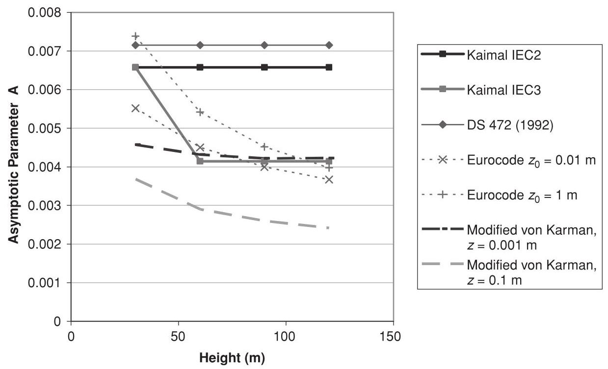

Figure 2.7 Some asymptotic limits

Note also that the IEC edition 3 standard further specifies that ${S}_{v}\left( n\right)  = {S}_{w}\left( n\right)  = \frac{4}{3}{S}_{u}\left( n\right)$ in the high frequency limit.

#### 2.6.7 Cross-spectra and coherence functions

The turbulence spectra presented in the preceding sections describe the temporal variation of each component of turbulence at any given point. However, as the wind turbine blade sweeps out its trajectory, the wind speed variations it experiences are not well represented by these single-point spectra. The spatial variation of turbulence in the lateral and vertical directions is clearly important, since this spatial variation is 'sampled' by the moving blade and, thus, contributes to the temporal variations experienced by it.

In order to model these effects, the spectral description of turbulence must be extended to include information about the cross-correlations between turbulent fluctuations at points separated laterally and vertically. Clearly these correlations decrease as the distance separating two points increases. The correlations are also smaller for high frequency than for low frequency variations. They can, therefore, be described by 'coherence' functions, which describe the correlation as a function of frequency and separation. The coherence $C\left( {{\Delta r}, n}\right)$ is defined by

$$
C\left( {{\Delta r}, n}\right)  = \frac{\left| {S}_{12}\left( n\right) \right| }{\sqrt{{S}_{11}\left( n\right) {S}_{22}\left( n\right) }} \tag{2.37}
$$

where $n$ is frequency, ${S}_{12}\left( n\right)$ is the cross-spectrum of variations at the two points separated by ${\Delta r}$ , and ${S}_{11}\left( n\right)$ and ${S}_{22}\left( n\right)$ are the spectra of variations at each of the points (usually these can be taken as equal).

Starting from von Karman spectral equations, and assuming Taylor's frozen turbulence hypothesis, an analytical expression for the coherence of wind speed fluctuations can be derived. Accordingly for the longitudinal component at points separated by a distance ${\Delta r}$ perpendicular to the wind direction, the coherence ${C}_{u}\left( {{\Delta r}, n}\right)$ is:

$$
{C}_{u}\left( {{\Delta r}, n}\right)  = {0.994}\left( {{A}_{5/6}\left( {\eta }_{u}\right)  - \frac{1}{2}{\eta }_{u}^{5/3}{A}_{1/6}\left( {\eta }_{u}\right) }\right) \tag{2.38}
$$

Here ${A}_{j}\left( x\right)  = {x}^{j}{K}_{j}\left( x\right)$ where $K$ is a fractional order modified Bessel function, and

$$
{\eta }_{u} = {\Delta r}\sqrt{{\left( \frac{0.747}{{L}_{u}}\right) }^{2} + {\left( c\frac{2\pi n}{\bar{U}}\right) }^{2}} \tag{2.39}
$$

with $c = 1.{L}_{u}$ is a local length scale which can be defined as:

$$
{L}_{u}\left( {{\Delta r}, n}\right)  = 2{f}_{u}\left( n\right) \sqrt{\frac{{\left( {}^{y}{L}_{u}\Delta y\right) }^{2} + {\left( {}^{z}{L}_{u}\Delta z\right) }^{2}}{\Delta {y}^{2} + \Delta {z}^{2}}} \tag{2.40}
$$

where ${\Delta y}$ and ${\Delta z}$ are the lateral and vertical components of the separation ${\Delta r}$ , and ${}^{y}{L}_{u}$ and ${}^{z}{L}_{u}$ are the lateral and vertical length scales for the longitudinal component of turbulence. Normally ${f}_{u}\left( n\right)  = 1$ , but ESDU (1975) suggests a modification at low frequencies where the wind becomes more anisotropic, with ${f}_{u}\left( n\right)  = \operatorname{MIN}\left( {{1.0},{0.04}{n}^{-2/3}}\right)$ .

The IEC (1999) edition 2 standard allows only an isotropic turbulence model to be used if the von Karman spectrum is used, in which ${}^{x}{L}_{u} = {2}^{y}{L}_{u} = {2}^{z}{L}_{u}$ , and then ${L}_{u} = {}^{x}{L}_{u}$ , and ${f}_{u}\left( n\right)  = 1$ .

The modified von Karman model described in Equation 2.26 also uses ${f}_{u}\left( n\right)  = 1$ , but the factor $c$ in Equation 2.39 is modified instead (ESDU,1985).

For the lateral and vertical components, the corresponding equations are as follows. The analytical derivation for the coherence, based as before on the von Karman spectrum and Taylor's hypothesis, is

$$
{C}_{i}\left( {{\Delta r}, n}\right)  = \frac{0.597}{{2.869}{\gamma }_{i}^{2} - 1}\left\lbrack  {{4.781}{\gamma }_{i}^{2}{A}_{5/6}\left( {\eta }_{i}\right)  - {A}_{{11}/6}\left( {\eta }_{i}\right) }\right\rbrack \tag{2.41}
$$

for $i = u$ or $v$ , where ${\eta }_{i}$ is calculated as in Equation 2.39 but with ${L}_{u}$ replaced by ${L}_{v}$ or ${L}_{w}$ respectively, and with $c = 1$ . Also

$$
{\gamma }_{i} = \frac{{\eta }_{i}{L}_{i}\left( {{\Delta r}, n}\right) }{\Delta r} \tag{2.42}
$$

and ${L}_{v}$ and ${L}_{w}$ are given by expressions analogous to equation 2.40.

The expressions for spatial coherence in Equations 2.38 and 2.41 above are derived theoretically from the von Karman spectrum, although there are empirical factors in some of the expressions for length scales, for example. If a Kaimal rather than a von Karman spectrum is used as the starting point, there are no such relatively straightforward analytical expressions for the coherence functions. In this case a simpler, and purely empirical, exponential model of coherence is often used. The IEC (1999) edition 2 standard, for example, gives the following expression for the coherence of the longitudinal component of turbulence:

$$
{C}_{u}\left( {{\Delta r}, n}\right)  = \exp \left( {-{H\Delta r}\sqrt{{\left( \frac{0.12}{{L}_{c}}\right) }^{2} + {\left( \frac{n}{\bar{U}}\right) }^{2}}}\right) \tag{2.43}
$$

where $H = {8.8}$ and ${L}_{c} = {L}_{u}$ . This can also be written

$$
{C}_{u}\left( {{\Delta r}, n}\right)  = \exp \left( {-{1.4}{\eta }_{u}}\right) \tag{2.44}
$$

with ${\eta }_{u}$ as in Equation 2.39.

The standard also states that this may also be used with the von Karman model, as an approximation to Equation 2.38. The standard does not specify the coherence of the other two components to be used in conjunction with the Kaimal model, so the following expression is often used:

$$
{C}_{v}\left( {{\Delta r}, n}\right)  = {C}_{w}\left( {{\Delta r}, n}\right)  = \exp \left( {-{H\Delta r}\frac{n}{U}}\right) \tag{2.45}
$$

In the IEC (2004) edition 3 standard a slightly modified form is specified, in which $H = {12}$ and ${L}_{c} = {L}_{1u}$ .

The three turbulence components are usually assumed to be independent of one another. This is a reasonable assumption, although it ignores the effect of Reynolds stresses which result in a small correlation between the longitudinal and vertical components near to the ground, an effect which is captured by the Mann model described in Section 2.6.8.

Clearly there are significant discrepancies between the various recommended spectra and coherence functions. Also these wind models are applicable to flat sites, and there is only limited understanding of the way in which turbulence characteristics change over hills and in complex terrain. Given the important effect of turbulence characteristics on wind turbine loading and performance, this is clearly an area in which there is scope for further research.

#### 2.6.8 The Mann model of turbulence

Alongside the Kaimal model, edition 3 of the IEC standard (IEC, 2005) gives the option to use a rather different form of turbulence model developed by Mann (1994, 1998). The other models described above make use of a one-dimensional fast Fourier transform (FFT) to generate time histories from spectra, applied to each turbulence component independently. In contrast, the Mann model is based on a three-dimensional spectrum tensor representation of the turbulence, and one three-dimensional FFT is then used to generate all three components of turbulence simultaneously. The three-dimensional spectrum tensor is derived from rapid distortion of isotropic turbulence by a uniform mean vertical velocity shear, and the method, therefore, does not treat the three turbulence components as independent, but embodies in particular the correlation between the longitudinal and vertical components resulting from Reynolds stresses. The spectral density for any three-dimensional wavenumber vector is derived, and all three components of turbulence are then generated simultaneously by summing a set of such wavenumber vectors, each with the appropriate amplitude and a random phase.

This is in many ways a rather elegant approach, but in practice there are some computational limitations which can make it difficult to use. The summation requires a three-dimensional FFT to achieve reasonable computation time. The number of points in the longitudinal, lateral and vertical directions must be a power of two for efficient FFT computation. In the longitudinal direction, the number of points is determined by the length of time history required and the maximum frequency of interest, and is, therefore, typically at least 1024. The maximum wavelength used is the length of the turbulence history to be generated (i.e. the mean wind speed multiplied by duration of the required time series) and the minimum wavelength is twice the longitudinal spacing of points (which is the mean wind speed divided by the maximum frequency of interest). In the lateral and vertical directions, a much smaller number of points must be used, perhaps as low as 32, depending on available computer memory. The maximum wavelength must be significantly greater than the rotor diameter, since the solution is spatially periodic, with period equal to the maximum wavelength in each direction. The number of FFT points then determines the minimum wavelength in these directions. With a realistic number of points, the resulting turbulence spectra are deficient at the high frequency end (Veldkamp, 2006). Mann (1998) suggests that this may be realistic, because it represents averaging of the turbulence over finite volumes of space which is appropriate for practical engineering applications. However, a practical simulation tool will perform all necessary spatial averaging in any case, and so the high frequency variations are really lost. Mann (1998) does suggest a remedy for this, but in practice it is extremely intensive computationally.

### 2.7 Gust wind speeds

It is often useful to know the maximum gust speed which can be expected to occur in any given time interval. This is usually represented by a gust factor $G$ , which is the ratio of the gust wind speed to the hourly mean wind speed. $G$ is obviously a function of the turbulence intensity, and it also clearly depends on the duration of the gust - thus, the gust factor for a one-second gust will be larger than for a three-second gust, since every three-second gust has within it a higher one-second gust.

While it is possible to derive expressions for gust factors starting from the turbulence spectrum (Greenway, 1979; ESDU, 1983), an empirical expression due to Weiringa (1973)

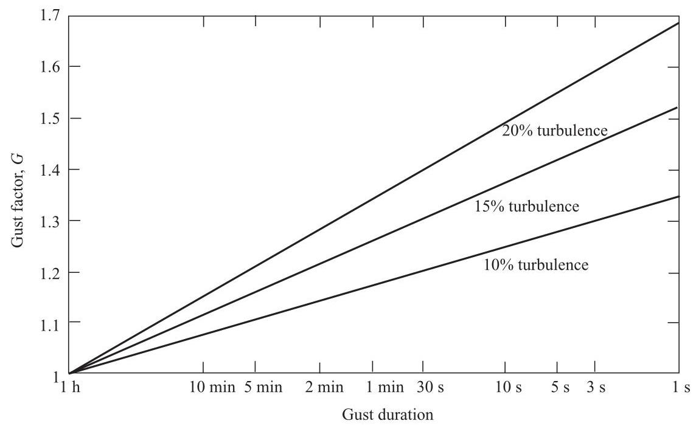

Figure 2.8 Gust factors calculated from equation 2.46

is often used as it is much simpler, and agrees well with theoretical results. Accordingly the $t$ -second gust factor is given by

$$
G\left( t\right)  = 1 + {0.42}{I}_{u}\ln \frac{3600}{t} \tag{2.46}
$$

where ${I}_{u}$ is the longitudinal turbulence intensity. Figure 2.8 shows the gust factors for several different turbulence intensities and gust durations calculated according to this expression.

### 2.8 Extreme wind speeds

In addition to the foregoing descriptions of the average statistical properties of the wind, it is clearly of interest to be able to estimate the long-term extreme wind speeds which might occur at a particular site.

A probability distribution of hourly mean wind speeds such as the Weibull distribution will yield estimates of the probability of exceedance of any particular level of hourly mean wind speed. However, when used to estimate the probability of extreme winds, an accurate knowledge of the high wind speed tail of the distribution is required, and this will not be very reliable since almost all of the data which was used to fit the parameters of the distribution will have been recorded at lower wind speeds. Extrapolating the distribution to higher wind speeds cannot be relied upon to give an accurate result.

Fisher and Tippett (1928) and Gumbel (1958) have developed a theory of extreme values which is useful in this context. If a measured variable (such as hourly mean wind speed $\bar{U}$ ) conforms to a particular cumulative probability distribution $F\left( \bar{U}\right)$ , that is, $F\left( \bar{U}\right)  \rightarrow  1$ as $\bar{U}$ increases, then the peak values of hourly mean wind speed in a given period (a year, for example) will have a cumulative probability distribution of ${F}^{N}$ , where $N$ is the number of independent peaks in the period. In the UK, for example, according to Cook (1982) there are about 100 independent wind speed peaks per year, corresponding to the passage of individual weather systems. Thus, if $F\left( \bar{U}\right)  = 1 - \exp \left( {-{\left( \bar{U}/c\right) }^{k}}\right)$ as for a Weibull distribution, the wind speed peaks in one year will have a cumulative probability distribution given approximately by ${\left\lbrack  1 - \exp \left( -{\left( \bar{U}/c\right) }^{k}\right) \right\rbrack  }^{100}$ . However, as indicated above, this is unlikely to give accurate estimates for extreme hourly means, since the high-wind tail of the distribution cannot be considered to be reliably known. However, Fisher and Tippett (1928) demonstrated that for any cumulative probability distribution function which converges towards unity at least exponentially (as is usually the case for wind speed distributions, including the Weibull distribution), the cumulative probability distribution function for extreme values $\widehat{U}$ will always tend towards an asymptotic limit

$$
F\left( \widehat{U}\right)  = \exp \left( {-\exp \left( {-a\left( {\widehat{U} - {U}^{\prime }}\right) }\right) }\right)
$$

as the observation period increases. ${U}^{\prime }$ is the most likely extreme value, or the mode of the distribution, while $1/a$ represents the width or spread of the distribution and is termed the dispersion.

This makes it possible to estimate the distribution of extreme values based on a fairly limited set of measured peak values, for example a set of measurements of the highest hourly mean wind speeds $\widehat{U}$ recorded during each of $N$ storms. The $N$ measured extremes are ranked in ascending order, and an estimate of the cumulative probability distribution function is obtained as

$$
\widetilde{F}\left( \widehat{U}\right)  \cong  \frac{m\left( \widehat{U}\right) }{N + 1}
$$

where $m\left( \widehat{U}\right)$ is the rank, or position in the sequence (starting with the lowest), of the observation $\widehat{U}$ . Then a plot of $- \ln \left( {-\ln \left( {\widetilde{F}\left( \widehat{U}\right) }\right) }\right)$ against $\widehat{U}$ is used to estimate the mode ${U}^{\prime }$ and dispersion $1/a$ by fitting a straight line to the data points. This is the method due to Gumbel. Lieblein (1974) has developed a numerical technique which gives a less biased estimate of ${U}^{\prime }$ and $1/a$ than a simple least squares fit to a Gumbel plot.

Having made an estimate of the cumulative probability distribution of extremes $F\left( \widehat{U}\right)$ , the $M$ -year extreme hourly mean wind speed can be estimated as the value of $\widehat{U}$ corresponding to the probability of exceedance $F = 1 - 1/M$ .

According to Cook (1985), a better estimate of the probability of extreme winds is obtained by fitting a Gumbel distribution to extreme values of wind speed squared. This is because the cumulative probability distribution function of wind speed squared is closer to exponential than the distribution of wind speed itself, and it converges much more rapidly to the Gumbel distribution. Therefore, by using this method to predict extreme values of wind speed squared, more reliable estimates can be obtained from a given number of observations.

#### 2.8.1 Extreme winds in standards

The design of wind turbines must allow them to withstand extremes of wind speed, as well as respond well to the more 'typical' conditions described above. Therefore, the various standards also specify the extremes of wind speed which must be designed for. This includes extreme mean wind speeds as well as various types of severe gust.

Extreme conditions may be experienced with the machine operating, parked or idling with or without various types of fault or grid loss, or during a particular operation such as a shut-down event. The extreme wind conditions may be characterised by a 'return time': for example, a 50-year gust is one which is so severe that it can be expected to occur on average only once every 50 years. It would be reasonable to expect a turbine to survive such a gust, provided there was no fault on the turbine.

It is always possible that the turbine happens to be shut down on account of a fault when a gust occurs. If the fault impairs the turbine's ability to cope with a gust, for example if the yaw system has failed and the turbine is parked at the wrong angle to the wind, then the turbine may have to withstand even greater loads. However, the probability of the most extreme gusts occurring at the same time as a turbine fault is very small, and so it is usual to specify that a turbine with a fault need only be designed to withstand, for example, the annual extreme gust and not the 50-year extreme gust.

For this to be valid, it is important that the faults in question are not correlated with extreme wind conditions. Grid loss is not considered to be a fault with the turbine, and is actually quite likely to be correlated with extreme wind conditions.

Clearly the extreme wind speeds and gusts (both in terms of magnitude and shape) may be quite site-specific. They may differ considerably between flat coastal sites and rugged hill tops, for example.

The IEC standard, for example, specifies a 'reference wind speed' Vref which is five times the annual mean wind speed. The 50-year extreme wind speed is then given by 1.4 times ${V}_{\text{ ref }}$ at hub height, and varying with height using a power law exponent of 0.11 . The annual extreme wind speed is taken as 75% of the 50-year value in the 1999 edition 2 standard, or 80% in the 2004 edition 3 standard.

The IEC edition 2 standard goes on to define a number of transient events which the turbine must be designed to withstand. These include:

- Extreme operating gust (EOG): a decrease in speed, followed by a steep rise, a steep drop and a rise back to the original value. The gust amplitude and duration vary with the return period.

- Extreme direction change (EDC): this is a sustained change in wind direction, following a cosine-shaped curve. The amplitude and duration of the change once again depend on the return period.

- Extreme coherent gust (ECG): this is a sustained change in wind speed, again following a cosine-shaped curve with the amplitude and duration depending on the return period.

- Extreme coherent gust with direction change (ECD): simultaneous speed and direction transients similar to EDC and ECG.

- Extreme wind shear (EWS): a transient variation in the horizontal and vertical wind gradient across the rotor. The gradient first increases and then falls back to the initial level, following a cosine-shaped curve.

These transient events are deterministic gusts intended to represent the extreme turbulent variations which would be expected to occur at the specified return period. They are not intended to occur in addition to the normal turbulence described previously. Such deterministic coherent gusts, however, have little basis in terms of actual measured or theoretical wind characteristics. Therefore, in edition 3 of the standard, some of the extreme loads are estimated instead by carrying out a large number of simulations and applying statistical extrapolation methods to the peak loads from each simulation. Appropriate probability distributions are fitted to the simulated peaks, and the 50-year extreme load is estimated from the tail of the distribution - see Section 5.14.

### 2.9 Wind speed prediction and forecasting

Because of the variable nature of the wind resource, the ability to forecast wind speed some time ahead is often valuable. Such forecasts fall broadly into two categories: predicting short-term turbulent variations over a time scale of seconds to minutes ahead, which may be useful for assisting with the operational control of wind turbines or wind farms, and longer-term forecasts over periods of a few hours or days, which may be useful for planning the deployment of other power stations on the network.

Short-term forecasts necessarily rely on statistical techniques for extrapolating the recent past, whereas the longer-term forecasts can make use of meteorological methods. A combination of meteorological and statistical forecasts can give very useful predictions of wind farm power output.

#### 2.9.1 Statistical methods

The simplest statistical prediction is known as a 'persistence' forecast: the prediction is set equal to the last available measurement. In other words the last measured value is assumed to persist into the future without any change:

$$
{\widehat{y}}_{k} = {y}_{k - 1}
$$

where ${y}_{k - 1}$ is the measured value at step $k - 1$ and ${\widehat{y}}_{k}$ is the prediction for the next step.

A more sophisticated prediction might be some linear combination of the last $n$ measured values, that is,

$$
{\widehat{y}}_{k} = \mathop{\sum }\limits_{{i = 1}}^{n}{a}_{i}{y}_{k - i}
$$

This is known as an ${n}^{\text{ th }}$ order autoregressive model, or $\operatorname{AR}\left( n\right)$ . We can now define the prediction error at step $k$ by

$$
{e}_{k} = {\widehat{y}}_{k} - {y}_{k}
$$

and then use the recent prediction errors to improve the prediction:

$$
{\widehat{y}}_{k} = \mathop{\sum }\limits_{{i = 1}}^{n}{a}_{i}{y}_{k - i} + \mathop{\sum }\limits_{{j = 1}}^{m}{b}_{j}{e}_{k - j}
$$

This is known as an ${n}^{\text{ th }}$ order autoregressive, ${m}^{\text{ th }}$ order moving average model, or $\operatorname{ARMA}\left( {n, m}\right)$ . This can be further extended to an ARMAX model, where the X stands for an 'exogenous' variable: another measured variable which is included in the prediction because it influences $y$ .

The model parameters ${a}_{i},{b}_{j}$ can be estimated in various ways. A useful technique is the method of recursive least squares, or RLS (Ljung & Söderström, 1983). Estimates of the model parameters are updated on each timestep in such a way as to minimise the expected value of the sum of squares of the prediction errors. By including a so-called 'forgetting factor', the influence of older observations can be progressively reduced, leading to an adaptive estimation of the parameters, which will gradually change to accommodate variations in the statistical properties of the variable $y$ .

Bossanyi (1985) investigated the use of ARMA models for wind speed predictions from a few seconds to a few minutes ahead, obtaining reductions in rms prediction errors of up to 20% when compared to a persistence forecast. The best results were obtained when predicting ten minutes ahead from one-minute data.

Kariniotakis et al. (1997) compare ARMA methods against a selection of more recent techniques such as neural network, fuzzy logic and wavelet-based methods. The fuzzy logic method is tentatively selected as giving the best predictions over periods of ten minutes to two hours, with improvements of 10-18% compared to persistence.

Nielsen and Madsen (1999) use an ARX model with recursive least squares to predict wind farm power output based on previous values of power output, and measured wind speed as an exogenous variable, supplemented by a function describing the diurnal variations of wind speed and by meteorogical forecasts of wind speed and direction. Predictions up to 48 hours ahead are considered, and the inclusion of meteorological forecasts is shown to improve the predictions significantly, especially for the longer period forecasts.

#### 2.9.2 Meteorological methods

As indicated in the previous section, much better predictions can be made by using meteorological forecasts than by using purely statistical methods, when predictions over timescales of a few hours or days are considered. Very sophisticated meteorological forecasts are available from highly detailed simulation models of the atmosphere, fed by many recorded observations of pressure, temperature, wind speed, etc. over wide areas of land and sea.

Landberg (1997, 1999) describes the use of such models to predict wind farm output, by extrapolating the large-scale wind predictions produced by these models down to the specific wind farm site. The geostrophic drag law and the logarithmic wind shear profile (Section 2.6.2) are used to extrapolate the wind forecasts down to ground level. Modifications to the flow resulting from the topography, the physical geography and surface roughness conditions in the area surrounding the wind farm are then modelled by the WA ${}^{\mathrm{s}}\mathrm{P}$ programme (Mortensen et al., 1993). A turbine wake interaction model PARK (Sanderhoff, 1993) then takes account of wind direction in relation to the actual turbine positions to calculate wake losses, and finally a statistical model (as described in the previous section) combines the meteorological forecasts with recent measurements on the wind farm to give predictions of the energy output which are good enough to be useful in planning the deployment of other power stations on the network.

### 2.10 Turbulence in wakes and wind farms

As it extracts energy from the wind, a turbine leaves behind it a wake characterised by reduced wind speeds and increased levels of turbulence. Another turbine operating in this wake, or deep inside a wind farm where the effects of a number of wakes may be felt simultaneously, will therefore produce less energy and suffer greater structural loading than a turbine operating in the free stream.

Immediately behind a turbine, its wake can crudely be considered as a region of reduced wind speed slightly larger in diameter than the turbine itself (Vermeulen, 1980). The reduction in velocity is directly related to the thrust coefficient of the turbine, since this determines the momentum extracted from the flow. As this reduced wind speed region convects downstream, the wind speed gradient between the wake and the free flow outside the wake results in additional shear-generated turbulence, which assists the transfer of momentum into the wake from the surrounding flow. Thus, the wake and the surrounding flow start to mix, and the region of mixing spreads inwards to the centre of the wake, as well as outwards to make the width of the wake increase. In this way, the velocity deficit in the wake is eroded and the wake becomes broader but shallower until the flow has fully recovered far downstream. The rate at which this occurs is dependent on the ambient turbulence level.

In addition to this shear-generated turbulence, the turbine itself generates additional turbulence directly, as a result of the tip vortices shed by the blades and the general disturbance to the flow caused by the blades, nacelle and tower. This 'mechanical' component of turbulence is of relatively high frequency and decays relatively quickly. Bossanyi (1983) develops a theoretical model which describes how this additional turbulence might decay: large eddies give rise to smaller ones, and so the turbulent energy moves to higher and higher frequencies until it is eventually dissipated as heat. The model predicts a faster rate of decay in low winds and in high ambient turbulence intensities.

Beyond the near wake region, once the shear-generated turbulence has reached the centre of the wake and started to erode the centreline velocity deficit, the mean velocity variation in the wake can be described well by an axisymmetric profile with a Gaussian cross-section. The development of the wake profile downstream of this point can be reasonably well predicted, for example using an eddy viscosity model (Ainslie, 1988). This is partly theoretical, derived from the Navier-Stokes equation of fluid flow, but with some empirical terms.

Theoretical models capable of predicting turbulence levels in the wake are less well developed. Quarton and Ainslie (1989) examined a number of different sets of wake turbulence measurements, both in wind tunnels using small wind turbine models or gauze simulators and behind full-size turbines in the free stream. An empirical formula for added turbulence ${I}_{ + }$ at a downstream distance $\mathrm{x}$ from the turbine was found to give a good fit to the various measurements:

$$
{I}_{ + } = {4.8}{C}_{T}^{0.7}{I}_{0}^{0.68}{\left( x/{x}_{n}\right) }^{-{0.57}}
$$

where ${C}_{T}$ is the turbine thrust coefficient, ${I}_{0}$ the ambient turbulence intensity and ${x}_{n}$ the length of the near wake region. Here ${I}_{0}$ and ${I}_{ + }$ are expressed as percentages. On the basis of further work, an improved expression was subsequently proposed by Hassan (1992):

$$
{I}_{ + } = {5.7}{C}_{T}^{0.7}{I}_{0}^{0.68}{\left( x/{x}_{n}\right) }^{-{0.96}}
$$

The added turbulence is defined as the square root of the additional wind speed variance normalised by the mean wind speed, that is,

$$
{I}_{ + } = \sqrt{{I}_{\text{ wake }}^{2} - {I}_{0}^{2}}
$$

where ${I}_{\text{ wake }}$ is the total wake turbulence intensity, at any given downstream distance.

The length of the near wake region, ${x}_{n}$ , is calculated according to Vermeulen (1980) in terms of the rotor radius $R$ and the thrust coefficient ${C}_{T}$ as

$$
{x}_{n} = \frac{n{r}_{0}}{\left( \frac{dr}{dx}\right) }
$$

where

$$
{r}_{0} = R\sqrt{\frac{m + 1}{2}}
$$

$$
m = \frac{1}{\sqrt{1 - {C}_{T}}}
$$

$$
n = \frac{\sqrt{{0.214} + {0.144m}}\left( {1 - \sqrt{{0.134} + {0.124m}}}\right) }{\left( {1 - \sqrt{{0.214} + {0.144m}}}\right) \sqrt{{0.134} + {0.124m}}}
$$

and ${dr}/{dx}$ is the wake growth rate:

$$
\frac{dr}{dx} = \sqrt{{\left( \frac{dr}{dx}\right) }_{\alpha }^{2} + {\left( \frac{dr}{dx}\right) }_{m}^{2} + {\left( \frac{dr}{dx}\right) }_{\lambda }^{2}}
$$

$$
{\left( \frac{dr}{dx}\right) }_{\alpha } = {2.5}{I}_{0} + {0.005}
$$

is the growth rate contribution due to ambient turbulence,

$$
{\left( \frac{dr}{dx}\right) }_{m} = \frac{\left( {1 - m}\right) \sqrt{{1.49} + m}}{\left( {1 + m}\right) {9.76}}
$$

is the contribution due to shear-generated turbulence, and

$$
{\left( \frac{dr}{dx}\right) }_{\lambda } = {0.012B\lambda }
$$

is the contribution due to mechanical turbulence, where $B$ is the number of blades and $\lambda$ is the tip speed ratio.

Deep inside a wind farm, the reduction in wind speed and the increase in turbulence intensity are the result of the superposition of wakes from many upwind turbines. Frandsen and Thøgersen (1999) and Frandsen (2003) propose a model based on the geostrophic drag law which takes into account the additional 'surface roughness' caused by the turbines themselves. This leads to a formula for added turbulence above hub height:

$$
{I}_{+ + } = \frac{0.36}{1 + {0.2}\sqrt{{s}_{1}s/{C}_{T}}}
$$

where ${s}_{1}$ and $s$ are the inter-turbine spacings, normalised by rotor diameter, within a row and between rows. Since this does not apply below hub height, the average added turbulence intensity ${I}_{ + }$ is then calculated as

$$
{I}_{ + } = \frac{1}{2}\left( {{I}_{0} + \sqrt{{I}_{0}^{2} + {I}_{+ + }^{2}}}\right)
$$

This approach has been included in the IEC (2005) edition 3 standard as an informative Annex. However, this approach has not been thoroughly validated against measurements and no consensus has yet emerged on a sufficiently well validated formula for turbulence intensity within a wind farm for use in wind turbine design calculations.

### 2.11 Turbulence in complex terrain

Predicting the turbulence intensity and spectrum at a given point within an area of complex terrain is not straightforward. Hilly terrain upwind of the site in question will lead to generally higher turbulence levels, and some authors have suggested that this can be calculated from a 'regional roughness length' which takes the topography into account as well as the surface roughness (Tieleman, 1992). On the other hand, distortion of the flow by the local terrain may reduce the turbulence intensity. At heights above ground which are of importance for wind turbines, rapid distortion theory applies, which means that the variance of the turbulent fluctuations will not change much as the flow passes over terrain features such as hills. Therefore, if there is acceleration of the flow as it passes over a hill, the turbulence intensity will decrease, and the length scale will increase, resulting in a shift of the turbulence spectrum towards lower frequencies, without any change of shape (Schlez, 2000). This effect is, therefore, easily estimated once a model such as ${\mathrm{{WA}}}^{\mathrm{S}}\mathrm{P}$ has been used to calculate the speed-up factor at a particular point. However, the effect is also accompanied by a shift of turbulent energy from the longitudinal to the lateral and vertical components of turbulence, causing the turbulence on hill tops to be more isotropic (Petersen et al., 1998).

## References

Ainslie (1988) Calculating the flowfield in the wake of wind turbines, Journal of Wind Engineering and Industrial Aerodynamics, 27, 213-224.

Bossanyi (1983): Windmill wake turbulence decay - a preliminary theoretical model, E.A. Bossanyi, SERI/TR-635-1280, Solar Energy Research Institute, Golden, Colorado.

Bossanyi, E.A. (1985) Short-term stochastic wind prediction and possible control applications. In Proceedings of the Delphi Workshop on Wind Energy Applications.

Cook, N.J. (1982) Towards a better estimation of extreme wind speeds. Journal of Wind Engineering and Industrial Aerodyamics 9, 295-323.

Cook, N.J. (1985) The Designer's Guide to Wind Loading of Building Structures, Part 1, Butterworths, London.

DS 472 (1992) Code of practice for loads and safety of wind turbine constructions, DS 472, The Danish Society of Engineers and the Federation of Engineers.

ESDU (1975) Characteristics of atmospheric turbulence near the ground. Part III: Variations in space and time for strong winds (neutral atmosphere), ESDU 75001, Engineering Sciences Data Unit, London.

ESDU (1983) Strong winds in the atmospheric boundary layer. Part 2: Discrete gust speeds, ESDU 83045, Engineering Sciences Data Unit, London.

ESDU (1985) Characteristics of atmospheric turbulence near the ground. Part II: Single point data for strong winds (neutral atmosphere), ESDU 85020 (amended 1993), Engineering Sciences Data Unit, London.

Eurocode (2005) EN 1991-1-4:2005 Eurocode 1: Actions on structures - Part 1-4: General actions - Wind actions.

Fisher, R.A. and Tippett, L.H.C. (1928) Limiting forms of the frequency distribution of the largest or smallest member of a sample. In R.A. Fisher and L.H.C. Tippett, Mathematical Proceedings of the Cambridge Philosophical Society, 24, 180-190, Cambridge.

Frandsen, S. and Thøgersen, M. (1999) Integrated fatigue loading for wind turbines in wind farms by combining ambient turbulence and wakes. Wind Engineering, 23, 6, 327-339.

Frandsen (2003) Turbulence and turbulence-generated structural loading in wind turbine clusters, Risø report R-1188, (updated 2007).

GL (1993) Rules and regulations IV - Non-marine technology, Part 1. - Wind Energy (supplemented 1994, 1998). Germanischer Lloyd, Hamburg.

GL (2003) Rules and Guidelines, IV Industrial Services, 1 Guideline for the Certification of Wind Turbines (Edition 2003 with supplement 2004). Germanischer Lloyd, Hamburg.

Greenway, M.E. (1979) An analytical approach to wind velocity gust factors. Journal of Industrial Aerodynamics, 5, 61-91.

Gumbel, E.J. (1958) Statistics of Extremes. Columbia University Press, New York.

Harris, R.I. (1990) Some further thoughts on the spectrum of gustiness in strong winds. Journal of Wind Engineering and Industrial Aerodynamics, 33, 461-477.

Hassan, U. (1992) A wind tunnel investigation of the wake structure within small wind turbine farms. E/5A/CON/5113/1890, UK Department of Energy, ETSU.

Kariniotakis, G., Norgaret, E. and Stravrakakis, G. (1997) Advanced short-term forecasting of wind power production. In the Proceedings of the European Wind Energy Conference, Dublin 1997, pp. 751-754.

IEC (1999) Wind turbine generator systems - Part 1: Safety requirements, International Standard 61400-1 edition 2, International Electrotechnical Commission.

IEC (2005) Wind turbines - Part 1: Design requirements, International Standard 61400-1 (3rd edition), International Electrotechnical Commission.

Landberg, L. (1997) Predicting the power output from wind farms. In the Proceedings of the European Wind Energy Conference, Dublin 1997, pp. 747-750.

Landberg, L. (1999) Operational results from a physical power prediction model. In the Proceedings of the European Wind Energy Conference, Nice 1999, pp. 1086-1089.

Lieblein, J. (1974) Efficient methods of extreme-value methodology, J. Lieblein, NBSIR 74-602, National Bureau of Standards, Washington, 1974.

Ljung, L. and Söderström, T. (1983) Theory and Practice of Recursive Identification. MIT Press, Cambridge, MA.

Mann, J. (1994) The spatial structure of neutral atmospheric surface-layer turbulence. Journal of Fluid Mechanics, 273, 141-168.

Mann, J. (1998) Wind field simulation. Journal of Probabilistic Engineering Mechanics, 13, n. 4, 269-282.

Mortensen, N.G., Landberg, L. Troen, I. and Petersen, E.L. (1993) Wind Atlas Analysis and Application Program (WA'SP), User's guide, Risø-I-666-(EN)(v.2) Risø National Laboratory, Roskilde, Denmark.

Nielsen, T.S. and Madsen, H. (1999) Experiences with statistical methods for wind power prediction. In the Proceedings of the European Wind Energy Conference, Nice 1999, pp. 1066-1069.

Palutikoff, J.P., Guo, A. and Halliday, J.A. (1991) The reconstruction of long wind speed records in the UK. In the Proceedings of the ${13}^{\text{ th }}$ British Wind Energy Association Conference, Swansea, April 1991. Mechanical Engineering Publications, London.

Petersen, E.L., Mortensen, N.G., Landberg, L., Højstrup, J. and Frank, H.P. (1998) Wind power meteorology. Part I: Climate and turbulence, Wind Energy 1, 1, 2-22.

Quarton, D.C. and Ainslie, J.F. (1989) Turbulence in wind turbine wakes. In the Proceedings of the European Wind Energy Conference 1989, BWEA/EWEA. Peter Peregrinus, London.

Sanderhoff, P. (1993) PARK - User's guide, Risø-I-668(EN). Risø National Laboratory, Roskilde, Denmark.

Schlez, W. (2000) Voltage fluctuations caused by groups of wind turbines. PhD thesis, Loughborough University.

Tieleman, H.W. (1992) Wind characteristics in the surface layer over heterogeneous terrain, Journal of Wind Engineering and Industrial Aerodynamics, 41-44, 29-340.

van der Hoven, I. (1957) Power spectrum of horizontal wind speed in the frequency range from 0.0007 to 900 cycles per hour, Journal of Meteorology, 14, 160-164.

Veldkamp (2006) Chances in wind energy: a probabilistic approach to wind turbine fatigue design. PhD dissertation, Delft University of Technology.

Vermeulen, P.E.J. (1980) An experimental analysis of wind turbine wakes. ${3}^{\text{ rd }}$ International Symposium on Wind Energy Systems, Copenhagen, August 1980 ( BHRA).

Weiringa, J. (1973) Gust factors over open water and built-up country, Boundary Layer Meteorology, 3, 424-441.

## 3 Aerodynamics of horizontal axis wind turbines*

### 3.1 Introduction

A wind turbine is a device for extracting kinetic energy from the wind. By removing some of its kinetic energy the wind must slow down but only that mass of air which passes through the rotor disc is affected. Assuming that the affected mass of air remains separate from the air which does not pass through the rotor disc and does not slow down, a boundary surface can be drawn containing the affected air mass and this boundary can be extended upstream as well as downstream forming a long stream-tube of circular cross-section. No air flows across the boundary and so the mass flow rate of the air flowing along the stream-tube will be the same for all stream-wise positions along the stream-tube. Because the air within the stream-tube slows down, but does not become compressed, the cross-sectional area of the stream-tube must expand to accommodate the slower moving air (see Figure 3.1).

Although kinetic energy is extracted from the airflow, a sudden step change in velocity is neither possible nor desirable because of the enormous accelerations and forces this would require. Pressure energy can be extracted in a step-like manner, however, and all wind turbines, whatever their design, operate in this way.

---

*To study the aerodynamics of wind turbines some knowledge of fluid dynamics in general is necessary and, in particular, aircraft aerodynamics. Excellent text books on aerodynamics are readily available, a bibliography is given, as Further Reading, at the end of this chapter, and any abbreviated account of the subject that could have been included in these pages would not have done it justice; recourse to text books would have been necessary anyway. Some direction on which aerodynamics topics are necessary for the study of wind turbines would, however, be useful to the reader and a brief introduction is given in Appendix 3A. For Sections 3.2 and 3.3 a knowledge of Bernoulli's theorem for steady, incompressible flow is required together with the concept of continuity. For Section 3.4, which may be omitted at first reading, an understanding of vortices is desirable and the flow field induced by vortices. The Biot-Savart law, which will be familiar to those with knowledge of electric and magnetic fields, is used to determine velocities induced by vortices. The Kutta-Joukowski theorem for determining the force on a bound vortex should also be studied. For Sections 3.5, 3.6 and 3.7 a knowledge of the lift and drag of aerofoils is essential, including stalled flow.

Wind Energy Handbook, Second Edition. Tony Burton, Nick Jenkins, David Sharpe and Ervin Bossanyi.

© 2011 John Wiley & Sons, Ltd. Published 2011 by John Wiley & Sons, Ltd. ISBN: 978-0-470-69975-1

---

Figure 3.1 The energy extracting stream-tube of a wind turbine

The presence of the turbine causes the approaching air, upstream, gradually to slow down such that when the air arrives at the rotor disc its velocity is already lower than the free-stream wind speed. The stream-tube expands as a result of the slowing down and, because no work has yet been done on, or by, the air, its static pressure rises to absorb the decrease in kinetic energy.

As the air passes through the rotor disc, by design, there is a drop in static pressure such that, on leaving, the air is below the atmospheric pressure level. The air then proceeds downstream with reduced speed and static pressure: this region of the flow is called the 'wake'. Eventually, far downstream, the static pressure in the wake must return to the atmospheric level for equilibrium to be achieved. The rise in static pressure is at the expense of the kinetic energy and so causes an additional slowing down of the wind. Thus, between the far upstream and far wake conditions, no change in static pressure exists but there is a reduction in kinetic energy.

### 3.2 The actuator disc concept

The mechanism described above accounts for the extraction of kinetic energy but in no way explains what happens to that energy: it may well be put to useful work but some may be spilled back into the wind as turbulence and eventually be dissipated as heat.

Nevertheless, we can begin an analysis of the aerodynamic behaviour of wind turbines without any specific turbine design just by considering the energy extraction process. The general device that carries out this task is called an actuator disc (see Figure 3.2).

Upstream of the disc the stream-tube has a cross-sectional area smaller than that of the disc and an area larger than the disc downstream. The expansion of the stream-tube is because the mass flow rate must be the same everywhere. The mass of air which passes through a given cross-section of the stream-tube in a unit length of time is ${\rho AU}$ , where $\rho$ is the air density, $A$ is the cross-sectional area and $U$ is the flow velocity. The mass flow rate must be the same everywhere along the stream-tube and so

$$
\rho {A}_{\infty }{U}_{\infty } = \rho {A}_{D}{U}_{D} = \rho {A}_{W}{U}_{W} \tag{3.1}
$$

Figure 3.2 An energy extracting actuator disc and stream-tube

The symbol $\infty$ refers to conditions far upstream, $D$ refers to conditions at the disc and $W$ refers to conditions in the far wake.

It is usual to consider that the actuator disc induces a velocity variation which must be superimposed on the free stream velocity. The stream-wise component of this induced flow at the disc is given by $- a{U}_{\infty }$ , where $a$ is called the axial flow induction factor, or the inflow factor. At the disc, therefore, the net stream-wise velocity is

$$
{U}_{D} = {U}_{\infty }\left( {1 - a}\right) \tag{3.2}
$$

#### 3.2.1 Simple momentum theory

The air that passes through the disc undergoes an overall change in velocity, ${U}_{\infty } - {U}_{W}$ and a rate of change of momentum equal to the overall change of velocity times the mass flow rate:

$$
\text{ Rate of change of momentum } = \left( {{U}_{\infty } - {U}_{W}}\right) \rho {A}_{D}{U}_{D} \tag{3.3}
$$

The force causing this change of momentum comes entirely from the pressure difference across the actuator disc because the stream-tube is otherwise completely surrounded by air at atmospheric pressure, which gives zero net force.

Therefore,

$$
\left( {{p}_{D}^{ + } - {p}_{D}^{ - }}\right) {A}_{D} = \left( {{U}_{\infty } - {U}_{W}}\right) \rho {A}_{D}{U}_{\infty }\left( {1 - a}\right) \tag{3.4}
$$

To obtain the pressure difference $\left( {{p}_{D}^{ + } - {p}_{D}^{ - }}\right)$ Bernoulli’s equation is applied separately to the upstream and downstream sections of the stream-tube: separate equations are necessary because the total energy is different upstream and downstream. Bernoulli's equation states that, under steady conditions, the total energy in the flow, comprising kinetic energy, static pressure energy and gravitational potential energy, remains constant provided no work is done on or by the fluid. Thus, for a unit volume of air,

$$
\frac{1}{2}\rho {U}^{2} + p + {\rho gh} = \text{ const } \tag{3.5}
$$

Upstream, therefore, we have

$$
\frac{1}{2}{\rho }_{\infty }{U}_{\infty }^{2} + {p}_{\infty } + {\rho }_{\infty }g{h}_{\infty } = \frac{1}{2}{\rho }_{D}{U}_{D}^{2} + {p}_{D}^{ + } + {\rho }_{D}g{h}_{D} \tag{3.6}
$$

Assuming the flow to be incompressible $\left( {{\rho }_{\infty } = {\rho }_{D}}\right.$ ) and horizontal $\left( {{h}_{\infty } = {h}_{D}}\right)$ then,

$$
\frac{1}{2}\rho {U}_{\infty }^{2} + {p}_{\infty } = \frac{1}{2}\rho {U}_{D}^{2} + {p}_{D}^{ + } \tag{3.6a}
$$

Similarly, downstream,

$$
\frac{1}{2}\rho {U}_{W}^{2} + {p}_{\infty } = \frac{1}{2}\rho {U}_{D}^{2} + {p}_{D}^{ - } \tag{3.6b}
$$

Subtracting these equations we obtain

$$
\left( {{p}_{D}^{ + } - {p}_{D}^{ - }}\right)  = \frac{1}{2}\rho \left( {{U}_{\infty }^{2} - {U}_{W}^{2}}\right) \tag{3.6c}
$$

Equation 3.4 then gives

$$
\frac{1}{2}\rho \left( {{U}_{\infty }^{2} - {U}_{W}^{2}}\right) {A}_{D} = \left( {{U}_{\infty } - {U}_{W}}\right) \rho {A}_{D}{U}_{\infty }\left( {1 - a}\right) \tag{3.7}
$$

and so,

$$
{U}_{W} = \left( {1 - {2a}}\right) {U}_{\infty } \tag{3.8}
$$

That is, half the axial speed loss in the stream-tube takes place upstream of the actuator disc and half downstream.

#### 3.2.2 Power coefficient

The force on the air becomes, from Equation 3.4

$$
T = \left( {{p}_{D}^{ + } - {p}_{D}^{ - }}\right) {A}_{D} = {2\rho }{A}_{D}{U}_{\infty }^{2}a\left( {1 - a}\right) \tag{3.9}
$$

As this force is concentrated at the actuator disc the rate of work done by the force is $T{U}_{D}$ and hence the power extraction from the air is given by

$$
\text{ Power } = T{U}_{D} = {2\rho }{A}_{D}{U}_{\infty }^{3}a{\left( 1 - a\right) }^{2} \tag{3.10}
$$

A power coefficient is then defined as

$$
{C}_{P} = \frac{\text{ Power }}{\frac{1}{2}\rho {U}_{\infty }^{3}{A}_{D}} \tag{3.11}
$$

where the denominator represents the power available in the air, in the absence of the actuator disc.

Therefore,

$$
{C}_{P} = {4a}{\left( 1 - a\right) }^{2} \tag{3.12}
$$

#### 3.2.3 The Lanchester-Betz limit

The maximum value of ${C}_{P}$ occurs when

$$
\frac{d{C}_{P}}{da} = 4\left( {1 - a}\right) \left( {1 - {3a}}\right)  = 0
$$

that gives a value of $a = \frac{1}{3}$

Hence,

$$
{C}_{{P}_{\max }} = \frac{16}{27} = {0.593} \tag{3.13}
$$

The maximum achievable value of the power coefficient is known as the Lanchester-Betz limit after Frederic Lanchester (1915), a British aeronautical pioneer, and Albert Betz (1919) the German aerodynamicist. To date, no wind turbine has been designed that is capable of exceeding the Lanchester-Betz limit. The limit is caused not by any deficiency in design because, as yet in our discussion, we have no design. However, because the stream-tube has to expand upstream of the actuator disc the cross-section of the tube where the air is at the full, free-stream velocity is smaller than the area of the disc.

${C}_{P}$ could, perhaps, more fairly be defined as

$$
{C}_{P} = \frac{\text{ Power } \cdot  \text{ extracted }}{\text{ Power } \cdot  \text{ available }} = \frac{\text{ Power } \cdot  \text{ extracted }}{\frac{16}{27}\left( {\frac{1}{2}\rho {U}_{\infty }^{3}{A}_{D}}\right) } \tag{3.14}
$$

but this not the accepted definition of ${C}_{P}$ .

#### 3.2.4 The thrust coefficient

The force on the actuator disc caused by the pressure drop, given by Equation 3.9, can also be non-dimensionalised to give a coefficient of thrust ${C}_{T}$

$$
{C}_{T} = \frac{\text{ Thrust }}{\frac{1}{2}\rho {U}_{\infty }^{2}{A}_{D}} \tag{3.15}
$$

$$
{C}_{T} = {4a}\left( {1 - a}\right) \tag{3.16}
$$

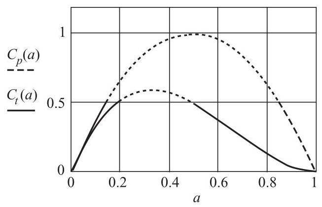

Figure 3.3 Variation of ${C}_{P}$ and ${C}_{T}$ with axial induction factor $a$

A problem arises for values of $a \geq  \frac{1}{2}$ because the wake velocity, given by $\left( {1 - {2a}}\right) {U}_{\infty }$ , becomes zero, or even negative: in these conditions the momentum theory, as described, no longer applies and an empirical modification has to be made (Section 3.6).

The variation of power coefficient and thrust coefficient with $a$ is shown in Figure 3.3.

### 3.3 Rotor disc theory

The manner in which the extracted energy is converted into usable energy depends upon the particular turbine design. Most wind energy converters employ a rotor with a number of blades rotating with an angular velocity $\Omega$ about an axis normal to the rotor plane and parallel to the wind direction. The blades sweep out a disc and, by virtue of their aerodynamic design, develop a pressure difference across the disc, which, as discussed in the previous section, is responsible for the loss of axial momentum in the wake. Associated with the loss of axial momentum is a loss of energy that can be collected by, say, an electrical generator attached to the rotor shaft. As well as a thrust, the rotor experiences a torque in the direction of rotation that will oppose the torque that the generator exerts. The work done by the aerodynamic torque on the generator is converted into electrical energy. The required aerodynamic design of the rotor blades to provide a torque as well as a thrust is discussed in Section 3.5.

#### 3.3.1 Wake rotation

The exertion of a torque on the rotor disc by the air passing through it requires an equal and opposite torque to be imposed upon the air. The consequence of the reaction torque is to cause the air to rotate in a direction opposite to that of the rotor; the air gains angular momentum and so in the wake of the rotor disc the air particles have a velocity component in a direction which is tangential to the rotation as well as an axial component (see Figure 3.4).

The acquisition of the tangential component of velocity by the air means an increase in its kinetic energy that is compensated for by a fall in the static pressure of the air in the wake in addition to that which is described in the previous section.

The flow entering the actuator disc has no rotational motion at all. The flow exiting the disc does have rotation and that rotation remains constant as the fluid progresses down the wake. The transfer of rotational motion to the air takes place entirely across the thickness of the disc (see Figure 3.5). The change in tangential velocity is expressed in terms of a tangential flow induction factor ${a}^{\prime }$ . Upstream of the disc the tangential velocity is zero. Immediately downstream of the disc the tangential velocity is ${2r\Omega }{a}^{\prime }$ . At the middle of the disc thickness, a radial distance $r$ from the axis of rotation, the induced tangential velocity is ${r\Omega }{a}^{\prime }$ . Because it is produced in reaction to the torque the tangential velocity is opposed to the motion of the rotor.

Figure 3.4 The trajectory of an air particle passing through the rotor disc

An abrupt acquisition of tangential velocity cannot occur in practice and must be gradual. Figure 3.5 shows the flow accelerating in the tangential direction as it is 'squeezed' between the blades: the separation of the blades has been reduced for effect, but it is the increasing solid blockage that the blades present to the flow close to the blade roots that causes high values of tangential velocity.

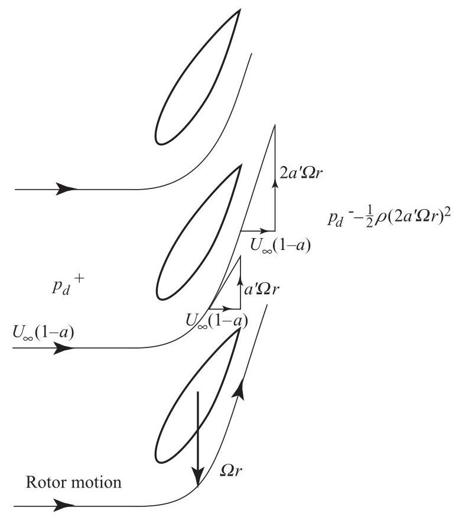

Figure 3.5 Tangential velocity grows across the disc thickness

#### 3.3.2 Angular momentum theory

The tangential velocity will not be the same for all radial positions and it may well also be that the axial induced velocity is not the same. To allow for variation of both induced velocity components consider only an annular ring of the rotor disc which is of radius $r$ and of radial width ${\delta r}$ .

The increment of rotor torque acting on the annular ring will be responsible for imparting the tangential velocity component to the air, whereas the axial force acting on the ring will be responsible for the reduction in axial velocity. The whole disc comprises a multiplicity of annular rings and each ring is assumed to act independently in imparting momentum only to the air that actually passes through the ring.

The torque on the ring will be equal to the rate of change of angular momentum of the air passing through the ring.

Thus, torque $=$ rate of change of angular momentum $=$ mass flow rate $\times$ change of tangential velocity $\times$ radius

$$
{\delta Q} = {\rho \delta }{A}_{D}{U}_{\infty }\left( {1 - a}\right) {2\Omega }{a}^{\prime }{r}^{2} \tag{3.17}
$$

where $\delta {A}_{D}$ is taken as being the area of an annular ring.

The driving toque on the rotor shaft is also ${\delta Q}$ and so the increment of rotor shaft power output is

$$
{\delta P} = {\delta Q\Omega }
$$

The total power extracted from the wind by slowing it down is, therefore, determined by the rate of change of axial momentum given by Equation 3.10 in Section 3.2.2

$$
{\delta P} = {2\rho \delta }{A}_{D}{U}_{\infty }^{3}{\left( 1 - a\right) }^{2}
$$

Hence,

$$
{2\rho \delta }{A}_{D}{U}_{\infty }^{3}a{\left( 1 - a\right) }^{2} = {\rho \delta }{A}_{D}{U}_{\infty }\left( {1 - a}\right) 2{\Omega }^{2}{a}^{\prime }{r}^{2}
$$

and

$$
{U}_{\infty }^{2}a\left( {1 - a}\right)  = {\Omega }^{2}{r}^{2}{a}^{\prime }
$$

$r$ is the tangential velocity of the spinning annular ring and so ${\lambda }_{r} = {r\Omega }/{U}_{\infty }$ is called the local speed ratio. At the edge of the disc $r = R$ and $\lambda  = {R\Omega }/{U}_{\infty }$ is known at the tip speed ratio.

Thus,

$$
a\left( {1 - a}\right)  = {\lambda }_{r}^{2}{a}^{\prime } \tag{3.18}
$$

The area of the ring is $\delta {A}_{D} = {2\pi r\delta r}$ , therefore, the incremental shaft power is, from Equation 3.17,

$$
{\delta P} = {\delta Q\Omega } = \left( {\frac{1}{2}\rho {U}_{\infty }^{3}{2\pi r\delta r}}\right) 4{a}^{\prime }\left( {1 - a}\right) {\lambda }_{r}^{2}
$$

The term in brackets represents the power flux through the annulus, the term outside the brackets, therefore, is the efficiency of the blade element in capturing the power.

Blade element efficiency

$$
{\eta }_{r} = 4{a}^{\prime }\left( {1 - a}\right) {\lambda }_{r}^{2} \tag{3.19}
$$

In terms of power coefficient

$$
\frac{d{C}_{P}}{dr} = \frac{{4\pi \rho }{U}_{\infty }^{3}\left( {1 - a}\right) {a}^{\prime }{\lambda }_{r}^{2}r}{\frac{1}{2}\rho {U}_{\infty }^{3}\pi {R}^{2}} = \frac{8\left( {1 - a}\right) {a}^{\prime }{\lambda }_{r}^{2}r}{{R}^{2}}
$$

$$
\frac{d{C}_{P}}{d\mu } = 8\left( {1 - a}\right) {a}^{\prime }{\lambda }^{2}{\mu }^{3} \tag{3.20}
$$

where $\mu  = r/R$ .

Knowing how $a$ and ${a}^{\prime }$ vary radially, Equation 3.20 can be integrated to determine the overall power coefficient for the disc for a given tip speed ratio $\lambda$ .

It was argued by Glauert (1935b) that the rotation in the wake required energy that is taken from the flow and is unavailable for extraction; but this can be shown not to be the case. The lift forces on the blades forming the rotor disc are normal to the resultant velocity relative to the blades and so no work is done on or by the fluid. Therefore, Bernoulli's theorem can be applied to the flow across the disc, relative to the disc spinning at angular velocity $\Omega$ , to give

$$
\frac{1}{2}\rho {U}_{\infty }^{2}{\left( 1 - a\right) }^{2} + \frac{1}{2}\rho {\Omega }^{2}{r}^{2} + \frac{1}{2}\rho {w}^{2} + {p}_{D}^{ + }
$$

$$
= \frac{1}{2}\rho {U}_{\infty }^{2}{\left( 1 - a\right) }^{2} + \frac{1}{2}\rho {\Omega }^{2}{\left( 1 + 2{a}^{\prime }\right) }^{2}{r}^{2} + \frac{1}{2}\rho {w}^{2} + {p}_{D}^{ - }
$$

Consequently,

$$
\Delta {p}_{d} = {2\rho }{\Omega }^{2}\left( {1 + {a}^{\prime }}\right) {a}^{\prime }{r}^{2}
$$

The pressure drop across the disc clearly has two sources. The first source

$$
\Delta {p}_{d1} = {2\rho }{\Omega }^{2}{a}^{\prime }{r}^{2} \tag{3.21}
$$

is shown to be, from Equation 3.18, the same as that given by Equation 3.9 in the simple momentum theory in which rotation plays no part. The second source is

$$
\Delta {p}_{d2} = {2\rho }{\Omega }^{2}{a}^{\prime 2}{r}^{2} \tag{3.22}
$$

$\Delta {p}_{d2}$ can be shown to be caused by a radial, static pressure gradient in the rotating wake that balances the centrifugal force on the rotating fluid.

$$
\frac{dp}{dr} = \rho {\left( 2\Omega {a}^{\prime }\right) }^{2}r
$$

The kinetic energy per unit volume of the rotating fluid in the wake is also equal to the drop in static pressure of Equation 3.22; and so the two are in balance and there is no loss of available kinetic energy.

The question arises, however, does the pressure drop of Equation 3.22 cause an additional thrust on the rotor disc? The answer is no, because whereas the pressure drop of Equation 3.21 applies only to points immediately downstream of the disc, with a positive axial pressure gradient between the disc and the fully developed wake (Figure 3.2), the pressure drop of Equation 3.22 applies to the entire wake and there is no pressure gradient causing a further slowing down of the axial velocity. If there is no change of axial momentum of the fluid there can be no corresponding force on the rotor because that would violate Newton's third law of motion! There appears to be an anomaly and it is probable that this is caused by the concept of an actuator disc itself because an actuator disc is not physically realisable.

However, the concept does produce useful results and is not to be dismissed.

#### 3.3.3 Maximum power

The values of $a$ and ${a}^{\prime }$ which will provide the maximum possible efficiency can be determined by differentiating Equation 3.19 by either factor and putting the result equal to zero.

Whence

$$
\frac{da}{d{a}^{\prime }} = \frac{1 - a}{{a}^{\prime }} \tag{3.23}
$$

From Equation 3.18

$$
\frac{da}{d{a}^{\prime }} = \frac{{\lambda }_{r}^{2}}{1 - {2a}}
$$

giving

$$
{a}^{\prime }{\lambda }_{r}^{2} = \left( {1 - a}\right) \left( {1 - {2a}}\right) \tag{3.24}
$$

The combination of Equations 3.18 and 3.21 gives the required values of $a$ and ${a}^{\prime }$ which maximise the incremental power coefficient.

$$
a = \frac{1}{3}
$$

and

$$
{a}^{\prime } = \frac{a\left( {1 - a}\right) }{{\lambda }_{r}^{2}} \tag{3.25}
$$

The axial flow induction for maximum power extraction is the same as for the non-rotating wake case, that is, $a = \frac{1}{3}$ and is uniform over the entire disc. On the other hand ${a}^{\prime }$ varies with radial position.

From Equation 3.20 the maximum power is

$$
{C}_{P} = 8{\int }_{0}^{1}\left( {1 - a}\right) {a}^{\prime }{\lambda }^{2}{\mu }^{3}{d\mu }
$$

Substituting for the expressions in Equation 3.23

$$
{C}_{P} = 8{\int }_{0}^{1}\left( {1 - a}\right) \frac{a\left( {1 - a}\right) }{{\lambda }^{2}{\mu }^{2}}{\lambda }^{2}{\mu }^{3}{d\mu } = {4a}{\left( 1 - a\right) }^{2} = \frac{16}{27} \tag{3.26}
$$

Which is precisely the same as for the non-rotating wake case.

### 3.4 Vortex cylinder model of the actuator disc

#### 3.4.1 Introduction

The momentum theory of Section 3.1 uses the concept of the actuator disc across which a pressure drop develops constituting the energy extracted by the rotor. In the rotor disc theory of Section 3.3 the actuator disc is depicted as being swept out by a multiplicity of aerofoil blades each with radially uniform bound circulation ${\Delta \Gamma }$ . From the tip of each blade a helical vortex of strength ${\Delta \Gamma }$ convects downstream with the local flow velocity. If the number of blades is assumed to be very large but the solidity of the total is finite and small then the accumulation of helical tip vortices will form the surface of a tube. As the number of blades approaches infinity the tube surface will become a continuous tubular vortex sheet (see Figure 3.6).

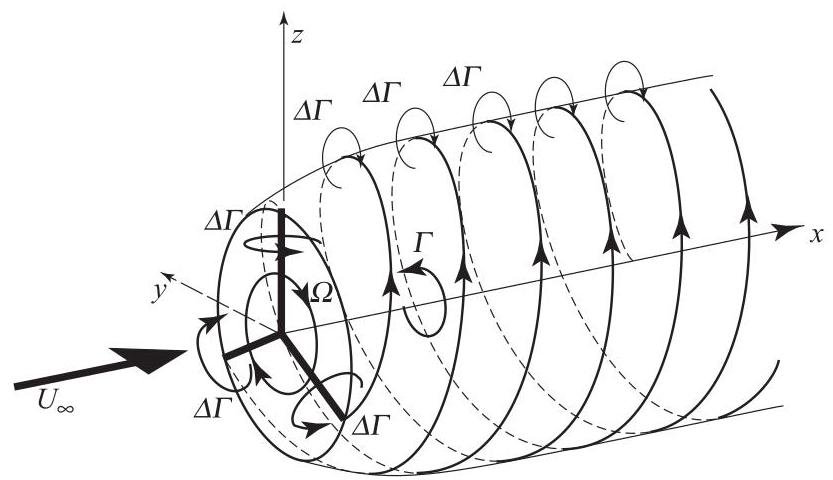

Figure 3.6 Helical vortex wake shed by rotor with three blades each with uniform circulation ${\Delta \Gamma }$

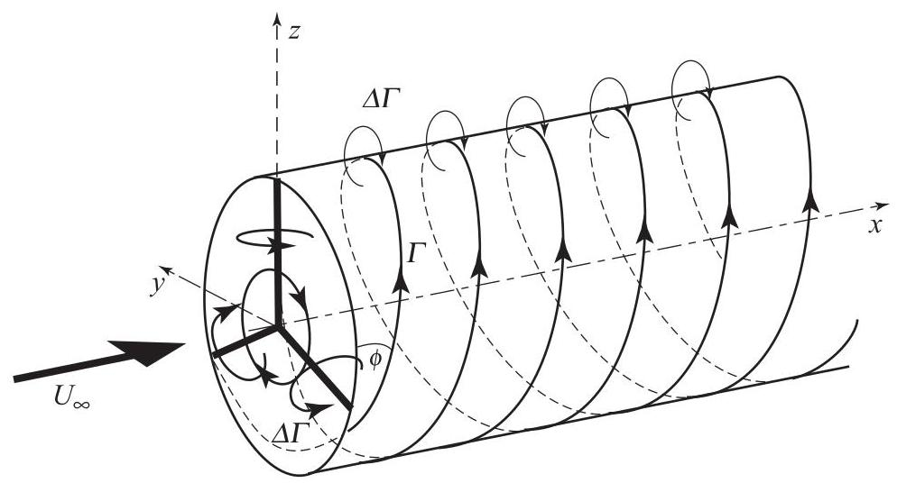

Figure 3.7 Simplified helical vortex wake ignoring wake expansion

From the root of each blade, assuming it reaches to the axis of rotation, a line vortex of strength ${\Delta \Gamma }$ will extend downstream along the axis of rotation contributing to the total root vortex of strength $\Gamma$ . The vortex tube will expand in radius as the flow of the wake inside the tube slows down. Vorticity is confined to the surface of the tube, the root vortex and to the bound vortex sheet swept by the multiplicity of blades to form the rotor disc; elsewhere in the wake and everywhere else in the entire flow field the flow is irrotational (see Figure 3.7).

The nature of the tube's expansion cannot be determined by means of the momentum theory and so, as an approximation, the tube is allowed to remain cylindrical. The Biot-Savart law is used to determine the induced velocity at any point in the vicinity of the actuator disc. The cylindrical vortex model allows the whole flow field to be determined and is accurate within the limitations of the non-expanding cylindrical wake.

#### 3.4.2 Vortex cylinder theory

The vortex cylinder has surface vorticity which follows a helical path with a helix angle ${\phi }_{t}$ or, as it has been termed previously, the flow angle at the outer edge of the disc. The strength of the vorticity is $g = {d\Gamma }/{dn}$ , where $n$ is a direction in the tube surface normal to the direction of ${\Delta \Gamma }$ , and has a component ${g}_{\theta } = g\cos {\phi }_{t}$ parallel to the rotor disc. Due to ${g}_{\theta }$ the axial (parallel to the axis of rotor rotation) induced velocity at the rotor plane is uniform over the rotor disc and can be determined by means of the Biot-Savart law as

$$
{u}_{d} =  - \frac{{g}_{\theta }}{2} =  - a{U}_{\infty } \tag{3.27}
$$

In the far wake the axial induced velocity is also uniform within the cylindrical wake and is

$$
{u}_{w} =  - {g}_{\theta } =  - {2a}{U}_{\infty } \tag{3.28}
$$

Figure 3.8 The geometry of the vorticity in the cylinder surface

The ratio of the two induced velocities corresponds to that of the simple momentum theory and justifies the assumption of a cylindrical vortex sheet.

#### 3.4.3 Relationship between bound circulation and the induced velocity

The total circulation on all of the multiplicity of blades is $\Gamma$ which is shed at a uniform rate into the wake in one revolution. So, from Figure 3.8 in which the cylinder has been slit longitudinally and opened out flat,

$$
g = \frac{\Gamma }{{2\pi R}\sin {\phi }_{t}} \tag{3.29}
$$

hence,

$$
{g}_{\theta } = \frac{\Gamma }{2\pi R}\frac{\cos {\phi }_{t}}{\sin {\phi }_{t}} = \frac{\Gamma }{2\pi R}\frac{\Omega R}{{U}_{\infty }\left( {1 - a}\right) } \tag{3.30}
$$

therefore,

$$
{2a}{U}_{\infty } = \frac{\Gamma }{2\pi R}\frac{\Omega R}{{U}_{\infty }\left( {1 - a}\right) } \tag{3.31}
$$

So, the total circulation is related to the induced velocity factors

$$
\Gamma  = \frac{{4\pi }{U}_{\infty }^{2}a\left( {1 - a}\right) }{\Omega } \tag{3.32}
$$

#### 3.4.4 Root vortex

Just as a vortex is shed from each blade tip a vortex is also shed from each blade root. If it is assumed that the blades extend to the axis of rotation, obviously not a practical option, then the root vortices will each be a line vortex running axially downstream from the centre of the disc. The direction of rotation of the all the root vortices will be the same forming a core, or root, vortex of total strength $\Gamma$ . The root vortex is primarily responsible for inducing the tangential velocity in the wake flow and in particular the tangential velocity on the rotor disc.

On the rotor disc surface the tangential velocity induced by the root vortex, given by the Biot-Savart law, is

$$
{a}^{\prime }{r\Omega } = \frac{\Gamma }{4\pi r}
$$

so

$$
{a}^{\prime } = \frac{\Gamma }{{4\pi }{r}^{2}\Omega } \tag{3.33}
$$

This relationship can also be derived from the momentum theory: the rate of change of angular momentum of the air which passes through an annulus of the disc of radius $r$ and radial width ${\delta r}$ is equal to the torque increment imposed upon the annulus

$$
{\delta Q} = \rho {U}_{\infty }\left( {1 - a}\right) {2\pi r2}{a}^{\prime }{r}^{2}{\Omega \delta r} \tag{3.34}
$$

The torque per unit span acting on all the blades is given by the Kutta-Joukowski theorem. The lift per unit radial width, $L$ , is

$$
L = \rho \left( {W \times  \Gamma }\right)
$$

where $\left( {W \times  \Gamma }\right)$ is a vector product

$$
{\delta Q} = {\rho W} \times  {\Gamma r}\sin {\phi }_{t}{\delta r} = {\rho \Gamma r}{U}_{\infty }\left( {1 - a}\right) {\delta r} \tag{3.35}
$$

Equating the two expressions for ${\delta Q}$ gives

$$
{a}^{\prime } = \frac{\Gamma }{{4\pi }{r}^{2}\Omega }
$$

Hence,

$$
{a}^{\prime } = \frac{{U}_{\infty }^{2}a\left( {1 - a}\right) }{{\lambda }_{r}^{2}} = \frac{a\left( {1 - a}\right) }{{\lambda }_{r}^{2}}
$$

At the outer edge of the disc the tangential induced velocity is

$$
{a}_{t}^{\prime } = \frac{a\left( {1 - a}\right) }{{\lambda }^{2}} \tag{3.36}
$$

Equation 3.36 is exactly the same as Equation 3.23 of Section 3.3.3.

#### 3.4.5 Torque and power

The torque on an annulus of radius $r$ and radial width ${\delta r}$ is

$$
\frac{dQ}{dr}{\delta r} = {\rho W\Gamma r}\sin {\phi }_{t}{\delta r} = \frac{{\rho 4\pi r}{U}_{\infty }^{3}a{\left( 1 - a\right) }^{2}}{\Omega }{\delta r}
$$

$$
\frac{dQ}{dr} = \frac{\frac{1}{2}\rho {U}_{\infty }^{3}{2\pi r4a}{\left( 1 - a\right) }^{2}}{\Omega } \tag{3.37}
$$

The radial distribution of power is

$$
\frac{dP}{dr} = \Omega \frac{dQ}{dr} = \frac{1}{2}\rho {U}_{\infty }^{3}{2\pi r4a}{\left( 1 - a\right) }^{2} \tag{3.38}
$$

and, therefore, the total power is

$$
P = \frac{1}{2}\rho {U}_{\infty }^{3}\pi {R}^{2}{4a}{\left( 1 - a\right) }^{2} \tag{3.39}
$$

Power coefficient

$$
{C}_{P} = {4a}{\left( 1 - a\right) }^{2} = 4{a}_{t}^{\prime }\left( {1 - a}\right) {\lambda }^{2} \tag{3.40}
$$

Again a result that is identical to that predicted by the simple momentum theory.

What is particularly interesting is that the rotational flow in the wake makes no difference at all to the efficiency of the power extraction.

#### 3.4.6 Axial flow field

The induced velocity in the wind-wise (axial) direction can be determined both upstream of the disc and downstream in the developing wake, as well as on the disc itself. The flow field (net velocity) is axi-symmetric and a radial cross-section is shown in Figure 3.9. Both radial and axial distances are divided by the disc radius with the axial distance being measured downstream from the disc and the radial distance being measured from the rotational axis. The velocity is divided by the wind speed.

The axial velocity within the wake is sharply lower than without and is radially uniform at the disc and in the far wake, just as the momentum theory predicts. There is a small acceleration of the flow immediately outside of the wake. The induced velocity on the wake cylinder itself is $\frac{1}{4}a$ at the disc and $\frac{1}{2}a$ in the far wake.

#### 3.4.7 Tangential flow field

The tangential induced velocity is determined not only by the root vortex but also by the component of vorticity $g\sin {\phi }_{t}$ on the wake cylinder and the bound vorticity on the rotor disc. At a radial distance equal to half the disc radius, as an example, the axial variation of the three contributions are shown in Figure 3.10.

Figure 3.9 The radial and axial variation of axial velocity in the vicinity of an actuator disc, $a = \frac{1}{3}$

The bound vorticity causes rotation in opposite senses upstream and downstream of the disc with a step change across the disc. The upstream rotation, which is in the same sense as the rotor rotation, is nullified by the root vortex, which induces rotation in the opposite sense to that of the rotor. The downstream rotation is in the same sense for both the root vortex and the bound vorticity the stream-wise variations of the two summing to give a uniform velocity in the stream-wise sense. The vorticity located on the surface of the wake cylinder makes a small contribution.

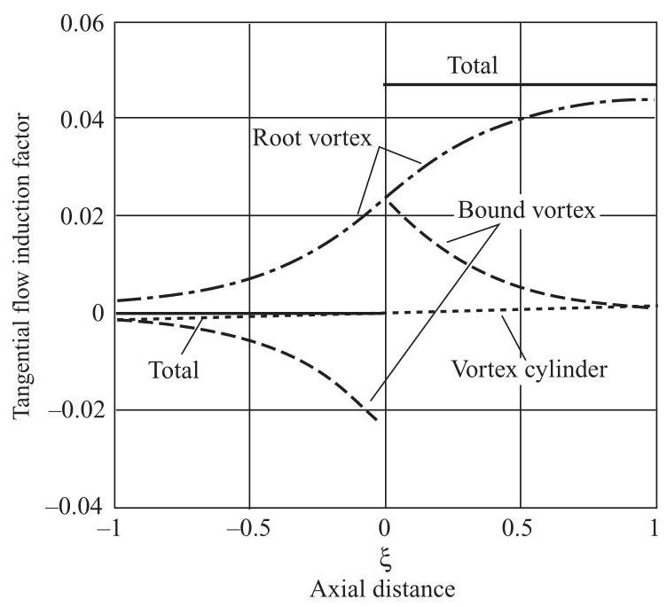

Figure 3.10 The axial variation of tangential velocity in the vicinity of an actuator disc at 50% radius, $a = \frac{1}{3},\lambda  = 6$

Figure 3.11 The axial variation of tangential velocity in the vicinity of an actuator disc at 101% radius, $a = \frac{1}{3},\lambda  = 6$

At the disc itself the bound vorticity induces no rotation, the wake cylinder induces no rotation either and so it is only the root vortex which does induce rotation and that value is half the total induced generally in the wake. It is now clear why only half the rotational velocity is used to determine the flow angle at the disc.

The rotational flow is confined to the wake, that is, inside the cylinder. There is no rotational flow anywhere outside of the wake, neither upstream of the disc or outside the cylinder. The rotational flow within the cylinder falls with increasing radius but is not zero at the outer edge of the wake; therefore, there is an abrupt fall of rotational velocity across the cylindrical surface.

The cylinder itself, therefore, rotates with angular velocity ${a}_{t}^{\prime }\Omega$ and so the rotation of the flow relative to the disc is $\left( {1 + {a}^{\prime }}\right) \Omega$ . It would seem that the flow angle ${\phi }_{t}$ should take the additional rotation into account but it is determined by the flow relative to the moving cylindrical surface for which the relative rotational velocity is just $\Omega {.}^{1}$

The contributions of the three vorticity sources to the rotational flow at a radius of 101% of the disc radius are shown in Figure 3.11: the total rotational flow is zero at all axial positions but the individual components are not zero.

#### 3.4.8 Axial thrust

The axial thrust $T$ on the disc can be determined using the Kutta-Joukowski theorem

$$
\frac{dT}{dr} = {\rho \Gamma V}
$$

---

${}^{1}$ In the first edition of the Wind Energy Handbook the flow angle was determined, mistakenly, by including the rotation of the cylinder in the relative rotational velocity.

---

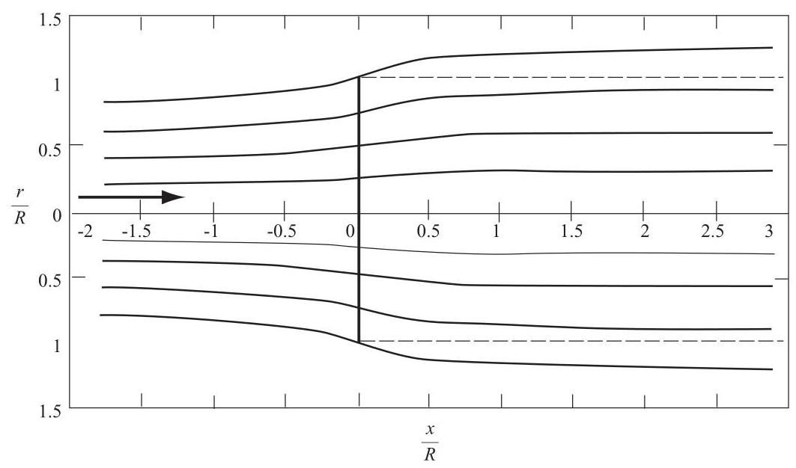

Figure 3.12 Flow field through an actuator disc for $a = \frac{1}{3}$

where $V$ is the tangential velocity component at the disc. If $V = {r\Omega }$ , then, using Equation 3.30

$$
\frac{dT}{dr} = {\rho 4\pi r}{U}_{\infty }^{2}a\left( {1 - a}\right) \tag{3.41}
$$

Integration of Equation 3.41 over the entire disc gives the thrust coefficient as

$$
{C}_{T} = {4a}\left( {1 - a}\right) \tag{3.42}
$$

That is, the same as for the simple momentum theory and so is in balance with the rate of change of axial momentum. However, if the induced tangential velocity ${a}^{\prime }{r\Omega }$ is included in $V$ , as might be assumed, the resulting thrust becomes infinite, or very much greater than the rate of change of axial momentum, and the necessary balance is lost.

#### 3.4.9 Radial flow field

Although the vortex cylinder model has been simplified by not allowing the cylinder to expand, the theory nevertheless predicts flow expansion. A radial velocity distribution is predicted by the theory as shown in Figure 3.12 which shows a longitudinal section of the flow field through the rotor disc.

The radial velocity, as calculated, is greatest as the flow passes through the rotor disc and, although not shown in Figure 3.12, it is infinite at the edge of the disc. The situation is very similar to the determination of the potential flow field around a flat, solid, circular disc which is normal to the oncoming flow; an infinite radial velocity is predicted at the disc edge for the flow to pass around and continue radially inwards on the downstream side. In practice, there would be insufficient static pressure available to fuel an infinite, or even a very high, velocity and so some discontinuity in the flow must occur. The presence of even the smallest amount of viscosity would produce a thick boundary layer towards the disc edge because of the high radial velocity. The viscosity in the boundary layer would absorb much of the available energy and dissipate it as heat so that, as the flow accelerated around the disc edge, the maximum velocity attainable would be limited by the static pressure approaching zero. Instead of the flow moving around the edge it would separate from the edge and continue downstream leaving a very low pressure region behind the disc with very low velocity: a stagnant region.

In the case of the permeable rotor disc there would be some flow through the disc, which would behave as described above, but the separation of the flow at the disc edge would produce an additional low pressure in the wake.

The problem of the infinite radial velocity at the rotor disc edge arises because of the assumption of an infinite number of rotor blades. If the theory is modified such that there are only a few blades the infinite radial velocity disappears. However, if, for a given rotor, the tip speed ratio is increased, with a consequent increase of the axial flow induction factor, the radial velocity at the tip rises sharply and the problem of edge separation returns, which is what actually occurs (see Section 3.6).

#### 3.4.10 Conclusions

Despite the exclusion of wake expansion the vortex theory produces results exactly in agreement with the momentum theory and enlightens understanding of the flow through an energy extracting actuator disc. However, the infinite radial velocity predicted at the outer edge of the disc is further evidence that the actuator disc is physically unrealisable.

### 3.5 Rotor blade theory (blade-element/momentum theory)

#### 3.5.1 Introduction

The aerodynamic lift (and drag) forces on the span-wise elements of radius $r$ and length ${\delta r}$ of the several blades of a wind turbine rotor are responsible for the rate of change of axial and angular momentum of all of the air which passes through the annulus swept by the blade elements. In addition, the force on the blade elements caused by the drop in pressure associated with the rotational velocity in the wake must also be provided by the aerodynamic lift and drag. As there is no rotation of the flow approaching the rotor, the reduced pressure on the downwind side of the rotor caused by wake rotation appears as a step pressure drop just as is that which causes the change in axial momentum. Because the wake is still rotating in the far wake the pressure drop that caused the rotation is still present and so does not contribute to the axial momentum change.

#### 3.5.2 Blade element theory

It is assumed that the forces on a blade element can be calculated by means of two-dimensional aerofoil characteristics using an angle of attack determined from the incident resultant velocity in the cross-sectional plane of the element; the velocity component in the span-wise direction is ignored. Three-dimensional effects are also ignored.

The velocity components at a radial position on the blade expressed in terms of the wind speed, the flow factors and the rotational speed of the rotor will determine the angle of attack. Having information about how the aerofoil characteristic coefficients ${C}_{l}$ and ${C}_{d}$ vary with the angle of attack, the forces on the blades for given values of $a$ and ${a}^{\prime }$ can be determined.

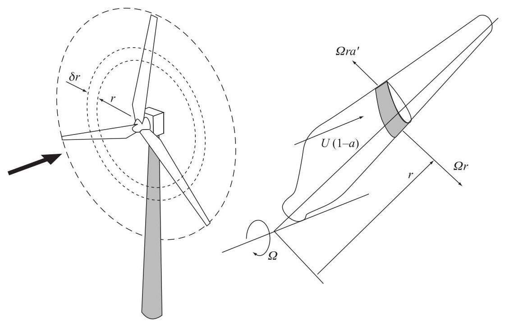

Figure 3.13 A blade element sweeps out an annular ring

Consider a turbine with B blades of tip radius $R$ each with chord $c$ and set pitch angle $\beta$ measured between the aerofoil zero lift line and the plane of the disc. Both the chord length and the pitch angle may vary along the blade span. Let the blades be rotating at angular velocity $\Omega$ and let the wind speed be ${U}_{\infty }$ . The tangential velocity experienced by the blade element shown in Figure 3.13 is, by the argument offered in Section 3.4.8 is ${r\Omega }$ . However, despite the validity of the reasoning in Section 3.4.8, it appears logical to combine the tangential velocity with that of the wake ${a}^{\prime }{r\Omega }$ giving a net tangential flow velocity experienced by the blade element as $\left( {1 + {a}^{\prime }}\right) {r\Omega }$ . In all of the literature available, particularly Glauert, it is the combined tangential velocity that is assumed to be correct and so it will be in this text, even though it has been demonstrated to be invalid in the case of the actuator disc. The actuator disc is infinitesimally thin and the change in tangential velocity is abrupt. The rotor blade 'disc', on the other hand has axial depth and the tangential velocity develops in a gradual manner, as demonstrated in Figure 3.5.

Figure 3.14 shows all the velocities and forces relative to the blade chord line at radius $r$ .

From Figure 3.14 the resultant relative velocity at the blade is

$$
W = \sqrt{{U}_{\infty }^{2}{\left( 1 - a\right) }^{2} + {r}^{2}{\Omega }^{2}{\left( 1 + {a}^{\prime }\right) }^{2}} \tag{3.43}
$$

that acts at an angle $\phi$ to the plane of rotation such that

$$
\sin \phi  = \frac{{U}_{\infty }\left( {1 - a}\right) }{W}\;\text{ and }\;\cos \phi  = \frac{{r\Omega }\left( {1 + {a}^{\prime }}\right) }{W} \tag{3.44}
$$

Figure 3.14 Blade element velocities and forces

The angle of attack $\alpha$ is then given by

$$
\alpha  = \phi  - \beta \tag{3.45}
$$

The basic assumption of the blade element theory is that the aerodynamic lift and drag forces acting upon an element are the same as those acting on an isolated, identical element at the same angle of attack in two-dimensional flow.

The lift force on a span-wise length ${\delta r}$ of each blade, normal to the direction of $W$ , is, therefore,

$$
{\delta L} = \frac{1}{2}\rho {W}^{2}c{C}_{l}{\delta r}
$$

and the drag force parallel to $W$ is

$$
{\delta D} = \frac{1}{2}\rho {W}^{2}c{C}_{d}{\delta r}
$$

The axial thrust on an annular ring of the actuator disc is

$$
{\delta T} = {\delta L}\cos \phi  + {\delta D}\sin \phi  = \frac{1}{2}\rho {W}^{2}{Bc}\left( {{C}_{l}\cos \phi  + {C}_{d}\sin \phi }\right) {\delta r} \tag{3.46}
$$

The torque on an annular ring is

$$
{\delta Q} = \left( {{\delta L}\sin \phi  - {\delta D}\cos \phi }\right) r = \frac{1}{2}\rho {W}^{2}{Bcr}\left( {{C}_{l}\sin \phi  - {C}_{d}\cos \phi }\right) {\delta r} \tag{3.47}
$$

where $B$ is the number of blades.

#### 3.5.3 The blade-element/momentum (BEM) theory

The basic assumption of the BEM theory is that the force of a blade element is solely responsible for the change of axial momentum of the air which passes through the annulus swept by the element. It is, therefore, to be assumed that there is no radial interaction between the flows through contiguous annuli: a condition that is, strictly, only true if the axial flow induction factor does not vary radially. In practice, the axial flow induction factor is seldom uniform, but experimental examination of flow through propeller discs by Lock (1924) shows that the assumption of radial independence is acceptable.

Equating the axial thrust on all blade elements, given Equation 3.46 with the rate of change of axial momentum of the air that passes through the annulus swept out by the elements, given by Equation 3.9 with ${A}_{D} = {2\pi r\delta r}$

$$
{\delta T} = \frac{1}{2}\rho {W}^{2}{Bc}\left( {{C}_{l}\cos \phi  + {C}_{d}\sin \phi }\right) {\delta r} = {2\pi r\delta r\rho }{U}_{\infty }\left( {1 - a}\right) {2a}{U}_{\infty } \tag{3.48}
$$

Also equating the torque on the elements, given by Equation 3.47, with the rate of change of angular momentum of the air passing through the swept annulus, given by Equation 3.34,

$$
{\delta Q} = \frac{1}{2}\rho {W}^{2}{Bcr}\left( {{\delta L}\sin \phi  - {\delta D}\cos \phi }\right) {\delta r} = {2\pi r\delta r\rho }{U}_{\infty }\left( {1 - a}\right) 2{a}^{\prime }{r}^{2}\Omega \tag{3.49}
$$

If drag is eliminated from the above two equations, to make a comparison with the results of the vortex theory of Section 3, the flow angle $\phi$ can be determined

$$
\tan \phi  = \frac{{a}^{\prime }{r\Omega }}{a{U}_{\infty }} = \frac{{a}^{\prime }}{a}\frac{r}{R}\lambda
$$

However, from the velocity triangle at a blade element given by Equation 3.44 the flow angle is also

$$
\tan \phi  = \frac{1 - a}{{\lambda }_{r}\left( {1 + {a}^{\prime }}\right) }
$$

Equating the two above expressions for $\tan \phi$

$$
\frac{{a}^{\prime }}{a}\frac{r}{R}\lambda  = \frac{1 - a}{{\lambda }_{r}\left( {1 + {a}^{\prime }}\right) }
$$

$$
a\left( {1 - a}\right)  = {\lambda }_{r}^{2}{a}^{\prime }\left( {1 + {a}^{\prime }}\right) \tag{3.50}
$$

At the outer edge of the rotor $\mu  = 1$ and ${a}^{\prime } = {a}_{t}^{\prime }$ , so

$$
a\left( {1 - a}\right)  = {\lambda }^{2}{a}_{t}^{\prime }\left( {1 + {a}_{t}^{\prime }}\right) \tag{3.50a}
$$

Equation 3.50a differs from Equation 3.36 by the additional term $\left( {1 + {a}_{t}^{\prime }}\right)$ . By the argument put forward in the last paragraph of Section 3.4.8 the inclusion of the additional term would result in an infinite thrust but, as previously stated, the inclusion of the term is the usual practice.

With drag included, the thrust Equation 3.48 can be reduced to

$$
\frac{{W}^{2}}{{U}_{\infty }^{2}}B\frac{c}{R}\left( {{C}_{l}\cos \phi  + {C}_{d}\sin \phi }\right)  = {8\pi a}\left( {1 - a}\right) \mu \tag{3.51}
$$

where the parameter $\mu  = r/R$ the torque Equation 3.49 simplifies to

$$
\frac{{W}^{2}}{{U}_{\infty }^{2}}N\frac{c}{R}\left( {{C}_{l}\sin \phi  - {C}_{d}\cos \phi }\right)  = {8\pi \lambda }{\mu }^{2}{a}^{\prime }\left( {1 - a}\right) \tag{3.52}
$$

It is convenient to put

$$
{C}_{l}\cos \phi  + {C}_{d}\sin \phi  = {C}_{x} \tag{3.53}
$$

and

$$
{C}_{l}\sin \phi  - {C}_{d}\cos \phi  = {C}_{y}
$$

Solving Equations 3.51 and 3.52 to obtain values for the flow induction factors $a$ and ${a}^{\prime }$ using two-dimensional aerofoil characteristics requires an iterative process for which the following equations, derived from 3.51, 3.52 and 3.53, are convenient; in which the right hand sides are evaluated using existing values of the flow induction factors yielding simple equations for the next iteration of the flow induction factors.

$$
\frac{a}{1 - a} = \frac{{\sigma }_{r}}{4{\sin }^{2}\phi }{C}_{x}
$$

${\left( {3.54}\right) }^{2}$

$$
\frac{{a}^{\prime }}{1 + {a}^{\prime }} = \frac{{\sigma }_{r}{C}_{y}}{4\sin \phi \cos \phi } \tag{3.55}
$$

Blade solidity $\sigma$ is defined as total blade area divided by the rotor disc area and is a primary parameter in determining rotor performance. Chord solidity ${\sigma }_{r}$ is defined as the total blade chord length at a given radius divided by the circumferential length at that radius.

$$
{\sigma }_{r} = \frac{B}{2\pi r}\frac{c}{R} = \frac{B}{2\pi \mu }\frac{c}{R} \tag{3.56}
$$

It is argued by Wilson and Lissaman (1974) that the drag coefficient should not be included in Equations 3.54 and 3.55 because the velocity deficit caused by drag is confined to the narrow wake which flows from the trailing edge of the aerofoil. Furthermore, Wilson and Lissaman reason, the drag based velocity deficit is only a feature of the wake and does not contribute to the velocity deficit upstream of the rotor disc. The basis of the argument for excluding drag in the determination of the flow induction factors is that, for attached flow, drag is caused only by skin friction and does not affect the pressure drop across the rotor. Clearly, in stalled flow the drag is overwhelmingly caused by pressure. In attached flow it has been shown by Young and Squire (1938) that the modification to the inviscid pressure distribution around an aerofoil caused by the boundary layer has an effect both on lift and drag. The ratio of pressure drag to total drag at zero angle of attack is approximately the same as the thickness to chord ratio of the aerofoil and increases as the angle of attack increases.

---

${}^{2}$ Equation 3.54 is changed from that given in the first edition because the flow rotation is now properly accounted for.

---

One last point about the blade element-momentum theory: the theory is strictly only applicable if the blades have uniform circulation, that is, if $a$ is uniform. For non-uniform circulation there is a radial interaction and exchange of momentum between flows through adjacent elemental annular rings. It cannot be stated that the only axial force acting on the flow through a given annular ring is that due to the pressure drop across the disc.

However, in practice, it appears that the error involved in relaxing the above constraint is small for tip speed ratios greater than three.

#### 3.5.4 Determination of rotor torque and power

The calculation of torque and power developed by a rotor requires knowledge of the flow induction factors, which are obtained by solving Equations 3.54 and 3.55. The solution is usually carried out iteratively because the two-dimensional aerofoil characteristics are nonlinear functions of the angle of attack.

To determine the complete performance characteristic of a rotor, that is, the manner in which the power coefficient varies over a wide range of tip speed ratio, requires the iterative solution.

The iterative procedure is to assume $a$ and ${a}^{\prime }$ to be zero initially, determining $\phi ,{C}_{l}$ and ${C}_{d}$ on that basis, and then to calculate new values of the flow factors using Equations 3.54 and 3.55. The iteration is repeated until convergence is achieved.

From Equation 3.51 the torque developed by the blade elements of span-wise length ${\delta r}$ is

$$
{\delta Q} = {4\pi \rho }{U}_{\infty }{\Omega r}{a}^{\prime }\left( {1 - a}\right) {r}^{2}{\delta r}
$$

If drag, or part of the drag, has been excluded from the determination of the flow induction factors then its effect must be introduced when the torque is calculated, see Equation 3.51,

$$
{\delta Q} = {4\pi \rho }{U}_{\infty }{\Omega r}{a}^{\prime }\left( {1 - a}\right) {r}^{2}{\delta r} - \frac{1}{2}\rho {W}^{2}{Bc}{C}_{d}\cos {\phi r\delta r}
$$

The complete rotor, therefore, develops a total torque $Q$ .

$$
Q = \frac{1}{2}\rho {U}_{\infty }^{2}\pi {R}^{3}\lambda {\int }_{0}^{R}{\mu }^{2}\left( {8{a}^{\prime }\left( {1 - a}\right) \mu  - \frac{W}{{U}_{\infty }}\frac{B\frac{c}{R}}{\pi }{C}_{d}\left( {1 + {a}^{\prime }}\right) }\right) {d\mu } \tag{3.57}
$$

The power developed by the rotor is

$$
P = {Q\Omega }
$$

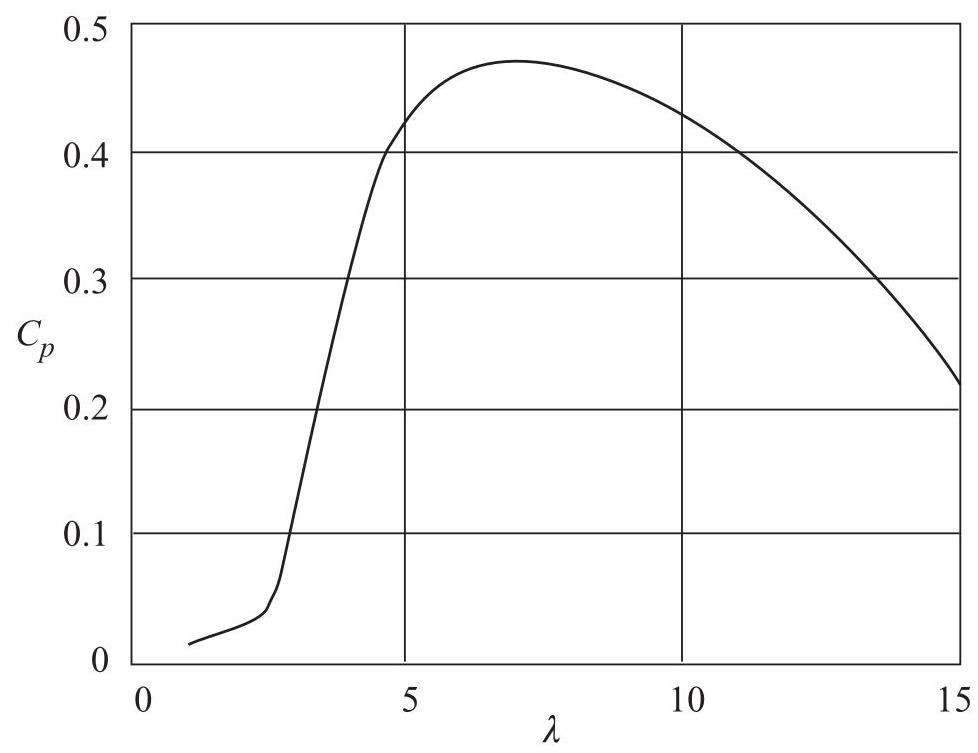

Figure 3.15 Power coefficient - tip speed ratio performance curve

The power coefficient is, therefore,

$$
{C}_{P} = \frac{P}{\frac{1}{2}\rho {U}_{\infty }^{3}\pi {R}^{2}}
$$

Solving the blade element-momentum Equations 3.54 and 3.55 for a given, suitable blade geometrical and aerodynamic design yields a series of values for the power and torque coefficients which are functions of the tip speed ratio. A typical performance curve for a modern, high speed wind turbine is shown in Figure 3.15.

The maximum power coefficient occurs at a tip speed ratio for which the axial flow induction factor $a$ , which in general varies with radius, approximates most closely to the Lanchester-Betz limit value of $\frac{1}{3}$ . At lower tip speed ratios the axial flow induction factor can be much less than $\frac{1}{3}$ and aerofoil angles of attack are high leading to stalled conditions. For most wind turbines stalling is much more likely to occur at the blade root because, from practical constraints, the built-in pitch angle $\beta$ of a blade is not large enough in that region. At low tip speed ratios blade stalling is the cause of a significant loss of power, as demonstrated in Figure 3.15. At high tip speed ratios $a$ is high, angles of attack are low and drag begins to predominate. At both high and low tip speed ratios, therefore, drag is high and the general level of $a$ is non-optimum so the power coefficient is low. Clearly, it would be best if a turbine can be operated at all wind speeds at a tip speed ratio close to that which gives the maximum power coefficient.

### 3.6 Breakdown of the momentum theory

#### 3.6.1 Free-stream/wake mixing

For heavily loaded turbines, when $a$ is high, the momentum theory predicts a reversal of the flow in the wake. Such a situation cannot actually occur, so, what happens is that the wake becomes turbulent and, in doing so, entrains air from outside the wake by a mixing process which re-energises the slow moving air that has passed through the rotor.

A rotor operating at increasingly high tip speed ratios presents a decreasingly permeable disc to the flow. Eventually, when $\lambda$ is high enough for the axial flow factor to be equal to one, the disc effectively becomes a solid plate.

The flow past a solid disc, because of viscosity, separates at the disc's edge. A boundary layer develops as the flow over the front of the disc spreads out radially and by the time it reaches the edge viscosity has sapped much of the kinetic energy. As the boundary layer flows around the disc edge it accelerates causing a large drop in static pressure (Bernoulli). To flow around the disc edge would require very high velocity and there is insufficient static pressure to provide the necessary kinetic energy. The flow, therefore, separates from the disc and continues in the general stream-wise direction. In the region directly behind the disc there is slow moving, almost stagnant, air at low static pressure of the flow separating at the disc edge. At the front of the disc, at the very centre, the flow is brought to rest and so there is a large increase in static pressure as the kinetic energy is converted to pressure energy. Elsewhere on the front surface the flow moves radially with a velocity, outside the boundary layer, which increases towards the disc edge. The static pressure is generally higher on the front of the disc than on the rear and so the disc experiences a pressure drag force.

A similar process happens with a spinning rotor at high tip speed ratios. The air which does not pass through the rotor disc moves radially outwards and separates at the disc edge causing a low static pressure to develop behind the disc: the drop in static pressure caused by the separation increases as the tip speed ratio rises and the axial flow factor increases. The air which does pass through the rotor emerges into a low pressure region and is moving slowly. There is insufficient kinetic energy to provide the rise in static pressure necessary to achieve the ambient atmospheric pressure that must exist in the far wake. The air can only achieve atmospheric pressure by gaining energy from the mixing process in the turbulent wake. The shear layer in the flow between the free-stream air and the wake air is what becomes of the boundary layer that develops on the front of the disc. The shear layer is unstable and breaks up into the turbulence that causes the mixing and re-energisation of the wake air.

#### 3.6.2 Modification of rotor thrust caused by flow separation

The low static pressure downstream of the rotor disc caused by the separation of the free-stream flow at the edge of the disc and the high static pressure at the stagnation point on the upstream side causes a large thrust on the disc, much larger than that predicted by the momentum theory. Some experimental results reported by Glauert (1926), for a whole rotor, can be seen in Figure 3.16 where the simple expression for the thrust force coefficient, as derived from the momentum theory ${C}_{T} = {4a}\left( {1 - a}\right)$ , is given for comparison.

The thrust (or drag) coefficient for a simple, flat circular plate is given by Hoerner (1965) as 1.17 but, as demonstrated in figure 3.16, the thrust on the rotating disc is higher. It might have been expected that when $a = 1$ the rotor would have the same thrust coefficient as the circular plate. The principal difference between the circular plate and the rotor is that the latter is rotating and, as Hoerner also describes, this causes energy to be dissipated in a thicker, rotating boundary layer on the upstream surface of the rotor disc giving rise to an even lower pressure on the downstream side.

Figure 3.16 Comparison of theoretical and measured values of ${C}_{T}$

It would follow from the above arguments that for high values of the axial induction factor most of the pressure drop across the disc is not associated with blade circulation, just as it is absent in the case of the circular plate. Circulation would cause a small pressure drop similar to that given by the momentum theory because it would be determined by the very low axial velocity of the flow which actually permeates the disc.

#### 3.6.3 Empirical determination of thrust coefficient

A suitable straight line through the experimental points would appear to be possible, although Glauert proposed a parabolic curve, and provides an empirical solution to the problem of the thrust on a heavily loaded turbine (a rotor operating at a high value of the axial flow induction factor).

Most authors assume that the entire thrust on the rotor disc is associated with axial momentum change. Therefore, for the empirical line to be useful it must be assumed that it applies not only to the whole rotor but also to each separate stream-tube. Let ${C}_{T1}$ be the empirical value of ${C}_{T}$ when $a = 1$ . Then, as the straight line must be a tangent to the momentum theory parabola at the transition point, the equation for the line is

$$
{C}_{T} = {C}_{T1} - 4\left( {{\sqrt{C}}_{T1} - 1}\right) \left( {1 - a}\right) \tag{3.58}
$$

and the value of $a$ at the transition point is

$$
{a}_{T} = 1 + \frac{1}{2}\sqrt{{C}_{T1}}
$$

By inspection, ${C}_{T1}$ must lie between 1.6 and 2: ${C}_{T1} = {1.816}$ would appear to be the best fit to the experimental data of Figure 3.16, whereas Wilson and Lissaman (1974) favour the lower value of ${C}_{T1} = {1.6}$ . Glauert fits a parabolic curve to the data giving much higher values of ${C}_{T1}$ at high values of $a$ but he was considering the case of an airscrew in the windmill brake state where the angles of attack are negative.

The flow field through the turbine under heavily loaded conditions cannot be modelled easily and the results of this empirical analysis must be regarded as being only approximate at best. They are, nevertheless, better than those predicted by the momentum theory. For most practical designs the value of axial flow induction factor rarely exceeds 0.6 and for a well designed blade will be in the vicinity of 0.33 for much of its operational range.

For values of $a$ greater than ${a}_{T}$ it is common to replace the momentum theory thrust in Equation 3.9 with Equation 3.58, in which case Equation 3.54 is replaced by

$$
{\left( 1 - a\right) }^{2}\frac{{\sigma }_{r}}{{\sin }^{2}\phi }{C}_{x} + 4\left( {\sqrt{{C}_{T1}} - 1}\right) \left( {1 - a}\right)  - {C}_{T1} = 0 \tag{3.54a}
$$

However, as the additional pressure drop is caused by edge flow separation then this course of action is questionable and it may be more appropriate to retain Equation 3.53.

### 3.7 Blade geometry

#### 3.7.1 Introduction

The purpose of most wind turbines is to extract as much energy from the wind as possible and each component of the turbine has to be optimised for that goal. Optimal blade design is influenced by the mode of operation of the turbine, that is, fixed rotational speed or variable rotational speed and, ideally, the wind distribution at the intended site. In practice engineering compromises are made but it is still necessary to know what would be the best design.

Optimising a blade design means maximising the power output and so a suitable solution to blade element-momentum equations (3.54 and 3.55) is necessary.

#### 3.7.2 Optimal design for variable speed operation

A turbine operating at variable speed can maintain the constant tip speed ratio required for the maximum power coefficient to be developed regardless of wind speed. To develop the maximum possible power coefficient requires a suitable blade geometry the conditions for which will now be derived.

For a chosen tip speed ratio $\lambda$ the torque developed at each blade station is maximised if

$$
{8\pi \lambda }{\mu }^{2}\frac{d}{d{a}^{\prime }}{a}^{\prime }\left( {1 - a}\right)  = 0
$$

giving

$$
\frac{da}{d{a}^{\prime }} = \frac{1 - a}{{a}^{\prime }} \tag{3.59}
$$

From Equations 3.51 and 3.53a a relationship between the flow induction factors can be obtained.

Dividing Equations 3.51 and 3.53a

$$
\frac{\frac{{C}_{l}}{{C}_{d}}\tan \phi  - 1}{\frac{{C}_{l}}{{C}_{d}} + \tan \phi } = \frac{{\lambda \mu }{a}^{\prime }\left( {1 - a}\right) }{a\left( {1 - a}\right)  + {\left( {a}^{\prime }\lambda \mu \right) }^{2}} \tag{3.60}
$$

The flow angle $\phi$ is given by

$$
\tan \phi  = \frac{1 - a}{{\lambda \mu }\left( {1 + {a}^{\prime }}\right) } \tag{3.61}
$$

Substituting Equation 3.61 into Equation 3.60 gives

$$
\frac{\frac{{C}_{l}}{{C}_{d}}\frac{1 - a}{{\lambda \mu }\left( {1 + {a}^{\prime }}\right) } - 1}{\frac{{C}_{l}}{{C}_{d}} + \frac{1 - a}{{\lambda \mu }\left( {1 + {a}^{\prime }}\right) }} = \frac{{\lambda \mu }{a}^{\prime }\left( {1 - a}\right) }{a\left( {1 - a}\right)  + {\left( {a}^{\prime }\lambda \mu \right) }^{2}}
$$

Simplifying,

$$
\left\lbrack  {\frac{{C}_{l}}{{C}_{d}}\left( {1 - a}\right)  - {\lambda \mu }\left( {1 + {a}^{\prime }}\right) }\right\rbrack  \left\lbrack  {a\left( {1 - a}\right)  + {\left( {a}^{\prime }\lambda \mu \right) }^{2}}\right\rbrack
$$

$$
= \left\lbrack  {{\lambda \mu }\left( {1 + {a}^{\prime }}\right) \frac{{C}_{l}}{{C}_{d}} + \left( {1 - a}\right) }\right\rbrack  {\lambda \mu }{a}^{\prime }\left( {1 - a}\right) \tag{3.62}
$$

At this stage the process is made easier to follow if drag is ignored, Equation 3.62 then reduces to

$$
a\left( {1 - a}\right)  - {\lambda }^{2}{\mu }^{2}{a}^{\prime } = 0 \tag{3.62a}
$$

Differentiating Equation 3.62a with respect to ${a}^{\prime }$ gives

$$
\left( {1 - {2a}}\right) \frac{da}{d{a}^{\prime }} - {\lambda }^{2}{\mu }^{2} = 0 \tag{3.63}
$$

and substituting Equation 3.59 into 3.63

$$
\left( {1 - {2a}}\right) \left( {1 - a}\right)  - {\lambda }^{2}{\mu }^{2}{a}^{\prime } = 0 \tag{3.64}
$$

Equations 3.62a and 3.64, together, give the flow induction factors for optimised operation

$$
a = \frac{1}{3}\;\text{ and }\;{a}^{\prime } = \frac{a\left( {1 - a}\right) }{{\lambda }^{2}{\mu }^{2}} \tag{3.65}
$$

that agree exactly with the momentum theory prediction because no losses, such as aerodynamic drag, have been included and the number of blades is assumed to be large: every fluid particle which passes through the rotor disc interacts with a blade resulting in a uniform axial velocity over the area of the disc.

To achieve the optimum conditions the blade design has to be specific and can be determined from either of the fundamental Equations 3.51 and 3.53. Choosing Equation 3.53, because it is the simpler, and ignoring the drag the torque developed in optimised operation is

$$
{\delta Q} = {4\pi \rho }{U}_{\infty }{\Omega r}{a}^{\prime }\left( {1 - a}\right) {r}^{2}{\delta r} = {4\pi \rho }\frac{{U}_{\infty }^{3}}{\Omega }a{\left( 1 - a\right) }^{2}{r\delta r}
$$

The component of the lift per unit span in the tangential direction is, therefore,

$$
L\sin \phi  = {4\pi \rho }\frac{{U}_{\infty }^{3}}{\Omega }a{\left( 1 - a\right) }^{2}
$$

By the Kutta-Joukowski theorem the lift per unit span is

$$
L = {\rho W\Gamma }
$$

where $\Gamma$ is the sum of the individual blade circulations and $W$ is the component of incident velocity mutually perpendicular to both $\Gamma$ and $L$ .

Consequently,

$$
{\rho W\Gamma }\sin \phi  = {\rho \Gamma }{U}_{\infty }\left( {1 - a}\right)  = {4\pi \rho }\frac{{U}_{\infty }^{3}}{\Omega }a{\left( 1 - a\right) }^{2} \tag{3.66}
$$

so

$$
\Gamma  = {4\pi }\frac{{U}_{\infty }^{2}}{\Omega }a\left( {1 - a}\right) \tag{3.67}
$$

The circulation is therefore uniform along the blade span and this is a condition for optimised operation.

To determine the blade geometry, that is, how should the chord size vary along the blade and what pitch angle $\beta$ distribution is necessary, we must return to Equation 3.53a.

$$
\frac{{W}^{2}}{{U}_{\infty }^{2}}B\frac{c}{R}{C}_{l}\sin \phi  = {8\pi \lambda }{\mu }^{2}{a}^{\prime }\left( {1 - a}\right)
$$

substituting for $\sin \phi$ gives

$$
\frac{W}{{U}_{\infty }}B\frac{c}{R}{C}_{l}\left( {1 - a}\right)  = {8\pi \lambda }{\mu }^{2}{a}^{\prime }\left( {1 - a}\right) \tag{3.68}
$$

From which is derived

$$
\frac{B}{2\pi }\frac{c}{R} = \frac{{4\lambda }{\mu }^{2}{a}^{\prime }}{\frac{W}{{U}_{\infty }}{C}_{l}}
$$

The only unknown on the right hand side of the above equation is the value of the lift coefficient ${C}_{l}$ and so it is common to include it on the left side of the equation with the chord solidity as a blade geometry parameter. The lift coefficient can be chosen as that value which corresponds to the maximum lift/drag ratio ${C}_{l}/{C}_{d}$ as this will minimise drag losses: even though drag has been ignored in the determination of the optimum flow induction factors and blade geometry it cannot be ignored in the calculation of torque and power. Blade geometry also depends upon the tip speed ratio $\lambda$ so it is also included in the blade geometry parameter.

Hence,

$$
{\sigma }_{r}\lambda {C}_{l} = \frac{B}{2\pi }\frac{c}{R}\lambda {C}_{l} = \frac{4{\lambda }^{2}{\mu }^{2}{a}^{\prime }}{\sqrt{{\left( 1 - a\right) }^{2} + {\left( \lambda \mu \left( 1 + {a}^{\prime }\right) \right) }^{2}}} \tag{3.69}
$$

Introducing the optimum conditions of Equation 3.65

$$
{\sigma }_{r}\lambda {C}_{l} = \frac{\frac{8}{9}}{\sqrt{{\left\lbrack  1 - \frac{1}{3}\right\rbrack  }^{2} + {\lambda }^{2}{\mu }^{2}{\left\lbrack  1 + \frac{2}{9{\lambda }^{2}{\mu }^{2}}\right\rbrack  }^{2}}} \tag{3.69a}
$$

The parameter ${\lambda \mu }$ is called the local speed ratio and is equal to the tip speed ratio where $\mu  = 1$ .

If, for a given design, ${C}_{l}$ is held constant then Figure 3.17 shows the blade plan-form for increasing tip speed ratio. A high design tip speed ratio would require a long, slender blade (high aspect ratio) whilst a low design tip speed ratio would need a short, fat blade. The design tip speed ratio is that at which optimum performance is achieved. Operating a rotor at other than the design tip speed ratio gives a less than optimum performance, even in ideal drag free conditions.

In off-optimum operation the axial inflow factor is not uniformly equal to $\frac{1}{3}$ , in fact it is not uniform at all.

Figure 3.17 Variation of blade geometry parameter with local speed ratio

Figure 3.18 Variation of inflow angle with local speed ratio

The local inflow angle $\phi$ at each blade station also varies along the blade span as shown in Equation 3.70 and Figure 3.18.

$$
\tan \phi  = \left\lbrack  \frac{1 - a}{{\lambda \mu }\left( {1 + {a}^{\prime }}\right) }\right\rbrack \tag{3.70}
$$

which, for optimum operation, is

$$
\tan \phi  = \left\lbrack  \frac{1 - \frac{1}{3}}{{\lambda \mu }\left( {1 + \frac{2}{9{\lambda }^{2}{\mu }^{2}}}\right) }\right\rbrack \tag{3.70a}
$$

Close to the blade root the inflow angle is large which could cause the blade to stall in that region. If the lift coefficient is to be held constant such that drag is minimised everywhere then the angle of attack $\alpha$ also needs to be uniform at the appropriate value. For a prescribed angle of attack variation the design pitch angle $\beta  = \phi  - \alpha$ of the blade must vary accordingly.

As an example, suppose that the blade aerofoil is NACA 4412, popular for hand-built wind turbines because the bottom (high pressure) side of the profile is almost flat which facilitates manufacture. At a Reynolds number of about $5 \cdot  {10}^{5}$ the maximum lift/drag ratio occurs at a lift coefficient of about 0.7 and an angle of attack of about ${3}^{ \circ  }$ . Assuming that both ${C}_{l}$ and $\alpha$ are to be held constant along each blade and there are to be three blades operating at a tip speed ratio of 6 then the blade design in plan-form and pitch (twist) variation are shown in Figures 3.19a, b, respectively.

#### 3.7.3 A simple blade design

The blade design of Figure 3.19 is efficient but complex to build and, therefore, costly. Suppose the plan-form was prescribed to have a uniform taper such that the outer part of the blade corresponds closely to Figure 3.19a. A straight line drawn through the 70% and 90% span points as shown in Figure 3.20 not only simplifies the plan-form but removes a lot of material close to the root.

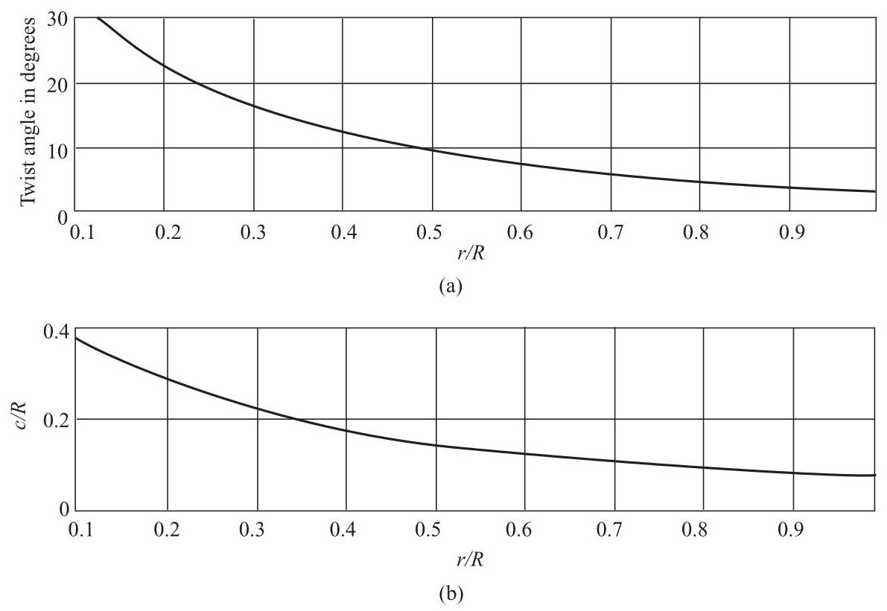

Figure 3.19 Optimum blade design for three blades and $\lambda  = 6$

The expression for the new plan-form is

$$
{c}_{u} = \frac{8}{9 \cdot  {0.8\lambda }}\left( {2 - \frac{\lambda \mu }{0.8\lambda }}\right) \frac{2\pi }{{C}_{l}{\lambda B}} \tag{3.71}
$$

The 0.8 in Equation 3.71 refers to the 80% point, midway between the target points.

Equations 3.69a and 3.71 can be combined to give the required span-wise variation of ${C}_{l}$ for optimal operation.

$$
{C}_{l} = \frac{8}{9}\frac{1}{\frac{B{c}_{u}\lambda }{2\pi }\sqrt{{\left( 1 - \frac{1}{3}\right) }^{2} + {\lambda }^{2}{\mu }^{2}{\left( 1 + \frac{2}{9{\lambda }^{2}{\mu }^{2}}\right) }^{2}}}
$$

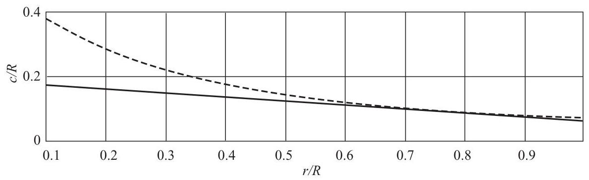

Figure 3.20 Uniform taper blade design for optimal operation

Figure 3.21 Span-wise distribution of the lift coefficient required for the linear taper blade

Close to the blade root the lift coefficient approaches the stalled condition and drag is high but the penalty is small because the adverse torque is small in that region (see Figure 3.21).

Assuming that stall does not occur and that for the aerofoil in question, which has a 4% camber (this approximates to a zero lift angle of attack of $- {4}^{ \circ  }$ ) the lift coefficient is given approximately by

$$
{C}_{l} = {0.1}\left( {\alpha  + {4}^{ \circ  }}\right)
$$

where $\alpha$ is in degrees and 0.1 is a good approximation to the gradient of the ${C}_{l}$ vs. $\alpha$ for most aerofoils, so

$$
\alpha  = \frac{{C}_{l}}{0.1} - {4}^{ \circ  }
$$

The blade twist distribution can now be determined from Equations 3.70a and 3.45.

The twist angle close to the root is still high but lower than for the constant ${C}_{l}$ blade (see Figure 3.22).

Figure 3.22 Span-wise distribution of the twist required for the linear taper blade

Figure 3.23 Radial variation of the flow induction factors with and without drag

#### 3.7.4 Effects of drag on optimal blade design

If, despite the views of Wilson and Lissaman (1974) (see Section 3.5.3), the effects of drag are included in the determination of the flow induction factors we must return to Equation 3.48 and follow the same procedure as described for the drag free case.

In the current context the effects of drag are dependent upon the magnitude of the lift/drag ratio which, in turn, depends on the aerofoil profile but largely on Reynolds number and on the surface roughness of the blade. A high value of lift/drag ratio would be about 150 , whereas a low value would be about 40.

Unfortunately, with the inclusion of drag, the algebra of the analysis is complex. Polynomial equations have to be solved for both $a$ and ${a}^{\prime }$ . The details of the analysis are left for the reader to discover.

In the presence of drag, the axial flow induction factor for optimal operation is not uniform over the disc as it is in the hypothetical drag free situation. However, the departure of the axial flow distribution from uniformity is not great, even when the lift/drag ratio is low provided the flow around a blade remains attached.

The radial variation of the axial and tangential flow induction factors is shown in Figure 3.23 for zero drag and for a lift/drag ratio of 40 . The tangential flow induction factor is lower in the presence of drag than without because the blade drags the fluid around in the direction of rotation, opposing the general rotational reaction to the shaft torque.

From the torque/angular momentum Equation 3.53 the blade geometry parameter becomes

$$
\frac{B}{2\pi }\frac{c}{R}\lambda {C}_{l} = \frac{4{\lambda }^{2}{\mu }^{2}{a}^{\prime }\left( {1 - a}\right) }{\frac{W}{{U}_{\infty }}\left\lbrack  {\left( {1 - a}\right)  - \frac{{C}_{l}}{{C}_{d}}{\lambda \mu }\left( {1 + {a}^{\prime }}\right) }\right\rbrack  } \tag{3.72}
$$

Figure 3.24 compares the blade geometry parameter distributions for zero drag and a lift/drag ratio of 40 and, as is evident, drag has very little effect on blade optimal design.

A similar result is apparent in Figure 3.25 for the inflow angle, Figure 3.25, distribution where drag also has little influence.

As far as blade design for optimal operation is concerned drag can be ignored, greatly simplifying the process.

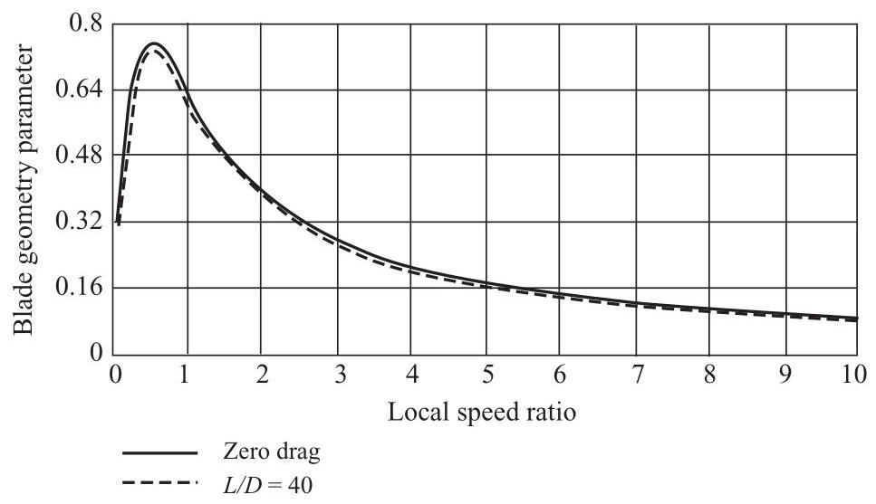

Figure 3.24 Span-wise variation of the blade geometry parameter with and without drag

The results of Equation 3.57 showing the maximum power coefficients for a range of design tip speed ratios and several lift/drag ratios is shown in Figure 3.26. The flow induction factors have been determined without drag (Equations 3.54 and 3.55) but the torque has been calculated using Equation 3.57, which includes drag. The losses caused by drag are significant and increase with increasing design tip speed ratio. As will be shown later, when tip-losses are also taken into account, the losses at low tip speed ratios are even greater.

#### 3.7.5 Optimal blade design for constant speed operation

If the rotational speed of a turbine is maintained at a constant level then the tip speed ratio is continuously changing and a blade optimised for a fixed tip speed ratio would not be appropriate.

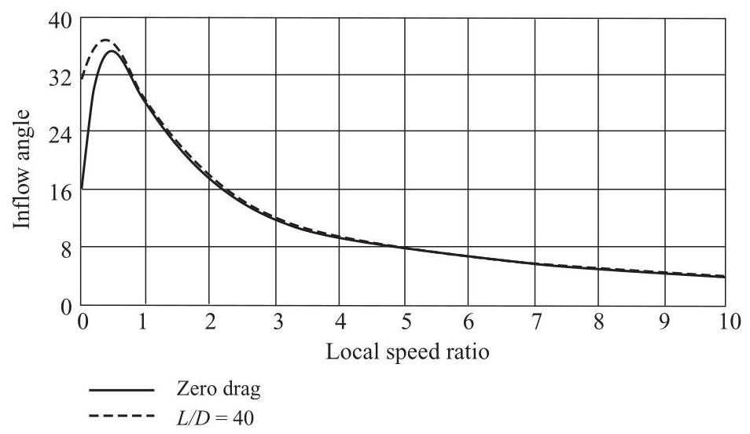

Figure 3.25 Variation of inflow angle with local speed ratio with and without drag.

Figure 3.26 The variation of maximum ${C}_{P}$ with design $\lambda$ for various lift/drag ratios.

No simple technique is available for the optimal design of a blade operating at constant rotational speed. A non-linear programming method could be applied by maximising energy capture at a site with a specified wind speed distribution. Alternatively, a design tip speed ratio could be chosen which corresponds to the wind speed at the specified site which contains the most energy or, more practically, the pitch angle for the whole blade can be adjusted to maximise energy capture.

### 3.8 The effects of a discrete number of blades

#### 3.8.1 Introduction

The analysis described in all prior sections assumes that there is a sufficient number of blades on the rotor for every fluid particle passing through the rotor disc to interact with a blade, that is, that all fluid particles undergo the same loss of momentum. With a small number of blades some fluid particles will interact with them but most will pass between the blades and, clearly, the loss of momentum by a particle will depend on its proximity to a blade as the particle passes through the rotor disc. The axial induced velocity will, therefore, at any instant, vary around the disc, the average value determining the overall axial momentum of the flow and the larger value local to a blade determining the forces on the blade.

#### 3.8.2 Tip-losses

If the axial flow induction factor $a$ is large at the blade position then, by Equation 3.44, the inflow angle $\phi$ will be small and the lift force will be almost normal to the rotor plane. The component of the lift force in the tangential direction will be small and so will be its contribution to the torque. A reduced torque means reduced power and this reduction is known as tip-loss because the effect occurs only at the outermost parts of the blades.

Figure 3.27 Helical trailing tip vortices of a horizontal axis turbine wake

In order to account for tip-losses, the manner in which the axial flow induction factor varies azimuthally needs to be known but, unfortunately, this requirement is beyond the abilities of the blade element-momentum theory.

Just as a vortex trails from the tip of an aircraft wing so does a vortex trail from the tip of a wind turbine blade. Because the blade tip follows a circular path it leaves a trailing vortex as a helical structure which convects downstream with the wake velocity. For a two blade rotor, unlike an aircraft wing, the bound circulations on the two blades shown in Figure 3.27 are opposite in sign and so combine to shed a straight line vortex along the rotational axis with strength equal to the blade circulation times the number of blades.

For a single vortex to be shed from the blade tip the circulation strength along the blade span must be uniform and, as has been shown, uniform circulation is a requirement for optimised operation. However, the uniform circulation requirement assumes that the axial flow induction factor is uniform across the disc and, as has been argued above, with discrete blades rather than a uniform disc the flow factor is not uniform.

In the case of Figure 3.27, close to the blade tips the tip vortex causes very high values of the flow factor $a$ such that, locally, the net flow past the blade is in the upstream direction. The average value of $a$ , azimuthally, is radially uniform which means that if high values occur in the vicinity of the blades then low values occur elsewhere. The azimuthal variation of $a$ for a number of radial positions is shown in Figure 3.28 for a three blade rotor operating at a tip speed ratio of six. The calculation for Figure 3.28 assumes a discrete vortex for each blade with a constant pitch and constant radius helix.

At a particular radial position the ratio of the azimuthal average of $a$ to the value at the azimuthal position where the blade is centred is shown in Figure 3.29, being unity for most of the blade span and only near the tip does it begin to fall to zero. The ratio is called 'the tip-loss factor'.

From Equation 3.20 and in the absence of tip-loss and drag the contribution of each blade element to the overall power coefficient is

$$
\delta {C}_{P} = 8{\lambda }^{2}{\mu }^{3}{a}^{\prime }\left( {1 - a}\right) {\delta \mu } \tag{3.73}
$$

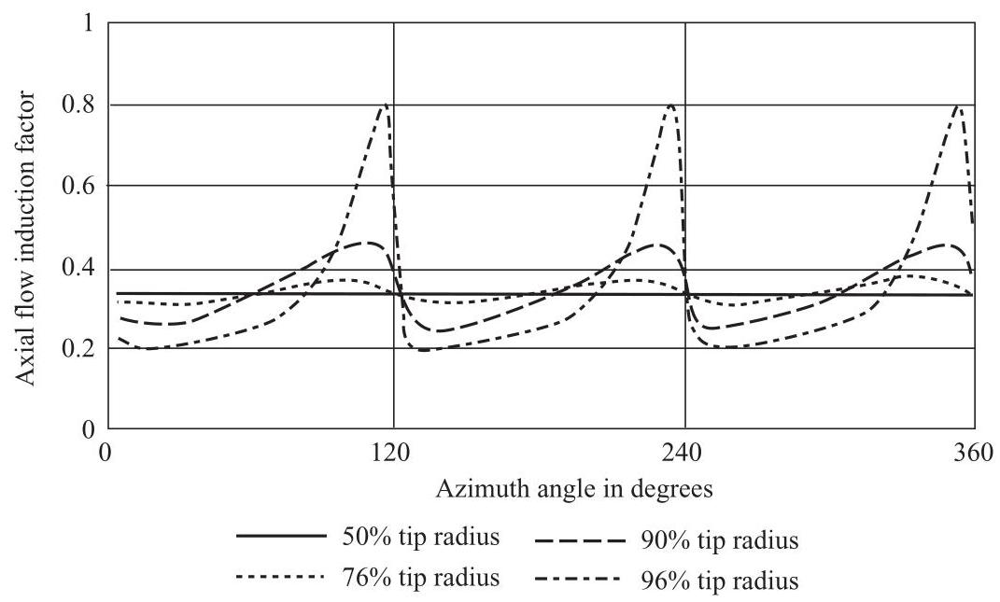

Figure 3.28 Azimuthal variation of $a$ for various radial positions for a three blade rotor with uniform blade circulation operating at a tip speed ratio of six. The blades are at ${120}^{ \circ  },{240}^{ \circ  }$ and ${360}^{ \circ  }$ .

Substituting for ${a}^{\prime }$ from Equation 3.25 gives

$$
\delta {C}_{P} = {8\mu a}{\left( 1 - a\right) }^{2}{\delta \mu } \tag{3.74}
$$

Whereas, from the Kutta-Joukowski theorem, the circulation $\Gamma$ on the blade, which is uniform, provides a torque per unit span of

$$
\frac{dQ}{dr} = \rho \left( {W \times  \Gamma }\right) \sin {\phi }_{r}r
$$

where the angle ${\phi }_{r}$ is determined by the flow velocity local to the blade.

Figure 3.29 Span-wise variation of the tip-loss factor for a blade with uniform circulation

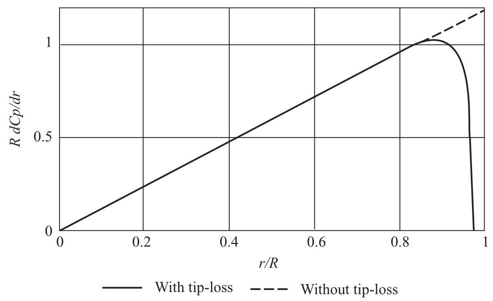

Figure 3.30 Span-wise variation of power extraction in the presence of tip-loss for a blade with uniform circulation on a three-blade turbine operating at a tip speed ratio of six

The strength of the total circulation for all three blades is given by Equation 3.67 and so, in the presence of tip-loss, the increment of power coefficient from a blade element is

$$
\delta {C}_{P} = {8\mu a}\left( {1 - a}\right) \left( {1 - {a}_{r}}\right) {\delta \mu } \tag{3.75}
$$

where $a = \frac{1}{3}$ is the average axial flow induction factor and ${a}_{r}$ is the value local to the blade, as described in Figure 3.33. In Equation 3.75 the term $\left( {1 - a}\right)$ refers to the mass flow through the annulus swept by a blade element and the term $\left( {1 - {a}_{r}}\right)$ refers to the loss of momentum experienced by the flow.

The results from Equations 3.73 and 3.74 are plotted in Figure 3.30 and clearly show the effect of tip-loss. Equation 3.70 assumes that $a = \frac{1}{3}$ uniformly over the whole disc, Equation 3.72 recognises that $a$ is not uniform. The azimuthally averaged value of $a$ is equal to $\frac{1}{3}$ at every radial position but the azimuth variation gives rise to the tip-loss. The blade does not extract energy from the flow efficiently because $a$ varies. Imagine the disc comprising a myriad of elemental discs, each with its own independent stream-tube, and not all of them operating at the Lanchester-Betz limit. Note that the power loss to the wind is exactly the same as that extracted by the blades, there is no effective drag associated with tip-loss.

With uniform circulation the azimuthal average value of $a$ is also radially uniform, but that implies a discontinuity of axial velocity at the wake boundary with a corresponding discontinuity in pressure. Whereas such discontinuities are acceptable in the idealised actuator disc situation, they will not occur in practice with a finite number of blades. If it is assumed that $a$ is zero outside of the wake then $a$ must fall to zero in a regular fashion towards the blade tips and, consequently, the bound circulation must also fall to zero. The manner in which the circulation varies at the tip will be governed by the blade tip design, that is, the chord and pitch variation, and there will be a certain design which will minimise the tip-loss.

Figure 3.31 A helicoidal vortex sheet wake for a two-blade rotor

If the circulation varies along the blade span vorticity is shed into the wake in a continuous fashion from the trailing edge.

Therefore, each blade sheds a helicoidal sheet of vorticity, as shown in Figure 3.31, rather than a single helical vortex as shown in Figure 3.27. The helicoidal sheets convect with the wake velocity and so there can be no flow across the sheets, which can therefore be regarded as impermeable. The intensity of the vortex sheets is equal to the rate of change of bound circulation along the blade span and so increases rapidly towards the blade tips. There is flow around the blade tips because of the pressure difference between the blade surfaces, which means that on the upwind surface of the blades the flow moves towards the tips and on the downwind surface the flow move towards the root. The flows from either surface leaving the trailing edge of a blade will not be parallel to one another and will form a surface of discontinuity of velocity in a radial sense within the wake; the axial velocity components will be equal. The surface of discontinuity is called a vortex sheet. A similar phenomenon occurs with aircraft wings and a textbook of aircraft aerodynamics will explain it in greater detail.

A deeper understanding of the mechanism of tip-loss can be obtained by following the path of air particles. An air particle approaches the spinning rotor, 'senses' high pressure ahead and slows down accordingly. The high pressure on the upwind side of the rotor blades is effectively smeared around the whole disc. Slowing down also causes the particle to move outwards to maintain the mass flow rate. When the particle reaches the rotor plane it will either be close to a blade or not and its axial velocity will be affected accordingly, as shown in Figure 3.28. If the particle passes through the rotor plane close to blade then it will also be strongly affected by the blade's pressure field.

As a particle passes close to and in front of a blade it will leave the trailing edge having accelerated in the tangential direction; it will then pass downstream, on the upwind side of the vortex sheet being shed from the trailing edge and so will also be moving radially outwards. The particle, therefore, migrates outward to the edge of the vortex sheet around which it is swept on to the downwind side and migrates inward with a radial velocity which reduces to zero at a radial point on the sheet where the shed vorticity is zero. The particle then continues downstream with the velocity of the axial and tangential velocities of the vortex sheet.

A second particle which passes a blade close to the downwind, low pressure, surface is accelerated tangentially in the opposite direction to the blade motion and then slows down, leaving the trailing edge with the same axial and tangential velocity components as the first particle but on the downwind side of the vortex sheet so it will have, in addition, a radially inwards velocity. The second particle will, depending on its radial position, migrate inwards until the radial velocity becomes zero.

A third particle which passes between two blades will be moving axially at a greater velocity than the first two particles, will not be strongly affected by the pressure fields of the blades but, because of the solid blockage presented by the blades (see Figure 3.5) will be directed into a helical path. Being faster than the vortex sheet ahead, the particle will begin to catch it up and as it does so the influence of the vortex sheet will move it outwards, around the edge of the sheet and then inwards, just like the first particle. Unlike the first particle, however, the third particle will still be moving faster than the vortex sheet and so will move axially away from the sheet, approaching the next sheet downstream and repeating the motion around the edge of that sheet. The particle will proceed downstream overtaking and hopping around each vortex sheet in turn.

The third particle does not lose as much axial momentum as particles one and two and is, therefore, affected by the so-called tip loss. The affect is greater the closer the third particle is to the edge of the rotor disc as it passes through the disc.

A fourth particle passes between the blades but at a radial position, closer to the axis of rotation, where its axial velocity is equal to that of the vortex sheets. If the particle passes midway, say, between two blades then it remains midway between the two corresponding vortex sheets as it moves downstream and does not undergo any radial motion other than the general expansion caused by the slowing down of the flow.

The fourth particle is totally unaffected by the fact that there is a finite number of blades and follows the same progress as if it were passing through a uniform actuator disc.

The axial flow induction factor varies, therefore, not only azimuthally but also radially, is a function of both $r$ and $\theta$ . The azimuthally averaged value of $a\left( r\right)  = {a}_{b}\left( r\right) f\left( r\right)$ , where $f\left( r\right)$ is known as the tip-loss factor, has a value of unity inboard (particle four) and falls to zero at the edge of the rotor disc. The value ${a}_{b}\left( r\right)$ is the level of axial flow induction factor that occurs locally at a blade element and is the velocity with which the vortex sheet convects downstream. If ${a}_{b}\left( r\right)$ can be held radially uniform then the vortex sheets will be radially flat, as shown in Figure 3.31, but if ${a}_{b}\left( r\right)$ is not uniform the vortex sheets will warp.

In the application of the blade element-momentum theory it is argued that the rate of change of axial momentum is determined by the azimuthally averaged value of axial flow induction factor, whereas the blade forces are determined by the value of the flow factor which occurs locally at the blade element, that experienced by the first and second particles.

The mass flow rate through an annulus $= \rho {U}_{\infty }\left( {1 - {a}_{b}\left( r\right) f\left( r\right) }\right) {2\pi r\delta r}$ .

The azimuthally averaged overall change of axial velocity $= 2{a}_{b}\left( r\right) f\left( r\right) {U}_{\infty }$ .

The rate of change of axial momentum $= {4\pi r\rho }{U}_{\infty }^{2}\left( {1 - {a}_{b}\left( r\right) f\left( r\right) }\right) {a}_{b}\left( r\right) f\left( r\right) {\delta r}$ .

The blade element forces are $\frac{1}{2}\rho {W}^{2}{Bc}{C}_{l}$ and $\frac{1}{2}\rho {W}^{2}{Bc}{C}_{d}$ where $W$ and ${C}_{l}$ are determined using ${a}_{b}\left( r\right)$ .

The pressure force caused by the rotation of the wake is also calculated using an azimuthally averaged value of the tangential flow induction factor $2{a}_{b}^{\prime }\left( r\right) f\left( r\right)$ .

#### 3.8.3 Prandtl's approximation for the tip-loss factor

The function for the tip-loss factor $f\left( r\right)$ is shown in Figure 3.29 for a blade with uniform circulation operating at a tip speed ratio of six and is not readily obtained by analytical means for any desired tip speed ratio. Sidney Goldstein (1929) did analyse the tip-loss problem for application to propellers and achieved a solution in terms of Bessel functions, but neither that nor the Biot-Savart solution used above is suitable for inclusion in the blade element-momentum theory. Fortunately, in 1919, Ludwig Prandtl, reported by Betz (1919), had already developed an ingenious approximate solution which does yield a relatively simple analytical formula for the tip-loss function.

Prandtl's approximation was inspired by the fact that, being impermeable (particles one and three in the above description pass around the outer edge of a sheet but not through it), the vortex sheets could be replaced by material sheets which, provided they move with the velocity dictated by the wake, would have no effect upon the wake flow. The theory applies only to the developed wake. In order to simplify his analysis Prandtl replaced the helicoidal sheets with a succession of discs, moving with the uniform, central wake velocity ${U}_{\infty }\left( {1 - a}\right)$ and separated by the same distance as the normal distance between the vortex sheets. Conceptually, the discs, travelling axially with velocity ${U}_{\infty }\left( {1 - a}\right)$ would encounter the unattenuated free-stream velocity ${U}_{\infty }$ at their outer edges. The fast flowing free-stream air would tend to weave in and out between successive discs. The wider apart successive discs the deeper, radially, the free-stream air would penetrate. Taking any line parallel to the rotor axis at a radius $r$ , somewhat smaller than the wake radius (rotor radius), the average axial velocity along that line would be greater than ${U}_{\infty }\left( {1 - a}\right)$ and less than ${U}_{\infty }$ . Let the average velocity be ${U}_{\infty }\left( {1 - {af}\left( r\right) }\right)$ , where $f\left( r\right)$ is the tip-loss function, has a value less than unity and falls to zero at the wake boundary. At a distance from the wake edge the free-stream fails to penetrate and there is little or no difference between the induced velocity at the blade and that in the wake, that is, $f\left( r\right)  = 1$ .

A particle path, as shown in Figure 3.32, is very similar to that described for particle three, above, and may be interpreted as that of the average particle passing through the rotor disc at a given radius in the actual situation: the azimuthal variations of particle velocities at various radii are shown in Figure 3.28 and a 'Prandtl particle' would have a velocity equal to the average of a variation. Figure 3.32 depicts the developed wake.

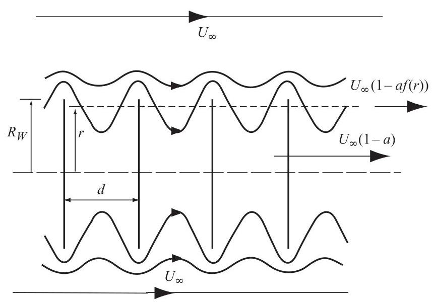

Figure 3.32 Prandtl's wake-disc model to account for tip-losses

Prandtl's approximation defines quite well the downstream behaviour of particle three above, which passes the rotor plane between two blades.

The mathematical detail of Prandtl's analysis (see Glauert, 1935a) is beyond the scope of this text but, unlike Goldstein's theory, the result can be expressed in closed solution form; the tip-loss factor is given by

$$
f\left( r\right)  = \frac{2}{\pi }{\cos }^{-1}\left( {e}^{-\pi \left( \frac{{R}_{w} - r}{d}\right) }\right) \tag{3.76}
$$

${R}_{w} - r$ is a distance measured from the wake edge. Distance $d$ between the discs should be that of the distance travelled by particle three between successive vortex sheets. Glauert (1935a) takes $d$ as being the normal distance between successive helicoidal vortex sheets.

The helix angle of the vortex sheets is the flow angle ${\phi }_{s}$ and so with $B$ sheets intertwining from $B$ blades

$$
d = \frac{{2\pi }{R}_{w}}{B}\sin {\phi }_{s} = \frac{{2\pi }{R}_{w}}{B}\frac{{U}_{\infty }\left( {1 - a}\right) }{{W}_{s}} \tag{3.77}
$$

Prandtl's model has no wake rotation but the discs may spin at the rotor speed without affecting the flow at all, as it is inviscid, thus, ${a}^{\prime }$ is zero and ${W}_{s}$ is the resultant velocity (not including the radial velocity) at the edge of a disc. Glauert (1935a) argues that ${R}_{w}/{W}_{s} \approx  r/W$ , which is more convenient to use.

$$
W = \sqrt{{\left\lbrack  {U}_{\infty }\left( 1 - a\right) \right\rbrack  }^{2} + {\left( r\Omega \right) }^{2}}
$$

so

$$
\pi \left( \frac{{R}_{w} - r}{d}\right)  = \frac{B}{2}\left( \frac{R - r}{r}\right) \sqrt{1 + \frac{{\left( r\Omega \right) }^{2}}{{\left\lbrack  {U}_{\infty }\left( 1 - a\right) \right\rbrack  }^{2}}}
$$

and

$$
f\left( \mu \right)  = \frac{2}{\pi }{\cos }^{-1}\left( {{e}^{-\frac{B}{2}\left( \frac{1 - \mu }{\mu }\right) }\sqrt{1 + \frac{{\left( \lambda \mu \right) }^{2}}{{\left( 1 - a\right) }^{2}}}}\right) \tag{3.78}
$$

The Prandtl tip-loss factor for a three-blade rotor operating at a tip speed ratio of six is compared with the tip-loss factor of the helical vortex wake in Figure 3.33.

It should be pointed out that the vortex theory of Figure 3.28 also predicts that the tip-loss factor should be applied to the tangential flow induction factor.

Figure 3.33 Comparison of the Prandtl tip-loss factor with that predicted by a vortex theory for a three blade turbine optimised for a tip speed ratio of six

It is now useful to know what is the variation of circulation along the blade. For the previous analysis, which disregarded tip-losses, the blade circulation was uniform (Equation 3.65).

Following the same procedure from which Equation 3.66 was developed:

$$
\rho \left( {W \times  \Gamma }\right) \sin \phi  = {\rho \Gamma }{U}_{\infty }\left( {1 - {a}_{b}\left( r\right) }\right)  = {4\pi }\frac{{U}_{\infty }^{3}}{\Omega }a\left( r\right) {\left( 1 - a\left( r\right) \right) }^{2}
$$

Recall that ${a}_{b}\left( r\right)$ is the flow factor local to the blade at radius $r$ , which is equal to $a$ , and $a\left( r\right)$ is the average value of the flow factor at radius $r$ .

Therefore,

$$
\Gamma \left( r\right)  = \frac{4\pi }{\lambda \left( {1 - a}\right) }{af}\left( r\right) {\left( 1 - af\left( r\right) \right) }^{2} \tag{3.79}
$$

$\Gamma \left( r\right)$ is the total circulation for all blades and is shown in Figure 3.34; and, as can be seen, it is almost uniform except near to the tip. The dashed vertical line shows the effective blade length (radius) ${R}_{ef} = {0.975}$ if the circulation is assumed to be uniform at the level that pertains at the inboard section of the blade.

The Prandtl tip-loss factor appears to offer an acceptable, simple solution to a complex problem; not only does it account for the effects of discrete blades but it also allows the induction factors to fall to zero at the edge of the rotor disc.

#### 3.8.4 Blade root losses

At the root of a blade the circulation must fall to zero as it does at the blade tip, and so it can be presumed that a similar process occurs. The blade root will be at some distance from the rotor axis and the airflow through the disc inside the blade root radius will be at the free-stream velocity. Actually, the vortex theory of Section 3.4 can be extended to show that the flow through the root disc is somewhat higher than the free-stream velocity. It is usual, therefore, to apply the Prandtl tip loss function at the blade root as well as at the tip (see Figure 3.35).

Figure 3.34 Span-wise variation of blade circulation for a three-blade turbine optimised for a tip speed ratio of six

If ${\mu }_{R}$ is the normalised root radius then the root loss factor can be determined by modifying the tip loss factor of Equation 3.78.

$$
{f}_{R}\left( \mu \right)  = \frac{2}{\pi }{\cos }^{-1}\left( {{e}^{-\frac{B}{2}\left( \frac{\mu  - {\mu }_{R}}{\mu }\right) }\sqrt{1 + \frac{{\left( \lambda \mu \right) }^{2}}{{\left( 1 - a\right) }^{2}}}}\right) \tag{3.80}
$$

If Equation 3.78 is now termed ${f}_{T}\left( r\right)$ the complete tip/root loss factor is

$$
f\left( \mu \right)  = {f}_{T}\left( \mu \right) {f}_{R}\left( \mu \right) \tag{3.81}
$$

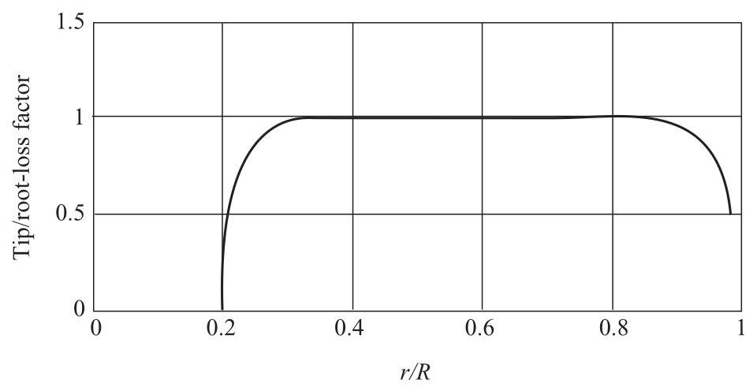

Figure 3.35 Span-wise variation of combined tip/root loss factor for a three-blade turbine optimised for a tip speed ratio of six and with a blade root at ${20}\%$ span

#### 3.8.5 Effect of tip-loss on optimum blade design and power

With no tip-loss the optimum axial flow induction factor is uniformly $\frac{1}{3}$ over the whole swept rotor. The presence of tip-loss changes the optimum value of the average value of $a$ which reduces to zero at the edge of the wake, but, local to the blade tends to increase in the tip region.

If $a\left( r\right)$ is taken as the azimuthal average at radius $r$ then locally, at the blade at that radius, the flow factor will be $a\left( r\right) /f\left( r\right)$ . The inflow angle $\phi$ , at the blade is then, from Equation 3.61,

$$
\tan \phi  = \frac{1}{\lambda \mu }\left( \frac{1 - \frac{a}{f}}{1 + \frac{{a}^{\prime }}{f}}\right) \tag{3.82}
$$

but Equation 3.60, which is the ratio of the non-dimensional rate of change of angular momentum to the non-dimensional rate of change of axial momentum, is not changed because it deals with the whole flow through the disc and so uses average values. If drag is ignored for the present, Equation 3.61 becomes

$$
\tan \phi  = \frac{{\lambda \mu }{a}^{\prime }\left( {1 - a}\right) }{a\left( {1 - a}\right)  + {\left( {a}^{\prime }\lambda \mu \right) }^{2}} \tag{3.83}
$$

Hence,

$$
\frac{\left( {1 - a}\right) {\lambda \mu }{a}^{\prime }}{a\left( {1 - a}\right)  + {\left( {a}^{\prime }\lambda \mu \right) }^{2}} = \frac{\left( 1 - \frac{a}{f}\right) }{{\lambda \mu }\left( {1 + \frac{{a}^{\prime }}{f}}\right) }
$$

which becomes

$$
{\lambda }^{2}{\mu }^{2}\frac{\left( f - 1\right) }{f}{a}^{\prime 2} - {\lambda }^{2}{\mu }^{2}\left( {1 - a}\right) {a}^{\prime } + a\left( {1 - a}\right) \left( {1 - \frac{a}{f}}\right)  = 0 \tag{3.84}
$$

A great simplification can be made to Equation 3.84 by ignoring the first term because, clearly, it disappears for much of the blade, where $f = 1$ , and for the tip region the value of ${a}^{\prime 2}$ is very small. For tip speed ratios greater than three neglecting the first term makes negligible difference to the result.

$$
{\lambda }^{2}{\mu }^{2}{a}^{\prime } = a\left( {1 - \frac{a}{f}}\right) \tag{3.85}
$$

As before, Equation 3.59 still applies

$$
\frac{da}{d{a}^{\prime }} = \frac{1 - a}{{a}^{\prime }}
$$

Figure 3.36 Axial flow factor variation with radius for a three blade turbine optimised for a tip speed ratio of six

From 3.85

$$
\frac{d{a}^{\prime }}{da} = \frac{1}{{\lambda }^{2}{\mu }^{2}}\left( {1 - 2\frac{a}{f}}\right)
$$

Consequently,

$$
\left( {1 - a}\right) \left( {1 - 2\frac{a}{f}}\right)  = {\lambda }^{2}{\mu }^{2}{a}^{\prime }
$$

Which, combined with Equation 3.85, gives

$$
{a}^{2} - \frac{2}{3}\left( {f + 1}\right) a + \frac{1}{3}f = 0
$$

so

$$
a = \frac{1}{3} + \frac{1}{3}f - \frac{1}{3}\sqrt{1 - f + {f}^{2}} \tag{3.86}
$$

The radial variation of the average value of $a$ , as given by Equation 3.86, and the value local to the blade $a/f$ , is shown in Figure 3.36. An exact solution would also have the local induced velocity falling to zero at the blade tip.

Clearly, the required blade design for optimal operation would be a little different to that which corresponds to the Prandtl tip-loss factor because $a/f$ , the local flow factor does not fall to zero at the blade tip. The use of the Prandtl tip-loss factor leads to an approximation, but that was recognised from the outset.

Figure 3.37 Variation of blade geometry parameter with local speed ratio, with and without tip-loss for a three-blade rotor with a design tip speed ratio of six

The blade design, which gives optimum power output, can now be determined by adapting Equations 3.68 and 3.69 accordingly:

$$
{\sigma }_{r}\lambda {C}_{l} = \frac{4{\lambda }^{2}{\mu }^{2}{a}^{\prime }}{\sqrt{{\left( 1 - \frac{a}{f}\right) }^{2} + {\left\lbrack  \lambda \mu \left( 1 + \frac{{a}^{\prime }}{f}\right) \right\rbrack  }^{2}}}\left( \frac{1 - a}{1 - \frac{a}{f}}\right)
$$

Introducing Equation 3.85 gives

$$
{\sigma }_{r}\lambda {C}_{l} = \frac{{4a}\left( {1 - a}\right) }{\sqrt{{\left( 1 - \frac{a}{f}\right) }^{2} + {\left\lbrack  \lambda \mu \left( 1 + \frac{a\left( {1 - \frac{a}{f}}\right) }{{\lambda }^{2}{\mu }^{2}f}\right) \right\rbrack  }^{2}}} \tag{3.87}
$$

The blade geometry parameter given by Equation 3.85 is shown in Figure 3.37 compared with the design which excludes tip-loss. As can be seen, only in the tip region is there any difference between the two designs.

Similarly, the inflow angle distribution, shown in Figure 3.38, can be determined by suitably modifying Equation 3.68

$$
\tan \phi  = \frac{1 - \frac{a}{f}}{{\lambda \mu }\left( {1 + \frac{a\left( {1 - \frac{a}{f}}\right) }{{\lambda }^{2}{\mu }^{2}f}}\right) } \tag{3.88}
$$

Figure 3.38 Variation of inflow angle with local speed ratio, with and without tip-loss for a three-blade rotor with a design tip speed ratio of six

Again, the effects of tip-loss are confined to the blade tip.

The power coefficient for an optimised rotor, operating at the design tip speed ratio, without drag and tip-losses, is equal to the Lanchester-Betz limit 0.593; but with tip-loss there is obviously a reduced optimum power coefficient. Equation 3.20 determines the power coefficient, see Figure 3.39.

$$
{C}_{P} = \frac{P}{\frac{1}{2}\rho {U}_{\infty }^{3}\pi {R}^{2}} = 8{\lambda }^{2}{\int }_{0}^{1}{a}^{\prime }\left( {1 - a}\right) {\mu }^{3}{d\mu } \tag{3.89}
$$

for which ${a}^{\prime }$ and $a$ are obtained from Equations 3.85 and 3.86.

The maximum power coefficient that can be achieved in the presence of both drag and tip-loss is significantly less than the Lanchester-Betz limit at all tip speed ratios. As is shown in Figure 3.40, drag reduces the power coefficient at high tip speed ratios but the effect of tip-loss is most significant at low tip speed ratios because the separation of the helicoidal vortex sheets is large.

#### 3.8.6 Incorporation of tip-loss for non-optimal operation

The blade element-momentum Equations 3.52, 3.52a and 3.53 are used to determine the flow induction factors for non-optimal operation. With tip-loss included, the BEM equations have to be modified. The necessary modification depends upon whether the azimuthally averaged values of the flow factors are to be determined or the maximum (local to a blade element) values. If the former alternative is chosen then, in the momentum terms the flow factors remain unmodified but in the blade element terms the flow factors must appear as the average values divided by the tip-loss factor. Choosing to determine the maximum values of the flow factors means that they are not modified in the blade element terms but are multiplied by the tip-loss factor in the momentum terms. The latter choice allows the simplest modification of Equations 3.54 and 3.55.

$$
\frac{af}{1 - a} = \frac{{\sigma }_{r}}{4{\sin }^{2}\phi }{C}_{x}\frac{1 - a}{1 - {af}} \tag{3.54b}
$$

$$
\frac{{a}^{\prime }f}{1 + {a}^{\prime }} = \frac{{\sigma }_{r}}{4\sin \phi \cos \phi }{C}_{y}\frac{1 - a}{1 - {af}} \tag{3.55a}
$$

Figure 3.39 Span-wise variation of power extraction in the presence of tip-loss for three blades with uniform circulation and of optimised design for a tip speed ratio of six

There remains the problem of the breakdown of the momentum theory when wake mixing occurs. The helicoidal vortex sheets may not exist and so Prandtl's approximation is not physically appropriate. Nevertheless, particles which pass between blades will no doubt still lose less momentum than those which interact with a blade and so the application of a tip-loss factor is necessary. Prandtl's approximation is the only practical method available and so is commonly used. In view of the manner in which the experimental results of Figure 3.16 were gathered, it is the average value of $a$ which should determine at which stage the momentum theory breaks down.

#### 3.8.7 Alternative explanation for tip-loss

The flow approaching the rotor is expanding because it is slowing down and so is not axial, that is, it is not parallel to the rotation axis, or the undisturbed flow direction. Consequently, there is a radial flow velocity component at the upwind side of the rotor that arises because there is a radial pressure gradient with lower pressure (atmospheric) in the tip region than in the inner region. The change of radial momentum at a point on the rotor disc is balanced by the equal and opposite radial momentum at the diametrically opposite point. The magnitude of the radial velocity increases with radius and so its effects will be greatest at the tip region. The kinetic energy associated with the radial flow is not available for energy capture because it does not influence the aerodynamic force on the blade. The axial component of velocity in the approaching flow is, therefore, depleted but not by an axial force.

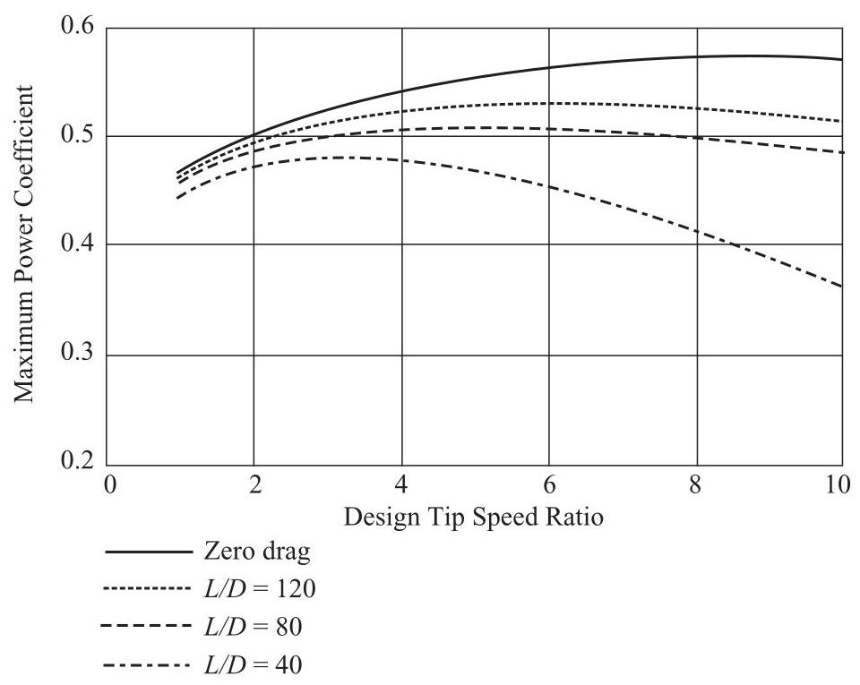

Figure 3.40 The variation of maximum ${C}_{P}$ with design $\lambda$ for various lift/drag ratios and including tip-losses for a three-bladed rotor

For a well designed blade the tip chord length will be zero and so would not exert any axial force at all on the airflow, which means that the static pressure will be atmospheric and the resultant approach velocity will be equal in magnitude to the undisturbed wind speed. But, at the tip, there will be a relatively large radial flow velocity component causing a significant reduction in the axial flow component that is not associated with a corresponding axial force caused by a rotor blade. If, for example, the axial velocity component is $\frac{2}{3}$ of the undisturbed wind speed then the angle of inclination of the wind velocity at the tip will be

$$
{\cos }^{-1}\left( \frac{2}{3}\right)  = {48.19}\text{ degrees }
$$

that is, $a = \frac{1}{3}$ but there is no associated axial force.

If $a$ is redefined as a reduction in the stream-wise flow velocity, as shown in Figure 3.41, then at the blade tip $a$ would be zero but would steadily rise towards the central section of the blade, reach a maximum and then fall to zero once more at the blade root.

Applying the same arguments as for the simple momentum theory of Section 3.2.1, Equation 3.7 can be modified thus,

$$
\frac{1}{2}\rho \left( {{U}_{\infty }^{2} - {U}_{W}^{2}}\right) {A}_{D} = \left( {{U}_{\infty } - {U}_{W}}\right) \rho {A}_{D}{U}_{\infty }\left( {1 - a}\right) \cos \psi \tag{3.7a}
$$

and the axial velocity in the wake becomes

$$
{U}_{W} = {U}_{\infty }\left( {1 - {2a}\cos \psi }\right) \tag{3.8a}
$$

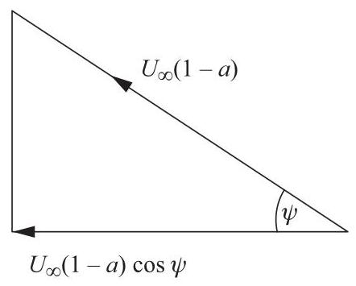

Figure 3.41 The flow geometry at the rotor disc with flow expansion

where $\psi$ is the angle of the resultant stream-wise flow direction to the axial direction at the rotor disc.

The retarding force on the air flowing through an elemental area of the disc $\delta {A}_{D}$ , from Equation 3.9, is

$$
{\delta T} = \left( {{p}_{D}^{ + } - {p}_{D}^{ - }}\right) \delta {A}_{D} = {2\rho \delta }{A}_{D}{U}_{\infty }^{2}a\left( {1 - a}\right) {\cos }^{2}\psi \tag{3.9a}
$$

and the power extracted from that air is

$$
\delta \text{ Power } = {\delta T}{U}_{D} = {2\rho }{A}_{D}{U}_{\infty }^{3}a{\left( 1 - a\right) }^{2}{\cos }^{3}\psi \tag{3.10a}
$$

Both $a$ and $\psi$ will vary radially and will change according to how the circulation on the disc varies radially. Disc circulation, or the bound vorticity on the disc, must also rise and fall from blade root to blade tip, as shown in Figure 3.42.

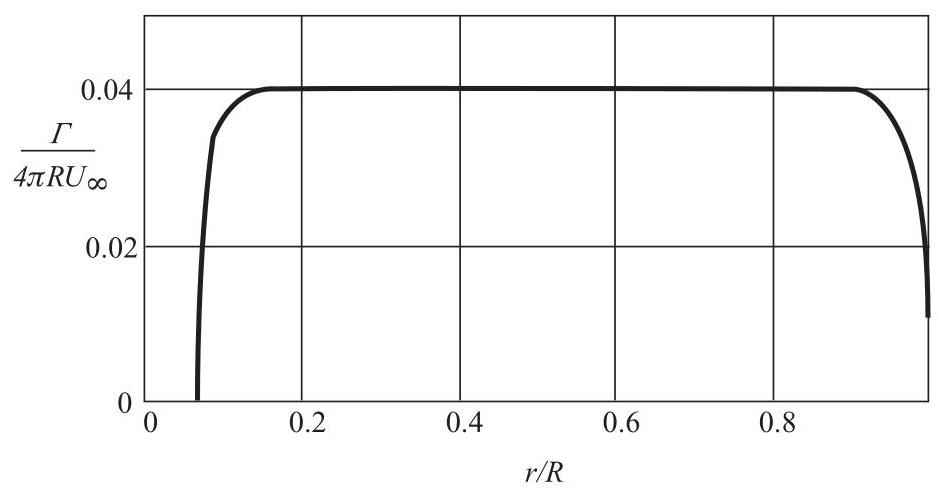

Figure 3.42 The variation of circulation along the length of a blade

Using just the momentum theory it is not possible to determine the manner of the variation of $a$ and $\psi$ but it is clear that the integration with respect to radius $r$ of Equation 3.10a would result in a value for the optimised power coefficient that would be less than the Lanchester-Betz limit.

The process of flow expansion used here takes place entirely in the region of flow that is upstream of the rotor disc and shows that there is a consequent loss of efficiency in the tip and root regions of a blade. The tip/root-loss mechanism described by Prandtl, on the other hand, takes place entirely in the flow region downstream of the rotor disc so the two loss processes are distinct.

### 3.9 Stall delay

A phenomenon first noticed on propellers by Himmelskamp (1945) is that of lift coefficients being attained at the inboard section of a rotating blade which are significantly in excess of the maximum value possible in two-dimensional static tests. In other words the angle of attack at which stall occurs is greater for a rotating blade than for the same blade tested statically. The power output of a rotor is measurably increased by the stall delay phenomenon and, if included, improves the comparison of theoretical prediction with measured output. It is noticed that the effect is greater near the blade root and decreases with radius.

The reason for the stall delay has been the cause of much discussion, but a convincing physical process has not yet been established. What is agreed is that, for whatever reason, the adverse pressure gradient experienced by the flow passing over the downwind surface of the blade is reduced by the blade's rotation. The adverse pressure gradient slows down the flow as it approaches the trailing edge of the blade after the velocity peak reached close to the leading edge. In the boundary layer viscosity also slows down the flow and the combination of the two effects, if sufficiently large, can bring the boundary layer flow to a standstill (relative to the blade surface) or even cause a reversal of flow direction. When flow reversal takes place the flow separates from the blade surface and stall occurs, giving rise to loss of lift and a dramatic increase in pressure drag.

Aerodynamic analyses (Wood, 1991; Snel et al., 1993) of rotating blades using computational fluid dynamic techniques, which include the effects of viscosity, do show a decrease in the adverse pressure gradient but it is not obvious from these numerical calculations as to what exactly is occurring physically.

It is also agreed that the parameter that influences stall delay predominantly is the local blade solidity $c\left( r\right) /r$ .

The evidence which does exist shows that for attached flow conditions, below what would otherwise be the static (non-rotating) stall angle of attack, there is little difference between two-dimensional flow conditions and rotating conditions. When stall does occur, however, the air in the separated region, which is moving very slowly with respect to the blade surface, is rotating with the blade and so is subject to centrifugal force causing it to flow radially outwards. Prior to stalling taking place, centrifugal forces on the fluid in the boundary layer, again causing radial flow, may reduce the displacement thickness and so increase the resistance to separation.

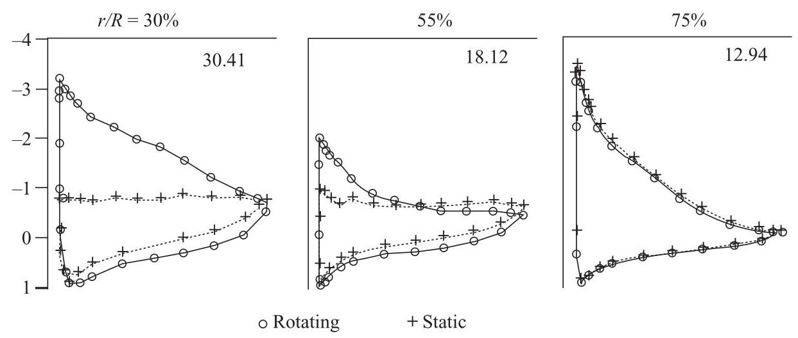

Figure 3.43 Pressure measurements on the surface of a wind turbine blade while rotating and while static by Ronsten (1991)

Blade surface pressures have been measured by Ronsten (1991) on a blade while static and while rotating. Figure 4.43 shows the comparison of surface pressure coefficients for similar angles of attack in the static and rotating conditions (tip speed ratio of 4.32) for three span-wise locations. At the 30% span location the estimated angle of attack at 30.410 is well above the static stall level which is demonstrated by the static pressure coefficient distribution. The rotating pressure coefficient distribution at ${30}\%$ span shows a high leading edge suction pressure peak with a uniform pressure recovery slope over the rear section of the upper surface of the chord. The gradual slope of the pressure recovery indicates a reduced adverse pressure gradient with the effect on the boundary layer that it is less likely to separate. The level of the leading edge suction peak, however, is very much less than it would be if, in the non-rotating situation, it were possible for flow still to be attached at ${30.41}^{ \circ  }$ .

The situation at the 55% span-wise location is similar to that at 30%; the static pressures indicate that the section has stalled but the rotating pressures show leading edge suction peak which is small but significant. At the 75% span location there is almost no difference between static and rotating blade pressure coefficient distributions at an angle of attack of ${12.94}^{ \circ  }$ , which is below the static stall level: the leading edge suction pressure peak is little higher than that at ${30}\%$ span, much higher than that at ${55}\%$ , but the pressure recovery slope is much steeper. The flow appears to be attached at the ${30}\%$ and ${55}\%$ span locations on the rotating blade, but the suction pressures are too low for that actually to be the case, so stall appears to be greatly delayed and the low adverse pressure gradient shown by the gentle slope of the pressure recovery appears to indicate the reason for the delay. At ${30}\%$ span the ratio $c/r = {0.374}, c/r = {0.161}$ at ${55}\%$ span and at the ${75}\%$ location $c/r = {0.093}$ . The increased lift also occurs in the post stall region and is attributed to the radial flow in the separated flow regions.

Snel et al. (1993) have proposed a simple, empirical modification to the usually available two dimensional, static aerofoil lift coefficient data which fits the measured lift coefficients by Ronsten (1991) and computed results using a three-dimensional computational fluid dynamics code.

Table 3.1 Summary of Ronsten's measurements of lift coefficient and lift coefficients corrected to rotating conditions using Equation 3.90

<table><tr><td>$r/{R}^{ * }{100}$</td><td>30%</td><td>55%</td><td>75%</td></tr><tr><td>c/r</td><td>0.374</td><td>0.161</td><td>0.093</td></tr><tr><td>Angle of attack $\Delta$</td><td>30.41°</td><td>18.12°</td><td>${12.94}^{ \circ  }$</td></tr><tr><td>${C}_{l}$ static (measured)</td><td>0.8</td><td>0.74</td><td>1.3</td></tr><tr><td>${C}_{l}$ rotating (measured)</td><td>1.83</td><td>0.93</td><td>1.3</td></tr><tr><td>${C}_{l}$ rotating (Snel)</td><td>1.87</td><td>0.84</td><td>1.3</td></tr></table>

If the linear part of the static,2-D, ${C}_{l} - \alpha$ curve is extended beyond the stall then let $\Delta {C}_{l}$ be the difference between the two curves. Then the correction to the 2-D curve to account for the rotational,3-D, effects is $3{\left( c/r\right) }^{2}\Delta {C}_{l}$ .

$$
{C}_{l.3D} = {C}_{l.3D} + 3{\left( \frac{c}{r}\right) }^{2}\Delta {C}_{l} \tag{3.90}
$$

Table 3.1 compares the measured static $\left( {C}_{l,{2D}}\right) \left( {C}_{{l}_{2D}}\right)$ and rotating $\left( {C}_{l,{3D}}\right)$ lift coefficients with the calculated values for the rotating values using Snel's correction of Equation 3.90. The correction is quite good and is very simple to apply. An example of the correction is given by Snel in (1993) and is shown in Figure 3.44.

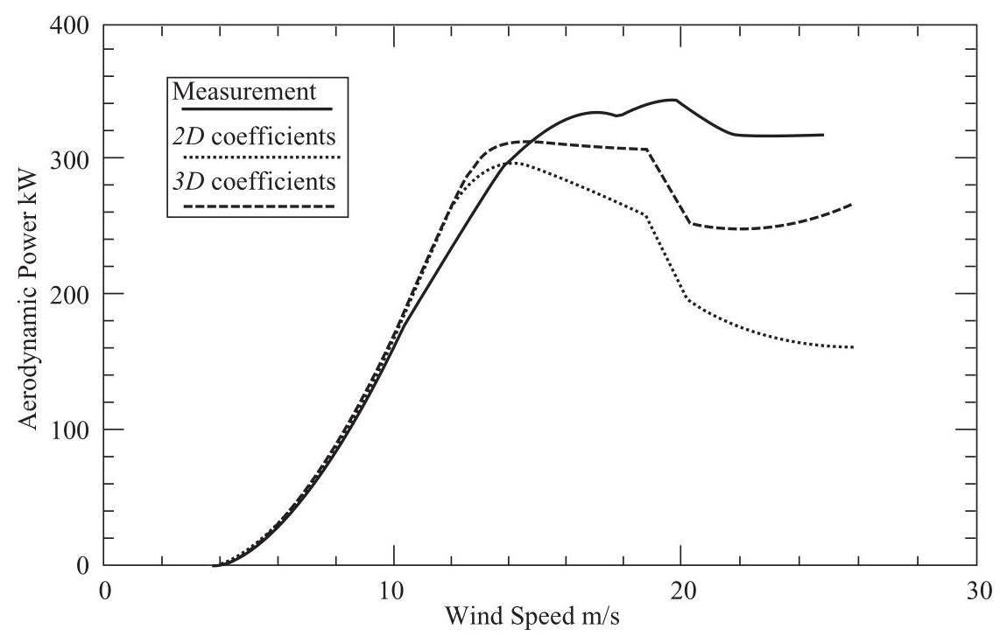

Figure 3.44 A comparison of measured and Snel's predicted power curves for a NORDTANK 300 kW turbine

Table 3.2 Blade design of a ${17}\mathrm{\;m}$ -diameter rotor

<table><tr><td>Radius $r\mathrm{\;{mm}}$</td><td>$\mu  = \frac{r}{R}$</td><td>Chord $c\mathrm{\;{mm}}$</td><td>Pitch $\beta$ deg</td><td>Thickness/Chord ratio of blade %</td></tr><tr><td>1700</td><td>0.20</td><td>1085</td><td>15.0</td><td>24.6</td></tr><tr><td>2125</td><td>0.25</td><td>1045</td><td>12.1</td><td>22.5</td></tr><tr><td>2150</td><td>0.30</td><td>1005</td><td>9.5</td><td>20.7</td></tr><tr><td>2975</td><td>0.35</td><td>965</td><td>7.6</td><td>19.5</td></tr><tr><td>3400</td><td>0.40</td><td>925</td><td>6.1</td><td>18.7</td></tr><tr><td>3825</td><td>0.45</td><td>885</td><td>4.9</td><td>18.1</td></tr><tr><td>4250</td><td>0.50</td><td>845</td><td>3.9</td><td>17.6</td></tr><tr><td>4675</td><td>0.55</td><td>805</td><td>3.1</td><td>17.1</td></tr><tr><td>5100</td><td>0.60</td><td>765</td><td>2.4</td><td>16.6</td></tr><tr><td>5525</td><td>0.65</td><td>725</td><td>1.9</td><td>16.1</td></tr><tr><td>5950</td><td>0.70</td><td>685</td><td>1.5</td><td>15.6</td></tr><tr><td>6375</td><td>0.75</td><td>645</td><td>1.2</td><td>15.1</td></tr><tr><td>6800</td><td>0.80</td><td>605</td><td>0.9</td><td>14.6</td></tr><tr><td>6375</td><td>0.85</td><td>565</td><td>0.6</td><td>14.1</td></tr><tr><td>7225</td><td>0.90</td><td>525</td><td>0.4</td><td>13.6</td></tr><tr><td>8075</td><td>0.95</td><td>485</td><td>0.2</td><td>13.1</td></tr><tr><td>8500</td><td>1.00</td><td>445</td><td>0.0</td><td>12.6</td></tr></table>

### 3.10 Calculated results for an actual turbine

The blade design of a turbine operating at constant uniform rotational speed and fixed pitch is given in Table 3.2 below and the aerofoil characteristics are shown in Figure 3.45.

Using the above data the results shown in Figure 3.46 were obtained.

The blade is designed for optimum performance at a tip speed ratio of about six and, ideally, the angle of attack uniform along the span at the level for which the lift/drag ratio is a maximum, about ${7}^{ \circ  }$ for the aerofoil concerned. At the lowest tip speed ratio shown in Figure 3.44 the entire blade is stalled and for a rotational speed of 60 rpm the corresponding wind speed will be ${26}\mathrm{\;m}/\mathrm{s}$ , which is the cut-out speed. For the highest tip speed ratio shown the corresponding wind speed will be ${4.5}\mathrm{\;m}/\mathrm{s}$ , the cut-in speed. Maximum power is developed at a tip speed ratio of four at a wind speed of ${13}\mathrm{\;m}/\mathrm{s}$ and, clearly, much of the blade is stalled.

The axial flow induction factor is not uniform along the span at any tip speed ratio, indicating that the blade design is an engineering compromise, but at the tip speed ratio of six there is value a little higher than $\frac{1}{3}$ . The flow factors shown in Figure 3.47 are those local to the blade and so average value of axial flow factor will be close to $\frac{1}{3}$ at a tip speed ratio of six.

Generally, the axial flow factor increases with tip speed ratio while the tangential flow factor decreases with tip speed ratio. The angular velocity of the wake increases sharply with decreasing radius because it is determined by the root vortex.

The importance of the outboard section of the blade is clearly demonstrated in Figure 3.48. The dramatic effect of stall is shown in the difference in torque distribution between the tip speed ratio of four and the tip speed ratio of two. Note, also, the flat distribution of torque at the high tip speed ratio of 12; this is caused by the effect of drag which reduces torque as the square of the local speed ratio and with the low angle of attack at $\lambda  = {12}$ drag causes a significant loss of power.

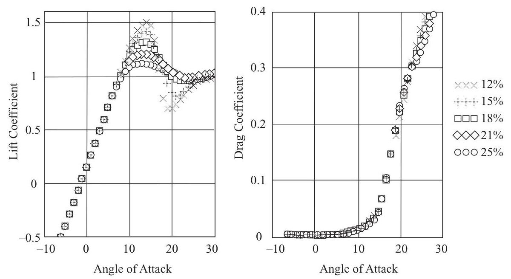

Figure 3.45 The aerodynamic characteristics of the NACA632XX aerofoil series The complete ${C}_{P} - \lambda$ curve for the design is given in Figure 3.15.

Although the blade axial force coefficient increases with tip speed ratio it must be remembered that the actual thrust force increases with wind speed as is demonstrated in Figure 3.49.

Figure 3.46 Angle of attack distribution for a range of tip speed ratios

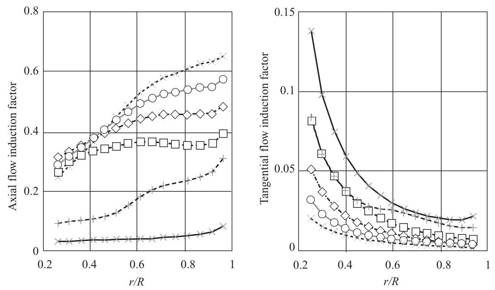

Figure 3.47 Distribution of the flow induction factors for a range of tip speed ratios

### 3.11 The performance curves

#### 3.11.1 Introduction

The performance of a wind turbine can be characterised by the manner in which the three main indicators, power, torque and thrust, vary with wind speed. The power determines the amount of energy captured by the rotor, the torque developed determines the size of the gear box and must be matched by whatever generator is being driven by the rotor. The rotor thrust has great influence on the structural design of the tower. It is usually convenient to express the performance by means of non-dimensional, characteristic performance curves from which the actual performance can be determined regardless of how the turbine is operated, for example, at constant rotational speed or some regime of variable rotor speed. Assuming that the aerodynamic performance of the rotor blades does not deteriorate the non-dimensional aerodynamic performance of the rotor will depend upon the tip speed ratio and, if appropriate, the pitch setting of the blades. It is usual, therefore, to display the power, torque and thrust coefficients as functions of tip speed ratio.

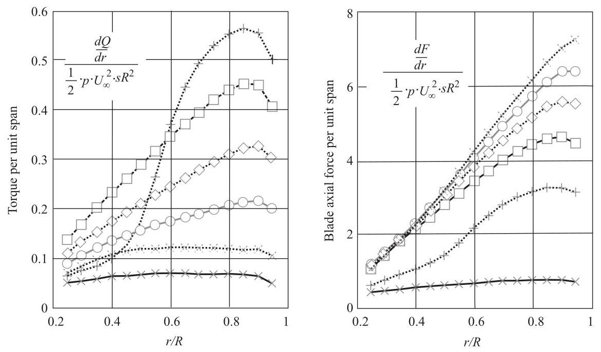

Figure 3.48 Distribution of blade loads for a range of tip speed ratios

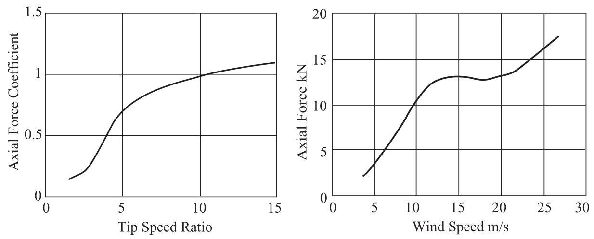

Figure 3.49 Axial force coefficient and the variation of the actual force with wind speed

#### 3.11.2 The ${C}_{P} - \lambda$ performance curve

The theory described in this chapter gives the wind turbine designer a means of examining how the power developed by a turbine is governed by the various design parameters. The usual method of presenting power performance is the non-dimensional ${C}_{P} - \lambda$ curve and the curve for a typical, modern, three-blade turbine is shown in Figure 3.50.

The first point to notice is that the maximum value of ${C}_{P}$ is only 0.47, achieved at a tip speed ratio of seven, which is much less than the Betz limit for that tip speed ratio. The discrepancy is caused, in this case, by drag and tip-losses but the stall also reduces the ${C}_{P}$ at low values of the tip speed ratio.

Even with no losses included in the analysis the Lanchester-Betz limit is not reached because the blade design is not perfect (see Figure 3.51).

#### 3.11.3 The effect of solidity on performance

At this stage, the other principal parameter to consider is the solidity, defined as total blade area divided by the swept area. For the three-blade machine, above, the solidity is 0.0345 but this can be altered readily by varying the number of blades as shown in Figure 3.52.

The solidity could also have been changed by changing the blade chord.

Figure 3.50 ${C}_{P} - \lambda$ performance curve for a modern three-blade turbine

The main effects to observe of changing solidity are:

1. Low solidity produces a broad, flat curve which means that the ${C}_{P}$ will change very little over a wide tip speed ratio range, but the maximum ${C}_{P}$ is low because the drag losses are high (drag losses are roughly proportional to the cube of the tip speed ratio).

2. High solidity produces a narrow performance curve with a sharp peak making the turbine very sensitive to tip speed ratio changes and, if the solidity is too high, has a relatively low maximum ${C}_{P}$ . The reduction in ${C}_{P}$ max is caused by stall losses.

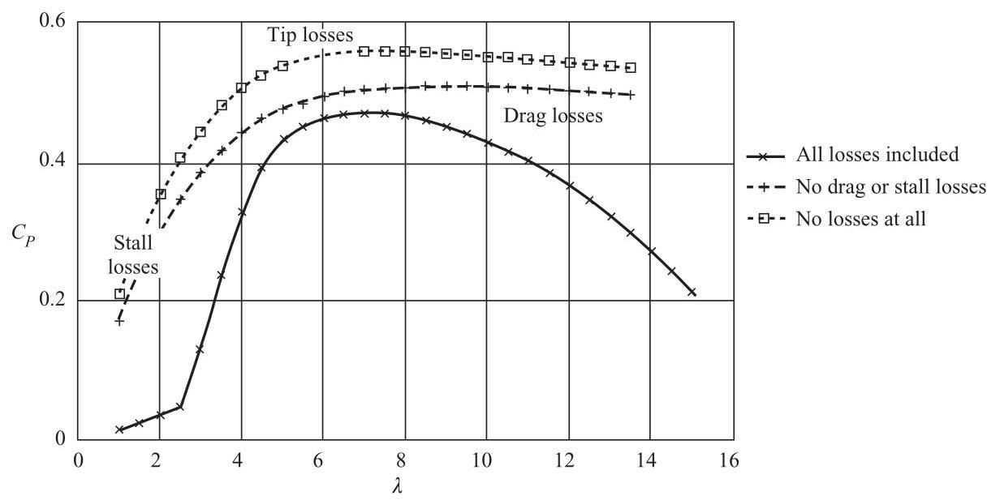

Figure 3.51 ${C}_{P} - \lambda$ performance curve for a modern three-blade turbine showing losses

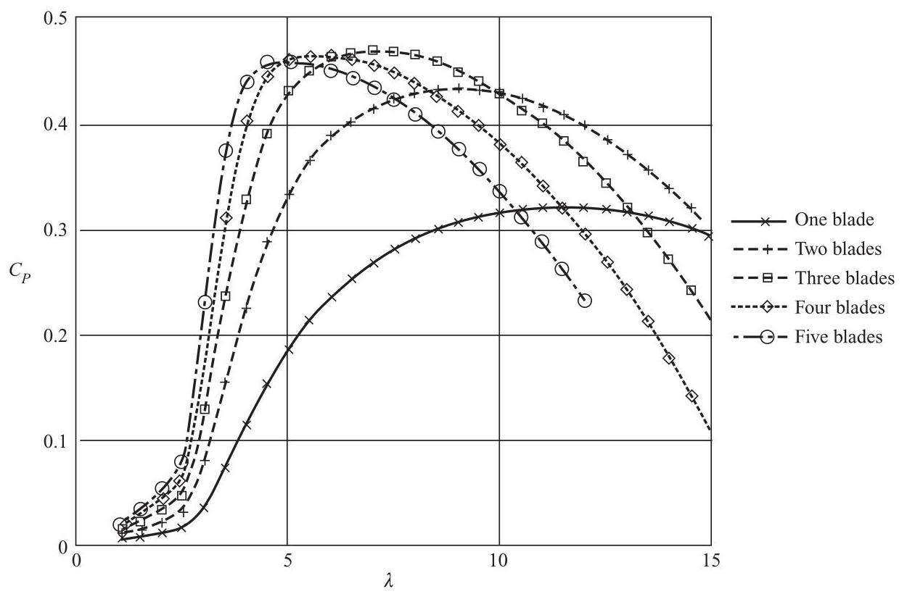

Figure 3.52 Effect of changing solidity

3. An optimum solidity appears to be achieved with three blades, but two blades might be an acceptable alternative because although the maximum ${C}_{P}$ is a little lower the spread of the peak is wider and that might result in a larger energy capture.

It might be argued that a good solution would be to have a large number of blades of small individual solidity but this greatly increases production costs and results in blades which are structurally weak and very flexible.

There are applications which require turbines of relatively high solidity, one is the directly driven water pump and the other is the very small turbine used for battery charging. In both cases it is the high starting torque (high torque at very low tip speed ratios) which is of importance and this also allows small amounts of power to be developed at very low wind speeds, ideal for trickle charging batteries.

#### 3.11.4 The ${C}_{Q} - \lambda$ curve

The torque coefficient is derived from the power coefficient simply by dividing by the tip speed ratio and so it does not give any additional information about the turbine's performance. The principal use of the ${C}_{Q} - \lambda$ curve is for torque assessment purposes when the rotor is connected to a gear box and generator.

Figure 3.53 shows how the torque developed by a turbine rises with increasing solidity. For modern high speed turbines designed for electricity generation, as low a torque as possible is desirable in order to reduce gearbox costs. On the other hand the multi-bladed, high solidity turbine, developed in the nineteenth century for water pumping, rotates slowly and has a very high starting torque coefficient necessary for overcoming the torque required to start a positive displacement pump.

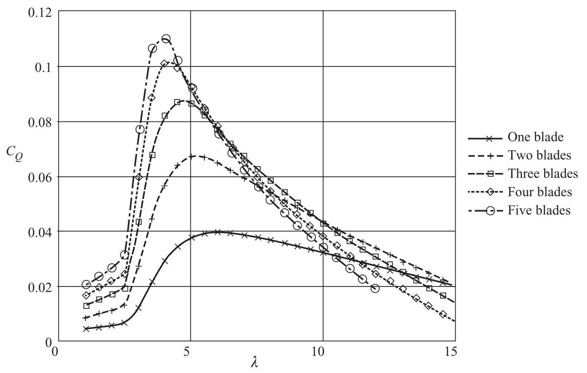

Figure 3.53 The effect of solidity on torque

The peak of the torque curve is caused by stall and occurs at a lower tip speed ratio than the peak of the power curve.

#### 3.11.5 The ${C}_{T} - \lambda$ curve

The thrust force on the rotor is directly applied to the tower on which the rotor is supported and so considerably influences the structural design of the tower.

Generally, the thrust on the rotor increases with increasing solidity, as shown in Figure 3.54.

### 3.12 Constant rotational speed operation

#### 3.12.1 Introduction

The majority of wind turbines currently installed generate electricity. Whether or not these turbines are grid connected they need to produce an electricity supply which is of constant frequency, or else many common appliances will not function properly. Consequently, a mode favoured in the early years of wind turbine development is operation at constant rotational speed. Connected to the grid a constant speed turbine is automatically controlled, whereas a stand-alone machine needs to have speed control and a means of dumping excess power.

#### 3.12.2 The ${K}_{P} - 1/\lambda$ curve

An alternative performance curve can be produced for a turbine controlled at constant speed. The ${C}_{P} - \lambda$ curve shows, non-dimensionally, how the power would vary with rotational speed

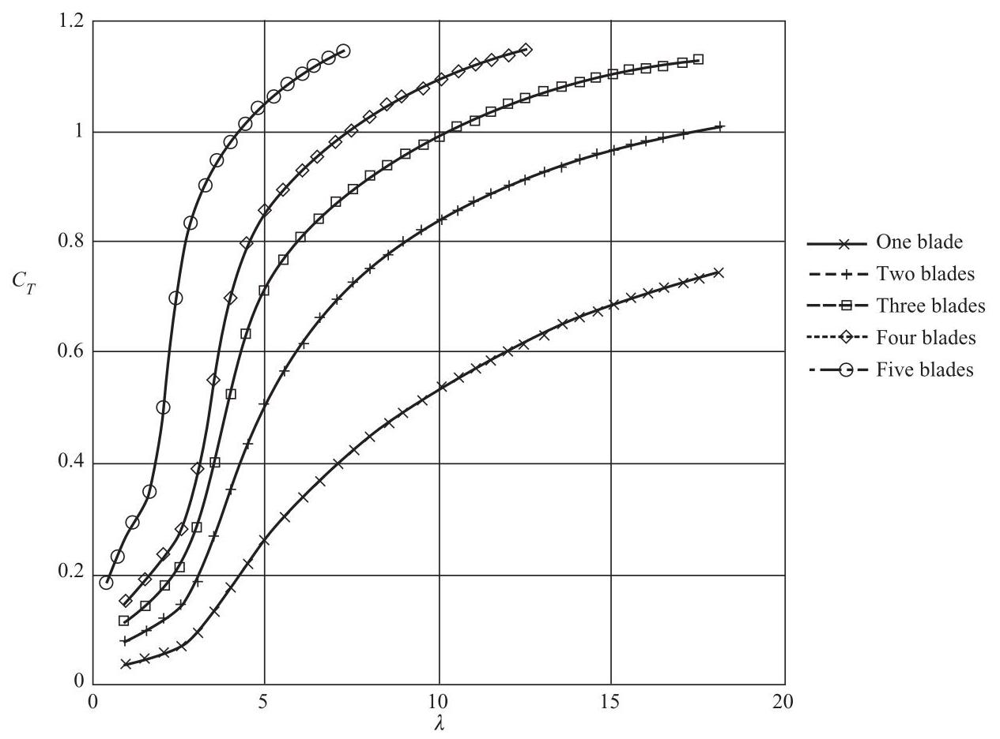

Figure 3.54 The effect of solidity on thrust

if the wind speed was held constant. The ${K}_{P} - 1/\lambda$ curve describes, again non-dimensionally, how the power would change with wind speed when constant rotational speed is enforced. ${K}_{P}$ is defined as

$$
{K}_{p} = \frac{\text{ Power }}{\left( \frac{1}{2}\right)  \cdot  \rho  \cdot  {\left( \Omega  \cdot  R\right) }^{3}{A}_{d}} = \frac{{C}_{p}}{{\lambda }^{3}} \tag{3.91}
$$

The ${C}_{P} - \lambda$ and ${K}_{P} - 1/\lambda$ curves for a typical fixed pitch wind turbine are shown in Figure 3.55. The ${K}_{P} - 1/\lambda$ curve, as stated above, has the same form as the power-wind speed characteristic of the turbine. The efficiency of the turbine (given by the ${C}_{P} - \lambda$ curve) varies greatly with wind speed, a disadvantage of constant speed operation, but it should be designed such that the maximum efficiencies are achieved at wind speeds where there is the most energy available.

#### 3.12.3 Stall regulation

An important feature of this ${K}_{P} - 1/\lambda$ curve is that the power, initially, falls off once stall has occurred and then gradually increases with wind speed. This feature provides an element of passive power output regulation, ensuring that the generator is not overloaded as the wind speed increases. Ideally, the power should rise with wind speed to the maximum value and then remain constant regardless of the increase in wind speed: this is called perfect stall regulation. However, stall regulated turbines do not exhibit the ideal, passive stall behaviour.

Figure 3.55 Non-dimensional performance curves for constant speed operation

Stall regulation provides the simplest means of controlling the maximum power generated by a turbine to suit the sizes of the installed generator and gearbox. The principal advantage of stall control is simplicity but there are significant disadvantages. The power versus wind speed curve is fixed by the aerodynamic characteristics of the blades, in particular the stalling behaviour. The post stall power output of a turbine varies very unsteadily and in a manner which, so far, defies prediction, see Figure 3.60, for example. The stalled blade also exhibits low vibration damping because the flow about the blade is unattached to the low pressure surface and blade vibration velocity has little effect on the aerodynamic forces. The low damping can give rise to large vibration displacement amplitudes which will inevitably be accompanied by large bending moments and stresses, causing fatigue damage. When parked in high, turbulent winds the fixed pitch, stationary blade may well be subject to large aerodynamic loads which cannot be alleviated by adjusting (feathering) the blade pitch angle. Consequently, the blades of a fixed pitch, stall regulated turbine must be very strong, involving an appropriate cost penalty.

#### 3.12.4 Effect of rotational speed change

The power output of a turbine running at constant speed is strongly governed by the chosen, operational rotational speed. If a low rotation speed is used the power reaches a maximum at a low wind speed and consequently it is very low. To extract energy at wind speeds higher than the stall peak the turbine must operate in a stalled condition and so is very inefficient. Conversely, a turbine operating at a high speed will extract a great deal of power at high wind speeds but at moderate wind speeds it will be operating inefficiently because of the high drag losses. Figure 3.56 demonstrates the sensitivity to rotation speed of the power output - a 33% increase in rpm from 45 to 60 results in a 150% increase in peak power, reflecting the increased wind speed at which peak power occurs at 60 rpm.

At low wind speeds, on the other hand, there is a marked fall in power with increasing rotational speed as shown in Figure 3.57. In fact, the higher power available at low wind speeds if a lower rotational speed is adopted has led to two speed turbines being built. Operating at one fixed speed which maximises energy capture at wind speeds at, or above, the average level will result in a rather high cut-in wind speed, the lowest wind speed at which generation is possible. Employing a lower rotational speed at low wind speeds reduces the cut-in wind speed and increases energy capture. The increased energy capture is, of course, offset by the cost of the extra machinery.

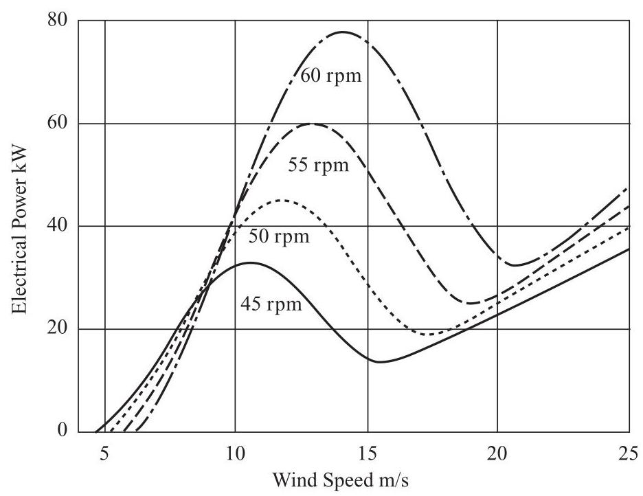

Figure 3.56 Effect on extracted power of rotational speed

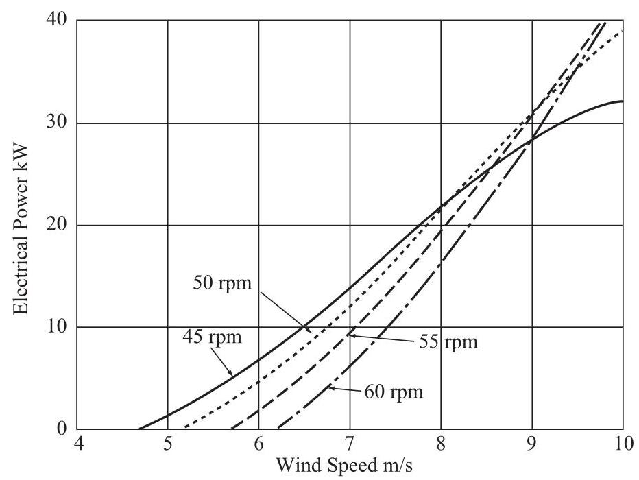

Figure 3.57 Effect on extracted power of rotational speed at low wind speeds

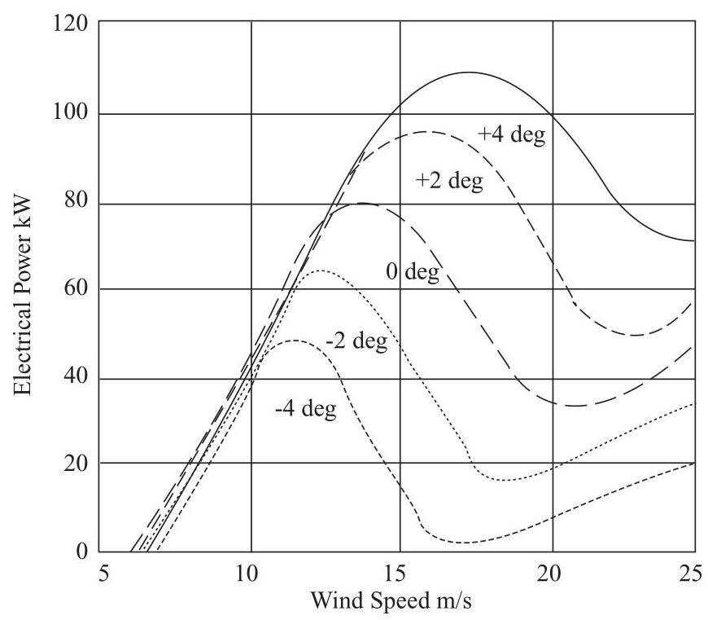

Figure 3.58 Effect on extracted power of blade pitch set angle

#### 3.12.5 Effect of blade pitch angle change

Another parameter which affects the power output is the pitch setting angle of the blades ${\beta }_{s}$ . Blade designs almost always involve twist but the blade can be set at the root with an overall pitch angle. The effects of a few degrees of pitch are shown in Figure 3.58.

Small changes in pitch setting angle can have a dramatic effect on the power output. Positive pitch angle settings increase the design pitch angle and so decrease the angle of incidence. Conversely, negative pitch angle settings increase the angle of incidence and may cause stalling to occur as shown in Figure 3.58. A turbine rotor designed to operate optimally at a given set of wind conditions can be suited to other conditions by appropriate adjustments of blade pitch angle and rotational speed.

### 3.13 Pitch regulation

#### 3.13.1 Introduction

Many of the shortcomings of fixed pitch/passive stall regulation can be overcome by providing active pitch angle control. Figure 3.58 shows the sensitivity of power output to pitch angle changes.

The most important application of pitch control is for power regulation, but pitch control has other advantages. By adopting a large positive pitch angle a large starting torque can be generated as a rotor begins to turn. A ${90}^{ \circ  }$ pitch angle is usually used when the rotor is stationary because this will minimise forces on the blades such that they will not sustain damage in high winds. At ${90}^{ \circ  }$ of positive pitch the blade is said to be 'feathered'. The blades need not be as strong, therefore, as for a stall-regulated turbine, which reduces blade costs. Only a small change of pitch angle is needed to provide an assisted start-up.

The principle disadvantages of pitch control are lower reliability and cost but the latter is offset by lower blade costs.

Power regulation can be achieved either by pitching to promote stalling or pitching to feather, which reduces the lift force on the blades by reducing the angle of attack.

#### 3.13.2 Pitching to stall

Figure 3.58 shows the power curves for a turbine rated at ${60}\mathrm{{kW}}$ , which is achieved at ${12}\mathrm{\;m}/\mathrm{s}$ . At wind speeds below the rated level the blade pitch angle is kept at ${0}^{ \circ  }$ . As rated power is reached only a small negative pitch angle, initially of about ${2}^{ \circ  }$ , is necessary to promote stalling and so to limit the power to the rated level. As the wind speed increases small adjustments in both the positive and negative directions are all that are needed to maintain constant power.

The small size of the pitch angle adjustments make pitching to stall very attractive to designers, but the blades have the same damping and fatigue problems as fixed pitch turbines.

#### 3.13.3 Pitching to feather

By increasing the pitch angle as rated power is reached the angle of attack can be reduced. A reduced angle of attack will reduce the lift force and the torque. The flow around the blade remains attached. Figure 3.59 is for the same turbine as Figure 3.58 but only the ${0}^{ \circ  }$ power curve is shown below the rated level. Above the rated level fragments of power curves for higher pitch angles are shown as they cross the rated power line: the crossing points give the necessary pitch angles to maintain rated power at the corresponding wind speeds. As can be seen in Figure 3.57, the required pitch angles increase progressively with wind speed and are generally much larger than is needed for the pitching to stall method. In gusty conditions large pitch excursions are needed to maintain constant power and the inertia of the blades will limit the speed of the control system's response.

Figure 3.59 Pitching to feather power regulation requires large changes of pitch angle

Because the blades remain un-stalled if large gusts occur at wind speeds above the rated level large changes of angle of attack will take place with associated large changes in lift. Gust loads on the blades can, therefore, be more severe than for stalled blades.

The advantages of the pitching to feather method are that the flow around the blade remains attached, and so well understood, and provides good, positive damping. Feathered blade parking and assisted starting are also available.

Pitching to feather has been the preferred pitch control option mainly because the blade loads can be predicted with more confidence than for stalled blades.

### 3.14 Comparison of measured with theoretical performance

The turbine considered in this section is run at constant rotational speed. More detail about this method of operation will be discussed in the next section but the main feature is that there is, theoretically, a unique power output for a given wind speed.

When the turbine was under test the chosen rotational speed was 44 rpm. Energy output and wind speed were measured over one minute time intervals and the average power and wind speed determined. The test was continued until a sufficient range of wind speeds had been covered. The 16 minute average results were then sorted in 'bins' ${0.5}\mathrm{\;m}/\mathrm{s}$ of wind speed wide and a fairly smooth power versus wind speed curve was obtained, as shown in Figure 3.60.

The turbine has a diameter of ${17}\mathrm{\;m}$ and would be expected to produce rather more power than shown above if operated at a higher rotational speed.

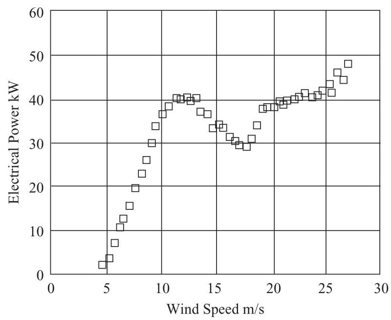

Figure 3.60 Power versus wind speed curve from the binned measurements of a three-blade stall regulated turbine

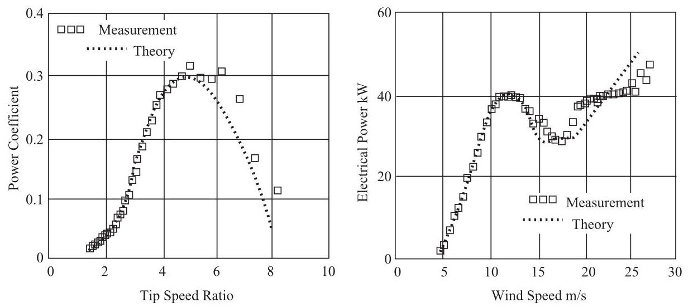

Figure 3.61 Comparison of measured and theoretical performance curves

From the data in Figure 3.58 the ${C}_{P} - \lambda$ curve can be derived. The tip speed of the blades is ${44} \times  \pi /{30}\mathrm{{rad}}/\mathrm{s} \times  {8.5}\mathrm{\;m} = {39.2}\mathrm{\;m}/\mathrm{s}$ , the swept area is $\pi  \times  {8.5}^{2} = {227}{\mathrm{\;m}}^{2}$ and the air density was measured (from air pressure and temperature readings) at ${1.19}\mathrm{\;{kg}}/{\mathrm{m}}^{3}$ . Therefore,

$$
\lambda  = \frac{39.2}{\text{ wind speed }}\text{ and }{C}_{P} = \frac{\text{ Power } \cdot  {\lambda }^{3}}{\frac{1}{2} \cdot  {1.19} \cdot  {39.2}^{3} \cdot  {227}}
$$

The mechanical and electrical losses were estimated at ${5.62}\mathrm{\;{kW}}$ and this value was used to adjust the theoretical values of ${C}_{P}$ . The resulting comparison of measured and theoretical results is shown in Figure 3.61.

This comparison looks reasonable and shows that the theory is reliable but the quality of the theoretical predictions really relies upon the quality of the aerofoil data. The blade and aerofoil design are the same as given in Section 3.10.

One last point should be made before classifying the theory as complete: it would be as well to look at the raw, one minute average data, before it was reduced down by a binning process and is shown in Figure 3.62. In the post stall region there seems to be a much more complex process taking place than the simple theory predicts and this could be caused by unsteady aerodynamic effects.

### 3.15 Variable speed operation

If the speed of the rotor can be continuously adjusted such that the tip speed ratio remains constant at the level which gives the maximum ${C}_{P}$ , then the efficiency of the turbine will be significantly increased. The pitch angle is kept constant and the generator torque is adjusted to increase speed. Pitch control regulation is required in conditions above the rated wind speed when the rotational speed is kept constant.

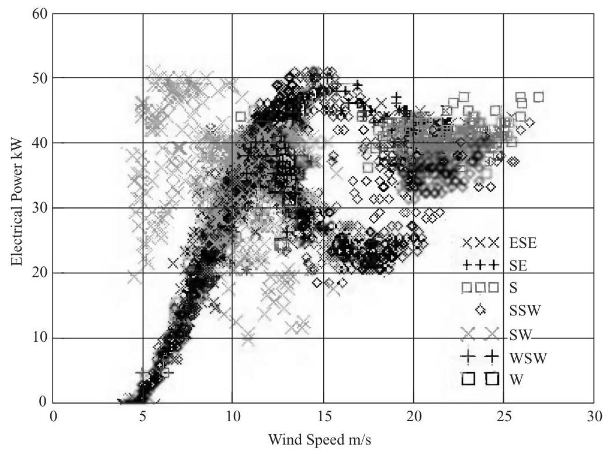

Figure 3.62 Measured raw results of a three-blade wind turbine

### 3.16 Estimation of energy capture

The quantity of energy that can be captured by a wind turbine depends upon the power versus wind speed characteristic of the turbine and the wind speed distribution at the turbine site.

The wind speed distribution at a site can be represented by the Weibull function: the probability that the wind speed will exceed a value $U$ is

$$
F\left( U\right)  = {e}^{-{\left( \frac{U}{c}\right) }^{k}} \tag{3.92}
$$

where $c$ , called the scale factor, is a characteristic speed related to the average wind speed at the site by

$$
c = \frac{\bar{U}}{\Gamma \left( {1 + \frac{1}{k}}\right) } \tag{3.93}
$$

( $\Gamma$ being the gamma function and $k$ a shape parameter). Let $U/\bar{U} = u$ a normalised wind speed.

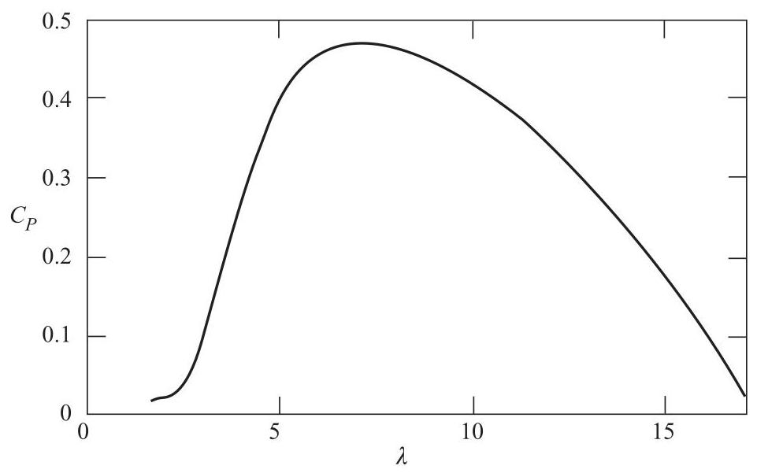

Figure 3.63 ${C}_{P} - \lambda$ curve for a design tip speed ratio of seven

The wind speed distribution density is then the modulus of the derivative of Equation 3.92 with respect to $u$ .

$$
f\left( u\right)  = k{\left( \frac{\bar{U}}{c}\right) }^{k}{u}^{k - 1}{e}^{-{\left( \frac{\bar{U}}{c}u\right) }^{k}} \tag{3.94}
$$

That is, the probability that the wind speed lies between $u$ and $u + {\delta u}$ is $f\left( u\right) {\delta u}$ .

The performance curve shown in Figure 3.63 is for a turbine designed with an optimum tip speed ratio of seven.

As an example, assume that the turbine is stall regulated and operates at a fixed rotational speed at a site where the average wind speed is $6\mathrm{\;m}/\mathrm{s}$ and the Weibull shape factor $k = {1.8}$ then, from Equation 3.93, the scale factor $c = {6.75}\mathrm{\;m}/\mathrm{s}$ .

Figure 3.64 shows the ${K}_{P} - 1/\lambda$ curve for the turbine: from inspection of that curve the tip speed ratio at which stall (maximum power) occurs is 3.7 and the corresponding ${C}_{P}$ is 0.22 .

The required maximum electrical power of the machine is ${500}\mathrm{\;{kW}}$ , the transmission loss is ${10}\mathrm{\;{kW}}$ , the mean generator efficiency is ${90}\%$ and the availability of the turbine (amount of time for which it is available to operate when maintenance and repair time is taken into account) is 98%.

The maximum rotor shaft power (aerodynamic power) is then

$$
{P}_{s} = \left( {{500} + {10}}\right) /{0.9} = {567}\mathrm{\;{kW}}
$$

The wind speed at which maximum power is developed is ${13}\mathrm{\;m}/\mathrm{s}$ ; therefore, the rotor swept area must be, assuming an air density of ${1.225}\mathrm{\;{kg}}/{\mathrm{m}}^{3}$ ,

$$
{567000}/\left( {1/2 \times  {1.225} \times  {13}^{3} \times  {0.22}}\right)  = {1.92} \times  {10}^{3}{\mathrm{\;m}}^{2}
$$

The rotor radius is, therefore, ${24.6}\mathrm{\;m}$ .

Figure 3.64 ${K}_{P} - 1/\lambda$ curve for the example fixed speed, stall regulated turbine

The tip speed of the rotor will be ${3.7} \times  {13}\mathrm{\;m}/\mathrm{s} = {48.1}\mathrm{\;m}/\mathrm{s}$ and so the rotational speed will be ${48.1}/{24.6}\mathrm{{rad}}/\mathrm{s} = {1.96}\mathrm{{rad}}/\mathrm{s}$ , which is ${1.96} \times  {60}/{2\pi }\mathrm{{rev}}/\mathrm{{min}} = {18.7}\mathrm{{rev}}/\mathrm{{min}}$ .

The power versus wind speed curve for the turbine can then be obtained from Figure 3.64 and is shown in Figure 3.65.

$$
\text{ Power (electrical) } = \left( {{K}_{\mathrm{P}} \times  \frac{1}{2} \times  {1.225}\mathrm{\;{kg}}/{\mathrm{m}}^{3} \times  {\left( {48.1}\mathrm{\;m}/\mathrm{s}\right) }^{3}}\right.
$$

$$
\left. {\times {1.92} \times  {10}^{3}{\mathrm{\;m}}^{2} - {10} \times  {1000}\mathrm{\;W}}\right)  \times  {0.9}
$$

$$
\text{ Wind speed } = {48.1}\mathrm{\;m}/\mathrm{s}/\lambda
$$

The resulting power curve is shown in Figure 3.65.

To determine the energy capture of the turbine over a time period $T$ multiply the power by $f\left( u\right)  \times  T$ (Equation 3.95); because $w\left( u\right)$ is the proportion of time $T$ spent at a normalised wind speed $u$ .

$$
f\left( u\right)  \cdot  {\delta u} = \frac{\delta T}{T} \tag{3.95}
$$

and

$$
{\int }_{0}^{\infty }f\left( u\right)  \cdot  {du} = 1 \tag{3.96}
$$

Plot against $u$ (Figure 3.66) and integrate over the operational wind speed range of the turbine to give the energy capture.

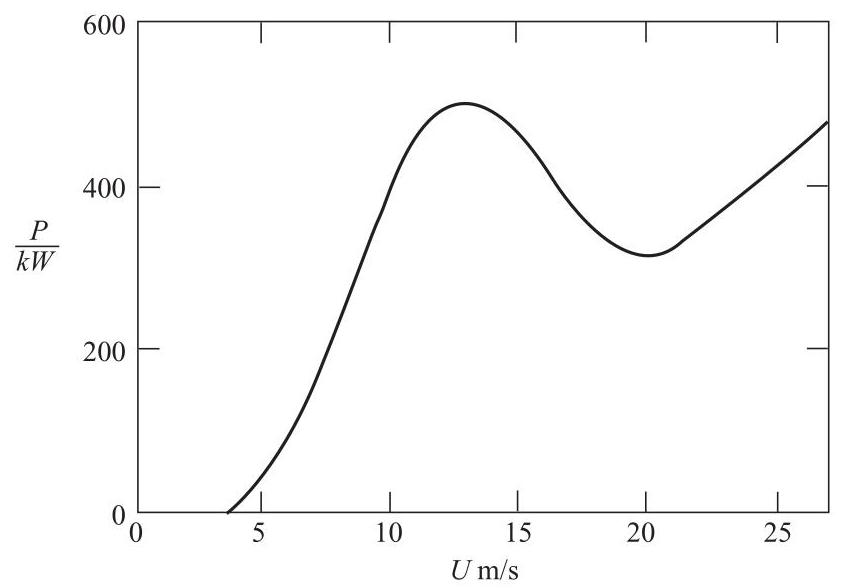

Figure 3.65 Power versus wind speed for the example fixed speed, stall regulated turbine

The operational speed range will be between the cut-in speed and the cut-out speed. The cut-in speed is determined by the transmission losses: at what wind speed does the turbine begin to generate power? The cut-in speed is usually chosen to be somewhat higher than the zero power speed, in the present case, say $4\mathrm{\;m}/\mathrm{s}$ .

The cut-out speed is chosen to protect the turbine from high loads, usually about ${25}\mathrm{\;m}/\mathrm{s}$ .

The total energy captured $\left( E\right)$ by the turbine in a time period $T$ is

$$
T{\int }_{\frac{{U}_{ci}}{\bar{U}}}^{\frac{{U}_{co}}{\bar{U}}}P\left( u\right) f\left( u\right) {du} = E \tag{3.97}
$$

which is the area under the curve of Figure 3.66 times the time $T$ . Unfortunately, the integral does not have a closed mathematical form in general and so a numerical integration is required, such as the trapezoidal rule or, for better accuracy, Simpson's rule.

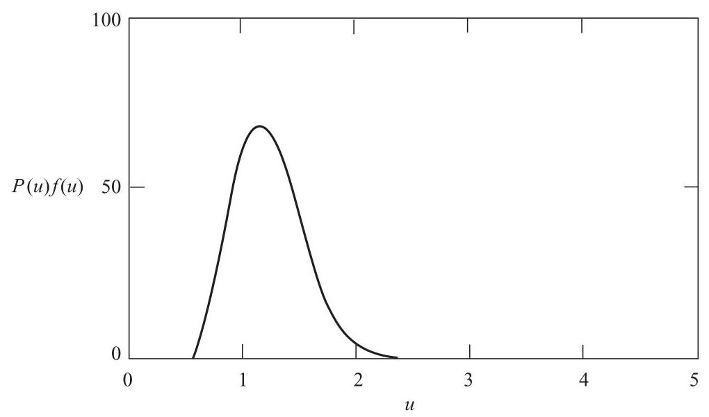

Figure 3.66 Energy capture curve

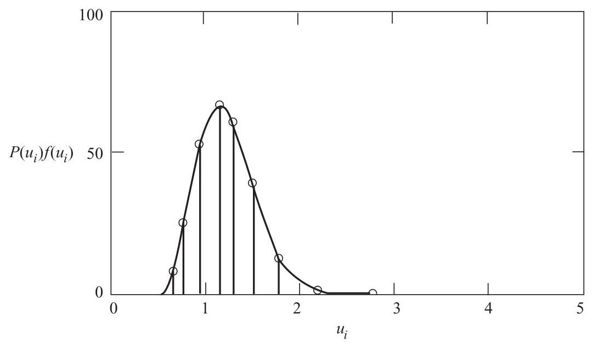

Figure 3.67 Energy capture curve for numerical integration

For time period of one year $T = {365} \times  {24}$ hours then for the ten data points shown in Figure 3.67 the energy capture will be, using the trapezoidal rule,

$$
E = {0.98} \cdot  T\mathop{\sum }\limits_{{i = 1}}^{9}\left( {{P}_{i + 1}f\left( {u}_{i + 1}\right)  + {P}_{i}f\left( {u}_{i}\right) }\right) \frac{\left( {U}_{i + 1} - {U}_{i}\right) }{2\bar{U}} \tag{3.98}
$$

where

$$
E = {4.5413} \cdot  {10}^{8} \cdot  {kWh}
$$

Even though the upper limit of integration ${u}_{co} = {4.17}$ is greater than highest value of $u$ shown in Figure 3.67 it is clear that almost no energy is captured between those speeds.

A turbine which has pitch control would be able to capture more energy but at the expense of providing the control system and the concomitant reduction in reliability. A turbine operating at variable speed (constant tip speed ratio) until maximum power is reached and then at constant speed with pitch control at higher wind speeds would capture the maximum possible amount of energy in a given time. The power curve for such a machine is shown in Figure 3.68.

The annual energy capture would be, see Figure 3.68,

$$
E = {4.8138} \cdot  {10}^{8} \cdot  {kWh}
$$

which is a 6% increase in energy capture compared with the fixed speed, stall regulated machine. Whether or not the increase in energy captured is economically worthwhile is a matter for debate. However, variable speed operation has a number of other advantages - see Section 6.9.3.

Figure 3.68 Power vs. wind speed variable speed, pitch regulated turbine

### 3.17 Wind turbine aerofoil design

#### 3.17.1 Introduction

For many years the wind turbine industry relied on aeronautical experience for the aerodynamic design of turbine blades but it became clear that aerofoil sections that were right for aircraft wings were not necessarily right for wind turbine blades.

There were reports of turbines in the 1970s having to be regularly hosed with water to clear accumulated debris on the blades in order to restore power levels that had fallen dramatically. An aerofoil that was tolerant to leading edge roughness was required.

Most early turbines of rated power greater than about ${50}\mathrm{\;{kW}}$ operated at constant rotational speed and relied upon passive stall for power control. With most aircraft aerofoil sections the stall produced a sudden sharp loss of power output that was not recovered until the wind speed increased. The stalling resulted in significant losses of energy capture. Thus, another requirement for a wind turbine aerofoil was a gentle stall.

A popular range of aerofoil designs was, and still is, the NACA 6 digit series, an example of which is discussed in Section 3.9. Although more tolerant to leading edge grime the NACA 6 digit series is no better than the NACA 4 digit series described in Appendix A3. The main reason for the popularity of the NACA aerofoils is because high quality experimental data is available from tests that were carried out in the 1930s in the pressurised wind tunnel built by NACA (National Advisory Committee for Aeronautics, superseded by NASA in 1959). The NACA technical reports are available free of charge on the NASA website.

#### 3.17.2 The NREL aerofoils

The development of special-purpose aerofoils for horizontal-axis wind turbines began in 1984 jointly between the National Renewable Energy Laboratory (NREL), formerly the Solar Energy Research Institute (SERI), and Airfoils, Incorporated, Tangler and Somers (1995). Since that time nine aerofoil families have been designed for various size rotors with a principal requirement that they have a maximum lift coefficient that is maintained in the presence of leading edge surface roughness.

Table 3.3 Summary of the NREL aerofoils and their applications

<table><tr><td>Diameter</td><td>Type</td><td>Aerofoil thickness</td><td>Primary</td><td>Tip</td><td>Root</td></tr><tr><td>$3 - {10}\mathrm{\;m}$</td><td>Variable speed Variable pitch</td><td>Thick</td><td>-</td><td>S822</td><td>S823</td></tr><tr><td>10-20 m</td><td>Variable speed</td><td>Thin</td><td>S802</td><td>S802</td><td>S804</td></tr><tr><td></td><td>Variable pitch</td><td></td><td></td><td>S803</td><td></td></tr><tr><td>${10} - {20}\mathrm{\;m}$</td><td>Stall regulated</td><td>Thin</td><td>S805</td><td>S806</td><td>S807</td></tr><tr><td></td><td></td><td></td><td>S805A</td><td>S806A</td><td>S808</td></tr><tr><td>${10} - {20}\mathrm{\;m}$</td><td>Stall regulated</td><td>Thick</td><td>S819</td><td>S820</td><td>S821</td></tr><tr><td>20-30 m</td><td>Stall regulated</td><td>Thick</td><td>S809</td><td>S810</td><td>S811</td></tr><tr><td>20–30 m</td><td>Stall regulated</td><td>Thick</td><td>S812</td><td>S813</td><td>S814</td></tr><tr><td></td><td></td><td></td><td></td><td></td><td>S815</td></tr><tr><td>20–40 m</td><td>Variable speed</td><td>-</td><td>S825</td><td>S826</td><td>S814</td></tr><tr><td></td><td>Variable pitch</td><td></td><td></td><td></td><td>S815</td></tr><tr><td>30–50 m</td><td>Stall regulated</td><td>Thick</td><td>S816</td><td>S817</td><td>S818</td></tr><tr><td>40–50 m</td><td>Stall regulated</td><td>Thick</td><td>S827</td><td>S828</td><td>S818</td></tr><tr><td>40–50 m</td><td>Variable speed</td><td>Thick</td><td>S830</td><td>S831</td><td>S818</td></tr><tr><td></td><td>Variable pitch</td><td></td><td></td><td>S832</td><td></td></tr></table>

The primary design tool was based on the work of Eppler (1990, 1993) who developed a method of determining the nature of the two-dimensional viscous flow around an aerofoil of any profile. The Eppler method includes flow separation at the stall and has proved to be very successful.

In addition, the several different aerofoil families have been designed for stall-regulated, variable-pitch and variable-rpm wind turbines.

For stall-regulated rotors, improved post-stall power control is achieved through the design of aerofoils for the outer sections of a blade that limit the maximum lift coefficient. The same aerofoils have a relatively high thickness to chord ratio in order to accommodate over-speed control devices.

For variable-pitch and variable-rpm rotors, outer section aerofoils have a high maximum lift coefficient allowing low blade solidity.

Generally, aerofoil cross-sections with a high thickness to chord ratio, structural designs of high stiffness and strength without causing a large weight penalty and aerofoils of low thickness result in less drag.

Annual energy capture improvements that are claimed for the NREL airfoil families are of the order of 23%-35% for stall-regulated turbines, 8%-20% for variable-pitch turbines, and 8%-10% for variable-rpm turbines. The improvement for stall-regulated turbines has been verified in field tests.

The aerofoil shape co-ordinates for some of the NREL aerofoils are available on the website of the National Wind Technology Center (NWTC) at Golden Colorado; measured aerofoil data for some aerofoils is also available. A licence must be purchased for information about those aerofoils that are restricted.

Some of the NREL large blade aerofoil profiles are illustrated in Figure 3.69.

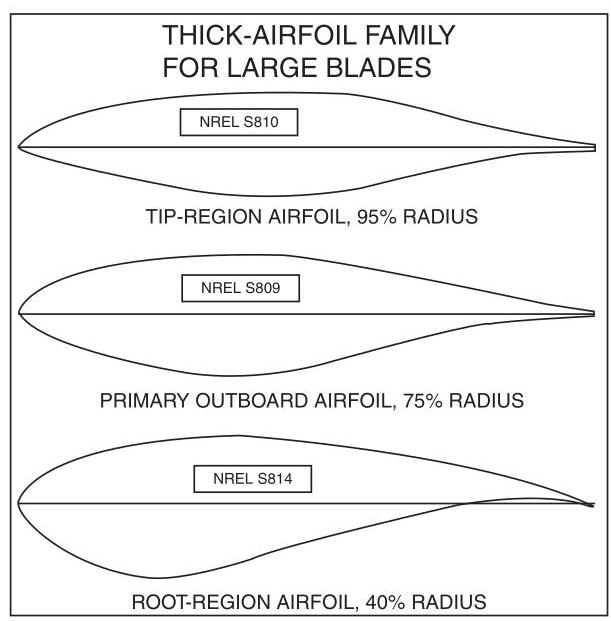

Design Specifications Design Specifications

<table><tr><td>Airfoil</td><td>r/R</td><td>Rs. No. (x106)</td><td>t/c</td><td>Cimax</td><td>${\mathrm{C}}_{\text{ dmin }}$</td><td>${\mathrm{C}}_{\mathrm{{mp}}}$</td></tr><tr><td>S810</td><td>0.95</td><td>2.0</td><td>0.180</td><td>0.9</td><td>0.006</td><td>-0.05</td></tr><tr><td>S809</td><td>0.75</td><td>2.0</td><td>0.210</td><td>1.0</td><td>0.007</td><td>-0.05</td></tr><tr><td>S814</td><td>0.40</td><td>1.5</td><td>0.240</td><td>1.3</td><td>0.012</td><td>-0.15</td></tr><tr><td>S815</td><td>0.30</td><td>1.2</td><td>0.260</td><td>1.1</td><td>0.014</td><td>-0.15</td></tr></table>

<table><tr><td>Airfoil</td><td>r/R</td><td>Rs. No. (x106)</td><td>t/c</td><td>Cimax</td><td>${\mathrm{C}}_{\text{ dmin }}$</td><td>${\mathrm{C}}_{\mathrm{{mp}}}$</td></tr><tr><td>S813</td><td>0.95</td><td>2.0</td><td>0.150</td><td>1.1</td><td>0.007</td><td>-0.07</td></tr><tr><td>S812</td><td>0.75</td><td>2.0</td><td>0.210</td><td>1.2</td><td>0.008</td><td>-0.07</td></tr><tr><td>S814</td><td>0.40</td><td>1.5</td><td>0.240</td><td>1.3</td><td>0.012</td><td>-0.15</td></tr><tr><td>S815</td><td>0.30</td><td>1.2</td><td>0.260</td><td>1.1</td><td>0.014</td><td>-0.15</td></tr></table>

Thick-Airfoil Family for Large Blades (lower tip ${c}_{1,\max }$ ) Thick-Airfoil Family for Large Blades (low tip ${\mathrm{c}}_{1,\max }$ )

Figure 3.69 NREL aerofoil profiles for large blades. Reproduced from Tangler and Somers (1995)

#### 3.17.3 The Risø aerofoils

The Risø National Laboratory in Denmark have also developed families of aerofoil designs for wind turbines with similar objectives to the NREL series, Fugslang and Bak (2004). Although the aerodynamic design techniques of the two laboratories were different there is, perhaps not surprisingly, a significant similarity between the actual designs.

The design tools for the Risø aerofoils were the X-FOIL code developed by Drela, a development of the work of Eppler (1990, 1993) and the Ellipsys-2D CFD code developed at the Technical University of Denmark by Sørensen (1995).

Three families of aerofoils have been developed at Risø, Risø-A, Risø-P and Risø-B. See Tables 3.4-3.6. The Risø-A family, Figure 3.70 and Table 3.4, was designed in the 1990s and was intended for stall controlled turbines, however, sensitivity to surface roughness was found to be higher than expected in field tests. The Risø-A family of aerofoil profiles are illustrated in Figure 3.70.

The Risø-P family of just four aerofoils, Figure 3.71 and Table 3.5, was designed to replace the corresponding profiles in the Risø-A series for use on variable pitch and variable speed rotors. The Risø-P family of aerofoil profiles are illustrated in Figure 3.71.

The Risø-B family was designed as six separate aerofoils with an extended range of thickness to chord ratio from 15-36%, see Figure 3.72 and Table 3.6. The aerofoils, generally, have high maximum lift coefficients for use on multi-megawatt size rotors with low solidity, flexible blades having variable speed pitch control. The Risø-B family of aerofoil profiles are illustrated in Figure 3.72.

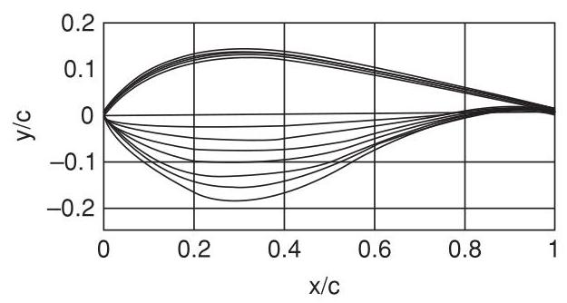

Figure 3.70 The Risø-A series of aerofoil profiles

Figure 3.71 The Risø-P series of aerofoil profiles

In Tables 3.4-3.7 the ’design ${c}_{1}$ ’ is the value of the lift coefficient that corresponds to the maximum lift to drag ratio. It is a design feature of the Risø aerofoils that the design ${c}_{1}$ is high so that a blade will be most efficient at low solidity.

#### 3.17.4 The Delft aerofoils

The Delft University of Technology in the Netherlands has also developed a number of aerofoils for wind turbine rotors (Timmer and van Rooij, 2003), see Figure 3.73 and Table 3.7. As with the NREL and Risø aerofoils, the principal feature driving the designs was surface roughness insensitivity but more emphasis was placed upon seeking designs for thick aerofoils in order to gain a structural advantage. The Delft University series of aerofoil profiles are illustrated in Figure 3.73.

Table 3.4 The principal characteristics of the Risø-A series

<table><tr><td>Aerofoil</td><td>Max t/c %</td><td>x/c at max t/c</td><td>y/c at T.E.</td><td>Re $\times \; {10}^{-6}$</td><td>${\alpha }^{ \circ  }$</td><td>${\mathrm{c}}_{1}$ Max</td><td>Design $\alpha$</td><td>Design ${\mathrm{C}}_{1}$</td><td>Max ${\mathrm{C}}_{\mathrm{l}}/{\mathrm{c}}_{\mathrm{d}}$</td></tr><tr><td>Risø-A1- 15</td><td>15</td><td>0.325</td><td>0.0025</td><td>3.00</td><td>-4.0</td><td>1.50</td><td>6.0</td><td>1.13</td><td>168</td></tr><tr><td>Risø-A1- 18</td><td>18</td><td>0.336</td><td>0.0025</td><td>3.00</td><td>-3.6</td><td>1.53</td><td>6.0</td><td>1.15</td><td>167</td></tr><tr><td>Risø-A1- 21</td><td>21</td><td>0.298</td><td>0.005</td><td>3.00</td><td>-3.3</td><td>1.45</td><td>7.0</td><td>1.15</td><td>161</td></tr><tr><td>Risø-A1- 24</td><td>24</td><td>0.302</td><td>0.01</td><td>2.75</td><td>-3.4</td><td>1.48</td><td>7.0</td><td>1.19</td><td>157</td></tr><tr><td>Risø-A1- 27</td><td>27</td><td>0.303</td><td>0.01</td><td>2.75</td><td>-3.2</td><td>1.44</td><td>7.0</td><td>1.15</td><td>N/A</td></tr><tr><td>Riso-A1- 30</td><td>30</td><td>0.300</td><td>0.01</td><td>2.50</td><td>-2.7</td><td>1.35</td><td>7.0</td><td>1.05</td><td>N/A</td></tr><tr><td>Risø-A1- 33</td><td>30</td><td>0.304</td><td>0.01</td><td>2.50</td><td>-1.6</td><td>1.20</td><td>7.0</td><td>0.93</td><td>N/A</td></tr></table>

Table 3.5 The principal characteristics of the Risø-P series

<table><tr><td>Aerofoil</td><td>Max t/c %</td><td>x/c at max t/c</td><td>y/c at T.E.</td><td>Re $\times \; {10}^{-6}$</td><td>$\alpha$</td><td>${\mathrm{c}}_{1}$ Max</td><td>Design $\alpha$</td><td>Design ${\mathrm{C}}_{1}$</td><td>Max ${\mathrm{C}}_{1}/{\mathrm{c}}_{\mathrm{d}}$</td></tr><tr><td>Risø-P- 15</td><td>15</td><td>0.328</td><td>0.0025</td><td>3.00</td><td>- 3.5</td><td>1.49</td><td>6.0</td><td>1.12</td><td>173</td></tr><tr><td>Risø-P- 18</td><td>18</td><td>0.328</td><td>0.0025</td><td>3.00</td><td>-3.7</td><td>1.50</td><td>6.0</td><td>1.15</td><td>170</td></tr><tr><td>Risø-P- 21</td><td>21</td><td>0.323</td><td>0.005</td><td>3.00</td><td>-3.5</td><td>1.48</td><td>6.0</td><td>1.14</td><td>159</td></tr><tr><td>Risø-P- 24</td><td>24</td><td>0.320</td><td>0.01</td><td>2.75</td><td>-3.7</td><td>1.48</td><td>6.0</td><td>1.17</td><td>156</td></tr></table>

Table 3.6 The principal characteristics of the Risø-B series

<table><tr><td>Aerofoil</td><td>Max t/c %</td><td>x/c at max t/c</td><td>y/c at T.E.</td><td>Re $\times \; {10}^{-6}$</td><td>$\alpha$</td><td>${\mathrm{c}}_{1}$ Max</td><td>Design $\alpha$</td><td>Design ${\mathrm{C}}_{1}$</td><td>Max ${\mathrm{C}}_{1}/{\mathrm{c}}_{\mathrm{d}}$</td></tr><tr><td>Risø-B1- 15</td><td>15</td><td>0.278</td><td>0.006</td><td>6.00</td><td>-4.1</td><td>1.92</td><td>6.0</td><td>1.21</td><td>157</td></tr><tr><td>Risø-B1- 18</td><td>18</td><td>0.279</td><td>0.004</td><td>6.00</td><td>-4.0</td><td>1.87</td><td>6.0</td><td>1.19</td><td>166</td></tr><tr><td>Risø-B1- 21</td><td>21</td><td>0.278</td><td>0.005</td><td>6.00</td><td>-3.6</td><td>1.83</td><td>6.0</td><td>1.16</td><td>139</td></tr><tr><td>Risø-B1- 24</td><td>24</td><td>0.270</td><td>0.007</td><td>6.00</td><td>-3.1</td><td>1.76</td><td>6.0</td><td>1.15</td><td>120</td></tr><tr><td>Risø-B1- 30</td><td>30</td><td>0.270</td><td>0.01</td><td>6.00</td><td>-2.1</td><td>1.61</td><td>5.0</td><td>0.90</td><td>N/A</td></tr><tr><td>Riso-B1- 36</td><td>36</td><td>0.270</td><td>0.012</td><td>6.00</td><td>-1.3</td><td>1.15</td><td>5.0</td><td>0.90</td><td>N/A</td></tr></table>

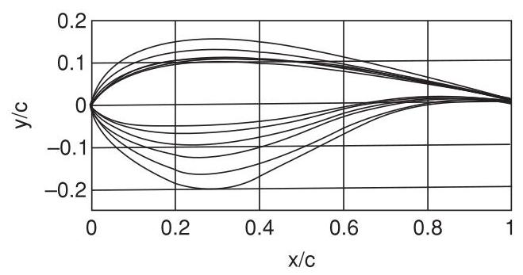

Figure 3.72 The Risø-B series of aerofoil profiles

Figure 3.73 The DU series of aerofoil profiles

Table 3.7 The principal characteristics of the DU series

<table><tr><td>Aerofoil</td><td>Max t/c %</td><td>x/c at max t/c</td><td>$\mathrm{y}/\mathrm{c}$ at T.E.</td><td>Re $\times \; {10}^{-6}$</td><td>$\alpha$</td><td>${\mathrm{c}}_{1}$ Max</td><td>Design $\alpha$</td><td>Design ${\mathrm{C}}_{1}$</td><td>Max ${\mathrm{C}}_{1}/{\mathrm{c}}_{\mathrm{d}}$</td></tr><tr><td>DU 96-W-180</td><td>18</td><td>0.3</td><td>0.0018</td><td>3.00</td><td>-2.7</td><td>1.26</td><td>6.59</td><td>1.07</td><td>145</td></tr><tr><td>DU 00-W-212</td><td>21.2</td><td>0.3</td><td>0.0023</td><td>3.00</td><td>-2.7</td><td>1.29</td><td>6.5</td><td>1.06</td><td>132</td></tr><tr><td>DU 91-W2-250</td><td>25</td><td>0.3</td><td>0.0054</td><td>3.00</td><td>-3.2</td><td>1.37</td><td>6.68</td><td>1.24</td><td>137</td></tr><tr><td>DU 97-W-300</td><td>30</td><td>0.3</td><td>0.0048</td><td>3.00</td><td>-2.2</td><td>1.56</td><td>9.3</td><td>1.39</td><td>98</td></tr><tr><td>DU 00-W-350</td><td>35</td><td>0.3</td><td>0.01</td><td>3.00</td><td>-2.0</td><td>1.39</td><td>7.0</td><td>1.13</td><td>81</td></tr><tr><td>DU 00-W-401</td><td>40.1</td><td>0.3</td><td>0.01</td><td>3.00</td><td>-3.0</td><td>1.04</td><td>5.0</td><td>0.82</td><td>54</td></tr></table>

The design tool for the Delft aerofoils was the R-FOIL code a modification made at Delft of the X-FOIL code to include the effects of stall delay.

The two thickest aerofoils have not been tested in a wind tunnel and the characteristics have been determined by calculation.

## References

Betz, A. (1919) Schraubenpropeller mit geringstem Energieverlust. Gottinger Nachrichten, Delft.

Drela, M. (1989) X-Foil: An Analysis and Design System for low Reynolds Number Airfoils. Low Reynolds Number Aerodynamics, Vol. 54 (1989), Springer-Verlag Lecture Notes in Engineering. Springer-Verlag, Godalming.

Eppler, R. (1990) Airfoil Design and Data. Springer-Verlag, Berlin.

Eppler, R. (1993) Airfoil Program System. User's Guide. Eppler, R. Airfoil Program System, User's Guide; Institut A fuer Mechanik, Universitate Stuttgart (1988).

Fugslang, P. and Bak, C. (2004) Development of the Risø Wind Turbine Airfoils. Wind Energy, 7, 145-162.

Glauert, H. (1926) The Analysis of Experimental Results in the Windmill Brake and Vortex Ring States of an Airscrew., ARCR R&M No. 1026.

Glauert, H. (1935a) Airplane Propellers. In: Aerodynamic Theory, (ed. W.F. Durand), Vol. 4, Division L, pp. 169-360. Julius Springer, Berlin.

Glauert, H. (1935b) Windmills and Fans. In: Aerodynamic Theory, (ed. W.F. Durand), Vol. 4, Division L, pp. 169-360. Julius Springer, Berlin.

Goldstein, S. (1929) On the Vortex Theory of Screw Propeller. Royal Society Proceedings (A) 123, p. 440.

Himmelskamp, H. (1945) Profile investigations on a rotating airscrew. PhD thesis, University of Göttingen.

Hoerner, S.F. (1965) Pressure drag on rotating bodies. In: Fluid-Dynamic Drag (S.F. Hoerner) pp. 3-13, 14.S.F Hoerner, New Jersey.

Lanchester, F.W. (1915) A Contribution to the Theory of Propulsion and the Screw Propeller, Transactions of the Institution of Naval Architects, 57, 98.

Lock, C.N.H. (1924) Experiments to Verify the Independence of the Elements of an Airscrew Blade, ARCR R&M, No. 953.

Ronsten, G. (1991) Static pressure measurements in a rotating and a non-rotating 2.35 m wind turbine blade. Comparison with 2D calculations. Proceedings of the EWEC '91 conference, Amsterdam.

Snel, H., Houwink, R., Bousschers, Piers, W.J., van Bussel, G.J.W. and Bruining, A. (1993) Sectional Prediction of 3-D Effects for Stalled Flow on Rotating Blades and Comparison with Measurements. Proceedings of the EWEC '93 conference, Lübeck-Travemünde.

Sørensen, N.N. (1995) General Purpose Flow Solver Applied to Flow over Hills, Risø-R-827(EN). Risø National Laboratory, Denmark.

Tangler, J.L. and Somers, D.M. (1995) NREL Airfoil Families for HAWTs. AWEA '95. Washington, D.C.

Timmer, W.A. and van Rooij, R.P.J.O.M. (2003) Summary of the Delft University Wind Turbine Dedicated Airfoils. Journal of Solar Energy Engineering, 125, 488-496.

Wilson, R.E. and Lissaman, P.B.S. (1974) Applied Aerodynamics of Wind Power-Machines. NTIS: PB-238-595. Oregon State University, Oregon.

Wood, D.H. (1991) A three-dimensional analysis of stall-delay on a horizontal-axis wind turbine. Journal of Wind Engineering and Industrial Aerodynamics, 37, 1-14.

Young, A.D. and Squire, H.B. (1938) The Calculation of the Profile Drag of Aerofoils. R. & M. NO. 1838, British A.R.C., 1938.

## Websites

http://www.nrel.gov/wind/

http://www.nrel.gov/wind/publications.html

https://wind.nrel.gov/airfoils/Shapes/S809_Shape.html.

http://www.windpower.org/en/

http://www.lr.tudelft.nl/live/pagina.jsp?id=9e2f503f-3b65-44bc-aba4-a30033400ea7&lang=en

## Further Reading

Duncan, W.J., Thom, A.S. and Young, A.D. (1970) Mechanics of Fluids, 2nd edition. Edward Arnold, London.

Barnard, R.H. and Philpott, D.R. (1989) Aircraft Flight. A description of the physical principles of aircraft flight. Longman, Singapore.

Anderson, J.D. (1991) Fundamentals of Aerodynamics, 2"d edition. McGraw-Hill, Singapore.

Prandtl, L. and Tietjens, O.G. (1957) Applied Hydro- and Aeromechanics. Dover, New York.

Katz, J. and Plotkin, A. (1991) Low Speed Aerodynamics. From wing theory to panel methods. McGraw-Hill, Singapore.

Abbott, I.H. and von Doenhoff, A.E. (1959) Theory of Wing Sections. Dover, New York.

Stepniewski, W.Z. and Keys, C.N. (1984) Rotary-Wing Aerodynamics. Dover, New York.

Johnson, W. (1980) Helicopter Theory. Dover, New York.

Fung, Y.C. (1969) An Introduction to the Theory of Aeroelasticity. Dover, New York.

Eggleston, D.M. and Stoddard, F.S. (1987) Wind Turbine Engineering Design. Van Nostrand Reinhold Co., New York.

Manwell, J.F., McGowan, J.G. and Rogers, A.L. (2002) Wind Energy Explained. John Wiley & Sons Ltd., Chichester.

Hansen, M.O.L. (2000) Aerodynamics of Wind Turbines. James & James, London.

## Appendix A3 lift and drag of aerofoils

The forces acting on a body immersed in a fluid moving fluid can be resolved into stream-wise (drag) and normal (lift) components. Neglecting buoyancy, the fluid mechanics which give rise to lift and drag are associated with the boundary layer of slow moving fluid close to the body's surface. The fluid force on the surface of the body can be either parallel to the surface (viscous or skin friction force) or normal to the surface (pressure force).

For a thorough understanding of the phenomena of lift and drag an aerodynamics text should be consulted but for the purposes of wind turbine aerodynamics the basic results are given below.

### A3.1 Definition of drag

The drag on a body immersed in an oncoming flow is defined as the force on the body in a direction parallel to the flow direction.

In a very slowly moving fluid the drag on a body may be directly attributable to the viscous, frictional shear stresses set up in the fluid due to the fact that, at the body wall, there is no relative motion.

This type of flow is known as Stokes flow after Sir George Stokes.

A century and a half before Stokes, Isaac Newton showed that that the shear stress $\tau$ at a boundary wall, or between two layers of fluid moving relative to one another, is proportional to the transverse velocity gradient at the boundary, or between the two layers.

$$
\tau  = \mu \frac{du}{dy} \tag{A3.1}
$$

where the constant of proportionality is $\mu$ the fluid viscosity.

Using Newton's theory, Stokes determined the drag force on a sphere in creeping flow (Figure A3.1).

$$
\text{ Drag } = {3\pi \mu Ud} \tag{A3.2}
$$

where $d$ is the sphere diameter and $U$ is the general flow velocity.

The inviscid flow pattern around a cylinder, Figure A3.2, appears very similar to that of creeping flow but the nature of the flow is very different indeed. By definition inviscid flow causes no viscous drag but it also causes no pressure drag, that is, drag caused by a pressure force aggregated over the whole surface area. The pressure distribution for the inviscid flow past a cylinder is shown in Figure A3.3, where the atmospheric pressure ${p}_{\infty }$ has been subtracted from the pressure around the surface. The symmetry of the pressure distribution fore and aft shows clearly that no pressure drag arises. At the nose of the body the flow is brought exactly to rest and this is called the stagnation point. Another stagnation point occurs at the rear of the body.

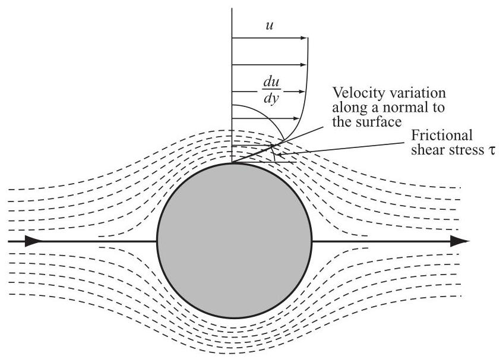

Figure A3.1 Creeping flow past a circular cylinder

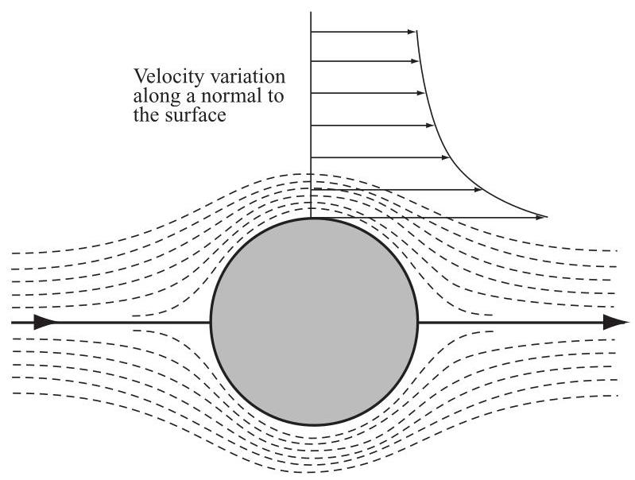

Figure A3.2 Inviscid flow pattern around a cylinder

In a real fluid, when the viscosity is low and the velocity is relatively high, the drag force that exists is due primarily to an asymmetric pressure distribution, fore and aft, Figure A3.5.

Figure A3.3 Inviscid flow pressure distribution around a cylinder

Figure A3.4 Separated flow pattern around a cylinder

This is caused by the fact that the fluid does not follow the boundary of the body but separates from it leaving low pressure, stagnant fluid in the wake, Figure A3.4. On the upstream side the flow remains attached and the pressure is high.

### A3.2 Drag coefficient

If Stokes' drag equation (Equation A3.2) for the sphere is re-arranged, giving

$$
\text{ Drag } = {3\pi \mu Ud} = \left( {{24}\left( \frac{\mu }{\rho Ud}\right) }\right) \left( {\frac{1}{2}\rho {U}^{2}}\right) \left( \frac{\pi {d}^{2}}{4}\right) \tag{A3.3}
$$

Figure A3.5 Separated flow pressure distribution around a cylinder

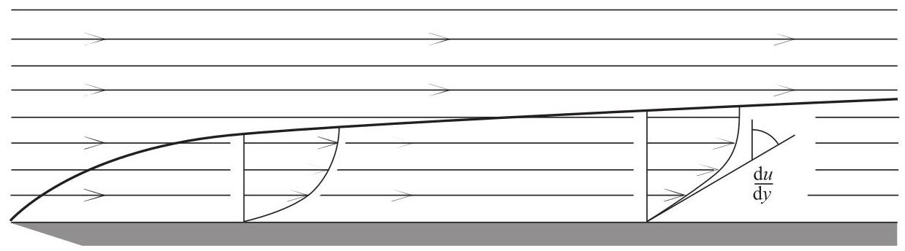

Figure A3.6 Boundary layer showing the velocity profile

it is then in the standard form of drag coefficient $\left( {C}_{D}\right)  \times$ dynamic pressure $\left( {\frac{1}{2}\rho {U}^{2}}\right)  \times$ frontal area (A). The drag coefficient is then defined as

$$
{C}_{D} = \frac{\text{ Drag }}{\frac{1}{2}\rho {U}^{2}A} \tag{A3.4}
$$

Note that, ${\rho Ud}/\mu$ is known as the Reynolds number $\left( {Re}\right)$ and represents the ratio of the inertia force acting on a unit volume of fluid, as it is accelerated by a pressure gradient, and the viscous force on the same volume of fluid which is resisting the motion of the fluid. For high Reynolds numbers viscous forces are low and vice versa. The drag coefficient term in Equation A3.3 is ${C}_{D} = {24}/{Re}$ and is clearly a function only of the Reynolds number: this turns out to be valid for all bodies in incompressible flow but the functional relationship is not usually as simple as in the above case. However, it can be stated, generally, that ${C}_{D}$ falls with increasing Reynolds number.

### A3.3 The boundary layer

The reason for the separated flow at the higher Reynolds numbers is the existence of a thin boundary layer of slow moving fluid, close to the body surface, within which viscous forces predominate. See Figure A3.6. Outside of this layer the flow behaves almost inviscidly. The drag on the body caused directly by viscosity is quite small but the effect on the flow pattern is profound.

The drag on an aerofoil can be attributed both to pressure and viscous sources and the drag coefficient varies significantly with both angle of attack and Reynolds number.

### A3.4 Boundary layer separation

Referring to Figure A3.3, the inviscid flow pressure distribution around a cylinder, fore and aft the pressure is high; above and below the pressure is low. The fluid on the downstream side is slowing down against an adverse pressure gradient and, at the wall boundary, it slows down exactly to a standstill at the rear stagnation point.

In the real flow the fluid the boundary layer (Figure A3.6), which has already been slowed down by viscosity, comes to a halt well before the stagnation point is reached and the flow begins to reverse under the action of the adverse pressure. At this point, where the pressure is still low, the boundary layer separates from the body surface forming a wake of stagnant, low pressure fluid (Figure A3.7), the resulting pressure distribution is thereby dramatically altered as shown in Figure A3.5. The high pressure acting at and around the forward stagnation point is no longer balanced by the high pressure at the rear and so a drag-wise pressure force is exerted.

Figure A3.7 Separation of a boundary layer

### A3.5 Laminar and turbulent boundary layers

A boundary layer grows in thickness from the forward stagnation point, or leading edge. Initially, the flow in the layer is ordered and smooth (laminar) but, at a critical distance $l$ from the stagnation point, characterised by $R{e}_{\text{ crit }} = {\rho Ul}/\mu$ , the flow begins to become turbulent, (Figure A3.8). This turbulence causes mixing of the boundary layer with the faster moving fluid outside resulting in re-energisation and delaying of the point of separation. The result is to reduce the pressure drag, because the low pressure stagnant rear area is reduced, to increase the viscous (frictional) drag, because the velocity gradient at the surface is increased, and increase the boundary layer thickness.

The coefficient of drag, therefore, varies with Re in a complex fashion, Figure A3.9. For small bodies at low speeds the critical Re is never reached and so separation takes place early. For large bodies, or high speeds, turbulence develops quickly and separation is delayed.

Figure A3.8 Laminar and turbulent boundary layers

Figure A3.9 Variation of ${C}_{D}$ with ${Re}$ for a long cylinder

Turbulence can be artificially triggered by roughening the body surface or simply by using a 'trip wire'. General flow turbulence tends to produce turbulent boundary layers at Reynolds numbers ostensibly below the critical value and this certainly seems to happen in the case of wind turbine blades. A sharp edge on a body will always cause separation. For a flat plate broad side on to the flow, Figure A3.10, the boundary layer separates at the sharp edges and ${C}_{D}$ is almost independent of ${Re}$ , but is dependent upon the plate’s aspect ratio.

So-called streamlined bodies such as an aerofoil taper gently in the aft region so that the adverse pressure gradient is small and separation is delayed until very close to the trailing edge, (Figure A3.11). This produces a very much narrower wake and a very low drag because it is largely caused by skin friction rather than pressure.

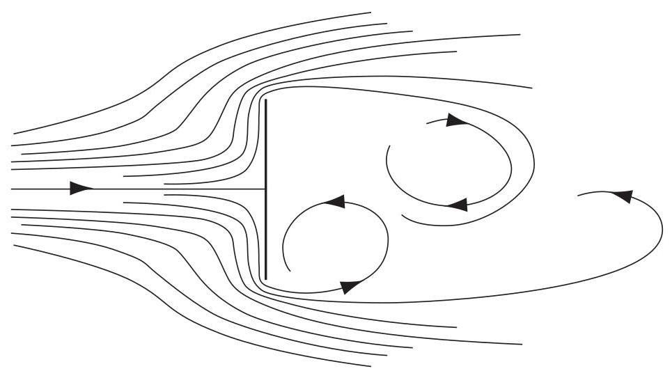

Figure A3.10 Separated flow past a flat plate

Figure A3.11 Flow past a streamlined body

### A3.6 Definition of lift and its relationship to circulation

The lift on a body immersed is defined as the force on the body in a direction normal to the flow direction.

Lift will only be present if the flow incorporates a circulatory flow about the body such as that which exists about a spinning circular cylinder. If the fluid also has a uniform velocity $U$ past the cylinder, the resulting flow field is as shown in Figure A3.12. The velocity above the cylinder is increased, and so the static pressure there is reduced. Conversely, the velocity beneath is slowed down, giving an increase in static pressure. There is clearly a normal force upwards on the cylinder, a lift force.

The phenomenon is known as the Magnus effect after its original discoverer and explains, for example, why spinning tennis balls veer in flight. The circulatory flow, shown in Figure A3.13, is generated by skin friction and has the same structure as that of a vortex.

Figure A3.12 Flow past a rotating cylinder

Figure A3.13 Circulatory flow round a rotating cylinder

The lift force is given by the Kutta-Joukowski theorem named after the two pioneering aerodynamicists who, independently, realised that this was the key to the understanding of the phenomenon of lift.

$$
L = \rho \left( {\Gamma  \times  U}\right) \tag{A3.5}
$$

where $\Gamma$ is the circulation, or vortex strength, around the cylinder, defined as the integral

$$
\Gamma  = \oint {vds} \tag{A3.6}
$$

around any path enclosing the cylinder and $v$ is the velocity tangential to the path $s$ . For convenience, choosing a circular path of radius $r$ around the cylinder, and ignoring the general flow velocity $U$ , then it can be shown that $v = k/r$ , where $k$ is a constant.

At the cylinder wall $r = R$ , so ${v}_{R} = {\Omega R} = k/R$ . Therefore, $k = \Omega {R}^{2}$ .

The circulation $\Gamma$ , which is the same for every path enclosing the cylinder, is given by

$$
\Gamma  = \oint \frac{\Omega {R}^{2}}{r}{ds} = {\int }_{0}^{2\pi }\Omega {R}^{2}{d\theta } = {2\pi \Omega }{R}^{2} \tag{A3.7}
$$

To achieve a circulatory flow about a non-rotating body it must have a sharp trailing edge like an aerofoil cross-sectional shape or a thin plate. An aerofoil works in a similar manner to the spinning cylinder and does so because of its sharp trailing edge. Consider an aerofoil at a small angle of attack $\alpha$ to the oncoming flow. The inviscid flow pattern around the aerofoil, in which no boundary layer forms, is as shown in Figure A3.14a. The theoretical inviscid flow condition is such that no force on the aerofoil exists at all.

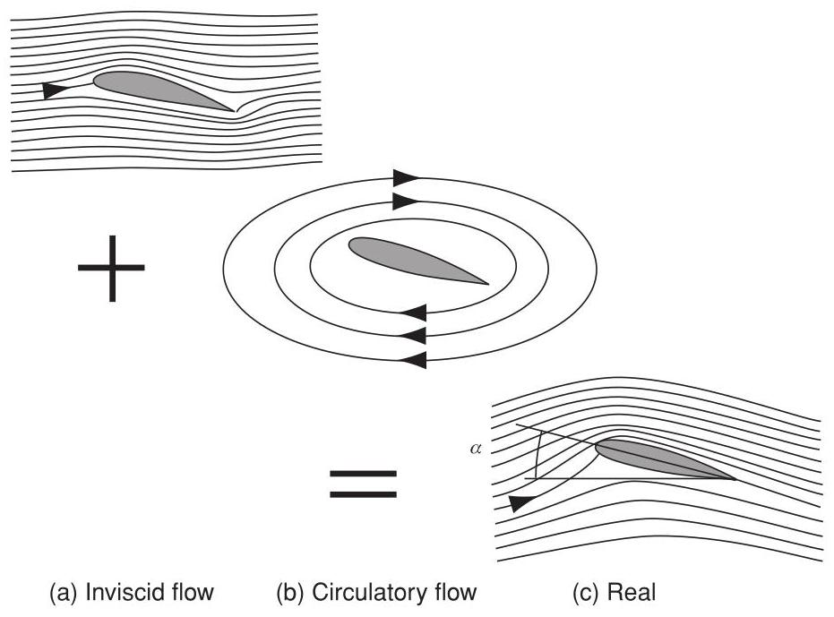

Figure A3.14 Flow past an aerofoil at a small angle of attack

In real flow, Figure A3.14c, boundary layer separation occurs at the sharp trailing edge, causing the flow to leave the edge smoothly. The separation leaves no low pressure wake so the flow remains attached everywhere else and the flow pattern is now altered such that there is a net circulation around the aerofoil (Figure A3.14b) increasing the velocity over the top and reducing it below, resulting in a lift force. There can be no flow around the sharp trailing edge because this would require very high local velocities that are precluded by the boundary layer. The drag is very low because, in the absence of a wake, it is attributable largely to skin friction caused by the shearing stresses in the boundary layer. The situation, which is imposed by the sharp trailing edge, is known as the Kutta condition.

In a manner similar to the Magnus effect, a pressure difference occurs across the aerofoil and the overall circulation $\Gamma$ can be shown to be ${\pi Uc}\sin \alpha$ , where $c$ is the chord length of the aerofoil and $\alpha$ is termed the angle of attack. Although the velocities and pressures above and below the aerofoil at the trailing edge must be the same, the particles which meet there are not the same ones that parted company at the leading edge; the particle which travelled above the aerofoil reaches the trailing edge first because it is speeded up by the circulatory flow.

The pressure variation (minus the ambient static pressure of the undisturbed flow) around an aerofoil is shown in Figure A3.15. The upper surface is subject to suction (with the ambient pressure subtracted) and is responsible for most of the lift force. The pressure distribution is calculated without the presence of the boundary layer.

Figure A3.16 shows the same distribution with the pressure coefficient $\left( {{C}_{p} = p - {p}_{\infty }/}\right. \; \left. {\left( {1/2}\right) \rho {U}^{2}}\right)$ plotted against the chord-wise co-ordinate of the aerofoil profile: the full line shows the pressure distribution if the effects of the boundary layer are ignored and the dashed line shows the actual distribution.

Figure A3.15 The pressure distribution around the NACA0012 aerofoil at $\alpha  = {5}^{ \circ  }$

The effect of the boundary layer is to modify the pressure distribution at the rear of the aerofoil such that lower pressure occurs there rather than if the boundary is ignored. The modified pressure distribution gives rise to pressure drag that is added to the skin friction drag, also caused by the boundary layer.

### A3.7 The stalled aerofoil

If the angle of attack exceeds a certain critical value $\left( {{10}^{ \circ  } - {16}^{ \circ  }}\right.$ , depending on the ${Re}$ ), separation of the boundary layer on the upper surface takes place, (Figure A3.17). This causes a wake to form from above the aerofoil, reduces the circulation, reduces the lift and increases the drag. The flow past the aerofoil has then stalled. A flat plate will also develop circulation and lift but will stall at a very low angle of attack because of the sharp leading edge. Arching the plate will improve the stalling behaviour but a much greater improvement can be obtained by giving thickness to the aerofoil together with a well rounded leading edge.

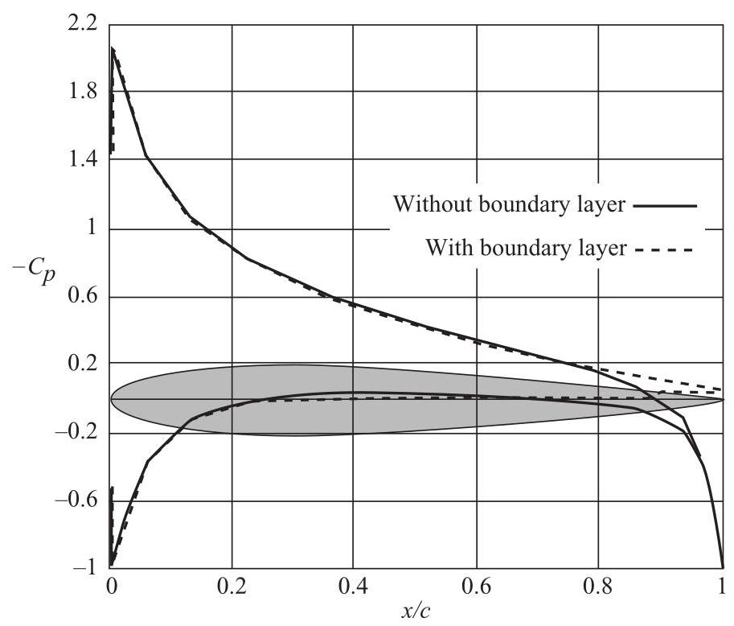

Figure A3.16 The pressure distribution around the NACA0012 aerofoil at $\alpha  = {5}^{ \circ  }$

### A3.8 The lift coefficient

The lift coefficient is defined as

$$
{C}_{L} = \frac{\text{ Lift }}{\frac{1}{2}\rho {U}^{2}A} \tag{A3.8}
$$

$U$ is the flow speed and $A$ is the plan area of the body. For a long body, such as an aircraft wing or a wind turbine blade, the lift per unit span is used in the definition and the plan area is replaced by the chord length.

$$
{C}_{l} = \frac{\text{ Lift/unit span }}{\frac{1}{2}\rho {U}^{2}c} = \frac{\rho \left( {\Gamma  \times  U}\right) }{\frac{1}{2}\rho {U}^{2}c} = \frac{{\rho \pi Uc}\sin {\alpha U}}{\frac{1}{2}\rho {U}^{2}c} = {2\pi }\sin \alpha \tag{A3.9}
$$

In practice,

$$
{C}_{l} = {a}_{0}\sin \alpha \tag{A3.10}
$$

where ${a}_{0}$ , called the lift-curve slope $d{C}_{l}/{d\alpha }$ , is about 5.73 (0.1/deg.), rather than ${2\pi }$ . Note that ${a}_{0}$ should not be confused with the flow induction factor.

Lift, therefore, depends on two parameters, the angle of attack $\alpha$ and the flow speed $U$ . The same lift force can be generated by different combinations of $\alpha$ and $U$ .

The variation of ${C}_{l}$ with the angle of attack $\alpha$ is shown in Figure A3.18 for a typical symmetrical aerofoil (NACA0012). Notice that the simple relationship of Equation A3.10 is only valid for the pre-stall region, where the flow is attached, and because the angle of attack is small $\left( { < {16}^{ \circ  }}\right)$ the equation is often written as

$$
{C}_{l} = {a}_{0}\alpha \tag{A3.10a}
$$

### A3.9 Aerofoil drag characteristics

The definition of the drag coefficient for an aircraft wing or a wind turbine blade is based not on the frontal area but on the plan area, for reasons that will become clear later. The flow past a body which has a large span normal to the flow direction is basically two-dimensional and in such cases the drag coefficient can be based upon the drag force per unit span using the stream-wise chord length for the definition.

$$
{C}_{d} = \frac{\text{ Drag }/\text{ unit span }}{\frac{1}{2}\rho {U}^{2}c} \tag{A3.11}
$$

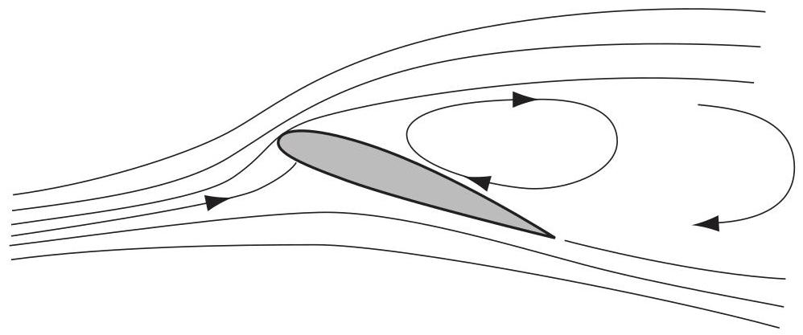

Figure A3.17 Stalled flow around an aerofoil

For a wing of large span the value of ${C}_{d}$ is roughly 0.01, at moderate Reynolds numbers.

The drag coefficient of an aerofoil also varies with angle of attack. Figure A3.16 shows that on the upper surface pressure is rising as the flow moves towards the trailing edge, this is called an adverse pressure gradient and seeks to slow the air down. If the air is slowed to a standstill stall will occur and the pressure drag will rise sharply. The strength of the adverse pressure gradient increases with angle of attack and so it can be expected that the drag will rise with angle of attack. Figure A3.19 shows the variation of ${C}_{d}$ with $\alpha$ also for the symmetrical NACA0012 aerofoil.

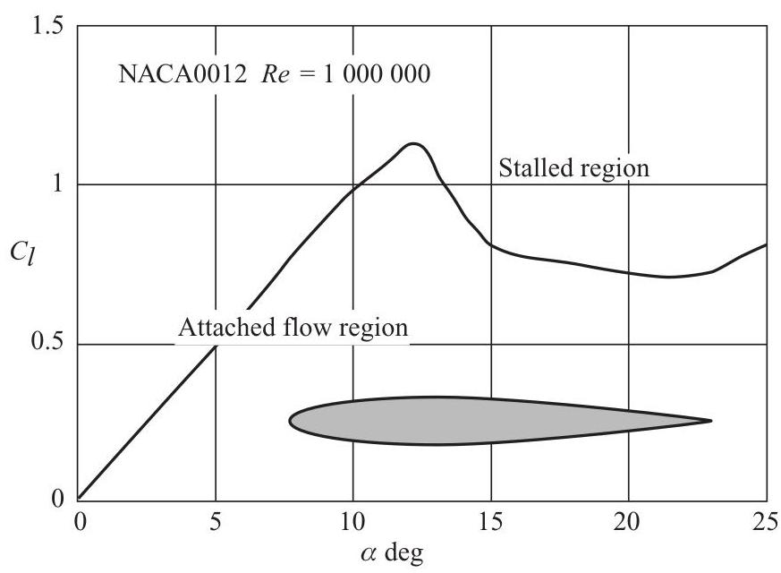

Figure A3.18 ${C}_{l} - \alpha$ curve for a symmetrical aerofoil

Figure A3.19 Variation of ${C}_{d}$ with $\alpha$ for the NACA0012 aerofoil

The lift/drag ratio (shown in Figure A3.20) has a significant effect upon the efficiency of a wind turbine and it is desirable that a turbine blade operates at the maximum ratio.

The nature of the flow pattern around an aerofoil is determined by the Reynolds number and this significantly affects the values of the lift and drag coefficients. The general level of the drag coefficient increases with decreasing Reynolds number and below a critical Reynolds number of about 200000 the boundary layer remains laminar causing a sharp rise in the coefficient. The effect on the lift coefficient is largely concerned with the angle of attack at which stall occurs. As the Reynolds number rises so does the stall angle and, because the lift coefficient increases linearly with angle of attack below the stall, the maximum value of the lift coefficient also rises.

Figure A3.20 Lift/drag ratio variation for the NACA0012 aerofoil

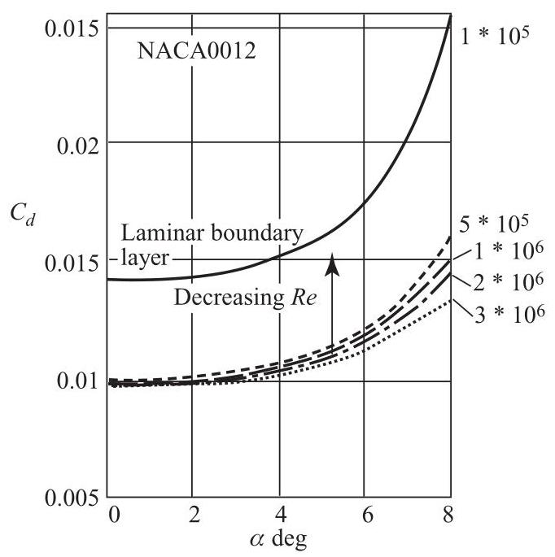

Figure A3.21 Variation of the drag coefficient with Reynolds number at low angles of attack

Characteristics for the NACA0012 aerofoil are shown in Figures A3.21 and A3.22.

### A3.10 Cambered aerofoils

Cambered aerofoils, such as the NACA4412, shown in Figure A3.23, have curved chord lines and this allows them to produce lift at zero angle of attack.

Generally, cambered aerofoils have higher maximum lift/drag ratios than symmetrical aerofoils for positive angles of attack and this is the reason for their use.

The classification of the NACA 4-digit range of aerofoils, which were commonly used on wind turbines, is very simple and is illustrated in Figure A3.24: from left to right, the first digit represents the amount of camber as a percentage of the chord length, the second digit represents the percentage chord position, in units of 10%, at which the maximum camber occurs and the last two digits are the maximum thickness to chord ratio, as a percentage of the chord length, which, in this family of aerofoils, is at the 30% chord position. The cambered chord line, now called the camber line, comprises two parabolic arcs that join smoothly at the point of maximum camber. For other ranges of aerofoils the reader should refer to Theory of Wing Sections by Abbott and von Doenhoff (1959).

The angle of attack $\alpha$ is measured form the chord line which is now defined as the straight line joining the ends of the camber line.

Note that the lift at zero angle of attack is no longer zero; zero lift occurs at a small negative angle of attack. With most cambered aerofoils the zero lift line is approximately at $- {\mathrm{A}}^{ \circ  }$ where $\mathrm{A}$ is the percentage camber.

The behaviour of the NACA4412 aerofoil is shown in Figure A3.25 for angles of attack below and just above the stall. Note that the lift at zero angle of attack is no longer zero; zero lift occurs at a small negative angle of attack of approximately ${4}^{ \circ  }$ .

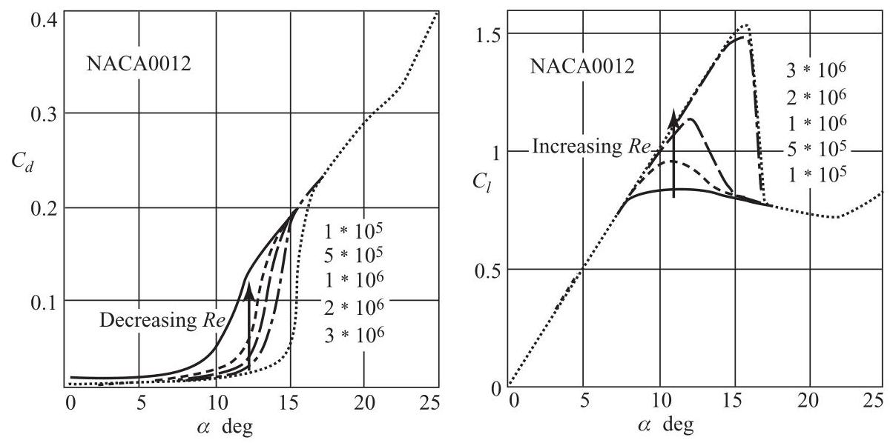

Figure A3.22 Variation of the drag and lift coefficients with Reynolds number in the stall region

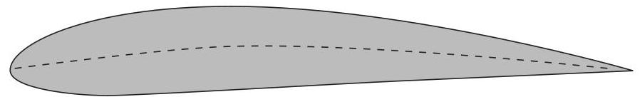

Figure A3.23 The profile of the NACA4412 aerofoil

The centre of pressure, which is at the $\frac{1}{4}$ chord position on symmetrical aerofoils lies aft of the $\frac{1}{4}$ chord position on cambered aerofoils and moves towards the trailing edge with increasing angle of attack. However, if a fixed chordwise position is chosen then the resultant force through that point is accompanied by a pitching moment (nose-up positive, by convention). If a pitching moment coefficient is defined as

$$
{C}_{m} = \frac{\text{ Pitching }/\text{ unit span }}{\frac{1}{2}\rho {U}^{2}c} \tag{A3.12}
$$

then there will be a position, called the ’aerodynamic centre’, for which $d{C}_{m}/d{C}_{l} = 0$ . Theoretically, the aerodynamic centre lies at the $\frac{1}{4}$ chord position and is close to this point for most practical aerofoils.

Figure A3.24 Classification of the NACAXXXX aerofoil range

Figure A3.25 The Characteristics of the NACA4412 Aerofoil for $\operatorname{Re} = {1.5} \cdot  {10}^{6}$

The value of ${C}_{m}$ depends upon the degree of camber but for the NACA4412 the value is -0.1, note that pitching moments are always negative in practice (nose down) despite the sign convention.

Above the stall there is no aerodynamic centre, as defined, and so the pre-stall position continues to be used to determine the pitching moment coefficient, which then becomes dependent upon $\alpha$ .

## 4 Further aerodynamic topics for wind turbines

### 4.1 Introduction

Chapter 3 deals with the aerodynamic behaviour of wind turbines in steady wind conditions and with the rotor aligned with the wind direction but, of course, real wind conditions are never steady and a turbine will always operate with some degree of yaw.

### 4.2 The aerodynamics of turbines in steady yaw

The rotor axis of a wind turbine rotor is usually not aligned with the wind because the wind is continuously changing direction: the rotor is not capable of following this variability and so spends most of its time in a yawed condition (Figure 4.1). The yawed rotor is less efficient than the non-yawed rotor and so it is vital to assess the efficiency for purposes of energy production estimation.

In the yawed condition, even in a steady wind, the angle of attack on each blade is continuously changing as it rotates and so the loads on the rotor blades are fluctuating, causing fatigue damage.

The changes in angle of attack mean that the blade forces cause not only a thrust in the axial direction but also moments about the yaw $\left( z\right)$ axis and the tilt axis.

Even if the rotor is operating with a uniform induced velocity over the rotor disc when aligned with a steady wind, once the rotor is mis-aligned the induced velocity varies both azimuthally and radially which makes its determination much more difficult.

Figure 4.1 A wind turbine yawed to the wind direction

#### 4.2.1 Momentum theory for a turbine rotor in steady yaw

The application of the momentum theory to an actuator disc representing a yawed rotor is somewhat problematical. The momentum theory is only capable of determining an average induced velocity for the whole rotor disc but, although in the non-yawed case the restriction was relaxed to allow some radial variation, it would not be appropriate to do this in the yawed case because the blade circulation is also changing with azimuth position. If it is assumed that the force on the rotor disc, which is a pressure force and so normal to the disc, is responsible for the rate of change of momentum of the flow then the average induced velocity must also be in a direction at right angles to the disc plane, that is, in the axial direction. The wake is therefore deflected to one side because a component of the induced velocity is at right angles to the wind direction. As in the non-yawed case the average induced velocity at the disc is half that in the wake.

Let the rotor axis be held at an angle of yaw $\gamma$ to the steady wind direction (Figure 4.2) then, assuming that the rate of change of momentum in the axial direction is equal to the mass flow rate through the rotor disc times the change in velocity normal to the plane of the rotor

$$
T = \rho {A}_{D}{U}_{\infty }\left( {\cos \gamma  - a}\right) {2a}{U}_{\infty } \tag{4.1}
$$

Therefore, the thrust coefficient is

$$
{C}_{T} = {4a}\left( {\cos \gamma  - a}\right) \tag{4.2}
$$

and the power developed is

$$
T{U}_{\infty }\left( {\cos \gamma  - a}\right) \text{ , giving }{C}_{P} = {4a}{\left( \cos \gamma  - a\right) }^{2} \tag{4.3}
$$

Figure 4.2 Deflected wake of a yawed turbine and induced velocities

To find the maximum value of ${C}_{P}$ differentiate Equation 4.3 with respect $a$ and set equal to zero, whence

$$
a = \frac{\cos \gamma }{3}\text{ and }{C}_{P\max } = \frac{16}{27}{\cos }^{3}\gamma \tag{4.4}
$$

This ${\cos }^{3}\gamma$ rule is commonly adopted for power assessment in yawed flow.

Figure 4.3 shows decrease in power as the yaw angle increases.

A question remains: is it legitimate to apply the momentum theory in the above manner to the yawed rotor? Transverse pressure gradients which cause the wake to skew sideways may well also contribute to the net force on the flow in the axial direction, influencing the axial induced velocity. The above analysis might be satisfactory for determining the average axial induced velocity but there is even less justification to apply the momentum theory to each blade element position than there is in the non-yawed case. If a theory is going to be of any use in design it must be capable of determining the induced velocity at each blade element position to a satisfactory accuracy. The satisfactory calculation of blade forces is as important as the estimation of power.

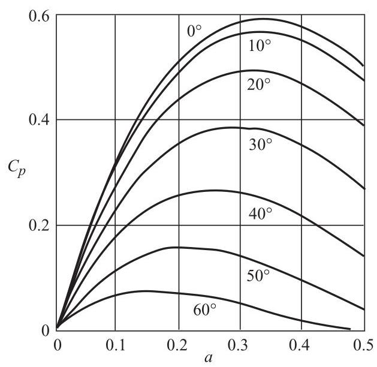

Figure 4.3 Power coefficient variation with yaw angle and axial flow factor

#### 4.2.2 Glauert's momentum theory for the yawed rotor

Glauert (1926) was primarily interested in the autogyro, which is an aircraft with a freely windmilling rotor to provide lift and a conventional propeller to provide forward thrust. The lifting rotor has a rotational axis which inclines backwards from the vertical and by the virtue of the forward speed of the aircraft air flows through the rotor disc causing it to rotate and to provide an upward thrust. Thus, the autogyro rotor is just like a wind turbine rotor in yaw, when in forward flight. At high forward speeds the yaw angle is large but in a power-off vertical descent the yaw angle is zero.

Glauert maintained that at high forward speed the rotor disc, which is operating at a high tip speed ratio, is like a wing of circular plan-form at a small angle of attack (large yaw angle) and so the thrust on the disc is the lift on the circular wing. Simple lifting line wing theory (see Prandtl and Tiejens, 1957) states that the down-wash (induced velocity) at the wing, caused by the trailing vortex system, is uniform over the wing span (transverse diameter of the disc) for a wing with an elliptical plan-form and this would include the circular plan-form of the autogyro rotor.

The theory gives the uniform (average) induced velocity as

$$
u = \frac{2L}{\pi {\left( 2R\right) }^{2}{\rho V}} \tag{4.5}
$$

where $L$ is the lift and $V$ is the forward speed of the aircraft.

The lift is in a direction normal to the effective incident velocity $W$ , see Figure 4.4, and so is not vertical but leans backwards. The vertical component of the lift supports the weight of the aircraft and the horizontal component constitutes drag. In horizontal flight the vertical component of the lift doesn't do any work but the drag does.

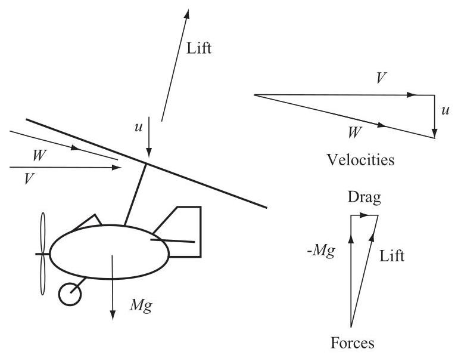

Figure 4.4 Velocities and forces on an autogyro in fast forward flight

The vector triangles of Figure 4.4 show that

$$
\frac{D}{L} = \frac{u}{V} \tag{4.6}
$$

In the wake of the aircraft the induced velocity ${u}_{w}$ caused by the trailing vortices is greater than that at the rotor. A certain mass flow rate of air, ${\rho VS}$ , where $S$ is an area, normal to velocity $V$ , yet to be determined, undergoes a downward change in velocity ${u}_{w}$ in the far wake. By the momentum theory the rate of change of downward momentum is equal to the lift, therefore,

$$
L = {\rho VS}{u}_{w} \tag{4.7}
$$

The rate of work done by the drag ${DV}$ must be equal to the rate at which kinetic energy is created in the wake $\frac{1}{2}\rho {u}_{w}^{2}{VS}$ , because the ambient static pressure in the wake of the aircraft is the same as the pressure ahead of the aircraft.

$$
{DV} = \frac{1}{2}\rho {u}_{w}^{2}{VS} \tag{4.8}
$$

Combining Equations 4.6, 4.7 and 4.8 gives

$$
D = \frac{{L}^{2}}{{2\rho }{V}^{2}S} \tag{4.9}
$$

and

$$
{u}_{w} = {2u} \tag{4.10}
$$

Equation 4.10 should look familiar. Combining Equation 4.5, the lifting line theory's assessment of the induced velocity at the rotor, with Equation 4.6 gives

$$
D = \frac{2{L}^{2}}{\rho {V}^{2}\pi {\left( 2R\right) }^{2}} \tag{4.11}
$$

Comparing Equations 4.9 and 4.11 leads to an estimate of the required area $S$

$$
S = \pi {R}^{2} \tag{4.12}
$$

$S$ has the same area as the rotor disc but is normal to the flight direction.

Note that the above analysis has been simplified by assuming that the angle of attack is small. Actually, the trailing vortices from the rotor are influenced by their own induced velocity and so trail downwards behind the rotor. The induced velocity must, therefore, have a forward component, which means that the air undergoes a rate of change of momentum in the forward direction as well, thus balancing the drag. The drag is termed induced drag as it comes about by the backward tilting of the lift force caused by the induced velocity and has nothing to do with viscosity, it is entirely a pressure drag. Equation 4.5 should also be modified to replace $V$ by $W$ , the resultant velocity at the disc, and the area $S$ will be in a plane normal to $W$ . Also $W$ has a direction which lies close to the plane of the rotor and so the lift force $L$ will be almost the same as the thrust force $T$ , which is normal to the plane of the rotor, and by the same argument the induced velocity is almost normal to the plane of the rotor

$$
u = \frac{2T}{\pi {\left( 2R\right) }^{2}{\rho W}} \tag{4.13}
$$

It can be assumed that a wind turbine rotor at high angles of yaw behaves just like the autogyro rotor.

At zero yaw the thrust force on the wind turbine rotor disc, given by the momentum theory, is

$$
T = \pi {R}^{2}\frac{1}{2}{\rho 4u}\left( {{U}_{\infty } - u}\right) \tag{4.14}
$$

where ${U}_{\infty }$ now replaces $V$ .

So the induced velocity is

$$
u = \frac{2T}{\pi {\left( 2R\right) }^{2}\rho \left( {{U}_{\infty } - u}\right) } \tag{4.15}
$$

The area $S$ now coincides in position with the rotor disc.

Putting $W = {U}_{\infty } - u$ to represent the resultant velocity of the flow at the disc in Equation 4.15 then gives exactly the same Equation as 4.13 which is for a large angle of yaw. On the basis of this argument Glauert assumed that Equation 4.13, which is the simple momentum theory, could be applied at all angles of yaw, area $S = \pi {R}^{2}$ , through which the mass flow rate is determined, always lying in a plane normal to the resultant velocity. The rotation of the area $S$ is a crucially different assumption to that of the theory of Section 4.1.1 (which will now be referred as the axial momentum theory) and allows for part of the thrust force to be attributable to an overall lift on the rotor disc.

Thus,

$$
T = {\rho \pi }{R}^{2}{W2u} \tag{4.16}
$$

where

$$
W = \sqrt{{U}_{\infty }^{2}{\sin }^{2}\gamma  + {\left( {U}_{\infty }\cos \gamma  - u\right) }^{2}} \tag{4.17}
$$

Thrust is equal to the mass flow rate times the change in velocity in the direction of the thrust. Both $T$ and $u$ are assumed to be normal to the plane of the disc.

Noting that $u = a{U}_{\infty }$ , the thrust coefficient is then

$$
{C}_{T} = {4a}\sqrt{1 - a\left( {2\cos \gamma  - a}\right) } \tag{4.18}
$$

The power developed is a scalar quantity and so is the scalar product of the thrust force and the resultant velocity at the disc $W$ . Hence, the power coefficient is

$$
{C}_{P} = {4a}\left( {\cos \gamma  - a}\right) \sqrt{1 - a\left( {2\cos \gamma  - a}\right) } \tag{4.19}
$$

However, as some of the thrust is attributable to lift on the rotor disc acting as a circular wing that lift will not extract power from the wind because the net velocity field associated with the lift does not give rise to a flow through the rotor disc. Only that proportion of the thrust which arises from net flow through the disc will extract energy from the flow. Consequently, the axial momentum theory is more likely to estimate the power extraction correctly, whereas the Glauert theory is more likely to estimate the thrust correctly.

Figure 4.5 Velocities normal to the yawed rotor

One very useful concept that emerges from Glauert's autogyro theory is his prediction that the induced velocity through the rotor would not be uniform. The flow through the yawed rotor is depicted in Figure 4.5 and a simplification of the contributions to the velocity normal to the plane of the rotor along the rotor diameter parallel to the flight direction are shown. The mean induced velocity through the rotor, as determined by Equation 4.13, is shown as ${u}_{0}$ , the normal component of the forward velocity of the aircraft is ${U}_{\infty }\cos \gamma$ , also uniform over the disc, but, to account for the flow pattern shown, there needs to be a non-uniform component which decreases the normal induced velocity at the leading edge of the rotor disc and increases it at the rear. From symmetry, the induced velocity along the disc diameter normal to the flight direction (normal to the plane of the diagram) is uniform. The simplest form of the non-uniform component of induced velocity would be

$$
{u}_{1}\left( {r,\psi }\right)  = {u}_{1}\frac{r}{R}\sin \psi \tag{4.20}
$$

where $\psi$ is the blade azimuth angle measured in the direction of rotation, ${0}^{ \circ  }$ being when the blade is normal to the flight direction (or when the wind turbine blade is vertically upwards), and ${u}_{1}$ is the amplitude of the non-uniform component which is dependent on the yaw angle. There would, of course need to be induced velocities parallel to the plane of the rotor disc but these are of secondary importance; the normal induced velocity has a much greater influence on the blade angle of attack than the in-plane component and, therefore, a much greater influence on blade element forces.

The value of ${u}_{1}$ in Equation 4.20 cannot be determined from momentum theory but Glauert suggested that it would be of the same order of magnitude as ${u}_{0}$ . The total induced velocity, normal to the rotor plane, may then be written as

$$
u = {u}_{0}\left( {1 + K\frac{r}{R}\sin \psi }\right) \tag{4.21}
$$

The value of $K$ must depend upon the yaw angle.

#### 4.2.3 Vortex cylinder model of the yawed actuator disc

The vortex theory for the non-yawed rotor given in Section 3.4 is demonstrated to be equivalent to the momentum theory in its main results but, in addition, was shown to give much more detail about the flow-field. As the momentum theories of Sections 4.2.1 and 4.2.2 yield very limited results, using the vortex approach for the yawed rotor may also prove to be useful, giving more flow structure detail than the momentum theory and, perhaps, a means of allying it with the blade element theory.

The wake of a yawed rotor is skewed to one side because the thrust $T$ on the disc is normal to the disc plane and so has a component normal to the flow direction. The force on the flow, therefore, is in the opposite sense to $T$ causing the flow to accelerate both upwind and sideways. The centre line of the wake will be at an angle $\chi$ to the axis of rotation (axis normal to the disc plane) known as the wake skew angle. The skew angle will be greater than the yaw angle. The same basic theory as in Section 3.4 can be carried out for an actuator disc with a wake skewed to the rotor axis by an angle $\chi$ . There is an important proviso however; it must be assumed that the bound circulation on the rotor disc is radially and azimuthally uniform. As will be demonstrated, the angle of attack of the blades is changing cyclically and so it would be impossible for the uniform circulation condition ever to be valid. What must be assumed is that the variation of circulation around a mean value has but a small effect on the induced velocity and the wake is therefore dominated by the vorticity shed from the blade tips by the mean value of circulation(see Figure 4.6).

The expansion of the wake again imposes a difficulty for analysis and so, as before, it will be ignored (Figure 4.7).

The analysis of the yawed rotor was first carried out for purposes of understanding a helicopter rotor in forward flight by Coleman et al. (1945) but it can readily be applied to a wind turbine rotor by reversing the signs of the circulation and the induced velocities. An infinite number of blades is assumed as in the analysis of Section 3.4. The vorticity ${g}_{\psi }$ has a direction which remains parallel to the yawed disc and assuming it to be uniform (not varying with the azimuth angle), using the Biot-Savart law, induces a time average velocity at the disc of $a{U}_{\infty }\sec \left( {\chi /2}\right)$ in a direction which bisects the skew angle, as shown in Figure 4.8. The average axial induced velocity, normal to the rotor plane, is $a{U}_{\infty }$ , as in the non-yawed case. In the fully developed wake the induced velocity is twice that at the rotor disc.

Because the average induced velocity at the disc is not in the rotor's axial direction, as is assumed for the momentum theory of Sections 4.1.1 and 4.1.2, the force $T$ on the disc, which must be in the axial direction, cannot be solely responsible for the overall rate of change of momentum of the flow; there is a change of momentum in a direction normal to the rotor axis.

Figure 4.6 The deflected vortex wake of a yawed rotor showing the shed vortices of three blades

Figure 4.7 A yawed rotor wake without wake expansion

The velocity components at the rotor disc define the skew angle:

$$
\tan \chi  = \frac{{U}_{\infty }\left( {\sin \gamma  - a \cdot  \tan \frac{\chi }{2}}\right) }{{U}_{\infty }\left( {\cos \gamma  - a}\right) } = \frac{2\tan \frac{\chi }{2}}{1 - {\tan }^{2}\frac{\chi }{2}} \tag{4.22}
$$

From which it can be shown that a close, approximate relationship between $\chi ,\gamma$ and $a$ is

$$
\chi  = \left( {{0.6a} + 1}\right) \gamma \tag{4.23}
$$

Using the velocities shown in Figure 4.9 a fresh analysis can be made of the flow. The average force on the disc can be determined by applying Bernoulli's Equation to both the upwind and downwind regions of the flow:

$$
\text{ Upwind }{p}_{\infty } + \frac{1}{2}\rho {U}_{\infty }^{2} = {p}_{D}^{ + } + \frac{1}{2}\rho {U}_{D}^{2}
$$

Downwind ${p}_{D}^{ - } + \frac{1}{2}\rho {U}_{D}^{2} = {p}_{\infty } + \frac{1}{2}\rho {U}_{\infty }^{2}\left\lbrack  {{\left( \cos \gamma  - 2a\right) }^{2} + {\left( \sin \gamma  - 2a\tan \frac{\chi }{2}\right) }^{2}}\right\rbrack$

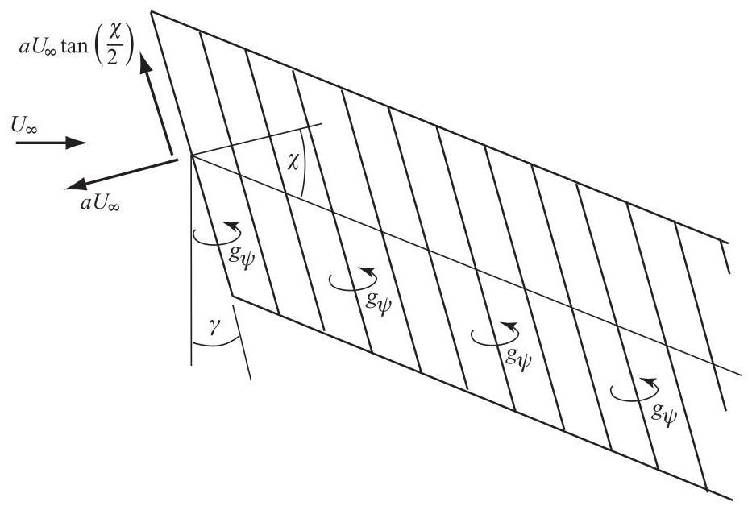

Figure 4.8 A yawed actuator disc and the skewed vortex cylinder wake

Figure 4.9 Average induced velocities caused by a yawed actuator disc

where ${U}_{D}$ is the resultant velocity at the disc.

Subtracting the two Equations to obtain the pressure drop across the disc

$$
{p}_{D}^{ + } - {p}_{D}^{ - } = \frac{1}{2}\rho {U}_{\infty }^{2}{4a}\left( {\cos \gamma  + \tan \frac{\chi }{2}\sin \gamma  - a{\sec }^{2}\frac{\chi }{2}}\right)
$$

The coefficient of thrust on the disc is therefore,

$$
{C}_{T} = {4a}\left( {\cos \gamma  + \tan \frac{\chi }{2}\sin \gamma  - a{\sec }^{2}\frac{\chi }{2}}\right) \tag{4.24}
$$

and the power coefficient is

$$
{C}_{P} = {4a}\left( {\cos \gamma  - a}\right) \left( {\cos \gamma  + \tan \frac{\chi }{2}\sin \gamma  - a{\sec }^{2}\frac{\chi }{2}}\right) \tag{4.25}
$$

In a similar manner to the Glauert theory, it is not clear how much of the thrust in Equation 4.24 is capable of extracting energy from the flow and so the expression for power in Equation 4.25 will probably be an over estimate. A comparison of the maximum ${C}_{P}$ values derived from the three theories, as a function of the yaw angle, is shown in Figure 4.10.

#### 4.2.4 Flow expansion

The induced velocity component parallel to the skewed axis of the wake is uniform over the disc with a value $a{U}_{\infty }$ , as can be deduced from Figure 4.9. The induced horizontal velocity, normal to the skewed axis of the wake is also uniform over the area of the disc with a value $a{U}_{\infty }\tan \left( {\chi /2}\right)$ .

In addition to the uniform induced velocities of Figure 4.9 the expansion of the flow gives rise to velocities in the $y$ and $z$ directions, respectively (i.e. directions in a vertical plane at the skew angle $\chi$ to the rotor plane, see Figure 4.11). When resolved into the rotor plane the flow expansion velocities will give rise to a normal induced velocity of the type predicted by Glauert in Equation 4.21. Note that the positive direction for $u$ (and ${u}^{\prime \prime }$ ) is now defined as downwind (see Figure 4.11), whereas it was upwind in Section 4.2.2.

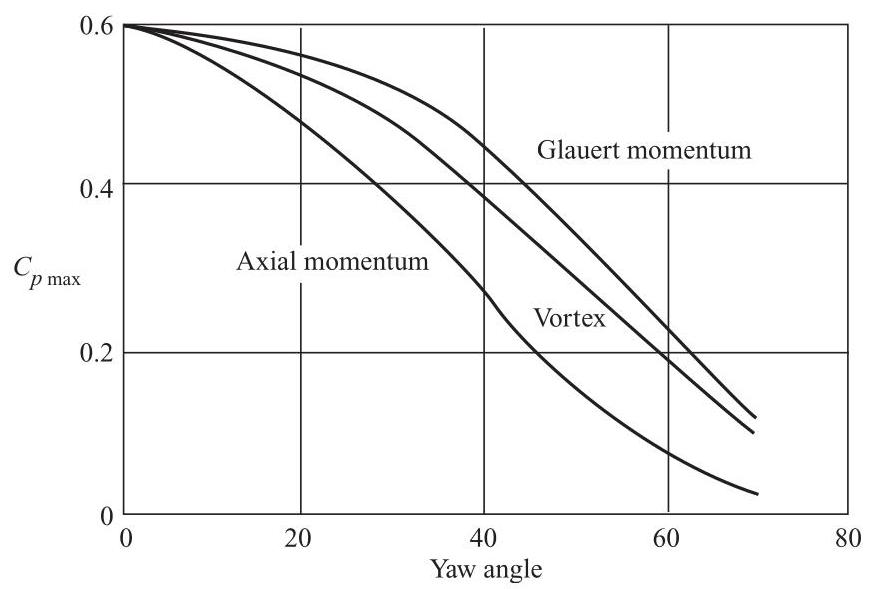

Figure 4.10 Maximum power coefficient variation with yaw angle, comparison of momentum and vortex theories

At a point on the disc at radius $r$ and azimuth angle $\psi$ , defined in Figure 4.11, the induced flow expansion velocities are non-simple functions of $r$ and $\psi$ . Across the horizontal diameter, where $\psi  =  \pm  {90}^{ \circ  }$ , Coleman et al. obtained an analytical solution for the flow expansion velocity in the $y$ direction that involves complete elliptic integrals: the solution is not very practicable because numerical evaluation requires calculating the difference between two large numbers. Simplification of the analytical solution leads to the following expression for the horizontal flow expansion velocity which removes the evaluation difficulty but it is not in closed form:

$$
v\left( {\chi ,\psi ,\mu }\right)  = \frac{-{2a}{U}_{\infty }\mu \sin \psi }{\pi }{\int }_{0}^{\frac{\pi }{2}}\frac{{\sin }^{2}{2\varepsilon }}{\sqrt{{\left( 1 + \mu \right) }^{2} - {4\mu }{\sin }^{2}\varepsilon }}\frac{1}{{\left( \mu  + \cos 2\varepsilon \right) }^{2}{\cos }^{2}\chi  + {\sin }^{2}{2\varepsilon }}{d\varepsilon }
$$

(4.26)

Figure 4.11 Axis system for a yawed rotor

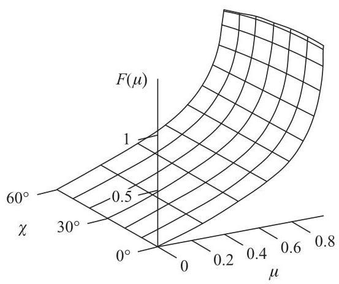

Figure 4.12 Flow expansion function variation with radial position and skew angle

where $\mu  = r/R,\varepsilon$ is a parameter arising from the elliptic integrals, which is eliminated from the function by the definite integral, and $a{U}_{\infty }$ is the average induced velocity as previously defined. An important feature of Equation 4.26 is that the flow expansion velocity is proportional to the average axial flow induction factor. Furthermore, if Equation 4.26 is divided by ${\sec }^{2}\left( {\chi /2}\right)$ the result is almost independent of the skew angle $\chi$ and is as shown in Figure 4.12, which clearly demonstrates how little it changes over a range of skew angle of ${0}^{ \circ  } - {60}^{ \circ  }$ .

At all skew angles the value of the flow expansion function is infinite at the edge of the rotor disc, indicating a singularity in the flow which, of course, does not occur in practice but is a result of assuming uniform blade circulation. Circulation must fall to zero at the disc edge in a smooth fashion.

No analytical expressions for the flow expansion velocity components for values of $\psi$ other than $\pm  {90}^{ \circ  }$ were developed by Coleman et al. but numerical evaluations of the flow expansion velocities can be made using the Biot-Savart law.

The radial variation of the vertical flow expansion velocity across the vertical diameter of the rotor disc is much the same as $F\left( \mu \right)$ for skew angles between $\pm  {45}^{ \circ  }$ but outside of this range the vertical velocity increases more sharply than the horizontal velocity at the disc edge. As will be shown, the vertical expansion velocity is of less importance than the horizontal velocity in determining the aerodynamic behaviour of the yawed rotor.

The variation of the horizontal and vertical flow expansion velocities along radial lines on the rotor disc surface at varying azimuth angles (a radius sweeping out the disc surface as it rotates about the yawed rotor axis) shows that some further simplifications can be made for small skew angles.

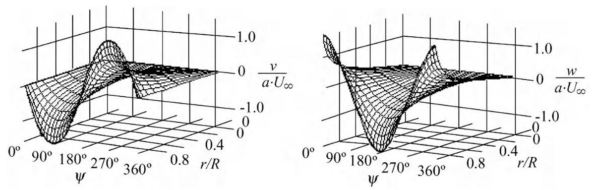

Figure 4.13 Azimuthal and radial variation of horizontal $\left( v\right)$ and vertical $\left( w\right)$ velocities on the rotor plane for a skew angle of ${30}^{ \circ  }$

Figure 4.13 shows the variation of the flow expansion velocities across the rotor disc for a skew angle of ${30}^{ \circ  }$ . It should be emphasised that the velocity components lie in planes that are normal to the skewed axis of the wake. Inspection of the variations leads to simple approximations for the two velocity components.

$$
v\left( {\chi ,\psi ,\mu }\right)  =  - a{U}_{\infty }F\left( \mu \right) \sin \psi \tag{4.27}
$$

$$
w\left( {\chi ,\psi ,\mu }\right)  = a{U}_{\infty }F\left( \mu \right) \cos \psi \tag{4.28}
$$

where

$$
F\left( \mu \right)  = \frac{2\mu }{\pi }{\int }_{0}^{\frac{\pi }{2}}\frac{{\sin }^{2}{2\varepsilon }}{\sqrt{{\left( 1 + \mu \right) }^{2} - {4\mu }{\sin }^{2}\varepsilon }}\frac{1}{{\left( \mu  + \cos 2\varepsilon \right) }^{2}{\cos }^{2}\chi  + {\sin }^{2}{2\varepsilon }}{d\varepsilon } \tag{4.29}
$$

The drawback of Equations 4.27 and 4.28 is the singularity in the flow expansion function Equation 4.29 at the outer edge of the disc. If the actuator disc is replaced with rotor which has a small number of blades then the flow expansion function changes very significantly. Conducting a calculation using the Biot-Savart law for a non-yawed, single bladed rotor represented by a lifting line vortex of radially uniform strength the flow expansion function can be determined numerically. It is found that the flow expansion velocity along the radial lifting line is a function of the helix (flow) angle of the discrete line vortex shed from the tip of the lifting line (blade). The vortex wake is assumed to be rigid in that the helix angle and the wake diameter are fixed everywhere at the values that pertain at the rotor. The solutions for a single blade rotor can be used to determine the flow fields for multi-blade rotors by a simple process of superposition. The resulting flow expansion functions $F{\left( \mu \right) }_{N}$ are depicted in Figure 4.14 for one-, two- and three-blade rotors.

The radial variations in Figure 4.14 have been extended beyond the rotor radius to show the continuity which exists for the discrete blade situation as compared with the singularity that occurs for the actuator disc. There are two striking features of the flow expansion functions of Figure 4.14: the function is heavily modified by the value of the helix angle ${\phi }_{t}$ , at which the tip vortex is shed from the blade tips, and the negative values (flow contraction) that can occur for the single-blade rotor.

Figure 4.14 Flow expansion functions for one-, two- and three-blade rotors by lifting line theory

An analytical expression that approximates the form of the diagrams shown in Figure 4.14 for two- and three-bladed rotors is

$$
{F}_{a}\left( {\mu ,{\phi }_{t}, B}\right)  = \frac{F\left( \mu \right) }{\sqrt{1 + {50}\frac{{\tan }^{2}{\phi }_{t}}{{B}^{2}}\left( {\frac{1}{\tan {\phi }_{t}} + 8}\right) F{\left( \mu \right) }^{2}\left\lbrack  {\mu \left( {2 - \mu }\right) F\left( \mu \right) }\right\rbrack  \frac{0.05}{\tan {\phi }_{t}}}} \tag{4.30}
$$

where $\tan {\phi }_{t} = \left( {1 - a}\right) /\left( {\lambda \left( {1 + {a}^{\prime }}\right) }\right)$ is the tangent of the flow angle. The results of Equation 4.30 are shown in Figure 4.15 for two and three blade rotors.

When transformed as components of velocity with respect to axes rotating about the rotor axis $\left( {{x}^{\prime \prime },{y}^{\prime \prime }}\right.$ and ${z}^{\prime \prime }$ axes as shown in Figure 4.11), the flow expansion velocities of Equations 4.27 and 4.28 are resolved into the components that are normal and tangential to the blade element (see Figure 4.18).

The normal component is

$$
{u}^{\prime \prime } =  - a{U}_{\infty }\left( {1 + 2\sin \psi \tan \frac{\chi }{2}F\left( \mu \right) }\right) \tag{4.31}
$$

and the tangential component is

$$
{v}^{\prime \prime } = a{U}_{\infty }\cos \psi \tan \frac{\chi }{2}\left( {1 + 2\sin \psi \tan \frac{\chi }{2}F\left( \mu \right) }\right) \tag{4.32}
$$

to which must be added the components of the wind velocity ${U}_{\infty }$ the normal component

$$
{U}^{\prime \prime } = {U}_{\infty }\cos \gamma \tag{4.33}
$$

and the tangential component

$$
{V}^{\prime \prime } = {U}_{\infty }\cos \psi \sin \gamma \tag{4.34}
$$

Figure 4.15 Approximate flow expansion functions for two- and three-blade rotors $\left( {k = \tan {\phi }_{t}}\right)$

There is a radial (span-wise) velocity component but this will not influence the angle of attack so can be ignored.

Clearly, from Equation 4.31, the Coleman theory determines the influence of skew angle (the factor $K$ in Equation 4.21) as being

$$
K\left( \chi \right)  = 2\tan \frac{\chi }{2} \tag{4.35}
$$

In addition there is the tangential velocity ${\Omega r}$ caused by blade rotation and also the induced wake rotation, but the latter will be ignored initially.

The velocities of Equations 4.31-4.34 will produce a lower angle of attack when the azimuth angle $\psi$ is positive, see Figure 4.16, than when it is negative and so the angle of attack will vary cyclically. When $\psi$ is positive the incident flow velocity lies closer to the radial axis of the blade than when $\psi$ is negative. The difference in angle of attack can be attributed to flow expansion as depicted in Figure 4.16.

The variation of the angle of attack makes the flow about a blade aerofoil unsteady and so the lift will have a response of the kind discussed in Section 4.4. The blade circulation will, therefore, vary during the course of a revolution, which means that the vortex model is incomplete because it is derived from the assumption that the circulation is constant.

There is clearly additional vorticity in the wake being shed from the blades' trailing edges influencing the induced velocity, which is not accounted for in the theory. The additional induced velocity would be cyclic so would probably not affect the average induced velocity normal to the rotor disc but would affect the amplitude and phasing of the angle of attack.

Further numerical analysis of the Coleman vortex theory reveals that at skew angles greater than $\pm  {45}^{ \circ  }$ higher harmonics than just the one per revolution term in Equation 4.21 become significant in the flow expansion induced velocities. Only odd harmonics are present, reflecting the anti-symmetry about the yaw axis.

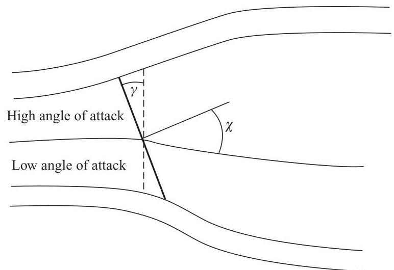

Figure 4.16 Flow expansion causes a differential angle of attack

#### 4.2.5 Related theories

A number of refinements to the Glauert and Coleman theories have been proposed by other researchers: mostly addressing helicopter aerodynamics but some have been directed specifically at wind turbines. In particular, Øye (1992) undertook the same analysis as Coleman and proposed a simple curve-fit to Equation 4.29

$$
{F}_{\varnothing }\left( \mu \right)  = \frac{1}{2}\left( {\mu  + {0.4}{\mu }^{3} + {0.4}{\mu }^{5}}\right) \tag{4.36}
$$

See Figure 4.17. $\varnothing$ ye has clearly avoided the very large values that Equation 4.29 produces close to the outer edge of the disc and Equation 4.36 is in general accordance with the flow expansion functions shown in Figure 4.14.

Meijer Drees (1949) has extended the Coleman et al. vortex model to include a cosinusoidal variation of blade circulation. The main result is a modification to the function $K\left( \chi \right)$ but Meijer Drees retained Glauert's assumption of linear variation of normal induced velocity with radius

$$
{u}^{\prime \prime } =  - a{U}_{\infty }\left\lbrack  {1 + \frac{4}{3}\mu \left( {1 - {1.8}{\left( \frac{\sin \gamma }{\lambda }\right) }^{2}}\right) \sin \psi \tan \frac{\chi }{2}}\right\rbrack \tag{4.37}
$$

(see Schepers and Snel, 1995).

#### 4.2.6 Wake rotation for a turbine rotor in steady yaw

Wake rotation is, of course, present in the wake flow but cannot be related only to the torque. The vortex theory needs also to include a root vortex, which will lie in the wake along the skewed wake axis. The rotation in the wake will, therefore, be about the skewed wake axis and not about the axis of rotation, and the wake rotation velocity will lie in a plane normal to the skewed wake axis.

To determine the wake rotation velocity the rate of change of angular momentum about skewed wake axis will be equated to the moment about the axis produced by blade forces.

If the wake rotation velocity is described, as before, in terms of the angular velocity of the rotor then

$$
{v}^{\prime \prime \prime } = \Omega {r}^{\prime \prime \prime }{a}^{\prime }h\left( \psi \right) \tag{4.38}
$$

where the triple prime denotes an axis system rotating about the wake axis and $h\left( \psi \right)$ is a function which determines the intensity of the root vortex's influence. In the non-yawed case the root vortex induces a velocity at the rotor which is half of that it induces in the far wake at the same radial distance and the same would apply to a disc normal to the skewed axis with a centre located at the same position as the actual rotor disc. The distance upstream or downstream of a point on actual rotor disc from the plane of the disc normal to the wake axis determines the value of root vortex influence function $h\left( \psi \right)$ . The value of $h\left( \psi \right)$ will lie between 0.0 and 2.0, being equal to 1.0 at points on the vertical diameter.

The velocity induced by a semi-infinite line vortex of strength $\Gamma$ lying along the x-axis from zero to infinity at a point with cylindrical co-ordinates $\left( {{x}^{\prime \prime \prime },{\psi }^{\prime \prime \prime },{r}^{\prime \prime \prime }}\right)$ is, using the Biot-Savart law,

$$
{\overrightarrow{V}}^{\prime \prime \prime } = \frac{\Gamma }{{4\pi }{r}^{\prime \prime \prime }}\left\lbrack  \begin{matrix} 0 \\  1 + \frac{{x}^{\prime \prime \prime }}{\sqrt{{x}^{\prime \prime \prime 2} + {r}^{\prime \prime \prime 2}}} \\  0 \end{matrix}\right\rbrack   = \left\lbrack  \begin{matrix} 0 \\  {v}^{\prime \prime \prime } \\  0 \end{matrix}\right\rbrack \tag{4.39}
$$

The induced velocity when ${x}^{\prime \prime \prime } = \infty$ is twice that when ${x}^{\prime \prime \prime } = 0$ and is zero when ${x}^{\prime \prime \prime } =  - \infty$ .

For a point on the rotor disc $\left( {0,\psi , r}\right)$ the corresponding co-ordinates $\left( {{x}^{\prime \prime \prime },{\psi }^{\prime \prime \prime },{r}^{\prime \prime \prime }}\right)$ in the wake cylindrical co-ordinate system are

$$
{x}^{\prime \prime \prime } =  - {y}^{\prime }\sin \chi  = r\sin {\psi }^{\prime \prime \prime }\sin \chi ,{r}^{\prime \prime \prime } = r\sqrt{{\cos }^{2}\psi  + {\cos }^{2}\chi {\sin }^{2}\psi }
$$

$$
\text{ and }\cos {\psi }^{\prime \prime \prime } = \frac{r}{{r}^{\prime \prime \prime }}\cos \psi ,\sin {\psi }^{\prime \prime \prime } = \frac{r}{{r}^{\prime \prime \prime }}\sin \psi \cos \chi \tag{4.40}
$$

Hence, substituting ${4\pi }{r}^{\prime \prime \prime 2}\Omega {a}^{\prime }$ for the circulation (Equation 3.33) the induced velocity at the same point is

$$
{v}^{\prime \prime \prime } = \Omega {r}^{\prime \prime \prime }{a}^{\prime }\left( {1 + \frac{{x}^{\prime \prime \prime }}{\sqrt{{x}^{\prime \prime \prime 2} + {r}^{\prime \prime \prime 2}}}}\right) \tag{4.41}
$$

So, transforming the velocity of Equation 4.39 to the rotating axes in the plane of the rotor disc

$$
{\overrightarrow{V}}^{\prime \prime } = \left\lbrack  \begin{matrix} 1 & 0 & 0 \\  0 & \cos \psi & \sin \psi \\  0 &  - \sin \psi & \cos \psi  \end{matrix}\right\rbrack  \left\lbrack  \begin{matrix} \cos \chi & \sin \chi & 0 \\   - \sin \chi & \sin \chi & 0 \\  0 & 0 & 1 \end{matrix}\right\rbrack  \left\lbrack  \begin{matrix} 1 & 0 & 0 \\  0 & \cos {\psi }^{\prime \prime \prime } &  - \sin {\psi }^{\prime \prime \prime } \\  0 & \sin {\psi }^{\prime \prime \prime } & \cos {\psi }^{\prime \prime \prime } \end{matrix}\right\rbrack  \left\lbrack  \begin{matrix} 0 \\  {v}^{\prime \prime \prime } \\  0 \end{matrix}\right\rbrack
$$

(4.42)

Figure 4.17 Øye's curve-fit to Coleman's flow expansion function

Substituting Equations 4.40 and 4.41 into Equation 4.42 gives

$$
{\overrightarrow{V}}^{\prime \prime } = \left\lbrack  \begin{matrix} \cos \psi \sin \chi \\  \cos \chi \\  0 \end{matrix}\right\rbrack  {\Omega r}{a}^{\prime }\left( {1 + \sin \psi \sin \chi }\right) \tag{4.43}
$$

Thus, the wake rotation produces two velocity components, one in the rotor plane and one normal to the rotor plane; there is no radial component.

#### 4.2.7 The blade element theory for a turbine rotor in steady yaw

There is doubt about the applicability of the blade element theory in the case of a yawed turbine because the flow, local to a blade element, is unsteady and because the theory representing the vortex half of the equation, which replaces the momentum theory, is incomplete in this respect. However, it is not clear how large or significant are the unsteady forces. In a steady yawed condition the flow velocities at a point on the rotor disc do not change with time, if an infinity of blades is assumed, and so there is no effect to consider. However, the change of angle of attack with time at a point on the blade does mean that the two dimensional lift force should really be modified by a lift deficiency function similar to that determined by Theodorsen (14) for the rectilinear wake of a sinusoidally pitching aerofoil.

Neglecting the effects of shed vorticity the net velocities in the plane of a local blade element are shown in Figure 4.18. The radial (span-wise) velocity component is not shown in Figure 4.18 but it is neglected as it is not considered to have any influence on the angle of attack and, therefore, on the lift force.

The flow angle $\phi$ is then determined by the components of velocity shown in Figure 4.18.

$\tan \phi$

$$
= \frac{{U}_{\infty }\left( {\cos \gamma  - a\left( {1 + F\left( \mu \right) K\left( \chi \right) \sin \psi }\right) }\right)  + {\Omega r}{a}^{\prime }\cos \psi \sin \chi \left( {1 + \sin \psi \sin \chi }\right) }{{\Omega r}\left( {1 + {a}^{\prime }\cos \chi \left( {1 + \sin \psi \sin \chi }\right) }\right)  + {U}_{\infty }\cos \psi \left( {a \cdot  \tan \frac{\chi }{2}\left( {1 + F\left( \mu \right) K\left( \chi \right) \sin \psi }\right)  - \sin \gamma }\right) }
$$

(4.44)

where $\mu  = r/R$ is measured radially from the axis of rotor rotation.

$$
{\Omega r}\left( {1 + {a}^{\prime }\cos \chi \left( {1 + \sin \psi \sin \chi }\right) }\right)
$$

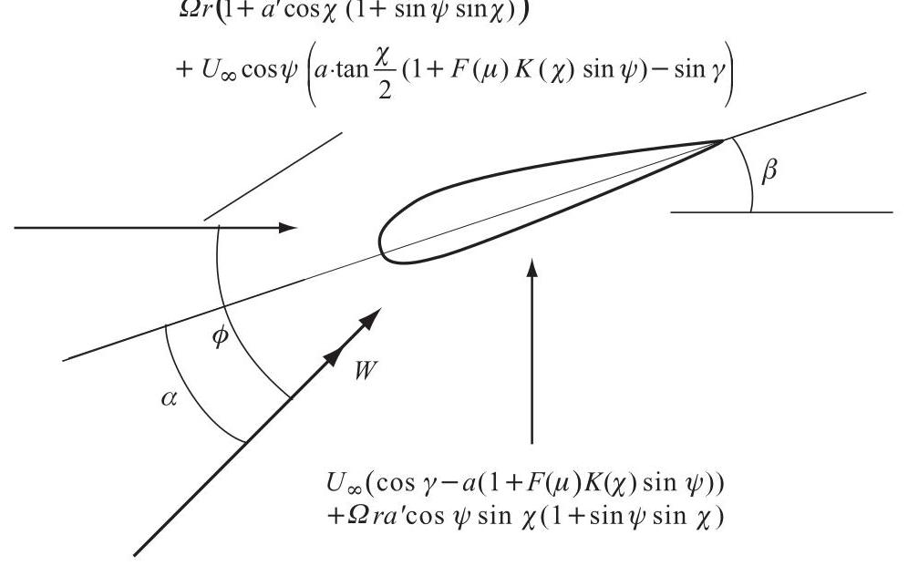

Figure 4.18 The velocity components in the plane of a blade cross-section

The angle of attack $\alpha$ is found from

$$
\alpha  = \phi  - \beta \tag{4.45}
$$

Lift and drag coefficients taken from two dimensional experimental data, just as for the non-yawed case, are determined from the angle of attack calculation for each blade element (each combination of $\mu$ and $\psi$ ).

#### 4.2.8 The blade element - momentum theory for a rotor in steady yaw

The forces on a blade element can be determined via Equations 4.44 and 4.45 for given values of the flow induction factors.

The thrust force will be calculated using Equation 3.46 in Section 3.5.3, which is for a complete annular ring of radius $r$ and radial thickness ${\delta r}$ .

$$
{\delta T} = {\delta L}\cos \phi  + {\delta D}\sin \phi  = \frac{1}{2}\rho {W}^{2}{Bc}\left( {{C}_{l}\cos \phi  + {C}_{d}\sin \phi }\right) {\delta r} \tag{3.46}
$$

For an elemental area of the annular ring swept out as the rotor turns through an angle ${\delta \psi }$ the proportion of the force is

$$
\delta {T}_{b} = \frac{1}{2}\rho {W}^{2}{Bc}\left( {{C}_{l}\cos \phi  + {C}_{d}\sin \phi }\right) {\delta r}\frac{\delta \psi }{2\pi }
$$

then, putting ${C}_{x} = {C}_{l}\cos \phi  + {C}_{d}\sin \phi$ and ${\sigma }_{r} = {Bc}/{2\pi r}$

$$
\delta {T}_{b} = \frac{1}{2}\rho {W}^{2}{\sigma }_{r}{C}_{x}{r\delta r\delta \psi } \tag{4.46}
$$

The values of ${C}_{l}$ and ${C}_{d}$ should really include unsteady effects because of the ever changing blade circulation with azimuth angle which will depend upon the level of the reduced frequency of the circulation fluctuation.

If it is chosen to ignore drag, or use only that part of the drag attributable to pressure, then Equation 4.46 should be modified accordingly.

The rate of change of momentum will use either Equation 4.18, Glauert's theory, or Equation 4.24, the vortex cylinder theory: in both Equations the flow induction factor $a$ should be replaced by af to account for Prandtl tip-loss.

For Glauert's theory,

$$
\delta {T}_{m} = \frac{1}{2}\rho {U}_{\infty }^{2}{4af}\sqrt{1 - {af}\left( {2\cos \gamma  - {af}}\right) }{r\delta \psi \delta r} \tag{4.47a}
$$

Or, for the vortex theory,

$$
\delta {T}_{m} = \frac{1}{2}\rho {U}_{\infty }^{2}{4af}\left( {\cos \gamma  + \tan \frac{\chi }{2}\sin \gamma  - {af}{\sec }^{2}\frac{\chi }{2}}\right) {r\delta \psi \delta r} \tag{4.47b}
$$

The algebraic complexity of estimating the wake rotation velocities is great and even then fluctuation of bound circulation is ignored. The drop in pressure caused by wake rotation, however, is shown to be small in the non-yawed case and so it is assumed that it can safely be ignored in the yawed case.

The moment of the blade element force about the wake axis is

$$
\delta {M}_{b} = \frac{1}{2}\rho {W}^{2}{Bc}\left( {{C}_{y}\cos \chi  - {C}_{x}\cos \psi \sin \chi }\right) {r\delta r}\frac{\delta \psi }{2\pi }
$$

where

$$
{C}_{y} = {C}_{l}\sin \phi  - {C}_{d}\cos \phi
$$

therefore

$$
\delta {M}_{b} = \frac{1}{2}\rho {W}^{2}{\sigma }_{r}\left( {{C}_{y}\cos \chi  - {C}_{x}\cos \psi \sin \chi }\right) {r}^{2}{\delta r\delta \psi } \tag{4.48}
$$

The rate of change of angular momentum is the mass flow rate through an elemental area of the disc times the tangential velocity times radius.

$$
\delta {M}_{m} = \rho {U}_{\infty }\left( {\cos \gamma  - {af}}\right) {r\delta \psi \delta r2}{a}^{\prime }{f\Omega }{r}^{\prime \prime \prime 2}
$$

where

$$
{r}^{\prime \prime \prime 2} = {r}^{2}\left( {{\cos }^{2}\psi  + {\cos }^{2}\chi {\sin }^{2}\psi }\right)
$$

therefore,

$$
\delta {M}_{m} = \frac{1}{2}\rho {U}_{\infty }^{2}{\lambda \mu 4}{a}^{\prime }f\left( {\cos \gamma  - {af}}\right) \left( {{\cos }^{2}\psi  + {\cos }^{2}\chi {\sin }^{2}\psi }\right) {r}^{2}{\delta r\delta \psi } \tag{4.49}
$$

The momentum theory, as developed, applies only to the whole rotor disc where the flow induction factor $a$ is the average value for the disc. However, it may be argued that it is better to apply the momentum equations to an annular ring, as in the non-yawed case, to determine a distribution of the flow induction factors varying with radius, reflecting radial variation of circulation. Certainly, for the angular momentum case the tangential flow factor ${a}^{\prime }$ will not vary with azimuth position because it is generated by the root vortex and although, in fact, the axial flow factor $a$ does vary with azimuth angle it is consistent to use an annular average for this factor as well.

To find an average for an annular ring the elemental values of force and moment must be integrated around the ring.

For the axial momentum case, taking the vortex method as an example,

$$
{\int }_{0}^{2\pi }\frac{1}{2}\rho {U}_{\infty }^{2}{4af}\left( {\cos \gamma  + \tan \frac{\chi }{2}\sin \gamma  - {af}{\sec }^{2}\frac{\chi }{2}}\right) {\delta \psi rk\delta r} = {\sigma }_{r}{\int }_{0}^{2\pi }\frac{1}{2}\rho {W}^{2}{C}_{x}{\delta \psi r\delta r}
$$

Therefore,

$$
{8\pi af}\left( {\cos \gamma  + \tan \frac{\chi }{2}\sin \gamma  - {af}{\sec }^{2}\frac{\chi }{2}}\right)  = {\sigma }_{r}{\int }_{0}^{2\pi }\frac{{W}^{2}}{{U}_{\infty }^{2}}{C}_{x}{d\psi } \tag{4.50}
$$

The resultant velocity $W$ and the normal force coefficient ${C}_{x}$ are functions of $\psi$ .

And for the angular momentum case,

$$
{\int }_{0}^{2\pi }\frac{1}{2}\rho {U}_{\infty }^{2}{\lambda \mu 4}{a}^{\prime }f\left( {\cos \gamma  - {af}}\right) \left( {{\cos }^{2}\psi  + {\cos }^{2}\chi {\sin }^{2}\psi }\right) {d\psi }{r}^{2}{\delta r}
$$

$$
= {\sigma }_{r}{\int }_{0}^{2\pi }\frac{1}{2}\rho {W}^{2}\left( {{C}_{y}\cos \chi  - {C}_{x}\sin \chi \cos \psi }\right) {d\psi }{r}^{2}{\delta r}
$$

which reduces to

$$
4{a}^{\prime }f\left( {\cos \gamma  - {af}}\right) {\lambda \mu \pi }\left( {1 + {\cos }^{2}\chi }\right)
$$

$$
= {\sigma }_{r}{\int }_{0}^{2\pi }\frac{{W}^{2}}{{U}_{\infty }^{2}}\left( {{C}_{y}\cos \chi  - {C}_{x}\sin \chi \cos \psi }\right) {d\psi } \tag{4.51}
$$

The non-dimensionalised resultant velocity relative to a blade element is given by

$$
\frac{{W}^{2}}{{U}_{\infty }^{2}} = {\left\lbrack  \cos \gamma  - a + \lambda \mu {a}^{\prime }\sin \chi \cos \psi \left( 1 + \sin \chi \sin \psi \right) \right\rbrack  }^{2}
$$

$$
+ {\left\lbrack  \lambda \mu \left( 1 + {a}^{\prime }\cos \chi \left( 1 + \sin \chi \sin \psi \right) \right)  + \cos \psi \left( a.\tan \frac{\chi }{2} - \sin \gamma \right) \right\rbrack  }^{2} \tag{4.52}
$$

Note that the flow expansion terms, those terms that involve $F\left( \mu \right) K\left( \chi \right)$ , have been excluded from the velocity components in Equation 4.52 because flow expansion is not present in the wake and so there is no associated momentum change. The blade force, which arises from the flow expansion velocity, is balanced in the wake by pressure forces acting on the sides of the stream-tubes, which have a stream-wise component because the stream-tubes are expanding.

Equations 4.50 and 4.51 can be solved by iteration, the integrals being determined numerically. Initial values are chosen for $a$ and ${a}^{\prime }$ , usually zero. For a given blade geometry, at each blade element position $\mu$ and at each blade azimuth position $\psi$ , the flow angle $\phi$ is calculated from Equation 4.44, suitably modified to remove the flow expansion velocity, in accordance with Equation 4.52. Then, knowing the blade pitch angle $\beta$ at the blade element, the local angle of attack can be found. Lift and drag coefficients are obtained from tabulated aerofoil data. Once an annular ring (constant $\mu$ ) has been completed the integrals are calculated. The new value of axial flow factor $a$ is determined from Equation 4.50 and then the tangential flow factor ${a}^{\prime }$ is found from Equation 4.51. Iteration proceeds for the same annular ring until a satisfactory convergence is achieved before moving to the next annular ring (value of $\mu$ ).

Although the theory supports only the determination of azimuthally averaged values of the axial flow induced velocity, once the averaged tangential flow induction factors have been calculated the elemental form of the momentum equations (Equation 4.47) and the blade element forces (Equation 4.46) can be employed to yield values of $a$ which vary with azimuth.

For the determination of blade forces the flow expansion velocities must be included. The total velocity components, normal and tangential to a blade element, are then as shown in Figure 4.18 and the resultant velocity is

$$
\frac{{W}^{2}}{{U}_{\infty }^{2}} = {\left\lbrack  \cos \gamma  - a\left( 1 + F\left( \mu \right) K\left( \chi \right) \sin \psi \right)  + \lambda \mu {a}^{\prime }\sin \chi \cos \psi \left( 1 + \sin \chi \sin \psi \right) \right\rbrack  }^{2}
$$

$$
+ \left\lbrack  {{\lambda \mu }\left( {1 + {a}^{\prime }\cos \chi \left( {1 + \sin \chi \sin \psi }\right) }\right) }\right. \tag{4.52a}
$$

$$
{\left. +\cos \psi \left( a \cdot  \tan \frac{\chi }{2}\left( 1 + F\left( \mu \right) K\left( \chi \right) \sin \psi \right)  - \sin \gamma \right) \right\rbrack  }^{2}
$$

#### 4.2.9 Calculated values of induced velocity

The measurement of the induced velocities of a wind turbine rotor in yaw has been undertaken at Delft University of Technology, (Schepers and Snel, 1995). The tests were carried out using a small wind tunnel model so that a steady yaw could be maintained in a steady wind with no tower shadow and no wind shear. The rotor had two blades of ${1.2}\mathrm{\;m}$ diameter which were twisted but had a uniform chord length of ${80}\mathrm{\;{mm}}$ . The blade root was at a radius of ${180}\mathrm{\;{mm}}$ and the blade twist was ${9}^{ \circ  }$ at the root varying linearly with radius to ${4}^{ \circ  }$ at ${540}\mathrm{\;{mm}}$ radius and remaining at ${4}^{ \circ  }$ from there to the tip. The blade aerofoil profile was NACA 0012. The rotor speed was kept constant at 720 rev/minute and the wind speed was held constant at ${6.0}\mathrm{\;m}/\mathrm{s}$ . Tests were carried out at ${10}^{ \circ  },{20}^{ \circ  }$ and ${30}^{ \circ  }$ of yaw angle.

Calculated induced velocities using the momentum equations for the Delft turbine are shown in Figure 4.19: these are the average values for each annulus obtained using Equations 4.50 and 4.51.

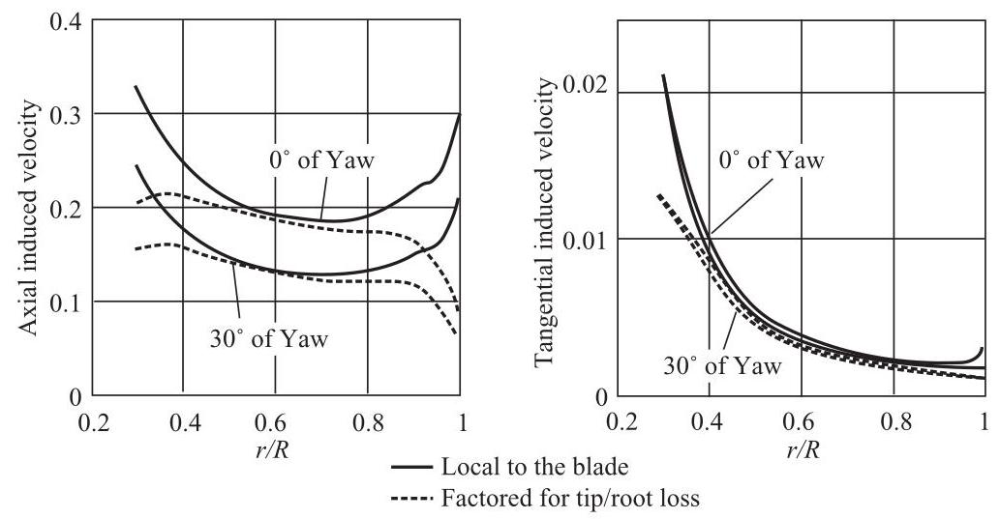

Figure 4.19 Azimuthally averaged induced velocity factors for the Delft turbine

The component velocities at each blade element, as defined in Figure 4.18, are shown in Figure 4.20. Because of the rotational speed of the blades the tangential velocity is much greater than the normal velocity but it is the latter which most influences the variation in angle of attack at the important, outboard sections of the blades, shown in Figure 4.21.

At the inboard sections of the blades it is the variation in tangential velocity which mostly influences the angle of attack variation and this is largely as a result of the changing geometry with azimuth angle rather than the effect of induced velocity.

#### 4.2.10 Blade forces for a rotor in steady yaw

Once the flow induction factors have been determined blade forces can then be calculated. Although the flow expansion velocity is excluded from the determination of the flow induction factors, on the grounds that the consequent blade forces do not cause any change in the momentum of the flow because flow expansion is not present in the developed wake, it must be included when the blade forces are calculated. The flow expansion velocity should be dependent on an overall average value of the axial flow induction factor but it is more convenient to use the annular average value as determined by Equation 4.50.

Figure 4.20 Component velocities, normalised with wind speed, at ${30}^{ \circ  }$ of yaw

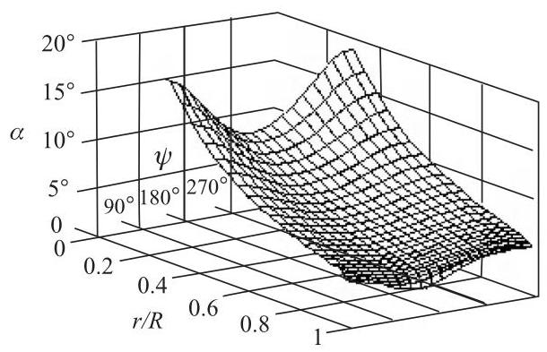

Figure 4.21 Angle of attack variation at ${30}^{ \circ  }$ of yaw

The flow angle and the angle of attack need to be determined anew at each blade element position $\mu$ and at each blade azimuth position $\theta$ because the flow expansion velocity must now be included, so Equation 4.44 is used in its unmodified form. Drag must also be included in the determination of forces even if it was not in the calculation of the induced velocities.

The blade force per unit span normal to the plane of rotation is

$$
\frac{d{F}_{x}}{dr} = \frac{1}{2}\rho {W}^{2}c{C}_{x} \tag{4.53}
$$

which will vary with the azimuth position of the blade. The total force normal to the rotor plane can be obtained by integrating Equation 4.53 along the blade length for each of the blades, taking account of their azimuthal separation, and summing the results. The total normal force will also vary with rotor azimuth.

Similarly, the tangential blade force per unit span is

$$
\frac{d{F}_{y}}{dr} = \frac{1}{2}\rho {W}^{2}c{C}_{y}
$$

and the blade torque contribution about the axis of rotation is

$$
\frac{dQ}{dr} = \frac{1}{2}\rho {W}^{2}\operatorname{cr}{C}_{y} \tag{4.54}
$$

The total torque is found by integrating along each blade and summing over all the blades, just as for the normal force. Again, the torque on the rotor will vary with azimuth position so to find the average torque will require a further integration with respect to azimuth.

#### 4.2.11 Yawing and tilting moments in steady yaw

The asymmetry of the flow through a yawed rotor, caused by the flow expansion, means that a blade sweeping upwind has a higher angle of attack than when it is sweeping downwind, as shown in Figure 4.16. The blade lift upwind will, therefore, be greater than the lift downwind and a similar differential applies to the forces normal to the rotor plane. It can be seen, therefore, that there is a net moment about the yaw (vertical axis) in a direction which will tend to restore the rotor axis to a position aligned with the wind direction. The yawing moment is obtained from the normal force of Equation 4.53

$$
\frac{d{M}_{z}}{dr} = \frac{1}{2}\rho {W}^{2}\operatorname{cr}{C}_{x}\sin \psi \tag{4.55}
$$

Figure 4.22 Measured yaw moments on the Delft turbine

which will also vary with the azimuth position of the blade. The total single-blade yawing moment at each azimuth position is obtained by integrating Equation 4.55 along the length of the blade. Summing the moments for all blades, suitably separated in phase, will result in the yawing moment on the rotor.

A similar calculation can be made for the tilting moment, the moment about the horizontal diametral axis ( $y$ axis) of the rotor.

$$
\frac{d{M}_{y}}{dr} = \frac{1}{2}\rho {W}^{2}\operatorname{cr}{C}_{x}\cos \psi \tag{4.56}
$$

The existence of yawing and tilting moments predicted by the blade element theory is inconsistent with the momentum and vortex theories because they predict only a uniform pressure distribution on the rotor disc. Actually, the momentum and vortex theories predict velocities from which it is only possible to deduce a uniform pressure distribution.

Measured results of rotor yaw moment for the Delft turbine are shown in Figure 4.22 and the corresponding calculated yawing moments are shown in Figure 4.23.

Figure 4.23 Calculated yaw moments on the Delft turbine

The measured yawing moments were derived from strain gauge readings of the flat-wise bending strain close to the root of the blade at ${129}\mathrm{\;{mm}}$ radius. Flat-wise, or flap-wise bending causes only displacements normal to the rotor plane. The calculated yawing moments are determined at the same radial position on the blade and are, therefore, not the true yawing moments about the actual yaw axis.

The comparison between the measured and calculated yaw moments is quite good taking into account the limitations of the theory. At ${30}^{ \circ  }$ of yaw the calculated values underestimate the measurements significantly whereas at the two lower angles the correspondence is much closer.

It should be noted that the mean yawing moment is not zero and that the sign of the moment, being negative, means that it endeavours to restore the rotor axis to alignment with the wind direction.

The yawing moment comparison is a test of the usefulness of the theory developed in this section and it would seem that for general engineering purposes it passes the test.

The measured tilting moments (Figure 4.24) appear to be of about the amplitude for all three yaw angles whereas the calculated moments (Figure 4.25) increase with yaw angle.

For ${30}^{ \circ  }$ of yaw the magnitudes of the measured and calculated tilting moments are comparable. The measured mean tilting moment is quite definitely non-zero and positive but the calculated mean moment is much smaller although still positive. A positive tilt rotation would displace the upper part of the rotor disc in the downwind direction. In the theory the small mean tilting moment is caused by the wake rotation velocities.

A theory based upon computational fluid mechanics should provide a much more accurate prediction of the aerodynamics of a wind turbine in yaw. However, the severe computational time limitations associated with CFD solutions precludes their use in favour of the simple theory outlined in these pages.

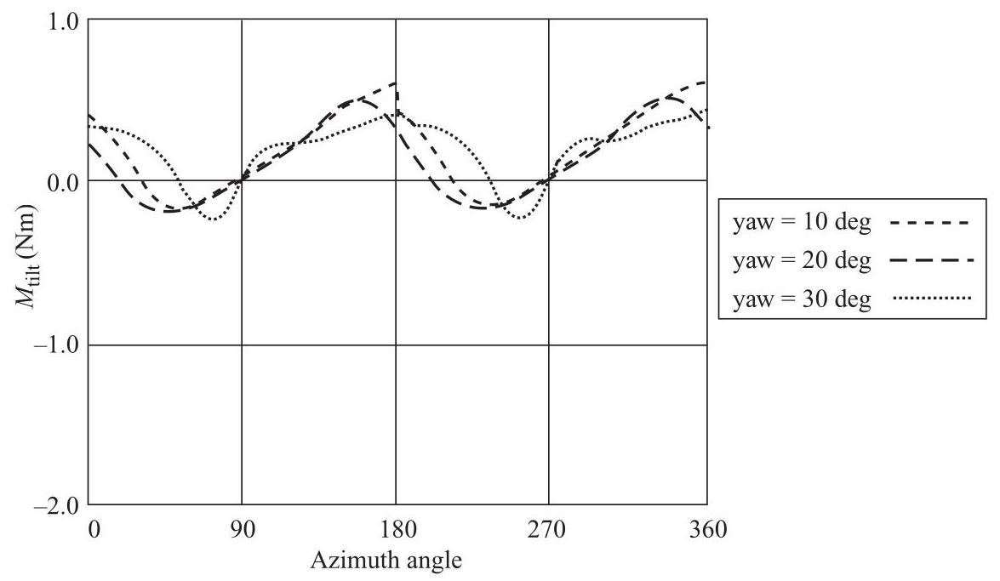

Figure 4.24 Measured tilt moments on the Delft turbine

### 4.3 The method of acceleration potential

#### 4.3.1 Introduction

An aerodynamic model that is applied to the flight performance of helicopter rotors, and which can also be applied to wind turbine rotors that are lightly loaded, is that based upon the idea of acceleration potential. The method allows distributions of the pressure drop across an actuator disc that are more general than the, strictly, uniform pressure distribution of the momentum theory. The model has been expounded by Kinner (1937), inspired by Prandtl, who has developed expressions for the pressure field in the vicinity of an actuator disc, treating it as a circular wing. To regard a rotor as a circular wing requires an infinity of very slender blades so that the solidity remains small.

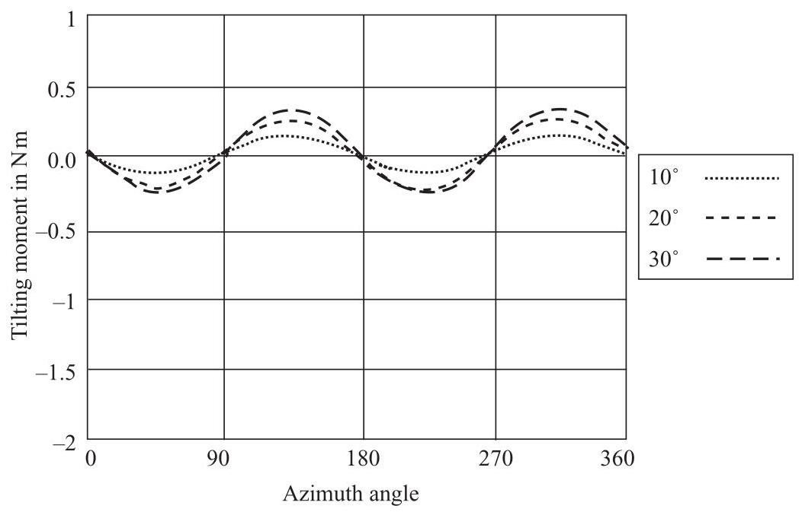

Figure 4.25 Calculated tilt moments on the Delft turbine

Kinner's theory, which is derived from the Euler Equations, assumes that the induced velocities are small compared with the general flow velocity. If $u, v$ and $w$ are the velocities induced by the actuator disc in the $x, y$ and $z$ directions, respectively, and which are very much smaller than the free-stream velocity in the $x$ direction ${U}_{\infty }$ , then the rate of change of momentum in the $x$ direction of a unit volume of air will be in response to the pressure gradient in that direction

$$
\rho \left( {\left( {{U}_{\infty } + u}\right) \frac{\partial \left( {{U}_{\infty } + u}\right) }{\partial x} + v\frac{\partial \left( {{U}_{\infty } + u}\right) }{\partial y} + w\frac{\partial \left( {{U}_{\infty } + u}\right) }{\partial z}}\right)  =  - \frac{\partial p}{\partial x} \tag{4.57}
$$

The free-stream velocity ${U}_{\infty }$ does not change with position, therefore, for example, $\partial {U}_{\infty }/\partial x = 0$ . Also, ${U}_{\infty } \gg  \left( {u, v, w}\right)$ and so, for example, $v\left( {\partial u/\partial y}\right)$ can be ignored in comparison with ${U}_{\infty }\left( {\partial u/\partial x}\right)$ . The momentum equation in the $\mathrm{x}$ direction then simplifies to

$$
\rho {U}_{\infty }\frac{\partial u}{\partial x} =  - \frac{\partial p}{\partial x} \tag{4.58a}
$$

Similarly, in the $y$ and $z$ directions, the momentum equations are also simplified

$$
\rho {U}_{\infty }\frac{\partial v}{\partial x} =  - \frac{\partial p}{\partial y} \tag{4.58b}
$$

and

$$
\rho {U}_{\infty }\frac{\partial w}{\partial x} =  - \frac{\partial p}{\partial z} \tag{4.58c}
$$

Differentiating each momentum equation with respect to its particular direction and adding together the results gives

$$
\rho {U}_{\infty }\frac{\partial }{\partial x}\left( {\frac{\partial u}{\partial x} + \frac{\partial v}{\partial y} + \frac{\partial w}{\partial z}}\right)  =  - \left( {\frac{{\partial }^{2}p}{\partial {x}^{2}} + \frac{{\partial }^{2}p}{\partial {y}^{2}} + \frac{{\partial }^{2}p}{\partial {z}^{2}}}\right)
$$

but, for continuity of the flow, $\left( {\partial u/\partial x + \partial v/\partial y + \partial w/\partial z}\right)  = 0$ ,

Therefore,

$$
\frac{{\partial }^{2}p}{\partial {x}^{2}} + \frac{{\partial }^{2}p}{\partial {y}^{2}} + \frac{{\partial }^{2}p}{\partial {z}^{2}} = 0 \tag{4.59}
$$

which is the Laplace Equation governing the pressure field on and surrounding the actuator disc. Given the boundary conditions at the actuator disc, Equation 4.59 can be solved for the pressure field and, in particular, the pressure distribution at the disc. The pressure is continuous everywhere except across the disc surfaces where there is the usual pressure discontinuity, or pressure drop, in the wind turbine case.

In Coleman's analysis the pressure drop distribution across the disc is uniform (it is only as a result of combining the theory with the blade element theory that a non-uniform pressure distribution can be achieved) but falls to zero, abruptly, at the disc edge. Kinner assumes that the pressure drop is zero at the disc edge and changes in a continuous manner as radius decreases.

The simplified Euler Equations 4.58 allow pressure to be regarded as the potential field from which the acceleration field can be obtained, by differentiation, and thence the velocity field, by integration. Commencing upstream where the known free-stream conditions apply the velocity components can be determined by progressive integration towards the disc.

The pressure discontinuity across the rotor disc will be as shown in Figure 3.2, Chapter 3. The magnitude of the step in pressure will be twice the pressure level (above the far field level) that occurs just upstream of the disc. The pressure gradient, however, normal to the rotor disc, will be continuous.

#### 4.3.2 The general pressure distribution theory of Kinner

Kinner's solution (1937) of Equation 4.59 is mathematically complex and is achieved by means of a co-ordinate transformation. The Cartesian co-ordinates centred in the rotor plane $\left( {{x}^{\prime \prime },{y}^{\prime }, z}\right)$ , as defined in Figure 4.11, are transformed to, what is termed, an ellipsoidal coordinate system $\left( {v,\eta ,\psi }\right)$ , where $\psi$ is the azimuth angle.

$$
\frac{{x}^{\prime \prime }}{R} = {v\eta },\frac{{y}^{\prime }}{R} = \sqrt{1 - {v}^{2}}\sqrt{1 + {\eta }^{2}}\sin \psi \;\text{ and }\;\frac{z}{R} = \sqrt{1 - {v}^{2}}\sqrt{1 + {\eta }^{2}}\cos \psi \tag{4.60}
$$

On the surface of the rotor disc $\eta  = 0$ and $r/R = \mu  = \sqrt{1 - {v}^{2}}$ or, conversely, $v = \sqrt{1 - {\mu }^{2}}$

The transformation separates the variables and allows the pressure field to be expressed as the product of three functions

$$
p\left( {v,\eta .\psi }\right)  = {\Phi }_{1}\left( v\right) {\Phi }_{2}\left( \eta \right) {\Phi }_{3}\left( \psi \right) \tag{4.61}
$$

each separate function being the solution of a separate, ordinary differential equation,

$$
\frac{d}{dv}\left( {\left( {1 - {v}^{2}}\right) \frac{d{\Phi }_{1}\left( v\right) }{dv}}\right)  + \left( {n\left( {n - 1}\right)  - \frac{{m}^{2}}{1 - {v}^{2}}}\right) {\Phi }_{1}\left( v\right)  = 0 \tag{4.62a}
$$

$$
\frac{d}{d\eta }\left( {\left( {1 + {\eta }^{2}}\right) \frac{d{\Phi }_{2}\left( \eta \right) }{d\eta }}\right)  + \left( {\frac{{m}^{2}}{1 + {\eta }^{2}} - n\left( {n + 1}\right) }\right) {\Phi }_{2}\left( \eta \right)  = 0 \tag{4.62b}
$$

$$
\frac{{d}^{2}{\Phi }_{3}\left( \psi \right) }{d{\psi }^{2}} + {m}^{2}{\Phi }_{3}\left( \psi \right)  = 0 \tag{4.62c}
$$

where $m$ and $n$ are positive integers.

Equations 4.62a and 4.62b have the form of Legendre's associated differential equation which has solutions called associated Legendre polynomials of the first and second kinds, respectively, see Pipes and Harvill (1970) and van Bussel (1995).

If $m = 0$ then Equation 4.62a is reduced to Legendre’s differential equation, the two solutions for which are:

$$
{\Phi }_{1}\left( v\right)  = {P}_{n}\left( v\right) \tag{4.63a}
$$

and

$$
{\Phi }_{1}\left( v\right)  = {Q}_{n}\left( v\right) \tag{4.63b}
$$

where ${P}_{n}\left( v\right)$ is a Legendre polynomial of the first kind and ${Q}_{n}\left( v\right)$ is a Legendre polynomial of the second kind.

$$
{P}_{n}\left( v\right)  = \frac{1}{{2}^{n}n!}\frac{{d}^{n}}{d{v}^{n}}{\left( {v}^{2} - 1\right) }^{n} \tag{4.64}
$$

Although the polynomials extend beyond the range ${v}^{2} \leq  1$ , over that interval the polynomials are mutually orthogonal

$$
{\int }_{-1}^{1}{P}_{n}\left( v\right) {P}_{k}\left( v\right) {dv} = 0\;n \neq  k \tag{4.65}
$$

For $n = 0$ the Legendre polynomial of the second kind is

$$
{Q}_{0}\left( v\right)  = \frac{1}{2}\ln \left( \frac{1 + v}{1 - v}\right) \tag{4.66}
$$

For $n > 0$ the Legendre polynomials of the second kind ${Q}_{n}\left( v\right)$ can be obtained from the polynomials of the first kind. For $n = 1$ to 4

$$
{Q}_{1}\left( v\right)  = {P}_{1}\left( v\right) {Q}_{0}\left( v\right)  - 1
$$

$$
{Q}_{2}\left( v\right)  = {P}_{2}\left( v\right) {Q}_{0}\left( v\right)  - \frac{3}{2}v \tag{4.67}
$$

$$
{Q}_{3}\left( v\right)  = {P}_{3}\left( v\right) {Q}_{0}\left( v\right)  - \frac{5}{2}{v}^{2} + \frac{2}{3}
$$

$$
{Q}_{4}\left( v\right)  = {P}_{4}\left( v\right) {Q}_{0}\left( v\right)  - \frac{35}{8}{v}^{3} + \frac{55}{24}v
$$

The solutions for Equation 4.62b, with $m = 0$ , are the same as for 4.62a but with imaginary arguments, that is,

$$
{\Phi }_{2}\left( \eta \right)  = {P}_{n}\left( {i\eta }\right) \tag{4.68a}
$$

and

$$
{\Phi }_{2}\left( \eta \right)  = {Q}_{n}\left( {i\eta }\right) \tag{4.68b}
$$

where ${Q}_{0}\left( {i\eta }\right)  = i{\tan }^{-1}\eta$ for $\eta  < 1$ and ${Q}_{0}\left( {i\eta }\right)  = i\left( {\pi /2 - {\tan }^{-1}\eta }\right)$ for $\eta  > 1$ .

For non-zero values of the integer $m$ the solutions of Equation 4.62a become

$$
{P}_{n}^{m}\left( v\right)  = {\left( 1 - {v}^{2}\right) }^{m/2}\frac{{d}^{m}}{d{v}^{m}}{P}_{n}\left( v\right) \tag{4.69}
$$

If $m > n$ then ${P}_{n}^{m}\left( v\right)  = 0$ .

$$
{Q}_{n}^{m}\left( v\right)  = {\left( 1 - {v}^{2}\right) }^{m/2}\frac{{d}^{m}}{d{v}^{m}}{Q}_{n}\left( v\right)
$$

But, from Equation 4.66, ${Q}_{n}^{m}\left( v\right)  = \infty$ at ${v}^{2} = 1$ , which is considered physically unapplicable, and these functions are excluded from the solution.

For solutions of Equation 4.62b for non-zero values of $m$ ,

$$
{P}_{n}^{m}\left( {i\eta }\right)  = {\left( 1 + {\eta }^{2}\right) }^{m/2}\frac{{d}^{m}}{d{\left( i\eta \right) }^{m}}{P}_{n}\left( {i\eta }\right)
$$

Inspection reveals that ${P}_{n}^{m}\left( {i\eta }\right)  \rightarrow  \infty$ as $\eta  \rightarrow  \infty$ which means that pressure would be infinite in the far field which is not physically acceptable, therefore, these terms will also not be included.

$$
{Q}_{n}^{m}\left( {i\eta }\right)  = {\left( 1 + {\eta }^{2}\right) }^{m/2}\frac{{d}^{m}}{d{\left( i\eta \right) }^{m}}{Q}_{n}\left( {i\eta }\right) \tag{4.70}
$$

Equations 4.69 and 4.70 are known as associated Legendre polynomials.

The solution to differential Equation 4.62c is more straight forward than for the other two governing equations and has the two solutions

$$
{\Phi }_{3}\left( \psi \right)  = \cos {m\psi },{\Phi }_{3}\left( \psi \right) \sin {m\psi } \tag{4.71}
$$

The complete solution, therefore, for the pressure field surrounding a rotor disc is

$$
p\left( {v,\eta ,\psi }\right)  = \mathop{\sum }\limits_{{m = 0}}^{M}\mathop{\sum }\limits_{{n = m}}^{N}{P}_{n}^{m}\left( v\right) {Q}_{n}^{m}\left( {i\eta }\right) \left( {{C}_{n}^{m}\cos {m\psi } + {D}_{n}^{m}\sin {m\psi }}\right) \tag{4.72}
$$

The upper limits $M$ and $N$ can have any positive integer value.

The polynomial ${Q}_{n}^{m}\left( {i\eta }\right)$ is imaginary for odd values of $m$ and real for even values therefore the arbitrary constants ${C}_{n}^{m}$ and ${D}_{n}^{m}$ must be real or imaginary, accordingly, in order that the pressure field be real.

Any combination of terms in Equation 4.72 can be used, whatever suits the conditions. For there to be a pressure discontinuity across the disc, but continuously varying pressure elsewhere, the solutions must be restricted to those for which $n + m$ is odd. Of course, limiting the number of terms, other than has been described, may result in an approximate solution.

The pressure discontinuity across the rotor disc will be as shown in Figure 3.2. The magnitude of the step in pressure will be twice the pressure level (above the far field level) that occurs just upstream of the disc. The pressure gradient, however, normal to the rotor disc, will be continuous.

#### 4.3.3 The axi-symmetric pressure distributions

For the wind turbine rotor disc the simplest situation is for $m = 0$ which means that the pressure distribution is axi-symmetric. The permitted values of $n$ must be odd.

For $n = 1$ the polynomials are

$$
{P}_{1}^{0}\left( v\right)  = v = \sqrt{1 - {\mu }^{2}} \tag{4.73a}
$$

and

$$
{Q}_{1}^{0}\left( {i\eta }\right)  = \eta  \cdot  {\tan }^{-1}\frac{1}{\eta } - 1 \tag{4.73b}
$$

So, on the disc, where $\eta  = 0$ ,

$$
{Q}_{1}^{0}\left( {i0}\right)  =  - 1
$$

Therefore, the pressure distribution is

$$
p\left( \mu \right)  =  - {C}_{1}^{0}\sqrt{1 - {\mu }^{2}} \tag{4.74}
$$

If the pressure in Equation 4.74 is non-dimensionalised using the free-stream dynamic pressure $\frac{1}{2}\rho  \cdot  {U}_{\infty }^{2}$ the value of ${C}_{1}^{0}$ can be related to the thrust coefficient by integrating the pressure distribution of Equation 4.74 over the disc area

$$
\pi {R}^{2}{C}_{T} =  - {R}^{2}{C}_{1}^{0}{\int }_{0}^{2\pi }{\int }_{0}^{1}\sqrt{1 - {\mu }^{2}}{\mu d\mu d\psi } =  - \frac{2}{3}\pi {R}^{2}{C}_{1}^{0}
$$

Therefore,

$$
{C}_{1}^{0} =  - \frac{3}{2}{C}_{T} \tag{4.75}
$$

and so the pressure step across the disc is

$$
{p}_{1}\left( \mu \right)  = \frac{3}{2}{C}_{T}\sqrt{1 - {\mu }^{2}} \tag{4.76}
$$

All the remaining polynomials (for $m = 0$ and odd values of $n > 1$ ) produce zero thrust.

To modify the pressure distribution to suit the boundary conditions an appropriate linear combination of solutions can be added to that of Equation 4.76.

The application to helicopter rotors leads to a requirement for the pressure and the radial pressure gradient to be zero at the rotor axis as these conditions correspond to the pressure on actual rotors. The above pressure distribution does not have zero pressure at the rotor axis and so needs to be combined with at least one other solution. The second axi-symmetric solution, $n = 3$ , is

$$
{P}_{3}^{0}\left( v\right)  = \frac{1}{2}v\left( {5{v}^{2} - 3}\right)  = \frac{1}{2}\sqrt{1 - {\mu }^{2}}\left( {2 - 5{\mu }^{2}}\right) \tag{4.77a}
$$

and

$$
{Q}_{3}^{0}\left( {i\eta }\right)  =  - \frac{\eta }{2}\left( {5{\eta }^{2} + 3}\right) {\tan }^{-1}\frac{1}{\eta } + \frac{5}{2}{\eta }^{2} + \frac{2}{3},\text{ so }{Q}_{3}^{0}\left( {i0}\right)  = \frac{2}{3} \tag{4.77b}
$$

The second pressure distribution is, therefore,

$$
{p}_{2}\left( \mu \right)  = \frac{1}{3}{C}_{3}^{0}\sqrt{1 - {\mu }^{2}}\left( {2 - 5{\mu }^{2}}\right) \tag{4.78}
$$

The sum of the two pressure distributions must be zero where $\mu  = 0$ , so

$$
{C}_{3}^{0} =  - \frac{9}{4}{C}_{T}
$$

and the combination of the two distributions is

$$
{p}_{1 - 2}\left( \mu \right)  = \frac{15}{4}{C}_{T}{\mu }^{2}\sqrt{1 - {\mu }^{2}} \tag{4.79}
$$

Note that the pressure distributions given in Equations (4.76), (4.78) and (4.79) are normalised by the free stream dynamic pressure, ${0.5\rho }{U}_{\infty }^{2}$ , in each case. The three normalised distributions are shown in Figure 4.26.

As most modern wind turbines are designed to achieve as uniform a pressure distribution as practicable, to maximise efficiency, the form chosen for the helicopter rotor might need to be modified. A uniform pressure distribution can be formed by combining solutions but, because the pressure discontinuity must itself be discontinuous at the disc edge, it would mean that a great many solutions would be required. Tip-loss effects would require zero pressure at both the blade tips and at the hub, but for most of the blade span the pressure should be uniform. It should be pointed out that the blade loading caused by uniform pressure does increase linearly with radius.

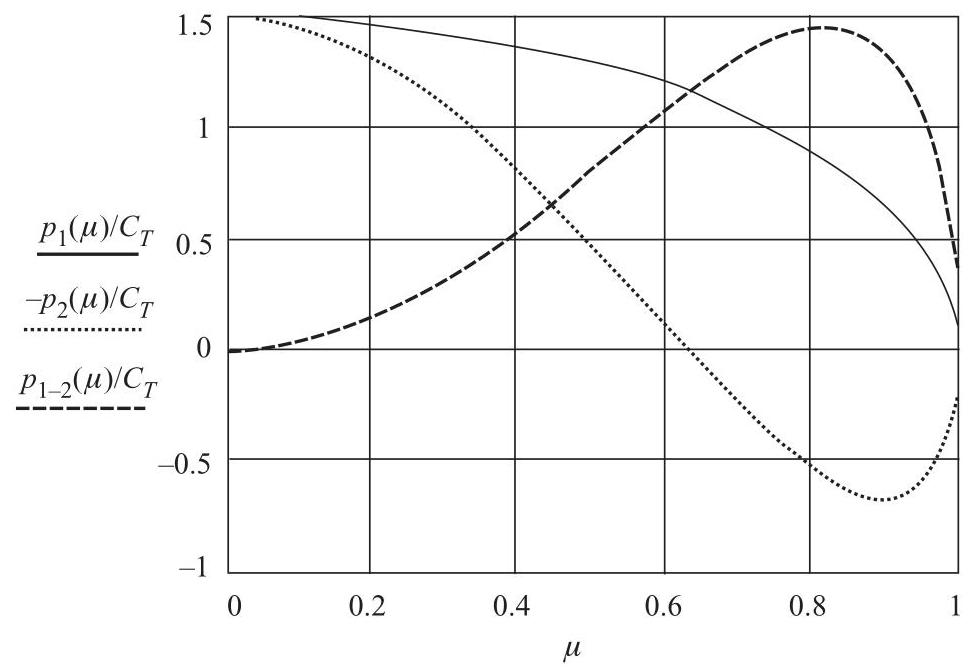

Figure 4.26 Radial pressure distributions of the first two solutions and their combination to satisfy the requirements at the rotor axis

The induced velocity field caused by the axi-symmetric pressure distribution has to be obtained from the pressure field by integrating Equations 4.58 commencing far upstream where free-stream conditions are assumed to apply. The upstream conditions also depend upon the angle of yaw of the disc. The integration continues until a point on the disc is reached where the induced velocity is to be determined.

The particular induced velocity component that is most important for determining the angle of attack on a blade element is normal to the rotor disc, that is, the axial induced velocity. Mangler and Squire (1950) calculated the axial induced velocity distribution as a function of yaw angle by expressing the velocity as a Fourier series of the azimuth angle $\psi$ .

$$
\frac{u}{{U}_{\infty }} = {C}_{T}\left( {\frac{{A}_{0}\left( {\mu ,\gamma }\right) }{2} + \mathop{\sum }\limits_{{k = 1}}^{\infty }{A}_{k}\left( {\mu ,\gamma }\right) \sin {k\psi }}\right) \tag{4.80}
$$

For the pressure distribution of Equation 4.79 the Fourier coefficients are

$$
{A}_{0}\left( {\mu ,\gamma }\right)  =  - \frac{15}{8}{\mu }^{2}\sqrt{1 - {\mu }^{2}} \tag{4.81a}
$$

$$
{A}_{1}\left( {\mu ,\gamma }\right)  =  - \frac{15}{256}\mu \left( {9{\mu }^{2} - 4}\right) \tan \frac{\gamma }{2} \tag{4.81b}
$$

$$
{A}_{3}\left( {\mu ,\gamma }\right)  =  - \frac{45\pi }{256}{\mu }^{3}{\tan }^{3}\frac{\gamma }{2} \tag{4.81c}
$$

Higher order odd terms are zero. There are also even terms which have the general form

$$
{A}_{k} =  - {\left( -1\right) }^{\frac{k - 2}{2}}\frac{3}{4}\left\lbrack  {\frac{k + v}{{k}^{2} - 1}\left( \frac{9{v}^{2} + {k}^{2} - 6}{{k}^{2} - 9}\right)  + \frac{3v}{{k}^{2} - 9}}\right\rbrack  {\left( \frac{1 - v}{1 + v}\right) }^{\frac{k}{2}}{\tan }^{\frac{k}{2}}\frac{\gamma }{2}
$$

where ${v}^{2} = 1 - {\mu }^{2}$ and $k$ is an even integer greater than zero.

The average value of the axial induced velocity is independent of yaw angle and is given by

$$
{a}_{0} = \frac{{u}_{0}}{{U}_{\infty }} = \frac{1}{4}{C}_{T}
$$

where ${u}_{0}$ is the average axial induced velocity.

Thus, the average value of the axial flow induced velocity is related to the thrust coefficient by

$$
{C}_{T} = 4{a}_{0} \tag{4.82}
$$

compared with the momentum theory ${C}_{T} = 4{a}_{0}\left( {1 - {a}_{0}}\right)$ or compared with any of the expressions developed for yawed conditions, Equations 4.2, 4.18 and 4.24.

Because of the assumption that the induced velocity is small compared with the flow velocity, ${a}_{0}$ is small compared with 1 .

Clearly, the acceleration potential method only applies if the value of ${C}_{T}$ is much less than 1.

The once per revolution term in Equation 4.80 will cause an angle of attack variation and, hence, a lift variation that will cause a yawing moment on the disc. However, the pressure distribution, being axi-symmetric, cannot cause a yawing moment. The situation is much the same as for the vortex theory of Coleman et al. (1945).

Pitt and Peters (1981) use, or rather impose, Glauert's assumption (Equation 4.21) for the variation of the axial induced flow factor.

$$
a = {a}_{0} + {a}_{s}\mu \sin \psi \tag{4.83}
$$

The value of ${a}_{s}$ is obtained by equating the first moment about the yaw axis of Equation 4.83 with the first moment of Equation 4.80 using the Mangler and Squire velocity distributions of Equations 4.81.

$$
{\int }_{0}^{2\pi }{\int }_{0}^{1}\mu \sin \psi \left( {{a}_{0} + {a}_{s}\mu \sin \psi }\right) {\mu d\mu d\psi }
$$

$$
= {\int }_{0}^{2\pi }{\int }_{0}^{1}{C}_{T}\mu \sin \psi \left( {\frac{{A}_{0}\left( {\mu ,\gamma }\right) }{2} + \mathop{\sum }\limits_{{k = 1}}^{\infty }{A}_{n}\left( {\mu ,\gamma }\right) \sin {k\psi }}\right) {\mu d\mu d\psi } \tag{4.84}
$$

All terms, apart from that containing ${A}_{1}$ , vanish on integration, giving

$$
{a}_{s} = \frac{15\pi }{128}{C}_{T}\tan \frac{\gamma }{2} \tag{4.85}
$$

Hence, using Equation 4.82, the axial induced velocity becomes

$$
a = {a}_{0}\left( {1 + \frac{15\pi }{32}\mu \tan \frac{\gamma }{2}\sin \psi }\right) \tag{4.86}
$$

which, apart from the use of the yaw angle instead of the wake skew angle, has the same form as Equations 4.21 and 4.31 and so there is some consistency in the various methods for dealing with yawed flow.

#### 4.3.4 The anti-symmetric pressure distributions

As has been determined in Section 4.1.11, there is a moment about the vertical diameter of a yawed wind turbine rotor disc, the restoring yaw moment. An axi-symmetric pressure distribution, however, is not capable of producing a yaw moment so more terms from the series solution of Equation 4.72 need to be included.

The only terms in Equation 4.72 which will yield a yawing moment are those for which $m = 1$ and for which ${D}_{n}^{1} \neq  0$ . Terms for which $m = 1$ and ${C}_{n}^{1} \neq  0$ will cause a tilting moment. Recalling that $m + n$ must be odd to achieve a pressure discontinuity across the disc the values of $n$ that may be combined with $m = 1$ must be even.

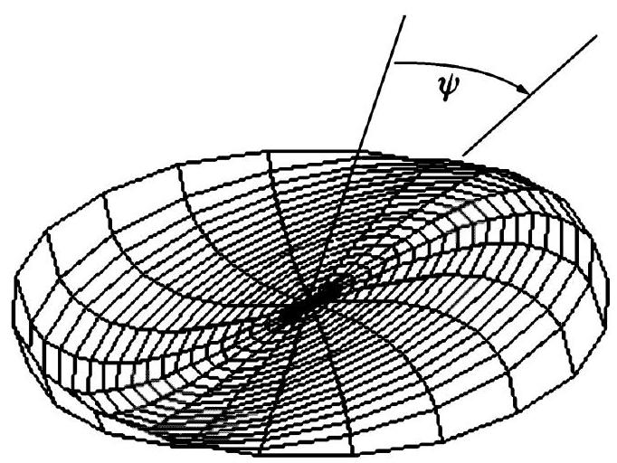

Figure 4.27 The form of the pressure distribution which yields a yawing moment

Because of the nature of the Legendre polynomials only one term in the series of Equation 4.72 will produce a net thrust and only one term will produce a yawing moment, which is a first moment. Similarly only one term will produce a second moment, and so on.

The unique term in Equation 4.72 which yields a yawing moment is that for which $m = 1$ , $n = 2$ and ${C}_{n}^{1} \neq  0$ , therefore,

$$
{P}_{2}^{1}\left( v\right)  = {3v}\sqrt{1 - {v}^{2}} = {3\mu }\sqrt{1 - {\mu }^{2}} \tag{4.87}
$$

and

$$
{Q}_{2}^{1}\left( {i\eta }\right)  = {3i\eta }\sqrt{1 + {\eta }^{2}}{\tan }^{-1}\frac{1}{\eta } - {3i}\sqrt{1 + {\eta }^{2}} + \frac{i}{\sqrt{1 + {\eta }^{2}}} \tag{4.88}
$$

so, at the disc,

$$
{Q}_{2}^{1}\left( {i0}\right)  =  - {2i} \tag{4.88a}
$$

A zero pressure gradient at the rotor axis is not appropriate in this case because the pressure distribution is anti-symmetric about the yaw axis, therefore,

$$
p\left( {\mu ,\psi }\right)  = {P}_{2}^{1}\left( \mu \right) {Q}_{2}^{1}\left( {i0}\right) {D}_{2}^{1}\sin \psi  =  - {6i}{D}_{2}^{1}\mu \sqrt{1 - {\mu }^{2}}\sin \psi \tag{4.89}
$$

The pressure distribution is shown in Figure 4.27.

The yawing moment coefficient is defined by

$$
{C}_{mz} = \frac{{M}_{z}}{\frac{1}{2}\rho  \cdot  {U}_{\infty }^{2}\pi  \cdot  {R}^{3}} \tag{4.90}
$$

As before, if the pressure in Equation 4.89 is non-dimensionalised by the free-stream dynamic pressure $\frac{1}{2}\rho  \cdot  {U}_{\infty }^{2}$ , then

$$
{C}_{mz} = \frac{1}{\pi }{\int }_{0}^{2\pi }{\int }_{0}^{1}\mu \sin \psi  \cdot  p\left( {\mu ,\psi }\right) \mu  \cdot  {d\mu d\psi } =  - \frac{1}{\pi }{6i}{D}_{2}^{1}{\int }_{0}^{1}{\mu }^{3}\sqrt{1 - {\mu }^{2}}{d\mu }{\int }_{0}^{2\pi }{\sin }^{2}\psi  \cdot  {d\psi }
$$

(4.91)which gives

$$
i{D}_{2}^{1} =  - \frac{5}{4} \cdot  {C}_{mz} \tag{4.92}
$$

To establish a relationship between the yawing moment coefficient and the axial velocity induced by the pressure distribution of Equation 4.89 the velocity distribution has to be obtained by integrating Equations 4.58. Unfortunately, no analytical solution has been determined for the anti-symmetric case, as Mangler and Squire have done for the symmetric case. Numerical values of induced velocities need to be calculated from Equations 4.58 using the pressure distribution defined by Equations 4.87 and 4.88.

Pitt and Peters (1981) have determined the axial velocity distribution for values of the yaw angle from ${0}^{ \circ  }$ to ${90}^{ \circ  }$ : the yaw angle fixes the far upstream conditions where the integration commences. The velocity distribution found corresponds to that of Equation 4.80 for the axi-symmetric case. Pitt and Peters again impose the form of Equation 4.83 and determine the average value of the axial induced velocity ${a}_{0}$ and the value of ${a}_{s}$ , using the same method of Equation 4.84: in both cases, of course, numerical integration is necessary.

The values of ${a}_{0}$ are not zero, as might have been expected from the anti-symmetric pressure distribution, but are equal and opposite to the values of ${a}_{s}$ found for the corrected axi-symmetric pressure distribution of Equation 4.79. The variation of the two coefficients ${a}_{0}$ and ${a}_{s}$ with yaw angle $\gamma$ is determined numerically but, using the Mangler and Squire analytical forms for guidance, analytical variations can be inferred. Pitt and Peters found that the linearised axial induced velocity distribution is

$$
{a}_{0} =  - \frac{15}{128}\pi \tan \frac{\gamma }{2}{C}_{mz} \tag{4.93}
$$

and

$$
{a}_{s} =  - \left( {1 - {\tan }^{2}\frac{\gamma }{2}}\right) {C}_{mz} \tag{4.94}
$$

Pitt and Peters also include a cosine term in the linearised axial induced flow factor representation of Equation 4.83 which will only arise if ${C}_{2}^{1} \neq  0$

$$
a = {a}_{0} + {a}_{s}\mu \sin \psi  + {a}_{c}\mu \cos \psi \tag{4.95}
$$

In which case there will be an additional pressure distribution given by

$$
p\left( {\mu ,\psi }\right)  = {P}_{2}^{1}\left( \mu \right) {Q}_{2}^{1}\left( {i0}\right) {C}_{2}^{1}\cos \psi  =  - {6i}{C}_{2}^{1}\mu \sqrt{1 - {\mu }^{2}}\cos \psi \tag{4.96}
$$

The tilting moment coefficient is given by

$$
{C}_{my} = \frac{1}{\pi }{\int }_{0}^{2\pi }{\int }_{0}^{1}\mu \cos {\psi p}\left( {\mu ,\psi }\right) \mu  \cdot  {d\mu } \cdot  {d\psi } =  - \frac{1}{\pi }{6i}{C}_{2}^{1}{\int }_{0}^{1}{\mu }^{3}\sqrt{1 - {\mu }^{2}}{d\mu }{\int }_{0}^{2\pi }{\cos }^{2}\psi  \cdot  {d\psi }
$$

(4.97)

Therefore,

$$
i{C}_{2}^{1} =  - \frac{5}{4}{C}_{my} \tag{4.98}
$$

The axial induced velocity distribution resulting from the pressure field of Equation 4.96 is calculated by numerical integration of Equations 4.58 and is then matched with the linear velocity distribution of Equation 4.95 using again the same method for Equation 4.84.

$$
{\int }_{0}^{2\pi }{\int }_{0}^{1}\mu \cos \psi \left( {{a}_{0} + {a}_{c}\mu \cos \psi }\right) {\mu d\mu d\psi }
$$

$$
= {\int }_{0}^{2\pi }{\int }_{0}^{1}\mu \cos \psi {C}_{T}\left( {\frac{1}{2}{A}_{0}\left( {\mu ,\gamma }\right)  + \mathop{\sum }\limits_{{k = 1}}^{\infty }{A}_{k}\left( {\mu ,\gamma }\right) \cos {k\psi }}\right) {\mu d\mu d\psi } \tag{4.99}
$$

The functions ${A}_{n}\left( {\mu ,\gamma }\right)$ are determined numerically. Again, using the Mangler and Squire results as guidance, an expression for ${a}_{c}$ is found.

$$
{a}_{c} =  - {\sec }^{2}\frac{\gamma }{2} \cdot  {C}_{my} \tag{4.100}
$$

#### 4.3.5 The Pitt and Peters model

Pitt and Peters (1981) have developed the linear theory that relates the axial induced flow factors to the thrust and moment coefficients given in Equations 4.82, 4.85, 4.93, 4.94 and 4.100, which collect together in matrix form

$$
\left\lbrack  \begin{array}{l} {a}_{0} \\  {a}_{c} \\  {a}_{s} \end{array}\right\rbrack   = \left\lbrack  \begin{matrix} \frac{1}{4} & 0 &  - \frac{15}{128}\pi \tan \frac{\gamma }{2} \\  0 &  - {\sec }^{2}\frac{\gamma }{2} & 0 \\  \frac{15}{128}\pi \tan \frac{\gamma }{2} & 0 &  - \left( {1 - {\tan }^{2}\frac{\gamma }{2}}\right)  \end{matrix}\right\rbrack  \left\lbrack  \begin{array}{l} {C}_{T} \\  {C}_{my} \\  {C}_{mz} \end{array}\right\rbrack \tag{4.101a}
$$

$$
\left( a\right)  = \left\lbrack  L\right\rbrack  \left( C\right) \tag{4.101b}
$$

The solution procedure is to assume initial values for $\left( a\right)$ from which the values of $\left( C\right)$ can be calculated from the blade element theory. New values of $\left( a\right)$ are then found from Equation 4.101 and an iteration proceeds.

For the wind turbine the value of ${a}_{0}$ may not be small compared with 1 and so the above procedure will converge on values of ${a}_{0}$ which are too small compared with what the momentum theory would deliver.

To produce more realistic results, that is, results in line with Glauert's momentum theory, the expression for ${C}_{T}$ could be

$$
{C}_{T} = {4a}\sqrt{1 - a\left( {2\cos \gamma  - a}\right) } = {4a}{A}_{G}\left( a\right) \tag{4.18a}
$$

Or, to use the Coleman theory,

$$
{C}_{T} = {4a}\left( {\cos \gamma  + \tan \frac{\chi }{2}\sin \gamma  - a{\sec }^{2}\frac{\chi }{2}}\right)  = {4a}{A}_{C}\left( a\right) \tag{4.24a}
$$

Also, it is usual for the wake skew angle to be used in matrix $\left\lbrack  L\right\rbrack$ instead of the yaw angle.

The matrix $\left\lbrack  L\right\rbrack$ should then be modified to become

$$
\left\lbrack  L\right\rbrack   = \left\lbrack  \begin{matrix} \frac{1}{{4A}\left( {a}_{0}\right) } & 0 &  - \frac{15}{128}\pi \tan \frac{\chi }{2} \\  0 &  - {\sec }^{2}\frac{\chi }{2} & 0 \\  \frac{15}{{128A}\left( {a}_{0}\right) }\pi \tan \frac{\chi }{2} & 0 &  - \left( {1 - {\tan }^{2}\frac{\chi }{2}}\right)  \end{matrix}\right\rbrack \tag{4.102}
$$

where $A\left( {a}_{0}\right)$ is chosen according to which momentum theory is to be used.

The Pitt and Peters method does not include any determination of induced velocities in the plane of the rotor disc and as a consequence it is not possible to account for wake rotation. However, it is possible that the Kinner solutions ${Q}_{n}^{m}\left( v\right)$ that were excluded from the analysis because they give infinite pressure at ${v}^{2} = 1$ , which lies along the axis of rotation, may give velocity distributions which provide for wake rotation; the momentum theory of Section 3.3 also predicts an infinite pressure at the axis of rotation because of wake rotation. In practice, of course, the rotor disc would not extend to the axis of rotation and the singularity would not occur.

With or without wake rotation a flow angle $\phi$ can be determined from which a torque can be found. If the normal force on an element of the rotor disc is equal to ${\delta L}\cos \phi$ then the tangential force will be ${\delta L}\sin \phi$ .

#### 4.3.6 The general acceleration potential method

Peters, with a number of associates, has developed the theory further and a reading of references (Pitt and Peters, 1981; Goanker and Peters, 1988; HaQuang and Peters, 1988) is recommended.

The acceleration potential method has been developed specifically for wind turbines by van Bussell (1995), where a much more comprehensive account of the theory is given.

If the velocity field at the rotor disc associated with any chosen Kinner pressure distribution, including the in-plane induced velocity components, was available then a solution could be determined for any rotor by matching the forces given by the combined pressure fields of a sufficient number of Kinner distributions with those forces given by the blade element theory.

#### 4.3.7 Comparison of methods

A project to compare existing methods of predicting yaw behaviour, among other aspects of the aerodynamic behaviour of wind turbines, was reported upon (Snel and Schepers, 1995). Figure 4.28 shows results obtained by various methods for predicting the yawing moment of the 2 MW, three blade turbine at Tjæreborg in Denmark at a yaw angle of ${32}^{ \circ  }$ and a wind speed of ${8.5}\mathrm{\;m}/\mathrm{s}$ .

Most of the theoretical predictions in Figure 4.28 have the correct phasing and about the correct mean yawing moment but the amplitude of the yawing moment varies. In this example the second method bears the closest comparison with the measured data. Generally, the amplitude of the yawing moment variation is under-estimated by the theoretical predictions, whereas the mean yawing moment is quite well predicted.

Figure 4.28 Yawing Moment on the Tjæreborg Turbine at ${32}^{ \circ  }\mathrm{Y}$ aw and ${8.5}\mathrm{\;m}/\mathrm{s}$

### 4.4 Unsteady flow

#### 4.4.1 Introduction

Natural winds are almost never steady in either strength or direction and so it is seldom that the conditions for the momentum theory apply. It takes a finite time for the wind to travel from far upwind of a rotor to far downwind and in that time wind conditions will change so an equilibrium state is never achieved. Even if the 'average' wind speed changes only slowly, small scale turbulence will cause a continuous unsteadiness in the velocities impinging on a rotor blade.

Several approximate solutions offer themselves for the determination of the dynamic flow conditions at the rotor disc. It could be assumed that the induced velocity remains fixed at the level determined by the average wind speed blowing over a set period of time, that may be quite short. The wake remains frozen while the unsteady component of the wind passes through the rotor disc unattenuated by the presence of the rotor. The unsteady forces would be determined by the blade element theory. Alternatively, the induced velocity through the rotor disc could be determined from the instantaneous wind velocity as if that velocity was steady. The induced velocity will change as the wind speed changes but it must be assumed that the entire wake changes instantaneously to remain in step. Equilibrium in the wake is maintained at all times.

The truth lies somewhere between the two scenarios given above, both of which rely on simple assumptions about the state of the wake.

The acceleration potential method avoids reference to the wake and allows the flow conditions at the rotor disc to be determined by the upwind flow field, which is much simpler to determine than that of the wake.

In steady flow conditions the velocity at a fixed point in the upwind flow field is constant; acceleration of the flow from point to point takes place (e.g. ${U}_{\infty }\left( {\partial u/\partial x}\right)$ in the $x$ -direction, assuming $u$ , the induced velocity, is much smaller than ${U}_{\infty }$ ) but no rate of change of velocity with time (e.g. $\partial u/\partial t$ ) occurs at a single point. In unsteady flow, conditions at a fixed point do change with time and the total acceleration in the $x$ -direction is then $\partial u/\partial t + {U}_{\infty }\left( {\partial u/\partial x}\right)$ . The additional acceleration requires an additional inertia force, the reaction to which will change the force on the rotor disc. The additional force is often termed the added mass force because if the unsteadiness in the relative flow past a blade can be attributed not to flow turbulence but to an unsteady motion of the blade itself some of the air will be forced to move (accelerate) with the blade, effectively adding to the mass of the blade.

#### 4.4.2 Adaptation of the acceleration potential method to unsteady flow

If the unsteady acceleration terms are added to equations (Equation 4.58), which are simplified to account for the induced velocities being very much smaller than the wind velocity, then those equations become

$$
\rho \left( {\frac{\partial u}{\partial t} + {U}_{\infty }\frac{\partial u}{\partial x}}\right)  =  - \frac{\partial p}{\partial x}
$$

$$
\rho \left( {\frac{\partial v}{\partial t} + {U}_{\infty }\frac{\partial v}{\partial x}}\right)  =  - \frac{\partial p}{\partial y} \tag{4.103}
$$

$$
\rho \left( {\frac{\partial w}{\partial t} + {U}_{\infty }\frac{\partial w}{\partial x}}\right)  =  - \frac{\partial p}{\partial z}
$$

As before, differentiating each equation with respect to its particular direction and adding together the results gives

$$
\rho \left\lbrack  {\frac{\partial }{\partial t}\left( {\frac{\partial u}{\partial x} + \frac{\partial v}{\partial y} + \frac{\partial w}{\partial z}}\right)  + {U}_{\infty }\frac{\partial }{\partial x}\left( {\frac{\partial u}{\partial x} + \frac{\partial v}{\partial y} + \frac{\partial w}{\partial z}}\right) }\right\rbrack   =  - \left( {\frac{{\partial }^{2}p}{\partial {x}^{2}} + \frac{{\partial }^{2}p}{\partial {y}^{2}} + \frac{{\partial }^{2}p}{\partial {z}^{2}}}\right)
$$

but, for continuity of the flow,

$$
\frac{\partial u}{\partial x} + \frac{\partial v}{\partial y} + \frac{\partial w}{\partial z} = 0
$$

Therefore, the condition

$$
\frac{{\partial }^{2}p}{\partial {x}^{2}} + \frac{{\partial }^{2}p}{\partial {y}^{2}} + \frac{{\partial }^{2}p}{\partial {z}^{2}} = 0
$$

applies together with the Kinner pressure distributions of Section 4.3.2.

The accelerations $\left( {\partial u/\partial t,\partial v/\partial t,\partial w/\partial t}\right)$ can be determined directly from Equations 4.103 without integration being necessary, but it is only the component $\partial u/\partial t$ that is required because it is normal to the rotor disc and so will give rise to a normal force.

The solutions for $\rho {U}_{\infty }\left( {\partial u/\partial x}\right)  =  - \partial p/\partial x$ have already been obtained in Sections 4.3.2, 4.3.3 and 4.3.4 and so it remains to determine the solutions for

$$
\rho \frac{\partial u}{\partial t} =  - \frac{\partial p}{\partial x} \tag{4.104}
$$

Equation 4.104 cannot be solved for the velocity $u$ because that is the solution of the complete equation that is the first of Equations 4.103. What can be determined from Equation 4.104 is the acceleration $\partial u/\partial t$ for which it is necessary to differentiate the chosen pressure distribution. The Kinner pressure distributions, that are solutions of Equations 4.62, are given as functions of the ellipsoidal co-ordinates $\left( {v,\eta ,\psi }\right)$ , so to obtain the derivative with respect to $x$ a co-ordinate transformation is required.

The relationships between the ellipsoidal co-ordinates and the Cartesian co-ordinates $\left( {x, y, z}\right)$ are given in Equations 4.60 from which can be obtained the derivatives $\partial x/\partial v$ , $\partial x/\partial \eta ,\partial x/\partial \psi$ but what are really needed are the inverses of these derivatives.

We can find by appropriate differentiations of Equations 4.60

$$
\frac{\partial }{\partial v} = \frac{\partial {x}^{\prime \prime }}{\partial v}\frac{\partial }{\partial {x}^{\prime \prime }} + \frac{\partial {y}^{\prime }}{\partial v}\frac{\partial }{\partial {y}^{\prime }} + \frac{\partial z}{\partial v}\frac{\partial }{\partial z},
$$

for example, and so the complete Jacobian can be determined:

$$
\left\lbrack  \begin{matrix} \frac{\partial }{\partial v} \\  \frac{\partial }{\partial \eta } \\  \frac{\partial }{\partial \psi } \end{matrix}\right\rbrack   = \left\lbrack  \begin{matrix} \frac{\partial {x}^{\prime \prime }}{\partial v} & \frac{\partial {y}^{\prime }}{\partial v} & \frac{\partial z}{\partial v} \\  \frac{\partial {x}^{\prime \prime }}{\partial \eta } & \frac{\partial {y}^{\prime }}{\partial \eta } & \frac{\partial z}{\partial \eta } \\  \frac{\partial {x}^{\prime \prime }}{\partial \psi } & \frac{\partial {y}^{\prime }}{\partial \psi } & \frac{\partial z}{\partial \psi } \end{matrix}\right\rbrack  \left\lbrack  \begin{matrix} \frac{\partial }{\partial {x}^{\prime \prime }} \\  \frac{\partial }{\partial {y}^{\prime }} \\  \frac{\partial }{\partial z} \end{matrix}\right\rbrack \tag{4.105}
$$

the inverse of which is what is required.

$$
\left\lbrack  \begin{matrix} \frac{\partial }{\partial {x}^{\prime \prime }} \\  \frac{\partial }{\partial {y}^{\prime }} \\  \frac{\partial }{\partial z} \end{matrix}\right\rbrack   = \left\lbrack  \begin{matrix} \frac{\partial v}{\partial {x}^{\prime \prime }} & \frac{\partial \eta }{\partial {x}^{\prime \prime }} & \frac{\partial \psi }{\partial {x}^{\prime \prime }} \\  \frac{\partial v}{\partial {y}^{\prime }} & \frac{\partial \eta }{\partial {y}^{\prime }} & \frac{\partial \psi }{\partial {y}^{\prime }} \\  \frac{\partial v}{\partial z} & \frac{\partial \eta }{\partial z} & \frac{\partial \psi }{\partial z} \end{matrix}\right\rbrack  \left\lbrack  \begin{matrix} \frac{\partial }{\partial v} \\  \frac{\partial }{\partial \eta } \\  \frac{\partial }{\partial \eta } \end{matrix}\right\rbrack \tag{4.106}
$$

The Jacobian matrix of Equation 4.105 can be determined algebraically from Equations 4.60 and this can then be inverted algebraically to give the inverse Jacobian of Equation 4.106. From the inverse Jacobian it is found that

$$
\frac{\partial }{\partial {x}^{\prime \prime }} = \frac{\eta \left( {1 - {v}^{2}}\right) }{R\left( {{\eta }^{2} + {v}^{2}}\right) }\frac{\partial }{\partial v} + \frac{v\left( {1 + {\eta }^{2}}\right) }{R\left( {{\eta }^{2} + {v}^{2}}\right) }\frac{\partial }{\partial \eta } \tag{4.107}
$$

However, only the acceleration at the rotor disc itself is required and there the value of $\eta$ is zero, so

$$
\frac{\partial }{\partial {x}^{\prime \prime }} = \frac{1}{Rv}\frac{\partial }{\partial \eta } \tag{4.108}
$$

If the corrected axi-symmetric pressure drop distribution of Equation 4.79 is chosen, to conform with the steady flow case then, for the whole flow field, the normalised pressure at any point is given by

$$
p\left( {v,\eta }\right)  = \frac{15}{32}v{C}_{TD}\left\lbrack  {-{7\eta }{\tan }^{-1}\frac{1}{\eta } + 4\left( {1 - {v}^{2}}\right)  + {15}{v}^{2}{\eta }^{2}\left( {\eta {\tan }^{-1}\frac{1}{\eta } - 1}\right) }\right.
$$

$$
\left. {+{9\eta }\left( {\eta  + \left( {{v}^{2} - {\eta }^{2}}\right) {\tan }^{-1}\frac{1}{\eta }}\right) }\right\rbrack \tag{4.109}
$$

in which the pressure is normalised by $\frac{1}{2}\rho {U}_{\infty }^{2}$ . The term ${C}_{TD}$ is the contribution to the total thrust coefficient of the dynamic acceleration $\partial u/\partial t$ . Note that, as explained at the end of Section 4.3.1, the pressure level just upwind of the rotor disc, as given by Equation 4.109, is half the magnitude of the pressure drop across the disc given by Equation 4.79.

By means of Equation 4.108, at the rotor plane, where $\eta  = 0$ , the pressure gradient is found to be

$$
\frac{\partial p}{\partial {x}^{\prime \prime }} = \frac{1}{R}\frac{15\pi }{64}{C}_{TD}\left( {9{v}^{2} - 7}\right)
$$

Therefore, in terms of parameter $\mu$ , from Equation 4.104,

$$
\rho \frac{\partial u}{\partial t} =  - \frac{\partial p}{\partial {x}^{\prime \prime }}\frac{1}{2}\rho {U}_{\infty }^{2} = \frac{1}{R}\frac{15\pi }{64}{C}_{TD}\left( {9{\mu }^{2} - 2}\right) \frac{1}{2}\rho {U}_{\infty }^{2} \tag{4.110}
$$

It should be noted that the axial acceleration distribution is axi-symmetric and independent of the yaw angle.

The mean value of axial acceleration over the area of the disc is

$$
\frac{\partial {u}_{0}}{\partial t} = \frac{75\pi }{256}\frac{{U}_{\infty }^{2}}{R}{C}_{TD} \tag{4.111}
$$

The non-dimensional form of the acceleration can be expressed as

$$
\frac{\partial {a}_{\mathrm{o}}}{\partial \tau } = \frac{R}{{U}_{\infty }^{2}}\frac{\partial {u}_{\mathrm{o}}}{\partial t} = \frac{75\pi }{256}{C}_{TD} \tag{4.112}
$$

where ${a}_{o} = {u}_{o}/{U}_{\infty }$ , axial flow factor and $\tau  = t{U}_{\infty }/R$ which is called non-dimensional time.

The axial force on the disc is

$$
{T}_{x} = \frac{1}{2}\rho {U}_{\infty }^{2}\pi {R}^{2}{C}_{TD}
$$

Substituting for ${C}_{TD}$ from Equation 4.112 gives

$$
{T}_{x} = \frac{128}{75}\rho {R}^{3}\frac{\partial {u}_{\mathrm{o}}}{\partial t} \tag{4.113}
$$

The added mass is, therefore, $\frac{128}{75}\rho {R}^{3}$

The added mass term associated with a solid disc given by (Tuckerman, 1925) is $\frac{8}{3}$ , compared with $\frac{128}{75}$ given in Equation 4.113, and is in agreement with the value that is given by the uncorrected axi-symmetric Kinner pressure distribution of Equations 4.73. Although Pitt and Peters (1981) determine the value $\frac{128}{75}$ , in subsequent papers by Peters and other workers the value $\frac{8}{3}$ is recommended and has come to be generally accepted. The use of the so-called 'corrected' pressure distribution for wind turbines has already been questioned in Section 4.3.3; there is no need to impose a zero pressure difference on the rotor disc at the rotation axis.

#### 4.4.3 Unsteady yawing and tilting moments

For unsteady flow in yaw the normal unsteady acceleration distribution on the disc is required to have the same form of linear variation as the velocity, given in Equation 4.95. In terms of flow factors,

$$
\frac{\partial a}{\partial \tau } = \frac{\partial {a}_{0}}{\partial \tau } + \frac{\partial {a}_{s}}{\partial \tau }\mu \sin \psi  + \frac{\partial {a}_{c}}{\partial \tau }\mu \cos \psi \tag{4.114}
$$

The condition that causes a yawing moment arises from the anti-symmetric pressure distribution of Section 4.3.4 can be obtained from Equations 4.87, 4.88. For the whole field surrounding the rotor disc the pressure distribution is

$$
p\left( {v,\eta ,\psi }\right)  = 3{D}_{2}^{1}v\sqrt{1 - {v}^{2}}\left( {{3i\eta }\sqrt{1 + {\eta }^{2}}{\tan }^{-1}\frac{1}{\eta } - {3i}\sqrt{1 + {\eta }^{2}} + \frac{i}{\sqrt{1 + {\eta }^{2}}}}\right) \sin \psi
$$

which, on the disc, produces the pressure shown in Figure 4.27. The coefficient ${D}_{2}^{1}$ is related to the yawing moment coefficient in Equation 4.92

$$
i{D}_{2}^{1} =  - \frac{5}{4}{C}_{mz} \tag{4.92}
$$

Therefore,

$$
p\left( {v,\eta ,\psi }\right)  =  - \frac{15}{4}\pi  \cdot  {C}_{mz}v\sqrt{1 - {v}^{2}}\left( {{3\eta }\sqrt{1 + {\eta }^{2}}{\tan }^{-1}\frac{1}{\eta } - 3\sqrt{1 + {\eta }^{2}} + \frac{1}{\sqrt{1 + {\eta }^{2}}}}\right) \sin \psi
$$

(4.115)

As before, the pressure in Equation 4.115 is non-dimensionalised by the free-stream dynamic pressure $\frac{1}{2}\rho  \cdot  {U}_{\infty }^{2}$ .

Applying the differential operator given in Equation 4.108 to Equation 4.115, from Equation 4.104 we get at the rotor disc, where $\eta  = 0$ ,

$$
\frac{\partial {u}_{s}}{\partial t} = \frac{45}{16}\pi \frac{{U}_{\infty }^{2}}{R}{C}_{mzD}\mu \sin \psi \tag{4.116}
$$

In terms of non-dimensional time and velocity

$$
\frac{\partial {a}_{s}}{\partial \tau } = \frac{45}{16}\pi {C}_{mzD} \tag{4.117}
$$

Similarly, if there is a tilting moment then the corresponding acceleration is

$$
\frac{\partial {a}_{c}}{\partial \tau } = \frac{45}{16}\pi {C}_{myD} \tag{4.118}
$$

The radial variation is linear and so no linearisation adjustment is necessary as there is in the case of the velocity distribution. Again, the acceleration is independent of yaw angle. The mean acceleration is zero and so there is no coupling between the cases.

The relationship between accelerations and force coefficients is, therefore,

$$
\left\lbrack  \begin{matrix} \frac{16}{3\pi } & 0 & 0 \\  0 & \frac{16}{45\pi } & 0 \\  0 & 0 & \frac{16}{45\pi } \end{matrix}\right\rbrack  \left\lbrack  \begin{matrix} \frac{\partial {a}_{0}}{\partial \tau } \\  \frac{\partial {a}_{c}}{\partial \tau } \\  \frac{\partial {a}_{s}}{\partial \tau } \end{matrix}\right\rbrack   = {\left\lbrack  \begin{matrix} {C}_{T} \\  {C}_{my} \\  {C}_{mz} \end{matrix}\right\rbrack  }_{D} \tag{4.119a}
$$

$$
\left\lbrack  M\right\rbrack  \left\{  \frac{\partial a}{\partial \tau }\right\}   = \{ C{\} }_{D} \tag{4.119b}
$$

The complete equation of motion combines Equation 4.119 and the steady yaw Equation 4.101. The combination is achieved by adding the corresponding force coefficients, which means that both equations must be inverted.

$$
\left\lbrack  M\right\rbrack  \left\{  \frac{\partial a}{\partial \tau }\right\}   + {\left\lbrack  L\right\rbrack  }^{-1}\{ a\}  = \{ C{\} }_{D} + \{ C{\} }_{S} \tag{4.120}
$$

The right hand side of Equation 4.120 can also be determined from blade element theory and will be a time dependent function of the axial induction factor. The blade forces will vary in a manner determined by the time-varying velocity of the oncoming wind and consequent dynamic structural deflections of the necessarily elastic rotor. Equation 4.120 applies to the whole rotor disc and the blade element forces need to be integrated along the blade lengths.

Numerical solutions to Equation 4.120 require a procedure for dealing with first order differential equations and the tried and tested fourth order Runge-Kutta method is recommended. Starting with a steady state solution the progress in time of the induced velocity as an unsteady flow passes through the rotor can be tracked. However, non-dimensionalising with respect to wind speed is not very useful if wind speed is changing dynamically and it is common to work directly in terms of induced velocity rather than flow factors.

Equation 4.120 really applies to the whole rotor and the only spatial variation of the induced velocity and acceleration that is permitted is as defined in Equations 4.95 and 4.114. However, a relaxation of the strict approach has been adopted by several workers, see, for example, Schepers and Snel (1995), where the induced velocities are determined for separate annular rings, as described in Section 4.1.8. The added mass term for an annular ring can be taken as a proportion of the whole added mass according to the appropriate acceleration distribution, Equations 4.112, 4.117 and 4.118.

Figure 4.29 shows measured and calculated flap-wise (out of the rotor plane) blade root bending moments for the Tjæreborg turbine caused by a pitch change from ${0.070}^{ \circ  }$ to ${3.716}^{ \circ  }$ with the reversed change 30 seconds later. The turbine was not in yaw and the wind speed was ${8.7}\mathrm{\;m}/\mathrm{s}$ . The calculated results were made both according to the equilibrium wake method and with a differential equation method similar to that of Equation 4.120.

The comparison with the measured results clearly shows that the dynamic analysis predicts the initial overshoot in bending moment whereas the equilibrium wake method does not. Neither theory predicts the steady state bending moment achieved between the pitch changes. Figure 4.29 is taken from Lindenburg (1996), which describes the PHATAS III aero-elastic code developed at ECN in the Netherlands. Details of the Tjæreborg turbine, which is sited near Esbjerg in Denmark, can be obtained from Snel and Schepers (1995).

The solution procedure requires the time varying blade element force to determine the right hand side of Equation 4.120, but calculating the lift and drag forces on a blade element in unsteady flow conditions is not a straight forward process. The lift force on a blade element is dependent upon the circulation around the element but after a change in conditions the circulation takes time to settle at a new level (see Section 4.5.3) and in the interim the instantaneous lift cannot be determined via the instantaneous angle of attack. In a continuously changing situation the lift is not in phase with the angle of attack and does not have a magnitude that can be determined using static, two-dimensional aerofoil lift versus angle of attack data.

Figure 4.29 Measured and calculated blade root bending moment responses to blade pitch angle changes on the Tjæreborg turbine (from Lindenburg, 1996)

### 4.5 Quasi-steady aerofoil aerodynamics

#### 4.5.1 Introduction

When the oncoming flow relative to an aerofoil is unsteady the angle of attack is continuously changing and so the lift also is changing with time. The simple, but incorrect, way of dealing with this problem is to assume that the instantaneous angle of attack corresponds to the same lift coefficient as if that angle of attack were to be constantly applied. The angle of attack is determined by the oncoming flow velocity and the velocity of the blade's motion. If the blade motion includes a torsional (pitching) component then the angle of attack will vary along the chord length: thin aerofoil theory (see J.D. Anderson,1991) shows that the point $\frac{3}{4}$ of the chord length from the leading edge is where the angle of attack must be determined.

The velocities that determine the quasi-steady angle of attack for a rotor blade element are shown in Figure 4.30, the dot represents differentiation with respect to time $t$ .

The flow velocity $W\left( t\right)$ , which includes the rotational speed of the blade element, varies in magnitude and direction ${\alpha }_{w}\left( t\right)$ with the unsteady wind. $W\left( t\right)$ also includes the induced velocities caused by the rotor disc as might be determined by Equation 4.120. The elastic deflection velocities (subscript $e$ ) caused by blade vibration also influence the quasi-steady angle of attack, which is

$$
\alpha \left( t\right)  = {\alpha }_{w}\left( t\right)  - \left( {{v}_{e}\left( t\right)  - \frac{\partial {\beta }_{e}}{\partial t}\left( {\frac{3}{4} - h}\right) c}\right) \frac{1}{W\left( t\right) } \tag{4.121}
$$

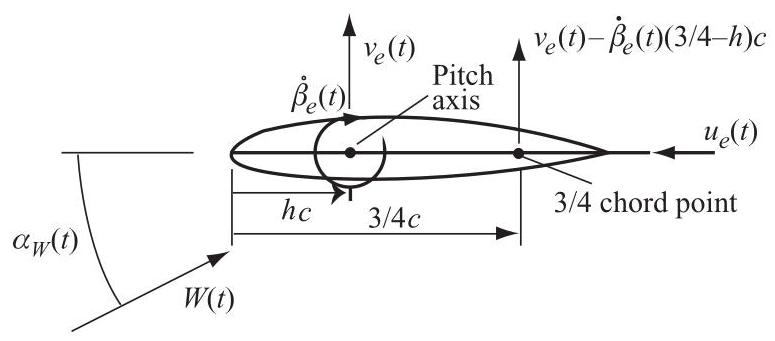

Figure 4.30 Unsteady flow and structural velocities adjacent to a rotor blade

The structural velocity caused by chord-wise (edge-wise) deflections of the blade will also influence the angle of attack but by a very small amount. The non-dimensional parameter $h$ defines the position of the pitching axis (flexural axis, shear centre position) of the blade element.

Assuming the structural deflection velocities to be small the lift force is then

$$
{L}_{c}\left( t\right)  = \frac{1}{2}\rho {W}^{2}\left( t\right) \frac{d{C}_{l}}{d\alpha }\sin \alpha \left( t\right) \tag{4.122}
$$

The lift-curve slope $d{C}_{l}/{d\alpha }$ is assumed to be the same as for the static case.

#### 4.5.2 Aerodynamic forces caused by aerofoil acceleration

In addition to the circulatory forces there are forces on the aerofoil caused by the inertia of the surrounding air that is accelerated as the aerofoil accelerates in its motion. The additional terms are added mass forces. The added mass per unit span of blade can be shown to be that of a circular cylinder of air of diameter equal to the aerofoil chord $\left( {\pi {c}^{2}/4}\right) \rho$ . There are two components to the added mass force, see Fung (1969).

1. A lift force with the centre of pressure at the mid-chord point of an amount equal to the apparent mass times the normal acceleration of the mid-chord point.

$$
{L}_{m1}\left( t\right)  =  - \frac{1}{4}\pi {c}^{2}\rho \left( {\frac{\partial {v}_{e}}{\partial t} - c\left( {\frac{1}{2} - h}\right) \frac{{\partial }^{2}{\beta }_{e}}{\partial {t}^{2}}}\right) \tag{4.123}
$$

2. A lift force with the centre of pressure at the $\frac{3}{4}$ chord point, of the nature of a centrifugal force, of an amount equal to the apparent mass times $W\left( t\right) \left( {\partial {\beta }_{e}/\partial t}\right)$

$$
{L}_{m2}\left( t\right)  =  - \frac{1}{4}\pi {c}^{2}{\rho W}\left( t\right) \frac{\partial {\beta }_{e}}{\partial t} \tag{4.124}
$$

Figure 4.31 Wake development after an impulsive change of angle of attack

There is also a nose-down pitching moment equal to the apparent moment of inertia $\left( {\pi /{128}}\right) {c}^{4}\rho$ (which, actually, is only a quarter of the moment of inertia per unit length of the cylinder of air of diameter $c$ ) times the pitching acceleration ${\partial }^{2}{\beta }_{e}/\partial {t}^{2}$

$$
{M}_{m} = \frac{\pi }{128}{c}^{4}\rho \frac{{\partial }^{2}{\beta }_{e}}{\partial {t}^{2}} \tag{4.125}
$$

The added masses are determined by a process similar to that of Section 4.4.2.

#### 4.5.3 The effect of the wake on aerofoil aerodynamics in unsteady flow

If the angle of attack of the flow relative to an aerofoil changes, the strength of the circulation also changes, but the process is not instantaneous because the circulation can only develop gradually. To determine how the lift on an aerofoil actually develops with time after an impulsive change of angle of attack occurs it is necessary to include the wake in the analysis. The sudden change of $\alpha$ causes a build up of circulation around the aerofoil that is matched by an equal and opposite vorticity being shed into the wake.

The bound circulation on an aerofoil is actually distributed along the chord but, for simplicity, can be assumed to be a concentrated vortex $\Gamma$ at the aerodynamic centre ( $\frac{1}{4}$ chord point). In steady flow conditions, the velocity induced by the vortex, normal to the chord-line, at the $\frac{3}{4}$ chord point is exactly equal and opposite to the component of the flow velocity normal to the chord-line. The two opposed velocities ensure that no flow passes through the aerofoil at the $\frac{3}{4}$ chord point, a condition which, of course, must be true everywhere along the chord-line but the $\frac{3}{4}$ chord point is used as a control point. The simplified situation assumes that the aerofoil can be represented geometrically by its chord-line, this is known as thin aerofoil representation.

In unsteady flow conditions the velocity induced at the $\frac{3}{4}$ chord point (often referred to as downwash) is caused jointly by the bound vortex and the wake vorticity, see Figure 4.31, but must still be equal and opposite to the component of the flow velocity normal to the chord-line.

After the impulsive change of angle of attack there is a sudden change in upwash $\left( {W\sin \alpha }\right)$ which must be matched by a sudden change of downwash. The change of upwash implies an impulsive acceleration of the mass of the air that causes an added mass force on the aerofoil. The sudden change of downwash must come from a sudden increase in circulation that must be matched by an equal and opposite starting vortex being shed into the wake and then convects downstream. The influence of the starting vortex on the downwash gets gradually weaker as the vortex moves away so the bound vortex must increase in strength to maintain that the downwash matches the upwash. The increasing strength of the bound vortex means that, to keep the overall angular momentum contained in the vorticity zero (there was none before the impulse), continuous vorticity of the opposite sense must be shed into the wake and this also contributes to the downwash.

Figure 4.32 Lift development after an impulsive change of angle of attack

The rate of increase of the bound vortex strength gradually reduces with a corresponding reduction of the strength of the shed vorticity and eventually, asymptotically, the steady state bound circulation strength is developed.

The analytical solution to the problem was developed by Wagner (1925), it is complex and expressed in terms of Bessel functions but several approximations to the Wagner function exist, the most accurate of which is given by Jones (1945).

$$
\frac{\Delta {L}_{c}\left( \tau \right) }{\frac{1}{2}\rho {W}^{2}c\frac{d{C}_{l}}{d\alpha }\sin \left( {\Delta \alpha }\right) } = \Phi \left( \tau \right)  = 1 - {0.165}{e}^{-{0.0455\tau }} - {0.335}{e}^{-{0.30\tau }} \tag{4.126}
$$

where $\tau  = {2Wt}/c$ is the non-dimensional time based upon the half chord length $c/2$ of the aerofoil and $d{C}_{l}/{d\alpha }$ is the slope of the static lift versus angle of attack characteristic of the aerofoil. Non-dimensional time $\tau$ can also be regarded as the number of half-chord lengths travelled down-stream by the starting vortex after a time $t$ has elapsed since the impulsive change of angle of attack. Equation 4.126 is an example of an indicial equation.

Figure 4.32 shows the progression of the growth of the lift as time proceeds from the original impulsive change of angle of attack. The added mass lift gradually dies away as the circulatory lift develops. Eventually, the steady state, full circulatory lift is achieved.

In the situation where the angle of attack is continuously changing, which is the case for the wind turbine blade, the circulation never reaches an equilibrium state and the added mass lift never dies away.

In an unsteady wind, if for each change of wind velocity over an increment of time ${\delta t}$ there is a corresponding impulsive angle attack change then the lift on the aerofoil will subsequently be influenced by that change in the manner of Equation 4.126 and Figure 4.32. The accumulation of all such changes in a continuous manner will determine the unsteady lift force on the aerofoil.

Assume the flow has been in progress for a long time ${t}_{\mathrm{o}}$ and let $t$ be any time prior to $t$ o, the lift at time $t$ is then given by

$$
{L}_{c}\left( \tau \right)  = {L}_{c}\left( 0\right)  + \frac{1}{2}\rho \frac{d{C}_{l}}{d\alpha }c{\int }_{0}^{\tau }W\left( {\tau }_{0}\right) \Phi \left( {\tau  - {\tau }_{0}}\right) \frac{{dw}\left( {\tau }_{0}\right) }{d{\tau }_{0}}d{\tau }_{0} \tag{4.127}
$$

Where ${\delta w} = \left( {{dw}\left( {\tau }_{0}\right) /d{\tau }_{0}}\right) \delta {\tau }_{0}$ is the change in upwash (downwash) determined by the change in $W\left( \tau \right)$ and the changes in blade motion during the time interval.

The use of non-dimensional time in the above equation poses a problem and it is more convenient to use actual time in a numerical integration.

Theodorsen (1935) solved Equation 4.127 for the case of an aerofoil oscillating sinusoidally in pitch and heave (flapping motion) at fixed frequency $\omega$ and immersed in a steady on-coming wind $U$ . The unsteady lift on the aerofoil is also sinusoidal but not in phase with the angle of attack variation, nor is the amplitude of the lift variation related to the amplitude of the angle of attack by static aerofoil characteristics.

Theodorsen's solution shows that the circulatory lift on the aerofoil equals the quasi-steady lift of Equation 4.121 multiplied by Theodorsen’s function $C\left( k\right)$ that has both real and imaginary parts. $k = {\omega c}/{2U}$ is called the reduced frequency and ${\omega t} = {k\tau }$ . In addition there is the added mass lift given by Equations 4.123 and 4.124.

$$
C\left( k\right)  = \frac{1}{1 + A\left( k\right) } = \frac{1}{1 + \left( \frac{{Y}_{0}\left( k\right)  + i{J}_{0}\left( k\right) }{{J}_{1}\left( k\right)  - i{Y}_{1}\left( k\right) }\right) } \tag{4.128}
$$

where ${J}_{n}\left( k\right)$ and ${Y}_{n}\left( k\right)$ are Bessel functions of the first and second kind, respectively, and $n$ is an integer. Like the Legendre polynomials the Bessel functions are the solutions to a second order ordinary differential equation called Bessel's equation,

$$
{k}^{2}\frac{{d}^{2}y}{d{k}^{2}} + k\frac{dy}{dk} + \left( {{k}^{2} - {n}^{2}}\right)  = 0
$$

Unlike the Legendre polynomials, the Bessel functions cannot be expressed in closed form but only as an infinite series.

Theodorsen's function is often divided into two functions, one describing the real part and the other the imaginary part.

$$
C\left( k\right)  = F\left( k\right)  + {iG}\left( k\right) \tag{4.129}
$$

From Jones' approximation to the Wagner function, Equation 4.126, an approximation to Theodorsen's function is obtained

$$
C\left( k\right)  = 1 - \frac{0.165}{1 - i\frac{0.0455}{k}} - \frac{0.335}{1 - i\frac{0.30}{k}} = F\left( k\right)  + {iG}\left( k\right) \tag{4.130}
$$

The exact and approximate parts of $C\left( k\right)$ are shown in Figures 4.33a and 4.33b.

The real part of $C\left( k\right)$ gives the lift that is in phase with the angle of attack defined in Equation 4.122 and the imaginary part gives the lift that is ${90}^{ \circ  }$ out of phase with the angle of attack.

Figure 4.33 The real (a) and imaginary (b) parts of Theodorsen's function

The drawback of the Theodorsen function for rotor blade application is that the wake streams away from the blade in a straight line whereas the rotor blade wake is helical and the wakes of other blades will also be present. Loewy (1957) developed a theory for a rotor blade that accounts for the repeated wake in a similar manner to Prandtl (see Section 3.8.3). As Theodorsen had done, Loewy used two-dimensional, thin aerofoil theory and produced a modification to Theodorsen's function. In Equation 4.128 the Bessel function of the first kind ${J}_{n}\left( k\right)$ is multiplied by $\left( {1 + W\left( k\right) }\right)$ where $W\left( k\right)$ is called the Loewy wake-spacing function.

$$
W\left( k\right)  = \frac{1}{{e}^{\left( 2\frac{d}{c}k + i2\pi \right) } - 1} \tag{4.131}
$$

$d$ is the wake spacing defined in Equation 3.77 and $c$ is the chord of the aerofoil.

Miller (1964) arrived at a very similar result to Loewy by using a discrete vortex wake model.

Loewy's and Miller's theories apply only to the non-yawed rotor but Peters, Boyd and He (1989) have developed a much more extensive theory based upon the method of acceleration potential. A sufficient number of Kinner pressure distributions are required to model both the radial and azimuthal pressure distribution on a helicopter rotor such that the pressure spikes of individual blades are present. The theory obviates the use of blade element theory and includes automatically unsteady effects and tip-losses: modelling of the blade geometry by this method does present some problems, however. Suzuki and Hansen (1999) have applied the theory of Peters, Boyd and He to wind turbine rotors and make comparisons with the blade-element/momentum theory. Van Bussel's theory (1995) is very similar to that of Peters, Boyd and He but is intended for application to wind turbines.

Figure 4.34 Typical dynamic stall behaviour

### 4.6 Dynamic stall

At high wind speeds, and often when a rotor is yawed to the wind, all, or part, of a blade will have separated flow on the downwind surface, that is, the flow will be stalled. Because of unsteadiness in the ambient flow, or because of the changing angle of attack that occurs with a yawed rotor, the flow about a blade may go into and out of stall. In such circumstances the nature of the stalling process is dynamic and experience shows that it is significantly different to so-called static stall. Actually, the very process of stalling is always dynamic.

In the case of static, leading-edge stall an increase in angle of attack beyond the stall angle initially gives rise to an adverse pressure gradient just behind the leading edge on the upper surface of the aerofoil sufficient to cause separation. The separation is not complete over the upper surface instantaneously. The separated flow forms a vortex which moves towards the trailing edge. While the vortex is still above the aerofoil the flow on the upper surface upstream of the vortex is separated but downstream the flow remains attached. Viscosity causes the vortex to dissipate rapidly and, although the low pressure in the vicinity of the vortex maintains some lift on the aerofoil, by the time the vortex reaches the trailing edge and leaves the aerofoil the stall is complete and the circulation has fallen. The process is transient. The pressure distribution on the aerofoil changes dramatically because there is a rear-ward movement of the centre of pressure causing a rise in the nose-down pitching moment and a rise in pressure drag.

If the angle of attack is changing continuously as the static stall angle is reached, during the finite time for the separated vortex to progress towards the trailing edge, the angle of attack is still increasing causing a further increase in lift and in the strength of the vortex, see Figure 4.34. Lift can, therefore, rise to values well above the static stall level. Once the vortex has passed the trailing edge the lift falls suddenly, even though the angle of attack may still be increasing. Once the flow is fully stalled and with the angle of attack now decreasing the lift remains low and fairly constant until re-attachment of the flow. Re-attachment does not take place until the angle of attack is significantly lower than the static stall level.

Dynamic stall will occur on a wind turbine when the rotor is yawed and at a low tip speed ratio (high wind speed), when the rotor encounters a gust and on emerging from tower shadow. The loads experienced by a blade during dynamic stall can be large and can cause significant fatigue damage.

Various models have been developed to predict dynamic stall notably those of Gormont (1973) and Beddoes (1975). More recently Leishman and Beddoes (1989) have improved the original theory of Beddoes and this is now the preferred method for use with wind turbines and helicopter rotors. A study of the dynamic stall behaviour of a NREL wind turbine aerofoil is given by Gupta and Leishman (2006). A report from the Risø National Laboratory in Denmark by Hansen, Gaunaa and Madsen (2004) adapts the Leishmann and Beddoes model for wind turbines.

### 4.7 Computational fluid dynamics

The methods for analysing the flow through a wind turbine in various conditions developed in Chapter 3 and this chapter are all simplifications necessary to facilitate the calculations; to obtain accurate solutions to the flow conditions a much more complex method is required.

The analysis of the flow approaching a turbine rotor can be undertaken, with little loss of accuracy, by using the equations of potential flow known as the Euler equations, developed in the eighteenth century, and given in Section 4.4.2 as Equation 4.103. The Euler equations, together with the continuity equation, can form the basis of a numerical procedure to obtain a solution to the flow conditions. However, during the course of the flow through the rotor, and in the wake, the Euler equations are no longer adequate because they cannot deal with boundary layer flow close to a blade surface and with the separated flow conditions in the wake. In the nineteenth century the fully viscous flow equations of Navier and Stokes were developed and are used today to predict turbulent flows, a method generally known as computational fluid dynamics (CFD). The additional terms introduced in the Navier-Stokes equations include the effect of viscosity and are basically given by Newton's theory of viscous flow - Equation A3.1, in the Appendix to Chapter 3.

CFD is essentially a numerical solution of the equations. For the analysis of a wind turbine rotor the area (volume) around is divided into a mesh, two or three dimensional. At the rotor surfaces the mesh needs to be very fine in order to model attached flow boundary layers whereas in the wake a coarser mesh will suffice. Especial care needs to be taken in regions of high shear such as the wake boundary and close to the vicinity of shed vortices. The number of unknowns to be solved in most three dimensional problems is enormous and, because the solution process is iterative, the solution times are of long duration. The wind turbine rotor requires a further complication because the mesh must rotate but still, at each stage, match the non-rotating mesh that is used at a sufficient distance. Much of the skill and effort required to carry out an analysis is invested in the mesh generation. A principal advantage of the CFD method for wind turbine blades is that no experimentally based aerofoil data is required because the method calculates the flow conditions surrounding a blade surface.

CFD methods are currently used mainly for research but they are used by wind turbine designers to confirm the analyses using simpler, faster methods.

CFD packages called Ellipsys 3D and Ellipsys 2D have been specifically developed at Risø for application to wind turbines: Sørensen (2002) and Bertagnolio, Sørensen and Johansen (2006) give instructive accounts of the results that are achievable.

Commercial CFD packages can be used for wind turbine applications but they require the specialist skills of the wind turbine aerodynamicist and it is often found to be difficult to achieve both the high Reynolds number attached flow conditions and, elsewhere in the wake, the large eddy conditions.

## References

Anderson, J.D. (1991) Fundamentals of Aerodynamics, 2" edition. McGraw-Hill, Singpore.

Bertagnolio, F., Sørensen, N.N. and Johansen, J. (2006) Profile Catalogue for Airfoil Sections Based on 3D Computations. Risø-R-1581(EN).

Beddoes, T.S. (1975) A Synthesis of Unsteady Aerodynamic Effects Including Stall Hysteresis. Proceedings of ${1}^{\text{ st }}$ European Rotorcraft Forum, Southampton.

van Bussel, G.J.W. (1995) The aerodynamics of horizontal axis wind turbine rotors explored with asymptotic expansion methods. PhD thesis, Delft University of Technology.

Coleman, R.P., Feingold, A.M. and Stempin, C.W. (1945) Evaluation of the Induced Velocity Field of an Idealised Helicopter Rotor. N.A.C.A.A.R.R, No. L5E10.

Glauert, H. (1926) A General Theory of the Autogyro. ARCR R&M No. 1111.

Goankar, G.H. and Peters, D.A. (1988) Review of Dynamic Inflow Modelling for Rotorcraft Flight Dynamics. Vertica, 2, No.3, 213-242.

Gormont, R.E. (1973) A Mathematical Model of Unsteady Aerodynamics and radial Flow for Application to Helicopter Rotors. USAAMRDL, technical report.

Gupta, S. and Leishman, J.G. (2006) Dynamic Stall Modelling of the S809 Aerofoil and Comparison with Experiments. Wind Energy, 9, 521-547.

Hansen M.H., Gaunaa, M. and Madsen, H.A. (2004) A Beddoes-Leishman type dynamic stall model in state-space and indicial formulation. Risø-R-1354(EN).

HaQuang, N. and Peters, D.A. (1988) Dynamic Inflow for Practical Applications. Technical Note, Journal of the American Helicopter Society.

Himmelskamp, H. (1945) Profile investigations on a rotating airscrew. PhD thesis, University of Göttingen.

Jones, W.P. (1945) Aerodynamic forces on wings in non-uniform motion. ARCR R&M 2117.

Kinner, W. (1937) The Principle of the Potential Theory Applied to the Circular Wing. (Translated by M. Flint, R.T.P. Translation No 2345) Ingenieur Archiv, VIII, 47-80.

Leishman, J.G. and Beddoes, T.S. (1989) A Semi-empirical Model for Dynamic Stall. Journal of the American Helicopter Society, 34(3), 3-17.

Lindenburg, C. (1996) Results of the PHATAS-III Development. International Energy Agency 28 ${}^{\mathrm{{th}}}$ Meeting of Experts, Lyngby, Denmark.

Loewy, R.G. (1957) A two-dimensional approach to the unsteady aerodynamics of rotary wings. Journal of Aerospace Sciences, 24(2).

Mangler, K.W. and Squire, H.B. (1950) The Induced Velocity Field of a Rotor. ARCR R&M No. 2642.

Meijer Drees, J. (1949) A Theory of Airflow through Rotors and its application to some Helicopter Problems. The Journal of the Helicopter Association of Great Britain, 3(2), 79-104.

Miller, R.H. (1964) Rotor blade harmonic air loading. AIAA Journal, 2(7).

Øye, S. (1992) Induced velocities for rotors in yaw. Proceedings of the ${6}^{\text{ th }}$ IEA Symposium on the Aerodynamics of Wind Turbines, ECN, Petten, Holland.

Peters, D.A., Boyd, D.D. and He, C.J. (1989) Finite state induced flow model for rotors in hover and forward flight. Journal of the American Helicopter Society, 34(4), 5-17.

Pipes, L.A. and Harvill, L.R. (1970) Applied Mathematics for Engineers and Physicists, Appendix B, Special Functions for Applied Mathematics, McGraw-Hill Kogakusha Ltd.

Pitt, D.M. and Peters, D.A. (1981) Theoretical Prediction of Dynamic Inflow Derivatives., Vertica, 5, 21-34.

Prandtl, L. and Tietjens, O.G. (1957) Applied Hydro- and Aeromechanics. Dover, New York.

Schepers, J.G. and Snel, H. (1995) Joint Investigation of Dynamic Inflow Effects and Implementation of an Engineering Method. ECN report: ECN-C-94-107, Petten, Holland.

Sørensen, N.N. (2002) 3D Background Aerodynamics using CFD. Risø-R-1376(EN).

Suzuki, A. and Hansen, A.C. (1999) Generalized dynamic wake model for YawDyn. AIAA-99-0041, AIAA Wind Symposium, Reno, Nevada.

Theodorsen, T. (1935) General Theory of Aerodynamic Instability and the Mechanism of Flutter. NACA report No. 496.

Tuckerman, L.B. (1925) Inertia factors of ellipsoids for use in airship design. NACA report No. 210.

Wagner, H. (1925) Über die Entstahung des dynamischen Auftriebes von Tragflügel. Zeischrift für angewandte Mathematik und Mechanik, 5(1).

## Further Reading

Fung, Y.C. (1969) An Introduction to the Theory of Aeroelasticity. Dover, New York.

Johnson, W. (1980) Helicopter Theory. Dover, New York.

Leishman, G.J. (2000) Principles of Helicopter Aerodynamics. Cambridge University Press, Cambridge.

Stepniewski, W.Z. and Keys, C.N. (1984) Rotary-Wing Aerodynamics. Dover, New York.

Thwaites, B. (1987) Incompressible Aerodynamics. Dover, New York.

## Design loads for horizontal axis wind turbines

### 5.1 National and international standards

#### 5.1.1 Historical development

The preparation of national and international standards containing rules for the design of wind turbines began in the 1980s. The first publication was a set of regulations for certification drawn up by Germanischer Lloyd in 1986. These initial rules were subsequently considerably refined as the state of knowledge grew, leading to the publication by Germanischer Lloyd of the 'Regulation for the Certification of Wind Energy Conversion Systems' in 1993. Revised editions were published in 1999 and 2003. Meanwhile national standards were published in The Netherlands (NEN 6096) and Denmark (DS 472) in 1988 and 1992 respectively.

The International Electrotechnical Commission (IEC) began work on the first international standard in 1988, leading to the publication of IEC 1400-1 'Wind Turbine Generator Systems - Part 1: Safety Requirements' in 1994. Second and third editions, each containing some significant changes and bearing the new number IEC 61400-1, appeared in 1999 and 2005 respectively. IEC 61400-1 has now superseded the national standards referred to above.

The following sections describe the scope of the IEC 61400-1 and Germanischer Lloyd requirements in outline.

#### 5.1.2 IEC 61400-1

IEC 61400-1 'Wind Turbines - Part 1: Design Requirements' identifies three different classes of wind turbines to suit differing site wind conditions, with increasing class designation number corresponding to reducing average and extreme wind speeds. The wind speed parameters for each class are given in Table 5.1, where the reference wind speed is defined as the 10 minute mean wind speed at hub height with a 50-year return period. Rigorous procedures are laid down for demonstrating that the wind conditions at a particular wind turbine site conform to those of the designated wind turbine class. To allow for sites where conditions do not conform to any of these classes, a fourth class (Class S) is provided, in which the basic wind speed parameters are to be specified by the manufacturer.

Table 5.1 Wind speed parameters for wind turbine classes

<table><tr><td></td><td>Class I</td><td>Class II</td><td>Class III</td></tr><tr><td>Reference wind speed, ${U}_{\text{ ref }}\left( {\mathrm{m}/\mathrm{s}}\right)$</td><td>50</td><td>42.5</td><td>37.5</td></tr><tr><td>Annual average wind speed, ${U}_{\text{ ave }}\left( {\mathrm{m}/\mathrm{s}}\right)$</td><td>10</td><td>8.5</td><td>7.5</td></tr><tr><td>50-year return gust speed, ${1.4}{U}_{\text{ ref }}\left( {\mathrm{m}/\mathrm{s}}\right)$</td><td>70</td><td>59.5</td><td>52.5</td></tr><tr><td>1-year return gust speed, ${1.12}{U}_{\text{ ref }}\left( {\mathrm{m}/\mathrm{s}}\right)$</td><td>56</td><td>47.6</td><td>42.0</td></tr></table>

The standard identifies a total of 22 different load cases (17 ultimate, 5 fatigue), which, as a minimum, require consideration in the design of the turbine. Each load case is defined in terms of a different combination of wind conditions and machine state - for example, extreme wind shear during power production. The standard does not extend to the prescription of particular methods of loading analysis.

Subsequent sections cover requirements for the control and protection systems, the various mechanical systems, the electrical system, installation, commissioning, operation and maintenance.

#### 5.1.3 GL rules

Germanischer Lloyd's 'Guidelines for the Certification of Wind Turbines', commonly referred to as the GL rules, adopts the same classification of wind turbines as IEC 61400-1, apart from the addition of a low wind speed Class IV with a reference wind speed of ${30}\mathrm{\;m}/\mathrm{s}$ . A larger number of load cases are specified, but most of them parallel cases in IEC 61400-1.

The GL rules then go on to describe the design processes required for each component of the turbine in turn - beginning with the blades and ending with the foundation. This includes design load definition, analysis methods, material strengths and fatigue properties. The level of detail provided here sets the GL rules apart from the IEC standard, and is a consequence of their role in defining the design documentation required for certification.

There is a rigorous treatment of the requirements for the control and safety systems, and for the associated protection and monitoring devices. The centrality of these systems to the overall design process is emphasised by placing them at the start of the document. Final sections deal with lightning protection, operation and maintenance manuals, and wind turbine testing.

### 5.2 Basis for design loads

#### 5.2.1 Sources of loading

The sources of loading to be taken into account may be categorised as follows:

- Aerodynamic loads.

- Gravitational loads.

- Inertia loads (including centrifugal and gyroscopic effects).

- Operational loads arising from actions of the control system (e.g. braking, yawing, blade pitch control, generator disconnection).

#### 5.2.2 Ultimate loads

The load cases selected for ultimate load design must cover realistic combinations of a wide range of external wind conditions and machine states. It is common practice to distinguish between normal and extreme wind conditions on the one hand, and between normal machine states and fault states on the other. The load cases for design are then chosen from:

- Normal wind conditions in combination with normal machine states.

- Extreme wind conditions in combination with normal machine states.

- Machine fault states in combination with appropriate wind conditions.

Extreme wind conditions are generally defined in terms of the worst condition occurring with a 50-year return period. It is assumed that machine fault states arise infrequently, and are uncorrelated with extreme wind conditions, so that the occurrence of a machine fault in combination with the 50-year return wind condition is an event with such a high return period that it need not be considered as a load case. However, IEC 61400-1 wisely stipulates that if there is some correlation between an extreme external condition and a fault state, then the combination should be considered as a design case.

#### 5.2.3 Fatigue loads

A typical wind turbine is subjected to a severe fatigue loading regime. The rotor of a $2\mathrm{{MW}}$ machine will rotate some ${10}^{8}$ times during a 20-year life, with each revolution causing a complete gravity stress reversal in the low speed shaft and in each blade, together with a cycle of blade out-of-plane loading due to the combined effects of wind shear, yaw error, shaft tilt, tower shadow and turbulence. It is, therefore, scarcely surprising that the design of many wind turbine components is often governed by fatigue rather than by ultimate load.

The design fatigue load spectrum should be representative of the loading cycles experienced during power production over the full operational wind speed range, with the numbers of cycles weighted in accordance with the proportion of time spent generating at each wind speed. For completeness, load cycles occurring at start-up and shut-down, and, if necessary, during shut-down, should also be included.

It is generally assumed that the extreme load cases occur so rarely that they will not have a significant effect on fatigue life.

#### 5.2.4 Partial safety factors

## Partial safety factors for loads

Limit state design requires characteristic loads to be multiplied by appropriate partial safety factors when calculating the design loads. Although, traditionally, different partial safety factor values have been assigned to different kinds of load in static analyses, IEC 61400-1 Edition 3 specifies a single partial safety factor for aerodynamic, operational, gravity and inertia loads for each class of load case. This avoids the pitfalls inherent in any attempt to formulate equations of motions for a dynamic analysis in which different terms have been distorted relative to one another by the application of different load factors.

Table 5.2 Partial safety factors for loads, IEC 61400-1 Edition 3

<table><tr><td colspan="3">Unfavourable loads</td><td rowspan="2">Favourable loads</td></tr><tr><td colspan="3">Class of design load case</td></tr><tr><td>Normal   1.35*</td><td>Abnormal   1.1</td><td>Transport & erection   1.5</td><td>0.9</td></tr></table>

*Exceptionally, the partial factor for Design Load Case 1.1 (see Section 5.4.1) is set at 1.25, because, in this case, the loads are determined using statistical load extrapolation

Ultimate load cases are divided into three classes, normal, abnormal and transport/erection, with a different partial safety factor for each, as set out in Table 5.2. Most load cases are assigned to the normal class, with the abnormal class reserved for the more unlikely fault conditions.

The partial factor for fatigue loads is unity.

## Partial safety factors for the consequences of failure

In addition to the partial safety factors for loads and materials intrinsic to limit state design, IEC 61400-1 also specifies the use of a partial safety factor for the consequences of failure, which varies according to the nature of the component under consideration. Three classes of component are identified, as follows:

- Component class 1 - used for 'fail-safe' structural components whose failure does not result in the failure of a major part of a wind turbine.

- Component class 2 - used for 'non fail-safe' structural components whose failure may lead to the failure of a major part of a wind turbine.

- Component class 3 - used for 'non fail-safe' mechanical components that link non-redundant actuators and brakes required for turbine protection to main structural components.

Recommended minimum values for the partial safety factor for the consequences of failure are given in Table 5.3 below.

Table 5.3 Partial safety factors for the consequences of failure, IEC 61400-1 Edition 3

<table><tr><td>Type of strength assessment</td><td>Ultimate strength</td><td>Fatigue strength</td></tr><tr><td>Component class 1</td><td>0.9</td><td>1.0</td></tr><tr><td>Component class 2</td><td>1.0</td><td>1.15</td></tr><tr><td>Component class 3</td><td>1.3</td><td>1.3</td></tr></table>

IEC 61400-1 requires the partial safety factor for the consequences of failure to be introduced at the stage of assessing component design strength, but as it could equally well have been applied in the derivation of the design load, it is instructive to introduce the concept here.

#### 5.2.5 Functions of the control and safety systems

A primary function of the control system is to maintain the machine operating parameters within their normal limits. The purpose of the safety system (referred to as 'protection system' in IEC 61400-1) is to ensure that, should a critical operating parameter exceed its normal limit as a result of a fault or failure in the wind turbine or the control system, the machine is maintained in a safe condition. Normally the critical operating parameters are:

- Turbine rotational speed.

- Power output.

- Vibration level.

- Twist of pendant cables running up into nacelle.

For each parameter it is necessary to set an activation level at which the safety system is triggered. This has to be set at a suitable margin above the normal operating limit to allow for overshooting by the control system, but sufficiently far below the maximum safe value of the parameter to allow scope for the safety system to rein it in. The rotor speed at which the safety system is activated is a key input to the design load case involving rotor overspeed.

### 5.3 Turbulence and wakes

Fluctuation of the wind speed about the short-term mean, or turbulence, naturally has a major impact on the design loadings, as it is the source of both the extreme gust loading and a large part of the blade fatigue loading. The latter is exacerbated by the gust slicing effect, in which a blade will slice through a localised gust repeatedly in the course of several revolutions.

The nature of free-stream turbulence, and its mathematical description in statistical terms, form the subject of Section 2.6. IEC 61400-1 Edition 3 addresses the variation in turbulence intensity from site to site arising from different terrain types by defining three turbulence categories, according to the expected value, ${I}_{15}$ , of the hub height turbulence intensity at a reference mean wind speed, $\bar{U}$ , of ${15}\mathrm{\;m}/\mathrm{s}$ . These are categories A, B and C for ${I}_{15}$ values of 0.16, 0.14 and 0.12 respectively.

Measurements have shown (see, for example, Risø paper R-1111 (1999) by Larsen et al) that there is significant variability in turbulence intensity at a particular site, even at a particular mean wind speed. Accordingly, IEC 61400-1 specifies that the design value is to be taken as the 90% quantile (i.e. the value with a 10% exceedance probability), defined as

$$
{I}_{u} = {\sigma }_{u}/\bar{U} = {I}_{15}\left( {{0.75} + {5.6}/\bar{U}}\right) \tag{5.1}
$$

where ${\sigma }_{u}$ is the standard deviation of the turbulent wind speed fluctuations, $\bar{U}$ is the hub height mean wind speed and ${I}_{15}$ is defined above. This relationship results in reducing turbulence intensity with increasing wind speed, as illustrated in Figure 5.1, and is termed the 'Normal Turbulence Model’. Note that ${\sigma }_{u}$ does not vary with height, so ${I}_{u}$ reduces with increasing height, because of wind shear.

Figure 5.1 Variation of turbulence intensity with wind speed for the normal and extreme turbulence models

There is also a requirement to consider the maximum turbulence expected to occur, in load case 1.3 - see Section 5.4.1. This is defined by the extreme turbulence model, in which the turbulence intensity is given by

$$
{I}_{u} = {\sigma }_{u}/\bar{U} = {I}_{15}\left( {{0.036}\left( {{U}_{\text{ ave }} + 6}\right) \left( {1 - 8/\bar{U}}\right)  + {20}/\bar{U}}\right) \tag{5.2}
$$

where ${U}_{\text{ ave }}$ is the hub height annual average wind speed in $\mathrm{m}/\mathrm{s}$ . This relationship is shown by the dashed line on Figure 5.1.

For any particular candidate wind farm site, ambient turbulence levels have to be determined from site wind speed measurements and used to derive an estimate of the augmented turbulence levels including wake effects at each turbine location - for example, using the method suggested in IEC 61400-1 Annex D. An appropriate design turbulence category (A, B or C) may then be identified by showing that the ${90}\%$ quantile of the estimated turbulence intensity including wake effects is less than the ${90}\%$ quantile value given by Equation 5.1 for that category, for all wind speeds between 60% of turbine rated speed and the cut-out speed.

Computer simulation of the turbulent wind field also requires the definition of the power spectra of the fluctuations of the three orthogonal velocity components and their spatial correlation, which comprise the turbulence model. Edition 2 of the standard details two spectra - those due to Von Karman (1948) and Kaimal (1972) - and their corresponding coherence functions (see Sections 2.6.4 and 2.6.7). However, the Von Karman spectrum is omitted from Edition 3 and replaced by the Mann (1994) uniform shear turbulence model (see Section 2.6.8), although the use of the Von Karman spectrum is still permitted, as is the use of other spectra, provided the power spectral density is asymptotic to ${n}^{-5/3}$ at high frequencies.

### 5.4 Extreme loads

#### 5.4.1 Operational load cases

A variety of load cases have to be investigated in this category, so that the effects of extremes of gust loading, wind direction change and wind shear - with or without faults - can be evaluated in turn. The IEC 61400-1 load cases can be divided into two distinct types, depending on whether the wind field is specified in deterministic or stochastic terms. In the deterministic load cases, simple mathematical expressions are used to define the wind speed variation over time, direction changes and wind shears. In the stochastic load cases the statistical properties of the wind are defined and the cases have to be analysed using repeated time domain simulations of the wind field incident on the rotor.

The deterministic load cases have the merit of simplicity, but are open to the criticism that they fail to model the behaviour of the real wind accurately. Accordingly, the number of load cases defined by deterministic discrete gusts or sudden direction changes has been reduced in IEC 61400-1 Edition 3 compared with earlier editions, in favour of greater reliance on cases requiring simulation of the turbulent wind field. In the longer term it may be possible to eliminate more deterministic load cases in favour of stochastic ones, by constraining the turbulent wind simulations to model a particular gust profile - see Section 5.4.3.

IEC 61400-1 Edition 3 requires account to be taken of the following in all operational load cases:

- Wind shear according to the power law $U\left( z\right)  \propto  {z}^{0.2}$ , which is termed the ’normal wind profile model'.

- Tower shadow (described in Section 5.7.2).

- Inclination of the mean air flow of up to ${8}^{ \circ  }$ with respect to the horizontal plane.

- Rotor aerodynamic imbalance (e.g. due to blade pitch and twist deviations) and rotor mass imbalance.

- Yaw tracking errors.

Air density is to be taken as ${1.225}\mathrm{\;{kg}}/{\mathrm{m}}^{3}$ .

The individual ultimate load cases defined in Edition 3 of IEC 61400-1 are described below in turn. Note that, except where indicated otherwise, the full range of mean wind speeds between cut-in and cut-out are to be investigated in each case. (The annotated acronyms in capitals are those used by the code to identify the different wind conditions.)

## Power production load cases - normal machine state

Load case 1.1: Operation in turbulent wind field defined by the normal turbulence model [NTM] - see Section 5.3. Wind speeds at $2\mathrm{\;m}/\mathrm{s}$ intervals between cut-in wind speed and cut-out wind speed, ${U}_{\mathrm{o}}$ , to be investigated. Normal partial load factor (exceptionally 1.25).

A minimum of 15 10-minute simulations are required for each wind speed between $2\mathrm{\;m}/\mathrm{s}$ below the rated wind speed, ${U}_{r}$ , and the cut-out wind speed. (The rated wind speed is defined as the uniform, steady wind speed at which the turbine's rated power is reached.) The characteristic load, that is, that having a 50-year recurrence period, in each element of the structure is to be determined by statistical extrapolation of the extreme value distribution. See Section 5.14.

## [Load case 1.2 is a fatigue load case]

Load case 1.3: Operation in turbulent wind field defined by the extreme turbulence model [ETM]. Normal partial load factor.

As this load case is intended to capture the loading arising from the maximum anticipated turbulence intensity, no extrapolation is required. In practice the case will rarely be critical, as the variability in loading resulting at 'typical' turbulence intensities over the long term is likely to be greater than that resulting from an extreme value of turbulence intensity over a short period.

Load case 1.4: Gust and direction change [ECD]. Hub height wind speed equal to the rated wind speed, ${U}_{r}, \pm  2\mathrm{\;m}/\mathrm{s}$ plus a ${15}\mathrm{\;m}/\mathrm{s}$ rising gust, in conjunction with a simultaneous wind direction change of ${720}/{U}_{r}{}^{ \circ  }$ , that is,60degrees for a rated wind speed of ${12}\mathrm{\;m}/\mathrm{s}$ , for example. The gust rise time and the period over which the direction change takes place are both specified as ten seconds. Normal partial load factor.

Load case 1.5: Extreme wind shear [EWS]. Additional vertical or horizontal transient wind shear superimposed on the 'normal wind profile model'. Normal partial load factor. The additional wind shears are specified as:

$$
\left( \frac{z - {z}_{\text{ hub }}}{D}\right) \left( {{2.5} + {0.2\beta }{\sigma }_{u}{\left( \frac{D}{{\Lambda }_{1}}\right) }^{0.25}}\right) \left( {1 - \cos \left( \frac{2\pi t}{T}\right) }\right) \mathrm{m}/\mathrm{s}\text{ for }0 < t < T\text{ , for vertical shear }
$$

(5.3a)

$$
\left( \frac{y}{D}\right) \left( {{2.5} + {0.2\beta }{\sigma }_{u}{\left( \frac{D}{{\Lambda }_{1}}\right) }^{0.25}}\right) \left( {1 - \cos \left( \frac{2\pi t}{T}\right) }\right) \mathrm{m}/\mathrm{s}\text{ for }0 < t < T\text{ , for horizontal shear }
$$

(5.3b)

where

$z$ is the height above ground

$y$ is the lateral co-ordinate with respect to the hub

$D$ is the rotor diameter

$\beta  = {6.4}{\sigma }_{u}$ is as defined in Section 5.3

${\Lambda }_{1}$ is the longitudinal turbulence scale parameter of ${0.7}{z}_{\mathrm{{hub}}}$ , or ${42}\mathrm{\;m}$ , whichever is the lesser

$T$ is the duration of the transient wind shear, set at 12 seconds.

The two shears are to be applied independently as separate cases, not simultaneously. In the case of a ${60}\mathrm{\;m}$ hub height, ${80}\mathrm{\;m}$ dia machine operating in a ${25}\mathrm{\;m}/\mathrm{s}$ wind speed, the resulting maximum additional wind speed at the tip of a blade is ${8.36}\mathrm{\;m}/\mathrm{s}$ , assuming category A turbulence.

## Fault occurrence during power production

This group of load cases covers faults both internal and external to the machine, including grid loss. If the connection to the grid is lost, then the aerodynamic torque will no longer meet with any resistance from the generator - which, therefore, experiences 'loss of load' - and so the rotor will begin to accelerate until the braking systems are brought into action. Depending on the speed of braking response, grid loss may well result in critical rotor loadings. The fault cases are as follows:

Load case 2.1: Operation in turbulent wind field defined by the normal turbulence model [NTM], together with control system fault or loss of the electrical network. Normal partial load factor.

Twelve ten-minute simulations are to be carried out, with the characteristic load defined as the mean of the six largest ten-minute extremes.

Load case 2.2: Operation in turbulent wind field defined by the normal turbulence model [NTM], together with protection system fault or preceding internal electrical fault. These faults are considered to be rare events, so the abnormal partial load factor is applied. The characteristic load is to be calculated as for load case 2.1.

Load case 2.3: Extreme operating gust [EOG], superimposed on hub height wind speed of ${U}_{r} \pm  2\mathrm{\;m}/\mathrm{s}$ or the cut-out wind speed, ${U}_{\mathrm{o}}$ , in conjunction with external or internal electrical system fault, including loss of electrical network. The wind speed variation is defined as

$$
U\left( {z, t}\right)  = \bar{U}\left( z\right)  - \frac{{1.221}{\sigma }_{u}}{1 + {0.1}\left( {D/{\Lambda }_{1}}\right) }\sin \left( {{3\pi t}/T}\right) \left\lbrack  {1 - \cos \left( {{2\pi t}/T}\right) }\right\rbrack \tag{5.4}
$$

where $t$ is the time elapsed since the onset of the gust and $T$ is the gust duration, specified at 10.5 seconds. Although termed an extreme operating gust, the gust magnitude is only about 70% of the one-year return extreme operating gust defined in IEC 61400-1 Edition 2, so the return period of the current EOG is likely to be only a few days. The gust profile, which incorporates a dip in the wind speed both before and after the main gust, is illustrated in Figure 5.2 for a hub height wind speed of ${25}\mathrm{\;m}/\mathrm{s}$ , Class A turbulence, a turbine diameter of ${80}\mathrm{\;m}$ and a turbulence length scale of ${42}\mathrm{\;m}$ . The combination of the gust and the electrical system fault is considered to be a rare event, so the abnormal partial load factor is to be applied.

[Load case 2.4 is a fatigue load case]

## Start-up load cases

## [Load case 3.1 is a fatigue load case]

Load case 3.2: Extreme operating gust [EOG, as defined for load case 2.3, above] during start-up, superimposed on hub height wind speed of ${U}_{r} \pm  2\mathrm{\;m}/\mathrm{s}$ or ${U}_{\mathrm{o}}$ . Normal partial safety factor.

The magnitude of the gust has been chosen so that its recurrence period in conjunction with a start-up or shut-down is one in 50 years.

Load case 3.3: Extreme direction change [EDC] during start-up, for steady hub height wind speed of ${U}_{r} \pm  2\mathrm{\;m}/\mathrm{s}$ or ${U}_{\mathrm{o}}$ . The direction change, ${\theta }_{e}$ , is defined as:

$$
{\theta }_{e} =  \pm  4\arctan \left( \frac{{\sigma }_{u}}{{U}_{\text{ hub }}\left\lbrack  {1 + {0.1}\left( {D/{\Lambda }_{1}}\right) }\right\rbrack  }\right) \tag{5.5a}
$$

with the direction varying over time according to the relation:

$$
\theta \left( t\right)  = {0.5}{\theta }_{e}\{ 1 - \cos \left( {{\pi t}/T}\right) \} \;\text{ for }0 < t < T \tag{5.5b}
$$

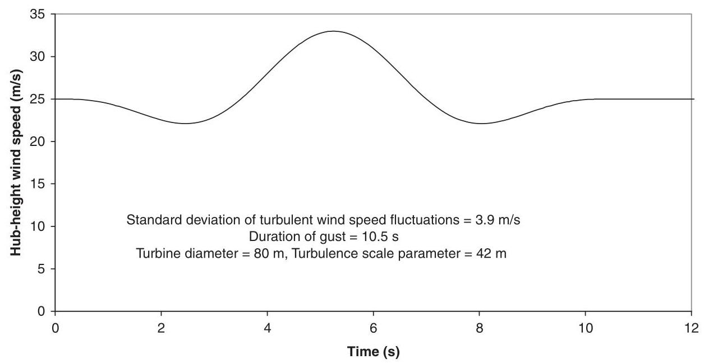

Figure 5.2 IEC 61400-1 Extreme rising and falling gust with 50-year return period for steady wind speed of ${25}\mathrm{\;m}/\mathrm{s}$ and Category A turbulence

The direction change takes place over a period $T$ of six seconds. Normal partial safety factor.

For a hub-height wind speed of ${12}\mathrm{\;m}/\mathrm{s}$ , Class A turbulence, a turbine diameter of ${80}\mathrm{\;m}$ and a turbulence length scale of ${42}\mathrm{\;m}$ , the direction change is ${37}^{ \circ  }$ , with a lower value applying at the cut-out wind speed because of the reduced turbulence intensity.

## Shut-down load cases

[Load case 4.1 is a fatigue load case]

Load case 4.2: Extreme operating gust [EOG - as defined for load case 2.3, above] during shut-down, superimposed on hub-height wind speed of ${U}_{r} \pm  2\mathrm{\;m}/\mathrm{s}$ or ${U}_{\mathrm{o}}$ . Normal partial safety factor.

Load case 5.1: Emergency shut down during operation in turbulent wind field defined by the normal turbulence model [NTM], for steady hub height wind speed of ${U}_{r} \pm  2\mathrm{\;m}/\mathrm{s}$ or ${U}_{\mathrm{o}}$ . Normal partial safety factor.

The characteristic load is to be calculated as for load case 2.1.

#### 5.4.2 Non-operational load cases

## Normal machine state

When non-operational, a turbine is either stationary, that is, 'parked', or idling. In this condition it is exposed to the full range of wind speeds and is therefore required to survive the extreme wind conditions defined for the applicable wind class. IEC 61400-1 permits these wind conditions to be described in terms of either a steady wind speed corresponding to the three second gust with a 50-year return period or a turbulent wind with a ten minute mean equal to the 50-year return value (the 'reference wind speed') and a fixed turbulence intensity of 0.11 .

The 50-year return gust value is defined as 1.4 times the 50-year return ten minute mean. Both gust and ten minute mean are specified at hub height, and are to be used in conjunction with a reduced wind shear exponent of 0.11 .

The magnitude of the 50-year return gust depends on the gust duration chosen, which in turn should be based on the size of the loaded area. For example, the withdrawn British Standard CP3, Chapter V, Part 2 'Code of basic data for the design of buildings: wind loading', states that a three second gust can envelope areas up to ${20}\mathrm{\;m}$ , but advises that for larger areas up to ${50}\mathrm{\;m}$ across, a five second gust is appropriate. However, IEC 61400-1 and the GL rules specify the use of gust durations of three seconds regardless of the turbine size.

Recognising that the turbulent wind speed fluctuations are likely to excite blade and tower natural frequencies, IEC 61400-1 requires turbine dynamic response to be accounted for, whether using the deterministic or turbulent extreme wind models.

It is worth noting that Eurocode 1, Part 1-4 (2005) bases extreme loads on the dynamic pressure resulting from the extreme ten minute mean wind speed rather than a three second gust. The loads resulting from the extreme ten minute mean wind speed are augmented by a factor which takes into account both wind gusting and the excitation of resonant oscillations thereby.

The IEC 61400-1 non-operational load cases in the absence of faults or grid loss cater for varying yaw misalignments and may be summarised as follows:

Load case 6.1: Extreme wind with 50-year return period $\left\lbrack  {\mathrm{{EWM}}}_{50}\right\rbrack$ Yaw misalignment up to $\pm  {15}^{ \circ  }$ using the steady wind model, or up to $\pm  {8}^{ \circ  }$ using the turbulent model, provided resistance against yaw slippage can be guaranteed. Normal partial safety factor.

Load case 6.3: Extreme wind with one-year return period $\left\lbrack  {\mathrm{{EWM}}}_{1}\right\rbrack$ and extreme yaw misalignment of up to $\pm  {30}^{ \circ  }$ using the steady wind model, or up to $\pm  {20}^{ \circ  }$ using the turbulent model. The extreme wind speed with a return period of one year is to be taken as ${80}\%$ of the 50-year return value. Normal partial safety factor.

Loss of grid connection can prevent the yaw system tracking any subsequent changes in wind direction, unless back-up is provided for the operation of the yaw system. Accordingly, IEC 61400-1 specifies loss of grid connection as a separate load case, which is summarised below. The use of the abnormal safety factor indicates that the combination of extreme wind and grid loss is considered rare.

Load case 6.2: Extreme wind with 50-year return period $\left\lbrack  {\mathrm{{EWM}}}_{50}\right\rbrack$ and loss of grid connection. Yaw misalignment due to wind direction change up to $\pm  {180}^{ \circ  }$ unless back-up power for yawing provided. Abnormal partial safety factor.

The consequences of yaw slippage should be investigated in all non-operational load cases, if this is a possibility.

[Load Case 6.4 is a fatigue load case]

## Machine fault state

Examples of faults in this category are ones involving the failure of the yaw or pitch mechanisms. On the assumption that there is no correlation between such a failure and extreme winds, the design wind condition for this load case is normally taken as the extreme wind condition with a return period of one year.

The load case in this category is summarised below.

Load case 7.1: Extreme wind with one-year return period $\left\lbrack  {\mathrm{{EWM}}}_{1}\right\rbrack$ and machine fault. Yaw misalignment up to $\pm  {180}^{ \circ  }$ in case of yaw system fault. Abnormal partial safety factor.

#### 5.4.3 Blade/tower clearance

In addition to checking the acceptability of stresses arising from the above load cases, the designer is also required to check that none can result in a collision between the blade and the tower, even after multiplying the blade tip deflection by the appropriate partial load factor and the partial safety factor for elasticity of the blade material. For load case 1.1 the characteristic blade tip deflection is to be determined by extrapolation in the same manner as the characteristic load.

#### 5.4.4 Constrained stochastic simulation of wind gusts

Although time domain simulations of the turbulent wind field are able to accurately model the behaviour of the wind, very long simulations indeed are required if the extreme events required for design purposes are to be encountered by chance. Rather than select the desired extreme event from an extremely long wind speed time series, it is clearly desirable to 'precipitate' the desired event by constraining the time series in such a way that the statistical properties of the time series are unaffected.

A method of constraining gusts in wind simulations has been set out by Bierbooms (2009). In its simplest form, it consists in superposing a gust profile having the form of the wind speed autocorrelation function on a local maximum of the simulated wind time series. This is illustrated in Figure 5.3.

In this example, the gust magnitude of ${19.5}\mathrm{\;m}/\mathrm{s}$ approximates to the 50-year return value for a Class 1A site, based on exposure to a ${24} - {26}\mathrm{\;m}/\mathrm{s}$ wind speed for about four hours per annum. (The peak factor of five is calculated using Equation A5.42 in the Appendix, taking $v = {0.25}\mathrm{\;{Hz}}$ ) The wind speed auto correlation function, derived from the power spectrum, is multiplied by the desired peak wind speed increment and added to the initial simulated wind speed time series, with the peak of the auto correlation function centred on the selected maximum of the initial time series.

Figure 5.3 Simulated wind speed time series constrained to give a ${44.5}\mathrm{\;m}/\mathrm{s}$ peak wind speed

There is no need for the timing of the peak of the constrained gust to coincide with a maximum of the initial time series. In the general case, the time series of the constrained gust, ${u}_{c}\left( t\right)$ , can be obtained from the initial time series, $u\left( t\right)$ as follows:

$$
{u}_{c}\left( t\right)  = u\left( t\right)  + \kappa \left( {t - {t}_{0}}\right) \left( {A - u\left( {t}_{0}\right) }\right)  - \frac{\dot{\kappa }\left( {t - {t}_{0}}\right) }{\ddot{\kappa }\left( 0\right) }\dot{u}\left( {t}_{0}\right) \tag{5.6}
$$

where $\kappa \left( {t - {t}_{0}}\right)$ is the wind speed autocorrelation function and A the desired peak wind speed at time $t = {t}_{0}$ .

The method can also be extended to gusts constrained to rise by a prescribed amount within a certain time (Bierbooms, 2009). Such gusts are important in relation to the design of pitch-controlled machines.

Although constrained stochastic stimulation appears to be a promising method of modelling extreme events, it is not, as yet, recognised by design standards.

### 5.5 Fatigue loading

#### 5.5.1 Synthesis of fatigue load spectrum

The complete fatigue load spectrum for a particular wind turbine component has to be built up from separate load spectra derived for turbine operation at different wind speeds and from the load cycles experienced at start-up, normal shut-down and while the machine is parked or idling. Firstly the cycle counts for each stress range for one hour's operation in a particular wind speed band are calculated and scaled up by the predicted number of hours of operation in that band over the machine lifetime. This prediction can be based on the Weibull distribution (see Section 2.4), with the annual mean wind speed set according to the turbine class (see Section 5.1.2). Finally, the lifetime cycle counts obtained for operation in the different wind speed bands are combined and added to those calculated for start-ups, shut-downs and periods of non-operation.

### 5.6 Stationary blade loading

#### 5.6.1 Lift and drag coefficients

Maximum blade loadings are in the out-of-plane direction and occur when the wind direction is either approximately normal to the blade, giving maximum drag, or at an angle of between ${12}^{ \circ  }$ and ${16}^{ \circ  }$ to the plane of the blade when the angle of attack is such as to give maximum lift.

In the absence of data on drag coefficients for airflow normal to the blade, designers formerly utilised the drag coefficient for an infinitely long flat plate of 2.0, with an adjustment downwards based on the aspect ratio. Thus, on a typical blade with a mean chord equal to one fifteenth of the radius, the length to width ratio would be taken as 30, because free flow cannot take place around the inboard end of the blade. Following EN 1991-1-4: 2005

'Eurocode 1: Actions on structures - Part 1-4: Wind actions', this would give a drag coefficient of 1.64. However, field measurements have shown that such an approach is unduly conservative, with drag coefficients of 1.24 being reported for the LM 17.2 m blade (Risø) and 1.25 for the Howden HWP-300 blade (Jamieson and Hunter, 1985). The 1992 edition of DS 472 'Loads and Safety of Wind Turbine Construction' stipulated a minimum value of 1.3 for the drag coefficient.

The choice of lift coefficient value is more straightforward, because aerofoil data for low angles of attack is more generally available, and is, in any case, required for assessing rotor performance. The maximum lift coefficient rarely exceeds 1.6, but values down to as low as 1.1 will obtain on the thicker, inboard portion of the blade. The minimum value of lift coefficient of 1.5 specified in the 1992 edition of DS 472 for the calculation of blade out-of-plane loads is, therefore, probably conservative.

#### 5.6.2 Critical configuration for different machine types

It was shown in the preceding section that the maximum lift coefficient is likely to exceed the maximum drag coefficient for a wind turbine blade, so consequently the maximum loading on a stationary blade will occur when the air flow is in a plane perpendicular to the blade axis and the angle of attack is such as to produce maximum lift. For a stall regulated machine, this will be the case when the blade is vertical and the wind direction is ${75}^{ \circ  } - {80}^{ \circ  }$ to the nacelle axis, whereas for a pitch regulated machine the blade only needs to be approximately vertical with a wind direction at ${10}^{ \circ  } - {20}^{ \circ  }$ to the nacelle axis.

#### 5.6.3 Dynamic response

## Tip displacement

Wind fluctuations at frequencies close to the first flapwise mode blade natural frequency excite resonant blade oscillations and result in additional, inertial loadings over and above the quasistatic loads that would be experienced by a completely rigid blade. As the oscillations result from fluctuations of the wind speed about the mean value, the standard deviation of resonant tip displacement can be expressed in terms of the wind turbulence intensity and the normalised power spectral density at the resonant frequency, ${R}_{u}\left( {n}_{1}\right)  = n \cdot  {S}_{u}\left( {n}_{1}\right) /{\sigma }_{u}^{2}$ , as follows:

$$
\frac{{\sigma }_{x1}}{{\bar{x}}_{1}} = 2\frac{{\sigma }_{u}}{\bar{U}}\frac{\pi }{\sqrt{2\delta }}\sqrt{{R}_{u}\left( {n}_{1}\right) }\sqrt{{K}_{Sx}\left( {n}_{1}\right) }. \tag{5.7}
$$

Here ${\bar{x}}_{1}$ is the first mode component of the steady tip displacement, $\bar{U}$ is the mean wind speed (usually averaged over ten minutes), $\delta$ is the logarithmic decrement of damping and ${K}_{Sx}\left( {n}_{1}\right)$ is a size reduction factor, which results from the lack of correlation of the wind along the blade at the relevant frequency. Note that the dynamic pressure, $\frac{1}{2}\rho {U}^{2} = \frac{1}{2}\rho {\left( \bar{U} + u\right) }^{2} = \; \frac{1}{2}\rho \left( {{\bar{U}}^{2} + 2\bar{U}u + {u}^{2}}\right)$ , is linearised to $\frac{1}{2}\rho \bar{U}\left( {\bar{U} + {2u}}\right)$ to simplify the result. See Sections A5.2 in Appendix 5 for the derivations of Equation 5.7 and the expression for ${K}_{Sx}\left( {n}_{1}\right)$ .

## Damping

It is evident from Equation 5.7 that a key determinant of resonant tip response is the level of damping present. Generally the damping consists of two components, aerodynamic and structural. In the case of a vibrating blade flat on to the wind, the aerodynamic force per unit length is given by $\frac{1}{2}\rho {\left( \bar{U} - \dot{x}\right) }^{2}{C}_{D} \cdot  c\left( r\right)  \cong  \rho \bar{U}\dot{x}{C}_{D} \cdot  c\left( r\right)$ , where $\dot{x}$ is the blade flatwise velocity, ${C}_{D}$ the drag coefficient and $c\left( r\right)$ the local blade chord. Hence, the aerodynamic damping per unit length, ${\widehat{c}}_{a}\left( r\right)$ , is $\rho \bar{U}{C}_{D}c\left( r\right)$ and the first mode aerodynamic damping ratio,

$$
{\xi }_{a1} = {c}_{a1}/2{m}_{1}{\omega }_{1} = {\int }_{0}^{R}\frac{{\widehat{c}}_{a}\left( r\right) {\mu }_{1}^{2}\left( r\right) {dr}}{2{m}_{1}{\omega }_{1}}
$$

is given by

$$
{\xi }_{a1} = \rho \bar{U}{C}_{D}{\int }_{0}^{R}\frac{{\mu }_{1}^{2}\left( r\right) c\left( r\right) {dr}}{2{m}_{1}{\omega }_{1}}.
$$

Here ${\mu }_{1}\left( r\right)$ is the first mode shape,

$$
{m}_{1} = {\int }_{0}^{R}m\left( r\right) {\mu }_{1}^{2}\left( r\right) {dr}
$$

is the generalised mass, and ${\omega }_{1}$ is the first mode natural frequency in radians per second. The logarithmic decrement is obtained by multiplying the damping ratio by ${2\pi }$ .

When the wind direction is angled to the blade so as to generate maximum lift, the blade will be approaching stall, with the result that the aerodynamic damping is effectively zero. In this situation tip deflections are limited only by the blade structural damping. Structural damping is discussed in Section 5.8.4, and values for typical blade materials given.

## Root bending moment

The standard deviation of tip displacement in combination with the blade mode shape yields an inertial loading distribution from which the standard deviation of the resulting bending moment at any position along the blade may be calculated. In particular, the standard deviation of the root bending moment may be expressed in terms of the mean root bending moment as follows:

$$
\frac{{\sigma }_{M1}}{\bar{M}} = 2\frac{{\sigma }_{u}}{\bar{U}}\frac{\pi }{\sqrt{2\delta }}\sqrt{{R}_{u}\left( {n}_{1}\right) }\sqrt{{K}_{Sx}\left( {n}_{1}\right) } \cdot  {\lambda }_{M1} = \frac{{\sigma }_{x1}}{{\bar{x}}_{1}} \cdot  {\lambda }_{M1} \tag{5.8a}
$$

where

$$
{\lambda }_{M1} = \frac{{\int }_{0}^{R}m\left( r\right) {\mu }_{1}\left( r\right) {rdr}}{{m}_{1} \cdot  {\int }_{0}^{R}c\left( r\right) {rdr}} \cdot  {\int }_{0}^{R}c\left( r\right) {\mu }_{1}\left( r\right) {dr} \tag{5.8b}
$$

See section A5.5 in the Appendix for the derivation of the expression for ${\lambda }_{M1}$ .

The standard deviation of the quasistatic root bending moment fluctuation, or root bending moment background response is expressed in terms of the mean root bending moment by

$$
\frac{{\sigma }_{MB}}{\bar{M}} = 2\frac{{\sigma }_{u}}{\bar{U}}\sqrt{{K}_{SMB}} \tag{5.9}
$$

where ${K}_{SMB}$ is a size reduction factor to take account of lack of correlation of wind fluctuations along the blade. As shown in Section A5.6 of the Appendix, ${K}_{SMB}$ is usually only slightly less than unity because the blade length is small compared with the integral length scale of longitudinal turbulence measured in the across wind direction.

The variance of the total root bending moment fluctuations is equal to the sum of the resonant and background response variances, that is,

$$
{\sigma }_{M}^{2} = {\sigma }_{M1}^{2} + {\sigma }_{MB}^{2}
$$

Hence,

$$
\frac{{\sigma }_{M}}{\bar{M}} = 2\frac{{\sigma }_{u}}{\bar{U}}\sqrt{{K}_{SMB} + \frac{{\pi }^{2}}{2\delta }{R}_{u}\left( {n}_{1}\right) {K}_{Sx}\left( {n}_{1}\right)  \cdot  {\lambda }_{M1}^{2}} \tag{5.10}
$$

The design extreme root bending moment is typically calculated as that due to the 50-year return, ten minute mean wind speed plus the number of standard deviations of the root bending moment fluctuations corresponding to the likely peak excursion in a ten minute period. Thus,

$$
{M}_{\max } = \bar{M} + g \cdot  {\sigma }_{M} \tag{5.11}
$$

where $g$ is known as the peak factor, and depends on the number of cycles of root bending moment fluctuations in ten minutes, according to the formula

$$
g = \sqrt{2\ln \left( {600v}\right) } + \frac{0.577}{\sqrt{2\ln \left( {600v}\right) }} \tag{5.12}
$$

Here, $v$ is the mean zero-upcrossing frequency of the root bending moment fluctuations, which will be intermediate between that of the quasistatic wind loading and the blade natural frequency, ${n}_{1}$ - see Section A5.7 of the Appendix. (Note that, as $g$ varies relatively slowly with frequency, it is a reasonable approximation to set $g$ at an upper limit of 3.9, which corresponds to a frequency of about ${1.9}\mathrm{\;{Hz}}$ .)

Substituting Equation 5.10 into Equation 5.11 yields

$$
{M}_{\max } = \bar{M}\left\lbrack  {1 + g\frac{{\sigma }_{M}}{\bar{M}}}\right\rbrack   = \bar{M}\left\lbrack  {1 + g\left( {2\frac{{\sigma }_{u}}{\bar{U}}}\right) \sqrt{{K}_{SMB} + \frac{{\pi }^{2}}{2\delta }{R}_{u}\left( {n}_{1}\right) {K}_{Sx}\left( {n}_{1}\right)  \cdot  {\lambda }_{M1}^{2}}}\right\rbrack \tag{5.13}
$$

The expression in square brackets is similar to the numerator of the structural factor, ${c}_{s}{c}_{d}$ , in EN 1991-1-4: 2005

$$
{c}_{s}{c}_{d} = \frac{1 + 2{k}_{p}{I}_{v}\left( {z}_{s}\right) \sqrt{{B}^{2} + {R}^{2}}}{1 + 7{I}_{v}\left( {z}_{s}\right) } \tag{5.14}
$$

in which ${R}^{2} = \left( {{\pi }^{2}/{2\delta }}\right) {R}_{u}\left( {n}_{1}\right) {K}_{Sx}\left( {n}_{1}\right)$ .

It is often necessary to express the maximum moment in terms of the quasistatic moment due to the 50-year return gust speed, ${U}_{e50}$ . In order to do this, we equate the latter quantity to the quasistatic component of Equation 5.13, obtaining

$$
{C}_{f} \cdot  \frac{1}{2}\rho {U}_{e50}^{2}{\int }_{0}^{R}c\left( r\right)  \cdot  r \cdot  {dr} = \bar{M}\left( {1 + {g}_{0} \cdot  2\frac{{\sigma }_{u}}{\bar{U}}\sqrt{{K}_{SMB}}}\right) \tag{5.15}
$$

Here, the peak factor $g$ takes a lower value, ${g}_{0,}$ corresponding to the lower frequency of the quasistatic root bending moment fluctuations. Equation 5.15 can then be combined with Equation 5.13 to yield

$$
{M}_{\max } = {C}_{f} \cdot  \frac{1}{2}\rho {U}_{e50}^{2}{\int }_{0}^{R}c\left( r\right)  \cdot  r \cdot  {dr} \cdot  {Q}_{D} \tag{5.16}
$$

where ${Q}_{D}$ is a dynamic factor given by

$$
{Q}_{D} = \frac{1 + g\left( {2\frac{{\sigma }_{u}}{\bar{U}}}\right) \sqrt{{K}_{SMB} + \frac{{\pi }^{2}}{2\delta }{R}_{u}\left( {n}_{1}\right) {K}_{Sx}\left( {n}_{1}\right)  \cdot  {\lambda }_{M1}^{2}}}{1 + {g}_{0}\left( {2\frac{{\sigma }_{u}}{\bar{U}}}\right) \sqrt{{K}_{SMB}}} \tag{5.17}
$$

The dynamic factor ${Q}_{D}$ equates to the EN 1991-1-4 dynamic factor, ${c}_{d}$ , if ${g}_{0}$ is 3.5 and the ratio ${\lambda }_{M1}$ is unity. The EN 1991-1-4 structural factor, ${c}_{s}$ , given in Equation 5.14 is the product of the dynamic factor, ${c}_{d}$ , and the size factor, ${c}_{s}$ , given by ${c}_{s} = \left( {1 + 7 \cdot  {I}_{v}\left( {z}_{s}\right) \sqrt{{B}^{2}}}\right) /\left( {1 + 7 \cdot  {I}_{v}\left( {z}_{s}\right) }\right)$ .

There is considerable advantage in starting with the extreme gust speed and calculating the extreme root moment as the product of ${C}_{f} \cdot  \frac{1}{2}\rho {U}_{e50}^{2}{\int }_{0}^{R}c\left( r\right)  \cdot  r \cdot  {dr}$ and ${Q}_{D}$ , because it eliminates most of the error associated with linearising the formula for dynamic pressure. For example, if the extreme gust is 1.4 times the extreme ten minute mean wind speed, as postulated in IEC 61400-1 (which implies that the product ${g}_{0}\left( {{\sigma }_{u}/\bar{U}}\right)$ is 0.4 ), then the dynamic pressure due to the gust will be ${1.4}^{2} = {1.96}$ times that due to the ten minute mean, rather than 1.8 times as given by the formula $1 + {g}_{0}\left( {2\left( {{\sigma }_{u}/\bar{U}}\right) }\right)$ .

## Example 5.1

Evaluate the dynamic factor, ${Q}_{D}$ , for the blade root bending moment for a ${40}\mathrm{\;m}$ long stationary blade under extreme loading.

Consider a trial ${40}\mathrm{\;m}$ long blade design (designated Blade T40) utilising NACA 632XX aerofoil sections with the chord and thickness distributions shown in Figure 5.4a. The thickness distribution has a pronounced knee near mid span to minimise the thickness to chord ratio in the outer half of the span. Assuming a uniform skin thickness along the blade, apart from local thickening at the root, the resulting mass and stiffness distributions are as shown in Figure 5.4b. Modal analysis as described in Section 5.8.2 yields the first and second mode shapes shown in Figure 5.4c. The first mode shape for a blade of constant cross-section (i.e. a uniform cantilever) is also shown for comparison purposes, and it is evident that the high stiffness of the inboard portion of the tapered blade results in dramatically reduced deflections there as a proportion of tip deflection. For a fibreglass blade, typical values of the Young's modulus and material density would be 40,000 N/sqmm and 1.7 Tonnes $/{\mathrm{m}}^{3}$ respectively, resulting in a first mode natural frequency of ${0.824}\mathrm{\;{Hz}}$ , and a second mode natural frequency of ${2.86}\mathrm{\;{Hz}}$ .

Figure 5.4 (a) Blade 'T40' chord and thickness distributions; (b) Blade 'T40' mass and stiffness distribution; (c) Blade ’T40’ ${1}^{\text{ st }}$ and ${2}^{\text{ nd }}$ mode shapes

Figure 5.4 (Continued)

Values of the other parameters assumed are:

Blade height, $z$ 70 metres

50 year return ten minute mean wind speed at blade height, $\bar{U} \; {50}\mathrm{\;m}/\mathrm{s}$

Eurocode 1 terrain category

Turbulence intensity,

$$
I\left( z\right)  = 1/\ln \left( {z/{z}_{0}}\right)
$$

0.113

The corresponding integral length scale for longitudinal turbulence is ${189}\mathrm{\;m}$ according to EN 1991-1-4: 2005.

The values of the parameters in Equation 5.7 governing the resonant tip response are determined as follows:

(a) The aerodynamic damping is assumed to be zero, so the damping logarithmic decrement is taken as 0.05 , corresponding to the structural damping value for fibreglass.

(b) The non-dimensional power spectral density of longitudinal wind turbulence, ${R}_{u}\left( n\right)  = n \cdot  {S}_{u}\left( {n}_{1}\right) /{\sigma }_{u}^{2}$ , is calculated at the blade first mode natural frequency of 0.824 Hz according the Kaimal power spectrum defined in EN 1991-1-4 (Equation A5.8 in the Appendix) as 0.0631.

(c) A value of ten is taken for the non-dimensional decay constant, $C$ , in the exponential expression for the normalised co-spectrum used in the derivation of the size reduction factor, ${K}_{Sx}\left( {n}_{1}\right)$ , in Equation A5.25.

The various stages in the derivation of the extreme root bending moment and the dynamic factor, ${Q}_{D}$ , are set out below. The figures in square brackets are the corresponding values obtained using the method of Annex C of EN1991-1-4: 2005, which are included for comparison.

Size reduction factor for resonant response, ${K}_{Sx}\left( {n}_{1}\right)$ 0.431 (Equation [0.322]

A5.25)

tio of standard deviation of resonant tip displacement to (Equation the first mode component of steady tip displacement, [N/A]

A5.7)

$$
\frac{{\sigma }_{y1}}{{\bar{y}}_{1}} = 2\frac{{\sigma }_{u}}{\bar{U}}\frac{\pi }{\sqrt{2\delta }}\sqrt{{R}_{u}\left( {n}_{1}\right) }\sqrt{{K}_{Sx}\left( {n}_{1}\right) }
$$

$$
= 2 \times  {0.113} \times  {9.935} \times  \sqrt{0.0631} \times  \sqrt{0.431}
$$

$$
= 2 \times  {0.113} \times  {9.935} \times  {0.251} \times  {0.657}
$$

$$
= 2 \times  {0.113} \times  {1.638}
$$

0.370

Root moment factor, ${\lambda }_{\mathrm{M}1}$ 0.584 (Equation [N/A]

5.8b)

Ratio of standard deviation of resonant root moment to mean value,

$$
\frac{{\sigma }_{M1}}{\bar{M}} = \frac{{\sigma }_{x1}}{{\bar{x}}_{1}}{\lambda }_{M1}
$$

0.216 (Equation [0.320]

5.8a)

Size reduction factor for quasistatic or background response, ${K}_{SMB}$ 0.829 (Equation [0.871]

A5.40)

Ratio of standard deviation of quasistatic root moment response to mean value,

$$
\frac{{\sigma }_{MB}}{\bar{M}} = 2\frac{{\sigma }_{u}}{\bar{U}}\sqrt{{K}_{SMB}} = 2 \times  {0.113} \times  {0.910}
$$

0.206 (Equation 5.9) [0.197]

Ratio of standard deviation of total root moment response to mean value,

$$
\frac{{\sigma }_{M}}{\bar{M}} = \sqrt{{\left( \frac{{\sigma }_{MB}}{\bar{M}}\right) }^{2} + {\left( \frac{{\sigma }_{M1}}{\bar{M}}\right) }^{2}} = \sqrt{{0.206}^{2} + {0.216}^{2}}
$$

0.298[0.376]

Zero up-crossing frequency of quasistatic response, ${n}_{0}$ 0.343 (Equation [N/A]

$\mathrm{{Hz}}\;$ A5.57)

Zero up-crossing frequency of total root moment response, $v$ 0.642 (Equation[N/A]

Hz A5.54)

Peak factor, $g$ , based on $v$ 3.62 (Equation[3.64]

5.12)

Ratio of extreme moment to mean value,

$$
\frac{{M}_{\max }}{\bar{M}} = 1 + g\left( \frac{{\sigma }_{M}}{\bar{M}}\right)  = 1 + {3.62}\left( {0.298}\right)
$$

2.08 (Equation[2.57]

5.13)

Peak factor, ${g}_{0}$ , based on ${n}_{0}$ 3.44[3.5]

Ratio of quasistatic component of extreme moment to mean value

$$
= 1 + {g}_{0}\frac{{\sigma }_{MB}}{\bar{M}} = 1 + {3.44}\left( {0.206}\right)
$$

1.708 (Equation[1.79]

5.15)

Dynamic factor, ${Q}_{D} = {2.08}/{1.708}$ 1.218 (Equation[1.40]

5.17)

It is apparent that the EN 1991-1-4 method yields a significantly larger value of the extreme root bending moment. However, the EN 1991-1-4 ratio of extreme to mean bending moment is intended to apply at all points along the blade, so a conservative value at the root is inescapable, as is shown in the next section which examines the variation of bending moment along the blade.

## Spanwise variation of bending moment

The resonant and quasistatic components of bending moments at intermediate positions along the blade can be related to those at the root in a straightforward way.

As far as the quasistatic bending moment fluctuations are concerned, the variation along the blade follows closely the bending moment variation due to the steady loading, although slight changes in the size reduction factor have a small effect. The bending moment diagram for the resonant oscillations is, however, of a very different shape, because of the dominance of the inertia loading on the tip. An expression for the resonant bending moment variation along the blade is given in section A5.8 of the Appendix, and it is plotted out for the example above in Figure 5.5a, with the quasistatic bending moment variation alongside for comparison. It is seen that the resonant bending moment diagram is closer to linear than the quasistatic one, which approximates to a parabola.

A consequence of the much slower decay of the resonant BM out towards the tip is an increase in the ratio of the resonant bending moment standard deviation to the local steady moment with radius. This results in an increase in the dynamic magnification factor, ${Q}_{D}$ , from 1.22 at the root to 1.96 near the tip for the example above (see Figure 5.5b).

### 5.7 Blade loads during operation

#### 5.7.1 Deterministic and stochastic load components

It is normal to separate out the loads due to the steady wind on the rotating blade from those due to wind speed fluctuations and analyse them in different ways. The periodic loading on the blade due to the steady spatial variation of wind speed over the rotor swept area is termed the deterministic load component, because it is uniquely determined by a limited number of parameters, that is, the hub-height wind speed, the rotational speed, the wind shear and so on. On the other hand, the random loading on the blade due to wind speed fluctuations (i.e. turbulence) has to be described probabilistically, and is therefore termed the stochastic load component.

In addition to wind loading, the rotating blade is also acted on by gravity and inertial loadings. The gravity loading depends simply on blade azimuth and mass distribution, and is thus deterministic, but the inertial loadings will be affected by turbulence - as, for example, in the case of a teetering rotor, or a flexing blade - and so will contain stochastic as well as deterministic components.

#### 5.7.2 Deterministic aerodynamic loads

## Steady, uniform flow perpendicular to plane of rotor

The application of momentum theory to a blade element, which is described in Section 3.5.3, enables the aerodynamic forces on the blade to be calculated at different radii. Equations 3.54 and 3.55 are solved iteratively for the flow induction factors, $a$ and ${a}^{\prime }$ , at each radius, enabling the flow angle, $\phi$ , the angle of attack, $\alpha$ , and hence the lift and drag coefficients to be determined.

Figure 5.5 (a) Spanwise variation of resonant and quasistatic moments - Blade 'T40'; (b) Spanwise variation of (i) fluctuating bending moment distributions in terms of local steady bending moment and (ii) dynamic magnification factor - for Blade 'T40'

Figure 5.6 Distribution of blade in-plane and out-of-plane aerodynamic loads during operation of typical ${80}\mathrm{\;m}$ diameter stall-regulated machine in a steady, uniform $8\mathrm{\;m}/\mathrm{s}$ wind

For loadings on the outboard portion of the blade, allowance for tip loss must be made, so Equations 3.54 and 3.55 are replaced by Equations 3.54b and 3.55a in Section 3.8.6. These equations can be arranged to give the following expressions for the forces per unit length on an element perpendicular to the plane of rotation and in the direction of blade motion, known as the out-of-plane and in-plane forces respectively:

Out-of-plane force per unit length,

$$
{F}_{X} = {C}_{x} \cdot  \frac{1}{2}\rho {W}^{2} \cdot  c = {4\pi \rho } \cdot  {U}_{\infty }^{2}\left( {1 - {af}}\right) a \cdot  \frac{f}{N}r \tag{5.18}
$$

In-plane force per unit length,

$$
{F}_{Y} = {C}_{y} \cdot  \frac{1}{2}\rho {W}^{2} \cdot  c = {4\pi \rho } \cdot  \Omega {U}_{\infty }\left( {1 - {af}}\right) {a}^{\prime } \cdot  \frac{f}{N}{r}^{2} \tag{5.19}
$$

The parameters in the expressions are as defined in Chapter 3. $f$ is the tip loss factor, and $N$ is the number of blades.

The variation of the in-plane and out-of-plane forces with radius is shown in Figure 5.6 for a typical machine operating in a steady $8\mathrm{\;m}/\mathrm{s}$ wind speed. The ${80}\mathrm{\;m}$ stall-regulated turbine considered in this example is fitted with three 'T40' blades as described in Example 5.1 and rotates at 15 rpm. The blade twist distribution is linear, and selected to produce the maximum energy yield for an annual mean wind speed of ${7.5}\mathrm{\;m}/\mathrm{s}$ . It is evident that the out-of-plane load per unit length increases approximately linearly with radius, in spite of the reducing blade chord until the effects of tip loss are felt beyond about ${80}\%$ of tip radius. Note that the form of the variation would be the same for any combination of rotational speed, wind speed and tip radius yielding the same tip speed ratio, because it is the tip speed ratio that determines the radial distribution of flow angle $\phi$ , and of the induction factors $a$ and ${a}^{\prime }$ .

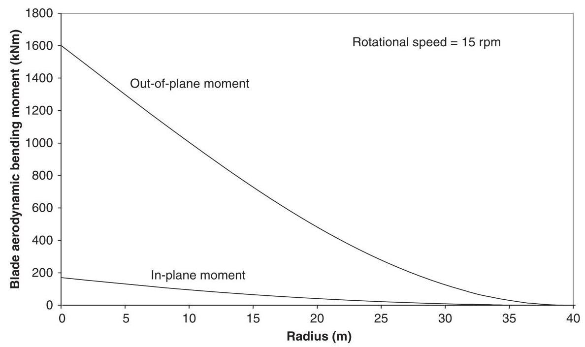

Figure 5.7 Distribution of blade in-plane and out-of-plane aerodynamic bending moments during operation of typical ${80}\mathrm{\;m}$ diameter stall-regulated machine in a steady, uniform $8\mathrm{\;m}/\mathrm{s}$ wind

Integration of these forces along the blade then yields in-plane and out-of-plane aerodynamic blade bending moments. The variation of these moments with radius is shown in Figure 5.7 for the example above. The blade bending moments effectively decrease linearly with increasing radius over the inboard third of the blade because of the concentration of loading outboard.

The variation of the blade root out-of-plane bending moment with wind speed is illustrated in Figure 5.8 for the ${80}\mathrm{\;m}$ diameter example machine described above. As explained in Section 3.9, the phenomenon of stall delay results in significantly increased values of the lift coefficient at higher wind speeds on the inboard section of the rotating blade than predicted by static aerofoil data, such as that reproduced in Figure 3.45. Accordingly, Figure 5.8 and the other figures referred to in this section have been derived using realistic aerofoil data for a rotating LM-19.0 blade reported in Petersen et al. (1998), which is based on an empirical modification of static or 2D aerofoil data. The modified data is reproduced in Figure 5.9, and displays much higher lift coefficients for the thicker, inboard blade sections at high angles of attack than for the thinner, outboard blade sections because of stall delay at the inboard sections.

Figure 5.8 shows the blade root out-of-plane bending moment increasing nearly linearly with wind speed at first and then levelling off, becoming almost constant for winds between ${12}\mathrm{\;m}/\mathrm{s}$ and ${16}\mathrm{\;m}/\mathrm{s}$ , as the blade goes into stall. Thereafter the root moment increases again, but much more gently than before.

Also shown in Figure 5.8 is the variation of blade root out-of-plane bending moment with wind speed for the same machine with pitch regulation to limit the power output to ${1600}\mathrm{{kW}}$ . It is evident that the bending moment drops away rapidly at wind speeds above rated.

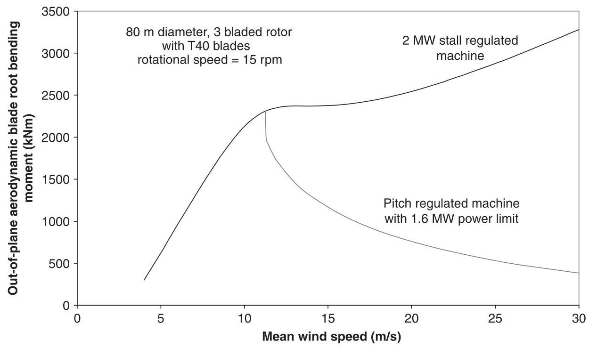

Figure 5.8 Blade out-of-plane root bending moment during operation is steady, uniform wind - variation with wind speed for similar stall-regulated and pitch-regulated machines

Figure 5.9 Aerofoil data for LM 19.0 blade for various thickness/chord ratios (from Petersen et al. (1998))

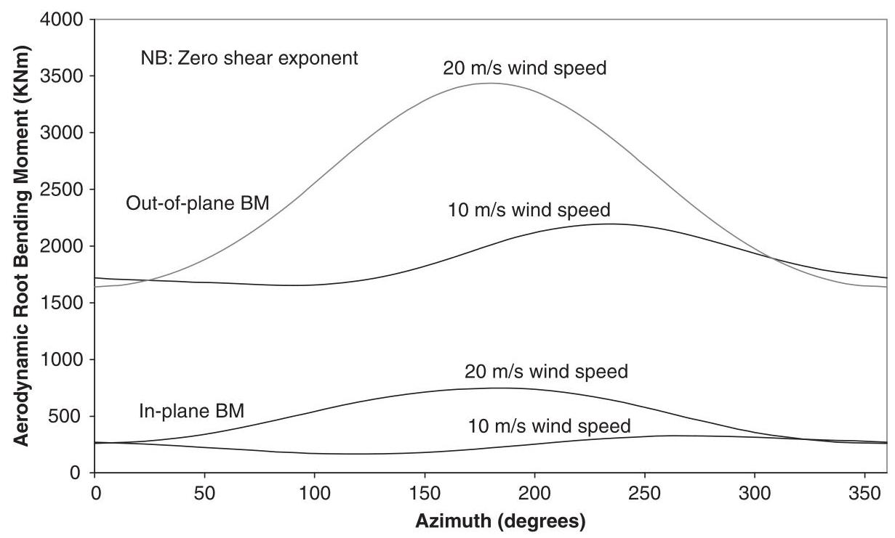

Figure 5.10 Variation of blade root bending moment with azimuth, for typical ${80}\mathrm{\;m}$ diameter stall-regulated machine operating at a steady ${30}^{ \circ  }$ yaw

## Yawed flow

The application of blade-element momentum theory to steady yawed flow is described in Section 4.2.8. This methodology has been used to derive Figure 5.10, which shows the variation of the blade root out-of-plane and in-plane moments with azimuth for the ${80}\mathrm{\;m}$ diameter stall-regulated machine described above, operating at a steady yaw angle of $+ {30}^{ \circ  }$ . Note that the blade azimuth is measured in the direction of blade rotation, from a zero value at top dead centre, and the yaw angle is defined as positive when the lateral component of air flow with respect to the rotor disc is in the same direction as the blade movement at zero azimuth.

Figure 5.10 reveals a distinct difference between the behaviour at ${10}\mathrm{\;m}/\mathrm{s}$ and ${20}\mathrm{\;m}/\mathrm{s}$ . In the latter case, the bending moment variation is sinusoidal with a maximum value at ${180}^{ \circ  }$ azimuth, indicating that the variation is dominated by the effect of the fluctuation of the air velocity relative to the blade, $W$ . At ${10}\mathrm{\;m}/\mathrm{s}$ , however, the maximum out-of-plane bending moment occurs at about ${240}^{ \circ  }$ azimuth, suggesting that the non-uniform component of induced velocity, ${u}_{1}$ (Equation 4.20) is also significant. As wind speed increases, of course, the induction factor, a, becomes small, reducing the impact of ${u}_{1}$ .

## Shaft tilt

Upwind machines, that is, wind turbines with the rotor positioned between the tower and the oncoming wind, - normally have the rotor shaft tilted upwards by several degrees in order to increase the clearance between the rotor and the tower. Thus, as for the case of yaw misalignment, the flow is inclined to the rotor shaft axis, but tilted upwards rather than sideways, so the treatment of shaft tilt mirrors that of yawed flow.

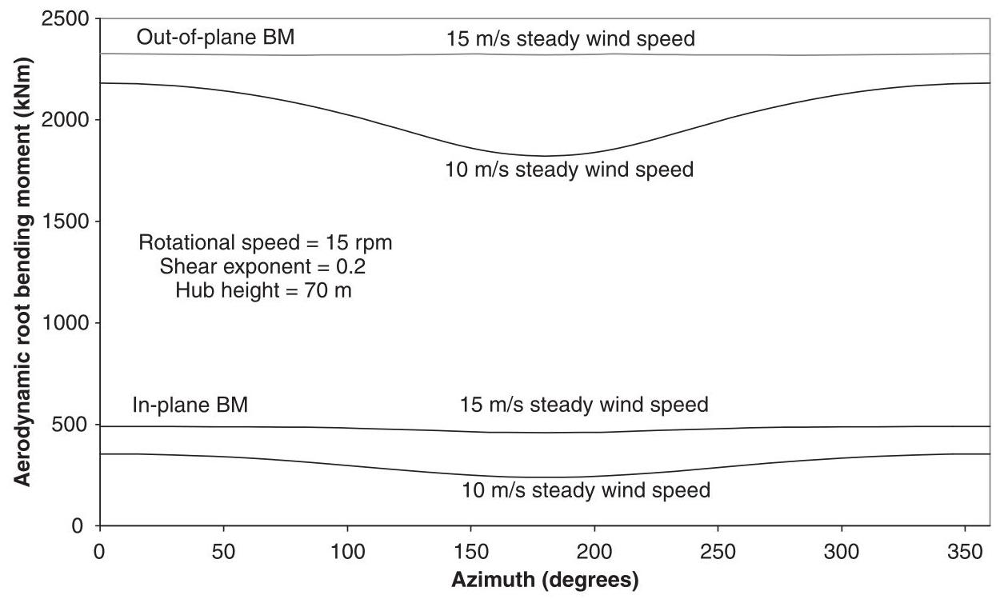

Figure 5.11 Variation of blade root bending moments with azimuth due to wind shear, for typical ${80}\mathrm{\;m}$ diameter stall-regulated machine operating in steady hub height winds of ${10}\mathrm{\;m}/\mathrm{s}$ and ${15}\mathrm{\;m}/\mathrm{s}$ (shear exponent $= {0.2}$ )

## Wind shear

The increase of wind speed with height is known as wind shear. The theoretical logarithmic profile, $U\left( z\right)  \propto  \ln \left( {z/{z}_{0}}\right)$ , is usually approximated by the power law, $U\left( z\right)  \propto  {\left( z/{z}_{\text{ ref }}\right) }^{\alpha }$ for wind turbine design purposes. The appropriate value of the exponent $\alpha$ increases with the surface roughness, ${z}_{0}$ , with a figure of 0.14 typically quoted for level countryside, although the speed up of airflow close to the ground over rounded hills usually results in a lower value at hill tops. As already noted, IEC 61400-1 specifies a conservative value of 0.20.

In applying momentum theory to this case, the velocity component at right angles to the plane of rotation is expressed as ${U}_{\infty }{\left( 1 + r\cos \psi /{z}_{\text{ hub }}\right) }^{\alpha }\left( {1 - a}\right)$ . The variation of blade root bending moments with azimuth due to wind shear is illustrated in Figure 5.11 for the example ${80}\mathrm{\;m}$ diameter stall regulated machine, taking the exponent as 0.20, the hub-height as ${70}\mathrm{\;m}$ and considering hub-height wind speeds of ${10}\mathrm{\;m}/\mathrm{s}$ and ${15}\mathrm{\;m}/\mathrm{s}$ . In the former case, the variation is nearly sinusoidal, but in the latter case the root bending moments are effectively constant, as the blade is in stall.

## Tower shadow

The blocking of the air flow by the tower results in regions of reduced wind speed both upwind and downwind of the tower. This reduction is more severe for tubular towers than for lattice towers and, in the case of tubular towers, is larger on the downwind side because of flow separation. As a consequence, designers of downwind machines usually position the rotor plane well clear of the tower to minimise the interference effect.

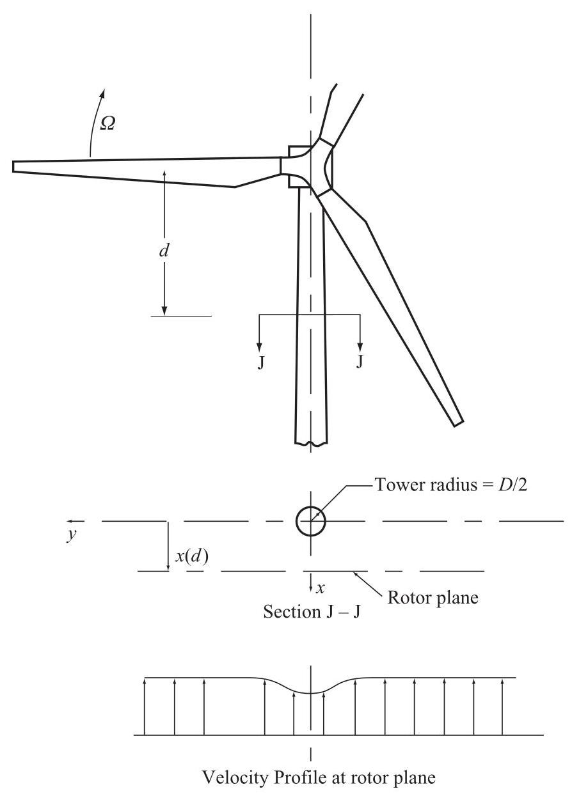

Figure 5.12 Tower shadow parameters

The velocity deficits upwind of a tubular tower can be modelled using potential flow theory. The flow around a cylindrical tower is derived by superposing a doublet, that is, a source and sink at very close spacing, on a uniform flow, ${U}_{\infty }$ , giving the stream function:

$$
\psi  = {U}_{\infty }y\left( {1 - \frac{{\left( D/2\right) }^{2}}{{x}^{2} + {y}^{2}}}\right) \tag{5.20}
$$

where $D$ is the tower diameter, and $x$ and $y$ are the longitudinal and lateral co-ordinates with respect to the tower centre - see Figure 5.12. Differentiation of $\psi$ with respect to $y$ yields the following expression for the flow velocity in the $x$ direction:

$$
U = {U}_{\infty }\left( {1 - \frac{{\left( D/2\right) }^{2}\left( {{x}^{2} - {y}^{2}}\right) }{{\left( {x}^{2} + {y}^{2}\right) }^{2}}}\right) \tag{5.21}
$$

Figure 5.13 Profile of velocity deficit due to tower shadow at different distances $x/D$ upwind of tower centreline

The second term within the brackets, which is the velocity deficit as a proportion of the undisturbed wind speed, is plotted out against the lateral co-ordinate, $y$ , divided by tower diameter, for a range of upwind distances, $x$ , in Figure 5.13. The velocity deficit on the flow axis of symmetry is equal to ${U}_{\infty }{\left( D/2x\right) }^{2}$ and the total width of the deficit region is twice the upwind distance. Consequently the velocity gradient encountered by a rotating blade decreases rapidly as the upwind distance, $x$ , increases.

The effect of tower shadow on blade loading can be estimated by setting the local velocity component at right angles to the plane of rotation equal to $U\left( {1 - a}\right)$ in place of ${U}_{\infty }\left( {1 - a}\right)$ , and applying blade element theory as usual. Results for blade root bending moments for the example ${80}\mathrm{\;m}$ diameter stall-regulated machine are given in Figure 5.14, assuming a tower diameter of $4\mathrm{\;m}$ and ignoring dynamic effects. The plots show the variation of in-plane and out-of-plane root moments with azimuth during operation in wind speeds of ${10}\mathrm{\;m}/\mathrm{s}$ and ${20}\mathrm{\;m}/\mathrm{s}$ , for a blade-tower clearance equal to the tower radius, that is, for $x/D = 1$ . Note that the dip in out-of-plane bending moment is more severe at the lower wind speed. Also shown are ${10}\mathrm{\;m}/\mathrm{s}$ plots for $x/D = {1.5}$ , which exhibit a much less severe disturbance.

In the case of downwind turbines, the flow separation and generation of eddies which take place are less amenable to analysis, so empirical methods are used to estimate the mean velocity deficit. Commonly the profile of the velocity deficit is assumed to be of cosine form, so that

$$
U = {U}_{\infty }\left( {1 - k{\cos }^{2}\left( \frac{\pi y}{\delta }\right) }\right) \tag{5.22}
$$

where $\delta$ is the total width of the deficit region. The slight enhancement of velocities beyond the deficit region is usually ignored. See also Section 6.13.2.

Figure 5.14 Variation of blade root out-of-plane bending moment with azimuth due to tower shadow, for typical ${80}\mathrm{\;m}$ diameter stall-regulated upwind machine operating in steady, uniform winds of ${10}\mathrm{\;m}/\mathrm{s}$ and ${20}\mathrm{\;m}/\mathrm{s}$

The sharp dip in blade loading caused by tower shadow is more prone to excite blade oscillations than the smooth variations in load due to wind shear, shaft tilt and yaw, and this aspect is considered in the section on blade dynamic response.

## Wake effects

Within a wind farm it is common for one turbine to be operating wholly or partly in the wake of another. In the latter case, which is more severe, the downwind turbine is effectively subjected to horizontal wind shear, and the blade load fluctuations can be analysed accordingly.

#### 5.7.3 Gravity loads

Gravity loading on the blade results in a sinusoidally varying edgewise bending moment which reaches a maximum when the blade is horizontal, and which changes sign from one horizontal position to the other. It is, thus, a major source of fatigue loading. For the blade ’T40’ (see Example 5.1), the maximum gravity moment, ${\int }_{0}^{R}m\left( r\right) {rdr}$ is ${2140}\mathrm{{kNm}}$ , so the edgewise bending moment range due to gravity is ${4280}\mathrm{{KNm}}$ . This dwarfs the variations in edgewise moment due to yaw or wind shear, which are typically one tenth this value or less. The spanwise distribution of gravity bending moment is shown in Figure 5.15 for blade 'T40'.

#### 5.7.4 Deterministic inertia loads

## Centrifugal loads

For a rigid blade rotating with its axis perpendicular to the axis of rotation, the centrifugal forces generate a simple tensile load in the blade which at radius ${r}^{ * }$ is given by the expression ${\Omega }^{2}{\int }_{r * }^{R}m\left( r\right) {rdr}$ . As a result the fluctuating stresses in the blade arising from all loading sources always have a tensile bias during operation. For blade 'T40' rotating at 15 rpm, the centrifugal force at the root amounts to ${540}\mathrm{{KN}}$ - approximately three and a half times its weight.

Figure 5.15 Blade 'T40' gravity bending moment distribution

Thrust loading causes flexible blades to deflect downwind, with the result that the centrifugal forces generate blade out-of-plane moments in opposition to those due to the thrust. This reduction of the moment due to thrust loading is known as centrifugal relief. The phenomenon is non-linear, so iterative techniques are required to arrive at a solution. Greater centrifugal relief can be obtained by coning the rotor so that the blades are inclined downwind in the first place. A balance can be struck so that the maximum forward out-of-plane moment due centrifugal loads in very low wind is approximately equal to the maximum rearward out-of-plane moment due to the thrust loading in combination with centrifugal loads during operation in rated wind.

## Gyroscopic loads

When an operating machine yaws, the blades experience gyroscopic loads perpendicular to the plane of rotation. Consider the point A on a rotor rotating clockwise at a speed of $\Omega$ rad/sec, as illustrated in Figure 5.16. The instantaneous horizontal velocity component of point A due to rotor rotation is ${\Omega z}$ , where $z$ is the height of the point above the hub. If the machine is yawing clockwise in plan at a speed of $\Lambda \mathrm{{rad}}/\mathrm{{sec}}$ , then it can be shown that point A accelerates at ${2\Omega \Lambda z}$ towards the wind, assuming the rotor is rigid. Integrating the resulting inertial force over the blade length gives the following expression for blade root out-of-plane bending moment:

$$
{M}_{Y} = {\int }_{0}^{R}{2\Omega \Lambda zr} \cdot  m\left( r\right) {dr} = {2\Omega \Lambda }\cos \psi {\int }_{0}^{R}{r}^{2}m\left( r\right) {dr} = {2\Omega \Lambda }\cos \psi  \cdot  {I}_{B} \tag{5.23}
$$

where ${I}_{B}$ is the blade inertia about the root.

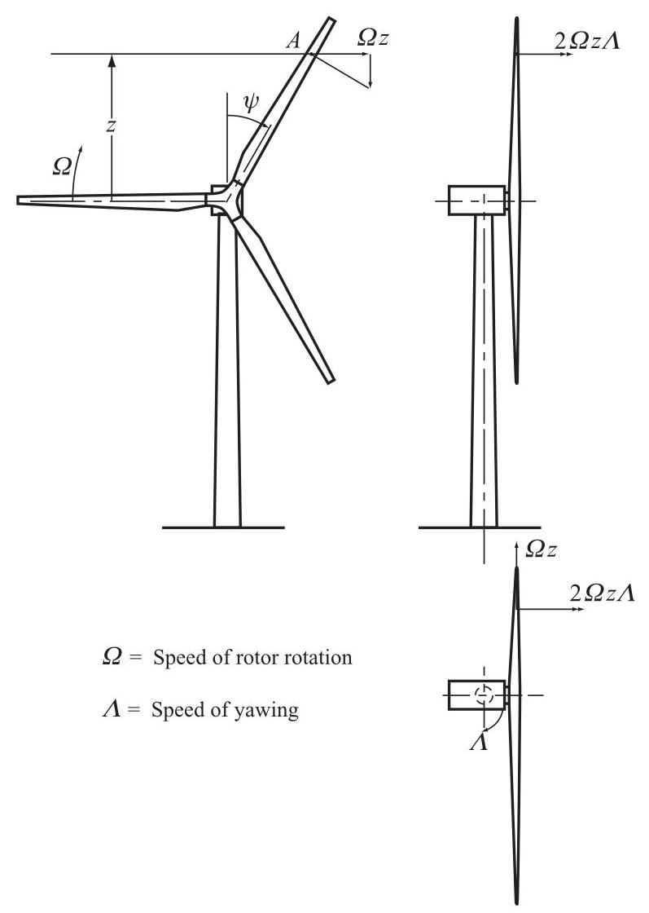

Figure 5.16 Gyroscopic acceleration of a point on a yawing blade

As an example, consider an ${80}\mathrm{\;m}$ diameter machine with ’T40’ blades yawing at ${1}^{ \circ  }$ per second during operation at ${15}\mathrm{{rpm}}$ . The blade root inertia is ${4910}{\mathrm{\;{Tm}}}^{2}$ , so the maximum value of ${M}_{Y}$ is $2\left( {\pi /2}\right) \left( {0.0175}\right) {4910} = {270}\mathrm{{KNm}}$ . This is only about ${10}\%$ of the maximum out-of-plane moment due to aerodynamic loads.

## Braking loads

Rotor deceleration due to mechanical braking introduces edgewise blade bending moments which are additive to the gravity moments on a descending blade.

## Teeter loads

Blade out-of-plane root bending moments can be eliminated entirely by mounting each blade on a hinge so that it is free to rotate in the fore-aft direction. Although centrifugal forces are effective in controlling the cone angle of each blade at normal operating speeds, the need for alternative restraints during start-up and shut-down means that such hinges are rarely used. However, in the case of two-bladed machines, it is convenient to mount the whole rotor on a single shaft hinge allowing fore-aft rotation or 'teetering', and this arrangement is frequently adopted in order to reduce out-of-plane bending moment fluctuations at the blade root, and to prevent the transmission of blade out-of-plane moments to the low speed shaft. As teetering is essentially a dynamic phenomenon, consideration of teeter behaviour is deferred to Section 5.8.

#### 5.7.5 Stochastic aerodynamic loads: analysis in the frequency domain

As noted in Section 5.7.1, the random loadings on the blade due to short-term wind speed fluctuations are known as stochastic aerodynamic loads. The wind speed fluctuations about the mean at a fixed point in space are characterised by a probability distribution - which, for most purposes, can be assumed to be normal - and by a power spectrum which describes how the energy of the fluctuations is distributed between different frequencies (see Sections 2.6.3 and 2.6.4).

The stochastic loads are most conveniently analysed in the frequency domain, but in order to facilitate this, it is usual to assume a linear relation between the fluctuation, $u$ , of the wind speed incident on the aerofoil and the resultant loadings. This is a reasonable assumption for an unstalled blade at high tip speed ratio, as will be shown. The fluctuating aerodynamic lift per unit length, $L$ , is $\frac{1}{2}\rho {W}^{2}{C}_{L}c$ , where $W$ is the air velocity relative to the blade, ${C}_{L}$ is the lift coefficient and the drag term is ignored. Because the flow angle, $\phi$ , is small at high tip-speed ratio, $\lambda$ , the relative air velocity, $W$ , can be assumed to be changing much more slowly with the wind speed than ${C}_{L}$ , so that ${dW}/{du}$ can be ignored. As a result,

$$
\frac{dL}{du} = \frac{1}{2}\rho {W}^{2}c\frac{d{C}_{L}}{d\alpha }\frac{d\alpha }{du}\;\text{ where }\alpha \text{ , the angle of attack } = \phi  - \beta \tag{5.24}
$$

If the blades are not pitching, then the local blade twist, $\beta$ , is constant, so that ${d\alpha }/{du} = {d\phi }/{du}$ . To preserve linearity, it is necessary to assume that the rate of change of lift coefficient with angle of attack, $d{C}_{L}/{d\alpha }$ is constant, which is tenable only if the blade remains unstalled. Assuming for simplicity that the wake is frozen, that is, that the induced velocity, $\bar{U}a$ , remains constant, despite the wind speed fluctuations, $u$ , we obtain

$$
\tan \phi  \cong  \left( {\bar{U}\left( {1 - a}\right)  + u}\right) /{\Omega r},
$$

so that, for $\phi$ small,

$$
\frac{d\phi }{du} \cong  \frac{1}{\Omega r}\text{ and }W \cong  {\Omega r},
$$

leading to

$$
{\Delta L} = L - \bar{L} = u\frac{dL}{du} = \frac{1}{2}\rho {\left( \Omega r\right) }^{2}c\frac{d{C}_{L}}{d\alpha }\frac{u}{\Omega r} = \frac{1}{2}{\rho \Omega rc}\frac{d{C}_{L}}{d\alpha }u \tag{5.25}
$$

Hence,

$$
{\sigma }_{L} = \left( {\frac{1}{2}{\rho \Omega }\frac{d{C}_{L}}{d\alpha }}\right) {rc}{\sigma }_{u}
$$

Theoretically $d{C}_{L}/{d\alpha }$ is equal to ${2\pi }$ , but see Section A3.8 in Appendix A3.

If the turbulence integral length scale is large compared to the blade radius, then the expression for the standard deviation of the blade root bending moment - assuming a completely rigid blade - approximates to

$$
{\sigma }_{M} = {\int }_{0}^{R}{\sigma }_{L}{rdr} = \frac{1}{2}{\rho \Omega }\frac{d{C}_{L}}{d\alpha }{\sigma }_{u}{\int }_{0}^{R}c\left( r\right)  \cdot  {r}^{2}{dr} \tag{5.26}
$$

where ${\sigma }_{u}$ is the standard deviation of the wind speed incident on the rotor disc, which, by virtue of the 'frozen wake' assumption, equates to the standard deviation of the wind speed in the undisturbed flow. If, as will be the case in practice, the longitudinal wind fluctuations are not perfectly correlated along the length of the blade, then

$$
{\sigma }_{M}^{2} = {\left( \frac{1}{2}\rho \Omega \frac{d{C}_{L}}{d\alpha }\right) }^{2}{\int }_{0}^{R}{\int }_{0}^{R}{\kappa }_{u}\left( {{r}_{1},{r}_{2},0}\right) c\left( {r}_{1}\right) c\left( {r}_{2}\right) {r}_{1}^{2}{r}_{2}^{2}d{r}_{1}d{r}_{2} \tag{5.27}
$$

where ${\kappa }_{u}\left( {{r}_{1},{r}_{2},0}\right)$ is the cross correlation function ${\kappa }_{u}\left( {{r}_{1},{r}_{2},\tau }\right)$ between the wind fluctuations at radii ${r}_{1}$ and ${r}_{2}$ with the time lag $\tau$ set equal to zero, that is,

$$
{\kappa }_{u}\left( {{r}_{1},{r}_{2},0}\right)  = \left\lbrack  {\frac{1}{T}{\int }_{0}^{T}u\left( {{r}_{1}, t}\right) u\left( {{r}_{2}, t}\right) {dt}}\right\rbrack \tag{5.28}
$$

In reality, of course, the blade will not be completely rigid, so the random wind loading will excite the natural modes of blade vibration. In order to quantify these excitations, it is first necessary to know the energy content of the incident wind fluctuations as seen by each point on the rotating blade at the blade natural frequencies - information which is provided by the 'rotationally sampled spectrum'. This spectrum is significantly different from the fixed point spectrum, because a rotating blade will often slice through an individual gust (defined as a volume of air travelling at above average speed) several times, as the gust dimensions are frequently large compared with the distance travelled by the air in one turbine revolution. This phenomenon, known as 'gust slicing', considerably enhances the frequency content at the rotational frequency and, to a lesser extent, at its harmonics also.

The method for deriving the rotational spectrum is described below. The dynamic response of a flexible blade to random wind loading is explored in Section 5.8.

## Rotationally sampled spectrum

The derivation of the power spectrum of the wind seen by a point on a rotating blade is based on the Fourier transform pairs:

$$
{S}_{u}\left( n\right)  = 4{\int }_{0}^{\infty }{\kappa }_{u}\left( \tau \right) \cos {2\pi n\tau d\tau } \tag{5.29}
$$

$$
{\kappa }_{u}\left( \tau \right)  = {\int }_{0}^{\infty }{S}_{u}\left( n\right) \cos {2\pi n\tau dn} \tag{5.30}
$$

where ${S}_{u}\left( n\right)$ is the single sided spectrum of wind speed fluctuations in terms of frequency in Hz. Firstly, the latter equation is used to obtain the autocorrelation function, ${\kappa }_{u}\left( \tau \right)$ , for the along wind turbulent fluctuations at a fixed point in space from the corresponding power spectrum. Secondly, ${\kappa }_{u}\left( \tau \right)$ is used to derive the related autocorrelation function, ${\kappa }_{u}^{0}\left( {r,\tau }\right)$ , for a point on the rotating blade at radius $r$ . Finally this function is transformed using Equation 5.29 to yield the rotationally sampled spectrum. The three steps are set out in more detail below. Note that three key simplifying assumptions are made - that the turbulence is homogeneous and isotropic, and that the flow is incompressible.

Step 1 - Derivation of the autocorrelation function at a fixed point: The von Karman spectrum is chosen as the input spectrum, because it is isotropic and homogeneous. The power spectrum of the along-wind wind speed fluctuations at a fixed point in space is given by Equation 2.25:

$$
\frac{{S}_{u}\left( n\right) }{{\sigma }_{u}^{2}} = \frac{{4L}/\bar{U}}{{\left( 1 + {70.8}{\left( nL/\bar{U}\right) }^{2}\right) }^{\frac{5}{6}}} \tag{5.31}
$$

where $L$ is the isotropic integral length scale of turbulence. It can be shown that Equation 5.30 yields the following expression for the corresponding auto correlation function:

$$
{\kappa }_{u}\left( \tau \right)  = \frac{2{\sigma }_{u}^{2}}{\Gamma \left( \frac{1}{3}\right) }{\left( \frac{\tau /2}{{T}^{\prime }}\right) }^{\frac{1}{3}}{K}_{1/3}\left( \frac{\tau }{{T}^{\prime }}\right) \tag{5.32}
$$

where ${T}^{\prime }$ is related to the integral length scale, $L$ , by the formula

$$
{T}^{\prime } = \frac{\Gamma \left( \frac{1}{3}\right) }{\Gamma \left( \frac{5}{6}\right) \sqrt{\pi }}\frac{L}{U} \cong  {1.34}\frac{L}{U} \tag{5.33}
$$

$\Gamma \left( \right)$ is the gamma function and ${K}_{1/3}\left( x\right)$ is a modified Bessel function of the second kind and order $v = \frac{1}{3}$ . The general definition of ${K}_{v}\left( x\right)$ is as follows:

$$
{K}_{v}\left( x\right)  = \frac{\pi }{2\sin {\pi v}}\mathop{\sum }\limits_{{m = 0}}^{\infty }\frac{{\left( x/2\right) }^{2m}}{m!}\left\lbrack  {\frac{{\left( x/2\right) }^{-v}}{\Gamma \left( {m - v + 1}\right) } - \frac{{\left( x/2\right) }^{v}}{\Gamma \left( {m + v + 1}\right) }}\right\rbrack \tag{5.34}
$$

Step 2 - Derivation of the autocorrelation function at a point on the rotating blade: This derivation makes use of Taylor's 'frozen turbulence' hypothesis, by which the instantaneous wind speed at point $\mathrm{C}$ at time $t = \tau$ is assumed to be equal to that at a point $\mathrm{B}$ a distance $\bar{U}\tau$ upwind of $\mathrm{C}$ at time $t = 0,\bar{U}$ being the mean wind speed. Thus, referring to Figure 5.17, the autocorrelation function ${\kappa }_{u}^{o}\left( {r,\tau }\right)$ for the along-wind wind fluctuations seen by a point $Q$ at radius $r$ on the rotating blade is equal to the cross correlation function ${\kappa }_{u}\left( {\overrightarrow{s},0}\right)$ between the simultaneous along-wind wind fluctuations at points A and B. Here A and C are the positions of point $\mathrm{Q}$ at the beginning and end of time interval $\tau$ respectively, $\mathrm{B}$ is $\bar{U}\tau$ upwind of $\mathrm{C}$ and $\overrightarrow{s}$ is the vector BA. (Note that the superscript ${}^{ \circ  }$ denotes that the autocorrelation function relates to a point on a rotating blade rather than a fixed point. The same convention will be adopted in relation to power spectra.)

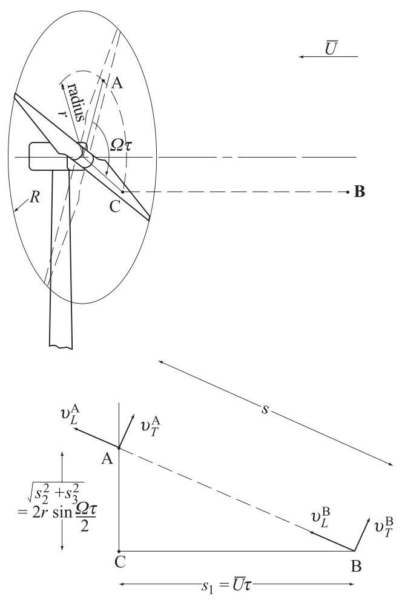

Figure 5.17 Geometry for the derivation of the velocity autocorrelation function for a point on a rotating blade

Batchelor (1953) has shown that, if the turbulence is assumed to be homogeneous and isotropic, the cross correlation function, ${\kappa }_{u}\left( {\overrightarrow{s},0}\right)$ , is given by:

$$
{\kappa }_{u}\left( {\overrightarrow{s},0}\right)  = \left( {{\kappa }_{L}\left( s\right)  - {\kappa }_{T}\left( s\right) }\right) {\left( \frac{{s}_{1}}{s}\right) }^{2} + {\kappa }_{T}\left( s\right) \tag{5.35}
$$

where ${\kappa }_{L}\left( s\right)$ is the cross correlation function between velocity components at points A and B, $s$ apart, in a direction parallel to AB $\left( {v}_{I}^{A}\right.$ and ${v}_{I}^{B}$ in Figure 5.17), and ${\kappa }_{T}\left( s\right)$ is the corresponding function for velocity components $\left( {v}_{T}^{A}\right.$ and $\left. {v}_{T}^{B}\right)$ in a direction perpendicular to AB. ${s}_{1}$ is the separation of points A and B measured in the along wind direction, that is, $\bar{U}\tau$ . Noting that the distance between points $\mathrm{A}$ and $\mathrm{C}$ on the rotor disc is ${2r}\sin \left( {{\Omega \tau }/2}\right)$ , we have

$$
{s}^{2} = {\bar{U}}^{2}{\tau }^{2} + 4{r}^{2}{\sin }^{2}\left( {{\Omega \tau }/2}\right) \tag{5.36}
$$

Hence,

$$
{\kappa }_{u}\left( {\overrightarrow{s},0}\right)  = {\kappa }_{L}\left( s\right) {\left( \frac{\bar{U}\tau }{s}\right) }^{2} + {\kappa }_{T}\left( s\right) \left\lbrack  {1 - {\left( \frac{\bar{U}\tau }{s}\right) }^{2}}\right\rbrack   = {\kappa }_{L}\left( s\right) {\left( \frac{\bar{U}\tau }{s}\right) }^{2} + {\kappa }_{T}\left( s\right) {\left( \frac{{2r}\sin \left( {{\Omega \tau }/2}\right) }{s}\right) }^{2}
$$

(5.37)For incompressible flow, it can also be shown (Batchelor 1953) that

$$
{\kappa }_{T}\left( s\right)  = {\kappa }_{L}\left( s\right)  + \frac{s}{2}\frac{d{\kappa }_{L}\left( s\right) }{ds} \tag{5.38}
$$

Substitution of Equation 5.38 in Equation 5.37 gives

$$
{\kappa }_{u}\left( {\overrightarrow{s},0}\right)  = {\kappa }_{L}\left( s\right)  + \frac{s}{2}\frac{d{\kappa }_{L}\left( s\right) }{ds}{\left( \frac{{2r}\sin \left( {{\Omega \tau }/2}\right) }{s}\right) }^{2} \tag{5.39}
$$

When the vector $\overrightarrow{s}$ is in the along-wind direction, ${\kappa }_{L}\left( s\right)$ translates to ${\kappa }_{u}\left( {s}_{1}\right)$ , which, by Taylor's 'frozen turbulence' hypothesis, equates to the autocorrelation function at a fixed point, ${\kappa }_{u}\left( \tau \right)$ (Equation 5.32), with $\tau  = {s}_{1}/\bar{U}$ . Thus,

$$
{\kappa }_{L}\left( {s}_{1}\right)  = \frac{2{\sigma }_{u}^{2}}{\Gamma \left( \frac{1}{3}\right) }{\left( \frac{{s}_{1}/2}{{T}^{\prime }\bar{U}}\right) }^{\frac{1}{3}}{K}_{1/3}\left( \frac{{s}_{1}}{{T}^{\prime }\bar{U}}\right) \tag{5.40}
$$

Because the turbulence is assumed to be isotropic, ${\kappa }_{L}\left( s\right)$ is independent of the direction of the vector $\overrightarrow{s}$ , so we can write, with the aid of Equation 5.33:

$$
{\kappa }_{L}\left( s\right)  = \frac{2{\sigma }_{u}^{2}}{\Gamma \left( \frac{1}{3}\right) }{\left( \frac{s/2}{{T}^{\prime }\bar{U}}\right) }^{\frac{1}{3}}{K}_{1/3}\left( \frac{s}{{T}^{\prime }\bar{U}}\right)  = \frac{2{\sigma }_{u}^{2}}{\Gamma \left( \frac{1}{3}\right) }{\left( \frac{s/2}{1.34L}\right) }^{\frac{1}{3}}{K}_{1/3}\left( \frac{s}{1.34L}\right) \tag{5.41}
$$

Noting that $\left( {d/{dx}}\right) \left\lbrack  {{x}^{v}{K}_{v}\left( x\right) }\right\rbrack   =  - {x}^{v}{K}_{\left( 1 - v\right) }\left( x\right)$ , the following expression for the autocorrelation function for the along-wind fluctuations at a point at radius $r$ on the rotating blade is obtained by substituting Equation 5.41 in Equation 5.39:

$$
{\kappa }_{u}^{\mathrm{o}}\left( {r,\tau }\right)  = {\kappa }_{u}\left( {\overrightarrow{s},0}\right)  = \frac{2{\sigma }_{u}^{2}}{\Gamma \left( \frac{1}{3}\right) }{\left( \frac{s/2}{1.34L}\right) }^{\frac{1}{3}}\left\lbrack  {{K}_{1/3}\left( \frac{s}{1.34L}\right)  - \frac{s}{2\left( {1.34L}\right) }{K}_{2/3}\left( \frac{s}{1.34L}\right) }\right.
$$

$$
\left. {\times {\left( \frac{{2r}\sin \left( {{\Omega \tau }/2}\right) }{s}\right) }^{2}}\right\rbrack \tag{5.42}
$$

where $s$ is defined in terms of $\tau$ by Equation 5.36 above.

Step 3 - Derivation of the power spectrum seen by a point on the rotating blade: the rotationally sampled spectrum is obtained by taking the Fourier transform of ${\kappa }_{u}^{\mathrm{o}}\left( {r,\tau }\right)$ from Equation 5.42:

(5.43)

$$
{S}_{u}^{\mathrm{o}}\left( n\right)  = 4{\int }_{0}^{\infty }{\kappa }_{u}^{o}\left( {r,\tau }\right) \cos {2\pi n\tau d\tau }
$$

$$
= 2{\int }_{-\infty }^{\infty }{\kappa }_{u}^{o}\left( {r,\tau }\right) \cos {2\pi n\tau d\tau }\;\text{ as }{\kappa }_{u}^{o}\left( {r,\tau }\right)  = {\kappa }_{u}^{o}\left( {r, - \tau }\right)
$$

As no analytical solution has been found for the integral, a solution has to be obtained numerically using a discrete Fourier transform (DFT). First the limits of integration are reduced to $- T/2, + T/2$ , as ${\kappa }_{u}^{o}\left( {r,\tau }\right)$ tends to zero for large $\tau$ . Then the limits of integration are altered to $0, T$ with ${\kappa }_{u}^{o}\left( {r,\tau }\right)$ set equal to ${\kappa }_{u}^{o}\left( {r, T - \tau }\right)$ for $\tau  > T/2$ , as ${\kappa }_{u}^{o}\left( {r,\tau }\right)$ is now assumed to be periodic with period $T$ . Thus,

$$
{S}_{u}^{o}\left( n\right)  = 2{\int }_{0}^{T}{\kappa }_{u}^{*o}\left( {r,\tau }\right) \cos {2\pi n\tau d\tau } \tag{5.44}
$$

where the asterisk denotes that ${\kappa }_{u}^{o}\left( {r,\tau }\right)$ is ’reflected’ for $T > T/2$ . The discrete Fourier transform then becomes

$$
{S}_{u}^{o}\left( {n}_{k}\right)  = {2T}\left\lbrack  {\frac{1}{N}\mathop{\sum }\limits_{{p = 0}}^{{N - 1}}{\kappa }_{u}^{*o}\left( {r,{pT}/N}\right) \cos \left( {{2\pi kp}/N}\right) }\right\rbrack \tag{5.45}
$$

Here, $N$ is the number of points taken in the time series of ${\kappa }_{u}^{*o}\left( {r,{pT}/N}\right)$ , and the power spectral density is calculated at the frequencies ${n}_{k} = k/T$ for $k = 0,1,2\ldots N - 1$ . The expression in square brackets can be evaluated using a standard fast Fourier transform (FFT), provided $N$ is chosen equal to a power of 2 . Clearly $N$ should be as large as possible if a wide range of frequencies is to be covered at high resolution. Just as ${\kappa }_{u}^{*o}\left( {r,\tau }\right)$ is symmetrical about $T/2$ , the values of ${S}_{u}^{o}\left( {n}_{k}\right)$ obtained from the FFT are symmetrical about the mid-range frequency of $N/{2T}$ , and the values above this frequency have no real meaning. Moreover, the values of power spectral density calculated by the DFT at frequencies approaching $N/\left( {2T}\right)$ will be in error as a result of aliasing, because these are falsely distorted by frequency components above $N/{2T}$ which contribute to the ${\kappa }_{u}^{*o}\left( {r,{pT}/N}\right)$ series. Assuming that the calculated spectral densities are valid up to a frequency of $N/{4T}$ , then the selection of $T = {200}\mathrm{{sec}}$ and $N = {4096}$ would enable the FFT to give useful results up to a frequency of about $5\mathrm{\;{Hz}}$ at a frequency interval of ${0.005}\mathrm{\;{Hz}}$ .

## Example 5.2

As an illustration, results have been derived for points on a 40 m radius T40 blade rotating at ${15}\mathrm{{rpm}}$ in a mean wind speed of $8\mathrm{\;m}/\mathrm{s}$ . Following the recommendations for the use of the Von Karman isotropic turbulence model in IEC 61400-1 Edition 2 (1999), the isotropic integral length scale, $L$ , is taken as 3.5 times the IEC 61400-1 turbulence scale parameter, ${\Lambda }_{1}$ . However, ${\Lambda }_{1}$ is taken as ${42}\mathrm{\;m}$ , as recommended in Edition 3 (2005) for a hub height exceeding ${60}\mathrm{\;m}$ , giving $L = {147}\mathrm{\;m}$ . (These values compare with ${\Lambda }_{1} = {21}\mathrm{\;m}$ and $L = {73.5}\mathrm{\;m}$ recommended in Edition 2). Figure 5.18 shows how the normalised autocorrelation function, ${\rho }_{u}^{o}\left( {r,\tau }\right) \left( { = {\kappa }_{u}^{o}\left( {r,\tau }\right) /{\sigma }_{u}^{2}}\right)$ , for the longitudinal wind fluctuations varies with the number of rotor revolutions at ${40}\mathrm{\;m},{20}\mathrm{\;m}$ and $0\mathrm{\;m}$ radii. For $r = {20}\mathrm{\;m}$ , and even more so for $r = {40}\mathrm{\;m}$ , these curves display pronounced peaks after each full revolution, when the blade may be thought of as encountering the initial gust or lull once more.

Figure 5.19a shows the corresponding rotationally sampled power spectral density function, ${R}_{u}^{o}\left( {r, n}\right) \left( { = n{S}_{u}^{o}\left( {r, n}\right) /{\sigma }_{u}^{2}}\right)$ , plotted out against frequency, $n$ , using a logarithmic scale for the latter. It is clear that there is a substantial shift of the frequency content of the spectrum to the frequency of rotation and, to a lesser degree to its harmonics, with the extent of the shift increasing with radius. Figure 5.19b is a repeat of Figure 5.19a, but with a logarithmic scale used on both axes.

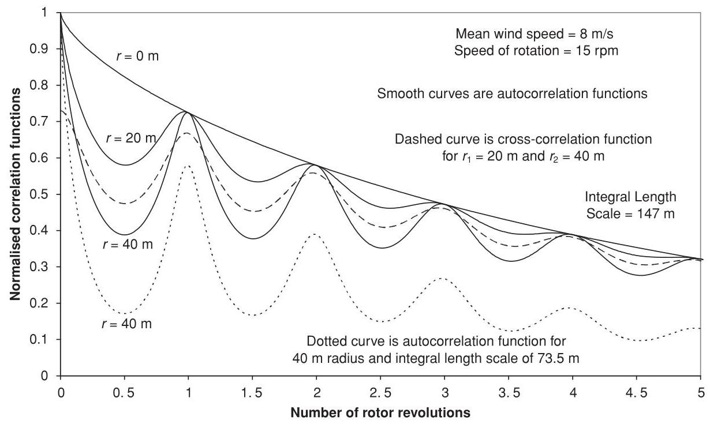

Figure 5.18 Normalised autocorrelation and cross correlation functions for along-wind wind fluctuations as seen by points on a rotating blade at different radii

It is instructive to consider how the various input parameters affect the shift of energy to the rotational frequency. As ${\kappa }_{u}^{o}\left( {r,\tau }\right)  = {\kappa }_{u}\left( {\overrightarrow{s},0}\right)$ decreases monotonically with increasing s, Equation 5.36 indicates that the depth of the troughs in this function - and hence the transfer of energy to the rotational frequency - increases roughly in proportion to the tip speed ratio, ${\Omega r}/\bar{U}$ , and will thus be most significant for fixed-speed two-bladed machines (which generally rotate faster than three-bladed ones) in low wind speeds.

## Effect of reduced length scale

The effect of adopting a reduced isotropic integral length scale, $L$ , of ${73.5}\mathrm{\;m}$ as opposed to ${147}\mathrm{\;m}$ on the auto correlation function and the rotationally sampled power spectrum is illustrated for a radius of ${40}\mathrm{\;m}$ in Figures 5.18 and 5.20 respectively.

It is seen that, despite the more rapid attenuation of auto-correlation function, the reduction of length scale has negligible effect on the spectral peak at the rotational frequency.

## Rotationally sampled cross spectra

The expressions for the spectra of blade bending moments and shears are normally functions of entities known as rotationally sampled cross spectra for pairs of points along the blade, which are analogous to the rotationally sampled ordinary spectra for single points described above. The cross spectrum for a pair of points at radii ${r}_{1}$ and ${r}_{2}$ on a rotating blade is thus related to the corresponding cross correlation function by the Fourier transform pair

$$
{S}_{u}^{o}\left( {{r}_{1},{r}_{2}, n}\right)  = 4{\int }_{0}^{\infty }{\kappa }_{u}^{o}\left( {{r}_{1},{r}_{2},\tau }\right) \cos {2\pi n\tau d\tau } \tag{5.46a}
$$

$$
{\kappa }_{u}^{o}\left( {{r}_{1},{r}_{2},\tau }\right)  = {\int }_{0}^{\infty }{S}_{u}^{o}\left( {{r}_{1},{r}_{2}, n}\right) \cos {2\pi n\tau dn} \tag{5.46b}
$$

Figure 5.19 (a) Rotationally sampled power spectra of longitudinal wind speed fluctuations at different radii; (b) Rotationally sampled power spectra of longitudinal wind speed fluctuations at different radii: log-log plot

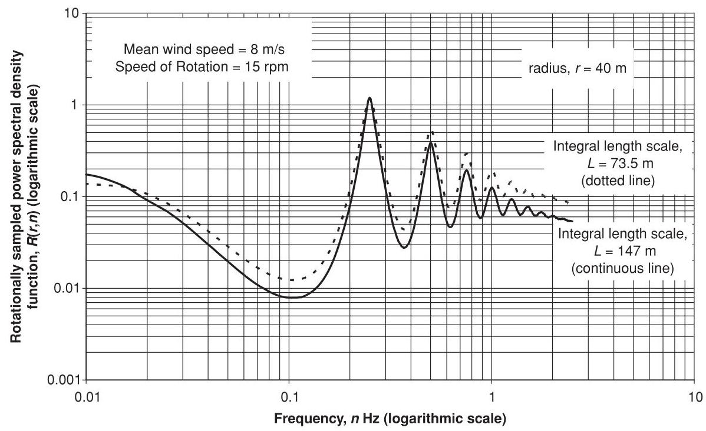

Figure 5.20 Comparison of rotationally sampled power spectra at ${40}\mathrm{\;m}$ radius for different integral length scales

Setting $\tau  = 0$ in Equation 5.46b gives

$$
{\kappa }_{u}^{o}\left( {{r}_{1},{r}_{2},0}\right)  = {\int }_{0}^{\infty }{S}_{u}^{o}\left( {{r}_{1},{r}_{2}, n}\right) {dn} \tag{5.47}
$$

which, when substituted into the expression for the standard deviation of the blade root bending moment in Equation 5.27 gives

$$
{\sigma }_{M}^{2} = {\left( \frac{1}{2}\rho \Omega \frac{d{C}_{L}}{d\alpha }\right) }^{2}{\int }_{0}^{R}{\int }_{0}^{R}\left\lbrack  {{\int }_{0}^{\infty }{S}_{u}^{o}\left( {{r}_{1},{r}_{2}, n}\right) {dn}}\right\rbrack  c\left( {r}_{1}\right) c\left( {r}_{2}\right) {r}_{1}^{2}{r}_{2}^{2}d{r}_{1}d{r}_{2} \tag{5.48}
$$

From this, it can be deduced that the power spectrum of the blade root bending moment is

$$
{S}_{M}\left( n\right)  = {\left( \frac{1}{2}\rho \Omega \frac{d{C}_{L}}{d\alpha }\right) }^{2}{\int }_{0}^{R}{\int }_{0}^{R}{S}_{u}^{o}\left( {{r}_{1},{r}_{2}, n}\right) c\left( {r}_{1}\right) c\left( {r}_{2}\right) {r}_{1}^{2}{r}_{2}^{2}d{r}_{1}d{r}_{2} \tag{5.49}
$$

The derivation of the rotationally sampled cross spectrum, ${S}_{u}^{o}\left( {{r}_{1},{r}_{2}, n}\right)$ , exactly parallels the derivation of the rotationally sampled single point spectrum given above, with the cross correlation function ${\kappa }_{u}^{o}\left( {{r}_{1},{r}_{2},\tau }\right)$ between the longitudinal wind fluctuations at points at radii ${r}_{1}$ and ${r}_{2}$ on the rotating blade replacing the autocorrelation function in step 2 . Here the expression for the separation distance, $s$ , given in Equation 5.36, is replaced by

$$
{s}^{2} = {\bar{U}}^{2}{\tau }^{2} + {r}_{1}^{2} + {r}_{2}^{2} - 2{r}_{1}{r}_{2}\cos {\Omega \tau } \tag{5.50}
$$

The expression for the cross correlation function thus becomes:

$$
{\kappa }_{u}^{o}\left( {{r}_{1},{r}_{2},\tau }\right)  = \frac{2{\sigma }_{u}^{2}}{\Gamma \left( \frac{1}{3}\right) }{\left( \frac{s/2}{1.34L}\right) }^{\frac{1}{3}}\left\lbrack  {{K}_{1/3}\left( \frac{s}{1.34L}\right)  - \frac{s}{2\left( {1.34L}\right) }{K}_{2/3}\left( \frac{s}{1.34L}\right) }\right.
$$

$$
\left. {\times \left( \frac{{r}_{1}^{2} + {r}_{2}^{2} - 2{r}_{1}{r}_{2}\cos \left( {\Omega \tau }\right) }{{s}^{2}}\right) }\right\rbrack \tag{5.51}
$$

with $s$ defined by Equation 5.50.

The form of the resulting normalised cross correlation function, ${\rho }_{u}^{o}\left( {{r}_{1},{r}_{2},\tau }\right)  = \; {\kappa }_{u}^{o}\left( {{r}_{1},{r}_{2},\tau }\right) /{\sigma }_{u}^{2}$ , is illustrated in Figure 5.18 for the case considered in Example 5.2, taking ${r}_{1} = {20}\mathrm{\;m}$ and ${r}_{2} = {40}\mathrm{\;m}$ . In Figure 5.21, the rotationally sampled cross spectrum for this case is compared with the rotationally sampled single point spectra or 'autospectra' at these radii. It can be seen that the form of the cross spectrum curve is similar to that of the autospectra with a pronounced peak at the rotational frequency roughly midway between the peaks of the two autospectra. At higher frequencies, however, the cross spectrum falls away much more rapidly.

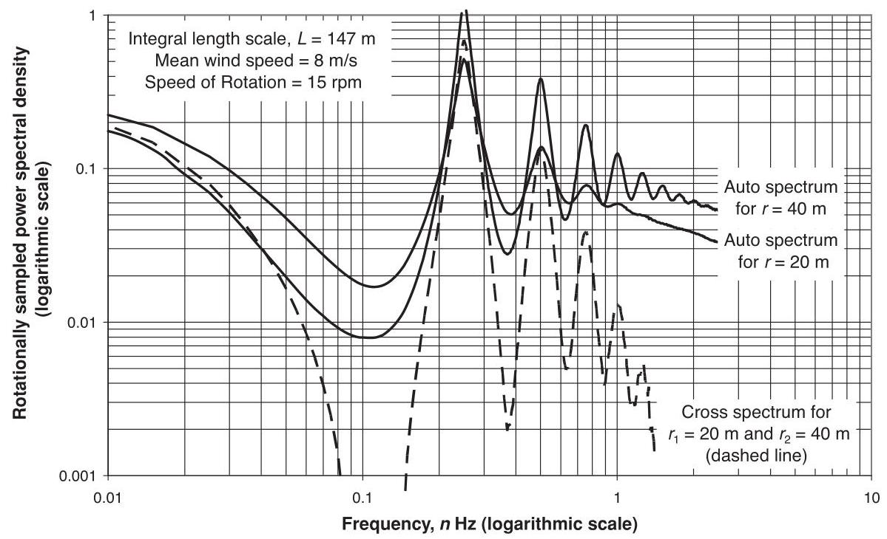

Figure 5.21 Rotationally sampled cross spectrum of longitudinal wind speed fluctuations at ${20}\mathrm{\;m}$ and ${40}\mathrm{\;m}$ radii compared with auto spectra: log-log plot

The evaluation of the power spectrum of the blade root bending moment is, in practice, carried out using summations to approximate to the integrals in Equation 5.49, as follows:

$$
{S}_{M}\left( n\right)  = {\left( \frac{1}{2}\rho \Omega \frac{d{C}_{L}}{d\alpha }\right) }^{2}\mathop{\sum }\limits_{j}\mathop{\sum }\limits_{k}{S}_{u}^{o}\left( {{r}_{j},{r}_{k}, n}\right) c\left( {r}_{j}\right) c\left( {r}_{k}\right) {r}_{j}^{2}{r}_{k}^{2}{\left( \Delta r\right) }^{2} \tag{5.52}
$$

## Limitations of analysis in the frequency domain

As noted at the beginning of this section, analysis of stochastic aerodynamic loads in the frequency domain depends for its validity on a linear relationship between the incident wind speed and the blade loading. Thus, the method becomes increasingly inaccurate for pitch regulated machines as winds approach the cut-out value and breaks down completely for stall-regulated machines once the wind speed is high enough to cause stall. In order to avoid these limitations, it is necessary to carry out the analysis in the time domain.

#### 5.7.6 Stochastic aerodynamic loads: analysis in the time domain

## Wind simulation

The analysis of stochastic aerodynamic loads in the time domain requires, as input, a simulated wind field extending over the area of the rotor disc and over time. Typically, this is obtained by generating simultaneous time histories at points over the rotor disc, which have appropriate statistical properties both individually, and in relation to each other. Thus, the power spectrum of each time history should conform to one of the standard power spectra (e.g. Von Karman or Kaimal), and the normalised cross spectrum (otherwise known as the coherence function) of the time histories at two different points should equate to the coherence function corresponding to the chosen power spectrum and the distance separating the points. For example, the coherence of the longitudinal component of turbulence corresponding to the Kaimal power spectrum for points $j$ and $k$ separated by a distance $\Delta {s}_{jk}$ perpendicular to the wind direction is:

$$
{C}_{jk}\left( n\right)  = C\left( {\Delta {s}_{jk}, n}\right)  = \frac{{S}_{jk}\left( n\right) }{{S}_{u}\left( n\right) } = \exp \left( {-H.\Delta {s}_{jk}\sqrt{{\left( \frac{n}{\bar{U}}\right) }^{2} + {\left( \frac{0.12}{L}\right) }^{2}}}\right) \tag{5.53}
$$

The constant $H$ was specified as 8.8 in IEC 61400-1 Edition 2, but increased to 12 in Edition 3. The $\left( {{0.12}/L}\right)$ term is negligible except at frequencies below ${0.01}\mathrm{\;{Hz}}$ . (Note that coherence is sometimes termed coherency, and that some authors define coherence as the square of the normalised cross spectrum). See Section 2.6.6 for details of the coherence corresponding to the Von Karman spectrum.

Three distinct approaches have been developed for generating simulation time histories as follows:

1. The transformational method, based on filtering Gaussian white noise signals.

2. The correlation method, in which the velocity of a small body of air at the end of a time step is calculated as the sum of a velocity correlated with the velocity at the start of the time step and a random, uncorrelated increment.

3. The harmonic series method, involving the summation of a series of cosine waves at different frequencies with amplitudes weighted in accordance with the power spectrum.

This last method is probably now the one in widest use, and is described in more detail below. The description is based on that given in Veers (1988).

## Wind simulation by the harmonic series method

The spectral properties of the wind speed fluctuations at $N$ points can be described by a spectral matrix, $\mathbf{S}$ , in which the diagonal terms are the double-sided single point power spectral densities at each point, ${S}_{kk}\left( n\right)$ , and the off-diagonal terms are the cross-spectral densities, ${S}_{jk}\left( n\right)$ , also double sided. This matrix is equated to the product of a triangular transformation matrix, $\mathbf{H}$ , and its transpose, ${\mathbf{H}}^{T}$ , as follows:

$$
\left\lbrack  \begin{matrix} {S}_{11} & {S}_{21} & {S}_{31} & \ldots \ldots \\  {S}_{21} & {S}_{22} & {S}_{32} & \ldots \ldots \\  {S}_{31} & {S}_{32} & {S}_{33} & \ldots \ldots \\  \ldots & \ldots \ldots & \ldots \ldots & {S}_{NN} \end{matrix}\right\rbrack   = \left\lbrack  \begin{matrix} {H}_{11} & & & \\  {H}_{21} & {H}_{22} & & \\  {H}_{31} & {H}_{32} & {H}_{33} & \\  \ldots & \ldots \ldots & \ldots \ldots & {H}_{NN} \end{matrix}\right\rbrack  \left\lbrack  \begin{matrix} {H}_{11} & {H}_{21} & {H}_{31} & \ldots \ldots \\   & {H}_{22} & {H}_{32} & \ldots \ldots \\   & & {H}_{33} & \ldots \ldots \\   & & & {H}_{NN} \end{matrix}\right\rbrack
$$

resulting in a set of $N\left( {N + 1}\right)$ equations linking the elements of the $\mathbf{S}$ matrix to the elements of the $\mathbf{H}$ matrix as follows:

$$
{S}_{11} = {H}_{11}^{2}{S}_{21} = {H}_{21} \cdot  {H}_{11}\;{S}_{22} = {H}_{21}^{2} + {H}_{22}^{2}\;{S}_{31} = {H}_{31} \cdot  {H}_{11}
$$

$$
{S}_{32} = {H}_{31} \cdot  {H}_{21} + {H}_{32} \cdot  {H}_{22}{S}_{33} = {H}_{31}^{2} + {H}_{32}^{2} + {H}_{33}^{2}
$$

$$
{S}_{jk} = \mathop{\sum }\limits_{{l = 1}}^{k}{H}_{jl} \cdot  {H}_{kl}\;{S}_{kk} = \mathop{\sum }\limits_{{l = 1}}^{k}{H}_{kl}^{2} \tag{5.54}
$$

As with the elements of the $\mathbf{S}$ matrix, the elements of the $\mathbf{H}$ matrix are all double-sided functions of frequency, $n$ .

Noting that the expression for the power spectral density ${S}_{kk}$ resembles that for the variance of the sum of group of $k$ independent variables, it is apparent that the elements of the $\mathbf{H}$ matrix can be considered as the weighting factors for the linear combination of $N$ independent, unit magnitude, white noise inputs to yield $N$ correlated outputs with the correct spectral matrix. Thus, the elements in the $j$ th row of $\mathbf{H}$ are the weighting factors for the inputs contributing to the output at point $j$ . The formula for the linear combination is

$$
{u}_{j}\left( n\right)  = \mathop{\sum }\limits_{{k = 1}}^{j}{H}_{jk}\left( n\right)  \cdot  {\Delta n} \cdot  \exp \left( {-i{\theta }_{k}\left( n\right) }\right) \tag{5.55}
$$

where ${u}_{j}\left( n\right)$ is the complex coefficient of the discretised frequency component at $n\mathrm{\;{Hz}}$ of the simulated wind speed at point $j$ . The frequency bandwidth is ${\Delta n}.{\theta }_{k}\left( n\right)$ is the phase angle associated with the $n\mathrm{\;{Hz}}$ frequency component at point $k$ , and is a random variable uniformly distributed over the interval $0 - {2\pi }$ .

The values of the weighting factors, ${H}_{jk}$ , which are $N\left( {N + 1}\right)$ in number are derived from the Equations 5.54, giving:

$$
{H}_{11} = \sqrt{{S}_{11}}\;{H}_{21} = {S}_{21}/{H}_{11}\;{H}_{22} = \sqrt{{S}_{22} - {H}_{21}^{2}}\;{H}_{31} = {S}_{31}/{H}_{11}\;\text{ etc. } \tag{5.56}
$$

Hence

$$
{u}_{1}\left( n\right)  = \sqrt{{S}_{11}\left( n\right) } \cdot  {\Delta n} \cdot  \exp \left( {-i{\theta }_{1}\left( n\right) }\right)
$$

$$
{u}_{2}\left( n\right)  = \sqrt{{S}_{22}\left( n\right) } \cdot  {\Delta n}\left\lbrack  {{C}_{21}\left( n\right)  \cdot  \exp \left( {-i{\theta }_{1}\left( n\right) }\right)  + \sqrt{1 - {C}_{21}^{2}\left( n\right) } \cdot  \exp \left( {-i{\theta }_{2}\left( n\right) }\right) }\right\rbrack  \;\text{ etc. }
$$

(5.57)

Time series for the wind speed fluctuations are obtained by taking the inverse discrete Fourier transform of the coefficients ${u}_{j}\left( n\right)$ at each point $j$ . Lateral and vertical wind speed fluctuations can also be simulated, if desired, using the same method. As an illustration, examples of time series derived by this method for two points ${10}\mathrm{\;m}$ apart are shown in Figure 5.22, based on the Von Karman spectrum. The mean wind speed and integral length scale ${}^{x}{L}_{u}$ in this example are taken as ${10}\mathrm{\;m}/\mathrm{s}$ and ${73.5}\mathrm{\;m}$ respectively, giving an integral time scale, ${}^{x}{L}_{u}/\bar{U}$ of 7.35 seconds.

In his 1988 paper, Veers pointed out that computation time required can be reduced by arranging for the simulated wind speed to be calculated at each point only at those times when a blade is passing - i.e. at a frequency of ${\Omega B}/{2\pi }$ , where $B$ is the number of blades. This is achieved by applying a phase shift to each frequency component at each point of ${\psi }_{j} \cdot  n \cdot  {2\pi }/\Omega$ , where ${\psi }_{j}$ is the azimuth angle of point $j$ .

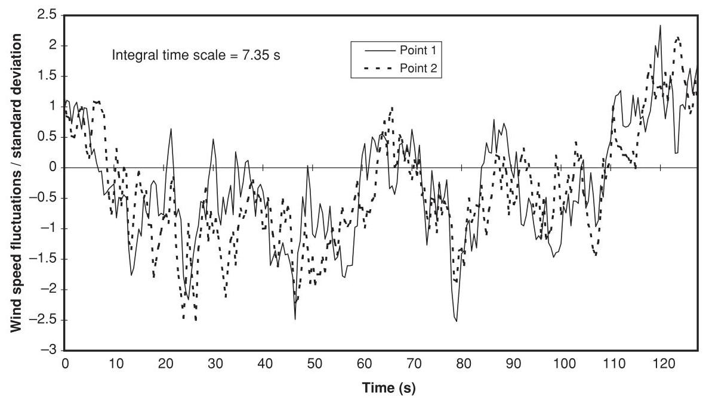

Figure 5.22 Simulated time series of wind speed fluctuations at two points ${10}\mathrm{\;m}$ apart for mean wind speed of ${10}\mathrm{\;m}/\mathrm{s}$

## Blade load time histories

Once the simulated wind speed time histories have been generated across the grid, the calculation of blade load histories at different radii can begin. If the wake is assumed to be 'frozen', then the axial induced velocity, $a\bar{U}$ , and the tangential induced velocity, ${a}^{\prime }{\Omega r}$ , are taken as remaining constant over time, at each radius, at the values calculated for a steady wind speed of $\bar{U}$ . The instantaneous value of the flow angle, $\phi$ , and, hence, the values of the lift and drag coefficients, may then be calculated directly from the instantaneous value of the wind speed fluctuation (including lateral and vertical components, if calculated) by means of the velocity diagram.

Alternatively, an equilibrium wake may be assumed. In this case, the induced velocities are taken to vary continuously so that the momentum equations are satisfied at each blade element at all times. Obviously, this requires that these equations are solved afresh at each time step, which is computationally much more demanding.

Neither the equilibrium wake model nor the frozen wake model provide an accurate description of wake behaviour. A better model is provided by unsteady flow theory, which assumes that there is some delay before induced velocities react to changes in the incident wind field. See Section 4.4.

Note that, if desired, the spatial wind variations causing deterministic loading can be included in the simulated wind field, enabling the combined deterministic and stochastic loading on the blade to be calculated in a single operation.

#### 5.7.7 Extreme loads

The derivation of extreme loads should properly take into account dynamic effects, which form the subject of the next section. However, in the interests of clarity, this section will be restricted to the consideration of extreme loads in the absence of dynamic effects.

As described in Section 5.4.1, it was customary for wind turbine design codes to specify extreme operating load cases in terms of deterministic gusts. The extreme blade loadings are then evaluated at intervals over the duration of the gust, using blade element and momentum theory as described in Section 5.7.2.

Although deterministic gusts have the advantage of clarity of definition, they are essentially arbitrary in nature. The alternative approach of employing a stochastic representation of the wind provides a much more realistic description of the wind itself, and has been adopted to a greater extent in IEC 61400-1 Edition 3. Although stochastic representation of the wind lends itself to analysis in the frequency domain, non-linearities introduced by stall invalidate the method, so the standard specifies analysis in the time domain using simulations. Nevertheless, analysis in the frequency domain can provide useful insights in the absence of stall and is considered further in the paragraphs which follow.

Normally the loading under investigation, for example the blade root bending moment, will contain both periodic and random components. Although it is straightforward to predict the extreme values of each component independently, the prediction of the extreme value of the combined signal is quite involved. Madsen et al. (1984) have proposed the following simple, approximate approach, and have demonstrated that it is reasonably accurate.

The periodic component, $z\left( t\right)$ , is considered as an equivalent 3 level square wave, in which the variable takes the maximum, mean $\left( {\mu }_{z}\right)$ , and minimum values of the original waveform, for proportions ${\varepsilon }_{1},{\varepsilon }_{2}$ and ${\varepsilon }_{3}$ of the wave period respectively. It is easy to show that:

$$
{\varepsilon }_{1} = \frac{{\sigma }_{z}^{2}}{\left( {{z}_{\max } - {\mu }_{z}}\right) \left( {{z}_{\max } - {z}_{\min }}\right) }\;{\varepsilon }_{3} = \frac{{\sigma }_{z}^{2}}{\left( {{\mu }_{z} - {z}_{\min }}\right) \left( {{z}_{\max } - {z}_{\min }}\right) } \tag{5.58}
$$

Extreme values of the combined signal are only assumed to occur during the proportion of the time, ${\varepsilon }_{1}$ , for which the square wave representation of the periodic component is at the maximum value, ${z}_{\max }$ .

Davenport (1964) gives the following formula for the extreme value of a random variable over a time interval $T$ :

$$
\frac{{x}_{\max }}{{\sigma }_{x}} = \sqrt{2\ln \left( {vT}\right) } + \frac{\gamma }{\sqrt{2\ln \left( {vT}\right) }} \tag{5.59}
$$

where $v$ is the zero up-crossing frequency (i.e. the number of times per second the variable changes from negative to positive) given by Equation A5.46 and $\gamma  = {0.5772}$ (Euler’s constant). Thus, the extreme value of the combined periodic and random components is taken to be

$$
{z}_{\max } + {x}_{\max } = {z}_{\max } + {\sigma }_{x}\left( {\sqrt{2\ln \left( {v{\varepsilon }_{1}T}\right) } + \frac{\gamma }{\sqrt{2\ln \left( {v{\varepsilon }_{1}T}\right) }}}\right)  = {z}_{\max } + {g}_{1} \cdot  {\sigma }_{x} \tag{5.60}
$$

where ${g}_{1}$ is termed the peak factor.

The variation of ${x}_{\max }/{\sigma }_{x}$ with exposure time, $\mathrm{T}$ , is shown in Table 5.4 for a zero up-crossing frequency of $1\mathrm{\;{Hz}}$ . The periodic component is assumed to be a simple sinusoid, giving ${\varepsilon }_{1} = {0.25}$ .

The method for determining the extreme load described above has to be applied with caution when the wind fluctuations exceed the rated wind speed. In the case of a stall-regulated machine, the linearity assumption breaks down completely, invalidating the method. With pitch-regulated machines, however, the blade pitch will respond to wind fluctuations at frequencies below, say, half the rotor rotational frequency in order to limit power, causing a parallel reduction in blade loading. This will modify the spectrum of blade loading dramatically, effectively removing the frequency components below the pitch system cut-off frequency, and consequently reducing the magnitude of ${\sigma }_{x}$ to be substituted in Equation 5.60.

Table 5.4 Extreme values of random component for different exposure times

<table><tr><td>$T$</td><td>1 minute</td><td>10 minutes</td><td>1 hour</td><td>10 hours</td><td>100 hours</td><td>1000 hours</td><td>1 year</td></tr><tr><td>$T$ (secs)</td><td>60</td><td>600</td><td>3,600</td><td>36,000</td><td>360,000</td><td>3,600,000</td><td>31,536,000</td></tr><tr><td>${\varepsilon }_{1}T$ (secs)</td><td>15</td><td>150</td><td>900</td><td>9,000</td><td>90,000</td><td>900,000</td><td>7,884,000</td></tr><tr><td>${x}_{\max }/{\sigma }_{x}$</td><td>2.57</td><td>3.35</td><td>3.84</td><td>4.40</td><td>4.90</td><td>5.35</td><td>5.74</td></tr></table>

To illustrate the method, the procedure for calculating the extreme flapwise blade root bending moment of a pitch regulated machine operating at rated wind speed is described below:

1) Equation 5.48 for the standard deviation of the random component of blade root bending moment is first modified to eliminate the contribution of frequencies below half the rotational speed to account for the blade pitching response, and then discretised to give:

$$
{\sigma }_{M}^{2} = {\left( \frac{1}{2}\rho \Omega \frac{d{C}_{L}}{d\alpha }\right) }^{2}\mathop{\sum }\limits_{{j = 1}}^{m}\mathop{\sum }\limits_{{k = 1}}^{m}\left\lbrack  {{\int }_{\Omega /2}^{\infty }{S}_{u}^{o}\left( {{r}_{j},{r}_{k}, n}\right) {dn}}\right\rbrack  c\left( {r}_{j}\right) c\left( {r}_{k}\right) {r}_{j}^{2}{r}_{k}^{2} \cdot  {\left( \Delta r\right) }^{2} \tag{5.61}
$$

Here the blade is assumed to be divided up into $m$ sections of equal length ${\Delta r} = R/m$ .

2) After evaluation of the integrals of the $m\left( {m + 1}\right) /2$ different curtailed rotational spectra, the standard deviation of the blade root bending moment is obtained from Equation 5.61.

3) The time, $T$ , that the machine spends in a wind speed band centred on the rated wind speed is estimated using the Weibull curve, and multiplied in turn by the factor ${\varepsilon }_{1}$ appropriate to the waveform of the periodic component of blade root bending moment and by the zero up-crossing frequency of the random root bending moment fluctuations, to give the effective number of peaks, $v{\varepsilon }_{1}T$ .

4) The predicted extreme value of the total moment is calculated by substituting the standard deviation of the blade root bending moment, ${\sigma }_{M}\left( { = {\sigma }_{x}}\right)$ , the effective number of peaks, $v{\varepsilon }_{1}T$ , and the extreme value of the periodic moment into Equation 5.60.

In the case of a machine with a rated wind speed of ${13}\mathrm{\;m}/\mathrm{s}$ operating at a site with an annual mean of $7\mathrm{\;m}/\mathrm{s}$ , the expected proportion of the time spent operating within a $2\mathrm{\;m}/\mathrm{s}$ wide band centred on the rated wind speed is ${5.6}\%$ . Taking the machine lifetime as 20 years, a zero up-crossing frequency equal to the rotational speed of ${15}\mathrm{{rpm}}\left( {{0.25}\mathrm{\;{Hz}}}\right)$ and ${\varepsilon }_{1} = {0.25}$ , this results in a peak factor, ${g}_{1}$ , of 5.5 . For the ${80}\mathrm{\;m}$ diameter machine considered in Section 5.7.2, a turbulence intensity of ${20}\%$ and a turbulence isotropic length scale of ${147}\mathrm{\;m}$ , the standard deviation of the random component of blade root bending moment given by Equation 5.60 is ${315}\mathrm{{kNm}}$ , resulting in a peak value of about ${1730}\mathrm{{KNm}}$ . This compares with the extreme value of the periodic component, including wind shear, of about 1830 KNm. It should be emphasised that the peak value of the random component quoted is a theoretical one - that is, it assumes the linearity assumptions are maintained even for the large wind speed fluctuation needed to generate this moment. In practice, a machine operating in a steady wind speed equal to rated is usually not all that far from stall, so the larger fluctuations may induce stall. In this example, the square root of the weighted mean of the integrals of all the curtailed rotational spectra is about ${0.5}{\sigma }_{u}$ , so the idealised uniform wind speed fluctuation equivalent to the extreme root moment is about ${0.20} \times  {13} \times  {0.5} \times  {5.5} = {7.2}\mathrm{\;m}/\mathrm{s}$ .

The method outlined above has more validity at higher wind speeds, when the blades are pitched back, and are operating further away from stall. However, it is important to note that the other linearity assumption used in deriving Equation 5.26, namely that $\phi$ is small, becomes increasingly in error.

It will be now be evident that the calculation of stochastic extreme loads is fraught with difficulties because non-linearities are likely to arise as the extremes are approached. In so far as lift forces 'saturate' due to stall, or even drop back, as wind speed increases, a crude and simple approach to extreme out-of-plane operational loads is to calculate an upper bound based on the maximum lift coefficient for the local aerofoil section and the relative air velocity, $W$ . The induction factors will be small, and can be ignored.

The most sophisticated approach, however, is to analyse the loads generated by a simulated wind field. As computing costs normally restrict the length of simulated 'campaigns' to a few hundred seconds or less, statistical methods have to be used to extrapolate from the extreme values of loadings calculated during the campaign to the extreme values to be expected over the machine design life.

One method, which is discussed by Thomsen and Madsen (1997), is to use Equation 5.60 with $T$ set equal to the appropriate exposure period over the machine design life, and values of ${z}_{\max }$ and ${\sigma }_{x}$ , abstracted from the simulation time history with the aid of azimuthal binning to separate the periodic and stochastic components. The danger of this approach with simulations of short duration is that the azimuthal binning process treats some load fluctuations due to the slicing of low frequency gusts as periodic rather than stochastic, so that the standard deviation of the stochastic component, ${\sigma }_{x}$ , is underestimated.

Extrapolation techniques are considered further in Section 5.14.

### 5.8 Blade dynamic response

#### 5.8.1 Modal analysis

Although dynamic loads on the blades will, in general, also excite the tower dynamics, tower head motion will initially be excluded from consideration in order to focus on the blade dynamic behaviour itself. The treatment is further limited to the response of blades in unstalled flow because of the inherent difficulty in predicting stalled behaviour.

The equation of motion for a blade element at radius $r$ subject to a time varying load $q\left( {r, t}\right)$ per unit length in the out-of-plane direction is

$$
m\left( r\right) \ddot{x} + \widehat{c}\left( r\right) \dot{x} + \frac{{\partial }^{2}}{\partial {r}^{2}}\left\lbrack  {{EI}\left( r\right) \frac{{\partial }^{2}x}{\partial {r}^{2}}}\right\rbrack   = q\left( {r, t}\right) \tag{5.62}
$$

where the terms on the left hand side are the loads on the element due to inertia, damping and flexural stiffness respectively. $I\left( r\right)$ is the second moment of area of the blade cross-section about the weak principal axis (which for this purpose is assumed to lie in the plane of rotation) and $x$ is the out-of-plane displacement. The expressions $m\left( r\right)$ and $\widehat{c}\left( r\right)$ denote mass per unit length and damping per unit length respectively.

The dynamic response of a cantilever blade to the fluctuating aerodynamic loads upon it is most conveniently investigated by means of modal analysis, in which the excitations of the various different natural modes of vibration are computed separately and the results superposed, as follows:

$$
x\left( {t, r}\right)  = \mathop{\sum }\limits_{{j = 1}}^{\infty }{f}_{j}\left( t\right) {\mu }_{j}\left( r\right) \tag{5.63}
$$

where ${\mu }_{j}\left( r\right)$ is the $j$ th mode shape, arbitrarily assumed to have a value of unity at the tip, and ${f}_{j}\left( t\right)$ is the variation of tip displacement with time. Equation 5.62 then becomes

$$
\mathop{\sum }\limits_{{j = 1}}^{\infty }\left\{  {m\left( r\right) {\mu }_{j}\left( r\right) {\ddot{f}}_{j}\left( t\right)  + \widehat{c}\left( r\right) {\mu }_{j}\left( r\right) {\dot{f}}_{j}\left( t\right)  + \frac{{d}^{2}}{d{r}^{2}}\left\lbrack  {{EI}\left( r\right) \frac{{d}^{2}{\mu }_{j}\left( r\right) }{d{r}^{2}}}\right\rbrack  {f}_{j}\left( t\right) }\right\}   = q\left( {r, t}\right) \tag{5.64}
$$

For low levels of damping the beam natural frequencies are given by

$$
m\left( r\right) {\omega }_{j}^{2}{\mu }_{j}\left( r\right)  = \frac{{d}^{2}}{d{r}^{2}}\left\lbrack  {{EI}\left( r\right) \frac{{d}^{2}{\mu }_{j}\left( r\right) }{d{r}^{2}}}\right\rbrack \tag{5.65}
$$

so Equation 5.64 becomes

$$
\mathop{\sum }\limits_{{j = 1}}^{\infty }\left\{  {m\left( r\right) {\mu }_{j}\left( r\right) {\ddot{f}}_{j}\left( t\right)  + \widehat{c}\left( r\right) {\mu }_{j}\left( r\right) {\dot{f}}_{j}\left( t\right)  + m\left( r\right) {\omega }_{j}^{2}{\mu }_{j}\left( r\right) {f}_{j}\left( t\right) }\right\}   = q\left( {r, t}\right) \tag{5.66}
$$

Multiplying both sides by ${\mu }_{i}\left( r\right)$ , and integrating over the length of the blade, $R$ , gives:

$$
\mathop{\sum }\limits_{{j = 1}}^{\infty }\left\{  {{\int }_{0}^{R}m\left( r\right) {\mu }_{i}\left( r\right) {\mu }_{j}\left( r\right) {\ddot{f}}_{j}\left( t\right) {dr} + {\int }_{0}^{R}\widehat{c}\left( r\right) {\mu }_{i}\left( r\right) {\mu }_{j}\left( r\right) {\dot{f}}_{j}\left( t\right) {dr}}\right.
$$

$$
\left. {+{\int }_{0}^{R}m\left( r\right) {\omega }_{j}^{2}{\mu }_{i}\left( r\right) {\mu }_{j}\left( r\right) {f}_{j}\left( t\right) {dr}}\right\}   = {\int }_{0}^{R}{\mu }_{i}\left( r\right) q\left( {r, t}\right) {dr} \tag{5.67}
$$

The undamped mode shapes are orthogonal as a result of Bettis's law, so they satisfy the orthogonality condition:

$$
{\int }_{0}^{R}m\left( r\right) {\mu }_{i}\left( r\right) {\mu }_{j}\left( r\right) {dr} = 0\;\text{ for }i \neq  j \tag{5.68}
$$

If we assume that the variation of the damping per unit length along the blade, $\widehat{c}\left( r\right)$ , is proportional to the variation in mass per unit length, $m\left( r\right)$ , i.e. $\widehat{c}\left( r\right)  = a \cdot  m\left( r\right)$ , then

$$
{\int }_{0}^{R}\widehat{c}\left( r\right) {\mu }_{i}\left( r\right) {\mu }_{j}\left( r\right) {dr} = 0\;\text{ for }i \neq  j \tag{5.69}
$$

As a result, all the cross terms on the left hand side of Equation 5.67 drop out, and it reduces to

$$
{m}_{i}{\ddot{f}}_{i}\left( t\right)  + {c}_{i}{\dot{f}}_{i}\left( t\right)  + {m}_{i}{\omega }_{i}^{2}{f}_{i}\left( t\right)  = {\int }_{0}^{R}{\mu }_{i}\left( r\right) q\left( {r, t}\right) {dr} \tag{5.70}
$$

where ${m}_{i} = {\int }_{0}^{R}m\left( r\right) {\mu }_{i}^{2}\left( r\right) {dr}$ and is known as the generalised mass, ${c}_{i} = {\int }_{0}^{R}\widehat{c}\left( r\right) {\mu }_{i}^{2}\left( r\right) {dr}$ and ${\int }_{0}^{R}{\mu }_{i}\left( r\right) q\left( {r, t}\right) {dr} = {Q}_{i}\left( t\right)$ is termed the generalised fluctuating load with respect to the $i$ th mode. Equation 5.70 is the fundamental equation governing modal response to time varying loading.

Figure 5.23 Deflection of tip due to flapwise bending of twisted blade (viewed along blade axis)

Blade flexural vibrations occur in both the flapwise and edgewise directions (i.e. about the weak and strong principal axes respectively). Blades are typically twisted some ${15}^{ \circ  }$ , so the weak principal axis does not, in general, lie in the plane of rotation as assumed above. Consequently blade flexure about one principal axis inevitably results in some blade movement perpendicular to the other. This is illustrated in Figure 5.23, in which the maximum blade twist near the root has been exaggerated for clarity. Point P represents the undeflected position of the blade tip, point Q represents the deflected position as a result of flexure about the weak principal axis, and the line between them is built up of the contributions to the tip deflection made by flexure of each element along the blade, $M\left( {R - r}\right) {\Delta r}/{EI}$ .

The interaction between flexure about the two principal axes can be explored with the help of some simplifying assumptions. If $M$ varies as $\left( {R - r}\right)$ for the first mode and $I$ varies as ${\left( R - r\right) }^{2}$ , then each of the tip deflection contributions referred to above are equal, so that, for a linear twist distribution, the line PQ is the arc of a circle. If the twist varies between zero at the tip and a maximum value of $\beta$ towards the root then the tip deflection, ${\delta }_{12}$ , in the direction of the weak principal axis, at the blade section with maximum twist, is $\beta /2$ times the tip deflection, ${\delta }_{11}$ , perpendicular to this axis. Hence in the case of $\beta  = {15}^{ \circ  }$ , the ratio ${\delta }_{12}/{\delta }_{11}$ approximates to 0.13 , with the result that blade first mode flapwise oscillations will result in some relatively small simultaneous edgewise inertia loadings. These will not excite significant edgewise oscillations, because the edgewise first mode natural frequency is typically about double the flapwise one.

It can be seen from the above that the effects of interaction between flapwise and edgewise oscillations are generally minor, so they will not be considered further.

Blades will also be subject to torsional vibrations. In the past, it has generally been possible to ignore these, both because the exciting loads were small and because the high torsional stiffness of a typical hollow blade placed the torsional natural frequencies well above the exciting frequencies. However, with the development of larger, more flexible blades, this is no longer always the case. Blade torsion, which can accompany flapwise bending due to offset of the cross-section centre of mass from the shear centre, for example, may significantly alter the angle of attack in the tip region.

Finally, in the case of a blade hinged at the root, the whole blade will experience oscillations involving rigid body rotation about the hinge. This phenomenon is considered in the section headed 'Teeter motion' below.

#### 5.8.2 Mode shapes and frequencies

The mode shape and frequency of the first mode can be derived by an iterative technique called the Stodola method after its originator. Briefly, this consists of assuming a plausible mode shape, calculating the inertia loads associated with it for an arbitrary frequency of one radian per second, and then computing the beam deflected profile resulting from these inertia loads. This profile is then normalised, typically by dividing the deflections by the tip deflection, to obtain the input mode shape for the second iteration. The process is repeated until the mode shape converges. Then, in view of the fact that the inertia loads calculated for the input tip deflection combined with a frequency of 1 radian per second must be the same as those calculated for the output tip deflection combined with the actual frequency, the first mode natural frequency can be obtained from the formula:

$$
{\omega }_{1} = \sqrt{\frac{\text{ Tip deflection input to last iteration }}{\text{ Tip deflection output from last iteration }}}
$$

If the mode shapes are orthogonal, advantage can be taken of this property to simplify the derivation of the mode shapes and frequencies of the higher modes, provided this is carried out in ascending order. A trial mode shape is assumed as before, but before using it to calculate the inertia loadings, it is 'purified' so that it does not contain any lower mode content. For example,’purification’ of a second mode trial mode shape, ${\mu }_{2T}\left( \mathrm{r}\right)$ , of first mode content is achieved by subtracting

$$
{\mu }_{2C}\left( r\right)  = {\mu }_{1}\left( r\right) \frac{{\int }_{0}^{R}{\mu }_{1}\left( r\right) {\mu }_{2T}\left( r\right) m\left( r\right) {dr}}{{\int }_{0}^{R}{\mu }_{1}^{2}\left( r\right) m\left( r\right) {dr}} = {\mu }_{1}\left( r\right) \frac{{\int }_{0}^{R}{\mu }_{1}\left( r\right) {\mu }_{2T}\left( r\right) m\left( r\right) {dr}}{{m}_{1}} \tag{5.71}
$$

from it. The modified second mode trial mode shape, ${\mu }_{2M}\left( r\right)  = {\mu }_{2T}\left( r\right)  - {\mu }_{2C}\left( r\right)$ , then satisfies the orthogonality condition

$$
{\int }_{0}^{R}{\mu }_{1}\left( t\right) {\mu }_{2M}\left( r\right) {dr} = 0
$$

After 'purification' of the trial mode shape, the Stodola method can be applied exactly as before. Further 'purification' before succeeding iterations should not be necessary if the lower mode shapes used for the initial 'purification' are accurate enough. See Clough and Penzien (1993) for a rigorous treatment of the method.

Figure 5.24 Restoring moments due to centrifugal force for in-plane and out-of-plane blade deflections

#### 5.8.3 Centrifugal stiffening

When a rotating blade deflects either in its plane of rotation or perpendicular to it, the centrifugal force on each blade element exerts a restoring force which has the effect of stiffening the blade and thereby increasing the natural frequency compared with the stationary value. The centrifugal forces act radially outwards perpendicular to the axis of rotation, so in the case of an out-of-plane blade deflection, they are parallel to the undeflected blade axis and act at greater lever arms to the inboard part of the blade than they do in the case of in-plane blade deflection. This is illustrated in Figure 5.24.

In order to take account of the effects of centrifugal loads, the equation of motion for a blade element loaded in the out-of-plane direction is modified by the addition of an extra term to become

$$
m\left( r\right) \ddot{x} + \widehat{c}\left( r\right) \dot{x} - \frac{\partial }{\partial r}\left\lbrack  {N\left( r\right) \frac{\partial x}{\partial r}}\right\rbrack   + \frac{{\partial }^{2}}{\partial {r}^{2}}\left\lbrack  {{EI}\frac{{\partial }^{2}x}{\partial {r}^{2}}}\right\rbrack   = q\left( {r, t}\right) \tag{5.72}
$$

where the centrifugal force at radius $r, N\left( r\right)$ , is the summation of the forces acting on each blade element outboard of radius $r$ , that is $N\left( r\right)  = \mathop{\sum }\limits_{{r = r}}^{{r = R}}m\left( r\right) {\Omega }^{2}r \cdot  {\Delta r}$ .

The Stodola method for deriving blade mode shapes and frequencies described in the preceding section can be modified to take account of centrifugal effects. In the case of out-of-plane modes, the procedure is as follows:

1) Assume plausible trial out-of-plane mode shape, $\mu \left( r\right)$ .

2) 'Purify' trial mode shape of any lower mode content.

3) Assume trial value for frequency, ${\omega }_{j}^{2}$ .

4) Calculate bending moment distribution due to lateral inertia forces according to:

$$
{M}_{Y \cdot  \text{ Lat }}\left( {r}^{ * }\right)  = {\int }_{{r}^{ * }}^{R}m\left( r\right) {\omega }_{j}^{2}\mu \left( r\right) \left\lbrack  {r - {r}^{ * }}\right\rbrack  {dr} \tag{5.73}
$$

5) Calculate bending moment distribution due to centrifugal forces according to:

$$
{M}_{Y \cdot  {CF}}\left( {r}^{ * }\right)  =  - {\int }_{{r}^{ * }}^{R}m\left( r\right) {\Omega }^{2}r\left\lbrack  {\mu \left( r\right)  - \mu \left( {r}^{ * }\right) }\right\rbrack  {dr} \tag{5.74}
$$

6) Calculate combined bending moment distribution.

7) Calculate new deflected profile resulting from this bending moment distribution.

8) Calculate revised estimate of natural frequency from:

$$
{\omega }_{j}^{\prime } = {\omega }_{j}\sqrt{\frac{\text{ Trial tip deflection }}{\text{ Tip deflection calculated for new deflected profile }}}
$$

9) Repeat steps 2-8 with revised mode shape and frequency until calculated mode shape converges.

It is important to note that the lateral loads and deflections of a centrifugally loaded beam do not conform to Bettis's Law, so, as a consequence, the mode shapes are not orthogonal. It is for this reason that the 'purification' stage has been included in each cycle of iteration. When convergence of the calculated mode shape has occurred, it will be found that it differs significantly from the 'purified' mode shape input into each iteration, indicating that a true solution has not been obtained. It is then necessary to use a trial and error approach to modify the magnitudes of the 'purifying' corrections applied until the output mode shape and input 'purified' mode shape match. A few further iterations will be required until the natural frequency settles down.

A quick estimate of the first mode frequency of a rotating blade can be derived using the Southwell formula for a uniform rotating beam reported by Putter and Manor (1978) as follows

$$
{\omega }_{1} = \sqrt{{\omega }_{1,0}^{2} + {\phi }_{1}{\Omega }^{2}} \tag{5.75}
$$

in which ${\omega }_{1,0}$ is the corresponding frequency for the non-rotating blade. The value of ${\phi }_{1}$ depends on the blade mass and stiffness distribution, and Madsen et al. (1984) suggest the value 1.73 for wind turbine blade out-of-plane oscillations. In the case of Blade T40 rotating at 15 rpm, this yields a percentage increase in first mode frequency due to centrifugal stiffening of 7.7% compared to the correct value of 8.1%. Typically, centrifugal stiffening results in an increase of the first mode frequency for out-of-plane oscillations of between 5% and 10%. For higher modes, the magnitude of the centrifugal forces is less in proportion to the lateral inertia forces, so the percentage increase in frequency due to centrifugal stiffening becomes progressively less.

The procedure for deriving the blade first mode shape and frequency in the case of in-plane oscillations is the same as that described above for out-of-plane vibrations, except that the formula for the bending moment distribution due to the centrifugal forces has to be modified to:

$$
{M}_{X \cdot  {CF}}\left( {r}^{ * }\right)  = {\int }_{{r}^{ * }}^{R}m\left( r\right) {\Omega }^{2}r\left\lbrack  {\frac{{r}^{ * }}{r}\mu \left( r\right)  - \mu \left( {r}^{ * }\right) }\right\rbrack  {dr} \tag{5.76}
$$

where $\mu \left( r\right)$ is now the trial in-plane mode shape.

The first mode frequency for in-plane oscillations of Blade T40 in the absence of centrifugal force is ${1.56}\mathrm{\;{Hz}}$ . This is approximately double the corresponding frequency for out-of-plane oscillations of ${0.824}\mathrm{\;{Hz}}$ , and so the relative effect of the centrifugal loads is much reduced, even before allowance is made for the smaller lever arms at which they act (Figure 5.24). In fact the increase in the first mode frequency for in-plane oscillations due to centrifugal force is only ${0.5}\%  -$ probably small enough to be ignored.

#### 5.8.4 Aerodynamic and structural damping

Blade motion is generally resisted by two forms of viscous damping, aerodynamic and structural, which are considered in turn.

An approximate expression for the aerodynamic damping per unit length in the flapwise direction can be derived by a method analagous to that used in Section 5.7.5 to derive the linear relation

$$
q = \frac{1}{2}{\rho \Omega rc}\left( r\right) \frac{d{C}_{L}}{d\alpha }u \tag{5.25}
$$

between blade load fluctuations per unit length, $q$ , and fluctuations in the incident wind, $u$ . The wind speed fluctuation, $u$ , is simply replaced by the blade flapwise velocity, $- \dot{x}$ , giving

$$
{\widehat{c}}_{a}\left( r\right)  = \frac{q}{-\dot{x}} = \frac{1}{2}{\rho \Omega rc}\left( r\right) \frac{d{C}_{L}}{d\alpha } \tag{5.77}
$$

The rate of change of lift coefficient with angle of attack, $d{C}_{L}/{d\alpha }$ , is constant and equal to ${2\pi }$ before the blade goes into stall, but can become negative post-stall, leading to the risk of instability - see Section 7.1.9.

It can be seen that the aerodynamic damping per unit length, ${\widehat{c}}_{a}\left( r\right)$ , varies spanwise as the product of radius and blade chord, and is therefore not very close to being proportional to the mass per unit length, as is required to satisfy the orthogonality condition. This will result in some aerodynamic coupling of modes, which is not accounted for in normal modal analysis.

The aerodynamic damping ratio for the $i$ th mode is defined as

$$
{\xi }_{ai} = {c}_{ai}/2{m}_{i}{\omega }_{i} = {\int }_{0}^{R}{\widehat{c}}_{a}\left( r\right) {\mu }_{i}^{2}\left( r\right) {dr}/2{m}_{i}{\omega }_{i} \tag{5.78}
$$

Substituting the expression for ${\widehat{c}}_{a}\left( r\right)$ given in Equation 5.77 leads to:

$$
{\xi }_{ai} = \frac{\frac{1}{2}{\rho \Omega }\frac{d{C}_{L}}{d\alpha }{\int }_{0}^{R}{rc}\left( r\right) {\mu }_{i}^{2}\left( r\right) {dr}}{2{\omega }_{i}{\int }_{0}^{R}m\left( r\right) {\mu }_{i}^{2}\left( r\right) {dr}} \tag{5.79}
$$

In the case of fibreglass Blade T40 described in Example 5.1, this yields values of 0.16 and 0.04 for the first and second modes respectively. These high values are a consequence of the lightness of the blade in relation to its width in the vicinity of the tip, an area which dominates the integrals thanks to the mode shape weighting. The corresponding first mode logarithmic decrement $\left( { = {2\pi }{\xi }_{a}}\right)$ is thus 1.0 .

At a weight of about 16 tonnes, Blade T40 is very much at the heavy end of the range, with blades for ${40}\mathrm{\;m}$ tip radius of half this weight or less now being typical. The aerodynamic damping ratio is inversely proportional to blade mass, so the first and second mode values would rise to 0.32 and 0.08 respectively for an 8 tonne blade weight.

Structural damping arises from the conversion of mechanical energy to thermal energy during oscillatory motion, as a result of frictional resistance within the flexing material. Denoting the strain energy at peak displacement for the $n$ th cycle as ${S}_{n}$ and the loss per cycle as $\Delta {S}_{n}$ , it can be shown that

$$
\frac{\Delta {S}_{n}}{{S}_{n}} = \frac{{2\Delta }{\sigma }_{n}}{{\sigma }_{n}} \tag{5.80}
$$

where ${\sigma }_{n}$ is the peak stress for the $n$ th cycle, $\Delta {\sigma }_{n} = {\sigma }_{n} - {\sigma }_{n + 1}$ and ${S}_{n} = \oint \left( {{\sigma }_{n}^{2}/{2E}}\right)$ , with the integral taken over the whole volume of the beam. Hence the logarithmic decrement of damping, defined as the natural logarithm of the ratio of successive peak displacements in the same direction - that is, as $\ln \left( {{\sigma }_{n}/{\sigma }_{n + 1}}\right)$ for elastic behaviour - approximates to $\Delta {\sigma }_{n}/{\sigma }_{n} = {0.5}\left( {\Delta {S}_{n}/{S}_{n}}\right) .$

Test results on fibreglass (see, for example, Gibson, 1982) indicate that the energy loss per cycle is unaffected by frequency. However, the percentage energy loss per cycle increases quite rapidly with stress range (Creed, 1993), although it is usual to treat it as independent of stress range for analysis purposes.

Values for the structural damping logarithmic decrement, ${\delta }_{\mathrm{s}} = {2\pi }{\xi }_{s}$ at the fundamental natural (i.e. first mode) frequency were given in the 1992 edition of Danish Standard DS 472 'Loads and Safety of Wind Turbine Construction' for several different materials, and these are reproduced in Table 5.5 below, together with corresponding values from EN 1991-1-4 (2005). Equivalent values of the structural damping ratio are also shown. Note that the first mode structural damping ratio for a fibreglass blade is much smaller than the aerodynamic damping ratio for Blade T40 derived above.

Table 5.5 Values of first mode structural damping logarithmic decrements for different materials

<table><tr><td>Standard</td><td>DS 472 (1992)</td><td>EN 1991-1-4 (2005)</td><td>DS 472</td><td>EN 1991-1-4</td></tr><tr><td>Material</td><td>Logarithmic Decrement, ${\delta }_{s}$</td><td>Logarithmic Decrement, ${\delta }_{s}$</td><td>Structural damping ratio, ${\xi }_{s}$</td><td>Structural damping ratio, ${\xi }_{s}$</td></tr><tr><td>Concrete</td><td>0.05</td><td>0.03 (towers and chimneys)</td><td>0.008</td><td>0.005</td></tr><tr><td>Steel-welded</td><td>0.02</td><td>0.012 (chimney)</td><td>0.003</td><td>0.002</td></tr><tr><td>Steel-bolted</td><td>0.05</td><td>0.03 (high strength   bolts)</td><td>0.008</td><td>0.005</td></tr><tr><td></td><td></td><td>0.05 (ordinary   bolts)</td><td></td><td>0.008</td></tr><tr><td>GRP</td><td>0.05</td><td>0.04-0.08 (bridges)</td><td>0.008</td><td>0.006-0.012</td></tr><tr><td>Timber</td><td>0.05</td><td>0.06-0.12 (bridges)</td><td>0.008</td><td>0.01-0.02</td></tr></table>

Damping ratios for the first and second flapwise modes of ${40}\mathrm{\;m}$ tip radius blades are presented in Table 5.6.

It is seen that the damping ratio for the second mode is about one third of that for the first.

#### 5.8.5 Response to deterministic loads: step-by-step dynamic analysis

As set out in Section 5.8.1, blade dynamic response to time varying loading is best analysed in terms of the separate excitation of each blade mode of vibration, for which, under the assumptions of unstalled flow and mass-proportional aerodynamic damping, the governing equation is

$$
{m}_{i}{\ddot{f}}_{i}\left( t\right)  + {c}_{i}{\dot{f}}_{i}\left( t\right)  + {m}_{i}{\omega }_{i}^{2}{f}_{i}\left( t\right)  = {\int }_{0}^{R}{\mu }_{i}\left( r\right) q\left( {r, t}\right) {dr} \tag{5.70}
$$

where ${f}_{i}\left( t\right)$ and ${\mu }_{i}\left( r\right)$ are the tip displacement and mode shape for the $i$ th mode respectively. Starting with the initial tip displacement, velocity and acceleration arbitrarily set at zero, this equation can be used to derive values for these quantities at successive time steps over a complete blade revolution by numerical integration. The procedure is then repeated for several more revolutions until the cyclic blade response to the periodic loading becomes sensibly invariant from one revolution to the next.

Table 5.6 Comparison of ${40}\mathrm{\;m}$ radius blade damping ratios for first two flapwise modes

<table><tr><td colspan="2"></td><td>First mode</td><td>Second mode</td></tr><tr><td colspan="2">Natural frequency including centrifugal stiffening</td><td>0.89 Hz</td><td>2.94 Hz</td></tr><tr><td>Structural damping ratio</td><td></td><td>0.008</td><td>0.008</td></tr><tr><td>Blade T40 weighing 16 tonne</td><td>Aerodynamic damping ratio</td><td>0.16</td><td>0.04</td></tr><tr><td></td><td>Combined damping ratio</td><td>0.17</td><td>0.05</td></tr><tr><td>Lightweight ${40}\mathrm{\;m}$ tip radius</td><td>Aerodynamic damping ratio</td><td>0.32</td><td>0.08</td></tr><tr><td>blade weighing 8 tonne</td><td>Combined damping ratio</td><td>0.33</td><td>0.09</td></tr></table>

## Linear acceleration method

The precise form of the equations linking the tip displacement, velocity and acceleration at the end of a time step to those at the beginning depends on how the acceleration is assumed to vary over the time step. Newmark has classified alternative assumptions in terms of a parameter $\beta$ which measures the relative weightings placed on the initial and final accelerations in deriving the final displacement. The simplest assumption is that the acceleration takes a constant value equal to the average of the initial and final values $\left( {\beta  = \frac{1}{4}}\right)$ . Clough and Penzien (1993), however, recommend that the acceleration is assumed to vary linearly between the initial and final values, as this will be a closer approximation to the actual variation. Step-by-step integration with this assumption is known as either the linear acceleration method or the Newmark $\beta  = \frac{1}{6}$ method.

Expressions for the tip displacement, velocity and acceleration at the end of the first time step $- {f}_{i1},{\dot{f}}_{i1}$ and ${\ddot{f}}_{i1}$ respectively - are derived in terms of the initial values - ${f}_{i0},{\dot{f}}_{i0}$ and ${\ddot{f}}_{i0}$ - as follows. The acceleration at time $t$ during the time step of total duration $h$ is

$$
{\ddot{f}}_{i}\left( t\right)  = {\ddot{f}}_{i0} + \left( \frac{{\ddot{f}}_{i1} - {\ddot{f}}_{i0}}{h}\right) t \tag{5.81}
$$

This can be integrated to give the velocity at the end of the time step as

$$
{\dot{f}}_{i1} = {\dot{f}}_{i0} + {\ddot{f}}_{i0}h + \left( {{\ddot{f}}_{i1} - {\ddot{f}}_{i0}}\right) h/2 \tag{5.82}
$$

Equation 5.81 can be integrated twice to give an expression for the displacement at the end of the time step, which, after rearrangement yields the following expression for the corresponding acceleration:

$$
{\ddot{f}}_{i1} = \frac{6}{{h}^{2}}\left( {{f}_{i1} - {f}_{i0}}\right)  - \frac{6}{h}{\dot{f}}_{i0} - 2{\ddot{f}}_{i0} \tag{5.83}
$$

Substituting Equation 5.83 into Equation 5.82 yields

$$
{\dot{f}}_{i1} = \frac{3}{h}\left( {{f}_{i1} - {f}_{i0}}\right)  - 2{\dot{f}}_{i0} - {\ddot{f}}_{i0}h/2 \tag{5.84}
$$

Equation 5.70 can be written as

$$
{m}_{i}{\ddot{f}}_{in} + {c}_{i}{\dot{f}}_{in} + {m}_{i}{\omega }_{i}^{2}{f}_{in} = {\int }_{0}^{R}{\mu }_{i}\left( r\right) {q}_{n}\left( r\right) {dr} = {Q}_{in} \tag{5.85}
$$

where the suffix $n$ refers to the state at the end of the $n$ th time step. Substituting Equations 5.83 and 5.84 into Equation 5.85 with $n = 1$ and collecting terms yields the displacement at the end of the first time step as follows:

$$
{f}_{i1} = \frac{{Q}_{i1} + {m}_{i}\left( {\frac{6}{{h}^{2}}{f}_{i0} + \frac{6}{h}{\dot{f}}_{i0} + 2{\ddot{f}}_{i0}}\right)  + {c}_{i}\left( {\frac{3}{h}{f}_{i0} + 2{\dot{f}}_{i0} + \frac{h}{2}{\ddot{f}}_{i0}}\right) }{{m}_{i}{\omega }_{i}^{2} + \frac{3{c}_{i}}{h} + \frac{6{m}_{i}}{{h}^{2}}} \tag{5.86}
$$

The velocity and acceleration at the end of the first time step are then obtained by substituting ${f}_{i1}$ in Equations 5.84 and 5.83 respectively.

The full procedure for obtaining the blade dynamic response to a periodic loading using the Newmark $\beta  = \frac{1}{6}$ method (which is just one of many available) may be summarised as follows:

1) Calculate the blade mode shapes, ${\mu }_{i}\left( r\right)$ .

2) Select the number of time steps, $N$ , per complete revolution. Then the time step, $h = {2\pi }/{N\Omega }.$

3) Calculate the blade element loads, $q\left( {r,{\psi }_{n}}\right)  = {q}_{n}\left( r\right)$ , at blade azimuth positions corresponding to each time step (i.e. at ${2\pi }/N$ intervals) using momentum theory. (Here, the suffix $n$ denotes the number of the time step).

4) Calculate the generalised load with respect to each mode, ${Q}_{in} = {\int }_{0}^{R}{\mu }_{i}\left( r\right) {q}_{n}\left( r\right) {dr}$ , for each time step.

5) Assume initial values of blade tip displacement, velocity and acceleration.

6) Calculate first mode blade tip displacement, velocity and acceleration at end of first time step, using Equations 5.86,5.84 and 5.83 respectively (with $i = 1$ ).

7) Repeat stage 6 for each successive time step over several revolutions until convergence is achieved.

8) Calculate cyclic blade moment variation at radii of interest by multiplying the cyclic tip displacement variation by appropriate factors derived from the modal analysis.

9) Repeat stages 6-8 for higher modes.

10) Combine the responses from different modes to obtain the total response.

Figure 5.25 shows some results of the application of the above procedure to the derivation of the out-of-plane root bending moment response of Blade T40 to tower shadow loading. The case chosen is for a mean wind speed of ${12}\mathrm{\;m}/\mathrm{s}$ , uniform across the rotor disc, and an $x/D$ ratio of 1 (where $x$ is the distance between the blade and the tower centreline, and $D$ is the tower diameter), giving a maximum reduction in the blade root bending moment for a rigid blade of 600 KNm (see Figure 5.26). Centrifugal stiffening is included in the derivation of the mode shapes and frequencies. It is evident from Figure 5.25 that the tower shadow gives the blade a sharp 'kick' away from the tower, but the duration is too short in relation to the duration of the first mode half cycle for Blade T40 to 'feel' the root bending moment reduction that would be experienced by a completely rigid blade. The blade oscillations have largely died away after a complete revolution because of the relatively high levels of damping.

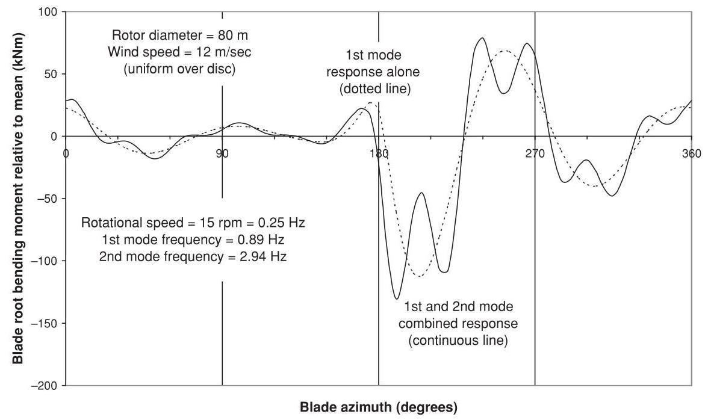

Figure 5.25 Blade T40 out-of-plane root bending moment dynamic response to tower shadow

The response of the Blade T40 out-of-plane root bending moment to tower shadow combined with wind shear is shown in Figure 5.26 for a hub height wind speed of ${12}\mathrm{\;m}/\mathrm{s}$ . Also plotted is the corresponding bending moment for a completely rigid blade.

The wind shear loading is approximately sinusoidal (see Figure 5.11) and, consequently, the response is also. However, it is worth noting that the amplitude of the dominating first mode response to wind shear is the result of two effects working against each other - in other words the increase due to the dynamic magnification factor of about $9\%$ is largely cancelled out by the reduction due to centrifugal stiffening.

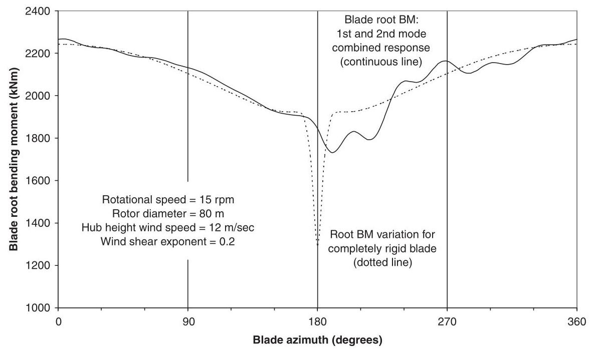

Figure 5.26 Blade T40 out-of-plane root bending moment dynamic response to tower shadow and wind shear

## Avoidance of resonance: the Campbell diagram

In the course of blade design, it is important to avoid the occurrence of a resonant condition, in which a blade natural frequency equates to the rotational frequency or a harmonic with a significant forcing load. This is often done with the aid of a Campbell diagram, in which the blade natural frequencies are plotted out against rotational frequency together with rays from the origin representing integer multiples of the rotational frequency. Then any intersections of the rays with a blade natural frequency over the turbine rotational speed operating range represent possible resonances. An example of a Campbell diagram is shown in Figure 5.27.

Clearly blade periodic loading is dominated by the loading at rotational frequency from wind shear, yawed flow and shaft tilt (Section 5.7.2), gravity (Section 5.7.3) and gust slicing (Section 5.7.5). However, the short lived load relief resulting from tower shadow will be dominated by higher harmonics.

Figure 5.27 Campbell Diagram for Blade T40

#### 5.8.6 Response to stochastic loads

The analysis of stochastic loads in the frequency domain has already been described in Section 5.7.5 for a rigid blade, and this will now be extended to cover the dynamic response of the different vibration modes of a flexible blade using the governing equation, Equation 5.70. Note that the restriction to an unstalled blade operating at a relatively high tip speed ratio still applies.

## Power spectrum of generalised blade loading

The generalised fluctuating load with respect to the $i$ th mode is ${Q}_{i} = {\int }_{0}^{R}{\mu }_{i}\left( r\right) q\left( r\right) {dr}$ , where

$$
{\Delta L} = L - \bar{L} = u\frac{dL}{du} = \frac{1}{2}\rho {\left( \Omega r\right) }^{2}c\frac{d{C}_{L}}{d\alpha }\frac{u}{\Omega r} = \frac{1}{2}{\rho \Omega rc}\frac{d{C}_{L}}{d\alpha }u \tag{5.25}
$$

Hence

$$
{Q}_{i} = \frac{1}{2}{\rho \Omega }\frac{d{C}_{L}}{d\alpha }{\int }_{0}^{R}{\mu }_{i}\left( r\right) u\left( {r, t}\right) c\left( r\right) {rdr} \tag{5.87}
$$

An expression for the standard deviation of ${Q}_{i},{\sigma }_{Qi}$ can be derived by a method analogous to that given in Section A5.4 of Appendix A for a non-rotating blade, yielding

$$
{\sigma }_{Qi}^{2} = {\left( \frac{1}{2}\rho \Omega \frac{d{C}_{L}}{d\alpha }\right) }^{2}{\int }_{0}^{R}{\int }_{0}^{R}\left\lbrack  {{\int }_{0}^{\infty }{S}_{u}^{o}\left( {{r}_{1},{r}_{2}, n}\right) {dn}}\right\rbrack  {\mu }_{i}\left( {r}_{1}\right) {\mu }_{i}\left( {r}_{2}\right) c\left( {r}_{1}\right) c\left( {r}_{2}\right) {r}_{1}{r}_{2}d{r}_{1}d{r}_{2}
$$

(5.88)

Here ${S}_{u}^{0}\left( {{r}_{1},{r}_{2}, n}\right)$ is the rotationally sampled cross spectrum for a pair of points on the rotating blade at radii ${r}_{1}$ and ${r}_{2}$ . Equation 5.88 is parallel to Equation A5.16 in the Appendix with $r$ and ${r}^{\prime }$ replaced by ${r}_{1}$ and ${r}_{2}$ and ${\left( \rho \bar{U}{C}_{F}\right) }^{2}$ replaced by ${\left( \frac{1}{2}\rho \Omega r\left( d{C}_{L}/d\alpha \right) \right) }^{2}$ . From this it can be deduced that the power spectrum of the generalised load with respect to the $i$ th mode is

$$
{S}_{Qi}\left( n\right)  = {\left( \frac{1}{2}\rho \Omega \frac{d{C}_{L}}{d\alpha }\right) }^{2}{\int }_{0}^{R}{\int }_{0}^{R}{S}_{u}^{o}\left( {{r}_{1},{r}_{2}, n}\right) {\mu }_{i}\left( {r}_{1}\right) {\mu }_{i}\left( {r}_{2}\right) c\left( {r}_{1}\right) c\left( {r}_{2}\right) {r}_{1}{r}_{2}d{r}_{1}d{r}_{2} \tag{5.89}
$$

In practice, this expression is evaluated using summations to approximate to the integrals.

## Power spectrum of tip deflection

The expression for the amplitude of the $i$ th mode blade tip response in response to excitation by a harmonically varying generalised load is given by Equation A5.4 in the Appendix. Hence the power spectrum of the tip displacement is related to the power spectrum of the generalised load by

$$
{S}_{xi}\left( n\right)  = \frac{{S}_{Qi}\left( n\right) }{{k}_{i}^{2}}\frac{1}{\left\lbrack  {\left( 1 - {n}^{2}/{n}_{i}^{2}\right) }^{2} + 4{\xi }_{i}^{2}{n}^{2}/{n}_{i}^{2}\right\rbrack  } \tag{5.90}
$$

Figure 5.28 Power Spectrum of Blade T40 first out-of-plane mode tip deflection

This can be written ${S}_{xi}\left( n\right)  = \left( {{S}_{Qi}\left( n\right) /{k}_{i}^{2}}\right) {\left\lbrack  DMR\right\rbrack  }^{2}$ where ${DMR}$ stands for the dynamic magnification ratio. ${n}_{i}$ is the $i$ th mode natural frequency in $\mathrm{{Hz}}$ .

Figure 5.28 shows the power spectrum of first mode tip deflection, ${S}_{x1}\left( n\right)$ , for Blade T40 operating at ${15}\mathrm{{rpm}}$ in a mean wind of $8\mathrm{\;m}/\mathrm{{sec}}$ . A lower damping ratio of 0.1 has been selected so that the effect of dynamic magnification is emphasised and the turbulence intensity has been arbitrarily set at ${12.5}\%$ , so that ${\sigma }_{u} = 1\mathrm{\;m}/\mathrm{s}$ . Also shown is the first mode tip deflection spectrum ignoring dynamic magnification, ${S}_{Q1}\left( n\right) /{k}_{i}^{2}$ , which, when multiplied by the square of the dynamic magnification ratio (also plotted), yields the ${S}_{x1}\left( n\right)$ curve. The standard deviation of first mode tip deflection, ${\sigma }_{x1} = {\int }_{0}^{\infty }{S}_{x1}\left( n\right) {dn}$ , comes to ${103}\mathrm{\;{mm}}$ , a 23% increase compared with the value without dynamic magnification. The former is at a minimum, because the blade T40 first mode natural frequency of ${0.89}\mathrm{\;{Hz}}$ is approximately midway between the third and fourth harmonics of the rotational frequency. However, it is found that, even if the first mode natural frequency coincided with the third harmonic of the rotational frequency, ${\sigma }_{x1}$ would only increase by $5\%$ . This increase is small, because the peak of ${S}_{x1}\left( n\right)$ at the third harmonic is not very pronounced, and because the peak in the dynamic magnification ratio is relatively broad.

## Power spectrum of blade root bending moment

If the amplitude of tip deflection due to excitation of the blade resonant frequency is defined as ${x}_{R}\left( {n}_{1}\right)$ , the amplitude of the corresponding blade root bending moment, ${M}_{Y}\left( {n}_{1}\right)$ is given by

$$
{M}_{Y}\left( {n}_{1}\right)  = {\omega }_{1}^{2}{x}_{R}\left( {n}_{1}\right) {\int }_{0}^{R}m\left( r\right) {\mu }_{1}\left( r\right) {rdr} \tag{5.91a}
$$

Noting that ${\omega }_{1}^{2} = {k}_{1}/{m}_{1}$ , this becomes

$$
\frac{{M}_{Y}\left( {n}_{1}\right) }{{x}_{R}\left( {n}_{1}\right) } = {k}_{1}R\frac{{\int }_{0}^{R}m\left( r\right) {\mu }_{1}\left( r\right) \left( {r/R}\right) {dr}}{{m}_{1}} = {k}_{1}R{\chi }_{M1} \tag{5.91b}
$$

This relationship applies at all exciting frequencies, because the right hand side is essentially a function of mode shape. Hence the power spectrum of blade root bending moment due to excitation of the first mode is given by

$$
{S}_{My1}\left( n\right)  = {\left( {k}_{1}R{\chi }_{M1}\right) }^{2} \cdot  {S}_{x1}\left( n\right)  = {\left( R{\chi }_{M1}\right) }^{2} \cdot  {S}_{Q1}\left( n\right)  \cdot  \frac{1}{\left\lbrack  {\left( 1 - {n}^{2}/{n}_{1}^{2}\right) }^{2} + 4{\xi }_{1}^{2}{n}^{2}/{n}_{1}^{2}\right\rbrack  } \tag{5.91c}
$$

For Blade T40, the ratio ${\chi }_{M1}$ takes a value of 1.40.

#### 5.8.7 Response to simulated loads

The blade dynamic response to time varying loading derived from wind simulation (Section 5.7.6) can be obtained by a step-by-step dynamic analysis such as that described for use with deterministic loads in Section 5.8.5. The procedure is essentially the same, except that it is more important to select realistic values for the initial blade tip displacement, velocity and acceleration, unless the results from the first few rotation cycles are to be discarded.

#### 5.8.8 Teeter motion

When the rotor is rigidly mounted on the shaft, out-of-plane aerodynamic loads on the blades result in fluctuating bending moments in the low speed shaft additional to those due to gravity. In the case of two-bladed machines, the transfer of blade out-of-plane aerodynamic moments to the shaft can be eliminated and blade root bending moments reduced by mounting the rotor on a hinge with its axis perpendicular to both the low speed shaft and the axis of the rotor. This allows the rotor to teeter to and fro in response to differential aerodynamic loads on each blade.

The restoring moment acting on a rotor rotating at a constant teeter angle is generated by the lateral components of the centrifugal force acting on each blade element (see Figure 5.29). For small teeter angles - up to, say 5 degrees - it may be approximated by

$$
{M}_{R} = {\int }_{0}^{R}r \cdot  m\left( r\right) {\Omega }^{2}r \cdot  \zeta  \cdot  {dr} = I{\Omega }^{2}\zeta \tag{5.92}
$$

where $\zeta$ is the teeter angle, $\Omega$ is the rotational speed and $I$ is the rotor moment of inertia about its centre. The equation of motion for small free teeter oscillations thus becomes, $I\ddot{\zeta } + I{\Omega }^{2}\zeta  = 0$ (omitting the aerodynamic damping term for the moment), indicating that the natural frequency of the teeter motion with the teeter hinge perpendicular to the rotor axis is equal to the rotational frequency. Since both the deterministic and stochastic components of the exciting moment are dominated by this frequency, it is clear that the system operates at resonance, with aerodynamic damping alone controlling the magnitude of the teeter excursion. In the absence of stochastic wind loads, a teetering rotor can be thought of as rotating in a fixed plane at an angle ${\zeta }_{\mathrm{o}}$ to the plane perpendicular to the shaft axis (with ${\zeta }_{\mathrm{o}}$ equal to the maximum teeter angle), because the teetering frequency is equal to the rotational frequency.

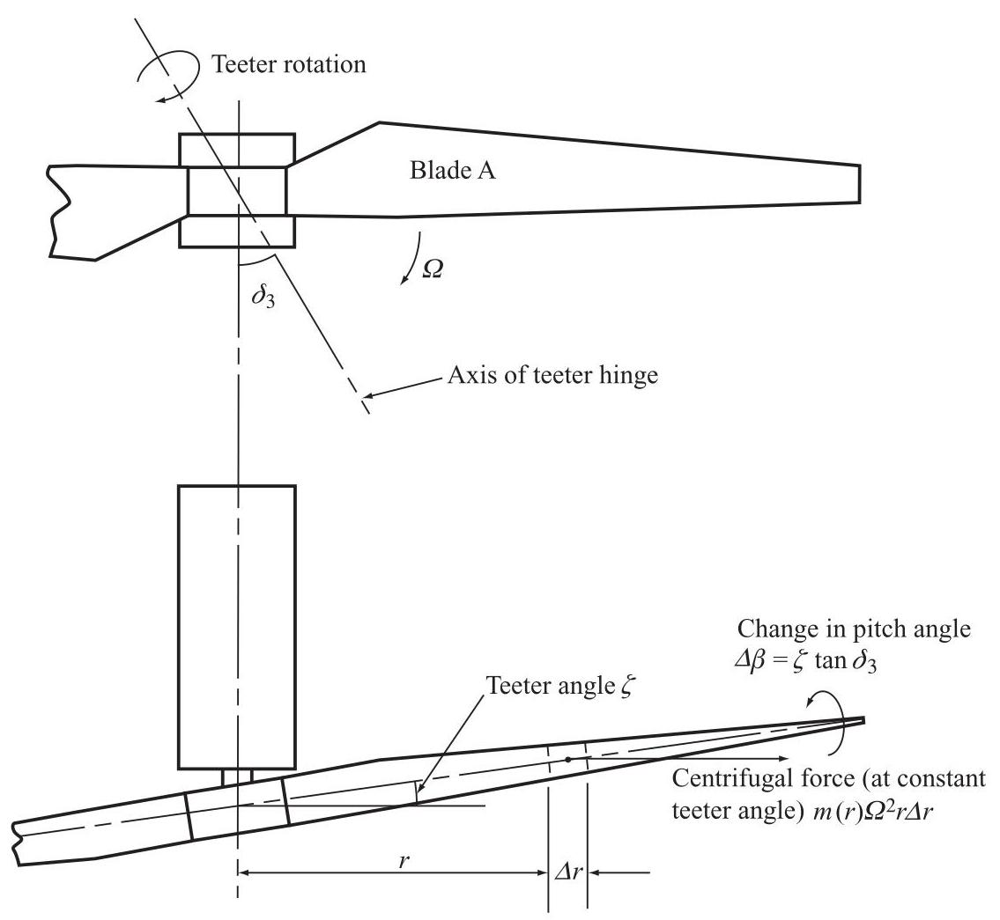

Figure 5.29 Teeter geometry

The magnitude of teeter excursions would clearly be reduced if the teeter natural frequency were moved away from the rotational frequency. This can be done by rotating the teeter hinge axis relative to the rotor in the plane of rotation, as illustrated in Figure 5.29, so that teeter motion results in a change of blade pitch - positive in one blade and negative in the other - known as Delta 3 coupling. Consider the case of blade A slicing through a gust. The increased thrust on the blade will cause it to move in the downwind direction, by rotating about the teeter hinge. If the teeter angle, defined as the rotation of the blade in its own radial plane, is $\zeta$ , then the increase in blade A’s pitch angle will be $\zeta$ tan ${\delta }_{3}$ , where ${\delta }_{3}$ is as defined in Figure 5.29. The increase in the pitch angle of blade A will reduce the angle of attack, $\alpha$ , and thereby reduce the thrust loading on it. The net result of this and a simultaneous increase in the thrust loading on blade B is to introduce an additional restoring moment which will further help to reduce the teeter motion.

The first stage for the exploration of teeter response to different loadings is the derivation of the complete equation of motion. It is assumed that the blades are unstalled and are operating at a relatively high tip speed, so that the linear relations adopted in the derivation of Equation 5.25 in Section 5.7.5 can be retained. The various contributions to the change in the aerodynamic force on a blade element relative to the steady state situation are therefore:

$$
\frac{1}{2}{\rho \Omega rc}\frac{d{C}_{L}}{d\alpha }\left( {u - \dot{\zeta }r}\right)  - \frac{1}{2}\rho {\left( \Omega r\right) }^{2}c\frac{d{C}_{L}}{d\alpha } \cdot  {\Delta \theta } \tag{5.93}
$$

where the three terms result from the fluctuation of the incident wind, teeter motion and Delta 3 coupling respectively. Multiplication of these terms by radius, integration over the length of the blade and addition of the centrifugal and inertia hub moment terms yields the following equation of motion for the teeter response:

$$
I\ddot{\zeta } + \frac{1}{2}{\rho \Omega }\frac{d{C}_{L}}{d\alpha }\left\lbrack  {{\int }_{-R}^{R}{r}^{3}c\left( r\right) {dr}}\right\rbrack   \cdot  \dot{\zeta } + \frac{1}{2}{\rho \Omega }\frac{d{C}_{L}}{d\alpha }\left\lbrack  {{\int }_{-R}^{R}{r}^{3}c\left( r\right) {dr}}\right\rbrack  \Omega \tan {\delta }_{3}\zeta  + I{\Omega }^{2}\zeta
$$

$$
= \frac{1}{2}{\rho \Omega }\frac{d{C}_{L}}{d\alpha }{\int }_{-R}^{R}u\left( {r, t}\right) c\left( r\right)  \cdot  r \cdot  \left| r\right| {dr} \tag{5.94}
$$

assuming a frozen wake. By dividing through by the moment of inertia and writing

$$
\eta  = \frac{1}{2}\frac{\rho }{I}\frac{d{C}_{L}}{d\alpha }\left\lbrack  {{\int }_{-R}^{R}{r}^{3}c\left( r\right) {dr}}\right\rbrack \tag{5.95}
$$

this can be simplified to

$$
\ddot{\zeta } + {\eta \Omega }\dot{\zeta } + \left( {1 + \eta \tan {\delta }_{3}}\right) {\Omega }^{2}\zeta  = \frac{1}{2}\rho \frac{\Omega }{I}\frac{d{C}_{L}}{d\alpha }{\int }_{-R}^{R}u\left( {r, t}\right) c\left( r\right)  \cdot  r \cdot  \left| r\right| {dr} \tag{5.96}
$$

$\eta$ is a measure of the ratio of aerodynamic to inertial forces acting on the blade, and is one eighth of the Lock number.

Delta 3 coupling thus raises the natural frequency, ${\omega }_{\mathrm{n}}$ , of the teeter motion from $\Omega$ to $\Omega \sqrt{1 + \eta \tan {\delta }_{3}}$ . For an ${80}\mathrm{\;m}$ diameter rotor consisting of two T40 blades mounted on a teeter hinge set at a ${\delta }_{3}$ angle of ${30}^{ \circ  },\eta  = {0.89}$ and $\tan {\delta }_{3} = {0.577}$ , so the increase in natural frequency due to the ${\delta }_{3}$ angle is ${23}\%$ . The corresponding damping ratio, given by $\xi  = \eta /\left( {2\sqrt{1 + \eta \tan {\delta }_{3}}}\right)$ is quite high at 0.36 .

## Teeter response to deterministic loads

The teeter response to deterministic loads can be found using the same step-by-step integration procedure set out in Section 5.8.5. However, as the loadings due to wind shear and yaw are both approximately sinusoidal, an estimate of the maximum teeter angle for these cases may be obtained by using the standard solution for forced oscillations. For a harmonically varying teeter moment, ${M}_{T} = {M}_{To}\cos {\Omega t}$ due to wind shear, the teeter angle is given by

$$
\zeta  = \frac{{M}_{To}}{I{\omega }_{n}^{2}}\frac{\cos \left( {{\Omega t} - \vartheta }\right) }{\sqrt{{\left( 1 - {\left( \Omega /{\omega }_{n}\right) }^{2}\right) }^{2} + {\left( 2\xi \Omega /{\omega }_{n}\right) }^{2}}} \tag{5.97}
$$

where $\vartheta  = {\tan }^{-1}\left( {\left( {{2\xi \Omega }/{\omega }_{n}}\right) /\left( {1 - {\left( \Omega /{\omega }_{n}\right) }^{2}}\right) }\right)  = {90}^{ \circ  } - {\delta }_{3}$ is the phase lag with respect to the excitation.

For the two-bladed turbine described above, rotating at 15 rpm in a wind with a hub-height mean of ${10}\mathrm{\;m}/\mathrm{s}$ and a shear exponent of 0.2, the teeter moment amplitude, ${M}_{\mathrm{o}}$ , is approximately 360 KNm (see Figure 5.11, which gives the blade root bending moment variation with azimuth for a fixed hub machine, based on momentum theory). Taking the rotor moment of inertia as $9,{822},{000}\mathrm{\;{kg}}{\mathrm{\;m}}^{2}$ for T40 blades, and ${\omega }_{n} = {1.23\pi }/2\mathrm{{rad}}/\mathrm{{sec}}$ , the maximum teeter angle comes to ${0.83}^{ \circ  }$ for ${\delta }_{3} = {30}^{ \circ  }$ . This increases by about ${15}\%$ to ${0.96}^{ \circ  }$ if the ${\delta }_{3}$ angle is reduced to zero.

If the wind speed variation due to wind shear experienced by a vertical blade is assumed to be linear with height, that is, $u = \bar{U}\left( {{kr}/R}\right)$ , and the teeter moment is calculated from the expression on the right hand side of Equation 5.94, which assumes a frozen wake instead of the equilibrium wake resulting from momentum theory, a very simple expression for the teeter angle results in the case of zero ${\delta }_{3}$ angle. The teeter moment becomes

$$
{M}_{T} = {M}_{TO} \cdot  \cos {\Omega t} = \frac{1}{2}{\rho \Omega }\frac{d{C}_{L}}{d\alpha }\frac{\bar{U}k}{R}{\int }_{-R}^{R}c\left( r\right) {r}^{3}{dr} \cdot  \cos {\Omega t} \tag{5.98}
$$

Substitution of Equation 5.98 in Equation 5.97, with ${\omega }_{n}$ set equal to $\Omega$ for the case of a zero ${\delta }_{3}$ angle, results in the following expression for the teeter angle

$$
\zeta  = \frac{\bar{U}k}{\Omega R}\cos \left( {{\Omega t} - \pi /2}\right) \tag{5.99}
$$

Thus, the magnitude of the teeter excursion is simply equal to the velocity gradient divided by the rotational speed. For a hub height of ${70}\mathrm{\;m}$ , the equivalent uniform velocity gradient over the rotor disc for the case above is ${0.125}\bar{U}/R = {0.03125}\mathrm{\;m}/\mathrm{{sec}}$ per $\mathrm{m}$ , giving a teeter excursion of 0.020 radians or ${1.14}^{ \circ  }$ . This differs from the earlier value of ${0.96}^{ \circ  }$ because of the frozen wake assumption.

## Teeter response to stochastic loads

As usual, it is convenient to analyse the response to the stochastic loads in the frequency domain. The teeter moment providing excitation is given by the right hand side of Equation 5.94. By following a similar method to that used for the generalised load in Section 5.8.6, the following expression for the power spectrum of the teeter moment can be derived:

$$
{S}_{MT}\left( n\right)  = {\left( \frac{1}{2}\rho \Omega \frac{d{C}_{L}}{d\alpha }\right) }^{2}{\int }_{-R}^{R}{\int }_{-R}^{R}{S}_{u}^{o}\left( {{r}_{1},{r}_{2}, n}\right) c\left( {r}_{1}\right) c\left( {r}_{2}\right)  \cdot  {r}_{1}{r}_{2}\left| {r}_{1}\right| \left| {r}_{2}\right| d{r}_{1}d{r}_{2} \tag{5.100}
$$

where ${S}_{u}^{o}\left( {{r}_{1},{r}_{2}, n}\right)$ is the rotationally sampled cross spectrum. In practice, ${S}_{u}^{o}\left( {{r}_{1},{r}_{2}, n}\right)$ is evaluated for a few discrete radius values, and the integrals replaced by summations.

The power spectrum of the teeter angle response is related to the teeter moment power spectrum by a formula analogous to Equation 5.90, as follows:

$$
{S}_{\zeta }\left( n\right)  = \frac{{S}_{MT}\left( n\right) }{{\left( I{\omega }_{n}^{2}\right) }^{2}}\frac{1}{\left\lbrack  {\left( 1 - {\left( 2\pi n/{\omega }_{n}\right) }^{2}\right) }^{2} + {\left( 2\xi  \cdot  2\pi n/{\omega }_{n}\right) }^{2}\right\rbrack  } \tag{5.101}
$$

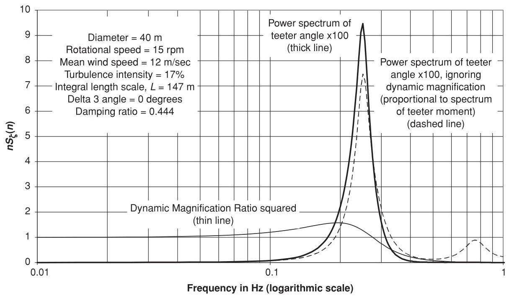

Figure 5.30 Teeter angle power spectrum for two-bladed rotor with T40 blades

This can be written ${S}_{\zeta }\left( n\right)  = \left( {{S}_{MT}\left( n\right) /{\left( I{\omega }_{n}^{2}\right) }^{2}}\right) {\left\lbrack  DMR\right\rbrack  }^{2}$ where ${DMR}$ stands for the dynamic magnification ratio.

Figure 5.30 shows the teeter angle power spectrum, ${S}_{\zeta }\left( n\right)$ , for a two-bladed rotor with T40 blades and zero ${\delta }_{3}$ angle operating at 15 rpm in a mean wind of ${12}\mathrm{\;m}/\mathrm{{sec}}$ . The turbulence intensity is taken as ${17}\%$ , for a Class B site, and the damping ratio, $\xi  = \eta /2$ , is 0.444, calculated from Equation 5.95. Also shown in the figure is the teeter angle power spectrum ignoring dynamic magnification, ${S}_{MT}\left( n\right) /{\left( I{\omega }_{n}^{2}\right) }^{2}$ , which, when multiplied by the square of the dynamic magnification ratio (also plotted), yields the ${S}_{\zeta }\left( n\right)$ curve. The resulting teeter angle standard deviation, obtained by taking the square root of the area under the power spectrum, is ${0.93}^{ \circ  }$ .

Having calculated the teeter angle standard deviation, the extreme value over any desired exposure period can be predicted from Equation 5.59. As is evident from Figure 5.30, the teeter angle power spectrum is all concentrated about the rotational frequency, $\Omega$ , so the zero upcrossing frequency, $v$ , can be set equal to it. Thus, for a machine operating at ${15}\mathrm{{rpm}}$ , a one hour exposure period gives, ${vT} = {900}$ and ${\zeta }_{\max }/{\sigma }_{\zeta } = {3.84}$ . The predicted maximum teeter angle due to stochastic loading over a one hour period for the case above is, thus, ${3.84} \times  {0.93}^{ \circ  } = {3.6}^{ \circ  }$ . This reduces to ${3.0}^{ \circ  }$ if a ${\delta }_{3}$ angle of ${30}^{ \circ  }$ is introduced.

As already mentioned, teetering relieves blade root bending moments as well as those in the low speed shaft. The reduction of the stochastic component of root bending moment can be derived in terms of the standard deviations of blade root bending moment and hub teeter moment for a rigid hub two blade machine. Integration of Equation 5.100 yields the following expression for the latter:

$$
{\sigma }_{MT}^{2} = {\left( \frac{1}{2}\rho \Omega \frac{d{C}_{L}}{d\alpha }\right) }^{2}{\int }_{-R}^{R}{\int }_{-R}^{R}{\kappa }_{u}^{o}\left( {{r}_{1},{r}_{2},0}\right) c\left( {r}_{1}\right) c\left( {r}_{2}\right)  \cdot  {r}_{1}{r}_{2}\left| {r}_{1}\right| \left| {r}_{2}\right| d{r}_{1}d{r}_{2} \tag{5.102}
$$

where, for convenience of notation, ${r}_{1}$ and ${r}_{2}$ , take negative values on the second blade. ${\kappa }_{u}^{o}\left( {{r}_{1},{r}_{2},0}\right)$ is the cross correlation function between the longitudinal wind fluctuations between points at radii ${r}_{1}$ and ${r}_{2}$ on the rotating rotor and is given by the right hand side of Equation 5.51, with ${\Omega \tau }$ set equal to zero when ${r}_{1}$ and ${r}_{2}$ define points on the same blade, and replaced by $\pi$ when ${r}_{1}$ and ${r}_{2}$ define points on different blades. Defining ${\rho }_{u}^{o}\left( {{r}_{1},{r}_{2},0}\right)$ as the normalised cross correlation function, ${\kappa }_{u}^{o}\left( {{r}_{1},{r}_{2},0}\right) /{\sigma }_{u}^{2}$ , Equation 5.102a can be rewritten as:

$$
{\sigma }_{MT}^{2} = {\sigma }_{u}^{2}{\left( \frac{1}{2}\rho \Omega \frac{d{C}_{L}}{d\alpha }\right) }^{2}{\int }_{-R}^{R}{\int }_{-R}^{R}{\rho }_{u}^{o}\left( {{r}_{1},{r}_{2},0}\right) c\left( {r}_{1}\right) c\left( {r}_{2}\right)  \cdot  {r}_{1}{r}_{2}\left| {r}_{1}\right| \left| {r}_{2}\right| d{r}_{1}d{r}_{2} \tag{5.102a}
$$

The corresponding expression for the standard deviation of the mean of the two blade root bending moments is:

$$
{\sigma }_{M}^{2} = \frac{1}{4}{\sigma }_{u}^{2}{\left( \frac{1}{2}\rho \Omega \frac{d{C}_{L}}{d\alpha }\right) }^{2}{\int }_{-R}^{R}{\int }_{-R}^{R}{\rho }_{u}^{o}\left( {{r}_{1},{r}_{2},0}\right) c\left( {r}_{1}\right) c\left( {r}_{2}\right)  \cdot  {r}_{1}^{2}{r}_{2}^{2}d{r}_{1}d{r}_{2} \tag{5.103}
$$

By inspection of the integrals, it is easily shown that:

$$
\frac{1}{4}{\sigma }_{MT}^{2} + {\sigma }_{M}^{2} = {\sigma }_{u}^{2}{\left( \frac{1}{2}\rho \Omega \frac{d{C}_{L}}{d\alpha }\right) }^{2}{\int }_{0}^{R}{\int }_{0}^{R}{\rho }_{u}^{o}\left( {{r}_{1},{r}_{2},0}\right) c\left( {r}_{1}\right) c\left( {r}_{2}\right)  \cdot  {r}_{1}^{2}{r}_{2}^{2}d{r}_{1}d{r}_{2} = {\sigma }_{M}^{2}
$$

(5.104)

where ${\sigma }_{M}$ is the standard deviation of root bending moment for a rigidly mounted blade. Thus, if the rotor is allowed to teeter, the standard deviation of the blade root bending moment will drop from ${\sigma }_{M}$ to ${\sigma }_{M}^{ - }$ where ${\sigma }_{M}$ is given by the equation above. The extent of the reduction is driven primarily by the ratio of rotor diameter to the integral length scale of the wind turbulence. For a two-bladed rotor with T40 blades and an integral length scale of ${147}\mathrm{\;m}$ , the reduction is ${11}\%$ .

#### 5.8.9 Tower coupling

In the preceding sections, consideration of the dynamic behaviour of the blade has been based on the assumption that the nacelle is fixed in space - that is, that the tower is rigid. In practice, of course, no tower is completely rigid, so fluctuating loads on the rotor will result in fore-aft flexure of the tower, which, in turn, will affect the blade dynamics. This section explores the effect the coupling of the blade and tower motions has on blade response.

The application of standard modal analysis techniques to the dynamic behaviour of the system comprising the tower and rotating rotor treated as a single entity is complicated by the system's continually changing geometry, which means that the mode shapes and frequencies of the structure taken as a whole would have to be re-evaluated at each succeeding rotor azimuth position.

An alternative approach is to base the analysis on the mode shapes and frequencies of the different elements of the structure considered separately, with the displacements arising from each set of modes superposed. Thus, the tower modes are calculated on the basis of a completely rigid rotor, and the blade modes are calculated as if the blades were cantilevered from a rigidly mounted shaft - that is, in the same way as before. The blade modes are not orthogonal to the tower modes, so the equations of motion for the different modes are no longer independent of each other, but contain coupled terms. Furthermore, the blade deflections arising from excitation of the tower modes vary with blade azimuth, so a step-by-step solution is required. The treatment which follows is limited to the fundamental blade and tower modes, but could be extended to encompass higher modes.

The equation of motion of the blade is given by Equation 5.62. The blade deflection for blade J may be written

$$
x\left( {r, t}\right)  = \mu \left( r\right)  \cdot  {f}_{J}\left( t\right)  + {\mu }_{TJ}\left( r\right)  \cdot  {f}_{T}\left( t\right) \tag{5.105}
$$

where $\mu \left( r\right)$ is the first blade mode shape for a rigid tower and, ${\mu }_{TJ}\left( r\right)$ is the normalised rigid body deflection of blade J resulting from excitation of the tower first mode. Assuming the normalisation is carried out with respect to hub deflection,

$$
{\mu }_{TJ}\left( r\right)  = 1 + \frac{r}{L}\cos {\psi }_{J} \tag{5.106}
$$

where $L$ is the depth below the hub of the intercept between the tangent to the top of the deflected tower and the undeflected tower axis, as illustrated in Figure 5.31.

Substitution of Equation 5.105 into Equation 5.62 yields, with the aid of Equation 5.65:

$$
m\left( r\right) \mu \left( r\right) {\ddot{f}}_{J}\left( t\right)  + \widehat{c}\left( r\right) \mu \left( r\right) {\dot{f}}_{J}\left( t\right)  + m\left( r\right) {\omega }^{2}\mu \left( r\right) {f}_{J}\left( t\right)  = q\left( {r, t}\right)  - m\left( r\right) {\mu }_{TJ}\left( r\right) {\ddot{f}}_{T}\left( t\right)
$$

$$
- \widehat{c}\left( r\right) {\mu }_{TJ}\left( r\right) {\dot{f}}_{T}\left( t\right) \tag{5.107}
$$

where the coupled terms have been transferred to the right hand side. Multiplying through by $\mu \left( r\right)$ and integrating over the length of the blade gives:

$$
{m}_{1}{\ddot{f}}_{J}\left( t\right)  + {c}_{1}{\dot{f}}_{J}\left( t\right)  + {m}_{1}{\omega }^{2}{f}_{J}\left( t\right)  = {\int }_{0}^{R}\mu \left( r\right) q\left( {r, t}\right) {dr} - {\int }_{0}^{R}m\left( r\right) \mu \left( r\right) {\mu }_{TJ}\left( r\right) {dr} \cdot  {\ddot{f}}_{T}\left( t\right)
$$

$$
- {\int }_{0}^{R}\widehat{c}\left( r\right) \mu \left( r\right) {\mu }_{TJ}\left( r\right) {dr} \cdot  {\dot{f}}_{T}\left( t\right) \tag{5.108}
$$

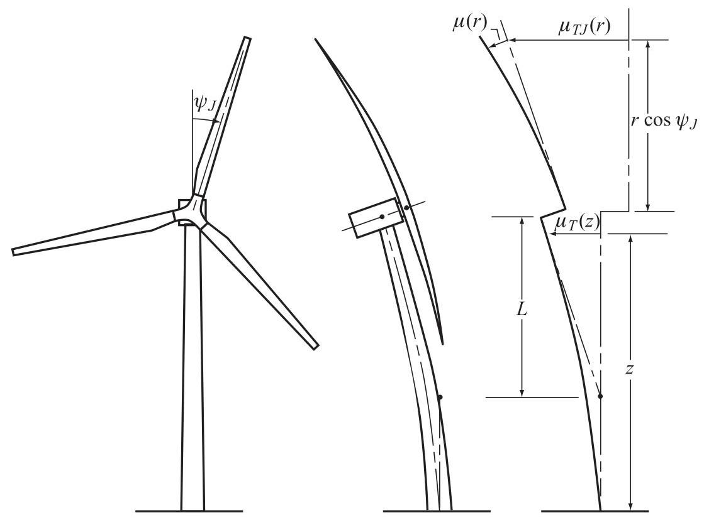

Figure 5.31 Fundamental mode shapes of blade and tower

By analogy with Equation (5.70), the equation of motion of the tower is

$$
{m}_{T1}{\ddot{f}}_{T}\left( t\right)  + {c}_{T1}{\dot{f}}_{T}\left( t\right)  + {m}_{T1}{\omega }_{T}^{2}{f}_{T}\left( t\right)  = {\int }_{0}^{H}{\mu }_{T}\left( z\right) q\left( {z, t}\right) {dz} \tag{5.109}
$$

Here ${\mu }_{T}$ is the tower first mode shape and ${m}_{T1}$ is the generalised mass of the tower, nacelle and rotor (including the contribution of rotor inertia), with respect to the first mode, given by

$$
{m}_{T1} = {\int }_{0}^{H}{m}_{T}\left( z\right) {\mu }_{T}^{2}\left( z\right) {dz} + {m}_{N} + {m}_{R} + {I}_{R}/{L}^{2} \tag{5.110}
$$

Here ${m}_{T}\left( z\right)$ is the mass per unit height of the tower, ${m}_{N}$ and ${m}_{R}$ are the nacelle and rotor masses, and ${I}_{R}$ is the inertia of the rotor about the horizontal axis in its plane, which is constant over time for a three-bladed rotor. For a two-bladed, fixed hub rotor it varies with rotor azimuth, and for a teetering rotor it is omitted altogether.

The major component of the loading on the tower, $q\left( {z, t}\right)$ , is the load fed in at hub height, $H$ , from the blades. The inertia forces on the blades due to rigid body motion associated with the tower first mode have been accounted for by including rotor mass and inertia in ${m}_{T1}$ , and the corresponding damping forces can be accounted for in the calculation of the damping coefficient, ${c}_{T1}$ . However, the aerodynamic loads on the blades and the inertia and damping forces associated with blade flexure - all of which are transmitted to the tower top - have to be included in the right hand side of Equation 5.109 as

$$
{\mu }_{T}\left( H\right)  \cdot  F + {\left( \frac{d{\mu }_{T}}{dz}\right) }_{H} \cdot  M = F + M/L \tag{5.111}
$$

where

$$
F = \mathop{\sum }\limits_{N}{\int }_{0}^{R}{q}_{J}\left( {r, t}\right) {dr} - \mathop{\sum }\limits_{N}{\int }_{0}^{R}{m}_{1}\left( r\right) \mu \left( r\right) {dr} \cdot  {\ddot{f}}_{J}\left( t\right)  - \mathop{\sum }\limits_{N}{\int }_{0}^{R}\widehat{c}\left( r\right) \mu \left( r\right) {dr} \cdot  {\dot{f}}_{J}\left( t\right)
$$

(5.112)

and

$$
M = \mathop{\sum }\limits_{N}{\int }_{0}^{R}r\cos {\psi }_{J}{q}_{J}\left( {r, t}\right) {dr} - \mathop{\sum }\limits_{N}{\int }_{0}^{R}r\cos {\psi }_{J}{m}_{1}\left( r\right) \mu \left( r\right) {dr} \cdot  {\ddot{f}}_{J}\left( t\right)
$$

$$
- \mathop{\sum }\limits_{N}{\int }_{0}^{R}r\cos {\psi }_{J}\widehat{c}\left( r\right) \mu \left( r\right) {dr} \cdot  {\dot{f}}_{J}\left( t\right) \tag{5.113}
$$

The suffix $J$ refers to the $J$ th blade, and $N$ in the summations is the total number of blades.

Hence

$$
F + M/L = \mathop{\sum }\limits_{N}{\int }_{0}^{R}{\mu }_{TJ}{q}_{J}\left( {r, t}\right) {dr} - \mathop{\sum }\limits_{N}{\int }_{0}^{R}{m}_{1}\left( r\right) \mu \left( r\right) {\mu }_{TJ}\left( r\right) {dr} \cdot  {\ddot{f}}_{J}\left( t\right)
$$

$$
- \mathop{\sum }\limits_{N}{\int }_{0}^{R}\widehat{c}\left( r\right) \mu \left( r\right) {\mu }_{TJ}\left( r\right) {dr} \cdot  {\dot{f}}_{J}\left( t\right)
$$

and Equation 5.109 becomes

$$
{m}_{T1}{\ddot{f}}_{T}\left( t\right)  + {c}_{T1}{\dot{f}}_{T}\left( t\right)  + {m}_{T1}{\omega }_{T}^{2}{f}_{T}\left( t\right)  = \mathop{\sum }\limits_{N}{\int }_{0}^{R}{\mu }_{TJ}{q}_{J}\left( {r, t}\right) {dr}
$$

$$
- \mathop{\sum }\limits_{N}{\int }_{0}^{R}{m}_{1}\left( r\right) \mu \left( r\right) {\mu }_{TJ}\left( r\right) {dr} \cdot  {\ddot{f}}_{J}\left( t\right)  - \mathop{\sum }\limits_{N}{\int }_{0}^{R}\widehat{c}\left( r\right) \mu \left( r\right) {\mu }_{TJ}\left( r\right) {dr} \cdot  {\dot{f}}_{J}\left( t\right) \tag{5.114}
$$

omitting the term for loading on the tower itself.

Equations 5.108 and 5.114 provide $\left( {N + 1}\right)$ simultaneous equations of motion with periodic coefficients ${\mu }_{TJ}$ corresponding to the $\left( {N + 1}\right)$ degrees of freedom assumed. The procedure for the step-by-step dynamic analysis which is based on these equations may be summarised as follows:

1. Substitute the displacements, velocities and aerodynamic loads at the beginning of the first time step into Equations 5.108 and 5.114, and solve for the initial accelerations.

2. Formulate the incremental equations of motion for the time step, based on Equations 5.108 and 5.114, retaining the coupled terms on the right hand side - i.e. as pseudo forces.

3. Assume initially that the coupled terms are constant over the duration of the time step, so that they disappear from the incremental equations of motion altogether, rendering them uncoupled.

4. Solve the uncoupled incremental equations of motion to obtain the increments of displacement and velocity over the time step. Adopting the linear acceleration method (Section 5.8.5), the expressions for the displacement and velocity increments at the tip of blade $J$ are as follows:

$$
\Delta {f}_{J} = \frac{\Delta {Q}_{J} + {m}_{1}\left( {\frac{6}{h}{\dot{f}}_{J0} + 3{\ddot{f}}_{J0}}\right)  + {c}_{1}\left( {3{\dot{f}}_{J0} + \frac{h}{2}{\ddot{f}}_{J0}}\right) }{{m}_{1}{\omega }^{2} + \frac{3{c}_{1}}{h} + \frac{6{m}_{1}}{{h}^{2}}} \tag{5.115}
$$

$$
\Delta {\dot{f}}_{J} = \frac{3}{h}\Delta {f}_{J} - 3{\dot{f}}_{J0} - \frac{h}{2}{\ddot{f}}_{J0} \tag{5.116}
$$

The derivation of these expressions parallels that for the absolute values of displacement and velocity at the end of the time step, given in Section 5.8.5. Similar expressions obtain for the displacement and velocity increments at the hub due to tower flexure.

5. Solve Equations 5.108 and 5.114 for the accelerations at the end of the time step.

6. Solve the incremental equations of motion again - this time including the changes in the coupled terms on the right hand side over the time step - to obtain revised increments of displacement and velocity over the time step.

7. Repeat step 5 and step 6 until the increments of displacement and velocity converge.

8. Repeat steps 1-7 for the second and subsequent time steps.

If the analysis is being carried out to obtain the response to deterministic loads, advantage may be taken of the fact that the behaviour of each blade mirrors that of its neighbours with an appropriate phase difference. This means that the number of equations of motion can be reduced to two, and the analysis iterated over a number of revolutions until a steady state response is achieved. For example, in the case of a machine with three blades, A, B and C, the values of blade B and blade C tip velocities and accelerations, which are required on the right hand side of Equation 5.114, would be equated to the corresponding values for blade A occurring $T/3$ and ${2T}/3$ earlier ( $T$ being the period of blade rotation).

Figure 5.32 shows the results from the application of the above procedure to the derivation of blade tip and hub displacements in response to tower shadow loading, considering only the blade and tower fundamental modes. The machine is three-bladed and the parameters chosen are, as far as the rotor is concerned, generally the same as for the rigid tower example in Section 5.8.5 illustrated in Figure 5.25. The tower natural frequency is ${0.58}\mathrm{\;{Hz}}$ , and the tower damping ratio (which is dominated by the aerodynamic damping of the blades) is taken as 0.022 .

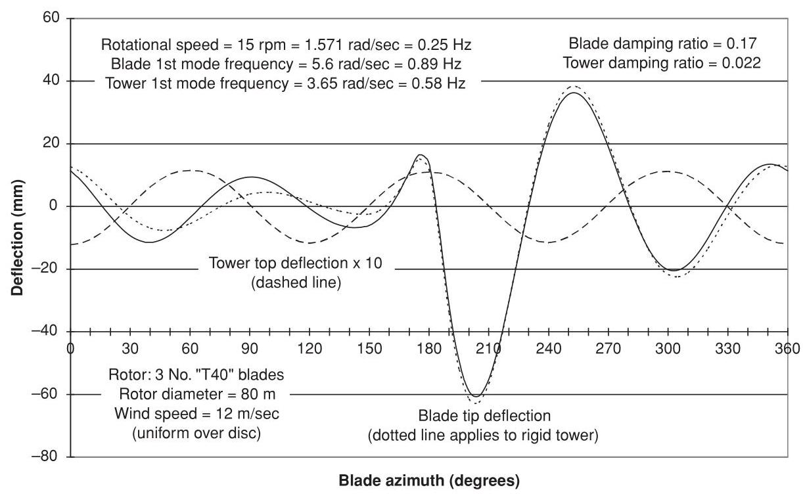

Figure 5.32 Tower top and blade tip deflections resulting from tower shadow, considering fundamental mode responses only

It can be seen that the tower response is sinusoidal at blade passing frequency, which is the forcing frequency. The amplitude is only about one fiftieth of the maximum blade tip displacement of about ${60}\mathrm{\;{mm}}$ , reflecting the large generalised mass associated with the tower mode relative to that associated with the blade mode. The tower shadow effect causes the blade to accelerate rapidly upwind as it passes the tower, with the maximum deflection occurring at an azimuth of about ${205}^{ \circ  }$ . Also plotted on Figure 5.32 is the deflection that would occur if the nacelle were fixed, and it is seen from the comparison that one effect of tower flexibility is to slightly reduce the peak deflection. However, a more significant effect of the tower motion is the maintenance of the amplitude of the subsequent blade oscillations at a higher level prior to the next tower passing.

The modal analysis method outlined above forms the basis for a number of codes for wind turbine dynamic analysis, such as the Garrad Hassan BLADED code (Garrad Hassan, 2010). Typically these codes allow at least the first few blade modes including fllapwise, edgewise and torsional degrees of freedom and several tower modes (fore-aft, side-to-side and torsional) to be represented together with drive train dynamics. See Section 5.13.

Rather than use modal analysis, the dynamic behaviour of coupled rotor/tower systems can also be investigated using finite elements. Standard finite element dynamics packages are, however, inappropriate to the task, because they are only designed to model the displacements of structures with fixed geometry. Lobitz (1984) has pioneered the application of the finite element method to the dynamic analysis of wind turbines with two-bladed, teetering rotors, and Garrad (1987) has extended it to three-bladed, fixed hub machines. In both cases, equations of motion are developed in matrix form for the blade and tower displacement vectors and then amalgamated using a connecting matrix which is a function of blade azimuth and satisfies the compatibility and equilibrium requirements at the tower/rotor interface. Solution of the equations is carried out by a step-by-step procedure. The finite element method is more demanding of computing power, so the modal analysis method is generally preferred.

#### 5.8.10 Aeroelastic stability

Aeroelastic instability can arise when the change in aerodynamic loads resulting from a blade displacement is such as to exacerbate the displacement rather than diminish it, as is normally the case. A theoretical example would be a teetering rotor operating in stalled flow, where the rate of change of lift coefficient with angle of attack is negative, so that the aerodynamic damping is negative likewise. In such circumstances, teeter excursions would be expected to grow until the limits of the negative damping band or of the teeter stops were reached. In practice, this phenomenon can be avoided if the blade is designed so that the blade root flapwise bending moment increases monotonically with wind speed over the full wind speed operational range (Armstrong and Hancock, 1991).

A real instance of incipient aeroelastic instability was the development of an edgewise blade resonance under stalled conditions on some larger three-bladed machines. A negative rate of change of lift coefficient with angle of attack is believed to have been the prime cause - see Section 7.1.9.

Another potential instance of aeroelastic instability is classical flutter, encountered in the design of helicopter rotors, in which the blade structure is such that out-of-plane flexure in the downwind direction results in blade twisting, causing an increase in the angle of attack.

During the development of some of the early large machines, the dangers of aeroelastic instability were considered to be a real concern, and much analysis work was directed to demonstrating that individual turbine designs would not be susceptible to it. However, partly no doubt because of the high torsional rigidity of the closed cell hollow structure adopted for most wind turbine blades, aeroelastic instability was not found to be critical in practice.

With the recent development of some very flexible blade designs for large machines, stability analyses are once again becoming important in the design process.

### 5.9 Blade fatigue stresses

#### 5.9.1 Methodology for blade fatigue design

The verification of the adequacy of a blade design in fatigue requires knowledge of the fatigue loading cycles expected over the lifetime of the machine at different radii, derivation of the resultant stress cycles and calculation of the corresponding fatigue damage number in relation to known fatigue properties of the material. The procedure is less or more complicated, depending upon whether blade loading in one or two planes is taken into account. If bending about only the weaker principal axis is taken into account, considering only aerodynamic lift forces, the steps involved are as follows:

1. Derive the individual fatigue load spectra for each mean wind speed and for each radius. This is a non-trivial task, because, unless wind simulation is used, the information on the periodic and stochastic load components is available in different forms, that is, as a time history and a power spectrum respectively. Sections 5.9.2 and 5.9.3 consider methods of addressing this difficulty.

2. Synthesise the complete fatigue load spectrum at each radius from the separate load spectra for each mean wind speed, including start-ups and shutdowns (see Section 5.5.1).

3. Convert the fatigue load cycles (expressed as bending moments) to fatigue stresses by dividing by the appropriate section modulus. (The section modulus with respect to a particular principal axis is defined as Second Moment of Area of the cross-section about that axis divided by the distance of the point under consideration from the axis).

4. Sum the fatigue damage numbers, ${n}_{i}/{N}_{i}$ , according to Miner’s rule, for each moment range ’bin’ in the fatigue load spectrum, according to the appropriate $S - N$ curve for the material. $S - N$ curves for different blade materials are considered in Sections 7.1.6 and 7.1.7, together with the allowance necessary for mean stress.

Sections 5.9.2 and 5.9.3 are concerned with the first step of the sequence above. For a given mean wind speed, the periodic component of blade loading will be invariant over time, and the stochastic component will be stationary. As noted in Section 5.7.5, the stochastic component can be analysed either in the frequency domain (provided that a linear relationship between incident wind speed and blade loadings can be assumed) or in the time domain - that is, by using wind simulation. Section 5.9.2 considers how the deterministic and stochastic components may be combined if the latter have been analysed in the frequency domain, while Section 5.9.3 looks in detail at the option of assessing fatigue damage completely in the frequency domain.

If the fatigue damage resulting from both in-plane and out-of-plane loading is to be computed, it is necessary to revise the ordering of the steps above, in order to derive the periodic and stochastic components of the stress variation for each point under consideration and for each mean wind speed. For a chosen point, the procedure becomes:

A1. For a given mean wind speed, calculate the time histories of the bending moments about the principal axes resulting from the periodic load components over one blade rotation. The derivation of aerodynamic moments from blade element loads is illustrated in Figure 5.33.

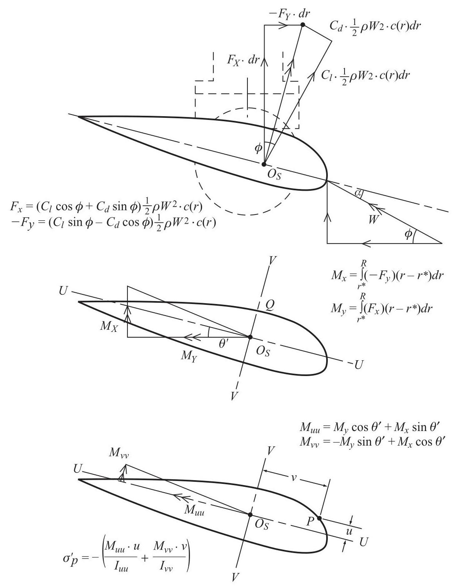

Figure 5.33 Derivation of blade bending stresses at radius ${r}^{ * }$ due to aerodynamic loads

A2. Convert these bending moment time histories to stress time histories by dividing by the appropriate section modulus, and adding them together.

B. For the same mean wind speed, convert the power spectrum of the stochastic bending moment component (which, because of the linearity assumption, arises from fluctuating lift only) to a power spectrum of stress at the chosen point.

C. Calculate the fatigue damage resulting from the combined periodic and stochastic stress components, using the methods of Sections 5.9.2 and 5.9.3.

D. Repeat the above steps for the other mean wind speeds.

E. Add together the fatigue damages arising at each mean wind speed to obtain the total fatigue damage during normal running.

#### 5.9.2 Combination of deterministic and stochastic components

Previous sections have shown how the deterministic (i.e. periodic) and stochastic components of blade bending moments can be characterised in terms of time histories and power spectra respectively. Unfortunately the spectral description of the stochastic loading is not in a suitable form to be combined with the time history of the periodic loading, but this difficulty can be resolved by one of two methods, as follows:

1. The power spectrum of the stochastic component can be transformed into a time history by inverse Fourier transform, which can then be added directly to the time history of the periodic component. Applications of this method have been reported by Garrad and Hassan (1986) and Warren et al. (1988). With the subsequent development of wind simulation techniques, this method is no longer commonly used, because the use of transformations to generate time-histories of wind speed rather than of wind loading avoids the need to assume that wind speed and wind loading are linearly related when deriving the power spectrum of the stochastic load component.

2. A probability density function for the load cycle ranges can be derived empirically, based on the spectral properties of the power spectrum of the stochastic and periodic components of loading combined.

The second approach is considered in the next section.

#### 5.9.3 Fatigue prediction in the frequency domain

The probability density function (pdf) of peaks of a narrow band, Gaussian process are given by the well-known Rayleigh distribution. As each peak is associated with a trough of similar magnitude, the pdf of cycle ranges is Rayleigh likewise.

Wind turbine blade loading cannot be considered as narrow band, despite the concentration of energy at the rotational frequency by 'gust slicing' (Section 5.7.5), and neither can it be considered as Gaussian because of the presence of periodic components. Dirlik (1985) produced an empirical pdf of cycle ranges applicable to both wide and narrow band Gaussian processes, in terms of basic spectral properties determined from the power spectrum. This was done by considering 70 power spectra of various shapes, computing their rainflow cycle range distributions and fitting a general expression for the cycle range pdf in terms of the first, second and fourth spectral moments. Dirlik's expression for the cycle range pdf is:

$$
p\left( S\right)  = \frac{\frac{{D}_{1}}{Q}{e}^{-Z/Q} + \frac{{D}_{2}Z}{{R}^{2}}{e}^{-\left( {{Z}^{2}/2{R}^{2}}\right) } + {D}_{3}Z{e}^{-\left( {{Z}^{2}/2}\right) }}{2\sqrt{{m}_{0}}} \tag{5.117}
$$

where

$$
Z = \frac{S}{2\sqrt{{m}_{0}}},\;{D}_{1} = \frac{2\left( {{x}_{m} - {\gamma }^{2}}\right) }{1 + {\gamma }^{2}}\;{D}_{2} = \frac{\left( 1 - \gamma  - {D}_{1} + {D}_{1}^{2}\right) }{1 - R}\;{D}_{3} = 1 - {D}_{1} - {D}_{2}
$$

$$
Q = \frac{{1.25}\left( {\gamma  - {D}_{3} - {D}_{2}R}\right) }{{D}_{1}}\;R = \frac{\gamma  - {x}_{m} - {D}_{1}^{2}}{\left( 1 - \gamma  - {D}_{1} + {D}_{1}^{2}\right) }\;{x}_{m} = \frac{{m}_{1}}{{m}_{0}}\sqrt{\frac{{m}_{2}}{{m}_{4}}}\;\gamma  = \frac{{m}_{2}}{\sqrt{{m}_{0}{m}_{4}}}
$$

$$
{m}_{i} = {\int }_{0}^{\infty }{n}^{i}{S}_{\sigma }\left( n\right) {dn}
$$

${S}_{\sigma }\left( n\right)$ is the power spectrum of stress and $S$ is the cycle stress range.

Although the Dirlik cycle range pdf was not intended to apply to signals containing periodic components, several investigations (Hoskin et al., 1989; Morgan and Tindal; 1990; Bishop et al., 1991) have been carried out to determine its validity for wind turbine fatigue damage calculations, using monitored data for flapwise bending from the MS1 wind turbine on Orkney. Cycle range pdfs were calculated from power spectra of monitored strains using the Dirlik formula and fatigue damage rates derived from these pdfs compared with damage rates derived directly from the monitored signal by rainflow cycle counting. The ratio of damage calculated by the Dirlik method to damage calculated by the rainflow method ranged from 0.84 to 1.46, from 1.01 to 2.48 and from 0.73 to 2.34 in the three investigations listed above, using an $S/N$ curve exponent of 5 in each case, as the blade structure was of steel. In view of the fact that the calculated damage rates vary as the fifth power of the stress ranges, these results indicate that the Dirlik method is capable of giving quite accurate results, despite the presence of the periodic components.

There are two main drawbacks to the application of the Dirlik formula to power spectra containing periodic components. Firstly the presence of large spikes in the spectra due to the periodic components renders them very different from the smooth distributions Dirlik originally considered, and secondly information about the relative phases of the periodic components is lost when they are transformed to the frequency domain. Morgan and Tindal (1990) illustrate the effect of varying phase angles by a comparison of plots of (cos ${\omega t} + \; {0.5}\cos {3\omega t})$ and $\left( {\cos {\omega t} - {0.5}\cos {3\omega t}}\right)$ which is reproduced in Figure 5.34. For a material with an S/N curve exponent of 5 , stresses conforming to the first time history would result in 5.25 times as much fatigue damage as stresses conforming to the second.

Bishop, Wang and Lack (1995) developed a modified form of the Dirlik formula to include a single periodic component, using a neural network approach to determine the different parameters in the formula from computer simulations.

Madsen et al. (1984) adopted a different approach to the problem of determining fatigue damage resulting from combined stochastic and periodic loading, involving the derivation of a single equivalent sinusoidal loading that would produce the same fatigue damage as the actual loading. The method applies a reduction factor, $g$ , which is dependent on bandwidth, to account for the reduced cycle ranges implicit in a wide band as opposed to a narrow band process, and utilises Rice's pdf for the peak value of a single sinusoid combined with a narrow band stochastic process, substituting half the maximum range of the periodic signal, including harmonics, for the amplitude of the sinusoid. A fuller summary is given in Hoskin et al. (1989). They concluded, along with Morgan and Tindal (1990), that the Madsen method yielded slightly less accurate fatigue damage values than the Dirlik method for the MS1 monitored data for flapwise bending referred to above.

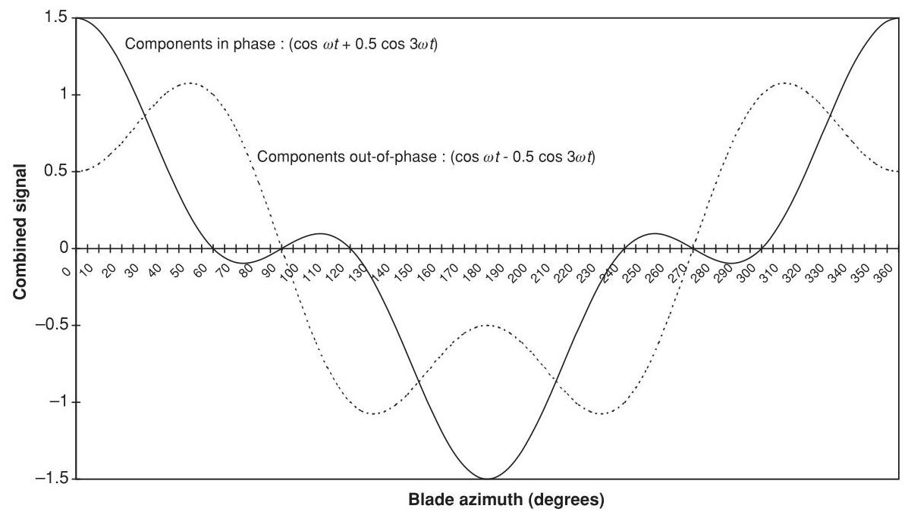

Figure 5.34 Effect of variation of phase angle between harmonics on combined signal

Ragan and Manuel (2007) used about 2500 datasets of blade in-plane and out-of-plane bending moments from a 1.5 MW turbine in Colorado to compare fatigue damage equivalent loads calculated in the frequency domain by the Dirlik method with corresponding values calculated in the time domain. They concluded that the Dirlik method performed reasonably well for out-of-plane moments but very poorly for blade in-plane bending moments, which have a large periodic component.

#### 5.9.4 Wind simulation

Wind simulation, which was introduced in Section 5.7.6, has two significant advantages over the methods described above for fatigue damage evaluation. Firstly it can handle nonlinear relationships between wind speed fluctuations and blade loadings in the calculation of stochastic loads, and secondly it avoids the difficulty of deriving the fatigue stress ranges arising from combined periodic and stochastic load components. It is therefore currently the favoured method for detailed fatigue design. The procedure is essentially as follows:

1) Generate a 3D 'run of wind' for the chosen mean wind speed, with the desired shear profile and tower shadow correction.

2) Perform a step-by-step dynamic analysis on the turbine operating in this wind field, to obtain in-plane and out-of-plane bending moment time histories at different radii.

3) Convert these bending moment time histories to time histories of bending moments about the principal axes.

4) Compute stress time histories at chosen points on each cross-section.

5) Derive the number of cycles in each stress range 'bin' by Rainflow Cycle Counting (see Section 5.9.5 below).

6) Scale up the cycle numbers in line with the predicted number of hours of operation at the chosen mean wind speed.

7) Calculate corresponding fatigue damage numbers based on the applicable S-N curve.

8) Repeat above steps for different mean wind speeds, and total the resulting fatigue damages at each point.

A computationally simpler alternative is to generate a 1D 'run of wind' (in which only the longitudinal component of turbulence is modelled), and run a number of simulations at different, fixed yaw angles.

The duration of wind simulations is limited by available computing power, with a time history length of 600 seconds being frequently chosen. A consequence of this is that a single simulation will not provide an accurate picture of the infrequent high stress range fatigue cycles, which can have a disproportionate effect on fatigue damage for materials with high $m$ value, such as those used for blades. However, this inaccuracy can be reduced (and quantified) by running several simulations with different random number seeds at each wind speed - see Thomsen (1998).

#### 5.9.5 Fatigue cycle counting

As noted in Section 5.9.4, the dynamic analysis of turbine behaviour in a simulated wind field yields time histories of loads or stresses which then need to be processed to abstract details of the fatigue cycles. There are two established methods of fatigue cycle counting: the reservoir method and the rainflow method, both of which yield the same result.

In the reservoir method, the load or stress history (with time axis horizontal) is imagined as the cross-section of a reservoir, which is successively drained from each low point, starting at the lowest and working up. Each draining operation then yields a load or stress cycle. See BS 5400 (1980) for a full description.

The rainflow method was first proposed by Matsuishi and Endo in 1968, and its title derives from the concept of water flowing down the 'rooves' formed when the time history is rotated so that the time axis is vertical. However, the following description not involving the rainflow analogy may be easier to understand.

The first step is to reduce the time history to a series of peaks and troughs, which are then termed extremes. Then, each group of four successive extremes is examined in turn to determine whether the values of the two intermediate extremes lie between the values of the initial and final extremes. If so, the two intermediate extremes are counted as defining a stress cycle, which is then included in the cycle count, and the two intermediate extremes are deleted from the time history. The process is continued until the complete series of extremes forming the time history has been processed in this way. Then the sequence remaining will consist simply of a diverging and a converging part from which the final group of stress ranges can be extracted. See 'Fatigue Characteristics' in the IEA series of Recommended Practices for Wind Turbine Testing and Evaluation for a full description of the method and for details of algorithms that can be used for automating the process.

Although, in principle, the fatigue cycles obtained from, say, a 600 second time history could be listed individually, it is normal to reduce the volume of data by allocating individual cycles to a series of equal load or stress ranges known as 'bins' - for example, 0-2, 2-4, 4-6 $\mathrm{N}/{\mathrm{{mm}}}^{2}$ etc. The fatigue spectrum is then presented in terms of the number of cycles falling into each 'bin'.

### 5.10 Hub and low speed shaft loading

#### 5.10.1 Introduction

The loadings on the hub consist of the aerodynamic, gravity and inertia loadings on the blades and the equal and opposite (discounting hub self-weight) reaction from the shaft. For fixed hub machines, the loading on the shaft will include a significant moment arising from blade aerodynamic loads, but in the case of teetered two-bladed rotors this moment will be virtually eliminated. In either case, however, the cantilevered low-speed shaft will experience large fluctuating moments due to rotor weight as it rotates. Figure 5.35 shows a low-speed shaft and front bearing in a factory prior to assembly.

The shaft moments due to out-of-plane loads on the blades can be expressed as moments about a pair of rotating axes, one perpendicular to blade and the other parallel to it. In the case of a three bladed rotor, these moments are respectively as follows:

$$
{M}_{YS} = \Delta {M}_{Y1} - \frac{1}{2}\left( {\Delta {M}_{Y2} + \Delta {M}_{Y3}}\right) \;{M}_{ZS} = \frac{\sqrt{3}}{2}\left( {\Delta {M}_{Y3} - \Delta {M}_{Y2}}\right) \tag{5.118}
$$

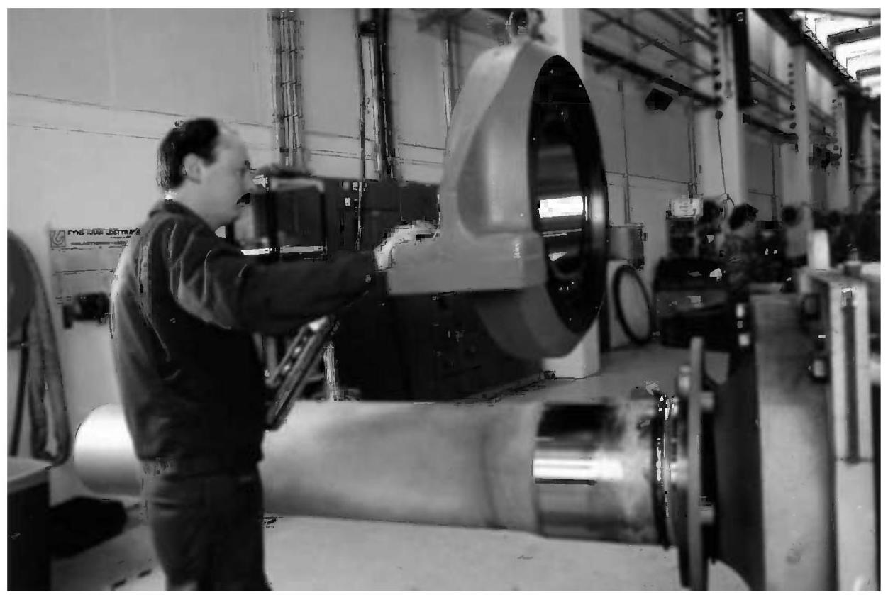

Figure 5.35 Low-speed shaft and front bearing before assembly. The hub mounting flange at the right-hand end is bolted to a temporary support to allow the bearing to be threaded on the shaft. Reproduced by permission of NEG Micon

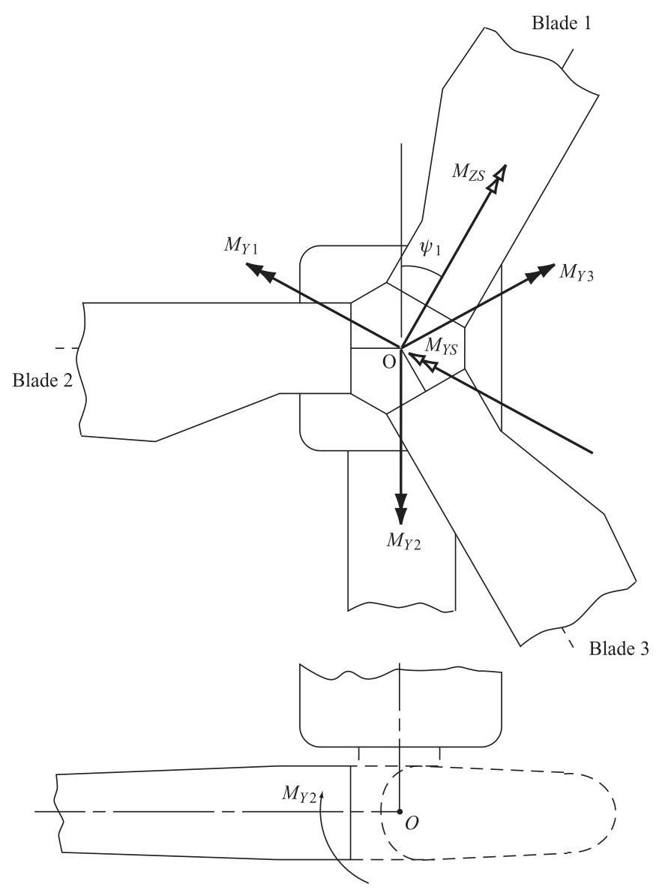

Figure 5.36 Shaft bending moments with rotating axis system referred to blade 1

Here $\Delta {M}_{\mathrm{Y}1},\Delta {M}_{Y2}$ and $\Delta {M}_{Y3}$ are the fluctuations of the blade out-of-plane moments about the hub centre $\left( {{M}_{Y1},{M}_{Y2}\text{ and }{M}_{Y3}}\right)$ about the mean value. See Figure 5.36.

#### 5.10.2 Deterministic aerodynamic loads

The deterministic aerodynamic loads on the rotor may be split up into a steady component, equal for each blade, and a periodic component, also equal for each blade, but with differing phase angles. The blade root out-of-plane bending moments due to the first component will be in equilibrium, and will apply a 'dishing' moment to the hub which will result in tensile stresses in the front and compression stresses in the rear. These stresses will be uniaxial for a two-bladed rotor, and biaxial for a three-bladed rotor.

Figure 5.37 Shaft bending moment fluctuations due to wind shear

The fluctuations in out-of-plane blade root bending moment due to wind shear, shaft tilt and yaw misalignment will often be approximately sinusoidal, with a frequency equal to the rotational frequency. Using Equations 5.118, it is easily shown that, for a sinusoidally varying blade root bending moment with range ${\Delta M}$ , the range of the resulting shaft bending moment is ${1.5\Delta M}$ for a three-bladed machine and ${2\Delta M}$ for a rigid hub two-bladed machine.

In the case of wind shear conforming to a power law, the loading on a horizontal blade is always greater than the average of the loadings on blades pointing vertically upwards and downwards, so the loading departs significantly from sinusoidal. The shaft bending moment fluctuations due to wind shear with a 0.2 exponent are compared in Figure 5.37 for two- and three-bladed rigid hub machines operating at ${15}\mathrm{{rpm}}$ in a hub-height wind speed of ${10}\mathrm{\;m}/\mathrm{s}$ . The ratio of moment ranges is still close to 2:1.5.

#### 5.10.3 Stochastic aerodynamic loads

The out-of-plane blade root bending moments arising from stochastic loads on the rotor will result in both a fluctuating hub 'dishing' moment (see above) and fluctuating shaft bending moments. For a two-bladed, rigid hub rotor, the shaft moment is equal to the difference between the two out-of-plane blade root bending moments, or teeter moment, the standard deviation of which is given by Equation 5.102a. Similarly, the standard deviation of the mean of these two moments (i.e. the 'dishing' moment) is given by Equation 5.103.

The derivation of the standard deviation of the shaft moment for a three-bladed machine is at first sight more complicated, as the integration has to be carried out over three blades instead of two. However, if the shaft moment about an axis parallel to one of the blades,

${M}_{ZS}$ (Figure 5.36), is chosen, the contribution of loading on that blade disappears, and the expression for the shaft moment standard deviation becomes

$$
{\sigma }_{Mzs}^{2} = {\left( \frac{1}{2}\rho \Omega \frac{d{C}_{L}}{d\alpha }\right) }^{2}{\int }_{-R}^{R}{\int }_{-R}^{R}{\kappa }_{u}^{o}\left( {{r}_{1},{r}_{2},0}\right) c\left( {r}_{1}\right) c\left( {r}_{2}\right) \frac{\sqrt{3}}{2}{r}_{1}\frac{\sqrt{3}}{2}{r}_{2}\left| {r}_{1}\right| \left| {r}_{2}\right| d{r}_{1}d{r}_{2} \tag{5.119}
$$

where the limits of the integrations refer to the other two blades. ${\kappa }_{u}^{o}\left( {{r}_{1},{r}_{2},0}\right)$ is given by Equation 5.51, with ${\Omega \tau }$ set equal to zero when ${r}_{1}$ and ${r}_{2}$ are radii to points on the same blade, and replaced by ${2\pi }/3$ when ${r}_{1}$ and ${r}_{2}$ are radii to points on different blades. Note that, compared with the two bladed case, the cross correlation function, ${\kappa }_{u}^{o}\left( {{r}_{1},{r}_{2},0}\right)$ will be increased when ${r}_{1}$ and ${r}_{2}$ relate to different blades, because of the reduced separation between the two blade elements resulting from the ${120}^{ \circ  }$ angle between the blades. Equation 5.119a can be rewritten in terms of the normalised cross correlation function, ${\rho }_{u}^{o}\left( {{r}_{1},{r}_{2},0}\right)  = {\kappa }_{u}^{o}\left( {{r}_{1},{r}_{2},0}\right) /{\sigma }_{u}^{2}$ , as follows:

$$
{\sigma }_{Mzs}^{2} = {\sigma }_{u}^{2}{\left( \frac{1}{2}\rho \Omega \frac{d{C}_{L}}{d\alpha }\right) }^{2}{\int }_{-R}^{R}{\int }_{-R}^{R}{\rho }_{u}^{o}\left( {{r}_{1},{r}_{2},0}\right) c\left( {r}_{1}\right) c\left( {r}_{2}\right) \frac{\sqrt{3}}{2}{r}_{1}\frac{\sqrt{3}}{2}{r}_{2}\left| {r}_{1}\right| \left| {r}_{2}\right| d{r}_{1}d{r}_{2}
$$

(5.119a)

In the case of ${80}\mathrm{\;m}$ diameter turbines with T40 blades operating in wind with a turbulence length scale of ${147}\mathrm{\;m}$ , the standard deviation of shaft moment due to stochastic loading for a three-bladed machine is ${82}\%$ of that for a two-bladed, fixed hub machine rotating at the same speed. This ratio would rise to $\sqrt{3}/2$ if the effect on the cross correlation function of the ${120}^{ \circ  }$ blade spacing were ignored.

It is worth noting that, for a three-bladed machine, the standard deviation of the shaft moment ${M}_{YS}$ due to stochastic loading is the same as that of ${M}_{ZS}$ .

By analogy with the derivation of the shaft moment above, the standard deviation of the hub 'dishing' moment for a three bladed machine due to stochastic loading is given by:

$$
{\sigma }_{Mh}^{2} = \frac{1}{4}{\sigma }_{u}^{2}{\left( \frac{1}{2}\rho \Omega \frac{d{C}_{L}}{d\alpha }\right) }^{2}{\int }_{-R}^{R}{\int }_{-R}^{R}{\rho }_{u}^{o}\left( {{r}_{1},{r}_{2},0}\right) c\left( {r}_{1}\right) c\left( {r}_{2}\right) \frac{\sqrt{3}}{2}{r}_{1}^{2}\frac{\sqrt{3}}{2}{r}_{2}^{2}d{r}_{1}d{r}_{2} \tag{5.120}
$$

where the integrations are carried out over two blades only, and the cross correlation function is modified as before to account for the ${120}^{ \circ  }$ angle between the blades.

It can be shown that

$$
\frac{1}{4}{\sigma }_{Mzs}^{2} + {\sigma }_{Mh}^{2} = \frac{3}{4}{\sigma }_{My1}^{2} \tag{5.121}
$$

#### 5.10.4 Gravity loading

An important component of shaft loading is the cyclic cantilever bending moment due to rotor weight, which usually has a dominant effect on shaft fatigue design. As an illustration, a rotor consisting of three 8 tonne blades, and a 24 tonne hub cantilevered ${1.7}\mathrm{\;m}$ beyond the shaft main bearing, will produce a maximum shaft gravity moment of about ${800}\mathrm{{KNm}}$ . This compares with a shaft moment range due to wind shear of ${360}\mathrm{{KNm}}$ for a hub-height wind of ${10}\mathrm{\;m}/\mathrm{s}$ and a shear exponent of 0.2, and a shaft moment standard deviation of ${350}\mathrm{{KNm}}$ due to turbulence, taking a turbulence intensity of 21% and the same hub-height mean wind speed. Note that the shaft moment due to wind shear relieves that due to gravity, so it would be wise to adopt a smaller wind shear exponent for shaft fatigue calculations.

### 5.11 Nacelle loading

#### 5.11.1 Loadings from rotor

The previous section considered the moments applied to the shaft by the rotor hub using an axis system rotating with the shaft. In addition to these moments, the shaft also experiences an axial load due to rotor thrust, and radial forces arising from differential blade edgewise loadings and any out-of-balance centrifugal force.

In order to calculate loadings on the elements of the nacelle structure, it is first necessary to transform the shaft loads (or the constituent blade loads) defined in terms of the rotating axis system into nacelle loads expressed in terms of a fixed axis system. Here the conventional system, in which the $x$ -axis is downwind, the $y$ -axis is horizontal to starboard and the $z$ -axis is vertically upwards, will be adopted. Thus, the moments acting on the nacelle about the $y$ - and $z$ -axes as a result of the blade root out-of-plane bending moments are as follows for a three-bladed machine with shaft tilt $\eta$ :

$$
{M}_{YN} = {M}_{Y1}\cos \psi  + {M}_{Y2}\cos \left( {\psi  - {120}^{ \circ  }}\right)  + {M}_{Y3}\cos \left( {\psi  - {240}^{ \circ  }}\right) \tag{5.122}
$$

$$
{M}_{ZN} = \left( {{M}_{Y1}\sin \psi  + {M}_{Y2}\sin \left( {\psi  - {120}^{ \circ  }}\right)  + {M}_{Y3}\sin \left( {\psi  - {240}^{ \circ  }}\right) }\right) \cos \eta \tag{5.123}
$$

where $\psi$ is the azimuth of blade 1. See Figure 5.38.

It is instructive to compare the moments acting on the nacelle due to deterministic loading for three-bladed and two-bladed machines. The fluctuations of out-of-plane root bending moment due to wind shear and yaw misalignment are approximately proportional to the cosine of blade azimuth for an unstalled blade. Substituting ${M}_{Y1} = {M}_{0}\cos \psi$ , ${M}_{Y2} = {M}_{0}\cos \left( {\psi  - {2\pi }/N}\right)$ etc. into Equations 5.122 and 5.123 yields ${M}_{YN} = {1.5}{M}_{0}$ and ${M}_{ZN} = 0$ for a three-bladed machine, whereas the corresponding results for a rigid hub two-bladed machine are ${M}_{YN} = {M}_{0}\left( {1 + \cos {2\psi }}\right)$ and ${M}_{ZN} = {M}_{0}\sin {2\psi }\cos \eta$ . Thus, the moments on the nacelle are constant for a three-bladed machine, but continually fluctuating with amplitude ${M}_{0}$ for a rigid hub two-bladed machine. Parallel results are obtained for ${M}_{Y1} = {M}_{0}\sin \psi$ which approximates to the out-of-plane root bending moment due to shaft tilt - again for an unstalled blade. The full comparison is given in Table 5.7.

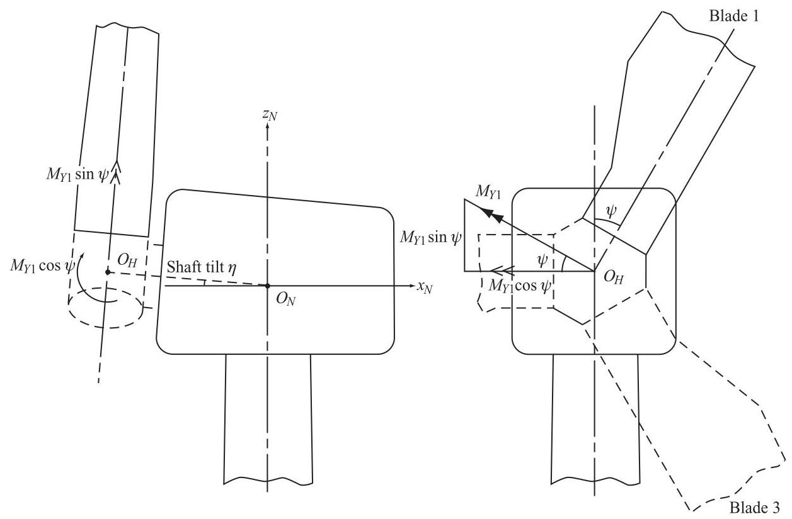

Figure 5.38 Components of blade 1 out-of-plane root bending moment about fixed set of axes

Table 5.7 Comparison between nacelle moments due to deterministic loads for two- and three-bladed machines

<table><tr><td rowspan="2"></td><td colspan="2">Nacelle moments resulting from out-of-plane blade root bending moment fluctuations due to wind shear and yaw misalignment approximated by:   ${M}_{Y1} = {M}_{0}\cos \psi ,{M}_{Y2} = {M}_{0} \; \cos \left( {\psi  - {2\pi }/N}\right)$ etc.</td><td colspan="2">Nacelle moments resulting from out-of-plane blade root bending moment fluctuations due to shaft tilt approximated by:   ${M}_{Y1} = {M}_{0}\sin \psi ,{M}_{Y2} = {M}_{0} \; \sin \left( {\psi  - {2\pi }/N}\right)$ etc.</td></tr><tr><td>Nacelle nodding moment, ${M}_{YN}$</td><td>Nacelle yaw moment, ${M}_{ZN}$</td><td>Nacelle nodding moment, ${M}_{YN}$</td><td>Nacelle yaw moment, ${M}_{ZN}$</td></tr><tr><td>Three-bladed machine</td><td>${1.5}{M}_{0}$</td><td>Zero</td><td>Zero</td><td>${1.5}{M}_{0}\cos \eta$</td></tr><tr><td>Two-bladed, rigid hub machine</td><td>${M}_{0}\left( {1 + \cos {2\psi }}\right)$</td><td>${M}_{0}\sin {2\psi } \; \cos \eta$</td><td>${M}_{0}\sin {2\psi }$</td><td>${M}_{0}\left( {1 - \cos {2\psi }}\right) \; \cos \eta$</td></tr></table>

It is clear that the moments acting on the nacelle due to deterministic loading are much more benign for a three-bladed rotor than for a two-bladed rotor with rigid hub.

In the case of three-bladed machines, the standard deviation of shaft bending moment due to stochastic rotor loading is independent of the rotating axis chosen (Section 5.10.3), so the standard deviation of the resulting moment on the nacelle will take the same value about both the nacelle $y$ - and $z$ -axes.

#### 5.11.2 Cladding loads

Except in the case of sideways wind loading, cladding loads are not usually of great significance. They may be calculated according to the rules given in standard wind loading codes. For sideways wind loading, a drag factor of 1.2 will generally be found to be conservative.

### 5.12 Tower loading

#### 5.12.1 Extreme loads

It is customary to base the calculation of extreme loads on a non-operational turbine on the 50 year return three second gust. Several loading configurations may need to be considered, and the critical load case for the tower base will generally differ from that for the tower top. In addition, it is necessary to investigate the extreme operational load cases, as these can sometimes govern instead if the tip speed is high in relation to the design gust speed.

In the case of non-operational, stall-regulated machines, the critical case for the tower base occurs when the wind is blowing from the front and inducing maximum drag loading on the blades. By contrast, sideways wind loading to produce maximum lift on a blade pointing vertically upwards or rear wind loading on the rotor with one blade shielded by the tower will produce the maximum tower top bending moment.

One of the benefits of pitch-regulation of three-bladed machines is that blade feathering at shut down considerably reduces non-operational rotor loading. The critical configuration as far as tower base bending moment is concerned is sideways wind loading, with two of the blades inclined at ${30}^{ \circ  }$ to the vertical. The horizontal component of the loading on these blades is ${\cos }^{3}{30}^{ \circ  }$ of the loading on a vertical blade, so that the total rotor loading is only 43.3% $\left( { = {100} \cdot  \sqrt{3}/4\% }\right)$ of the maximum experienced by a stall regulated machine.

The cases of sideways wind loading on a wind turbine referred to above can only arise if the yaw drive is disabled by grid loss for sufficient time for a ${90}^{ \circ  }$ wind direction change to take place, so IEC 61400-1 Edition 3 treats this case (DLC 6.2) as an abnormal load case with a reduced load factor of 1.1 (in place of 1.35 for normal load cases). As a result of this, the load case causing extreme tower base overturning moment on pitch-regulated machines is not always clear cut. If the rotor is braked with one blade vertically upwards and the yaw angle is small (corresponding to IEC 61400-1 Edition 3 DLC 6.1), the loading on the top blade could approach maximum lift. Loads on the other blades would be smaller and their horizontal components would probably act in the opposite direction. The maximum loading on the top blade would be $\left( {{0.5\rho }{V}^{2}}\right) {1.5}{A}_{B}$ , ignoring wind shear, where ${A}_{B}$ is the blade area. On the other hand, DLC 6.2 gives a drag loading of $2{\cos }^{3}{30}^{ \circ  }\left( {{0.5\rho }{V}^{2}}\right) {1.3}{A}_{B} = \left( {{0.5\rho }{V}^{2}}\right) {1.69}{A}_{B}$ , again ignoring wind shear, which becomes $\left( {{0.5\rho }{V}^{2}}\right) {1.86}{A}_{B}$ after inclusion of the load factor. This is somewhat less than the factored load on a vertical blade experiencing maximum lift of ${2.025}\left( {{0.5\rho }{V}^{2}}\right) {A}_{B}$ . However, the drag loading on the blades in DLC 6.2 acts in the same direction as the drag loading on the tower, whereas the lift load on the vertical blade in DLC 6.1 acts at right angles to the drag loading on the tower.

Information on the drag factors appropriate for cylindrical and lattice towers is to be found in - EN 1991-1-4: 2005 'Eurocode 1: Actions on structures - Part 1-4: Wind actions', and in national codes such as BS 8100 (1986) or DS 410 (1983). The drag factor for a cylindrical tower is typically 0.6-0.7. Rotor loading is generally the dominating component of tower base moment for stall-regulated machines, but with pitch-regulated machines the contributions of tower loading and rotor loading are often of similar magnitude.

#### 5.12.2 Dynamic response to extreme loads

Just as in the case of the single, stationary cantilevered blade considered in Section 5.6.3, the quasistatic bending moments in the tower calculated for the extreme gust speed will be augmented by inertial moments resulting from the excitation of resonant tower oscillations by turbulence. As before, it is convenient to express this augmentation in terms of a dynamic factor, ${Q}_{D}$ , defined as the ratio of the peak moment over a ten minute period, including resonant excitation of the tower, to the peak quasistatic moment over the same period. Thus,

$$
{M}_{Max} = \frac{1}{2}\rho {U}_{e50}^{2}H\oint {C}_{f}{\left( \frac{z}{H}\right) }^{1 + {2\alpha }}{dA} \cdot  {Q}_{D} \tag{5.124}
$$

where

${U}_{\mathrm{e}{50}}$ is the 50 year return gust speed at hub-height

$z$ is height above ground

$H$ is the hub height

${C}_{f}$ is the force factor (lift or drag) for the element under consideration

$\alpha$ is the shear exponent, taken as 0.11 in IEC 61400-1

and

$$
{Q}_{D} = \frac{1 + g\left( {2\frac{{\sigma }_{u}}{\bar{U}}}\right) \sqrt{{K}_{SMB} + \frac{{\pi }^{2}}{2\delta }{R}_{u}\left( {n}_{1}\right) {K}_{Sx}\left( {n}_{1}\right)  \cdot  {\lambda }_{M1}^{2}}}{1 + {g}_{0}\left( {2\frac{{\sigma }_{u}}{\bar{U}}}\right) \sqrt{{K}_{SMB}}} \tag{5.17}
$$

The integral sign $\oint$ signifies that the integral is to be undertaken over each blade, the nacelle and the tower. The derivation of Equation 5.17 is explained in Section 5.6.3 and the Appendix in relation to a cantilevered blade.

The essentially similar procedure for a tower supporting a braked rotor and nacelle is as follows:

1) Calculate the resonant size reduction factor, ${K}_{Sx}\left( {n}_{1}\right)$ , which reflects the effect of the lack of correlation of the wind fluctuations at the tower natural frequency along the blades and tower. Adopting an exponential expression for the normalised co-spectrum as before, Equation A5.25 becomes:

$$
{K}_{Sx}\left( {n}_{1}\right)  = \frac{\oint \oint \exp \left\lbrack  {-{Cs}{n}_{1}/\bar{U}}\right\rbrack  {C}_{f}^{2}c\left( r\right) c\left( {r}^{\prime }\right) {\mu }_{1}\left( r\right) {\mu }_{1}\left( {r}^{\prime }\right) {drd}{r}^{\prime }}{{\left( \oint {C}_{f}c\left( r\right) {\mu }_{1}\left( r\right) dr\right) }^{2}} \tag{5.125}
$$

where

- the integral sign $\oint$ denotes integration over the blades and the tower;

- $r$ and ${r}^{\prime }$ denote radius in the case of the blades and depth below the hub in the case of the tower;

- $s$ denotes the separation between the elements ${dr}$ and $d{r}^{\prime }$ ;

- ${C}_{f}$ is the relevant force coefficient;

- $c\left( r\right)$ denotes chord in the case of the blades and diameter in the case of the tower;

- ${\mu }_{1}\left( r\right)$ denotes the tower first mode shape.

This expression can be considerably simplified by setting ${\mu }_{1}\left( r\right)$ to unity for the rotor and ignoring the tower loading contribution entirely. This is not unreasonable, as only loading near the top of the tower is of significance, and this does not add much to the spatial extent of the loaded area.

2) Calculate the damping logarithmic decrement, $\delta$ , for the tower first mode. The aerodynamic component is given by

$$
{\delta }_{a} = {2\pi }{\xi }_{a} = {2\pi }\frac{{c}_{a1}}{2{m}_{T1}{\omega }_{1}} = \frac{\oint {\widehat{c}}_{a}\left( r\right) {\mu }_{1}^{2}\left( r\right) {dr}}{2{m}_{T1}{n}_{1}} \tag{5.126}
$$

where ${m}_{T1}$ is the generalised mass of the tower, nacelle and rotor (including the contribution of rotor inertia) with respect to the first mode given by (Equation 5.110), and ${n}_{1}$ is the tower natural frequency in Hz. For a stall-regulated machine facing the wind, the rotor contribution to aerodynamic damping is simply $\rho \bar{U}{C}_{D}{A}_{R}/2{m}_{T1}{n}_{1}$ where ${\mathrm{A}}_{\mathrm{R}}$ is the rotor area.

3) Calculate the standard deviation of resonant nacelle displacement according to

$$
\frac{{\sigma }_{x1}}{{\bar{x}}_{1}} = 2\frac{{\sigma }_{u}}{\bar{U}}\frac{\pi }{\sqrt{2\delta }}\sqrt{{R}_{u}\left( {n}_{1}\right) }\sqrt{{K}_{Sx}\left( {n}_{1}\right) } \tag{5.7}
$$

4) Calculate the ratio ${\lambda }_{M1}$ , which relates the ratio of the standard deviation of resonant tower base moment to the mean value to the corresponding ratio for nacelle displacement as follows:

$$
\frac{{\sigma }_{M1}}{\bar{M}} = {\lambda }_{M1}\frac{{\sigma }_{x1}}{{\bar{x}}_{1}} \tag{5.8a}
$$

If ${\mu }_{1}\left( r\right)$ is set to unity for the rotor, ${\lambda }_{M1}$ is given by:

$$
{\lambda }_{M1} = \frac{{\int }_{0}^{H}m\left( z\right) {\mu }_{1}\left( z\right)  \cdot  {zdz}\left\{  {{C}_{D}{A}_{R} + {\int }_{0}^{H}{C}_{f}{\left\lbrack  \frac{U\left( z\right) }{\bar{U}}\right\rbrack  }^{2}d\left( z\right) {\mu }_{1}\left( z\right) {dz}}\right\}  }{{m}_{T1}H\left\{  {{C}_{D}{A}_{R} + {\int }_{0}^{H}{C}_{f}{\left\lbrack  \frac{U\left( z\right) }{\bar{U}}\right\rbrack  }^{2}d\left( z\right) \frac{z}{H}{dz}}\right\}  } \tag{5.127}
$$

where $z$ is the height up the tower measured from the base, $d\left( z\right)$ is the tower diameter at height $z$ and $H$ is the hub-height. If the loading on the tower is relatively small, this approximates to

$$
{\lambda }_{M1} = \frac{{\int }_{0}^{H}m\left( z\right) {\mu }_{1}\left( z\right)  \cdot  {zdz}}{{m}_{T1} \cdot  H} \tag{5.127a}
$$

which is close to unity because the tower head mass dominates the integral.

5) Calculate the size reduction factor for the root bending moment quasistatic or background response, ${K}_{SMB}$ , which reflects the lack of correlation of the wind fluctuations along the blades and tower. ${K}_{SMB}$ may be derived from a similar expression to that for the resonant size reduction factor given in Equation 5.125, but with the exponential function modified to $\exp \left\lbrack  {-s/{0.3}{L}_{u}^{x}}\right\rbrack$ .

6) Calculate the peak factors for the combined (i.e. resonant plus quasistatic) and qua-sistatic responses in terms of the respective zero up-crossing frequencies. In estimating the zero up-crossing frequency of the quasistatic response, the blade area should be replaced by the rotor area in Equation A5.57.

7) Substitute the parameter values derived in steps 1-6 into Equation 5.17 to obtain the dynamic factor, ${Q}_{D}$ .

In the case of a rotor which is allowed to idle when shutdown, turbine geometry is continually changing as the rotor rotates to and fro in response to wind gusts, so the calculation of resonant tower excitation, should it occur, becomes a complex undertaking.

#### 5.12.3 Operational loads due to steady wind (deterministic component)

Tower fore and aft bending moments result from rotor thrust loading and rotor moments. The moments acting on the nacelle due to deterministic rotor loads have already been described in Section 5.11.1. Although the thrust loads on individual blades vary considerably with azimuth as a result of yaw misalignment, shaft tilt or wind shear, the fluctuations on different blades balance each other, so that the total rotor thrust shows negligible azimuthal variation as a result of these effects. For example, on two-bladed machines, a wind shear exponent of 0.2 results in a rotor thrust variation of about $\pm  1\%$ . Tower shadow loading results in a sinusoidal tower top displacement at blade passing frequency - see Figure 5.32.

Figure 5.39 illustrates the variation of rotor thrust with wind speed for stall and pitch regulated ${80}\mathrm{\;m}$ diameter three-bladed machines.

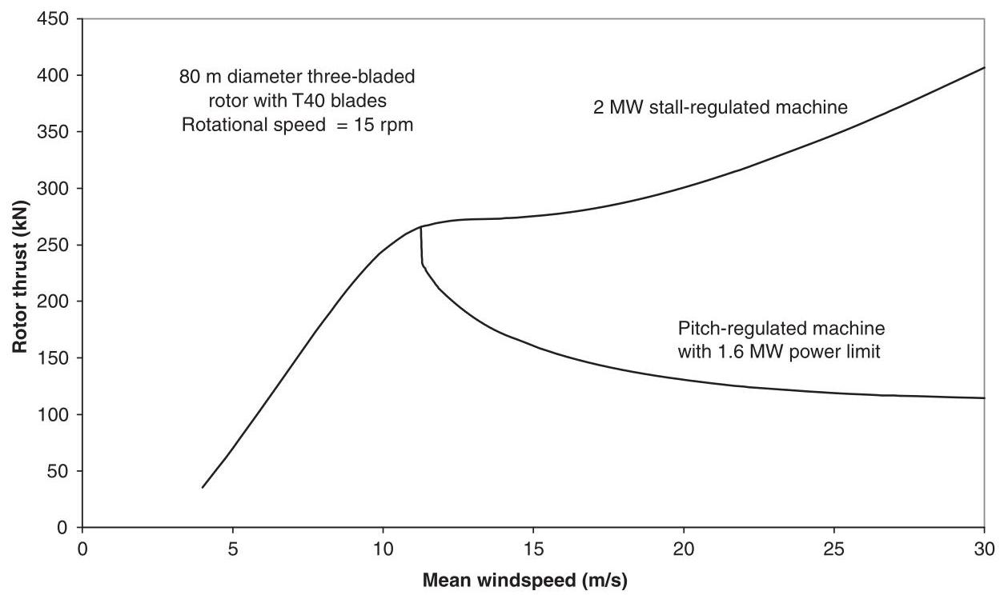

Figure 5.39 Rotor thrust during operation in steady, uniform wind: variation with wind speed for similar stall-regulated and pitch-regulated machines

#### 5.12.4 Operational loads due to turbulence (stochastic component)

## Analysis in the frequency domain

Except near the top of the tower, the dominant source of fore-aft stochastic tower bending moments is rotor thrust. The standard deviation of rotor thrust can be expressed in terms of the turbulence intensity and the cross correlation function between wind fluctuations at different points on the rotor, following the method used for deriving the standard deviation of stochastic blade root bending moment in Section 5.7.5. As before, a linear relation between the wind fluctuations and the resultant load fluctuations is assumed, so that the perturbation of loading per unit length of blade, $q$ , at radius $r$ is given by

$$
q = \frac{1}{2}{\rho \Omega rc}\left( r\right) \frac{d{C}_{L}}{d\alpha }u \tag{5.25}
$$

and the perturbation of rotor thrust by

$$
{\Delta T} = \left( {\frac{1}{2}{\rho \Omega }\frac{d{C}_{L}}{d\alpha }}\right) \oint {uc}\left( r\right) {rdr} \tag{5.128}
$$

where the integral sign $\oint$ signifies that the integration is carried out over the whole rotor. Hence the following expression for the variance of the rotor thrust is obtained:

$$
{\sigma }_{T}^{2} = {\left( \frac{1}{2}\rho \Omega \frac{d{C}_{L}}{d\alpha }\right) }^{2}{\sigma }_{u}^{2}\oint \oint {\rho }_{u}^{o}\left( {{r}_{1},{r}_{2},0}\right) c\left( {r}_{1}\right) c\left( {r}_{2}\right) {r}_{1}{r}_{2}d{r}_{1}d{r}_{2} \tag{5.129}
$$

where ${\rho }_{u}^{o}\left( {{r}_{1},{r}_{2},0}\right)$ is the normalised cross correlation function, ${\kappa }_{u}^{o}\left( {{r}_{1},{r}_{2},0}\right) /{\sigma }_{u}^{2}$ for points at radii ${r}_{1}$ and ${r}_{2}$ on the same or on different blades. ${\kappa }_{u}^{o}\left( {{r}_{1},{r}_{2},0}\right)$ is given by Equation 5.51, with ${\Omega \tau }$ replaced by the phase angle between the two blades on which ${r}_{1}$ and ${r}_{2}$ are measured. For a three-bladed, ${80}\mathrm{\;m}$ diameter rotor and an integral length scale of ${147}\mathrm{\;m}$ , the reduction in the standard deviation of the stochastic rotor thrust fluctuations is about ${20}\%$ due to the lack of correlation of the wind speed variations over the rotor. If the machine is rotating at ${15}\mathrm{{rpm}}$ in an $8\mathrm{\;m}/\mathrm{s}$ wind and the turbulence intensity is ${20}\%$ , the rotor thrust standard deviation will be about ${38}\mathrm{{KN}}$ - that is, ${22}\%$ of the steady value.

The derivation of the expression for the power spectrum of rotor thrust parallels that for the power spectrum of blade root bending moment (Section 5.7.5), yielding:

$$
{S}_{T}\left( n\right)  = {\left( \frac{1}{2}\rho \Omega \frac{d{C}_{L}}{d\alpha }\right) }^{2}\oint \oint {S}_{{uJ}, K}^{o}\left( {{r}_{1},{r}_{2}, n}\right) c\left( {r}_{1}\right) c\left( {r}_{2}\right) {r}_{1}{r}_{2}d{r}_{1}d{r}_{2} \tag{5.130}
$$

where ${S}_{{uJ}, K}^{o}\left( {{r}_{1},{r}_{2}, n}\right)$ is the rotationally sampled cross spectrum for points at radii ${r}_{1}$ and ${r}_{2}$ on blades $J$ and $K$ respectively. Note that on a machine with three blades, $A, B$ and $C$ , ${S}_{{uJ}, K}^{o}\left( {{r}_{1},{r}_{2}, n}\right)$ is complex when $J$ and $K$ are different, but ${S}_{{uA}, B}^{o}\left( {{r}_{1},{r}_{2}, n}\right)$ and ${S}_{{uA}, C}^{o}\left( {{r}_{1},{r}_{2}, n}\right)$ are complex conjugates, so the double integral in Equation 5.130 is still real. An example power spectrum of rotor thrust for an ${80}\mathrm{\;m}$ diameter three-bladed machine is shown in Figure 5.40. It can be seen that there is some concentration of energy at the blade passing frequency of ${0.75}\mathrm{\;{Hz}}$ due to gust slicing, but that the effect is not large. The concentration effect is significantly greater for two-blade machines - see Figure 5.41. This shows the power spectrum of rotor thrust for a two-bladed machine with the same blade platform, but rotating 22.5% faster to give comparable performance.

Figure 5.40 Power spectra of rotor thrust and resultant tower base fore-aft bending moment for three-bladed, ${80}\mathrm{\;m}$ diameter turbine

Figure 5.41 Power spectra of rotor thrust and resultant tower base fore-aft bending moment for two-bladed, ${80}\mathrm{\;m}$ diameter turbine

In addition to thrust fluctuations, longitudinal turbulence will also cause rotor torque fluctuations and in-plane rotor loads due to differential loads on different blades, both of which will result in tower sideways bending moments. The expression for the in-plane component of aerodynamic lift per unit length, $- {F}_{Y}\left( r\right)  = \frac{1}{2}\rho {W}^{2}{C}_{L}c\left( r\right) \sin \phi$ , can be differentiated with respect to the wind fluctuation as follows:

$$
- \frac{d{F}_{Y}}{du} = \frac{1}{2}{\rho c}\left( r\right) \frac{d}{du}\left\lbrack  {{W}^{2}\sin \phi  \cdot  {C}_{L}}\right\rbrack   = \frac{1}{2}{\rho c}\left( r\right) \frac{d}{du}\left\lbrack  {W\left\{  {{U}_{\infty }\left( {1 - a}\right)  + u}\right\}  {C}_{L}}\right\rbrack
$$

$$
\cong  \frac{1}{2}{\rho c}\left( r\right) W\left\lbrack  {{C}_{L} + \sin \phi \frac{d{C}_{L}}{d\alpha }}\right\rbrack
$$

so, approximately,

$$
\frac{-d{F}_{Y}}{du} = \left( {\frac{1}{2}{\rho \Omega }\frac{d{C}_{L}}{d\alpha }}\right) c\left( r\right)  \cdot  r\left\lbrack  {\frac{{C}_{L}}{d{C}_{L}/{d\alpha }} + \sin \phi }\right\rbrack \tag{5.131a}
$$

Thus, the standard deviation of rotor torque is approximately given by

$$
{\sigma }_{Q} = \left( {\frac{1}{2}{\rho \Omega }\frac{d{C}_{L}}{d\alpha }}\right) {\sigma }_{u}\left\{  {\oint {r}^{2}c\left( r\right) \left\lbrack  {\frac{{C}_{L}}{d{C}_{L}/{d\alpha }} + \sin \phi }\right\rbrack  {dr}}\right\} \tag{5.131b}
$$

(which parallels Equation 5.26) provided the relationship between blade loading and wind speed fluctuation remains linear and the turbulence length scale is large compared with rotor diameter. Equation 5.131b can be used to derive an expression for the variance of the rotor torque in the same way as for rotor thrust above. At the top of the tower the stochastic ${M}_{X}$ (i.e. side-to-side) moment due to rotor torque fluctuations is typically of the same order of magnitude as the stochastic ${M}_{Y}$ (i.e. fore-aft) moment due to differential out-of-plane loads on the rotor, but at the tower base the dominant effect of rotor thrust loading means that the stochastic side-to-side moments are usually significantly less than the stochastic fore-aft moments before the excitation of tower resonance is taken into account.

## Analysis in the time domain

As noted in Section 5.7.5, there are situations, such as operation in stalled flow, when the linear relationship between blade loading and wind speed fluctuations required for analysis in the frequency domain does not apply. In these cases, recourse must be made to analysis in the time domain using wind simulation techniques such as described in Section 5.7.6.

#### 5.12.5 Dynamic response to operational loads

The power spectrum of rotor thrust will usually contain some energy at the tower natural frequency, leading to dynamic magnification of deflections and, hence, of tower bending moments. The power spectrum of hub deflection, ${\mathrm{S}}_{x1}\left( n\right)$ , resulting from the excitation of the tower first fore-aft flexural mode, is related to the power spectrum of rotor thrust by

$$
{S}_{x1}\left( n\right)  = \frac{{S}_{T}\left( n\right) }{{k}_{1}^{2}}\frac{1}{\left\lbrack  \left( 1 - {n}^{2}/{n}_{1}^{2}\right)  + 4{\xi }_{1}^{2}{n}^{2}/{n}_{1}^{2}\right\rbrack  } \tag{5.132}
$$

This relation is analogous to Equation 5.90, and derived in the same way.

The amplitude of tower base fore-aft moment at resonance in the first mode, ${M}_{Y1}$ , can be derived from the corresponding amplitude of hub deflection, ${x}_{H1}$ , as follows

$$
{M}_{Y1} = {\omega }_{1}^{2}{x}_{H1}{\int }_{0}^{H}m\left( z\right) \mu \left( z\right) {zdz} = {\omega }_{1}^{2}{x}_{H1}{m}_{T1}H\frac{{\int }_{0}^{H}m\left( z\right) \mu \left( z\right) {zdz}}{H{\int }_{0}^{H}m\left( z\right) {\mu }^{2}\left( z\right) {dz}} \tag{5.133}
$$

The quotient on the right hand side is close to unity because of the dominance of the tower head mass, so, substituting ${k}_{1}$ for ${\omega }_{1}^{2}{m}_{T1}$ , the equation reduces to ${M}_{Y1} = {x}_{H1}{k}_{1}H$ , which applies at any exciting frequency. Hence the power spectrum for the tower base fore-aft bending moment due to rotor thrust loading is given by

$$
{S}_{My1}\left( n\right)  = {S}_{T}\left( n\right)  \cdot  {H}^{2}\frac{1}{\left\lbrack  \left( 1 - {n}^{2}/{n}_{1}^{2}\right)  + 4{\xi }^{2}{n}^{2}/{n}_{1}^{2}\right\rbrack  } \tag{5.134}
$$

The aerodynamic damping is almost entirely provided by the rotor, the damping ratio for the first tower mode being approximately

$$
{\xi }_{a1} = N\frac{\frac{1}{2}{\rho \Omega }{\int }_{0}^{R}\frac{d{C}_{l}}{d\alpha }{rc}\left( r\right) {dr}}{2{m}_{T1}{\omega }_{1}} \tag{5.135}
$$

where $N$ is the number of blades (see Section 5.8.4). The overall damping ratio is obtained by adding this to the structural damping ratio for the tower (see Table 5.5), and is generally low compared to the blade first mode damping because of the large tower head mass. The effect of a low damping ratio is illustrated by the power spectrum of fore-aft tower bending moment shown in Figure 5.40, which has a very high peak at the tower natural frequency of ${0.58}\mathrm{\;{Hz}}$ , despite this frequency being somewhat removed from the blade passing frequency of ${0.75}\mathrm{\;{Hz}}$ . The damping ratio is calculated as 0.037, consisting of 0.035 due to aerodynamic damping (based on a tower head mass of 120 tonnes) and 0.002 due to structural damping (for a welded steel tower).

In the example shown in Figure 5.40, the tower dynamic response increases the standard deviation of the tower base fore-aft bending moment by 9%. However, the effect of tower dynamic response results in a larger increase of ${15}\%$ in the case of the two-bladed machine featured in Figure 5.41, despite the reduction in tower natural frequency to maintain the same tower natural frequency to blade passing frequency ratio.

It is important to note that the rotor provides negligible aerodynamic damping in the side-to-side direction, so that effectively the only damping present is the structural damping.

This means that, even though the side-to-side loadings are small in relation to the fore-aft loads, the side-to-side tower moment fluctuations can sometimes approach the fore-aft ones in magnitude.

#### 5.12.6 Fatigue loads and stresses

The tower moments at height $z$ are related to the hub height loads as follows, omitting the tower inertial loads:

$$
{M}_{Y}\left( {z, t}\right)  = {F}_{X}\left( {H, t}\right)  \cdot  \left( {H - z}\right)  + {M}_{Y}\left( {H, t}\right)
$$

$$
{M}_{X}\left( {z, t}\right)  =  - {F}_{Y}\left( {H, t}\right)  \cdot  \left( {H - z}\right)  + {M}_{X}\left( {H, t}\right) \tag{5.136}
$$

$$
{M}_{Z}\left( {z, t}\right)  = {M}_{Z}\left( {H, t}\right)
$$

For three-bladed machines, the five hub-height fatigue loads are almost entirely stochastic, because the deterministic load component is either constant (for a given mean wind speed) or negligible, and it is instructive to consider how they relate to one another. Recognising that the centre of any gust lying off the rotor centre will be located at a random azimuth, then it is clear that the rotor out-of-plane loads - that is, the moment about the horizontal axis, ${M}_{Y}\left( {H, t}\right)$ , the hub moment about the vertical axis, ${M}_{Z}\left( {H, t}\right)$ , and the rotor thrust, ${F}_{X}\left( {H, t}\right)  -$ will all be statistically independent of each other. The same will apply to the rotor in-plane loads - the rotor torque, ${M}_{X}\left( {H, t}\right)$ , and the sideways load, ${F}_{Y}\left( {H, t}\right)$ . However, as the out-of-plane and in-plane loads on a blade element are both assumed to be proportional to the local wind speed fluctuation, $u$ , it follows that the rotor torque fluctuations will be in phase with the rotor thrust fluctuations, and the rotor sideways load fluctuations will be in phase with the fluctuations of the hub moment about the horizontal axis, ${M}_{Y}\left( {H, t}\right)$ .

The above relationships have implications for the combination of fatigue loads. Clearly the power spectrum of the fore-aft tower moment at height $z,{S}_{My}\left( {z, n}\right)$ , can be obtained by simply adding the power spectrum of the hub moment about the horizontal axis to ${\left( H - z\right) }^{2}$ times the power spectrum of the rotor thrust. Similarly the power spectrum of the side-to-side tower moment at height $z,{S}_{Mx}\left( {z, n}\right)$ , can be obtained by adding the power spectrum of the rotor torque to ${\left( H - z\right) }^{2}$ times the power spectrum of the rotor sideways load.

Having obtained power spectra for the ${M}_{X},{M}_{Y}$ and ${M}_{Z}$ moments at height $z$ , the corresponding fatigue load spectra can be derived with reasonable accuracy by means of the Dirlik method described in Section 5.9.3. As the tower stress ranges will be enhanced by tower resonance, the input power spectra should incorporate dynamic magnification, as outlined in Section 5.12.5. Ragan and Manuel (2007) compared fatigue loads calculated in the frequency and time domains (see Section 5.9.3) and concluded that the Dirlik method performed very well in estimating tower fatigue bending moments for the case investigated.

Fatigue stress ranges due to bending about the two axes can easily be calculated separately from the ${M}_{X}\left( z\right)$ and ${M}_{Y}\left( z\right)$ fatigue spectra, but the stress ranges due to the two fatigue spectra combined cannot be calculated precisely because of lack of information about phase relationships. However, as noted above, the ${M}_{X}\left( H\right)$ component of the ${M}_{X}\left( z\right)$ fluctuations is in phase with the ${F}_{X}\left( H\right)$ component of the ${M}_{Y}\left( z\right)$ fluctuations, and the ${F}_{Y}\left( H\right)$ component of the ${M}_{X}\left( z\right)$ fluctuations is in phase with the ${M}_{Y}\left( H\right)$ component of the ${M}_{Y}\left( z\right)$ fluctuations so the stress ranges due to the ${M}_{X}\left( z\right)$ and ${M}_{Y}\left( z\right)$ fatigue spectra combined can be conservatively calculated as if they were in phase too. Theoretically this means pairing the largest ${M}_{X}\left( z\right)$ and ${M}_{Y}\left( z\right)$ loading cycles, the second largest, the third largest and so on, right through the fatigue spectra, and calculating the stress range resulting from each pairing. In practice, of course, the ${M}_{X}\left( z\right)$ and ${M}_{Y}\left( z\right)$ load cycles are distributed between two sets of equal size ’bins’, so they have to be reallocated to bins in a two-dimensional matrix of descending load ranges, as shown in the grossly simplified example given in Tables 5.8 and 5.9 below.

Table 5.8 Example ${M}_{X}$ and ${M}_{Y}$ fatigue spectra

<table><tr><td>$\Delta {M}_{Y}\left( \mathrm{{KNm}}\right)$</td><td>No. of $\Delta {M}_{Y}$ cycles</td><td>$\Delta {M}_{X}\left( \mathrm{{KNm}}\right)$</td><td>No. of $\Delta {M}_{X}$ cycles</td></tr><tr><td>200-300</td><td>5</td><td>100-150</td><td>10</td></tr><tr><td>100-200</td><td>15</td><td>50-100</td><td>40</td></tr><tr><td>0-100</td><td>80</td><td>0-50</td><td>50</td></tr></table>

For a circular tower, the stress ranges would have to be computed at several points around the circumference in order to identify the location (with respect to the nacelle axis) where the fatigue damage was maximum.

A simpler but potentially cruder approach to the combination of the two fatigue spectra is to use the 'Damage Equivalent Load' method. This involves the calculation of constant amplitude fatigue loadings, ${M}_{X,{Del}}$ and ${M}_{Y,{Del}}$ , of, say ${10}^{7}$ cycles each, that would respectively produce the same fatigue damages as the ${M}_{X}$ and ${M}_{Y}$ spectra, using the $S - N$ curve appropriate to the fatigue detail under consideration. If the ${M}_{X}$ and ${M}_{Y}$ fluctuations are treated as being in-phase as before, the combined ’Damage Equivalent Load’ moment is, $\sqrt{{M}_{X.{Del}}^{2} + {M}_{Y.{Del}}^{2}}$ .

### 5.13 Wind turbine dynamic analysis codes

A large modern turbine is a complex structure. Relatively sophisticated methods are required in order to predict the detailed performance and loading of a wind turbine. These methods should take into account:

- the aerodynamics of the rotating blade, including induced flows (i.e. the modification of the flow field caused by the turbine itself), three-dimensional flow effects and dynamic stall effects when appropriate;

- structural analysis of the blades, drive train and tower, allowing their vibrational dynamics to be modelled;

Table 5.9 Joint ${M}_{X}$ and ${M}_{Y}$ cycle distribution

<table><tr><td rowspan="2">$\Delta {M}_{\mathrm{X}}\left( \mathrm{{KNm}}\right)$</td><td colspan="3">$\Delta {M}_{Y}\left( \mathrm{{KNm}}\right)$</td><td rowspan="2">Total No. of ${M}_{X}$ cycles</td></tr><tr><td>200-300</td><td>100-200</td><td>0-100</td></tr><tr><td>100-150</td><td>5</td><td>5</td><td></td><td>10</td></tr><tr><td>50–100</td><td></td><td>10</td><td>30</td><td>40</td></tr><tr><td>0-50</td><td></td><td></td><td>50</td><td>50</td></tr><tr><td>Total No. of ${M}_{\mathrm{Y}}$ cycles</td><td>5</td><td>15</td><td>80</td><td></td></tr></table>

- aeroelastic feedback, i.e. the modification of the aerodynamic forces due to the vibrational velocities of the structure;

- dynamic response of subsystems such as the generator, yaw system and blade pitch control system;

- control algorithms used during normal operation, start-up and shut-down of the turbine; and

- temporal and spatial variations of the wind field impinging on the turbine, including the three-dimensional structure of the turbulence itself.

For offshore wind turbines, this should be extended to include:

- hydrodynamic forces on the submerged structure; and

- hydroelastic feedback, i.e. the modification of the hydrodynamic forces due to the vibrational velocities of the structure.

Starting from a wind turbulence spectrum, it is possible to develop techniques in the frequency domain which account for many of these aspects, including rotational sampling of the turbulence by the blades, the response of the structure, and the control system. These techniques are set out in Sections 5.7.5, 5.8.6, 5.12.4 and elsewhere. However, although frequency domain methods are elegant and computationally efficient, they can only be applied to linear time-invariant systems and, therefore, cannot deal with some important aspects of wind turbine behaviour, such as:

- stall aerodynamics and hysteresis;

- non-linearities in subsystems such as bearing friction and pitch rate limits;

- nonlinear aspects of control algorithms;

- variable speed operation; and

- start-up and shut-down.

As a result, time-domain methods almost exclusively are now used for wind turbine design calculations. The ready availability of computing power means that the greater computational efficiency of frequency domain methods is no longer such an important consideration.

A number of codes are available commercially for the calculation of wind turbine performance and loads using time-domain simulations. These simulations use numerical techniques to integrate the equations of motion over time, by subdividing the time into short timesteps, as described in Section 5.8.5. In this way, all the non-linearities and non-stationary aspects of the system, such as those listed above, can be dealt with to any desired level of accuracy. A useful early comparative survey of such codes was given by Molenaar and Dijkstra (1999).

As explained in Section 5.8.5, there are a number of different algorithms or solvers for integrating the equations of motion. Some use a fixed timestep $h$ (which has to be short enough to account for all modal frequencies which are considered important), while others use a variable timestep which is continually adjusted during the simulation, keeping it as long as possible to maximise simulation speed while still keeping all the integrated states within a certain error tolerance.

The use of variable timestep methods also allows accurate modelling of discontinuities, because close to a discontinuity the timestep can be adjusted to find the exact moment when the characteristics of the system change. Discontinuities can occur for many reasons: for example stick-slip friction (of pitch and yaw bearings, shaft brake, slipping clutch etc.), grid loss, faults, controller or safety system actions etc. Note that the equations of motion and structural resonant frequencies change at the moment when a friction element like a brake changes from slipping to sticking.

On the other hand these codes can provide a valuable way to test turbine controllers, linking the real controller to the simulation model which acts as a 'virtual turbine', and in this case a fixed timestep may be more appropriate, to allow regular communication with the controller running in real time, and to ensure that the calculations for each timestep are completed within that real time interval. Necessarily this may mean a loss of accuracy in predicting the effect of higher frequency modes and discontinuities. As an example, the Bladed code mentioned below normally uses a variable timestep, but also provides a fixed step option for real-time applications such as controller testing.

Two principal approaches to the modelling of structural dynamics are embodied in time-domain simulation packages. Some use a full finite-element representation of the structure, which is broken down into small elements. The equations of motion are solved for each element, with boundary conditions matched at the interfaces between elements. An example of such a code is Adams-WT (Hansen, 1998), which consists of a general purpose finite-element code (Adams) interfaced to an aerodynamic module.

The other main approach is the modal analysis method as described in Section 5.8.1, in which simple finite-element methods are used to predict just the first few modes of vibration of the main components, such as the rotor blades and the tower. These are typically modelled as beam elements, but it is important to include geometric stiffening effects so that, for example, the centrifugal stiffening of the blades is taken into account - that is, the increase in apparent stiffness with rotational speed due to the effect of centrifugal force on the element mass. Additional degrees of freedom are added as required, for example for the drive train rotation and torsion, pitch and yaw motion etc. The equations of motion are then derived for the entire coupled system. Traditionally this can be done by constructing the Lagrangian for the system including all degrees of freedom. With full rotation of the yaw bearing on top of a flexible tower, and then full rotation of the rotor (also flexible) about the shaft axis, the co-ordinate transformations involved mean that the equations rapidly become very large, usually requiring some form of symbolic processing to derive them in an automated way. More recently, methods based on the approach of Multi-body Dynamics (see for example Shabana, 1998) have been used, which provides a generalised way to link together the separate equations of motion of each rigid or flexible component by means of defined linking elements, which can include rigid links, revolute hinges, sliding joints etc. This provides a very powerful technique which is readily extended to structures of arbitrary complexity. Using a technique originally proposed by Craig and Bampton (1968), the mode shapes of each modal component can be defined in a way which is independent of any other component to which it is attached.

One example of a widely-used commercial code based on the component mode approach is Bladed (Garrad Hassan, 2010). Originally built using a Lagrangian approach, this code has recently been converted to use a multi-body approach. Beam element models for the blades and tower are combined with elements representing other components of the transmission system, the yaw and pitch actuators etc. The control system, which has a major influence on the performance as well as the loads, can be modelled in full detail. The code can also model the electrical generator and power converter, allowing detailed calculations of turbine response to network faults, generator short-circuit faults etc. in a fully integrated way. Interfaces are provided to link in more detailed models of subcomponents such as gearboxes. For most calculations this level of detail is not required, but where certain load cases are critical for the particular component it may be useful to be able to run a more detailed model.

By using a limited number of modes, the modal approach results in rapid calculations, so that a complete set of design or certification load cases, typically amounting to several hundred load cases each consisting of a ten-minute simulation, can be run in a few hours on a standard desktop computer. A small number of modes is generally adequate for predicting the loads: the higher frequency modes generally have little effect. However, to model the deflections accurately it would be necessary to model more modes, because the modelled deflection is a linear combination of the mode shapes used, and a small number of mode shapes may not be sufficient to model the actual deflected shape. Rather than using more modes, the static improvement technique can be used (Barltrop and Adams, 1991): effectively the calculated loading is used as if it were a static load, and combined with the stiffness matrix to recalculate the deflections.

The modal approach generally assumes that all deflections of the flexible bodies remain small. More complex non-linear beam-element models are being developed to help increase accuracy in case of larger defections, such as may be found with very flexible blades. Alternatively, the non-linearity can be captured by modelling the blade as a number of shorter linear beam elements joined end to end.

For the aerodynamics, all these codes generally use BEM (blade element momentum theory) as described in Chapter 3, as this is currently the only way to achieve rapid enough simulations for the standard sets of calculations which are normally needed. More advanced aerodynamic methods such as vortex wake and panel methods are starting to be used to examine specific cases where BEM is not sufficiently accurate. This might include highly yawed flow, tip vanes, ducted rotors or the need to understand the aerodynamic interaction between the blades and the nacelle, for instance. Ultimately CFD (computerised fluid dynamics) methods based on direct solution of the Navier-Stokes equation could be used, and some general commercial CFD codes are now available, but these methods are still far too slow and cumbersome to be useful except perhaps to examine very special cases in detail.

It is important to be able to simulate three-dimensional turbulent wind fields because the dynamic wind speed variations across the rotor are of major importance in determining the loads. The Veers method (Veers, 1988) as described in Section 5.7.6 is a convenient way to do this: a random number sequence is filtered using a representation of the spectrum and spatial coherence of the turbulence to generate a three-dimensional wind field which is consistent with the chosen spectral model. This method is used by the codes mention above. Bladed also incorporates a different technique, due to Mann (1998), which generates a turbulence field by means of a three-dimensional inverse fast Fourier transform of the three-dimensional wavenumber spectrum (see Chapter 2). For offshore turbines, Bladed uses a related method to generate stochastic wave time histories impacting on the submerged part of the structure, in addition to the loading from water currents. As with the effect of aerodynamics, the effect of the vibrational velocities of the structure on the hydrodynamic forces is significant. This leads to considerable interactions between the wind and wave loading. Jamieson et al. (2000) have demonstrated that if wind and wave loading are treated in isolation from each other, an over-conservative design is likely to result.

Figure 5.42 Blade root bending moment in steady wind

The use of sophisticated calculation methods such as those described above are now mandatory for the certification of wind turbines, particularly at the larger sizes. A few illustrative examples of results obtained with Bladed are described below.

Figure 5.42 shows a Bladed simulation of the in- and out-of-plane bending moments at the root of one of the blades, during operation in steady, sheared wind. The in-plane moment is almost a sinusoidal function of azimuth, being dominated by the gravity loading due to the self-weight of the blade which, relative to the blade, changes direction once per revolution. The mean is offset from zero because of the mean positive aerodynamic torque developed by the blade. There is a slight distortion of the sinusoid, partly because of the variation of aerodynamic torque due to wind shear and the effect of tower shadow, and partly because of the effect of structural vibrations.

The out-of-plane moment is always positive, the mean value being dominated by the aerodynamic thrust on the blade. There is a systematic variation with azimuth resulting from the wind shear, giving a lower load at ${180}^{ \circ  }$ azimuth (bottom dead centre) than at ${0}^{ \circ  }$ . A sharp dip at ${180}^{ \circ  }$ is also visible, and this is the effect of the tower shadow (the reduction in wind speed in the vicinity of the tower). The blade out-of-plane vibrational dynamics contribute a significant higher-frequency variation.

In turbulent wind, the loads take on a much more random appearance, as shown in Figure 5.43. The out-of-plane load in particular is varying with wind speed and, as this is a pitch-controlled machine, with pitch angle. The in-plane load is more regular, as it is always dominated by the reversing gravity load.

Spectral analysis provides a useful means of understanding these variations. Figure 5.44 shows auto-spectra of the blade root out-of-plane bending moment and the hub thrust force. The out-of-plane bending moment is dominated by peaks at all multiples of the rotational frequency of ${0.8}\mathrm{\;{Hz}}$ . These are caused mainly by the rotational sampling of turbulence by the blade as it sweeps around, repeatedly passing through turbulent eddies. Wind shear and tower shadow also contribute to these peaks. A small peak due to the first out-of-plane mode of vibration at about ${3.7}\mathrm{\;{Hz}}$ is just visible. There is also a significant effect of the first tower fore-aft mode of vibration at about ${0.4}\mathrm{\;{Hz}}$ .

Figure 5.43 Blade root bending moment in turbulent wind

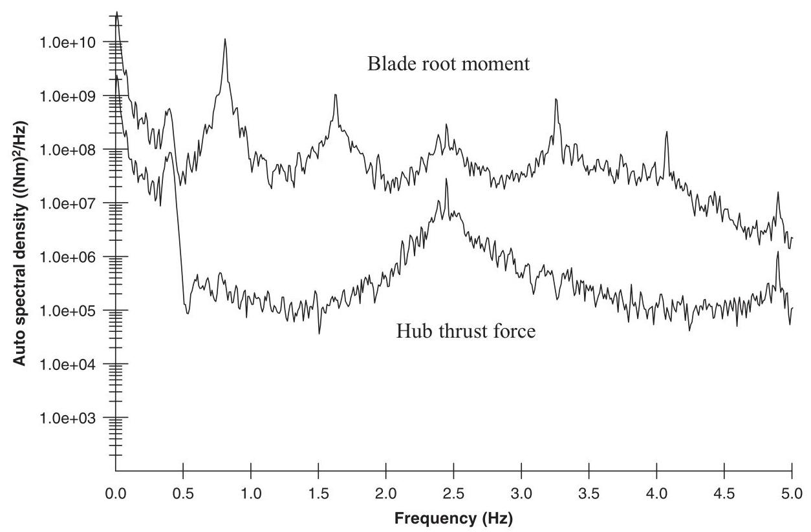

Figure 5.44 Spectra of out-of-plane loads in turbulent wind

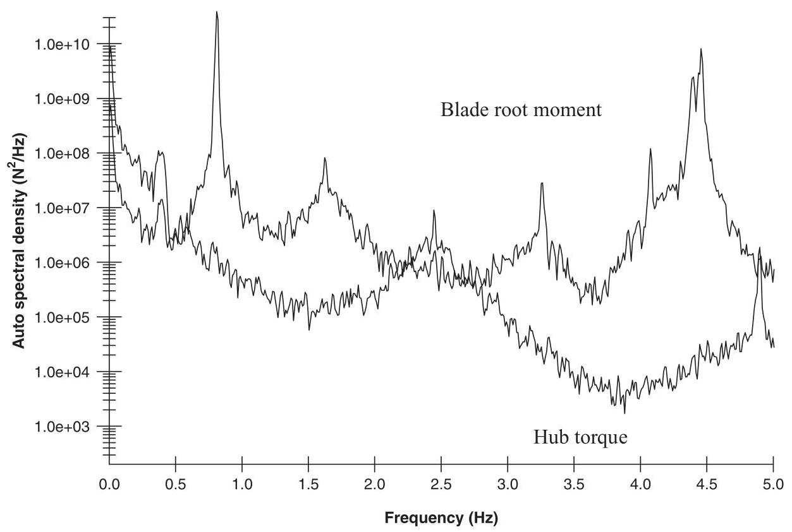

Figure 5.45 Spectra of in-plane loads in turbulent wind

This tower effect is also visible in the spectrum of the hub thrust force. However, this force is the sum of the shear forces at the roots of the three blades. These forces are ${120}^{ \circ  }$ out of phase with each other, with the result that the peak at the rotational frequency (1P) is eliminated; as are the peaks at multiples of this frequency such as 2P, 4P etc. Only the peaks at multiples of 3P remain, since at these frequencies the three blades act in phase with each other.

This effect is even more significant in the in-plane load spectra (Figure 5.45). Of the blade load peaks at multiples of 1P, only the relatively small peaks at 3P and 6P come through to the hub torque. The 1P peak in the blade load, which is dominated by gravity, is particularly large, but it is completely eliminated from the hub torque. The tower peak at ${0.4}\mathrm{\;{Hz}}$ is visible in both loads. A large blade load peak at the first in-plane blade vibrational mode at ${4.4}\mathrm{\;{Hz}}$ is also seen, but this is a mode which does not include any rotation at the hub, and consequently is not seen in the hub torque. Some higher frequency blade modes (not shown) will be coupled with hub rotation.

### 5.14 Extrapolation of extreme loads from simulations

In the case of Load Case 1.1 (normal operation in a turbulent wind) IEC 61400-1 Edition 3 requires the characteristic blade root out-of-plane and in-plane bending moments and the characteristic tip deflection to be determined by statistical extrapolation of the extreme values of the load time series output from the simulations. For simulations of ten minutes duration, the characteristic value is defined as that with a ${3.8} \times  {10}^{-7}$ probability of exceedance - that is, the load with a return period of 50 years. This section considers ways in which the load exceedance probability distribution can be derived from the simulations and extrapolated to the ${3.8} \times  {10}^{-7}$ value. As it is more convenient to work with load non-exceedance probability distributions - otherwise known as cumulative distribution functions - the discussion below is in these terms, using the notation $P\left( {X \leq  x}\right)  = F\left( x\right)$ .

There are two sequences that can be followed in order to assemble a single load probability distribution from simulation data from different wind speed bins:

- Derivation of load non-exceedance probability distributions for each wind speed bin followed by combination of the these distributions in proportion to the operating time in each bin ('Fitting before aggregation').

- Aggregation of results from all wind speed bins, with the number of simulations per bin proportional to the hours of operation in each bin, followed by the derivation of a single load non-exceedance probability distribution ('Aggregation before fitting').

It is also necessary to decide how many extreme values from each simulation are to be utilised. In the 'global extremes' method, only the largest extreme value in each ten-minute simulation - that is, the global extreme - is used in the construction of the load non-exceedance probability distribution, but in the 'local extremes' method all extreme values that can be considered independent are utilised. The 'local extremes' method would appear to be more attractive, because it uses much more of the available data, but it throws up the problem of establishing a criterion for independence.

The various stages of the 'Fitting before aggregation' sequence using the 'global extremes' method are considered first.

#### 5.14.1 Derivation of empirical cumulative distribution function of global extremes

Each ten-minute time series will yield a maximum value of the load under investigation and, for $n$ ten-minute simulations at a particular wind speed, there will be $n$ such global extremes, which can be ranked $1,2,\ldots i,\ldots ,{n}_{k}$ from smallest to largest. An empirical non-exceedance probability distribution for the ten-minute extreme load, ${x}_{k}$ , at wind speed ${U}_{k}$ can then be constructed as

$$
F\left( {{x}_{ki} \mid  {U}_{k}}\right)  = \frac{i}{{n}_{k} + 1},\;i = 1,2,\ldots ,{n}_{k} \tag{5.137}
$$

Harris (1996) has shown that, if $F\left( x\right)$ is a known function of $x$ , the mean of the $L$ non-exceedance probabilities $F\left( {x}_{i}\right)$ for the $i$ th extremes from $L$ sets of $n$ ten-minute simulations, derived from the ${x}_{i}$ simulation results, tends to the value $i/\left( {n + 1}\right)$ for $L$ large.

#### 5.14.2 Fitting an extreme value distribution to the empirical distribution

There are several extreme value distributions which can be fitted to the empirical probability distributions obtained from the simulations. These include the Gumbel distribution (also known as the Fisher-Tippett I distribution), which was introduced in the context of extreme wind speeds in Section 2.8, the log-normal distribution, the three parameter Weibull distribution and the generalised extreme value distribution, which are described in turn below.

## a) Gumbel distribution

The probability that the variable $X$ will not exceed the value $x$ is given by

$$
P\left( {X \leq  x}\right)  = F\left( x\right)  = \exp \left\lbrack  {-\exp \left( {-\frac{x - {x}_{o}}{c}}\right) }\right\rbrack \tag{5.138}
$$

where ${x}_{o}$ is the most likely extreme value or the mode of distribution, $c$ is the dispersion and $y = \left( {x - {x}_{o}}\right) /c$ is termed the reduced variate.

This relationship is a straight line if $y =  - \ln \left\lbrack  {-\ln \left( {F\left( x\right) }\right) }\right\rbrack$ is plotted against $x$ , so a Gumbel distribution can be fitted to the empirical distribution by the method of least squares and the parameters ${x}_{o}$ and $c$ thereby determined. However, Harris (1996) has pointed out two defects of the classical least squares method.

First of all, the mean of the function which is plotted, $- \ln \left\lbrack  {-\ln \left( {F\left( {x}_{i}\right) }\right) }\right\rbrack$ , is not the same as the double natural logarithm of the mean of $F\left( {x}_{i}\right)$ itself, given by Equation 5.137. Harris provides a formula by which the mean of $- \ln \left\lbrack  {-\ln \left( {F\left( {x}_{i}\right) }\right) }\right\rbrack$ , that is, ${\bar{y}}_{i}$ , may be evaluated when the data should conform to a Gumbel distribution - as follows:

$$
{\bar{y}}_{v} = \frac{N!}{\left( {v - 1}\right) !\left( {N - v}\right) !}{\int }_{0}^{1} - \ln \left\lbrack  {-\ln \left( z\right) }\right\rbrack  {z}^{N - v}{\left( 1 - z\right) }^{v - 1}{dz} \tag{5.139}
$$

In this formula, $N$ is the number of data points $\left( { = {n}_{k}}\right) , v$ is the rank of data points with the largest first, so that $v = \left( {N + 1}\right)  - i$ and $z = F\left( {x}_{y}\right)$ .

Secondly, the classical least squares method assumes that the variability of each plotted ordinate is of similar magnitude, whereas, for extreme value data, the variability of the reduced variate, $y$ , is much greater for the largest values than for the others. Accordingly, Harris proposes weighting the data points in inverse proportion to the variance of the $y$ values, before the least squares fitting is carried out.

Values of ${\bar{y}}_{v}$ and its standard deviation are given in Table 5.10 for the case of $N = {15}$ , consistent with the IEC 61400-1 Edition 3 requirement for at least 15 ten-minute simulations for wind speeds above rated. Values of y calculated by the standard Gumbel method are also included for comparison and it is seen that the differences are significant for the largest of the extremes. The Harris weighting factor is included in the table in the last column. It is seen that, in general, the Harris method will result in a steeper straight line which is less influenced by the largest extremes.

An alternative method of fitting a straight line to the $- \ln \left\lbrack  {-\ln \left( {F\left( x\right) }\right) }\right\rbrack$ plot is the method of statistical moments (Moriarty et al., 2004), in which the first two statistical moments of the data - defined as the mean and the variance respectively - are equated to analytical expressions for these moments. Thus, for the standard Gumbel distribution, $F\left( y\right)  = \exp \left\lbrack  {-\exp \left( {-y}\right) }\right\rbrack$ , the probability density function is $f\left( y\right)  = {dF}\left( y\right) /{dy} = \exp \left\lbrack  {-y - \exp \left( {-y}\right) }\right\rbrack$ and the mean is

$$
{\mu }_{y} = {\int }_{-\infty }^{\infty }y \cdot  f\left( y\right) {dy} = {\int }_{-\infty }^{\infty }y \cdot  \exp \left\lbrack  {-y - \exp \left( {-y}\right) }\right\rbrack  {dy} = \gamma  = {0.5772} \tag{5.140}
$$

Table 5.10 Table of mean values of the reduced variate, ${y}_{y} =  - \ln \left\lbrack  {-\ln \left( {F\left( {x}_{y}\right) }\right. }\right.$ , its standard deviation and the Harris weighting factor, ${w}_{y}$

<table><tr><td>Rank, $v$ (Largest first)</td><td>Rank, $i$ (Smallest first)</td><td>${y}_{y} = \; - \ln \left\lbrack  {-\ln \left( {\left( {N + 1 - v}\right) /\left( {N + 1}\right) }\right) }\right\rbrack \; =  - \ln \left\lbrack  {-\ln \left( {i/\left( {N + 1}\right) }\right) }\right\rbrack$ (Gumbel method)</td><td>${\bar{y}}_{v}$ - Equation 5.139 (Harris method)</td><td>${\sigma }_{y} -$ Standard Deviation of ${\bar{y}}_{v}$</td><td>Harris Weighting factor, ${w}_{y}$</td></tr><tr><td>1</td><td>15</td><td>2.7405</td><td>3.2853</td><td>1.2825</td><td>0.0064</td></tr><tr><td>2</td><td>14</td><td>2.0134</td><td>2.2504</td><td>0.8031</td><td>0.0164</td></tr><tr><td>3</td><td>13</td><td>1.572</td><td>1.7133</td><td>0.6291</td><td>0.0266</td></tr><tr><td>4</td><td>12</td><td>1.2459</td><td>1.3404</td><td>0.5341</td><td>0.037</td></tr><tr><td>5</td><td>11</td><td>0.9816</td><td>1.0478</td><td>0.4726</td><td>0.0472</td></tr><tr><td>6</td><td>10</td><td>0.755</td><td>0.8019</td><td>0.4291</td><td>0.0573</td></tr><tr><td>7</td><td>9</td><td>0.5528</td><td>0.5852</td><td>0.3965</td><td>0.0671</td></tr><tr><td>8</td><td>8</td><td>0.3665</td><td>0.3873</td><td>0.3714</td><td>0.0765</td></tr><tr><td>9</td><td>7</td><td>0.1903</td><td>0.201</td><td>0.3518</td><td>0.0852</td></tr><tr><td>10</td><td>6</td><td>0.0194</td><td>0.0206</td><td>0.3366</td><td>0.0931</td></tr><tr><td>11</td><td>5</td><td>-0.1511</td><td>-0.1595</td><td>0.3254</td><td>0.0996</td></tr><tr><td>12</td><td>4</td><td>-0.3266</td><td>-0.3458</td><td>0.3184</td><td>0.104</td></tr><tr><td>13</td><td>3</td><td>-0.5152</td><td>-0.5884</td><td>0.317</td><td>0.1049</td></tr><tr><td>14</td><td>2</td><td>-0.7321</td><td>-0.7884</td><td>0.3257</td><td>0.0994</td></tr><tr><td>15</td><td>1</td><td>-1.0198</td><td>-1.1326</td><td>0.3648</td><td>0.0793</td></tr></table>

Similarly the variance is

$$
{\sigma }_{y}^{2} = {\int }_{-\infty }^{\infty }{\left( y - {\mu }_{y}\right) }^{2} \cdot  f\left( y\right) {dy} = {\int }_{-\infty }^{\infty }{\left( y - {\mu }_{y}\right) }^{2} \cdot  \exp \left\lbrack  {-y - \exp \left( {-y}\right) }\right\rbrack  {dy} = \frac{{\pi }^{2}}{6} \tag{5.141}
$$

Denoting the mean and the standard deviation of the dataset of extreme values as ${\mu }_{x}$ and ${\sigma }_{x}$ respectively, and noting that $y = \left( {x - {x}_{o}}\right) /c$ , we obtain ${\mu }_{y} = \left( {{\mu }_{x} - {x}_{o}}\right) /c = {0.5772}$ and ${\sigma }_{y} = {\sigma }_{x}/c = {1.2825}$ .

Hence

$$
c = {\sigma }_{x}/{1.2825}\text{ and }{x}_{o} = {\mu }_{x} - c{\mu }_{y} = {\mu }_{x} - {0.5772}\frac{{\sigma }_{x}}{1.2825} = {\mu }_{x} - {0.450}{\sigma }_{x}.
$$

Figure 5.46 compares the three methods described above for fitting a straight line to empirical data on a Gumbel plot, for a dataset consisting of 15 global extremes of out-of-plane blade root bending moment, taken from 15 ten-minute simulations of operation in a ${12}\mathrm{\;m}/\mathrm{s}$ wind speed. Note that the straight lines derived using the Harris method and the method of moments appear less influenced by the largest values than that based on the least squares method.

Figure 5.46 Comparison of techniques for fitting a straight line to empirical data on a Gumbel plot

## b) Log-normal distribution

In the log-normal distribution, the logarithm of the variable is normally distributed, so the probability distribution function of the variable $x$ is

$$
f\left( x\right)  = \frac{1}{\sqrt{2\pi }{\sigma }_{z}x}\exp \left\lbrack  {-\frac{1}{2}{\left( \frac{\ln \left( x\right)  - {\mu }_{z}}{{\sigma }_{z}}\right) }^{2}}\right\rbrack \tag{5.142}
$$

where ${\mu }_{z}$ and ${\sigma }_{z}$ are the mean and standard deviation respectively of $z = \ln \left( x\right)$ . The mean and standard deviation of the variable $x$ itself, ${\mu }_{x}$ and ${\sigma }_{x}$ , are given in terms of ${\mu }_{z}$ and ${\sigma }_{z}$ as follows:

$$
{\mu }_{x} = \exp \left\lbrack  {{\mu }_{z} + {\sigma }_{z}^{2}/2}\right\rbrack  \;{\sigma }_{x} = \exp \left\lbrack  {{\mu }_{z} + {\sigma }_{z}^{2}/2}\right\rbrack  \sqrt{\exp \left( {\sigma }_{z}^{2}\right)  - 1} = {\mu }_{x}\sqrt{\exp \left( {\sigma }_{z}^{2}\right)  - 1}
$$

(5.143)

The log-normal distribution parameters, ${\mu }_{z}$ and ${\sigma }_{z}$ , can again be fitted to the extreme value data by the method of statistical moments, using

$$
{\sigma }_{z} = \sqrt{\ln \left( {1 + {\left( {\sigma }_{x}/{\mu }_{x}\right) }^{2}}\right) }\;\text{ and }\;{\mu }_{z} = \ln \left( {\mu }_{x}\right)  - {\sigma }_{z}^{2}/2 \tag{5.144}
$$

derived from Equation 5.143.

## c) Three parameter Weibull distribution

The three parameter Weibull distribution is defined as $P\left( {Y \leq  y}\right)  = F\left( y\right)  = 1 - \exp \left\lbrack  {-{y}^{\alpha }}\right\rbrack$ , where $y = \left( {x - {x}_{o}}\right) /c$ as before, and $F\left( y\right)$ only applies to positive values of $y$ . Hence the probability density function, $f\left( y\right)$ , is given by $\alpha {y}^{\alpha  - 1}\exp \left\lbrack  {-{y}^{\alpha }}\right\rbrack$ . The three parameters, ${x}_{\mathrm{o}}, c$ and $\alpha$ can be fitted to the data by the method of statistical moments described above, but in this case using the first three moments instead of the first two.

Using the shorthand ${G}_{m}\left( \alpha \right)  = \left( {m/\alpha }\right) \Gamma \left( {m/\alpha }\right)$ where $\Gamma$ is the Gamma function, the first three statistical moments are as follows:

$$
{\mu }_{y} = {G}_{1}\left( \alpha \right) ,\;{\sigma }_{y}^{2} = {G}_{2}\left( \alpha \right)  - {G}_{1}^{2}\left( \alpha \right) ,
$$

$$
{\eta }_{y}{\sigma }_{y}^{3} = {\int }_{-\infty }^{\infty }{\left( y - {\mu }_{y}\right) }^{3}f\left( y\right) {dy} = {G}_{3}\left( \alpha \right)  - 3{G}_{2}\left( \alpha \right) {G}_{1}\left( \alpha \right)  + 2{G}_{1}^{3}\left( \alpha \right) \tag{5.145}
$$

Note that ${\eta }_{y}$ , the skewness parameter, is the third statistical moment normalised by the cube of the standard deviation.

## d) Generalised extreme value (GEV) distribution

The generalised extreme value distribution was introduced by Jenkinson in 1955 and is more versatile than the Gumbel distribution, as it allows the skewness of extreme value distributions to be modelled as well as their spread. It is defined as $P\left( {Y \leq  y}\right)  = F\left( y\right)  = \exp \left\lbrack  {-\{ 1 - {ky}{\} }^{1/k}}\right\rbrack$ , where $y = \left( {x - {x}_{o}}\right) /c$ as before, and $k$ is the shape parameter, which determines the curvature of the distribution when it is plotted as $- \ln \left\lbrack  {-\ln \left( {F\left( x\right) }\right) }\right\rbrack$ against $x$ . If $k$ is positive, the curve is concave upwards and has an upper bound of ${x}_{o} + c/k$ , whereas if $k$ is negative, the curve is concave downwards and has a lower bound of ${x}_{o} + c/k$ .

Hosking, Wallis and Wood (1985) advocate the use of the method of probability weighted moments (PWMs) for fitting a GEV distribution to empirical data. For a probability distribution $F = F\left( x\right)$ , with an inverse distribution function $x\left( F\right)$ , probability weighted moments ${\beta }_{0},{\beta }_{1}$ and ${\beta }_{2}$ are defined by ${\beta }_{r} = {\int }_{0}^{1}x\left( F\right) {F}^{r}{dF}$ , and the parameters ${x}_{\mathrm{o}}, c$ and $k$ of the GEV are determined by equating the PWMs of the empirical data to the PWM's of the GEV.

The PWM's of the GEV are given by the formula

$$
{\beta }_{r} = \frac{1}{r + 1}\left\lbrack  {{x}_{0} + \frac{c}{k}\left\{  {1 - \frac{\Gamma \left( {1 + k}\right) }{{\left( r + 1\right) }^{k}}}\right\}  }\right\rbrack \tag{5.152}
$$

for $k >  - 1$ , where $\Gamma$ is the Gamma function. This gives:

$$
{\beta }_{0} = {x}_{0} + \frac{c}{k}\{ 1 - \Gamma \left( {1 + k}\right) \} ,\;2{\beta }_{0} - {\beta }_{1} = \frac{c}{k}\Gamma \left( {1 + k}\right) \left( {1 - {2}^{-k}}\right) \text{ and }
$$

$$
\frac{3{\beta }_{2} - {\beta }_{0}}{2{\beta }_{1} - {\beta }_{0}} = \frac{1 - {3}^{-k}}{1 - {2}^{-k}} \tag{5.146}
$$

Solution of the last equation requires iterative methods, but Hosking et al. (1985) have shown that a good approximation for $k$ is ${7.8590C} + {2.9554}{C}^{2}$ , where $C = \; \left( {2{\beta }_{1} - {\beta }_{0}}\right) /\left( {3{\beta }_{2} - {\beta }_{0}}\right)  - \left( {\log 2/\log 3}\right)$ . This value of $k$ can then be substituted in the first two Equations 5.146 to obtain ${x}_{0}$ and $c$ .

The PWM's of the empirical data can be estimated from the formula:

$$
{\beta }_{r}\left\lbrack  {p}_{i, n}\right\rbrack   = \frac{1}{n}\mathop{\sum }\limits_{{i = 1}}^{n}{p}_{i, n}^{r}{x}_{i} \tag{5.147}
$$

where ${p}_{i, n}$ is the probability assigned to the $i$ th global extreme, with ranking from smallest to largest. Hosking et al. propose two alternative expressions for use in estimating ${p}_{i, n}$ as follows:

$$
{p}_{i, n} = \left( {i - a}\right) /n,\;0 < a < 0\;{p}_{i, n} = \left( {i - a}\right) /\left( {n + 1 - {2a}}\right) ,\; - {0.5} < a < {0.5}
$$

Another approach is to estimate the PWM’s directly from the unbiased estimators ${b}_{r}$ given by:

$$
{b}_{r} = \frac{1}{n}\mathop{\sum }\limits_{{i = 1}}^{n}\frac{\left( {i - 1}\right) \left( {i - 2}\right) \cdots \left( {i - r}\right) }{\left( {n - 1}\right) \left( {n - 2}\right) \cdots \left( {n - r}\right) }{x}_{i} \tag{5.148}
$$

Figure 5.47 compares two GEV distributions fitted to the dataset of 15 global extremes described above and extrapolated to a 50-year return period. In one case unbiased estimators of the PWM’s are used for the fitting and, in the other, the formula ${p}_{i, n} = \left( {i - a}\right) /n$ with $a = {0.35}$ was employed for the probabilities, as this was found to give the best overall results in a computer simulation by Hosking et al. Also shown for comparison is the Gumbel distribution fitted to the dataset using the method of statistical moments.

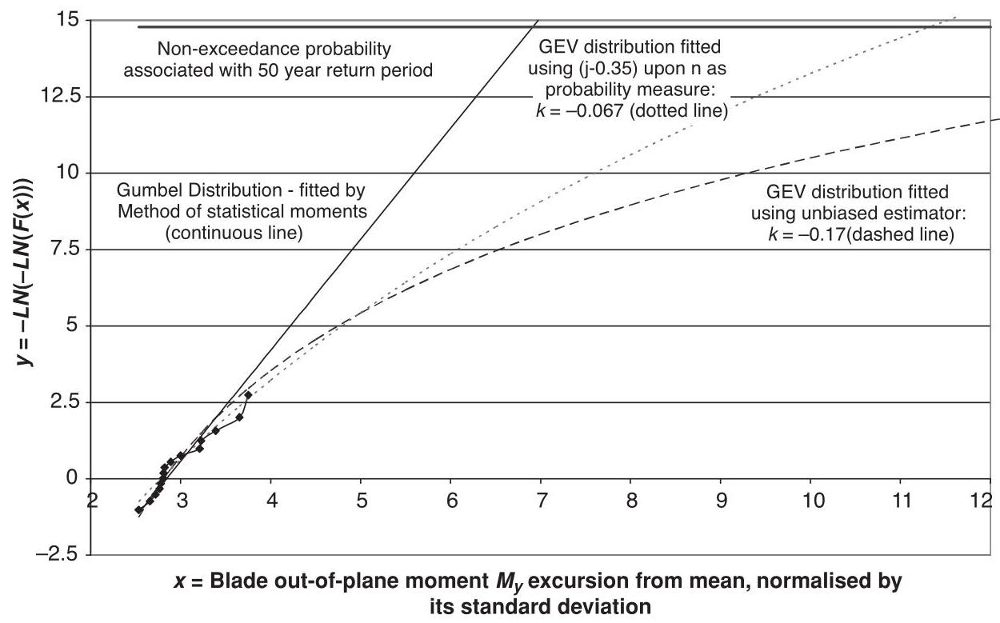

Figure 5.47 Comparison of GEV distributions fitted to empirical data on a Gumbel plot

It is seen that there is poor agreement between the two GEV distributions. This is likely to be due - at least in part - to the small size of the dataset, which results in coarse estimates of the PWMs. It should also be noted that the use of different datasets for the same load case results in considerable variation in the shape parameter, suggesting that a dataset of 15 extreme values is not large enough to yield a meaningful result.

#### 5.14.3 Comparison of extreme value distributions

Gumbel, 3 parameter Weibull and log-normal distributions have been fitted to the dataset of 15 global extremes of out-of-plane blade root bending moment introduced above, using the method of statistical moments in each case, and compared on a Gumbel plot of $- \ln \left\lbrack  {-\ln \left( {F\left( x\right) }\right) }\right\rbrack$ against the normalised bending moment excursion, $x$ , in Figure 5.48.

Figure 5.48 shows the three extreme value distribution extrapolated to the 50-year return period exceedance probability of ${3.8} \times  {10}^{-7}$ (for which, $- \ln \left\lbrack  {-\ln \left( {F\left( x\right) }\right) }\right\rbrack$ is 14.78 ) to illustrate their behaviour. It is seen that there is a wide variation in the predicted value of the 50-year return load.

Although the loadings on wind turbine components are generally not narrow-banded, it is instructive to investigate how well the above three extreme value distributions and the GEV distribution can be fitted to the distribution of global extremes arising from a narrow banded process. Consider a blade rotating at ${15}\mathrm{{rpm}}$ , which experiences 150 loading cycles in ten minutes. Assuming that the extreme loads in adjacent three-cycle blocks are independent of one another, there are 50 independent maxima in the ten-minute time interval, and the cumulative probability distribution of the global maximum is

$$
F\left( x\right)  = {\left\{  1 - \exp \left\lbrack  -\frac{{x}^{2}}{2}\right\rbrack  \right\}  }^{50} \tag{5.149}
$$

Figure 5.48 Gumbel plot comparison of three extreme value distributions fitted to empirical data

Figure 5.49 Gumbel plot comparison of four extreme value distributions fitted to the distribution of the largest of 50 Rayleigh distributed extremes

Gumbel, 3 parameter Weibull, log-normal and GEV distributions have been fitted to this distribution using the method of statistical moments, and Gumbel plots of the fitted distributions are presented on Figure 5.49, together with their defining parameters.

It is seen that the log-normal and the 3 parameter Weibull distributions fit the distribution of global maxima of a narrow banded process better than the other two.

Freudenreich and Argyriadis (2008) compared extrapolations made using the above four extreme value distributions by reference to five one-year simulations for a 5 MW pitch-regulated turbine. Using the extreme values from 30 ten-minute time histories per wind speed bin as input, they concluded that the extrapolations of blade flapwise root bending moment made with the 3 parameter Weibull and log-normal distributions were the most accurate, whereas the Gumbel extrapolation was significantly conservative.

#### 5.14.4 Combination of probability distributions

The procedure outlined above yields a family of load non-exceedance probability distributions conditional upon wind speed for the extreme load in the simulation period, $F\left( {x \mid  {U}_{k}}\right)$ - one for each wind speed bin. These are combined to yield a single distribution for all operating wind speeds by weighting each one according to the number of hours of operation applicable to the wind speed bin and summing the results. Mathematically, the summation is expressed as follows:

$$
{F}_{\text{ Long } - \text{ term }}\left( x\right)  \approx  \mathop{\sum }\limits_{{k = 1}}^{M}F\left( {x \mid  {U}_{k}}\right) {p}_{k} \tag{5.150}
$$

where ${p}_{k}$ is the proportion of operating hours in the wind speed bin with mean wind speed ${U}_{k}$ and the operating range of wind speeds is divided into $M$ bins.

#### 5.14.5 Extrapolation

The load with a 50-year return period is found by extrapolating ${F}_{\text{ Long-term }}\left( x\right)$ to the requisite non-exceedance probability - that is, $\left( {1 - {3.8} \times  {10}^{-7}}\right)$ for a ten-minute simulation period. As ${F}_{\text{ Long-term }}\left( x\right)$ is the summation of several mathematically defined distributions, this is straightforward. Figure 5.48 illustrates how the extrapolation might look if a single wind speed bin dominated the extreme loads for the three extreme value distributions considered.

#### 5.14.6 Fitting probability distribution after aggregation

With this sequence, the first step is to aggregate the data points from the simulations from all the wind speed bins. If the number of simulations from each wind speed bin is proportional to the number of hours of operation in that bin and there are $m$ ten-minute simulations in all, then the $m$ global extremes can be ranked $1,2,\ldots i,\ldots m$ from smallest to largest and the long-term empirical load non-exceedance probability distribution for the ten-minute extreme load, $x$ , can be constructed according to the formula

$$
{F}_{\text{ Long-term }}\left( {x}_{i}\right)  = \frac{i}{m + 1},\;i = 1,2,\ldots m
$$

In cases where the number of simulations in each wind speed bin is not proportional to the actual likelihood of that bin, then different weights need to be assigned to the global extremes in different bins, and the probability distribution becomes

$$
{F}_{\text{ Long-term }}\left( x\right)  = \mathop{\sum }\limits_{{k = 1}}^{b}\left( {\mathop{\sum }\limits_{{i = 1}}^{{n}_{k}}\frac{I\left\lbrack  {{x}_{i, k} \leq  x}\right\rbrack  }{m + 1}}\right) {w}_{k} = \mathop{\sum }\limits_{{k = 1}}^{b}\left( {\mathop{\sum }\limits_{{i = 1}}^{{n}_{k}}\frac{I\left\lbrack  {{x}_{i, k} \leq  x}\right\rbrack  }{m + 1}}\right) \frac{m{p}_{k}}{{n}_{k}} \tag{5.151}
$$

where

${x}_{i, k}$ is the $i$ th extreme in the $k$ th wind speed bin

$I\left\lbrack  {{x}_{i.k} \leq  x}\right\rbrack  1$ if ${x}_{i.k} \leq  x$ and 0 otherwise

${n}_{k}$ is the number of simulations in the $k$ th wind speed bin

$b$ is the number of wind speed bins

${w}_{k}$ is the weighting factor for $k$ th wind speed bin

${p}_{k}$ is the proportion of operating hours in the $k$ th wind speed bin

The second step is the fitting of an extreme value distribution to the long-term empirical load distribution to permit extrapolation to the 50-year return load. Clearly, the 'aggregation before fitting' approach is simpler than the 'fitting before aggregation' approach in that only one fitting operation is required, although the inherent complexity of the long-term empirical distribution may make a close fit more difficult to achieve.

#### 5.14.7 Local extremes method

The local extremes method is the same as the global extremes method, except that several independent extreme values in each ten-minute simulation are utilised in constructing the empirical load non-exceedance probability distribution(s) instead of just the single largest value - that is, the 'global extreme' - from each simulation.

If there are $n$ independent extreme values in each ten-minute simulation, then the empirical non-exceedance probability distribution for the ten-minute extreme load, ${x}_{k}$ , at wind speed ${U}_{k}$ can be constructed from the non-exceedance probability distribution of the local extremes using

$$
F\left( {{x}_{k} \mid  {U}_{k}}\right)  = {\left\lbrack  {F}_{\text{ local }}\left( {x}_{k} \mid  {U}_{k}\right) \right\rbrack  }^{n}
$$

To ensure independence of the local extremes, Annex F of IEC 61400-1 Edition 3 suggests that individual extremes should be separated by at least three response cycles. A less rigorous but computationally simpler approach is to divide the ten-minute simulation period into $n$ segments or 'blocks' of equal duration and use the maximum value from each. This method of extracting the local extremes is illustrated in Figure 5.50 for a turbine rotating at ${15}\mathrm{{rpm}}$ with a block size of 12 seconds, corresponding to three cycles of rotation.

Fogle et al. (2008) have applied statistical tests for independence to block maxima obtained from 200 simulated load time histories for a 5 MW turbine model developed by NREL, and concluded that a block duration of 30 seconds is required to ensure independence. However, they also found that the use of block durations as short as five seconds made negligible difference to the tail of the empirical probability distribution.

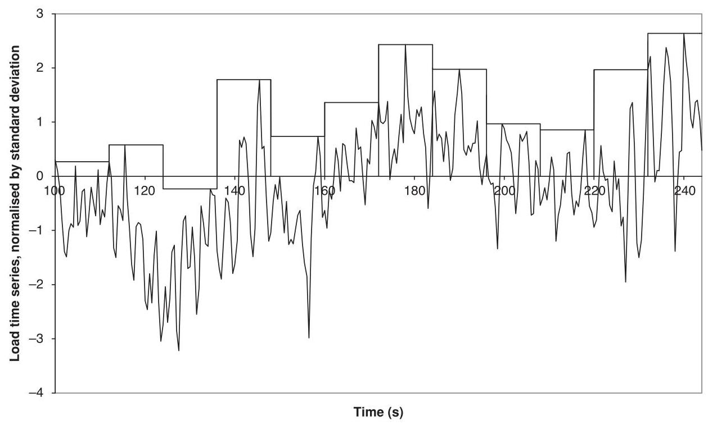

Figure 5.50 Local extremes derived from blocks of 12 seconds duration

#### 5.14.8 Convergence requirements

IEC 61400-1 Edition 3 imposes a limit on the uncertainty of extrapolated loads by requiring that sufficient simulations are carried out so that the ${90}\%$ confidence interval on the ${84}\%$ quantile load (that is, the extreme load in a ten-minute simulation likely to be exceeded 16% of the time) is less than ${15}\%$ of that load. This requirement is expressed as

$$
\frac{{\widehat{S}}_{{0.84},{0.05}} - {\widehat{S}}_{{0.84},{0.95}}}{{\widehat{S}}_{0.84}} < {0.15} \tag{5.152}
$$

where the confidence bounds ${\widehat{S}}_{{0.84},{0.05}}$ and ${\widehat{S}}_{{0.84},{0.95}}$ are the empirical estimates of the 84% quantile load with a 5% and 95% probability of not being exceeded respectively.

One approach to estimating the confidence bounds utilises the binomial expansion to obtain the probability, $C\left( {j;m,{0.84}}\right)$ , of $j$ or fewer occurrences of the non-exceedance of the 84% quantile load in $m$ simulations. This is given by:

$$
C\left( {j;m,{0.84}}\right)  = \mathop{\sum }\limits_{{i = 0}}^{j}\frac{m!}{i!\left( {m - i}\right) !}{0.84}^{i}{0.16}^{m - i} \tag{5.153}
$$

As an example, this probability is plotted against $j$ for the case of $m = {15}$ simulations in Figure 5.51. It is seen that the 5% and 95% confidence bounds on the number of trials in which the 84% quantile load is not exceeded are 9.5 and 14.3 respectively. The confidence bounds on the 84% quantile load, ${\widehat{S}}_{{0.84},{0.05}}$ and ${\widehat{S}}_{{0.84},{0.95}}$ , required for the inequality (Equation 5.152) can then be derived by interpolating between the ninth and tenth and fourteenth and fifteenth ranked extremes respectively. The ranking is from smallest to largest as usual.

Figure 5.51 Probability of $j$ or fewer occurrences of the non-exceedance of the 84% quantile load in a total of 15 simulations

Table 5.11 Table of confidence bounds on the number of simulations in which the 84% load is not exceeded for different numbers of simulations in total

<table><tr><td>Total no. of simulations, $m$</td><td>No. of occurrences of the non-exceedance of the 84% quantile load with 5% probability of not being exceeded</td><td>No. of occurrences of the non-exceedance of the 84% quantile load with 95% probability of not being exceeded</td></tr><tr><td>15</td><td>9.5</td><td>14.32</td></tr><tr><td>20</td><td>13.35</td><td>18.83</td></tr><tr><td>25</td><td>17.23</td><td>23.39</td></tr><tr><td>30</td><td>21.18</td><td>27.83</td></tr><tr><td>35</td><td>25.13</td><td>32.32</td></tr></table>

Annex F of IEC 61400-1 Edition 3 provides a table of 5% and 95% confidence bounds on the number of simulations in which the 84% quantile load is not exceeded for each value of $m$ , the total number of simulations, from 15 to 35 . Selected values are given in Table 5.11 above.

## References

Armstrong, J.R.C. and Hancock, M. (1991) Feasibility study of teetered, stall-regulated rotors. ETSU Report No. WN 6022.

Barltrop, N.D.P. and Adams, A.J. (1991) Dynamics of Fixed Marine Structures, 3rd edition., Butterworth-Heinemann, Oxford.

Batchelor, G.K. (1953) The Theory of Homogeneous Turbulence. Cambridge University Press, Cambridge.

Bierbooms, W.A.A.M. (2006) Constrained stochastic simulation - generation of time series around some specific event in a normal process. Extremes 8, 20-224.

Bishop, N.W.M., Zhihua, H. and Sheratt, F. (1991) The Analysis of Non-Gaussian Loadings from Wind Turbine Blades Using Frequency Domain Techniques. Proceedings of the 1991 BWEA Conference, pp. 317-323.

Bishop, N.W.M., Wang, R. and Lack, L. (1995) A Frequency Domain Fatigue Predictor for Wind Turbine Blades Including Deterministic Components. Proceedings of the 1995 BWEA Conference, pp. 53-58.

British Standard Institution (1980). BS 5400: Part 10: 1980 Steel, concrete and composite bridges - Code of practice for fatigue. British Standard Institution, London.

British Standard Institution (1986). BS 8100: Part 1: 1986 Lattice towers and masts - Code of practice for loading. British Standard Institution, London.

Clough, R.W. and Penzien, J. (1993) Dynamics of Structures. Mc Graw Hill, New York.

Craig, Jr., R.R. and Bampton, M.C.C. (1968) Coupling of substructures for dynamic analysis, AIAA Journal, 6(7), 1313-1319.

Creed, R.F. (1993) High cycle tensile fatigue of unidirectional fiberglass composite tested at high frequency. PhD thesis, Montana State University.

Danish Standards (1992). DS 472: Loads and Safety of Wind Turbine Construction, 1st edition. Danish Standard Foundation, Denmark.

Danish Standards (1983). DS 410: Loads for the design of structures, 3rd edition. Danish Standard Foundation, Denmark.

Davenport, A.G. (1964) Note on the distribution of the largest value of a random function with application to gust loading. Proceedings of the Institute of Civil Engineering Conference, 28, pp. 187-196.

Dirlik, T. (1985) Application of computers in fatigue analysis. PhD thesis, University of Warwick.

Eurocode 1 (2005). Actions on structures - Part 1.4: Actions on structures - Wind actions. (EN 1991-1-4:2005).

Fogle, J. et al. (2008). Towards an improved understanding of statistical extrapolation for wind turbine extreme loads. Wind Energy, 11, 613-635. (Expanded version published by American Institute of Aeronautics and Astromatics).

Freudenreich, K. and Argyriadis, K. (2008). Wind turbine load level based on extrapolation and simplified methods. Wind Energy, 11, 589-600.

Garrad, A.D. and Hassan, U. (1986) The Dynamic Response of Wind Turbines for Fatigue Life and Extreme Load Prediction. Proceedings of the EWEA 1986 Conference, pp. 401-406.

Garrad, A.D. (1987) The Use of Finite Element Methods for Wind Turbine Dynamics. Proceedings of the EWEA 1987 Conference, pp. 79-83.

Garrad Hassan (2010) Bladed Theory Manual, Version 4.0. Garrad Hassan, Bristol.

Germanischer Lloyd (2003) Rules and Guidelines: IV - Industrial Services: Part 1 - Guideline for the Certification of Wind Turbines. Germanischer Lloyd, Hamburg.

Gibson, R.F. et al. (1982) Vibration characteristics of automotive composite materials. In: Short Fiber Reinforced Composite Materials (ed. B.A. Sanders), pp. 133-150, STP 772. ASTM, West Conshohocken, PA.

Hansen, A.C. (1998) User's guide to the Wind Turbine Dynamics Computer Programs YawDyn and AeroDyn for Adams, Version 11.0. University of Utah, Utah.

Harris, R.I. (1996) Gumbel re-visited - a new look at extreme value statistics applied to wind speeds. Journal of Wind Engineering and Industrial Aerodynamics, 59, 1-22.

Hoskin, R.E., Warren, J.G. and Draper, J. (1989) Prediction of fatigue damage in wind turbine rotors. In: Proceedings of the EWEC 1989 Conference, pp. 389-394.

Hosking, J.R.M., Wallis, J.R. and Wood, E.F. (1985) Estimation of the generalized extreme value distribution by the method of probability-weighted moments. Technometrics, 27(3), 251-261.

International Electrotechnical Commission (2005) IEC 61400-1: Wind turbines - Part 1: Design Requirements, 3rd edition. International Electrotechnical Commission, Geneva.

Jamieson, P. and Hunter, C. (1985) Analysis of data from Howden 300 kW wind turbine on Burgar Hill Orkney. In: Proceedings of the BWEA 1985 Conference, pp. 253-258.

Jamieson et al. (2000) Wind turbine design for offshore. In: P. Jamieson, T.R. Camp and D.C. Quar-ton, Proceedings of the Offshore Wind Energy in Mediterranean and European Seas Conference, pp. 405-414. CEC/EWEA/IEA, Sicily.

Jenkinson, A.F. (1955) The frequency distribution of the annual maximum (or minimum) of meteorological elements. Quarterly Journal of the Royal Meteorological Society. 81, 158-171.

Kaimal, J.C. et al. (1972) Spectral characteristics of surface-layer turbulence. Quarterly Journal of The Meteorological Society, 98, 563-598.

Larsen, G.C., Ronold, K., Jorgensen, H.E., Argyriadis, K. and de Boer, J. (1999) Ultimate Loading of Wind Turbines. No R-1111, Riso National Laboratory.

Lobitz, D.W.A. (1984) NASTRAN based computer program for structural dynamic analysis of HAWT's. Proceedings of the EWEA 1984 Conference.

Madsen, P.H., Frandsen, S., Holley, W.E. and Hansen, J.C. (1984) Dynamics and fatigue damage of wind turbine rotors during steady operation. No. R-512, Risø National Laboratory.

Mann, J. (1994): The spatial structure of neutral atmospheric surface-layer turbulence. Journal of Fluid Mechanics, 273, 141-168.

Mann, J. (1998) Wind field simulation. Journal of Probability Engineering Mechanics, 13(4), 269- 282.

Matsuishi, M. and Endo, T. (1968) 'Fatigue of metals subject to varying stress' Japan Society of Mechanical Engineers, Jukvoka.

Molenaar, D.P. and Dijkstra, S. (1999) State-of-the-art of wind turbine design codes: main features overview for cost-effective generation. Wind Engineering, 23(5), 295-311.

Morgan, C.A. and Tindal, A.J. (1990) Further analysis of the Orkney MS-1 data. In: Proceedings of the BWEA 1990 Conference, pp. 325-330.

Moriaty, P.J., Holley, W.E. and Butterfield, S.P. (2004) Extrapolation of extreme and fatigue loads using probabilistic methods. NREL Report TP-500-34421.

Petersen, J.T., Madsen, H.A., Björck, A., Enevoldsen, P., Øye, S., Ganander, H. and Winkelaar, D. (1998) Prediction of dynamic loads and induced vibrations in stall. No. R-1045, Risø National Laboratory.

Putter, S. and Manor, H. (1978) Natural frequencies of radial rotating beams. Journal of Sound and Vibration 56(2), 175-185.

Ragan, P. and Manuel, L. (2007) Comparing estimates of wind turbine fatigue loads using time-domain and spectral methods. Wind Engineering 31(2), 83-99.

Shabana, A.A. (1998) Dynamics of Multibody Systems, 2nd edition. Cambridge University Press, Cambridge.

Thomsen, K. and Madsen, P.H. (1997) Application of statistical methods to extreme loads for wind turbines. In: Proceedings of the 1997 EWEC Conference, pp. 595-598.

Thomsen, K. (1998) The statistical variation of wind turbine fatigue loads, No. R-1063. Risø National Laboratory.

Veers, P.S. (1988) Three-dimensional wind simulation, SAND88-0152. Sandia National Laboratory.

Von Karman, T. (1948) Progress in the statistical theory of turbulence. In: Proceddings of The National Academy of Sciences. Vol. 34, pp. 530-539.

Warren, J.G., Quarton, D.C., Lack, L. and Draper, J. (1988) Prediction of Fatigue Damage in Wind Turbine Rotors. Proceedings of the 1988 BWEA Conference.

## Appendix 5: Dynamic response of stationary blade in turbulent wind

### A5.1 Introduction

As described in Chapter 2, the turbulent wind contains wind speed fluctuations over a wide range of frequencies, as described by the power spectrum. Although the bulk of the turbulent energy is normally at frequencies much lower than the blade first mode out-of-plane frequency, which is typically over $1\mathrm{\;{Hz}}$ , the fraction close to the first mode frequency will excite resonant blade oscillations. This appendix describes the method by which the resonant response may be determined. Working in the frequency domain, expressions for the standard deviations of both the tip displacement and root bending moment responses are derived, and then the method of deriving the peak value in a given period is described. Initially the wind is assumed to be perfectly correlated along the blade, but subsequently the treatment is extended to include the effect of spatial variation.

### A5.2 Frequency response function

#### A5.2.1 Equation of motion

The dynamic response of a cantilever blade to the fluctuating aerodynamic loads upon it is most conveniently investigated by means of modal analysis, in which the excitations of the various different natural modes of vibration are computed separately and the results superposed. Thus, the deflection $x\left( {r, t}\right)$ at radius $r$ is given by:

$$
x\left( {r, t}\right)  = \mathop{\sum }\limits_{{i = 1}}^{\infty }{f}_{i}\left( t\right) {\mu }_{i}\left( t\right)
$$

Normally, in the case of a stationary blade, the first mode dominates and higher modes do not need to be considered. The equation of motion for the $i$ th mode, which is derived in Section 5.8.1, is as follows:

$$
{m}_{i}{\ddot{f}}_{i}\left( t\right)  + {c}_{i}{\dot{f}}_{i}\left( t\right)  + {m}_{i}{\omega }_{i}^{2}{f}_{i}\left( t\right)  = {\int }_{0}^{R}{\mu }_{i}\left( r\right) q\left( {r, t}\right) {dr} \tag{A5.1}
$$

where

$q\left( {r, t}\right)$ is the applied loading

${f}_{i}\left( t\right)$ is the tip displacement

${\mu }_{i}\left( r\right)$ is the non-dimensional mode shape of the $i$ th mode, normalised to give a tip displacement of unity

${\omega }_{i}$ is the natural frequency in radians per second

${m}_{i}$ is the generalised mass, ${\int }_{0}^{R}m\left( r\right) {\mu }_{i}^{2}\left( r\right) {dr}$

and ${c}_{i}$ is the generalised damping, ${\int }_{0}^{R}\widehat{c}\left( r\right) {\mu }_{i}^{2}\left( r\right) {dr}$ .

#### A5.2.2 Frequency response function

If $q\left( {r, t}\right)$ varies harmonically, with frequency $\omega$ and amplitude ${q}_{0}\left( r\right)$ , then it can be shown that:

(A5.2)

$$
{f}_{i}\left( t\right)  = \frac{1}{{m}_{i}}\frac{{\int }_{0}^{R}{\mu }_{i}\left( r\right) {q}_{0}\left( r\right) {dr}}{\sqrt{{\left( {\omega }_{i}^{2} - {\omega }^{2}\right) }^{2} + {\left( {c}_{i}/{m}_{i}\right) }^{2}{\omega }^{2}}}\cos \left( {{\omega t} + {\phi }_{i}}\right)
$$

$$
= \frac{1}{{m}_{i}{\omega }_{i}^{2}}\frac{{\int }_{0}^{R}{\mu }_{i}\left( r\right) {q}_{0}\left( r\right) {dr}}{\sqrt{{\left( 1 - {\omega }^{2}/{\omega }_{i}^{2}\right) }^{2} + {\left( {c}_{i}/{m}_{i}{\omega }_{i}^{2}\right) }^{2}{\omega }^{2}}}\cos \left( {{\omega t} + {\phi }_{i}}\right)
$$

Defining ${k}_{i} = {m}_{i}{\omega }_{i}^{2}$ , and noting that the damping ratio ${\xi }_{i} = {c}_{i}/2{m}_{i}{\omega }_{i}$ , this becomes:

$$
{f}_{i}\left( t\right)  = \frac{1}{{k}_{i}}\frac{{\int }_{0}^{R}{\mu }_{i}\left( r\right) {q}_{0}\left( r\right) {dr}}{\sqrt{{\left( 1 - {\omega }^{2}/{\omega }_{i}^{2}\right) }^{2} + 4{\xi }_{i}^{2}{\omega }^{2}/{\omega }_{i}^{2}}}\cos \left( {{\omega t} + {\phi }_{i}}\right)  = {A}_{i}\cos \left( {{\omega t} + {\phi }_{i}}\right) \tag{A5.3}
$$

The numerator ${\int }_{0}^{R}{\mu }_{i}\left( r\right) {q}_{0}\left( r\right) {dr}$ is the amplitude of the equivalent harmonic loading at the tip of the cantilever that would result in the same tip displacement as the loading $q\left( {r, t}\right)$ , and is known as the generalised load with respect to the $i$ th mode, ${Q}_{i}\left( t\right)$ . Thus, the ratio between the tip displacement amplitude and the amplitude of the generalised load is

$$
\frac{{A}_{i}}{{\int }_{0}^{R}{\mu }_{i}\left( r\right) {q}_{0}\left( r\right) {dr}} = \frac{1}{{k}_{i}\sqrt{{\left( 1 - {\omega }^{2}/{\omega }_{i}^{2}\right) }^{2} + 4{\xi }_{i}^{2}{\omega }^{2}/{\omega }_{i}^{2}}} \tag{A5.4}
$$

$$
= \frac{1}{{k}_{i}\sqrt{{\left( 1 - {n}^{2}/{n}_{i}^{2}\right) }^{2} + 4{\xi }_{i}^{2}{n}^{2}/{n}_{i}^{2}}} = \left| {{H}_{i}\left( n\right) }\right|
$$

The ratio $\left| {{H}_{i}\left( n\right) }\right|$ is the modulus of the complex frequency response function, ${H}_{i}\left( n\right)$ , and its square can be used to transform the power spectrum of the wind incident on the blade into the power spectrum of the $i$ th mode tip displacement. Thus, in the case of the dominant first mode, the tip displacement in response to a harmonic generalised loading, ${Q}_{1}\left( t\right)$ , of frequency $n$ is given by

$$
{x}_{1}\left( {R, t}\right)  = {f}_{1}\left( t\right)  = {Q}_{1}\left( t\right) \left| {{H}_{1}\left( n\right) }\right|
$$

and the power spectrum of the first mode tip deflection is ${S}_{1x}\left( n\right)  = {S}_{Q1}\left( n\right) {\left| {H}_{1}\left( n\right) \right| }^{2}$ .

In what follows, the simplifying assumption is made initially that the wind is perfectly correlated along the blade.

### A5.3 Resonant displacement response ignoring wind variations along the blade

#### A5.3.1 Linearisation of wind loading

For a fluctuating wind speed $U\left( t\right)  = \bar{U} + u\left( t\right)$ , the wind load per unit length on the blade is $\frac{1}{2}{C}_{f}\rho {U}^{2}\left( t\right) c\left( r\right)  = \frac{1}{2}{C}_{f}\rho \left\lbrack  {{\bar{U}}^{2} + 2\bar{U}u\left( t\right)  + {u}^{2}\left( t\right) }\right\rbrack  c\left( r\right)$ , where ${C}_{f}$ is the lift or drag coefficient, as appropriate, and $c\left( r\right)$ is the local blade chord dimension. In order to permit a linear treatment, the third term in the square brackets, which will normally be small compared to the first two, is ignored, so that the fluctuating load $q\left( {r, t}\right)$ becomes ${C}_{f}\rho \bar{U}u\left( t\right) c\left( r\right)$ .

#### A5.3.2 First mode displacement response

Setting $q\left( {r, t}\right)  = {C}_{f}\rho \bar{U}u\left( t\right) c\left( r\right)$ , the first mode tip displacement response to a sinusoidal wind fluctuation of frequency $n\left( { = \omega /{2\pi }}\right)$ and amplitude ${u}_{\mathrm{o}}\left( n\right)$ given by Equation A5.3 becomes

(A5.5)

$$
{f}_{1}\left( t\right)  = {\int }_{0}^{R}{\mu }_{1}\left( r\right) {C}_{f}\rho \bar{U}c\left( r\right) {dr}{u}_{o}\left( n\right) \left| {{H}_{1}\left( n\right) }\right| \cos \left( {{2\pi nt} + {\phi }_{1}}\right)  = {C}_{f}\rho \bar{U}
$$

$$
{\int }_{0}^{R}{\mu }_{1}\left( r\right) c\left( r\right) {dr}{u}_{\mathrm{o}}\left( n\right) \left| {{H}_{1}\left( n\right) }\right| \left( {\cos {2\pi nt} + {\phi }_{1}}\right)
$$

Hence, the power spectrum of first mode tip displacement is

$$
{S}_{1x}\left( n\right)  = {\left\lbrack  {C}_{f}\rho \bar{U}{\int }_{0}^{R}{\mu }_{1}\left( r\right) c\left( r\right) dr\right\rbrack  }^{2}{S}_{u}\left( n\right) {\left| {H}_{1}\left( n\right) \right| }^{2} \tag{A5.6}
$$

where ${S}_{u}\left( n\right)$ is the power spectrum for the along wind turbulence. Thus, the standard deviation of the first mode tip displacement is given by

$$
{\sigma }_{1x}^{2} = {\left\lbrack  {C}_{f}\rho \bar{U}{\int }_{0}^{R}{\mu }_{1}\left( r\right) c\left( r\right) dr\right\rbrack  }^{2}{\int }_{0}^{\infty }{S}_{u}\left( n\right) {\left| {H}_{1}\left( n\right) \right| }^{2}{dn} \tag{A5.7}
$$

#### A5.3.3 Background and resonant response

Normally the bulk of the turbulent energy in the wind is at frequencies well below the frequency of the first out-of-plane blade mode. This is illustrated in Figure A5.1, where a typical power spectrum for wind turbulence is compared with the square, ${\left| {H}_{1}\left( n\right) \right| }^{2}$ , of an example frequency response function for a $1\mathrm{\;{Hz}}$ resonant frequency.

The power spectrum is that due to Kaimal (and adopted in Eurocode 1, 2005):

$$
n{S}_{u}\left( n\right)  = {\sigma }_{u}^{2}\frac{{6.8n}{L}_{u}^{x}/\bar{U}}{{\left( 1 + {10} \cdot  2n{L}_{u}^{x}/\bar{U}\right) }^{\frac{5}{3}}} \tag{A5.8}
$$

and is plotted as the non dimensional power-spectral density function, ${R}_{u}\left( n\right)  = n\underline{c}{S}_{u}\left( n\right) /{\sigma }_{u}^{2}$ , against a logarithmic frequency scale. The time scale, ${L}_{u}^{x}/\bar{U}$ , chosen is four seconds, based on a mean wind speed, $\bar{U}$ , of ${50}\mathrm{\;m}/\mathrm{s}$ and an integral length scale, ${L}_{u}^{x}$ , of ${200}\mathrm{\;m}$ .

In view of the fact that the resonant response usually occurs over a narrow band of frequencies on the tail of the power spectrum, it is normal to treat it separately from the quasistatic response at lower frequencies, and to ignore the variation in $n \cdot  {S}_{u}\left( n\right)$ on either side of the resonant frequency, ${n}_{1}$ . (See for example Wyatt,1980). The variance of total tip displacement then becomes:

$$
{\sigma }_{x}^{2} = {\sigma }_{B}^{2} + {\sigma }_{x1}^{2}
$$

in which the variance of the first mode resonant response, ${\sigma }_{x1}$ , is given by

$$
{\sigma }_{x1}^{2} = {\left\lbrack  {C}_{f}\rho \bar{U}{\int }_{0}^{R}{\mu }_{1}\left( r\right) c\left( r\right) dr\right\rbrack  }^{2}{S}_{u}\left( {n}_{1}\right) {\int }_{0}^{\infty }{\left| {H}_{1}\left( n\right) \right| }^{2}{dn} \tag{A5.9}
$$

Figure A5.1 Power spectrum of wind turbulence and frequency response function

and the resonant response of higher modes, ${\sigma }_{x2}^{2},{\sigma }_{x3}^{2}$ etc. are ignored. The non-resonant response, ${\sigma }_{B}$ , is termed the background response, and can be derived from simple static beam theory.

It has been shown by Newland (1984) that ${\int }_{0}^{\infty }{\left| {H}_{1}\left( n\right) \right| }^{2}{dn}$ reduces to $\left( {{\pi }^{2}/{2\delta }}\right) \left( {{n}_{1}/{k}_{1}^{2}}\right)$ , where $\delta$ is the logarithmic decrement of damping. The logarithmic decrement, $\delta$ is ${2\pi }$ times the damping ratio, ${\xi }_{1}$ , defined as ${\xi }_{1} = {c}_{1}/2{m}_{1}{\omega }_{1}$ . Hence Equation A5.9 becomes

$$
{\sigma }_{x1}^{2} = {\left\lbrack  {C}_{f}\rho \bar{U}{\int }_{0}^{R}{\mu }_{1}\left( r\right) c\left( r\right) dr\right\rbrack  }^{2}{S}_{u}\left( {n}_{1}\right) \frac{{\pi }^{2}}{2\delta }\frac{{n}_{1}}{{k}_{1}^{2}} \tag{A5.10}
$$

For comparison, the first mode component, ${\bar{x}}_{1}$ , of the steady response is obtained by setting $\omega  = 0$ and ${q}_{0}\left( r\right)  = \frac{1}{2}\rho {\bar{U}}^{2}{C}_{f}c\left( r\right)$ in Equation A5.3, yielding

$$
{\bar{x}}_{1} = \frac{1}{2}\rho {\bar{U}}^{2}{C}_{f}\frac{1}{{k}_{1}}{\int }_{0}^{R}{\mu }_{1}\left( r\right) c\left( r\right) {dr} \tag{A5.11}
$$

Hence, the ratio of the standard deviation of the first mode resonant response to the first mode component of the steady response is

$$
\frac{{\sigma }_{x1}}{{\bar{x}}_{1}} = 2\frac{{\sigma }_{u}}{\bar{U}}\frac{\pi }{\sqrt{2\delta }}\sqrt{\frac{{n}_{1}{S}_{u}\left( {n}_{1}\right) }{{\sigma }_{u}^{2}}} = 2\frac{{\sigma }_{u}}{\bar{U}}\frac{\pi }{\sqrt{2\delta }}\sqrt{{R}_{u}\left( {n}_{1}\right) } \tag{A5.12}
$$

Note that towards the upper tail of the upper tail of the power spectrum of along wind turbulence, where ${n}_{1}$ is likely to be located, $\sqrt{{R}_{u}\left( {n}_{1}\right) }$ tends to $\sqrt{{0.1417}/{\left( n{L}_{u}^{x}/\bar{U}\right) }^{\frac{2}{3}}}$ .

### A5.4 Effect of across-wind turbulence distribution on resonant displacement response

In the foregoing treatment, the wind was assumed to be perfectly correlated along the blade. The implications of removing this simplifying assumption will now be examined.

The fluctuating load on the blade, $q\left( {r, t}\right)$ , becomes ${C}_{f}\rho \bar{U}u\left( {r, t}\right) c\left( r\right)$ per unit length, and the generalised fluctuating load with respect to the first mode becomes

$$
{Q}_{1}\left( t\right)  = {\int }_{0}^{R}{\mu }_{1}\left( r\right) q\left( {r, t}\right) {dr} = {C}_{f}\rho \bar{U}{\int }_{0}^{R}u\left( {r, t}\right) c\left( r\right) {\mu }_{1}\left( r\right) {dr} \tag{A5.13}
$$

The standard deviation, ${\sigma }_{\mathrm{Q}}$ , of ${Q}_{1}\left( t\right)$ is given by

$$
{\sigma }_{Q1}^{2} = \frac{1}{T}{\int }_{0}^{T}{Q}_{1}^{2}\left( t\right) {dt} = {\left( \rho \bar{U}{C}_{f}\right) }^{2}\frac{1}{T}{\int }_{0}^{T}\left\lbrack  {{\int }_{0}^{R}u\left( {r, t}\right) c\left( r\right) {\mu }_{1}\left( r\right) {dr}}\right\rbrack
$$

$$
\times  \left\lbrack  {{\int }_{0}^{R}u\left( {{r}^{\prime }, t}\right) c\left( {r}^{\prime }\right) {\mu }_{1}\left( {r}^{\prime }\right) d{r}^{\prime }}\right\rbrack  {dt} \tag{A5.14}
$$

$$
= {\left( \rho \bar{U}{C}_{f}\right) }^{2}{\int }_{0}^{R}{\int }_{0}^{R}\left\lbrack  {\frac{1}{T}{\int }_{0}^{T}u\left( {r, t}\right) u\left( {{r}^{\prime }, t}\right) {dt}}\right\rbrack  c\left( r\right) c\left( {r}^{\prime }\right) {\mu }_{1}\left( r\right) {\mu }_{1}\left( {r}^{\prime }\right) {drd}{r}^{\prime }
$$

Now the expression within the square brackets is the cross correlation function, ${\kappa }_{u}\left( {r,{r}^{\prime },\tau }\right)  = E\{ u\left( {r, t}\right) u\left( {{r}^{\prime }, t + \tau }\right) \}$ with $\tau$ set equal to zero. The cross correlation function is related to the cross spectrum, ${S}_{uu}\left( {r,{r}^{\prime }, n}\right)$ , as follows:

(A5.15)

$$
{\kappa }_{u}\left( {r,{r}^{\prime },\tau }\right)  = \frac{1}{2}{\int }_{-\infty }^{\infty }{S}_{uu}\left( {r,{r}^{\prime }, n}\right) \exp \left( {i2\pi n\tau }\right) {dn}\text{ , giving }
$$

$$
{\kappa }_{u}\left( {r,{r}^{\prime },0}\right)  = \left\lbrack  {\frac{1}{T}{\int }_{0}^{T}u\left( {r, t}\right) u\left( {{r}^{\prime }, t}\right) {dt}}\right\rbrack   = {\int }_{0}^{\infty }{S}_{uu}\left( {r,{r}^{\prime }, n}\right) {dn}\;\text{ for }\tau  = 0
$$

Hence,

$$
{\sigma }_{Q1}^{2} = {\left( \rho \bar{U}{C}_{f}\right) }^{2}{\int }_{0}^{R}{\int }_{0}^{R}\left\lbrack  {{\int }_{0}^{\infty }{S}_{uu}\left( {r,{r}^{\prime }, n}\right) {dn}}\right\rbrack  c\left( r\right) c\left( {r}^{\prime }\right) {\mu }_{1}\left( r\right) {\mu }_{1}\left( {r}^{\prime }\right) {drd}{r}^{\prime } \tag{A5.16}
$$

The normalised cross spectrum is defined as ${S}_{uu}^{N}\left( {r,{r}^{\prime }, n}\right)  = {S}_{uu}\left( {r,{r}^{\prime }, n}\right) /{S}_{u}\left( n\right)$ , and like ${S}_{uu}\left( {r,{r}^{\prime }, n}\right)$ , is in general a complex quantity, because of phase differences between the wind speed fluctuations at different heights. As only in-phase wind speed fluctuations will affect the response, we consider only the real part of the normalised cross spectrum, known as the normalised co-spectrum, and denoted by ${\psi }_{uu}^{N}\left( {r,{r}^{\prime }, n}\right)$ . Substituting in Equation A5.16, we obtain:

$$
{\sigma }_{Q1}^{2} = {\left( \rho \bar{U}{C}_{f}\right) }^{2}{\int }_{0}^{R}{\int }_{0}^{R}\left\lbrack  {{\int }_{0}^{\infty }{S}_{u}\left( n\right) {\psi }_{uu}^{N}\left( {r,{r}^{\prime }, n}\right) {dn}}\right\rbrack  c\left( r\right) c\left( {r}^{\prime }\right) {\mu }_{1}\left( r\right) {\mu }_{1}\left( {r}^{\prime }\right) {drd}{r}^{\prime } \tag{A5.17}
$$

From this, it can be deduced that the power spectrum of the generalised load with respect to the first mode is

$$
{S}_{Q1}\left( n\right)  = {\left( \rho \bar{U}{C}_{f}\right) }^{2}{\int }_{0}^{R}{\int }_{0}^{R}{S}_{u}\left( n\right) {\psi }_{uu}^{N}\left( {r,{r}^{\prime }, n}\right) c\left( r\right) c\left( {r}^{\prime }\right) {\mu }_{1}\left( r\right) {\mu }_{1}\left( {r}^{\prime }\right) {drd}{r}^{\prime } \tag{A5.18}
$$

Note that the power spectrum for the along wind turbulence shows some variation with height, and so should strictly be written ${S}_{u}\left( {n, z}\right)$ instead of ${S}_{u}\left( n\right)$ . However, the variation along the length of a vertical blade is small, and is ignored here.

As for the initial case when wind loadings along the blade were assumed to be perfectly correlated, the power spectrum for first mode tip displacement is equal to the product of the power spectrum of the generalised load (with respect to the first mode) and the square of the frequency response function, that is,

$$
{S}_{1x}\left( n\right)  = {S}_{Q1}\left( n\right) {\left| {H}_{1}\left( n\right) \right| }^{2} \tag{A5.19}
$$

As before, ${S}_{Q1}\left( n\right)$ is assumed constant over the narrow band of frequencies straddling the resonant frequency, and the standard deviation of resonant tip response becomes

$$
{\sigma }_{x1}^{2} = {S}_{Q1}\left( {n}_{1}\right) {\int }_{0}^{\infty }{\left| {H}_{1}\left( n\right) \right| }^{2}{dn} = {S}_{Q1}\left( {n}_{1}\right) \frac{{\pi }^{2}}{2\delta }\frac{{n}_{1}}{{k}_{1}^{2}} \tag{A5.20}
$$

#### A5.4.1 Formula for normalised co-spectrum

It remains to evaluate ${S}_{Q1}\left( {n}_{1}\right)  = {\left( \rho \bar{U}{C}_{f}\right) }^{2}{S}_{u}\left( {n}_{1}\right) {\int }_{0}^{R}{\int }_{0}^{R}{\psi }_{uu}^{N}\left( {r,{r}^{\prime }, n}\right) c\left( r\right) c\left( {r}^{\prime }\right) {\mu }_{1}\left( r\right) {\mu }_{1}\left( {r}^{\prime }\right) {drd}{r}^{\prime }$ . The normalised co-spectrum, ${\psi }_{uu}^{N}\left( {r,{r}^{\prime }, n}\right)$ must decrease as the spacing $\left| {r - {r}^{\prime }}\right|$ between the two points considered increases, and intuitively it is to be expected that the decrease would be more rapid for the higher frequency components of wind fluctuation. On an empirical basis, Davenport (1962) has proposed an exponential expression for the normalised co-spectrum as follows:

$$
{\psi }_{uu}^{N}\left( {r,{r}^{\prime }, n}\right)  = \exp \left\lbrack  {-C\left| {r - {r}^{\prime }}\right| n/\bar{U}}\right\rbrack \tag{A5.21}
$$

where $C$ is a non-dimensional decay constant. Davenport noted that measurements by Cramer (1958) indicated values of $C$ ranging from 7 in unstable conditions to 50 in stable conditions, but recommended the use of the lower figure as being the more conservative despite the likelihood of stable conditions in high winds. Dyrbye and Hansen (1997) quote Risø measurements reported by Mann (1994) which indicate a value of $C$ of 9.4, and they recommend a value of 10 for use in design. A value of 11.5 is implicitly assumed in Eurocode 1.

There is an obvious inconsistency in the exponential expression for the normalised co-spectrum - when it is integrated up over the plane perpendicular to the wind direction, the result is positive instead of zero as it should be. This has led to the development of more complex expressions by Harris (1971) and Krenk (1995). However, the Davenport formulation will be used here, giving

(A5.22)

$$
{\sigma }_{x1}^{2} = {\mathrm{\;S}}_{Q1}\left( {n}_{1}\right) \frac{{\pi }^{2}}{2\delta }\frac{{n}_{1}}{{k}_{1}^{2}} = {\left( \rho \bar{U}{C}_{f}\right) }^{2}{S}_{u}\left( {n}_{1}\right)
$$

$$
\times  {\int }_{0}^{R}{\int }_{0}^{R}\exp \left\lbrack  {-C\left| {r - {r}^{\prime }}\right| {n}_{1}/\bar{U}}\right\rbrack  c\left( r\right) \left( {c{r}^{\prime }}\right) {\mu }_{1}\left( r\right) {\mu }_{1}\left( {r}^{\prime }\right) {drd}{r}^{\prime }\left\lbrack  {\frac{\pi }{2\delta }\frac{{n}_{1}}{{k}_{1}^{2}}}\right\rbrack
$$

The resonant response can be expressed in terms of the first mode component, ${\bar{x}}_{1}$ , of the steady response, $\frac{1}{2}\rho {\bar{U}}^{2}{C}_{f}\left( {1/{k}_{1}}\right) {\int }_{0}^{R}{\mu }_{1}\left( r\right) c\left( r\right) {dr}$ , from Equation A5.11, giving

$$
\frac{{\sigma }_{x1}^{2}}{{\bar{x}}_{1}^{2}} = 4\frac{{\sigma }_{u}^{2}}{{\bar{U}}^{2}}\frac{{\pi }^{2}}{2\delta }{R}_{u}\left( {n}_{1}\right)
$$

$$
\times  \frac{{\int }_{0}^{R}{\int }_{0}^{R}\exp \left\lbrack  {-C\left| {r - {r}^{\prime }}\right| {n}_{1}/\bar{U}}\right\rbrack  c\left( r\right) c\left( {r}^{\prime }\right) {\mu }_{1}\left( r\right) {\mu }_{1}\left( {r}^{\prime }\right) {drd}{r}^{\prime }}{{\left( {\int }_{0}^{R}c\left( r\right) {\mu }_{1}\left( r\right) dr\right) }^{2}} \tag{A5.23}
$$

Hence

$$
\frac{{\sigma }_{x1}}{{\bar{x}}_{1}} = 2\frac{{\sigma }_{u}}{\bar{U}}\frac{\pi }{\sqrt{2\delta }}\sqrt{{R}_{u}\left( {n}_{1}\right) }\sqrt{{K}_{Sx}\left( {n}_{1}\right) } \tag{A5.24}
$$

where

$$
{K}_{Sx}\left( {n}_{1}\right)  = \frac{{\int }_{0}^{R}{\int }_{0}^{R}\exp \left\lbrack  {-C\left| {r - {r}^{\prime }}\right| {n}_{1}/\bar{U}}\right\rbrack  c\left( r\right) c\left( {r}^{\prime }\right) {\mu }_{1}\left( r\right) {\mu }_{1}\left( {r}^{\prime }\right) {drd}{r}^{\prime }}{{\left( {\int }_{0}^{R}c\left( r\right) {\mu }_{1}\left( r\right) dr\right) }^{2}} \tag{A5.25}
$$

is denoted the size reduction factor, which results from the lack of correlation of the wind along the blade. As an example, the size reduction factor, ${K}_{Sx}\left( {n}_{1}\right)$ , is plotted out against frequency in Figure A5.2 for the case of a ${40}\mathrm{\;m}$ blade with chord $c\left( r\right)  = {0.0961}\mathrm{R} - {0.06467r}$ (Blade TR), assuming a decay constant $\mathrm{C}$ of 10, and a mean wind speed $\bar{U}$ of ${50}\mathrm{\;m}/\mathrm{s}$ . The mode shape taken is the same as for the example in Section 5.6.3 (see Figure 5.4). Also shown for comparison is the corresponding parameter for a uniform cantilever.

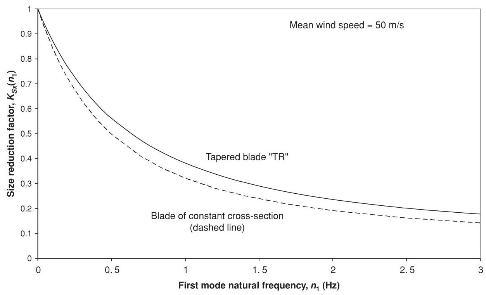

Figure A5.2 Size reduction factors for the first mode resonant response due to lack of correlation of wind loading along the blade: variation with frequency for ${40}\mathrm{\;m}$ blade

### A5.5 Resonant root bending moment

For design purposes it is the augmentation of blade bending moments due to dynamic effects that is of principal significance. The ratio of the standard deviation of the first mode resonant root bending moment to the steady root bending moment (allowing for the lack of correlation of wind fluctuations along the blade) is derived below.

Defining ${M}_{1}\left( t\right)$ as the fluctuating root bending moment due to wind excitation of the first mode, we have

$$
{M}_{1}\left( t\right)  = {\int }_{0}^{R}m\left( r\right) {\ddot{x}}_{1}\left( {t, r}\right) {rdr} = {\int }_{0}^{R}m\left( r\right) {\omega }_{1}^{2}{x}_{1}\left( {t, r}\right) {rdr} = {\omega }_{1}^{2}{f}_{1}\left( t\right) {\int }_{0}^{R}m\left( r\right) {\mu }_{1}\left( r\right) {rdr}
$$

(A5.26)

Hence the standard deviation of ${M}_{1}\left( t\right)$ ,

$$
{\sigma }_{M1} = {\omega }_{1}^{2}{\sigma }_{x1}{\int }_{0}^{R}m\left( r\right) {\mu }_{1}\left( r\right) {rdr} \tag{A5.27}
$$

The steady root bending moment,

$$
\bar{M} = {\int }_{0}^{R}\frac{1}{2}\rho {\bar{U}}^{2}{C}_{f}c\left( r\right) {rdr} = \frac{1}{2}\rho {\bar{U}}^{2}{C}_{f}{\int }_{0}^{R}c\left( r\right) {rdr} \tag{A5.28}
$$

Hence the ratio

$$
\frac{{\sigma }_{M1}}{\bar{M}} = \frac{{\omega }_{1}^{2}{\sigma }_{x1}{\int }_{0}^{R}m\left( r\right) {\mu }_{1}\left( r\right) {rdr}}{\frac{1}{2}\rho {\bar{U}}^{2}{C}_{f}{\int }_{0}^{R}c\left( r\right) {rdr}} \tag{A5.29}
$$

Substituting the expression for ${\sigma }_{x1}$ from Equation A5.22, we obtain

$$
\frac{{\sigma }_{M1}}{\bar{M}}
$$

$$
= \frac{{\omega }_{1}^{2}\rho \bar{U}{C}_{f}\frac{\pi }{\sqrt{2\delta }}\frac{\sqrt{{n}_{1}{S}_{u}\left( {n}_{1}\right) }}{{k}_{1}}{\int }_{0}^{R}m\left( r\right) {\mu }_{1}\left( r\right) {rdr}\sqrt{{\int }_{0}^{R}{\int }_{0}^{R}\exp \left\lbrack  {-C\left| {r - {r}^{\prime }}\right| {n}_{1}/\bar{U}}\right\rbrack  c\left( r\right) c\left( {r}^{\prime }\right) {\mu }_{1}\left( r\right) {\mu }_{1}\left( {r}^{\prime }\right) {drd}{r}^{\prime }}}{\frac{1}{2}\rho {\bar{U}}^{2}{C}_{f}{\int }_{0}^{R}c\left( r\right) {rdr}}
$$

(A5.30)

Noting that ${R}_{u}\left( n\right)  = n{S}_{u}\left( n\right) /{\sigma }_{u}^{2}$ , and that ${k}_{1} = {m}_{1}{\omega }_{1}^{2}$ , this simplifies to

$$
\frac{{\sigma }_{M1}}{\bar{M}} = 2\frac{{\sigma }_{u}}{\bar{U}}\frac{\pi }{\sqrt{2\delta }}\sqrt{{R}_{u}\left( n\right) }\frac{{\int }_{0}^{R}m\left( r\right) {\mu }_{1}\left( r\right) {rdr}}{{m}_{1}{\int }_{0}^{R}c\left( r\right) {rdr}}
$$

$$
\times  \sqrt{{\int }_{0}^{R}{\int }_{0}^{R}\exp \left\lbrack  {-C\left| {r - {r}^{\prime }}\right| {n}_{1}/\bar{U}}\right\rbrack  c\left( r\right) c\left( {r}^{\prime }\right) {\mu }_{1}\left( r\right) {\mu }_{1}\left( {r}^{\prime }\right) {drd}{r}^{\prime }} \tag{A5.31}
$$

where ${m}_{1} = {\int }_{0}^{R}m\left( r\right) {\mu }_{1}^{2}\left( r\right) {dr}$ is the generalised mass with respect to the first mode, and the exponential expression within the double integral allows for the lack of correlation of wind fluctuations along the blade. Substituting $\left( {{\int }_{0}^{R}c\left( r\right) {\mu }_{1}\left( r\right) {dr}}\right) \sqrt{{K}_{Sx}\left( {n}_{1}\right) }$ for the square root of the double integral, using Equation A5.25, leads to

$$
\frac{{\sigma }_{M1}}{\bar{M}} = 2\frac{{\sigma }_{u}}{\bar{U}}\frac{\pi }{\sqrt{2\delta }}\sqrt{{R}_{u}\left( n\right) }\frac{{\int }_{0}^{R}m\left( r\right) {\mu }_{1}\left( r\right) {rdr}}{{m}_{1}{\int }_{0}^{R}c\left( r\right) {rdr}}\left( {{\int }_{0}^{R}c\left( r\right) {\mu }_{1}\left( r\right) {dr}}\right) \sqrt{{K}_{Sx}\left( {n}_{1}\right) } \tag{A5.32}
$$

Defining the ratio of the integrals,

$$
\frac{{\int }_{0}^{R}m\left( r\right) {\mu }_{1}\left( r\right) {rdr}}{{m}_{1}{\int }_{0}^{R}c\left( r\right) {rdr}}\left( {{\int }_{0}^{R}c\left( r\right) {\mu }_{1}\left( r\right) {dr}}\right)  = \frac{\frac{{\sigma }_{M1}}{M}}{\frac{{\sigma }_{x1}}{{\bar{x}}_{1}}},\;\text{ as }\;{\lambda }_{M1} \tag{A5.33}
$$

we obtain

$$
\frac{{\sigma }_{M1}}{\bar{M}} = 2\frac{{\sigma }_{u}}{\bar{U}}\frac{\pi }{\sqrt{2\delta }}\sqrt{{R}_{u}\left( {n}_{1}\right) }\sqrt{{K}_{Sx}\left( {n}_{1}\right) }{\lambda }_{M1} \tag{A5.34}
$$

### A5.6 Root bending moment background response

The root bending moment background response can be expressed in terms of the standard deviation of the root bending moment excluding resonant effects. If the wind is perfectly correlated along the blade, this is given by

$$
{\sigma }_{MB} = {C}_{f}\rho \bar{U}{\sigma }_{u}{\int }_{0}^{R}c\left( r\right) {rdr} \tag{A5.35}
$$

However, if the lack of correlation of wind fluctuations along the blade is taken into account,

$$
{\sigma }_{MB} = {C}_{f}\rho \bar{U}{\sigma }_{u}\sqrt{{\int }_{0}^{R}{\int }_{0}^{R}{\rho }_{u}\left( {r - {r}^{\prime }}\right) c\left( r\right) c\left( {r}^{\prime }\right) r{r}^{\prime }{drd}{r}^{\prime }} \tag{A5.36}
$$

where ${\rho }_{\mathrm{u}}\left( {r - {r}^{\prime }}\right)$ is the normalised cross correlation function between simultaneous wind speed fluctuations at two different blade radii, and is defined as

$$
{\rho }_{u}\left( {r - {r}^{\prime }}\right)  = \frac{1}{{\sigma }_{u}^{2}}E\left\{  {u\left( {r, t}\right) u\left( {{r}^{\prime }, t + \tau }\right) }\right\}  \;\text{ with }\tau \text{ set equal to zero. } \tag{A5.37}
$$

Measurements indicate that the normalised cross correlation function decays exponentially, so it can be expressed as

$$
{\rho }_{u}\left( {r - {r}^{\prime }}\right)  = \exp \left\lbrack  {-\left| {r - {r}^{\prime }}\right| /{L}_{u}^{r}}\right\rbrack \tag{A5.38}
$$

where ${L}_{u}^{r}$ is the integral length scale for the longitudinal turbulence component measured in the across wind direction along the blade, and is thus defined as ${\int }_{0}^{\infty }{\rho }_{u}\left( {r - {r}^{\prime }}\right) d\left( {r - {r}^{\prime }}\right)$ . As the integral length scale for longitudinal turbulence measured vertically in the across wind direction $\left( {L}_{u}^{z}\right)$ , is, if anything, less than that measured horizontally $\left( {L}_{u}^{y}\right)$ , it is conservative to treat it as being equal to that measured horizontally, with the result that ${L}_{u}^{r}$ can be taken as equal to ${L}_{u}^{y}$ also. Typically ${L}_{u}^{y}$ is approximately equal to ${30}\%$ of ${L}_{u}^{x}$ , the integral length scale for longitudinal turbulence measured in the along wind direction. Observing that

$$
\bar{M} = \frac{1}{2}\rho {\bar{U}}^{2}{C}_{f}{\int }_{0}^{R}c\left( r\right) {rdr}
$$

we can therefore write

$$
\frac{{\sigma }_{MB}}{\bar{M}} = 2\frac{{\sigma }_{u}}{\bar{U}}\sqrt{{K}_{SMB}} \tag{A5.39}
$$

where ${K}_{SMB}$ , the size reduction factor for the root bending moment background response, is defined as

$$
{K}_{SMB} = \frac{{\int }_{0}^{R}{\int }_{0}^{R}\exp \left\lbrack  {-\left| {r - {r}^{\prime }}\right| /{0.3}{L}_{u}^{x}}\right\rbrack  c\left( r\right) c\left( {r}^{\prime }\right) r{r}^{\prime }{drd}{r}^{\prime }}{{\left( {\int }_{0}^{R}c\left( r\right) rdr\right) }^{2}} \tag{A5.40}
$$

For a blade with a uniform chord, the integral is straightforward, giving

$$
{K}_{SMB} = 4\left\lbrack  {\frac{2}{3\phi } - \frac{1}{{\phi }^{2}} + \frac{2}{{\phi }^{4}} - \exp \left( {-\phi }\right) \left\{  {\frac{2}{{\phi }^{3}} + \frac{2}{{\phi }^{4}}}\right\}  }\right\rbrack  \;\text{ where }\phi  = \frac{R}{{0.3}{L}_{u}^{x}} \tag{A5.41}
$$

As an example, ${K}_{SMB}$ comes to 0.837 for the case of $R = {40}\mathrm{\;m}$ and ${L}_{u}^{x} = {189}\mathrm{\;m}$ indicating that the lack of correlation of the wind fluctuations reduces the root bending moment appreciably.

For blades with a normal tapering chord, ${K}_{SMB}$ can be evaluated numerically. In the case of a blade with a tip chord equal to ${33}\%$ of the maximum chord, ${K}_{SMB}$ is 0.829 for the same value of $\phi$ as before. It is seen that the taper has an almost negligible effect on the end result.

### A5.7 Peak response

One of the key parameters required in blade design is the extreme value of the out-of-plane bending moment. The 50-year return moment is defined as the expected maximum moment occurring during the mean wind averaging period when the mean takes the 50-year return value. Treating the moment as a Gaussian process, Davenport (1964) has shown that the expected value of the maximum departure from the mean is the standard deviation multiplied by the peak factor, $g$ , where

$$
g = \sqrt{2\ln \left( {vT}\right) } + \frac{0.5772}{\sqrt{2\ln \left( {vT}\right) }} \tag{A5.42}
$$

In this formula, $v$ is the mean zero-upcrossing frequency of the root moment fluctuations, and $T$ is the mean wind speed averaging period. The variance of the root bending moment is, in the same way as for the tip displacement, equal to the sum of the variances of the background and resonant root bending moment responses, that is,

$$
{\sigma }_{M}^{2} = {\sigma }_{MB}^{2} + {\sigma }_{M1}^{2} \tag{A5.43}
$$

Hence, from Equations A5.39 and A5.34, we obtain

$$
{\sigma }_{M}^{2} = {\sigma }_{MB}^{2} + {\sigma }_{M1}^{2} = 4{\bar{M}}^{2}\frac{{\sigma }_{u}^{2}}{{\bar{U}}^{2}}\left\lbrack  {{K}_{SMB} + \frac{{\pi }^{2}}{2\delta }{R}_{u}\left( {n}_{1}\right) {K}_{Sx}\left( {n}_{1}\right) {\lambda }_{M1}^{2}}\right\rbrack \tag{A5.44}
$$

Thus,

$$
{M}_{\max } = \bar{M} + g{\sigma }_{M} = \bar{M}\left( {1 + {2g}\frac{{\sigma }_{u}}{\bar{U}}\sqrt{{K}_{SMB} + \frac{{\pi }^{2}}{2\delta }{R}_{u}\left( {n}_{1}\right) {K}_{Sx}\left( {n}_{1}\right) {\lambda }_{M1}^{2}}}\right) \tag{A5.45}
$$

The mean zero up-crossing frequency of the root moment fluctuations, $v$ , is defined as

$$
v = \sqrt{\frac{{\int }_{0}^{\infty }{n}^{2}{S}_{M}\left( n\right) {dn}}{{\int }_{0}^{\infty }{S}_{M}\left( n\right) {dn}}} \tag{A5.46}
$$

where ${S}_{M}\left( n\right)$ is the power spectrum of the root moment fluctuations. If we separate the power spectrum of the background response from the first mode resonant response at frequency ${n}_{1}$ , then the above expression can be written

$$
v = \sqrt{\frac{\left( {{\int }_{0}^{\infty }{n}^{2}{S}_{MB}\left( n\right) {dn}}\right)  + {n}_{1}^{2}{\sigma }_{M1}^{2}}{{\sigma }_{MB}^{2} + {\sigma }_{M1}^{2}}} \tag{A5.47}
$$

Now

$$
{S}_{MB}\left( n\right)  = {\left( {C}_{f}\rho \bar{U}\right) }^{2}{S}_{u}\left( n\right) {\int }_{0}^{R}{\int }_{0}^{R}{\psi }_{uu}^{N}\left( {r,{r}^{\prime }, n}\right) c\left( r\right) c\left( {r}^{\prime }\right) r{r}^{\prime }{drd}{r}^{\prime } \tag{A5.48}
$$

and

$$
\bar{M} = {C}_{f}\frac{1}{2}\rho {\bar{U}}^{2}{\int }_{0}^{R}c\left( r\right) {rdr} \tag{A5.49}
$$

so

$$
{S}_{MB}\left( n\right)  = 4\frac{{\bar{M}}^{2}}{{\bar{U}}^{2}}\frac{{S}_{u}\left( n\right) {\int }_{0}^{R}{\int }_{0}^{R}{\psi }_{uu}^{N}\left( {r,{r}^{\prime }, n}\right) c\left( r\right) c\left( {r}^{\prime }\right) r{r}^{\prime }{drd}{r}^{\prime }}{{\left( {\int }_{0}^{R}c\left( r\right) rdr\right) }^{2}} \tag{A5.50}
$$

Defining

$$
{K}_{SMB}\left( n\right)  = \frac{{\int }_{0}^{R}{\int }_{0}^{R}{\psi }_{uu}^{N}\left( {r,{r}^{\prime }, n}\right) c\left( r\right) c\left( {r}^{\prime }\right) r{r}^{\prime }{drd}{r}^{\prime }}{{\left( {\int }_{0}^{R}c\left( r\right) rdr\right) }^{2}} \tag{A5.51}
$$

we obtain

$$
{S}_{MB}\left( n\right)  = 4\frac{{\bar{M}}^{2}}{{\bar{U}}^{2}}{S}_{u}\left( n\right) {K}_{SMB}\left( n\right) \tag{A5.52}
$$

Substituting into Equation A5.47 gives

$$
v = \sqrt{\frac{4\frac{{\bar{M}}^{2}}{{\bar{U}}^{2}}\left( {{\int }_{0}^{\infty }{n}^{2}{S}_{u}\left( n\right) {K}_{SMB}\left( n\right) {dn}}\right)  + {n}_{1}^{2}{\sigma }_{M1}^{2}}{{\sigma }_{MB}^{2} + {\sigma }_{M1}^{2}}} \tag{A5.53}
$$

Noting from Equation A5.52 that ${\sigma }_{MB}^{2} = 4\left( {{\bar{M}}^{2}/{\bar{U}}^{2}}\right) {\int }_{0}^{\infty }{S}_{u}\left( n\right) {K}_{SMB}\left( n\right) {dn}$ , the expression for $v$ becomes

$$
v = \sqrt{\frac{{n}_{0}^{2}{\sigma }_{MB}^{2} + {n}_{1}^{2}{\sigma }_{M1}^{2}}{{\sigma }_{MB}^{2} + {\sigma }_{M1}^{2}}} \tag{A5.54}
$$

where

$$
{n}_{0} = \frac{{\int }_{0}^{\infty }{n}^{2}{S}_{u}\left( n\right) {K}_{SMB}\left( n\right) {dn}}{{\int }_{0}^{\infty }{S}_{u}\left( n\right) {K}_{SMB}\left( n\right) {dn}} \tag{A5.55}
$$

Substituting ${\psi }_{uu}^{N}\left( {r,{r}^{\prime }, n}\right)  = \exp \left\lbrack  {-C\left( {r - {r}^{\prime }}\right) n/\bar{U}}\right\rbrack$ into the expression for ${K}_{SMB}\left( n\right)$ in the numerator of Equation A5.55 gives

$$
{\int }_{0}^{\infty }{n}^{2}{S}_{u}\left( n\right) {K}_{SMB}\left( n\right) {dn} = {\int }_{0}^{\infty }{n}^{2}{S}_{u}\left( n\right) \frac{{\int }_{0}^{R}{\int }_{0}^{R}\exp \left\lbrack  {-C\left( {r - {r}^{\prime }}\right) n/\bar{U}}\right\rbrack  c\left( r\right) c\left( {r}^{\prime }\right) r{r}^{\prime }{drdr}{d}^{\prime }}{{\left( {\int }_{0}^{R}c\left( r\right) rdr\right) }^{2}}{dn} \tag{A5.56}
$$

For high frequencies, the double integral is, in the limit, inversely proportional to frequency, so the integrand ${n}^{2}{S}_{u}\left( n\right) {K}_{SMB}\left( n\right)$ is proportional to ${n}^{2}{n}^{-\frac{5}{3}}{n}^{-1} = {n}^{-\frac{2}{3}}$ and the integral does not converge. Consequently it is necessary to take account of the chordwise lack of correlation of wind fluctuation at high frequencies, and if this is done, it is found that, in the limit, the integrand is proportional to ${n}^{-\frac{5}{3}}$ for which the integral is finite. The evaluation of the integral ${\int }_{0}^{\infty }{n}^{2}{S}_{u}\left( n\right) {K}_{SMB}\left( n\right) {dn}$ taking chordwise lack of correlation into account is a formidable task, so the use of an approximate formula for the frequency, ${n}_{0}$ , is preferable, especially as the influence of ${n}_{0}$ on the peak factor, $g$ , is slight. Dyrbye and Hansen (1997) give an approximate formula for a uniform cantilever is as follows:

$$
{n}_{0} = {0.3}\frac{\bar{U}}{\sqrt{{L}_{u}^{x}\sqrt{Rc}}} \tag{A5.57}
$$

Here $R$ is the blade tip radius and $c$ is the blade chord, assumed constant. For a tapering chord, the mean chord, $\bar{c}$ , can be substituted.

### A5.8 Bending moments at intermediate blade positions

#### A5.8.1 Background response

Denoting the standard deviation of the quasistatic or background bending moment fluctuations at radius ${r}^{ * }$ as ${\sigma }_{MB}\left( {r}^{ * }\right)$ , it is apparent that

$$
\frac{{\sigma }_{MB}\left( {r}^{ * }\right) }{{\sigma }_{MB}\left( 0\right) } = \sqrt{\frac{{K}_{SMB}\left( {r}^{ * }\right) }{{K}_{SMB}\left( 0\right) }}\frac{{\int }_{{r}^{ * }}^{R}c\left( r\right) \left\lbrack  {r - {r}^{ * }}\right\rbrack  {dr}}{{\int }_{0}^{R}c\left( r\right) {rdr}} \tag{A5.58}
$$

The ratio of the steady moment at radius ${r}^{ * }$ to that at the root is $\left( {{\int }_{{r}^{ * }}^{R}c\left( r\right) \left\lbrack  {r - {r}^{ * }}\right\rbrack  {dr}}\right) /\left( {{\int }_{0}^{R}c\left( r\right) {rdr}}\right)$ , so the ratio of the standard deviation of the quasistatic fluctuations at radius ${\mathrm{r}}^{ * }$ to the steady value there is

$$
\frac{{\sigma }_{MB}\left( {r}^{ * }\right) }{\bar{M}\left( {r}^{ * }\right) } = \frac{{\sigma }_{MB}\left( {r}^{ * }\right) }{{\sigma }_{MB}\left( 0\right) }\frac{{\sigma }_{MB}\left( 0\right) }{\bar{M}\left( 0\right) }\frac{\bar{M}\left( 0\right) }{\bar{M}\left( {r}^{ * }\right) } = \frac{{\sigma }_{MB}\left( 0\right) }{\bar{M}\left( 0\right) }\sqrt{\frac{{K}_{SMB}\left( {r}^{ * }\right) }{{K}_{SMB}\left( 0\right) }} \tag{A5.59}
$$

Generally, the square root will be close to unity, so ${\sigma }_{MB}\left( {r}^{ * }\right) /\bar{M}\left( {r}^{ * }\right)$ will be nearly constant.

#### A5.8.2 Resonant response

In section A5.5 it was shown that the standard deviation of the first mode resonant root bending moment is equal to ${\omega }_{1}^{2}{\sigma }_{x1}{\int }_{0}^{R}m\left( r\right) {\mu }_{1}\left( r\right) {rdr}$ (Equation A5.27). The corresponding quantity at other radii can be derived similarly, giving

$$
{\sigma }_{M1}\left( {r}^{ * }\right)  = {\omega }_{1}^{2}{\sigma }_{x1}{\int }_{{r}^{ * }}^{R}m\left( r\right) {\mu }_{1}\left( r\right) \left\lbrack  {r - {r}^{ * }}\right\rbrack  {dr} \tag{A5.60}
$$

Hence, the ratio of the standard deviation of the first mode resonant root bending moment at radius ${r}^{ * }$ to the steady value there is

$$
\frac{{\sigma }_{M1}\left( {r}^{ * }\right) }{\bar{M}\left( {r}^{ * }\right) } = \frac{{\sigma }_{M1}\left( {r}^{ * }\right) }{{\sigma }_{M1}\left( 0\right) }\frac{{\sigma }_{M1}\left( 0\right) }{\bar{M}\left( 0\right) }\frac{\bar{M}\left( 0\right) }{\bar{M}\left( {r}^{ * }\right) } = \frac{{\int }_{{r}^{ * }}^{R}m\left( r\right) {\mu }_{1}\left( r\right) \left\lbrack  {r - {r}^{ * }}\right\rbrack  {dr}}{{\int }_{0}^{R}m\left( r\right) {\mu }_{1}\left( r\right) {rdr}}\frac{{\int }_{0}^{R}c\left( r\right) {rdr}}{{\int }_{{r}^{ * }}^{R}c\left( r\right) \left\lbrack  {r - {r}^{ * }}\right\rbrack  {dr}}\frac{{\sigma }_{M1}\left( 0\right) }{\bar{M}\left( 0\right) }
$$

(A5.61)

## References

Cramer, H.E. (1958) Use of power spectra and scales of turbulence in estimating wind loads, Second National Conference on Applied Meteororlogy, Ann Arbor, Michigan, USA.

Davenport, A.G. (1962) The response of slender, line-like structures to a gusty wind. Proc. Inst. Civ. Eng., 23, 389-408.

Davenport, A.G. (1964) Note on the distribution of the largest value of a random function with application to gust loading. Proc. Inst. Civ. Eng., 28, 187-196.

Dyrbye, C., and Hansen, S.O (1997) Wind loads on structures. John Wiley and Sons.

Eurocode 1 (2005) Actions on structures - Part 1-4: General actions - Wind actions (EN 1991-1-4: 2005)

Harris, R.I. (1971) The nature of the wind. Proceedings of the CIRIA Conference, pp 29-55.

Krenk, S. (1995) Wind field coherence and dynamic wind forces. Symposium on the advances in Non-linear Stochastic Mechanics. Kluwer, Dordrecht, Germany.

Mann, J. (1994) The spatial structure of neutral atmospheric surface-layer turbulence. J. Ind. Aerodyn., 1, 167-175.

Newland, D.E. (1984) Random vibrations and spectral analysis. Longman, UK.

Wyatt, T.A. (1980). The dynamic behaviour of structures subject to gust loading. Proceedings of the CIRIA Conference, "Wind engineering in the eighties" pp. 6-1-6-22.

## 6 Conceptual design of horizontal axis wind turbines

### 6.1 Introduction

Within the general category of horizontal axis wind turbines for grid applications there exists a great variety of possible machine configurations, power control strategies and braking systems. This chapter looks at the different areas where design choices have to be made, and considers the advantages and disadvantages of the more conventional options in each case. Inevitably there are situations in which decisions in one area can impact those in another, and some of these are noted.

Alongside these discrete design choices there are several fundamental design parameters, such as rotor diameter, machine rating and rotational speed, which also have to be established at the start of the design process. Continuous variables such as these lend themselves to mathematical optimisation, as described in the opening sections of the chapter.

An illuminating overview of the evolution of turbine design, including the power control strategies and drive train configurations adopted by particular manufacturers, is provided in Wind Energy - The Facts (2009) published by the European Wind Energy Association.

### 6.2 Rotor diameter

The issue of what size of turbine produces energy at minimum cost has been fiercely debated for a long time. Protagonists of large machines cite economies of scale and the increase in wind speed with height in their favour. From the other camp, the 'square-cube law', whereby energy capture increases as the square of the diameter, whereas rotor mass (and therefore cost) increases as the cube, is advanced as an argument against.

In reality, both arguments are correct, and there is a trade-off between economies of scale and a variant of the 'square-cube law' which takes into account the wind shear effect. This trade-off can be examined with the help of simple cost modelling, which is considered next.

---

Wind Energy Handbook, Second Edition. Tony Burton, Nick Jenkins, David Sharpe and Ervin Bossanyi.

© 2011 John Wiley & Sons, Ltd. Published 2011 by John Wiley & Sons, Ltd. ISBN: 978-0-470-69975-1

---

#### 6.2.1 Cost modelling

The sensitivity of the cost of energy to changes in the values of parameters governing turbine design can be examined with the aid of a model of the way component costs vary in response. The normal procedure is to start with a baseline design, for which the costs of the various components are known. In a rigorous analysis, the chosen parameter is then assigned a different value and a fresh design developed, leading to revised component weights, based on which new component costs can be assigned.

In general, the cost of a component will not simply increase pro rata with its mass, but will contain elements that increase more slowly. Examples are the tower surface protective coating and tower longitudinal welds (assuming the number required is constant), the costs of which increase approximately as the square of the tower height, if all dimensions are proportional to this height. If the design parameter variation considered is only about $\pm  {50}\%$ , it is usually sufficiently accurate to represent the relationship between component cost and mass as a linear one with a fixed component, as follows:

$$
C\left( x\right)  = {C}_{B}\left( {\mu \frac{m\left( x\right) }{{m}_{B}} + \left( {1 - \mu }\right) }\right) \tag{6.1}
$$

where $C\left( x\right)$ and $m\left( x\right)$ are the cost and mass of the component respectively when the design parameter takes the value $x$ , and ${C}_{B}$ and ${m}_{B}$ are the baseline values. $\mu$ is the proportion of the cost that varies with mass, which will obviously differ for different baseline machine sizes and for different components.

The choice of the value of $\mu$ inevitably requires considerable expertise as regards the way manufacturing costs vary with scale, which may be limited in the case of products at the early stage of development. In view of this, the effort of developing fresh designs for different design parameter values may well not be justified, so resort is often made to scaling ratios based on similarity relationships. This approach is adopted in the investigation of optimum machine size which follows.

#### 6.2.2 Simplified cost model for machine size optimisation: an illustration

The baseline machine design is taken as a ${60}\mathrm{\;m}$ diameter, ${1.5}\mathrm{{MW}}$ turbine, with the costs of the various components taken from the Risø publication 'Cost optimisation of wind turbines for large-scale offshore windfarms' (Risø-R-1000) by Fuglsang and Thomsen (1998). These are given in Table 6.1 as a percentage of the total.

Machine designs for other diameters are obtained by scaling all dimensions of all components in the same proportion, except in the case of the gearbox, generator, grid connection and controller. Rotational speed is kept inversely proportional to rotor diameter to maintain constant tip speed, and hence constant tip speed ratio at a given wind speed. As a result, the maximum rotor aerodynamic thrust increases with the square of rotor diameter and the peak aerodynamic bending moment in each structural element, which is assumed to govern its design, increases with rotor diameter cubed. Given the assumption that all cross-sectional dimensions increase in proportion to rotor diameter, the bending section moduli increase as diameter cubed, so each critical stress remains invariant with diameter.

Table 6.1 Component costs expressed as a percentage of total machine cost for a 1.5 MW, ${60}\mathrm{\;m}$ diameter, fixed speed, stall-regulated wind turbine on land (from Risø-R-1000, Fuglsang and Thomsen, 1998)

<table><tr><td>Component</td><td>Cost as a percentage of total</td><td>Component</td><td>Cost as a percentage of total</td></tr><tr><td>Blades</td><td>18.3%</td><td>Controller</td><td>4.2%</td></tr><tr><td>Hub</td><td>2.5%</td><td>Tower</td><td>17.5%</td></tr><tr><td>Main shaft</td><td>4.2%</td><td>Brake system</td><td>1.7%</td></tr><tr><td>Gearbox</td><td>12.5%</td><td>Foundation</td><td>4.2%</td></tr><tr><td>Generator</td><td>7.5%</td><td>Assembly</td><td>2.1%</td></tr><tr><td>Nacelle</td><td>10.8%</td><td>Transport</td><td>2.0%</td></tr><tr><td>Yaw system</td><td>4.2%</td><td>Grid connection</td><td>8.3%</td></tr><tr><td></td><td></td><td>TOTAL</td><td>100%</td></tr></table>

Maintenance of constant tip speed also means that all machine designs reach rated power at the same wind speed, so that rated power is proportional to diameter squared. However, the low speed shaft torque increases as diameter cubed, which is the basis for assuming the gearbox mass increases as the cube of rotor diameter, even though the gearbox ratio changes. In the following illustration a blanket value of $\mu$ of 0.9 for all components is adopted for simplicity. Accordingly, the cost of all components apart from generator, controller and the grid connection, for a machine of diameter $D$ , is given by:

$$
{C}_{1}\left( D\right)  = {0.8}{C}_{T}\left( {60}\right) \left( {{0.9}{\left( \frac{D}{60}\right) }^{3} + {0.1}}\right) \tag{6.2}
$$

where ${C}_{T}\left( {60}\right)$ is the total cost of the ${60}\mathrm{\;m}$ diameter baseline machine.

The rating of the generator and the grid connection is proportional only to the diameter squared. It is assumed that Equation 6.1 applies to the cost of these components, but with mass replaced by rating. Thus, the cost of the generator and grid connection are given by:

$$
{C}_{2}\left( D\right)  = {0.158}{C}_{T}\left( {60}\right) \left( {{0.9}{\left( \frac{D}{60}\right) }^{2} + {0.1}}\right) \tag{6.3}
$$

The controller cost is assumed to be fixed, regardless of turbine size. Hence, the resulting turbine cost as a function of diameter is:

$$
{C}_{T}\left( D\right)  = {C}_{T}\left( {60}\right) \left( {{0.8}\left\{  {{0.9}{\left( \frac{D}{60}\right) }^{3} + {0.1}}\right\}   + {0.158}\left\{  {{0.9}{\left( \frac{D}{60}\right) }^{2} + {0.1}}\right\}   + {0.042}}\right)
$$

$$
= {C}_{T}\left( {60}\right) \left( {{0.72}{\left( \frac{D}{60}\right) }^{3} + {0.1422}{\left( \frac{D}{60}\right) }^{2} + {0.1378}}\right) \tag{6.4}
$$

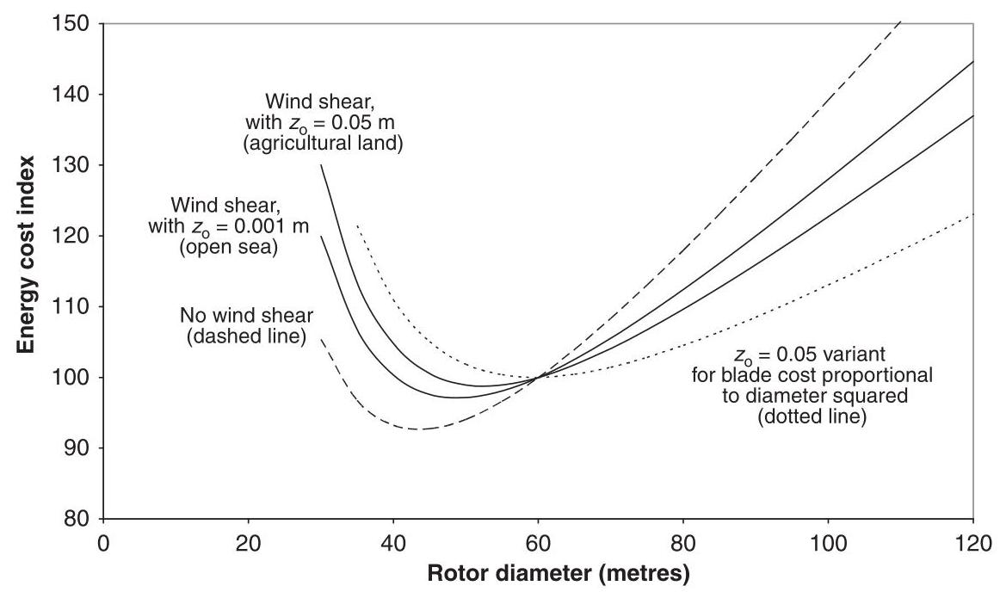

Figure 6.1 Variation of optimum turbine size with wind shear based on simplified cost model (assuming hub height equal to diameter)

As the tower height, along with all other dimensions, is assumed to increase in proportion to rotor diameter, the annual mean wind speed (amws) at hub height will increase with rotor diameter because of wind shear. This has a significant effect on energy yield, as the energy yield per unit of swept area is found to vary as the amws raised to the power of 1.9 for perturbations about the amws central value of $8\mathrm{\;m}/\mathrm{s}$ taken in this example. The cost of energy (excluding operation and maintenance costs) can then be calculated in $\text{ € }/\mathrm{{kWh}}/$ annum by dividing the turbine cost by the annual energy yield. The variation of energy cost with diameter, calculated according to the assumptions described above, is plotted in Figure 6.1 for two levels of wind shear corresponding to roughness lengths, ${z}_{0}$ , of ${0.001}\mathrm{\;m}$ and ${0.05}\mathrm{\;m}$ , the hub height wind speed being scaled according to the relation $\bar{U}\left( z\right)  \propto  \ln \left( {z/{z}_{0}}\right)$ (see Section 2.6.2). Also included is a plot for the case of zero wind shear.

It is apparent that the level of wind shear has a noticeable effect on the optimum machine diameter, which varies from ${44}\mathrm{\;m}$ for zero wind shear to ${52}\mathrm{\;m}$ for the wind shear corresponding to a surface roughness length of ${0.05}\mathrm{\;m}$ , which is applicable to farmland with boundary hedges and occasional buildings. Strictly, the impact of the increased annual mean wind speed with hub height on the fatigue design of the rotor and other components should also be taken into account, which would reduce the optimum machine size slightly.

It should be emphasised that the optimum sizes derived above depend critically on the value of $\mu$ adopted. For example, if $\mu$ were taken as 0.8 instead of 0.9, the optimum diameter would increase to ${64}\mathrm{\;m}$ for the wind shear corresponding to a surface roughness length of ${0.05}\mathrm{\;m}$ , although the minimum cost of energy would alter by only ${0.9}\%$ . The correct approach would be to allocate different values of $\mu$ to different components, as is done in Fuglsang and Thomsen (1998). Ideally these would be based on cost data on components of the same design but different sizes.

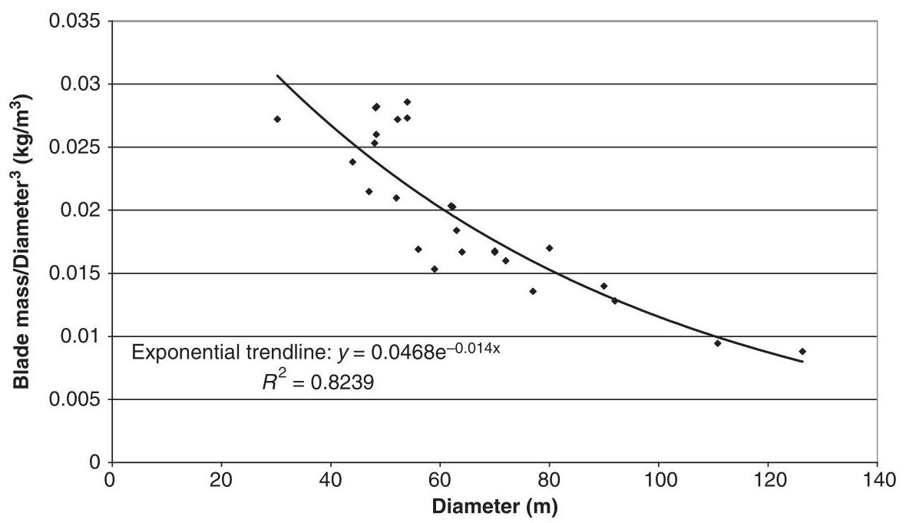

Figure 6.2 Variation of specific blade mass with diameter for LM blades available in 2004

The cost model outlined and illustrated above provides a straightforward means of investigating scale effects on machine economics for a chosen machine design. In practice, the use of different materials or different machine configurations may prove more economic at different machine sizes, and will yield a series of alternative cost versus diameter curves.

An example of the impact technological developments can have on simple scaling rules is provided by the trajectory of specific blade mass - defined as blade mass divided by turbine diameter cubed - as longer blade designs have evolved over time. Figure 6.2 shows a plot of specific blade mass against diameter for blades manufactured by LM Glasfiber that were available in 2004.

It is seen that the specific blade mass is approximately inversely proportional to diameter - that is, the blade mass has increased with diameter squared rather than with diameter cubed. The decline in specific blade mass is partly due to a lower practical limit on skin thicknesses, which made the smaller blades heavier than they would otherwise need to be.

The blade cost scaling rule adopted in the cost model obviously has a decisive effect on the optimum rotor diameter, which (for the case of wind shear corresponding to a surface roughness of ${0.05}\mathrm{\;m}$ ) increases from ${52}\mathrm{\;m}$ to ${59}\mathrm{\;m}$ when the blade cost is scaled as the square of diameter, as indicated by the dotted line in Figure 6.1.

#### 6.2.3 The NREL cost model

Research at NREL, reported in 'Wind Turbine Design Cost and Scaling Model' NREL (2006), has resulted in a useful set of mass and cost scaling rules for several wind turbine configurations, which serve as benchmarks against which innovations in the design of individual components can be judged. It is intended that the scaling rules are updated over time as additional data becomes available.

The baseline turbine design is a ${70}\mathrm{\;m}$ diameter, ${1.5}\mathrm{{MW}}$ variable speed pitch regulated machine, fitted with a three stage planetary gearbox. Many of the scaling rules are similar to those set out in the preceding section, with the main differences being as follows:

- Blade cost split into material and labour costs of similar magnitudes, with the former scaling as diameter cubed $\left( {\mathrm{D}}^{3}\right)$ and the latter scaling as ${\mathrm{D}}^{2.5}$ .

- Gearbox cost scaled as ${\mathrm{D}}^{2.5}$ rather than ${\mathrm{D}}^{3}$ .

- Nacelle cost scaled as ${\mathrm{D}}^{1.95}$ rather than ${\mathrm{D}}^{3}$ .

- Foundation cost scaled as ${\mathrm{D}}^{1.2}$ rather than ${\mathrm{D}}^{3}$ .

- An element of transport cost increasing as the sixth power of diameter.

Table 6.2 presents the component costs of the baseline turbine in 2005 dollars and the respective percentages of the total. Also shown are the corresponding percentages for the ${60}\mathrm{\;m}$ diameter ${1.5}\mathrm{{MW}}$ machine of the preceding section, where applicable. Caution should be exercised in making comparisons, however, as component definitions may vary.

Table 6.2 Component costs and percentages for NREL 1.5 MW 70 m diameter baseline machine

<table><tr><td>Component</td><td>Component costs for 1.5 MW, 70 m dia NREL baseline turbine (with 70 m hub height) \$1000 (2005)</td><td>Percentage component costs for NREL baseline turbine</td><td>Percentage component costs for Risø-R-1000 1.5 MW, 60 m dia turbine</td></tr><tr><td>Blades</td><td>151</td><td>11.4%</td><td>18.3%</td></tr><tr><td>Hub</td><td>47</td><td>3.6%</td><td>2.9%</td></tr><tr><td>Pitch bearings and mechanism</td><td>56</td><td>4.3%</td><td>N/A</td></tr><tr><td>Low speed shaft and main bearings</td><td>33</td><td>2.5%</td><td>4.2%</td></tr><tr><td>Gearbox</td><td>152</td><td>11.6%</td><td>12.9%</td></tr><tr><td>Generator</td><td>98</td><td>7.4%</td><td>7.5%</td></tr><tr><td>Variable speed electronics</td><td>119</td><td>9.0%</td><td>N/A</td></tr><tr><td>Nacelle</td><td>119</td><td>8.9%</td><td>10.8%</td></tr><tr><td>Yaw drive & bearing</td><td>20</td><td>1.5%</td><td>4.2%</td></tr><tr><td>Control system</td><td>35</td><td>2.7%</td><td>4.2%</td></tr><tr><td>Tower</td><td>158</td><td>12.0%</td><td>17.5%</td></tr><tr><td>Brake & HS coupling</td><td>3</td><td>0.2%</td><td>1.7%</td></tr><tr><td>Foundation</td><td>47</td><td>3.6%</td><td>4.2%</td></tr><tr><td>Assembly & installation</td><td>42</td><td>3.2%</td><td>2.1%</td></tr><tr><td>Transportation</td><td>51</td><td>3.9%</td><td>2.0%</td></tr><tr><td>Electrical connections</td><td>187</td><td>14.2%</td><td>8.3%</td></tr><tr><td>inc grid connection</td><td>1317</td><td>100%</td><td>100%</td></tr></table>

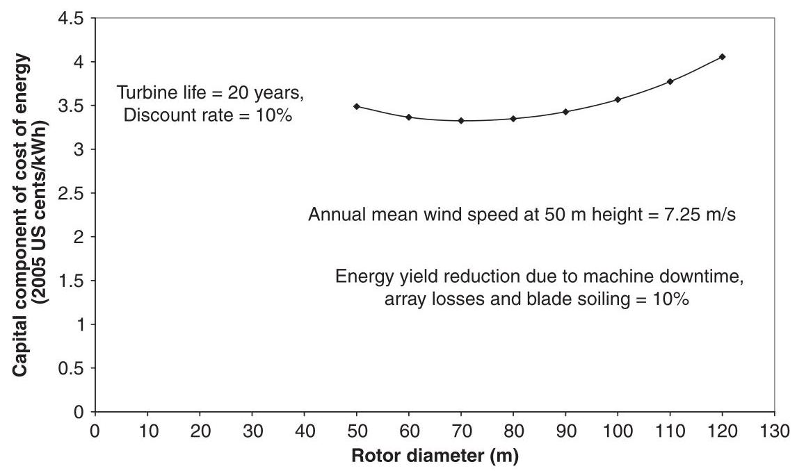

Figure 6.3 Variation of cost of energy with turbine diameter for NREL baseline machine-capital cost component only

Figure 6.3 presents the variation of the cost of energy capital component with turbine diameter, based on the NREL cost model for the machine described above. The annual mean wind speed at ${50}\mathrm{\;m}$ height is taken as ${7.25}\mathrm{\;m}/\mathrm{s}$ and wind speed is assumed to vary with hub height according to the power law $\bar{U}\left( z\right)  = \bar{U}\left( {50}\right)  \cdot  {\left( z/{50}\right) }^{0.14}$ . Hub height is taken as equal to turbine diameter as before and the rated wind speed in all cases is ${11.55}\mathrm{\;m}/\mathrm{s}$ . Turbine life is taken as 20 years and a discount rate of ${10}\%$ is used.

It is seen that the model indicates that the optimum turbine diameter is just over ${70}\mathrm{\;m} -$ rather greater than that given by the cost model in the preceding section. This is to be expected in view of the reduced diameter exponents of the scaling rules for some components.

#### 6.2.4 Machine size growth

During the 1980s and 1990s, the size of the largest turbines in commercial production doubled about every seven years. More recently the driver to increased diameters has undoubtedly been the extension of wind farm development offshore, where substantial fixed elements of support structure and undersea cable installation costs favour the deployment of much larger machines than on land. However, 'Wind Energy - The Facts' (2009) points out that the diameter of the largest commercially available wind turbine did not increase between 2004 and 2008 - a striking pause in the rapid growth in machine size hitherto.

The increasing popularity of ${80}\mathrm{\;m}$ and ${90}\mathrm{\;m}$ turbines for sites on land begs the question of why sizes larger than the apparent optimum are being chosen. Part of the answer may lie in imperfections of the cost models. However, a significant factor encouraging the selection of larger turbines is undoubtedly that their use enables better exploitation of sites of limited area.

For example, the total rated capacity that can be installed on a narrow ridge increases roughly linearly with turbine diameter, assuming (as is normally the case) that the minimum spacing permitted by the manufacturer is specified in terms of a fixed number of turbine diameters. Given that some site development costs, such as permitting and grid connection, do not vary significantly with wind farm rated capacity, there is always an incentive to maximise the installed capacity.

#### 6.2.5 Gravity limitations

The simplified cost model described above was based on the assumption that blade design is governed solely by aerodynamic loads. However, as diameters increase, it is inevitable that edgewise moments due to blade self-weight will become increasingly important. For a family of blade designs derived from a baseline design by simply scaling the diameter and all other dimensions by the same amount, the blade root gravity moment will increase as the fourth power of diameter while the section modulus only increases by the third power. Although there will initially be some scope for catering for the increased gravity moment by redeployment of material closer to the leading and trailing edges, a limit on the practicable diameter for any particular blade material must eventually be reached.

### 6.3 Machine rating

The machine rating determines the wind speed (known as rated wind speed) at which rated power is reached. If the rating is too high for a given rotor diameter, the rated power will only be reached rarely, so the cost of the drive train and generator will not be justified by the energy yield. On the other hand, if the rating is reduced below the optimum then the cost of the rotor and its supporting structure will be excessive in relation to energy yield.

The investigation of the optimum relationship between rotor diameter and rated power can be carried out with the help of the cost modelling technique described in the previous section.

#### 6.3.1 Simplified cost model for optimising machine rating in relation to diameter

The way in which the design of the various wind turbine components is influenced by changes in the rated speed is critically dependent on the nature of any accompanying changes in rotational speed. However, in view of the fact that the maximum rotational speed of land-based machines is generally restricted in order to limit noise emission (see Section 6.4), it is assumed here that the maximum tip speed is limited to ${80}\mathrm{\;m}/\mathrm{s}$ , regardless of the rated wind speed.

The simplified cost model is applied to a pitch regulated, variable speed machine, as these are increasingly the turbine of choice. It is assumed that the machine is designed for optimum performance at a tip speed ratio of 8 and that it operates at this tip speed ratio up to a wind speed of ${10}\mathrm{\;m}/\mathrm{s}$ , with the nominal tip speed remaining at ${80}\mathrm{\;m}/\mathrm{s}$ at higher wind speeds.

Assuming that the blade planform and twist distribution are fixed, the annual energy yield can be calculated for a number of rated wind speeds, for a given annual mean wind speed and Weibull shape factor. The aim of the optimisation is to obtain the minimum cost of energy, which requires knowledge of how the costs of the various turbine components would be affected by the rating change. Although, in theory, this could only be rigorously derived by carrying out a series of detailed turbine designs, in practice it is possible to obtain a useful indication of cost trends by identifying the parameters driving the design of each component category and investigating their dependence on the rated wind speed. If the cost split between various components is known for a baseline machine, these cost trends can then be applied to it in order to determine the optimum rating. In this case the cost shares given in Table 6.2 for the ${70}\mathrm{\;m}$ diameter, ${1.5}\mathrm{{MW}}$ NREL machine are used.

The manner in which the design of each of the major components is influenced by rated wind speed is set out below.

1. Blade weight: the following assumptions are made:

- The blade planform is constant.

- The blade design is governed by out-of-plane bending moments in fatigue.

- The out-of-plane bending moment fluctuations are proportional to the product of the wind speed fluctuation and the rotational speed (see Equation 5.25 in Section 5.7.5).

- The rotational speed is a function of prevailing wind speed, but is independent of rated wind speed as already stated.

- The blade skin thickness is independent of rated wind speed.

Hence the blade skin thickness and, therefore, the blade weight are unaffected by changes in the rated wind speed.

2. Hub and pitch system weights: it is assumed that each is proportional to the blade out-of-plane bending moments in fatigue - that is, independent of rated wind speed.

3. Low speed shaft weight: this is assumed to be governed by the shaft bending moment due to the cantilevered rotor and hub weights, which are unaffected by changes in rated wind speed.

4. Gearbox and brake: gearbox and brake design are governed by the rated torque, $P/\Omega$ . The rated power is proportional to the cube of the rated wind speed, and the maximum rotational speed is fixed, so the rated torque varies as the power rating. The weights of the gearbox and brake are therefore taken to be proportional to the rated power.

5. Generator and variable speed electronics: the design of the generator and the variable speed electronics are governed by rated power and the weight is assumed to be proportional to rated power in each case.

6. Nacelle structure, yaw system, tower and foundation: the design of these is governed principally by either extreme or fluctuating loads on the rotor, both of which are assumed to be independent of rated wind speed. The weights are therefore taken to be unaffected by rated wind speed.

7. Grid connection: the weight of cables, switchgear and transformers are assumed to be proportional to rated power.

8. Controller, assembly and transport: the costs of these items are taken as independent of rated speed.

Table 6.3 Percentage contribution of different components to machine cost for the ${70}\mathrm{\;m}$ dia, 1.5 MW NREL baseline machine, classified according to whether their cost varies with rated power or not

<table><tr><td colspan="2">Components for which the weight/cost is independent of rated wind speed</td><td colspan="2">Components for which the weight varies as rated power</td></tr><tr><td>Component</td><td>Cost</td><td>Component</td><td>Cost</td></tr><tr><td>Blades</td><td>11.4%</td><td>Gearbox</td><td>11.6%</td></tr><tr><td>Hub and Spinner</td><td>3.6%</td><td>Generator</td><td>7.4%</td></tr><tr><td>Pitch bearings and mechanism</td><td>4.3%</td><td>Variable speed electronics</td><td>9%</td></tr><tr><td>Low speed shaft and bearings</td><td>2.5%</td><td>Brake & HS coupling</td><td>0.2%</td></tr><tr><td>Nacelle</td><td>8.9%</td><td>Internal cables and grid connection</td><td>14.2%</td></tr><tr><td>Yaw drive & bearing</td><td>1.5%</td><td></td><td></td></tr><tr><td>Control System</td><td>2.7%</td><td></td><td></td></tr><tr><td>Tower</td><td>12%</td><td></td><td></td></tr><tr><td>Foundation</td><td>3.6%</td><td></td><td></td></tr><tr><td>Assembly</td><td>3.2%</td><td></td><td></td></tr><tr><td>Transport</td><td>3.9%</td><td></td><td></td></tr><tr><td>TOTAL</td><td>57.6%</td><td>TOTAL</td><td>42.4%</td></tr></table>

The various components listed above are classified into two categories in Table 6.3, according to whether their weights are fixed or vary with the rated power. Also tabulated are the component costs as a percentage of the total for the baseline machine, together with the sum for each category.

Accordingly the following expression is obtained for machine cost as a function of the ratio of the rated power to that of the baseline machine, ${P}_{R}/{P}_{RB}$ :

$$
{C}_{T} = {C}_{TB}\left( {{0.576} + {0.424}\left( {{P}_{R}/{P}_{RB}}\right) }\right) \tag{6.5}
$$

The capital component of the cost of energy is obtained by dividing the machine cost from Equation 6.5 by the discounted lifetime annual energy yield, which is calculated for each rated wind speed by combining the corresponding power curve with the Weibull distribution of wind speeds. This exercise has been carried out using the ${70}\mathrm{\;m}$ diameter, ${1.5}\mathrm{{MW}}$ pitch regulated, variable speed NREL machine as baseline, assuming an annual mean wind speed of ${7.5}\mathrm{\;m}/\mathrm{s}$ , and taking the rated wind speed of the baseline machine as ${11.55}\mathrm{\;m}/\mathrm{s}$ . The results are presented in Figure 6.4, which indicates that the optimum machine rating is very close to the 1.5 MW baseline. The variation in cost of energy with rated power on either side of the optimum is very small; with the maximum increase in the cost of energy over the range 1100-2000 kW being only 3%.

#### 6.3.2 Relationship between optimum rated wind speed and annual mean

The optimum power rating is of course heavily dependent on the annual mean wind speed, ${U}_{\text{ ave }}$ . The optimum rated wind speed, ${U}_{\mathrm{{Ro}}}$ for the above ${70}\mathrm{\;m}$ diameter pitch regulated machine is given for a range of annual mean wind speeds in Table 6.4. The ratio ${U}_{\mathrm{{Ro}}}/{U}_{\mathrm{{ave}}}$ is in the range 1.6-1.4, decreasing with increasing wind speed.

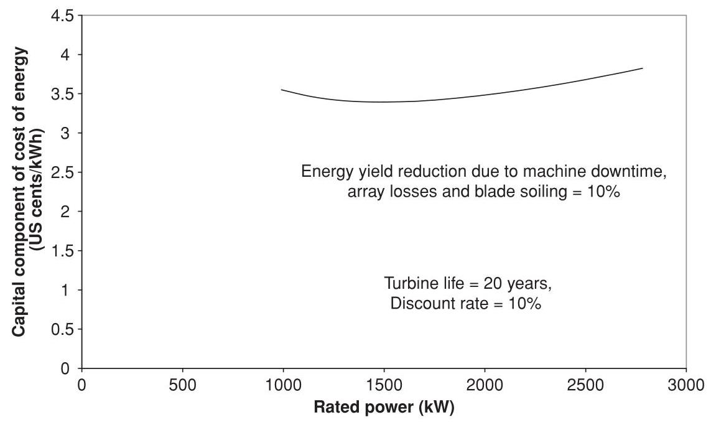

Figure 6.4 Variation in cost of energy with rated power for a ${70}\mathrm{\;m}$ diameter, pitch regulated variable speed machine for an annual mean wind speed of ${7.5}\mathrm{\;m}/\mathrm{s}$ , based on simplified cost model

A similar exercise can be carried out to determine the optimum rated power of a stall regulated machine, and would yield similar results. However, because stall regulated machines reach rated power at a substantially higher wind speed than pitch regulated machines of the same rating, the ${U}_{\mathrm{{Ro}}}/{U}_{\mathrm{{ave}}}$ ratio for stall regulated machines is typically about 2 .

#### 6.3.3 Specific power of production machines

It is instructive to investigate the relationship between rated power and swept area for production machines, and these quantities are plotted against each other in Figure 6.5 for

Table 6.4 Variation of optimum rated wind speed with annual mean for pitch regulated machines

<table><tr><td>Annual mean wind speed, ${U}_{\text{ ave }}\left( {\mathrm{m}/\mathrm{s}}\right)$</td><td>Optimum rated wind speed, ${U}_{\mathrm{{Ro}}}\left( {\mathrm{m}/\mathrm{s}}\right)$</td><td>Ratio ${U}_{\mathrm{{Ro}}}/{U}_{\mathrm{{ave}}}$</td><td>Optimum rated power (kW)</td><td>Specific power, defined as rated power per unit swept area (kW/sqm)</td><td>Cost index, with cost of energy for amws of ${7.5}\mathrm{\;m}/\mathrm{s}$ taken as 100</td></tr><tr><td>7</td><td>11.1</td><td>1.59</td><td>1340</td><td>349</td><td>113</td></tr><tr><td>7.5</td><td>11.5</td><td>1.54</td><td>1495</td><td>388</td><td>100</td></tr><tr><td>8</td><td>11.9</td><td>1.49</td><td>1535</td><td>425</td><td>90</td></tr><tr><td>8.5</td><td>12.3</td><td>1.445</td><td>1770</td><td>460</td><td>81</td></tr><tr><td>9</td><td>12.65</td><td>1.41</td><td>1905</td><td>495</td><td>75</td></tr></table>

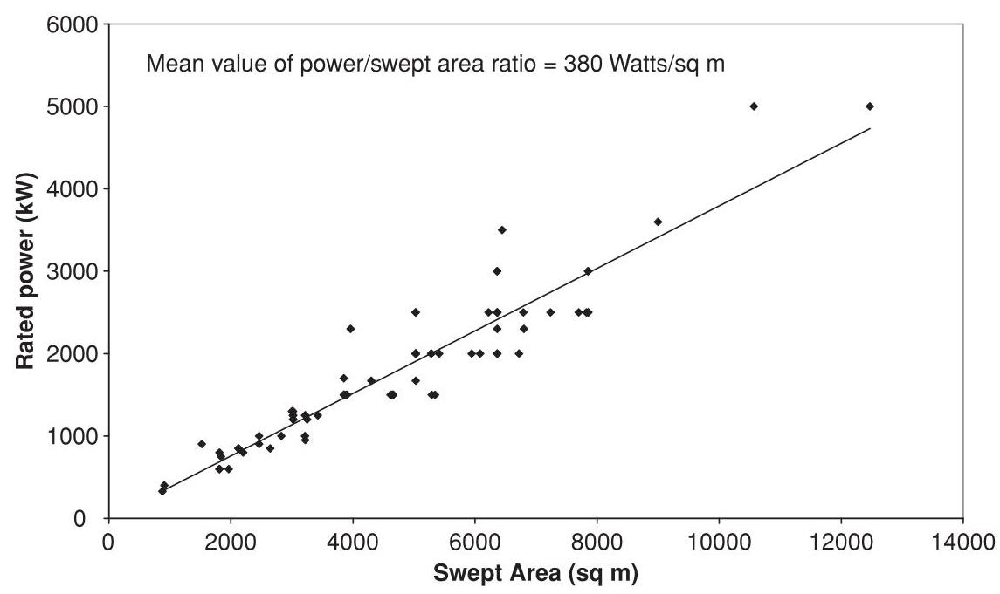

Figure 6.5 Rated power versus swept area for turbines in production in 2008

79 machines in production in 2008. Although different machines will have been designed for different annual mean wind speeds, the degree of scatter is not large, and a clear trend is apparent, with the line of best fit being close to a straight line passing through the origin. The mean specific power, defined as rated power divided by swept area, is 380 Watts/sq m for the 79 machines - close to the optimum value in Table 6.3 for an annual wind speed of ${7.5}\mathrm{\;m}/\mathrm{s}$ .

### 6.4 Rotational speed

The aim of the wind turbine designer is the production of energy at minimum cost, subject to constraints imposed by environmental impact considerations. However, blade designs optimised for a number of different rotational speeds but the same rated power produce substantially the same energy yield, so the choice of rotational speed is based on machine cost rather than energy yield.

One of the key cost drivers is the rotor torque at rated power, as this is the main determinant of the drive train cost. For a given tip radius and machine rating, the rotor torque is inversely proportional to rotational speed, which argues for the adoption of a high rotational speed. However, increasing the rotational speed has adverse effects on the rotor design, which are explored in the following sections.

#### 6.4.1 Ideal relationship between rotational speed and solidity

Equation 3.69a in Section 3.7.2 gives the chord distribution of a blade optimised to give maximum power at a particular tip speed ratio in terms of the lift coefficient, ignoring drag and tip loss:

$$
{\sigma }_{r}\lambda {C}_{l} = \frac{\frac{8}{9}}{\sqrt{{\left( 1 - \frac{1}{3}\right) }^{2} + {\lambda }^{2}{\mu }^{2}{\left\lbrack  1 + \frac{2}{9{\lambda }^{2}{\mu }^{2}}\right\rbrack  }^{2}}} \tag{3.69a}
$$

where $\lambda$ is the tip speed ratio, ${\sigma }_{r}$ is the solidity and $\mu  = r/R$ . Over the outboard half of the blade, which produces the bulk of the power, the local speed ratio, ${\lambda \mu }$ , will normally be large enough to enable the denominator to be approximated as ${\lambda \mu }$ , giving:

$$
{\sigma }_{r}\lambda {C}_{l} = \frac{{Nc}\left( \mu \right) }{2\pi R}\lambda {C}_{l} = \frac{8}{9\lambda \mu } \tag{6.6}
$$

where $N$ is the number of blades.

After rearrangement, this gives

$$
c\left( \mu \right) {\left( \frac{\Omega R}{{U}_{\infty }}\right) }^{2} = \frac{16\pi R}{9{C}_{l}N} \cdot  \frac{1}{\mu } \tag{6.7}
$$

Hence it can be seen that, for a family of designs optimised for different rotational speeds at the same wind speed, the blade chord at a particular radius is inversely proportional to the square of the rotational speed, assuming that $N$ and $R$ are fixed and the lift coefficient is maintained at a constant value by altering the local blade pitch to maintain a constant angle of attack.

Note that Equation 6.7 does not apply if energy yield is optimised over the full range of operating wind speeds for a fixed speed pitch regulated machine. In this case, it has been demonstrated that the blade chord at a particular radius is approximately inversely proportional to rotational speed rather than to the square of it (Jamieson and Brown, 1992).

#### 6.4.2 Influence of rotational speed on blade weight

The effect of rotational speed on blade weight can be explored with reference to the family of blade designs just described. As in Section 6.3.1, it is assumed that the blade design is governed by out-of-plane bending moments in fatigue and that the moment fluctuations are proportional to the product of the wind speed fluctuation, the rotational speed and the chord scaling factor (see Equation 5.25 in Section 5.7.5). By Equation 6.7 the chord scaling factor is inversely proportional to the square of the rotational speed, so the moment fluctuations simply vary inversely as the rotational speed.

The thickness to chord ratios at each radius are assumed to be unaffected by the chord scaling, so the blade section modulus for out-of-plane bending at a given radius is proportional to the product of the blade shell skin thickness, $w\left( r\right)$ , and the square of the local chord. Thus,

$$
Z\left( r\right)  \propto  w\left( r\right)  \cdot  {\left( c\left( r\right) \right) }^{2} \propto  w\left( r\right) /{\Omega }^{4} \tag{6.8}
$$

In order to maintain the fatigue stress ranges at the same level, we require the blade section modulus, $Z\left( r\right)$ , to vary as the moment fluctuations, which, as shown above, vary inversely as rotational speed. Thus,

$$
Z\left( r\right)  \propto  1/\Omega \text{ so }w\left( r\right) /{\Omega }^{4} \propto  1/\Omega \text{ and }w\left( r\right)  \propto  {\Omega }^{3} \tag{6.9}
$$

Blade weight is proportional to the skin thickness times chord, and thus varies as rotational speed.

#### 6.4.3 Optimum rotational speed

On the basis of the assumptions of Section 6.4.2 (which will by no means always apply), blade weight increases in proportion to rotational speed. However, the blade out-of-plane fatigue loads, which may govern the design of the nacelle structure and tower, vary inversely as the rotational speed. It is therefore likely that, as rotational speed is increased, there will be a trade-off between reducing costs of the drive train, nacelle structure and tower on the one hand and increasing rotor cost on the other, which will determine the optimum value.

#### 6.4.4 Noise constraint on rotational speed

The aerodynamic noise generated by a wind turbine is approximately proportional to the fifth power of the tip speed. It is therefore highly desirable to restrict turbine rotational speed, especially when the wind speed and, therefore, ambient noise levels are low. Consequently manufacturers of turbines to be deployed at normal sites on land generally limit the tip speed of fixed speed machines to about ${65}\mathrm{\;m}/\mathrm{s}$ .

In the case of variable speed machines the maximum tip speed is usually significantly higher - typically in the range ${70} - {85}\mathrm{\;m}/\mathrm{s}$ , but of course these tip speeds are only reached at higher wind speeds, when ambient noise levels are higher also.

Offshore machines are not subject to the noise constraints on maximum tip speeds that apply on land, so machines designed primarily for offshore siting typically have somewhat higher tip speeds. However, Jamieson (2009) investigated a more substantial increase in tip speed to ${120}\mathrm{\;m}/\mathrm{s}$ in order to realise savings in drive train cost, and proposed a downwind configuration in order to avoid the risk of tower strike by the resulting flexible, low solidity blades.

#### 6.4.5 Visual considerations

There is a consensus that turbines are more disturbing to look at the faster they rotate.

### 6.5 Number of blades

#### 6.5.1 Overview

European windmills traditionally had four sails, perhaps because pre-industrial techniques for attaching the sail stocks to the shaft lent themselves to a cruciform arrangement in which the stocks for opposite sails formed a continuous wooden beam. By contrast the vast majority of horizontal axis wind turbines manufactured today have either two or three blades, although at least one manufacturer used to specialise in one-bladed machines. As the latter are now only of theoretical or historical interest, consideration of them will be restricted to Section 6.5.7, and the rest of Section 6.5 will concentrate on two- and three-bladed machines.

In comparing the relative merits of machines with differing numbers of blades, the following factors need to be considered:

- performance;

- loads;

- cost of rotor;

- impact on drive train cost;

- noise emission; and

- visual appearance.

Some of these factors are strongly influenced by rotational speed and rotor solidity, and the ideal relationship between these parameters and the number of blades is considered in the next section. Section 6.5.3 investigates alternative two-bladed derivatives of a realistic three-bladed variable speed baseline design and compares their relative energy yields and notional costs. Section 6.5.4 reviews the differences in loading imposed by two- and three-bladed rotors on the supporting structure, and Section 6.5.5 considers the constraint on rotational speed imposed by noise emission. Visual appearance is considered briefly in Section 6.5.6.

#### 6.5.2 Ideal relationship between number of blades, rotational speed and solidity

The effect of the number of blades on the blade chord and rotational speed of a machine optimised for a particular wind speed is given by Equation 6.7:

$$
{Nc}\left( \mu \right) {\left( \frac{\Omega R}{{U}_{\infty }}\right) }^{2} = \frac{16\pi R}{9{C}_{l}} \cdot  \frac{1}{\mu }
$$

Hence it can be seen that, if the number of blades is reduced from three to two, increasing the chord by ${50}\%$ or the rotational speed by ${22.5}\%$ are two of the options for preserving optimised operation at the selected wind speed. (It is assumed that the lift coefficient is maintained at a constant value by altering the local blade pitch to maintain a constant angle of attack.)

#### 6.5.3 Some performance and cost comparisons

Clear-cut comparisons between two- and three-bladed machines are notoriously difficult because of the impossibility of establishing equivalent designs. Conceptually, the simplest option is to increase the chord by ${50}\%$ at all radii and leave everything else - including rotational speed - unchanged. In the absence of tip-loss, the induction factors, and hence the annual energy yield, remain the same, but when tip-loss is included, the annual energy yield of a stall regulated machine drops by about 2.5%. However, retention of the same rotor solidity largely negates one of the main benefits of reducing the number of blades, namely reduction in rotor cost, and so this option will not be pursued further. Instead it is proposed to take a realistic blade design for a three-bladed machine and look at the performance and cost implications of using the same blade on a two-bladed machine rotating at different speed.

Performance comparisons are affected both by the power rating in relation to swept area (Section 6.3) and by the aerofoil data used. In this case a 70 m diameter, 1.5 MW, pitch-regulated variable speed three-bladed turbine operating at a tip speed ratio of 8 for wind speeds below ${10}\mathrm{\;m}/\mathrm{s}$ and constant tip speed above is adopted as the baseline machine. The maximum rotational speed is thus ${80}/{35} = {2.29}\mathrm{{rad}}/\mathrm{s}$ or 21.8 rpm. The blade planform and thickness distribution are scaled down from those for the T40 blade given in Figure 5.4(a). Empirical 3D aerofoil data for a LM 19.0 blade is used (see Figure 5.9), with maximum lift coefficient increasing from blade tip to blade root, as this results in more accurate power curve predictions. The data is taken from the Risø publication 'Prediction of dynamic loads and induced vibrations in stall' by Petersen, Madsen et al. (1998). The blade twist distribution is set to give maximum energy yield at a site where the annual mean wind speed is ${7.5}\mathrm{\;m}/\mathrm{s}$ , resulting in an annual energy yield at 100% availability of 4937 MWh. The performance curve for the baseline turbine is shown in Figure 6.6.

Figure 6.6 Comparison of ${C}_{P} - \lambda$ curves for three-bladed baseline machine and two-bladed options (a), (b) and (d)

Four options for a corresponding ${70}\mathrm{\;m}$ diameter pitch-regulated, variable speed, two bladed design at a site with the same annual mean wind speed are examined and the notional energy costs compared with that for the baseline three-bladed machine. The costs of the two bladed design options in relation to the baseline three-bladed machine are considered with reference to changes in the weights of the components, using the cost shares for the NREL baseline machine given in Table 6.2.

Blade design is assumed to be governed by out-of-plane fatigue bending moments, with the moment fluctuations increasing in proportion to rotational speed (see Equation 5.25 in Section 5.7.5). Accordingly the blade weight is assumed to increase linearly with rotational speed, but the total blade weight for the two-bladed machine at the baseline rotational speed is, of course, reduced by one third. The weights of the hub, pitch system, shaft and yaw system are also assumed to increase with rotational speed, but no account is taken of the increased loads on these components for a fixed-hub, two-bladed machine.

It is assumed initially that the design of the nacelle structure is fatigue driven and governed by the fluctuating moment on the nacelle due to differential blade out-of-plane root bending moment, which increases with rotational speed. Tower design is also assumed to be governed by fatigue in the first instance, so tower weight is similarly taken as proportional to rotational speed. The cyclic thrust loads on the rotor due to turbulence are virtually the same for two-and three-bladed machines rotating at the same speed if the blade planforms are the same, so the tower cost element at the baseline rotational speed is left unchanged.

The weights of the gearbox and brake are taken to be proportional to the rated torque, ${P}_{R}/\Omega$ , while those of the generator, the variable speed electronics and of the cables and equipment forming the grid connection are taken as proportional to rated power, ${P}_{R}$ .

The various components are classified into different categories according to the way in which their costs vary with rotational speed and rated power in Table 6.5. Also tabulated are the two-bladed machine component costs as a percentage of the total for the baseline three-bladed machine, together with the sum for each category.

The following expression is obtained for machine cost as a function of rotational speed and rated power:

$$
{C}_{T} = {C}_{TB}\left( {{0.134} + {0.4047}\left\{  {\Omega /{\Omega }_{B}}\right\}   + {0.118}\left\{  {{\Omega }_{B}/\Omega }\right\}  \left( {{P}_{R}/{P}_{RB}}\right)  + {0.305}\left( {{P}_{R}/{P}_{RB}}\right) }\right) \tag{6.10}
$$

Here, ${P}_{RB}$ and ${\Omega }_{B}$ are the baseline values of rated power and maximum nominal rotational speed, 1500 kW and 21.8 rpm respectively. The three design options can now be examined:

## (a) Planform, twist and rotational speed unchanged from baseline

The reduction in the number of blades reduces the coefficient of performance at the tip speed ratio of 8, which applies at wind speeds less than ${10}\mathrm{\;m}/\mathrm{s}$ , by ${8.4}\%$ , but the energy yield reduction is less at ${6.3}\%$ . The corresponding ${C}_{P} - \lambda$ curve is shown over the full range of tip speed ratios by the dashed line on Figure 6.6, with the much more limited operating range shown emboldened, and it is evident that the optimum tip speed ratio has increased from about 7.7 for the baseline three-bladed machine to about 10. Clearly the limit on the upper tip speed of ${80}\mathrm{\;m}/\mathrm{s}$ imposes a significant penalty on performance.

Combination of the reduced energy yield with the machine capital cost saving of 3.8% due to the elimination of one blade results in an increased cost of energy of 2.6%.

Table 6.5 Contribution of different components to the cost of a two-bladed machine (expressed as percentages of three-bladed baseline machine cost) and classified according to the relationship assumed between the component cost and rotational speed/rated torque/ rated power

<table><tr><td colspan="2">Components for which the weight/cost is independent of rated power or rotational speed</td><td colspan="2">Components for which the weight/cost varies as rotational speed, $\Omega$</td><td colspan="2">Components for which the weight/cost varies as rated torque, ${P}_{R}/\Omega$</td><td colspan="2">Components for which the weight/cost varies as rated power, ${P}_{R}$</td></tr><tr><td>Component</td><td>Cost</td><td>Component</td><td>Cost</td><td>Component</td><td>Cost</td><td>Component</td><td>Cost</td></tr><tr><td>Foundation</td><td>3.6%</td><td>Blades</td><td>7.7%</td><td>Gearbox</td><td>11.6%</td><td>Generator</td><td>7.4%</td></tr><tr><td>Controller</td><td>2.7%</td><td>Hub</td><td>3.6%</td><td>Brake</td><td>0.2%</td><td>Variable</td><td>9.0%</td></tr><tr><td>Assembly</td><td>3.2%</td><td>Pitch</td><td>4.3%</td><td>system</td><td></td><td>speed</td><td></td></tr><tr><td>Transport</td><td>3.9%</td><td>system</td><td></td><td></td><td></td><td>electronics</td><td></td></tr><tr><td></td><td></td><td>Low speed   shaft &   bearings</td><td>2.5%</td><td></td><td></td><td>Grid connection</td><td>14.1%</td></tr><tr><td></td><td></td><td>Nacelle</td><td>8.9%</td><td></td><td></td><td></td><td></td></tr><tr><td></td><td></td><td>Yaw system</td><td>1.5%</td><td></td><td></td><td></td><td></td></tr><tr><td></td><td></td><td>Tower</td><td>12.0%</td><td></td><td></td><td></td><td></td></tr><tr><td>TOTAL</td><td>13.4%</td><td>TOTAL</td><td>40.5%</td><td>TOTAL</td><td>11.8%</td><td>TOTAL</td><td>30.5%</td></tr></table>

(b) As option (a), but twist distribution re-optimised

Re-optimisation of the twist distribution reduces the energy yield penalty compared with the baseline three-bladed machine to ${4.6}\%$ . As a result the increase in the cost of energy is reduced to ${0.8}\%$ . The corresponding ${C}_{P} - \lambda$ curve is shown over the full range of tip speed ratios in Figure 6.6, with the much more limited operating range shown emboldened.

(c) Tip speed ratio schedule scaled in conjunction with twist distribution optimisation to obtain minimum cost of energy based on machine cost function of Equation 6.10 (with tower and nacelle cost increasing with maximum rotational speed)

The tip speed at each wind speed can be scaled up by the same ratio so as to produce maximum energy yield, with simultaneous re-optimisation of the twist distribution. This enables the energy yield penalty compared with the baseline three-bladed machine to be reduced to only ${1.3}\%$ , for a tip speed scaling factor of 1.21 . However, application of Equation 6.10 results in a capital cost increase of 2.5% relative to the baseline machine, resulting in a cost of energy increase - again relative to the baseline machine - of 3.8%.

Minimisation of the cost of energy, on the other hand, leads to a much lower tip speed scaling factor of 1.035. The energy yield penalty and capital cost reduction relative to the baseline machine are now ${3.3}\%$ and ${2.8}\%$ respectively, resulting in an increase in the cost of energy of only ${0.5}\%$ .

(d) Tip speed ratio schedule scaled in conjunction with twist distribution optimisation to obtain minimum cost of energy based on machine cost function of Equation 6.10 modified so that tower and nacelle cost are fixed

It is apparent that, with the weight of nacelle and tower assumed to increase in proportion to rotational speed the two-bladed variant c) considered above results in a small increase in the cost of energy relative to the three-bladed machine. However, if the weight of the nacelle structure is driven by the size of the enclosure required to accommodate the gearbox, generator and other equipment, rather than by fatigue loading, it will be constant for machines of fixed rating. If it is also assumed that the tower design is governed by extreme loads rather than fatigue loads, the expression for machine cost as a function of rotational speed and rated power becomes:

$$
{C}_{T} = {C}_{TB}\left( {{0.254} + {0.2847}\left\{  {\Omega /{\Omega }_{B}}\right\}   + {0.118}\left\{  {{\Omega }_{B}/\Omega }\right\}  \left( {{P}_{R}/{P}_{RB}}\right)  + {0.305}\left( {{P}_{R}/{P}_{RB}}\right) }\right)
$$

(6.11)

The tip speed scaling factor resulting in the minimum cost of energy then increases to 1.12 and the cost of energy reduces to 1.1% below that of the baseline machine. As shown in Figure 6.6, the corresponding ${C}_{P} - \lambda$ curve over the full range of tip speed ratios is almost identical to that for option (b), but the tip speed ratio operating range differs.

The above results are summarised in Table 6.6.

The results shown in Table 6.6 indicate that two-bladed, rigid hub machines have the potential to yield marginal cost benefits vis-à-vis three-bladed machines, if nacelle and tower design are not impacted by increases in rotational speed. However, the results should be treated with caution, because no account has been taken of increased component costs due to the increased loadings on the hub, low-speed shaft, yaw drive and nacelle inherent in a rigid hub two-bladed turbine. (Loads on rigid hub two-bladed machines are compared with those on three-bladed machines in more detail in the next section.)

The loadings on the nacelle of a two-bladed machine can be reduced significantly by the introduction of a teeter hinge between the rotor and the low speed shaft, with consequent potential cost benefits. The hinge eliminates the transfer of out-of-plane aerodynamic moments from the rotor to the low speed shaft, resulting in large reductions in the operational loadings on the shaft, nacelle and yaw drive. The dependence of these loads on rotational speed is also largely removed, with the result that the optimum rotational speed for a two bladed machine in energy cost terms is increased, approaching the value giving maximum energy yield.

Although teetering provides scope for significant cost savings on the shaft, nacelle and yaw drive (which account for nearly 20% of the baseline machine cost), these savings are offset by the additional costs associated with the teeter hinge and teeter restraint system.

#### 6.5.4 Effect of number of blades on loads

Moment loadings on the low speed shaft and nacelle structure from three-bladed and rigid-hub two-bladed machines were examined in Sections 5.10 and 5.11, and are compared in Table 6.7 below for machines of the same diameter and rotational speed. The stochastic loading comparison is based on a turbulence length scale to rotor diameter ratio of 1.84.

Table 6.6 Comparison of two-bladed design variants on a ${70}\mathrm{\;m}$ diameter, ${1.5}\mathrm{{MW}}$ three-bladed variable speed, pitch regulated baseline machine, using blades of same planform and thickness/chord ratio distribution

<table><tr><td>Two-bladed 70 m diameter, 1.5 MW, machine design options</td><td>Maximum nominal speed and tip speed</td><td>Annual energy yield (MWh)</td><td>Reduction in annual energy yield cf baseline m/c</td><td>Reduction in overall machine cost cf three-bladed baseline</td><td>Increase/ reduction in cost of energy</td></tr><tr><td>a) Same blade and tip speed schedule</td><td>21.8 rpm 80 m/s</td><td>4625</td><td>6.3%</td><td>3.8%</td><td>+2.6%</td></tr><tr><td>b) As above, but with optimisation of blade twist distribution</td><td>21.8 rpm 80 m/s</td><td>4709</td><td>4.6%</td><td>3.8%</td><td>+0.8%</td></tr><tr><td>c) Tip speeds & twist distribution varied to give minimum C of E as per Equation 6.10</td><td>22.6 rpm 83 m/s</td><td>4775</td><td>3.3%</td><td>2.8%</td><td>+0.5%</td></tr><tr><td>d) Tip speeds & twist distribution varied to give minimum C of E assuming nacelle and tower costs fixed - i.e. using Equation 6.11</td><td>24.5 rpm 90 m/s</td><td>4857</td><td>1.6%</td><td>2.7%</td><td>-1.1%</td></tr></table>

Table 6.7 Comparison of loads on shaft and nacelle for three-bladed and rigid-hub two-bladed machines ( $\psi$ is blade azimuth)

<table><tr><td rowspan="2">Location of moment loading</td><td colspan="2">Deterministic loading arising from wind shear and/or yaw misalignment, in terms of blade root out-of-plane bending moment amplitude, ${M}_{o}$</td><td rowspan="2">Stochastic loading   % increase for rigid-hub two-bladed machine compared with three-bladed $\mathrm{m}/\mathrm{c}$</td></tr><tr><td>Three-bladed machine</td><td>Right-hub two-bladed machine</td></tr><tr><td>Shaft bending moment amplitude</td><td>${1.5}{M}_{\mathrm{o}}$</td><td>$2{M}_{\mathrm{o}}$</td><td>22%</td></tr><tr><td>Nacelle nodding moment</td><td>${1.5}{M}_{\mathrm{o}}$</td><td>${M}_{\mathrm{o}}\left( {1 + \cos {2\psi }}\right)$</td><td>22%</td></tr><tr><td>Nacelle yaw moment</td><td>Zero</td><td>${M}_{\mathrm{o}}\sin {2\psi }$</td><td>22%</td></tr></table>

It is seen that loadings from a rigid-hub two-bladed rotor are significantly larger than from a three-bladed rotor. However, in most two-bladed machine designs, the rotor is allowed to teeter instead of being rigidly mounted, with the result that aerodynamic moments on the shaft and nacelle structure quoted in Table 6.7 are eliminated, and the blade out-of-plane root bending moments reduced. The benefits and drawbacks of teetering the rotor are examined in Section 6.6.

The rotor thrust variations at blade passing frequency due to stochastic loading, which are a dominant factor in tower fatigue design, are very similar for two- and three-bladed machines rotating at the same speed. However, two-bladed machines usually rotate faster than three-bladed machines of the same diameter, so the cyclic rotor thrust variations are higher.

#### 6.5.5 Noise constraint on rotational speed

As noted in Section 6.5.3, there may be significant cost benefits to be gained from a two-bladed design with increased rotational speeds, because, in addition to the blade saving, the cost of the whole of the drive train is reduced because of the reduced torque. However, as noted in Section 6.4.4, it is normal to restrict the tip speeds of fixed speed and variable speed machines to about ${65}\mathrm{\;m}/\mathrm{s}$ or ${85}\mathrm{\;m}/\mathrm{s}$ respectively, in order to limit aerodynamic noise emission. At ${80}\mathrm{\;m}/\mathrm{s}$ , the tip speed of the baseline machine discussed in Section 6.5.3 is within this limit, but the tip speed of option d) of ${90}\mathrm{\;m}/\mathrm{s}$ would be less likely to be acceptable, except at remote sites or offshore. This subject is considered further in Section 6.9.

#### 6.5.6 Visual appearance

Although the assessment of visual appearance is essentially subjective, there is an emerging consensus that three-bladed machines are more restful to look at than two-bladed ones. One possible reason for this is that the apparent 'bulk' of a three-bladed machine changes only slightly over time, whereas a two-bladed machine appears to contract down to a one-dimensional line element, when the rotor is vertical, twice per revolution. A secondary factor is that two-bladed machines generally rotate faster, which an observer can also find more disturbing.

#### 6.5.7 Single-bladed turbines

Apart from the saving in rotor cost itself, the single-bladed turbine concept is an attractive one because of the reduction in drive train cost realisable through increased rotational speed (Section 6.5.2). An obvious disadvantage is the resulting increased noise emission resulting from the faster rotation, but this would not be an issue offshore. Another consideration is the reduced yield due to increased tip loss. For example, a single-bladed version of the ${70}\mathrm{\;m}$ diameter, 1.5 MW pitch regulated, variable speed three-bladed baseline design considered in Section 6.5.3, with the rotational speed at each wind speed scaled up by $\sqrt{3}$ in accordance with Equation 6.7 and with the twist distribution reoptimised to give maximum energy yield, would produce an annual energy output 5.5% less than the baseline machine.

The single blade must be counterweighted to eliminate torque fluctuations and any whirling tendency due to centrifugal loads. Furthermore, as a rigid hub would expose the nacelle to very large nodding and yawing moments in comparison with two- or three-bladed machines, it is customary to mount the rotor on a teeter hinge, so that the unbalanced aerodynamic out-of-plane moment can be resisted by a centrifugal couple, thereby reducing the hub moment. However, the teeter motion of the blade is significantly greater than that of a two-bladed machine, so it is normal to mount the rotor downwind. Morgan (1994) reports that particular difficulties have been encountered in predicting teeter excursions after grid loss and emergency stops, leading to excessive risk of teeter stop impacts.

### 6.6 Teetering

#### 6.6.1 Load relief benefits

Two-bladed rotors are often mounted on a teeter hinge - with hinge axis perpendicular to the shaft axis, but not necessarily perpendicular to the longitudinal axis of the blades - in order to prevent differential blade root out-of-plane bending moments arising during operation. Instead, differential aerodynamic loads on the two blades result in rotor angular acceleration about the teeter axis, with large teeter excursions being prevented by the restoring moment generated by centrifugal forces, as described in Section 5.8.8. However, when the machine is shutdown, the centrifugal restoring moment is absent, so differential blade loading will cause the rotor to teeter until it reaches the teeter end stops which need to be suitably buffered. Consequently the teeter hinge is unlikely to provide any amelioration of extreme blade root out-of-plane moments when the machine is shutdown.

The load relief afforded by the teeter hinge benefits the main structural elements in the load path to the ground in varying degrees, as outlined below:

(a) Blade: The main benefit is the elimination of the cyclic variations in out-of-plane bending moment due to yaw (Figure 5.10), shaft tilt, wind shear (Figure 5.11) and tower shadow (Figure 5.14). By contrast, there is only a small reduction in blade root out-of-plane bending moment due to stochastic loadings - see the example in Section 5.8.8, where an 11% reduction is quoted. Thus, teetering results in a large overall reduction in out-of-plane fatigue loading, although the significance of this will be tempered by the influence of the unaltered edgewise gravity moment.

(b) Low speed shaft: Low speed shaft design is governed by fatigue loading, which is normally dominated by the cyclic gravity moment due to the cantilevered rotor mass. On a rigid hub machine, the shaft moment Damage Equivalent Load or DEL (defined in Section 5.12.6) due to deterministic and stochastic rotor out-of-plane loadings combined can be of similar magnitude, so the insertion of a teeter hinge can produce a substantial reduction in overall shaft moment DEL. It should be noted, however, that the cyclic shaft moment due to wind shear relieves that due to gravity on a rigid hub machine, so teetering is not beneficial in respect of this load component.

A rough estimate of the overall shaft moment DEL on a rigid hub machine, excluding yaw error and tower shadow effects, can be obtained by taking the square root of the sum of the squares of the shaft moment DEL due to stochastic loads and that due to the combined cyclic loads due to gravity, wind shear and shaft tilt.

(c) Nacelle structure: The provision of a teeter hinge should eliminate nodding and yawing moments on the nacelle completely during operation, leaving only rotor torque, thrust and in-plane loadings. This will benefit the fatigue design of the nacelle structure considerably, but not the extreme load design, for the reasons already explained.

(d) Yaw bearing and yaw drive: Rigid hub machines experience severe yaw moments due to both deterministic and stochastic loads, which were underestimated on many early designs. The introduction of a teeter hinge dramatically reduces yaw moments during operation by eliminating rotor out-of-plane moments on the hub, but yaw moments due to in-plane loads on the rotor still remain.

The relative magnitude of the yaw moments due to in-plane as opposed to out-of-plane loads on a rigid hub rotor can be appreciated by comparing the effect of wind speed fluctuation, $u$ , on the in-plane and out-of-plane loads on a blade element. Assuming that the blade is not stalled and that $\phi$ is small, the in-plane load per unit length is, from Equation 5.131a, given approximately by:

$$
- {F}_{Y} = \left( {\frac{1}{2}{\rho \Omega }\frac{d{C}_{l}}{d\alpha }}\right) c\left( r\right)  \cdot  r \cdot  u\left\lbrack  {\frac{{C}_{l}}{d{C}_{l}/{d\alpha }} + \sin \phi }\right\rbrack \tag{6.12}
$$

Whereas the out-of-plane load per unit length is, from Equation 5.25 approximately

$$
{F}_{X} = \left( {\frac{1}{2}{\rho \Omega }\frac{d{C}_{l}}{d\alpha }}\right) c\left( r\right)  \cdot  r \cdot  u \tag{6.13}
$$

Defining the distance between the hub centre and the tower centre-line as $e$ , it is seen that the yaw moment due to the in-plane rotor load is $\left( {e/r}\right) \left\lbrack  {{C}_{l}/\left( {d{C}_{l}/{d\alpha }}\right)  + \sin \phi }\right\rbrack$ times the maximum yaw moment due to out-of-plane load. As $e$ is typically about one tenth of the tip radius, it is seen that the yaw moments due to in-plane loads are at least an order of magnitude smaller than those due to out-of-plane moments, so that the introduction of the teeter hinge results in a very significant reduction.

(e) Tower: The fatigue loadings due to the ${M}_{Y}$ moment and ${M}_{Z}$ torque will clearly be significantly reduced at the top of the tower if the rotor is teetered, but the effect will be negligible towards the base where thrust loads dominate the moments.

#### 6.6.2 Limitation of large excursions

Some limitation on teeter excursions has to be provided, if only to prevent collision between the blade and the tower. If the teeter hinge is located close to the axis of the blades, with the low speed shaft passing through an aperture in the wall of the hub shell (see Figure 6.7), then the maximum teeter excursion is governed by the size of the aperture.

The teeter response to deterministic and stochastic loads is considered in Section 5.8.8. Although it is evident that a permitted teeter angle range of the order of + or $- {5}^{ \circ  }$ will accommodate the vast majority of teeter excursions during normal operation, it is usually impracticable to accommodate the largest that can occur. Hence, in order to minimise the occurrence of metal-to-metal impacts on the teeter end stops, buffers incorporating spring and/or damping elements normally have to be fitted. These also perform an important role in limiting the much larger teeter excursions that would otherwise arise during start-up and shut-down, when the centrifugal restoring moment is reduced.

Figure 6.7 Pitch-teeter coupling

#### 6.6.3 Pitch-teeter coupling

As described in Section 5.8.8, the magnitude of teeter excursions can be reduced by coupling blade pitch to teeter angle, in order to generate an aerodynamic restoring moment proportional to the teeter angle. This can be done simply by setting the teeter hinge at an angle, known as the Delta 3 angle, to the perpendicular to the rotor axis. Alternatively, on pitch-controlled machines, pitch-teeter coupling can be introduced by actuating the blade pitch by the fore-aft motion of a rod passing through a hollow low speed shaft. See Figure 6.7.

#### 6.6.4 Teeter stability on stall-regulated machines

At first sight, it might be thought that the teeter motion of a stalled rotor would be unstable because of negative damping resulting from the negative slope of the ${C}_{1} - \alpha$ curve post-stall.

However, two-dimensional aerodynamic theory is a poor predictor of post-stall behaviour, and it has proved possible to design teetered rotors that are stable in practice, such as the Gamma 60 (Falchetta et al., 1996) and Nordic 1000 (Engstrom et al., 1997). The concept is explored in detail in investigations by Armstrong and Hancock (1991) and Rawlinson-Smith (1994).

### 6.7 Power control

#### 6.7.1 Passive stall control

The simplest form of power control is passive stall control, which makes use of the post-stall reduction in lift coefficient and associated increase in drag coefficient to place a ceiling on output power as wind speed increases, without the need for any changes in blade geometry. The fixed blade pitch is chosen so that the turbine reaches its maximum or rated power at the desired wind speed.

Stall regulated machines suffer from the disadvantage of uncertainties in aerodynamic behaviour post-stall which can result in inaccurate prediction of power levels and blade loadings at rated wind speed and above. These aspects are considered in greater detail in Section 3.12.3.

#### 6.7.2 Active pitch control

Active pitch control achieves power limitation above rated wind speed by rotating all or part of each blade about its axis in the direction which reduces the angle of attack and hence the lift coefficient - a process known as blade feathering. The main benefits of active pitch control are increased energy capture, the aerodynamic braking facility it provides and the reduced extreme loads on the turbine when shut-down. See also Sections 3.13 and 8.2.1.

The pitch change system has to act rapidly - that is, to give pitch change rates of ${5}^{ \circ  }$ per second or better - in order to limit power excursions due to gusts enveloping the whole rotor to an acceptable value. However, it is not normally found practicable to smooth the cyclic power fluctuations at blade passing frequency due to blades successively slicing through a localised gust (Section 5.7.5), with the result that the large power swings of up to about 100% can sometimes occur in the case of fixed speed machines.

The extra energy obtainable with pitch control is not all that large. A pitch-regulated machine with the same power rating as a stall-regulated machine, utilising the same blades and rotating at the same speed will operate at a larger pitch angle below rated wind speed than the stall-regulated machine, in order to reduce the angle of attack and hence increase the power output at wind speeds approaching rated. For example, if the ${1500}\mathrm{{kW}},{70}\mathrm{\;m}$ diameter variable speed machine described in Section 6.5.3 were operated at a fixed speed of 17.1 rpm (corresponding to a tip speed of 62.8 m/s), a pitch regulated version would produce about ${2.7}\%$ more energy than a stall regulated version for a ${7.5}\mathrm{\;m}/\mathrm{s}$ annual mean wind speed, assuming optimisation of the blade twist distribution in each case. The power curves of the two fixed speed machines are compared in Figure 6.8. Also shown is the power curve for the variable speed pitch regulated machine described in Section 6.5.3. This would produce 5% more energy than the fixed speed, pitch regulated machine. Note that the knees in the power curves of the pitch regulated machines at rated speed will be more rounded in practice because the pitch control will not keep pace with the higher frequency components of turbulence.

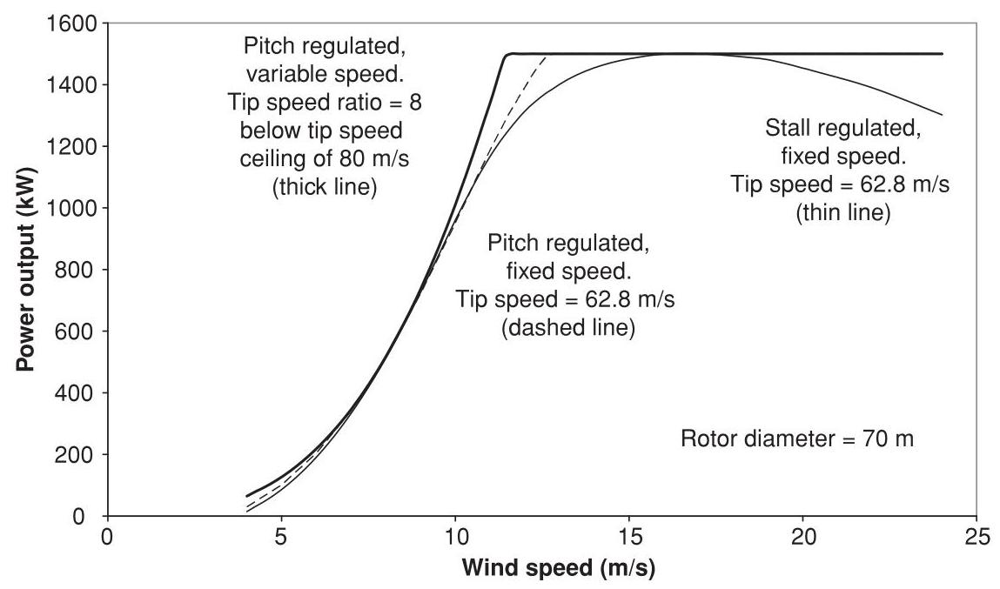

Figure 6.8 Comparison of power curves for (i) stall regulated, fixed speed; (ii) pitch regulated, fixed speed; and (iii) pitch regulated, variable speed 1.5 MW rated machines

Figure 6.9 shows a family of power curves for a range of positive pitch angles for the ${1500}\mathrm{{kW}},{70}\mathrm{\;m}$ diameter pitch controlled machine rotating at 17.1 rpm. The intersections of these curves with the ${1500}\mathrm{\;{kW}}$ ordinate define the relationship between steady wind speed and pitch angle required for power control (Figure 6.10). It is readily apparent from the power curve gradients at the intersection points that rapid changes of wind speed will result in large power swings when the mean wind speed is high.

Figure 6.9 Power curves for different positive pitch angles: ${70}\mathrm{\;m}$ diameter three-bladed rotor rotating at 17.1 rpm

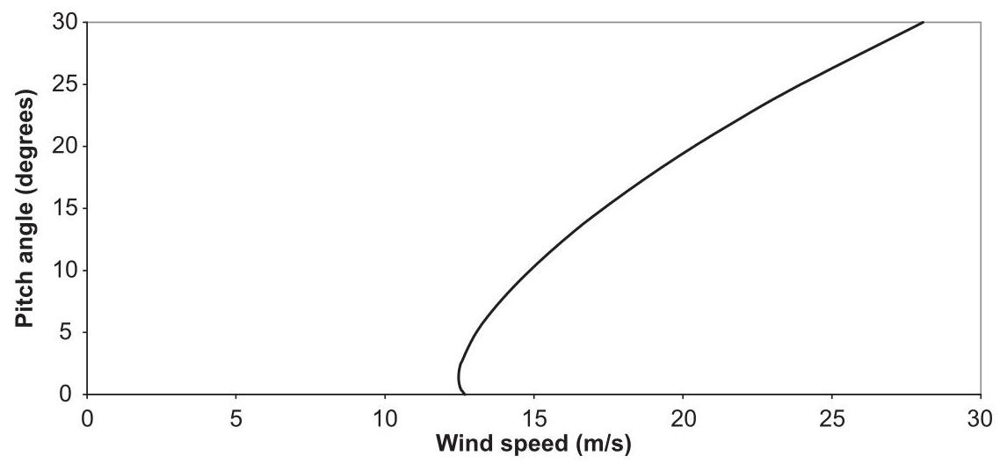

Figure 6.10 Schedule of pitch angles versus wind speed for limiting the power output of the machine featured in Figure 6.9 to ${1.5}\mathrm{{MW}}$

The range of blade pitch angles required for power control is typically from ${0}^{ \circ  }$ (often referred to as 'fine pitch'), at which the tip chord is in the plane of rotation or very close to it, and about ${35}^{ \circ  }$ . However, for effective aerodynamic braking, the blades have to be pitched to ${90}^{ \circ  }$ or full feather, when the tip chord is parallel to the rotor shaft with the leading edge into the wind.

A variety of pitch actuation systems have been adopted (see also Section 8.5). They are divided between those in which each blade has its own actuator and those in which a single actuator pitches all the blades. The former arrangement has the advantage that it provides two or three independent aerodynamic braking systems to control overspeed, and the disadvantage that it requires very precise control of pitch on each blade in order to avoid unacceptable pitch angle differences during normal operation. An advantage of the latter arrangement is that the pitch actuator - for example, a hydraulic cylinder - can be located in the nacelle, producing fore-aft motion of the pitch linkages in the hub by means of a rod passing down the middle of a hollow low speed shaft (see Figure 6.11). Alternatively, the axial position of the rod can be controlled by means of a ball-screw and ball-nut arrangement, in which the ball-nut is driven by a servomotor. Normally the ball-nut is driven at the same speed as the rotor, but when a change of pitch is required the ball-nut rotational speed is altered temporarily. This system is arranged to be fail-safe, so that should the servomotor or its control system fail, the servomotor is braked automatically and the ball-nut drives the blade pitch to feather.

Where hydraulic cylinders are used to pitch blades individually, they are mounted within the hub and each piston rod is usually connected directly to an attachment on the blade bearing (see Figure 6.12). The attachment point follows a circular path as the blade pitches, so the cylinder has to be allowed to pivot. The alternative solution of employing an electric motor to drive a pinion engaging with teeth on the inside of the blade bearing consequently appears rather neater (see Figure 6.13). Both systems require a hollow shaft to accommodate either hydraulic hoses or power cables for pitch actuation together with signal cables for pitch angle sensing. In addition, appropriate slip rings are required at the rear end of the shaft.

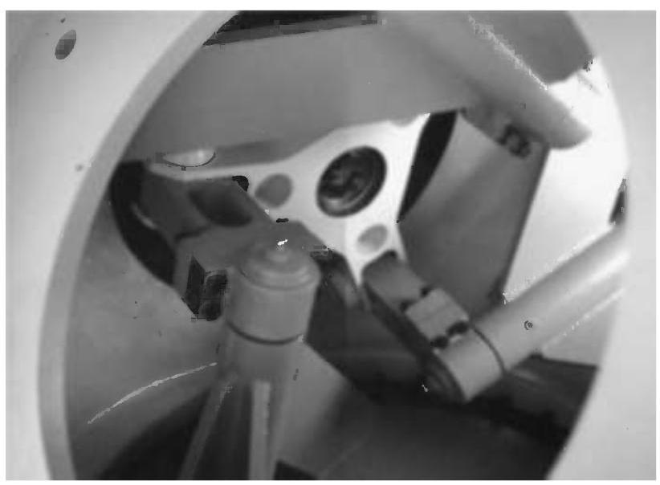

Figure 6.11 Pitch linkage system used in conjunction with a single hydraulic actuator located in the nacelle. (The central triangular 'spider' is connected to the actuator by a rod passing through the hollow low-speed shaft. Links from the spider drive the blade pitch via braced arms cantilevering into the hub from each blade. Each arm is parallel to its blade axis, but eccentric to it.)

Methods of providing back-up power supplies to ensure blade feathering in the event of grid-loss are considered in Section 8.5.

Although full-span pitch control is the option favoured by the overwhelming majority of manufacturers, power control can still be fully effective even if only the outer 15% of the blade is pitched. The principal benefits are that the duty of the pitch actuators is significantly reduced, and that the inboard portion of the blade remains in stall, significantly reducing the blade load fluctuations. On the other hand partial-span pitch control has several disadvantages as follows:

Figure 6.12 Blade pitching system using separate hydraulic actuators for each blade. (Each actuator cylinder is supported on a gimbal-type mounting bolted to the hub and its piston applies a pitching torque to the blade via a cantilevered conical tube eccentric to the blade axis. The blade is attached to the outer ring of the pitch bearing.)

Figure 6.13 Blade pitching system using a separate electric motor for each blade. (A pinion, driven by the motor via a planetary gearbox, engages with gear teeth on the inside of the inner ring of the pitch bearing, to which the blade is bolted. The blade is not attached to the bearing in this photograph, so the fixing holes are visible.)

- the introduction of extra weight near the tip;

- the difficulty of physically accommodating the actuator within the blade profile;

- the high bending moments to be carried by the tip-blade shaft;

- the need to design the equipment for the high centrifugal loadings found at large radii; and

- the difficulty of access for maintenance.

It should be apparent from the above brief survey of pitch actuation systems that the design of the hardware required for pitch-regulation is a significant task. Moreover, as regards the controller, pitch-regulation introduces the need for fast response closed loop control, which is not required for the supervisory functions on a stall-regulated machine. Thus, the benefits of pitch control have to be weighed carefully against all the additional costs involved, including the cost of maintenance.

Another factor that needs to be considered is fatigue loading. This increases significantly on full-span pitch-regulated machines, because the rate of change of lift coefficient with angle of attack remains at about ${2\pi }$ (see Equation A3.9 in Appendix A3) instead of reducing to zero as the blade goes into stall, with the result that rapid changes in wind speed above rated will cause bigger thrust load changes.

Pitch system controller design is considered in detail in Chapter 8.

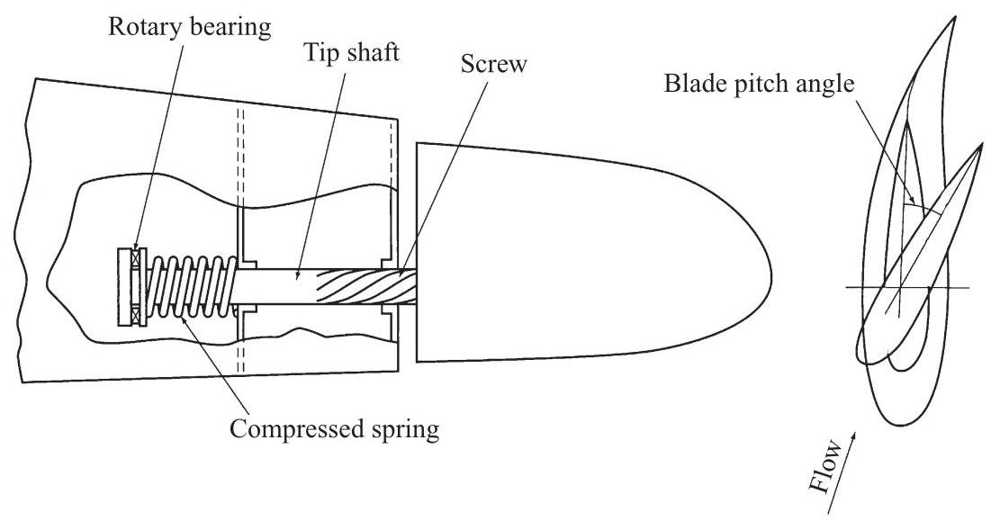

Figure 6.14 Passive control of tip blade, using screw on tip shaft and spring

#### 6.7.3 Passive pitch control

An attractive alternative to active control of blade pitch to limit power is to design the blade and/or its hub mounting to twist under the action of loads on the blades in order to achieve the desired pitch changes at higher wind speeds. Unfortunately, although the principle is easy to state, it is difficult to achieve it in practice, because the required variation in blade twist with wind speed generally does not match the corresponding variation in blade load. In the case of stand-alone wind turbines, the optimisation of energy yield is not the key objective, so passive pitch control is sometimes adopted, but the concept has not been utilised as yet for many grid-connected machines.

Corbet and Morgan (1991) give a survey of how different types of blade loads might be utilised. Harnessing the centrifugal load is obviously promising in the case of variable speed machines, and this has been demonstrated using a screw cylinder and preloaded spring to passively control each tip blade, within the Dutch FLEXHAT programme. When the centrifugal load on the tip exceeds the preload, the tip blade is driven outwards against the spring and pitches (see Figure 6.14 for illustration of the concept).

Joose and Kraan (1997) have proposed replacing this mechanism by a maintenance-free 'Tentortube', which would twist under tension loading. This tube would be carbon-fibre reinforced with all the fibres set at an angle to the axis, so that centrifugal loading induced twist. It would be placed inside a hollow steel tip shaft, which would carry the aerodynamic loading on the tip blade.

#### 6.7.4 Active stall control

Active stall control achieves power limitation above rated wind speed by pitching the blades initially into stall - that is, in the opposite direction to that employed for active pitch control, and is thus sometimes known as negative pitch control. At higher wind speeds, however, it is usually necessary to pitch the blades back towards feather in order to maintain power output at rated.

Figure 6.15 Schedule of pitch angles required to limit ${70}\mathrm{\;m}$ diameter turbine output to 1.5 MW at different wind speeds using active stall control

A significant advantage of active stall control is that the blade remains essentially stalled above the rated wind speed, so that gust slicing (see Section 6.7.2) results in much smaller cyclic fluctuations in blade loads and power output. It is found that only small changes of pitch angle are required to maintain the power output at rated, so pitch rates do not need to be as large as for positive pitch control. Moreover, full aerodynamic braking requires pitch angles of only about $- {20}^{ \circ  }$ , so the travel of the pitch mechanism is very much reduced compared with positive pitch control.

Figure 6.15 shows a schedule of pitch angle against wind speed for active stall control. The active stall control schedule is derived from the intersection of the family of power curves for different negative pitch angles for the ${70}\mathrm{\;m}$ diameter machine considered above with the ${1500}\mathrm{{kW}}$ ordinate in Figure 6.16. Note that the rotational speed has been increased by ${10}\%$ so that the machine operates further away from stall below rated wind speed - otherwise the range of negative pitch angles utilised would be very small.

The principal disadvantage of active stall control is the difficulty in predicting aerodynamic behaviour accurately in stalled flow conditions. Active stall control is considered further in Section 8.2.1, Chapter 8.

#### 6.7.5 Yaw control

As most horizontal axis wind turbines employ a yaw drive mechanism to keep the turbine headed into the wind, the use of the same mechanism to yaw the turbine out of wind to limit power output is obviously an attractive one. However, there are two factors which militate against the rapid response of such a system to limit power - firstly, the large moment of inertia of the nacelle and rotor about the yaw axis and, secondly, the cosine relationship between the component of wind speed perpendicular to the rotor disc and the yaw angle. The latter factor means that, at small initial yaw angles, yaw changes of, say, ${10}^{ \circ  }$ only bring about reductions in power of a few percent, whereas blade pitch changes of this magnitude can easily halve the power output. Thus, active yaw control is only practicable for variable speed machines where the extra energy of a wind gust can be stored as rotor kinetic energy until the yaw drive has made the necessary yaw correction. This design philosophy has been exploited successfully in Italy on the ${60}\mathrm{\;m}$ diameter Gamma 60 prototype, which has an impressive maximum yaw rate of ${8}^{ \circ  }$ per second (Coiante et al.,1989).

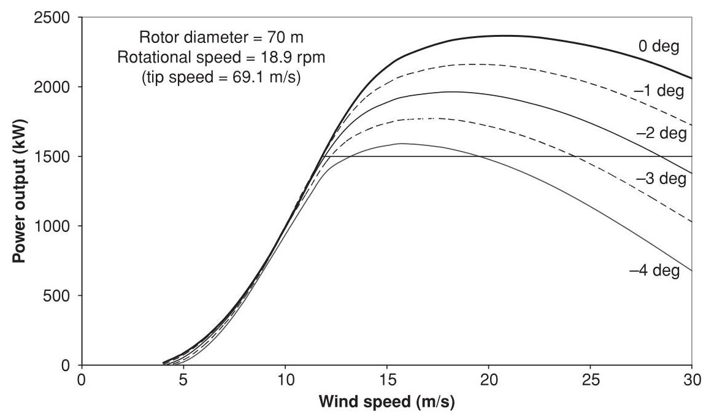

Figure 6.16 Power curves for different negative pitch angles: ${70}\mathrm{\;m}$ diameter three-bladed rotor rotating at ${18.9}\mathrm{{rpm}}$

### 6.8 Braking systems

#### 6.8.1 Independent braking systems: requirements of standards

The GL rules require that a wind turbine shall have two independent braking systems. On the other hand, IEC 61400-1 does not explicitly require the provision of two braking systems, but it does require the protection system to remain effective even after the failure of any non-safe-life protection system component.

IEC 61400-1 and the GL rules require that at least one of the braking systems should act on the rotor or low speed shaft.

Normal practice is to provide both aerodynamic and mechanical braking. However, if independent aerodynamic braking systems are provided on each blade, and each has the capacity to decelerate the rotor after the worst-case grid loss, then the mechanical brake will not normally be designed to do this as well. The function of the mechanical brake in this case is solely to bring the rotor to rest - that is, to park it - as aerodynamic braking is unable do this.

#### 6.8.2 Aerodynamic brake options

## Active pitch control

Blade pitching to feather (i.e. to align the blade chord with the wind direction) provides a highly effective means of aerodynamic braking. Blade pitch rates of ${10}^{ \circ  }$ per second are generally found adequate, and this is of the same order as the pitch rate required for power control. The utilisation of the blade pitch system for start-up and power control means that it is regularly exercised with the result that the existence of a dormant fault is highly unlikely.

In machines relying solely on blade pitching for emergency braking, independent actuation of each blade is required, together with fail-safe operation should power or hydraulic supplies passing through a hollow low speed shaft from the nacelle be interrupted. In the case of hydraulic actuators, oil at pressure is commonly stored in accumulators in the hub for this purpose.

## Pitching blade tips

Blade tips which pitch to feather have become the standard form of aerodynamic braking for stall-regulated turbines. Typically the tip blade is mounted on a tip shaft, as illustrated in Figure 6.14, and held in against centrifugal force during normal operation by a hydraulic cylinder. On release of the hydraulic pressure (which is triggered by the control system, or directly by an overspeed sensor), the tip blade flies outwards under the action of centrifugal force, pitching to feather simultaneously on the shaft screw. The length of the tip blade is commonly some 15% of the tip radius.

The ability of the control system to trigger blade tip activation is of crucial importance. On a number of early machine designs, the blade tips were centrifugally activated only, so there could be long periods without overspeed events when they did not operate. As a result there was a risk of seizure when operation was eventually required. With the now commonplace arrangement enabling the control system to activate the tip as well, the system can be routinely tested automatically. The penalty is that the low speed shaft needs to be hollow to accommodate the feed to the hydraulic cylinder.

## Spoilers

Spoilers are hinged flaps, which conform to the aerofoil profile when retracted, and stick out at right angles to it when deployed. However, although such devices have been used in the past, they have to be of considerable length in order to decelerate the rotor adequately (Jamieson and Agius, 1990). Moreover, unless the design allows for their operation to be regularly tested, there is a risk that they will fail to deploy when actually needed.

## Other devices

Various other devices have been suggested, such as:

- Ailerons.

- The sliding leading edge device or SLEDGE, in which a length of leading edge at the tip slides radially outwards.

- The flying leading edge device or FLEDGE, in which the whole leading edge together with an adjacent section of the camber face is pitched towards feather.

Jamieson and Agius (1990) and Armstrong and Hancock (1991) give useful surveys of these and other aerodynamic braking devices, and note that the SLEDGE device, which utilises only 2% or 3% of the blade area, is highly effective aerodynamically. Derrick (1992) examines the capabilities of the SLEDGE and FLEDGE devices for both braking and power control in more detail. Despite their promise, these devices have not yet found commercial application.

#### 6.8.3 Mechanical brake options

As noted in Section 6.8.1, the duty of the mechanical brake need only be that of a parking brake on machines where the aerodynamic brakes can be actuated independently. However, on pitch-regulated machines where blade position is controlled by a single actuator, full independent braking capability has to be provided by the mechanical brake. It is worth noting that several manufacturers of stall-regulated machines fitted with independent tip brakes ensure that the mechanical brake can stop the rotor unassisted. This may be to satisfy requirements in certain countries that two independent braking systems of a different type are provided.

A wind turbine brake typically consists of a steel brake disc acted on by one or more brake calipers. The disc can be mounted on either the rotor shaft (known as the low speed shaft) or on the shaft between the gearbox and the generator (known as the high speed shaft). The latter option is much the more common because the braking torque is reduced in inverse proportion to the shaft speeds, but it carries with it the significant disadvantage that the braking torques are experienced by the gear train. This can increase the gearbox torque rating required by as much as ca ${50}\%$ , depending on the frequency of brake application - see Section 7.4.5, Chapter 7. Another consideration is that the material quality of brake discs mounted on the high-speed shaft is more critical, because of the magnitude of the centrifugal stresses developed.

The brake calipers are almost always arranged so that the brakes are spring applied and hydraulically retracted - that is, fail-safe.

Aerodynamic braking is much more benign than mechanical braking as far as loading of the blade structure and drive train is concerned, so it is always used in preference for normal shut-downs.

#### 6.8.4 Parking versus idling

Although a mechanical parking brake is essential for bringing the rotor to rest for maintenance purposes, many manufacturers allow their machines to idle in low winds and some do so during high wind shutdowns. The idling strategy has two clear advantages - it reduces the frequency of imposition of braking loads on the gear train and gives the impression to members of the public that the turbine is operating even when it is not generating. On the other hand, gearbox and bearing lubrication must be maintained throughout.

### 6.9 Fixed speed, two speed or variable speed

Wind turbine rotors operate most effectively only at the one particular tip speed ratio that gives the maximum Power Coefficient (see Figure 3.15, Chapter 3). Hence, fixed rotational speed turbines operate sub-optimally except at the wind speed corresponding to this tip speed ratio. Energy capture can be increased by varying the rotational speed so that the turbine runs at optimum tip speed ratio over a range of wind speeds. A slightly reduced improvement can be obtained by running the turbine at one of two fixed speeds so that the tip speed ratio is closer to the optimum more often than with a single fixed speed.

Noise considerations are often of significance in the decision to opt for variable or two speed operation. As noted in Section 6.4.4, the aerodynamic noise generated by a wind turbine is approximately proportional to the fifth power of the tip speed. Both variable speed and two speed operation allow the rotational speed to be reduced in low winds, thus reducing turbine aerodynamic noise dramatically when it could otherwise be objectionable because of low background ambient noise.

Variable speed operation leads to a reduction in turbine mechanical loads as the control system gains can be reduced to allow small variations in the rotor speed in response to wind turbulence and cyclic torque variations (e.g. those caused by tower shadow). Also, larger wind farms are required by the electrical Transmission System Operators to comply with the Grid Code regulations that specify the electrical performance required. These regulations are designed to ensure that wind farms support the electrical power system by, for example, controlling their output voltage and continuing to operate when electrical network faults occur. These requirements are difficult to meet with fixed or two-speed induction generators.

#### 6.9.1 Two speed operation

Two speed operation is implemented using two fixed speed induction generators. In low wind speeds, a smaller (lower power and speed) electrical generator is used to operate over a range of low wind speeds. When the wind speed rises and the power limit of this generator is reached the smaller generator is disconnected and a full power, higher speed, generator connected. Similarly when the wind speed drops the full power generator is disconnected and the smaller generator used. A hysteresis control system, measuring power, is used, to restrict the number of switching operations (Figure 6.17).

Either generators of differing numbers of poles (giving different speeds of rotation) are connected to gearbox output shafts rotating at the same speed, or generators with the same number of poles are connected to output shafts rotating at differing speeds. The power rating of the generator for low speed operation is normally around a third of the turbine rotor rating.

The development of induction generators with two sets of windings has allowed the number of poles within a single generator to be varied by connecting the windings together in different ways. Either two separate windings or a technique known as Pole Amplitude Modulation is used. Standard generators of this type are available which can be switched between four and six pole operation, giving a speed ratio of 1.5 (1800 and 1200 rpm for a ${60}\mathrm{\;{Hz}}$ system). Given correct selection of the gearbox ratio, this ratio produces close to the optimum increase of energy capture.

In the case of stall regulated wind turbines, only limited energy gains are to be had by converting from single fixed speed to two speed operation. The maximum rotational speed of the two speed machine is restricted to the rotational speed of the fixed speed machine in order to limit the aerodynamic power through aerodynamic stall. Energy gains are only of the order of 2 or 3%, but, nevertheless, two speed operation can be considered worthwhile on stall regulated machines because of noise considerations.

In the case of pitch regulated machines, the energy gain obtainable by moving to two speed operation depends on the power rating and rotational speed of the baseline fixed speed machine. Where these parameters have been chosen to be close to the optimum, in relation to rotor diameter and rotor chord, an energy gain of only about 3% is attainable. However, energy gains of up to ${10}\%$ are possible when the baseline design is sub-optimal. Control of the rotor rotational speed during the transition from the low speed to the high speed generator

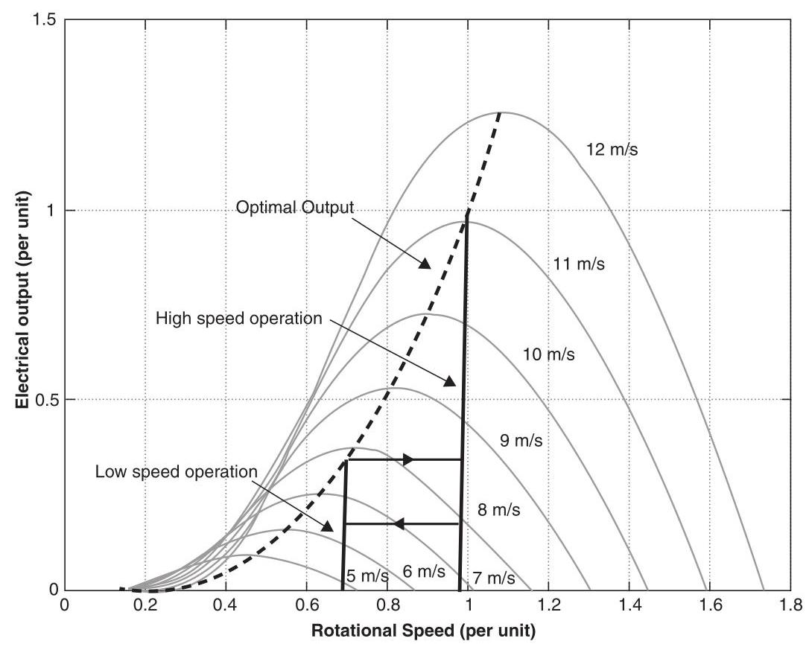

Figure 6.17 Locus of operation of two speed wind turbine

(and back) is much easier with rotor pitch control as the rotor speed can be controlled easily during the transitions.

Some disadvantages of two speed operation are as follows:

- Additional generator cost.

- Extra switchgear is required, which is subjected to a demanding duty in terms of frequency of operation.

- Control of turbine speed is required during each speed change.

- Energy is lost while the generator is disconnected during each speed change.

#### 6.9.2 Variable slip operation (see also Chapter 8, Section 8.3.8)

Variable slip represents a compromise between fixed and variable speed operation (Pedersen, 1995). The variable slip generator is an induction generator with a variable resistor in series with the rotor circuit, controlled by a high frequency semiconductor switch. Below rated torque or power the external resistor is short-circuited and the generator acts as a conventional fixed speed induction machine. Above rated torque, however, varying the resistance allows the generator torque to be controlled and the generator speed to increase, so the behaviour is then similar to a variable speed system. A speed increase of up to about ${10}\%$ is typical.

This arrangement is cheaper than a variable speed system, and gives some of the advantages, in particular the control of torque in the drive train and the smoothing of aerodynamic torque variations above rated power. It does not offer increased aerodynamic efficiency below rated (although it does not suffer from frequency converter losses), and it does not allow any control of the power factor. Electrical flicker will, however, be reduced above rated power as the power output is smoothed.

The entire power circuit of the generator rotor can be mounted on the shaft including the variable resistors and electronic control switch (Heier, 2006). This avoids the use of slip rings carrying the rotor current. The signal controlling the power electronic switch is transmitted to the rotating shaft using a non-contact optical device.

An advantage of mounting the resistors externally connected via slip rings is that it is then easier to dissipate the extra heat which is generated above rated, and which may otherwise be a limiting factor with large generators.

#### 6.9.3 Variable speed operation

By interposing a frequency conversion between the generator (which may be synchronous or induction type) and the network, it is possible to decouple the rotational speed of the generator and turbine from the network frequency. As well as allowing the rotor speed to vary and so maximise energy capture, the generator air-gap torque may be controlled and mechanical loads reduced. An alternative approach to varying the speed of a synchronous or induction electrical machine is to use a wound rotor induction generator, as with variable slip, and replace the external resistors in the rotor circuit with a frequency converter. This is known as the Doubly Fed Induction Generator (DFIG) and has become widely used.

Variable speed operation has a number of advantages:

- Below rated wind speed, the rotor torque and, hence, speed can be made to vary to maintain peak aerodynamic efficiency $\left( {Cp}\right)$ .

- The reduced rotor speed in low winds results in a significant reduction in aerodynamically generated acoustic noise. Noise is especially important in low winds, where ambient wind noise is less effective at masking the turbine noise.

- The rotor can act as a flywheel, smoothing out aerodynamic torque fluctuations before they enter the drive train. This is particularly important at the blade passing frequency.

- Direct control of the air-gap torque allows gearbox torque variations above the mean rated level to be kept small.

- Both active and reactive power can be controlled, so that either any particular power factor can be maintained or the terminal voltage controlled. In principle, it is possible to use a variable speed wind farm as a source of reactive power to compensate for the poor power factor of other consumers on the network. For large wind farms, it is much easier to meet the Grid Code requirements of the Transmission System Operators with variable speed wind turbines than with fixed speed turbines.

- Variable speed turbines will also give higher power (voltage) quality due to the smoother output power they develop. The use of power electronic converters to connect the generators gradually to the network minimises electrical transients on connection.

In practice, losses in the frequency converters may be several per cent of their rated power, counteracting the increased aerodynamic efficiency below rated wind speed. The load reduction possibilities, however, mean that most large MW-scale turbines now are variable speed. Variations in aerodynamic torque at blade passing frequency are particularly significant in larger turbines, because of the size of the rotor compared to the lateral and vertical length scales of turbulence, and these are not translated into output power variations in variable speed turbines. The turbine control system is tuned to allow the aerodynamic power variations to be absorbed as slight changes in rotational speed, that is, as variations in kinetic energy.

There is a significant cost associated with the variable speed equipment, which must be weighed against the advantages. Other drawbacks include increased complexity and the generation of electrical noise and harmonics by the inverter system. Modern Pulse Width Modulated (PWM) inverters operating at high switching frequency using Insulated Gate Bipolar Transistors (IGBTs) produce much lower levels of lower order undesirable harmonics (e.g. fifth, seventh, eleventh, thirteenth etc.) than earlier, naturally commutated designs that used Thyristors. Electrical noise can be a problem for control signals within the turbine if insufficient care is taken to shield cables. Fibre optic transmission is increasingly being used, and this is not affected by induced currents from adjacent cables.

There are two principal methods of achieving variable speed operation. In 'broad range' or 'full power conversion' (FPC) variable speed, the generator stator is connected to the network via two fully rated frequency converters. In 'narrow range' variable speed using a Doubly Fed Induction Generator (DFIG) both the generator stator and rotor are connected to the network, the stator directly, and the rotor through slip rings and smaller frequency converters.

Broad range variable speed allows the speed to vary from close to zero to the full rated speed, but all the power of the wind turbine has to pass through the two frequency converters. Narrow range variable speed uses smaller, cheaper frequency converters, since only a fraction of the power passes through them, but the speed can only vary by a more limited amount, typically 20-40%, either side of synchronous speed. ${}^{1}$ In practice, this is enough to achieve almost all the advantages of variable speed operation. A disadvantage is the need to use a wound rotor induction machine with a small air-gap and the maintenance requirements of the slip rings.

In both broad and narrow speed range wind turbines, the frequency conversion is made by two back-back voltage source converters connected through a direct current (DC) link. These rectify the power into the DC link and then invert it to network frequency or to feed the generator. This rectification into direct current and inversion isolates the network frequency from either the generator speed, in the case of broad range, or the rotor frequency in the case of a DFIG wind turbine. In both cases the control system works by measuring the generator rotational speed and applying the torque required to keep the aerodynamic rotor at optimum tip speed ratio over a wide a range of wind speeds.

Figure 6.18 shows the control objective of a variable speed wind turbine. The rotor speed is measured and, once cut-in speed is reached, a torque is applied by the variable speed generator to stay close to the optimum curve (O-A). At maximum rotational speed (point A), this is maintained by the converter until the blades are pitched to control incoming power.

Figure 6.19 (a-e) shows the commonly used wind turbine generator systems.

- Figure 6.19 (a) shows a fixed speed (squirrel cage) induction generator with shunt capacitors to improve the output power factor. These capacitors may be switched to provide more reactive power as the wind power increases.

---

${}^{1}$ Synchronous speed is fixed by the frequency of the network (50 or ${60}\mathrm{\;{Hz}}$ ) and the number of magnetic poles of the generator construction

---

Figure 6.18 Control objective of a variable speed wind turbine. (See also Figure 8.3, Chapter 8)

- Similar power factor correction capacitors are connected to the stator of the wound rotor induction machine in Figure 6.19 (b). However the rotor circuit has additional rotor resistance controlled by a Pulse Width Modulated (PWM) switch to give variable slip operation.

- In Figure 6.19 (c) the controllable rotor resistance is replaced by back-back voltage source converters (using Insulated Gate Bipolar Transistors - IGBT) to connect the rotor to the network. This gives variable speed operation over a restricted speed range depending on the direction of power flow in the rotor circuit. Although there are switching losses in the converters, this arrangement avoids energy being dissipated in an external rotor resistance. Control of the generator speed and power factor is by the rotor side converter while the network side converter maintains the DC link voltage. The crow-bar circuit is to protect the generator side converter when faults occur on the AC network and to assist in ensuring continuous operation of the wind turbine during these faults.

- All the power from the generator (that may be synchronous or induction type) is rectified to DC in the arrangement of Figure 6.19 (d). Again control of the generator torque (and hence speed) and excitation is by the machine side converter while the network side converter maintains the DC link voltage. The network side converter can be used to control the network voltage or reactive power flow into the network.

- An alternative arrangement is shown in Figure 6.19 (e) with the network side converter controlling the output power of the generator (and hence the wind turbine speed) while the machine side is a simple diode rectifier followed by a DC:DC voltage converter. The generator must then be of the synchronous type, either wound rotor or permanent magnet, but the diode rectifier has lower losses than a controllable IGBT converter.

#### 6.9.4 Other approaches to variable speed operation

There are other possible approaches to variable speed operation, although none of these has found wide-spread commercial application. They include:

Figure 6.19 Wind turbine architectures. (a) Fixed speed induction generator. (b) Variable slip generator. (c) Doubly fed induction generator. (d) Full power converter wind turbine. (e) Full power converter wind turbine (diode rectifier). (Anaya Lara, 2009)

- Use of a differential gearbox, with the third shaft controlled by a variable speed electric motor/generator (Law et al., 1984; Burton et al., 1990) or by a hydraulic pump/motor (Henderson et al., 1990).

- Mechanical continuously variable transmission systems such as have been developed for automotive applications.

### 6.10 Type of generator

Fixed speed wind turbines differ from almost all conventional generating plant by using induction rather than synchronous generators. This choice is driven by the need for significant torsional compliance and extraction of damping energy in the drive train due to the cyclic variations in the torque developed by the aerodynamic rotor.

Both synchronous and induction generators have similar winding arrangements on the stator which, when connected to the three-phase network voltage, produce a fixed speed, rotating magnetic field. However, the rotors of the two machines are quite different (Hind-marsh, 1984; McPherson, 1990). A synchronous machine has magnets mounted on its rotor and the rotor magnetic field then locks into that produced by the stator leading to operation at synchronous speed. For large scale power generation applications, electro-magnets are used on the rotor excited by an externally applied direct current. Although the rotor operates at the same speed as the stator magnetic field it leads the stator field by an angle depending on the applied torque. In contrast the rotor of a conventional induction machine has a 'squirrel cage' winding into which currents are induced as the rotor bars cut the magnetic field produced by the stator. Hence, an induction generator can only develop torque at a rotational speed slightly greater than that of the stator field. This 'slip speed' is proportional to the applied torque.

Therefore, to a first approximation, the behaviour of a synchronous machine may be considered to be analogous to a torsional spring. The torque is proportional to the angle between the rotor and the stator field. This angle is known as the load or power angle. In contrast an induction generator can be thought of as a torsional damper where the torque is proportional to the difference in speed between the rotor and the stator field (the slip speed). This is illustrated in simple schematic form in Figure 6.20. It may be seen that if the simple model of a fixed speed wind turbine, equipped with a synchronous generator, is excited by the cyclic torque from the wind turbine rotor then there is no damping energy extracted by the drive train to control the torsional oscillations. It is a simple two spring, two mass system. In contrast, with an induction generator, the connection of the generator to the network is represented by a torsional damper. The main cyclic torque of the wind turbine rotor will be at blade passing frequency and it is an unfortunate coincidence that this often matches quite closely the natural frequency of oscillation of a small synchronous generator connected to an electrical distribution network.

In practice, synchronous generators are often fitted with cage damper windings but it is not practical to provide the degree of damping required for wind turbine applications. Also at higher ratings (above, say, 1 MW) second order effects tend to reduce the damping energy that can be extracted by an induction generators (Saad-Saoud and Jenkins, 1999). However, the basic principle remains that the damping energy extracted from the drive train by induction generators is necessary for operation of fixed speed wind turbines.

In contrast, the generator of a variable speed wind turbine is not connected directly to the network but is de-coupled through the DC link of the frequency converters. Hence either synchronous or induction generators may be used with full power conversion variable speed systems.

#### 6.10.1 Historical attempts to use synchronous generators

All large hydro, fossil fired or nuclear power stations use synchronous generators. Induction generators are much less useful than synchronous generators for large-scale power generation.